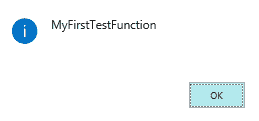
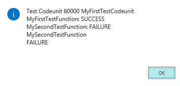
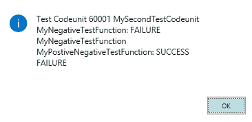
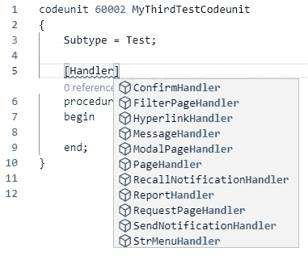
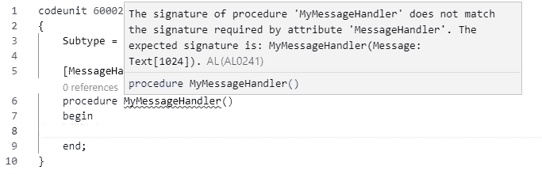
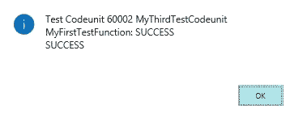
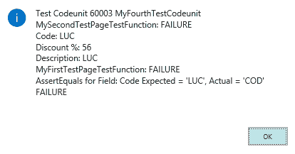
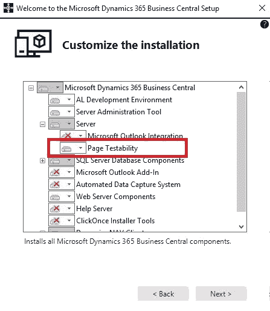

# 第三章：可测试性框架

在 Dynamics NAV 2009 Service Pack 1 中，微软在平台中引入了可测试性框架。这使得开发人员能够使用 C/AL 编写测试脚本，运行所谓的**无头测试**；即不使用**用户界面**（**UI**）来执行业务逻辑的测试。这是对一个名为**NAV 测试框架**（**NTF**）的内部工具的跟进，已经使用并开发了几年。它允许用 C# 编写测试，并针对 Dynamics NAV UI 进行测试。这是一个非常精巧的系统，背后有着精巧的技术概念。然而，*通过 UI 运行测试*是放弃 NTF 的主要原因之一。我似乎记得，主要原因是通过 UI 访问业务逻辑太慢——太慢了。太慢了，以至于无法让微软 Dynamics NAV 开发团队在合理的时间内运行所有版本的测试。如今，微软支持五个主要版本（NAV 2015、NAV 2016、NAV 2017、NAV 2018 和 Business Central），并且每个国家版本每天至少会构建和测试一次。测试的任何延迟都会对这 100 个版本的构建产生巨大影响。

在本章中，我们将探讨我所称的可测试性框架的五个支柱。这五个构成该框架的技术特性如下：

+   测试代码单元和测试函数

+   断言错误

+   处理函数

+   测试运行器和测试隔离

+   测试页面

# 测试可测试性框架的五个支柱

在接下来的五个部分中，每个*支柱*将被讨论，并通过一个简单的代码示例进行说明。你可以随时亲自尝试。不过，作为一本实践性很强的书，我们稍后将会有更多相关的例子。

代码示例可以在 GitHub 上找到，链接是：[`github.com/PacktPublishing/Automated-Testing-in-Microsoft-Dynamics-365-Business-Central`](https://github.com/PacktPublishing/Automated-Testing-in-Microsoft-Dynamics-365-Business-Central)。

关于如何使用这个仓库以及如何设置 VS Code 的详细信息，请参阅附录 B，*设置 VS Code 并使用 GitHub 项目*。

# 支柱 1 – 测试代码单元和测试函数

目标：了解什么是测试代码单元和测试函数，并学习如何构建和应用它们。

可测试性框架最重要的支柱是测试代码单元和测试函数的概念。

# 测试代码单元

测试代码单元通过其`Subtype`来定义：

```
codeunit Id MyFirstTestCodeunit
{
    Subtype = Test;
}
```

这与标准的代码单元有几方面不同：

+   它可以包含所谓的测试和处理函数，以及我们在编写应用程序代码时通常使用的常规函数。

+   执行测试代码单元时，平台将执行以下操作：

    +   运行`OnRun`触发器以及每个测试函数，该函数位于测试代码单元中，从上到下执行

    +   记录每个测试函数的结果

# 测试函数

`Test` 函数由 `FunctionType` 标签定义：

```
[Test]
procedure MyFirstTestFunction()
begin

end;
```

这使得它与标准函数不同：

+   它必须是全局的

+   它不能有参数

+   它会返回一个结果，结果是 `SUCCESS` 或 `FAILURE`

当 `SUCCESS` 被返回时，意味着测试执行过程中没有发生错误。因此，当 `FAILURE` 被返回时，测试执行确实发生了错误。此错误可能由多种原因引起，例如以下情况：

+   代码执行触发了 `TestField`、`FieldError` 或 `Error` 调用

+   由于版本冲突、主键冲突或锁定，数据修改未能完成

后者，返回 `FAILURE` 的 `Test` 函数，将我们带到了测试代码单元的另一个典型特征——当一个测试失败时，测试代码单元的执行并不会停止。它会继续执行下一个 `Test` 函数。

让我们构建两个简单的测试，一个返回 `SUCCESS`，另一个返回 `FAILURE`：

```
codeunit 60000 MyFirstTestCodeunit
 {
     Subtype = Test;

     [Test]
     procedure MyFirstTestFunction()
     begin
         Message('MyFirstTestFunction');
     end;

     [Test]
     procedure MySecondTestFunction()
     begin
         Error('MySecondTestFunction');
     end;
 }
```

现在你可以运行它们了。

由于测试函数是从上到下执行的，`MyFirstTestFunction` 抛出的消息将首先显示以下截图：



之后，显示以下消息，作为整个测试代码单元执行的总结消息：



注意，错误并未以消息框的形式出现，而是被平台收集并记录为失败测试结果的一部分。

为了能够运行测试代码单元，我构建了一个简单的页面 `MyTestsExecutor`，其操作调用 `MyFirstTestCodeunit`：

```
page 60000 MyTestsExecutor
 {
     PageType = Card;
     ApplicationArea = All;
     UsageCategory = Tasks;
     Caption = 'My Test Executor';

     actions
     {
         area(Processing)
         {
             action(MyFirstTestCodeunit)
             {
                 Caption = 'My First Test Codeunit';
                 ToolTip = 'Executes My First Test Codeunit';
                 ApplicationArea = All;
                 Image = ExecuteBatch;
                 RunObject = codeunit MyFirstTestCodeunit;
             }
         }
     }
 }
```

如果你跟随我使用 GitHub 上的代码并且在打开 `MyTestsExecutor` 页面时遇到困难，可以使用以下任何一种方法：

+   在 `launch.json` 中将 `startupObjectType` 设置为 `Page`，将 `startupObjectId` 设置为 `60000`

+   在浏览器的地址栏中将 `?page=6000` 添加到 web 客户端 URL 中：`http://localhost:8080/BC130/?page=6000`

+   在 web 客户端中使用 *Alt* + *Q*，告诉我你想要什么，并搜索 `My Test Executor`

+   直接从 VS Code 启动页面，利用像 CRS AL 语言扩展这样的 VS Code AL 扩展

# 支柱 2 – `asserterror`

目标：理解 `asserterror` 关键字的含义，并学习如何应用它。

我们实施的大部分业务逻辑都指定了在某些条件下，用户操作或流程应该失败或停止继续执行。测试导致失败的情况与测试成功完成操作或流程同样重要。第二支柱允许我们编写测试，专注于检查是否发生错误；这是一种所谓的 **正向-负向** 或 **雨天** **路径** 测试。例如，由于未提供过账日期，过账错误，或确实无法在销售订单行上输入负数折扣百分比。为了实现这一点，`asserterror` 关键字应该应用于 `调用语句` 之前：

```
asserterror <calling statement>
```

让我们在一个新的代码单元中使用它并运行：

```
codeunit 60001 MySecondTestCodeunit
 {
     Subtype = Test;

     [Test]
     procedure MyNegativeTestFunction()
     begin
         Error('MyNegativeTestFunction');
     end;

     [Test]
     procedure MyPostiveNegativeTestFunction()
     begin
         asserterror Error('MyPostiveNegativeTestFunction');
     end;
 }
```

`MyPostiveNegativeTestFunction`函数被报告为`SUCCESS`，因此没有记录错误信息：



如果`asserterror`关键字后面的`calling statement`抛出错误，系统将继续执行后续语句。然而，如果`calling statement`没有抛出错误，`asserterror`语句将会抛出错误：

```
An error was expected inside an asserterror statement.
```

其中，`asserterror`使得测试可以继续执行下一条语句，它不会检查错误本身。正如我们稍后所看到的，是否发生了预期的结果由你来验证。如果在`asserterror`后没有验证特定的错误，任何错误都会导致测试通过。

如果成功的正负测试没有报告错误，这并不意味着错误没有发生。错误已经抛出，因此，当执行写入事务时，将会发生回滚。所有数据修改将会消失。

# 支柱 3 – 处理器函数

目标：了解什么是处理器函数，并学习如何构建和应用它们。

在我们的第一个测试代码单元示例中，`Message`语句会导致显示一个消息框。除非我们希望等待用户按下确认按钮，否则该消息框将一直存在，阻止我们的测试完全执行。为了能够进行完全自动化的测试，我们需要一种处理用户交互（如消息框、确认对话框、报告请求页面或模态页面）的方法。

为此，已设计了处理器函数，也称为**UI 处理器**。处理器函数是一种特殊类型的函数，只能在测试代码单元中创建，旨在处理代码中待测试的 UI 交互。处理器函数使我们能够完全自动化测试，而不需要真实用户进行交互。一旦发生特定的 UI 交互，并且为其提供了处理器，平台将自动调用该处理器，代替真实用户交互。

`Test`函数处理器由`FunctionType`标签定义。目前可用的值显示在下面的截图中：



每个处理器函数处理不同类型的用户交互对象，并需要不同的参数以便能与平台进行适当的交互。让 VS Code 和 AL 扩展成为你找到处理器函数正确签名的指南。以下截图展示了当你将鼠标悬停在函数名上时，`MessageHandler`的签名：



对于`MessageHandler`函数，签名是消息框显示给用户的文本。将该文本传递给`MessageHandler`使你能够确定是否触发了正确的消息。

关于每种处理程序类型的签名列表，请访问[`docs.microsoft.com/en-us/dynamics-nav/how-to--create-handler-functions`](https://docs.microsoft.com/en-us/dynamics-nav/how-to--create-handler-functions)。

所以，为了自动处理我们第一个测试代码单元中的`Message`语句，我们应该创建一个`MessageHandler`函数：

```
[MessageHandler]
 procedure MyMessageHandler(Message: Text[1024])
 begin

 end;
```

但这只是工作的一半，因为这个处理程序需要与将执行调用`Message`的测试关联起来，某种方式或另一种方式。`HandlerFunctions`标签用来完成这一点。每个处理程序函数都需要在`Test`函数中调用，并且必须作为文本添加到`HandlerFunctions`标签中。如果需要多个处理程序，这些处理程序将组成一个以逗号分隔的字符串：

```
HandlerFunctions('Handler1[,Handler2,…]'*)*
```

让我们将此应用于新代码单元中的`MyFirstTestFunction`并运行它：

```
codeunit 60002 MyThirdTestCodeunit
 {
     Subtype = Test;

     [Test]
     [HandlerFunctions('MyMessageHandler')]
     procedure MyFirstTestFunction()
     begin
         Message(MyFirstTestFunction);
     end;

     [MessageHandler]
     procedure MyMessageHandler(Message: Text[1024])
     begin

     end;
 }
```

即时显示，而不是先显示消息框，整个测试代码单元执行的简要信息会直接展示：



你添加到`HandlerFunctions`标签中的任何处理程序函数，必须至少在`Test`函数中被调用一次。如果该处理程序没有被调用，因为它应处理的用户交互没有发生，平台将抛出一个错误，提示：*以下 UI 处理程序未执行*，并列出未被调用的处理程序。

# 支柱 4 – 测试运行器和测试隔离

目标：理解什么是测试运行器及其测试隔离，并学习如何使用和应用它们。

鉴于前面的三个支柱，我们可以按照以下方式编写测试用例：

+   使用**测试代码单元**和**测试函数**

+   无论是*晴天*路径还是*雨天*路径，后者通过应用`asserterror`关键字

+   通过应用**处理程序函数**，实现完全自动化的执行，解决任何用户交互

我们还需要更多内容吗？

事实上，确实需要，因为我们需要一种方式来执行以下操作：

1.  运行存储在多个代码单元中的测试，控制它们的执行，收集并确保结果

1.  在隔离环境中运行测试，以便我们能够实现以下目标：

    +   编写事务，最终不修改我们运行测试的数据库

    +   每次重新运行测试时，都会使用相同的数据设置

这两个目标可以通过使用所谓的`TestRunner`代码单元以及特定的测试隔离来完成。测试运行器代码单元由其`Subtype`定义，隔离由其`TestIsolation`定义：

```
codeunit Id MyTestRunnerCodeunit
 {
     Subtype = TestRunner;
     TestIsolation = Codeunit;
 }
```

# 测试运行器

像其他代码单元一样，测试运行器代码单元可以有一个`OnRun`触发器和正常的用户定义函数，但除了这些，你还可以添加两个特定于测试运行器的触发器，分别是`OnBeforeTestRun`和`OnAfterTestRun`。当从测试运行器的`OnRun`触发器调用测试代码单元时，`OnBeforeTestRun`和`OnAfterTestRun`将由系统如下触发：

+   `OnBeforeTestRun`：这是在调用测试代码单元之前触发的，测试代码单元的`OnRun`触发器被执行，并且每个测试函数也会运行

+   `OnAfterTestRun`：此触发器在每个测试函数运行完并且测试代码单元完成后触发。

使用`OnBeforeTestRun`触发器来执行测试运行前初始化，并控制整个测试代码单元和单个测试函数的执行。后者可以通过使用`OnBeforeTestRun`触发器的布尔返回值来实现。返回`TRUE`时，测试代码单元或测试函数将运行；返回`FALSE`时，则跳过。

使用`OnAfterTestRun`触发器执行后处理操作，例如记录每个测试的结果。当`OnAfterTestRun`触发器运行时，我们到目前为止看到的标准结果消息框将不会显示。

`OnBeforeTestRun`和`OnAfterTestRun`都在它们各自的数据库事务中运行。这意味着通过每个触发器对数据库所做的更改将在执行完成后提交。

进一步的阅读可以在以下链接找到：

`OnBeforeTestRun`：[`docs.microsoft.com/en-us/dynamics365/business-central/dev-itpro/developer/triggers/devenv-trigger-onbeforetestrun`](https://docs.microsoft.com/en-us/dynamics365/business-central/dev-itpro/developer/triggers/devenv-trigger-onbeforetestrun) [](https://docs.microsoft.com/en-us/dynamics365/business-central/dev-itpro/developer/triggers/devenv-trigger-onbeforetestrun) [`OnAfterTestRun`：](https://docs.microsoft.com/en-us/dynamics365/business-central/dev-itpro/developer/triggers/devenv-trigger-onbeforetestrun)[`docs.microsoft.com/en-us/dynamics365/business-central/dev-itpro/developer/triggers/devenv-trigger-onaftertestrun`](https://docs.microsoft.com/en-us/dynamics365/business-central/dev-itpro/developer/triggers/devenv-trigger-onaftertestrun)

# 测试隔离

通过一个测试运行器使我们能够控制所有测试的执行，我们还需要控制在一个测试代码单元中创建的数据，以免影响下一个测试代码单元中的测试结果。为此，引入了测试代码单元的`TestIsolation`属性，该属性有三个可能的值：

+   `Disabled`：选择此值时，或者未显式设置`TestIsolation`属性时（因为这是默认值），任何数据库事务将被执行；在测试运行器触发的测试执行后，数据库将发生变化，和运行测试前相比。

+   `Codeunit`：选择此值时，当测试代码单元执行完成后，所有对数据库所做的数据更改将被还原/回滚。

+   `Function`：选择此值时，当单个测试函数完成后，所有对数据库所做的数据更改将被还原/回滚。

与此相关，分享一些关于运行测试及其隔离性的想法是有意义的：

1.  测试隔离适用于数据库事务，但不适用于数据库外部的更改以及包括临时表在内的变量。

1.  使用测试隔离、`Codeunit`或`Function`时，**所有**数据更改将被回滚，即使它们已经通过 AL `Commit`语句显式提交。

1.  在测试隔离之外运行测试代码单元，无论是`Codeunit`还是`Function`的测试运行器都会执行任何数据库事务。

1.  使用测试隔离时，`Function`将比`Codeunit`带来额外的开销，导致执行时间更长，因为每个测试函数结束时，数据库的更改必须被回滚。

1.  将测试隔离设置为`Function`可能不合适，因为它完全禁用了测试函数之间的依赖关系，而这些依赖关系在扩展的测试场景中可能是需要的，尤其是当中间结果需要被报告时，这可以通过一系列相互独立但相互依赖的测试函数来实现。

1.  使用测试运行器的`TestIsolation`属性，我们可以以通用方式控制如何回滚数据更改；正如我们稍后会看到的，测试函数`TransactionModel`标签允许我们控制单个测试函数的事务行为。

# 支柱 5 – 测试页面

目标：了解什么是测试页面，并学习如何在测试 UI 时应用它们。

添加可测试性框架到平台的初衷是避免通过 UI 测试业务逻辑。可测试性框架使得无头测试（从而更快的测试）业务逻辑成为可能。这就是测试可用性框架在 NAV 2009 SP1 中的实现方式：纯无头测试。它包括了迄今为止讨论的四个支柱的所有内容，尽管测试隔离的实现方式与今天有所不同。此前无法测试 UI。

随着进展，逐渐清楚仅使用无头测试排除了太多内容。我们如何测试通常存在于页面上的业务逻辑呢？例如，考虑一个产品配置器，其中根据用户输入的值显示或隐藏选项。因此，在 NAV 2013 中，微软为可测试性框架添加了第五个支柱：测试页面。

测试页面是页面的逻辑表示形式，严格处理在内存中，不显示 UI。要定义测试页面，你需要声明一个`TestPage`类型的变量：

```
PaymentTerms: TestPage "Payment Terms";
```

`TestPage`变量可以基于解决方案中存在的任何页面。

测试页面允许你模拟用户执行以下操作：

+   访问页面

+   访问其子部分

+   在其上读取和更改数据

+   对其进行操作

你可以通过使用属于测试页面对象的各种方法来实现这一点。让我们构建一个小的代码单元，在其中使用其中的一些方法：

```
codeunit 60003 MyFourthTestCodeunit
 {
     Subtype = Test;

     [Test]
     procedure MyFirstTestPageTestFunction()
     var
         PaymentTerms: TestPage "Payment Terms";
     begin
         PaymentTerms.OpenView();
         PaymentTerms.Last();
         PaymentTerms.Code.AssertEquals('LUC');
         PaymentTerms.Close();
     end;

     [Test]
     procedure MySecondTestPageTestFunction()
     var
         PaymentTerms: TestPage "Payment Terms";
     begin
         PaymentTerms.OpenNew();
         PaymentTerms.Code.SetValue('LUC');
         PaymentTerms."Discount %".SetValue('56');
         PaymentTerms.Description.SetValue(
                 PaymentTerms.Code.Value()
             );
         ERROR('Code: %1 \ Discount %: %2 \Description: %3',
                 PaymentTerms.Code.Value(),
                 PaymentTerms."Discount %".Value(),
                 PaymentTerms.Description.Value()
             );
         PaymentTerms.Close();
     end;
 }
```

请注意，强制出现错误以便获取一些关于测试代码单元的简历消息中的有用反馈。

因此，我们得到了以下结果：



要查看所有测试页面方法的完整列表，可以访问以下网址：

**TestPage**: [`docs.microsoft.com/zh-cn/dynamics365/business-central/dev-itpro/developer/methods-auto/testpage/testpage-data-type`](https://docs.microsoft.com/zh-cn/dynamics365/business-central/dev-itpro/developer/methods-auto/testpage/testpage-data-type) [](https://docs.microsoft.com/zh-cn/dynamics365/business-central/dev-itpro/developer/methods-auto/testpage/testpage-data-type) **TestField**: [`docs.microsoft.com/zh-cn/dynamics365/business-central/dev-itpro/developer/methods-auto/testfield/testfield-data-type`](https://docs.microsoft.com/zh-cn/dynamics365/business-central/dev-itpro/developer/methods-auto/testfield/testfield-data-type) [](https://docs.microsoft.com/zh-cn/dynamics365/business-central/dev-itpro/developer/methods-auto/testfield/testfield-data-type) **TestAction**: [`docs.microsoft.com/zh-cn/dynamics365/business-central/dev-itpro/developer/methods-auto/testaction/testaction-data-type`](https://docs.microsoft.com/zh-cn/dynamics365/business-central/dev-itpro/developer/methods-auto/testaction/testaction-data-type)

如果你在本地运行 Microsoft 365 Business Central，并且希望使用测试页面进行测试，请确保已安装页面可测试性模块：



# 摘要

本章讨论了测试框架是什么，描述了它包含的五个支柱：基本元素测试代码单元和测试函数、新的代码关键字`asserterror`、允许自动处理 UI 元素的处理函数、使我们能够隔离运行测试的测试运行器，最后是构建测试以检查页面行为的测试页面。

在第三章，*测试工具和标准测试*中，你将了解 Business Central 中的测试工具，以及 Microsoft 随产品发布的标准测试集。
