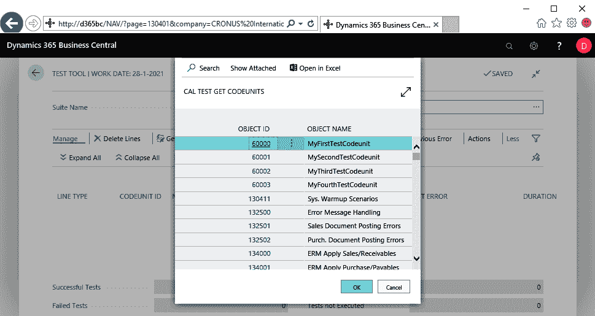

# 第四章：测试工具与标准测试

自 NAV 2009 SP1 起，提供自动化测试已成为微软在应用程序工作中的重要组成部分。通过测试性框架，他们创建了以下内容：

+   一大堆用于验证标准应用的自动化测试

+   测试工具功能，已成为标准应用的一部分

+   大量的测试辅助库

在本章中，我们将更详细地讨论这三个问题。

请注意，这些都是由微软作为单独组件提供的；也就是说，产品 DVD 和 NAV 2016 及以后版本的 Docker 镜像中包含一个 `.fob` 文件。

测试工具也可以在 Business Central 在线版中使用，但你只能获取位于 CRONUS 中的扩展测试，而无法获取标准应用的测试。要获取免费的试用版，请访问：[`dynamics.microsoft.com/en-us/business-central/overview/`](https://dynamics.microsoft.com/en-us/business-central/overview/)。

有关 Docker 使用的详情，请访问：[`docs.microsoft.com/en-us/dynamics365/business-central/dev-itpro/developer/devenv-running-container-development`](https://docs.microsoft.com/en-us/dynamics365/business-central/dev-itpro/developer/devenv-running-container-development)。

# 测试工具

目标：理解测试工具的内容，学习如何使用和应用它。

测试工具是一个标准应用功能，允许你管理和运行存储在数据库中的自动化测试，并收集其结果，无论是属于标准应用的测试代码单元，还是扩展的一部分。通过各种实际操作示例测试，我们将频繁使用这个工具。然而，在此之前，我们先详细了解一下它。

你可以通过在 Dynamics 365 Business Central 中使用**告诉我你想做什么**功能轻松访问测试工具，如下图所示：

在一个干净的数据库中，或者至少在一个尚未使用过测试工具的数据库或公司中，测试工具将如下所示。将出现一个名为 DEFAULT 的套件，其中没有任何记录，显示如下：

若要填充测试套件，请按以下步骤操作：

1.  选择**获取测试代码单元**操作。

1.  在打开的对话框中，你有以下两个选项：

    +   选择测试代码单元：这将打开一个列表页面，显示数据库中所有存在的测试代码单元，您可以从中选择特定的测试代码单元；选择并点击确定后，这些代码单元将被添加到套件中

    +   所有测试代码单元：这将把数据库中所有现有的测试代码单元添加到测试套件中

让我们选择第一个选项，选择测试代码单元。这将打开**CAL 测试获取代码单元**页面。不出所料，它显示了我们在第二章《测试性框架》中创建的四个测试代码单元，后面跟着超过 700 个标准测试代码单元的长列表：

1.  选择四个测试代码单元 60000 至 60003，然后点击 OK。

现在，套件为每个测试代码单元显示一行，LINE TYPE = Codeunit，并且与此行关联并缩进显示所有的测试函数（LINE TYPE = Function），如以下截图所示：

1.  要运行测试，请选择运行操作。

1.  在接下来弹出的对话框中，选择选项“活动代码单元”和“全部”，选择“全部”并点击 OK。现在所有四个测试代码单元将被执行，每个测试将会产生结果，成功或失败：

如果我们选择了仅“活动代码单元”选项，则仅会执行所选的代码单元。

对于每个失败，"First Error" 字段将显示导致失败的错误。如您所见，First Error 是一个 FlowField。如果深入查看，它将打开 CAL 测试结果窗口，显示特定测试的整个测试运行历史。

请注意，`MyFirstTestCodeunit` 中的消息对话框会产生一个 `Unhandled UI` 错误。

选择运行后，标准测试运行器代码单元 `CAL Test Runner`（130400）将被调用，并确保以下事项发生：

+   从测试工具运行的测试将会在独立模式下运行

+   每个测试函数的结果将被记录

在这段简短的测试工具概述中，我们使用了以下功能：

+   获取测试代码单元

+   创建多个测试套件

在深入测试编码时，测试工具将是我们的伴侣。我们将在那里使用它的各种其他功能，包括以下内容：

+   运行所选测试

+   深入查看测试结果

+   引用调用栈

+   清除结果

+   测试覆盖率图

关于本地安装：测试工具可以通过终端用户许可证访问并执行。从 2017 年秋季开始，已经启用了此功能。

# 标准测试

目标：了解微软提供的标准测试基础。

自 NAV 2016 起，微软将他们自己的应用测试资料作为产品的一部分提供。大量的测试以 `.fob` 文件的形式提供在产品 DVD 中的 `TestToolKit` 文件夹中，亦可在 Docker 镜像中找到。实际上，这些测试尚未作为扩展交付。

标准测试套件主要包含测试代码单元。但在 `.fob` 文件中也包含了一些支持的表、页面、报告和 XMLport 对象。

对于 Dynamics 365 Business Central，整个测试集包含几乎 23,000 个测试，分布在 700 多个测试代码单元中，涵盖了每个微软发布的国家/地区的 w1 和本地功能。随着每个 bug 的修复和每个新功能的引入，测试数量不断增长。它在过去十年间逐步构建，涵盖了 Business Central 的所有功能领域。

让我们在测试工具中设置一个名为 **ALL W1** 的新套件：

1.  在套件名称控制中点击助手编辑按钮

1.  在 CAL 测试套件弹出窗口中选择“新建”

1.  填充名称和描述字段

1.  点击“确定”

打开新创建的测试套件：

现在，使用“获取测试代码单元”操作，让 Business Central 提取所有标准测试代码单元，如下截图所示。请注意，我已删除了我们测试代码单元 60000 至 60003：

阅读所有测试代码单元的名称会让你对它们的内容有一个初步了解，以下是一些示例：

+   **企业资源管理**（**ERM**）和**供应链管理**（**SCM**）代码单元：

    +   这两个类别包含了将近 450 个代码单元，构成了标准测试资料的主要部分

    +   ERM 测试代码单元涵盖了总账、销售、采购和库存

    +   SCM 测试代码单元涵盖了仓库和生产

+   除了 ERM 和 SCM 外，还可以注意到其他几个类别，其中最大的有：

    +   服务（大约 50 个测试代码单元）

    +   O365 集成（大约 35 个）

    +   作业（大约 25 个）

    +   市场营销（大约 15 个）

这些测试代码单元大多包含功能性、端到端的测试。但也有一些代码单元包含**单元测试**（**UT**）。这些代码单元的名称中会加上“Unit Test”字样。以下是一些示例：

+   `Codeunit 134155 - ERM 表字段 UT`

+   `Codeunit 134164 - 公司初始化 UT II`

+   `Codeunit 134825 - UT 客户表`

由于无头测试是将可测试性框架引入平台的初始触发因素，因此标准测试代码单元中绝大多数都是无头测试。旨在测试**用户界面**（**UI**）的测试代码单元会在名称中标注`UI`或`UX`。以下是一些示例：

+   `Codeunit 134280 - 简单数据交换 UI UT`

+   `Codeunit 134339 - UI 工作流事实框`

+   `Codeunit 134711 - 自动付款登记.UX`

+   `Codeunit 134927 - ERM 预算 UI`

请注意，这些并不是唯一的 UI 测试代码单元。其他的代码单元也可能包含一个或多个 UI 测试，其中一般来说，大多数仍然是无头测试。

由于我经常被问及如何测试报告，值得一提的是，作为最后一类，我们有专门用于测试报告的测试代码单元。搜索名称中标有`Report`字样的测试代码单元，你会找到 50 个以上的例子。以下是几个示例：

+   `Codeunit 134063 - ERM Intrastat 报告`

+   `Codeunit 136311 - 作业报告 II`

+   `Codeunit 137351 - SCM 库存报告 – IV`

# 按特性分类

通过检查标准测试代码单元的名称，我们对这些测试的内容有了一些初步的了解。然而，微软有一个更为结构化的分类方式，至今由于优先级较低，还没有明确与外界分享。随着自动化测试越来越多地被采用，微软现在面临着将此提升为更高优先级的压力。但目前为止，我们仍然可以在大多数测试代码单元中访问到它。你需要查找`FEATURE`标签。这个标签是**验收测试驱动开发**（**ATDD**）测试用例设计模式的一部分，我们将在第四章中讨论，*测试设计*。通过使用`[FEATURE]`标签，微软对其测试代码单元进行分类，在某些情况下，也会对单个测试函数进行分类。请注意，这个标记还远未完成，因为并非所有的测试代码单元都有它。

看一下以下代码单元的（部分）摘要：

+   `代码单元 134000 - ERM 应用销售/应收款`:

    +   `OnRun`:

        +   `[FEATURE] [销售]`

    +   `[测试] 程序 VerifyAmountApplToExtDocNoWhenSetValue`:

        +   `[FEATURE] [应用程序] [现金收款]`

    +   `[测试] 程序 PmtJnlApplToInvWithNoDimDiscountAndDefDimErr`:

        +   `[FEATURE] [维度] [付款折扣]`

+   `代码单元 134012 - ERM 提醒 应用/撤销`:

    +   `OnRun`:

        +   `[FEATURE] [提醒] [销售]`

    +   `[测试] 程序 CustomerLedgerEntryFactboxReminderPage`:

        +   `[FEATURE] [用户界面]`

在后续章节中，我们将更详细地研究各种标准测试函数。你将看到如何将它们作为自己编写测试的示例（第四章，*测试设计*，第五章，*从客户需求到测试自动化 - 基础*，第六章，*从客户需求到测试自动化 - 进阶*，以及第七章，*从客户需求到测试自动化 - 更多内容*），以及如何让它们在你自己的解决方案上运行（第九章，*让 Business Central 标准测试在你的代码上运行*）。

目前，标准测试套件对象位于以下 ID 范围内：

134000 到 139999：w1 测试

144000 到 149999：本地测试

# 标准库

目标：了解微软提供的标准测试辅助库的基础知识。

为了支持标准测试，微软创建了一个非常有用的函数库，包含超过 70 个库代码单元。这些辅助函数涵盖了从随机数据生成、主数据生成到标准通用以及更具体的检查例程。

需要新项目吗？你可以使用`Library - Inventory`（代码单元 132201）中的`CreateItem`或`CreateItemWithoutVAT`辅助函数。

需要随机文本吗？使用`Library – Random`（代码单元 130440）中的`RandText`辅助函数。

想在验证测试结果时获得相同格式的错误信息吗？使用 `Assert`（codeunit 130000）中的一个辅助函数，如 `IsTrue`、`AreNotEqual` 和 `ExpectedError`。

在我的工作坊中，一个经常出现的问题是：

我怎么知道这些库中是否包含我在自己测试中需要的辅助函数？是否有一个概览列出了各种辅助函数？

不幸的是，Dynamics 365 Business Central 没有所有可用辅助函数的概览。然而，在 NAV 2018 之前，一个包含这些信息的 `.chm` 帮助文件被包含在产品 DVD 上的 `TestToolKit` 文件夹中。你可能想使用这个文件，但我总是使用一种非常简单的方法。由于我们的所有代码都存储在源代码管理系统中，我可以在标准测试对象文件夹中快速进行文件搜索。如果我需要一个能为我创建服务项的辅助函数，我可能会在该文件夹中打开 VS Code 并搜索 `CreateServiceItem`，如下图所示：

在本书的第三部分，*为 Microsoft Dynamics 365 Business Central 设计和构建自动化测试*中，构建测试时，我们将愉快地使用各种标准辅助函数，这将使我们的工作更加高效和一致。

目前，标准测试库对象位于以下 ID 范围：

130000 到 133999：w1 测试辅助库

请注意，所有测试工具对象也位于此范围的下部：

140000 到 143999：本地测试辅助库

想了解更多关于单元测试和功能测试的信息？请访问：

[`www.softwaretestinghelp.com/the-difference-between-unit-integration-and-functional-testing/`](https://www.softwaretestinghelp.com/the-difference-between-unit-integration-and-functional-testing/)

# 摘要

在本章中，我们简要讨论了什么是测试工具以及如何使用它来运行你的测试，甚至运行微软构建并提供给我们的测试集合。我们对这个庞大集合中的各种测试类别进行了简要概述。最后，我们简要介绍了包含 70 多个库的有用辅助函数，这些库可以支持你自己编写测试。

现在我们已经讨论了 Dynamics 365 Business Central 中存在的各种测试功能，我们准备开始设计和编写自己的测试了。我们将在第四章 *测试设计* 中介绍几种设计模式，以便更轻松、一致地编写测试用例。
