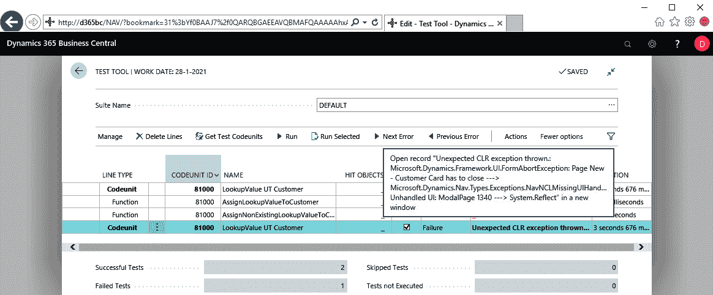

# 第六章：从客户需求到测试自动化 - 基础

我们从技术上已经完全准备好开始编写测试。这是因为我们了解测试框架的运作方式，知道测试工具包，了解标准测试库的存在，并且已经获得了多种模式，帮助我们设计高效且有效的测试。

但我们要测试什么呢？我们的业务案例是什么？我们将要实现的客户需求是什么？

在本章中，我们将开始应用前几章讨论的原则和技术，并将构建一些基本的自动化测试。

因此，本章涉及以下主题：

+   测试示例 1 – 第一个无头测试

+   测试示例 2 – 第一个正负测试

+   测试示例 3 – 第一个 UI 测试

+   无头与 UI

# 从客户需求到测试自动化

我们的客户希望扩展标准的 Dynamics 365 Business Central，增加一个基本功能：向 `Customer` 表中添加一个由用户填充的查找字段。该字段必须被传递到所有销售单据中，并且还需要包含在仓库发货中。

# 数据模型

尽管此字段的目的非常具体，我们将其通用命名为 `Lookup Value Code`。与 Business Central 中的任何其他查找字段一样，该 `Lookup Value Code` 字段将与另一个表（我们这里是一个名为 `Lookup Value` 的新表）有一个表关系（外键）。

以下关系图示意性地描述了此新功能的数据模型，其中新的表位于中间，扩展的标准表位于左右两侧：


`Lookup Value Code` 字段必须在所有表中可编辑，除了已过账的单据头表，例如：`Sales Shipment Header`、`Sales Invoice Header`、`Sales Cr.Memo Header`、`Return Receipts Header` 和 `Posted Whse. Shipment Line`。

# 业务逻辑

根据标准的 Business Central 行为，以下业务逻辑适用：

+   从客户模板创建客户时，`Lookup Value Code` 字段应从 `Customer Template` 继承到 `Customer`

+   在销售单据的 `Sell-to Customer` 字段中选择客户时，`Lookup Value Code` 字段应从 `Customer` 继承到 `Sales Header`

+   在过账销售单据时，`Lookup Value Code` 字段必须被填充

+   在过账销售单据时，`Lookup Value Code` 字段应从 `Sales Header` 继承到已过账单据的头部。也就是说，

    +   `Sales Shipment Header`

    +   `Sales Invoice Header`

    +   `Sales Cr.Memo Header`

    +   `Return Receipt Header`

+   在归档销售单据时，`Lookup Value Code` 字段应从 `Sales Header` 继承到 `Sales Header Archive`

+   在从销售订单创建仓库出货单时，`Lookup Value Code`字段应从`Sales Header`继承到`Warehouse Shipment Line`。

+   在发布仓库出货单时，`Lookup Value Code`字段应从`Warehouse Shipment Line`继承到`Posted Whse. Shipment Line`。

# LookupValue 扩展

基于这些需求，将构建`LookupValue`扩展，包括自动化测试。

# 实现一个已定义的客户需求

既然我们的客户需求已清晰定义，我们就可以开始实现它。如前一章所述，我们将*一箭双雕*，即将每个需求分解为一系列测试，目的是：

1.  **客户需求**的详细描述

1.  **应用代码**的实现

1.  **手动测试**的结构化执行

1.  **测试自动化**的编码

1.  最新的**文档**解决方案

因此，在接下来的基础测试案例示例中，以及第六章，*从客户需求到测试自动化 - 下一步*，和第七章，*从客户需求到测试自动化 - 以及更多*，我们将通过**验收测试驱动开发**（**ATDD**）模式描述*客户需求*。使用`FEATURE`、`SCENARIO`、`GIVEN`、`WHEN`和`THEN`标签，我们将讨论**应用代码**的实现，并更广泛地阐述**测试自动化**的编码。

**手动测试**和**文档**超出了本书的范围。

`LookupValue`扩展可以在 GitHub 上找到：[`github.com/PacktPublishing/Automated-Testing-in-Microsoft-Dynamics-365-Business-Central`](https://github.com/PacktPublishing/Automated-Testing-in-Microsoft-Dynamics-365-Business-Central)。这个仓库还包括一个 Excel 文件，列出了所有适用于`LookupValue`扩展的 ATDD 场景。虽然我们会选取特定场景作为示例进行详细说明，但请注意，整个场景列表是在一开始就设计好的，完整描述了客户需求的范围。

如何使用此仓库以及如何设置 VS Code 的详细信息，请参阅附录 B，*设置 VS Code 并使用 GitHub 项目*。

# 测试示例 1 - 第一个无头测试

现在，带着前几章交给我们的工具包，并且客户需求已定义，我们准备开始创建第一个自动化测试。

# 客户需求

让我们从完整客户需求的基础部分开始：在`Customer`表中扩展一个`Lookup Value Code`字段。

# 功能

我们正在通过扩展构建的功能称为`LookupValue`，而我们现在正在处理的特定部分是`Customer`表。这导致了以下`[FEATURE]`标签：

```
[FEATURE] LookupValue Customer
```

# 场景

要实现并测试的具体场景是将查找值分配给客户，因此`[SCENARIO]`标签应如下所示：

```
[SCENARIO #0001] Assign lookup value to customer
```

# GIVEN

我们需要的固定数据以便分配查找值，是一个查找值记录和一个客户记录。因此，我们需要以下两个`[GIVEN]`标签：

```
[GIVEN] A lookup value
[GIVEN] A customer
```

# WHEN

根据固定数据，我们可以在`Customer`记录上设置查找值代码，因此我们的`[WHEN]`标签可以定义如下：

```
[WHEN] Set lookup value on customer
```

# THEN

现在，测试操作已经执行过了，是时候验证结果了。查找值代码字段是否确实从我们分配给客户记录的固定数据中获取了查找值？这就导致了以下`[THEN]`标签：

```
[THEN] Customer has lookup value code field populated
```

# 完整场景

因此，完整的场景定义将允许我们稍后在创建测试代码时进行复制：

```
[FEATURE] LookupValue Customer 
[SCENARIO #0001] Assign lookup value to customer
[GIVEN] A lookup value
[GIVEN] A customer
[WHEN] Set lookup value to customer
[THEN] Customer has lookup value code field populated
```

# 应用程序代码

客户需求的第一部分，即`[SCENARIO #0001]`，定义了对`LookupValue`的需求，这是一个新表，通过该表可以通过所谓的`Lookup Value Code`字段将一个值分配给客户。这已经通过以下`.al`对象实现：

```
table 50000 "LookupValue"
{
    LookupPageId = "LookupValues";

    fields
    {
        field(1; Code; Code[10]){}
        field(2; Description; Text[50]){}
    }

    keys
    {
        key(PK; Code)
        {
            Clustered = true;
        }
    }
}
page 50000 "LookupValues"
{
    PageType = List;
    SourceTable = "LookupValue";

    layout
    {
        area(content)
        {
            repeater(RepeaterControl)
            {
                field("Code"; "Code"){}
                field("Description"; "Description"){}
            }
        }
    }
}
tableextension 50000 "CustomerTableExt" extends Customer
{
    fields
    {
        field(50000; "Lookup Value Code"; Code[10])
        {
            TableRelation = "LookupValue";
        }
    }
}
pageextension 50000 "CustomerCardPageExt" extends "Customer Card"
{
    layout
    {
        addlast(General)
        {
            field("Lookup Value Code"; "Lookup Value Code"){}
        }
    }
}
```

在应用程序代码中，已经包含了最基本的内容以节省空间。像`Caption`、`ApplicationArea`、`DataClassification`、`UsageCategory`和`ToolTip`等属性已经省略。你可以从 GitHub 下载`LookupValue`扩展以获取完整的对象。

# 测试代码

随着客户需求的第一部分已经明确，我们有了一个整洁的结构来开始编写我们的第一个测试。

# 需要采取的步骤

以下是需要采取的步骤：

1.  创建一个以`[FEATURE]`标签为基础命名的测试代码单元

1.  将客户需求嵌入到基于`[SCENARIO]`标签命名的测试函数中

1.  基于`[GIVEN]`、`[WHEN]`和`[THEN]`标签编写你的测试故事

1.  编写你的实际代码

# 创建一个测试代码单元

使用`[FEATURE]`标签命名时，我们的代码单元的基本结构将是这样的：

```
codeunit 81000 "LookupValue UT Customer"
{
    Subtype = Test;

    //[FEATURE] LookupValue UT Customer
}
```

正如你所看到的，添加到`[FEATURE]`标签的 UT 代表单元测试，标明这些测试是单元测试而非功能测试。

作为一个简单的开始：`LookupValue`扩展中的代码单元 81000 已经存在于 GitHub 上。

# 将客户需求嵌入到测试函数中

现在，我们基于`SCENARIO`描述创建一个测试函数，并在此函数中嵌入客户需求，`GIVEN`-`WHEN`-`THEN`。

我称之为“嵌入*绿色*”，即在你开始编写*黑色*的`.al`测试代码之前，先写下被注释掉的`GIVEN`-`WHEN`-`THEN`语句。看看现在代码单元已经变成了什么样：

```
codeunit 81000 "LookupValue UT Customer"
 {
     Subtype = Test;

     //[FEATURE] LookupValue UT Customer

     [Test]
     procedure AssignLookupValueToCustomer()
     begin
         //[SCENARIO #0001] Assign lookup value to customer
         //[GIVEN] A lookup value
         //[GIVEN] A customer
         //[WHEN] Set lookup value on customer
         //[THEN] Customer has lookup value code field populated
     end;
 }
```

# 编写你的测试故事

对我来说，编写第一个*黑色*部分是写伪英语，定义我通过测试需要实现的目标。这使得任何非技术背景的项目成员都能读懂我的测试，如果我需要他们的支持，他们阅读测试的门槛比直接开始写*真实*代码时低得多。而且，或许更有力的论据是——我的代码将嵌入到可复用的辅助函数中。

那么，我们开始吧，让我们编写*黑色*部分：

```
codeunit 81000 "LookupValue UT Customer"
 {
     Subtype = Test;

     //[FEATURE] LookupValue UT Customer

     [Test]
     procedure AssignLookupValueToCustomer()
     begin
         //[SCENARIO #0001] Assign lookup value to customer
         //[GIVEN] A lookup value
         CreateLookupValueCode();
         //[GIVEN] A customer
         CreateCustomer();

         //[WHEN] Set lookup value on customer
         SetLookupValueOnCustomer();

         //[THEN] Customer has lookup value code field populated
         VerifyLookupValueOnCustomer();
     end;
 }
```

在这个故事中，我设计了四个没有参数和返回值的辅助函数。这些将在下一步中定义。

请注意，辅助函数的名称与它所属标签的描述有多么接近。

# 构建实际代码

如果你是开发人员，直到目前为止，我可能一直在用伪代码挑战你，虽然没有真正的代码，只有一个结构。现在，准备好迎接真正的部分吧，我希望你和你的同事们将来也能在未来编写的测试中做到同样的事情。

在检查我们的第一个测试函数时，我已经得出结论，我需要以下四个辅助函数：

1.  `CreateLookupValueCode`

1.  `CreateCustomer`

1.  `SetLookupValueOnCustomer`

1.  `VerifyLookupValueOnCustomer`

让我们构建并讨论这些。

# CreateLookupValueCode

`CreateLookupValueCode`是一个多用途的可重用辅助函数，用于创建一个伪随机的`LookupValue`记录，如下所示。在后续阶段，我们可以将其提升为一个待创建的库代码单元：

```
local procedure CreateLookupValueCode(): Code[10]
var
    LookupValue: Record LookupValue;
begin
    with LookupValue do begin
        Init();
        Validate(
            Code,
            LibraryUtility.GenerateRandomCode(FIELDNO(Code),
            Database::LookupValue));
        Validate(Description, Code);
        Insert();
        exit(Code);
   end;
end;
```

为了填充`PK`字段，我们利用标准测试库`Library - Utility`中的`GenerateRandomCode`函数，代码单元 131000。`LibraryUtility`变量将像 Microsoft 在他们的测试代码单元中做的那样全局声明，使其可以在其他辅助函数中重用。

伪随机意味着，每当我们的测试在相同上下文中执行时，`GenerateRandomCode`函数将产生相同的值，从而有助于测试的可重复性。

`Description`字段的值与`Code`字段相同，因为`Description`的具体值没有意义，这样做是最有效的。

我将在我的辅助函数中非常频繁地使用`with…do`结构；这使得辅助函数可以轻松地在相似的场景中重用，但只需要更新记录变量（以及它所引用的表），即可应用到其他表。

# CreateCustomer

使用标准库代码单元`Library - Sales`中的`CreateCustomer`函数，代码单元 130509，我们的`CreateCustomer`函数创建了一个可用的客户记录，并使这个辅助函数成为一个直接的练习：

```
local procedure CreateCustomer(var Customer: record Customer)
begin
    LibrarySales.CreateCustomer(Customer);
end;
```

和之前的`LibraryUtility`变量一样，我们将全局声明`LibrarySales`变量。

你可能会想，为什么我们要创建一个只有一行语句的辅助函数。如前所述，使用辅助函数可以使测试对非技术同事可读，同时使其可重用。它还使其更具可维护性/扩展性。如果我们需要对由`Library - Sales`代码单元中的`CreateCustomer`函数创建的客户记录进行更新，我们只需要将更新添加到我们的本地`CreateCustomer`函数中。

一般来说，我从不直接在测试函数中调用库函数。这有一些例外，我们稍后会看到。

# SetLookupValueOnCustomer

看一下`SetLookupValueOnCustomer`的实现：

```
local procedure SetLookupValueOnCustomer(var Customer: record Customer;
    LookupValueCode: Code[10])
begin
    with Customer do begin
        Validate("Lookup Value Code", LookupValueCode);
        Modify();
    end;
end;
```

在这里调用`Validate`是至关重要的。`SetLookupValueOnCustomer`不仅仅是将值分配给`Lookup Value Code`字段，还确保该值会与`LookupValue`表中已有的值进行验证。请注意，下面的`Lookup Value Code`字段的`OnValidate`触发器没有包含代码。

# VerifyLookupValueOnCustomer

如第四章《*测试设计*》中提到的，*没有验证的测试根本不是测试*，我们需要验证分配给客户记录中`Lookup Value Code`字段的查找值代码，确实是`Lookup Value`表中创建的值。因此，我们从数据库中检索记录，如下所示：

```
local procedure VerifyLookupValueOnCustomer(CustomerNo: Code[20];
    LookupValueCode: Code[10])
var
    Customer: Record Customer;
    FieldOnTableTxt: Label '%1 on %2';
begin
    with Customer do begin
        Get(CustomerNo);
        Assert.AreEqual(
            LookupValueCode,
            "Lookup Value Code",
            StrSubstNo(
                FieldOnTableTxt
                FieldCaption("Lookup Value Code"),
                TableCaption())
            );
    end;
end;
```

为了验证预期值（第一个参数）和实际值（第二个参数）是否相等，我们使用标准库代码单元`Assert`中的`AreEqual`函数，130000。当然，我们也可以使用`Error`系统函数构建自己的验证逻辑，而`AreEqual`正是这么做的。看看这个：

```
[External] procedure AreEqual(Expected: Variant;Actual: Variant;Msg: Text)
 begin
     if not Equal(Expected,Actual) then
         Error(
             AreEqualFailedMsg, 
             Expected, 
             TypeNameOf(Expected), 
             Actual, 
             TypeNameOf(Actual), 
             Msg)
 end;
```

通过使用`AreEqual`函数，我们确保在预期值和实际值不相等时会收到标准化的错误信息。随着时间的推移，通过阅读任何失败测试的错误，其中验证辅助函数使用了`Assert`库，您将能够轻松识别发生了哪种错误。

我们完整的测试代码单元将如下所示，准备执行。注意添加到测试代码单元和函数中的变量和参数：

```
codeunit 81000 "LookupValue UT Customer"
{
    Subtype = Test;
    var
        Assert: Codeunit Assert;
        LibraryUtility: Codeunit "Library - Utility";
        LibrarySales: Codeunit "Library - Sales";

    //[FEATURE] LookupValue UT Customer

    [Test]
    procedure AssignLookupValueToCustomer()
    var
        Customer: Record Customer;
        LookupValueCode: Code[10];
    begin
        //[SCENARIO #0001] Assign lookup value to customer
        //[GIVEN] A lookup value
        LookupValueCode := CreateLookupValueCode();
        //[GIVEN] A customer
        CreateCustomer(Customer);

        //[WHEN] Setlookup value on customer
        SetLookupValueOnCustomer(Customer, LookupValueCode);

        //[THEN] Customer has lookup value code field populated
        VerifyLookupValueOnCustomer(
            Customer."No.",
            LookupValueCode);
    end;

    local procedure CreateLookupValueCode(): Code[10]
    var
        LookupValue: Record LookupValue;
    begin
        with LookupValue do begin
            Init();
            Validate(
                Code,
                LibraryUtility.GenerateRandomCode(FIELDNO(Code),
                Database::LookupValue));
                Validate(Description, Code);
            Insert();
            exit(Code);
        end;
    end;

    local procedure CreateCustomer(var Customer: record Customer)
    begin
        LibrarySales.CreateCustomer(Customer);
    end;

    local procedure SetLookupValueOnCustomer(
        var Customer: record Customer; LookupValueCode: Code[10])
    begin
        with Customer do begin
            Validate("Lookup Value Code", LookupValueCode);
            Modify();
        end;
    end;

    local procedure VerifyLookupValueOnCustomer(
        CustomerNo: Code[20]; LookupValueCode: Code[10])
    var
        Customer: Record Customer;
        FieldOnTableTxt: Label '%1 on %2';
    begin
        with Customer do begin
            Get(CustomerNo);
            Assert.AreEqual(
                LookupValueCode,
                "Lookup Value Code",
                StrSubstNo(
                    FieldOnTableTxt,
                    FieldCaption("Lookup Value Code"),
                    TableCaption())
                );
        end;
    end;
}
```

# 测试执行

现在我们准备好进行第一次测试，可以将`LookupValue`扩展部署到我们的 Dynamics 365 Business Central 安装中。如果我们将测试工具页面设置为`launch.json`中的启动对象，我们可以立即将我们的测试代码单元添加到`DEFAULT`套件中，如下所示：

```
"startupObjectType": "Page",
 "startupObjectId": 130401
```

通过选择“运行”操作来运行测试，将显示它成功执行。


恭喜，我们已经实现了第一个成功的测试，如上面的截图所示！

# 测试测试

在我的工作坊期间，一些怀疑的声音会挑战我，让我问：“确实，测试结果是成功的，但我怎么知道成功是真正的成功？我如何测试测试？”

您有以下两种方式来测试它：

+   测试创建的数据

+   调整测试，使验证出现错误

# 测试创建的数据

创建数据的测试可以通过两种方式进行：

1.  在没有测试隔离的情况下运行测试，并查看`Customer`表。发现一个新客户已创建，且`Lookup Value Code`字段已填充，当然，还在`Lookup Value`表中创建了相关记录。

1.  调试您的测试，并使用 SQL Server Management Studio 在`Customer`和`Lookup Value`表上运行 SQL 查询。确保您读取的是未提交的数据，在测试完成之前找到相同的记录。

后者是我更喜欢的方法，因为它使得可以在隔离的环境中运行测试，从而不会不可逆转地更改数据库。它还允许我们看到正在创建的数据。

请注意，第二个选项“调试你的测试并运行 SQL 查询”仅在本地或容器化安装的 Dynamics 365 Business Central 中可用。

# 调整测试，使验证出现错误

这可能是最简单和最可靠的选项：通过提供另一个期望结果值来确保验证失败。例如，在我们的测试中，可以使用你自己的名字：

```
//[THEN] Customer has lookup value code field populated
 VerifyLookupValueOnCustomer(
     Customer."No.",
     'LUC');
```

如下截图所示，测试确实在验证部分失败：


抛出的错误告诉我们，期望值是`LUC`，而实际值是`GU00000000`：

```
Assert.AreEqual failed. Expected:<LUC> (Text). Actual:<GU00000000> (Text). Lookup Value Code on Customer.
```

如前所述，First Error 是一个 FlowField，你可以深入了解它。它将打开 CAL 测试结果窗口，显示特定测试的完整运行历史记录。正如下一个截图所示，在当前测试的情况下，它显示了我们迄今为止对`AssignLookupValueToCustomer`执行的两次测试结果：


请注意，如下图所示，测试工具窗口中的“清除结果”功能不会对测试运行历史产生影响，它仅清除在测试工具窗口中显示的结果：


# 测试示例 2 —— 第一个正负测试

这个测试示例与新的客户需求和新的应用程序代码无关，而是补充我们的第一个测试。它是相同客户需求的“雨天路径”版本，导致了新的场景：

```
[FEATURE] LookupValue UT Customer [SCENARIO #0002] Assign non-existing lookup value to customer
[GIVEN] A non-existing lookup value
[GIVEN] A customer
[WHEN] Set non-existing lookup value on customer
[THEN] Non existing lookup value error thrown
```

# 测试代码

让我们重新使用应用于测试示例 1 的配方。

# 需要采取的步骤

你可能已经记得，以下是需要采取的步骤：

1.  创建一个测试代码单元，名称应基于`[FEATURE]`标签

1.  将客户需求嵌入到测试函数中，名称应基于`[SCENARIO]`标签

1.  根据`[GIVEN]`、`[WHEN]`和`[THEN]`标签编写测试故事

1.  构造你的实际代码

# 创建一个测试代码单元

与测试示例 1 共享相同的`[FEATURE]`标签值，我们的新测试用例将共享相同的测试代码单元，即代码单元 81000 `LookupValue UT Customer`。

# 将客户需求嵌入到测试函数中

*嵌入绿色*结果将导致代码单元 81000 中以下新的测试函数：

```
procedure AssignNonExistingLookupValueToCustomer()
begin
    //[SCENARIO #0002] Assign non-existing lookup value to
    //                 customer
    //[GIVEN] A non-existing lookup value
    //[GIVEN] A customer
    //[WHEN] Set non-existing lookup value on customer
    //[THEN] Non existing lookup value error thrown
end;
```

# 编写你的测试故事

填写第一个*黑色*“故事元素”会导致以下典型选择：

+   创建一个不存在的查找值只需提供一个在`Lookup Value`表中没有相关记录的字符串常量。

+   为了将此值分配给客户的`Lookup Value Code`字段，我们不需要数据库中的客户记录。一个本地变量足以触发我们希望发生的错误。

+   可以通过使用测试示例 1 中的`SetLookupValueOnCustomer`来设置客户的查找值。

结果，*测试故事* 比我们之前的测试有更多细节：

```
procedure AssignNonExistingLookupValueToCustomer()
var
    Customer: Record Customer;
    LookupValueCode: Code[10];
begin
    //[SCENARIO #0002] Assign non-existing lookup value to
    //                 customer
    //[GIVEN] A non-existing lookup value
    LookupValueCode := 'SC #0002';
    //[GIVEN] A customer record variable
    // See local variable Customer

    //[WHEN] Set non-existing lookup value on customer
    asserterror SetLookupValueOnCustomer(
                    Customer,
                    LookupValueCode);

    //[THEN] Non existing lookup value error thrown
    VerifyNonExistingLookupValueError(LookupValueCode);
end;
```

# 构建实际代码

重用 `SetLookupValueOnCustomer` 函数，我们只需要创建一个新的辅助函数。

# VerifyNonExistingLookupValueError

就像我们在第一个验证函数中一样，我们使用了来自标准库代码单元 `Assert`（130000）中的 `ExpectedError` 函数。我们只需要向 `ExpectedError` 提供预期的错误文本。实际的错误将通过 `ExpectedError` 使用 `GetLastErrorText` 系统函数来获取，如下所示：

```
local procedure VerifyNonExistingLookupValueError(
                    LookupValueCode: Code[10])
var
    Customer: Record Customer;
    LookupValue: Record LookupValue;
    ValueCannotBeFoundInTableTxt: Label
            'The field %1 of table %2 contains a value (%3) that
             cannot be found in the related table (%4).';
begin
    with Customer do
        Assert.ExpectedError(
            StrSubstNo(
                ValueCannotBeFoundInTableTxt 
                FieldCaption("Lookup Value Code"),
                TableCaption(),
                LookupValueCode,
                LookupValue.TableCaption()));
end;
```

注意如何通过结合使用 `StrSubstNo` 系统方法和 `ValueCannotBeFoundInTableTxt` 标签来构造预期的错误文本。

# 测试执行

让我们重新部署我们的扩展，并通过选择操作 | 函数 | 获取测试方法，将第二个测试添加到测试工具中。获取测试方法将通过将所有当前的测试函数作为行添加到测试工具中来更新选定的测试代码单元。请注意，结果列将被清空。现在，运行测试代码单元并查看两个测试都成功了：


# 测试 测试

如何验证 *成功是真正的成功*？我们可以像在测试示例 1 中那样通过为测试用例的验证函数提供不同的预期值来做到这一点。所以让我们来做吧。

# 调整测试使验证出错

让我们以与测试示例 1 类似的方式调整验证：

```
//[THEN] Non existing lookup value error thrown
 VerifyNonExistingLookupValueError('LUC');
```

输出显示在以下截图中：


抛出的错误告诉我们预期值是 `LUC`，而实际值是 `SC #0002`，如下所示：

```
Assert.ExpectedError failed.
 Expected: The field Lookup Value Code of table Customer contains a value (LUC) that cannot be found in the related table (Lookup Value)..
 Actual: The field Lookup Value Code of table Customer contains a value (SC #0002) that cannot be found in the related table (Lookup Value)..
```

# 移除 asserterror

在雨路径场景中，我们通常使用 `asserterror` 来包裹 `[WHEN]` 部分以捕获错误，但我们还有另一种方法来 *测试测试*：通过移除 `asserterror` 并再次运行测试。现在，你将看到真正的错误：

```
The field Lookup Value Code of table Customer contains a value (SC #0002) that cannot be found in the related table (Lookup Value).
```

该错误消息允许我们在 .al 中构建文本标签来构造预期的错误。

在测试示例 2 中，由于我们没有从数据库中检索客户记录，因此 `SetLookupValueOnCustomer` 中的 `Modify` 严格来说是不可能的。然而，`Validate` 抛出的错误将阻止 `Modify` 被调用。

测试示例 2 基于以下假设：在 `Customer` 表的 `Lookup Value Code` 字段上设置的 `TableRelation` 使用该字段上 `ValidateTableRelation` 属性的默认设置。

# 测试示例 3 – 第一个 UI 测试

`Lookup Value Code` 字段已在 `Customer` 表上实现并经过测试。但当然，为了让用户管理它，必须使其在 UI 中可访问。因此，它需要被放置在 `Customer Card` 上。

# 客户愿望

客户需求的下一个阶段非常接近由 `[SCENARIO #0001]` 定义的上一部分。主要的区别是我们现在希望通过 UI 元素 `Customer Card` 来访问客户。通过模拟最终用户，我们的场景描述了创建一个新的 `Customer Card`（见第二个 `[GIVEN]`）。请看一下：

```
[FEATURE] LookupValue UT Customer
[SCENARIO #0003] Assign lookup value on customer card
[GIVEN] A lookup value
[GIVEN] A customer card
[WHEN] Set lookup value on customer card
[THEN] Customer has lookup value code field populated
```

# 应用程序代码

基于客户需求的最后一个新增部分，`Customer Card` 需要按照以下 `.al` 对象扩展 `Lookup Value Code` 字段：

```
pageextension 50000 "CustomerCardPageExt" extends "Customer Card"
{
    layout
    {
        addlast(General)
        {
            field("Lookup Value Code"; "Lookup Value Code"){}
        }
    }
}
```

# 测试代码

接下来，让我们一步步实现我们的 *如何实现测试代码* 配方。

# 创建测试代码单元

再次，使用与我们之前测试相同的 `[FEATURE]` 标签值，我们可以将新的测试用例放入相同的测试代码单元中，即代码单元 81000 `LookupValue UT Customer`。

# 将客户需求嵌入到测试函数中

将 *绿色* 部分封装成一个新的测试函数，并放入代码单元 81000 中，如下所示：

```
[Test]
procedure AssignLookupValueToCustomerCard()
begin
    //[SCENARIO #0003] Assign lookup value on customer card
    //[GIVEN] A lookup value
    //[GIVEN] A customer card
    //[WHEN] Set lookup value on customer card
    //[THEN] Customer has lookup value field populated
end;
```

# 编写测试用例

新的测试用例版本与测试示例 1 平行，可以是：

```
[Test]
procedure AssignLookupValueToCustomerCard()
begin
    //[SCENARIO #0003] Assign lookup value on customer card
    //[GIVEN] A lookup value
    CreateLookupValueCode();
    //[GIVEN] A customer card
    CreateCustomerCard();

    //[WHEN] Set lookup value on customer card
    SetLookupValueOnCustomerCard();

    //[THEN] Customer has lookup value field populated
    VerifyLookupValueOnCustomer();
end;
```

添加变量和参数后，代码变为：

```
[Test]
procedure AssignLookupValueToCustomerCard()
var
    CustomerCard: TestPage "Customer Card";
    CustomerNo: Code[20];
    LookupValueCode: Code[10];
begin
    //[SCENARIO #0003] Assign lookup value on customer card
    //[GIVEN] A lookup value
    LookupValueCode := CreateLookupValueCode();
    //[GIVEN] A customer card
    CreateCustomerCard(CustomerCard);

    //[WHEN] Set lookup value on customer card
    CustomerNo := SetLookupValueOnCustomerCard(
                    CustomerCard,
                    LookupValueCode);

    //[THEN] Customer has lookup value field populated
    VerifyLookupValueOnCustomer(CustomerNo, LookupValueCode);
end;
```

在自动化测试中访问 UI，我们需要使用第五个支柱：`TestPage`。如您在我们测试函数 `AssignLookupValueToCustomerCard` 的特定情况下所看到的，测试页面对象是基于 `Customer Card` 页面。

# 构建实际代码

我们可以利用已经存在的辅助函数 `CreateLookupValueCode` 和 `VerifyLookupValueOnCustomer`，但我们还需要构建以下两个新的辅助函数：

1.  `CreateCustomerCard`

1.  `SetLookupValueOnCustomerCard`

# CreateCustomerCard

要创建一个新的客户卡，我们只需调用任何可编辑 `TestPage` 都有的 `OpenNew` 方法：

```
local procedure CreateCustomerCard(
                   var CustomerCard: TestPage "Customer Card")
begin
    CustomerCard.OpenNew();
end;
```

# SetLookupValueOnCustomerCard

使用控件方法 `SetValue` 设置 `Lookup Value Code` 字段的值：

```
local procedure SetLookupValueOnCustomerCard(
                   var CustomerCard: TestPage "Customer Card";
                   LookupValueCode: Code[10]) CustomerNo: Code[20]
begin
    with CustomerCard do begin
        "Lookup Value Code".SetValue(LookupValueCode);
        CustomerNo := "No.".Value();
        Close();
    end;
end;
```

由于 `SetValue` 模拟了用户设置值的操作，因此它会触发字段的验证。如果输入了一个不存在的值，它会根据我们在测试示例 2 中测试过的 `Lookup Value` 表中的现有记录验证该值。为了检索 `No.` 字段的值，我们使用控件方法 `Value`。我们确实需要关闭页面以触发系统，保存更改到数据库中的记录。

请注意，`Value` 有双重用途。它可以用于获取或设置字段（控件）的值。使用 `Value` 设置值与使用 `SetValue` 设置值的区别在于，`Value` 总是将一个字符串作为参数，而 `SetValue` 的参数应与字段（控件）的数据类型相同。

我们已经几乎准备好运行新的测试了。然而，`SetLookupValueOnCustomerCard` 辅助函数有一个主要的失败点。它会正常工作，但它没有考虑到我认为的一个设计缺陷：`SetLookupValueOnCustomerCard` 即使在“查找值代码”字段不可编辑时也会成功运行。`SetValue` 和 `Value` 都没有对此进行检查。因为我们测试的目的是检查用户是否可以设置“查找值代码”字段，我们需要添加一个小的验证，来判断该字段是否可编辑。因此，`SetLookupValueOnCustomerCard` 函数需要更新为以下内容，使用 `Assert` 代码单元中的另一个函数 `IsTrue`：

```
local procedure SetLookupValueOnCustomerCard(
                   var CustomerCard: TestPage "Customer Card";
                   LookupValueCode: Code[10]) CustomerNo: Code[20]
begin
    with CustomerCard do begin
        Assert.IsTrue("Lookup Value Code".Editable(), 'Editable');
        "Lookup Value Code".SetValue(LookupValueCode);
        CustomerNo := "No.".Value();
        Close();
    end;
end;
```

请注意，当我们尝试将 `Value` 和 `SetValue` 应用到一个不可见字段时，它们都会报错。

# 测试执行

让我们再次重新部署扩展，使用“获取测试方法”功能添加新的测试函数，并运行测试。请查看下一个截图：



糟糕，发生了一个错误。错误？让我们读一下并尝试理解：

```
Unexpected CLR exception thrown.: Microsoft.Dynamics.Framework.UI. FormAbortException: Page New - Customer Card has to close ---> Microsoft. Dynamics.Nav.Types.Exceptions.NavNCLMissingUIHandlerException: Unhandled UI: ModalPage 1340 ---> System.Reflect
```

我必须承认，每次看到那些技术性 CLR 异常抛出的消息时，我总是有点紧张，但我已经学会了扫描与我所知相关的内容。这里有两点：

+   `NavNCLMissingUIHandlerException`

+   `Unhandled UI: ModalPage 1340`

显然，存在一个 `ModalPage` 实例没有被我们的测试处理。更具体地说，是页面 1340 被模态调用但没有处理。页面 1340？它是“配置模板”页面，当你要创建新客户时会弹出，如截图所示：


所以，我们需要构建一个 `ModalPageHandler` 并将其链接到我们的第三个测试：

```
[ModalPageHandler]
 procedure HandleConfigTemplates(
             var ConfigTemplates: TestPage "Config Templates")
 begin
     ConfigTemplates.OK.Invoke();
 end;
```

将 `HandlerFunctions` 标签设置为与 `ModalPageHandler` 相关的测试函数：

```
[Test]
[HandlerFunctions('HandleConfigTemplates')]
procedure AssignLookupValueToCustomerCard()
```

现在测试成功运行。

# 测试测试

让我们*测试测试*并验证它是否是一个好的测试。

# 调整测试，使验证出错

一种经过验证的方法可以通过与我们在测试示例 1 中所做的完全相同的方式实现。

在这条注释旁边，我们在代码中添加了另一个验证：

```
Assert.IsTrue("Lookup Value Code".Editable(), 'Editable');
```

将 `IsTrue` 改为 `IsFalse`。你会看到测试失败，因为“查找值代码”字段是可编辑的。`IsTrue` 验证确保当“查找值代码”字段变为不可编辑时，测试会失败。

# 无头模式与 UI

如前所述，无头测试是自动化测试的首选模式，因为它比 UI 测试更快。在测试示例 1 和 3 中，我们实现了相同类型的测试：检查查找值是否可以分配给客户。测试示例 1 使用无头模式，而测试示例 3 使用 UI。运行这两个测试确实表明 UI 测试比无头测试慢。看看执行时长（以秒为单位）的图表。


UI 测试的平均执行时间为 1.35 秒，而无头模式的平均执行时间几乎快了 7 倍：0.20 秒。

# 总结

在本章中，我们将构建我们的第一个自动化测试。我们利用 ATDD 测试用例模式来设计每个测试，并将其作为我们*四步法食谱*的基础结构，用来创建测试单元，嵌入客户需求到测试中，编写测试故事，最后构建实际代码。

在下一章，我们将继续使用 ATDD 和四步法食谱来创建一些更高级的测试。
