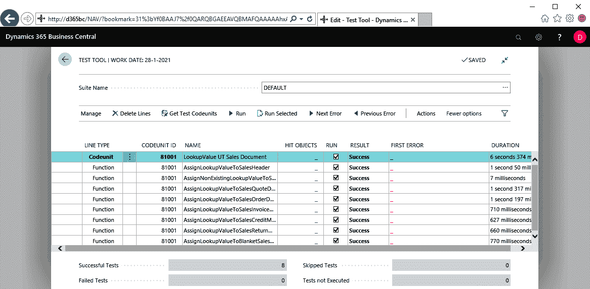
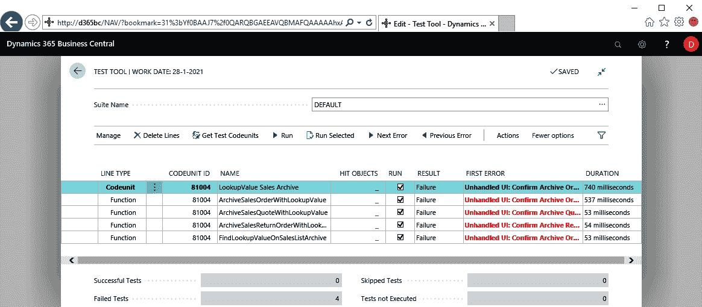
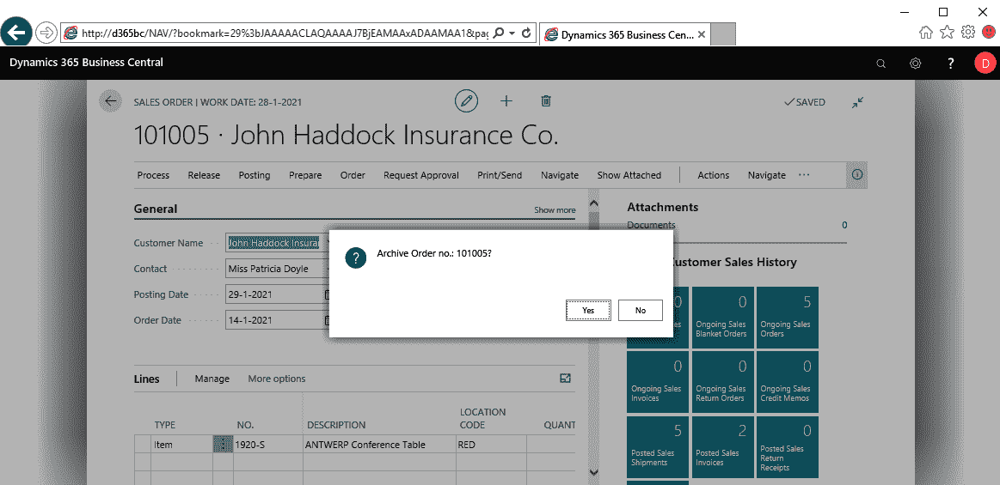
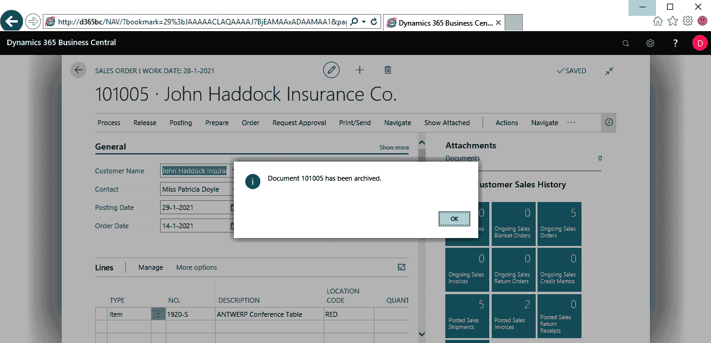
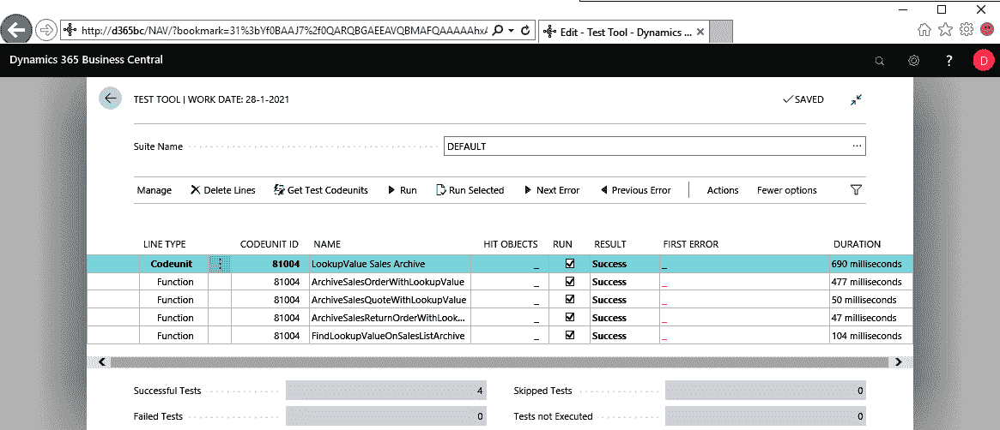
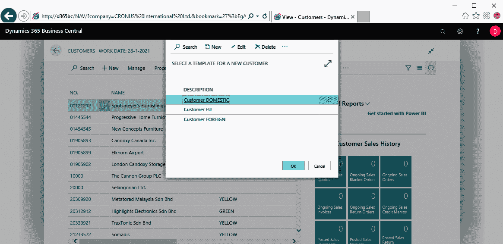
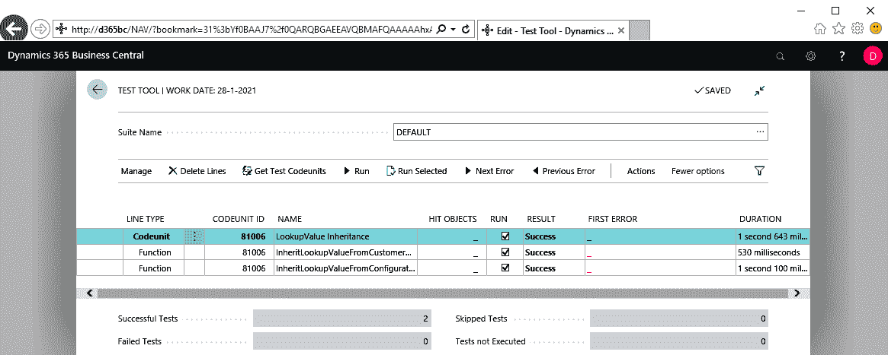
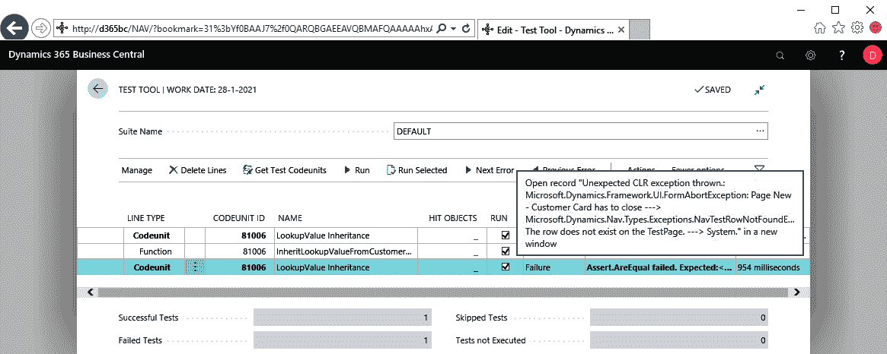

# 从客户需求到测试自动化——下一步

在上一章中，我们构建了我们在 Dynamics 365 Business Central 中的第一个基础测试自动化。我们查看了三个简单的示例，展示了如何应用**验收测试驱动开发**（**ATDD**）测试用例模式，并使用我们的*4 步法*将客户需求转化为应用程序和测试代码。在本章中，我们将使用相同的方法论创建更多的测试，这些测试：

+   使用共享固定设施

+   是参数化的

+   将变量交给 UI 处理器

# 销售文档、客户模板和仓库发货

在第五章《从客户需求到测试自动化——基础》中的三个例子中，我们将`Lookup Value Code`字段添加到`Customer`表中。 然而，这只是客户需求的一部分，因为它明确描述了……

"……这个字段必须传递到所有销售文档，并且同时需要包含在仓库发货中。"

因此，在深入以下测试示例之前，需要注意的是，在`Customer`表上实现`Lookup Value Code`字段的同时，必须在`Sales Header`表、`Customer Template`表、`Warehouse Shipment Line`表以及所有相关页面上实现相同的字段。ATDD 测试用例描述非常相似，应用程序和测试代码也是如此。复制和粘贴——任何 Business Central 开发人员的伟大美德。

让我们看看客户模板的 ATDD 测试用例描述是什么样的：

```
[SCENARIO #0012] Assign lookup value to customer template
[GIVEN] A lookup value
[GIVEN] A customer template
[WHEN] Set lookup value on customer template
[THEN] Customer template has lookup value code field populate
[SCENARIO #0013] Assign non-existing lookup value to customer template
[GIVEN] A non-existing lookup value
[GIVEN] A customer template record variable
[WHEN] Set non-existing lookup value to customer template
[THEN] Non existing lookup value error was thrown
[SCENARIO #0014] Assign lookup value on customer template card
[GIVEN] A lookup value
[GIVEN] A customer template card
[WHEN] Set lookup value on customer template card
[THEN] Customer template has lookup value code field populated
```

你是否看到了与场景`#0001`、`#0002`和`#0003`的相似性？

在 GitHub 上，你将找到完整的 ATDD 场景列表和完整的测试代码。

# 测试示例 4——如何设置共享固定设施

虽然没有明确提到，但我们为前面三个测试每个都创建了一个*全新的固定设施*，根据`[GIVEN]`标签定义，为每个创建了一个查找值记录和一个客户记录。然而，为了提高速度，确实有必要考虑你是否需要为每个测试创建一个全新的固定设施，还是可以为一组测试使用共享固定设施。就`#0001`和`#0003`这两个场景而言，我们完全可以使用相同的`LookupValueCode`，不需要为每个测试创建新的查找值记录。

# 客户需求

让我们使用客户需求中要求所有销售文档都具有`Lookup Value Code`字段的部分，来说明如何实现共享的固定设施。这将归结为以下八个场景，省略`GIVEN`-`WHEN`-`THEN`部分以节省空间：

```
[SCENARIO #0004] Assign lookup value to sales header
[SCENARIO #0005] Assign non-existing lookup value on sales header
[SCENARIO #0006] Assign lookup value on sales quote document page
[SCENARIO #0007] Assign lookup value on sales order document
                 page
[SCENARIO #0008] Assign lookup value on sales invoice document
                 page
[SCENARIO #0009] Assign lookup value on sales credit memo document
                 page
[SCENARIO #0010] Assign lookup value on sales return order
                 document page
[SCENARIO #0011] Assign lookup value on blanket sales order
                 document page
```

在第五章《从客户需求到测试自动化——基础》还历历在目时，你可能会注意到，场景`#0001`和`#0004`非常相似。场景`#0003`和`#0006`至`#0011`也是如此。因此，所有这些场景都共享以下相同的`[GIVEN]`部分：

```
 [GIVEN] A lookup value
```

对这个需求的直接实现将导致创建七次查找值记录。因此，我们将采取懒汉式的共享夹具模式或懒惰设置模式。

# 应用程序代码

这部分客户需求导致了`销售头`中的`Lookup Value Code`字段的实现，并在每个销售文档页面上创建了该字段的页面控制。

下一个代码片段实现了`销售头`表的扩展，也就是场景`#0004`和`#0005`：

```
tableextension 50001 "SalesHeaderTableExt" extends "Sales Header"
{
    fields
    {
        field(50000; "Lookup Value Code"; Code[10])
        {
            Caption = 'Lookup Value Code';
            DataClassification = ToBeClassified;
            TableRelation = "LookupValue";
        }
    }
}
```

此外，以下代码块将实现`销售订单`页面的扩展（参见场景`#0007`）：

```
pageextension 50002 "SalesOrderPageExt" extends "Sales Order" 
{
    layout
    {
        addlast(General)
        {
            field("Lookup Value Code"; "Lookup Value Code")
            {
                 ToolTip = 'Specifies the lookup value the
                                 transaction is done for.';
                 ApplicationArea = All;
            }
        }
    }
}
```

场景`#0006`、`#0008`、`#0009`、`#0010`和`#0011`会以类似的方式扩展`销售报价`、`销售发票`、`销售贷项通知单`、`销售退货订单`和`长期销售订单`文档页面。

# 测试代码

通过一些大的步骤，我们将为场景`#0004`、`#0006`和`#0007`创建测试代码，其余场景`#0005`、`#0008`、`#0009`、`#0010`和`#0011`留给你在 GitHub 上复习。

# 创建一个测试代码单元

```
codeunit 81001 "LookupValue UT Sales Document"
{
    Subtype = Test;
    //[FEATURE] LookupValue UT Sales Document
}
```

# 将客户需求嵌入到测试函数中

将三个场景`#0004`、`#0006`和`#0007`嵌入到测试函数中后，我们的新测试代码单元如下所示：

```
codeunit 81001 "LookupValue UT Sales Document"
{
    Subtype = Test;

    //[FEATURE] LookupValue UT Sales Document

    [Test]
    procedure AssignLookupValueToSalesHeader()
    begin
        //[SCENARIO #0004] Assign lookup value to sales header
        //                 page
        //[GIVEN] A lookup value
        //[GIVEN] A sales header
        //[WHEN] Set lookup value on sales header
        //[THEN] Sales header has lookup value code field
        //       populated
    end;

    [Test]
    procedure AssignLookupValueToSalesQuoteDocument()
    begin
        //[SCENARIO #0006] Assign lookup value on sales quote
        //                 document page
        //[GIVEN] A lookup value
        //[GIVEN] A sales quote document page
        //[WHEN] Set lookup value on sales quote document
        //[THEN] Sales quote has lookup value code field populated
    end;

    [Test]
    procedure AssignLookupValueToSalesOrderDocument()
    begin
        //[SCENARIO #0007] Assign lookup value on sales order
        //                 document page
        //[GIVEN] A lookup value
        //[GIVEN] A sales order document page
        //[WHEN] Set lookup value on sales order document
        //[THEN] Sales order has lookup value code field populated
    end;
}
```

# 编写测试故事

现在结构已明确，我们可以选择场景`#0007`来创建更多细节：

```
codeunit 81001 "LookupValue UT Sales Document"
{
    Subtype = Test;

    //[FEATURE] LookupValue UT Sales Document

    [Test]
    procedure AssignLookupValueToSalesOrderDocument()
    begin
        //[SCENARIO #0007] Assign lookup value on sales order
        //                 document page
        //[GIVEN] A lookup value
        CreateLookupValueCode();
        //[GIVEN] A sales order document page
        CreateSalesOrderDocument();
        //[WHEN] Set lookup value on sales order document
        SetLookupValueOnSalesOrderDocument();
        //[THEN] Sales order has lookup value code field populated
        VerifyLookupValueOnSalesHeader();
    end;
}
```

那么，我们如何设置共享的夹具呢？我们通过使用`Initialize`函数来实现，如第四章《测试设计》中所介绍的。这将把`AssignLookupValueToSalesOrderDocument`改为如下：

```
[Test]
procedure AssignLookupValueToSalesOrderDocument()
begin
    //[SCENARIO #0007] Assign lookup value on sales order
    //                 document page
    //[GIVEN] A lookup value
    Initialize();
    //[GIVEN] A sales order document page
    CreateSalesOrderDocument();
    //[WHEN] Set lookup value on sales order document
    SetLookupValueOnSalesOrderDocument();
    //[THEN] Sales order has lookup value code field populated
    VerifyLookupValueOnSalesHeader();
end;
```

# 构建实际代码

让我们构建一个简单的`Initialize`：

```
local procedure Initialize()
begin
    if isInitialized then
        exit;

    LookupValueCode := CreateLookupValueCode();

    isInitialized := true;
    Commit();
end;
```

在这里，`isInitialized`和`LookupValueCode`分别是`Boolean`和`Code[10]`数据类型的全局变量。一旦调用了`Initialize`，`isInitialized`将变为`true`，并且每次调用`Initialize`时，`if`语句都会评估为`true`，始终直接退出`Initialize`。

关于场景`#0007`，我们的测试代码单元将如下所示，包括各种变量、参数和其他辅助函数：

```
codeunit 81001 "LookupValue UT Sales Document"
{
    Subtype = Test;

    var
        Assert: Codeunit Assert;
        LibrarySales: Codeunit "Library - Sales";
        isInitialized: Boolean;
        LookupValueCode: Code[10];

    //[FEATURE] LookupValue UT Sales Document

    procedure AssignLookupValueToSalesOrderDocument()
    var
        SalesHeader: Record "Sales Header";
        SalesDocument: TestPage "Sales Order";
        DocumentNo: Code[20];
    begin
        //[SCENARIO #0007] Assign lookup value on sales order
        //                 document page
        //[GIVEN] A lookup value
        Initialize();
        //[GIVEN] A sales order document page
        CreateSalesOrderDocument(SalesDocument);
        //[WHEN] Set lookup value on sales order document
        DocumentNo := SetLookupValueOnSalesOrderDocument(
                        SalesDocument, LookupValueCode);
        //[THEN] Sales order has lookup value code field populated
        VerifyLookupValueOnSalesHeader(
                SalesHeader."Document Type"::Order,
                DocumentNo,
                LookupValueCode);
    end;

    local procedure Initialize()
    begin
        if isInitialized then
            exit;

        LookupValueCode := CreateLookupValueCode();

        isInitialized := true;
        Commit();
    end;

    local procedure CreateLookupValueCode(): Code[10]
    begin
        //for implementation see test example 1; this smells like
        //duplication ;-)
    end;

    local procedure CreateSalesOrderDocument(
                        var SalesDocument: TestPage "Sales Order")
    begin
        SalesDocument.OpenNew();
    end;

    local procedure SetLookupValueOnSalesOrderDocument(
                        var SalesDocument: TestPage "Sales Order";
                        LookupValueCode: Code[10])
                            DocumentNo: Code[20]
    begin
        with SalesDocument do begin
            //for rest of implementation see test example 1 
        end;
    end;

    local procedure VerifyLookupValueOnSalesHeader(
                        DocumentType: Option Quote,Order,Invoice,
                                    "Credit Memo","Blanket Order",
                                    "Return Order";
                        DocumentNo: Code[20];
                        LookupValueCode: Code[10])
    var
        SalesHeader: Record "Sales Header";
        FieldOnTableTxt: Label '%1 on %2';
    begin
        with SalesHeader do begin
            Get(DocumentType, DocumentNo);
            //for rest of implementation see test example 1 
        end;
    end;
}
```

# 测试执行

运行完整的代码单元 81001 会产生一系列成功：



# 测试测试

到现在为止，我猜你已经知道该怎么做了：调整测试，使验证出现错误。试试看，或者使用 GitHub 上的完成代码作为备忘单。

# 测试示例 5——如何参数化测试

编写测试自动化，包括设计和编码，是一项相当大的工作，需要关注很多细节。然而，一旦你掌握了并且将其完成，你会享受它并从中受益。除非你在设计和编码阶段疏忽细节，导致不得不不断修复测试，否则你会更享受编写测试。如果你通过参数化测试来使测试更通用，你会更加喜欢编写测试。由于测试框架的性质，你无法直接参数化测试函数，但你可以通过将通用测试代码封装在辅助函数中来实现这一点。

# 客户需求

让我们通过另一个客户需求来说明：归档销售文档。由于 Business Central 允许用户归档销售报价单、销售订单和销售退货订单，因此我们需要将其包含在扩展中。以下是这三个场景的表达：

```
[FEATURE] LookupValue Sales Archive

[SCENARIO #0018] Archive sales order with lookup value
[GIVEN] A sales order with a lookup value
[WHEN] Sales order is archived
[THEN] Archived sales order has lookup value from sales order

[SCENARIO #0019] Archive sales quote with lookup value
[GIVEN] A sales quote with a lookup value
[WHEN] Sales quote is archived
[THEN] Archived sales quote has lookup value from sales quote

[SCENARIO #0020] Archive sales return order with lookup value
[GIVEN] A sales return order with a lookup value
[WHEN] Sales return order is archived
[THEN] Archived sales return order has lookup value from sales return order
```

# 应用代码

数据模型扩展由以下`.al`对象实现：

```
tableextension 50009 "SalesHeaderArchiveTableExt"
                            extends "Sales Header Archive"
{
    fields
    {
        field(50000; "Lookup Value Code"; Code[10])
        {
            Caption = 'Lookup Value Code';
            DataClassification = ToBeClassified;
            TableRelation = "LookupValue";
        }
    }
}
```

然后，UI 根据场景`#0019`进行了扩展。场景`#0018`和`#0020`也将非常相似：

```
pageextension 50042 "SalesQuoteArchivePageExt"
                            extends "Sales Quote Archive"
{
    layout
    {
        addlast(General)
        {
            field("Lookup Value Code"; "Lookup Value Code")
            {
                ToolTip = 'Specifies the lookup value the
                                transaction is done for.';
                ApplicationArea = All;
            }
        }
    }
}

pageextension 50045 "SalesQuoteArchivesPageExt"
                            extends "Sales Quote Archives"
{
    layout
    {
        addfirst(Control1)
        {
            field("Lookup Value Code"; "Lookup Value Code")
            {
                ToolTip = 'Specifies the lookup value the
                                transaction is done for.';
                ApplicationArea = All;
            }
        }
    }
}
```

# 测试代码

现在应用程序代码已设置好，接下来我们来看一下测试代码。

# 创建、嵌入并编写

通过“创建、嵌入和编写”这一大步骤，测试故事`#0018`、`#0019`和`#0020`可能如下所示，当它们被放入新的测试代码单元中：

```
codeunit 81004 "LookupValue Sales Archive"
{
    Subtype = Test;

    //[FEATURE] LookupValue Sales Archive

    [Test]
    procedure ArchiveSalesOrderWithLookupValue();
    begin
        //[SCENARIO #0018] Archive sales order with lookup value
        //[GIVEN] A sales order with a lookup value
        CreateSalesOrderWithLookupValue();
        //[WHEN] Sales order is archived
        ArchiveSalesOrderDocument();
        //[THEN] Archived sales order has lookup value from
        //       sales order
        VerifyLookupValueOnSalesOrderArchive();
    end;

    [Test]
    procedure ArchiveSalesQuoteWithLookupValue();
    begin
        //[SCENARIO #0019] Archive sales quote with lookup value
        //[GIVEN] A sales quote with a lookup value
        CreateSalesQuoteWithLookupValue();
        //[WHEN] Sales quote is archived
        ArchiveQuoteDocument();
        //[THEN] Archived sales quote has lookup value from
        //       sales quote
        VerifyLookupValueOnSalesQuoteArchive();
    end;

    [Test]
    procedure ArchiveSalesReturnOrderWithLookupValue();
    begin
        //[SCENARIO #0020] Archive sales return order with lookup
        //                 value
        //[GIVEN] A sales return order with a lookup value
        CreateSalesReturnOrderWithLookupValue();
        //[WHEN] Sales return order is archived
        ArchiveSalesReturnOrderDocument();
        //[THEN] Archived sales return order has lookup value from
        //       sales return order
        VerifyLookupValueOnSalesReturnOrderArchive();
    end;
}
```

# 构建真实代码

当三个场景都在测试归档销售文档的过程时，它们归结为一个通用故事，唯一的变量是文档类型——报价单、订单或退货订单。因此，我们可以将其浓缩成一个测试故事：

```
[Test]
procedure ArchiveSalesDocumentWithLookupValue();
begin
    //[SCENARIO #....] Archive sales document with lookup
    //                 value
    //[GIVEN] A sales document with a lookup value
    CreateSalesDocumentWithLookupValue();
    //[WHEN] Sales document is archived
    ArchiveSalesDocumentDocument();
    //[THEN] Archived sales document has lookup value from
    //       sales document
    VerifyLookupValueOnSalesDocumentArchive();
end;
```

如前所述，我们无法参数化`test`函数，但我们可以将其转化为一个本地方法，从三个测试中调用该方法：

```
local procedure ArchiveSalesDocumentWithLookupValue(
                    DocumentType: Option
                            Quote,Order,Invoice,
                            "Credit Memo","Blanket Order",
                            "Return Order"): Code[20]
var
    SalesHeader: record "Sales Header";
begin
    //[GIVEN] A sales document with a lookup value
    CreateSalesDocumentWithLookupValue(SalesHeader, DocumentType);
    //[WHEN] Sales document is archived
    ArchiveSalesDocument(SalesHeader);
    //[THEN] Archived sales document has lookup value from sales
    //       document
    VerifyLookupValueOnSalesDocumentArchive(
        DocumentType,
        SalesHeader."No.",
        SalesHeader."Lookup Value Code",
        1);  // Used 1 for No. of Archived Versions
    exit(SalesHeader."No.")
end;
```

这三个测试将变为：

```
[Test]
procedure ArchiveSalesOrderWithLookupValue();
var
    SalesHeader: record "Sales Header";
begin
    //[SCENARIO #0018] Archive sales order with lookup value
    ArchiveSalesDocumentWithLookupValue(
        SalesHeader."Document Type"::Order)
end;

[Test]
procedure ArchiveSalesQuoteWithLookupValue();
var
    SalesHeader: record "Sales Header";
begin
    //[SCENARIO #0019] Archive sales quote with lookup value
    ArchiveSalesDocumentWithLookupValue(
        SalesHeader."Document Type"::Quote)
end;

[Test]
procedure ArchiveSalesReturnOrderWithLookupValue();
var
    SalesHeader: record "Sales Header";
begin
    //[SCENARIO #0020] Archive sales return order with lookup value
    ArchiveSalesDocumentWithLookupValue(
        SalesHeader."Document Type"::"Return Order")
end;
```

复制并粘贴：一举三得。

前往 GitHub 查看其他辅助函数的实现以及额外的场景`#00021`。

# 测试执行

给我看看绿色的成功：



哎呀...... 红色？

显然，正如测试工具中的测试错误所指示的，我们需要处理一个`Confirm`。让我们进入应用程序，尝试归档一个销售订单。

为了实现这一点，请按以下步骤操作：

1.  使用*Alt* + *Q*，即“告诉我你想要什么”功能

1.  输入`Sales Orders`并选择“销售订单”超链接，打开`Sales Orders`页面

1.  打开第一个销售订单的文档页面

1.  选择操作 | 功能 | 归档文档

确实，这里会弹出一个对话框，要求用户确认（或不确认）：



看看当我们在确认对话框中点击“是”时会发生什么：会出现一条消息，告知用户文档已被归档，如下图所示：



一旦用户在消息对话框中点击“确定”，文档的归档就完成了。对于我们的测试自动化，我们需要创建两个处理程序函数——一个处理确认对话框，另一个处理消息，如下所示：

```
[ConfirmHandler]
procedure ConfirmHandlerYes(Question: Text[1024]; var Reply: Boolean);
begin
    Reply := true;
end;

[MessageHandler]
procedure MessageHandler(Message: Text[1024]);
begin
end;
```

两个处理程序实现得很简单；它们只会处理对话框，而不会检查任何内容。我将在下一个示例中对此做更详细的说明。

使用`HandlerFunctions`标签将它们链接到我们的测试：

```
[HandlerFunctions('ConfirmHandler,MessageHandler')]
```

场景`#0018`的测试代码单元将变成：

```
[Test]
[HandlerFunctions('ConfirmHandler,MessageHandler')]
procedure ArchiveSalesOrderWithLookupValue();
var
    SalesHeader: record "Sales Header";
begin
    //[SCENARIO #0018] Archive sales order with lookup value
    ArchiveSalesDocumentWithLookupValue(
        SalesHeader."Document Type"::Order)
end;
```

现在，再次运行它！请展示给我们绿色的结果：



# 测试测试

你知道该怎么做。是的，你知道，对吧？

# 漏掉的场景？

本书的一位重要评审者 Steven Renders 提醒我，客户需求的场景中存在一个空白，即在归档销售单据时，查找值应该被传递到归档后的销售单据中。在我进入具体细节之前，这正好是我在第四章中提到的一个完美例子，*测试设计*：“测试设计是一个帮助团队讨论他们测试工作、揭示思维漏洞的工具……”

那么，这个空白是什么？如果你有一个确认对话框，询问用户是否选择“是”或“否”，那么至少有两个场景需要测试，而我的场景只处理“是”。那么，“否”呢？这确实是一个用户场景，但我不认为它是我们客户需求范围内需要测试的场景。它是一个与归档销售单据的大功能相关的场景。因此，我们没有将此场景添加到我们的集合中，假设这将通过标准测试来处理。

然而，在未来的任何项目中，只要使用确认语句时都会触发它们，因为原则上，这些语句至少会导致两个场景。

# 测试示例 6 – 如何将数据交给 UI 处理程序

就像之前的测试示例中，我们遇到了需要两个对话框处理程序的情况，现在有必要讨论如何将数据交给 UI 处理程序，因为我们无法直接控制它。然而，平台是可以控制的，而且参数列表是固定的。

# 客户需求

在这个上下文中，我们提取了客户需求的另一部分——当通过点击功能区上的标准“新建”操作创建新客户时，用户必须选择一个模板来基于该模板创建新客户（或者通过选择“取消”来绕过此步骤），如下图所示：



我们已经在上一章的测试示例 3 中处理过 ModalPage 的显示。客户需求的这一部分告诉我们，用户可以选择的模板背后应该设置好配置模板，以便它会自动填充新创建客户的`查找值代码`字段。

这就是场景`#0028`的内容：

```
[FEATURE] LookupValue Inheritance [SCENARIO #0028] Create customer from configuration template with
                  lookup value
[GIVEN] A configuration template (customer) with lookup value
[WHEN] Create customer from configuration template
[THEN] Lookup value on customer is populated with lookup value of
        configuration template
```

我们可以通过设置配置模板来实现这一点。无需任何应用程序代码。

# 测试代码

让我们将场景`#0028`包装在一个新的测试代码单元中。

# 创建、嵌入并写入

这将导致以下代码构建：

```
codeunit 81006 "LookupValue Inheritance"
{
    Subtype = Test;

    [Test]
    procedure
        InheritLookupValueFromConfigurationTemplateToCustomer();
    begin
        //[SCENARIO #0028] Create customer from configuration
        //                 template with lookup value
        Initialize();
        //[GIVEN] A configuration template (customer) with lookup
        //        value
        CreateCustomerConfigurationTemplateWithLookupValue();
        //[WHEN] Create customer from configuration template
        CreateCustomerFromConfigurationTemplate();
        //[THEN] Lookup value on customer is populated with lookup
        //       value of configuration template
        VerifyLookupValueOnCustomer();
    end;
}
```

# 构建实际代码

包括所有技术细节，如变量和参数，这个代码单元将变成：

```
codeunit 81006 "LookupValue Inheritance"
{
    Subtype = Test;

    [Test]
    [HandlerFunctions('HandleConfigTemplates')]
    procedure
        InheritLookupValueFromConfigurationTemplateToCustomer();
    var
        CustomerNo: Code[20];
        ConfigTemplateHeaderCode: Code[10];
        LookupValueCode: Code[10];
    begin
        //[SCENARIO #0028] Create customer from configuration
        //                 template with lookup value
        Initialize();
        //[GIVEN] A configuration template (customer) with lookup
        //        value
        ConfigTemplateHeaderCode :=
               CreateCustomerConfigurationTemplateWithLookupValue(
                   LookupValueCode);
        //[WHEN] Create customer from configuration template
        CustomerNo :=
                CreateCustomerFromConfigurationTemplate(
                        ConfigTemplateHeaderCode);
        //[THEN] Lookup value on customer is populated with lookup
        //       value of configuration template
        VerifyLookupValueOnCustomer(CustomerNo, LookupValueCode);
    end;
}
```

我们需要创建以下四个辅助函数和一个 UI 处理程序：

+   `Initialize`

+   `CreateCustomerConfigurationTemplateWithLookupValue`

+   `CreateCustomerFromConfigurationTemplate`

+   `VerifyLookupValueOnCustomer`

+   `HandleConfigTemplates`

所需的五个过程中的两个可以*继承*自早期的测试示例：

+   `Initialize`负责处理 Lookup 值，可以从测试示例 4 中复制

+   `VerifyLookupValueOnCustomer`可以从测试示例 1 中获取

另外三个函数，`CreateCustomerConfigurationTemplateWithLookupValue`、`CreateCustomerFromConfigurationTemplate`和`HandleConfigTemplates`，将如下所示。函数名称准确地描述了该函数的作用。我会让你自己阅读并理解前两个函数的含义。在这个测试示例中，我们将更多地阐述`HandleConfigTemplates`：

```
local procedure CreateCustomerConfigurationTemplateWithLookupValue(
        LookupValueCode: Code[10]): Code[10]
// Adopted from Codeunit 132213 Library - Small Business
var
    ConfigTemplateHeader: record "Config. Template Header";
    Customer: Record Customer;
begin
    LibraryRapidStart.CreateConfigTemplateHeader(
       ConfigTemplateHeader);
    ConfigTemplateHeader.Validate("Table ID", Database::Customer);
    ConfigTemplateHeader.Modify(true);

    LibrarySmallBusiness.CreateCustomerTemplateLine(
        ConfigTemplateHeader,
        Customer.FieldNo("Lookup Value Code"),
        Customer.FieldName("Lookup Value Code"),
        LookupValueCode);

    exit(ConfigTemplateHeader.Code);
end;

local procedure CreateCustomerFromConfigurationTemplate(
        ConfigurationTemplateCode: Code[10]) CustomerNo: Code[20]
var
    CustomerCard: TestPage "Customer Card";
begin
    CustomerCard.OpenNew();
    CustomerNo := CustomerCard."No.".Value();
    CustomerCard.Close();
end;

[ModalPageHandler]
procedure HandleConfigTemplates(
        var ConfigTemplates: TestPage "Config Templates")
begin
    ConfigTemplates.GoToKey(
        <provide the PK of the Config Template>);
    ConfigTemplates.OK.Invoke();
end;
```

一旦在`CreateCustomerFromConfigurationTemplate`中创建了新的客户卡片，就需要通过`ModalPageHandler`的`HandleConfigTemplates`来处理`Config Templates`页面。在配置模板列表中，它应该选择由`CreateCustomerConfigurationTemplateWithLookupValue`创建的配置模板。通过`TestPage`的`GoToKey`方法，我们可以实现这一点，但需要提供模板的 PK 值，如前面代码中的三角括号所标注的。

一个简单的解决方案是创建一个名为`ConfigTemplateCode`的全局变量，并在我们的测试的`[GIVEN]`部分填充它，如下所示：

```
ConfigTemplateCode :=
       CreateCustomerConfigurationTemplateWithLookupValue(
           LookupValueCode);
```

这将依次被我们的`ModalPageHandler`捕获。这无疑是一个完全有效的解决方案。但想象一下，你不得不在一个测试代码单元中传递多个不同类型的数据值，不断堆叠全局变量。为了解决这个问题，微软为我们提供了一个很棒的功能，在代码单元中实现了`Library - Variable Storage`。它由一个包含 25 个变体元素的队列组成。通过使用`Enqueue`和`Dequeue`，你可以以先进先出的方式存储和检索变量。

# Enqueue

在处理程序触发之前，在测试代码中调用`Enqueue`，如下所示：

```
//[GIVEN] A configuration template (customer) with lookup
//        value
ConfigTemplateCode :=
       CreateCustomerConfigurationTemplateWithLookupValue(
           LookupValueCode);
//[WHEN] Create customer from configuration template
LibraryVariableStorage.Enqueue(ConfigTemplateCode);
CustomerNo :=
       CreateCustomerFromConfigurationTemplate(
           ConfigTemplateCode);
```

# Dequeue

在处理程序中，调用`Dequeue`来检索变量，如下所示：

```
[ModalPageHandler]
procedure HandleConfigTemplates(
        var ConfigTemplates: TestPage "Config Templates")
var
    ConfigTemplateCode: Code[10];
    "Value": Variant;
begin
    LibraryVariableStorage.Dequeue("Value");
    ConfigTemplateCode:= "Value";

    ConfigTemplates.GoToKey(ConfigTemplateCode);
    ConfigTemplates.OK.Invoke();
end;
```

# 测试执行

祈祷结果是绿色的：



成功！注意代码单元`81006`的第一行测试函数`LookupValue Inheritance`，它包含另一个场景`#0024`，由测试函数`InheritLookupValueFromCustomerOnSalesDocument`实现。

# 测试测试

到目前为止，你已经知道如何调整测试以便让验证失败。但是队列能否正确执行它的任务呢？试试将一个不存在的配置模板代码加入队列怎么样？我们随便选一个—`LUC`。

现在运行测试会抛出以下错误：

```
Unexpected CLR exception thrown.: Microsoft.Dynamics.Framework.UI.FormAbortException: Page New - Customer Card has to close ---> Microsoft.Dynamics.Nav.Types.Exceptions.NavTestRowNotFoundException: The row does not exist on the TestPage. ---> System.
```



错误消息没有提到行键值，但它明确告诉我们无法找到测试想要选择的行—`LUC`。

# 总结

通过构建三个额外的测试示例，我们学习了如何设置共享固定装置、如何参数化测试，以及如何将变量传递给 UI 处理程序。这三项技术将在你未来的测试自动化实践中具有无价的价值。

在下一章，我们将向你的测试工具包中添加两个*工具*。你将学习如何测试报告数据集以及如何处理更复杂的场景。
