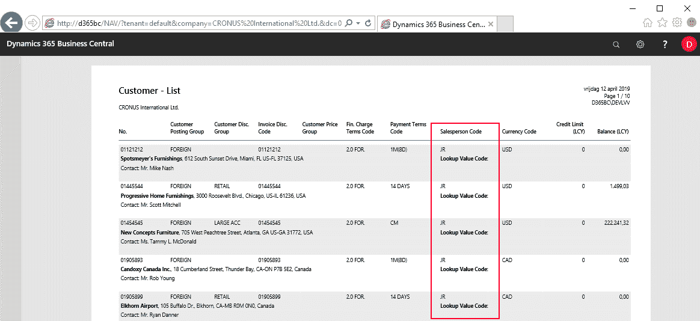
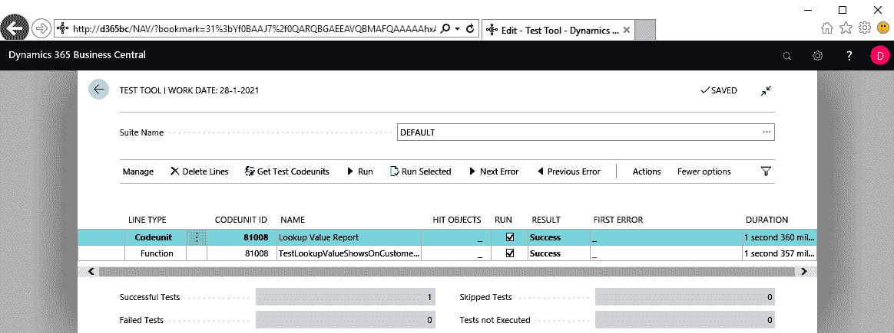
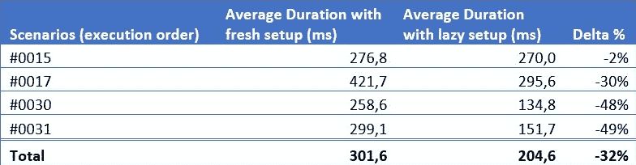
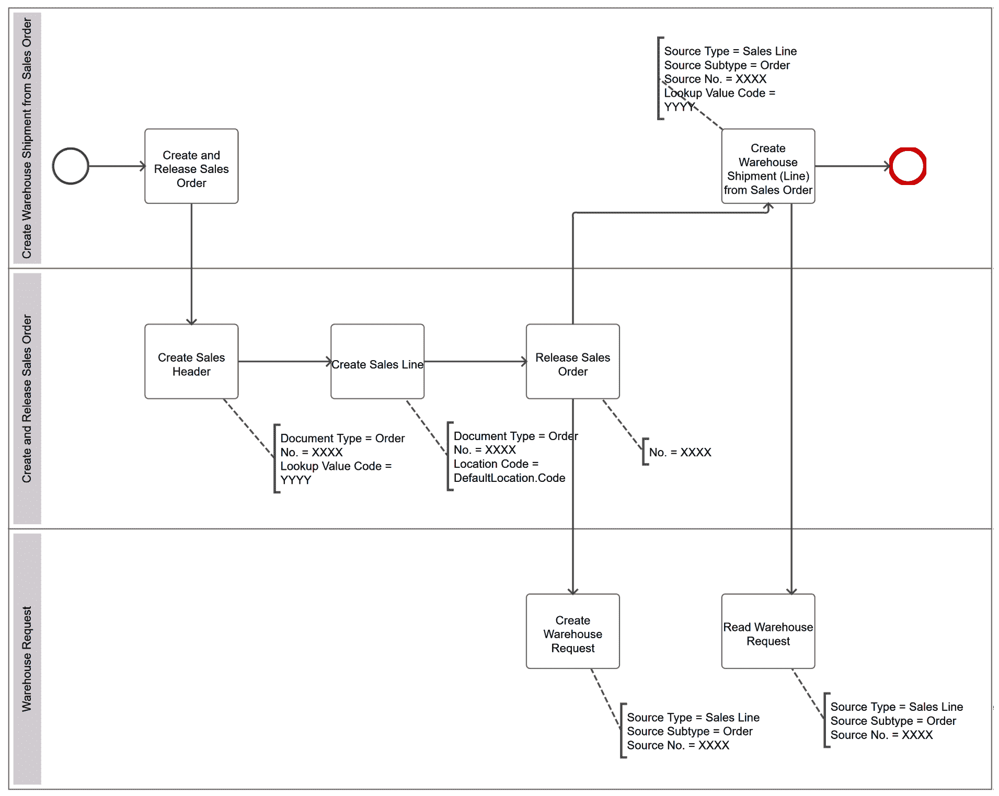
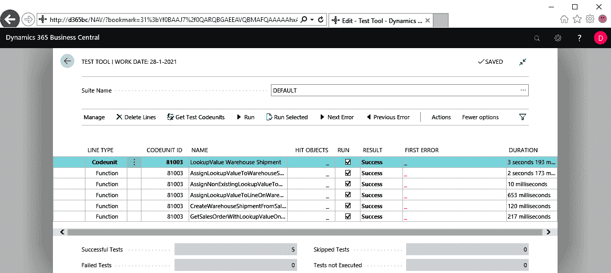
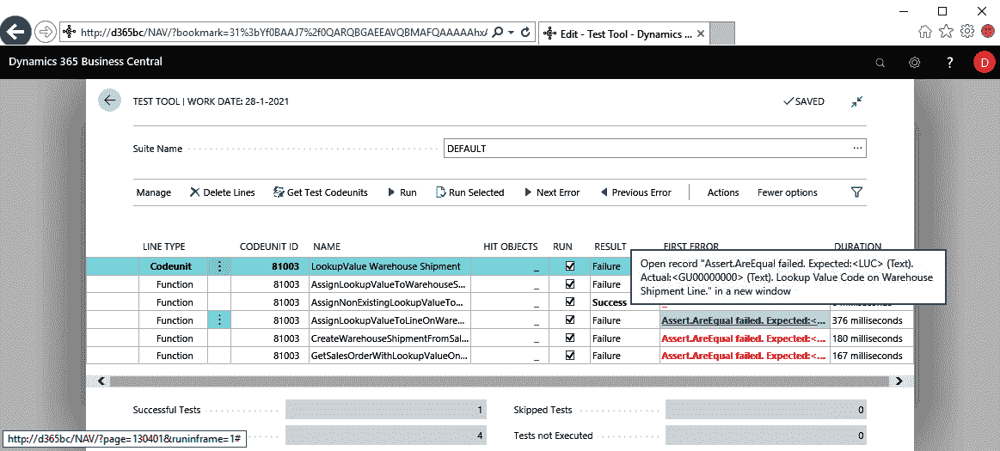

# 从客户需求到测试自动化——以及更多

现在掌握了吧？嗯，你已经做到这一步了，对吧？让我们再来一个 *路上的最后一课*，实际上是两个。我们将用最后一对测试工具补充你的工具箱，适用于 Microsoft Dynamics 365 Business Central。在这一章中，我们将扩展以下内容：

+   测试报告

+   设置更复杂的场景

# 测试示例 7 – 如何测试报告

报告一直是许多 Business Central 项目和解决方案的重要组成部分。考虑到这一点，了解如何以自动化方式测试它们是非常有意义的。那么，我们该如何进行呢？在这个例子中，我们将演示如何测试由报告创建的数据集。布局测试是另一项工作，属于测试框架之外的任务。

# 客户需求

我们客户的需求描述了客户的 `Lookup Value Code` 字段必须传递到各类销售单据中。尽管没有明确说明，合乎逻辑的推论是，这些单据的每个打印版本都必须添加此字段。请注意，在此时此刻，我们无法扩展标准报告。扩展标准报告只能通过将其克隆到我们的扩展中来实现。由于销售单据报告在数据集和布局方面都相当复杂，我们采取了一个更简单的例子。我们将克隆报告 101，`Customer - List`，并将 `Lookup Value Code` 字段添加到其中，如下一个截图所示：



这可能是 ATDD 测试用例描述的一个翻译：

```
[FEATURE] LookupValue Report
[SCENARIO #0029] Test that lookup value shows on CustomerList
                 report
[GIVEN] 2 customers with different lookup value
[WHEN] Run report CustomerList
[THEN] Report dataset contains both customers with lookup value
```

为什么是两个客户呢？你可能会问。因为报告应该能够列出多个客户，因此不只测试一个客户是有意义的。

# 应用代码

克隆报告的简化版本显示了我们在本页及下一页中添加了 `Lookup Value Code` 字段。前面的截图显示了该字段在布局中的位置：

```
Report 50000 "CustomerList"
 {
     //Converted from standard report 101 "Customer - List"

     DefaultLayout = RDLC;
     RDLCLayout = './Report Layouts/CustomerList.rdlc';
     ApplicationArea = Basic, Suite;
     Caption = 'Customer List';
     UsageCategory = ReportsAndAnalysis;

     dataset
     {
         dataitem(Customer; Customer)
         {
             ...
             column(Customer_No_; "No.")
             {
                 IncludeCaption = true;
             }
             ...            }
             column(Customer_Phone_No_; "Phone No.")
             {
                 IncludeCaption = true;
             }
             column(Customer_Lookup_Value_Code;
                 "Lookup Value Code")
             {
                 IncludeCaption = true;
             }

             ...
          }
     }

     requestpage
     {
         ...
     }

     Labels
     {
         ...
     }

     ...
 }
```

# 测试代码

看一下我们对场景 `#0029` 的 `.al` 实现。

# 创建、嵌入并编写

创建代码单元，嵌入 ATDD 场景并编写故事将产生以下结果：

```
codeunit 81008 "Lookup Value Report"
{
    Subtype = Test;

    //[FEATURE] LookupValue Report

    [Test]
    [HandlerFunctions('CustomerListRequestPageHandler')]
    procedure TestLookupValueShowsOnCustomerListReport();
    var
        Customer: array[2] of Record Customer;
    begin
        //[SCENARIO #0029] Test that lookup value shows on
        //                 CustomerList report
        Initialize();
        //[GIVEN] 2 customers with different lookup value
        CreateCustomerWithLookupValue(Customer[1]);
        CreateCustomerWithLookupValue(Customer[2]);
        //[WHEN] Run report CustomerList
        CommitAndRunReportCustomerList();
        //[THEN] Report dataset contains both customers with 
        //       lookup value
        VerifyCustWithLookupValueOnCustListReport(
            Customer[1]."No.", Customer[1]."Lookup Value Code");
        VerifyCustWithLookupValueOnCustListReport(
            Customer[2]."No.", Customer[2]."Lookup Value Code");
    end;
}
```

# 构建真实的代码

看看这些辅助函数是如何呈现的。

`Initialize` 确保我们的报告只会选择两个新创建的客户，通过删除数据库中所有现有的客户记录；由于测试将在隔离状态下运行，这一删除操作将在后续被还原：

```
local procedure Initialize()
var
    Customer: record Customer;
begin
    if isInitialized then
        exit;
    Customer.DeleteAll();
    isInitialized := true;
    Commit();
end;
```

`CreateCustomerWithLookupValue` 和 `CreateLookupValueCode` 成为我们下一个邻居，几乎可以在所有场景中帮助我们：

```
local procedure CreateCustomerWithLookupValue(
    var Customer: Record Customer)
begin
    LibrarySales.CreateCustomer(Customer);
    with Customer do begin
        Validate("Lookup Value Code",CreateLookupValueCode());
        Modify();
    end;
end;

local procedure CreateLookupValueCode(): Code[10]
var
    LookupValue: Record LookupValue;
begin
    //for implementation see test example 1; this smells like
    //duplication ;-) again
end;
```

测试报告数据集就是浏览其 XML 结构，因此，`CommitAndRunReportCustomerList` 在代码单元 `Library - Report Dataset` (131007) 中调用 `RunReportAndLoad`，将数据流式传输到临时 `TempBlob` 记录（表 99008535）中，以便在验证部分使用：

```
local procedure CommitAndRunReportCustomerList()
var
    CustomerListReport: Report CustomerList;
    RequestPageXML: Text;
begin
    Commit(); // close open write transaction to be able to
              // run the report
    RequestPageXML := Report.RunRequestPage(
        Report::CustomerList,
        RequestPageXML);
    LibraryReportDataset.RunReportAndLoad(
        Report::CustomerList,
        '',
        RequestPageXML);
end;

[RequestPageHandler]
procedure CustomerListRequestPageHandler(
            var CustomerListRequestPage:
            TestRequestPage CustomerList)
begin
    // Empty handler used to close the request page, default
    // settings are used
end;
```

在`VerifyCustWithLookupValueOnCustListReport`中，我们看到`FindRow`读取客户号（列`Customer_No_`）和我们的查找值（列`Customer_Lookup_Value_Code`），并确定它们的行位置：

```
local procedure VerifyCustWithLookupValueOnCustListReport(
                    No: Code[20]; LookupValueCode: Code[10])
var
    Row: array[2] of Integer;
begin
    Row[1] := LibraryReportDataset.FindRow(
                'Customer_No_',
                No);
    Row[2] := LibraryReportDataset.FindRow(
                'Customer_Lookup_Value_Code',
                LookupValueCode);
    Assert.AreEqual(
        13, Row[2] - Row[1],
        'Delta between columns Customer_No_ and
         Customer_Lookup_Value_Code')
 end;
```

再多一些笔记：

+   报表数据集定义中的元素称为*列*。在`Library - Report Dataset`代码单元中，因此在测试中，术语行也被用来指代生成的数据集 XML 中的行。

+   注意，行之间的差值被验证为`13`，这意味着，参考前面的注释，列`Customer_Lookup_Value_Code`是数据集中列`Customer_No_`后的第 13 列。

+   出于合理的理由，您可能会想知道这是否是一个相关的检查；当行数计算不再正确时，它肯定会出错，正如我们稍后将看到的那样。

+   您可能已经注意到：全局变量声明已被省略。

# 测试执行

它正在成为一种习惯：绿色，绿色，绿色！



# 测试测试

来吧！我们自己控制它。让我们来做吧。

# 调整测试以使验证出错

改变一下怎么样…

+   在`VerifyCustWithLookupValueOnCustListReport`中的硬编码的`13`为`56`，或

+   它的`LookupValueCode`参数在从测试函数调用时

这些将分别引发以下错误：

```
Assert.AreEqual failed. Expected:<56> (Integer). Actual:<13> (Integer). Delta between columns Customer_No_ and Customer_Lookup_Value_Code.

Assert.AreEqual failed. Expected:<13> (Integer). Actual:<-4> (Integer). Delta between columns Customer_No_ and Customer_Lookup_Value_Code.
```

后者可能有些意外，因为它不像之前那样显示出可比性，指定`LUC`作为预期值等等。在这里，我们的验证是通过`FindRow`方法完成的，因为在数据集中找不到`LUC`，`FindRow`将返回`-1`，并且由于`Customer_No_`在行[3]上，数学运算将导致`-4`。

# 测试示例 8 - 如何构建一个广泛的场景

作为 Dynamics 365 Business Central 的终端用户，要实现您的目标，通常需要执行一系列连续动作。如何为此构建测试套件？如何创建可重用部分？以及如何利用 Microsoft 测试库中已经存在的辅助功能？

为了说明这一点，我们详细介绍客户愿望的另一部分。

# 客户愿望

在我们客户愿望的业务逻辑描述中提到：

在从销售订单创建仓库发货时，应该从销售头传递 Lookup Value Code 字段到仓库发货行。

这在以下两种情况中表达：

```
[FEATURE] LookupValue Warehouse Shipment
[SCENARIO #0030] Create warehouse shipment from sales order with
                 lookup value
[GIVEN] A lookup value
[GIVEN] A location with require shipment
[GIVEN] A warehouse employee for current user
[WHEN] Create warehouse shipment from released sales order with
lookup value and with line with require shipment location
[THEN] Warehouse shipment line has lookup value code field
       populated

[SCENARIO #0031] Get sales order with lookup value on warehouse
                 shipment
[GIVEN] A lookup value
[GIVEN] A location with require shipment
[GIVEN] A warehouse employee for current user
[GIVEN] A released sales order with lookup value and with line
 with require shipment location
[GIVEN] A warehouse shipment without lines
[WHEN] Get sales order with lookup value on warehouse shipment
[THEN] Warehouse shipment line has lookup value code field
       populated
```

然而，这意味着`Lookup Value`字段已经存在于`Warehouse Shipment Line`和`Posted Whse. Shipment Line`表中，这是我们列表中的三个基本场景定义的结果，我们到目前为止跳过了：

```
[SCENARIO #0015] Assign lookup value to warehouse shipment line
[GIVEN] A lookup value
[GIVEN] A location with require shipment
[GIVEN] A warehouse employee for current user
[GIVEN] A warehouse shipment from released sales order with line
with require shipment location
[WHEN] Set lookup value on warehouse shipment line
[THEN] Warehouse shipment line has lookup value code field
populated

[SCENARIO #0016] Assign non-existing lookup value on warehouse
                 shipment line
[GIVEN] A non-existing lookup value
[GIVEN] A warehouse shipment line record variable
[WHEN] Set non-existing lookup value to warehouse shipment line
[THEN] Non existing lookup value error was thrown

[SCENARIO #0017] Assign lookup value to warehouse shipment line on
                 warehouse shipment document page
[GIVEN] A lookup value
[GIVEN] A location with require shipment
[GIVEN] A warehouse employee for current user
[GIVEN] A warehouse shipment from released sales order with line
 with require shipment location
[WHEN] Set lookup value on warehouse shipment line on warehouse
shipment document page
[THEN] Warehouse shipment line has lookup value code field
       populated
```

由于场景相关，当我们在制定所有五个场景时，发现一致的部分并不奇怪。这是一条愉快地通知我们，我们将能够构建可重用部分并节省时间的消息。

这些是显而易见的：

```
[GIVEN] A lookup value
[GIVEN] A location with require shipment
[GIVEN] A warehouse employee for current user
```

但你通常可以在代码中找到提示。比较下面从五个场景中的四个场景提取的内容：

```
[SCENARIO #0015]
[GIVEN] A warehouse shipment from released sales order with line
with require shipment location

[SCENARIO #0017]
[GIVEN] A warehouse shipment from released sales order with line
 with require shipment location
 [SCENARIO #0030]
[WHEN] Create warehouse shipment from released sales order with
lookup value and with line with require shipment location

[SCENARIO #0031]
[GIVEN] A released sales order with lookup value and with line
 with require shipment location
```

这告诉我们，在所有这些情况下，我们需要一个已发布的销售订单，并带有查找值。

# 应用代码

针对场景`#0015`、`#00016`和`#0017`，`Warehouse Shipment Line`和`Posted Whse. Shipment Line`表格以及它们相关页面的扩展，通过以下代码实现（为了节省空间，这里仅展示最简代码）：

```
tableextension 50007 "WhseShipmentLineTableExt"
                         extends "Warehouse Shipment Line"
{
    fields
    {
        field(50000; "Lookup Value Code"; Code[10]){}
    }
}

tableextension 50008 "PstdWhseShipmentLineTableExt"
                         extends "Posted Whse. Shipment Line"
{
    fields
    {
        field(50000; "Lookup Value Code"; Code[10]){}
    }
}

pageextension 50034 "WhseShipmentSubformPageExt" 
                         extends "Whse. Shipment Subform"
{
    layout
    {
        addlast(Control1)
        {
            field("Lookup Value Code"; "Lookup Value Code"){}
        }
    }
}

pageextension 50036 "PstdWhseShipmentSubformPageExt"
                         extends "Posted Whse. Shipment Subform"
{
    layout
    {
        addlast(Control1)
        {
            field("Lookup Value Code"; "Lookup Value Code"){}
        }
    }
}

pageextension 50035 "WhseShipmentLinesPageExt"
                         extends "Whse. Shipment Lines"
{
    layout
    {
        addlast(Control1)
        {
            field("Lookup Value Code"; "Lookup Value Code"){}
        }
    }
}
```

为了启用场景`#0030`和`#0031`，只需用以下代码扩展标准应用程序：

```
codeunit 50002 "WhseCreateSourceDocumentEvent"
{
    [EventSubscriber(ObjectType::Codeunit,
        Codeunit::"Whse.-Create Source Document",
        'OnBeforeCreateShptLineFromSalesLine', '', false, false)]
    local procedure OnBeforeCreateShptLineFromSalesLineEvent(
        var WarehouseShipmentLine:
            Record "Warehouse Shipment Line";
        WarehouseShipmentHeader:
            Record "Warehouse Shipment Header";
        SalesLine: Record "Sales Line";
        SalesHeader: Record "Sales Header")
    begin
        with WarehouseShipmentLine do
            "Lookup Value Code" :=
                SalesHeader."Lookup Value Code";
    end;
}
```

订阅者`OnBeforeCreateShptLineFromSalesLineEvent`确保销售单据上`Lookup Value Code`字段的值被复制到仓库发货单行的`Lookup Value Code`字段。

# 测试代码

让我们实现四个重叠的场景`#0015`、`#0017`、`#0030`和`#0031`。

# 创建、嵌入和编写

```
codeunit 81005 "LookupValue Posting"
{
    Subtype = Test;

    //[FEATURE] LookupValue Warehouse Shipment

    [Test]
    procedure AssignLookupValueToWarehouseShipmentLine()
    begin
        //[SCENARIO #0015] Assign lookup value to warehouse
        //                 shipment line on warehouse shipment
        //                 page
        //[GIVEN] A lookup value
        //[GIVEN] A location with require shipment
        //[GIVEN] A warehouse employee for current user
        Initialize();
        //[GIVEN] A warehouse shipment from released sales order
        //        with line with require shipment location
        SalesOrderNo := 
            CreateWarehouseShipmentFromSalesOrder(
                DefaultLocation, 
                UseNoLookupValue());
        //[WHEN] Set lookup value on warehouse shipment line on
        //       warehouse shipment page
        FindAndSetLookupValueOnWarehouseShipmentLine(
            SalesOrderNo, 
            LookupValueCode);
        //[THEN] Warehouse shipment line has lookup value code
        //       field populated
        VerifyLookupValueOnWarehouseShipmentLine(
            SalesOrderNo, 
            LookupValueCode);
    end;

    [Test]
    procedure
        AssignLookupValueToLineOnWarehouseShipmentDocument()
    begin
        //[SCENARIO #0017] Assign lookup value to warehouse
        //                 shipment line on warehouse shipment
        //                 page
        //[GIVEN] A lookup value
        //[GIVEN] A location with require shipment
        //[GIVEN] A warehouse employee for current user
        Initialize();
        //[GIVEN] A warehouse shipment from released sales order
        //        with line with require shipment location
        SalesOrderNo := 
            CreateWarehouseShipmentFromSalesOrder(
                DefaultLocation, 
                UseNoLookupValue());
        //[WHEN] Set lookup value on warehouse shipment line on
        //       warehouse shipment document page
        SetLookupValueOnLineOnWarehouseShipmentDocumentPage(
            SalesOrderNo);
        //[THEN] Warehouse shipment line has lookup value code
        //       field populated
        VerifyLookupValueOnWarehouseShipmentLine(
            SalesOrderNo, 
            LookupValueCode);
    end;

    [Test]
    procedure
        CreateWarehouseShipmentFromSalesOrderWithLookupValue()
    begin
        //[SCENARIO #0030] Create warehouse shipment from sales
        //                 order with lookup value
        //[GIVEN] A lookup value
        //[GIVEN] A location with require shipment
        //[GIVEN] A warehouse employee for current user
        Initialize();
        //[WHEN] Create warehouse shipment from released sales
        //       order with lookup value and with line with
        //       require shipment location
        SalesOrderNo :=
            CreateWarehouseShipmentFromSalesOrder(
                DefaultLocation, 
            UseLookupValue());
        //[THEN] Warehouse shipment line has lookup value code
        //       field populated
        VerifyLookupValueOnWarehouseShipmentLine(
                SalesOrderNo, 
            LookupValueCode);
    end;

    [Test]
    procedure GetSalesOrderWithLookupValueOnWarehouseShipment()
    begin
        //[SCENARIO #0031] Get sales order with lookup value on
        //                 warehouse shipment
        //[GIVEN] A lookup value
        //[GIVEN] A location with require shipment
        //[GIVEN] A warehouse employee for current user
        Initialize();
        //[GIVEN] A released sales order with lookup value and
        //        with line with require shipment location
        CreateAndReleaseSalesOrder(
            SalesHeader, 
            DefaultLocation, 
            UseLookupValue());
        //[GIVEN] A warehouse shipment without lines
        WarehouseShipmentNo := 
            CreateWarehouseShipmentWithOutLines(
                DefaultLocation."Code");
        //[WHEN] Get sales order with lookup value on warehouse
        //       shipment
        GetSalesOrderShipment(WarehouseShipmentNo);
        //[THEN] Warehouse shipment line has lookup value code
        //       field populated
        VerifyLookupValueOnWarehouseShipmentLine(
            SalesHeader."No.", 
            LookupValueCode);
    end;
}
```

# 构建实际的代码

在 GitHub 上的代码中，我们将留给你查看这些测试的主要实现部分。然而，在这里，我们将更详细地研究场景`#0030`，其中`[GIVEN]`和`[THEN]`部分与其他三个场景共享。回到我们开始这最后一个测试示例时提出的问题，目标是向你展示：

+   可以通过创建和使用可重用的部分来构建一个复杂的场景

+   在标准库中找到尽可能多的可重用部分

# Initialize

由于`Initialize`是第一个被共享的可重用部分，部分数据设置已经在处理中了：

```
[GIVEN] A lookup value
[GIVEN] A location with require shipment
[GIVEN] A warehouse employee for current user
```

代码如下：

```
local procedure Initialize()
var
    WarehouseEmployee: Record "Warehouse Employee";
begin
    if isInitialized then
        exit;

    LookupValueCode := CreateLookupValueCode();
    LibraryWarehouse.CreateLocationWMS(
        DefaultLocation, false, false, false, false, true);
    LibraryWarehouse.CreateWarehouseEmployee(
        WarehouseEmployee, DefaultLocation."Code", false);

    isInitialized := true;
    Commit();
end;
```

到目前为止，`Initialize`的结构应该看起来很熟悉，包括使用全局布尔变量`isInitialized`、全局变量`Code[10]`的`LookupValueCode`，以及本地辅助函数`CreateLookupValueCode`，并且解释了为什么`CreateLookupValueCode`可以作为懒加载的一部分。

如何将创建位置（带有*要求发货*）和仓库员工的过程嵌入到`Initialize`中，因为这两个过程可以在四个场景之间轻松共享。为此，`DefaultLocation`被设置为一个全局记录变量（基于`Location`表）。仓库员工不需要存储，因为它将从数据库中检索。

如你所见，使用了两个辅助函数，通过一个基于标准代码单元`Library - Warehouse`的库代码单元变量`LibraryWarehouse`来调用。使用在第三章中提到的简单快速文件搜索方法，我查找了一个用于创建位置的辅助函数，搜索字符串为 CreateLocation，以及一个用于创建仓库员工的函数，搜索字符串为 CreateWarehouseEmployee。

运行测试函数后，我们最终会明确地实现场景`#0015`、`#0017`、`#0030`和`#0031`，这表明使用`Initialize`函数不仅能创建更易于维护和理解的代码，而且还大大提高了效率，因此对于自动化测试而言是必不可少的。

在单独运行所有四个测试 10 次（从而触发`Initialize`，仿佛是一个全新的设置）并且将四个测试一次性运行 10 次（现在触发`Initialize`以获得共享设置）之后，结果表明后一种方式的速度提高了超过 30%。

请注意，在这两种情况下，场景`#0015`的速度是一样快的，因为它总是让`Initialize`完全运行。



# VerifyLookupValueOnWarehouseShipmentLine

使用`VerifyLookupValueOnWarehouseShipmentLine`，找到了第二个可重用的部分。它与之前示例中各种`VerifyLookupValueOn`辅助函数非常相似。因此，通过实践 Business Central 开发者的美德，编写`VerifyLookupValueOnWarehouseShipmentLine`的任务变得非常简单：复制、粘贴并调整。这个任务留给你完成。

# CreateWarehouseShipmentFromSalesOrder

如果你有使用过 Business Central 仓库发货功能的经验，你会知道创建一个仓库发货需要执行一系列步骤。这不像创建采购发票那样是单一的操作。

以下过程图展示了场景`#0030`中`[WHEN]`部分需要执行的任务：



基于此，`.al`实现变成了：

```
local procedure CreateWarehouseShipmentFromSalesOrder(
                    Location: Record Location; 
                    WithLookupValue: Boolean): Code[20]
var
    SalesHeader: Record "Sales Header";
begin
    CreateAndReleaseSalesOrder(
        SalesHeader, 
        Location, 
        WithLookupValue);
    LibraryWarehouse.CreateWhseShipmentFromSO(SalesHeader);
    exit(SalesHeader."No.");
end;

local procedure CreateAndReleaseSalesOrder(
        var SalesHeader: record "Sales Header"; Location: Record Location; WithLookupValue: Boolean)
var
    SalesLine: record "Sales Line";
begin
    LibrarySales.CreateSalesDocumentWithItem(
         SalesHeader, SalesLine, SalesHeader."Document Type"::Order,
         '', '', 1, Location."Code", 0D);

    with SalesHeader do
        if WithLookupValue then begin
            Validate("Lookup Value Code", LookupValueCode);
            Modify();
        end;

    LibrarySales.ReleaseSalesDocument(SalesHeader);
end;
```

除了已经遇到的全局代码单元变量`LibraryWarehouse`，我们还使用了`LibrarySales`，基于标准代码单元`Library - Sales`，以及`LibraryRandom`，基于标准代码单元`Library - Random`。这三者都是搜索的结果：

| **一个辅助方法** | **通过搜索字符串找到** |
| --- | --- |
| 从销售订单创建仓库发货 | 过程*CreateWhseShipmentFrom* |
| 创建一个包含项目和位置的销售单据 | 过程*CreateSalesDocumentWith* |
| 发布销售单据 | 过程*ReleaseSalesDoc* |
| 生成一个随机数 | 过程*Random*，接着是过程*Rand* |

我们创建了易于阅读、可重用、简约的函数。`CreateWarehouseShipmentFromSalesOrder`被场景`#0015`、`#0017`和`#0030`使用。`CreateAndReleaseSalesOrder`直接被场景`#0031`使用，并间接被`#0015`、`#0017`和`#0030`使用。

在调用`LibrarySales.CreateSalesDocumentWithItem`时，两个空字符串触发了客户和项目的创建。

# 测试执行

跑，跑，跑啊啊啊啊。咆哮~绿色！



# 测试测试

现在我们已经克服了这个更大的挑战，让我们最后一次测试这个测试。

# 调整测试，使验证出现错误。

现在让我们通过为场景`#0015`、`#0017`、`#0030`和`#0031`提供另一个期望结果值`LUC`来调整测试：



# 重构

在本章中，实际上也是第三部分的整个内容，我们讨论了设计和编写自动化测试的各个方面，针对 Dynamics 365 Business Central 的情况。我们讨论并应用了最佳实践，比如*可重用性*、*可读性*和*简约性*，但我们并没有完全实现这些实践。你可能还记得在某些地方提到过某些代码部分*有重复的嫌疑*。这通常是重构代码的提示，以使其更具可重用性。我们在本书的范围内不会对其进行操作。但你可以在 GitHub 上找到已经重构的完整代码，重构后的代码创建了两个可重用的帮助方法库。此外，它还包括所有完成完整客户需求的场景，这些场景在第五章开头提到的*从客户需求到测试自动化——基础*中进行了讨论，但它们并未作为示例在书中使用。

同时：接受挑战，重构你自己创建的代码，特别是在实现前八个测试示例的过程中。拥有完整的应用程序和测试代码，使你能够对需要重构的部分进行重构，无论是应用程序代码还是测试代码。但只能是其中之一。如果重构应用程序代码导致之前成功的测试失败了，那么改进你的重构代码，使所有测试都通过。如果重构测试代码导致它们失败，而之前没有失败过，那么恢复并做得更好。

除了时间紧张，也许还有懒散的心情之外，现在没有理由不进行重构。现在就让你的代码发挥最大的作用。

对于尚未覆盖的代码，应该在进行任何重构之前先编写测试。如果不这样做，破坏某些东西而没有察觉的可能性非常高。

# 总结

在本章中，我们学习了如何测试报告数据集，以及如何构建更广泛的场景，确保测试代码具有可读性、可重用性，并且最重要的是，保持简约，后者通过使用标准帮助函数来实现。

在下一章，第八章，*如何将测试自动化融入日常开发实践*，我们将进入本书的最后部分，讨论如何将测试自动化融入日常开发实践中，包括微软提供的测试。
