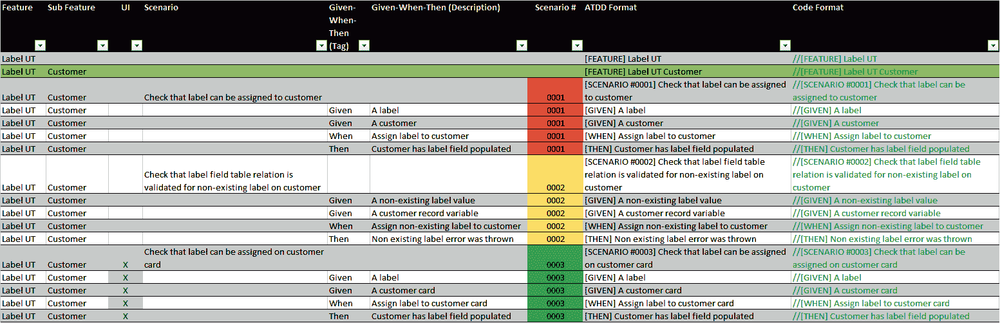
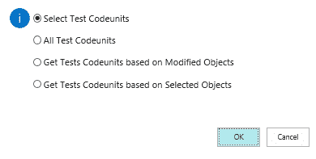
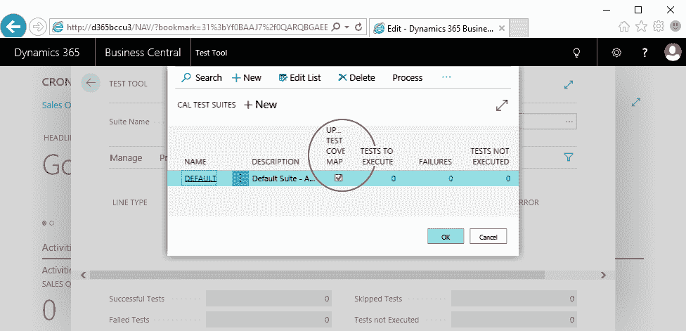
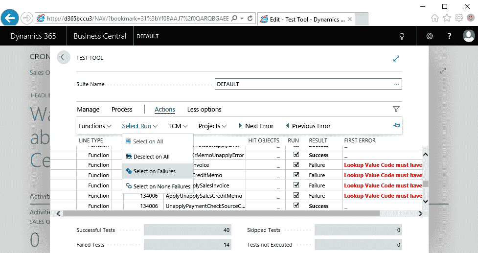
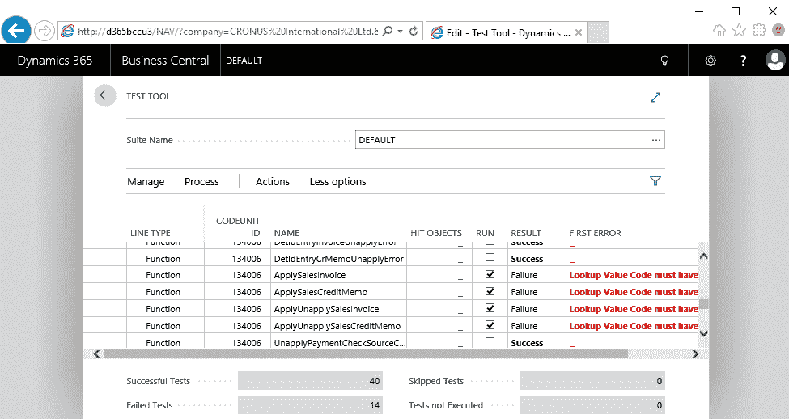
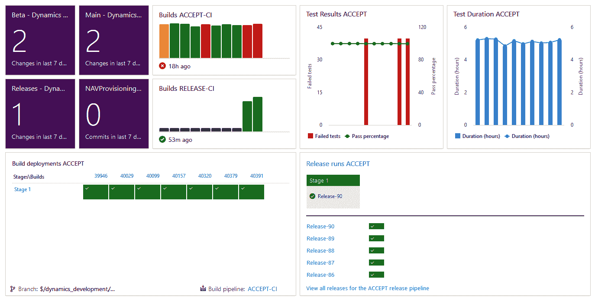

# 如何将测试自动化融入日常开发实践

你已经读到了这本书的这一部分，所以现在你对 Dynamics 365 Business Central 的测试自动化需求和好处有了明确的认识。你也已经开始根据第三部分，*为 Microsoft Dynamics 365 Business Central 设计和构建自动化测试*，进行测试设计和编写。下一步是将你学到的知识付诸实践。

通过阅读本书、理解所讨论的问题并完成第一次练习，虽然将其作为日常工作的一部分可能仍然是一个门槛。如前所述，测试自动化是团队的共同努力。因此，在本章中，我们将详细说明一些最佳实践，这些实践可能对你和你的团队在实现测试自动化方面非常有帮助：

+   将客户需求转化为 ATDD 场景

+   迈出小步伐

+   让测试工具成为你的朋友

+   与日常构建集成

+   维护你的测试代码

# 将客户需求转化为 ATDD 场景

将测试自动化融入日常开发实践的关键是团队的采纳。与需求和应用代码一样，测试和测试代码应该由开发团队负责；不仅仅是形式上的，而是要积极地承担责任。良好的应用代码并非来自一句简单的客户需求，而是来自于一个详细且正式的客户需求。测试和测试代码也是如此。

正如在第四章中讨论的，*测试设计*，通过使用 ATDD 设计模式来规范化你的需求。将客户需求转化为 ATDD 场景。将每个需求分解为测试列表，并使其成为你沟通的主要工具：（1）详细描述你的**客户需求**，（2）实现你的**应用代码**，（3）有结构地执行你的**手动测试**，（4）编写你的**测试自动化**，（5）为你的解决方案提供最新的**文档**。你的测试自动化将是所有前期工作的逻辑结果。

由于开发人员既要编写应用代码，也要编写测试代码，而通常他们并不是最了解客户需求的人，因此 ATDD 场景已经实现了*一举两得*。可以利用我在 GitHub 上的 ATDD 场景 Excel 表格，名为 `Clean sheet.xlsx`，让你的团队开始将客户需求转化为 ATDD 场景。这正是我在第五章到第七章编写测试示例时所做的。请参见下面的截图以获取印象：

前七列供产品负责人、功能顾问和关键用户填写：

+   `功能`

+   `子功能`

+   `UI`

+   `场景`

+   `Given-When-Then（标签）`

+   `Given-When-Then（描述）`

+   `场景 #`

最后的两列，`ATDD 格式`和`代码格式`，会自动填充，正如以下截图所示。注意，后者列包含*绿色*，也就是已经格式化并注释掉的`GIVEN`-`WHEN`-`THEN`场景。这些场景已经准备好可以复制并粘贴到你的测试代码单元中，嵌入到你的测试函数里：

目前，Jan Hoek 和我正在一起努力推进这一步。看看我们的`ATDD.TestScriptor`，它可以根据定义的 ATDD 功能，构建关联的`.al`测试代码单元的框架：[`powershellgallery.com/packages/ATDD.TestScriptor`](http://powershellgallery.com/packages/ATDD.TestScriptor)。

# 采取小步走

正如俗话所说，*罗马不是一天建成的*。同样，逐步掌握测试自动化。通过以下方式学习和改进：

+   开始将客户的需求转化为你想到的场景。尽量保持简单。理想情况下，你希望立即获得完整的覆盖率，但由于这是团队合作，他们会帮助你识别漏洞并填补它们。

+   利用我的*4 步*流程——*创建*、*嵌入*、*编写*、*构建*——来构思测试代码：

1\. 创建测试代码单元

2\. 将客户的需求嵌入到测试函数中

3\. 编写你的测试故事

4\. 构建实际代码

+   在每一步操作时都运行测试，并在代码可以部署时尽快进行验证。不要等到完成后再验证，而是尽早验证你的工作成果。观察你的测试从**红色**变为**绿色**。

+   把*测试测试*作为完成它的最后一步来享受。要么验证已创建的数据，要么通常更简单地调整测试，以使验证出错。

+   一个接一个地实现场景，发现自己在重复代码部分。不要强迫自己立即将这些代码抽象成库中的辅助方法。这可以等到应用程序和测试代码准备好后再进行重构。

+   定期运行测试，一旦应用程序代码和测试完成，或者当功能进行下一次更新时。在实施过程中，不要等到代码准备好，验证每一个原子变化，运行测试，并为新旧场景添加新测试。

上述的`ATDD.TestScriptor`将帮助你完成我的 4 步流程中的*步骤 1*到*步骤 3*。

# 让测试工具成为你的朋友

在第三章，《测试工具与标准测试》中，我们向你介绍了测试工具，并在我们进行测试示例工作时频繁使用它。我们用它来*测试测试*，在插入一个 bug 并让*验证错误*后。除了 VS Code（你的编码工具）和调试器，测试工具是你最好的朋友。在开发时保持它的运行，正如之前提到的，“*不要等到代码准备好，验证每一个原子变化，运行测试*”。

创建一个特定的测试套件，用于存放与你正在处理的代码相关的测试代码单元。在你大多数的项目中，很可能会像`LookupValue`扩展那样，最终得到一堆测试代码单元，这些单元将在不到一分钟的时间内执行完毕。在编写新的测试代码单元时，创建一个新的测试套件，仅用于存放该代码单元，并反复执行，直到编写完成。

# 测试覆盖率图

测试工具还包含一个我们之前没有提到的强大功能，对于选择与你正在更新的代码相关的测试代码单元非常有帮助。这个功能叫做**测试覆盖率图**（**TCM**）。它结合了 Business Central 中代码覆盖工具的结果和测试工具。启用 TCM 后，它会为已展示的第三章中的获取测试代码单元功能添加两个额外选项，*测试工具与标准测试*。在那一章中，我们解释了获取测试代码单元提供了以下两个选项，让你能填充测试套件：

+   选择测试代码单元

+   所有测试代码单元

启用 TCM 后，会增加两个选项。

选择第三个选项，*根据修改的对象获取测试代码单元*，将选择那些会涉及你正在处理的应用对象的测试代码单元。第四个选项，*根据选择的对象获取测试代码单元*，让你从列表中选择你希望运行测试的应用对象。

此时，*根据修改的对象获取测试代码单元*选项仅考虑标准中存在的应用对象，即 C/SIDE 中的对象。不幸的是，它还未考虑到扩展中存在的对象。

第四个选项，*根据选择的对象获取测试代码单元*，仍然包括所有的应用对象。

为了能够使用 TCM，你需要先启用它。为此，在测试套件中勾选“更新测试覆盖率图”字段。如果在任何测试套件中没有启用此选项，则 TCM 将无法获取数据，无法让你选择*根据修改的对象获取测试代码单元*和*根据选择的对象获取测试代码单元*选项，如前所述。

为了让 TCM 能有足够的数据来完成其工作，已激活的测试套件应该首先运行。

# 扩展测试工具

几年前，当我们开始更密集地使用测试工具时，我们发现一个主要的遗漏问题，于是决定为其构建一个简单的扩展。一旦你设置好了测试套件并运行了所有测试，你可能会发现只有一部分测试成功通过，而逻辑上，其他部分没有通过。

在查找并修复失败原因时，您可能只想运行有问题的测试。标准的测试工具只允许通过选中/取消选中每个功能行的“Run”字段来启用/禁用测试。选中/取消选中代码单元行的“Run”选项，也会对其包含的所有功能行执行相同的操作。

测试工具扩展允许您选择以下内容的“Run”字段：

+   所有测试

+   仅失败的测试，从而禁用所有其他测试

+   对于没有失败的测试，禁用失败的测试

作为第四个选项，可以取消选择所有测试。

如前面截图所示，已添加以下四个操作：

+   选择“所有测试”

+   取消选择“所有测试”

+   选择“失败时”

+   选择“没有失败的测试”

因此，在使用“失败时选择”功能时，所有失败的测试将被选中“Run”选项，而其他所有测试则保持未选中状态，如下图所示：

已有的功能，如 TCM 和扩展测试工具的四个操作，使您可以轻松地选择有助于修复问题的测试，并扩大您正在构建的测试资源。

测试工具扩展的源代码可以从此 GitHub 仓库下载：[`github.com/fluxxus-nl/Test-Tool-Extension`](https://github.com/fluxxus-nl/Test-Tool-Extension)

# 与每日构建集成

在软件开发中，构建连接和自动化业务流程的应用程序，而现代软件开发将其扩展到自身的流程，如下所示：

+   在源代码仓库中共享代码，并且可以通过 API 从任何地方访问和管理

+   随时自动从头开始构建您的软件

+   运行由已完成构建触发的自动化测试，以展示重建软件的有效性

+   部署由自动化测试通过的构建将在预定时间自动进行

+   在仪表板上收集所有前述过程的结果和状态，以便向利益相关者通报软件的健康状况

现代开发工具，如 Microsoft Azure DevOps，使您能够实现这一点。以下截图展示了一个集成所有前述要点的 Azure DevOps 仪表板。

这就是我们在 Dynamics 365 Business Central 中迈进的世界，受到第一章中讨论的论点启发，*自动化测试简介*。尤其是微软为我们设定的要求，请不要低估我们客户今天所处的生态系统，他们每天都在听到关于计划构建、自动化测试运行和比以往更短的发布周期的信息。

**持续集成**（**CI**）和**持续交付**（**CD**）在 Business Central 开发中可能曾经显得遥不可及，但随着 AL 和扩展开发的推进，它们已经触手可及。自动化测试在这一过程中占据了至关重要的地位。

在过去十年里，只有少数一些 Business Central 开发合作伙伴在努力自动化他们的开发流程，而现在越来越多的合作伙伴也开始加入这一行列；并且微软 Dynamics 365 Business Central 开发团队最近也公开倡导这一做法。

阅读微软 FreddyDK（Freddy D. Kristiansen）关于 CI/CD 的博客系列：[`community.dynamics.com/business/b/freddysblog/archive/tags/Continuous+Integration`](https://community.dynamics.com/business/b/freddysblog/archive/tags/Continuous+Integration)。

但也可以关注像 Gunnar Gestsson 这样的专家：[`dynamics.is/`](https://dynamics.is/)，Kamil Sáček：[`dynamicsuser.net/nav/b/kine`](https://dynamicsuser.net/nav/b/kine)，James Pearson：[`jpearson.blog/`](https://jpearson.blog/)，Richard Robberse：[`robberse-it-services.nl/blog/`](http://robberse-it-services.nl/blog/)，以及 Michael Glue：[`navbitsbytes.com/`](https://navbitsbytes.com/)。

尽管如此，你并不需要等到一个完全运作的自动化 CI/CD 管道才能从你的自动化测试中获得最大收益。通过一个简单的 PowerShell 脚本，由一个传统的 Windows 任务触发，你就可以在任何预定时间让你的测试在应用程序上运行。在我们开始在 Azure DevOps 上实现 CI/CD 管道之前，正是这样做了几年。这使我们能够每晚执行超过 18,000 个自动化测试，并且第二天早上通过测试报告邮件告知团队我们的代码的健康状况。测试运行的成功率偶尔出现下降时，会提醒我们应用程序中添加了某些意外的破坏性更改，并需要采取适当的措施。

# 维护你的测试代码

像应用程序代码一样，测试代码也是代码，因此应像处理应用程序代码一样处理测试代码，例如：

+   需要确保安全，理想情况下通过源代码管理工具来实现。

+   需要进行维护，并且由于任何新的客户需求都会导致应用程序代码的更改，因此测试代码很可能也会发生变化。

+   需要进行调试，无论你喜欢与否，因为开发人员编写的任何代码都有可能引入新的 bug。

+   需要进行审查，以确保它像应用程序代码一样符合编码标准。

# 扩展和测试

在我们结束本章之前，必须说明如何组织与应用程序和测试代码相关的扩展代码。

如果我们采用扩展的最严格要求，即微软为批准您的扩展发布到 AppSource 所设定的要求，那么应用程序和测试代码应放置在不同的扩展中。我猜你可能已经想到，测试扩展应依赖于应用程序扩展。不幸的是，这会阻碍应用程序和测试代码的并行开发，因为对应用程序扩展的任何更改都会导致其重新部署。这也可能导致测试扩展的更新和重新部署。在你意识到之前，你就会不断地在扩展之间进行 juggling，从而降低开发团队的效率。在开发过程中，最好的做法是将应用程序代码和测试代码放在同一个扩展中。准备好后，你可以通过一些自动化（构建）脚本或特定的合并策略将代码拆分，并创建这两个强制性的扩展。

如果你的扩展不打算发布到 AppSource，我仍然强烈建议不要在应用程序扩展中发布测试代码。原因与标准 `CRONUS` 不包含标准测试助手库和测试代码单元相同：为了避免在生产环境中运行自动化测试。当然，如果测试代码单元在测试运行器的隔离环境中运行，数据不会发生更改，最坏的情况是用户会遇到锁定问题，尤其是在 `Object` 表上。但是，如果测试代码单元不小心在测试运行器的隔离环境之外运行，并且提交变成了实际提交怎么办？您的客户可能会觉得他们度过了愉快的一天，营业额非常好。但当支付未完成且货物被*退回发件人*（因为地址无法识别）时，问题就会回到他们身上。

# 总结

在本章中，我们关注了如何将测试自动化嵌入到日常开发实践中的一些最佳实践。让你的功能同事编写 ATDD 场景，以便利用前面讨论过的 Excel 表格。不要让自己和团队过于负担重，采取小步骤前进。将测试工具与开发工具并行使用，并保持测试持续运行。自动化你的开发流程，包括运行测试。最后但同样重要的是，测试代码就是代码，因此要像维护应用程序代码一样维护测试代码。

我们即将进入最后一章，第九章，*让* *Business Central* *标准测试在你的代码上工作*，在这一章中，我们将更深入地研究微软提供的测试，以及如何将这一庞大的标准测试集合进行集成。
