# 第十一章：让 Business Central 标准测试在你的代码中运行

现在你知道如何编写自动化测试，并且已经将其集成到日常开发实践中，你如何从微软提供的庞大测试文档中受益呢？本章将展示如何将这些测试添加到你自己的文档中。我们将讨论：

+   为什么使用标准测试

+   执行标准测试

+   修复失败的标准测试

+   使你的代码可测试

# 为什么使用标准测试？

自从 2009 年引入可测试性框架以来，微软一直在构建其应用程序测试文档。正如第三章中已经提到的，*测试工具与标准测试*，它包含了大量的测试。这些测试涵盖了整个标准应用程序，从财务管理、销售和采购，到仓库和制造，再到服务管理。每次主要发布或累积更新时，都会添加新的测试，以覆盖新功能和最近的 bug 修复。这是我们所有人都可以受益的多年工作。如果你的代码扩展了标准应用程序，这对标准应用程序会有什么影响？

你可以选择编写你自己的测试，也可以选择运行标准测试并查看结果。当然，最终你也可以两者兼顾，因为你的扩展很可能不仅会改变标准行为，还会增加微软文档中没有覆盖的新的功能。

我们可以讨论很多并互相争论运行微软测试的有效性，但我们不如直接运行它们，看看我们的代码是否导致标准测试失败。这正是我多年前作为迈出自动化测试第一步所做的。那些一直关注我的博客的人可能记得，几年前，我专门写了一篇文章，标题是 *如何：在你的代码上运行标准测试*。正如标题所示，文章讨论了如何在你的解决方案上运行标准测试的步骤。去阅读它，执行并检查结果。几乎没有理由不这么做。30 分钟内，你就可以让测试开始运行。几小时内，你将看到结果。下图展示了我们的结果，其中只有 23%的标准测试成功（深色尖峰）：

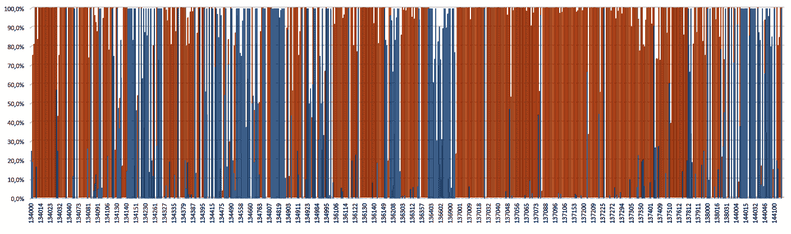

这是我文章的链接：[`dynamicsuser.net/nav/b/vanvugt/posts/how-to-run-standard-tests-against-your-code`](https://dynamicsuser.net/nav/b/vanvugt/posts/how-to-run-standard-tests-against-your-code)

# 执行标准测试

证明在实践中，所以我们按如下方式执行：

1.  将我们在第三部分中构建和测试的解决方案，*设计并构建自动化测试以适用于* *Microsoft Dynamics 365 Business Central*，部署到 Business Central

1.  导入标准测试

1.  使用测试工具中的“All Test Codeunits”选项设置测试套件，正如第三章中所讨论的，*测试工具和标准测试*

1.  运行所有测试

由于这需要几个小时，我们将跳过时间并查看结果。在近 23,000 个测试中，有超过 3,000 个失败。

# 这告诉了我们什么？

首先，考虑到 3,000 个失败是一个相当大的数字，这应该主要与我们的扩展有关，原因如下：

+   在标准的 Business Central 上运行标准测试总是会抛出一些错误。

+   这个数字可能有几百个，其中一些与环境设置有关，比如没有权限将数据写入文件。

+   由于自动化测试本身也是代码，它们中也可能存在一些错误。然而，3,000 多个测试失败远远超出了几百个的范围。

其次，这意味着大量的标准测试确实会触及我们的代码。通过使用测试覆盖率图，我们可以找出哪些测试代码单元实际上会影响到我们的扩展，并将其添加到我们迄今为止构建的测试资源中。当然，前提是我们能够修复这些问题。

到目前为止，我们一直在使用 Business Central 的 Web 客户端来运行测试。在本章中，我们将使用 Windows 客户端和调试器，因为目前 Web 客户端在运行成千上万的测试时并不好用。而且，由于测试功能行的显示和操作，测试工具不幸的是并不是你最好的朋友。

# 修复失败的标准测试

让我们看看一些与扩展相关的错误。它们可能已经揭示出一些它们的秘密：

```
Lookup Value Code must have a value in Sales Header: Document Type=Invoice, No.=1004\. It cannot be zero or empty.

Assert.ExpectedError failed. Expected: . Actual: Lookup Value Code must have a value in Sales Header: Document Type=Order, No.=1001\. It cannot be zero or empty.

Assert.ExpectedError failed. Expected: The total amount for the invoice must be 0 or greater.. Actual: Lookup Value Code must have a value in Sales Header: Document Type=Order, No.=1001\. It cannot be zero or empty.
```

首个错误是最为显著的，约有 2,500 个命中。对于那些在 Business Central 领域有几年开发经验的人来说，它可能已经暗示了错误的原因：错误信息的格式通常是记录方法`TestField`抛出的错误。这显然是一个在任何失败的测试中都没有预期到的错误。

另外两个错误是由`asserterror`捕获的，并通过`Assert`库的`ExpectedError`方法在测试验证过程中被挑选出来。仔细查看*实际*错误信息，我们可以识别出它与第一个错误是相同类型的错误。很可能是同一个`TestField`。

现在让我们处理这些错误。这就是我所称的*攻击*协议：

1.  打开测试工具并选择失败的测试

1.  启动调试会话

1.  使用“运行选定项”来运行单个测试

1.  让调试器在错误处暂停

1.  查看错误发生的位置

1.  使用调用栈回溯代码，看看是否能分辨出原因，或者是否需要获取更多的细节

1.  在代码中较早的地方设置一个断点

1.  完成代码执行并重新运行测试

1.  通过逐步调试代码来排除错误

1.  实施修复并从*步骤 1*重新开始

好的，跟随我首先解决我们列表中最常见的错误。

# 解决错误

为了攻击这个错误，我们需要采取以下步骤：

1.  打开测试工具并选择失败的测试。

    在我们的案例中，剔除掉任何因为`Lookup Value Code must have a value…`错误而失败的测试，这个错误是之前列出的三个错误中的第一个：

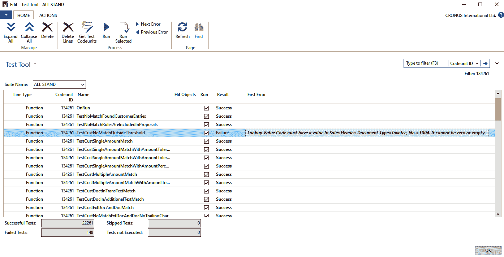

1.  启动调试会话：

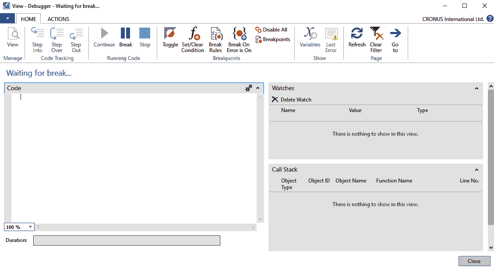

1.  使用“运行选中的测试”运行单独的测试：

*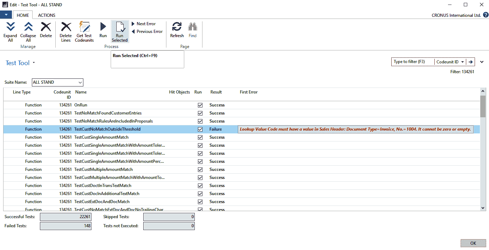*

1.  让调试器在错误处中断：

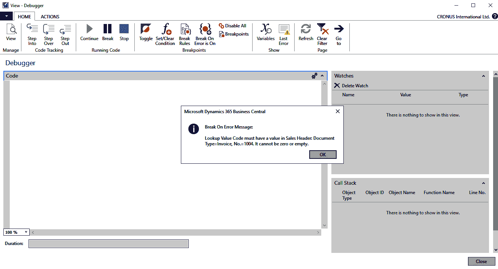

1.  看看错误发生的位置。

    这个问题显然发生在我们扩展中的一个对象里。你可能不太熟悉，因为我们还没有查看过这段代码。这是发布销售单据时，业务规则的实现，要求`Lookup Value Code`字段必须被填写。看看调用`TestField`方法的地方：

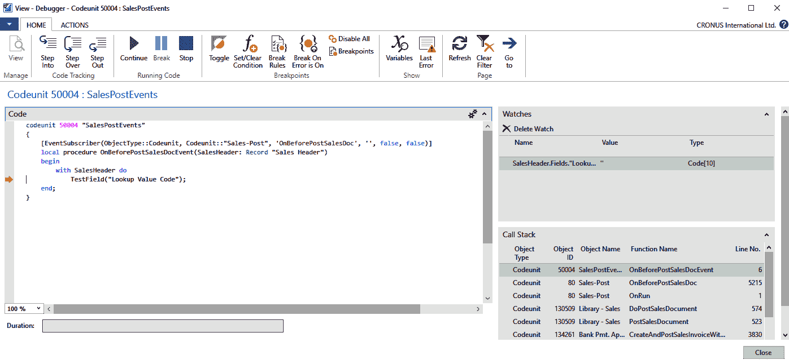

1.  使用调用栈回溯代码。

    注意，我选择了调用栈中紧接着`RunTest`所在行的上一行。`RunTest`是标准测试运行器代码单元（130400）中的主函数，用于调用每个测试代码单元。它上面的一行总是当前测试函数的调用。在这个特定的例子中是`TestCustNoMatchOutsideThreshold`：

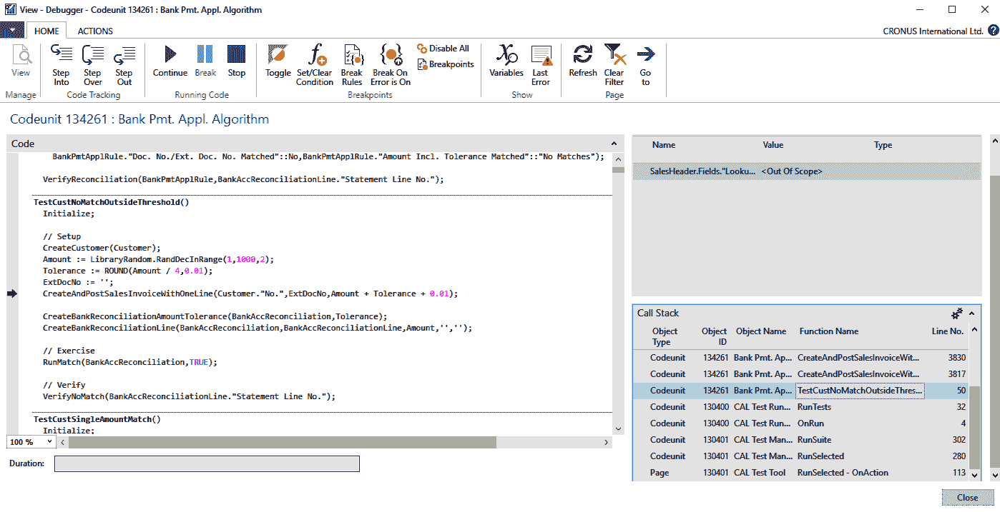

跳转到`TestCustNoMatchOutsideThreshold`后，知道我的扩展是什么，我被`CreateCustomer`的语句行所触发，这一行在绿色指针上方的四行处。显然存在一个本地方法，它作为*新鲜的测试环境*创建了一个客户。我敢打赌，这个客户没有被分配`Lookup Value`。检查`Customer`变量，如下所示，证明了我的猜测是对的：

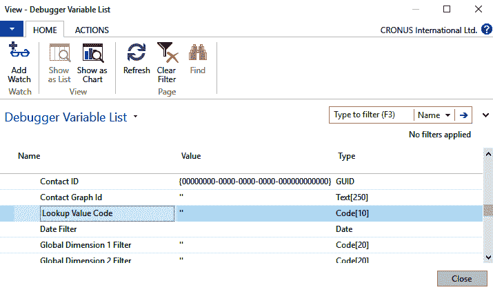

1.  在代码中稍早的地方设置一个断点。

    你可能已经猜到，在调用`CreateCustomer`的那一行：

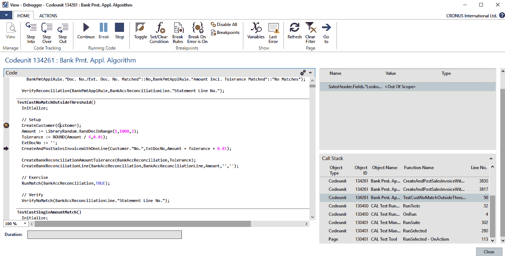

1.  完成代码执行并重新运行测试。

    按计划，它在`CreateCustomer`调用处停止：

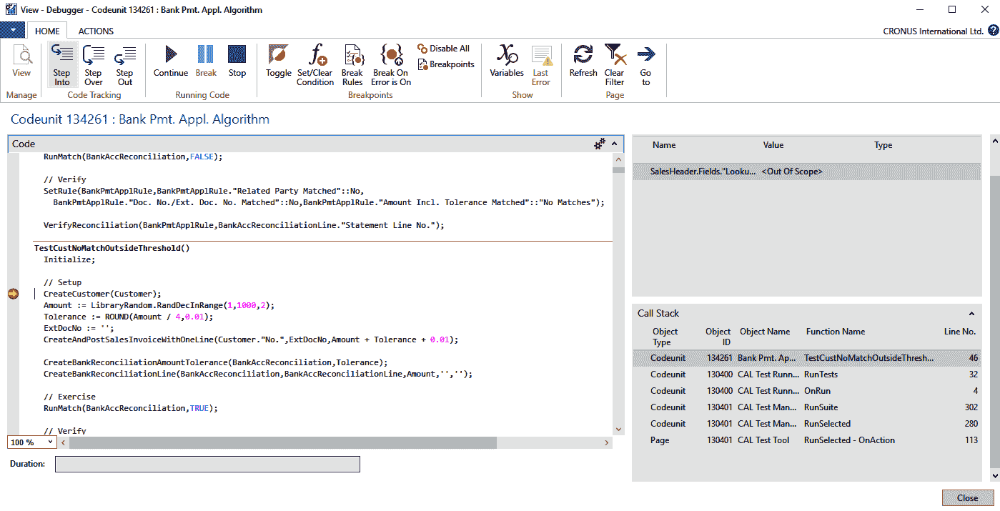

1.  通过逐步调试代码来排查问题。

    我们现在迈出了重要的一步，跳过了本地的`CreateCustomer`方法，直接调用了`Library - Sales`代码单元中的通用辅助方法`CreateCustomer`：

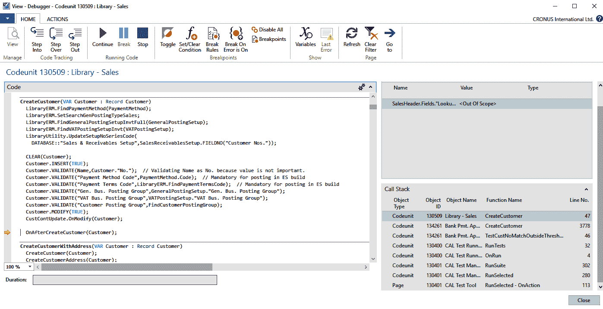

通常我们会在这里修复问题。通常，这个辅助函数会在几乎所有需要新创建客户的测试中被调用。注意`OnAfterCreateCustomer`发布器。我们的修复将包含一个订阅器。

1.  实施修复并从*步骤 1*重新开始。我们将在接下来的章节中详细说明这一点。

最近，微软才开始在其库中的辅助函数中添加像`OnAfterCreateCustomer`这样的发布者。你可能仍然会遇到一些尚未被*批准*的辅助函数，缺乏发布者。

# 修复错误

为了修复该错误，诀窍是向我们的扩展添加一个代码单元，并为`OnAfterCreateCustomer`发布者添加一个订阅者，该订阅者会在客户上设置查找值：

```
codeunit 80050 "Library - Sales Events"
{
    [EventSubscriber(ObjectType::Codeunit,
       Codeunit::"Library - Sales", 'OnAfterCreateCustomer',
        '', false, false)]
    local procedure OnAfterCreateCustomerEvent(
                        var Customer: Record Customer)
    begin
        SetLookupValueOnCustomer(Customer);
    end;

    local procedure SetLookupValueOnCustomer(
                        var Customer: record Customer)
    var
        LibraryLookupValue: Codeunit "Library - Lookup Value";
    begin
        with Customer do begin
            Validate("Lookup Value Code",
                LibraryLookupValue.CreateLookupValueCode());
            Modify();
        end;
    end;
}
```

注意代码单元`Library - Lookup Value`的引用。这是第七章中关于重构讨论的结果，*从客户需求到测试自动化——以及更多内容*。`Library - Lookup Value`包含一个可重用的函数`CreateLookupValueCode`。可以去 GitHub 查看详细信息。

# 再次运行失败的测试

再次部署所有内容并重新运行所有失败的测试。使用我们的测试工具扩展中的“选择失败测试”功能，仅选择失败的测试。在 3,000 多个测试完成处理前，可能需要一些时间。结果是，失败的测试数量降至 559 个。显然，这个修复是一个值得的投资。

# 从测试工具查看调用堆栈

如果你没有调试失败的测试，但仍然希望从测试工具查看调用堆栈，可以从"First Error"字段进入 CAL 测试结果窗口，如第五章中所示，*从客户需求到测试自动化——基础知识*。然后选择调用堆栈操作。在接下来的截图中，调用堆栈显示了我们之前查看的`TestCustNoMatchOutsideThreshold`测试：

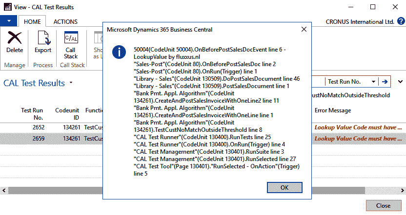

# 一切都与数据有关

根据我的经验，确保标准测试在代码中正常运行，主要是关于正确配置测试环境。就像之前的练习一样，修复我们列表上的第一个错误并非巧合。这是你在让标准测试在代码上运行时会做的一个简单例子：让测试环境处于正确状态。在这个具体的案例中，我们修复了新创建的测试环境。解决其余的错误同样需要更新测试环境。在这些情况下，涉及的是共享的测试环境。

更仔细地查看剩余的失败测试，似乎我们的第一个错误并没有完全消失。为了省去你逐一检查的麻烦，我挑选了以下三个失败的测试：

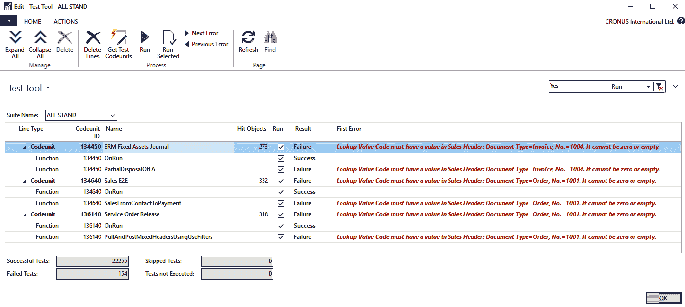

显然，我们为`CreateCustomer`辅助方法提供的通用修复并未对这些产生影响。调试每个失败的测试最终会发现，正在使用预构建的测试环境，也就是来自`CRONUS`演示公司的数据。以第一个测试`PartialDisposalOfFA`为例，来自测试代码单元 134450（`ERM 固定资产日记账`），很明显。来看一下：

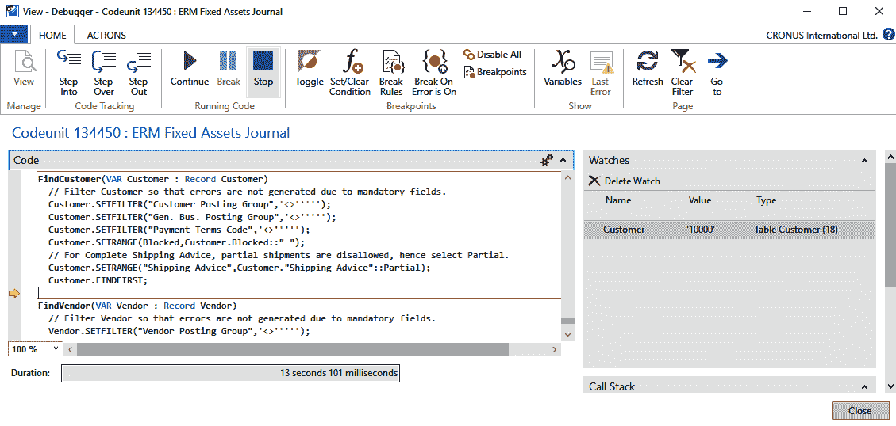

在一组过滤条件下，从数据库中检索第一条客户记录。从 Watches 窗格可以看到，这是 `CRONUS` 中一个熟悉的客户，客户编号为 `10000`。由于我们没有修改预构建的测试数据，`CRONUS` 中的任何客户记录都必须没有查找值。

对于另外两个测试，它们的错误也源于一个不足的预构建测试数据：

+   测试代码单元 134640（`Sales E2E`）中的 `SalesFromContactToPayment` 使用了来自 `CRONUS` 的客户模板

+   测试代码单元 136140（`Service Order Release`）中的 `PullAndPostMixedHeadersUsingUseFilters` 从 `CRONUS` 中检索一个销售单据

结论是，在这三种情况下，我们必须更新预构建的测试数据，也就是创建一个共享的测试数据，确保 `CRONUS` 中已经存在的客户、客户模板和销售单据能够填充它们的 `Lookup Value Code` 字段。为了实现这一点，我们可以利用共享测试数据方法中的一个发布者 `Initialize`，该方法在大多数 Microsoft 测试函数中都有实现。你可能还记得在第四章中提到的结构：*测试设计*。

```
local Initialize()
// Generic Fresh Setup
LibraryTestInitialize.OnTestInitialize(<codeunit id>);
<generic fresh data initialization>

// Lazy Setup
if isInitialized then
  exit();

LibraryTestInitialize.OnBeforeTestSuiteInitialize(<codeunit id>);
<shared data initialization>
Initialized := true;
Commit();
LibraryTestInitialize.OnAfterTestSuiteInitialize(<codeunit id>);
```

我们要么订阅 `OnBeforeTestSuiteInitialize`，要么订阅 `OnAfterTestSuiteInitialize` 发布者。一般来说，我选择订阅第一个，以确保在对测试数据进行任何标准更新之前完成此操作，并且利用 `Commit` 上已经存在的调用。

这是我们修复实现的样子：

```
codeunit 80051 "Library - Initialize"
{
    [EventSubscriber(ObjectType::Codeunit,
         Codeunit::"Library - Test Initialize",
         'OnBeforeTestSuiteInitialize','', false, false)]
    local procedure OnBeforeTestSuiteInitializeEvent(
             CallerCodeunitID: Integer)
    begin
        Initialize(CallerCodeunitID);
    end;

    local procedure Initialize(CallerCodeunitID: Integer)
    var
        LibraryLookupValue: Codeunit "Library - Lookup Value";
        LibrarySetup: Codeunit "Library - Setup";
    begin
        case CallerCodeunitID of
            Codeunit::"ERM Fixed Assets Journal",
            Codeunit::"ERM Fixed Assets GL Journal":
                LibrarySetup.UpdateCustomers(
                  LibraryLookupValue.CreateLookupValueCode());
            Codeunit::"Service Order Release":
                LibrarySetup.UpdateSalesHeader(
                  LibraryLookupValue.CreateLookupValueCode());
            Codeunit::"Sales E2E":
                LibrarySetup.UpdateCustomerTemplates(
                  LibraryLookupValue.CreateLookupValueCode());
        end;
    end;
}
```

请注意，这段代码通过更新 `Customer` 表中现有的记录，修复了代码单元 134453（`ERM 固定资产 GL 日志`）中测试抛出的错误。

新库代码单元 `Library - Setup` 中引入的三个辅助函数正是它们名称所描述的功能：

+   `UpdateCustomers` 更新 `CRONUS` 中已存在的所有客户记录，以便填充它们的 `Lookup Value Code` 字段

+   `UpdateCustomerTemplates` 和 `UpdateSalesHeader` 对所有客户模板和销售单头做了相同的操作

前往 GitHub 学习这些函数的详细信息。

准备好了吗？差不多了。

# 使你的代码可测试

我们本来是想修复标准测试的，结果修复了。但是同时我们忽略了修复它们导致我们自己的一些测试失败了。你明白吗？

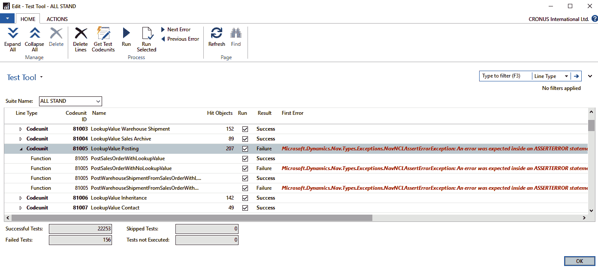

我们有两个失败的测试，它们位于同一个代码单元 `LookupValue Posting` 中：

+   `PostSalesOrderWithNoLookupValue`

+   `PostWarehouseShipmentFromSalesOrderWithNoLookupValue`

这是他们的错误文本：

```
Microsoft.Dynamics.Nav.Types.Exceptions.NavNCLAssertErrorException: An error was expected inside an ASSERTERROR statement.\   at Microsoft.Dynamics.Nav.Runtime.NavMethodScope.AssertError(Action body)\   at Microsoft.Dynamics.Nav.BusinessApplication.C
```

在没有调试的情况下，这些信息已经讲述了一个完整的故事。第一测试方法的代码也确认了这一点：

```
procedure PostSalesOrderWithNoLookupValue();
//[FEATURE] LookupValue Posting Sales Document
var
    SalesHeader: Record "Sales Header";
    PostedSaleInvoiceNo: Code[20];
    SalesShipmentNo: Code[20];
begin
    //[SCENARIO #0027] Check posting throws error on sales
    //                 order with empty lookup value
    Initialize();

    //[GIVEN] A sales order without a lookup value
    CreateSalesOrder(SalesHeader, UseNoLookupValue());
    //[WHEN] Sales order is posted (invoice & ship)
    asserterror PostSalesDocument(
                    SalesHeader,
                    PostedSaleInvoiceNo,
                    SalesShipmentNo);
    //[THEN] Missing lookup value on sales order error thrown
    VerifyMissingLookupValueOnSalesOrderError(SalesHeader);
end;
```

`asserterror`被放置在这里，用来捕捉本应由`PostSalesDocument`抛出的错误。这正是测试错误信息所提示的。我们收到错误的事实意味着并没有发生错误。预期的错误应该是报告`SalesHeader`在发布时缺少查找值。这是`PostSalesOrderWithNoLookupValue`的单一目标（参见`[THEN]`标签）。

没有发生错误的真正原因，是因为`SalesHeader`记录中的`Lookup Value Code`字段为空。这是因为我们在若干个页面之前实现的通用修复，扩展了`CreateCustomer`辅助方法，并通过我们的订阅者`OnAfterCreateCustomerEvent`实现。虽然我把细节留给你在 GitHub 上查看，我在这里只提到，链接到`SalesHeader`记录的客户是通过标准的`CreateCustomer`辅助方法创建的。由于这是由我们的测试触发的，因此结果与预期相反。那么我们该如何解决这些错误呢？

移除`OnAfterCreateCustomerEvent`订阅者不是一个选项，因为它是为了让 2,500 个标准测试成功而存在的。然而，我们可以尝试在我们的测试运行时禁用该订阅者。或者换句话说，我们可以通过应用*Handled 模式*来*模拟*订阅者的行为。在解决我们的问题时，我们将基于这个模式做一些变体。

在这里阅读更多关于 Handled 模式的内容：

[`markbrummel.blog/2015/11/25/the-handled-pattern/`](https://markbrummel.blog/2015/11/25/the-handled-pattern/) 和 [`community.dynamics.com/nav/b/navigateintosuccess/archive/2016/10/04/gentlemen-s-agreement-pattern-or-handling-the-handled-pattern`](https://community.dynamics.com/nav/b/navigateintosuccess/archive/2016/10/04/gentlemen-s-agreement-pattern-or-handling-the-handled-pattern)

# 应用 Handled 模式

想要绕过订阅者影响的测试代码单元会在共享的测试环境中创建一条记录，并选中一个布尔字段，名为`Skip OnAfterCreateCustomer`。在`OnAfterCreateCustomerEvent`订阅者中勾选这个字段将使我们能够完全执行订阅者，或者直接跳过它。这就是订阅者的更新方式：

```
[EventSubscriber(ObjectType::Codeunit,
    Codeunit::"Library - Sales", 'OnAfterCreateCustomer',
    '', false, false)]
local procedure OnAfterCreateCustomerEvent(
                    var Customer: Record Customer)
var
    LibraryTestsSetup: Codeunit "Library - Tests Setup";
begin
    if LibraryTestsSetup.SkipOnAfterCreateCustomer() then
        exit;

    SetLookupValueOnCustomer(Customer);
end;
```

辅助函数`SkipOnAfterCreateCustomer`是一个新的库代码单元`Library - Tests Setup`的一部分，它将检查我们新设置表中的`Skip OnAfterCreateCustomer`字段：

```
procedure SkipOnAfterCreateCustomer(): Boolean
var
    TestsSetup: Record TestsSetup;
begin
    with TestsSetup do begin
        Get();
        exit("Skip OnAfterCreateCustomer");
    end;
end;
```

唯一需要采取的步骤是将以下代码添加到相关的`Initialize`函数中：

```
local procedure Initialize()
var
    LibraryTestsSetup: Codeunit "Library - Tests Setup";
begin
    if isInitialized then
        exit;
    LibraryTestsSetup.SetSkipOnAfterCreateCustomer(true);
    LocationSetup();

    isInitialized := true;
    Commit();
end;
```

这是一种让代码可测试的方法。在这个示例中，我们将其应用于测试代码，但以类似的方式，你也可以将其应用于应用程序代码。通过在代码中插入发布者，你使得订阅者能够控制流程，就像你测试代码中的表单一样。

正如你可能知道的，Dynamics 365 Business Central 允许你在合适的情况下动态绑定和解绑订阅者。遗憾的是，在我们的测试案例中，这并不可行，因为我们不能完全控制标准的测试代码单元。

阅读更多关于绑定订阅者的信息，请访问：[`docs.microsoft.com/en-us/dynamics365/business-central/dev-itpro/developer/methods-auto/session/session-bindsubscription-method`](https://docs.microsoft.com/en-us/dynamics365/business-central/dev-itpro/developer/methods-auto/session/session-bindsubscription-method)

# 这一切真的都是关于数据吗？

当然不是。但在大多数标准测试失败的案例中，结果通常是这样的。基于这个经验，我在解决标准测试失败时的最佳实践是以下步骤。尝试通过调整以下内容来修复错误：

1.  共享夹具；如果这没有解决问题。

1.  新的夹具；如果仍然不行。

1.  测试代码，通常是验证部分，在这种情况下你遇到了测试代码的 bug；如果仍然不起作用。

1.  在应用代码中，你发现了一个*真正的* bug！

# 总结

在本章中，你了解了为什么你需要使用微软测试，如何在你的 Business Central 代码中应用它们，以及如何修复它们可能引发的错误。你了解到，大多数修复都与调整测试夹具有关，无论是*共享*的还是*新的*。

本章内容到此为止，本书也即将结束。但你在测试自动化的旅程才刚刚开始。对我而言，每次拿起它依然很有趣。它让我在应用代码中迷失方向，发现我的测试结果并提醒我。它让我可以随时重构代码。它还让我更容易反思代码质量，因为它可以被修改并立即检查。我可以继续称赞它，或多或少地重新写一遍本书的第一章。但我不会，因为现在是时候总结一下了。我希望你像我写书时一样享受阅读和实践的过程。
