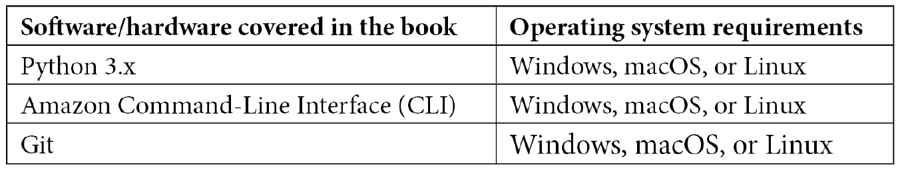

# 前言

越来越多的公司正在转向云计算，特别是**Amazon Web Services**（**AWS**）云服务。进入云端后，这些公司和企业希望通过采用 DevOps 实践中的技术来精简其流程和**软件开发生命周期**（**SDLC**）。这包括自动化构建和发布流程，使开发团队能够专注于编写客户所需的代码和功能。还包括确保日志记录和监控到位，这不仅仅是为了在部署清单上勾选一个选项，而是为了使团队能够快速找到问题的根本原因，无论是性能问题、错误问题，还是安全问题。

对于熟练且认证的 AWS 专业人士的需求达到了历史最高点并且还在增长。通过 AWS DevOps 工程师专业认证考试，您可以立刻与他人区别开来，证明您不仅花时间和精力学习这些宝贵的技能，还通过了 AWS 专业认证这一严格的标准。

AWS 提供的认证，尤其是专业认证考试，绝非易事。行业内的从业者和招聘方都知道这一点。考试本身不仅需要耗费大约 3 小时的时间，而且还在不断更新。

这次考试有大量信息需要消化和理解。您不仅需要了解 AWS 提供的蓝图中涵盖的主题，还需要具备扎实的 AWS 知识基础，以便有效地使用这些服务。如果您有实际的工作经验，或者至少有动手实践的经验，那将大大帮助您。这也是本书中包含的练习的意义所在。它们不仅仅是一个终点，而是一个起点，帮助您构建其他项目，从而在参加考试时，能够自信地点击“开始”按钮，拥有通过认证考试所需的技能和知识，并将您的职业生涯提升到一个新的水平。

本书旨在帮助您扎实掌握 AWS DevOps 专业认证考试中涉及的服务。这通过多种方式实现。书中为许多服务提供了示例架构，帮助您可视化不同服务如何协同工作。书中还提供了大量的实践示例，帮助您了解如何在实际场景中应用这些服务。此外，还提供了不同服务的最佳使用案例和反模式示例。这些内容对于评估专业认证考试中的问题尤为重要，因为这些问题通常呈现为大型场景格式。理解某项服务在哪些场景下最为合适，在哪些场景下不适用，有助于您作出正确的选择。

最后，本书不仅是一本通过考试的学习指南，还是通过考试后日常工作中的参考指南。这就是*超越*的意义所在。书中提供了额外的信息，这些信息虽然不要求出现在考试中，但有意为之。我想分享一些我在与各种企业（从中小型公司到大型财富 100 强企业）在 AWS 上合作过程中积累的多年经验。

# 本书的目标读者

无论你在 AWS 的旅程中处于何种阶段，如果你有成为认证 DevOps 专业工程师的愿望，那么本书将帮助你理解基本概念和服务，同时考察考试大纲中涵盖的关键服务。

在开篇的章节中，我们为 AWS 世界中什么是“优秀”奠定了基础，尽管这看起来像是很多理论，但它有助于你解决考试题目中提出的许多复杂场景。书中还提供了大量的实践练习，帮助你使用一些可能不熟悉的服务，以便你在考试期间和之后都能获得信心和经验。

在每章的结尾，都有知识评估，帮助自我检查是否掌握了不仅能通过这项具有挑战性的考试，还能成功完成未来云计算领域其他任务所需的信息。

# 本书涵盖的内容

*第一章*，*亚马逊 Web 服务支柱*，聚焦于构成 AWS Well-Architected Framework 的基础支柱。通过理解这些支柱，你将更好地理解认证考试中所提问题的背景。

*第二章*，*基本 AWS 服务*，探讨了大量基本的 AWS 服务，了解这些服务对于继续学习后续章节至关重要。对一些已经通过初级认证考试的人来说，这可能看起来像是复习。然而，它也能作为一个快速回顾，并提供一些之前未曾了解的小技巧。

*第三章*，*AWS 中的身份与访问管理及处理机密*，聚焦于 AWS 的基本安全构建块，即通过 IAM 服务进行身份和访问管理。在简要介绍 AWS 的共享安全模型以及授权与认证的概念后，我们将回顾创建用户和用户组的过程。本章还涵盖了通过跨账户访问提供对其他账户的访问权限，并进行实际操作练习。在这一基础安全章节中，我们还会讨论其他在考试题目中可能出现的重要安全服务，如 AWS 目录服务、Secrets Manager 和 Systems Manager Parameter Store。本章还将比较 AWS 目录服务的不同版本使用场景，并讨论哪些服务更适合存储你的机密。最后，我们将介绍 Amazon Cognito，以及它如何帮助应用程序认证。

*第四章*，*亚马逊 S3 Blob 存储*，聚焦于 AWS 简单存储服务（S3）中的一个关键服务。尽管此服务易于立即开始使用，但它也具有许多功能和特性，若你打算获得 AWS 认证，必须了解这些功能和特性。

*第五章*，*亚马逊 DynamoDB*，解释了原生的 NoSQL 数据库 DynamoDB。它不仅讲解了 DynamoDB 的一些基本概念，还涉及诸如流、全球表、使用 DynamoDB 加速器，甚至使用 Web Federation 连接到 DynamoDB 表等主题。

*第六章*，*理解 CI/CD 和软件开发生命周期（SDLC）*，聚焦于持续集成、持续开发和持续部署的许多理论方面。接下来，我们将介绍 SDLC，并查看哪些服务映射到 SDLC 的不同阶段。

*第七章*，*使用 CloudFormation 模板部署工作负载*，教你如何使用原生的 CloudFormation 服务来进行基础设施即代码（IaC）。首先，我们将介绍 CloudFormation 模板的基础知识，然后快速进入基本模板的变更集创建示例，接着讨论内在函数和嵌套堆栈。利用 CloudFormation 模板的知识，我们将讨论如何使用 ServiceCatalog 为开发人员和非开发人员快速便捷地提供模板设计。本章最后，我们将讨论 Cloud Development Kit，它可以用你选择的编程语言编写，然后用来创建 CloudFormation 模板。

*第八章*，*使用 CodeCommit 和 CodeBuild 创建工作负载*，引导您使用 AWS 原生工具进行软件开发生命周期（SDLC）的初步步骤。我们首先创建一个全新的用户组和用户，并为其分配一整套仅限该角色的权限。创建了初始的 CodeCommit 仓库后，我们让开发者使用 Git 将代码提交到特性分支，并请求将其合并到主分支。接下来，我们通过让 CodeBuild 服务使用 AWS CodeBuild 构建一个容器，来探讨 CodeBuild 服务。

*第九章*，*使用 CodeDeploy 和 CodePipeline 部署工作负载*，展示了如何使用原生的 AWS CodePipeline 服务创建 DevOps 管道。这一章涉及了我们之前讨论和练习过的许多服务。示例中的管道是通过 CloudFormation 模板构建的。我们之前创建的开发者用户需要扩展权限，以便查看和运行我们的管道，因此本章还包含了扩展他们 IAM 权限的练习。此外，本章还讨论了如何使用 AWS CodeDeploy 服务来部署工作负载。

*第十章*，*使用 AWS OpsWorks 管理和部署您的应用堆栈*，重点介绍了如何使用 AWS OpsWorks 服务创建堆栈和层，以便部署基础设施和应用程序。文中对不同版本的 OpsWorks 进行了比较，并附有一个练习，指导如何创建包含层和应用程序的堆栈。

*第十一章*，*使用 Elastic Beanstalk 部署您的应用程序*，详细讲解了 DevOps 专业考试中的一个关键服务——Elastic Beanstalk。使用 EB CLI 在 Elastic Beanstalk 中创建并部署应用程序，不仅能让你从开发者的角度观察事物，还能帮助你思考如何在现实世界中自动化这些任务。

*第十二章*，*Lambda 部署与版本管理*，探讨了无服务器计算的概念，并介绍了如何使用 AWS Lambda 平台进行无服务器计算。通过按需计算和按使用量计费的方式运行计算任务，可以带来显著的成本节约，这种模式正成为当今组织中越来越受欢迎的趋势。我们不仅讨论了如何部署和监控 Lambda 函数，还讨论了如何实现版本管理和别名。在本章的最后，我们还将演示如何在步骤函数中协调多个 Lambda 函数的运行。

*第十三章*，*蓝绿部署*，重点介绍了蓝绿部署策略及其不同的变种，包括哪些服务可以使用这些策略以及如何根据你使用的服务来实施不同的策略。在使用 EC2 实例和自动扩展组时，你可以采用特定的策略，而在使用 Lambda 函数时，也有其他可用的策略。本章的核心目标是确保即使在部署过程中遇到问题，你的最终用户和客户也能享受到无缝的体验。

*第十四章*，*CloudWatch 和 X-Ray 在 DevOps 中的角色*，展示了监控和日志记录在使用 AWS 原生 CloudWatch 和 X-Ray 服务中的作用。日志流和日志搜索可能是繁琐的任务，有时感觉就像在大海捞针。性能问题也同样如此。将 X-Ray 服务添加到 Lambda 应用中，可以帮助你快速定位问题所在，并知道如何解决这些问题。

*第十五章*，*CloudWatch 指标和 Amazon EventBridge*，展示了如何使用来自各个服务的指标，并将其与 Amazon EventBridge 服务结合，创建自动化的系统警报。我们讨论了哪些指标对于不同的关键服务最为有用，帮助我们保持监控。我们还演示了如何在 Amazon CloudWatch 控制台中创建仪表板。

*第十六章*，*生成的各种日志（VPC 流日志、负载均衡器日志和 CloudTrail 日志）*，探讨了 AWS 服务生成的其他类型日志，这些日志并非 CloudWatch 日志。这些日志在故障排除时非常有价值，可能需要在某些或所有情况下启用。作为 DevOps 专业人员，了解如何获取这些日志以及如何搜索这些日志可能是你需要执行的任务。

*第十七章*，*高级和企业日志场景*，展示了构建和处理日志文件的现实场景和架构。这不仅包括 CloudWatch 和 CloudTrail 服务，还包括 Elasticsearch、Kinesis 和 Lambda 等服务，用于实时处理多个日志流。理解如何收集和处理大量日志文件的概念，对于现实工作中的应用和 DevOps 专业认证考试中的潜在场景都至关重要。

*第十八章**,* *自动扩展和生命周期挂钩*，详细讲解了自动扩展和自动扩展组的工作原理。这包括检查自动扩展生命周期和生命周期挂钩。还有一个练习，指导你创建启动模板，这是启动配置的继任者。我们还将进行实践，介绍如何在自动扩展组内删除和终止实例。

*第十九章*，*保护静态和传输中的数据*，展示了如何使用诸如密钥管理服务和 Amazon 证书管理器等服务，保护既处于静态状态又在传输中的数据。如果你使用基础设施即代码构建系统，你需要将这些关键部分集成到你的系统中，以确保从一开始就保护你的数据安全。

*第二十章*，*使用系统管理器的角色和 AWS Config 强制执行标准和合规性*，重点讲解了如何使用自动化来保持 AWS 环境的合规状态。通过使用 AWS Config 服务，你可以持续检查在 AWS 环境中创建的内容。将此与标记违规行为的规则结合使用，对于不允许的内容，可以发送警报或执行自动化的执行和修复。再加上系统管理器的功能，它可以使用运行手册自动在实例上安装软件，满足病毒扫描器等合规性需求，或进行定期的操作系统升级；这样，创建执行任务的审计日志就变得更加容易。

*第二十一章*，*使用 Amazon Inspector 检查你的环境*，演示了如何使用 Amazon Inspector 服务向你的 DevOps 生命周期添加自动化安全扫描。我们将讨论如何以自动化和手动的方式配置 Inspector 服务，然后查看和理解 Inspector 生成的不同报告。

*第二十二章*，*其他需要了解的策略和标准服务*，介绍了一些在 DevOps 专业考试中可能出现的服务，但未包含在其他章节中。这些服务包括 AWS GuardDuty、Amazon Macie 和服务器迁移服务。我们还将再次讨论 AWS Organizations 及其与服务目录服务的整合，以确保你全面了解这些服务如何协同工作。

*第二十三章*，*DevOps 专业认证考试概述*，解释了测试过程本身。它还列出了你应该与本书结合使用的额外资源，以便阅读和备考，以及一些学习技巧。

*第二十四章*，*实践考试 1*，主要是为了帮助你检查准备情况。本章展示了考试中会出现的问题，并提供了答案和解释，帮助你理解为什么选择正确答案。

# 为了最大程度地从本书中受益

以下领域的知识将帮助你更好地理解本书内容：

+   软件架构、编程语言和应用设计的知识

+   关系型和非关系型数据库的知识

+   AWS 区域和地理位置的知识

+   对 JSON 和 YAML 文件格式的理解

+   操作系统基础知识和系统命令的知识

+   应用程序和系统可用性的日志记录与监控知识



*设置 AWS CLI 是完成本书中许多练习的必要步骤。安装 CLI 的逐步操作指南可以在* *第二章*，基础 AWS 服务中找到，*如果你的计算机上尚未安装 CLI。*

**如果你正在使用本书的数字版，我们建议你自己输入代码或从书中的 GitHub 仓库访问代码（下节会提供链接）。这样可以帮助你避免因复制粘贴代码而导致的潜在错误。**

# 下载示例代码文件

你可以从 GitHub 下载本书的示例代码文件，链接：[`github.com/PacktPublishing/AWS-Certified-DevOps-Engineer-Professional-Certification-and-Beyond`](https://github.com/PacktPublishing/AWS-Certified-DevOps-Engineer-Professional-Certification-and-Beyond)。如果代码有更新，GitHub 仓库中的代码将会同步更新。

我们还提供了其他代码包，可以从我们丰富的书籍和视频目录中找到，链接：[`github.com/PacktPublishing/`](https://github.com/PacktPublishing/)。快来看看吧！

# 下载彩色图像

我们还提供了一个 PDF 文件，包含本书中使用的截图和图表的彩色图像。你可以在此下载：`static.packt-cdn.com/downloads/9781801074452_ColorImages.pdf`。

# 使用的约定

本书中使用了多种文本约定。

`文本中的代码`：表示文本中的代码词、数据库表名、文件夹名称、文件名、文件扩展名、路径名、虚拟 URL、用户输入和 Twitter 账号。举个例子：“你将看到用户名和密码都未加密地返回在 `SecretString` 字段中，供你使用。”

一段代码块的格式如下：

```
{
  "Project_ID": {"N": "0100"},
  "Dept": {"S": "Test Team"},
  "Dept_ID": {"N": "0001"},
  "Project_Name": {"S": "Serverless Forms"},
  "Owner": {"S": "Jerry Imoto"},
  "Builds": {"NS": ["2212121"] },
  "Language": {"S": "python" },
  "Contact": {"S": "test_team@testcompany.com" }
}
```

当我们希望你关注代码块的某个特定部分时，相关的行或项会用粗体显示：

```
[default]
exten => s,1,Dial(Zap/1|30)
exten => s,2,Voicemail(u100)
exten => s,102,Voicemail(b100)
exten => i,1,Voicemail(s0)
```

任何命令行的输入或输出如下所示：

```
$ aws iam list-groups --output text
$ aws iam create-group --group-name Admins
```

**粗体**：指示新术语、重要词汇或您屏幕上看到的词语。例如，菜单或对话框中的词语显示为**粗体**。以下是一个示例："您可以选择使用 SSE-S3 或您选择的**密钥管理服务（KMS）**密钥来加密报告。"

提示或重要说明

显示为这样。

# 保持联系

我们随时欢迎读者的反馈。

`customercare@packtpub.com`并在您的消息主题中提及书名。

**勘误**：尽管我们竭尽全力确保内容的准确性，错误偶尔还是会出现。如果您在本书中发现错误，我们将不胜感激您的报告。请访问[www.packtpub.com/support/errata](http://www.packtpub.com/support/errata)并填写表格。

`copyright@packt.com`与资料链接。

**如果您有兴趣成为作者**：如果您对某个专题有专业知识，并且有意撰写或为一本书作出贡献，请访问[authors.packtpub.com](http://authors.packtpub.com)。

# 分享您的想法

一旦您阅读了《AWS 认证 DevOps 工程师-专业认证及更多内容》，我们很乐意听取您的想法！请单击此处直接转到此书的亚马逊评论页面并分享您的反馈。

您的评论对我们和技术社区非常重要，将帮助我们确保提供优质内容。
