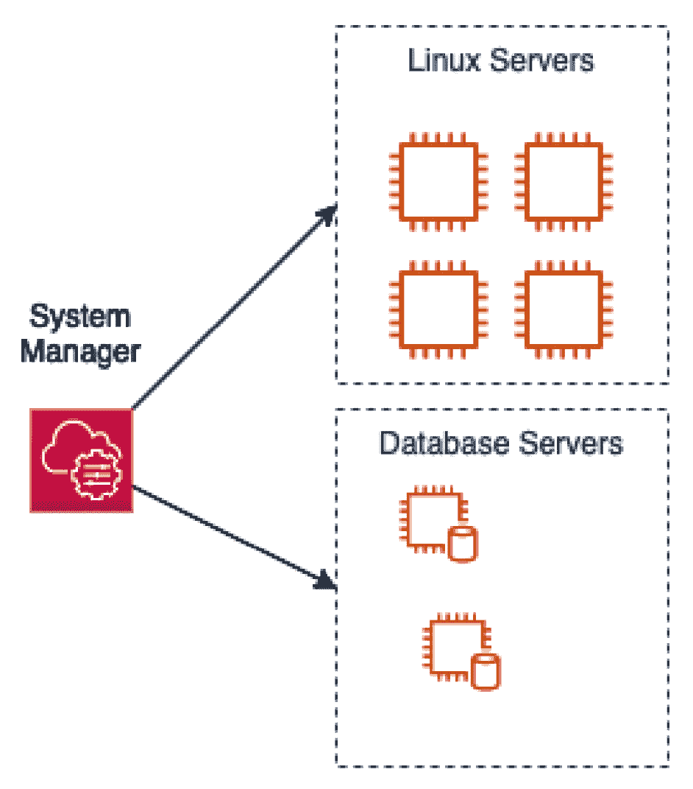
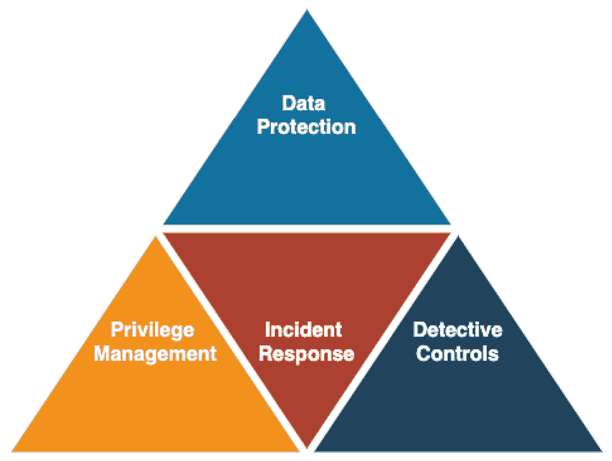
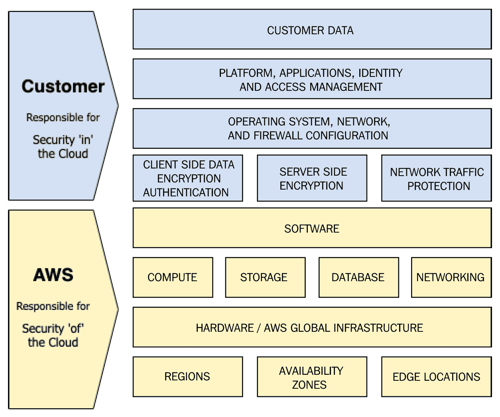
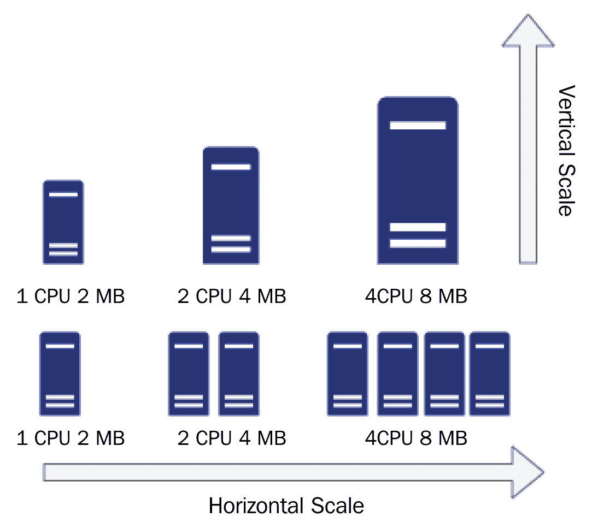
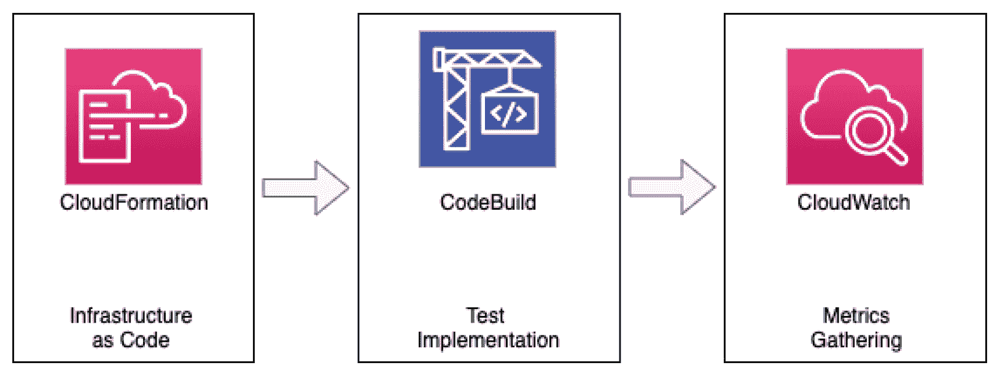

# 第一章：Amazon Web Services 支柱

DevOps 本质上是开发与运维技能的结合，并打破这两个不同团队之间的壁垒。DevOps 使开发人员能够轻松执行运维任务。DevOps 还包括赋能运维团队成员创建自己的基础设施即代码，并使用其他编码技术，如持续集成流水线，以便在多个区域快速部署相同的基础设施。

本书将介绍 DevOps 专业考试中涉及的服务和概念，以便你从实践角度，既通过讲解又通过动手练习，拥有扎实的理解。

成为 Amazon Web Services（AWS）认证工程师不仅能立即验证你所掌握和保持的技术技能，还能强化你作为技术专业人士的能力。AWS DevOps 工程师专业认证是一个累积性的考试，涵盖了 AWS 基础服务的基本知识，包括在 AWS 上运行、管理和监控工作负载的系统操作能力。这些内容还包括将代码开发并部署到函数、容器和实例。

我们将在 *第二十三章* 中更深入地探讨考试本身，*DevOps 专业认证考试概述*，并提供一些应试技巧。

AWS 支柱是指导架构师和开发人员在通用云架构和设计中普遍接受的五个指导原则。在 DevOps 专业考试中，这些支柱被间接引用，但它们及其指导方针是与任何云服务提供商合作的最佳实践的基石——尤其是 Amazon Web Services。这些原则是 DevOps 实践和流水线中的指导原则，深入理解这五个方面不仅能帮助你顺利通过考试，还能在你的 DevOps 职业生涯中提供帮助。

在本章中，我们将涵盖以下主要主题：

+   操作卓越

+   安全性

+   可靠性

+   性能效率

+   成本优化

# 服务支柱概述

一开始，你可能会想，为什么我们不直接进入 AWS、**持续集成/持续交付**（**CI/CD**）以及其他 DevOps 相关主题。主要原因是这五个支柱是考试的基础框架。此外，它们将帮助你为公司或客户提供最有效、可靠和高效的环境。这些设计原则不仅在为成功架构 Amazon Web Services 或任何云服务提供商时至关重要，而且在指导你日常工作的实践时同样适用。

一旦您熟悉了这些支柱，您会在进行认证的过程中看到它们及其主题，尤其是在获得 DevOps 专业认证时，测试问题中会涉及到操作、安全性和可靠性等特定部分。

以下是良好架构框架的五个支柱：

+   运营卓越

+   安全性

+   可靠性

+   性能效率

+   成本优化

将这些支柱作为指导原则，不仅用于设计在 AWS 中的工作负载，还用于改进和重构当前的工作负载。每个组织都应努力实现良好架构的应用程序和系统。因此，改进您正在处理的任何 AWS 应用程序将使您成为宝贵的资产。现在，让我们详细看看这些支柱。

# 运营卓越

当我们查看*运营卓越*支柱时，特别是在 DevOps 的背景下，这是一个——如果不是最重要的话——对于您日常职责来说最为重要的服务支柱之一。我们将从思考团队如何组织开始；毕竟，DevOps 运动的出现就是为了打破开发与运维团队之间的壁垒。

问题 – 您的团队如何确定其优先事项？

* 是否与客户沟通（无论是内部客户还是外部客户）？

* 是否从已绘制出路线图的产品负责人那里获得方向？

亚马逊概述了五个设计原则，将运营卓越融入云计算中：

+   将操作视为代码执行

+   经常精炼操作

+   进行小规模、频繁且可逆的更改

+   预见失败

+   从所有操作失败中学习

让我们详细看看这些操作设计原则，看看它们如何与您作为 DevOps 工程师的工作相关。随着您逐步了解这些设计原则，不仅仅是这个支柱，而是所有服务支柱，您会发现最佳实践已明确列出，辅以不同的服务，帮助您完成目标。

## 将操作视为代码执行

借助基础设施即代码（Infrastructure as Code）的构想，云计算使团队能够仅通过代码创建应用程序，而无需与图形界面进行交互。此外，它还允许任何底层的网络、服务、数据存储等，这些都是运行您的应用程序和工作负载所必需的。将大部分（如果不是所有）操作转移到代码中，可以为团队带来以下好处：

+   快速分发知识，防止团队中只有一个人能够执行某个操作

+   允许进行同行评审环境，并进行快速迭代

+   允许快速测试更改和改进，而不会干扰生产环境

在 AWS 中，你可以通过几种不同的服务执行操作代码，例如**CloudFormation**、**Cloud Development Kit**（**CDK**）、特定语言的**软件开发工具包**（**SDK**），或者通过使用**命令行界面**（**CLI**）。

## 经常精炼操作

在云端运行工作负载时，你应该处于一个持续改进的过程，不仅是应用程序和基础设施，也包括你的操作方法。采用敏捷流程的团队通常会在每个冲刺后进行回顾会议，提出三个问题：什么做得好，什么做得不好，哪些方面有改进空间？

在云端运行工作负载同样为回顾提供了机会，可以提出那些相同的三个问题。回顾不必发生在冲刺之后，但应该在以下事件之后进行：

+   自动化、手动或混合部署

+   自动化、手动或混合测试

+   在生产问题发生后

+   进行游戏日模拟

在每种情况之后，你应该能够回顾当前的操作设置，并查看哪些方面可以改进。如果你为事故或部署创建了逐步执行手册，问问自己和团队，是否有遗漏的步骤或不再需要的步骤。如果发生了生产问题，是否配置了正确的监控来排查该问题？

## 做小而频繁且可逆的更改

随着我们将工作负载迁移到云端，最好遵循的设计实践是将大型的单体设计拆分成更小、更解耦的组件，而不是将多个系统放在同一台服务器上。通过将组件做得更小、解耦且更易管理，可以处理更小的、更可逆的变化，以应对可能出现的问题。

逆转更改的能力也可以体现在良好的编码实践中。AWS CodeCommit 允许在代码仓库中使用 Git 标签。在每次发布部署后，通过为每个版本打标签，你可以快速重新部署以前的工作版本，以防代码库中出现问题。Lambda 也有类似的功能，称为版本。

## 预见故障

不要认为仅仅因为你将应用程序迁移到云端，且所依赖的服务被标记为托管服务，就不再需要担心故障。故障会发生，虽然可能不常见；然而，在经营业务时，任何形式的停机都可能导致收入损失。拥有一个应对风险的计划（并且测试该计划）实际上可能意味着保持你的**服务级别协议**（**SLA**）与不得不道歉，甚至更糟的是不得不给客户补偿或退款之间的差异。

## 从失败中学习

事情偶尔会失败，但当它们失败时，重要的是不要纠缠在失败中。相反，进行事后分析，并找到可以使团队和工作负载更强大和更具弹性的教训。跨团队分享学习有助于集中每个人的视角。失败后应该问并回答的一个主要问题是，*问题是否可以通过自动修复来解决？*

当今较大组织中的一个重要问题是，在追求伟大的过程中，它们停止了做好的努力。有时，您需要在日常事务中做好您所做的事情。这可能是通往伟大的垫脚石。然而，如果没有回顾阻碍您变得优秀的原因，永恒追求卓越有时可能只是在原地打转，而不是获得进展。

## 示例 – 运营卓越

让我们来看一个相关示例，展示了在环境中为实例实施自动化补丁的情况：

图 1.1 – 运营卓越 – 自动化补丁组

如果您的环境中有需要自行管理并需要更新补丁的实例，那么您可以使用**系统管理器** – **补丁管理器**来帮助自动化保持操作系统的更新任务。这可以通过使用系统管理器维护任务定期完成。

初始步骤是确保安装了**SSM**代理（以前称为**简易系统管理器**）在您希望通过补丁保持更新的机器上。

接下来，您将创建一个补丁基线，其中包括在发布后几天内自动批准补丁的规则，以及已批准和已拒绝补丁的列表。

之后，您可能需要修改实例上的 IAM 角色，以确保 SSM 服务具有正确的权限。

可选地，您可以设置补丁管理组。在前面的图表中，我们可以看到我们有两种不同类型的服务器，它们都运行在相同的操作系统上。然而，它们运行不同的功能，因此我们希望为 Linux 服务器设置一个补丁组，为数据库服务器设置另一个组。数据库服务器可能只会获得关键补丁，而 Linux 服务器可能会获得关键补丁以及更新补丁。

# 安全

下一个是 AWS Well-Architected Framework 的安全支柱。今天，安全问题是每个人头脑中的重要问题。恶意行为者始终试图找到任何代码和基础设施（无论是在本地还是在云中）的漏洞。回顾 AWS 前 10 年的经验教训时，CTO Werner Vogels 表示*保护您的客户应始终是您的首要任务...对 AWS 来说绝对如此*。（Vogels，2016）

如今，确保所有云系统具有安全实践是每个人的责任。这种（保护）包括为应用程序服务的基础设施和网络组件，使用安全编码实践和数据保护，最终确保客户拥有安全的体验。

当你思考安全时，安全支柱关注四个主要领域。它们在下图中展示：

图 1.2 – 安全支柱中的四个主要安全领域

安全支柱由七个原则构成：

+   实施强大的身份基础

+   启用可追溯性

+   在所有层面应用安全性

+   自动化安全最佳实践

+   保护传输中和静态数据的安全

+   将人员远离数据

+   准备应对安全事件

在本书的过程中，你将找到一些针对安全支柱中介绍的安全原则的实际答案和解决方案。这将帮助你养成将安全性融入到所构建的每个部分中的肌肉记忆，而不是将自己的部分交给*安全团队*去担心。记住，安全是每个人的责任。最初，我们将更详细地了解这些安全原则。

## 实施强大的身份基础

在建立强大的身份基础时，一切从实现最小权限原则开始。任何用户或角色的权限都不应多于或少于执行其工作或职责所需的权限。如果进一步深化这个概念，如果你使用 IAM 来管理用户，那么请确保密码策略到位，以确认密码定期轮换，避免密码变得过时。检查 IAM 密码策略与公司密码策略是否一致也是一个好主意。

此外，随着组织的成长和用户与权限管理变得更加复杂，你应考虑建立集中身份管理，使用 Amazon 单点登录或连接公司 Active Directory 服务器。

## 启用可追溯性

安全事件可能会让你处于被动应对的状态；然而，你的反应能力取决于你能够收集到多少关于该事件的信息。在事件发生之前，建立适当的监控、日志记录、警报以及审计环境和系统的能力，对于在需要时能够执行正确的评估和步骤至关重要。

从多个来源捕获足够的日志可以通过 AWS 服务来实现，例如 CloudWatch Logs、VPC Flow Logs、CloudTrail 等。在本书的第三部分，我们将详细探讨日志记录和监控，因为它们对于 DevOps 专业认证考试非常重要。

**考虑以下场景**：

有人通过弱密码获得了服务器访问权限并且破坏了一些数据。你认为你当前收集了很多日志；然而，你能弄清楚以下问题吗？

+   用于访问系统的用户名

+   用于访问源的 IP 地址

+   访问开始的时间

+   被更改、修改或删除的记录

+   受影响的系统数量

## 在所有层级应用安全措施

保护环境中的所有层级有助于通过为你的行为提供更广泛的覆盖来提高安全性。为了应对网络级别的安全，可以使用简单的技术，如安全组和网络 ACL 来保护不同的 VPC。经验丰富的 AWS 专业人士知道，额外的安全层会扩展安全防护的范围——例如，在边缘（AWS 云的网络接入点）、操作系统级别，甚至通过*向左偏移*来保护应用程序代码本身。

## 自动化安全最佳实践

随着你和你的团队在云端安全实践方面的教育不断深入，重复性的任务应该被自动化。这可以让你更快速地响应正在发生的事件，甚至在你没有意识到事件发生时也能作出反应。

这是你开始深入学习时需要关注的话题。作为一名 DevOps 专家，你习惯于将重复的手动流程通过自动化来提高效率。自动化可以表现为自动分析日志、删除或修复不符合组织安全政策的资源，或智能地检测威胁。

亚马逊 Web 服务推出了一些工具来帮助这一过程，包括 GuardDuty、CloudWatch、EventHub 和 AWS Config。

## 保护传输中和静态存储的数据

坏意图的攻击者无处不在，他们不断寻找可以被利用的、在互联网上未加保护的数据。你绝对不能依赖最终用户使用最佳实践，如通过 VPN 进行安全通信，因此，这项工作需要由你和你的团队在服务器端实施最佳实践。诸如在负载均衡器、CloudFront 分发上，甚至在服务器层面实施证书等基本操作，可以确保数据在传输过程中进行加密，从而实现端到端的安全传输。

同理，打个比方，确保通过启用**传输层安全协议**（**TLS**）或 IPsec 协议来验证网络通信，有助于确保网络通信的认证。

AWS 提供了一些服务来帮助保护你的数据，无论是在传输中还是静态存储中，例如 AWS 证书管理器、AWS Shield、AWS **Web 应用防火墙**（即另一个**WAF**）以及 Amazon CloudFront。**密钥管理服务**（**KMS**）也可以帮助保护静态存储的数据，允许你轻松创建、使用和轮换加密密钥。

要深入了解如何保护传输中和静态数据，请参阅*第十九章*，*保护传输和静态数据*。

## 使用机制将人员与数据隔离

有多种方法可以自动化数据访问，而不是允许个人直接访问数据。通过变更控制过程验证的项目通常是一个更好的选择。这些项目可以是系统管理运行手册或 Lambda 函数，负责访问数据。与此相对的是允许通过堡垒主机或弹性 IP 地址/CNAME 直接访问数据源。

提供这种直接访问可能导致人为错误或用户名和密码被泄露，最终导致数据丢失或泄露。

## 为安全事件做准备

即使您执行了前面描述的所有安全原则，也不能保证未来不会发生安全事件。您最好通过练习并准备一套快速执行的步骤，以防万一。

您可能需要创建一个或多个运行手册或操作手册，列出如何执行任务的步骤，例如拍摄 AMI 快照进行取证分析并将其转移到安全账户（如果有的话）。当这些步骤变得必要时，会有来自不同地方的问题。这些答案将有时间方面的要求。如果负责执行这些任务的团队从未进行过这些任务的练习，也没有为他们制定指南，那么宝贵的时间将被浪费，仅仅是为了组织和安排。

以下是 AWS 与您（客户）之间的*共享责任模型*：

图 1.3 – AWS 共享责任模型

提问问题

* 如何保护您的根账户？

- 根账户上是否有**多因素认证**（**MFA**）设备？

- 根账户是否未被使用？

* 如何分配 IAM 用户和组？

* 如何委派 API/CLI 访问权限？

接下来，让我们了解云端可靠性的五个设计原则。

# 可靠性

云端可靠性设计有五个原则：

+   自动化故障恢复

+   测试恢复程序

+   横向扩展以提高整体工作负载的可用性

+   停止猜测容量

+   管理自动化中的变更

## 自动化从故障中恢复

当你想到自动化故障恢复时，大多数人首先想到的是技术解决方案。然而，这不一定是可靠性服务支柱中所指的上下文。这些故障点应该是基于业务设定的**关键绩效指标**（**KPIs**）。

作为恢复过程的一部分，了解组织或工作负载的**恢复时间目标**（**RTO**）和**恢复点目标**（**RPO**）非常重要。

+   **RTO**（**恢复时间目标**）：服务中断和恢复之间可以接受的最大延迟时间

+   **RPO**（**恢复点目标**）：自上次数据恢复点（备份）以来可接受的最大时间（亚马逊网络服务，2021 年）

## 测试恢复程序

在你的云环境中，你不仅应该测试工作负载是否能正常运行，还应测试它们是否能够从单个或多个组件故障中恢复，特别是在服务、可用区或区域层面发生故障时。

通过使用基础设施即代码、持续集成（CD）流水线和区域备份等实践，你可以快速启动一个全新的环境。这可以包括你的应用程序和基础设施层，能够让你测试其是否与当前生产环境中的工作方式相同，并且数据是否正确恢复。你还可以记录恢复所需的时间，并通过自动化恢复时间来改进它。

主动记录运行手册或操作手册中每一个必要步骤，可以促进知识共享，并减少对构建系统和流程的特定团队成员的依赖。

## 水平扩展以提高工作负载可用性

从数据中心环境过渡时，规划峰值容量意味着找到一台可以运行应用程序所有不同组件的机器。一旦达到该机器的最大资源，就需要迁移到更大的机器。

当你从开发环境迁移到生产环境，或者当你的产品或服务的受欢迎程度增长时，你需要扩展资源。实现这一点的主要方法有两种：垂直扩展或水平扩展：

图 1.4 – 水平扩展与垂直扩展

垂直扩展的主要问题之一是你会在某个时刻碰到瓶颈，必须不断迁移到更大的实例。最终，你会发现没有更大的实例可以迁移，或者更大的实例运行成本太高，无法负担。

另一方面，水平扩展使你能够以成本效益的方式，在需要时获得所需的容量。

采用云思维意味着将应用程序组件解耦，将多个相同的服务器组放在负载均衡器后面，或从队列中拉取并根据当前需求进行最优的上下扩展。

## 停止猜测容量

如果资源被压垮，它们往往会发生故障，尤其是在本地部署时，当需求激增，而这些资源没有能力向上或向外扩展以满足需求时。

有一些服务限制需要注意，尽管它们中的许多被称为*软限制*。这些限制可以通过简单的请求或打电话给支持团队来提高。还有一些被称为*硬限制*。它们是为每个账户设置的固定数字，无法提高。

注意

虽然没有必要记住所有这些限制，但熟悉它们并了解其中的一些限制是个好主意，因为它们有时会出现在一些测试问题中——并不是作为直接问题，而是作为情景的背景。

## 自动化中的变更管理

虽然手动更改基础设施（或应用程序）似乎更容易且有时更快捷，但这可能导致基础设施漂移，并且无法重复操作。最佳实践是通过基础设施即代码、代码版本控制系统和部署管道自动化所有更改。这样，所有更改都可以被追踪和审查。

# 性能效率

如果你和你的架构设计团队来自数据中心基础设施，并且配置过程需要几周或几个月才能获得所需的系统，那么云资源的快速性和可用性无疑是一次清新的体验。需要了解如何根据工作负载需求选择正确的实例类型或计算选项（即基于服务器、容器化或基于函数的计算）。

一旦你做出了初步选择，就应该进行基准测试，以查看你是否充分利用了分配的所有 CPU 和内存资源，并确认工作负载是否能处理它所需执行的任务。在选择实例类型时，不要忘记考虑成本，并记录那些可能节省你资金或在基准测试过程中让你花费更多的成本差异。

AWS 提供了本地工具来创建、部署和监控基准测试，如下图所示：

图 1.5 – 使用 AWS 工具进行基准测试

使用 AWS 提供的工具，你可以快速启动一个环境来进行资源适配、基准测试和负载测试，检查你为计算实例选择的初始值是否合适。你还可以轻松地更换其他实例类型，查看它们在相同测试下的性能表现。通过使用 CloudFormation 构建基础设施，你可以以快速且重复的方式运行测试，使用 CodeBuild 进行测试，同时通过 CloudWatch 收集度量数据，比较结果，确保你做出了最佳决策，并有数据支持这一决策。在 *第七章*中，我们将更详细地讨论如何使用 CodeBuild，[*使用 CloudFormation 模板部署工作负载*]。

*性能效率* 支柱包括五个设计原则，帮助你在云中保持高效的工作负载：

+   让先进技术更易于为你的团队实现

+   能够在几分钟内实现全球化

+   使用无服务器架构

+   允许你的团队进行实验

+   使用与你目标一致的技术

## 让先进技术更易于为你的团队实现

随着托管服务的出现，云计算简化了使用先进技术的过程。你不再需要聘请全职数据库管理员来专门处理不同类型的数据库，以测试 Postgres 或 MariaDB 哪个更优化地运行。类似地，如果你需要该数据库的复制，只需勾选一个框，你就能立即获得高可用的设置。

过去需要花费时间在文档上，努力搞清楚如何安装和配置特定系统，现在这些时间可以用来专注于最重要的事情——为你的客户和业务提供价值。

## 能够在几分钟内实现全球化

根据你运行的应用程序或服务，客户可能会集中在一个地区，或者分布在全球各地。一旦你将基础设施转化为代码，通过 CloudFormation 模板或 CDK 中的构造，你可以利用区域参数快速重用之前构建的模式或架构，并将其部署到世界的其他地区。

即使没有部署完整的应用程序和架构，依然有能力利用**内容分发网络**（**CDN**）CloudFront 来服务全球用户。在这里，你可以使用应用程序创建安全的全球存在，或者在主要区域（即原始区域）部署内容。

## 使用无服务器架构

首先，迁移到无服务器架构意味着不再需要管理服务器。这意味着不再需要在启动时配置带有软件包的服务器，不再需要调整服务器大小，也不再需要修补服务器。

无服务器架构意味着你已经解耦了应用程序。无论是使用函数、事件还是微服务，每个组件都应该执行特定的任务。每个组件只处理其独特任务时，你可以在任务级别微调内存和使用 CPU，并在特定任务级别进行扩展。

这并不是每个工作负载的最佳选择，但不要仅仅因为某个工作负载需要进行少量重构就将其排除。当应用程序可以迁移到无服务器架构时，它可以让生活更轻松，使应用程序本身更加高效，通常还会带来成本节省——特别是在长期看来。

## 允许你的团队进行实验

一旦你迁移到云端，你可以迅速且持续地重构你的工作负载，以提高性能和降低成本。如果你已经将基础设施构建为代码，那么为测试创建一个新的临时环境可以是一个快速且成本高效的方式，尝试你应用程序中的新模块，而无需担心会影响到任何客户或组织的其他部分。

许多实验可能不会成功，但这就是实验的本质。如今的商业竞争异常激烈，找到一个有效的解决方案，使你的服务更快、更便宜、更好，可能会成为真正的游戏规则改变者。

## 使用与工作负载目标对齐的技术

列出你的业务目标，并让产品负责人根据这些目标帮助推动产品和服务的选择。如果开发团队对某些技术已有一定了解，他们可能会倾向于使用那些他们已经自信的技术。

另一方面，还有一些团队力求使用最新的技术，但这并不一定是因为这些技术解决了已识别的问题。相反，他们的兴趣在于不断丰富简历，确保能够尽早接触并体验到最前沿的服务。

# 成本优化

许多人误以为迁移到云端会立即为他们的公司或组织带来成本节约。一旦没有严格的控制措施或无法将工作负载分摊给相关团队时，现实就显现了出来，越来越多的团队发现，配置新资源就像按一个按钮一样简单。一旦账单开始出现，大部分情况下，来自高层的成本削减运动就会随之而来。

在你着手优化成本时，要理解那些已被证明是托管服务的云服务，每分钟的费用较高；然而，人力资源成本却要低得多。你无需*关心和维护*底层服务器，也不需要担心更新底层操作系统。许多服务允许你根据用户需求进行扩展，这些都会自动为你处理。

监控成本和使用情况的能力也是成本优化策略的关键要素之一。拥有一个合理的资源标签策略，可以使负责财务管理 AWS 账户的人进行正确部门的费用分摊。

云中的成本优化有五项设计原则：

+   实施云财务管理

+   采用消费模型

+   衡量整体效率

+   停止为无差异的大量基础设施工作付费

+   分析和归因支出

## 实施云财务管理

云财务管理正在各大组织中迅速发展，无论大小。它需要一个专门的团队（或者一组部分负责此任务的团队成员）来建立一个系统，能够看到云支出的去向。该团队会查看费用使用报告，设置预算警报，跟踪开支，并希望能够执行一个计费标签，以展示每个部门、成本中心或项目的费用分摊。

什么是费用分摊？

IT 费用分摊是一种流程，允许各个部门将费用与特定的部门、办公室或项目关联，从而准确跟踪 IT 支出。我们在此示例中具体指的是云支出，但 IT 费用分摊也应用于 IT 的其他领域，例如会计目的。

## 采用消费模型

使用云并不需要复杂的预测模型来控制成本，尤其是在有多个环境的情况下。开发和测试环境应该能够在不使用时关闭或暂停，从而节省空闲时的费用。这就是云端按需定价的魅力。如果开发人员因数据丢失而抱怨，那么可以教他们在关闭之前使用快照功能备份数据库实例；这样，他们就可以从中断的地方继续开发。

一个更好的策略是自动化在工作日结束时关闭开发和测试环境的过程，并要求使用专门的标签，这样可以防止实例在下班后或周末被关闭。你还可以自动化在工作日开始前 30 到 60 分钟重启实例的过程，以便操作系统有足够的时间启动，确保团队认为它们根本没有被关闭过。只需要注意，任何运行在实例存储上的 EC2 实例可能会丢失数据。

## 衡量整体效率

组织在云预算方面失去效率的最明显方式之一就是忽视停用未使用的资产。虽然在云中启动新服务和创建备份较为容易，但如果没有计划将折旧的数据、卷备份、机器镜像、日志文件和其他物品进行退役，这将增加每月账单的底线。这应该用手术刀而非砍刀进行。数据一旦删除，就无法恢复；然而，并不需要将所有东西永远保存。即使是合规要求，也有一个渐退期，数据可以以更合理的价格存储在冷存储中。

一个完美的例子是 EBS 快照。试图主动保护数据的客户可能每天多次对卷进行快照，并将这些快照复制到灾难恢复区域。如果在 30 天、60 天或 90 天后没有办法使旧的快照失效，那么这个成本中心项可能很快就会成为一个问题。

## 停止在无差异的重型工作上花费资金。

当我们谈论重型工作时，我们指的是在数据中心中架设、堆叠和冷却服务器。运营数据中心是一项 24 小时全天候、365 天的工作，而当你不使用这些机器和存储时，不能轻易关闭它们。将工作负载迁移到云端，减轻了团队成员对数据中心运营的负担，使他们可以将更多时间和精力投入到关注客户需求和功能上，而不是照料和管理服务器及硬件。

## 分析和归因支出

云计算——尤其是 AWS 云——提供了帮助你分析和参考账户费用来源的工具。工具箱中的第一个工具是标签和标签策略。一旦你决定了一个稳定的基础标签集，包括成本中心、部门和应用等内容，你就为其余可用工具奠定了基础。

通过使用 AWS Organizations 从单一账户结构扩展到多个账户和组织单元，可以在不使用账户级别标签的情况下自动分类支出。

AWS 成本探索器允许你的财务管理团队深入分析费用发生的服务和区域，并能够创建自动化仪表板，快速可视化支出。亚马逊网络服务还设定了预设的服务配额，其中一些是不可更改的硬性配额，但许多则是允许你通过简单请求增加特定服务数量（在某个区域内）的软性配额。

# 总体服务支柱原则

《良好架构框架》识别了一套通用设计原则，旨在促进云端的良好设计：

+   在完整生产规模下测试系统。

+   自动化尽可能多的组件，使实验尽可能简单。

+   使用数据驱动架构设计。

+   停止猜测容量需求。

+   允许架构随着新技术和服务的出现而不断演进。

+   利用游戏日推动团队改进。

在你思考这些服务原则并如何将它们付诸实践时，要意识到有时候这些原则可能会感觉相互矛盾。最明显的例子是*成本优化*支柱。如果这是你所在的组织最关注的支柱，其他支柱可能会影响纯粹的成本节约。加强你在*可靠性*支柱中发现的弱点，通常意味着更多的资产，而资产意味着更多的资金。然而，你仍然可以努力使这些资产尽可能具有成本效益，从而符合所有支柱的要求。

# 总结

在本章中，我们学习了指导架构师和开发人员设计良好的五个服务原则。我们讨论了这些原则是如何成为 DevOps 专业考试中的测试问题的基础主题，以及掌握这些基础知识在你确定正确答案时如何帮助你。我们在讨论每个服务支柱时，也讨论了它们的基础设计原则。

我们简要提到了一些不同的 AWS 服务，以及哪些服务支柱或设计原则在特定服务中发挥作用。在下一章中，我们将学习贯穿于你将要工作中的环境和账户的基本 AWS 服务。

# 复习题

1.  Well-Architected 框架的五个支柱是什么？

1.  安全在云中的五个主要领域是什么？

1.  性能效率支柱包含的四个领域是什么？

1.  可靠性支柱包含的三个领域是什么？

1.  RTO 的定义是什么？

1.  RPO 的定义是什么？

# 复习答案

1.  **C**ost Optimization, **R**eliability, **O**perational Excellence, **P**erformance Efficiency, 和 **S**ecurity。（使用助记符**CROPS**帮助记住这五个支柱，每个支柱的首字母分别是 C、R、O、P、S。）

1.  数据保护、基础设施保护、权限管理、事件响应和侦测控制。

1.  计算、存储、数据库和网络。

1.  基础、变更管理和故障管理。

1.  **恢复时间目标** – 中断服务和恢复服务之间可接受的最大延迟。

1.  **恢复点目标** – 自上次数据恢复点（备份）以来可接受的最大时间间隔。

# 深入阅读

以下是推荐的论文和资源列表，供进一步阅读：

+   AWS Well-Architected 白皮书: [`d1.awsstatic.com/whitepapers/architecture/AWS_Well-Architected_Framework.pdf`](https://d1.awsstatic.com/whitepapers/architecture/AWS_Well-Architected_Framework.pdf)

+   成本优化白皮书: [`docs.aws.amazon.com/wellarchitected/latest/cost-optimization-pillar/wellarchitected-cost-optimization-pillar.pdf`](https://docs.aws.amazon.com/wellarchitected/latest/cost-optimization-pillar/wellarchitected-cost-optimization-pillar.pdf)

+   可靠性白皮书：[`docs.aws.amazon.com/wellarchitected/latest/reliability-pillar/wellarchitected-reliability-pillar.pdf#welcome`](https://docs.aws.amazon.com/wellarchitected/latest/reliability-pillar/wellarchitected-reliability-pillar.pdf#welcome)

+   操作卓越白皮书：[`docs.aws.amazon.com/wellarchitected/latest/operational-excellence-pillar/wellarchitected-operational-excellence-pillar.pdf`](https://docs.aws.amazon.com/wellarchitected/latest/operational-excellence-pillar/wellarchitected-operational-excellence-pillar.pdf)

+   性能效率白皮书：[`docs.aws.amazon.com/wellarchitected/latest/performance-efficiency-pillar/wellarchitected-performance-efficiency-pillar.pdf#welcome`](https://docs.aws.amazon.com/wellarchitected/latest/performance-efficiency-pillar/wellarchitected-performance-efficiency-pillar.pdf#welcome)

+   安全白皮书：[`docs.aws.amazon.com/wellarchitected/latest/security-pillar/wellarchitected-security-pillar.pdf`](https://docs.aws.amazon.com/wellarchitected/latest/security-pillar/wellarchitected-security-pillar.pdf)

+   计算系统总可用性：

    [`www.delaat.net/rp/2013-2014/p17/report.pdf`](https://www.delaat.net/rp/2013-2014/p17/report.pdf)

+   Well-Architected 实验室：

    [`www.wellarchitectedlabs.com/`](https://www.wellarchitectedlabs.com/)

+   AWS Well-Architected 框架支柱：

    [`wa.aws.amazon.com/wat.pillars.wa-pillars.en.html`](https://wa.aws.amazon.com/wat.pillars.wa-pillars.en.html)

+   10 年 AWS 经验的 10 个教训：[`www.allthingsdistributed.com/2016/03/10-lessons-from-10-years-of-aws.html`](https://www.allthingsdistributed.com/2016/03/10-lessons-from-10-years-of-aws.html)
