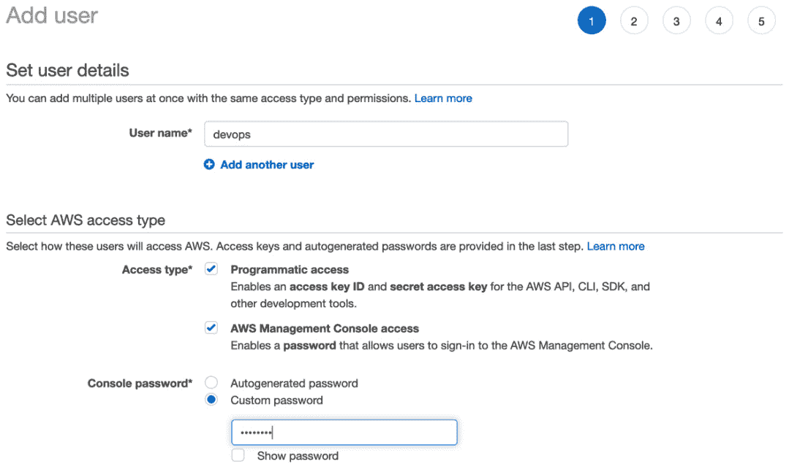

# 第二章：基础 AWS 服务

现在我们已经了解了构成最佳实践的服务原则和支柱，这些内容构成了使用**Amazon Web Services**（**AWS**）时的基本框架，是时候来看一些你将在环境和账户中使用的基础服务了。我们提到的基础服务包括计算服务，如**弹性云计算**（**EC2**）、全球**域名系统**（**DNS**）服务**Route 53**、数据库服务，如**RDS**和**Aurora**，以及咨询服务**Trusted Advisor**。如果你已经参加过云从业者、SysOps 或开发者考试，这些服务可能会让你感觉像是在复习已知内容。然而，由于现在没有要求在参加（并通过）DevOps 专业考试之前必须通过任何较低级别的关联考试，因此对一些基本服务进行复习也是一个不错的选择。

本章并不打算全面介绍这些服务。所提到的服务将被引入到 DevOps 考试的背景中，因此不建议跳过本章。不过，如果你认为自己对这些话题有很强的掌握，可以通过检查复习题和参考资料来验证这一点。同样，你也可以复习任何你已经掌握的主题。

在本章中，我们将覆盖以下主要内容：

+   设置和访问你的 AWS 账户

+   虚拟私有云网络和 Route 53 网络

+   云数据库

+   消息和队列系统

+   Trusted Advisor

# 技术要求

你需要一个 AWS 账户才能访问管理控制台和 CLI，这些内容将在本章的初始部分提到。如果你需要创建账户的帮助，访问[`aws.amazon.com/premiumsupport/knowledge-center/create-and-activate-aws-account/`](https://aws.amazon.com/premiumsupport/knowledge-center/create-and-activate-aws-account/)页面，它将指导你完成创建新账户的步骤。还需要具备基本的终端使用知识，以便完成 shell 命令。

重要提示

在本书中，我们不会详细讨论 AWS 的地理位置、区域、可用区或边缘位置。这些是你在尝试 DevOps 考试之前应该牢牢掌握的基本概念。

# 设置和访问你的 AWS 账户

在这一点上，你很可能已经拥有一个 AWS 账户来进行操作；然而，你可能只能通过你的工作场所访问该账户，其中一些权限被限制，因此你无法练习所有你需要掌握的技能，以便自信地通过 DevOps 专业考试。

如果您尚未为测试设置个人账户，那么现在是设置一个账户的完美时机。即使您已经有一个账户，您可能希望花时间设置一个新账户，专门用于考试，以确保您能够在提供的服务中利用首年的免费套餐（在 AWS 上分配）。

如果您已经拥有账户，转换到 **AWS 组织** 特别是使用控制塔，是一个很好的练习，如果您希望创建服务控制策略、组织单位、**单点登录**（**SSO**）和跨账户角色。

重要提示

控制塔需要至少三个不同的电子邮件账户来启动创建的三个独立账户。

创建主账户后，您可以向之前创建的账户发送邀请，并允许其加入组织。

## 进入 AWS 管理控制台

AWS 管理控制台是访问您的 AWS 账户的前门（GUI）。

首先打开任何网页浏览器并访问 [`aws.amazon.com/`](https://aws.amazon.com/)。

在起始页面上，查找 **我的账户** 菜单项。将鼠标悬停在此菜单项上，应该会给您选择 **AWS 管理控制台** 的选项：

![Figure 2.1 – 进入 AWS 管理控制台![Figure 2.1 – 进入 AWS 管理控制台图 2.1 – 进入 AWS 管理控制台当您按照链接登录 AWS 时，只要您没有通过 SSO 门户，您将看到三个字段：**账户 ID 或账户别名**，**IAM 用户名** 和 **密码**。最初在创建账户时，您只会有一个长账户号码可用，这只与 AWS 有关。创建账户别名是个好习惯，使您能够快速将账户 ID 与账户的逻辑名称关联起来。特别是在为您的账户添加多因素身份验证并查看逻辑名称时，这比多行数字更具上下文。登录后，您可以搜索服务，更改区域，指定喜爱的服务以便快速访问，并打开支持请求。如果您拥有正确的权限，还可以访问计费控制台。作为第一步，执行这些练习，我们需要创建一个用户，将该用户与包含权限的角色关联，然后创建一组密钥，稍后我们在配置 CLI 时会下载并使用这些密钥。登录 AWS 管理控制台后，按照以下步骤创建您的用户和一组访问密钥：1.  在顶部搜索栏中输入 `IAM`。1.  点击 **IAM** 服务；您将进入 IAM 仪表板。1.  在左侧导航栏中，点击 **用户**。1.  当您进入用户菜单时，点击主屏幕顶部的蓝色按钮，标有 **添加用户**。1.  对于用户名，您可以选择任何名称，但对于我们的用户，我们将命名为 `devops`。1.  我们将输入一个符合密码要求的自定义密码，并保持**要求密码重置**框未勾选：

    图 2.2 - 创建我们的用户

1.  然后我们可以点击**下一步**，继续设置权限。

1.  在**设置权限**下，我们要选择**直接附加现有策略**。

1.  对于这个初始用户，我们将使用**AdministratorAccess**职位功能策略。选择此策略，使左侧的框被选中，然后点击底部的**下一步：标签**按钮：

    图 2.3 - 附加策略

1.  只需点击底部的**下一步：审查**按钮。

1.  如果一切看起来正常，点击底部的蓝色按钮，标记为**创建用户**。

1.  因为我们已经选择了程序访问权限，所以一旦我们创建了用户，就会有机会查看秘密访问密钥，并下载访问密钥和秘密密钥对的 CSV 文件。请记下此用户的秘密密钥，或下载该文件，因为这是唯一一次可以获取秘密访问密钥的机会。

到此为止，我们已经设置了第一个用户及其访问策略、密码、访问密钥和秘密密钥。在本书的其他练习中，我们将引用此用户。你可以自由设置任何你喜欢的用户名，但对于一个不使用 root 账户的管理用户账户，我们将使用*devops*用户。

## 设置和使用 AWS CLI v2

你确实可以使用基于图形的 Web 界面管理控制台执行大多数任务。作为 DevOps 工程师，你会希望在环境中自动化一些操作，CLI 通过一系列脚本功能赋予你这种能力。CLI 是许多人最喜爱的工具之一，因其速度和强大的功能。

以前 CLI v1 用户注意

如果你之前安装过 AWS CLI v1，强烈建议你在安装 CLI v2 之前先卸载 v1。两个 CLI 命令都使用相同的命令名称`aws`。如果你不想卸载 CLI v1，那么可以在你的路径中设置别名。

### Mac 设置

只要你的机器上有 sudo 权限，你就可以轻松使用捆绑安装程序在 Mac 上安装 AWS CLI v2：

1.  打开终端窗口。

1.  运行以下两条命令来安装 AWS CLI：

    ```
    $ curl "https://awscli.amazonaws.com/AWSCLIV2.pkg" -o "AWSCLIV2.pkg"
    $ sudo installer -pkg AWSCLIV2.pkg -target /
    ```

1.  通过运行以下命令来检查是否已安装正确版本：

    ```
    $ aws --version 
    ```

    输出应该类似于以下内容：

    ```
    aws-cli/2.1.29 Python/3.8.8 Darwin/18.7.0 exe/x_86_64
    ```

只要`cli`后面的数字以`2`开头，你就成功安装了 AWS CLI v2。

现在你可以跳到配置 CLI 的部分。

### PC 设置

PC 用户注意

要运行 CLI v2，你的 Windows XP 或更高版本操作系统必须是 64 位版本。

如果您有在计算机上安装软件的管理权限，您可以按照以下说明安装 AWS CLI v2：

1.  下载适用于 Windows 的 AWS CLI MSI 安装程序：[`awscli.amazonaws.com/AWSCLIV2.msi`](https://awscli.amazonaws.com/AWSCLIV2.msi)。

1.  运行下载的 MSI 安装程序并按照屏幕上的指示进行操作。

1.  通过运行以下命令确认是否已安装正确的版本：

    ```
    C:\> aws --version 
    ```

### Linux 设置

在 Linux 机器上安装 CLI v2 之前，需要先处理一些先决条件：

+   您需要具备解压软件包的能力，可以使用系统的 `unzip` 命令或其他已安装的软件包。

+   为了确保 AWS CLI v2 正常运行，您需要确保在发行版中已安装 `glibc`、`groff` 和 `less` 软件包。大多数主要发行版默认已安装这些软件包。

+   AWS 支持在更新的 64 位版本的 CentOS、Fedora、Ubuntu、Amazon Linux 1 和 Amazon Linux 2 上使用 AWS CLI v2\。

现在先决条件已满足，您可以按照以下说明安装 CLI：

1.  运行以下 `curl` 命令以下载 AWS CLI v2 的 ZIP 文件：

    ```
    $ curl "https://awscli.amazonaws.com/awscli-exe-linux-x86_64.zip" -o "awscliv2.zip"
    $ sudo installer -pkg AWSCLIV2.pkg -target /
    ```

1.  现在 ZIP 文件已下载，我们可以解压它：

    ```
    $ unzip awscliv2.zip 
    ```

1.  解压后，我们可以运行 `install` 程序：

    ```
    $ sudo ./aws/install
    ```

1.  通过运行以下命令检查是否已安装正确的版本：

    ```
    $ aws --version 
    ```

1.  输出应类似于以下内容：

    ```
    aws-cli/2.1.29 Python/3.8.8 Linux/4.14.133-133.105.amzn2.x86_64 botocore/2.0.0
    ```

设置 CLI 的参考资料可以在 AWS 的文档中找到：[`docs.aws.amazon.com/cli/latest/userguide/cli-chap-install.html`](https://docs.aws.amazon.com/cli/latest/userguide/cli-chap-install.html)。

## 配置 CLI

安装 CLI 后，建议进行配置。如果您曾安装过 CLI v1 并使用过配置文件，您应该可以继续使用这些配置文件。为了快速配置 CLI，您可以使用 `aws configure` 命令；不过，作为先决条件，最好事先在 IAM 中为您的用户创建并下载密钥和秘密密钥。如果您要配置默认配置文件或辅助配置文件用于本书中的示例，您将需要这对凭证。

如果您尚未操作，请通过管理控制台重新登录 AWS 账户，然后导航至 IAM 服务，创建一个用户和角色。使用该用户，您可以分配 **访问密钥 ID** 和 **秘密密钥 ID**，并将其输入 CLI 中，以便在本书中的教程中使用。

获得密钥对后，按照以下步骤配置 CLI：

1.  运行 `aws configure` 命令：

    ```
    $ aws configure 
    ```

1.  当提示时，剪切并粘贴访问密钥 ID。

1.  当提示时，剪切并粘贴秘密密钥 ID。

1.  当提示时，为示例设置默认区域（我们将使用 `us-east-2`）。

1.  您可以直接按 *Enter* 键退出并使用默认的 JSON 输出；然而，我发现将输出设置为表格形式会更易于用户阅读。

在本书的许多示例中，CLI 命令将会添加一个 *profile*。

# AWS 中的云计算

当我们谈论 AWS 中的计算时，我们指的是多个服务，包括 Amazon EC2、弹性负载均衡（Elastic Load Balancing）、AWS 批处理（AWS Batch）、弹性容器服务（Elastic Container Service）和弹性 Kubernetes 服务（Elastic Kubernetes Service），以及 AWS Fargate 这项托管服务，它允许你以最小的开销运行容器。它甚至包括 Lightsail，这是开发人员在云中快速启动的最快方式，无需配置软件或网络：


图 2.4 – AWS 中的计算服务

虽然 AWS 中有许多服务属于计算服务的范畴，但最基础的服务是 EC2。EC2 是你在 Amazon 云中的虚拟实例。尽管其他服务，如弹性容器服务（Elastic Container Service）、弹性 Kubernetes 服务（Elastic Kubernetes Service），甚至 Elastic Beanstalk，都可以让你在 AWS 中运行容器，但它们的核心仍然是运行在 EC2 实例上。因此，了解 EC2 服务的基础知识，例如如何选择正确的实例类型，如何使用最优的负载均衡器（因为有三种可供选择），以及如何将存储卷添加到实例中，这些都是相对的信息，无论是处理 DevOps 专业考试问题，还是作为专业人士在日常工作中的任务：


图 2.5 – EC2 在实际架构中的应用

在前面的图示中，我们可以看到一个实际场景，其中 EC2 实例被用于自动扩展组中，以支持 WebSphere 平台。多个 EC2 实例位于一个私有子网中，外部用户只能通过 Route 53 中的 DNS 记录，通过应用负载均衡器访问这些实例。如果内部用户需要访问 WebSphere 服务器中的任何一个，可以通过位于公共子网中的堡垒主机使用 SSH 协议进行访问。堡垒主机位于一个跨越两个可用区的自动扩展组中，但每次只有一个主机处于活动状态。

现在我们将更详细地了解这些服务，特别是 EC2 服务。

## 亚马逊弹性云计算（EC2）

亚马逊 EC2 允许你创建一个虚拟服务器，在云中执行多个任务。EC2 提供了广泛的定制选项。你可以选择多种操作系统，以满足应用需求。适当配置内存和处理能力只需根据工作负载的需求选择合适的实例类型即可。

EC2 还提供三种不同的定价模式，每种模式都可以根据需求提供灵活性或折扣。它们分别是按需实例、预留实例和竞价实例。

**按需实例**是默认的实例类型，在请求 EC2 计算实例时无需长期承诺。你可以自行决定何时启动、停止、休眠、启动或终止实例，并且不会有任何后果。从定价的角度来看，你只需为处于*运行中*状态的按需实例按秒计费。

如果你有已知的工作负载将在 EC2 上持续运行一年，或需要在特定可用区内的预定容量，那么**预留实例**可以提供成本节省，并且在该特定可用区内提供预留容量。预留实例有两种不同的承诺期限，分别为 1 年和 3 年，后者在长期承诺下提供更大的节省。

当 AWS 有多余的容量未被利用时，这些实例会作为**竞价实例**以大幅折扣提供。不同类型实例的供需情况会导致价格波动，有时波动较快。这些折扣可以达到正常按需定价的 80%；然而，这也有一些限制。首先，你必须立即启动实例，并且不能停止或休眠竞价实例。在启动竞价实例时，你需要设置一个最大价格，例如当前的按需价格，如果价格超过你设置的最大价格，AWS 会发出信号，给你 2 分钟的时间保存工作，然后实例会被终止。

### EC2 实例类型

在写本文时，已有超过 170 种实例类型，允许你根据任何想要在云中运行的工作负载定制计算需求。并不重要的是记住所有不同类型和大小的实例，以及它们的计算和内存规格。然而，了解 EC2 在工作负载特定性方面如何划分不同的类别，以及哪些 EC2 系列属于这些类别，是一个好主意。

注意

只有部分 EC2 实例支持增强型网络，这可能成为选择正确实例类型时的决定性因素。增强型网络功能在处理故障排除或工作负载时尤其重要，因为它支持更高的带宽和每秒更多的数据包。

由于有许多类型的工作负载正在迁移到云中，每种工作负载都有其特定的需求，AWS 创建了几个不同的 EC2 实例系列。每个系列包含一种或多种实例类型，并具有优先应用程序配置文件。

这些实例系列可以按以下方式进行分组：

+   通用型实例

+   计算优化型实例

+   内存优化型实例

+   加速计算实例

+   存储优化型实例

让我们更详细地看看这些内容。

#### 通用型实例

通用型实例平衡内存、计算和网络资源，是各种工作负载的理想选择。这包括 T 类实例，这些实例具有可积累的突发信用点。若你没有完整的工作负载分类，通用型实例是一个很好的起点。

*使用案例*：Web 服务器、开发和测试服务器、代码库、小型到中型数据库以及 SAP 后台服务器。

#### 计算优化实例

计算优化实例专为从高性能处理器中获益的工作负载量身定制。该系列中的实例还具备增强网络功能，并默认优化为**弹性块存储**（**EBS**）。

*使用案例*：批处理、视频编码、广告投放、分布式分析、基于 CPU 的机器学习、游戏、科学建模以及高性能科学与工程应用，如基因组分析或计算流体动力学。

#### 内存优化实例

这一系列实例，顾名思义，是为内存密集型应用而设计的。它们旨在为需要大量内存的任务提供快速的性能能力。

*使用案例*：开源数据库、内存缓存和实时分析。

#### 加速计算实例

加速计算实例包含协处理器或硬件加速器，这些加速器比其他处理器执行特定功能的效率更高。这些功能可能包括数据模式匹配、浮点数计算和图形处理。

*使用案例*：语音识别、高性能计算、药物发现、计算金融和自动驾驶汽车。

#### 存储优化实例

存储优化实例提供直接连接的存储选项，能够满足特定的存储需求。这意味着实例存储可以针对非常定制化的**输入和输出**（**I/O**）性能进行优化，例如 H1 实例，或者在**高存储**（**HS**）实例的情况下提供非常高的存储密度。

*使用案例*：NoSQL 数据库、数据仓库、Elasticsearch、内存数据库、传统数据库和分析工作负载。

实例由两种存储类型支持：**实例存储**和 EBS。在选择实例类型时，系统会显示该实例是由 EBS 还是实例存储支持。这两种存储类型之间存在一些重要区别，尤其是在持久性方面。实例存储的一个主要优势是其高 I/O 和吞吐量。这是因为它直接连接到实例。基于实例存储的卷的缺点则在于持久性。如果你重新启动一个由实例存储支持的 EC2 实例，所有临时数据，如日志和临时文件，将会丢失。基于 EBS 的实例则不同，因为存储并未直接连接到实例。

### 了解 Amazon 机器镜像（AMI）

每当您启动 EC2 实例时，它必须从**Amazon 机器镜像**（**AMI**）启动，以便包含启动所需的信息。这些可以是基础操作系统镜像，实际上是干净的起点。或者，它们也可以是您或其他实体创建的 AMI，作为一个有效的工作系统或在单个实例上运行的多个系统的检查点。

AMI 可以由 Amazon 本身提供，由您的用户账户提供，私下与您的其他账户共享，或者来自合作伙伴账户，由社区成员创建，甚至可以在 AWS Marketplace 上免费或按小时收费提供。

#### AMI 的使用案例

您可以创建自己的 AMI，用于自动伸缩组或加速启动需要多个步骤下载、安装和配置软件的复杂实例。

也有一种情况是组织中的基础镜像，预先批准了操作系统，并为所有用户预装了安全设置以便遵循。

有可用的社区 AMI；然而，使用这些 AMI 时需要自行承担风险，因为它们上面可能已安装了未知的软件包。

另一种选择是使用由供应商和合作伙伴提供的市场 AMI，这些 AMI 已经经过验证并预先配置了已知的软件。这些 AMI 通常会在运行实例时收取每小时额外费用。

### 备份 Amazon EC2 实例

如果您想备份您的实例，无论是为了时间点恢复的目的，还是为了在自动伸缩配置中使用它，那么您需要创建一个 AMI：

1.  首先，我们必须借助 Systems Manager 服务找到最新版本的 Amazon Linux2 AMI，并将其存储到变量中以便下一步使用：

    ```
    $IMAGE='aws ssm get-parameters --names /aws/service/ami-amazon-linux-latest/amzn2-ami-hvm-x86_64-gp2 --query 'Parameters[0].[Value]' --output text --region us-east-2'
    ```

1.  启动 EC2 实例。现在我们知道了要使用的基础 AMI 的最新版本，我们需要有一个实例来进行备份并创建自定义 AMI：

    ```
    i-02666d4b05eee61c1.Create the AMI as a backup: 

    ```

    ImageId 值：

    ```
    {
        "ImageId": "ami-0aa7408c42669e27b"
    }
    ```

    ```

    ```

1.  验证镜像：

    ```
    State. If the value says available, then you have successfully backed up your EC2 instance and are ready to test. 
    ```

1.  让我们测试一下我们的备份。

    在这里，我们将回到我们在*步骤 2*中用于创建实例的原始命令，但现在，我们将用我们刚刚创建的 AMI 替换原始的镜像 ID：

    ```
    $aws ec2 run-instances \
    --image-id ami-0aa7408c42669e27b \
    --instance-type t2.micro \
    --region us-east-2
    ```

正如您所看到的，借助几个简单的命令，我们不仅备份了正在运行的 EC2 实例，而且还从中创建了一个可启动的 AMI。我们可以进一步备份，将 AMI 复制到另一个区域；只要镜像上没有硬编码的区域特定项目，它应该能够顺利启动并运行。

一旦您完成了 EC2 实例的启动并创建了 AMI，建议终止实例并删除 AMI，以免在 AWS 账户中产生额外费用。

### 使用用户数据脚本在启动时配置 EC2 实例

尽管我们可以启动 EC2 实例，然后手动配置所需的软件和包，但这并不是最有效的方法。除了手动步骤容易出错外，这种方法比使用自动化过程更加耗时。

#### 示例用户数据脚本

接下来，我们将查看一个用户数据脚本的示例，该脚本可以通过预先执行创建文件、更新已安装的包、更新软件仓库，甚至运行命令等操作，在无需用户交互的情况下配置 EC2 实例：

```
#cloud-config
package_upgrade: true
repo_update: true
repo_upgrade: all
packages:
 - boto3
 - aws-cfn-bootstrap
write_files:
  - path: /test.txt
    content: |
      This is my file.
      There are many like it but this one is mine. 
runcmd:
  - [ sed, -i, -e, 's/is/was/g', /test.txt]
  - echo "modified my file"
  - [cat, /test.txt]
```

到此为止，我们已经学习了如何使用用户数据脚本在启动时自动配置 EC2 实例，这些脚本可以完成安装和升级包、运行脚本和命令等操作。接下来，我们将了解 EC2 实例的网络接口。

### 弹性网络接口（ENI）

**弹性网络接口**（**ENI**）就像虚拟网络卡，因此它们允许实例拥有一个 IP 地址，并连接到特定子网。EC2 实例允许附加多个 ENI，每个网络接口可以在同一子网中，或者由于特定原因穿越不同的子网：


图 2.6 – 不同安全组中的 ENI

由于安全组是在网络接口级别而不是实例级别附加的，向实例添加额外的 ENI（弹性网络接口）可以使实例加入多个安全组，以满足特定需求。如果你有一台需要访问公共互联网的 Web 服务器，你可以将一个网络接口附加到提供此功能的安全组中。此外，在同一实例中，你可能需要通过 SSH 连接到机器，以便团队成员查看日志或检查服务器上运行的进程。可以通过这种方式锁定附加到特定 ENI 的安全组，从而限制对 SSH 端口（端口`22`）的访问。

### 弹性块存储（EBS）

虽然 EBS 和 EC2 紧密相关，但值得记住它们是两个独立的服务。EBS 是一个存储服务，提供基于网络的存储，它被分配到与实例相同的可用区，并挂载供使用。分配给实例的存储量因实例类型而异，并且并非所有类型的 EC2 实例都包含实例存储卷。

EBS 与基于一些关键特性的 **实例存储** 有所不同。实例存储卷是物理附加到 EC2 实例的存储。由于实例存储在实例停止、终止或实例故障时不会持久化，因此它最适合用于临时存储。相比之下，存储在 EBS 卷上的数据将会持久化：


图 2.7 – AWS 中的 EBS 概述

EBS 卷可以在实例创建时分配，也可以在实例已放入服务后作为额外存储创建。

从 DevOps 的角度来看，在分配和恢复 EBS 卷时需要记住的一个关键特性是，卷必须保留在它创建时所在的同一可用区。

在尝试决定使用哪种类型的 EBS 卷时，一个关键的术语是**每秒输入/输出操作数**（**IOPS**）或**预配置 IOPS**（**PIOPs**）。IOPS 是测量每秒卷所能执行的输入/输出操作（以千字节为单位）。通过使用 CloudWatch 指标，你可以监控特定卷的性能，使用的卷度量标准包括以下内容：

+   `VolumeReadOps`

+   `VolumeReadBytes`

+   `VolumeWriteOps`

+   `VolumeWriteBytes`

现在我们已经了解了如何测量 EBS 卷性能的基本概念，接下来我们将查看一些可用的不同类型的 EBS 卷。

#### EBS 卷类型

EBS 卷有三种主要类型，这些类型在性能、最佳使用场景和成本上各不相同：

+   **固态硬盘（SSD）**：这是一种针对重读写操作进行优化的驱动器，适用于需要更高 IOPS 的场景。可以为配置提供两种类型的 SSD EBS 卷：

    a. **通用型 SSD**：提供成本与性能的平衡，最适合用于开发和测试环境。

    b. **预配置 IOPS SSD**：用于性能关键的任务工作负载，例如数据库或缓存。

+   **硬盘驱动器（HDD）**：这是一种针对流媒体工作负载进行优化的驱动器，当需要因持续读取和/或写入而保证性能时使用。可以为配置提供两种类型的 HDD EBS 卷：

    a. **吞吐量优化型硬盘（HDD）**：这种类型的 EBS 卷最适合用于数据仓库、日志服务器或大数据工作负载。

    b. **冷 HDD**：这是一种低成本的 HDD，适合用于不常访问的数据。

+   **前一代**：这是一种适合用于较小数据集且不具有关键重要性的数据驱动器。与 SSD 不同，这些 EBS 卷使用的是磁盘，因此性能不如其他两种类型的 EBS 卷。只有一种前一代 EBS 驱动器，适合用于不常访问的数据。

查看 EC2 服务，其中还包括 AMI 和 EBS 卷，你可以选择多个选项，能够根据实例的需求选择合适的大小。这不仅仅与操作系统的选择有关，还包括如何快速配置实例，以及存储性能的要求。

接下来，我们将了解 AWS Batch，这是一个服务，允许我们轻松执行大规模操作，无论是按需还是按计划执行。

## AWS Batch

有时，你需要大量的计算资源。

这里可以考虑的一个例子是统计选举结果。一旦投票结束，多个人员和机器开始在不同的区域中心进行计数。每个区域中心统计票数并提交该小计，以便获得最终结果。

统计票数的这个过程是一个批处理过程。如果所有票数都保存在不同的**逗号分隔值**（**CSV**）文件中，那么它们可以全部上传并由 AWS Batch 服务处理。

AWS Batch 可以将作业作为 Shell 脚本、Linux 可执行文件或 Docker 容器来运行。

AWS Batch 有五个主要组件：

+   作业

+   作业定义

+   作业队列

+   作业调度器

+   计算环境

让我们更详细地看一下这些内容。

### 作业

在 AWS Batch 中，作业仅仅是工作单元。这些单元可以是 Shell 脚本、Docker 容器镜像或 Linux 可执行文件，但无论作业如何提交，都会在容器化环境中运行。

### 作业定义

告诉作业如何运行是 AWS Batch 作业定义的功能。这也是你为作业提供额外详细信息的地方，例如，如果作业需要访问其他 AWS 资源，你可以指定使用的 IAM 角色，还可以定义作业所需的内存和计算能力。

### 作业队列

直到计算环境可用来运行作业时，作业将停留在作业队列中。你并不限于每个 AWS 账户只有一个作业队列，因为队列可以与不同类型的计算环境关联。

高优先级作业可能会被放入由按需实例组成的队列中。低优先级作业则可能会等待在由抢占实例组成的队列中，直到抢占实例可用时才能运行。

### 作业调度器

一旦 AWS Batch 作业被提交到队列中，调度器会评估当前的计算环境，看它们是否可以运行该作业。由于作业可能依赖于其他作业的运行和/或完成，因此调度器也会考虑这一点。正因如此，作业会按合理的顺序从队列中提交并运行，但并不总是能保证一个精确的顺序。

### 计算环境

一旦你设置好作业队列所在的计算环境，你有多个选择。你可以选择托管或非托管的计算环境，并指定特定的实例类型，或者仅在可用的最新实例类型上运行。

如果你使用 Batch 的原因之一是为了节省成本，你还可以确定计算实例的抢占价格。如果计算环境的可靠性是必要的，那么你最好设置按需实例来搭建环境。

# 虚拟私有云网络和 Route 53 网络

AWS 的 **虚拟私有云**（**VPC**）服务允许你在云中创建虚拟网络。它允许你的计算和数据库实例要么允许互联网连接，要么与互联网隔离。安全性可以通过有状态或无状态的虚拟防火墙规则来实现，这些规则提供了你认为合适的网络连接量：


图 2.8 – AWS 中的网络流量与安全

VPC 服务包含多个组件，可以让你路由和保护来自 AWS 服务的流量，且可选地包括互联网和/或本地网络。

## VPC

虽然解决方案架构师（或可能是网络架构师）通常会确定用于 VPC 的 CIDR 地址范围，但很多时候，实施 VPC 的工作由 DevOps 工程师来完成，利用 **基础设施即代码**（**IaC**）。

有很多组件可以帮助构成一个 VPC。虽然我们不会深入讨论 VPC，但我们将介绍一些你应当了解的项目，以防它们出现在考试题目中。

### 子网

**子网**定义了 VPC 中的 IP 地址范围。既有公共子网，也有私有子网。公共子网应当用于需要通过互联网访问的资源。私有子网应当用于那些无法从互联网访问的资源。每个子网只能存在于一个可用区，无法跨越多个可用区。

### 安全组

**安全组**充当 Amazon VPC 中的虚拟防火墙。每个 EC2 实例最多可以拥有五个安全组，并且安全组在实例级别强制执行（而不是在子网级别）。

安全组允许有状态的流量，这意味着如果流量根据规则被允许进入，那么它将被返回，而不受任何现有规则的影响。你可以根据端口、IP 范围或其他安全组的组合来指定入站流量规则。

### 网络访问控制列表（NACL）

**网络访问控制列表**（**NACLs**）在子网级别工作（与在实例级别工作的安全组不同）。

虽然安全组是有状态的，但 NACL（网络访问控制列表）是无状态的，任何需要通过 NACL 返回的流量都需要打开端口和 IP 范围。NACL 规则按照顺序进行评估，最低的规则首先被处理。

### 互联网网关

除非你将 VPC 作为数据中心的私有扩展，否则你需要互联网连接。**互联网网关**为 VPC 提供与互联网的连接，具有高度可用、可扩展和冗余的特点。互联网网关提供的两个主要功能是：第一个是为路由表中指定的子网提供互联网访问；第二个是为已分配 IPv4 公共地址的实例提供网络地址转换。

### 仅出站互联网网关

如果你正在为 VPC 和实例使用 IPv6，那么你需要一个 **单向出口互联网网关**，而不是常规的互联网网关。这种类型的互联网网关可以防止互联网主动连接到你的实例，但仍然提供与其他互联网网关相同的可扩展性、冗余性和高可用性。

### 网络地址转换器（NAT）

当你的实例位于私有子网时，默认情况下，它们无法访问互联网。即使你已经设置了互联网网关，你也希望将私有实例与直接的互联网访问分离。这时，NAT 实例或 NAT 网关便发挥作用。

**NAT** 设备将私有子网中的实例流量转发到互联网或其他 AWS 服务。自从 **VPC 端点** 的出现以来，使用 NAT 来与账户中的其他 AWS 服务通信被认为是一种不安全的做法，绝不应该在生产环境中使用。

### VPC 端点

如果你需要从 VPC 安全地访问 AWS 服务，可以创建 VPC 端点。VPC 端点允许 EC2 实例和其他 AWS 计算服务（如 Lambda 和 Fargate）与支持的 AWS 服务（如 S3 和 DynamoDB）进行通信，而无需创建互联网网关，甚至不需要公共 DNS 名称。

这对于那些既不需要也不应该连接互联网的 EC2 实例尤其有用。使用 VPC 端点允许数据连接通过内部 AWS 网络进行传输，并且不需要互联网网关、虚拟私有网关、NAT 设备、VPN 连接或 AWS Direct Connect 连接。VPC 端点是虚拟设备，可以根据需求进行扩展，并且具有冗余和高可用性。

### DHCP 选项集

当你创建 VPC 时，Amazon 会默认自动为你创建一组 **动态主机配置协议**（**DHCP**）选项。然而，你可以通过创建新的 **DHCP 选项集** 来自定义一些可用设置，然后将该 DHCP 选项集附加到你的 VPC（从而移除默认的 DHCP 选项集）。

一些允许的选项包括：

+   `domain-name-servers`：使用你自己的 DNS，而不是 AWS 提供的 DNS。

+   `domain-name`：未限定的服务器的默认域名。

+   `ntp-servers`：你可以指定最多四个网络时间协议（NTP）服务器。

+   `netbios-name-servers`：你可以指定最多四个 NetBIOS 名称服务器。

+   `netbios-node-type`：NetBIOS 节点类型（1、2、4 或 8）；此设置默认为空，且 Amazon 不支持广播或多播。

    注意

    了解 DHCP 选项对于在实际环境中配置 VPC 非常有用，但记住所有可用选项并不是 DevOps 专业考试的必要要求。

### 使用自定义 DNS 配置你的 VPC

亚马逊提供了一个默认的 DNS 服务器（Route 53 解析器）；不过，如果你愿意，也可以使用自己的 DNS 服务器。一些公司要么在混合环境中从他们的数据中心运行 DNS，要么将当前的 DNS 服务器镜像到云端，这样他们就不需要创建包含所有必需信息的 Route 53 托管区域，或者干脆选择在他们最熟悉的平台上管理 DNS。

如果是这种情况，且你想指定 DNS 而不是使用默认的 DNS 服务器，那么你需要创建一个 DHCP 选项集，并填写你的 DNS 服务器的值。完成后，你可以将该 DHCP 选项集附加到你的 VPC，VPC 中的实例将开始使用你指定的 DNS 服务器。

### 连接多个网络的方法

在 AWS 网络世界中，提供了多种工具来帮助你连接不同的网络。

#### VPN 连接

你可以使用多种选项将 AWS 与自己的 **虚拟专用网络**（**VPN**）连接：

+   **AWS 站点到站点 VPN**：这个选项创建一个 IPSec 连接，将你的 VPN 与远程 VPC 连接。

+   **AWS 客户端 VPN**：这个选项使用一个托管客户端，允许你的用户通过基于 OpenVPN 的客户端从几乎任何位置连接。

+   **AWS VPN CloudHub**：这个选项允许你通过虚拟专用网关创建与多个 VPC 的站点到站点 VPN 连接。（其他选项仅创建与单一 VPC 的 VPN 连接。）

+   **第三方 VPN 设备**：这个选项允许你使用在 EC2 实例上运行的第三方软件创建 VPN 连接。然而，重要的是要注意，在选择此选项时，你需要负责 EC2 实例的维护和保养。

#### AWS Transit Gateway

**AWS Transit Gateway** 允许你通过一个中央网络中心连接本地网络和多个 VPC。Transit Gateway 作为你的云连接的路由器，只需将每个网络连接到 Transit Gateway 一次。连接完成后，其他网络可以通过 AWS 全球私有网络而非公共互联网，使用定义的网络规则相互通信。

#### AWS Direct Connect

如果你或你的公司有持续的数据传输需求，既需要向 AWS 传输数据，也需要从 AWS 传输数据，那么 **Direct Connect** 服务可以为你的本地环境与 AWS 之间提供一个私有网络连接。这些专用连接可以通过直连服务提供商以 1 Gbps、10 Gbps 或 100 Gbps 的速度进行连接。

与直接通过公共互联网连接不同，使用 AWS Direct Connect 连接通过专用通道将数据从你的数据中心或办公室传输到 AWS，而不是通过公共互联网，从而提供一致的网络性能。

## Route 53

AWS 提供的全球 DNS 服务是 **Route 53**。这是 AWS 中为数不多的几个不与任何特定区域相关联的服务之一。Route 53 服务还拥有最强的承诺之一，声明其 *将采取商业上合理的努力，使 Amazon Route 53 保持 100% 可用*（Amazon Web Services, 2021）。

Route 53 有三个主要的组成部分是基础性的重要：

+   注册（并管理）域名的能力

+   DNS 服务

+   执行健康检查（并随后根据其功能性、可用性和可达性路由流量）的能力

本节将介绍一些有关 Route 53 服务的基本信息，特别是那些对 DevOps 考试有帮助的话题。

### 了解 Route 53 中可用的不同类型的记录

有许多不同类型的 DNS 记录，目前为止，Route 53 支持以下类型的 DNS 记录：

+   **地址** (**A**) 记录

+   AAAA（IPV6 地址记录）

+   **规范名称** (**CNAME**) 记录

+   **认证机构授权** (**CAA**)

+   **邮件交换** (**MX**) 记录

+   **名称授权指针记录** (**NAPTR**)

+   **名称服务器** (**NS**) 记录

+   **指针** (**PTR**) 记录

+   **授权起始** (**SOA**) 记录

+   **发件人策略框架** (**SPF**)

+   **服务** (**SRV**) 位置

+   **文本** (**TXT**) 记录

+   别名记录（这是 Route 53 特有的 DNS 扩展）

现在我们知道了 Route 53 支持哪些类型的记录，接下来让我们看看域名和托管区域之间的区别。

### 了解域名和托管区域之间的区别

了解域名和托管区域的第一件事是，首先，域名是一个互联网构造，属于域名服务器，它将一个人或组织的唯一名称与一个数字地址的互联网资源关联起来。

域名有区域文件，它们是不同资源及其关联的名称、地址和当前映射类型的文本映射。而托管区域则是 Route 53 独有的东西。它在结构和映射上类似于 DNS 区域文件（你可以将 DNS 区域文件导入到 Route 53 托管区域中），但一个主要的不同之处在于它可以通过 Route 53 界面、CLI 或 API 进行管理和修改。

### Route 53 健康检查

Route 53 允许你检查应用程序的健康状况，然后根据你提供的规则将流量重新路由到其他服务器或资源。你甚至可以在 Route 53 的 web 控制台中查看健康检查的最新状态。

#### 检查特定终端节点的健康状况

在这种情况下，您将创建一个来自 Route 53 的检查，该检查将在您指定的常规间隔内执行检查。您的健康检查监控的是一个端点，可以是 IP 地址或域名。然后 Route 53 会按照间隔检查该服务器、应用程序或其他资源是否可用且正常运行。您还可以请求一个特定的网页或 URL，该 URL 会模拟大多数用户的操作，而不仅仅是放在服务器上的一个简单健康检查页面，该页面会在系统正常运行时返回简单的 200 代码。

#### 计算健康检查（监控其他健康检查的健康检查）

如果您有多个执行相同功能的资源，您可能会想知道是否至少有一些资源是健康的。这时计算健康检查就派上用场了：


图 2.9 – 计算健康检查示例

计算健康检查充当根健康检查，其中后代检查可以失败，直到源被视为不健康。

如果触发任何警报，此类健康检查会失败。

#### 检查 CloudWatch 警报的状态

Route 53 可以利用 CloudWatch 指标和警报的功能。一旦创建了 CloudWatch 警报，您可以在 Route 53 中创建一个健康检查，观察与 CloudWatch 警报相同的数据流。

为了提高 CloudWatch 警报健康检查的可用性和灵活性，Route 53 查看来自 CloudWatch 的数据，然后确定该路由是否健康。它不会等待达到 ALARM 状态后再将路由设置为不健康。

### Route 53 路由策略

Route 53 中的路由策略告诉服务如何处理查询。这些策略可以从简单到复杂，正如我们接下来将看到的。

#### 简单路由

这是指 DNS 配置没有特殊配置。您只需要设置 DNS 文件应指向的单个记录。没有加权，也没有故障转移——只需保持简单即可。

#### 故障转移路由

使用故障转移路由时，当初始记录集中的主资源不可用或未通过定义的健康检查时，您将有一个备用记录。

这可以是另一个位于不同区域的服务器，或者是通过 S3 存储桶提供的备用网站。

#### 地理位置路由

如果您有一个跨越某个国家、洲或全球的观众或用户群，并且希望根据他们的地理位置向他们提供定制的信息或网站（而无需使用复杂的 cookies 和动态内容），那么您可以使用 Route 53 的**地理位置路由**功能，将他们引导到最适合其源位置的服务器或内容来源。

您可以按洲、国家或美国的州指定地理位置。

#### 地理邻近路由

您可能有一个地理上分布广泛的用户群，但希望能够将更多（或更少）流量推送到某个特定地区或资源集。**地理接近路由**与地理位置路由的区别在于此功能。它可以根据每个特定资源的偏移值以及请求用户的原始位置，决定将更多或更少的流量路由到该资源。偏移值会扩大或缩小流量路由到资源的地理区域的范围。

#### 基于延迟的路由

当您的观众或用户群体地理分布广泛，并且您在多个区域运行资源时，您可以使用基于延迟的路由将每个用户引导到能够提供最快响应时间的资源或内容。

问题

地理位置路由与基于延迟的路由有什么区别？

尽管在这两种情况下您都在处理一个地理上扩展的用户群，**基于延迟的路由**则基于 Route 53 创建并存储在原始点和 IP 或 DNS 记录点的延迟记录。这些延迟记录可能会发生变化，因此最好确保提供一致的体验，或根据客户设置提供定制化的体验。

**地理位置路由**，另一方面，是将用户请求与已与该源 IP 地址地理绑定的资源进行匹配，这样您就可以为最终用户体验提供本地化的内容。

#### 多重响应路由

尽管多重响应路由不能取代负载均衡器，但它确实允许 Route 53 随机选择最多八个健康的值来响应。

您可能想使用多重响应路由的一些场景如下：

+   创建多个相同名称类型的记录

+   将流量路由到多个源

+   将 Route 53 健康检查与记录关联

#### 加权路由

如果您有多个资源，并希望将请求分配到这些资源，同时实现不均衡的流量分配，您可以通过 Route 53 设置加权路由。这有几个应用场景，例如推出带有重要或次要更新的金丝雀发布，并将仅一部分流量重定向到新环境。您可以根据关键绩效指标（如放弃购物车的数量）来评估。

实现加权路由从有多个资源开始，您希望将流量在这些资源之间进行平衡。然后，您可以在 Route 53 托管的区域内创建记录来反映这些资源。这些记录必须是同一类型的记录，且位于同一域或子域中；也就是说，两者需要是 A 记录。

一旦记录设置完成，您可以继续配置路由，通过为特定资源分配权重来进行路由。加权值可以是从 0 到 255 之间的任何数字（如果您指定为 0，则该记录将不再接收流量）。

流量是通过计算当前记录的权重来平衡的，然后将其除以所有记录的总和。

*示例*：如果你有两台服务器运行，并且服务器 A 的记录权重为 75，服务器 B 的权重为 150，那么 75 + 150 = 225 总权重，使用公式 75 / 225 = 0.3333333，服务器 A 将获得 33%的流量。


](img/Figure_2.10_B17405.jpg)

图 2.10 – 在 Route 53 中创建加权记录

Route 53 将在稍后详细讨论，当我们进入*第十三章*，*蓝绿部署*，并讨论蓝绿部署策略时。

# 云数据库

当你查看下图时，可能会想，为什么有这么多种数据库。这源于过去几十年应用架构的演变，其中专业化、速度和规模都已成为这一行业成功的关键。


](img/Figure_2.11_B17405.jpg)

图 2.11 – AWS 中的数据库类型和服务

本章篇幅有限，无法介绍 AWS 提供的每种数据库类型。不过，作为本基础概述的一部分，我们确实希望涵盖一些关系型数据库及其基本特性。

我们将在接下来的章节中更详细地讨论键值数据库 Dynamo DB。

## 关系型数据库

说到数据库，通常会想到关系型数据库，它们有行、列和模式。

AWS 中的关系型数据库有三种主要的*类型*，并且其引擎可以根据社区版、商业版或云原生进行分类。云原生引擎被用于 Aurora 服务，因为它们是基于社区引擎构建的，具有云原生存储、备份和复制能力。

注释

当我们谈到云原生时，我们指的是构建和运行利用云计算模型的应用程序：松耦合的服务，动态可扩展，可以在多租户平台上运行，并具备灵活的网络和存储。

关系型数据库通常遵循 ACID 数据库属性集合：

+   **原子性**：你的所有事务要么都成功，要么都不成功。

+   **一致性**：写入数据库的任何数据必须符合所有已定义的规则。

+   **隔离性**：确保并发执行事务时，数据库会保持在一个与按顺序执行事务时相同的状态。

+   **持久性**：一旦事务被提交，它将保留在系统中，即使系统发生崩溃。

### 关系型数据库服务

**关系型数据库服务**（**RDS**）旨在接管以前由数据库管理员执行的任务，数据库管理员曾需要在职，但现在很多日常工作都可以通过自动化和脚本来处理。这些任务包括配置新数据库、创建备份、扩展为只读副本、修补和升级实例，以及在发生事件时切换到高可用性实例。RDS 简化了软件和数据库配置的设置与安装。使用托管的 RDS 服务还可以帮助组织在创建和部署数据库时实现一致性标准。无需自定义脚本来部署、设置和修补数据库，因为这一切都在后台自动处理。

部署后，开发人员和应用程序可以访问一个可以方便连接的数据库端点，用户可以通过客户端或身份验证应用程序进行连接，然后对数据库执行查询。

RDS 提供多种不同的引擎格式，包括两个商业引擎和三个流行的开源引擎。支持的两个商业引擎是 Oracle 和 Microsoft SQL Server。这两个商业引擎都广泛用于企业中。RDS 支持通过 Oracle SQL 访问 Oracle 模式，并提供 Microsoft SQL Server 的本地工具，如 SQL Server Management Studio。在社区版中，RDS 允许使用 MySQL、PostgreSQL 和 MariaDB 创建数据库。MySQL 是最受欢迎的社区关系型数据库之一，AWS 运行该数据库的社区版，默认使用 InnoDB 表，并在文档中说明 MyISAM 存储引擎不支持可靠的崩溃恢复。

### PostgreSQL

PostgreSQL 是另一个非常流行的数据库，开发人员青睐其丰富的功能集。RDS 支持常用工具，如 pgAdmin，或通过 JDBC/ODBC 驱动程序连接到数据库。

确定选择的引擎后，您可以选择一个实例类型，以便提供不同级别的计算和内存能力。通常用于测试环境的有突发性实例（T 系列）。在将数据库工作负载迁移到更生产化的环境时，建议选择通用实例（M 系列）或内存优化实例（R 系列）。

RDS 和你在 EC2 实例上自行运行的相同类型引擎之间的一个区别是副本的工作方式。只需点击一个按钮，无论是在同一可用区还是不同可用区，都可以极其容易地创建只读副本；然而，这些节点是只读的，不能执行写操作。在同一背景下，你可以让实例立即具备高可用性，将数据异步复制到另一可用区或区域的主节点副本中。如果发生故障，应用和最终用户将感受不到任何中断，因为它们用于连接数据库的 DNS 地址保持不变。然而，这个二级主节点不能从主主服务器上分担负载，因为它除了作为故障转移节点外，不能承担其他任何功能（例如作为只读副本）。只读副本可以提升为独立数据库，并且此时它将具备执行写操作的能力。然而，它将不再与之前所复制的主节点保持同步。

### Aurora

Amazon Aurora 是为了响应客户希望获得像 Oracle 或 Microsoft SQL Server 这样的商业级数据库引擎的性能，同时不必处理与这些产品相关的许可束缚问题而构建的。

关于 Amazon Aurora 的另一个重点是，与其他由 EBS 存储支持的 RDS 引擎不同，Aurora 在听取了多年来多位客户的需求后，从零开始构建了自己的存储解决方案。

Amazon Aurora 提供 MySQL 兼容版和 PostgreSQL 版。用户可以选择将 Aurora 作为集群运行，甚至运行 Aurora 数据库的无服务器版本。需要了解关于 Aurora 无服务器版本的主要事项是，它根据应用或用户的需求按需提供容量。这是预配 Aurora 集群与无服务器版本之间的显著区别。

## 键值数据库

随着应用的构思，初期无法完全预测会服务多少用户。通常人们希望，随着时间的推移，应用的受欢迎程度会从初期的用户和测试者扩展到指数级规模。为了支持这种增长，底层数据库必须能够无缝应对这种规模。这也是键值数据库的特点之一。

我们将在 *第五章* 中更详细地了解 DynamoDB，*Amazon DynamoDB*。

## 内存数据库

当你频繁从主数据存储（如关系型数据库）访问存储的项目时，有时仅从数据库请求数据无法提供客户期望的用户体验。这时，像**Amazon Elasticache**这样的内存数据库成为一个可行的选择。

Elasticache 提供两个不同的引擎版本：Redis 和 Memcached。

## 文档数据库

文档数据库是一种非关系型数据库，它允许你以 JSON 格式存储文档和数据，并查询这些数据以找到所需的内容。文档数据库的一个独特特点是没有固定的架构，并且它们可以包含互相嵌套的文档。

AWS 提供了**Amazon DocumentDB**（具有 MongoDB 兼容性）作为一个托管数据库服务，适用于那些曾经使用过 MongoDB 或者正在寻找文档数据库功能的用户。如果你曾经在 MongoDB 的操作端工作过，那么你知道，尽管 MongoDB 功能强大并具有一些高级功能，包括在当前主节点不可用时自我选举新主节点，但其部署和运行有一些复杂的设置要求。

它需要（在生产环境中）至少三个节点——可以是两个节点和一个仲裁者，或者三个主节点。所有这些复杂的设置在 DocumentDB 中都不再需要。亚马逊会处理设置和安全性，并允许你配置自动备份，然后可以将备份存储在 S3 上。

你可能会放弃一些小的功能，比如无法使用管理员或本地表，这意味着你不能使用 `mongodump` 或 `mongorestore` 工具，但有一些功能可以代替这些工具。

文档数据库特别适合那些不想处理数据库管理方面的团队，想通过 JSON 简化初始架构值使用的方式，并且只想开始将数据推送到数据库中，以便之后可以进行简单或高级的查询。

# 消息和队列系统

当你开始构建云规模应用时，你需要找到一种方法来解耦应用程序的不同层，使得每一层能够独立扩展。这样做有几个原因，包括使你的应用程序更加弹性，并允许每一层独立于其他层进行扩展。能够使用托管服务来执行这些任务，在这种情况下，你或你的团队成员无需担心队列或消息系统的设置和维护，能够加速在云中迁移或开发时使用这些技术。

接下来我们将了解 AWS 提供的消息和队列系统，以及它们如何对你有所帮助。

## 简单通知服务（SNS）

有时，你需要能够简单地发送消息，无论是来自你的应用程序还是其他服务，消息可以采用多种格式，例如电子邮件或短信，并可以以多种方式使用。这些可以基于编程调用或发生在你的 AWS 账户中的事件。这就是**简单通知服务**（**SNS**）派上用场的地方。

SNS 是一个发布者和消费者系统，发布者可以将消息推送到一个**主题**。然后，任何订阅该主题的消费者都可以消费该消息：


图 2.12 – SNS 广播

SNS 主题充当一个频道，可以将单个消息广播到一个或多个订阅者。发布者，即前面图中的应用程序，只需要将消息发送一次到该主题；每个消费者（或订阅者）可以以适合自己的方式接收并处理该消息。这些消息可以存储在 S3 中作为归档，或在移动短信或电子邮件中按需消费，或者在 Lambda 中进行解析和执行。

## 简单队列服务（SQS）

如果你在寻找一种完全托管的队列服务，允许你以云原生的方式拆分应用程序，那么 **简单队列服务**（**SQS**）就是一个非常合适的服务选择。它有两种类型：**标准队列**和**先进先出**（**FIFO**）**队列**。标准队列允许至少一次的消息投递，而 FIFO 队列则保证对队列中的消息进行一次性投递。这两种队列的另一个主要区别是，FIFO 队列中的消息会按接收顺序进行处理。标准队列尝试保留接收到的消息顺序；然而，如果消息顺序错乱，它不会进行任何洗牌或重新排序操作来保持原始的消息顺序。

SQS 是一个分布式队列系统，这意味着它分布在区域内的不同节点上。这是 SQS 带来的一项设计特性，它使 SQS 具备了高度可扩展、可用、可靠和耐用的优势。SQS 还支持 **服务器端加密**（**SSE**），可以通过 AWS 提供的 KMS 服务密钥或自定义密钥实现。你还可以通过访问策略控制谁可以访问产生或消费的消息。SQS 分布式队列系统的主要组成部分有三部分：

+   生产者/消费者（组件）

+   队列

+   队列中的消息：


图 2.13 – SQS 分布式队列

消息由生产者放入 SQS 队列，然后被分配到队列组件中以实现冗余。当消费者准备处理消息时，它会使用长轮询或短轮询技术检查队列中是否有待处理的消息。如果检测到待处理的消息，它会消费该消息进行处理；然而，消息仅会被标记为已处理，并且可见性超时开始。一旦消费者成功处理消息并删除该消息，消息就会从所有分布式队列节点中移除。

消费者在成功处理消息后必须删除这些消息。由于 SQS 运行的分布式系统的特性，一旦消费者拉取了一个消息进行处理，该消息就会被标记，以确保其他消费者无法拉取相同的消息。不过，在超时期之前，消费者需要确认消息已经处理。如果 SQS 没有收到这个确认，那么该消息会取消标记，并可供其他消费者处理。

### 在什么情况下使用 SNS 而不是 SQS？

在尝试决定使用哪个消息服务时，有一条规则可以帮助你决定哪个服务最适合你；问以下一组问题：

+   我的消息需要保证送达吗？

+   （如果答案是“是”，那么 SQS 将是最佳选择，因为 SNS 没有提供保证送达的选项。）

+   我的消息是否只会被我的应用程序消费？

    （如果答案是“是”，那么 SQS 将是最佳选择。）

+   我的消息是否会被多个来源消费？

    （如果答案是“是”，那么 SNS 将是最佳选择。）

通过这三个问题，你可以判断自己是处理一个封闭循环，即收集消息并在应用程序中进行处理（SQS），还是创建一个消息供应用程序外部消费（SNS）。

## Amazon MQ

如果你正在迁移一个之前使用 Apache MQ 或 Rabbit MQ 的应用程序，并且你不再想管理实例，那么**Amazon MQ**是一个不错的选择。Amazon MQ 更像是一个消息代理，而不仅仅是一个简单的队列。

当你去分配你的 Amazon MQ 时，必须选择 Rabbit MQ 或 Apache MQ 引擎类型。选择好引擎类型后，使用管理控制台配置 Amazon MQ 时，它会通过一系列选择提示你使用单一代理，或使用一个高可用的活动和备用代理。它甚至可以通过预定义的蓝图为你创建一个单一或活动与备用代理的网状网络。

### Amazon MQ 和 SQS 之间的区别

尽管 SQS 也是 AWS 提供的托管服务，它是一个可扩展的队列，并不需要建立消息代理。Amazon MQ 的优势在于，它允许依赖 MQTT、OpenWire 或 STOMP 等 API 的先前构建的应用程序快速且轻松地迁移到云端，同时保持高可用性，并且几乎没有额外开销。

## 简单邮件服务（SES）

**简单邮件服务**（**SES**）允许你设置并发送电子邮件，而无需处理运行 SMTP 服务器的大多数复杂性。

SES 仅在三个区域运行：`us-east-1`（北弗吉尼亚）、`us-west-2`（俄勒冈）和 `eu-west-1`（爱尔兰）。

亚马逊帮助你验证邮件的来源。通过向我们发送电子邮件的 DNS 记录中添加一系列 DKIM 记录，它为你发送给客户的邮件提供了信任。

# 可信顾问

随着 AWS 账户中资源数量的增加，跟踪所有资源有时会变得具有挑战性。挑战开始出现，例如有些磁盘处于空闲状态未被使用，**弹性 IP**（**EIPs**）也处于空闲状态，未连接到任何实例或接口，这会消耗你的预算。一旦进入受信顾问仪表盘，你将看到该工具为自动检查生成的四个类别：


图 2.14 – 受信顾问仪表盘

当涉及到**容错**检查时，它可以告诉你是否在单一可用区或区域中拥有过多实例。

可用的受信顾问检查数量随着账户支持级别的提高而增加。对于具有基础或开发者支持级别的账户，显示的是基本检查集。当支持级别提高到商业或企业级时，账户将可以访问所有 115 个受信顾问检查。

即使在基础支持级别，受信顾问也提供四个领域的多个检查：

+   成本优化

+   性能

+   安全

+   容错

    注意

    你是否注意到受信顾问提供的四个基本检查可以映射到 AWS 服务支柱的四个方面？

此外，受信顾问可以设置为每周向账单联系人、操作联系人、安全联系人或三者的任何组合发送通知。

## 访问受信顾问

受信顾问具有图形化的仪表盘界面，可以查看，而且当你第一次从 AWS 控制台查看该服务时，甚至可以看到在成本优化图标下可能的月度节省。AWS 一直在精细化控制台界面，使其更易于使用，并尽可能直观，展示每个主要标题图标下的三个图标，分别表示没有警告的检查（绿色）、建议调查的检查（黄色）和建议采取行动的检查（红色）。

你还可以通过 AWS CLI 访问受信顾问。从 DevOps 角度来看，这很有用，尤其是在服务限制检查方面。你可以使用自动化管道或周期性 Lambda 作业来检查特定服务的服务级别，然后自动请求服务级别的提升，或将通知发送到正确的电子邮件或分发列表中，以避免在构建过程中出现中断。

# 总结

AWS 不断增长其提供的服务数量。我们在本章中简要介绍了许多服务，虽然内容较为简略，但只涵盖了在 AWS 平台上托管和服务应用程序的许多关键服务。

在本章中，我们回顾了 AWS 提供的基础服务。这些服务，以及我们在第一部分剩余部分中将要学习的其他服务，将作为我们 DevOps 旅程中的部署组成部分。掌握这些服务的基础知识可以帮助我们在开发和部署目标上做得更多，同时也有助于我们理解 DevOps 专业考试中的问题，以及在日常工作中遇到的场景。

在下一章中，我们将探讨身份与访问管理，它是保护我们的 AWS 云账户和资产的基础。

# 回顾问题

1.  如果你想对 Amazon EC2 空闲容量进行竞价，以下哪项将允许你做到这一点？

    a. 预留实例

    b. 自动扩展

    c. Spot 实例

    d. 节省计划

1.  你所合作的公司希望加强网络安全。然而，他们当前不想声明返回流量的出口。你可以使用哪个 VPC 构造来帮助调整他们的安全设置？

    a. 网络访问控制列表（NACLs）

    b. 网络地址转换器（NAT）

    c. VPC 端点

    d. 安全组

1.  判断题：Trusted Advisor 可以通知你账户即将达到的服务限制。

1.  如果你的公司目前在数据中心运行 SQL Server 实例，并希望将其迁移到 AWS 云中，哪些选项可用？

    a. 在 EC2 上运行数据库

    b. 设置 Direct Connect 使得云资源可以连接到 SQL Server 实例

    c. SQL Server on RDS

    d. SQL Server on Amazon Aurora

1.  以下关于 FIFO SQS 队列的哪项陈述是正确的？

    a. 你不能保证消息按照发送顺序到达。

    b. 消息将按照 FIFO 顺序精确投递。

    c. 消息将被准确投递一次。

    d. 消息可以被投递一次或多次。

# 回顾答案

1.  c

1.  d

1.  正确

1.  a 和 c

1.  b 和 c
