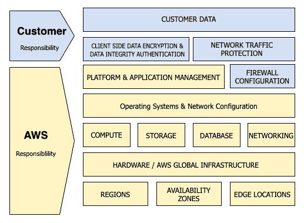

# 第三章：AWS 中的身份与访问管理以及密钥管理

在掌握了众多基本服务的基础上，我们现在进入 **身份与访问管理** (**IAM**) 部分。

定义用于管理对不同 **Amazon Web Services** **(AWS)** 服务的访问的控制和政策，正是 IAM 的基本内容。这可以通过用户、组、政策，甚至访问控制来实现，包括联合访问或短期凭证。还可以使用外部 **身份提供者** (**IdPs**) 来允许用户访问您的应用程序。理解如何使用本地 AWS 工具保护密钥，尤其是在 **持续开发** (**CD**) 过程中，是一种企业级技能，这不仅出现在 DevOps 专业考试中，而且在工作中也至关重要。

在本章中，我们将覆盖以下主要主题：

+   理解 AWS 中的共享责任模型

+   IAM 角色、组、用户和政策

+   将 **AWS Organizations** 作为指导的一部分

+   与 AWS 账户进行联合身份验证

+   在 AWS 中安全存储密钥

+   使用 **Amazon Cognito** 与应用程序身份验证

# 技术要求

在阅读本章时，您应该已经创建了一个 AWS 账户，并安装了 AWS **命令行界面** (**CLI**) **版本 2** (**v2**)，以便您可以跟随本章中的实际操作活动进行练习。如果您打算跟随 AWS 假设角色练习进行实践，您还需要多个 AWS 账户。

# 理解 AWS 中的共享责任模型

虽然我们在 *第一章* 中简要提到过它，*亚马逊 Web 服务支柱*，但理解共享责任模型对于管理账户的安全性，特别是 IAM 服务，是至关重要的。

下图提供了该模型的概览：


图 3.1 – AWS 共享责任模型：基础设施即服务（IaaS）

共享责任模型的本质是提供灵活性和客户控制。在此模型下，有两个主要概念，如下所示：

+   谁负责 *云的安全性*：

    这是 AWS 承担责任的部分。

+   谁负责 *云中的安全性*：

    这是您作为客户需要承担的责任。

AWS 控制着全球基础设施，其中包括承载所有 AWS 服务的服务器的数据中心。这些数据中心根据安全最佳实践和一系列安全合规规范进行管理。虽然客户不允许访问实际的数据中心，但独立的外部机构会对这些中心和实践进行认证和审计，以确保控制措施、政策和程序得到了遵循。

AWS 在多个层级上保护其数据中心，具体如下：

+   在边界层——AWS 选择用于容纳其数据和计算设施的建筑物并未向公众披露。这些设施也有严格的进入要求，并配备入侵检测和严密的监控来保护它们。

+   在环境层——在选择位置之前，AWS 会考虑环境风险，如恶劣天气、洪水和潜在的地震活动。

+   在基础设施层——在建筑物内部，有一套结合了火灾检测和抑制设备的系统。

作为客户，你的责任之一是你在账户中上传、存储和创建的数据。根据你和客户的需求，你可以选择以未加密的形式存储和传输数据。如果要求比明文数据更严格，AWS 提供了多种加密选项，或者你可以管理自己的加密。我们将在稍后的*第十九章*《保护静态和传输中的数据》中进一步讨论如何加密数据。

你在 AWS 云上的责任还包括你允许谁和什么访问你账户中的各种服务。这时，IAM 服务发挥着关键作用。默认情况下，AWS 不允许任何应用程序或用户访问其他任何服务。

保持操作系统的更新，包括对你**弹性计算云**（**EC2**）实例的任何补丁和更新，也属于你在共享责任模型中的责任。这些服务如**系统管理器**（**SSM**）和 Amazon Inspector 可以帮助你完成这项任务，识别关键的安全补丁并遵循维护计划。如果你运行实际的基础设施服务，那么最终责任就落在你身上。

你如何通过网络层允许流量进入你的实例也是你的责任。在*第二章*《基础 AWS 服务》中，我们讨论了**虚拟私有云**（**VPC**）以及你用来通过安全组和**网络访问控制列表**（**网络 ACL**）来保护网络的工具。将安全规则限制为仅允许必要的流量——而不是更多——可以防止外部实体通过端口扫描和其他恶意活动获取不必要的信息。

这个最初由 AWS 发布的主要共享安全和责任模型反映了 IaaS 模型中的责任。然而，随着不同的云计算模型的出现，例如**平台即服务**（**PaaS**），在容器服务和更像**软件即服务**（**SaaS**）的托管服务的情况下，Amazon 承担了更多的责任。

使用容器（特别是在 Fargate 的情况下）时，安全模型更倾向于 PaaS 模式，因此更多的责任被推向 AWS。你不再负责操作系统，因为 AWS 正在管理这一部分。然鹅，你仍然负责客户数据以及进出系统的网络流量，正如下图所示：



图 3.2 – AWS 共享责任模型：容器服务

需要理解的主要内容之一是，在所有共享责任模型中，您需要对数据的保护负责。这包括数据将暴露到多少个端口，以及数据将如何加密或是否保持未加密状态。

## 授权与认证

当我们开始了解身份和访问管理（IAM）时，我们首先需要完全理解授权与认证的概念。尽管这两个术语听起来相似，并且经常一起使用，但理解它们之间的区别对于我们深入探讨非常重要。

### 认证

认证是验证你所声称身份的过程。系统在询问你是谁，你通常会用用户名和密码进行回答，但有时也会使用安全会话令牌。认证是在回答问题*你是谁？* 和 *你能验证你自己说的身份吗？*

### 授权

授权发生在认证之后，确定你被允许执行的操作。大多数情况下，它发生在认证之后。规则和政策决定了你被授权访问的内容。在计算机世界中，这可以通过令牌传达，例如承载令牌或**JavaScript 对象表示法（JSON）Web 令牌**（**JWT**），它授予你访问服务或**应用程序处理接口**（**API**）的权限。

认证与授权的过程如下图所示：


图 3.3 – 认证与授权

认证和授权容易混淆，因为它们看起来相似，但可以将认证看作是你的照片身份证明，而授权则像是一个**射频识别**（**RFID**）徽章，它允许你访问。让我们通过另一个例子进一步明确这一点。

### 授权与认证的实际示例

在许多大型办公楼中，您需要一张带照片的身份证明才能进入大楼。在大多数情况下，您被要求随时佩戴该证件，以证明您已获得**授权**进入大楼，不会被安保人员拦截。当您走向电梯时，您可能需要扫描您的证件才能访问您工作的楼层。按下您的身份证明，其中包含一个与政策系统和用户资料相关联的 RFID 芯片，系统会知道您可以访问哪些楼层。如果您在三楼工作，那么您已经**验证**了可以按下 3 号按钮并乘坐电梯到三楼。大楼中可能还有其他门，您可能没有权限访问，具体取决于您的身份验证级别。

## IAM 需要理解的术语

当我们开始讨论 IAM 服务及其各个组件时，首先需要列出我们将使用的术语及其定义。对于职业考试来说，没有必要记住这些术语，但它们是您需要了解的整个服务的组成部分，尤其是低级考试中必考的内容。以下列出了这些术语：

+   **主体**：一个应用程序或人员，使用 AWS 根账户用户、IAM 用户或 IAM 角色进行身份验证并发起请求。这是可以对 AWS 资源执行操作的对象或人员。

+   **资源**：资源是您可以在 AWS 账户内操作的项目。资源的一个示例可能包括 Lambda 函数、EC2 实例或 **简单存储服务**（**S3**）存储桶。

+   **实体**：实体可以是 IAM 用户、联合用户，或来自身份提供者（IdP）的用户，或者在 AWS 上下文中的假设 IAM 角色。它仅仅是 AWS 用于身份验证的 IAM 资源对象。

+   **身份**：用于识别谁在使用服务的资源称为 IAM 中的身份。这些包括用户、组和角色。

### IAM 可以进行主体身份验证的方式

IAM 具有多种方式可以进行主体身份验证，具体如下：

+   **用户名和密码**——用户名和密码是进入 AWS 管理控制台的初始方式。

+   **访问密钥和秘密访问密钥**——这些是可以与用户或根用户关联的长期安全凭证。它们可以被轮换，并且每个用户在任何时刻最多可以关联两个访问密钥。

+   **会话令牌**——您可以使用假设的角色来利用**安全令牌服务**（**STS**）传递一个令牌，允许您或您的应用程序获得分配的访问权限。

    注意

    AWS 管理控制台用户默认不能使用其用户名和密码凭证运行任何特定程序并访问 AWS 服务或底层基础设施。所有这些都依赖于 IAM 策略提供的授权。

### IAM 的授权概念

在为用户和应用程序添加授权时，有两个模型需要注意：**基于角色的访问控制**（**RBAC**）和**基于属性的访问控制**（**ABAC**）。接下来我们将讲解每个概念。

### RBAC

传统的访问控制基于将用户和应用程序分组为组（或角色），然后为这些组分配权限。很多时候，这些组代表的是工作职能，与该职能相关的权限处理该职能的责任。

将特定的权限集映射到一个角色，将该角色定义为认证服务中的一个组，如**Active Directory**（**AD**）或 AWS IAM，然后将用户加入该组，以便他们能够假设这些权限，这被定义为 RBAC。

### ABAC

ABAC 可以基于三种不同类型的属性进行访问控制，列举如下：

+   用户属性

+   与要访问的系统相关的属性

+   当前环境条件

在 AWS 中，这些属性大多数通过标签、账户信息（即账户号码、别名或**组织单位**（**OU**））以及与用户关联的联合数据来管理。

### IAM 服务概念

使用 IAM 时，最重要的概念之一，以及在浏览 AWS 访问时的关键点，是只授予完成任务所需的最小权限，绝不多给。

# IAM 角色、组、用户和策略

在 IAM 中控制对资源的访问，归结于你如何设计附加到用户、组和角色的策略。服务本身假设角色，而在 IAM 中创建的用户，如果被放入组中，将更容易进行管理。

注意

每个账户有 500 个 IAM 用户的服务限制。

## IAM 策略

IAM 策略是一组权限，以 JSON 语句的形式表示，指定实体拥有哪些访问权限。

当你开始分配账户中的权限时，你将处理这些 IAM 策略。AWS 提供了许多预先制定的策略，帮助你快速入门，可以附加到用户和组或服务上。许多基于 AWS 的策略将资源列为`*`，但这意味着任何资源都可以被访问。即使是简单策略，也有多种方式可以限制可以访问的资源数量。

让我们看一个非常简单的 IAM 策略示例，展示了如何使用通配符在账户中为所有 S3 存储桶上的所有对象操作授予访问权限：

```
{
    "Version": "2012-10-17",
    "Statement": [
        {
            "Sid": "AllS3ObjectActions",
            "Effect": "Allow",
            "Action": "s3:*Object",
            "Resource": ["*"]
        }
    ]
}
```

然而，我们可以通过修改策略中的资源行来限制我们的用户可以访问的存储桶，如下所示：

```
{
    "Version": "2012-10-17",
    "Statement": [
        {
            "Sid": "AllS3ObjectActions",
            "Effect": "Allow",
            "Action": "s3:*Object",
            "Resource": ["arn:aws:s3:::my-bucket/*"]
        }
    ]
}
```

AWS 中有多种不同类型的策略可以使用，如下所示。每种策略在权限管理中扮演着不同的角色：

+   基于身份的策略

+   基于资源的策略

+   权限边界

+   组织的**服务控制策略**（**SCPs**）

+   ACLs

+   会话策略

现在我们知道了 IAM 策略如何工作，以及可用的不同类型的策略，让我们来看看一些 IAM 策略的基本概念，以及不同类型的策略如何协同工作形成有效的权限。

### IAM 策略概念

当你开始使用 IAM 时，你需要理解该服务是如何根据其内部逻辑评估策略请求的。以下是你需要记住的规则概览：

+   默认情况下，所有请求都会被拒绝（除非你是根用户）。

+   如果某项服务已被明确拒绝，则该规则优先，即使另一个规则允许该服务。

+   策略中的显式 `allow` 将覆盖默认的隐式 `deny`。

+   如果一个 SCP、会话策略或权限边界授予某项服务访问权限，那么它也会覆盖隐式的 `deny`。

为了更深入理解规则是如何处理的，我建议你阅读此处提供的文档：[`docs.aws.amazon.com/IAM/latest/UserGuide/reference_policies_evaluation-logic.html`](https://docs.aws.amazon.com/IAM/latest/UserGuide/reference_policies_evaluation-logic.html)。

在 *图 3.4* 所示的图示中，有三个圆圈。最底部的圆圈是基于身份的策略——即用户或组授予该有效用户权限的位置。然而，还有其他身份策略在起作用，这些策略可以限制——在某些情况下扩展——用户的有效权限。所有策略交汇的中心——在此情况下箭头指向的地方——是该用户的有效权限集，如下所示：


图 3.4 – 有效的策略权限

通过了解这些不同类型的策略如何相互作用以形成有效的权限，我们现在可以开始创建我们的身份，包括角色、组和用户。

### 身份

当你首次创建 AWS 账户时，注册时使用的电子邮件账户将成为你的 AWS 根用户。尽管你可以使用这个根用户访问管理控制台，并且该用户拥有对 AWS 账户中所有服务和资源的完整无限制权限，但不建议你使用该用户来创建资源和工作负载。

在下图中，我们可以看到根用户位于 AWS 账户结构的顶部，然后我们的组会继承给用户和角色：


图 3.5 – IAM 用户和组

一旦我们确定了要在账户中创建的组，并了解每个组或角色将继承的权限基础，我们就可以开始创建这些组。

### IAM 组

以下是关于组的一些重要事项：

+   一个用户可以属于多个组，组也可以有多个用户。

+   组只能包含用户，而不能包含其他组，因此组不能相互嵌套和继承权限。

+   用户必须手动添加到组中。在创建用户或角色时，不会自动为其分配权限的默认组。

#### 创建 IAM 组

在我们实际添加用户之前，让我们创建这些组并将 Amazon 托管的 IAM 策略与这些组关联，如*图 3.5*所示。我们将创建以下组，并将以下托管策略与它们关联：


图 3.6 – 组及其关联的托管策略

现在我们知道要设置哪些组，让我们使用 CLI 来创建这些组，如下所示：

1.  打开你的终端并输入以下命令，我们来创建第一个组（`Admins`）：

    ```
    Admins at the end of it.
    ```

1.  现在，让我们检查我们账户中的当前组，如下所示：

    ```
    $aws iam list-groups --output text
    ```

    注意我如何更改输出——对于我即将展示的四个组，这种方法不会占用像 JSON 格式那样多的页面空间。输出应该类似于此处显示的内容：

    ```
    GROUPS  arn:aws:iam::470066103307:group/Admins  2021-03-11T22:36:46+00:00       AGPAW24Q7QQF4DBRNWTM4   Admins  /
    GROUPS  arn:aws:iam::470066103307:group/Billing 2021-03-11T22:41:23+00:00       AGPAW24Q7QQF2FJB3ZW27   Billing /
    GROUPS  arn:aws:iam::470066103307:group/Developers       2021-03-11T22:54:10+00:00       AGPAW24Q7QQF7NUSSDSWF   Developers      /
    GROUPS  arn:aws:iam::470066103307:group/Testers 2021-03-11T22:51:26+00:00       AGPAW24Q7QQFZ6FIU6WDA   Testers /
    ```

1.  一旦我们看到列出的所有组，我们就可以开始附加我们之前识别的托管策略。然而，在使用 CLI 时，我们需要知道`grep`来帮助我们的搜索，具体如下所示的代码片段：

    ```
    grep command to quickly search through the output and find the exact name we were looking for. We were able to use some of the command-line flags to help narrow our initial search; however, there isn't a great option to search for a particular policy name. If you would like to read more about the options for the command, you can find all flags available on the documentation page listed here: https://docs.aws.amazon.com/cli/latest/reference/iam/list-policies.html.The output should look like this:

    ```

    AdministratorAccess，这是第一个返回的结果。其他的返回是因为它们的名称中包含了 AdministratorAccess。

    ```

    ```

1.  现在我们找到了托管策略的 ARN，我们可以将其附加到组中，具体如下所示的代码片段。一旦 IAM 策略附加到组，任何我们稍后添加的用户将自动获得这些权限：

    ```
    $aws iam attach-group-policy --policy-arn arn:aws:iam::aws:policy/AdministratorAccess --group-name Admins
    ```

    执行此命令后，它不会返回任何结果或反馈。

1.  我们可以通过命令行检查我们的策略是否已附加到组中，方法如下：

    ```
    $aws iam list-attached-group-policies --group-name Admins
    ```

    这将返回我们刚刚附加到组上的策略，具体如下所示的代码片段：

    ```
    {
        "AttachedPolicies": [
            {
                "PolicyName": "AdministratorAccess",
                "PolicyArn": "arn:aws:iam::aws:policy/AdministratorAccess"
            }
        ]
    }
    ```

    到此为止，我们暂时完成了这一步。我们需要创建用户以便将其添加到组中。

    注意

    我们也可以使用 CloudFormation 脚本来完成这项任务，这样可以更容易地回滚或清理我们刚刚创建的任何组。我们将深入探讨 CloudFormation 和**基础设施即代码**（**IaC**）的内容，在*第七章*中，*使用 CloudFormation 模板部署工作负载*。

### IAM 用户

IAM 用户是有凭证访问和与指定 AWS 服务集进行交互的人员或应用程序。

当你创建账户时，你会自动成为根账户用户。

创建用户后，他们初始没有任何权限，且未经授权无法对 AWS 资源执行任何操作，直到你或其他管理员（或具有 IAM 权限的人员）通过内联策略授予他们访问权限，或者将他们添加到一个组中。

IAM 用户不能与多个 AWS 账户关联。

IAM 的用户部分也是你存储每个用户的**安全外壳**（**SSH**）密钥的地方，以访问 AWS Git 服务 CodeCommit。我们在*第八章*中才会深入探讨 CodeCommit，*使用 CodeCommit 和 CodeBuild 创建工作负载*；然而，理解密钥、用户和 IAM 权限之间的相互作用是很重要的，特别是当你希望你的用户能够自我管理、添加、移除和轮换他们自己的 SSH 密钥时。

如果你想为你的账户创建更多具有指定角色的用户，可以使用你刚刚创建的新角色，并按照*第二章*的步骤，*基础 AWS 服务*，来创建一个用户。

### 角色

IAM 角色允许你授权服务、应用程序和其他 AWS 服务在不将访问密钥和秘密访问密钥等凭证硬编码到应用程序中的情况下访问——或者对于用户而言，甚至创建一个访问密钥和秘密访问密钥对。

角色在切换账户时也非常有用。如果你有多个账户——例如，开发、测试和生产账户——你可以在开发账户中使用你的用户，然后在其他两个账户中创建角色，这些角色可以被你的主用户假设。

角色的另一个优点是它们可以由同一服务的多个实例承担（例如，EC2/Lambda）。就像在 IAM 组中一样，如果你需要为角色的策略添加更多权限或移除权限，这些更改几乎会立即生效。

对于 EC2，你会使用**实例配置文件**将角色传递给 EC2 实例。实例配置文件只能包含一个角色，这是一个无法增加的硬性服务限制。如果实例的权限需求发生变化，你可以移除当前附加到实例配置文件的角色，然后附加一个包含不同权限集的角色。

角色和角色假设也是一种提供访问给第三方的方式，这些第三方可能也有自己的 AWS 账户，但可能需要有限的访问权限。这可能是一个第三方合作伙伴，或者是一个只需要只读访问权限的审计员。

注意

对于本次练习，我们将需要两个账户，如下所示：

**账户 A**：这将是我们创建一个角色的账户，允许该角色被假设。

**账户 B**：这将是我们之前在操作的账户，我们将使用之前创建的一个用户来假设该角色并访问另一个账户。

在开始之前，最好知道账户编号，并将其保存在名为*账户 A*和*账户 B*的文本文件中。这样在我们开始设置角色的过程时会更加方便。如果您不知道您的 AWS 账户编号，找到它最简单的方法是点击主菜单顶部的用户名。下拉菜单出现后，其中一项是**账户**，显示您的账户编号。

我们首先进入*账户 A*，并创建一个角色，具体步骤如下：

1.  使用具有管理员用户权限或能够创建 IAM 用户和角色的*账户 A*中的用户登录控制台。

1.  访问 IAM 服务：[`console.aws.amazon.com/iam/home`](https://console.aws.amazon.com/iam/home)。

1.  在左侧菜单中，点击**角色**。

1.  一旦**角色**屏幕出现在主窗口中，点击标签为**创建角色**的蓝色按钮。

1.  在下一屏幕上，您要选择的可信身份类型是**另一个 AWS 账户**，如下面的截图所示：

    图 3.7 – 创建 IAM 角色

1.  在**账户**字段中输入*账户 B*的账户编号，然后点击页面底部的**下一步：权限**按钮。

1.  在`S3FullAccess`上。这将调出`AmazonS3FullAccess`策略。勾选此策略名称旁边的框。在勾选框后，参照下面的截图，点击页面底部的蓝色按钮，标记为**下一步：标签**：

    图 3.8 – IAM S3 完全访问策略

1.  我们在本练习中不会添加任何标签，所以只需点击屏幕底部的蓝色按钮，标签为**下一步：审查**。

1.  一旦我们进入`AssumeS3`，如果您想输入描述，可以输入（请参见下面截图中的示例描述），但这不是必要的。确保一切看起来正确，然后点击底部的**创建角色**按钮：


图 3.9 – IAM 假设 S3 角色审查

现在我们已经在*账户 A*中设置了角色，可以退出该账户，然后重新登录到*账户 B*，以便使用我们创建的新角色，从主角色切换到*账户 A*中的`AssumeS3`角色，步骤如下：

1.  一旦我们登录后，点击右上角菜单中的您的名字，显示下拉菜单（我们之前通过这种方式查找了账户编号）。

1.  在下拉菜单显示时，点击菜单项**切换角色**，如下面的截图所示：

    图 3.10 – 从 AWS 管理控制台切换角色

1.  现在，在**切换角色**屏幕上，点击标签为**切换角色**的蓝色按钮。

1.  在下一屏中，你将看到三个文本框需要填写，具体如下：

    a. 在标有`AssumeS3`的框中）。

    c. 在标有`AccountA_S3`的框中，如以下截图所示：

    

    图 3.11 – 假设角色在账户 A

    填入这些信息后，你现在可以切换角色了。

1.  填入所有信息后，点击蓝色的**切换角色**按钮。

1.  现在你应该已处于*账户 A*中，并且菜单栏顶部的颜色标示了`AssumeS3`权限，以及角色的显示名称，具体如以下截图所示：


图 3.12 – AWS 管理控制台显示成功切换角色

我们刚刚了解了角色如何帮助我们管理自己账户中的权限，同时也赋予我们在另一个账户中承担定义权限集的能力。接下来，我们将介绍如何通过权限边界在账户级别设置限制，并分享一些 IAM 的最佳实践。

### 权限边界

权限边界是 IAM 的高级功能，它允许你使用 AWS 托管策略，但为这些策略设置最大资源限制。在实际使用中，权限边界可以非常有用，允许你将具有所需权限的 AWS 托管策略应用到用户、组或角色上，并通过权限边界策略确保该实体不会访问超出所需的资源。

如果我们回顾一下*图 3.4*，可以看到身份基础的策略与权限边界策略的交集。两者之间的部分即为该实体的有效策略。AWS 提供的大多数托管策略允许在`*）`范围内使用。对于大多数组织，无论大小，这都是一个过于宽松的权限集。这不仅在组织的不同部门之间存在安全隐患，而且限制访问有助于减轻用户在意外情况下可能造成的影响范围。

### IAM 最佳实践

让我们来看看在使用 IAM 时的一些最佳实践，如下所示：

+   不要使用根账户进行日常访问。根账户仅应在初始化管理员用户时使用，或在紧急/破玻璃场景中使用。

+   始终为根用户设置**多因素认证**（**MFA**）。此外，最佳实践是为任何账户管理员配置 MFA。尽量为所有用户启用 MFA。

+   设置一个密码策略，要求用户设置强密码，并定期更换密码。

+   不要直接将权限赋给用户；应使用组或允许用户承担角色—将权限集分配给角色，并允许用户承担这些角色。

+   不要让秘密以明文形式留在代码中。使用 Secrets Manager 或 Parameter Store 等秘密存储服务来安全地存储秘密。

在下一部分中，我们将学习如何将 **AWS Organizations** 作为你指导的一部分。

# 将 AWS Organizations 作为你指导的一部分

**AWS Organizations** 是一个帮助你整合多个 AWS 账户以便于管理和计费的服务。AWS Organizations 不仅帮助你在组织框架下快速轻松地创建新账户，还提供了在独立 AWS 账户中无法获得的治理功能。

与 IAM 相关的两个功能是 OU 和 SCP。

## 使用 OU 进行分离

要理解 OU，首先需要了解两个基本概念，如下所示：

+   组织

+   根账户

**组织** 是你创建的实体，用于统一你控制下的不同 AWS 账户，以便你能够作为一个单元进行管理。一个主账户会分配给一个组织，该组织可以分支成零个或多个单元。许多时候，组织是以树状结构组织的，根账户位于顶部，OU 和子账户在下面分支。

**根账户** 是组织中所有其他账户的源容器。如果你将 SCP 应用于根账户，它会向下流动，并因此应用于所有组织账户和子账户。

OU 只是一个用于将账户分组在根账户下的容器。组织账户可以嵌套在其他 OU 单元中，从而创建你的组织层次结构，根账户位于顶部。

### 组织的功能

组织允许你在 AWS 账户之间集中管理策略。这有助于你通过使用 **AWS Organizations** 创建一个账户组，并将策略附加到指定的组，从而提升对 AWS 环境的控制，确保在这些账户上应用正确的策略，而无需任何自定义脚本。

你可以集成 AWS **单点登录**（**SSO**），以便在一个地方简化为你的用户提供不同账户的访问权限。

SCP 允许组织为 AWS 服务、资源和区域管理权限保护措施。

**AWS Organizations** 还允许你轻松设置合并计费，为组织中的所有账户使用单一支付方式。这使你能够享受价格优势，如聚合使用量和不同服务的批量折扣，而这些在账户分开的情况下是无法获得的。

## SCP

SCP 是一种工具，您可以使用它通过继承管理特定 OU 或整个组织的策略。它们可以增强或限制用户当前权限的范围，且在与高级 IAM 结构（如 `Condition`、`ArnNotLike`、`StringNotLike` 和特定区域）结合使用时最为有效，从而提供组织一致同意的保护措施，确保用户不会故意或无意地执行不当的操作。

### SCP 示例

以下代码示例提供了一个 SCP 示例，您可以将其附加到组织的根级别，以确保如果有人要删除 EC2 或 **关系型数据库服务**（**RDS**）实例，则必须先提供多因素设备进行验证：

```
{
  "Version": "2012-10-17",
  "Statement": [
    {
      "Sid": "DenyDeleteandTerminateWhenMFAIsNotPresent",
      "Effect": "Deny",
      "Action": [
        "rds:Delete*",
        "ec2:TerminateInstances"
      ],
      "Resource": "*",
      "Condition": {"BoolIfExists": {"aws:MultiFactorAuthPresent": false}}
    }
  ]
}
```

您会注意到 SCP 语法几乎与普通的 IAM 策略语法完全相同，包含 `Effect`、`Action`、`Resource` 和 `SID`。此 SCP 实际上有一个可选的条件值，在这里我们检查是否存在 MFA，如果不存在，则拒绝该操作。

# 将联合身份验证与 AWS 账户集成

如果将要访问您账户的用户已经拥有身份验证方法，那么有几种不同的方法可以将联合身份验证集成到您的 AWS 账户中。

*“身份联合是一种两方之间的信任系统，用于验证用户身份并传递授权访问资源所需的信息。在此系统中，身份提供者（IdP）负责用户身份验证，而服务提供者（SP），如服务或应用程序，控制对资源的访问。”*（AWS，2021）

当您集成联合身份验证时，您的用户将使用 STS 来请求一个会话以授权访问您的账户。

一个会话包含以下内容：

+   一个访问密钥

+   一个秘密访问密钥

+   一个安全令牌

+   一个过期日期（用于指示安全令牌何时不再有效）

默认情况下，联合令牌将在 12 小时后过期，但可以设置为在最短 15 分钟或最长 36 小时后超时。

联合令牌是通过几种不同的请求类型从 STS 服务发放的，其中列出了一些请求类型：

+   `GetFederatedToken`

+   `AssumeRoleWithSAML`

## 何时使用联合身份验证？

在某些场景下，联合身份验证在您的环境或账户中是非常适用的。首先是如果您有一个**安全断言标记语言**（**SAML**）2.0 兼容的企业目录。此类目录的例子有 **AD 联合身份验证服务**（**AD FS**）、Okta、Shibboleth 等。当您的目录符合 SAML 2.0 标准时，您可以将其配置为为 AWS 管理控制台提供 SSO 访问。

即使目录不符合 SAML 2.0 标准，您仍然可以为用户提供单点登录（SSO）功能。然而，在这种情况下，您需要创建一个身份代理应用程序来提供 SSO 访问。

你可能会使用联合身份验证的第二种场景是，如果你的用户通过第三方进行身份管理，例如 Web 身份。在这种情况下，Web 身份提供者（IdP）提供身份验证步骤，然后你可以使用联合身份验证授权用户访问他们需要的 AWS 服务。我们将在本章后面讨论如何使用 AWS Cognito 服务时进一步探讨这一点。

## 使用 AD 联合身份验证与 IAM

当你使用 AD FS 提供账户访问时，流程按以下顺序进行：

1.  用户（或应用程序）向联合身份验证代理请求会话。

1.  用户然后通过 AD 进行身份验证，以确保他们是活跃用户并且具有访问 AWS 云的权限。

1.  接下来，AD 确定用户有权接收的权限数量。

1.  然后，联合身份验证代理会从 AWS 账户中的 STS 服务发起 `GetFederationToken` 请求。

1.  STS 服务随后返回联合令牌（包括访问密钥、秘密密钥和会话令牌）。

1.  联合身份验证代理随后将令牌传递给用户。

1.  用户然后可以向 AWS 账户发出 API 调用。

使用联合身份验证来访问你的 AWS 账户，对于拥有大型组织的用户尤其有用，因为这样你就不需要在 AD 和 AWS IAM 中分别管理用户了。它还可以帮助你绕过每个账户最多只能创建 500 个 IAM 用户的服务限制。

AWS 根据你的需求提供了多个不同的*版本*的 AD，接下来我们将讨论这些选项。

### AWS 目录服务

AWS 根据你的需求提供了多种不同的云中使用 AD 的选项。AWS 目录服务提供了三个不同级别的服务，每个服务的用途不同。

### AWS 目录服务 for Microsoft AD (MS AD)

如果你希望在云中运行托管服务版的企业版 AD，那么 AWS AD 服务是一个非常好的选择。该服务可以处理最多 50,000 个用户和最多 200,000 个 AD 对象。它还支持在多个区域中以高可用的方式进行部署。多区域复制仅在 AWS 托管 MS AD 的企业版中支持。

如果你有超过 5,000 个用户，并且当前没有 AD 服务器或无需在 AWS 云中管理用户和/或 AD 对象，那么 AWS 目录服务是你最好的选择。

使用此服务的一个缺点是，如果遇到性能问题，你没有很多可调整的选项。这毕竟是一个托管服务，目的是减轻你的管理任务。这也不适用于 Web 联合身份验证。

#### AD 连接器

如果您已经有一个本地的 AD 服务器，并且想要快速将其扩展到云端，那么 AD 连接器是一个不错的选择。AD 连接器不会在云端缓存信息，而是作为本地 AD 服务器的代理。这也意味着您不能在云端对 AD 连接器进行任何更改，所有更改和更新都必须在本地服务器上进行。

#### 简单 AD

简单 AD 有两个版本：小型版和大型版。小型版支持最多 500 个用户和 2000 个对象，大型版支持最多 5000 个用户和 20000 个对象。如果这些数字无法满足您组织的增长需求，您需要考虑其他解决方案，例如 MS AD。

简单 AD 支持基于 Kerberos 的 SSO 身份验证，并且可以通过 CloudFormation 脚本快速启动。

重要提示

简单 AD 基于 Samba 4，并不是真正的 MS AD。它不支持与其他 AD 系统的信任关系，也不支持 MFA、PowerShell、AWS SSO 或 Amazon Chime 等功能。虽然如果您只有少量用户，或者需要为少量 Windows 机器提供**完全合格的域名**（**FQDN**）来使用云端服务，它是一个不错的选择，但请注意其局限性，尤其是在阅读考试题目时。

## AWS SSO

即便 AWS 提供了丰富的服务，仍然有其他服务是您或您的客户可能希望作为 SaaS 服务集成，并且这些服务需要身份验证。与其让用户每次都验证自己对每个**服务提供商**（**SP**），AWS 使用其自有的 SSO 服务使这一过程变得简单。

即使您使用的是本地的 AD 或 Azure 基础的 AD，您也可以使用第三方身份验证服务，例如 Okta 或 Ping Identity，并且这些服务同样可以与 SSO 集成。

AWS SSO 使管理员轻松管理多个 AWS 账户，您可以快速且轻松地将用户及其角色映射到账户，并通过单一入口点进行管理。这样，您无需再设置 SAML 令牌或让用户去选择切换角色的账户。

## 选择用户身份策略

使用这些不同的方法来管理用户及其授权管理方式时，您可能需要一些关于何时使用每种方法的指南。

如果您有一个小团队，那么通常使用 IAM 组来管理最为合适。

如果您想使用联合身份验证来管理用户登录，并且已经有一个 AD 环境，那么通过 AD 实现 SAML 联合身份验证将是正确的选择。

如果您需要联合身份验证，并且尚未拥有 AD，且希望获得 AD 提供的额外功能，例如为 Windows 实例提供**域名系统**（**DNS**）管理，那么可以使用 AWS 目录服务。

然而，如果你需要联合身份认证，并且不想麻烦地设置和管理 AD 或承担许可费用，那么 AWS SSO 将是你最好的选择。

# 在 AWS 中安全地存储机密

作为一名 DevOps 工程师，负责通过部署管道对我们的基础设施和应用程序进行编码并部署，并不意味着可以省略诸如用户名、密码或第三方 API 身份验证等凭证管理。然而，这确实要求我们在更加安全和可重复的基础上进行身份验证，从而避免影响开发和测试，并且仅与那些真正需要知道的人共享访问权限。如果所有开发人员都在使用相同的应用程序，并不需要每个人都有数据库的用户名和密码。此外，如果你不直接将凭证分发给每位开发人员，而是让开发人员从秘密管理器中请求凭证，便可以减少每次人员变动时需要更改凭证的管理负担。虽然市场上有第三方解决方案可以执行此任务，但 AWS 提供了两种不同的本地服务，允许进行机密管理，甚至机密轮换。

## AWS Secrets Manager

你可以使用 Secrets Manager 来存储、轮换、监控和控制对诸如数据库凭证、API 密钥以及 **开放授权**（**OAuth**）令牌等机密的访问。Secrets Manager 的主要特点之一是它允许通过 AWS Lambda 函数自动轮换机密。

不再需要将硬编码的机密存放在你的 IaC 或应用程序代码中，甚至不需要在启动时将其下载到实例并以未加密的易受攻击状态存储。现在，你可以通过调用 Secrets Manager 简单而安全地在需要时检索机密。

对 Secrets Manager 的访问也受到 IAM 策略的管控。用户或角色必须获得访问 Secrets Manager 服务整体或特定实例的权限，才能执行如存储和检索机密等操作。

Secrets Manager 的另一个功能是每次访问机密时，都会留下审计跟踪记录。这在高合规性行业中是一个非常有价值的功能。

你可能会想：*什么是机密？* 在 Secrets Manager 中，机密通常是用于访问受保护设备的一组凭证（用户名和密码）以及连接详细信息。

### Secrets Manager 中机密的基本结构

在 Secrets Manager 中，机密包含加密的机密文本以及多个元数据元素，这些元素表示机密并定义 Secrets Manager 应如何处理机密，如下图所示：


图 3.13 – Secrets Manager 中机密的结构

现在我们已经了解了 Secrets Manager 如何存储和管理我们为安全存储而放入的密钥版本，让我们通过一个练习来创建和存储一个密钥，使用 AWS Secrets Manager。

### 在 AWS Secrets Manager 中创建和存储密钥

在以下练习中，我们将使用 AWS 管理控制台和 AWS Secrets Manager 安全地存储一个密钥。操作步骤如下：

1.  打开浏览器，返回到亚马逊 Web 控制台。如果您的会话已过期，您可能需要重新登录。在顶部的搜索栏中，输入`Secrets Manager`，以使**Secrets Manager**图标显示。点击该图标以进入主**AWS Secrets Manager**页面，如下图所示：

    图 3.14 – 主 Secrets Manager 页面

1.  在主 `Secrets Manager` 页面或**密钥列表**页面中，一旦进入控制台中的**Secrets Manager**部分，点击**存储新密钥**。

1.  在**存储新密钥**页面上，选择**其他类型的密钥**，如下图所示：

    图 3.15 – 在存储新密钥页面上选择密钥类型

1.  在**指定要存储在此密钥中的键/值对**下，选择**密钥/值**，这样您就可以将密钥作为键值对输入，如下图所示：

    图 3.16 – 向您的密钥添加键值对及值到 Secrets Manager

1.  对于`DefaultEncryptionKey`，如以下屏幕截图所示：

    图 3.17 – Secrets Manager 加密

1.  在第一个框中，输入`username`。在第二个框中，输入`devopspro`。

1.  选择**+ 添加行**以添加第二个键值对。

1.  在第一个框中，输入`password`。在第二个框中，输入`MyTopSecretP@ssword#`。

    一旦我们输入了密钥的值，我们可以在 JSON 格式下查看它，以确保其正确性。

1.  选择密钥的`SecretString`字段。

1.  对于`DefaultEncryptionKey`，然后点击**下一步**。

1.  在`chapter3/SecretManager`下。这会将您的密钥存储在一个虚拟的`chapter3`文件夹中。

1.  对于`Secret Manager Tutorial`，然后点击**下一步**。

1.  我们不需要轮换此密钥，因此选择**禁用自动轮换**，然后点击**下一步**。

1.  在**复审**页面上，您可以检查您所选择的所有设置。如果您在应用程序中使用该密钥，请务必查看**示例代码**部分，其中包含可以粘贴到您自己应用程序中的代码，以便使用此密钥来检索凭证。每个标签页都包含不同编程语言中的相同代码。

1.  要保存更改，请选择**存储**。

### 从 Secrets Manager 中检索您的密钥

现在我们知道如何使用 AWS 管理控制台保存秘密，我们将使用 AWS CLI 检索秘密，并查看它已成功存储。操作如下：

1.  如果您之前关闭了终端，请打开它，并输入以下命令，以便我们可以检索秘密：

    ```
    $aws secretsmanager list-secrets
    ```

    执行上述命令后，应该会返回类似于以下内容：

    ```
    {
        "SecretList": [
            {
                "ARN": "arn:aws:secretsmanager:us-east-2:470066103307:secret:chapter3/SecretManager-qBEqSh",
                "Name": "chapter3/SecretManager",
                "Description": "Secret Manager Tutorial",
                "LastChangedDate": "2021-03-15T21:55:53.828000-04:00",
                "Tags": [],
                "SecretVersionsToStages": {
                    "83e08e0f-00d6-46d2-b05a-223041403f19": [
                        "AWSCURRENT"
                    ]
                },
                "CreatedDate": "2021-03-15T21:55:53.783000-04:00"
            }
        ]
    }
    ```

1.  现在我们可以看到我们在 Secrets Manager 中以名称`chapter3/SecretManager`存储的秘密，我们可以通过运行以下命令来检索秘密：

    ```
    SecretString field for you to use. You should also notice that it has returned the current value by default. We could have also asked Secrets Manager to return us back to the previous version of the secret stored if we needed that version of the secret. 
    ```

我们刚刚使用 AWS Secrets Manager 成功创建、存储和检索了一个秘密。我们能够检索秘密的原因之一是因为我们的 IAM 角色赋予了我们这样做的权限。接下来，我们将查看 AWS 为秘密的安全保管提供的另一项服务：SSM 参数存储。

## SSM 参数存储

**参数存储**是 AWS 提供的一项托管服务，用于存储字符串。这些可以是明文字符串，或者在将其用作秘密管理器时，它可以存储加密数据。访问这些参数受 IAM 策略访问的管理。

参数存储比 Secrets Manager 更灵活，如果您在那里存储标准参数，则没有费用，但参数数量有限制为 10,000 个。

存储在参数存储中的秘密和值可以从许多不同的 AWS 服务中访问，包括以下服务：

+   EC2

+   **弹性容器服务** (**ECS**)

+   Secrets Manager

+   AWS Lambda

+   CloudFormation

+   CodePipeline

+   CodeBuild

+   CodeDeploy

如果您或您的团队正在寻找一种集中的方法来将秘密和配置数据与代码库分离，以及存储不同环境的不同值的能力，那么参数存储可能是一个不错的选择。

### Secrets Manager 与 Parameter Store

当我们查看不同的 AWS 安全存储秘密的服务时，我们可能会想知道为什么选择其中一个而不是另一个。让我们快速比较这两种服务，看看它们的主要区别，如下所示：

+   如果您正在寻找一种不会增加预算的选项，则 SSM 参数存储是您和您的组织的正确选择。

+   如果您希望能够存储明文秘密，则 SSM 参数存储具有此功能。AWS Secrets Manager 无法存储明文值。

两种服务在安全性方面都是成比例的，因为两者都可以使用**密钥管理服务** (**KMS**) 在静态时安全地加密值。

如果您希望能够自动轮换秘密，则 AWS Secrets Manager 需要成为您的服务选择。（使用参数存储，您将不得不手动轮换秘密。）

# 使用 Cognito 进行应用程序身份验证

Cognito 是一项服务，允许 Web 和移动应用程序通过用户名和密码或第三方身份验证社交 IdP（如 Amazon、Facebook 或 Google）来进行身份验证。**Amazon Cognito** 的三个主要功能是用户管理、身份验证和同步。Cognito 可用于协调外部用户通过第三方 IdP 进行身份验证。您还可以通过任何基于 SAML 的 IdP 联邦化您的用户。

使用 Cognito 的一些优势包括以下几点：

+   设置简便，您可以在几分钟内让集成到 AWS 服务中的身份验证和授权系统上线，而与之相对的，自定义编程同样任务所需的时间要长得多。

+   您可以快速而轻松地将 MFA 集成到 **Amazon Cognito** 中。

+   Cognito 指标可以通过 CloudWatch 服务轻松监控，无需额外的工作或编码。

+   对 Cognito 服务的任何 API 调用都会记录到 CloudTrail（假设您已为该帐户和区域启用 CloudTrail）。

## 您会在哪里使用 Cognito？

当您为外部客户（即不是您公司的一部分的客户）构建应用程序，并希望这些客户无论使用何种设备都能有相同的体验时，这时使用 AWS Cognito 就是一个合适的选择。Cognito 允许用户无论使用手机、平板、笔记本电脑还是 **虚拟机**（**VM**），都能拥有相似的登录体验。

使用 Cognito 的另一个案例是，如果您希望快速将 **双重身份验证**（**2FA**），如电子邮件或 **简单消息服务**（**SMS**）身份验证集成到您的应用程序中。

## 用户池

Cognito 的第一个主要组件是用户池。实际上，用户池提供了注册和登录服务。了解关于用户池的以下事实：

+   它们提供注册和登录服务。

+   用户池有一个内置的 **用户界面**（**UI**），并且可以自定义。

+   它们允许通过社交 IdP（如 Amazon、Google、Facebook 和 Apple）以及来自用户池的 SAML IdP 进行登录。

+   它们支持诸如 MFA 身份验证等安全功能，可以检查泄露的凭证，并具有帐户接管保护。

+   用户池支持电话和电子邮件验证。

+   用户池允许通过 AWS Lambda 触发器进行自定义工作流以及用户迁移。

一旦您成功通过用户池对用户进行身份验证，Cognito 就会发放一个 JWT，可以用于授权访问您的 AWS 凭证或 API，如下图所示：


图 3.18 – Cognito 用户池身份验证

了解了用户池及其功能后，我们可以来看一下 **Amazon Cognito** 的另一个主要组件：身份池。

## 身份池

**Amazon Cognito**的第二个主要组成部分是身份池。身份池提供访问 AWS 服务的凭证。使用身份池，你可以为用户创建独特的身份，使他们能够临时访问 AWS 服务。

如果你查看*图 3.17*中显示的工作流，你会看到用户从其设备上的应用程序启动登录（通常是通过 Web IdP）。一旦通过 Web IdP 验证，`GetId`调用会传递给 Amazon Cognito，后者会验证请求。然后，应用程序会发出`GetCredentialsForIdentity`请求。Cognito 会再次验证此请求。此时，Cognito 将调用 STS 服务并为应用程序授权的服务获取一个短期令牌，然后将其返回给应用程序，如下图所示：


图 3.19 – Cognito 身份池授权流程

身份池还允许你定义自己的自定义开发者认证身份，除了 AWS 支持的社交 IdP 进行身份验证之外。你可以在 Cognito 控制台中选择**自定义**，设置自己的名称，然后使用 AWS 提供的示例代码作为创建新自定义联邦身份池的基础。

记住的提示

用户池提供身份验证，身份池提供授权。

# 总结

在本章中，我们学习了 AWS 中的身份验证和授权方法。我们讨论了如何使用用户名和密码或通过 IAM 服务进行联邦授权用户，然后通过 IAM 策略对他们进行身份验证。**AWS Organizations**还向我们展示了如何通过使用 SCP 进一步限制授权设置。我们查看了与 AD、AWS SSO 和 Cognito 等服务的不同联邦模型。我们还了解了如何使用 Secrets Manager 或 SSM Parameter Store 安全地存储密钥，以便在开始与应用程序工作时使用。

在下一章中，我们将通过介绍 NoSQL 服务 DynamoDB 来总结 AWS 基础知识部分。

# 复习问题

1.  在 AWS 为 IaaS 提出的共享责任模型中，谁负责操作系统的安全性和补丁管理？

1.  在此处提供的选择中，用户和角色之间的主要区别是什么？

    a. 角色可以由多个主体假定；用户不能被假定。

    b. 角色使用长期凭证。

    c. 角色可以是一个组的成员。

    d. 角色不使用长期凭证。

1.  授权和身份验证哪个先进行？

1.  AWS 中哪个原生服务存储密钥并提供自动密钥轮换？

1.  一家公司希望将当前的 AD 扩展到 AWS 云中，但不想管理更多的服务器。对于他们来说，哪个服务是最佳选择？

    a. AWS 简单目录服务

    b. AWS Cognito

    c. AWS 用户池

    d. AWS AD 连接器

# 复习答案

1.  客户负责操作系统的补丁和安全性。

1.  a 和 d。

1.  认证。

1.  AWS Secrets Manager。

1.  d.
