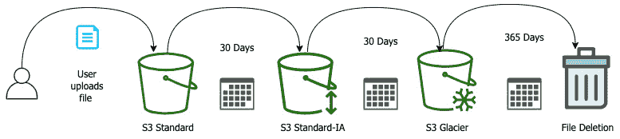

# 第四章：Amazon S3 Blob 存储

Amazon S3 是 Amazon Web Services 的核心组成部分之一。然而，在 DevOps 专业人员的上下文中，有一些关于该服务的细微差别，你不仅需要熟悉它们，还需要在实施时感到得心应手。

亚马逊的**简单存储服务**（**S3**）是许多用户和公司进入云计算的入口。它提供的一些主要特点是高度可用、极其耐用、性能卓越并且易于管理，同时具备彻底的安全性。S3 的一个主要特点是其 11 个 9 的耐用性（99.999999999%），这意味着它不会丢失对象或数据。一旦你上传一个对象，在返回 200 成功状态之前，该对象必须复制到多个系统和多个可用区，以防止在各种场景下的数据丢失。

在本章中，我们将涵盖以下主要内容：

+   S3 概念

+   在 S3 中使用生命周期策略

+   使用 S3 事件触发其他 AWS 服务

+   S3 访问日志

+   S3 端点

# S3 概念

在深入了解 S3 之前，让我们简要了解一下三种不同类型的云存储：

+   **对象存储** – 数据作为对象保存，并与该对象的相关元数据一起打包。

+   **文件存储** – 数据作为单个信息存储在文件夹结构中。

+   **块存储** – 数据和文件被分隔成块。每个块作为独立的数据片段进行存储。

S3 是一种对象存储服务，尽管它看起来有文件夹结构，但实际上这只是附加到对象上的元数据，通过键/值对的方式，使数据可以更高效地分类。

一旦创建了 S3 桶，不仅可以存储数据，而且此时它几乎是无限可扩展的。AWS 还创建了许多辅助服务，帮助你将数据迁移到 S3。它们包括像 Amazon Kinesis 这样的流式解决方案、AWS SFTP 等 **SSH 文件传输协议**（**SFTP**）替代方案，甚至像 AWS Snowball 和 Snowball Edge 这样的批量数据加载服务：


图 4.1 – 数据传输的 S3 选项

默认情况下，AWS 账户最多可以创建 100 个 S3 桶。这是一个软性限制，如果需要更多的桶，可以通过提交服务限制提升请求来增加该数量。

## 与 S3 的交互

用户有几种与 S3 交互的方式，从 AWS 控制台开始。通过它，你可以图形化地列出你的桶，并根据你为不同对象指定的标签，以文件夹形式展示你的对象。

随着您对 S3 及其功能的熟悉，您可能会发现，控制台需要多个点击才能执行诸如删除文件之类的简单操作，这时 CLI 和掌握其命令可以成为您的有力助手。

在 AWS CLI 中，有一些基础命令可以用来与 S3 交互：

+   还有基础的 `aws s3` 命令——该命令使您能够执行九种基本操作，例如创建桶、列出桶或其内容，甚至创建一个预签名 URL 以访问桶。

+   还有 `aws s3api` 命令——该命令为基础 `s3` 命令中的项目提供了一组不同的二级命令。

+   `aws s3control` 命令允许您对 S3 控制面板进行精细化访问。

+   最后，还有 `aws s3outposts` 命令——该命令提供对 AWS Outposts 上 S3 的访问。

## S3 命名指南

所有 AWS 上的 S3 桶名称必须是唯一的，不仅仅是在您的账户中。

创建桶时，您必须遵循一些规则，以确保名称符合 S3 的要求：

+   桶名称的长度必须至少为 3 个字符，最多不超过 63 个字符。

+   桶名称只能由数字、小写字母、点号 (.) 和连字符 (-) 组成。

+   桶名称必须以数字或字母开头和结尾。

+   桶名称不能以 `xn–` 开头。

+   桶名称不能像 IP 地址那样格式化（例如 `192.168.2.1`）。

亚马逊还建议，除非您将 S3 桶用于静态网页托管，否则不要在桶名称中使用点号 (.)。

### 企业的桶名称

前述规则是命名 S3 桶的最低标准。随着您进入实际应用，大多数已经在 AWS 云中的大型组织都有桶命名方案。某些中小型企业仍然没有关于如何命名 S3 桶的组织标准，但这可能是一个错误。

S3 桶非常容易创建，不仅开发人员可以创建，几乎任何有权限访问该服务的人都可以创建。问题出现在您开始遇到像 `mytest-bucket123` 这样的桶名称时。再一次，这与最初的原则有关，即如何弄清楚谁是这些数据的拥有者，以及是否需要为了安全存储而复制这些数据，或是否可以安全删除。

随着您进入企业命名方案，您和您的组织需要就负责账户中桶的统一命名标准达成共识：


图 4.2 – 企业桶命名示例

使用如 `<region>-<environment>-<department>-<product>-<identifier>` 这样的简化模式，可以为每个桶创建一个唯一的名称，并且仍然符合 AWS 的命名标准。

这有助于快速识别每个存储桶的所有者，并允许团队和账户管理员快速、轻松地排序和搜索资源，不仅能按产品或项目区分谁创建了存储桶。这在 *图 4.2* 中显示，并且存储桶名称为 `oh-d-devops-pip-cont1`。这个存储桶名称是 `ohio-development-devops-pipeline-containers` 的简写。

### 创建 S3 存储桶

如果您想备份实例，无论是为了恢复目的还是用于自动扩展中的启动配置，则需要创建一个 AMI 镜像：

1.  启动一个 `EC2` 实例。

1.  我们需要一个实例来备份并创建 AMI：

    ```
    $ aws s3 MB s3://devopspro-beyond –region us-east-2
    ```

    注意

    您需要使用与示例中不同的存储桶名称。只要遵守 S3 命名规则，您可以随意命名存储桶。

1.  如果成功，您应该看到以下输出：

    ```
    make_bucket: devopspro-beyond
    ```

    现在您有了一个我们可以操作的存储桶。如果你想在命令行中查看存储桶，可以使用以下命令列出它：

    ```
    $ aws s3 ls
    ```

    我们刚刚创建的这个存储桶现在已经准备好存放文件、媒体、日志或您希望存储的任何内容。

## 将数据迁移到 S3

到此为止，我们至少创建了一个存储桶。随着后续操作的进行，您会注意到一些 AWS 服务会在您的账户中创建存储桶，例如 **CloudFormation**。

如果我们只是尝试一次迁移一个项目或一个文件夹，那么我们可以使用 AWS 管理控制台或 CLI 中的 `aws s3 copy` 命令。

如果我们有一台生成日志的服务器，并且希望将这些日志存储到 S3 存储桶中，用于存储、备份、分析或这些选项的组合，那么我们可以使用`aws s3 sync`命令。`s3 sync`命令将同步指定文件夹中的所有对象与 S3 中指定的存储桶。这与 `cron` 或类似的计划任务一起使用时效果极佳，可以按照预定计划执行该命令。

当试图迁移整个服务器或数据中心时，尝试通过网络推送所有文件和对象可能会非常耗时。在这种情况下，**Snowball** 系列服务就派上用场了。**Snowball Edge 存储优化版**（**SESO**）允许安全地传输最多 80 TB 可用硬盘存储的数据，数据上传到设备后，再运送到 AWS，最终被卸载到您指定的 S3 存储桶中。

### S3 清单

使用列出命令查看存储桶中不同对象非常有用，直到你开始拥有成千上万到百万级别的对象。当达到这个数量时，拥有一个更强大的工具就显得尤为重要。**S3 清单**就是为这个目的而创建的。S3 清单工具会创建一份报告，然后将其交付到另一个存储桶中，并提供有关您的对象的各种信息，如以下内容：

+   创建日期

+   存储类

+   加密状态

+   复制状态

+   对象大小

您可以选择使用 SSE-S3 或 **密钥管理服务**（**KMS**）密钥对报告进行加密。

一旦报告生成完成，您可以使用 Amazon Athena 等工具使用标准 SQL 查询报告，寻找趋势或异常。

S3 清单报告生成需要小额费用（每百万个对象少于 0.003 美分）；但不应假定该工具是免费的，它是 S3 服务的一部分。

## S3 存储层

亚马逊 S3 服务有一系列不同的存储层，可以满足不同的需求以及不同的成本结构。默认存储层是标准存储层，尽管这并不总是存储数据的正确选择，特别是当您的组织需要长期存储和/或寻求节省成本时。

您可以创建生命周期策略，将对象从一个存储层移动到另一个存储层，或者在一段时间后如果对象不再需要则删除它。

### S3 Standard

一旦您初次设置了一个存储桶，默认情况下，除非指定其他存储层，否则它将位于 S3 Standard 层。这是一个高可用性的通用访问存储策略，提供毫秒级别的对象访问。尽管这是所有存储层中最昂贵的，但与其他类型的存储服务（如文件存储和块存储）相比，S3 Standard 存储非常便宜。

需要记住的关于 S3 Standard 的要点：

+   Standard 层提供高吞吐量、低延迟和对象上传与下载的性能。

+   如果没有指定其他存储层，则 Standard 是默认的存储类。

+   设计为每年 99.99% 的可用性。

+   适合需要频繁访问的对象。

+   适合用于数据湖、云原生应用、网站和内容分发等用例。

### S3 智能分层（Intelligent-Tiering）

有时您可能认为亚马逊推导出来的将对象移动到不同存储层的算法，比您自己提出的任何方法都更有效。这时选择 S3 智能分层是一个完美的案例。使用智能分层，AWS 将根据您的使用情况自动在频繁访问层和不频繁访问层之间移动您的对象，并根据使用情况向您收费。

需要记住的关于 S3 智能分层的要点如下：

+   设计为通过自动将对象移动到最具成本效益的存储层来优化存储成本。

+   设计用于至少 30 天的长期存储（最低 30 天的充电时间），并且智能分层（Intelligent-Tiering）需要 30 天才能开始分析访问模式。

+   它将对象存储在两个访问层中，并基于频繁访问和不频繁访问的对象优化存储。

+   当智能分层在不同层级之间移动对象时，不会影响性能，也不会产生额外费用。

+   设计为每年 99.99% 的可用性。

+   针对数据湖和其他访问模式不确定的数据集进行了优化。

### S3 标准低频访问（S3 Standard-IA）

如果您有不常访问但仍需要实时检索的数据，Standard-IA 是一个值得考虑的选项。考虑此存储选项时需要注意一些要点，例如文件需要至少存储 30 天才可以删除（或者需要为这 30 天支付费用），并且文件的最小大小为 128 KB。

关于 S3 Standard-IA，需记住的关键点如下：

+   设计用于大于 128 KB 的文件（小于 128 KB 的文件将按 128 KB 计费）。

+   设计用于至少存储 30 天（最低 30 天费用）。

+   相比标准存储，S3 One Zone-IA 在 GET、PUT、COPY、POST、LIST 和 SELECT 操作上的费用较高，但存储成本较低，因此它是为低频访问而设计的，正如其名称所示。

+   对象可以实时访问，且没有延迟。

+   为保证一年内 99.99% 的可用性而设计。

+   数据的副本存储在多个可用区中。

### S3 单区低频访问（S3 One Zone-IA）

S3 One Zone-IA 具有与 Standard-IA 相同的许多功能，但由于数据只存储在一个可用区而不是至少三个可用区，因此价格更低。这对于关键数据并不是一个好选择，但对于不常访问且可以在必要时重新创建的文件来说，可以大幅节省成本。

关于 S3 One Zone-IA，需记住的关键点如下：

+   适用于可重新创建的数据或在设置*跨区域复制*时的对象副本。

+   设计用于至少存储 30 天（最低 30 天费用）。

+   对象可以进行实时访问。

+   为保证一年内 99.95% 的可用性而设计。

+   数据可能会因灾难性事件（如洪水或地震）导致的数据中心停机而丢失。

### S3 Glacier

S3 Glacier 存储层提供低成本、持久的存档存储选项，并且数据检索费用低。与 AWS Glacier 服务不同，您无需等待数天才能将对象恢复到 S3 存储桶中。S3 Glacier 有 3 种检索速度等级：第一种是加急等级，可在 1-5 分钟内恢复对象；第二种是标准检索等级，可在 3-5 小时内恢复对象；第三种是批量等级，恢复对象大约需要 12 小时。

关于 S3 Glacier，需记住的关键点如下：

+   设计用于至少存储 90 天（最低 90 天费用）。

+   为保证一年内 99.9% 的可用性而设计。

+   对象可以通过**VAULT LOCK**功能进行锁定。

+   Glacier 检索时间可以配置为几分钟到几小时不等。

+   适合低成本的数据归档，尤其适用于合规目的，不常访问的对象。

### S3 Glacier 深度归档

像 Glacier 服务一样，如果你有很少检索的数据但需要保存，那么 Glacier Deep Archive 可以成为一个切实可行的存储解决方案。通常，有一些场景比如从磁带备份系统迁移到数字磁带备份系统，数据每年只需要检索一到两次，并且可以接受等待 12 小时来检索数据。这些控制提供了巨大的节省，因为 Glacier Deep Archive 的存储费用仅为每月每 TB 1 美元。

关于 S3 Glacier Deep Archive，有几个关键点需要记住：

+   设计用于长期数字存储，可能在某一年内仅访问一次或两次

+   旨在保证每年 99.9% 的可用性

+   设计用于至少存储 180 天（最低 180 天的费用）

+   是本地磁带库的替代方案

    注意

    S3 Glacier 和 S3 Glacier Deep Archive 是 S3 中的存储类，因此，对象将一直保存在 S3 服务内。

## 在 S3 中使用生命周期策略

正如我们刚才讨论过的，S3 提供不同的存储类，并非所有存储在 S3 中的数据都需要始终处于标准存储层，如下所示：



](img/Figure_4.3_B17405.jpg)

图 4.3 – 一个示例 S3 生命周期策略

根据你定期访问数据的频率，你可以通过对象生命周期将你的对象移动到不同的存储层。

### 创建生命周期策略

以下练习将使用 AWS 控制台和我们在本章前面创建的桶：

1.  登录 AWS 控制台（使用你在本章中创建的 S3 桶所在账户）。确保你已使用具有 S3 完全访问权限的用户登录账户。

1.  访问 S3 页面（[`s3.console.aws.amazon.com/`](https://s3.console.aws.amazon.com/)）。

1.  如果你有多个 S3 桶，请点击你在前面的练习中创建的桶。

    该桶当前应没有任何对象，也没有与其关联的生命周期策略。

1.  当你进入桶的主页时，点击主屏幕上的 **管理** 选项卡。

    这将把 **生命周期规则** 部分显示在主屏幕的中间，并且在 **生命周期规则** 后面会有一个 **(0)**，意味着当前没有与此桶关联的 **生命周期规则**：

    

    ](img/Figure_4.4_B17405.jpg)

    图 4.4 – 通过管理选项卡查看 S3 生命周期规则

1.  现在我们可以点击 **生命周期规则** 部分中的 **创建生命周期规则** 按钮。这将引导我们进入创建生命周期规则的界面。

    我们将创建一个规则，在一天后删除存储桶中的对象。我们可以创建多个规则，遵循*图 4.2*中的路径，但如果你记得低频访问存储层的关键点，任何未保存至少 30 天的对象将会被收取 30 天的存储费用。在测试如何创建生命周期规则时，我们将创建一个规则，删除对象，而不是测试期间产生额外的费用。

1.  将规则命名为`devopspro-1day-delete`。

1.  在规则范围下，点击选项**此规则适用于存储桶中的所有对象**。

1.  勾选出现的框，标明**我确认此规则将适用于存储桶中的所有对象**：

    图 4.5 – 配置生命周期规则

1.  在**生命周期规则操作**下，勾选标有**过期当前对象版本**的框。

1.  当`1`。

1.  点击页面底部的**创建规则**按钮：


图 4.6 – 创建规则按钮

我们现在已经创建了生命周期规则，为了测试它，我们需要上传一个文件到存储桶中，然后等待一天，以便看到它被自动删除。

# S3 终端节点

在 S3 终端节点创建之前，所有访问 S3 的数据都必须经过公共互联网。如果你有私人信息从私有 S3 存储桶传输到 VPC 中私有子网的资源，那么不仅存在一些安全风险，还需要额外的网络配置，使得私有子网中的资源能够与互联网通信，以便可以上传和下载你想要访问的 S3 存储桶。

如果我们的 VPC 中的资源位于一个私有子网，并且没有通过 NAT 实例或 NAT 网关与互联网建立公共路由，那么我们将无法访问 S3 存储桶中的项目，除非设置那个 NAT 实例，或者我们可以通过使用 S3 终端节点来建立更安全的连接。

S3 终端节点，作为一个网关终端节点，允许我们向**VPC**的路由表中添加一条入口。通过添加这个终端节点，我们现在可以绕过公共互联网，既可以通过公共实例，也可以通过私有实例，同时保护我们数据沿路由传输过程中的隐私。这比使用公共路由更安全，是从 EC2 实例和其他在 VPC 中的服务传输数据的更好解决方案。

# S3 访问控制

一旦你将数据和对象上传到桶中，除非你的桶具有公共访问权限，否则你可能希望限制谁可以访问桶中的对象。刚开始时，你可能只允许具有帐户授权的任何人访问。这些人可以访问任何非公开的桶中的数据。当你进入大多数企业环境时，数据的某些部分可能需要在不同业务部门之间进行隔离。一个产品团队很可能没有必要访问另一个数据团队存储的数据。类似地，财务和业务部门存储的数据可能需要限制任何技术人员访问，甚至可能删除这些数据。

这时，S3 的访问控制就发挥了作用。实现访问控制有两种主要方法：一种是使用 S3 桶策略来限制谁和什么可以访问单个对象，另一种是使用 IAM 控制来限制可以单独访问桶的用户、组和资源，或者使用**基于属性的控制模型**（如标签）等控制。

通常，选择一种访问方法而非两者混合使用是个好主意，因为混合使用可能会导致一些非常令人沮丧的排错会话，试图解决权限问题：


图 4.7 – S3 资源与基于用户的策略

你还应该知道，必须显式地将 S3 桶设置为公共访问，因为所有 S3 桶默认都是私有的，并且阻止公共访问。

## 基于资源的策略

如果你和你的组织更倾向于在对象级别进行限制，那么你可以在桶访问级别或对象访问级别使用**访问控制列表**（**ACLs**）。

## 基于用户的策略

另一方面，许多人更愿意通过 IAM 策略来控制对 S3 桶的访问。这使你能够控制从桶和文件夹级别的权限，并且可以根据标签、`VPC-id`、`source-IP` 地址和其他因素在 IAM 策略中构建更复杂的条件。

## 跨账户访问

如果你需要一个账户中的用户或资源能够访问另一个账户中的对象，那么你可以设置跨账户访问角色，就像我们在 IAM 练习中所做的那样，见 *第三章*，*AWS 中的身份与访问管理和密钥管理*。

# S3 访问日志

当你在 S3 中存储不同的对象时，尤其是那些需要被各种用户和组下载的对象，你可能希望知道谁在何时从什么位置访问了不同的文件。

用户可以通过 S3 中一个简单的设置捕获所有访问日志和谁在访问桶中不同对象的记录。你不能将日志存储在与正在跟踪的项目相同的桶中，因此你需要创建一个全新的桶，专门用于捕获日志，或者指定当前账户中已创建的桶来存储这些日志。

与 Web 服务器上的日志不同，日志不会在访问项目时实时推送到该桶。亚马逊会以批量的形式推送日志，尽力而为。

如果你不想设置一个完全不同的桶来捕获这些日志，并且你已为该账户启用**CloudTrail 日志**，那么你可以收集 IAM 用户对 S3 API 调用的信息。

# S3 的加密选项

S3 允许对其存储的对象进行静态加密。存储对象时，默认选项是将其以未加密的形式存储。如果你在任何需要合规性的环境中工作，那么你很可能需要加密你存储的对象。

如果你已经决定将存储在 S3 中的对象进行加密，那么你确实有选择。你可以在*服务器端加密*和*客户端加密*之间进行选择。在做出这个决定之前，有几个关键问题需要考虑：

+   你需要管理加密密钥吗？

+   加密密钥将存储在哪里？

+   谁将负责数据的加密和解密？

## 服务器端加密

AWS 通过其服务器端加密选项使得加密存储在 S3 中的对象和数据变得简单：

+   `SSE-S3`：使用 `SSE-S3` 选项可以让你使用 AWS S3 主密钥来加密你的对象和数据。这使得你的数据可以在静态存储时进行加密，而无需在设置过程中做过多管理或额外配置。你只需将对象上传到你选择的 S3 桶，一旦成功接收，S3 服务会处理这些对象的加密。类似地，当服务或用户请求一个对象时，只要该服务或用户有权限访问该对象，S3 服务就会解密该请求的对象。

+   `SSE-K:MS`：将**密钥管理服务**（**KMS**）集成到服务器端加密中，会增加少许费用，但相较于仅使用 S3 服务提供的默认加密密钥，它带来了一些额外的功能和好处。你现在可以更细粒度地控制客户密钥以及哪些 IAM 实体可以访问该密钥。KMS 还提供了密钥访问的审计记录。其主要特点之一是，你可以根据需要旋转密钥。

## 客户端加密

选择客户端加密时，完全的加密和解密责任由您，客户端承担。这种方法涉及在对象到达 S3 之前进行加密。您还需要负责任何主密钥/子密钥的管理及密钥轮换。如果您的组织需要完全控制主密钥和加密算法，客户端加密是一个不错的选择。

我们将在*第十九章*，《*保护传输中的数据和静态数据*》中深入探讨数据的传输和存储保护。

# 使用 S3 事件触发其他 AWS 服务

S3 服务可以在存储桶中的对象发生特定变化时通知其他服务。最常见的两种场景是对象被上传或对象从某个特定存储桶中删除。然后，S3 存储桶可以通知其他三种 AWS 服务发生了什么事情，以及事件发生的存储桶。允许 S3 事件通知的三种服务如下：

+   AWS **Lambda**

+   亚马逊 **简单队列服务** (**SQS**)

+   亚马逊 **简单通知服务** (**SNS**)

当向存储桶添加或覆盖新对象时，您可以安排将通知发送到 SQS 或 SNS。通知也可以传递到 AWS Lambda，由 Lambda 函数处理：


图 4.8 – S3 事件流

让我们从 DevOps 的角度来思考这个问题，看看如何使用它。AWS Lambda 是一个极其强大的工具，我们将在*第十二章*，《*Lambda 部署与版本管理*》中详细探讨，它可以用于调用几乎任何其他的 AWS 服务。在我们当前的场景中，我们可能有一个客户正在使用 AWS SFTP 服务将文件上传到 Amazon S3 存储桶。该存储桶可以触发一个存储桶事件到 AWS Lambda。Lambda 函数可以启动一个 AWS Pipeline 构建来处理文件，处理结果无论是成功还是失败，都会向开发团队发送通知，告知有新的构建可供部署。

注意

为了使用 S3 事件，必须授予 S3 相关权限，以便使用请求的服务。这包括发布到 SNS 队列或 SQS 主题的权限，以及调用 Lambda 的能力。

### 触发 S3 事件

我们将通过一个示例来使用我们之前创建的存储桶，在每次上传对象到存储桶时添加事件触发器。这个事件一开始会是一个简单的操作：向我们自己发送电子邮件通知。为了发送这封邮件，我们需要创建一个 SNS 主题，并用我们的电子邮件订阅该主题。然后，我们可以返回到存储桶并添加存储桶事件配置，这样每当上传一个对象时，就会发送通知给我们。

既然我们知道需要设置一个 SNS 主题，让我们使用 CLI 创建该主题并订阅，以便上传到我们的存储桶时能够收到邮件：

1.  打开终端并输入以下命令，创建该主题：

    ```
     $aws sns create-topic --name s3-event
    ```

    如果主题创建成功，那么应该返回如下内容：

    ```
    {
        "TopicArn": "arn:aws:sns:us-east-2:470066103307:s3-event"
    }
    ```

1.  现在我们已经有了主题，需要使用我们的电子邮件地址进行订阅：

    ```
    $ aws sns subscribe \
        --topic-arn arn:aws:sns:us-east-2:470066103307:s3-event \
        --protocol email \
        --notification-endpoint devopsproandbeyond@gmail.com
    ```

    这应该返回一条 JSON 语句，告诉你订阅正在等待中：

    ```
    {
        "SubscriptionArn": "pending confirmation"
    }
    ```

1.  现在我们需要进入我们的电子邮件账户，找到 SNS 服务刚刚发送的邮件，然后点击上面写着**确认订阅**的链接。

    现在让我们登录到我们的账户，进入我们的 S3 存储桶，以便配置**事件通知**。

1.  我们的 SNS 主题准备就绪的最后一步是添加一个 IAM 角色，允许它接收来自 S3 存储桶的通知事件。

    我们将使用以下策略，并在保存到文件之前填写以下值：

    +   **账户编号**

    +   **区域**

    +   **存储桶名称**

    我们将创建以下策略，然后在登录 AWS 控制台后将其添加到**访问**部分的主题中：

    ```
    {
      "Version": "2012-10-17",
      "Id": "s3-event-sns-ID",
      "Statement": [
        {
          "Sid": "s3-publish-ID",
          "Effect": "Allow",
          "Principal": {
            "Service": "s3.amazonaws.com"
          },
          "Action": "SNS:Publish",
          "Resource": "arn:aws:sns:region:account-num:sns-topic",
          "Condition": {
            "StringEquals": {
              "aws:SourceAccount": "account-num"
            },
            "ArnLike": {
              "aws:SourceArn": "arn:aws:s3:::bucket-name"
            }
          }
        }
      ]
    }
    ```

1.  现在让我们登录到我们的 AWS 账户，进入 SNS 服务，以便更新我们的访问策略。这样，SNS 主题就能拥有正确的权限来与 S3 事件通知交互。

1.  一旦进入 SNS 服务，选择**主题**。

1.  在**主题**菜单中，你应该能够看到我们通过**CLI – s3events**创建的主题。点击主题名称以进入配置页面。

1.  进入主题后，我们需要点击页面右上方的**编辑**按钮：

    图 4.9 – 页面顶部的编辑按钮

1.  现在在这一部分找到我们之前创建的`JSON`策略。一旦将之前的值替换为新的访问策略，点击页面底部的橙色**保存更改**按钮。

1.  现在我们可以进入 S3 控制台（[`s3.console.aws.amazon.com/`](https://s3.console.aws.amazon.com/)）。

1.  找到你在本章中创建的存储桶（我们的存储桶名为`devopspro-beyond`）。如果你还没有创建存储桶，你可以选择账户中已有的任何存储桶，或者快速创建一个新存储桶。点击该存储桶名称进入主存储桶页面。

1.  一旦进入主存储桶页面，点击主窗口框中的水平菜单中的**属性**菜单项：

    图 4.10 – S3 水平菜单，属性高亮显示

1.  现在向下滚动页面，直到找到名为**事件通知**的面板：

    图 4.11 – 没有创建通知的 S3 事件通知

1.  现在点击**创建事件通知**按钮。

1.  使用以下配置进行我们的 S3 事件测试：

    +   `S3 测试`

    +   `.txt`

    +   **事件类型** – 勾选标记为 **Put** 的复选框：


图 4.12 – 配置 S3 事件通知

1.  向下滚动到页面底部，直到看到 **目标**。

1.  选择位于 `s3-event` 旁边的单选按钮：

    图 4.13 – 选择 S3 事件通知的目标

1.  点击橙色的 **保存更改** 按钮。

1.  现在是上传文本文件并测试我们是否能收到邮件通知的时候了。

1.  我们需要测试的只是一份文本文件（记住，我们配置的事件仅限于 `.txt` 文件，其他类型的文件不适用）。我们将使用 CLI 上传文件：

    ```
    $aws s3 cp test.txt s3://devopspro-beyond/test.txt
    ```

    如果你成功上传了文件，应该会看到如下输出：

    ```
    upload: ./test.txt to s3://devopspro-beyond/test.txt
    ```

1.  文件上传后，你应该会收到一封邮件通知，通知会发送到你订阅 SNS 主题时使用的邮箱地址。

现在我们已经看到如何触发其他服务（如 **Lambda**、**SNS** 和 **SQS**）的操作，我们可以思考一下这种方式如何在现实世界中对我们有帮助。以 SNS 为例，你可能有一个客户，他有一个账户，并希望在他们的客户上传一个或多个文件到他们的个人 S3 存储桶时收到通知，以便查看这些文件。对于 Lambda 来说，你可能会收到另一个部门的发票，需要在将其存储到一个或多个数据存储中之前提取数据，使用 S3 事件，这一切都可以在文件上传到存储桶后自动发生。

在接下来的部分，我们将了解 S3 批量操作，看看如何借助清单文件，我们可以一次处理少量或几千个文件，仅使用 S3 服务。

# S3 批量操作

拥有良好的标签策略是推荐的 AWS 账户管理的一部分。就像其他举措一样，这些策略中的许多会随着时间的推移而不断发展。也许会有某个时刻，你或你的组织会觉得需要更改当前 S3 存储桶中对象的某些强制性标签。如果你已经在 AWS 中运行了一段时间，那么很可能有太多对象需要手动重新标记，因此你需要想办法制定一个解决方案。这时，AWS **S3 批量操作**的强大功能就能派上用场了。它可以轻松地对文件和存储桶执行批量操作。

S3 批量操作不仅仅是修改标签。以下操作可以通过 S3 批量操作来执行：

+   修改对象和元数据属性。

+   在 S3 存储桶之间复制对象。

+   替换对象标签集。

+   修改对敏感数据的访问控制。

+   从 Glacier 恢复归档对象。

+   调用 AWS Lambda 函数。

作业创建后，会经历一系列法规，然后达到完成或失败状态。以下表格描述了 Amazon S3 批处理作业可用的不同状态：


# S3 批处理实例

为了测试 S3 批处理的功能，我们将取 75 个文件，上传到我们的存储桶，然后使用 AWS 批处理几乎即时为每个文件添加一个标签。

注意

如果不想重新创建此练习的所有文件，只需转到本书的 GitHub 仓库；在*第四章*，*Amazon S3 Blob Storage*，批处理子文件夹中有 75 个小文件可用。

另外，由于所有文件都具有`.txt`扩展名，您可能希望在将所有练习文件上传到 S3 存储桶之前，关闭 S3 事件通知或取消订阅主题。

我们现在将使用 S3 批处理的实际示例一次性更新多个文件的标签。如果您有强制性的标签策略，并且文件缺少其中一些标签，则这可能是管理这些更改的有效方式，而不是尝试编写自定义脚本执行任务或手动更改文件的标签：

1.  在开始之前，为了使作业能够执行，我们需要确保有一个 IAM 角色。让我们首先登录 AWS 管理控制台，并导航到 IAM 服务。

1.  为 AWS 服务创建角色，选择**S3**，然后在页面底部选择**S3 批处理操作**：

    图 4.14 – 在 IAM 中选择 S3 权限的用例

1.  点击标有**下一步：权限**的蓝色按钮。

1.  到达策略时，从 GitHub 中点击`S3_batch_IAM.json`的`JSON`代码。您需要在所有需要变量的地方替换您的 S3 存储桶名称。（变量名称标记为`<<TargetResource>>`，`<<ManifestBucket>>`和`<<ResourceBucket>>`）。完成后，您可以点击标有**下一步：标签**的蓝色按钮。此时不需要任何标签，只需点击标有**下一步：审核**的蓝色按钮。

1.  现在可以命名和保存我们的角色；一个好的描述性名称可以是`S3-Batch-Tagging-Role`。如果需要，添加描述，然后点击蓝色的**创建策略**按钮。

1.  返回到创建角色的其他标签页，并搜索我们刚刚创建的名为`S3-Batch-Tagging`的策略。创建完角色后，我们需要记下 ARN，以便稍后在`batch`命令中使用。

1.  从 GitHub 目录下载 75 个`.txt`文件（或创建您自己的文件集），放入单个目录中，以便可以将它们上传到您之前创建的 S3 存储桶。

1.  接下来，我们将使用 `s3 sync` 命令快速将文件从本地目录移动：

    ```
    $aws s3 sync . s3://devopspro-beyond
    ```

1.  我们还需要从 GitHub 仓库下载清单（`.csv` 文件），以便开始我们的批处理任务。在清单中，你需要将当前的存储桶名称`devopspro-beyond`替换为你上传对象的存储桶名称。更改这些值后，确保将清单上传到 S3 存储桶，因为当使用 `CSV` 文件时，S3 批处理需要从 S3 位置读取清单，而不是从本地文件读取。

1.  最终报告还需要一个*文件夹*来存放。我们将使用 `s3 cp` 命令将文件移动到新文件夹，并使其准备好接收最终报告：

    ```
    $aws s3 cp manifest.csv s3://devopspro-beyond/final-reports/manifest.csv
    ```

1.  现在我们的对象和清单已经上传，我们可以返回到 AWS 管理控制台并开始批处理任务。返回到你之前创建 IAM 角色的浏览器窗口，导航到**S3 服务**。

1.  在左侧菜单中，点击**批处理操作**：

    图 4.15 – 批处理操作菜单项

1.  点击右侧的橙色按钮，标签为**创建任务**。

1.  在清单页面，选择 S3 存储桶中标记为 `manifest.csv` 文件的单选按钮。清单的 ETag 会自动填充：

    图 4.16 – S3 批处理的清单信息

1.  点击页面底部的橙色**下一步**按钮。

1.  在**操作**下，选择**替换所有标签**旁边的单选按钮。

1.  这会使另一个选项集出现。选择 `TAG` 和 `Chapter4`。完成后，点击橙色的**下一步**按钮：

    图 4.17 – 添加要更改的键和值

1.  对于完成报告，通过 CLI 上传 `manifest` 文件副本后，浏览到我们之前创建的 `final-reports` 文件夹：

    图 4.18 – 选择 S3 批处理报告的目的地

1.  在权限下，选择现有的 IAM 角色，然后在下拉框中选择你在本次练习开始时创建的**S3-Batch-Tagging-Role**。点击页面底部的橙色**下一步**按钮。

1.  在审查页面，滚动到底部并点击橙色的**创建任务**按钮。

1.  一旦你创建了任务，你将被带回 S3 批处理主界面。任务创建可能需要一两分钟，但创建完成后，你可以选择左侧的单选按钮，然后点击标有**运行任务**的按钮。这将开始处理清单中所有文件的标签。

1.  现在，我们可以返回 AWS 管理控制台并导航到我们的 S3 存储桶，查看我们的文件，看看是否已经添加了**删除**标签。

    注意事项

    在 GitHub 存储库中上传的清单包含了 S3 示例存储桶的名称。在上传和运行批处理作业之前，您需要更改清单中的存储桶名称，修改为您创建的 S3 存储桶名称。

# S3 复制

即使在其高耐久性保证下，仍然有许多情况需要您制定计划以保护数据，以防出现区域性故障或数据丢失。您甚至可能希望将受访问策略限制的原始数据复制到其他地方，以便另一个团队可以访问这些数据。这时，**S3 复制**功能就派上用场了。它使您能够异步地将数据复制到另一个存储桶中。S3 复制有两种版本可用：

+   **跨区域复制**（**CRR**）：这意味着存储桶中的对象会被复制到一个在与原始存储桶所在区域不同的区域中创建的独立存储桶中。

+   **单区域复制**（**SRR**）：在 SRR 中，对象仍然会被复制到一个新的独立存储桶中，但两个存储桶都位于相同的地理区域。

# S3 版本控制

在 S3 服务中，您可以使用版本控制功能跟踪文件随时间的变化。虽然该功能确实会增加额外的成本，但它在帮助恢复被删除对象时特别有用。

一旦启用版本控制，S3 存储桶中的每个对象都会获得一个版本 ID。如果您没有在存储桶上启用版本控制，那么存储桶中对象的版本 ID 将被设置为 null：


图 4.19 – 启用版本控制的 S3 存储桶，显示版本 ID

一旦您上传启用了版本控制的对象的新版本，亚马逊会为该新版本生成一个新的版本 ID，并将该新版本的对象放入存储桶中。

# 总结

本章我们介绍了 AWS S3 服务及其众多功能。我们不仅讲解了创建存储桶的基础知识，以及如何通过不同类型的访问策略保护存储桶，还介绍了如何使用 AWS 的不同加密方法对静态数据进行加密。我们还看到了如何通过存储桶事件触发工作流，例如启动我们的 DevOps 流水线。现在我们对对象存储有了更深入的了解，接下来我们将继续学习无服务器的 NoSQL 数据库 DynamoDB。

# 复习题

1.  您公司有一个部门需要配置一个 S3 存储桶，该存储桶中的对象每周都会被访问，并且需要具备高耐久性和可靠性。您应该使用哪个 S3 存储类型来配置该存储桶？

1.  您的组织有五个部门。其中三个部门是产品团队，一个是会计部门，另一个是人力资源部门。会计部门决定将其文件从数据中心迁移到 S3 以节省成本。如何确保只有会计部门的成员可以访问会计文件，而其他人无法访问？

1.  一家医疗保健公司正在准备内部审计。他们需要确保存储在 S3 中的所有文件都已加密，并且密钥每年至少轮换一次。该公司成立已超过 15 年，并在最近 5 年内推动了大量文件转移到云上。这导致存储了超过 150 万份文件，包括账单记录、患者信息、业务信息和其他文档。最有效的持续检查方法是什么？

# 检查答案

1.  S3 标准。

1.  确保为会计部门的成员创建了一个 IAM 组。创建一个 IAM（基于用户）策略，允许会计组的成员对会计桶具有完全权限。您还可以进一步创建一个策略边界，明确拒绝其他所有组访问会计桶。

1.  创建一个 S3 清单报告。使用 AWS Athena 查询未加密的文件。
