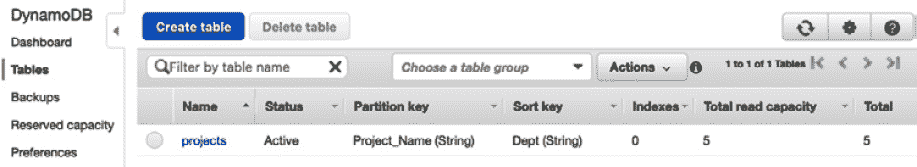

# 第五章：Amazon DynamoDB

随着应用架构对可扩展性的需求增加，并将重点转向无服务器设计模式，开发人员开始寻找灵活、可扩展且管理开销低的数据存储。DynamoDB 已成为满足这些特性需求的一个经过验证且值得信赖的解决方案。然而，它一直在不断发展，许多从该服务衍生出来的功能在 DevOps 专业认证考试中具有重要意义。

虽然在专业级考试中，计算 DynamoDB 数据库的读写比率并不是重点，但理解该核心 AWS 服务如何融入部署和场景是非常重要的。对 DynamoDB 的功能和特性有扎实的理解，将帮助你回答考试问题，也能帮助你在职业生涯中实施解决方案。

在本章中，我们将涵盖以下主要主题：

+   理解 DynamoDB 的基础和背景

+   理解 DynamoDB 数据建模

+   在 DynamoDB 中插入和访问数据

+   理解 DynamoDB 流

+   使用 **DynamoDB 加速器** (**DAX**)

+   在 DynamoDB 中进行身份验证和授权

+   监控 DynamoDB

# 理解 DynamoDB 的基础和背景

DynamoDB 是一个 NoSQL 数据库。这意味着它不仅仅是 SQL，更重要的是，DynamoDB 不需要完全结构化的模式来插入数据。它的灵活性和性能是许多人选择 DynamoDB 的原因，此外，还有其按需付费的定价模式以及高可用性和可扩展性。

## DynamoDB 的起源

在 2007 年，亚马逊发布了一篇由未来 AWS 首席技术官 Werner Vogels 和其他人共同撰写的白皮书，名为 *Dynamo: Amazon 的高可用键值存储*。

你仍然可以在今天找到这篇论文，链接在这里：[`www.allthingsdistributed.com/files/amazon-dynamo-sosp2007.pdf`](https://www.allthingsdistributed.com/files/amazon-dynamo-sosp2007.pdf)。

当亚马逊构建其电商平台时，试图解决如下问题：

+   分区

+   写操作的高可用性

+   处理临时故障

+   从永久故障中恢复

+   成员资格和故障检测

当时的数据库性能不够强大，电商网站开始在数据库层面遇到瓶颈。

## NoSQL 与关系型数据库

关系型数据库自 1970 年代以来就存在。当你需要强制数据完整性并使用**结构化查询语言**（**SQL**）来组织数据时，关系型数据库是非常合适的。关系型数据库的优化基于存储是你最有限的资源这一前提。一旦存储或磁盘空间用尽，你就需要购买更多的存储空间。知道这一点是使用关系型数据库时采用主键和连接的原因之一。通过使用数据的 ID，然后通过表连接检索实际需要的列，数据可以只存储一次，从而节省系统的存储空间，如下所示：


图 5.1 – 关系型数据库表

随着云存储的普及，存储及其相关成本不再是限制性因素。这就引出了 NoSQL，或称非 SQL（有时称为不仅仅是 SQL）。与其将数据存储在表中，NoSQL 系统则采用不同的方式存储数据，常见的如 DynamoDB，它将数据存储在`JSON`文档中。

NoSQL 数据库提供了关系型数据库无法提供的灵活性。如今的现代应用程序，如 Web 应用、游戏系统和移动应用，都需要这种灵活性，同时需要具备可扩展性，以满足用户需求，并在检索和插入数据时提供高性能。

与传统的关系型数据库不同，DynamoDB 更像一个键值存储，它在数据的检索和存储方面非常高效。

## Dynamo 的核心组件

让我们来看一下 DynamoDB 的主要组成部分：

+   表及其属性

+   主键

+   次级索引

让我们开始吧。

## 表及其属性

DynamoDB 中的**表**类似于其他数据库系统中的数据库，而不仅仅是关系型数据库系统中的表。一个表是关于某一特定主题的数据集合。Dynamo 中的每个表都是单独存储项目的地方，数据就存储在这里。

每个表包含零个或多个**项目**。项目有不同的字段和属性。

以下是一个包含项目的 DynamoDB 表：


图 5.2 – Dynamo DB 表和项目

如果你查看上面的表格，你会看到以下几点：

+   每个项目都有一个主键。这是该项目的唯一标识符（`CarID`）。

+   项目没有固定的模式。只要主键存在，其他任何属性可以存在，也可以不存在。

+   大多数属性只有一个值。然而，最后一项有一个特性字段。这是一个嵌套值，可以包含多个属性。

## 主键

在创建 DynamoDB 表时，必须指定**主键**。这个主键是每个表项的唯一标识符，这意味着没有两个项可以拥有相同的主键。

使用主键，你可以引用表中的不同项。DynamoDB 使用主键作为其内部哈希算法的数据。这个哈希值用来确定应该使用哪个分区来存储该属性。

## 二级索引

二级索引是可选的键，可以用来进行查询。DynamoDB 支持两种类型的二级索引：

+   全局二级索引

+   本地二级索引

我们将在本章后面深入探讨二级索引。

## 其他相关的 Dynamo 信息

当你开始思考你的表时，重要的是要注意，Dynamo 并不是由单一的服务器实例或机器托管的。一旦添加数据，它会分布到多个实例中，这使得 DynamoDB 可以利用其关键的扩展性和性能特点。写操作在数据被冗余存储之前不会被认为成功。

# 理解 DynamoDB 数据建模

如果你曾经设计过关系型数据库，那么你会熟悉诸如星型模式这样的架构。每个表都需要有一个指定的属性，如果该属性没有值，那么会保留一个空值。

DynamoDB 使用分区。这些分区可以是热分区，也可以是冷分区。

DynamoDB 中的每个项目至少需要一个属性，即分区键。Dynamo 使用该分区键对数据进行哈希并将其放置在内存中。为了在 DynamoDB 中实现最佳性能，我们需要选择一个能够使 DynamoDB 将搜索分散到磁盘上的分区键，而不是让单个分区过于*热点*。

这最好通过一个不好的分区键示例来演示，比如日期。如果你尝试收集所有来自同一天的数据，那么这个日期的哈希值将存储在同一个分区中。不同的日期可能会存储在不同的分区中，因为它们的哈希值不同；然而，当查询某一天发生的所有事件时，这个单一的分区将变得过热，这可能会导致性能问题。

高质量分区键的示例如下：

+   位置 ID

+   部门 ID

+   客户 ID

+   姓氏的首字母

在前面的示例中，数据在读取和写入时会分布到不同的分区，如下所示：


图 5.3 – 键均匀分布在分区中

## 读取和写入容量

创建表时，必须同时指定读和写容量值。一旦指定，DynamoDB 将保留处理该容量所需的资源，并将其平均分配到各个分区。

需要指定两种不同类型的容量单位：

+   **读取容量单位**（**RCU**）：这是您的表每秒可以处理的强一致性读取次数。它可以包含最大 4 KB 大小的项。

+   **写容量单位**（**WCU**）：这是您的表每秒可以处理的每 1 KB 单位的写入次数。

## 自适应容量

如果您的工作负载本质上不平衡，DynamoDB 提供了一个名为 **自适应容量** 的功能，帮助最大限度减少限流。这个功能的最佳之处在于，它会自动为每个 DynamoDB 表启用，无需额外费用。您无需进入设置去打开或关闭自适应容量设置。

虽然您可以为每个分区预配置 10 个 **写容量单位**（**WCUs**），但可能会有一个分区的写入操作比其他分区更多。如果表的总容量没有被超出，那么 DynamoDB 可以使用自适应容量功能，允许 *热* 分区继续接收写入，而不进行限流：


图 5.4 – 自适应容量示例

上图显示了一个包含 4 个分区的 DynamoDB 表的示例。创建时，我们为整个表分配了 40 个 WCS（写容量单位）。**分区 2**、**分区 3** 和 **分区 4** 每个只消耗了 5 个 WCUs，总共消耗了 15 个 WCUs，剩余的 25 个 WCUs 是从我们初始预配置中分配的。**分区 1** 则有最多的活动，消耗了 15 个 WCUs，比每个分区分配的 10 个 WCU 超出了 5 个。自适应容量功能考虑到还有额外的 WCU 容量，并在不限制表的情况下进行调整。

## DynamoDB 表中可用的数据类型

DynamoDB 允许将各种类型的数据插入到属性中。

数字、字符串、布尔值、二进制数据（需要 `base64 编码`）和空值都是支持的属性数据类型。这些都是可以插入到属性字段中的单一值示例。

DynamoDB 还允许将一组项插入到属性中。这些集合可以包含数字、二进制数据或字符串。集合必须是相同类型的，因此不能将数字和字符串混合在一个集合中，且集合不保留顺序。

类似于文档数据库，DynamoDB 允许将 `JSON` 文档作为属性添加，并且这些文档可以最多嵌套 32 层。

注意

主键必须是字符串、数字或二进制。

# 在 DynamoDB 中插入和访问数据

现在我们已经介绍了 DynamoDB 的历史和理论，接下来是时候动手操作，真正开始处理数据了。

对于我们的示例，我们将创建一个虚构的数据库，用来跟踪我们公司中的项目。这些信息可能包括 `ProjectID`、项目名称、项目负责人、项目或团队的联系邮箱，甚至其他信息如构建和语言信息。由于 DynamoDB 具有灵活的模式，并非所有行都需要这些信息。然而，我们确实需要声明我们的主键，然后根据查询需求，再声明次级键。

我们的模式将如下所示 `JSON`：

```
{
Project_ID,
Department, 
Owner, 
< optional information (like language or build id) >, 
Contact_Email
}
```

定义好我们的模式后，我们可以开始创建表格。

## 在 DynamoDB 中创建表格

现在我们可以打开终端，使用以下命令创建我们的表格：

```
$aws dynamodb create-table --table-name projects \
--attribute-definitions AttributeName=Project_Name,AttributeType=S \
--key-schema AttributeName=Project_Name,KeyType=HASH \
--provisioned-throughput ReadCapacityUnits=5,WriteCapacityUnits=5 
```

如果你将之前的命令与我们的模式进行对比，你会发现我们只定义了一个列：`Project_Name`。这是因为这个列是我们的哈希键（主索引）。其他字段可以稍后定义，不是必须的。这些字段将在数据插入后，无论是批量插入还是逐行插入时填充。需要注意的是，现在 `Project_Name` 字段中的所有字符串必须是唯一的，否则它们将因为重复值而被拒绝插入。

你可能也注意到，在语句的末尾，我们为表格最初分配了五个读取容量单位和五个写入容量单位。

## 向 DynamoDB 插入数据

在本书的 GitHub 目录下，在 `chapter five` 中，我们有几个文件需要上传到我们创建的表格中。为了这个练习，我们需要下载三个不同的 `JSON` 文件：

+   `project_item.json`

+   `projects.json`

+   `projects_bulk.json`

我们将通过 CLI 执行所有插入操作。虽然你可以在 **Amazon 管理控制台** (**AMC**) 中进行单行和批量插入，但我们希望集中精力编写脚本命令，以便将来在需要时可以自动化执行。

我们将进行的第一种插入操作是将单个项目插入到表中。为此，我们需要 `project_item.json` 文件，如果你还没有下载该文件，请查看它的结构，如下所示，看看这个 `JSON` 文件的内容：

```
{
    "Project_ID": {"N": "0100"},
    "Dept": {"S": "Test Team"},
    "Dept_ID": {"N": "0001"},
    "Project_Name": {"S": "Serverless Forms"},
    "Owner": {"S": "Jerry Imoto"},
    "Builds": {"NS":  ["2212121"] },
    "Language": {"S": "python" },
    "Contact": {"S": "test_team@testcompany.com" }
}
```

在上传文件之前，我们想先查看一下文件的一些标注。你会注意到每个字段前都有数据类型标注。这里我们使用了字符串类型字段，标注为 `S`，数值类型字段标注为 `N`，最后，对于我们的构建，使用 `NS` 来表示一个数值列表。

现在我们可以打开终端，运行以下命令将项目添加到我们之前创建的 DynamoDB 表格中。在运行以下命令之前，请确保你已导航到下载文件所在的目录：

```
aws dynamodb put-item \
    --table-name projects \
    --item file://project_item.json \
    --return-consumed-capacity TOTAL
```

执行完上述命令后，你应该会收到类似以下内容的返回信息：

```
{
    "ConsumedCapacity": {
        "TableName": "projects",
        "CapacityUnits": 1.0
    }
}
```

恭喜！现在你在 DynamoDB 表中已经有了一个项。不过，仅有一个项对于查询来说并不理想，因此我们需要添加更多数据。通过 CLI 向表格添加多于一个项需要使用不同的命令和文件格式。

在`projects.json`文件中，我们提供了`10`项，你可以通过`batch-write-item`命令将它们快速添加到表中。你还会注意到，在`batch-write-item`命令中，与`put-item`命令不同，你不需要指定表格。这个信息已经在表格中指定。

## 扫描数据

现在我们已经将测试数据加载到表格中，我们可以使用表扫描来查看这些数据项。扫描操作将返回表格中的所有项，或者在指定的索引中返回。

如果你还没有这样做，请返回到本书的 GitHub 仓库，并下载名为`scan-values.json`的文件，因为我们将在下一个练习中使用这个文件。

返回到终端（如果之前关闭了，重新打开）并输入以下命令：

```
aws dynamodb scan \
    --table-name projects \
    --filter-expression "Dept = :d" \
    --expression-attribute-values file://scan-values.json 
```

我们不会显示此命令的所有输出，但需要关注的是命令底部的部分，它会显示**计数**（Count），即返回的行数，以及**扫描计数**（Scanned Count），即扫描的总行数。

注意

这是一个高消耗的操作，因为你需要读取表格中的所有数据。如果你已经知道需要的数据，最好执行查询，只返回你需要的项和记录。

### 什么是 DynamoDB 中的扫描？

当你在 DynamoDB 表中执行`scan`命令时，表格或二级索引中的每一项都会被读取。如果你没有指定任何筛选条件，那么扫描将一次性返回所有项，只要结果数据不超过 1 MB。

## 查询数据

如果我们只想从表中检索某些值，或者希望 DynamoDB 告诉我们符合某个条件的记录数该怎么办呢？在这种情况下，与其使用扫描，使用查询会更高效。

在我们开始查询之前，确保你已经从本书的 GitHub 仓库下载了名为`query-values.json`的文件，该文件位于`chapter five`目录下。

让我们再次打开终端，这样我们就可以执行查询并查看返回的结果：

1.  首先，确保你处在下载了`query-values.json`文件的同一目录下，或者将该文件复制到当前工作目录中。

1.  第二，确保你已经创建了`projects` DynamoDB 表；否则，查询将不会成功。

1.  在你的终端窗口中，输入以下命令：

    ```
    aws dynamodb query \
        --table-name projects \
        --projection-expression "Dept" \
        --key-condition-expression "Project_Name = :v1" \
        --expression-attribute-values file://query-values.json \
        --return-consumed-capacity TOTAL
    You should receive a result like the following one:{
        "Items": [
            {
                "Dept": {
                    "S": "Training"
                }
            }
        ],
        "Count": 1,
        "ScannedCount": 1,
        "ConsumedCapacity": {
            "TableName": "projects",
            "CapacityUnits": 0.5
        }
    }
    ```

请注意，在`projection-expression`的值中，我们标注了希望从表中返回的字段。我们已经知道了项目名称（因为它是我们的主键），所以我们是在查找这个项目所属的部门。这就是查询相比扫描所有数据在 DynamoDB 中查找和返回值时效率更高的方式之一。

## DynamoDB 中的二级索引，包括全局和本地

如你所见，在我们之前的查询中，我们必须在执行命令时使用主键。在我们表的情况下，我们使用的是主键（`Project_Name`）。DynamoDB 中的表可以有多个不同的索引，这允许你的应用程序拥有多种不同的查询模式，而不必依赖扫描操作。这些索引可以包含表中所有数据或只是其中的一个子集。

注意

你必须在查询中声明索引，以便 DynamoDB 知道你是针对那个特定的索引执行操作。如果你没有声明特定的索引，查询将会直接作用于表本身。

### 本地二级索引（LSI）

**本地二级索引**（**LSI**）使你有机会更改表中最初定义的排序键。LSI 必须始终使用与其创建的表相同的主键。

LSI 也共享与创建它的表相同的吞吐量。关于 LSI 的最后一点，**它们只能**在表创建时进行创建。如果在创建表时没有创建 LSI，那么你需要删除并重新创建表，或者创建一个新表然后迁移数据，或者改用**全局二级索引**（**GSI**）。此外，你不能在不删除基础表的情况下删除本地二级索引。

### GSI

如果我们想使用不同的主键进行搜索，那么我们必须创建一个 GSI。GSIs 和 LSIs 之间的另一个关键区别是，LSI 必须在表创建时声明和创建，而 GSI 可以在任何时间创建。如果你发现查询没有请求正确的信息，想要返回只包含部分信息的 GSI，或者某些查询需要更多的 RCU 或 WCU 配额时，GSI 尤其有用。

现在，如果我们想在创建完 GSI 后查看它，我们可以运行以下命令：

```
aws dynamodb describe-table \
    --table-name projects \
    --query "Table.GlobalSecondaryIndexes"
```

这将显示我们表上创建的任何 GSI（如果有的话）。

理解如何创建索引以优化查询性能是利用 DynamoDB 强大功能的关键概念之一。接下来，我们将继续了解 DynamoDB 的其他功能，例如使用流复制项目。

# 理解 DynamoDB 流

有时，您在 DynamoDB 中有一张表，您想要在变更发生时进行更新，或者发生事件驱动的流程。这正是 AWS 创建**Dynamo Streams** 的确切原因。流是项目修改的按时间顺序排列的序列，例如插入、更新和删除操作。

当 DynamoDB 中的流写入数据时，它会按严格的排序格式进行。这意味着当您向表中写入数据时，根据流的配置设置，它将按照写入到表中的顺序推送项目。

## 全局表

有时候，您需要在出现服务（如 DynamoDB）的区域性中断时设置高可用性计划，或者除了您最初创建数据的区域外，还需要更快的本地访问您的数据。

全局表，即使它们是原始表的副本，也都由单个账户拥有。

在设置全局表时，第一步是在您的主要区域创建一个初始表。

接着，您需要在初始表上启用 DB 流。

然后，对于您希望复制全局表的每个区域，您必须在不同的区域中设置启用流的同一表。

然后，在原始区域中，您可以定义全局表的设置，AWS 管理控制台使这一切变得轻而易举。

如果您的组织有通过**服务级别协议**（**SLA**）传达的需求，需要保持一定的运行时间，那么您可以使用流和全局表的组合来处理这些问题。接下来，我们将介绍如何通过 DynamoDB 加速器加快查询时间。

# 使用 DynamoDB 加速器（DAX）

即使有成千上万的请求，DynamoDB 本身也能以毫秒级的延迟响应时间提供服务。这满足了许多公司和客户的需求，但有一些应用程序需要微秒级的性能，这就是**DynamoDB 加速器**（**DAX**）的用武之地。

DAX 几乎等同于 DynamoDB 表的涡轮按钮。它缓存最常请求的结果，然后通过端点提供这些结果。无需启动第三方缓存，也无需管理节点，实现起来非常简单。您只需转到 DynamoDB 主页下的 DAX 菜单，然后启动您的 DAX 集群：


图 5.5 – DAX 示例架构

在设计和实施系统以进行数字广告竞价时，广告技术等行业可以利用 DAX 的缓存属性和速度。在竞标时的毫秒级延迟可以等同于该行业中的实际资金。

知道如何处理在 DynamoDB 中执行时间超过预期的查询，这正是我们刚刚通过 DAX 的缓存功能介绍的。现在，我们将看看如何在 DynamoDB 中授权访问。

# 在 DynamoDB 中进行身份验证和授权

与 AWS 中的其他服务一样，DynamoDB 通过 IAM 服务允许精细的访问控制。你可以根据你如何构建 IAM 策略，选择在服务、表或属性级别允许或拒绝用户访问。

AWS 推荐作为最佳实践，使用最小权限原则，仅允许用户访问他们需要的数据表，而不是提供通用访问权限。

## Web 身份联合

DynamoDB 是一个特别受移动应用和游戏开发者欢迎的后端数据库。这可能导致成千上万的用户需要访问单一的表。在这种使用场景下，为每个用户创建一个 IAM 用户是不可行的：


图 5.6 – Web 身份联合到 DynamoDB 表

理解通过 Web 身份提供者（如 *Facebook* 或 *Google*）进行身份验证的用户如何访问 DynamoDB 表中的数据，最好的方法是查看授予授权的步骤：

1.  应用程序通过如 Amazon 等 Web 身份提供者进行身份验证。身份提供者然后返回一个身份令牌。

1.  然后，应用程序调用安全令牌服务，以基于之前定义的角色获取临时访问凭证。

1.  该角色应当不仅仅提供对整个 DynamoDB 表的访问权限，还应通过 IAM 策略授予用户对其项目的访问权限。

由于 DynamoDB 是托管在 AWS 上的移动应用的首选数据存储，我们探讨了如何通过 IAM 和 STS 令牌的组合授权 Web 身份用户访问特定数据。接下来，我们将继续监控我们的 DynamoDB 表，以确保不会被限流所困扰。

# 监控 DynamoDB

当你查看在监控 DynamoDB 时需要关注哪些指标，有几个指标会特别突出：

+   我们的 `GET` 和 `PUT` 请求在我们预期的范围内

+   我们没有受到读写容量的限制

从 DynamoDB 控制台本身，我们可以获得关于表健康状况的许多指标。

首先，我们可以一眼看到读写容量。

你选择的任何表的指标中也有一个关于基本延迟的部分，显示四个关注点：`GET`、`PUT`、`查询`和`扫描`延迟。

让我们登录到 **Amazon 管理控制台**，亲自查看这些基本指标：

1.  使用你之前为 DynamoDB 中的项目表创建的账户登录到 **Amazon 管理控制台**。

1.  在顶部的搜索框中，输入 `DynamoDB`，以便服务名称出现在搜索结果中。点击 **DynamoDB** 进入 DynamoDB 服务。在右上角，仔细检查你是否处于创建表的正确区域。

1.  一旦您到达 DynamoDB 主屏幕，单击左侧菜单中的**Tables**。单击后，您应该可以看到之前创建的名为**projects**的表：

    图 5.7 – 显示左侧菜单中的 DynamoDB 表选项

1.  单击主窗口中名为**Projects**的表。这将打开另一个窗格，添加更多有关您的表的信息。

1.  在这里，我们可以从最右侧窗格的顶部选项卡栏中选择**指标**标签：

    图 5.8 – 进入 DynamoDB 表后，顶部菜单栏

1.  如果在**指标**显示中，您没有看到太多活动，那么可以尝试运行我们在本章中先前创建的 CLI 查询。这应该会促使指标计量器开始显示更多的数据 PUT 和 GET 对象。

## 贡献者洞察

启用**贡献者洞察**，可以让您更好地了解正在访问和受限的项。这使您能够在需要时相应地调整表或模式。

一旦启用**贡献者洞察**，如果您只有主键，DynamoDB 会为您创建两个规则：

+   最常访问的项（分区键）

+   最多受限的键（分区键）

如果您有全局二级索引或排序键，DynamoDB 将为您创建两个附加规则。这些规则是针对二级索引的：

+   最多访问的键（分区键和排序键）

+   最多受限的键（分区键和排序键）

# 总结

在本章中，我们了解了被称为 DynamoDB 的 NoSQL 服务。我们探讨了如何创建和分区表，以及如何从 DynamoDB 写入和查询数据。我们还研究了如何将数据从表流向其他源，并使用**DynamoDB 加速器**（**DAX**），一种专门的缓存，来加速查询。

我们现在已经完成了第一部分，*建立基础*，在这一部分中，我们回顾了**亚马逊 Web 服务**。接下来，我们将进入*第二部分*，*开发、部署和使用基础设施即代码*。在接下来的章节中，我们将整合我们刚才讨论的许多服务，并将它们付诸实践。

# 复习问题

1.  我们的应用程序正在将项目数据存储在 DynamoDB 表中。您需要运行查询，找出上个月由特定部门执行的所有构建。您会在查询中使用哪些属性？

    a. `Build_Date` 的分区键和 `Department` 的排序键

    b. 由 `Department` 和 `Build_Date` 组成的复合主键

    c. `Department` 的分区键和 `Build_Date` 的排序键

    d. `Build_Date` 的分区键和 `Dept_ID` 的排序键

1.  以下哪项 AWS 服务提供了一个针对 DynamoDB 优化的内存写通缓存？

    a. ElastiCache

    b. CloudFront

    c. DAX

    d. Athena

1.  DynamoDB 中的扫描操作适用于以下哪种场景？

    a. 返回表的所有内容，并根据主键或排序键进行过滤

    b. 基于主键属性在表中查找项

    c. 基于排序键属性在表中查找项

    d. 返回表中的所有项

1.  您的开发人员创建了一个 DynamoDB 表，并发现他们的性能总是在测试过程的 20-25 分钟后变慢。通过 AWS 控制台的基本监控，他们看到请求被限制。您可以做什么来帮助找出问题的根本原因？

    a. 增加表上的**读取容量单位**（**RCUs**），以使查询不再受限制。

    b. 在表上启用**Contributor Insights**，以便显示被限制最多的键。

    c. 添加增强的**Cloud Watch**监控，并在发生限制时触发警报。

    d. 向表中添加**自适应容量**，使额外的**读取容量单位**（**RCUs**）均匀分布到变热的分区中。

1.  以下哪一项适合作为分区键？

    `a.` `OrderID`

    `b.` `Ship_From_Location`

    `c.` `Total`

    `d.` `Product_Brand`

# 查看答案

1.  b

1.  c

1.  d

1.  b

1.  a
