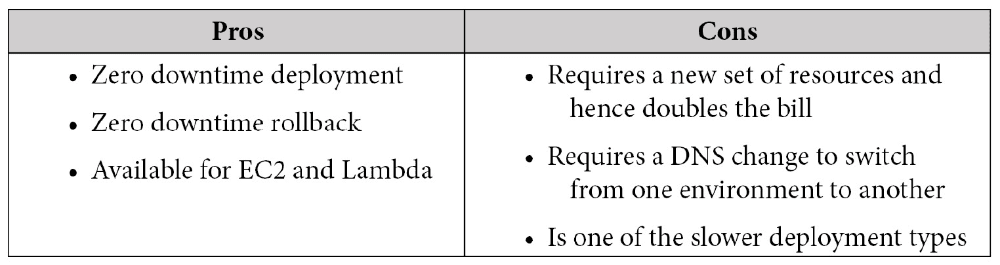
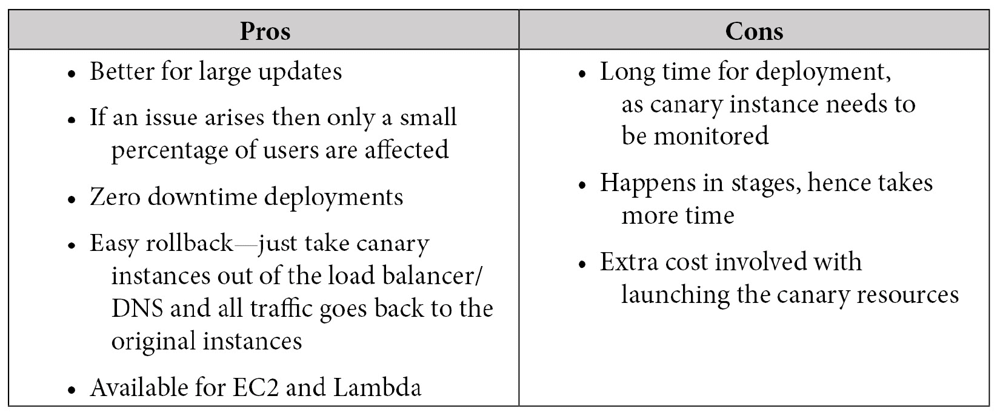

# 第六章：理解 CI/CD 和 SDLC

**软件开发生命周期**（**SDLC**）是考试中最重的部分。理解 SDLC 的概念，以及 **持续集成**（**CI**）和 **持续部署**（**CD**）是通过 **亚马逊 Web 服务**（**AWS**） **开发运维**（**DevOps**）考试的关键。SDLC 包括多个阶段，AWS 和第三方服务与这些阶段相对应。

了解 AWS 服务所扮演的角色—以及关键的第三方工具—不仅对通过考试至关重要，也是作为 DevOps 工程师日常工作中的必备知识。

在本章中，我们将讨论以下主要内容：

+   SDLC 介绍

+   开发团队

+   了解不同类型的部署

# SDLC 介绍

SDLC 包括以下六个基本周期或阶段：

+   源代码

+   构建

+   测试

+   部署（发布）

+   监控

+   计划

以下是这些阶段的示意图：

图 6.1 – CI/CD 阶段

这四个阶段属于 DevOps 的开发侧。第五个阶段属于运维侧，最后一个阶段是团队合作完成的。你可能注意到，前面的示意图中没有规划阶段。再次强调，虽然规划阶段是 SDLC 的重要部分，但它不属于 CI 或 CD 流程的一部分。

在本节的讨论中，我们需要理解的一个重要概念是缩写 *CI/CD* 的使用。我们在讨论 CI 阶段时，实际上是在谈论管道的前三个步骤。

## CI

CI 是一种软件开发实践，开发人员定期将代码更改合并到中央仓库中。然后，启动一个或多个自动化构建，并对已提交的代码以及之前的现有代码库运行测试。

### AWS 原生 CI 工具

接下来，我们将看看 AWS 在其生态系统中提供的一些工具，以帮助实现 CI。

#### AWS CodeCommit

**AWS CodeCommit** 允许你以高度可扩展的方式托管私有源代码控制仓库。

以下是 CodeCommit 的主要优势：

+   **协作能力**：软件团队可以使用已知的 Git 功能，如拉取请求、分支和合并，共同协作开发代码库。

+   **加密**：CodeCommit 仓库使用 AWS **密钥管理服务**（**KMS**）在静态时自动加密。代码在往返仓库的传输过程中，也会通过 **安全超文本传输协议**（**HTTPS**）或 **安全外壳协议**（**SSH**）加密。

+   **访问控制**：与 AWS **身份与访问管理**（**IAM**）服务完全集成，允许你指定哪些用户可以访问哪些仓库，而无需通过第三方系统进行管理。

+   **高可用性**：AWS CodeCommit 由**亚马逊简单存储服务**（**Amazon S3**）和**亚马逊 DynamoDB**支持，用于代码和提交存储。这是一种高度冗余且可扩展的设置，确保你的仓库可访问。

+   **通知**：CodeCommit 可以与**亚马逊简单通知服务**（**Amazon SNS**）集成，使得与仓库相关的重要事件可以广播到正确的渠道。CodeCommit 发送的通知包括状态信息和指向相应仓库的链接。

#### AWS CodeBuild

当你准备编译你在源代码控制仓库中提交的代码并为部署创建软件包时，**AWS CodeBuild** 允许团队使用 **YAML Ain't Markup Language**（**YAML**）语言自定义他们的构建和测试过程。

这些是 AWS CodeBuild 的主要优点：

+   **完全托管**：使用 CodeBuild，无需设置单独的构建服务器。这意味着不再需要进行软件修补或更新，也无需管理任何东西。作业设置好并提交后，便会运行。

+   **安全**：CodeBuild 与 IAM 服务集成，因此用户只能被分配到特定的构建项目。CodeBuild 生成的任何工件都使用 AWS KMS 进行加密。

+   **可扩展**：CodeBuild 会根据提交的作业数量自动进行扩展。当有大量构建作业或测试即将发生时，无需考虑垂直或水平扩展，因为 CodeBuild 会自动处理所有这些。

+   **支持 CI 和 CD**：作为**AWS 开发者**服务的一部分，CodeBuild 自然地集成到其他提供的 CI/CD 工具中，例如 **CodeCommit** 和 **CodePipeline**。它还与生态系统中的其他工具进行了集成——例如，**Jenkins** 可以将 CodeBuild 作为可扩展的工作节点使用。

#### AWS CodeArtifact

随着软件构建变得越来越规范化，公司和团队开始寻找一种方式，确保每个人都在使用相同的已批准的软件包及其版本。这就是托管工件库**CodeArtifact**的作用所在。

如果你对构建过程的安全性感兴趣，CodeArtifact 提供了许多功能，帮助开发团队创建一个更安全的环境。首先，构建过程中所需的包和工件可以通过使用 AWS PrivateLink 终端节点从**虚拟私有云**（**VPC**）中访问。这意味着，如果你在 CodeArtifact 服务中存储了构建所需的库和文件，那么这些文件可以传输到你的函数和实例中，而无需穿越公共互联网。

其次，通过 CodeArtifact 服务，作为账户管理员的你可以批准使用特定的包。这个批准过程也可以通过结合使用 CodeArtifact **应用程序编程接口**（**API**）和 Amazon EventBridge 服务来自动化。

第三，许多包仓库最近开始对其服务器设置下载限制。由于仓库当前不接受来自当前**互联网协议**（**IP**）地址的下载请求而导致部署或构建失败，不仅令人沮丧——它还可能成为部署的真正障碍。例如，如果你是在实时构建实例，而不是使用预先构建的**Amazon 机器镜像**（**AMI**），并且需要从公共**Node Package Manager**（**npm**）服务器获取某些节点包，那么如果你处于自动扩展状态并且试图扩大规模以满足客户的流量需求，这种情况就不仅仅是个小问题。然而，如果你将包存储在 AWS CodeArtifact 上，那么你就不受任何第三方服务器的限制，可以根据需要多次下载所需的包，正如下图所示：

](img/Figure_6.2_B17405.jpg)

图 6.2 – AWS CodeArtifact 与外部仓库的连接

你可以配置 CodeArtifact 从公共仓库获取流行的包，并为你的团队进行存储和版本控制。CodeArtifact 可以与许多开发者熟悉并且舒适使用的包管理工具协同工作，包括`pip`、`yarn`、`npm`、`Maven`和`Gradle`。

这些是 CodeArtifact 的主要优点：

+   **安全存储和共享制品**：如果与 KMS 服务集成，你在 CodeArtifact 中存储的制品可以被加密。

+   **减少运营开销**：CodeArtifact 消除了设置和维护制品服务器的需求。它是一个高度可用的服务，可以根据存储的制品数量自动扩展。

+   **发布和共享包**：CodeArtifact 为你提供了一个中心位置来发布你的团队创建的包，消除了在互联网上到处寻找的需求。

+   只需点击几下，便可连接`npm`注册表、`NuGet.org`和**Maven Central**，无需复杂的脚本。

## 持续交付

如果生产环境的部署是通过持续交付完成的，那么很可能会有一个手动批准的过程，而不是自动部署。

### AWS 原生工具用于持续交付

让我们简要了解一些用于持续交付的 AWS 工具。

#### AWS CodeDeploy

这些是 CodeDeploy 的主要优点：

+   **自动化部署**：CodeDeploy 完全自动化软件部署。

+   **易于采用**：CodeDeploy 可以轻松集成到你现有的部署工具中，如 Jenkins、GitHub 或 AWS CodePipeline。

+   **集中控制**：在一个视图中，CodeDeploy 可以同时显示你的部署状态，并提供向一个或多个团队成员发送推送通知的功能，告知他们构建的通过或失败状态。

+   **最小化停机时间**：CodeDeploy 允许你逐步引入更改，从而帮助保持应用程序的可用性。如果发现问题，它还可以帮助你回滚到之前的版本。

#### AWS CodePipeline

AWS CodePipeline 允许你自动化构建、测试和部署步骤，以及你在生产软件和 **基础设施即代码**（**IaC**）过程中经过的各个阶段。它还可以与 GitHub 等第三方服务集成。

这些是 CodePipeline 的主要优势：

+   **快速交付**：CodePipeline 在你将代码通过结构化流程推进到部署过程中，快速地向你和你的团队提供反馈。缺陷可以在没有太多努力的情况下被发现并修复。

+   **易于集成**：如果你已经在 CI/CD 流程中使用了现有的组件，CodePipeline 允许你轻松集成这些组件。包括已经设置好在云端或本地运行测试的 Jenkins 服务器，或者甚至是像 GitHub 这样的第三方源代码库。

+   **可配置工作流**：每个软件发布的过程都有些微不同，取决于配置的测试或所部署的服务。CodePipeline 使你能够以多种方式自定义步骤，包括使用 **AWS 管理控制台** 界面、**命令行界面**（**CLI**）或可用的 AWS **软件开发工具包**（**SDKs**），甚至可以通过编写 **CloudFormation 模板** 来构建管道。

+   **提高质量**：CodePipeline 使你能够自动化所有流程，按照易于遵循的步骤执行，从而确保在部署过程中不会遗漏任何步骤。自动运行的测试确保了代码的一致性，并为开发者提供即时反馈。

## CD

使用 CD，不需要手动批准流程，因为代码修订会被推送到生产环境中。相反，依赖于测试实践和指南来确保代码的完整性，在被自动部署到生产环境之前，必须通过质量检查。任何不符合这些指南的修订将会作为构建过程失败，并且会将反馈提供给开发者或开发团队。最初的反馈可能非常简单，比如通知构建失败，可以通过电子邮件或 **短消息服务**（**SMS**）消息的形式发送，甚至可以使用 **SNS 服务** 发送。另一种选择是通过 **Slack** 或 **Microsoft Teams** 等消息服务发布，结合使用 SNS 和 **AWS Lambda** 来发布消息。

注意

持续交付并*不是*CD。这是许多人常犯的错误。然而，你需要理解的是，持续交付意味着每次提交都必须通过一组自动化测试，然后才会推送到生产环境中。

让我们看看 SDLC 如何在 AWS 提供的不同开发工具中得以实现。从以下图示中，你可以看到几乎每个阶段都有自己的专用服务。例外的是构建和测试阶段，AWS CodeBuild 可以同时执行这两项任务：

图 6.3 – AWS 工具在 CI/CD 中的应用

从**Amazon 代码工具**的角度来看，CI 和持续交付有几个工具可以帮助你完成这些任务。

## 测试

测试在软件开发生命周期（SDLC）中起着至关重要的作用。它可以帮助你提升应用程序的可靠性、可扩展性、性能和安全性。

注意

你有没有注意到测试所提供的许多内容正是 AWS 的支柱？尽管将测试排除在最初的管道设计之外看似更快，但它是确保工作负载稳定性、安全性和能力的关键部分。

如果你的代码中存在潜在的弱点，测试是发现其中许多问题的途径之一。这可以防止你将致命缺陷部署到生产环境中。作为一名 DevOps 工程师，在自动化这个过程时，构建管道的初期投入可能会有些费力。一旦管道和测试建立完成，随后多种类型的代码——包括基础设施即代码（IaC）和应用程序代码——都可以以快速和可重复的方式进行测试和部署。

### 相关测试类型

有多种不同类型的测试可以确保你的代码库按预期运行。每种类型的测试执行特定任务，有些测试需要的时间较长。以下是一个展示不同测试阶段的图示：

图 6.4 – 测试的不同阶段

通过查看*图 6.4*，我们可以看到测试执行的相对速度。现在我们可以更详细地查看每种测试类型。

### 单元测试

**单元测试**虽然覆盖的代码量较小，但为开发者提供即时反馈，尤其是因为它们可以直接在开发者的个人机器上运行。它们可以添加到 CI/CD 管道中，主动防止已知缺陷进入代码库。

### 服务集成和组件测试

**集成测试**用于检查系统中不同组件是否能够协同工作。这些测试也可以包括对任何第三方服务或 API 的测试。例如，集成测试可能会测试 Web 层是否将一个测试值插入数据库以确保连接正常，或在事件发生后发送通知。

### 性能和合规性测试

一旦你构建了应用程序，你需要知道它能够有效地处理你预计的流量。这包括根据需要扩展或缩减资源，并在系统承受较大负载时进行检查。**性能测试**将帮助完成这项任务，揭示系统在正常使用或高负载情况下可能表现出的性能问题或瓶颈。两种最常见的性能测试类型是**压力**测试和**浸泡**测试。压力测试会在短时间内或设定的例程数量内模拟大量用户使用资源，比如回放 web 服务器日志以模拟过去的用户。浸泡测试则会在更长时间内（如一周或更长）持续提供稳定的用户流，尝试揭示如内存泄漏或在短时间内未能显示的问题。

添加安全性和合规性测试，如**静态应用安全测试**（**SAST**）和**动态应用安全测试**（**DAST**），可以揭示已报告和发现的已知漏洞。将这些类型的测试添加到你的 CI/CD 管道中，是**开发-安全-运维**（**DevSecOps**）框架的一部分。

### 用户界面测试

在金字塔的顶端是**用户界面**（**UI**）测试。这些测试不仅测试**图形用户界面**（**GUI**），还测试整个系统。测试可以涵盖像确保用户能够正确登录或重置密码的例程。它们可能包括上传和下载文件或访问特定页面，这些页面涉及数据存储和中间件组件。

虽然在这个阶段可能出于必要性引入手动测试，但最好将手动测试保持在最低限度。

## 在整个过程中不断成熟

当你最初开始构建 CI 系统时，可能只有几个步骤，比如从源代码仓库拉取代码并部署到测试服务器。

随着时间的推移，代码库将获得更广泛的测试覆盖，设置也将调整，以便团队成员对部署过程更加自信，甚至依赖它作为日常工具之一。

随着你的成熟，你会发现自己开始获得以下几个好处：

+   **速度**：团队通过自动化管道和发布过程变得更加自给自足。无需再等待特定人员或团队来安装已开发的软件包或更新。

+   **可靠性**：自动化过程消除了对单个了解流程的人的依赖。任何启动过程的团队成员都会有信心每次启动时都能得到相同的结果。

+   **一致性**：创建具有标准步骤的部署管道可以使每次启动过程时都保持一致的流程。这可以防止测试等步骤被遗忘或跳过。

+   **可扩展性**：随着组织的扩展，更新的频率通常会增加。自动化流水线拥有构建、测试和部署到不同环境的步骤，帮助你在不增加额外人员的情况下实现扩展。

+   **效率**：将测试从手动过程转移到自动化过程，不仅可以加速测试过程，还可以使测试团队将精力集中在开发新的和改进的测试上，而不是花时间手动测试系统。

现在我们已经了解了实际的 SDLC 过程，接下来我们将讨论如何优化 CI/CD 过程中的团队设置。

# 开发团队

AWS 建议在实现 CI/CD 环境时，拥有三个开发团队：**应用团队**、**基础设施团队**和**工具团队**。亚马逊推崇“两块披萨团队”的概念，即任何团队的规模都不应超过两块披萨能够喂饱的程度。较小的团队有助于更好的协作，完全拥有自己的特性或应用程序，承担完整的责任，最后但同样重要的是，这一切与 DevOps 的敏捷模型一致。

## 应用团队

**应用团队**成员负责创建应用程序本身。该团队的成员精通一种或多种编程语言，并且深入理解平台和系统配置。

应用团队成员负责创建待处理的事项清单，以及为工作中的故事创建任务。除了具备创建和维护应用程序的编程技能外，该团队还应该掌握自动化技术，以便在工具链创建完成后，团队成员可以创建自己部分的流水线。

## 基础设施团队

为了使应用团队成员能够运行他们的应用程序，必须有一些基础设施来支持它们的运行。即便是无服务器应用，它仍然需要在 IAM 中创建权限。如果不是无服务器设置，则需要配置和管理服务器。

与**基础设施团队**合作，这一过程通过 IaC（基础设施即代码）完成，可以通过 CloudFormation，使用 AWS CLI 脚本，或使用 AWS 的**云开发工具包**（**CDK**）。

许多时候，工具团队还需要负责例如**Active Directory（AD）服务器**和**单点登录（SSO）集成**等任务，特别是因为它们与 IAM 权限紧密相连。

## 工具团队

**工具团队**负责构建和管理 CI/CD 流水线。该团队必须熟练构建和集成流水线的各个部分和组件，以确保依赖的应用团队能够顺利进行工作。虽然工具团队不是“两块披萨团队”的一部分，但它负责创建使其他团队能够执行任务的工具和系统。

团队可能会选择实现诸如 AWS CodeCommit、CodePipeline、CodeBuild 和 CodeDeploy 等工具和服务，以及 Jenkins、GitHub、Bitbucket、Artifactory 等第三方工具。

许多组织会将工具团队归类为 DevOps 团队，但这是一个误称，因为 DevOps 更多的是一种人和过程的实践，而不是单纯的工具使用。

并非每个工具团队都已经准备好完全采用 AWS 工具集，AWS 也理解这一点。甚至有一份关于自动化服务器 Jenkins 的完整白皮书。了解第三方工具如何与 AWS 生态系统交互并互补，是 DevOps 专业考试的必备知识。

随着团队成员现在可以集中精力在各自的领域中，以最大化其效率，我们将继续讨论部署类型，并了解如何选择最适合我们需求的部署策略。

# 了解不同类型的部署

当你考虑部署时，尤其是我们一直在讨论的软件开发生命周期（SDLC），你可能会认为我们在讨论应用程序代码。然而，当你在 AWS 中自动化更多系统时，部署可能会有多种含义。部署可以指应用程序代码，但也可以指基础设施代码、配置代码或其他层级。

在处理 AWS 上的部署时，有五种主要的部署策略需要考虑。每种方法都有其优缺点。

在选择部署策略时，以下是你需要考虑的主要事项：

+   你能多快完成部署？

+   是否需要任何**域名系统**（**DNS**）的更改？

+   如果部署失败，会有什么影响吗？

+   回滚过程将是什么样的？

+   代码会链接到哪里？（新实例还是现有实例？）

考虑到这一点，让我们深入研究五种不同的部署策略。

## 就地部署

当你执行**就地部署**时，你是在更新已经部署到环境中的实例。可以使用负载均衡器在部署过程中注销每个实例，进行健康检查，然后将健康的实例重新投入服务。就地部署可以一次性完成，也可以以滚动部署的方式进行。

让我们来看一下就地部署的优缺点，如下所示：

表 6.1 – 就地部署的优缺点

## 不可变部署和蓝绿部署

在**蓝绿部署**中，会创建一个全新的基础设施，并且通常在进行 DNS 切换之前进行测试。这是最安全的部署方法，但它需要时间并且成本最高，因为你需要为一段时间同时搭建两个完整的环境，直到进行 DNS 切换。切换后，你可以选择在第二个环境不再使用时将其关闭以节省成本，或者将其保持运行以节省部署时间，并将其用作故障转移环境。如果部署失败，客户将完全感知不到任何问题，因为使用蓝绿部署时，只有当第二个（或绿色）环境上线并健康时，才会切换 DNS。

**不可变部署**指的是使用新的配置或新应用程序代码部署整个资源集。这项任务在云端比在本地硬件上简单得多，因为资源可以通过简单的 API 调用进行配置。

以下表格显示了不可变部署的优缺点：

表 6.2 – 蓝绿部署的优缺点

参见*第十三章*，*蓝绿部署*，深入了解蓝绿部署的更多内容。

## 金丝雀部署

在新的实例**规范名称**（**CNAMEs**）上为 `0`%，或者通过将新实例从负载均衡器中移除来实现。此时，新实例将被下线，任何先前更新过的启动配置都可以更新为使用一个之前工作的 AMI 版本。

在下表中，我们对比了使用金丝雀部署方法的优缺点：

表 6.3 – 金丝雀部署的优缺点

## 滚动部署

使用**滚动部署**时，并非所有实例都会同时更新。这一策略可以防止停机，因为如果某个进程失败，只有部分实例会在某个特定时间进行升级。当初始实例部署时，它们必须在进一步部署其他实例之前确保健康并在线。

需要注意的是，由于无论是应用程序代码还是系统升级，组内的所有成员并非同时部署，因此用户可能会体验到多个版本。在部署过程中，使用粘性会话有助于提供尽可能无缝的客户体验，但无法完全消除这种体验的差异。

尽管优缺点列表不长，但请看下表，了解使用滚动部署方法的利弊：

表 6.4 – 滚动部署的优缺点

## 线性部署

在线性部署中，流量会按照预设的多个增量平等地切换到不同的资源上。线性部署是蓝绿部署的一种子集。与直接部署到应用当前运行的实例或资源不同，你首先需要搭建一套新的基础设施，然后在一段时间内将流量从旧的代码库迁移到新的代码库，可以使用如 **Route 53** 和加权路由这样的服务。这样，你可以密切监控新环境，如果出现问题，能够迅速将所有流量切换回原始环境，从而避免停机。

线性部署还可以通过 Lambda 别名和 Fargate 容器来实现，将部分流量切换到新版本的代码。

例如，如果你的部署窗口是 1 小时，并且希望在该小时内将 100% 的流量平均分配到新资源上，那么你的线性部署策略可能如下：

+   最少 0-16% 的流量切换到新资源

+   最少 10-32% 的流量切换到新资源

+   最少 20-48% 的流量切换到新资源

+   最少 30-64% 的流量切换到新资源

+   最少 40-80% 的流量切换到新资源

+   最少 50-96% 的流量切换到新资源

+   最少 60-100% 的流量切换到新资源

使用线性部署方法有优缺点，因此我们在此进行比较：

表 6.5 – 线性部署的优缺点

我们将在 *第十二章* 中深入探讨 Lambda，*Lambda 部署与版本管理*。

## 一次性全部部署

在这种部署方式中，所有流量会同时从原始环境切换到新环境。这是所有部署方法中最快的。这也意味着，如果需要回滚，所需的时间将是最长的，因为代码需要重新部署到所有实例上。如果遇到问题，*你可能会有停机时间*，因为你需要等待回滚过程完成后才能恢复在线状态。

使用 *一次性全部部署方法* 的优缺点在下表中列出：

表 6.6 – 一次性全部部署的优缺点

注意

一次性全部部署也可以称为就地部署。请熟悉这两个术语，因为它们都可能出现在测试题中。

# 复习问题

1.  一家中型软件公司聘请你作为 DevOps 顾问，帮助搭建其部署流水线。员工希望能够快速将经过测试的代码推送到生产环境，但又不想面临客户停机的风险。他们的 DNS 托管在第三方服务商上，DNS 的变更需要提交变更工单。你会推荐哪种部署方式？

    a. 蓝绿部署

    b. 原地部署

    c. 一次性部署

    d. 滚动部署

1.  一家医疗设备公司希望通过 Jenkins 设置其开发流水线，以自动化部署代码库。由于这只是开发环境，他们希望保持成本最低，并且如果部署失败，应用团队重新部署也是可以接受的。应该使用哪种策略？

    a. 蓝绿部署

    b. 原地部署

    c. 一次性部署

    d. 滚动部署

1.  一家移动游戏公司正在努力加快其最受欢迎游戏的生产时间，以便开发新的功能。员工注意到，在最近两次发布的日期，用户在社交媒体上抱怨出现了更多的故障。有些故障是已知的，由负责游戏开发的团队处理。该游戏公司已经设置了一个自动化部署流水线，使用 AWS CodePipeline，并将代码存储在 AWS CodeCommit 中。最具成本效益的方式是什么，以减少每次发布时出现的故障数量？

    a. 启动一个新环境，并在将代码发布到生产环境之前运行完整的 UI 测试。

    b. 在当前的 CodePipeline 中添加一个步骤，启动一个运行 Jenkins 软件的 EC2 实例，并使用 **Simple Systems Manager** (**SSM**) **Parameter Store** 下载当前的 CodeCommit 仓库，然后运行单元测试来判断构建是否通过。

    c. 在当前的 AWS 流水线中添加一个 CodeDeploy 步骤，该步骤运行当前的一组单元测试，并将其连接到 AWS SNS 主题，以便在测试失败时，当前构建失败，并通知开发团队。

    d. 在当前的 AWS 流水线中添加一个 CodeBuild 步骤，该步骤运行当前的一组单元测试，并将其连接到 AWS SNS 主题，以便在测试失败时，当前构建失败，并通知开发团队。

1.  一家研究公司正在进行一个机密项目，管理团队希望能够在任何进展发生时立即了解情况。开发人员使用 AWS CodeCommit 进行源代码版本控制，并使用 CodeBuild 运行单元测试。你可以采取哪些措施来让管理团队获得他们想要的更新？（选择所有适用项）

    a. 为管理团队创建一个 SNS 主题，并添加他们所有的电子邮件。

    b. 让 AWS CodeCommit 在每次提交或功能分支与主分支合并时，将通知推送到 SNS 主题。

    c. 让 CodeCommit 创建每日提交活动报告，并将报告推送到 S3，以便管理团队可以从他们有权限访问的存储桶中查看该报告。

    d. 在 AWS CodeBuild 上启用通知，当作业通过或失败时，通知推送到 SNS 主题。

1.  一家正在成长的公司目前有一个在 EC2 上运行的 Jenkins 服务器。开发人员抱怨他们等待构建启动和完成的时间太长。你被要求帮助工具团队提出一个能够随着开发团队的增长和速度扩展，但又能以最快和最具成本效益的方式实施的解决方案。哪种解决方案最不需要工具团队的管理？

    a. 从 Jenkins 服务器创建一个 AMI，并使用该 AMI 创建三个额外的工作节点，当前的 Jenkins 系统作为主节点。

    b. 使用`1`将 Jenkins 服务器重建为一个容器化系统。

    d. 从 Jenkins 服务器创建一个 AMI，并使用该 AMI 创建一个启动配置，用于自动扩展组，当队列超过`1`时启动新的 Jenkins 实例。

# 回顾答案

1.  d

1.  b

1.  d

1.  a, b, d

1.  c

# 总结

在本章中，我们讨论了**SDLC**、**CI**、**持续交付**和**CD**。我们还开始了解 AWS 提供的工具，这些工具可以帮助我们在 SDLC 的不同阶段中发挥作用。接着，我们探讨了不同类型的团队及其职责。最后，我们回顾了 AWS 中可用的不同类型的部署策略，以及如何最佳地使用它们。

在下一章中，我们将深入探讨 AWS 的 CloudFormation 基础设施即代码（IaC）服务。我们将看到如何创建可重用的资源，以及在 CloudFormation 模板中可用的脚本方法。
