# 第七章：使用 CloudFormation 模板部署工作负载

CloudFormation 模板为 DevOps 工程师提供了一种简单的方法，能够自动创建、管理和配置相关资源。它们还允许你快速地重复搭建相同的基础设施，无论是用于开发、测试、生产还是灾难恢复。它们不仅是一个重要的概念，也是 DevOps 专业认证考试中需要理解的内容。

在本章中，我们将涵盖以下主要主题：

+   CloudFormation 的基本主题

+   创建带有依赖关系的嵌套堆栈

+   向 CloudFormation 模板添加辅助脚本

+   了解如何检测以前创建的堆栈中的漂移

+   使用 **Cloud Development Kit**（**CDK**）作为开源框架

# 技术要求

在处理 CloudFormation 模板时，本章比前几章更加注重实践，而前几章更多关注理论。你应该对 YAML 语法感到熟悉，并且此时你应该对 AWS 管理控制台以及 CLI 都有一定的了解。本章讨论的大多数模板由于过于庞大，无法在接下来的页面上完全列出，因为一些 CloudFormation 模板可能会有几千行。我们已经将这里讨论的模板包含在本书的 GitHub 仓库中的 `Chapter-7` 部分：[`github.com/PacktPublishing/AWS-Certified-DevOps-Engineer-Professional-Certification-and-Beyond/tree/main/Chapter-7`](https://github.com/PacktPublishing/AWS-Certified-DevOps-Engineer-Professional-Certification-and-Beyond/tree/main/Chapter-7)。

# CloudFormation 的基本主题

在我们希望构建可重复的基础设施并通过自动化实现的过程中，拥有正确的 **基础设施即代码**（**IaC**）工具，可以实现这些可重复的流程。正是这些可重复的流程使 CloudFormation 服务发挥作用。CloudFormation 是一种 IaC，可以检查到源代码管理系统，如 **CodeCommit** 或 **GitHub**。它作为一段代码的特点，使得它可以进行版本控制，并且可以与多个团队成员协作。它也可以作为 CI/CD 过程的一部分，添加到自动化构建管道中。

CloudFormation 模板可以使用 **JSON** 或 **YAML** 编程语言构建。使用 YAML 允许在模板中添加注释并使用简短的代码。然而，你确实需要遵循严格的 YAML 格式化规则。

一旦你创建了一个模板，特别是一个包含正确映射且没有硬编码引用的模板，它就具备了反复使用的能力。这意味着你可以在多个区域和多个账户中使用它。

## CloudFormation 模板的结构

一个 CloudFormation 模板可以包含许多不同的部分。在创建 CloudFormation 模板时，只有一个强制性的部分，那就是*资源*部分。部分不一定需要按照特定顺序添加；然而，当你查看不同的示例时，会发现部分的结构有一个逻辑顺序，因为某些部分引用了其他部分。

### 格式版本

这是 CloudFormation 遵循的版本。它是一个*可选*部分。如果添加，通常是模板的第一个部分。

### 描述

描述是一个小段文本，告诉用户有关模板的信息。它必须始终位于模板的格式版本之后。描述非常有用，尤其是当你开始收集更多的模板时，它能帮助你快速了解模板的目的以及它将创建哪些类型的资源。这是一个*可选*部分。

### 元数据

该部分包含提供有关模板的附加信息的对象。这是一个*可选*部分。

### 参数

这是一个值的部分，可以在运行时传递到模板中。默认值也可以定义，以替代需要用户输入的值。这些值在创建资源时可以使用。你也可以引用模板中的**资源**和**输出**部分的参数。这是一个*可选*部分。

### 规则

规则用于验证在运行时传递到模板的一个或多个参数。规则可以帮助强制执行一些要求，比如确保在生产环境中启动一个足够大的 EC2 实例，或者使用特定的子网。规则通常用于验证参数的输入。这是一个*可选*部分。

### 映射

使用内建的 `Fn:FindInMap` 函数，CloudFormation 可以找到与匹配值对应的键。映射部分最常见的使用场景之一是声明特定区域使用的正确**Amazon 机器映像**（**AMI**），确保模板可以在多个区域中重用。这是一个*可选*部分。

当我们查看内建的 `Fn:FindInMap` 函数时，我们将深入了解映射。

### 条件

尽管 CloudFormation 模板没有很多可用的逻辑编程，但模板中的条件允许基于某些值的存在，分配特定值或创建特定资源。一个好的例子是，如果堆栈在测试环境中创建，那么它会创建一个数据库。然而，如果在生产环境中创建，它就不会创建。这是一个*可选*部分。

### 资源

本部分实际上声明了将由 CloudFormation 模板创建的资源及其属性。资源可以是各种各样的 AWS 服务，从 EC2 实例到 IAM 用户，甚至是**聊天机器人**和**Step Functions**。AWS 提供的几乎所有服务都可以通过 CloudFormation 模板创建。这个部分是*必需*的。

### 输出

输出允许声明一个键值对及其对应的描述，该描述可以在堆栈创建完成后供最终用户使用，或者供另一个堆栈使用。在最终用户的情况下，你可能想要输出刚刚启动的 EC2 实例的 URL 或 IP，以便你不需要在控制台中四处寻找。或者，在为其他堆栈创建输出供其使用时，**Amazon 资源名称**（**ARNs**）是可以在其他堆栈中作为参考点使用的主要项之一。这是一个*可选*部分。

## 启动 CloudFormation 模板

一旦你准备好了模板，就可以通过 AWS 管理控制台或`SQSqueues.yml`来启动它。如果你想跟随以下练习，请去仓库并下载这个模板。或者，你可以使用你自己的 CloudFormation 模板，但要记住，参数和资源会有所不同，尽管过程仍然遵循相同的步骤：

1.  将下载的模板上传到你的 S3 存储桶，我们在*第四章*中创建了该存储桶，*Amazon S3 Blob 存储*。（在我们的例子中，存储桶的名称是`devopspro-beyond`）：

    ```
    $aws s3 cp sqs-queues.yml s3://devopspro-beyond/sqs-queues.yml
    ```

1.  现在模板已上传，登录到 AWS 管理控制台并导航到 CloudFormation 服务页面：[`us-east-2.console.aws.amazon.com/cloudformation/`](https://us-east-2.console.aws.amazon.com/cloudformation/)。

1.  点击右侧标有**创建堆栈**的橙色按钮。

1.  在**前提条件 – 准备模板**下，确保已选择**模板已准备好**选项的单选按钮：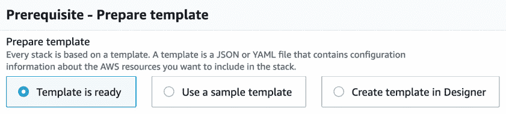

    图 7.1 – CloudFormation 前提条件

1.  在**指定模板**下，确保已选择**Amazon S3 URL**选项，然后在 URL 字段中输入模板所在位置的值，在我们的例子中是[`devopspro-beyond.s3.us-east-2.amazonaws.com/sqs-queues.yml`](https://devopspro-beyond.s3.us-east-2.amazonaws.com/sqs-queues.yml)：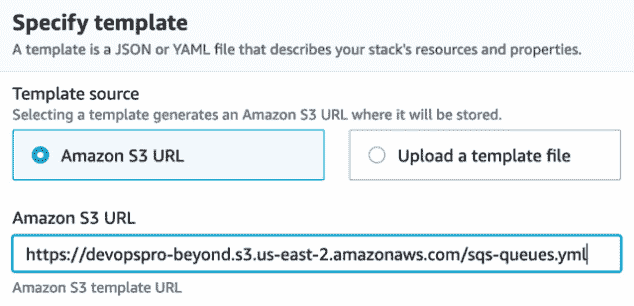

    图 7.2 – CloudFormation 指定模板屏幕

1.  点击页面底部的橙色**下一步**按钮。

1.  我们现在需要填写一些细节，才能继续操作。我们从`SQSqueue`开始（不允许有空格）。

1.  接下来，填写其余的**参数**，为**AlarmEmail**字段添加你的地址，为**QueueName**字段添加队列的名称。你可以将另外两个值保持为默认值。完成后，点击页面底部的橙色**下一步**按钮：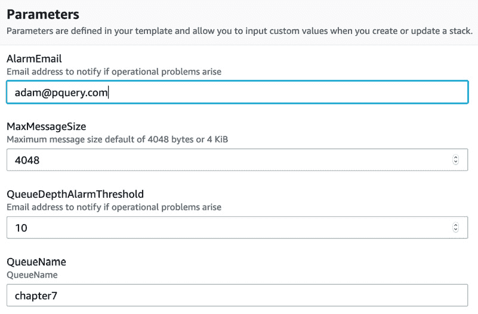

    图 7.3 – 输入模板的参数

1.  在下一页，标记为**配置堆栈选项**，向下滚动到页面底部并点击橙色的**下一步**按钮。

1.  我们现在可以查看我们输入的内容，如果一切看起来正确，向下滚动到页面底部并点击橙色按钮，标签为**创建堆栈**。

一旦我们开始创建过程，我们将被带到**Stacks**屏幕，在那里我们可以看到**CREATE_IN_PROGRESS**通知，表示我们的堆栈正在创建中。

在这一部分的顶部有一个菜单，允许你查看每个堆栈创建的具体资源、堆栈的具体信息、堆栈创建后你声明的任何输出、创建堆栈时输入的参数、用于创建堆栈的实际模板以及在堆栈上使用的变更集。

当你启动一个 CloudFormation 模板时，该模板会保存在一个 S3 桶中。如果你之前没有将模板保存到 S3 桶中，AWS 会在你启动模板的区域创建一个 S3 桶。每次你更新模板或启动新版本时，模板的一个新副本会被添加到这个桶中。

### 使用 CLI 启动模板

在通过管理控制台启动模板的所有步骤之后，我们可以看到，如果我们打算将部署自动化为 CI/CD 流水线的一部分，那么每次都这样做显然是不实际的。AWS CLI 确实有一个`deploy`命令，它允许我们通过一条命令启动一个堆栈。在运行该命令之前，确保你已经从 GitHub 仓库的`Chapter-7`文件夹中下载了 YAML 模板。下载后，打开你的终端窗口，并将模板复制或移动到你的工作目录中，或者将工作目录更改为你下载模板的位置：

启动模板的 CLI 命令示例如下所示：

```
$aws cloudformation deploy --template my-template.json --stack-name CLI-stack --parameter-overrides Key1=Value1 Key2=Value2
```

通过这一条命令，我们已经复制了之前经历的所有步骤。正如前面所提到的，我们的模板应该存储在一个随机命名的 S3 桶中，因为我们在创建过程中上传了它，而 CloudFormation 服务为我们存储了它。

## 使用变更集

如果你的 CloudFormation 堆栈需要更新，有时你可能希望了解并理解当前正在运行的现有资源会如何受到影响。变更集允许你预览更改如何影响当前运行的资源，在任何更改发生之前，然后如果更改对当前资源有害，你可以取消更新，或者如果更改按预期执行，则可以继续。

注意

变更集不能告诉你 CloudFormation 执行时是否会成功运行。它们无法预见你可能遇到的账户限制更新，也无法判断你是否具备更新资源所需的正确 IAM 权限。

### 执行变更集的步骤

让我们看看执行变更集所需的强制性步骤和可选步骤：

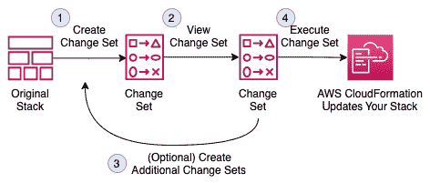

图 7.4 – CloudFormation 变更集

在掌握了如何执行变更集的基础之后，我们将使用变更集来更新原始的 CloudFormation 堆栈——`SQSqueue`。

### 使用变更集更新我们的堆栈

如果你还没有这样做，那么从 GitHub 仓库的 `Chapter-7` 文件夹中下载名为 `sqs-queues_change_set.yml` 的模板。这就是我们将用来创建变更集的文件。还要确保你已经打开浏览器，进入 AWS 管理控制台，并导航到 CloudFormation 服务，然后按照以下步骤操作：

1.  在 CloudFormation 堆栈页面，你应该会看到你的 `SQSqueue` 堆栈处于 `CREATE_COMPLETE` 状态。点击堆栈名称，进入堆栈的详细信息页面。在这里我们可以执行变更集：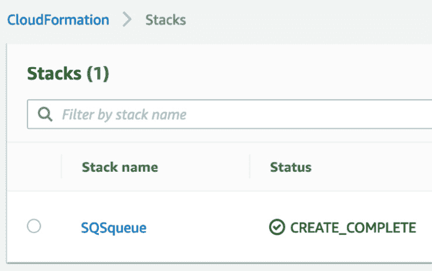

    图 7.5 – 我们之前创建的 CloudFormation 堆栈

1.  在堆栈名称下方的横向菜单中，你会看到多个选项，包括最右侧的**变更集**。点击**变更集**选项：

    图 7.6 – CloudFormation 堆栈菜单，右侧高亮显示变更集选项

1.  进入**变更集**部分后，点击标记为**创建变更集**的按钮。

1.  此时，将出现一个新屏幕，标题为**先决条件 – 准备模板**。你将看到三个选择。选择中间的选项，标题为**替换当前模板**：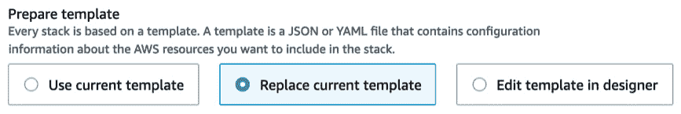

    图 7.7 – CloudFormation 变更集准备模板屏幕

1.  这将使另一组选择项出现在初始单选按钮下方。这一次，我们不是在创建变更集之前将模板上传到 S3，而是使用我们之前从 GitHub 仓库下载的`YAML`文件（`sqs-queues_change_set.yml`）在此处上传模板。上传文件后，点击橙色的**下一步**按钮。

1.  下一屏幕，**参数**，应确认我们在首次创建模板时输入的参数。此时我们不会更改任何参数，因此只需点击页面底部的橙色**下一步**按钮。

1.  在下一屏幕，**配置堆栈选项**，我们不进行任何更改。您可以向下滚动到页面底部，然后点击橙色的**下一步**按钮。

1.  现在，最终在**审查**页面，我们需要在页面底部勾选一个选项，确认我们的新堆栈将创建一个 Lambda 函数所需的 IAM 角色。在**权限**标题下，勾选确认此新模板正在创建 IAM 权限的复选框。完成后，您可以点击标有**创建变更集**的橙色按钮。

1.  此时应该会弹出一个窗口，允许您在实际创建变更集之前为其命名。如果愿意，您可以为变更集命名，或者只需点击右下角的橙色**创建变更集**按钮。

1.  一旦变更集创建完成，您应该会看到`CREATE_PENDING`状态，因为 CloudFormation 正在根据您使用变更集创建的新模板计算当前堆栈实际要更改的内容。完成后，橙色的**执行**按钮将出现在右上菜单中。向下滚动并查看**变更**标题下，查看将在堆栈上执行的两个更改。确认更改无误后，向上滚动并点击橙色的**执行**按钮：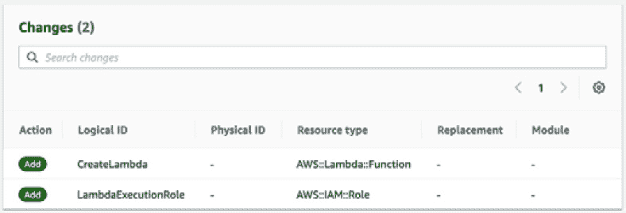

    图 7.8 – 变更集将在堆栈上执行的更改

1.  现在，您将被带回到`SQSqueue`堆栈，并看到`UPDATE_IN_PROGRESS`状态，直到更新完成。

仅仅因为您创建了一个变更集并不意味着您必须执行它。您可以在**变更集**标签中有多个变更集，等待执行，直到您和您的团队决定应该实施哪些更改。值得注意的是，除非您删除变更集，否则任何拥有堆栈权限的人都可以执行它。

到目前为止，我们已经更新了原始堆栈，添加了 Lambda 函数以及该 Lambda 函数操作所需的 IAM 角色。我们的操作非常顺利，但如果模板中有冲突、缺失信息或错误会发生什么呢？接下来我们将讨论 CloudFormation 的回滚功能。

## CloudFormation 的回滚功能

如果在创建或更新 CloudFormation 堆栈时操作失败，堆栈将回滚到之前的状态。此外，还有一个叫做 **回滚触发器** 的功能。通过这些触发器，你可以设置用户定义的警报，CloudWatch 可以监控这些警报，并在发生故障时回滚堆栈。

在创建堆栈或更新更改集时，监控周期可以设置为 0 到 180 分钟。接下来我们将看一个包含回滚触发器的更改集更新示例。

我们可以使用以下类似的 CLI 命令创建一个 CloudWatch 警报来监视我们的堆栈：

```
aws cloudwatch put-metric-alarm --alarm-name "SQS_stack_errors"  \
   --alarm-description "example alarm" --namespace "SQS_log_errors"  \
   --metric-name Errors --statistic Maximum --period 10 \
   --evaluation-periods 1 --threshold 0  \
   --treat-missing-data notBreaching  \
   --comparison-operator GreaterThanThreshold 
```

一旦我们创建了警报，就可以使用返回的 ARN 在回滚触发器中使用。如果需要查找 ARN，可以使用 CloudWatch 的 `describe-alarms` 命令：

```
aws cloudwatch describe-alarms --alarm-names "SQS_stack_errors"
```

我们需要创建一段 JSON 代码并将其推送到变量中，以便将 ARN 传递给命令行选项：

```
RB_TRIGGER=$(cat <<EOF
{
  "RollbackTriggers": [
    {
      "Arn": "arn:aws:cloudwatch:us-east-2:470066103307:alarm:SQS_stack_errors",
      "Type": "AWS::CloudWatch::Alarm"
    }
  ],
  "MonitoringTimeInMinutes": 5
}
EOF
)
```

这将为我们提供创建回滚触发器所需的信息：

```
aws cloudformation create-change-set \
    --change-set-name "SQS-UPDATE" \
    --stack-name "SQSqueue" \
    --template-url "https://devopspro-beyond.s3.us-east-2.amazonaws.com/sqs-queues_change_set.yml" \
    --change-set-type "UPDATE" \
    --parameters ParameterKey=QueueName,ParameterValue=chapter7 \
    --capabilities CAPABILITY_IAM \
    --rollback-configuration "$RB_TRIGGER" 
```

目前，回滚触发器仅支持使用 CloudWatch 警报作为监控工具。

我们将在 *第十五章* 中更详细地讨论 CloudWatch 警报，*CloudWatch 指标和 Amazon EventBridge*。

## CloudFormation 中的内置函数

CloudFormation 内置了多个函数，这些函数可以与 JSON 和 YAML 模板一起使用，扩展模板的功能和能力。我们可以堆叠或组合内置函数。

注

内置函数只能在 CloudFormation 模板的某些部分使用。根据本书出版时的情况，内置函数可以在资源属性、输出、元数据属性和更新策略属性中使用。

接下来我们将看一些常见的内置函数，并提供一些使用示例。YAML 模板中还可以使用其他函数。在函数标题中，如果有短格式，原始代码后面会用管道符号分隔并显示短格式：

+   `Fn::FindInMap | !FindInMap`

    `FindInMap` 函数根据 `Mappings` 部分中的键返回一个值：

    ```
    Mappings: 
    RegionMap: 
    us-east-1: 
          HVM64: "ami-032930428bf1abbff"
        us-east-2:
          HVM64: "ami-027cab9a7bf0155df"  
    us-west-1: 
          HVM64: "ami-088c153f74339f34c"
    eu-west-1: 
          HVM64: "ami-015232c01a82b847b"
    ap-southeast-1: 
          HVM64: "ami-0ba35dc9caf73d1c7"
    ap-northeast-1: 
          HVM64: "ami-0b2c2a754d5b4da22"
    Resources: 
    EC2Instance: 
        Type: "AWS::EC2::Instance"
    Properties: 
          ImageId: !FindInMap
            - RegionMap
            - !Ref 'AWS::Region'
            - HVM64
          InstanceType: t2.small
    ```

+   `Fn::GetAZs | !GetAZs`

    `GetAZs` 函数将返回给定区域中的可用区列表。这对于创建跨区域动态模板特别有帮助：

    ```
    PublicSubnet1:
        Type: AWS::EC2::Subnet
        Properties:
          AvailabilityZone:
    Fn::Select: 
            - 0
            - Fn::GetAZs: ""
    ```

+   `Fn::GetAtt`

    `GetAtt` 函数对于获取资源的属性（特别是 ARN）非常有用，尤其是在模板中之前已创建的资源。这个函数特别适用于使 CloudFormation 模板具有更高的动态性：

    ```
    SourceSecurityGroupName: !GetAtt EC2.SourceSecurityGroup.GroupName
    ```

### 条件函数

可选条件部分包含定义在基于动态选项的情况下，资源是否可以或不可以创建或配置的语句。

在 CloudFormation 模板中使用条件的场景包括以下内容：

+   您正在尝试使用相同的模板为 DEV 和 PROD 环境提供支持，而不需要更改任何内容，除了可能的参数值。

+   您希望通过下拉列表指定要挂载的 EBS 卷数量。

+   您希望根据用户选择来创建或不创建 CloudWatch 仪表板。

    注意

    在堆栈更新过程中，您不能单独更新条件。您只能在包含添加、修改或删除资源的更改时更新条件。

您可以使用条件函数帮助评估诸如 AWS 提供的变量或从参数收集的输入项，并在某些条件适用时创建额外的资源：

+   `Fn::And`

    如果所有传入的指定条件返回`true`，则此函数返回`true`。

+   `Fn::Equals`

    此函数比较两个不同的值，并在值相等时返回`true`。

    在以下示例中，模板将根据在模板的 `Parameters` 部分传递的值，决定是否创建 `Public Subnets`：

    ```
    Conditions:
      PublicSubnetsCondition:
          Fn::Equals: [ !Ref CreatePublicSubnets, "true" ]
      NoPublicSubnetsCondition:
          Fn::Equals: [ !Ref CreatePublicSubnets, "false" ]
    ```

+   `Fn::If`

    如果指定的条件评估结果为`true`，则此函数返回一个值；如果指定的条件评估结果为`false`，则返回另一个值。

+   `Fn::Not`

    如果条件评估结果为`false`，则返回`true`，如果评估结果为`true`，则返回`false`。

+   `Fn::Or`

    如果任何指定条件的评估结果为`true`，则返回`true`。

## CloudFormation 最佳实践

当您开始在 CloudFormation 模板中构建基础设施即代码（IaC）时，AWS 提供了一些最佳实践和建议。这些建议有助于您更有效地组织和规划资源创建，同时最大限度减少在模板初次运行时的故障排除时间。

### 不要在模板中嵌入敏感信息。

与其直接在 CloudFormation 模板中放置可能会泄露的机密信息，不如*将机密存储在 AWS Secrets Manager 中*。更好的做法是使用*动态引用*。动态引用允许您引用`Systems Manager`（SSM）参数存储或 AWS Secrets Manager 中的外部值。对于 SSM 参数存储，它支持`ssm`（明文值）和`ssm-secure`（加密值）。

因此，您可以像这样在 RDS 资源块中使用数据库用户名和密码，而不是使用基于模板的参数：

```
  MySQLInstance:
    Type: 'AWS::RDS::DBInstance'
    Properties:
      DBName: MyRDSInstance
      AllocatedStorage: '20'
      DBInstanceClass: db.t2.micro
      Engine: mysql
      MasterUsername: '{{resolve:secretsmanager:MyRDSSecret:SecretString:username}}'
      MasterUserPassword: '{{resolve:secretsmanager:MyRDSSecret:SecretString:password}}'  
```

### 使用 AWS 特定的参数类型

为了简化 AWS 特定参数输入，尤其是在请求可能需要在账户中查找的项目时，可以定义 AWS 特定类型的参数，而不是使用字符串表示参数类型。这些参数可能包括安全组 ID、VPC ID 或 Route53 托管区域 ID。一个很好的例子是`AWS::EC2::KeyPair::KeyName`，这将提供一个可用 EC2 密钥对的下拉菜单。

### 利用参数约束

如果你没有使用 AWS 特定的参数，而是使用字符串参数，则使用参数约束可以帮助在模板开始创建之前捕捉用户在输入参数时的错误，避免浪费时间进行回滚。参数约束的构造方式类似正则表达式，还可以为用户提供描述，帮助他们更好地理解需要输入的内容。

### 了解如何使用 AWS::CloudFormation::Init 将软件部署到 EC2 实例

当你从 CloudFormation 模板启动 EC2 实例时，可以使用`cfn-init`助手脚本和`AWS::CloudFormation::Init`资源来安装和配置运行在该实例上的软件。使用这些助手脚本不仅可以安装系统脚本，还可以通过操作系统包管理器（如`apt`或`yum`）安装必要的系统包。

### 模块化你的模板

使你的模板模块化可以同时完成几件事。首先也是最重要的是使模板可重用。随着我们开始讨论嵌套模板，这变得尤为重要。第二点是让多个团队成员集中精力在他们具有更多专业知识的小模板上。

### 在尝试启动之前对模板进行 Lint 检查

就像任何其他形式的代码一样，CloudFormation 模板应该经过验证过程，确保模板没有格式问题，然后再尝试启动。AWS CLI 中有一个内置的模板检查器，你可以使用它来发现模板中可能存在的任何问题。

AWS CloudFormation Linter（`cfn-lint`）是一个开源工具，可以集成到大多数 IDE 中，也可以通过命令行、IDE 内部或集成到 CI/CD 管道中运行。该工具将验证 JSON 和 YAML 模板，并包括符合 CloudFormation 最佳实践的附加检查。

注意

尽管这些最佳实践通常不会出现在测试题目中，但它们对于日常使用 CloudFormation 并让你成为最优秀的 DevOps 专业人士来说更为重要。

# 创建具有依赖关系的嵌套堆栈

当你开始按逻辑组织你的模板时，你会发现将更大的模板拆分成更小、更易管理的部分是一种明智的策略。这不仅会使它们更容易使用，还能通过使每个模板具备特定目的来提高重用性，例如创建一个带有子网的 VPC 或一组可重用的 IAM 角色。为这些较小的模板添加输出可以使其他模板使用其他模板之前创建的资源，就像一个个堆叠在一起的积木，最终构建出一个完整的解决方案。这也使得多个团队成员可以在云基础设施的不同部分独立工作，因为每个人可以集中精力在自己擅长的领域。如果你有一位擅长网络的团队成员，他们可以专注于堆栈中的 VPC 和网络部分。如果你有另一位具有数据库背景的团队成员，他们可以专注于创建和配置数据库（包括特定数据库引擎的任何特殊参数组）的嵌套部分。

嵌套堆栈始于根堆栈或父堆栈，如*图 7.9*中所示，标有字母**A**。根堆栈接着将其他子堆栈作为其资源，而不是其他 AWS 服务。我们还可以在图中看到，标有**B**的堆栈提供的输出被**C**级堆栈消费。**C**级堆栈创建了另一个子堆栈，并创建了资源，其输出被**D**级堆栈消费：

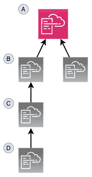

图 7.9 – CloudFormation 嵌套堆栈

嵌套堆栈还提供了一个额外的好处，即能够突破 CloudFormation 模板的 200 个资源限制。

注意

嵌套堆栈在故障排除时可能更加复杂。如果在创建和部署嵌套 CloudFormation 堆栈时遇到错误，可以尝试只部署单个导致问题的模板，然后更新你的更改。

## 为部署打包你的嵌套堆栈

一旦你准备好所有要上传到 S3 的模板，你可以使用 AWS CLI 将它们打包在一起。由于嵌套堆栈需要其子模板在 S3 中以供部署，这样可以节省你单独上传每个模板的时间。然后，它将为我们生成一个新模板，并为我们提供使用该新模板部署完整嵌套堆栈的命令。创建 CloudFormation 包的通用代码如下所示：

```
$aws cloudformation package \
 --template-file /path_to_template/template.json \
 --s3-bucket bucket-name \
 --output-template-file packaged-template.json
```

当我们通过 AWS CLI 创建嵌套模板的练习时，我们将更深入地查看此命令。

让我们回顾一下`package`命令的作用：

+   它创建一个 ZIP 文件，包含所有子模板文件和额外代码，例如`lambda`代码。

+   它将这些项目上传到你指定的 S3 桶中。

+   它生成一个新的模板，将本地模板替换为 S3 URI。

## 使用 AWS CLI 创建嵌套堆栈

在下面的练习中，我们将使用 GitHub 存储库中`Chapter-7/nested`目录下的一组模板创建嵌套堆栈。在开始以下练习之前，请下载所有这些 YAML 模板。还要记下要部署包的 S3 存储桶。正如我们之前在展示示例命令时所指出的，CLI 命令的一部分需要 S3 存储桶：

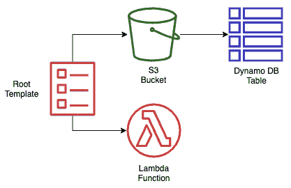

图 7.10 – 创建嵌套堆栈练习中的项目

图 7.10 中的图示显示了我们即将使用嵌套模板打包和部署的内容：

1.  打开终端，以便您可以访问 AWS CLI。

1.  现在导航到您已下载所有文件以创建嵌套堆栈的文件夹。如果您已经下载了整本书的 GitHub 存储库，则路径将为`Chapter-7/nested`。

1.  由于嵌套堆栈的打包只能工作一层深，我们必须手动上传我们的`nested_dynamo.yml`模板（确保在执行以下命令时替换自己的存储桶名称）：

    ```
    aws s3 cp nested_dynamo.yml s3://devopspro-beyond/
    ```

1.  打开`nested_root.yml`文件，并编辑您放置`nested_dynamo.yml`文件的存储桶的 HTTPS 值的默认值。

1.  进入嵌套目录后，执行以下命令：

    ```
    aws cloudformation package \
      --template-file nested_root.yml \
      --s3-bucket devopspro-beyond \
      --output-template-file packaged_template.yml
    ```

1.  完成后，`package`命令应告诉您成功，并提供一个剪切和粘贴命令供您运行，需要在命令的最后替换堆栈名称：

    成功打包工件并将输出模板写入文件`packaged_template.yml`。

    执行以下命令以部署打包的模板：

    ```
    aws cloudformation deploy --template-file /AWS-Certified-DevOps-Engineer-Professional-Certification-and-Beyond/Chapter-7/nested/packaged_template.yml --stack-name <YOUR STACK NAME>
    ```

1.  运行以下命令以创建您的嵌套堆栈，但请确保更改堆栈名称并添加`--capability CAPABILITY_IAM`标志：

    ```
    aws cloudformation deploy --template-file /AWS-Certified-DevOps-Engineer-Professional-Certification-and-Beyond/Chapter-7/nested/packaged_template.yml --stack-name Chapt7 --capabilities CAPABILITY_IAM
    ```

1.  登录 AWS 控制台并转到 CloudFormation 服务。此时，您应该能够看到您创建的根堆栈和嵌套堆栈。通过单击**资源**选项卡，您可以看到刚刚创建的所有资源。

1.  如果不想产生费用，则删除堆栈。

## 使用 DependsOn 来排序资源

虽然 CloudFormation 按照模板中指定的顺序创建资源，但在开始构建下一个资源之前，并不等待任何一个资源的完成，除非有特别的指示。`DependsOn`结构允许您暂停特定资源的创建，直到其他资源完成。

存在许多情况需要调用`DependsOn`。第一组场景涉及需要访问互联网的资源，因此在继续之前需要完成互联网网关。

## 将等待条件添加到模板中

`WaitCondition` 会在模板执行堆栈任务时添加一个暂停，直到接收到成功信号，表示可以继续进行。

每当将 `WaitCondition` 作为资源添加到 CloudFormation 模板中时，必须将其与 `WaitConditionHandle` 资源结合使用。

注意

尽管 `DependsOn` 构造和 `WaitCondition` 资源在功能上似乎相似，但它们在几个方面有所不同。首先，`DependsOn` 是一个更简单的实现，因为它不需要辅助脚本。`DependsOn` 还不会在资源创建后检查其是否成功或失败，因此仅仅控制模板中项目的顺序。而 `WaitCondition` 则需要显式接收成功信号，模板（或变更集）会在收到该信号前暂停。

## 使用 curl 进行信号传递

当使用 `curl` 向 `WaitCondition` 发出信号，表明资源（大多数情况下是 EC2 实例）已经完成配置时，这可以动态完成。第一步是创建 `WaitHandle`，然后构建 `CloudFormation` 在 `curl` 命令中使用的 URL。此时，我们可以在模板的 `UserData` 部分内调用 `curl` 命令。接下来，我们将看到一个简化模板片段中的示例：

```
ServerWaitCondition:
    Type: 'AWS::CloudFormation::WaitCondition'
    DependsOn: Server
    Properties:
      Handle: !Ref ServerWaitHandle
      Timeout: '1200'
…
      UserData: !Base64 
        'Fn::Join':
          -"
          - - |
              #!/bin/bash -v
            - |
              # Send Wait Condition URL 
            - '/usr/local/bin/aws s3 cp s3://'
            - !Ref BucketFolder
            - |
              /templates/success.json /tmp/a 
            - SignalURL=
            - !Ref ServerWaitHandle
            - |+
            - |
              echo $SignalURL 
            - curl -T /tmp/a "
            - !Ref AdminServerWaitHandle
            - |
              "
```

`WaitCondition` 是与 CloudFormation 中提供的少数几个辅助脚本之一一起使用的信号。接下来，我们将查看 CloudFormation 模板中可用的不同辅助脚本。

# 将辅助脚本添加到 CloudFormation 模板

在 CloudFormation 中，有一些不同的辅助脚本，它们是用 Python 编写的，可以在请求和配置 EC2 实例作为模板的一部分时安装软件并启动服务：

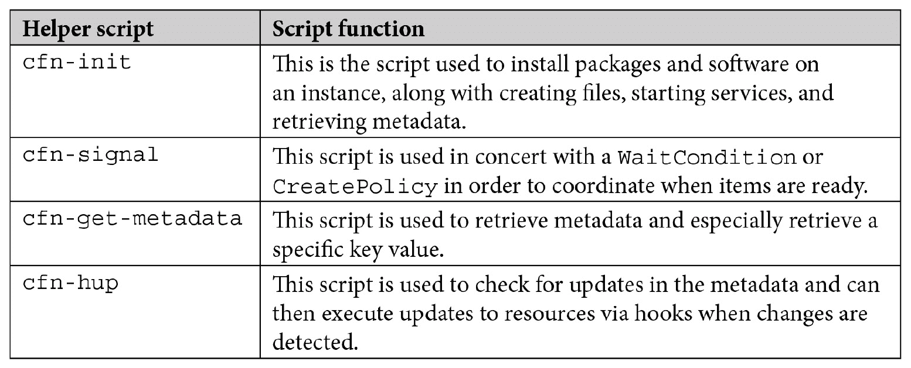

表 7.1 – CloudFormation 助手脚本

如你所见，使用 CloudFormation 提供的这些辅助脚本可以大大简化 EC2 配置。接下来，我们将看到如何在 CloudFormation 模板中检测漂移，如果你的基础设施与模板代码发生偏离。

# 了解如何检测 CloudFormation 模板中的漂移

CloudFormation 模板允许你以代码的形式在你管理的多个 AWS 账户中创建和管理基础设施与资源。采用这种将资源作为代码进行配置的方式，能够进行版本控制，且是最佳实践，因为它是可重复的，而不是像传统方式那样手动构建和维护云资源。

你能阻止他人更改你以这种方式配置的资源吗？除非你使用了 IAM 策略来防止小组修改通过 CloudFormation 模板或代码部署管道提交的资源，否则有可能会出现由 CloudFormation 模板创建的某些资源发生漂移的情况。

当您启动漂移检测时，CloudFormation 服务会将当前堆栈和当前配置的资源与当初用于创建或更新该堆栈的模板中指定的内容进行比较。然后，它会报告所发现的任何差异。

在我们对 CloudFormation 模板有了深入了解之后，现在我们将讨论一个补充服务——AWS 服务目录。服务目录是 AWS 管理工具箱中的另一个工具，它允许您的用户快速、轻松地配置已预先创建并设置了相关保护措施的资源。

## 使用服务目录管理模板

在继续讨论 CloudFormation 模板的过程中，我们开始研究在组织中管理模板的其他方法。AWS 的服务目录产品允许我们使用 CloudFormation 模板，并为用户创建一个自服务门户，以便他们可以在获得适当访问权限的情况下配置已知的项目模式。这些模板现在成为我们服务目录中的产品，甚至可以进行参数化，这样用户就可以选择项目，例如在 EC2 的情况下，经过验证的、预定义的 EC2 实例大小和 AMI。

首先，您需要理解与服务目录相关的一些概念。第一个概念是产品。**产品**是您希望在 AWS 上提供的 IT 服务。它可以是一个简单的 S3 存储桶，也可以是一个复杂的 EC2 实例，配备 RDS 数据库和预定义的 CloudWatch 警报。接下来，您需要理解服务目录中的另一个概念——产品组合。**产品组合**是特定产品及其配置信息的集合。产品组合还与特定的用户组关联，并赋予这些用户组启动产品的权限。

查看 *图 7.11*，我们可以看到从管理员和用户的角度出发，服务目录中提供的两种不同工作流。顶部视图展示了管理员如何加载一个包含 EMR 集群、S3 存储桶和 CloudWatch 警报的模板，作为数据用户组的产品供重复使用。

数据用户组中的任何用户都可以迅速配置不仅是 EMR 集群，还可以配置相应的 S3 存储桶及相关的 S3 警报，只需在服务目录界面中输入几项相关信息：

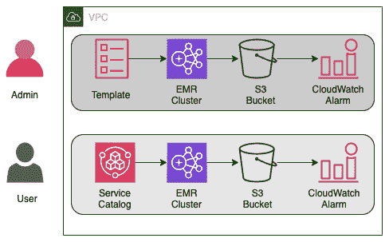

图 7.11 – 服务目录工作流

服务目录还允许您更新包含产品的模板，并发布带有更新功能的新版。这可以让您的用户选择使用哪个版本：他们熟悉的版本，或是包含新功能的版本。

在许多情况下，这种方法可能会变得非常有用：

+   当解决方案架构师需要快速配置一个演示环境以供客户销售电话使用时。

+   QA 团队希望搭建一个用于测试的 QA 环境。

+   在营销部门，他们希望一个促销应用程序在特定的时间段内运行。

+   一位数据科学家需要一套专门的软件进行配置，比如 EMR 集群或配置有 R Studio 的服务器，但他没有系统管理员的背景，无法安装、配置和正确地确保所有必要的软件安全。

服务目录中的访问控制通过 IAM 进行处理。服务目录管理员为目录中的产品创建特定的 IAM 角色，以便用户仅拥有运行目录中预配置服务所需的足够权限。

在您的服务目录中，您可以对产品设置多种不同类型的约束，以便应用治理。

有基于模板的约束，可以减少用户在启动产品时可用的选项数量。例如，EC2 实例或 RDS 实例的大小，或者允许用于 Lambda 产品的语言。

基于标签的约束要么强制要求在启动产品时填写特定标签，要么禁止用户使用任何除预定义标签外的附加标签。

您可以指定一个特定的 SNS 主题，通过通知约束接收有关产品的更新。

定义哪些 IAM 角色可以用于运行特定产品，并通过启动约束进行控制。这为服务目录管理员提供了一组额外的控制手段，指明哪些服务允许由服务目录产品进行治理。

我们刚刚发现，服务目录能够让非开发人员快速启动预定义的 AWS 基础设施模式供用户使用。这些用户无需担心如何配置底层资源，因为这一切都由底层的 CloudFormation 模板处理。

接下来，我们将探讨另一种创建 CloudFormation 模板的方法，它比仅使用 JSON 或 YAML 的 Cloud Development Kit 提供了更大的灵活性。

# 使用 Cloud Development Kit

开发人员习惯于创建可重用的库并使用循环等技术来处理重复任务。**Cloud Development Kit** (**CDK**) 允许具备编程背景的人使用多种语言（TypeScript、JavaScript、Python、Java 和 C#）创建 CloudFormation 模板，使用他们熟悉的技术，具体如以下几种：

+   逻辑（`if` 语句、`for` 循环）

+   面向对象的技术

+   通过逻辑模块进行组织

这与 CloudFormation 模板形成对比，后者要求您、开发人员或 DevOps 人员以 JSON 或 YAML 格式编写模板，尽管这两种选项在本质上都有一定的普遍性，并且无论是否有编程背景，都可以在短时间内掌握。CloudFormation 模板在创建堆栈时，提供的编程选项和逻辑也非常有限：

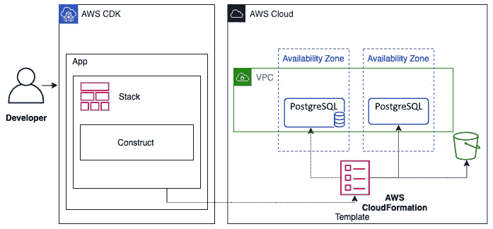

图 7.12 – CDK 工作流程

在*图 7.12*中，你可以看到开发人员如何使用 CDK 创建应用程序的工作流程。这个应用程序随后创建一个堆栈，将 CloudFormation 模板部署到 AWS 云环境中。

## AWS CDK 的概念

在 AWS CDK 中，有三个基本组件——应用程序（apps）、堆栈（stacks）和构造体（constructs）——开发人员可以利用这些组件来创建云服务。

### 应用程序（Apps）

使用 AWS CDK 时，你是在构建一个应用程序，该应用程序本身就是一个应用，并由 CDK `App` 类组成。

### 堆栈（Stacks）

在 AWS CDK 中，部署单元是堆栈，堆栈范围内定义的所有资源都作为一个单一单元进行提供。由于 CDK 堆栈是作为 CloudFormation 堆栈实现的，因此 CloudFormation 堆栈需要遵守的任何边界或限制同样适用于 CDK 堆栈。

### 构造体（Constructs）

AWS CDK 的构建模块是构造体。这些构造体可以是像负载均衡器这样的单个 AWS 资源，或者是由多个资源组成的单一组件，例如 VPC 和子网。构造体创建可重用的组件，可以像其他代码片段一样共享。

## 使用 AWS CDK 的优点

我们将探讨使用 CDK 相较于普通 CloudFormation 模板的一些优势。

### 更快的开发过程

使用 AWS CDK，你可以使用你熟悉的编程语言，如 Python、TypeScript、.NET、Go 和 Java。在这些语言的帮助下，你可以创建对象、循环和条件，而无需学习特定领域的函数和解决方法。

### 在 IDE 中进行代码补全

使用流行的 IDE（如 Visual Studio Code）可以在编程时根据你选择的语言实现代码补全功能，尤其是在使用 AWS CDK 时。

### 同步部署代码和基础设施即代码（IaC）的能力

由于 AWS CDK 使用的是与编写代码时相同的原生语言，因此将基础设施组件与运行应用程序的代码结合起来变得更加简单，无需切换上下文。

# 总结

在本章中，我们探讨了如何使用 CloudFormation 模板和 CDK 创建基础设施即代码（IaC）。我们研究了模板构建和组织的一些最佳实践，并通过 AWS 管理控制台和命令行界面（CLI）亲手实现了将 CloudFormation 模板部署和更新为堆栈。

在下一章中，我们将开始研究一些属于 SDLC 过程的 AWS 代码工具，从 CodeCommit 和 CodeBuild 开始。我们将使用 CodeCommit 创建一个代码库并提交，然后使用 AWS CodeBuild 构建代码。最后，我们将看到如何通过从 CodeCommit 仓库的推送触发 CodeBuild 作业来将这两项服务结合在一起。

# 复习问题

1.  CloudFormation 的两个主要组件是什么？

1.  一家公司雇佣你帮助审查和优化其 CI/CD 流程，特别是在基础设施即代码（IaC）方面。该公司目前有一个 CloudFormation 模板，经过一段时间的开发，用于创建 IAM 账户角色、VPC、子网、Lambda 函数、CloudWatch 警报、SNS 主题及其他资源，包括数据库和 EKS EC2 实例及其相应的 AutoScaling 组。你会如何着手为他们的流程优化提出建议？

    a. 检查当前模板，确保其嵌入了正确的 `DependsOn` 和 `WaitCondition`，以便所有资源可以顺利启动，不会发生冲突。

    b. 创建一个计划，说明如何拆分他们的大模板。

    c. 使用 CloudFormation 的 `package` 命令将所有模板打包在一起。

    d. 将较小的模板打包并通过一个 `deploy` 命令进行部署。

1.  在评估客户的需求后，你决定构建一个 CloudFormation 模板，作为交付成果交给客户，该模板适用于可重复使用的三层 Web 应用程序。中间件 Linux 服务器有一个复杂的用户数据脚本，需要一段时间才能完全安装。它们位于网络负载均衡器资源之后，在添加之前需要完全操作并配置好。你如何确保这些服务器在连接到网络负载均衡器资源之前已经完全操作并正确配置？（选择两个。）

    a. 确保网络负载均衡器资源位于模板中的中间件服务器后面，在 CloudFormation 资源部分中。

    b. 添加一个依赖于中间件服务器的 `WaitCondition`。一旦用户数据完成，它会使用 `cfn-signal` 通知表示已准备好。

    c. 从嵌套模板中启动所有内容，其中中间件服务器位于从负载均衡器模板启动的模板中。

    d. 添加一个依赖于中间件服务器的 `WaitCondition`。一旦用户数据完成配置中间件服务器，它会使用 `curl` 命令通知预签名的 URL，表示它们已经准备好。

1.  你在一家大型企业公司工作，背后有多个待部署的项目，需要将它们部署到不同的 AWS 云环境中。为了最小化每次部署所需的时间，你希望创建一套可重用的组件集合，可以根据每个项目的架构轻松替换。当前已有一个基本的 CodePipeline 服务实例用于添加测试和部署步骤。无论你选择什么解决方案，都应该能够提交到代码版本控制系统，并且易于测试。你应该如何组织资源以实现最佳的可重用性？

    a. 使用 AWS CDK 创建由共享组件库组成的应用程序。添加测试库，并在 CodePipeline 中部署到开发环境之前运行测试。

    b. 创建一个小型资源特定的 CloudFormation 模板库，可以根据架构指南轻松嵌套和打包。使用`yamllint`和`cfn-lint`命令对 CloudFormation 模板进行语法检查，作为 CodeBuild 中的测试步骤，以捕捉任何错误。

    c. 开发 5-10 个蓝图模式的基础，这些模式适用于所有项目。使用这些蓝图，开发一个包含参数和条件的 CloudFormation 模板库，以满足大多数项目的需求。使用`cfn-lint`命令对 CloudFormation 模板进行语法检查，作为 CodeBuild 中的测试步骤，以捕捉任何错误。

    d. 为每个解决方案创建 CloudFormation 模板，包含必要的参数值和条件，以确保它们能够在任何区域无缝工作，并可用于任何环境（DEV、TEST 和 PROD）。将模板上传到 CodeCommit 进行版本控制。

# 审查答案

1.  模板和堆栈

1.  b

1.  b 和 d

1.  a
