# 第八章：使用 CodeCommit 和 CodeBuild 创建工作负载

AWS 提供了一套值得称赞的工具，帮助开发人员和组织完全依赖 Amazon 生态系统来运行他们的 CI/CD 操作。

持续集成从源代码版本控制过程开始，然后以可重复、自动化的方式构建和测试代码。**AWS 代码服务套件**中的两个工具，**CodeCommit** 和 **CodeBuild**，帮助工程师实现这些目标。

在本章中，我们将涵盖以下主要主题：

+   使用 CodeCommit 进行代码版本控制

+   设置你的 CodeCommit 仓库

+   CodeCommit 中的审批

+   使用 AWS CodeBuild

+   创建 `buildspec` 文件

# 技术要求

当我们开始这条路时，假设有几个前提，尤其是在追求专业 DevOps 认证时。第一个前提是你对使用软件版本控制系统 Git 有基本的了解。这个基本知识包括创建一个裸仓库、创建一个分支、对该分支进行提交，然后将提交推送到远程仓库。如果你需要熟悉 Git，建议使用教程 *《Git 和 AWS CodeCommit 入门》*。你可以在 [`docs.aws.amazon.com/codecommit/latest/userguide/getting-started.html`](https://docs.aws.amazon.com/codecommit/latest/userguide/getting-started.html) 找到该教程。

第二个假设是你已经在笔记本电脑或工作站上安装了 Git。假设你还没有安装 Git，或者由于缺乏管理员权限而无法访问它，完美的替代方案是启动一个 Amazon EC2 实例，在你的 AWS 账户中安装 Git，这样你就可以跟随练习进行操作。

如果 Git 没有安装在你的本地工作站上，并且你无法安装它或不想安装它，AWS 提供了 Cloud9 开发环境，它允许你在浏览器窗口中创建代码。

# 使用 CodeCommit 进行代码版本控制

关于存储代码的地方，无论是在本地还是在 SaaS 解决方案中，你有很多选择。功能和价值是驱动决策的因素，决定使用哪种产品。AWS CodeCommit 提供了强大的功能集，并且是按使用付费的服务，包含与 AWS 服务的原生连接，以及符合多个保证计划，如 SOC2、PCI、HIPAA 等。

在 *第六章*，*了解 CI/CD 和软件开发生命周期 (SDLC)* 中，我们讨论了软件开发生命周期的四个主要阶段：源代码、构建、测试和部署。初始阶段，即源代码阶段，是我们将在本节中集中讨论的内容。简要回顾一下，源代码阶段允许你将代码检查到中央仓库，并且允许多人在同一代码库上进行协作。

## 什么是 CodeCommit？

CodeCommit 是一个安全、高度可扩展的托管源代码控制服务，承载私有 Git 仓库。这听起来可能有些陌生，但如果你使用过 BitBucket 或 GitHub 私有仓库，你可能已经使用过类似的 SaaS 服务来托管代码。

CodeCommit 中的基本对象是仓库。仓库是用户存储代码和任何类型、大小对象的地方。CodeCommit 还存储和跟踪对上传文件所做的更改，以及对文件所做的更改。你可以配置仓库，以便在发生事件时发送通知，例如分支合并或向代码中添加评论。它还允许用户在本地系统上工作，然后将更改推送到 CodeCommit 存储系统。

## CodeCommit 的好处

作为 AWS 生态系统的一部分，CodeCommit 可以与 KMS 等服务集成以实现加密，还可以与 CloudWatch 集成，以便为我们的仓库整合指标和警报，甚至不包括与 CodeCommit 服务紧密集成的某些开发工具。除了与众多其他 AWS 服务紧密耦合外，CodeCommit 还提供许多其他好处：

+   CodeCommit 的 IAM 提供高服务可用性和耐久性。

+   CodeCommit 仓库在静态和传输过程中都进行了加密，因此你可以放心，代码始终是安全的。

+   它可以轻松扩展，并且对仓库的大小、以及你可以存储的文件类型和大小没有限制。

+   无缝集成多个 AWS 服务（Lambda、SNS、CodePipeline）。

+   允许你轻松地从其他远程 Git 仓库迁移。

+   允许你使用你已经熟悉的 Git 工具和命令。

在了解了 AWS CodeCommit 的概述和好处之后，我们将查看可用的访问控制功能，然后再创建我们的仓库和专门用于 CodeCommit 访问的新用户组。

## 控制对仓库的访问

在我们开始创建 CodeCommit 仓库的过程之前，我们需要做一些权限方面的预先工作。直到这一点为止，我们大部分操作都是以管理员用户身份进行的。现在我们开始将开发人员和开发团队加入其中，其中一些只需要访问 CodeCommit 仓库而不需要访问其他服务。我们将创建一个新的 IAM 用户组，然后将一个开发者实体添加到该用户组。这将演示良好的 GitFlow 实践，即开发者提交代码后，请求将其分支合并到主分支。

当所有开发者都属于同一个账户时，可以顺利创建 CodeCommit 仓库。然而，还有其他一些场景需要注意。例如，当另一个账户中的开发者需要访问我们账户中的 CodeCommit 仓库时该怎么办？CodeCommit 可以为另一个 AWS 账户中的用户和角色提供跨账户访问。这可以解决不必将外部开发者添加到 IAM 用户列表中的问题，前提是他们已经拥有 AWS 账户。

# 设置你的 CodeCommit 仓库

可以通过 CLI 创建 CodeCommit 仓库。然而，当使用 AWS 管理控制台时，有一些附加功能，如信息面板，这些功能只有在该环境中才可用。

在创建仓库之前，确保打开浏览器访问 AWS CodeCommit 主页，[`console.aws.amazon.com/codesuite/codecommit/home`](https://console.aws.amazon.com/codesuite/codecommit/home)，并在提示时登录。

一旦你登录，我们可以开始创建 CodeCommit 仓库的过程：

1.  一旦你进入了你所在地区的`CodeCommit`主页（在我们的示例中，我们使用的是俄亥俄地区/`us-east-2`），点击右上角的橙色**创建仓库**按钮，开始创建新仓库的过程：

    图 8.1 – 创建仓库按钮

1.  在`chapter8`中设置仓库名称。如果你愿意，可以为仓库添加描述，但这不是必要的。你可能希望此时启用 CodeGuru 审阅器；然而，由于这是一个新功能，我们将不进行讨论：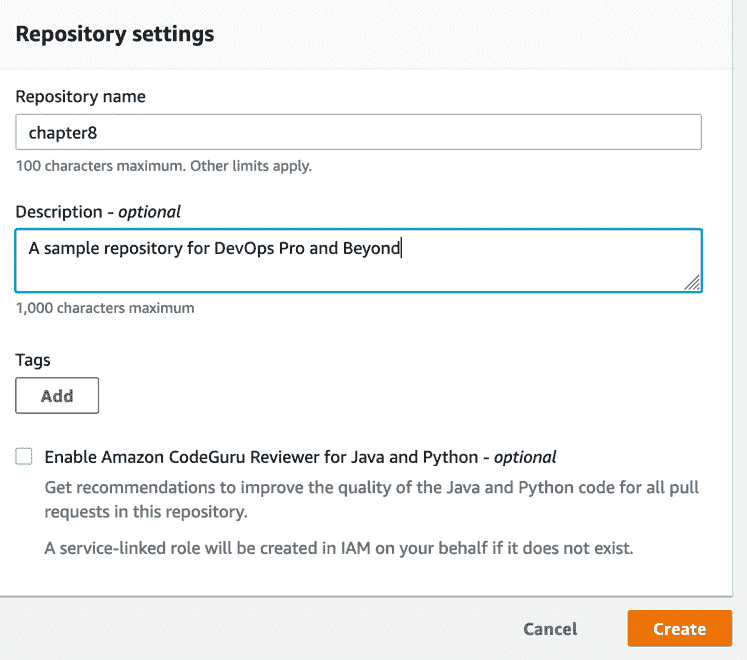

    图 8.2 – 新的 CodeCommit 仓库设置

    注意

    Amazon CodeGuru 审阅器是一个可选功能，是 AWS 的附加服务，在发布时仅支持 Java 和 Python 语言。未来可能会支持更多语言。

1.  创建仓库后，你将看到一个显示连接步骤的页面，这些步骤展示了如何通过多种方式连接到你的新仓库，包括 HTTPS、`SSH` 和通过 HTTPS 的 git-remote-connect 协议。花一点时间浏览这些步骤。我们将在开发者账户创建完成，并且使用其权限集时，更加深入地使用这一部分。向下滚动，越过连接步骤，页面底部会看到一个名为**创建文件**的按钮。点击该按钮以便设置我们的主分支：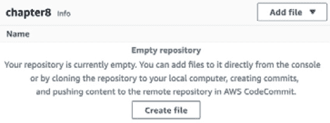

    图 8.3 – 为我们的 CodeCommit 仓库创建初始文件

1.  在 `Welcome to my repository`。完成此操作后，在 `sample.txt` 中，你还需要为提交输入一个名称和一个**电子邮件地址**，如以下截图所示：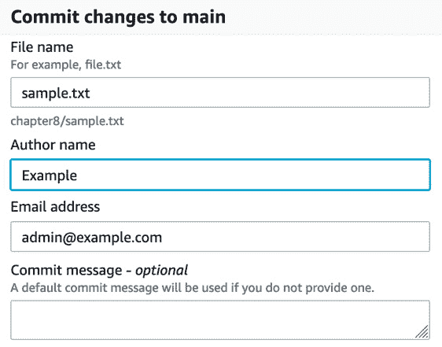

    图 8.4 – 通过 Web 界面提交更改到 CodeCommit

1.  输入这些信息后，你可以点击橙色的 **Commit changes** 按钮。接下来，你将被带到仓库中的文件，但更重要的是要注意，在屏幕的右上角，我们已经成功创建了 **main** 分支：

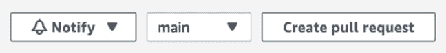

图 8.5 – 我们的 CodeCommit 仓库的主分支

现在我们已经创建了仓库和主分支，我们可以开始创建开发人员用来将代码推送到仓库的权限集。根据你的组织结构，你可能会赋予所有开发人员创建新仓库和将拉取请求合并到主分支的权限。

在我们的示例场景中，当我们进行练习时，我们将区分开发人员可以做的事情与管理员或 DevOps 高级用户的职责。准备考试时，考虑如何划分责任是非常重要的，此外，还有一些可能出现的问题和场景需要注意。

## 为开发人员创建 IAM 组

在我们开始之前，请确保从本书的 GitHub 仓库下载文件，路径是 `Chapter-8` 文件夹。我们将首先为开发人员创建 IAM 策略。一旦策略上传完毕，我们将创建开发人员组，并将策略附加到新创建的组上：

1.  打开终端，以便可以访问你的 AWS CLI。

1.  我们想为我们的代码提交开发人员创建一个组。你可能以前创建过一个开发人员组，但我们现在要为本章创建一个新的组：

    ```
    aws iam create-group --group-name CC_Developers
    ```

1.  现在你已经创建了组，我们将把策略附加到该组。我们需要从之前创建的 `CC_Developers` 策略中获取策略 ARN：

    ```
    aws iam attach-group-policy 
      --policy-arn arn:aws:iam::aws:policy/AWSCodeCommitPowerUser –group-name CC_developers
    ```

1.  既然我们已经创建了 `CC_Developers` 组，我们可以创建我们的开发人员，并允许他们登录并添加他们的 `SSH` 密钥以开始使用 `CodeCommit`。

## 创建你的开发人员

在本节中，我们将创建一个虚拟的开发人员，名为 `Mariel`。如果你愿意，你可以将开发人员的名称从 `Mariel` 改为其他名字。如果你还没有下载，先下载 `change-password.json` 文件并按照以下步骤操作：

1.  如果你的终端仍未打开，请重新打开它，以便可以在 AWS CLI 中执行命令。使用 `iam` 的 `create-user` 命令：

    ```
    $aws iam create-user --user-name mariel
    ```

1.  当这个命令运行完成后，它应该返回一个 `JSON` 语句，显示包括用户 ID 在内的其他信息，如以下示例所示：

    ```
    {
        "User": {
            "Path": "/",
            "UserName": "mariel",
            "UserId": "AIDAW24Q7QQFVGQHQJM3Y",
            "Arn": "arn:aws:iam::000066100007:user/mariel",
            "CreateDate": "2021-05-02T11:06:47+00:00"
        }
    }
    ```

1.  我们创建的用户，可以将其添加到`CC_Developers`组，并允许他们继承该组的所有权限：

    ```
    $aws iam add-user-to-group --user-name mariel --group-name CC_Developers
    ```

1.  现在我们已经创建了用户并将其添加到`CC_Developers`组中，我们需要为该用户创建一个初始密码，以便他们可以登录到管理控制台并上传他们的`SSH`密钥。要求他们重置密码也是一个好主意：

    ```
    aws iam create-login-profile --user-name mariel --password Dev0psPRO123! --password-reset-required
    ```

这样，我们就为用户创建了一个初始密码，以便他们能够在控制台中配置`SSH`密钥设置，并通过控制台查看 CodeCommit 分支。

现在我们已经使用 AWS CLI 创建了开发者用户，我们可以切换上下文并继续假设为开发者角色。

## 添加开发者的 SSH 密钥

现在我们已经创建了开发者用户，我们将从 CLI 切换到工作环境中的`SSH`密钥对，以便在创建代码时用于身份验证。

小贴士

当为账户、客户或特定用途使用特定的仓库或仓库集时，最好为该项目、账户或客户创建一个专用的密钥。使用不同的密钥是整体风险管理策略的一部分，以防服务器、SaaS 服务或工作站出现任何问题。

我们首先创建一个专门供开发者使用的`SSH`密钥对，以便能够将其添加到 AWS IAM 控制台中。

在终端中，使用以下命令为 Linux 或 macOS 用户生成一个新的密钥对文件：

```
$ ssh-keygen -t rsa -b 4096
```

运行此命令时，会首先要求你回答一些提示问题，第一个问题是你希望将密钥保存在哪里。默认情况下应该保存在本地的`.ssh`文件夹中，但名称为`id_rsa`。我们将使用一个自定义的密钥名称，以便我们知道这是专门为我们的代码提交项目准备的：

```
Enter file in which to save the key (/Users/abook/.ssh/id_rsa): /Users/abook/.ssh/cc_developer
```

选择保存密钥的位置和名称后，你将看到一个提示，要求输入`passphrase`：

```
Enter passphrase (empty for no passphrase):
```

我们不需要设置密码，因此只需按*Enter*键两次以保持空白。此时，你应该会看到一些信息，说明你的身份和公钥已保存，并显示类似 ASCII 艺术的内容。

你需要使用`cat`命令查看你的公钥，并在登录 AWS 控制台时准备好它，作为开发者用户进行登录。

### 生成密钥后

现在我们已经生成了密钥，需要使用我们刚创建的开发者用户名和凭证登录 AWS 控制台（而不是我们一直在使用的具有管理员权限的 DevOps 用户）。

小贴士

你可能需要使用不同的浏览器，或者开启隐身/私密会话，以确保没有遗留的 Cookies。

在新的浏览器中，登录为我们刚刚创建的开发者用户：

1.  现在我们将使用开发者账户，而不是管理员账户。请登录到 [`aws.amazon.com/`](https://aws.amazon.com/)，并使用开发者的名字（`mariel`，在我们的例子中）和密码（`Dev0psPRO`）首次登录 AWS 管理控制台。

1.  登录后，系统会立即提示您将初始密码更改为您选择的密码。如果您之前在 **IAM 账户** 设置中设置了密码策略，则必须在更改密码时遵守这些指南：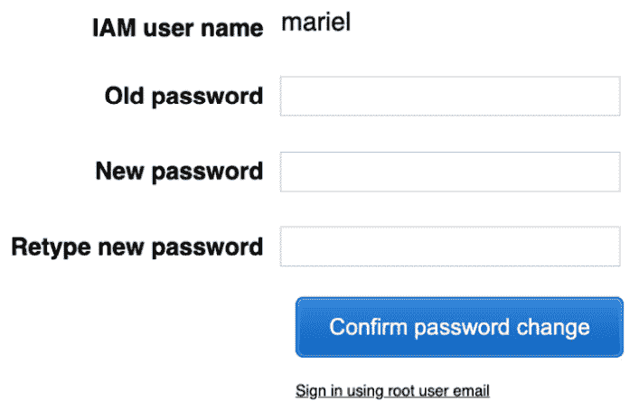

    图 8.6 – 开发者用户强制密码更改

1.  一旦您更改了密码，您将进入 AWS 管理控制台的主页。现在，我们需要在搜索框中输入 **IAM**，以进入 **IAM 服务**。

1.  一旦您进入了 IAM 服务，您会发现似乎没有权限进行任何操作。然而，这只是因为开发者角色的权限范围有限。这个用户可以列出用户并更新他们的用户信息。在左侧菜单中点击 **用户** 菜单项。

1.  进入用户菜单后，您将看到一列用户。点击我们创建的开发者的名字（在我们的例子中是 `mariel`）：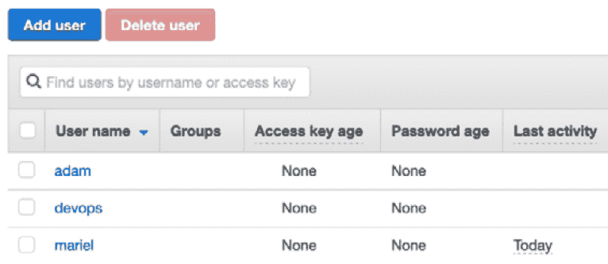

    图 8.7 – IAM 用户列表

1.  在用户的 **概览** 页面上，您会看到一些红框，但这里我们感兴趣的是 **安全凭证** 标签。点击此标签，您可以开始修改 **安全凭证** 页面：

    图 8.8 – IAM 用户概览顶部菜单

1.  向下滚动，确保 `SSH` **公钥** 不仅已准备好，而且已经复制到剪贴板，随时可以粘贴。点击 `SSH` **公钥** 按钮继续。

1.  当弹出窗口出现时，将您的公钥粘贴到文本框中，然后点击蓝色的`SSH``SSH` **密钥 ID** 列表。请注意这一点，因为我们接下来会用到这个 ID 来进行本地设置：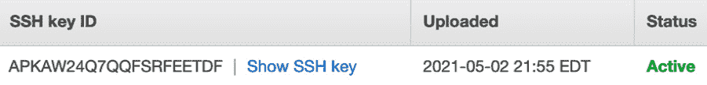

    图 8.9 – 一旦上传了 SSH 公钥，IAM 控制台将显示 SSH 密钥 ID

1.  返回到您的工作站，我们需要创建一个 `.ssh/config` 文件，或者通过添加几行与代码提交相关的内容来修改现有的 `config` 文件。使用您喜欢的编辑器创建或打开 `~/.ssh/config`，然后添加以下几行。确保将示例的用户 ID 替换为您在上传密钥后 AWS 控制台返回的 ID。另外，如果您为 `SSH` 密钥创建了不同的名称，您需要在 `IdentityFile` 行中替换成该名称：

    ```
    Host git-codecommit.*.amazonaws.com
    User APKAW24Q7QQFSRFEETDF
    IdentityFile ~/.ssh/cc_developer
    ```

1.  返回到浏览器和 AWS 管理控制台，我们现在将切换到 CodeCommit 服务，以便获取仓库信息并克隆该仓库。在顶部的搜索框中输入 `CodeCommit`，然后点击图标进入 **CodeCommit** 服务页面。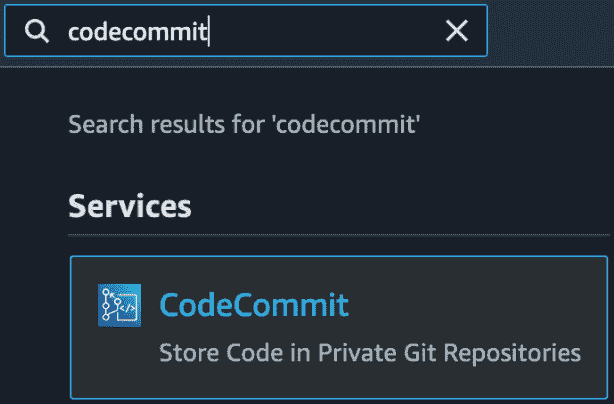

    图 8.10 – AWS 管理控制台搜索栏中的 CodeCommit 图标

1.  一旦在右侧的 `SSH` 链接上复制了 **克隆 URL** 属性：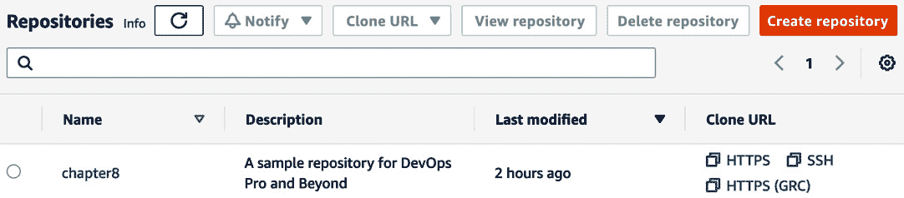

    图 8.11 - CodeCommit 仓库在开发者用户端的显示方式

1.  切换回终端，进入你的主文件夹根目录。然后，将复制的 URL 粘贴到 `git clone` 命令后，如下所示：

    ```
    $cd ~
    $git clone ssh://git-codecommit.us-east-2.amazonaws.com/v1/repos/chapter8
    ```

1.  最后，进入 `chapter8` 目录。现在，你准备好开始添加一些代码或对象了。

此时，我们已经创建了一个`SSH`密钥并将其添加到我们的开发用户中。然后，我们更新了本地的`SSH`配置，告知 CodeCommit 在处理代码提交时使用哪个用户和密钥对。最后，我们下载了管理员用户之前创建的仓库。现在我们准备创建开发者分支并开始提交一些更改。

## 创建开发者分支并将提交推送到该分支

现在我们已经成功将仓库克隆到本地工作站，接下来是创建一个分支并提交。所有这些操作将在你克隆仓库所在的目录中进行。如果你遵循了前面的命名约定，那么你应该进入你的主目录，并找到 `chapter8` 文件夹。

我们做的第一件事是从主分支创建一个特性分支：

```
$git checkout -b feature1
Switched to a new branch feature 1
```

现在我们已经在自己的分支中，可以开始添加一些文件来进行提交。GitHub 仓库的 `Chapter-8` 文件夹中有两个示例文件（`hello.py` 和 `loops.py`）。你可以查看这些文件，然后将原始内容剪切并粘贴到我们下载的 `chapter8` CodeCommit 仓库中新创建的同名文件中。

在我们进行提交之前，我们应该检查目录中文件的状态：

```
$git status
```

使用`status`命令后，我们应该看到类似以下的输出：

```
On branch feature1
No commits yet
Untracked files:
  (use "git add <file>..." to include in what will be committed)
 hello.py
 loops.py
nothing added to commit but untracked files present (use "git add" to track)
```

现在，我们需要将这两个文件添加到提交中。由于它们都是相同类型的文件，我们可以在提交命令中使用通配符。或者，你也可以使用纯粹的通配符，一次性将所有未跟踪的文件添加到提交中：

```
$git add *.py 
```

此时，我们需要将文件提交到我们的特性分支：

```
$git commit -m "adding python files for feature 1"
```

最后，将这两个文件提交到特性分支后，就可以将该特性分支推送到 CodeCommit：

```
$git push origin feature1
```

成功推送新特性分支后，你应该会从命令行收到确认信息：

```
* [new branch]      feature1 -> feature1
```

现在我们已经将提交推送到我们的功能分支，并上传到了 CodeCommit 仓库，接下来是发起合并请求。这个合并请求将允许我们的代码成为主分支的一部分，供其他所有使用相同代码仓库的开发者使用，同时保持与主分支同步。

我们将作为开发者用户返回到 AWS 控制台以创建拉取请求。如果你仍然打开着开发者的单独会话，可以切换回该浏览器会话；否则，请登录[`aws.amazon.com/`](https://aws.amazon.com/)，然后使用开发者的用户名（在我们的例子中是`mariel`）和你为开发者用户更改的新密码：

1.  在顶部的搜索框中，输入`CodeCommit`，然后点击**CodeCommit**图标，进入**服务**页面。

1.  你应该能看到你的仓库，如*图 8.7*所示。点击仓库名称（`chapter8`）。

1.  在顶部菜单中，你会看到一个下拉框，当前显示为**main**。点击该下拉框，选择你的分支（**feature1**）。完成后，你上传的两个文件将会显示出来。

1.  现在你在顶部菜单中看到了你的分支名称，应该会看到一个名为**创建拉取请求**的按钮。点击这个按钮开始合并请求：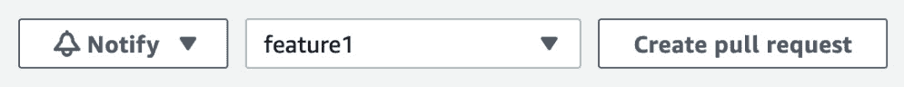

    图 8.12 – 创建拉取请求按钮与分支名称一起显示

1.  应该会出现一个绿色框，显示我们目前没有分支与主分支之间的冲突。在创建合并请求之前，你需要在`Python 文件`中添加一些内容。填写标题后，点击屏幕底部的橙色**创建拉取请求**按钮：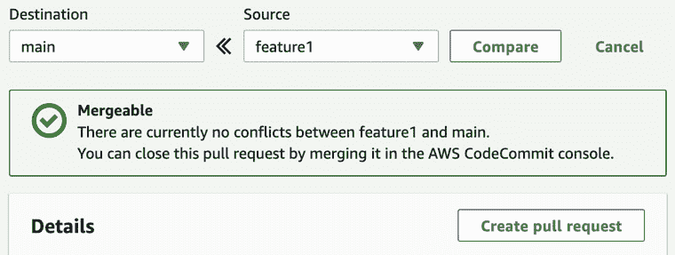

    图 8.13 – 显示没有冲突的拉取请求

1.  一旦你创建了拉取请求，系统将带你进入一个页面，在那里你可以查看当前打开的拉取请求的详细信息。

现在我们已经进入了拉取请求页面，这就是开发者用户停止的地方。我们分配的 IAM 策略不会允许他们合并分支，这是有意设计的。

接下来，使用我们的管理员身份，我们将学习如何将请求合并到主分支中。

## CodeCommit 中的审批

随着开发者更新代码并将这些更新推送到 CodeCommit 仓库，尤其是当他们使用自己的功能分支时，需要有一个过程将他们的更改合并到主分支中。让我们一起看看如何将开发者在分支上创建的代码合并到主分支。

## 将开发者分支与主分支合并

此时，我们还没有为仓库启用任何通知，但在实际情况下，这是一个很好的方法，用来添加通知，当有人创建拉取请求时。我们的开发者已经在仓库中创建了一个分支，现在可以进行合并。作为具有合并权限的帐户用户，我们将登录并合并功能分支和主分支：

1.  打开你的控制台，并以你到目前为止使用的主管理员用户登录**Amazon Web Console**，而不是开发者用户。

1.  在屏幕中间的顶部搜索栏中导航到 `CodeCommit`。一旦**CodeCommit**图标显示出来，点击它：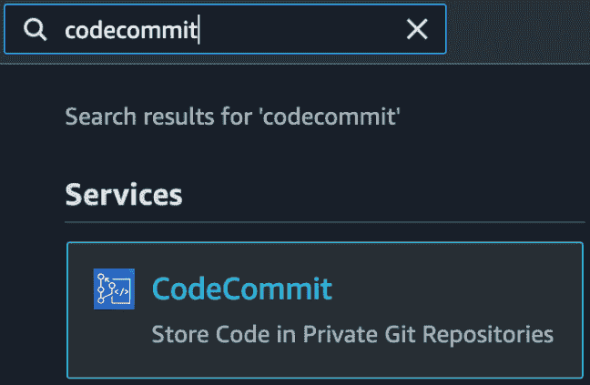

    图 8.14 – 在服务的顶部搜索框中搜索 CodeCommit

1.  一旦进入主 CodeCommit 屏幕，只要你处于正确的区域，你应该能看到我们之前由开发者用户创建的名为**chapter8**的仓库。点击此仓库名称，即可进入该仓库：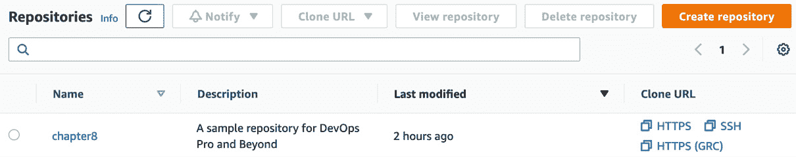

    图 8.15 – CodeCommit 中的 chapter8 仓库

1.  点击仓库名称后，屏幕左侧会出现一组菜单选项，位于**Repositories**下。这里，你会看到一个子标题叫做**Pull requests**，它会展示我们任何未完成的拉取请求，包括之前由开发者用户创建的那个。点击**Pull requests**菜单项，进入拉取请求屏幕：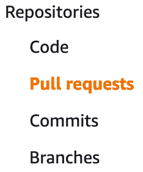

    图 8.16 – CodeCommit 仓库菜单中的拉取请求

1.  我们的拉取请求名称应该是**Python 文件**，并以数字 1 为前缀。**Python 文件**是我们的开发者用户在最初创建拉取请求时使用的名称。我们还应该在拉取请求名称的右侧看到蓝色状态标记**开放**。点击拉取请求名称**1：Python 文件**，进入**合并**屏幕：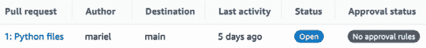

    图 8.17 – 带状态的拉取请求

1.  现在，在拉取请求屏幕上，屏幕顶部会显示**1：Python 文件**，在标题下方你应该能看到三个彩色标签：**开放**（蓝色），**无审批规则**（深灰色），以及**无合并冲突**（绿色）。后者表示我们可以轻松地将拉取请求合并到主分支。点击屏幕右上角的橙色**合并**按钮来完成此操作：

    图 8.18 – 关于 CodeCommit 拉取请求的通知

1.  目前，我们将进入**合并拉取请求**屏幕。这个屏幕主要是关于合并策略，但在这个练习中，我们将保持默认设置不变。包括保持底部勾选框，该框将删除被合并的分支，并使用快速前进合并策略。点击页面右下角的橙色**合并拉取请求**按钮，将功能分支合并到主分支。

1.  最后，你应该会看到屏幕顶部有一个绿色的通知，告诉你你的`feature1`分支已经合并到主分支。

我们刚刚彻底了解了 CodeCommit 服务，并从多个团队成员的角度看了如何进行提交和合并。整理好源代码后，我们将来看一个可以生成软件包和测试软件的 AWS 服务：AWS CodeBuild。

# 使用 AWS CodeBuild

当`buildspec`文件和任务启动时，CodeBuild 将分配指定的资源。

这与其他构建系统不同，在其他系统中，你需要手动为工作节点配置计算资源，或者执行复杂的设置，以确保在高负载构建和测试期间有自动扩展的环境可用。

你可以将 AWS CodeBuild 作为独立服务运行，或者将其与其他服务（如**CodeCommit**和**AWS CodePipeline**）集成，创建一个可重复的、自动化的过程，成为你持续集成生命周期的一部分。

## 了解 CodeBuild 的功能

以下是你应该了解的一些 CodeBuild 的功能：

+   **它是一个完全托管的构建服务**：无需设置、修补或更新任何服务器或软件。

+   **它可以根据需求进行扩展**：CodeBuild 能够根据你的需求进行自动扩展和收缩。

+   **它由 AWS 提供安全保障**：通过 KMS 支持的可选加密功能，以及通过 IAM 对特定任务的权限控制，你可以放心地确保你的构建环境的安全性。

+   它是 AWS 开发者工具之一，能够与 CodeCommit、CodeDeploy 和 CodePipeline 紧密集成。

+   CodeBuild 与**CloudWatch Events**原生集成，以便触发失败的构建和项目，例如发送 SNS 消息。

+   日志可以设置为输出到 S3 或**CloudWatch 日志**。

+   可以使用 CloudWatch 指标和警报来监控 CodeBuild 的阈值。

## 创建 CodeBuild 任务

CodeBuild 在执行任务时非常灵活。以我们的例子为例，我们将创建一个`buildspec`文件来创建一个 Docker 镜像，然后将该 Docker 镜像推送到 ECR：

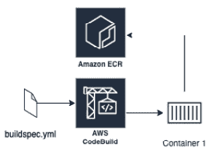

图 8.19 – 示例 CodeBuild 任务的布局

如果你还没有从本书的 GitHub 仓库下载`Chapter-8`文件，那么现在正是最佳时机，因为我们将在第一个 CodeBuild 练习中使用`docker`目录：

1.  导航到您下载 `Chapter-8` 文件的目录。不要进入 `docker` 目录，因为我们将使用递归命令一次性上传所有文件：

    ```
    $ aws s3 cp docker s3://{yourS3bucket}/docker/ --recursive
    ```

1.  首先，我们将创建我们的 ECR 仓库，以便容器在构建完成后有地方存放：

    ```
    $aws ecr create-repository \
        --repository-name chapter8
    ```

1.  创建了 ECR 仓库后，我们将打开 AWS 控制台，完成 CodeBuild 项目的其余部分。确保使用管理员用户而不是开发者用户进行此操作。一旦 AWS 控制台打开，搜索框中输入 `CodeBuild`，然后点击图标以进入 CodeBuild 服务。

1.  在 CodeBuild 服务中，点击右上角的橙色按钮，按钮上写着**创建构建项目**。

1.  为了创建我们的项目，我们将从初始部分开始：`chapter8_docker`

    b. `chapter 8 的一个示例构建`：

    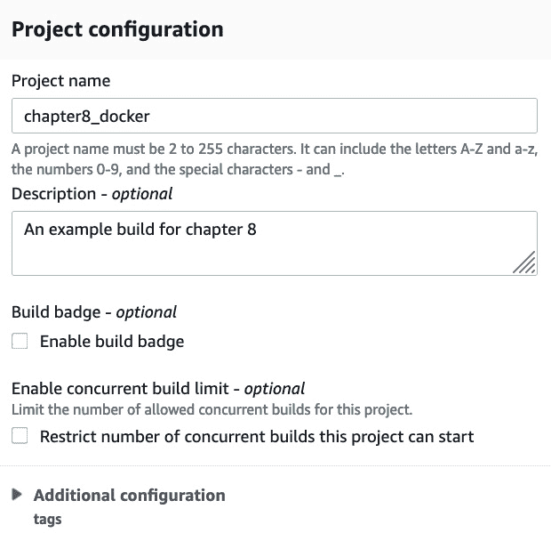

    图 8.20 – CodeBuild 创建构建项目页面上的项目配置

1.  接下来，我们将移动到 `devopspro-beyond`。最后，我们将提供请求的密钥，这是我们上传文件所在的文件夹。在我们的例子中，这将是 `docker/`。我们没有对存储桶进行版本控制，因此可以将此字段留空：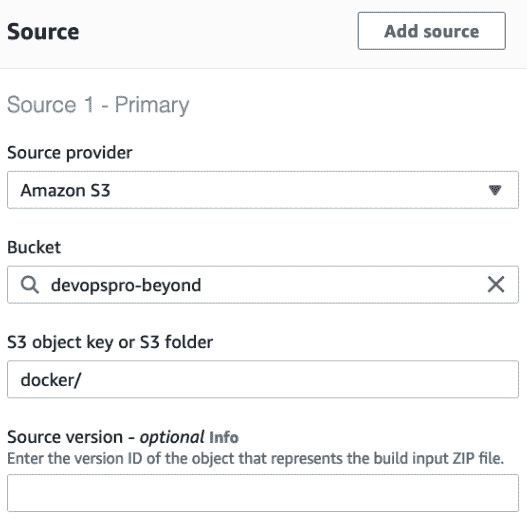

    图 8.21 – CodeBuild 项目中的源声明

1.  接下来，我们将进入

    b. `aws/codebuild/standard:5.0`

    e. **镜像版本**：**始终使用此运行时版本的最新版本**

    f. **环境类型**：**Linux**

    g. **服务角色**：**新建服务角色**

    注意

    对于 CodeBuild 项目中的镜像，我们在这里指定了版本 5.0。然而，您可能想查找 AWS 提供的最新版本。

1.  在这一点上，您可以将其余选项保持不变，滚动到页面底部，然后点击橙色的**创建构建项目**按钮。

1.  现在，您应该进入到构建项目的页面。顶部会看到一条绿色横幅，显示您的构建项目已创建：

    图 8.22 – 在 AWS CodeBuild 中创建的成功项目

1.  现在，我们可以尝试运行我们的任务，看看结果如何。如果您想运行任务并开始构建，请点击屏幕右上角的橙色**开始构建**按钮。

这只是一个基础项目，并不需要是停止点。如果我们愿意，仍然可以编辑任务和 `buildspec` 文件，向任务添加增强功能。

通过控制台使用 S3 存储桶作为源创建项目后，我们将仔细查看实际运行 CodeBuild 任务的文件：`buildspec` 文件。

## 构建 buildspec 文件

`buildspec` 文件是驱动 CodeBuild 过程的文件，并且有一些严格的要求：

+   它必须命名为 `buildspec.yml`，不能使用其他名称。

+   它必须位于源代码文件夹的 `root directory` 中。

+   它必须使用 YAML 语言。

如果你在完成前面的练习后打开 `buildspec` 文件进行检查，你会注意到它包含了三个主要部分：

+   **Version**：此字段告诉 CodeBuild 服务你正在使用的语法版本，它是少数几个必需的部分之一。

+   `Install`：此步骤仅用于在构建环境中安装软件包。如果你需要安装测试框架，例如 `pytest` 或 `Mocha`，可以在此步骤执行此操作。

    b. `pre-build`：这是在实际构建命令运行之前执行的命令。预构建命令可以包括登录到 `Build`：在此阶段，会运行一些构建命令、创建容器，或者执行测试软件的命令。

    d. `post-build`：一旦构建完成，这些是随后的命令，可以包括将软件打包成 `.jar` 或 `.war` 文件，或创建 Python 的 egg 文件。它甚至可能涉及将容器上传到 ECR 或 DockerHub 等仓库。

+   **Artifacts**：这是构建输出。这可以包括文件的名称、文件本身，或两者兼有。工件阶段还允许你保留文件创建时的目录结构，或者将其去除，仅保留文件本身。

根据你的使用场景，`buildspec` 文件中还提供了许多其他选项。你可以使用环境变量、生成报告，甚至以特定用户或 Linux 操作系统身份运行。完整选项列表，请参考 AWS 构建规范文档：[`docs.aws.amazon.com/codebuild/latest/userguide/build-spec-ref.html`](https://docs.aws.amazon.com/codebuild/latest/userguide/build-spec-ref.html)。

我们刚刚深入了解了如何构建 `buildspec` 文件以及它包含的组件。接下来，我们将重点讨论 CodeBuild 生成的工件，以及如何将它们导出并存储到其他地方。

## 存储 CodeBuild 工件

当你创建一个软件包时，可以让 AWS CodeBuild 自动将该工件保存到 S3 存储桶中，以便在部署过程中使用。

在 `buildspec` 文件中，如果你打算创建工件，你可以声明一个工件，也可以声明多个工件。在 *创建 CodeBuild 作业* 部分，`buildspec` 文件在最后声明了一个工件。

注意

虽然 CodeArtifact 的名称可能会让您认为可以在构建后自动存储 CodeBuild 构建产物，但实际上不能。CodeArtifact 可以与 CodeBuild 配合使用，提供语言包，就像 **NuGet**、**PyPi** 或 **npm 服务器** 在构建过程中提供的那样，帮助您的团队使用标准化的包，并避免来自公共服务器的下载限制。

## 使用 CodeBuild 进行测试

虽然人们首先想到使用 AWS CodeBuild 可能是为了创建用于部署的包和构建 Docker 容器，但这个服务还可以在软件开发生命周期（SDLC）过程中发挥双重功能，那就是进行测试。CodeBuild 允许您运行预定义的单元测试，并在控制台中查看图形和文本形式的报告，了解测试结果。

报告在创建后 30 天过期，一旦过期，您和任何有权限访问报告的人都无法查看报告。如果您需要将报告的结果保留超过 30 天，您可以选择将报告的原始结果导出到 S3 存储桶中，这样它们就不会过期，只会根据存储桶的生命周期策略逐步淘汰。

CodeBuild 支持以下测试报告文件格式：

+   Cucumber JSON

+   Junit XML

+   NUnit XML

+   TestNG XML

+   Visual Studio TRX

在您的 `buildspec` 文件中指定一个报告组名称，并提供关于测试用例的信息，如果尚未存在，CodeBuild 会为您创建一个报告组。

测试创建后，AWS CodeBuild 可以在控制台上显示报告，快速总结所有测试的状态。

## 通过 CodeCommit 触发 CodeBuild 作业

AWS CodeCommit 可以用作构建的输入源。CodeCommit 本身不能原生地向 CodeBuild 发出信号，告诉它已经收到新的提交或合并到分支中。然而，借助 Lambda 服务，您可以添加触发器来启动 CodeBuild 作业。

拥有像这样的自动化过程，无需手动干预，帮助团队更迅速地找到 bug 和已部署的软件。创建一个触发器，自动向 CodeBuild 项目发出信号启动构建，是为您的**软件开发生命周期**（**SDLC**）添加持续反馈的好方法：

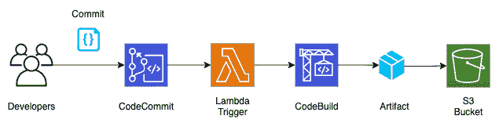

图 8.23 – 从 CodeCommit 触发 CodeBuild 作业

现在我们已经了解了如何使用 CodeCommit 服务自动启动 CodeBuild 作业，我们也知道如何在新代码成功合并到项目中时自动启动 CodeBuild 作业。

在下一章，*第九章*，*使用 CodeDeploy 和 CodePipeline 部署工作负载* 中，我们将学习如何使用 CodePipeline 服务启动来自 CodeCommit 的构建过程。

接下来，我们将了解 AWS CodeBuild 的一些高级功能。

## AWS CodeBuild 的高级功能

本节中我们将讨论的一些功能对于 DevOps 专业考试不是强制要求的。由于本书标题中有 *beyond*，以下是一些有助于让服务使用更便捷的功能。它们也是一些可以与团队成员和客户分享的好技巧。

### 使用 AWS Session Manager 帮助排查构建问题

如果你在排查构建问题时遇到困难，而不是寻找 `ssh` 进入基于 AWS 的 Docker 镜像会话管理器，AWS Session Manager 将允许你进入构建环境并尝试排查发生了什么。你可以通过在 `buildspec` 文件中添加 `codebuild-breakpoint` 来暂停构建：

```
phases:
  pre_build:
    commands:
      - echo Entered the pre_build phase...
      - echo "Hello World"> /tmp/test.txt
      - codebuild-breakpoint
```

完成故障排除后，你可以通过命令提示符传递 `codebuild-resume`，以便从 `buildspec` 文件中中断的位置继续。

# 总结

在这一章中，我们讨论了如何使用 AWS 原生的源代码工具 CodeCommit 让团队共享代码。我们还探讨了如何使用 CodeBuild 工具对软件进行打包、构建和测试。

在下一章中，我们将继续讨论 **AWS Developer Tools**。这包括使用 CodeDeploy 部署工作负载，然后通过 AWS CodePipeline 将一切串联起来。

# 复习题

1.  你被要求为你的组织设置一个 CodeCommit 仓库，供开发团队使用。开发人员需要能够将提交推送到他们的分支，但不能将提交合并到主分支，也不能将提交推送到主分支。项目经理还需要在合并或提交到主分支时收到通知。哪个步骤组合能以最短时间保护主分支并发送通知？

    为 CodeCommit 仓库附加一个资源策略，拒绝 IAM 开发者组成员对主分支执行推送提交、合并请求和添加文件的操作。

    b. 为开发者 IAM 开发者组附加一项 IAM 策略，拒绝其对主分支执行推送提交、合并请求和添加文件的操作。

    配置 AWS CloudTrail 将日志事件发送到 Amazon CloudWatch 日志。创建一个基于定义的度量标准过滤器的 CloudWatch 警报，以识别 CodeCommit 仓库事件。使用 SNS 主题作为目标，项目经理已订阅该主题以接收 CloudWatch 警报。

    d. 创建一个 Amazon CloudWatch Events 规则，该规则会在主分支的 CodeCommit 仓库状态更改事件触发时运行。使用一个项目经理已订阅的 SNS 主题作为目标。

    e. 创建一个 Lambda 函数，检查仓库的变更，如果发现变更，则将事件发送到项目经理已订阅的 SNS 主题。让 AWS CloudWatch Events 每 15 分钟运行一次 Lambda。

1.  你在账户中有一个 CodeCommit 代码库，开发者对该代码库有有限的操作权限。来自不同组织单元的两位新开发者需要访问这个 CodeCommit 代码库，但他们的用户位于不同的 AWS 账户中。授予这两位新开发者访问权限的最有效方式是什么？

    a. 为代码库启用公开访问权限。

    b. 为每个新开发者创建 IAM 用户，并授予他们对代码库的访问权限。

    c. 为外部开发者创建一个 IAM 组，添加 IAM 用户，然后为其提供对代码库的访问权限。

    d. 在你的账户中创建一个跨账户角色，为该角色分配必要的权限，然后将角色 ARN 提供给开发者，以便他们可以假设该角色。

1.  一位客户正在寻找一个新的代码版本控制服务，并且不再希望管理自己服务器的麻烦。目前，他的团队规模较小，预计在接下来的四个季度不会急剧增长，但他非常关注任何他考虑的服务是否具备加密功能。关于 AWS CodeCommit 如何保护对象和代码的加密能力，你能向他解释什么？

    a. 所有传输内容在传输过程中都是加密的，并且只能通过 HTTPS 或 `SSH` 协议进行。

    b. 通过 `SSH` 协议发送时，传输内容在传输过程中是加密的。

    c. CodeCommit 代码库会自动使用 KMS 进行加密。

    d. CodeCommit 代码库可以使用 KMS 进行加密。

1.  你正在设置一个新的构建过程，使用 S3 作为代码源。你希望对你和其他开发者之前创建并放置在名为 `test/` 的目录中的代码进行单元测试，该目录位于主源代码目录的子目录中。你计划在这个构建过程中工作 60 天，并希望能够查看历史的测试报告，甚至是第一次构建的报告。你如何通过原生 AWS 服务配置这一过程？

    a. 测试报告将在 `buildspec` 文件中提供。

    b. 在每次构建后将 CodeBuild 测试数据导出到 S3，并使用 AWS QuickSight 创建测试报告。

    c. 如果你在 `buildspec` 文件中指定了报告部分，则测试报告将可在控制台的 CodeBuild 部分的 Reports 选项卡中查看。创建一个 Lambda 函数，该函数由 CloudWatch 事件触发，导出从测试报告中获取的原始数据，并将其保存到 S3 存储桶中，供后续查看。

    d. 使用原生的 AWS 服务无法实现此操作。

# 查看答案

1.  b, d

1.  d

1.  a, c

1.  c
