# 第九章：使用 CodeDeploy 和 CodePipeline 部署工作负载

团队们正在寻找一种易于使用的工具，能够自动化发布过程，并提供一致的发布流程。我们将介绍如何将**CodePipeline**与第三方工具 Jenkins 结合，来自动化我们的部署发布周期，进而与**CodeDeploy**集成，实现实际的代码部署。

本章我们将讨论以下主要内容：

+   关于 AWS CodePipeline

+   设置代码管道

+   使用 Jenkins 构建工作负载

+   关于 AWS CodeDeploy

+   AWS CodeDeploy 使用案例

# 技术要求

如果你打算跟随本章中的练习进行操作，需要注意，前一章的内容 *第八章*，《使用 CodeCommit 和 CodeBuild 创建工作负载》是本章的前提。如同现实世界中一样，我们在前面章节中所做的工作基础上继续构建。因此，如果你没有在上一章创建开发者用户，你需要为该用户设置相应的**身份与访问管理**（**IAM**）权限。

# 关于 AWS CodePipeline

AWS CodePipeline 可以被看作是一个管弦乐团中的指挥。通过代码或 AWS 控制台，你可以将软件开发生命周期过程以可视化方式组织起来，过程可以是完全自动化的，也可以在某些阶段设置手动检查，确保每个阶段顺利通过。整个过程会以图形化的方式呈现给你的团队成员（包括开发者、测试人员和其他人员），让他们了解哪些部署成功，哪些部署失败。

AWS CodePipeline 帮助你自动化发布软件和基础设施更改的步骤，实现持续交付，如下图所示：

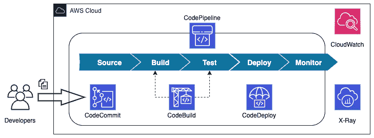

图 9.1 – CodePipeline 及其与其他 AWS 开发工具的集成

不同的 AWS 开发服务，其中 CodePipeline 是其中之一，如*图 9.1*所示，并展示在**系统开发生命周期**（**SDLC**）的各个阶段下。

## CodePipeline 动作结构

CodePipeline 结构包括几个不同的类别，允许原生 AWS 服务进行操作，或允许支持的第三方服务集成并执行必要的操作。

这里列出了六个有效的动作类别：

+   源

+   构建

+   测试

+   部署

+   审批

+   调用

每个动作类别都有一组可以调用动作或允许从该资源调用动作的提供者，如下表所示：

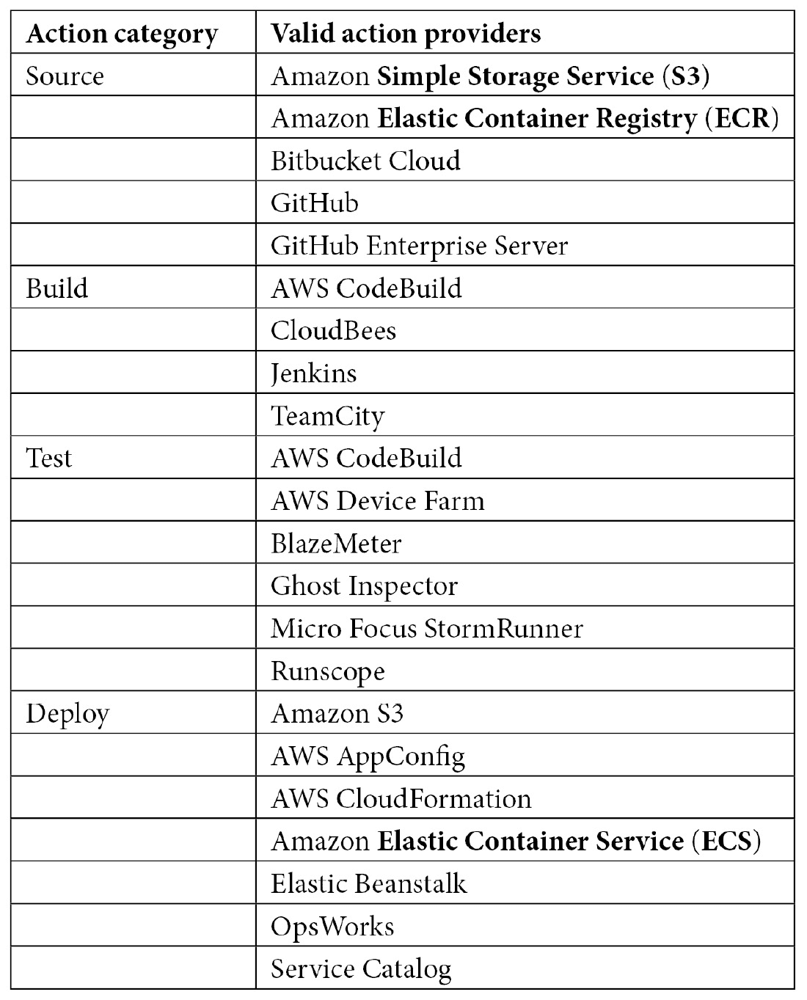

表 9.1 – CodePipeline 源动作和动作提供者

除了动作集成外，还有一些其他 AWS 服务无需特定的动作类别即可集成，具体如下：

+   **Amazon CloudWatch**：CloudWatch 可以监控使用管道构建的资源，或者监控正在测试并集成到管道中的资源。

+   **Amazon CloudWatch Events**：CloudWatch Events 可以检测整个管道的变化，甚至可以检测管道某些阶段的变化。CloudWatch Events 甚至可以监听其他外部服务，并在特定情境发生时触发 CodePipeline 运行，例如当有人更新了 CloudFormation 堆栈时。这时可能需要重新部署软件。

+   **AWS Cloud9**：Cloud9 是一种基于云的**集成开发环境**（**IDE**），可以通过网页浏览器访问。

+   **AWS CloudTrail**：如果 CloudTrail 服务在特定区域处于激活状态，任何通过 AWS 控制台、**软件开发工具包**（**SDK**）或**命令行接口**（**CLI**）进行的**应用程序编程接口**（**API**）操作都会被捕获并记录。

+   **AWS KMS**：**密钥管理服务**（**KMS**）可以与 AWS CodePipeline 集成，用于源 S3 存储桶和工件，这些存储桶和工件要么是加密的，要么需要加密。假设工件来自与执行 CodePipeline 的帐户不同的帐户，那么加密该存储桶和对象的密钥将需要是客户管理的密钥。

从*表 9.1*中可以看到，既有原生的 AWS 服务，也有您可能已经在使用的第三方合作伙伴工具，这些工具可以集成到您的代码管道阶段中。

我们刚刚查看了不同的操作以及相应的 AWS 服务和第三方服务，这些服务可以帮助执行这些操作。接下来，我们将看看一些 AWS CodePipeline 的使用案例，包括真实世界的使用案例。

## AWS CodePipeline 的使用案例

在考虑使用 CodePipeline 能做什么时，有一些特定场景已经确定 CodePipeline 作为工具是最合适的选择。接下来我们将看看这些场景中的一些。

### 自动化您的构建和发布过程

CodePipeline 允许开发人员专注于他们正在编写的代码，然后将代码提交到 Amazon 托管的代码库或第三方代码库，如 GitHub 或 Bitbucket Cloud。开发人员推送的新代码提交将触发构建过程。

### 为开发人员创建一致的工具集

在组织中让新开发人员快速上手并提高生产力的最具挑战性部分之一是入职过程。CodePipeline 通过提供一致的工具集来帮助这个过程，无论团队成员位于哪个时区，或使用什么操作系统。

### 使用 CodePipeline 与第三方提供商集成

假设你的团队当前使用像 Jenkins 这样的第三方工具进行代码构建或测试，BlazeMeter 进行负载测试，或 StormRunner 进行测试过程，那么 CodePipeline 可以帮助将所有这些工具统一协调展示。

使用一个服务账户从 CodePipeline 服务中调用，而不是每个个人或团队请求自己的许可证，也可能会带来成本节约的好处。

### 使用 Elastic Beanstalk 和 CodePipeline 持续部署你的 Web 应用程序

尽管 Elastic Beanstalk 常被认为是一个帮助开发者快速启动代码、并且接触较少 AWS 基础设施的服务，但这些代码可以成为组织中的成功项目。集成 CodePipeline 使得不再依赖于 Elastic Beanstalk CLI 或在 AWS 管理控制台中追踪部署，而是采用一种更结构化、可追踪的方式。

现在我们已经检查了一些 CodePipeline 成功使用的不同场景，接下来我们可以进入实际操作示例。在这里，我们将按照步骤设置我们自己的 AWS CodePipeline，并利用 CodeCommit 仓库。

# 设置代码管道

体验 AWS CodePipeline 的最佳方法之一是通过设置代码管道的练习。通常，这些管道的设置工作会由指定工具的团队成员完成。这些**工具**团队成员拥有与开发人员不同的独特权限集。

我们需要设置工具团队组并为他们分配正确的权限集。之后，我们可以创建工具团队成员并将其关联到工具团队 IAM 组。然后，我们可以以该工具团队成员身份登录，并让他们构建管道。

## 在设置管道之前创建我们的代码库

在设置我们的代码管道之前，我们将先创建一个全新的 CodeCommit 仓库。事先创建仓库将使我们能够拥有一套新的代码，用来执行管道中的各个步骤。

在我们 GitHub 仓库的`chapter9`部分，会有一个名为`code`的文件夹。这个文件夹将包含我们需要上传到即将创建的 CodeCommit 仓库的源代码，具体步骤如下：

1.  打开浏览器，访问 AWS CodeCommit 首页，[`console.aws.amazon.com/codesuite/codecommit/home`](https://console.aws.amazon.com/codesuite/codecommit/home)，如果出现提示，请登录。

1.  点击屏幕右上方的橙色**创建仓库**按钮。

1.  在`chapt9`中设置仓库名称。我们将添加描述，说明这个仓库是用于`CodePipeline`的，以便与在上一章节中创建的`chapt8`仓库区分开来，后者是作为测试创建的，参见*第八章*，*使用 CodeCommit 和 CodeBuild 创建工作负载*，如以下截图所示：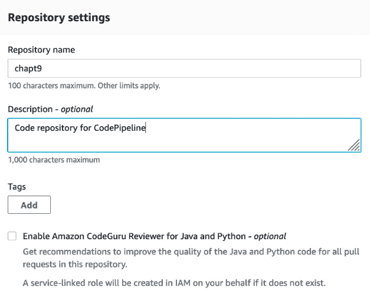

    图 9.2 – chapt9 仓库的 CodeCommit 仓库设置

1.  点击橙色的**创建**按钮。

1.  由于我们已经在*第八章*中创建了一个可以上传文件的用户，*使用 CodeCommit 和 CodeBuild 创建工作负载*，现在只需点击左侧菜单中的**Repositories**（仓库）菜单项，如以下截图所示。这样就会显示我们在 CodeCommit 中的所有仓库名称，并允许我们复制需要的链接，以便将仓库克隆到本地工作站：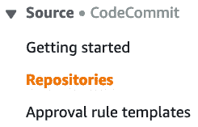

    图 9.3 – CodeCommit 的侧边菜单，仓库部分高亮显示

1.  现在，点击`chapt9`仓库右侧的`SSH`链接，如以下截图所示。此时会弹出一个小对话框，确认该链接已被复制，你可以准备将仓库克隆到本地工作站：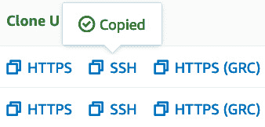

    图 9.4 – 已复制到剪贴板的 SSH 克隆统一资源定位符（URL）

    此时，我们暂时完成了 AWS 控制台的操作，接下来将切换到本地工作站的终端，进行下一组命令操作。

1.  现在，打开终端，进入到你的主目录根目录。在 Linux 系统中，你可以通过`$cd ~`命令快速进入该目录。接下来，执行以下命令将仓库克隆到本地。现在，我们可以使用剪贴板中的 URL 来克隆仓库：

    ```
    $ git clone ssh://git-codecommit.us-east-2.amazonaws.com/v1/repos/chapt9
    ```

    一旦你成功克隆了仓库，你应该会收到一条确认消息，表示你已经克隆到一个空的仓库。

1.  尽管我们有一个空的代码库，我们将从 GitHub 仓库的`/code`目录中获取示例代码，然后将其复制（或者如果你不希望在本地机器上有两个代码副本，可以选择移动）到这个新的本地`CodeCommit`仓库，这样我们就可以将其推送到`CodeCommit`。

    确保你从已经克隆了 GitHub 示例代码的目录开始，如以下代码片段所示：

    ```
    $ cp -R * ~/chapt9/
    ```

    如果你不想通过命令行复制文件，也可以使用文件资源管理器（File Explorer）或 Finder，将文件复制到新的 git 仓库中。

1.  现在我们已经将文件复制到`CodeCommit`本地目录中，接下来我们需要将所有文件添加到提交中。添加文件并编写`commit`消息后，我们将文件推送到代码库。我们可以通过几个简单的命令完成这一切。首先，我们需要从克隆的示例代码所在的目录切换到本地`CodeCommit`代码库，如下所示：

    ```
    $ cd ~/chapt9
    ```

1.  由于我们当前在本地目录中，我们现在可以添加所有文件并将其推送到远程的`CodeCommit`代码库。我们通过使用`git add`、`git commit`和`git push`命令来完成，操作如下：

    ```
    $ git add * 
    $ git commit -m "adding sample code to CodeCommit"
    [master (root-commit) f85e8f2] adding sample code to CodeCommit
     2 files changed, 52 insertions(+)
     create mode 100644 buildspec.yml
     create mode 100644 src/app.py
    $ git push 
    Enumerating objects: 5, done.
    Counting objects: 100% (5/5), done.
    Delta compression using up to 8 threads
    Compressing objects: 100% (4/4), done.
    Writing objects: 100% (5/5), 825 bytes | 825.00 KiB/s, done.
    Total 5 (delta 0), reused 0 (delta 0), pack-reused 0
    To ssh://git-codecommit.us-east-2.amazonaws.com/v1/repos/chapt9
     * [new branch]      master -> master
    ```

现在，示例代码已经准备好，我们可以继续进行下一步，即创建工具团队成员。我们的工具团队成员是专注于创建和管理管道及流程的人，而不仅仅是编写代码的人。

## 创建我们的工具团队成员

就像我们之前创建了开发组和成员一样，我们也需要为工具团队成员做同样的事情。重要的是要区分团队成员的职责，并只赋予每个人执行其工作职责所需的权限。在创建工具成员之后，我们将以该工具团队成员的身份登录，然后运行名为`pipeline1.yml`的 CloudFormation 模板来构建管道。

让我们继续设置工具团队成员的组，如下所示：

1.  打开你的终端并输入以下命令，以便我们创建新的组：

    ```
    $aws iam create-group --group-name Tools
    ```

    运行命令后，你应该看到类似下面的确认信息：

    ```
    {
        "Group": {
            "Path": "/",
            "GroupName": "tools",
            "GroupId": "AGPAW24Q7QQFSHYZHE6N6",
            "Arn": "arn:aws:iam::470066103307:group/tools",
            "CreateDate": "2021-05-14T01:25:58+00:00"
        }
    }
    ```

    注意返回的组名称对应的 ARN。你需要将其保存到记事本中，或者滚动到上方进行复制和粘贴，方便我们下一步将创建的策略附加到该组时使用。

1.  接下来，我们需要使用预先制作的策略文档来创建策略，该文档应该已从 GitHub 仓库的`Chapter9`文件夹中下载，文件名为`IAM_Tools.json`，如下所示：

    ```
    JSON after creation, as in the following statement:

    ```

    {

    "Policy": {

    "PolicyName": "Tools_Members",

    "PolicyId": "ANPAW24Q7QQF6FPOCHV5V",

    "Arn": "arn:aws:iam::470066103307:policy/Tools_Members",

    "Path": "/",

    "DefaultVersionId": "v1",

    "AttachmentCount": 0,

    "PermissionsBoundaryUsageCount": 0,

    "IsAttachable": true,

    "CreateDate": "2021-05-16T19:32:41+00:00",

    "UpdateDate": "2021-05-16T19:32:41+00:00"

    }

    }

    ```

    ```

1.  创建策略后，我们将把策略附加到组中，操作如下：

    ```
    policy-arn field use the value which was returned to you in step 1:

    ```

    --policy-arn arn:aws:iam::470066103307:policy/Tools_Members \

    --group-name tools

    ```

    If the policy attachment is successful, then there will be no confirmation message. 
    ```

1.  现在我们已经创建了`tools`组，可以创建一个用户成为工具团队成员。这个工具团队成员将是我们用于创建实际代码管道的用户。让我们继续创建我们的新用户，如下所示：

    ```
    aws iam create-user --user-name peter 
    ```

1.  现在，我们可以将新用户添加到`tools`组中，使其拥有该组的权限，如下所示：

    ```
    aws iam add-user-to-group --user-name peter --group-name Tools
    ```

1.  就像我们在*第八章*中创建的开发者用户一样，*使用 CodeCommit 和 CodeBuild 创建工作负载*，我们需要为工具用户设置一个初始密码，该密码将在第一次登录时由用户重置，具体如下：

    ```
    aws iam create-login-profile --user-name peter --password Dev0psPRO --password-reset-required
    ```

到此为止，我们已经创建了工具用户，并且准备好以工具用户身份登录 AWS 控制台，搭建 AWS 管道。

## 创建管道

在创建了我们的工具用户（在我们这个例子中是 Peter）后，我们将从使用 AWS CLI 切换到浏览器和管理控制台，并假装这些操作是由工具用户执行的。在开始之前，你需要确保从本书的 GitHub 仓库中的`Chapter9`文件夹下载`pipeline1.yml`文件。

打开一个新的浏览器窗口，不带有任何 cookie 或会话，这样我们就可以作为 Peter 登录 AWS 控制台。你可能需要打开一个隐身窗口或使用一个不同的浏览器。例如，如果你一直在 Chrome 中使用管理员权限，则可以在 Firefox 或 Edge 中打开一个新会话，按以下步骤操作：

1.  使用你的账号号码或账号别名以及用户名称`peter`和我们之前创建的`Dev0psPRO`密码，登录 AWS 控制台。

1.  系统会立刻提示你更改用户`peter`的密码。将此密码更改为你喜欢的任何密码，但请记下或者设置一个你能记住的密码，因为你可能需要稍后访问此用户。以下截图显示了该过程：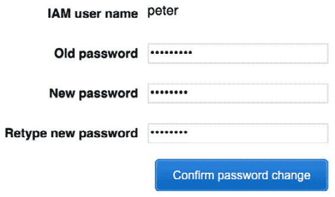

    ](img/Figure_9.5_B17405.jpg)

    图 9.5 – 工具用户 peter 的密码更改

1.  更改密码后，AWS 控制台将带你进入主控制台页面。使用顶部的统一搜索框搜索**CloudFormation**服务。服务出现后，点击服务图标，进入主 CloudFormation 页面，如下图所示：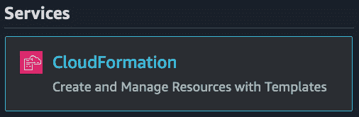

    ](img/Figure_9.6_B17405.jpg)

    图 9.6 – CloudFormation 服务图标

1.  在主**CloudFormation**服务页面上，点击橙色的**创建堆栈**按钮。

1.  在**创建堆栈**页面，使用以下选项：

    a. **准备堆栈**—确保选中**模板已准备好**

    b. **指定模板**—选择标有**上传模板文件**的复选框

1.  然后，点击`pipeline1.yml`文件并打开它。选中文件后，点击屏幕底部的橙色**下一步**按钮，如下图所示：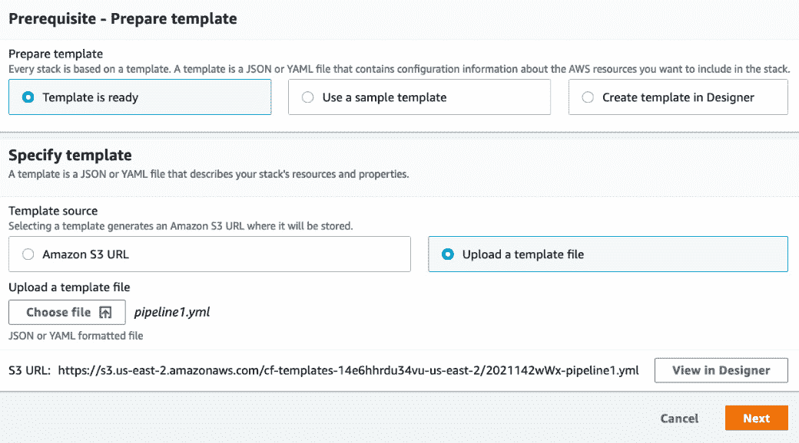

    ](img/Figure_9.7_B17405.jpg)

    图 9.7 – 创建 CodePipeline 堆栈

1.  一旦点击`C9-demo`并输入你希望接收堆栈通知的电子邮件地址。你可以将电子邮件地址留空，或者输入你自己的电子邮件地址。如果你创建的分支名为`main`，则无需做任何更改；但是，如果你创建的分支名为`master`（如我们的示例），则需要在`master`中更改默认值，然后再继续，否则管道将无法立即执行。填写完这些值后，点击屏幕底部的橙色**下一步**按钮，如下图所示：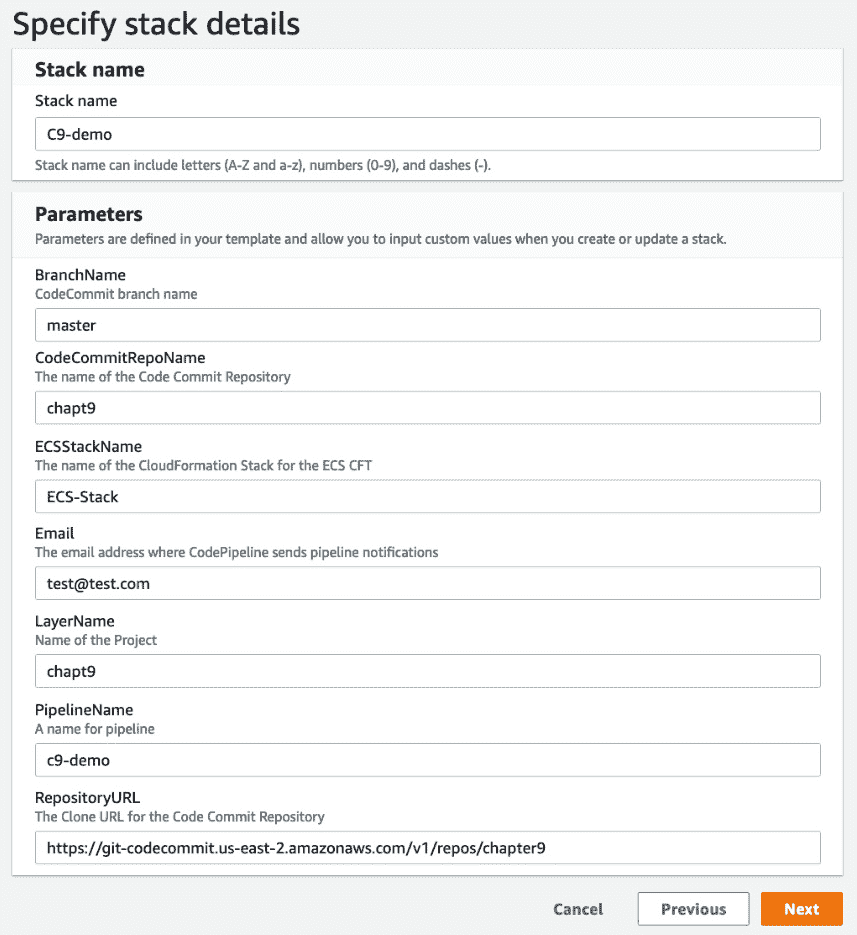

    ](img/Figure_9.8_B17405.jpg)

    图 9.8 – 添加值到指定堆栈详细信息屏幕

1.  在**配置堆栈选项**屏幕上，我们不会添加任何标签。只需滚动到页面底部，点击橙色的**下一步**按钮。

1.  现在，在**审查 C9-demo**页面上，滚动到页面底部，并勾选蓝色区域中的框，确认该堆栈将创建一个 IAM 角色，在**功能**标题下显示。勾选框后，你可以点击橙色的**创建堆栈**按钮，如下图所示：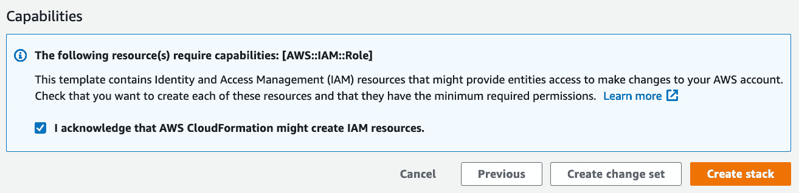

    ](img/Figure_9.9_B17405.jpg)

    图 9.9 – 在审核中的“功能”部分检查确认信息

1.  一旦点击，你将被带到`CREATE_IN_PROGRESS`状态，直到我们的代码管道创建完成。完成后，我们就可以继续进行下一步了。

1.  在 CloudFormation 过程完成后，我们将能够返回统一搜索栏，搜索`CodePipeline`服务。一旦**CodePipeline**的图标出现，如下图所示，点击它即可进入当前的管道：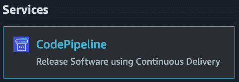

    ](img/Figure_9.10_B17405.jpg)

    图 9.10 – 从统一搜索栏中的 CodePipeline

1.  你应该能够看到刚刚创建的管道，名称为`C9-demo`。点击此名称查看管道的详细信息。

我们可以从我们创建的管道中看到，现在已经创建了一个包含三个阶段的管道：**源**、**构建**和**部署**。在部署阶段包含了集成过程，包括手动审批流程，以及 CloudFormation 创建过程。

注意

如果你没有完成前面的练习，即创建名为`chapt9`的 CodeCommit 仓库，那么你将遇到管道问题。这个`chapt9`仓库是我们 AWS 代码管道的代码源。如果你将仓库命名为其他名称，你需要修改 CloudFormation 模板，或者进入 AWS 控制台修改源阶段。

现在，随着我们构建了 AWS 代码管道，我们可以继续让我们的开发者测试提交，并查看管道在实际操作中的各个阶段，就像它在现实生活中运行一样。然而，在此之前，我们需要为开发者用户提供更多的 IAM 权限，因为他们在最初创建时，只拥有 CodeCommit 权限并且只能修改自己的密码。

## 更新我们的开发者用户

在上一章，*第八章*，*使用 CodeCommit 和 CodeBuild 创建工作负载*，我们为开发者创建了一个用户组。我们为他们提供了一组权限，限定在 AWS CodeCommit 和 CodeBuild 服务内。由于现在我们要加入 CodePipeline 和 CodeBuild，因此我们需要扩展他们的权限，以便他们也能使用这些服务。在 GitHub 的 `Chapter9` 仓库中，有一个名为 `IAM_Developers.json` 的文件——请务必下载该文件，以便更新开发者的权限。在更新命令时，您需要使用管理员用户。我们将按以下步骤进行：

注意

在执行这些命令之前，请确保您已经从 GitHub 仓库的 `Chapter9` 文件夹下载了 `IAM_Developers.json` 文件，并且位于下载该文件的同一目录下。

1.  我们需要做的第一件事是找到附加到开发者的策略的 ARN。我们在 *第八章*，*使用 CodeCommit 和 CodeBuild 创建工作负载* 的练习中创建了该策略。登录到终端并运行以下命令，提取开发者组的 ARN：

    ```
    aws iam list-policies --query 'Policies[?PolicyName==`CC_Developers`].Arn' --output text
    ```

    执行此命令后，我们应该会得到当前用于 Code Commit 开发者组的 ARN 返回结果。接下来，我们将在下一步中使用该 ARN 更新我们的策略。

1.  在获得 ARN 后，我们可以创建一个新的策略版本，并将该版本设置为`默认`，如下所示：

    ```
    aws iam create-policy-version \
    --policy-arn arn:aws:iam::470066103307:policy/CC_Developers \
    --policy-document file://IAM_Developers.json --set-as-default
    ```

    如果成功，我们将返回一个**JavaScript 对象表示法**（**JSON**）消息，显示我们现在正在使用策略的第二个版本，如以下代码片段所示：

    ```
    {
        "PolicyVersion": {
            "VersionId": "v2",
            "IsDefaultVersion": true,
            "CreateDate": "2021-05-16T19:01:09+00:00"
        }
    }
    ```

更新我们的开发者用户组，以允许访问 CodePipeline，允许开发者查看之前创建的管道，并查看在管道各个步骤中可能遇到的错误。这些权限的范围被限制为不允许开发者创建或修改任何新的或现有的管道。

## CodePipeline 概念

使用 AWS CodePipeline 时，需要了解几个基本概念和术语，如下图所示：

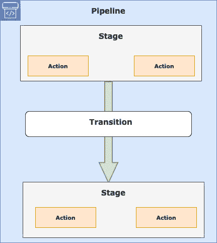

图 9.11 – CodePipeline 转换表示

### 理解 CodePipeline 和阶段需求

在开始构建管道时，有一些规则和要求是应该了解的，因为这有助于你避免在调试错误时遇到麻烦。请查阅接下来的清单，了解最佳实践，并记住考试时的知识点：

+   管道中的所有阶段名称必须是唯一的。

+   只有管道中的第一个阶段可以包含源操作。

+   一个管道必须至少包含两个阶段。

+   单个阶段中的所有操作必须是唯一的。

+   阶段的输入操作必须与前一阶段的输出操作完全匹配。

+   输出工件名称必须在管道中唯一。如果某个阶段的输出工件名为`TestPackage`，则该管道中的其他阶段不得有名为`TestPackage`的输出工件。

+   对于所有支持的操作类型，唯一有效的所有者字符串是`AWS`、`ThirdParty`或`Custom`。

有其他更复杂的要求；然而，如果你理解了这些要求，那么你就为使用 CodePipeline 服务打下了坚实的基础，并且对 DevOps 专业考试中的阶段细节有了深入理解。

现在我们已经整体了解了 AWS CodePipeline 中的各个阶段，让我们来看看一个未被自动化的方面：审批操作。

## CodePipeline 中的审批操作

在 CodePipeline 中，可以在阶段之间使用审批操作进行暂停。审批操作允许在继续进入管道的下一个阶段之前，手动审核操作。

经审核人批准的操作将进入管道的下一个阶段。如果审批被拒绝，则管道不会继续到下一个阶段。你也有 7 天时间来批准管道操作，否则管道将失败。

在 AWS CodePipeline 中使用审批操作的常见原因如下：

+   在进入下一阶段之前，进行手动**质量保证**（**QA**）测试

+   在继续之前，允许进行代码审查或变更管理审查

+   允许在发布到生产环境之前手动审核网页

# 使用 Jenkins 构建你的工作负载

AWS 提供的开发者工具几乎可以为你提供所有所需的功能，而无需额外的配置或设置。有些情况下，团队已经围绕现有工具构建了部分**持续集成/持续部署**（**CI/CD**）流程，并且可能希望保留已经投入时间和精力精细化的部分工作。

使用 Jenkins 服务器的团队可以属于这种情况之一。借助其庞大的插件生态系统，Jenkins 能够为 CI/CD 流程提供极大的功能支持。

许多团队在 CI 过程的构建阶段使用 Jenkins，因为在 Jenkins 中，构建步骤可以通过 Shell 脚本来实现，无需创建额外的`buildspec`文件。

下图展示了 Jenkins 与 CodePipeline 一起使用的情况：

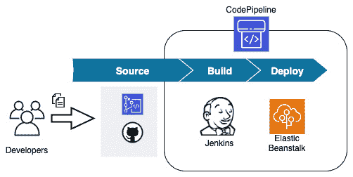

图 9.12 – Jenkins 与 CodePipeline 一起使用

Jenkins 本身有插件，可以与许多 AWS 服务兼容，包括开发者服务套件。

现在我们已经了解了 CodePipeline 服务，包括如何将 Jenkins 构建服务器等第三方工具集成进来，接下来看看如何使用 AWS CodeDeploy 部署我们的工作负载，不论是单独部署还是作为管道的一部分。

# 关于 AWS CodeDeploy

AWS CodeDeploy 是一个帮助自动化将应用程序代码和文件部署到 EC2 实例、本地服务器、Lambda 函数和运行在 AWS ECS 上的容器的服务。

CodeDeploy 是一个服务，它使以下事项变得更加简便：

+   更新 Lambda 函数并创建新版本。

+   在应用程序部署期间避免停机

+   快速发布新功能

+   在部署失败的情况下，及时回滚到已知的良好版本。

AWS CodeDeploy 专注于以下三个平台的部署：

+   EC2/本地实例

+   Lambda 函数

+   ECS 容器化应用程序

使用这三个平台作为基础，你需要在名为 `appspec` 的文件中描述你的部署。这个文件可以使用 JSON 或 **YAML Ain't Markup Language**（**YAML**）格式编写。

CodeDeploy 可以分发多种类型的文件和组件，包括以下内容：

+   可执行文件

+   包

+   脚本

+   多媒体文件

现在我们已经掌握了 CodeDeploy 的基础知识，接下来看看在使用 CodeDeploy 服务时需要理解的基本概念。

## 需要理解的基本 CodeDeploy 概念

当我们开始使用 CodeDeploy 服务时，有一些组件需要首先理解。

### 应用程序

这是一个唯一的名称，CodeDeploy 使用它来标识你想要部署的应用程序。它使用这个唯一名称来确保在特定部署过程中引用的是正确版本的部署、部署组、修订版或回滚。

### 计算平台

这是 CodeDeploy 实际部署应用程序的平台。CodeDeploy 部署有很多选择。只要满足操作系统要求，部署可以发生在 EC2 实例或本地服务器上。这些部署可以包括配置文件、镜像、可执行文件及其他类型的文件。

CodeDeploy 还可以用于更新 Lambda 函数。CodeDeploy 还具备将流量从一个版本的 Lambda 函数转移到新版本的能力，支持多种部署选项，包括 **金丝雀**、**线性** 和 **一次性全部部署**。

如果你在 ECS 平台上使用容器，则可以使用 CodeDeploy 来更新任务，采用 **蓝绿部署** 策略，首先安装新版本的任务集，然后将流量切换到任务集的最新版本。与 Lambda 部署一样，这些部署可以采用金丝雀、线性或一次性方式进行。

### 部署配置

使用一组成功或失败标准以及部署规则，CodeDeploy 会根据每次部署的部署配置来进行引导。在部署配置中，特别是在 EC2 或本地部署的情况下，你可以设置成功的最小健康实例数量，以确保部署成功。如果你部署的是 Lambda 应用程序或 ECS 任务，则可以在部署配置中指定流量在部署过程中如何路由。以下是可用的部署方式：

+   **金丝雀**：流量分两次进行转移，并且你可以指定在第一次转移前初始转移的流量百分比，剩余流量会在指定的分钟数后进行转移。

+   **线性**：流量按相等的增量进行转移。你可以预定义可以转移的百分比和转移之间的时间间隔。

+   **一次性**：所有流量会同时从原始的 Lambda 函数或 ECS 任务转移。

### 部署组

部署组适用于 EC2 实例，无论是单独的还是在**自动扩展组**（**ASGs**）中，并且会明确标记用于指定部署目标。

部署组可以简单地通过一个标签来指定部署组，或者你可以通过在一个部署组中使用多达 10 个标签来进行更复杂的配置。

### 部署类型

部署类型是 CodeDeploy 用来将最新版本的应用程序部署到部署组中的技术。有两种不同类型的部署方式：**就地部署**和**蓝绿部署**。

在就地部署中，虽然可能更具成本效益，但部署组中当前实例上的应用程序会被停止，同时安装最新版本的应用程序。新版本的应用程序会重启并进行验证。就地部署仅适用于 EC2 实例或本地部署。

蓝绿部署会配置一组新的资源。这可以包括创建新的 Lambda 函数版本，ECS 中创建新的任务集，或者在 EC2 中创建新的实例。

蓝绿部署不适用于本地部署。

### 修订版

AWS Lambda 部署的修订版是一个 YAML 或 JSON 格式的文件，包含有关要部署的 Lambda 函数的信息。Lambda 的修订版存储在 S3 存储桶中。

对于 EC2 或本地部署修订版，这不仅仅是一个文件，而是一个包含组件（如网页、可执行文件、源代码和部署脚本）的文件集合，以及应用程序的规范，然后将其打包成归档格式。EC2 或本地实例的修订版可以存储在 S3 存储桶或 GitHub 仓库中。

### 目标修订版

这是已经上传到代码仓库中的应用程序的最新版本，将被作为目标进行部署。

## 安装 CodeDeploy 代理文件

当使用 CodeDeploy 与 EC2 实例时，代理文件会被放置在这些实例上，使得实例能够从 CodeDeploy 服务进行部署。同时，配置文件也会被放置在实例上，并且该文件指定了代理如何工作。这些实例不仅必须在 AWS 云中，还可以位于本地数据中心的特定操作系统上。

查看以下列表，了解哪些操作系统已经使用 AWS CodeDeploy 代理进行过测试：

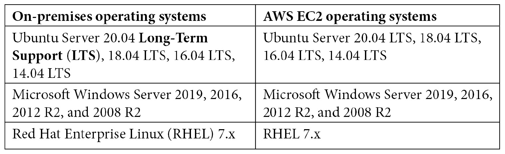

表 9.2 – 测试过的操作系统，用于使用 AWS CodeDeploy 代理

任何你希望与 CodeDeploy 一起使用的 EC2 实例，也需要附加一个服务角色，以授予它足够的权限，以便 CodeDeploy 服务能够执行其职责。

## 理解 appspec 文件

应用程序规范文件，或者通常所说的 `appspec` 文件，在大多数情况下是一个 YAML 文件（虽然它也可以格式化为 JSON 格式），它有特定的几个部分，以及一些可选的部分，具体取决于你要执行的部署类型。

`appspec` 文件详细说明了在部署过程中你希望执行的部署操作。

如果你正在为容器做 ECS 部署、为 EC2 或本地实例部署，或者试图部署到 Lambda 实例，那么 `appspec` 文件有不同的类型。

以下是一个 `appspec` 文件的示例：

```
version: 0.0
Resources:
  - myLambdaFunction:
      Type: AWS::Lambda::Function
      Properties:
        Name: "myTestFunction"
        Alias: "myTestFunctionAlias"
        CurrentVersion: "1"
        TargetVersion: "2"
Hooks:
  - BeforeAllowTraffic: "LambdaFunctionToValidateBeforeTrafficShift"
  - AfterAllowTraffic: "LambdaFunctionToValidateAfterTrafficShift"
```

在我们示例中的 `appspec` 文件中，重要的项目包括版本、资源和钩子。

## 部署回滚和内容重新部署

AWS CodeDeploy 可以回滚一个已经被手动停止或在部署过程中失败的部署。严格来说，这些回滚是新的部署，并且会接收新的部署**标识符**（**ID**）。回滚确实会恢复一组代码的先前版本。回滚可以通过自动回滚或手动过程两种方式进行。

### 自动回滚

您的部署组可以配置为在部署失败时或在部署过程中达到某些监控阈值时自动回滚。如果设置了其中一个阈值并在部署过程中触发了自动回滚，那么部署将回到上一个已知的良好配置。

您还可以选择在开始新的部署时，通过配置部署组的高级配置选项来覆盖先前设置的自动回滚选项。

### 手动回滚

即使您没有设置自动回滚部署，使用 AWS CodeDeploy，您仍然可以推出之前版本的部署。这将创建一个新的部署版本。如果您的部署失败，或者实例进入未知状态，您可以通过推送应用程序和配置更新来修复它们。

### 回滚和重新部署工作流

如果回滚是自动或手动触发的，那么 CodeDeploy 将开始尝试删除在部署过程中成功安装的所有文件。

清理文件（如果存在）是一种日志文件，CodeDeploy 会保存它，以便知道哪些文件已被安装，并在开始新的部署之前删除这些文件。

在部署过程中，CodeDeploy 代理会记录正在部署的文件名，以便在需要回滚时有记录。

在回滚的情况下，CodeDeploy 会参考清理文件，以便知道需要删除哪些文件。然后，它可以在自动回滚的情况下继续执行之前的版本部署。

现在了解了部署和回滚的工作原理，让我们来看一下 AWS CodeDeploy 的一些使用案例。

# AWS CodeDeploy 的使用案例

在我们了解了 AWS CodeDeploy 服务之后，让我们思考一些在什么情况下该服务最适合我们使用。

## 将应用更新部署到本地数据中心的服务器

如果您的本地硬件上运行的是兼容的操作系统，则可以使用 AWS CodeDeploy 来协调部署，并通过单一界面查看成功和失败。安装 AWS CodeDeploy 代理是必要的前提条件。这些操作系统包括 Windows Server、Ubuntu Server 或 RHEL。

## 将应用更新部署到 AWS 云中的 Windows 或 Linux 服务器

如果您正在将应用程序部署到 Linux EC2 实例上的 NGINX 或 Apache 服务器，或 Windows 服务器上的 **Internet Information Services** (**IIS**) 实例，则可以使用 CodeDeploy 代理来协调文件的放置，并重新启动任何需要更新文件的服务。

## 使用一次部署推送将应用更新部署到多个区域

当您寻找一种方法来构建解决方案，以在多个区域中为部署创建自动化**端到端**（**E2E**）发布流程时，AWS CodeDeploy 可以通过 AWS CodePipeline 的帮助来实现此目标。在尝试保持 Lambda 部署以实现**高可用性**（**HA**）或**灾难恢复**（**DR**）策略时尤为如此。在以下图表中，您可以看到 CodeDeploy 被用来在多个区域进行部署：

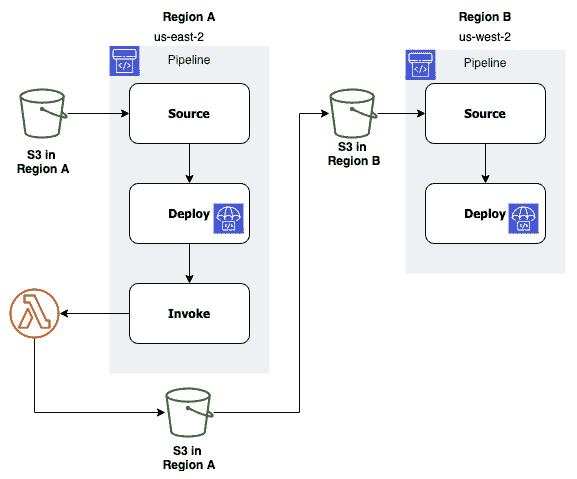

图 9.13 – 使用 CodePipeline 和 CodeDeploy 进行多区域部署

使用 S3 作为源代码的起点将通过 AWS 代码流水线启动部署。如果流水线成功，则它将进入一个调用阶段，其中 Lambda 函数将源代码复制到复制区域的 S3 存储桶中。

将源代码复制到**B**区域的 S3 存储桶将在第二个区域设置的另一个流水线上重新启动该过程。

## 以蓝/绿方式将新任务部署到 ECS

CodeDeploy 可以让您无缝切换网络或应用负载均衡器后面的任务集。它通过部署任务集的新版本，然后在负载均衡器级别切换监听器到新版本来实现这一点，如以下图表所示：

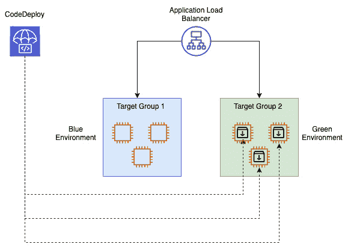

图 9.14 – 使用 CodeDeploy 进行蓝/绿部署

注意

我们将更深入地探讨*第十三章*，*蓝绿部署*。

## 在将任务部署到 Amazon ECS 并在切换流量之前使用 Lambda 进行验证

使用 CodeDeploy 部署组以及 Lambda 函数的帮助，您可以创建一个测试，以确保新任务成功运行。这个 Lambda 函数可以在部署`appspec`文件中指定，如果验证失败，则部署将停止并回滚。如果验证成功，则继续部署。

## 监控 CodeDeploy 作业

无论您的 CodeDeploy 作业是作为 CodeDeploy 服务的独立运行还是作为部署流水线的一部分运行，监控它们的状态并在发生故障时及时通知，对于及时解决问题至关重要。

将 CodeDeploy 与 CloudWatch 的监控功能结合使用，可以在部署过程中监控特定的指标。利用这些指标，您可以创建 CloudWatch 警报。最多可以将 10 个 CloudWatch 警报与一个 CodeDeploy 部署组关联。触发任何一个警报将导致部署停止，并且部署状态将显示为 `Stopped`。为了使用 CloudWatch 服务监控 CodeDeploy，您必须授予 CodeDeploy 服务角色权限以使用 CloudWatch 服务。

CloudWatch 事件可以帮助不仅检测，而且根据您创建的规则反应 CodeDeploy 作业的故障。一旦创建了这些规则，CloudWatch 事件将启动针对特定目标的动作。以下目标将与来自 CodeDeploy 作业的规则的 CloudWatch 事件配合使用：

+   AWS **Lambda** 函数

+   Kinesis 流

+   Amazon **简单队列服务** (**SQS**) 队列

+   **CloudWatch** 警报动作

+   Amazon **简单通知服务** (**SNS**) 主题（和通知）

### CodeDeploy 监控用例

如果您的团队使用 Slack 作为通讯渠道，那么您可以通过 Lambda 函数集成 Slack 通知，每当 CodeDeploy 部署失败时。

如果在部署过程中发生特定事件，可以使用 CloudWatch 警报动作以编程方式重启、停止或终止 EC2 实例。

现在我们已经了解了如何监控我们的 CodeDeploy 部署，让我们回顾一下本章中学到的内容。

# 总结

在本章中，我们介绍了将要深入探讨的其他 AWS 开发者工具。我们了解了如何使用 AWS CodeDeploy 将软件部署到不同的环境，包括云端和本地环境。我们研究了如何使用 CodeDeploy 不仅推送应用程序的新版本，还能在部署过程中控制流量。我们还学习了 AWS CodePipeline 编排工具，它作为一项服务，不仅能够整合我们从开发角度看到的其他三个服务，还能整合其他第三方合作伙伴工具。

在下一章中，我们将介绍 AWS OpsWorks 服务，以及它如何帮助通过堆栈管理基础设施和应用服务，尤其是当您的团队成员熟悉 Chef 或 Puppet 时。

# 复习问题

1.  一家公司的开发团队成员进行了多次部署。最后一次部署覆盖内容失败。您被要求回滚到之前的正常版本，并且包含应用程序所需的所有文件。您会选择哪种方式来尽可能迅速地完成此任务？

    a. 手动回滚到最后一个已知的应用版本，并添加修订所需的文件。

    b. 手动回滚到上一个部署版本，然后手动添加应用程序修订所需的文件。

    c. 自动回滚到最后一个已知版本，并添加应用程序修订所需的文件。

    d. 自动回滚到最后一个已知的应用版本，并手动添加应用程序修订所需的文件。

1.  你已经构建了一个执行代码发布过程的 AWS 代码管道。这个管道有两个阶段：源阶段和部署阶段。源阶段使用第三方提供商 GitHub 来提供部署所需的代码。AWS CodeDeploy 被用来将新版本的应用程序部署到目标组中的多个 EC2 实例。最近的几次部署都没有成功，且在 CodeDeploy 阶段出现了失败。你需要增加监控和通知的能力，以缩短平均修复时间（MTTR）。如何在检测到问题时尽快创建通知？

    a. 为 CodeDeploy 和 CodePipeline 设置 CloudWatch 事件。使用 Amazon Inspector 创建评估目标来评估代码部署问题，并创建一个 SNS 主题，以便在发生部署问题时能够收到通知。

    b. 为 CodeDeploy 和 CodePipeline 设置 CloudWatch 事件。使用 AWS Lambda 函数帮助评估代码部署问题，并创建一个 SNS 主题，以便在发生部署问题时能够收到通知。

    c. 为管道运行所在的区域设置一个新的 AWS CloudTrail 路径。使用 AWS Config 来评估任何代码部署问题，并创建一个 SNS 主题，以便在发生部署问题时能够收到通知。

    d. 设置一个新的 AWS CloudTrail 来捕获来自 CodeDeploy 和 CodePipeline 的 API 事件。使用 AWS Lambda 函数帮助评估代码部署问题，并创建一个 SNS 主题，以便在发生部署问题时能够收到通知。

# 审查答案

1.  d

1.  b
