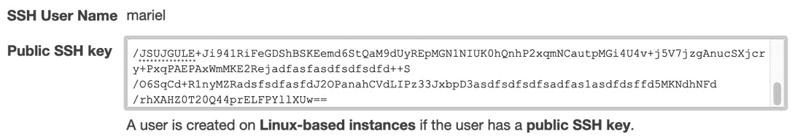
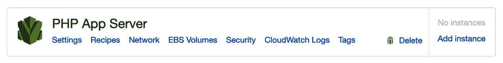

# 第十章：使用 AWS OpsWorks 管理和部署您的应用堆栈

如果您的运营团队已经使用 Puppet 或 Chef 管理基础设施和应用，那么您应该已经听说过 OpsWorks。我们将查看堆栈如何使用预定义的代码为您创建基础设施应用，甚至是数据层。需要对应用进行更新？我们也会讨论这个问题。

本章我们将涵盖以下主要内容：

+   OpsWorks 基础

+   可用的 OpsWorks 平台

+   OpsWorks 与 Chef Automate

+   创建和部署食谱

# 技术要求

虽然不是必需的，但熟悉 Chef 或 Puppet 平台会在阅读本章时有所帮助。您需要了解完整堆栈应用的不同组件及它们之间如何相互作用。

# OpsWorks 基础

在 *第七章*，*使用 CloudFormation 模板部署工作负载* 中，我们介绍了 **基础设施即服务**（**IaaS**）的 **Amazon Web Services**（**AWS**）提供的服务。现在我们将看看 AWS 提供的 **平台即服务**（**PaaS**）之一——OpsWorks。

OpsWorks 本质上是 Chef 和 Puppet 自动化包的封装。为什么要使用 OpsWorks？以下要点概述了您选择将 OpsWorks 作为客户或企业解决方案的原因：

+   **简单**：OpsWorks 使用简单。

+   **高效**：OpsWorks 通过使用脚本化配置帮助减少错误。

+   **灵活**：使用 OpsWorks 可以简化任何规模的部署。

+   **强大**：OpsWorks 有助于减少部署时间和部署成本。

+   **安全**：OpsWorks 服务允许细粒度的访问控制。

    重要提示

    OpsWorks 是少数不需要特定区域的服务之一。它是一个全球服务，显示所有已创建的堆栈，无论您的云资源当前所在的区域是哪个。

如果您的团队精简，负责所有或大部分组件，OpsWorks 特别有用：


图 10.1 – OpsWorks 从应用中为用户提供服务

通过一系列事件，您可以使用 AWS OpsWorks 构建和管理您的应用：


图 10.2 – OpsWorks 操作概览

首先，您需要为您的应用创建一个堆栈。多个应用可以共存于同一个堆栈中，它们应该都是同一系统的组件，例如 LAMP 堆栈、Rails 部署，或甚至是单层或双层应用。

其次，在您的堆栈被配置后，您需要定义您的层。在 LAMP 堆栈的情况下，这些层包括带有 PHP 页面和 MySQL 数据存储的 Apache Web 服务器。

第三，你将通过代码版本库和部署代码（如 Puppet 清单或 Chef 配方）来定义你的应用程序。

第四，必须定义 EC2 实例的数量和大小，以便为我们的应用提供一个部署位置。

最后，在第五步中，我们需要为不同的层选择一个部署策略。这个策略可以根据你是进行手动部署还是自动化部署而有所不同。

## 了解 OpsWorks 的组件

当我们开始讨论 OpsWorks 时，理解一些特定的关键词将是至关重要的。现在让我们看看构成 OpsWorks 各个部分的组件。

### 堆栈

**堆栈**表示你希望管理的云基础设施和应用程序。

你不能在一个堆栈中混合使用 Windows 和 Linux 实例。不过，你可以在同一个堆栈中运行不同版本的 Linux。

你的堆栈可以包含自定义的**亚马逊机器映像**（**AMIs**），只要映像所基于的操作系统是支持的操作系统之一。OpsWorks 不支持自定义 Windows AMIs。

### 层

**层**定义了如何设置和配置一组实例，以及相关的资源。OpsWorks 中的每个堆栈都包含一个或多个层。你可以把层看作是 OpsWorks 用来配置一组或多组 EC2 实例的蓝图。

在层级中，你可以定义如何配置实例，安装哪些软件包，以及定义在生命周期中会发生的关键事件。

在 OpsWorks 中，你可以定义几种不同类型的层：

+   负载均衡器层。

+   数据库层。

+   应用服务器层。

+   自定义 OpsWorks 层（当没有预定义的层能满足你的需求时）。

+   其他层：Linux 堆栈可以创建用于监控的 Ganglia 层，或者用于缓存的 Memcached 层。

### 实例

OpsWorks 中的实例包括计算资源，如 EC2 实例或本地服务器。

用户可以通过两种方式将实例添加到 OpsWorks 堆栈中：

+   你可以使用 OpsWorks 来配置实例。

+   对于基于 Linux 的堆栈，你可以注册一个已创建的 EC2 实例或本地服务器，这样就能让 OpsWorks 管理这个实例。

AWS OpsWorks 支持 AWS EC2 平台上几种操作系统的 64 位版本，包括 Ubuntu、Amazon Linux 以及 Windows Server。

### 应用

在 OpsWorks 中，**应用**表示你想应用于应用服务器的代码。代码本身将存储在应用程序库中，如 GitHub 或 S3。当你部署应用时，OpsWorks 会触发一个部署事件。

## OpsWorks 中的生命周期事件

在 OpsWorks 管理的实例生命周期中，会发生五个系列的事件。这些事件如下：

+   设置

+   配置

+   部署

+   卸载

+   关闭

让我们更详细地看看一些事件：

+   **设置**：每次实例启动时都会触发此事件。它还用于软件包的初始安装。

+   **部署**：此事件在部署新软件版本时触发。部署事件还允许进行可定制的软件部署。

+   **配置**：当实例发生状态变化时，所有实例都会触发配置事件。此事件用于确保所有实例的配置是最新的。

## OpsWorks 中的访问管理

如果你需要为每个用户提供访问实例的权限，无论是 Linux 还是 Windows 实例，那么 OpsWorks 可能是你在寻找的解决方案。AWS OpsWorks 服务提供了一种简单的方法，让用户可以使用自己的凭证登录到服务器，而无需使用自定义脚本。

如果你曾经创建过 EC2 实例并尝试通过 SSH 访问，那么你很可能会使用 EC2 用户或 Ubuntu 用户，具体取决于你用来配置实例的操作系统类型。如果你希望自定义用户能够访问单个 EC2 实例，那么这可能会变成一个复杂的设置，需要为每个用户配置并通过 LDAP 或 Active Directory 服务器进行身份验证。

如果你在 AWS 上分配 Windows 服务器，也是如此。你需要使用创建实例时所用的密钥对，然后使用该密钥对解密管理员密码。

重要说明

所有 AWS OpsWorks 堆栈的用户必须来自**身份与访问管理**（**IAM**）用户。

OpsWorks 让你可以为用户提供快速、轻松访问堆栈中实例的权限，而无需设置 Active Directory 或 LDAP 服务器。

### OpsWorks 中的用户类型

AWS OpsWorks 服务中有两种类型的用户：管理员用户和常规 OpsWorks 用户。

OpsWorks 中的常规用户不需要附加策略或任何特殊的 OpsWorks 权限。根据每个堆栈，你可以指定以下四个权限中的一个或多个：

+   **查看**：此权限允许用户仅查看堆栈。

+   **部署**：部署权限还包括查看权限，并为用户添加额外的权限，以便更新和部署应用程序。

+   **管理**：管理权限包括部署权限，并增加了堆栈管理权限，例如添加层或实例。

+   **拒绝**：拒绝权限用于在堆栈中拒绝特定权限。

### 将用户导入到 OpsWorks

在我们迄今为止执行的所有操作中，我们已经在使用的帐户中创建了多个 IAM 用户。我们将在下一次练习中使用这些用户来练习将用户导入到 OpsWorks 中：

1.  以管理员用户身份登录到 AWS 终端。

1.  登录后，在顶部搜索框中导航到`OpsWorks`。一旦**OpsWorks**出现，点击**OpsWorks**图标进入**OpsWorks**服务：

    图 10.3 – AWS 控制台顶部搜索栏中的 OpsWorks 服务

1.  即使导入用户后，他们出现在 OpsWorks 服务的任何一个部分，我们还是将用户导入到**OpsWorks Stacks**中。点击右下角的蓝色按钮，该按钮标记为**前往 OpsWorks Stacks**。

1.  现在，在 OpsWorks Stacks 服务中，查看左侧菜单，找到名为**用户**的菜单项。点击**用户**，进入**用户**管理界面：

    图 10.4 – OpsWorks Stacks 侧边菜单栏中的用户菜单项

1.  在主窗口面板中，在任何现有用户下方，找到标记为**导入 IAM 用户到 US East（俄亥俄州）**的链接。点击该链接进入导入页面。

1.  一旦点击此链接，新的菜单将会出现，允许你选择要导入到 OpsWorks 的用户。选择一个或多个你想要导入到 OpsWorks 的用户，然后点击蓝色的**导入到 OpsWorks**按钮：

    图 10.5 – 在 OpsWorks 服务中选择要导入的用户

1.  现在，我们应该可以看到已导入到 OpsWorks 中的用户列表。如果我们想添加更多用户或限制他们的权限（例如，给予某个用户自我管理的权限以添加自己的 SSH 密钥，或更改自己的密码），我们可以通过编辑该用户来做到这一点。让我们编辑一个用户。点击开发者 Mariel 旁边的编辑链接。

1.  在另一个终端窗口中，打印出你之前为*第八章*中的练习所创建的开发者公钥的内容，*创建使用 CodeCommit 和 CodeBuild 的工作负载*。将此公钥复制到剪贴板，以便在下一步中使用：

    ```
    $cat ~/.ssh/cc_developer.pub 
    ```

1.  切换回 AWS 控制台，现在在用户 Mariel 的屏幕上，向下滚动，直到你看到位于**公钥 SSH**左侧的多行文本框。将你之前复制的公钥粘贴到此框中：

    图 10.6 – 将开发者的公钥添加到 OpsWorks 用户

1.  添加公钥后，我们的开发者可以使用以下方式登录到实例：

    ```
    $ ssh -i ~/.ssh/cc_developer mariel@INSTANCE-DNS
    ```

我们现在已经完成了将之前创建的 IAM 用户导入到 OpsWorks 的练习，并且设置了开发者之前创建的 SSH 密钥，以便他们可以使用自己的用户名轻松登录到 OpsWorks 实例。

接下来，我们将探讨一些你可能希望使用 OpsWorks 服务的场景。

# AWS OpsWorks 的使用案例

看完这一部分，你可能会想，怎样的情况适合将这个服务投入实际使用。我们将探讨几个场景，详细说明在何种情况下使用 OpsWorks 服务是有意义的。你需要明白，在评估测试题目或实际场景时，OpsWorks 是 AWS 提供的一系列部署和管理工具中的一种。Elastic Beanstalk 也是一个可以用来配置、部署和管理实例和代码的工具。我们将在下一章 *第十一章* 中更深入地讨论 *使用 Elastic Beanstalk 部署你的应用程序*。

# 可用的 OpsWorks 平台

OpsWorks 本质上是一种配置管理服务，提供受管的 Chef 和 Puppet 实例。这两种软件包都是行业认可的自动化平台，可以让你通过代码和自动化配置服务器。

现在，让我们更深入地了解 OpsWorks 提供的三种平台。

## OpsWorks Stacks

OpsWorks 的最初服务提供形式是 OpsWorks Stacks。通过使用层，它帮助你管理和组织 EC2 实例。

## OpsWorks for Chef Automate

如果你的团队熟悉 Chef 食谱的创建，并且知道如何使用 Chef 的一些高级功能，如 Knife，但又不想处理维护自己的 Chef 服务器的麻烦和头痛问题，那么 Chef Automate 可以成为你团队的合理选择。

如果你当前使用 Chef 管理一些本地基础设施，OpsWorks for Chef Automate 可以被配置为从单一来源管理混合环境。

OpsWorks for Chef Automate 还具有执行合规性扫描的功能。这些合规性扫描允许你定期审计应用程序，以检测漏洞和不符合要求的配置。

你无需担心 Chef 服务器的补丁、更新或备份问题，因为这些正是 OpsWorks 为你处理的任务之一。OpsWorks for Chef Automate 还允许你通过 Chef 控制台或通过命令行工具 Knife 来管理 Chef 实例。

## OpsWorks for Puppet Enterprise

Puppet 帮助通过其工具集强制执行基础设施的期望状态。

如果你是现有的 Puppet 用户，那么 OpsWorks for Puppet Enterprise 将是最合适的选择。使用 OpsWorks for Puppet Enterprise，你可以在几分钟内启动一个 Puppet 主服务器，然后让 OpsWorks 服务处理诸如备份、软件升级和恢复等操作任务。

使用 OpsWorks 的 Puppet Enterprise 版本时，Puppet 主服务器将为需要运行 **Puppet Agent** 的实例提供并配置所有 Puppet 模块。

现在我们已经查看了 OpsWorks 的不同选项，包括两个基于 Chef 食谱的选项，以及一个基于 Puppet 清单的选项。接下来，我们将查看一个快速示例。这个示例将帮助我们更好地理解当我们在为客户选择最佳解决方案时，OpsWorks 的不同组件如何协同工作，同时也有助于我们准备 *DevOps 专业考试*。

# 创建并部署一个食谱

在这个示例中，我们将使用 OpsWorks 来设置一个 stack，并创建一个层。在我们创建好层之后，将使用一个公开的食谱将其部署到我们的应用程序：

1.  作为管理员用户登录到 AWS 控制台，并使用统一搜索框搜索 `OpsWorks` 服务。当你看到 OpsWorks 图标出现时，点击图标进入 **OpsWorks** 主页面：

    图 10.7 – 通过统一搜索框访问 OpsWorks 服务

1.  在 OpsWorks Stacks 页面上，点击左下角的蓝色 **前往 OpsWorks Stacks** 按钮。这是 OpsWorks 的原始提供选项：

    图 10.8 – OpsWorks 服务页面上的 OpsWorks Stacks 选项

1.  一旦进入 OpsWorks Stacks 页面，点击页面右上方的蓝色 **创建 stack** 按钮。此时将开始创建一个新的 OpsWorks stack。

1.  接下来，我们将创建一个名为 `Chef-11` 的 stack，并选择以下选项：

    +   `chapt-10`

    +   `美国东部 (俄亥俄)`

    +   `11.10`

    +   `是`

    +   `Git`

    +   **仓库 URL** – [`github.com/amazonwebservices/opsworks-example-cookbooks.git`](https://github.com/amazonwebservices/opsworks-example-cookbooks.git)

1.  保持其他设置不变。

1.  点击蓝色的 **添加 Stack** 按钮。

1.  请参见下图：

    图 10.9 – 添加选项以创建 stack

1.  现在我们应该看到一个 **恭喜！您的 stack 已创建** 的通知。接下来的步骤是向我们的 stack 中添加一个层。我们可以点击 **添加一个层** 链接并点击添加层：

    图 10.10 – 显示添加层链接的恭喜横幅

1.  现在在层的页面上，我们将从下拉列表中选择 **PHP 应用服务器**。选择后，我们可以点击蓝色按钮 **添加层**：

    图 10.11 – 在 OpsWorks 中添加层

1.  有了我们的层，接下来需要向该层添加一个实例。在 **PHP 应用服务器** 页面上，我们需要点击最右侧的 **Add instance** 链接：

    图 10.12 – 在 OpsWorks 中显示我们创建的层

1.  现在，使用以下信息添加实例：

    `php-app1`

    `c5.large`

    **子网** – （保持选定的默认子网）

    当你填写完所有这些选项后，点击选择窗口右下角的蓝色 **Add Instance** 按钮：

    

    图 10.13 – 向 OpsWorks 层添加实例

1.  添加实例后，您可以启动实例。您会注意到在屏幕上该实例类型被指定为 24/7 实例。点击 **Actions** 列下的 **start** 链接来启动实例。

1.  大约一分钟后，实例状态应从 `stopped` 或 `booting` 变为 `online`。

恭喜，你现在已经成功启动了堆栈！

现在我们已经了解了如何创建 OpsWorks 堆栈，包括其层、实例和应用，接下来我们将更详细地了解 OpsWorks 中的部署。我们将继续使用我们刚刚创建的堆栈，利用该堆栈创建一个应用并将其部署到堆栈中。

# OpsWorks 中的部署

当你在 OpsWorks 中部署应用时，其主要目的是将应用代码和所有文件部署到服务器实例上。我们之前在 OpsWorks 中创建了一个堆栈、一个层和一个实例。现在我们将添加一个应用并将其部署到堆栈中：

1.  返回到 OpsWorks 控制台并进入我们之前创建的堆栈——命名为 `chapt-10`。你可以通过点击堆栈名称进入该堆栈。

1.  进入堆栈后，在左侧菜单中点击名为 **Apps** 的项，进入应用页面。在该页面顶部，点击蓝色的 **Add App** 按钮以创建一个新的应用：

    图 10.14 – OpsWorks 左侧菜单中的应用和部署

1.  使用以下值来填充你的应用：

    +   `SampleAPP`

    +   `PHP`

    +   `Git`

    +   **仓库 URL** – [`github.com/awslabs/opsworks-demo-php-simple-app.git`](https://github.com/awslabs/opsworks-demo-php-simple-app.git)

    其他所有值可以留空。在填写完这些值后，点击屏幕底部的蓝色 **Add App** 按钮：

    

    图 10.15 – 添加应用设置

1.  您现在应该看到一个显示我们应用程序的屏幕。现在是时候使用 OpsWorks 部署应用程序了。OpsWorks 通过在应用程序右侧的**Actions**列下方直接提供**deploy**链接来简化这一过程。点击**deploy**链接开始部署过程：

    图 10.16 – 应用程序创建后，已准备好部署

1.  在部署屏幕上，在您部署之前，点击当前已选择**Deploy**的下拉菜单，查看所有不同的部署选项。在这一部分，您不仅可以部署应用程序，还可以让 OpsWorks 撤销部署、回滚、启动或停止 Web 服务器。确保保留部署设置，并保持所有默认选项。然后点击屏幕底部的蓝色**Deploy**按钮。

我们刚刚使用自定义配方完成了应用程序的配置，并将该应用程序部署到我们之前创建的实例上。

# 监控 OpsWorks

您可以通过多种方式监控您的 AWS OpsWorks 堆栈：

+   使用 Amazon CloudWatch

+   使用 Amazon CloudWatch Logs

+   使用 Amazon CloudWatch Events

+   使用 Amazon CloudTrail

使用 Amazon CloudWatch，有 13 个自定义指标用于详细监控堆栈中每个实例的状态。OpsWorks 中还创建了一个自定义监控页面，总结了这些数据，并使这些指标易于理解。如果您运行的是 Windows 实例，监控页面将不会显示这些 Windows 实例的指标。指标将显示整个堆栈的数据，但您也可以专注于特定的层或特定的实例。

如果您仍在运行上一个练习中的部署，您可以点击**Monitoring**菜单图标，进入仪表盘。这将为您提供关于应用程序状态的快速见解：


图 10.17 – OpsWorks 中的监控仪表盘

我们刚刚覆盖了从创建堆栈到监控堆栈的完整 OpsWorks 流程。现在让我们回顾一下我们学到的内容。

# 总结

在本章中，我们讨论了 OpsWorks 服务如何帮助我们同时提供和部署我们的基础设施和应用程序。它通过使用堆栈和层来实现这一点。我们还了解到，OpsWorks 是将当前使用 Chef 或 Puppet 来提供服务器和/或应用程序的团队迅速过渡到其当前环境的一个好方法。

在下一章中，我们将学习 Elastic Beanstalk 服务及其如何帮助您将应用程序部署到环境中，为这些应用程序创建版本，并使用多种不同的编程语言来监控这些应用程序。

# 复习问题

1.  你被引入到一家公司，该公司正在启动迁移到 AWS 云的工作。他们有一个庞大的 Chef 配方库，目前用于管理他们的本地系统。这些配方已经迁移到一个私有 GitHub 仓库。负责管理和维护 Chef 服务器的人员大约在一个月前离职。公司目前没有足够的资源在本财年内重写所有配方。你会推荐哪些 AWS 服务来帮助他们迁移？

    a) 使用 AWS 服务器迁移服务将当前的 Chef 服务器迁移到 AWS 云。

    b) 在 EC2 上启动最新版本的 Chef，并设置自动扩展以保证冗余。在本地托管区域的 Route 53 中添加一个记录指向 Chef 服务器。创建一个基础 AMI，已经预安装了 Chef 代理，并且连接到在 Route 53 中配置的 DNS 记录。

    c) 将应用程序设置为 OpsWorks 中的堆栈。创建所有不同的用户作为 IAM 用户，然后将它们导入到 OpsWorks 中。接着根据需要将 OpsWorks 用户分配到各个堆栈中。

    d) 创建一个 CodePipeline 实例，根据需要安装和配置应用程序，使用无头 Chef 在用户的`init`脚本中进行配置。

1.  一家公司开发了一个 PHP 购物车平台。该平台目前由 AWS OpsWorks 管理和部署，开发、QA 和生产环境分别使用不同的堆栈。由于最初开发该平台的 PHP 开发人员大多已经离开公司，管理层已批准开始用 Python 重新开发该平台。公司应如何管理部署？

    a) 创建一个新的 OpsWorks 堆栈，包含一个新的层和新的 Python 代码。为了过渡到新堆栈，组织应使用蓝绿部署。

    b) 创建一个新的 OpsWorks 堆栈，使用新的 Python 代码管理应用程序的独立部署，放置在次要堆栈中。

    c) 使用新的 Python 应用程序代码更新现有的堆栈，并通过 Deploy 生命周期事件部署该应用程序。

    d) 在 OpsWorks 堆栈上创建一个新的层，并使用新的 Python 代码。为了顺利过渡到新的堆栈，组织应使用滚动部署。

1.  一家企业在其本地数据中心管理一组 Windows 服务器和 Linux 服务器（Red Hat Enterprise Linux 和 Amazon Linux），并且还管理着 AWS 账户。在最近的审计中，首席技术官被告知没有针对核心应用程序补丁和操作系统更新的流程。无论是在本地数据中心还是 AWS 云中，所有服务器的补丁管理都没有基准级别。你被召来帮助解决这个问题。你会推荐什么解决方案，既能够提供和维护操作系统和核心应用程序补丁的最一致性，又能确保最可靠性？

    a) 使用 AWS Systems Manager 将凭证存储在参数存储中，然后为实例创建资源组。允许 Systems Manager `Run` 命令使用存储在参数存储中的凭证远程部署补丁。

    b) 在所有服务器上安装 OpsWorks 代理，包括本地服务器和 AWS 账户中的服务器。使用一个堆栈，为不同的操作系统创建不同的层。每当需要应用操作系统或核心应用程序补丁时，创建维护窗口。

    c) 在所有服务器上配置 AWS Systems Manager 代理，包括本地服务器和 AWS 账户中的服务器。为实例创建资源组，然后允许 Systems Manager Patch Manager 在预配置的基准下运行，并使用设置的维护窗口。

    d) 在所有服务器上安装 OpsWorks 代理，包括本地服务器和 AWS 账户中的服务器。创建两个不同的堆栈，一个用于 Windows，另一个用于 Red Hat Linux 实例。创建一个 Lambda 任务，每天两次请求 RSS 源，检查是否有新的补丁更新。如果发现更新，将触发 OpsWorks 层上的部署。

# 审查答案

1.  c

1.  a

1.  c
