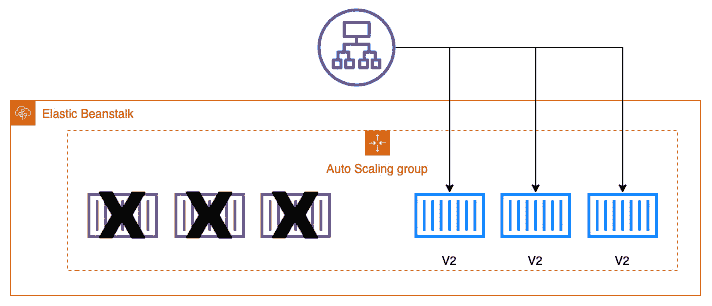

# 第十一章：使用 Elastic Beanstalk 部署你的应用程序

了解并理解 Elastic Beanstalk 对于 DevOps Pro 考试至关重要。如何使用该服务的细微差别、该服务的局限性，特别是 Beanstalk 与容器的交互方式，对于通过考试和快速让应用团队在现实世界中启动应用程序都是至关重要的知识。

在本章中，我们将涵盖以下主要主题：

+   理解 Elastic Beanstalk 的内建功能

+   在 IAM 控制台中创建服务角色

+   安装并使用 Elastic Beanstalk 命令行接口（EB CLI）

+   理解通过 .ebextensions 进行高级配置选项

+   使用 Elastic Beanstalk 部署应用程序

+   Elastic Beanstalk 的应用场景

# 技术要求

由于 Elastic Beanstalk 需要一些本地开发，并且我们将在本章中用 Python 编写示例程序，因此你需要在工作站本地安装 Python 3.x。在撰写本文时，Elastic Beanstalk 支持的最新 Python 版本为 3.8.5，因此我们将在本章使用该版本的 Python。作者建议你安装 `pyenv` Python 运行时管理器，以帮助你在本地工作站上开发和管理多个 Python 版本。你可以在该项目的 GitHub 页面找到有关信息及安装方法，网址为 [`github.com/pyenv/pyenv`](https://github.com/pyenv/pyenv)。

# 理解 Elastic Beanstalk 的内建功能

Elastic Beanstalk 是一个灵活的平台，允许开发人员在如 Python、Java、Ruby、.NET、PHP（超文本预处理器）、Go 甚至 Docker 容器等语言中开发并快速扩展他们的应用程序。Elastic Beanstalk 是一个**平台即服务**（**PaaS**），这意味着它作为所有其他服务的抽象层，帮助协调和管理这些服务。这使得那些急于开始使用 **Amazon Web Services**（**AWS**）云的开发人员，虽然可能对设置基础设施或监控等内容了解不多，仍然能够顺利开始，并专注于他们所选择语言中的应用程序开发。

Elastic Beanstalk 持续更新其支持的语言和平台。尽管它并不总是支持语言的最新版本，但它确实尽力保持更新并逐渐淘汰旧版本。记住这一点很重要，因为旧版应用程序不能直接推送到云端并一直运行下去。有时候，应用程序需要升级，以便保持 Elastic Beanstalk 服务的功能。以下是 Elastic Beanstalk 集成的一些服务：


图 11.1 – 一些 Elastic Beanstalk 集成的服务概览

在 Elastic Beanstalk 服务可供使用之前，开发人员必须弄清楚哪些服务可以协同工作，不仅仅是计算、负载均衡和路由，还需要——无论是手动还是借助像 CloudFormation 模板这样的服务——将安全性、存储和监控集成到他们的应用程序中。对于那些希望快速启动并运行 AWS 云服务的开发人员来说，这可能是一个挑战，因为他们习惯于创建应用程序代码，而不是配置环境。

## Elastic Beanstalk 中的不同环境

使用 Elastic Beanstalk 构建并部署的任何类型应用程序都允许你将该应用程序中包含的所有不同组件作为单一环境进行管理。通过 Beanstalk 框架运行的环境主要分为两类：Web 服务器环境和工作环境。

### Web 服务器环境

在 Web 服务器环境中，Elastic Beanstalk 管理三项内容：负载均衡器、**自动扩展组**（**ASG**）以及请求的 **弹性计算云**（**EC2**）实例数量。即使你的应用程序已被容器化，这些容器仍然需要 EC2 实例来运行，因此 Web 服务器环境将启动一组相应的 EC2 实例来运行容器。

Web 服务器环境还会创建一个 `53` 服务，因此它具有高度可用性和可扩展性。如果需要，你可以注册自己的域名，并使用 Route `53` 服务将其指向负载均衡器，这样你可以使用自定义的 URL 而非原本为你创建的通用 CNAME，从而驱动流量访问你的 Web 应用程序。

### 工作环境

Elastic Beanstalk 提供的工作环境与 Web 服务器环境的主要区别在于，在工作环境中，`53`。Beanstalk 会自动安装一个守护进程，用于自动扩展，以下图所示：


图 11.2 – Elastic Beanstalk 中的 Web 服务器和工作环境

接下来，我们将介绍构成 Elastic Beanstalk 的不同组件。

## 构成 Elastic Beanstalk 的不同组件

无论你正在使用 Beanstalk 服务构建哪种类型的环境，它都将由多个组件组成。

### 应用程序

在 Elastic Beanstalk 中，组件的逻辑分组称为 **应用程序**。这包括环境和环境配置以及版本。所有这些项目都被组合成类似文件夹的结构，而这个文件夹就是应用程序。

### 应用版本

Elastic Beanstalk 允许将特定版本的应用程序打包并标记。每个特定打包的应用程序版本被称为**应用版本**。这些版本会被打包并发送到背后的**简单存储服务**（**S3**）服务，用于部署到一个或多个环境，如下图所示：


图 11.3 – 应用版本只能部署到单个环境

你可以在 Elastic Beanstalk 中运行多个版本的应用，分别运行在不同的环境中，例如在生产环境中运行当前稳定版本，在测试环境中运行最新版本。每次只能将一个版本部署到单个环境。

### 环境

在 Elastic Beanstalk 中运行特定应用版本的一组运行资源被称为**环境**。

### 环境配置

当你定义环境的参数和设置时，这些就构成了**环境配置**。当你对应用进行迭代，并更改环境的底层配置设置时，Beanstalk 会自动部署这些更改，并根据你的配置添加或删除项目，如下图所示：


图 11.4 – 更深入地了解 Elastic Beanstalk 配置

### 配置模板

Elastic Beanstalk 中的配置模板是创建自定义环境配置的起点。

### 已保存的配置

已保存的配置是存储在 S3 中的**YAML Ain't Markup Language**（**YAML**）文件，可以在其他运行中的环境或环境创建过程中使用。保存的配置定义了以下值：

+   平台版本

+   层级

+   配置选项设置

+   标签

### 平台

当你选择操作系统和编程语言时，所有的网页和应用服务器都构成了你的**平台**。

现在我们已经了解了 Elastic Beanstalk 的组件和平台，接下来我们将进行一个练习，创建一个 Elastic Beanstalk 应用，从创建必要的权限开始。

# 在 IAM 控制台中创建服务角色

在开始之前，我们需要为 Beanstalk 创建一个服务角色，供其在推送环境和应用时使用。如果没有这样做，或者没有更新几年前创建的服务角色，可能会在本章后续操作中出现错误并带来挫败感。

首先，使用管理员用户登录到**AWS 管理控制台**，然后按照以下步骤操作：

1.  登录后，导航到**IAM 服务**。

1.  在左侧菜单中，点击**角色**。

1.  在**创建角色**页面，保持信任实体为**AWS 服务**，然后在页面中间，选择**Elastic Beanstalk**作为您希望创建服务角色的服务。点击**Elastic Beanstalk**服务。

1.  选择**Elastic Beanstalk**服务后，屏幕底部会出现一组新的选项，供您选择使用案例。选择**Elastic Beanstalk**的使用案例。点击**Elastic Beanstalk**用例后，该选项会以蓝色高亮显示，如下图所示，然后您可以点击屏幕右下角的蓝色按钮**下一步：标签**：

    图 11.5 – 在身份与访问管理（IAM）中选择 Elastic Beanstalk 用例

1.  点击**下一步**后，进入**角色**页面，默认的 Beanstalk 策略应该已经为您填充。点击屏幕底部的蓝色按钮**下一步：标签**，继续到下一个页面。

1.  标签是可选的，您可以根据需要添加；否则，点击屏幕底部的蓝色**下一步：审查**按钮。

1.  在 `AWSServiceRoleForElasticBeanstalk` 页面，点击页面底部的蓝色**创建角色**按钮以创建此角色。

现在我们已经创建了服务角色，可以继续使用 Elastic Beanstalk 服务。

# 安装和使用 Elastic Beanstalk 命令行界面（EB CLI）

AWS CLI 提供了多个命令，允许用户利用 Elastic Beanstalk。

EB CLI 提供的基本命令包括从在本地环境中创建正确的项目结构，到快速高效地拉取实例的日志文件以供审核的命令。我们将回顾 EB CLI 提供的基本命令，并简要说明其功能，如下所示：

+   `eb create`：此命令将在 Elastic Beanstalk 中创建一个新的本地环境，并将初始应用版本部署到该目录结构中。

+   `eb status`：此命令返回您的环境状态，包括应用程序名称、区域、CNAME 和健康状态等信息。

+   `eb health`：此命令返回环境中实例的健康状态，每 10 秒更新一次。

+   `eb events`：此命令返回当前 Elastic Beanstalk 环境的日志语句列表，列出最近的事件。事件示例包括资源的创建，如实例或负载均衡器，或环境状态更改为不同的健康级别。

+   `eb ssh`：如果您没有为特定的**无类域间路由**（**CIDR**）地址范围配置端口`22`，此命令将临时打开安全组的`22`端口，允许所有传入流量。然后，它会提示您连接到正在运行的实例，或者允许您选择要通过**安全外壳**（**SSH**）连接的实例。

+   `eb logs`：此命令可以执行两个与文件日志相关的明确命令，如下所示：

    a. 它可以切换日志流到 CloudWatch Logs 服务。

    b. 它可以获取实例日志，供您本地查看。

+   `eb open`：此命令将使用您的默认浏览器打开应用程序的公共 URL。

+   `eb deploy`：此命令将使用当前的源包将您的应用程序部署到 Elastic Beanstalk 服务。

+   `eb config`：此命令将允许您更改环境配置设置。

+   `eb terminate`：此命令将关闭并停止您的实例和环境，以免产生额外费用。

## 安装 EB CLI

获取 `eb-cli-setup` 脚本的最简单方法是通过 GitHub：[`github.com/aws/aws-elastic-beanstalk-cli-setup`](https://github.com/aws/aws-elastic-beanstalk-cli-setup)。

如果您使用的是 Mac 并且喜欢通过 `brew` 包管理器安装软件，则也可以通过这种方式安装 EB CLI。在尝试安装 EB CLI 之前，请确保您当前的 `brew` 版本是最新的。以下是您需要的代码：

```
$ brew update 
$ brew install awsebcli
```

无论您选择哪种方法，安装完成后，您应该能够从终端提示符直接访问 EB CLI，只需输入简单的 `$ eb` 命令。

注意

如果您之前曾在计算机上安装过 EB CLI，在继续之前最好使用 `pip3 install --upgrade awsebcli` 命令更新该软件包。

现在，安装了 CLI，我们来看看如何使用 EB CLI 创建和部署一个项目。

## 使用 EB CLI 创建项目

我们将使用终端来调用 `eb cli` 命令，并创建我们的 Elastic Beanstalk 项目。首先，打开终端窗口。然后，按照以下步骤操作：

1.  打开终端窗口后，使用 EB CLI 创建一个新文件夹来开始我们的项目。最好从家目录的根目录开始，这样如果需要稍后返回，文件夹更容易找到。我们将把本地文件夹命名为 `11-beanstalk`。以下是您需要的代码：

    ```
    $ cd ~
    $ mkdir 11-beanstalk
    ```

1.  我们需要确保已在系统上安装 `virtualenv` 程序，以支持 Python 3.x 编程语言。我们将使用 `pip` 来完成此操作，如下所示：

    ```
    $ pip3 install -U virtualenv
    ```

1.  现在，创建好文件夹后，我们可以进入该文件夹以创建 Python 的虚拟环境。一旦启用了虚拟环境，你会看到提示符稍作变化，命令提示符前会添加 11，如下代码片段所示。这表示你已经进入虚拟环境：

    ```
    $ cd ll-beanstalk
    $ virtualenv eleven
    ```

1.  如果虚拟环境创建成功，你应该会看到类似以下内容的输出：

    ```
    created virtual environment CPython3.9.1.final.0-64 in 767ms
      creator CPython3Posix(dest=/Users/abook/11-beanstalk/eleven, clear=False, no_vcs_ignore=False, global=False)
      seeder FromAppData(download=False, pip=bundle, setuptools=bundle, wheel=bundle, via=copy, app_data_dir=/Users/abook/Library/Application Support/virtualenv)
        added seed packages: pip==21.1.2, setuptools==57.0.0, wheel==0.36.2
      activators BashActivator,CShellActivator,FishActivator,PowerShellActivator,PythonActivator,XonshActivator
    ```

1.  既然我们已经创建了虚拟环境，我们现在需要激活它，如下所示：

    ```
    $ source eleven/bin/activate 
    ```

1.  在虚拟环境提示符显示时，我们将安装`flask`本地，以便使用 Python 创建一个快速的 Web 应用，如下所示：

    ```
    flask package will also install a number of dependent packages that flask needs, including flask is a lightweight web application framework written in Python. It uses Jinja templates for rendering pages but can also just parse text or HyperText Markup Language (HTML). It can also be combined with other Python libraries to do more complex calculations and then render the results. 
    ```

1.  在环境设置好后，我们可以将从`Chapter-11` GitHub 仓库获取的文件移动并复制到我们的`11-beanstalk`目录。首先进入克隆了 GitHub 仓库文件的目录，这样复制命令会更简短，如下所示：

    ```
    application.py file that runs the application but also the templates folder (this holds the Jinja templates) along with the static folder (this holds the Cascading Style Sheets (CSS) style sheet). 
    ```

1.  现在，让我们使用 `pip freeze` 命令捕获我们在远程环境中安装时所需的所有依赖，并将其输出到一个名为 `requirements.txt` 的文件中，如下所示：

    ```
    $ pip freeze > requirements.txt
    ```

1.  此时，我们应该在本地测试我们的`flask`应用程序，确保它运行正常并准备好部署。使用以下命令测试你的应用：

    ```
    $ python3 application.py
    ```

    假设应用程序启动成功，你应该看到类似以下内容的返回：

    ```
    * Serving Flask app 'application' (lazy loading)
     * Environment: production
       WARNING: This is a development server. Do not use it in a production deployment.
       Use a production WSGI server instead.
     * Debug mode: on
     * Running on http://127.0.0.1:5000/ (Press CTRL+C to quit)
     * Restarting with stat
     * Debugger is active!
    * Debugger PIN: 688-856-306
    ```

    显示本地 URL 后，你可以打开网页浏览器查看应用程序的运行情况。

    测试完本地应用后，按*Ctrl* + *C*在终端窗口停止本地服务器的运行。

1.  在本地测试应用程序后，我们现在可以使用 EB CLI 创建环境。使用你仍然打开的命令提示符，我们将启动 Elastic Beanstalk 环境。确保在运行下一个命令之前，你仍然在`11-beanstalk`文件夹内，如下所示：

    ```
    us-east-2
    ```

1.  `flask-quiz`

1.  `(Y)es`

1.  `Python 3.8`

1.  `(Y)es`

1.  `DevOps-pro`（无密码）

创建好环境后，我们将继续学习如何使用 `.ebextensions` 自定义环境。

# 了解使用 .ebextensions 的高级配置选项

Elastic Beanstalk 允许你向应用程序的源代码添加配置文件，以自定义和配置环境中的 AWS 资源。

我们可以在目录中创建一个*隐藏*文件夹，用于创建和存储我们的自定义配置。

在`11-beanstalk`目录中，我们将创建一个`.ebextensions`目录，如下所示：

```
$ mkdir .ebextensions
```

我们现在可以运行一个 `tree` 命令，设置级别为 `1`，并要求它显示所有文件（以便显示隐藏的 `.ebextensions` 文件夹），查看我们当前的工作环境结构，如下所示：

```
$ tree -a -L 1
```

这应该显示如下的当前结构：

```
.
├── .ebextensions
├── .elasticbeanstalk
├── .gitignore
├── application.py
├── eleven
├── requirements.txt
├── static
└── templates
```

接下来，我们将把所有其他名为`cloudwatch.config`的文件一起复制到`.ebextensions`文件夹中，如下所示：

```
$ mv cloudwatch.config .ebextensions/.
```

如果需要，您也可以在 GitHub 的`Chapter-11`文件夹中找到此文件。

在创建了额外资源后，我们现在可以查看 Elastic Beanstalk 中为应用程序提供的部署类型，然后再开始部署应用程序。

# Elastic Beanstalk 的部署类型

Elastic Beanstalk 支持多种部署类型，让我们详细了解每种部署方式。

## 一次性部署

使用**一次性部署**策略时，Elastic Beanstalk 会将指定版本的应用程序部署到环境中的所有实例中，所有实例同时进行部署。

这种部署方式需要的时间最短，相关成本也最低；然而，它也伴随最大的风险。如果部署过程中出现问题，应用程序可能会出现停机。这种部署策略最适用于开发和测试环境，生产环境中应很少甚至不应使用。

## 滚动部署

**滚动部署**将把应用程序的新版本推送到现有的 EC2 实例，但不同于一次性将应用推送到所有实例，它采用批次的方式来控制每次更新多少实例。

虽然这种部署方式不如“一次性部署”方法快速，但它同样可以保障在应用出现问题时，不会导致所有实例同时宕机。与蓝绿部署方式相比，滚动部署实例的成本也较低，因为你正在利用已经启动并运行的 EC2 实例，而不需要创建全新的环境。

## 附加批次滚动部署

尽管与滚动部署非常相似，**附加批次滚动部署**有一个明显的区别。这个区别在于，它确保在整个部署过程中保持应用的全部容量。

这种部署类型将在开始实际部署之前启动一组额外的实例。如果您需要保证流量持续稳定，并确保在执行应用程序更新时不影响容量，这将是一个不错的选择。

## 不可变部署

当你想到不可变基础设施时，你应该想到的是不对当前实例进行更新。这与**不可变部署**的概念相同，因为我们会设置一整套新的实例并部署到这些实例上，在它们变为健康状态后，才会将 Elastic Beanstalk 的**域名系统**（**DNS**）从旧环境切换过来，具体示意图如下所示：


图 11.6 – 部署期间的不可变部署

这是部署应用程序最安全的方式之一，但也可能是最昂贵的，因为你需要设置双倍数量的实例，如下图所示：



图 11.7 – 部署后的不可变部署

在对新版本的实例完成健康检查后，旧版本的实例会被关闭，流量会被引导到新版本的应用程序。如果任何实例存在问题，流量在一开始就不会被引导到这些实例。

## 流量拆分

**流量拆分**部署与不可变部署有些相似，因为它会创建一整套新的实例。主要的区别在于，在流量拆分部署中，旧的实例不会在新版本启动并健康后立即终止。相反，流量会按照你在控制台或通过 CLI 设置的控制节奏，逐步从一个版本转移到下一个版本，如下图所示：


图 11.8 – 显示流量百分比的流量拆分部署

现在我们已经了解了不同的部署策略，我们将使用 EB CLI 和我们的终端来创建并部署一个 Beanstalk 应用程序。

# 使用 Elastic Beanstalk 部署应用程序

理解这些服务的最佳方式是通过动手示例来测试它们。Elastic Beanstalk 尤其如此，因为你需要在阅读 DevOps 专业考试中的问题和答案时，能够考虑到服务的功能。

我们将继续使用本章前面开始的示例代码。如果你没有做第一部分的练习，并且想要部署应用程序，建议你回到本章标题为*使用 EB CLI 创建项目*的部分。

如果你之前关闭了终端窗口，你需要重新打开它，并导航回`11-beanstalk`文件夹。我们之前已经在本地初始化了环境，现在可以继续按照以下步骤进行：

1.  由于我们之前已经初始化了环境，我们可以按以下方式创建我们的初始环境——`development`：

    ```
    $ eb create development
    ```

    终端应显示类似于以下的返回信息：

    ```
    Creating application version archive "app-210606_181258".
    Uploading: [##################################################] 100% Done...
    Environment details for: development
      Application name: flask-quiz
      Region: us-east-2
      Deployed Version: app-210606_181258
      Environment ID: e-mscggmggrw
      Platform: arn:aws:elasticbeanstalk:us-east-2::platform/Python 3.8 running on 64bit Amazon Linux 2/3.3.0
      Tier: WebServer-Standard-1.0
      CNAME: UNKNOWN
      Updated: 2021-06-06 22:12:41.224000+00:00
    Printing Status:
    2021-06-06 22:12:40    INFO    createEnvironment is starting.
    2021-06-06 22:12:41    INFO    Using elasticbeanstalk-us-east-2-182968331794 as Amazon S3 storage bucket for environment data.
    ```

1.  尽管新环境的设置可能需要几分钟的时间，但一旦完成，你可以通过使用`eb` `open`命令查看运行中的 Web 应用程序，如下所示：

    ```
    $ eb open
    ```

1.  你可以通过在 EB CLI 中使用`events`命令查看应用程序的所有事件，像这样：

    ```
    $ eb events 
    ```

1.  如果你想检查环境的健康状况，你可以登录 AWS 控制台查看可视化仪表板，或者你也可以使用 `eb health` 命令快速查看环境的统计信息，如下所示：

    ```
    $ eb health
    ```

    或者，如果你从控制台查看 Beanstalk 应用程序的健康状况，你将看到一个非常易于阅读的**用户界面**（**UI**），如下图所示：

    

    图 11.9 – 查看 Elastic Beanstalk 监控仪表板

1.  如果你愿意，你可以直接通过命令行使用 `eb logs` 命令检查日志文件。

1.  完成后，你应该通过运行以下命令来停用虚拟环境：

    ```
    zip ../eleven.zip -r * .[^.]* command to use as the source bundle to upload. 
    ```

如果在部署过程中遇到问题，请按照下一节的指导来帮助排查问题。

## 使用 EB CLI 排查部署问题

如果在部署环境时遇到问题，请执行以下步骤：

1.  找到声明**Web 服务器网关接口**（**WSGI**）路径的那一行。以下是一个示例：

    ```
    WSGIPath: application
    ```

1.  在冒号后编辑这一行，确保 `.py` 出现在“应用程序”一词后面。

1.  保存并关闭文件。

1.  尝试使用 `eb deploy` 命令再次部署你的应用程序。

现在我们已经完成了部署我们的 Beanstalk 应用程序并查看应用程序日志和事件的练习，我们将接下来讨论使用 Elastic Beanstalk 的使用案例和反模式。

# Elastic Beanstalk 使用案例

Elastic Beanstalk 使开发人员能够轻松地在云端启动和运行，而无需担心底层基础设施或底层组件的管理。接下来，我们将看看使用 Elastic Beanstalk 的一些最佳使用案例。

*你有一个小型的开发团队，需要快速启动*

如果你有一个较小的团队，需要快速启动 AWS，但对其他组件、服务和相互连接不太熟悉，那么 Elastic Beanstalk 可以成为一个很好的选择，帮助按时完成任务。

*你没有内部的 DevOps 专业知识*

类似于之前的示例，如果一个公司或开发团队有一个需要快速部署到 AWS 的应用程序，那么 Elastic Beanstalk 提供了一个非常可行的解决方案，而无需任何高级 DevOps 专业知识。由于该产品本身可以与 Git 配合使用，这是大多数开发人员都熟悉的工具，因此在最短的时间内启动和运行是一项简单的任务。然后，Beanstalk 负责处理诸如 DNS、自动扩展、应用程序日志的轻松访问，甚至是无需额外设置的环境度量仪表板。

## Elastic Beanstalk 反模式

正如我们刚才看到的，Elastic Beanstalk 在某些情况下非常适用，但也有一些情况它并不是一个好的选择。在这里，我们将探讨一些已知的使用 Elastic Beanstalk 的反模式，了解在哪些情况下你应该考虑选择 AWS 的其他服务。

### 需要大量环境变量的应用程序或项目

Elastic Beanstalk 的一个限制是它只有 **千字节** (**KB**) 的存储空间用于存储所有的键值对。考虑到这一点，如果你有很多环境变量，例如不同数据库连接字符串、用户名和密码，适用于每个你创建的环境，那么你可能会遇到这个硬性限制，Elastic Beanstalk 对你的应用程序来说就不再是一个好的选择。

### 非常大的应用程序

Elastic Beanstalk 部署包的最大大小只能是 512 `.ebextensions` 目录。如果你有大量静态资源，比如图片或媒体文件，可以将它们存储在 S3 中，并在应用程序或动态存储（如 DynamoDB）中存储指针，这样可以减少源包的大小。

# 总结

本章中，我们介绍了 Elastic Beanstalk 服务，这是 AWS 提供的另一种部署服务。我们介绍了 Elastic Beanstalk 提供的不同部署选项，并使用 EB CLI 工具创建和部署 Beanstalk 应用程序。我们还探讨了使用 Elastic Beanstalk 的最佳情况，以及一些反模式，说明在这些情况下 Elastic Beanstalk 并不适合。

在下一章中，我们将探讨如何使用 Lambda 函数和步骤函数，以无服务器的方式部署我们的代码。

# 复习问题

1.  你被引入了一家公司，该公司有一个应用团队，他们的应用程序是两层架构——一个是 Web 层，另一个是数据库层。应用团队需要一种快速地在 AWS 上配置和部署环境的方法。以下哪种选项是最快且最理想的设置方式？

    a. 使用 Elastic Beanstalk 服务来配置一个环境，然后将应用程序推送到该环境。

    b. 创建一个带有两个层的 OpsWorks 堆栈，一个用于应用程序，另一个用于数据库。将应用程序部署到应用层。

    c. 使用 CloudFormation 创建一个 S3 存储桶、一个 RDS 数据库和一个 EC2 实例。使用用户数据脚本从 S3 存储桶加载应用程序，并传递 RDS 连接字符串、用户名和密码等参数。

    d. 创建一个 RDS 数据库，然后使用 Lambda 部署应用程序。

1.  你被引入了一家公司，这家公司正在尽可能快地自动化迁移到 AWS 云。该公司要迁移的应用程序是使用多种不同编程语言构建的。你如何才能尽快将这些应用程序迁移并部署到云端？

    a. 创建一个主 CloudFormation 模板，利用嵌套堆栈设计来部署应用程序。在为每个应用程序创建 Docker 容器后，创建每个应用程序的子模板。

    b. 在一个 Docker 容器中开发每个应用程序，并使用 Elastic Beanstalk 进行部署。

    c. 在一个单独的 Docker 容器中开发每个应用程序，并使用 Elastic Beanstalk 进行部署。

    d. 使用 OpsWorks 创建堆栈。为每个应用程序创建一个单独的层，然后将每个应用程序部署到对应的层。

1.  如果你的应用程序需要较长时间完成其活动或工作流，Elastic Beanstalk 可以为你提供哪项服务？

    a. Beanstalk 可以管理 Elastic Load Balancing（ELB）服务，并在每个实例上运行守护进程。

    b. Beanstalk 可以管理一个简单通知服务（SNS）主题，并在每个实例上运行守护进程。

    c. Beanstalk 可以管理 Lambda 函数，并在每个实例上运行守护进程。

    d. Beanstalk 可以管理一个 SQS 队列，并在每个实例上运行守护进程。

1.  你被邀请加入公司，帮助在主要区域发生故障时自动化恢复策略。该公司优先考虑减少恢复策略的成本，但同时也需要在必要时能够快速恢复完整的基础设施。你会如何建议公司以最低成本实现这一目标？

    a. 在另一个区域创建一个试点灯基础设施，并根据 CloudWatch 事件自动调整大小。

    b. 通过在灾难恢复（DR）区域使用 Elastic Beanstalk 创建一个全新的环境来创建重复的基础设施。在发生故障时，将 Route 53 记录切换到 DR 区域的负载均衡器。

    c. 使用 Elastic Beanstalk 创建另一个环境，作为应用程序的副本，以防发生故障。

    d. 使用 CloudFormation 在发生故障时在另一个区域启动资源。

# 审核答案

1.  a.

1.  c.

1.  d.

1.  d.
