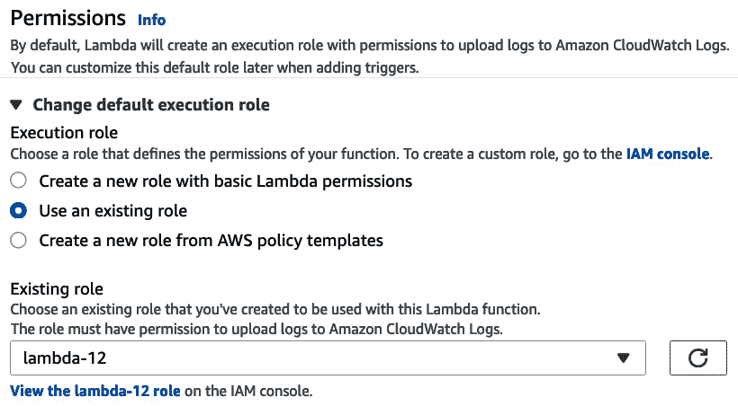
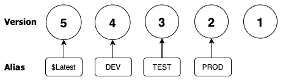

# 第十二章：Lambda 部署和版本控制

随着越来越多的应用架构走向无服务器，越来越多的云预算受到审视，AWS Lambda 成为开发者和运维人员工具箱中越来越可行的选择。了解如何利用 Lambda 和 Step Functions 的灵活性和强大功能是当今 AWS 环境成功的关键。

本章将涵盖以下主要内容：

+   AWS Lambda 概述

+   Lambda 函数

+   Lambda 触发器和事件源映射

+   使用 Lambda 部署版本

+   使用 Lambda 层

+   监控 Lambda 函数

+   Lambda 最佳使用案例和反模式

+   使用 Lambda 协调 Step Functions

# 技术要求

与前几章一样，我们将使用 Python 编程语言创建 Lambda 函数。建议具备基本的 Python 工作知识，以便跟随示例并在必要时进行调试和故障排除。

# AWS Lambda 概述

AWS Lambda 是一种允许您将代码作为函数运行的服务，无需设置任何服务器或进行容器编排。它会自动根据接收到的请求数量进行扩展。Lambda 函数最吸引人的特点之一是它们仅按运行时间收费。这意味着您可以在一个或多个区域内配置平台，等待请求，而不必担心因空闲资源而产生的账单。

Lambda 让您专注于代码，而不是服务器，因为它是一个无服务器的 PaaS（平台即服务）产品。作为 PaaS 也意味着，除非 AWS 向您暴露，否则您无法访问底层计算平台进行调整，例如运行时（编程语言）、您的环境、函数需要使用的内存量以及分配的 CPU 数量：


](img/Figure_12.1_B17405.jpg)

图 12.1 – 带触发器的 Lambda 架构

许多 Lambda 函数是由其他 AWS 服务触发的事件。这也是该服务如此有吸引力的原因之一。Lambda 函数可以用于基于 S3 存储桶事件进行后台处理。然后，您可以将它们放入一个解耦的架构中，使用消息队列，如**简单队列服务（Simple Queue Service）**或**Amazon MQ**，由一个或多个并发的 Lambda 函数进行处理，将数据存入后端数据存储中。

然后，可以使用诸如**API 网关**的服务通过 GraphQL 和**AppSync**来检索数据。

## 无服务器而非服务器

**无服务器**这一术语应立刻让人联想到一些关键概念。在 AWS 的世界中，这可以归结为四个基本原则：

+   **无需配置服务器**：不需要实际配置或维护任何服务器或实例。您也不需要对容器进行编排。

+   **系统和架构随使用情况自动扩展**：随着请求、数据或事件的到来，底层平台和基础设施应自动进行扩展以满足所需的需求。

+   **按价值付费**：那些处于空闲状态、等待被使用的资源不应产生费用。只有在资源被实际使用时才会产生费用。

+   **系统是为可用性和容错性而构建的**：一旦您启动平台，它应该自动跨多个可用区扩展，从而提高您的可用性和容错性。

与那些在实际应用中使用过无服务器平台的人交谈时，他们通常会感觉从转向无服务器架构中获得了诸多好处。一个这样的好处是**更高的灵活性**和更快的行动能力，因为他们不再花费大量时间来设置和配置基础设施。将自己从实例和容器配置中解脱出来，能够**更好地专注**于他们的业务以及客户想要且认为有价值的功能。他们还觉得与以前数据中心的客户使用的容量相比，他们的**规模增加了**。这是因为 Lambda 会根据某个特定函数的调用次数自动扩展。

## 同步与异步调用

当您调用 Lambda 函数时，可以选择两种方式之一：同步或异步。

Lambda 将在同步调用中运行该函数，等待响应，然后返回响应代码以及函数返回调用中包含的任何数据。您可以使用 AWS CLI 中的`invoke`命令来同步调用函数。

使用异步调用时，您将事件推送到 Lambda，但不会等待即时响应。Lambda 会先将事件排队，然后再将其发送到函数：


图 12.2 – Lambda 中的异步调用

Lambda 管理着函数的事件队列，并在收到错误时，会尝试重试事件。如果重试失败，它会再尝试两次，每次重试的间隔时间会更长。

现在我们初步了解了如何调用 Lambda 函数，让我们深入研究一下 Lambda 函数本身。

# Lambda 函数

您编写的代码就是运行的函数，无需配置或管理任何服务器。该函数本身就是资源，可以接收传递给它的事件，无论是您自己还是其他 AWS 服务传递的事件。

您可以使用几种支持的语言来创建 Lambda 函数，包括 Python、Node.js、Ruby、Java、Go 和.NET。您甚至可以通过使用容器来创建自定义运行时。

## Lambda 的基本概念

当你启动 Lambda 函数时，这个过程称为 **调用** 函数。Lambda 函数处理事件。事件可以通过几种不同方式发送到你的函数：你可以手动调用函数，如使用测试事件，或者可以配置 AWS 资源或服务来调用它并启动进程。

由于我们正在讨论 Lambda 函数，有几个关键概念需要理解。

### 函数

函数是你处理事件的代码。当你通过事件、计划任务或手动调用 Lambda 进程时，函数会被调用。

### 标识符

Lambda 函数可以有版本和别名。一旦版本创建，它就是代码的固定版本，并且末尾带有一个数字标识符。虽然 `$LATEST` 版本是你可以不断更新的 Lambda 代码版本，但如果你想调用某个快照版本，如 `test-function:1`，则需要在版本号后追加版本号。

### 运行时

Lambda 中的运行时允许你选择语言以及语言版本，以便执行你的函数。这个运行时并不包含在函数内部；它位于 Lambda 服务和函数代码之间。你不仅可以使用 Lambda 服务提供的运行时，还可以在服务本身不支持的语言和版本下构建自己的运行时。

### 事件

Lambda 中的事件是一个包含待处理数据的 JSON 文档。事件可以是简单的和单层的，如下例所示：

```
{
  "URL": https://packtpub.com
}
```

它们也可能是复杂的，来自 AWS 服务，并且包含需要复杂解析的嵌套键值对。这些复杂的事件可以包含有价值的数据，能够自动化流程并使你作为 DevOps 专业人员的工作变得更轻松，只要你学会如何利用它们的力量。

## Lambda 处理器

处理器可以是任何名称，但默认名称，尤其是在 AWS 控制台中创建函数时，是 `Lambda_function.Lambda_handler`：

```
def Lambda_handler(event, context):
  greeting = 'I am a DevOps Pro and my name is {} {}'.format(event['firstname'], event['lastname'])
  print(message)
  return {
    'greeting': greeting
}
```

在我们示例的 Lambda 代码中，我们可以看到有两个参数被传递给 Lambda 处理器：event 和 context。

`event` 参数是一个 JSON 格式的文档，其中包含 Lambda 函数需要处理的数据。虽然它通常是一个字典对象，但也可以是列表、字符串、整数或浮动点数。

通过事件处理器和解析器的组合，你可以获取有关哪些特定资源调用了 Lambda 函数的信息，然后从那里执行必要的操作。通过使用 `returns`，例如之前简单示例中的问候语，你可以基于找到的信息调用函数内部的其他方法。你甚至可以让整个函数返回一个值。这在 **Step Functions** 中尤其有用，我们将在本章后面讨论这个。

`context`参数在运行时传递给 Lambda 函数。此参数包含有关调用、运行时环境和函数本身的信息。

## Lambda 的限制

在创建 Lambda 函数时，了解 Lambda 服务的一些限制是很有帮助的。一个函数的最小内存为 128 MB，最大为 3,008 MB。Lambda 函数允许的最长执行时间为 15 分钟或 900 秒。环境变量最大只能有 4 KB。每个函数的并发执行限制为 1,000 次。如果你在提取数据或使用`/tmp`磁盘空间时，有 512 MB 的限制。

## 创建 Lambda 函数

了解 Lambda 函数的工作原理后，我们将开始创建我们的 Lambda 函数。我们将创建的函数会接收一个传入的 URL，并计算该网页上的单词数。由于我们需要外部包，因此我们首先需要创建一个 ZIP 包，然后将其上传到 Lambda 服务中。

有时，你可以直接在 AWS 管理控制台中使用 Lambda 服务内置的编辑器编写一个简单的函数。这包括 Python 语言及其`boto`和`botocore`模块，它们允许你利用 Python 的`random`来帮助生成随机数和随机值，`OS`允许你调用操作系统功能，`math`、`gzip`和`logging`模块，以及其他许多模块。

按照以下步骤构建我们的 Lambda 包，以便上传：

1.  让我们首先打开终端并为我们的 Lambda 函数创建一个角色。终端打开后，我们将导航到目录的起始位置，然后为我们的 Lambda 创建一个新目录。创建后，进入该目录：

    ```
    $ cd ~/
    $ mkdir my-wc-function
    $ cd my-wc-function
    ```

1.  我们将使用以下 JSON，保存为名为`Lambda-role-policy.json`的文件；你也可以在本书的 GitHub 仓库中的`Chapter-12`文件夹里找到这个文件：

    ```
    {
        "Version": "2012-10-17",
        "Statement": [
            { "Effect": "Allow",
              "Principal": {
                  "Service": "Lambda.amazonaws.com"
    }, 
              "Action": "sts:AssumeRole"
            }
        ]
    }
    ```

1.  使用此文件在以下命令中创建我们 Lambda 函数将使用的角色：

    ```
    $ aws iam create-role --role-name Lambda-12 --assume-role-policy-document file://Lambda-role-policy.json
    ```

1.  该命令应返回一个 JSON 格式的输出，显示角色创建成功，类似于以下输出：

    ```
    {
        "Role": {
            "Path": "/",
            "RoleName": "Lambda-12",
            "RoleId": "AROAW24Q7QQF5NLSQX3L5",
            "Arn": "arn:aws:iam::470066103307:role/Lambda-12",
            "CreateDate": "2021-06-15T01:06:06+00:00",
            "AssumeRolePolicyDocument": {
                "Version": "2012-10-17",
                "Statement": [
                    {
                        "Effect": "Allow",
                        "Principal": {
                            "Service": "Lambda.amazonaws.com"
                        },
                        "Action": "sts:AssumeRole"
                    }
                ]
            }
        }
    }
    ```

1.  我们的角色已经为 Lambda 创建好了；然而，由于目前没有附加任何策略，它不能做太多事情。我们不会编写自定义策略，而是使用 AWS 为 Lambda 创建的预定义策略：

    ```
    $ aws iam attach-role-policy --role-name Lambda-12 --policy-arn arn:aws:iam::aws:policy/service-role/AWSLambdaBasicExecutionRole
    ```

1.  在我们的角色创建并准备好使用后，让我们删除当前目录中的文件，以防它被随后的`zip`包一起部署。如果你希望保存它，我建议使用`copy`或`move`命令将其转移到`/tmp`目录或`Downloads`，以便稍后访问：

    ```
    $ rm Lambda-role-policy.json
    ```

1.  现在，我们将创建一个新的文件，名为`Lambda_function.py`。在这个函数中，我们将剪切并粘贴（或者如果你敢的话，直接输入）以下代码。或者，你也可以在本书的 GitHub 仓库中的`Chapter-12`目录找到完整的文件：

    ```
    import requests
    from bs4 import BeautifulSoup
    from collections import Counter 
    from string import punctuation # already included in Lambda modules 
    def Lambda_handler(event, context):
    # get the URL from the event 
    r = requests.get("https://aws.amazon.com/blogs/compute/using-Lambda-layers-to-simplify-your-development-process/") #demo 
      bs = BeautifulSoup(r.content)
    # gather all the words within the paragraphs 
      p_txt = (''.join(s.findAll(text=True))for s in bs.findAll('p'))
      count_p = Counter((x.rstrip(punctuation).lower() for y in p_txt for x in y.split()))
    # gather all the text in the divs 
      d_txt = (''.join(s.findAll(text=True))for s in soup.findAll('div'))
      count_div = Counter((x.rstrip(punctuation).lower() for y in d_txt for x in y.split()))
    # create a sum total of the words 
      word_sum = p_txt + d_txt
    # return the number of words 
      return word_sum
    ```

1.  现在，你的`my-wc-function`目录结构应该是这样的：

    ```
    my-wc-function$
    | Lambda_function.py
    ```

1.  此时，我们可以开始使用`–target`在本地安装我们的依赖模块：

    ```
    :pip install --target ./package requests
    pip install --target ./package bs4
    ```

1.  现在，让我们来制作部署包。首先，我们将进入刚刚创建的`package`目录，然后创建初始的`zip`文件。注意`zip`命令中的两个点，它们是告诉`zip`文件要在当前目录中创建，而不是在`package`目录中：

    ```
    $ cd package
    $ zip -r ../my-wc-package.zip .
    ```

1.  创建好我们的初始`zip`文件后，我们可以将 Python 文件添加到`zip`文件中：

    ```
    $ cd ../
    $ zip -g my-wc-package.zip Lambda_function.py
    ```

1.  运行此命令后，你应该看到`Lambda_function.py`文件已经被添加到之前创建的`zip`包中。

1.  现在，我们已经创建了部署包，准备继续使用 AWS 管理控制台上传并测试我们的函数。所有这些也可以从 CLI 继续，但控制台有一些 CLI 中没有的功能。

1.  打开你的浏览器，登录管理账户后访问 Lambda 服务。你可以通过直接访问[`console.aws.amazon.com/Lambda`](https://console.aws.amazon.com/lambda)来进入该服务。

1.  找到并点击主屏幕右上方的橙色**创建函数**按钮。

1.  一旦你进入`my-word-count_python`。

1.  `python 3.8`。

1.  我们之前创建的`Lambda-12`角色：



](img/Figure_12.3_B17405.jpg)

图 12.3 – 在 Lambda 创建函数屏幕上选择我们创建的现有角色

1.  填写完所有值后，点击橙色的**创建函数**按钮。

1.  一旦你创建了你的函数（这应该会将你带到该 Lambda 函数的主屏幕），我们需要上传我们创建的 ZIP 文件。因此，在你的本地系统中找到`my-wc-package.zip`。点击**保存**按钮将 ZIP 文件及其代码发送到 AWS Lambda：

    ](img/Figure_12.4_B17405.jpg)

    图 12.4 – 将我们之前创建的.zip 文件上传到我们的 Lambda 函数

1.  一旦你上传了 ZIP 文件，多个文件夹应该出现在`Lambda_function.py`文件的左侧。

1.  为了查看我们新创建的函数的效果，我们需要创建一个测试事件。点击橙色的`Test1`，然后点击对话框底部的橙色**创建**按钮。

1.  创建好测试事件后，我们可以运行测试。点击**测试**按钮旁边的箭头，出现时选择**Test1**选项。选中正确的测试事件后，我们可以再次点击橙色的**测试**按钮开始测试。

运行测试后，你应该能在**执行结果**页面看到我们演示 URL 中所有单词的计数。

本次练习带领我们从头创建和测试一个 Lambda 函数，该函数依赖于第三方库。接下来，我们将学习如何为我们的函数设置触发器和源映射，以便在特定事件发生时自动运行。

# Lambda 触发器和事件源映射

Lambda 触发器特别适用于当一段数据上传到特定的 S3 桶时启动多个应用程序。AWS 在许多讲座和演示中提供了将图像上传到桶的示例。然后，这张图像会触发 Lambda 函数，该函数会调整图像大小，使其更加压缩，然后将其放入 GIF 文件夹中。很多时候，这个函数还会在 DynamoDB 表中为新调整大小的图像放置一个指针。这些调整大小的图像对最终用户来说更易于访问并且下载更快，这一切都在上传源图像后自动发生：


图 12.5 – 上传图像到 S3 桶的流程，触发 Lambda 函数进行图像调整大小

我们可以通过桶触发器做的不仅仅是图像调整大小，尤其是在企业和 DevOps 环境中。记住，S3 可以作为源代码存储，因为它具有版本控制功能（如果已启用）。假设一个新文件已上传到某个特定文件夹，并具有特定的文件扩展名（例如`*.py`）。在这种情况下，这次上传可以触发我们的 CodePipeline 作业来构建一个新的容器，并将该容器通过我们设定的所有步骤，直到遇到任何手动审批步骤。

现在我们已经看过触发器如何调用 Lambda，让我们看看如何将流式数据推送到不同的队列服务，以便 Lambda 可以异步处理数据。

## 查看事件源映射

由于 Lambda 是一个自动可扩展的服务，它可以接收来自其他服务的某些信息并处理这些信息。这些信息可能会直接进入 Lambda 函数，也可能不会。这些中介服务，例如消息队列，接收数据流，然后触发 Lambda 函数。

## Lambda 可以从事件源读取的服务

以下服务可以为 Lambda 服务提供事件源映射：

+   DynamoDB

+   Kinesis

+   亚马逊 MQ

+   亚马逊托管的 Apache Kafka 流媒体服务

+   亚马逊 SQS

现在我们已经了解了 Lambda 函数如何被不同的 AWS 服务甚至其他源调用，让我们学习如何通过版本来更新我们的函数。

# 使用 Lambda 部署版本

如果你有一个已知的 Lambda 函数的良好状态，你可以通过发布该函数的版本来冻结它，避免未来的更改。一旦发布，这个版本将被用户和服务独立调用并使用，不受未来版本更改或更新的影响，包括对 `$Latest` 函数进行的迭代。

当你发布一个 Lambda 函数的版本时，它包含以下信息：

+   函数代码以及与之相关的所有依赖项。

+   调用函数的 Lambda 运行时。

+   所有的函数设置，如内存、VPC 关联和 IAM 角色。

+   添加到函数中的任何环境变量。

+   一个唯一的 **Amazon 资源名称**（**ARN**），以便可以识别该函数的特定版本：



](img/Figure_12.6_B17405.jpg)

图 12.6 – Lambda 版本及其如何映射到别名

版本可以通过两种方式之一来引用：通过限定 ARN 或通过未限定 ARN。

一个限定的 ARN 会在函数 ARN 末尾有版本后缀：

```
arn:aws:Lambda:us-east-2:470066103307:function:my-word-count_python:5
```

一个未限定的 ARN 将不会在函数 ARN 末尾有后缀：

```
arn:aws:Lambda:us-east-2:470066103307:function:my-word-count_python
```

现在我们已经了解了 Lambda 函数的版本，接下来我们来看一下如何将别名与版本一起使用。

## 在 Lambda 中使用别名

别名允许你为 Lambda 部署的特定版本创建命名指针。如果你已经将 Lambda 函数的 ARN 传递给用户或其他应用程序，这尤其有用。

除非你处于测试环境中，否则你不会想要传递基础的 Lambda ARN，因为那会指向 `$Latest` 版本。这个 `$Latest` 版本会不断变化，并且在测试和部署新功能和修复时可能会出现错误和漏洞。相反，通过使用别名，你可以将用户指向一个特定的、稳定的函数版本，并且在发布、测试并准备好发布新版本时，可以无缝过渡到新版本。

# 使用 Lambda 层

Lambda 层是一个预先发布的代码依赖项和库的集合。如果你发现你（或你的团队）在多个函数中使用相同的代码片段，可以创建一个层，利用 Lambda 层的好处。首先，当其中一个依赖项发生变化时，你不再需要更新每个函数；而是只需要维护一个单一的层，所有函数都可以利用这个层，并且只需要维护一次：


](img/Figure_12.7_B17405.jpg)

图 12.7 – 带有和不带有层的 Lambda 函数

层是加速团队之间开发的好方法。共享功能，如日志记录、网络或甚至数据库连接，可以一次性编写并打包成层，然后从各个函数中调用。

## 将 Lambda 层添加到我们的函数中

我们已经有了一个来自上次练习的 Lambda 函数。现在，让我们通过添加一个不仅适用于这个特定函数，而是可以在我们的代码库和组织中多个函数间共享的层来扩展函数的功能。

我们已经完成了为 Lambda 函数添加层的过程。接下来，我们将学习如何使用原生 AWS 服务来监控我们的函数，以及哪些指标最有效。

# 监控 Lambda 函数

一旦你开发并部署了 Lambda 函数，你的工作并没有完成。为了确保其在运行时能够正确工作，应当监控特定的指标。幸运的是，Lambda 可以与多个其他 AWS 服务集成，帮助你不仅监控你的函数，还能在需要时排查它们。

如果你前往 AWS 控制台所在区域，并且你的 Lambda 函数已经部署，你会发现垂直菜单栏中有一个名为 **Monitor** 的菜单项，点击它可以进入监控功能：


图 12.8 – 来自 Lambda 函数控制台的 Monitor 菜单项

一旦进入 Lambda 控制台的 **Monitor** 部分，你会立即看到一个预先构建的仪表盘，它允许你一目了然地查看 Lambda 函数的基本但重要的图形化指标。以下是呈现的指标：

+   **调用次数**

+   **持续时间**

+   **错误计数和成功率**

+   **限制**

+   **异步传输失败**

+   **迭代器年龄**

+   **并发执行**

仪表盘的默认时间范围为 3 小时；然而，也有从 1 小时到 1 周的预设迭代。你还可以选择自定义时间范围，查看仪表盘上的监控数据。

关于 AWS 管理控制台中 **Monitoring** 部分的另一个非常实用的功能是，它有一些按钮，可以让你直接跳转到函数的 CloudWatch 日志、使用 ServiceLens 查看函数的 X-Ray 跟踪，或者如果你启用了该附加功能，还可以通过 CloudWatch 查看 Lambda Insights。

## 使用 X-Ray 帮助排查你的函数

当你尝试排查应用程序问题，尤其是找出在应用程序执行过程中或其调用的其他服务中出现瓶颈的地方时，你可能需要比当前的指标和日志提供的更多信息。这时，AWS 服务可以变得特别有用。

X-Ray 会收集有关你应用程序请求的数据，然后提供详细信息，包括每个过程的逐步时间。每次调用函数时，Lambda 都会运行 X-Ray 守护进程。该 X-Ray 守护进程监听 UDP 端口 `2000` 的流量并收集分段数据。然后，这些分段数据会被传递到 X-Ray API 进行展示。

注意

我们将深入探讨 X-Ray 服务，以及它如何在*第十四章*《CloudWatch 与 X-Ray 在 DevOps 中的角色》中更详细地用于监控和观察 Lambda 函数。

现在我们已经了解了如何监控我们的 Lambda 函数，接下来我们将讨论 AWS Lambda 的最佳使用场景和反模式。

# Lambda 的最佳使用场景和反模式

现在我们已经详细了解了 AWS Lambda 作为代码服务的功能，接下来让我们看看什么时候使用 Lambda 最为合适，以及 Lambda 在哪些情况下不是最佳选择。这些信息对 AWS 专业人士和追求 AWS DevOps 认证的人来说都至关重要。

AWS 的 Lambda 服务非常灵活、经济实惠，并与大量 AWS 服务进行交互。它还允许你使用你熟悉的多种语言编写代码，并将其作为你的运行时环境。

那么，让我们继续前进，看看在什么场景下 Lambda 最能发挥作用。

## AWS Lambda 的最佳使用场景

随着越来越多的团队开始关注无服务器解决方案和模式，我们来看看使用 Lambda 服务在哪些地方是合理的。

### 你希望专注于代码，而不是底层的基础设施

如果你或你的团队希望专注于功能和代码库，而不是配置和修补服务器，无服务器 Lambda 函数是一个非常好的选择。你只需要专注于代码，选择运行时、内存大小、函数的最大运行时间以及一些其他选项，Lambda 服务会处理其余的工作。这包括按需扩展和管理底层硬件。

作为专注于代码的回报，你确实会放弃一些功能。你将无法登录到底层的计算实例，实际上这些实例是容器，无法查看进程或在日志生成时进行监视。相反，你需要添加日志语句或日志库，以便通过 CloudWatch 日志调试代码。

### 你需要一个具有成本效益的解决方案

成本优化是我们在*第一章*《Amazon Web Service 基础》提到的五大服务支柱之一。组织总是寻找如何让他们的解决方案更加具有成本效益，而使用 Lambda 通常是一个不错的选择。Lambda 服务没有空闲费用，因为费用是按使用量计算的。该服务还提供一个每月一百万次调用的永久免费层。

其中一个特别有用的场景是，如果你正在构建 DevOps 管道，在每次部署时将应用程序部署到主区域和次区域（或灾难恢复区域），而无需担心额外费用。在次区域进行的部署不会产生费用，因为除非主区域发生区域或服务故障，否则不会调用该区域。如果发生问题，你将比其他人领先一步，因为你无需搭建任何基础设施或资源。相反，你只需要重新指向正在调用哪个区域的 Lambda 函数。

## Lambda 反模式

既然我们刚刚讨论了 Lambda 在平台中的最佳使用场景，接下来我们将看看 Lambda 不太适合的场景。

### 在应用程序开发完成后，你不想更新运行时环境

使用 AWS Lambda 服务时，支持特定数量的运行时。不过，这些语言和版本并不是一成不变的。由于某些语言版本因缺乏支持而被弃用，AWS 将不再支持这些运行时，也不允许部署使用这些运行时的新 Lambda 函数。

很多时候，解决方法可能只是将 Lambda 控制台中的运行时版本从旧版本切换到新支持的版本。如果存在依赖于旧版本运行时的包、库或模块，那么可能需要更新或替换这些内容。如果原始开发人员或承包商不再在场，这可能会成为一个问题。

### 你需要从你的函数中调用一个异步调用

当你需要调用外部服务，比如外部 API 来执行任务时，这是一个异步调用。Lambda 可以成功地实现这一点。然而，调用到初始服务的请求可能并不会立即返回响应。让函数等待服务的响应并不是最佳模式，因为 Lambda 服务的计费是基于资源消耗的。

现在我们已经了解了何时使用和不使用 Lambda 函数，接下来我们将学习如何使用 Step Functions 协调多个 Lambda 函数。

# 使用 Lambda 协调 Step Functions

有时你需要将多个 Lambda 函数协调在一起执行一个更大的任务。Step Functions 可以根据状态机接收到的输入做出决策，执行并行步骤，甚至与其他服务（如 SNS）连接，以请求人工输入。

Step Functions 还会创建一个可视化工作流，让你看到流程中的每个步骤。当 Step Functions 运行时，你可以看到状态机的成功或失败。

## 理解 Step Functions 中的状态机

状态机是 Step Function 的编排功能。它定义了步骤的执行顺序，以及从前一个状态接收到的任何数据，并将其传递给其他状态以供使用。

状态机命令始终以 JSON 格式编写。即使你已经使用 YAML 格式编写了 CloudFormation 模板，你仍然需要以 JSON 格式创建你的状态机及其各种状态。

以下是一个状态机的示例：

```
{
  "Comment": "A Sample State Machine",
  "StartAt": "StepOne",
  "States": {
    "StepOne": {
      "Type": "Pass",
      "Result": "Hello World!",
      "End": true
    }
  }
}
```

现在我们理解了什么是状态机以及它们如何与 Step Functions 区别开来，让我们看看 Step Functions 是如何工作的。

## Step Functions 是如何工作的？

Step Functions 通过使用三步流程来工作：

1.  定义你应用中的步骤。

1.  验证任何状态变化。

1.  运行你的应用并根据需要进行扩展。

    注意

    你知道吗，与 Lambda 函数不同，你不能从 `S3` 存储桶事件触发 Step Function？相反，你需要让存储桶事件调用一个单独的 Lambda 函数，然后再调用 Step Function。

现在我们已经了解了 Step Functions 的基本原理，接下来让我们更仔细地看看 Step Functions 中可用的不同状态。

## Step Functions 中可用的状态

当你开始配置你的 Step Functions 状态时，你开始创建一个 **状态机**。你通过使用 **Amazon 状态语言** 来实现这一点，Amazon 状态语言是一种基于 JSON 的语言，用于定义状态机中的不同状态。有些状态可以执行操作，有些是过渡状态，还有一些在任务失败或成功时停止：


图 12.9 – Step Functions 中可用的不同状态

让我们仔细看看这些状态及其执行的功能。

### 任务状态

当你创建一个由状态机执行的单个工作单元时，你正在创建一个 `task` 状态。`task` 状态是你可以调用 Lambda 函数的地方。

### 选择状态

`choice` 状态允许状态机根据逻辑评估在不同的分支之间进行选择。你提供一组选择规则，这些规则评估输入或输出变量。根据这些值是否为真，状态机的下一步将被定义。

虽然默认选择不是必需的，但建议这样做，以防没有任何选择与逻辑匹配。否则，你的状态机会停止并报错。

### 并行状态

顾名思义，`parallel` 状态可用于创建状态机的多个分支，这些分支同时执行。对于那些彼此独立的任务，这可以显著加快执行时间。

### 失败状态

一个`fail`状态会停止你的状态机的执行，但可以选择在字段中输入`Cause`（原因）、`Error`（错误）或两者。这些字段在调试较大和更复杂的状态机时尤其有用，与其在代码中硬编码错误代码，不如传递一些系统信息。

### Succeed 状态

`Succeed`状态是一个终止状态，没有下一个字段。

### 等待状态

如果你需要在步进函数中添加暂停，可以添加一个`wait`状态。`wait`状态可以通过暂停的秒数或恢复的时间戳来定义。

## 创建步进函数

理解步进函数的最佳方式之一是创建一个，然后观察它的执行过程。我们已经创建了一个`S3`存储桶，用于存储已被步进函数调用的 Lambda 函数。如果你完成了初始的 Lambda 函数练习，你应该已经拥有以 ZIP 格式保存的 Lambda 函数，准备上传到这个新的存储桶。模板文件可以在本书的 GitHub 仓库中找到，在`Chapter-12`文件夹中，名为`step_function.yml`：

1.  在运行模板之前，我们需要上传`my-wc-package.zip`文件。这可以是我们至今一直使用的`S3`存储桶。我们将通过命令行使用 S3 复制命令来完成此操作。确保你在包含 ZIP 文件的相同目录中，或者已将 ZIP 文件移动到当前工作目录：

    ```
    $aws s3 cp my-wc-package.zip s3://devopspro-beyond/
    ```

1.  打开终端并转到你从`Chapter-12`文件夹下载 CloudFormation 模板的目录。使用以下 CLI 命令从`step_function.yml`模板创建步进函数。我们需要知道我们上传文件的存储桶，以便将其作为参数传递。我们还将把我们的堆栈命名为`stepTest`：

    ```
    $aws cloudformation create-stack --stack-name stepTest --template-body file://step_function.yml --parameters ParameterKey=LambdaFunctionBucket,ParameterValue=devopspro-beyond --capabilities CAPABILITY_IAM
    ```

1.  设置好步进函数和 Lambda 函数后，我们将使用管理员用户登录到 AWS 管理控制台。登录后，导航到**步进函数**服务。

1.  一旦进入**步进函数服务**页面，你应该能看到一个名为**第十二章**的状态机。点击该状态机的名称，进入它：

    图 12.10 – 创建的第十二章状态机

1.  现在，在**第十二章**状态机中，点击**开始执行**按钮。这将打开一个对话框，你可以在其中命名执行。只需保持默认值不变，并点击对话框底部的橙色**开始执行**按钮。

1.  一旦你开始执行，你应该能够看到状态机的映射和步骤的流动。你可以点击任何单个步骤来查看输入和输出值：


图 12.11 – 由 AWS 生成的状态机图形视图

通过这一章的学习，你不仅了解了创建 Step Function 的过程，还将之前创建的 Lambda 函数融入到了我们的状态机中。现在，让我们快速回顾一下这一章的内容。

# 总结

在这一章中，我们了解了 Lambda 服务及其在无服务器架构中的应用。我们考察了 Lambda 函数的不同组件，从事件到运行时环境。我们查看了 Lambda 可以被调用的不同方式，甚至可以从头开始构建一个函数。之后，我们了解了如何使用 Step Functions 来编排多个 Lambda 函数。

在下一章中，我们将深入探讨蓝绿部署及其变体。我们还将讨论它们在 DevOps 过程中扮演的重要角色，因为这可以在不同的测试问题中以多种方式提出。

# 问题

1.  你团队中的一位开发人员创建了一个由 S3 桶事件触发的 Lambda 函数。该函数应该在对象放入桶中时被调用。然而，函数并没有正常工作。这个问题需要进行调试和修复。开发人员如何简单快速地完成这一任务？

    a. 使用 Lambda 监控控制台帮助调试问题。

    b. 使用 AWS CloudTrail 日志。

    c. 打开 AWS 支持案例，注明 Lambda 函数的 ARN 和 S3 桶的名称。

    d. 使用 AWS CloudWatch Logs。

1.  你被要求帮助构建一个使用 AWS Lambda 的无服务器应用程序。这个应用程序需要进行监控，但公司不希望引入任何第三方服务进行监控。虽然记录和跟踪调用其他函数的功能可能会比较棘手，但 AWS 有哪些服务可以帮助你完成这项任务？（选择 3 项）

    a. AWS CloudTrail

    b. AWS CloudWatch

    c. AWS Inspector

    d. AWS X-Ray

1.  你被引入一家公司，帮助他们处理无服务器架构。公司目前有一个架构，包含多个 Lambda 函数，这些函数互相调用，并充当状态机。公司使用了过时的编码模式来协调状态机，并发现当代码出错时修复起来很困难。你可以建议他们使用什么服务来帮助重构他们的应用并管理状态机？

    a. AWS Data Pipeline

    b. AWS Step Functions

    c. AWS Cognito

    d. AWS Beanstalk

# 答案

1.  d

1.  a, b, d

1.  c
