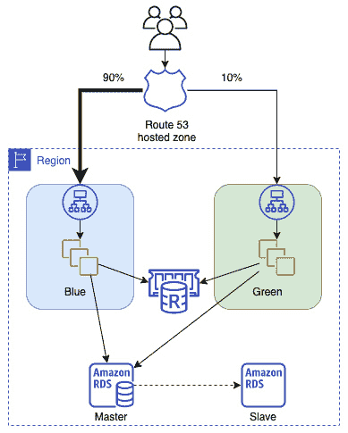

# 第十三章：蓝绿部署

通过在两个相同的环境之间切换流量来发布应用，更广为人知的就是使用蓝绿部署。了解如何通过不同的 AWS 服务进行蓝绿部署，可以帮助减少发布新版本应用时的风险。掌握各种服务的技术并理解每种服务的使用，对于通过 AWS DevOps 专业认证考试至关重要。

在本章中，我们将涵盖以下主要内容：

+   理解蓝绿部署的概念

+   你可以在蓝绿部署中使用的 AWS 服务

+   蓝绿部署在 AWS 中的优势

+   更新自动扩展组启动配置

+   在数据层中使用蓝绿部署的最佳实践

# 理解蓝绿部署的概念

当你使用蓝绿部署技术时，你在降低停机时间和风险方面采取了一个有效的措施。你通过运行一个复制环境，其中一个环境承担活跃流量，另一个环境接收更改。一旦更改完成并进行测试后，之前指向初始环境（蓝色环境）的流量可以切换到绿色环境。这个切换可以一次性完成，也可以分阶段进行，这取决于你的部署计划和所使用的服务。如果部署出现问题，你可以快速将流量重新引导回已知的稳定环境，即蓝色环境，同时修复新的环境。

蓝绿部署的基础是两个独立的环境。一个环境，即*蓝色环境*，指的是当前应用或工作负载运行的环境。第二个环境，即*绿色环境*，是一个复制的环境，你可以在其中部署更新的应用代码或工作负载更改。使用这两个独立环境的协作可以实现接近零停机时间的发布和回滚能力。

执行蓝绿部署时，你正在使用不可变的基础设施。这意味着你不会在现有基础设施上进行升级或更新，而是为每个部署过程创建一套新的资源。

## 部署过程不容易

传统的部署方式倾向于就地升级。然而，使用就地升级时，需要考虑许多风险因素：

+   资源限制

+   潜在的停机时间

+   来自其他系统的依赖

+   回滚不成功部署的困难

由于部署过程中的成本和复杂性，团队有时会选择部署到现有基础设施。这是一种可行的部署策略，但它存在固有的风险，特别是在执行像一次性全量部署这样的操作时，所有实例或应用程序都会同时更新。如果在部署过程中出现问题或故障，这通常会导致停机、收入损失、品牌信任度丧失和客户信心下降，具体情况取决于停机时间的长短。

问题

在开始规划部署时，尝试问自己，*哪些解决方案能够减少停机时间、处理依赖关系，并且能以更高效的方式协调工作负载？*

在执行部署时，有多个风险需要规避，包括以下几点：

+   应用程序故障

+   基础设施故障

使用蓝绿部署策略有助于减轻这些风险和业务影响，因为它可以实现几乎无缝的从一个环境切换到另一个环境。

在谈论部署，尤其是蓝绿部署时，*环境*这个术语经常被使用。理解“环境”定义对于理解哪些资源会发生变化至关重要。知道什么被定义为环境，在处理 AWS DevOps 专业考试的一些问题时也非常重要。

环境是一个事物变化的边界，也是需要部署事物的地方。这可以是你应用程序的一个组件，也可以是应用程序的一个完整层级，例如 Web 层。

# 可用于蓝绿部署的 AWS 服务

AWS 提供了许多原生工具，可以让你执行蓝绿部署。这些工具提供了多种部署选项，从使用像 CloudFormation 这样的服务全面控制环境的各个方面，到对 Route 53 或 Auto Scaling 等服务进行细粒度的更改。这些更细粒度的选项只允许你对应用程序的特定部分进行修改，但在实施蓝绿部署时，它们同样有效。

让我们来看一下 AWS 提供的不同服务，它们可以帮助我们进行蓝绿部署。

## AWS CloudFormation

使用 **AWS CloudFormation**，你可以利用该服务的模板功能，既可以描述你正在部署的 AWS 资源，又可以快速创建包含所需更新的环境副本。所有这些都可以通过 CloudFormation 支持的两种语言之一：JSON 或 YAML 来完成。

模板可以是更广泛基础设施中的小组件。通过 CloudFormation 模板，您可以创建一组相关的项目，例如自动扩展组，然后使用该组的输出更新先前创建的模板，该模板包含负载均衡器，并更新其指向的位置，或者使用新创建的自动扩展组手动进行切换。

## AWS Elastic Beanstalk

**Elastic Beanstalk** 是一项服务，帮助开发者集中精力于代码，而由它管理底层基础设施。这包括如 ELB、EC2 实例、带有 EBS 卷的 EC2 实例存储、弹性 IP、自动扩展组、安全组，甚至通过 CloudWatch 指标进行监控等内容。

在 Elastic Beanstalk 中执行蓝绿部署时，您可以轻松克隆环境。这些克隆可以是当前应用程序代码库的精确副本，或者如果自上次部署以来您推送了功能和更改，它们甚至可以是代码的最新版本。Elastic Beanstalk 使使用该服务的用户可以轻松地通过“交换环境 URL”功能从一个环境切换到另一个环境。此功能会在后台进行 DNS 切换，并将流量从先前的（蓝色）环境重定向到新的（绿色）环境。

## AWS CodeDeploy

**AWS CodeDeploy** 是一项托管部署服务，帮助自动化将您的软件部署到本地服务器、EC2 实例、AWS Lambda 函数和 AWS Fargate 容器。当使用 AWS CodeDeploy 创建部署时，您可以选择就地部署或蓝绿部署。

使用蓝绿部署选项，您可以在环境配置中设置 CodeDeploy 自动复制您的 EC2 自动扩展组，或手动配置实例进行蓝绿部署。还可以启用负载均衡选项。此外，还可以选择在部署完成后自动重定向流量，或者允许在部署到新实例或自动扩展组后手动重定向流量。

甚至可以使用 CodeDeploy 服务将 CloudFormation 模板集成在一起，以执行蓝绿 ECS 部署。

## AWS ELB

**AWS ELB**（**ELB**）是一项计算服务，允许您将流量路由并分发到多个实例、IP 地址、Lambda 函数、容器，甚至虚拟容器。由于 ELB 是一项托管服务，它还可以执行健康检查，以确定哪些实例健康，哪些实例需要停止接收流量：

图 13.1 – 应用程序负载均衡器使用目标组同时将流量部署到两个版本的应用程序

使用应用负载均衡器的目标组，你可以通过金丝雀部署（蓝绿部署的一种变体）将应用的新版本推送到部分用户。通过使用多个与同一应用负载均衡器连接的目标组，你可以确定将多少流量引导到应用程序的每个版本。

## Amazon ECS

亚马逊 **ECS** (**ECS**) 使用任务使 Docker 容器的分组在 AWS EC2 实例上更易于运行、停止和管理。通过 ECS，你可以使用服务调度程序安排容器何时被放置在实例上。ECS 还允许你在同一区域但不同的可用区内，将运行相同任务的多个容器分布在多个 ECS 兼容实例上：

图 13.2 – 使用 ALB 在 ECS 中从目标组 1 切换到目标组 2

容器的使用使得部署，特别是蓝绿部署，更加简便。容器不像完整的实例那么复杂，多个容器可以在同一个 EC2 实例中运行，即使它们运行的是不同版本的应用程序。

## Amazon 弹性 Kubernetes 服务

亚马逊 **弹性 Kubernetes 服务** (**EKS**) 允许你在 AWS 云和本地环境中运行和扩展 Kubernetes 应用程序。它通过提供安全的集群来帮助管理集群，并允许集群具有高可用性。

EKS 可以在专用的 EC2 实例上运行，也可以在 **AWS Fargate** 上运行，后者为容器提供按需计算能力。使用 Fargate 无需为实例进行配置，选择服务器类型或管理虚拟机。

你可以借助 AWS Fargate 上的 EKS 和 CodeDeploy 服务的蓝绿部署功能来执行蓝绿部署。当你为 EKS 创建新的蓝绿部署时，指定一个前端 Kubernetes 任务的应用负载均衡器名称，CodeDeploy 服务会处理新绿色服务的部署，然后逐步淘汰旧的蓝色任务。

## AWS OpsWorks

**AWS OpsWorks** 是一项配置管理服务，允许你根据 Chef 或 Puppet 框架来配置堆栈。

使用 OpsWorks，蓝绿部署变得更简单，只需克隆整个堆栈。

## Amazon CloudWatch

**Amazon CloudWatch** 是一项指标和监控服务，允许用户跟踪和观察已部署的资源。CloudWatch 服务还具有设置警报并通过其他服务（如 Amazon SNS 或 Amazon SES）发送通知的能力。

当在蓝绿环境中的资源上设置了指标时，你就可以在开始将流量导向新环境时评估该环境。保持关注你在 CloudWatch 中设置的指标，并确保所有服务在切换到新环境时保持稳定状态，这有助于缓解切换到新环境时的焦虑。

## 亚马逊 Route 53

**亚马逊 Route 53** 是一种 DNS 服务，可以在蓝绿部署中使用，通过将 DNS 记录指向新的绿色环境。这使得 DevOps 专业人员和网络管理员可以通过更新 DNS 记录快速且轻松地重定向流量。Route 53 还包括高级功能，例如调整资源记录的 **生存时间（TTL）**，以及使用加权策略等先进技术，使得流量可以逐步转移到新环境，而不是一次性全部重定向。

现在我们已经了解了可以用来实现蓝绿部署的不同服务，让我们来看一下使用蓝绿部署的好处。

# 使用 AWS 的蓝绿部署的好处

使用蓝绿部署策略相比于原地部署提供了多重好处。需要注意的是，尽管这些好处相当显著，但在蓝绿过程中新创建的附加环境会带来额外的成本。验证完部署后，副环境可以被拆除，或者如果部署失败，回滚完成后副环境也可以被移除。

# 在 AWS 中执行蓝绿部署的技术

在 AWS 中实现蓝绿部署可以通过多种方式进行。已经出现了一些经过验证的模式，用于成功实现这些部署。在我们查看每种技术时，将重点介绍所使用的具体服务。不同的应用程序倾向于采用不同的模式。

## 使用 Route 53 更新 DNS 路由

Route 53 服务允许你在启动新环境后使用托管区域。将额外的记录添加到记录集中，然后就可以为终端用户创建无缝过渡到新的应用程序部署：

图 13.3 – 显示使用 Route 53 托管区域的蓝绿部署

这种切换可以一次性完成，将所有流量强制导向新的绿色环境。你也可以使用加权记录将一部分流量发送到绿色环境，最初作为金丝雀测试。这些金丝雀用户将生成日志和指标，可以在一段时间内进行评估。如果在新环境中没有报告错误，那么你可以改变策略的权重，使得 100%的流量现在都被引导到绿色环境。

这种技术不仅限于在相同的可用区集或甚至相同的区域内创建新的绿色环境。您可以在完全不同的区域创建新的绿色环境。如果您计划在环境中切换区域，请确保已考虑到您的数据层以及在区域切换期间可能受到的影响。

这也不限于实例或服务在负载均衡器后监听请求的情况。使用 Route 53 的 DNS 路由切换可以应用于以下所有场景：

+   由 ELB 管理的 EC2 实例组或集群

+   由 ELB 管理的 Auto Scaling 组中的实例

+   具有公共地址或弹性 IP 地址的单个实例

+   在指定环境中的 Elastic Beanstalk Web 应用程序

+   在 ECS 或 EKS 中运行的服务

### 部署过程 – DNS 路由

使用 Route 53 切换托管区实现蓝/绿部署的过程详见以下内容：

1.  开始时将所有流量的 100%引导到**蓝色**环境，使用当前版本的应用程序部署。

1.  部署应用程序的新版本到**绿色**环境。

1.  测试绿色堆栈部署是否成功，可以通过运行一系列手动或脚本化的测试来进行验证。

1.  更新 Route 53 托管区中的加权记录，将一部分流量引导到新的绿色环境。

1.  监控新环境以检测错误或失败。

1.  更新 Route 53 托管区中的加权记录，将剩余流量转移到**绿色**环境。

1.  如果部署出现问题，请更新 Route 53 记录，将所有流量重新导向**蓝色**环境。

现在我们已经看到如何使用 DNS 和 Route 53 进行蓝/绿部署，接下来让我们看看如何在不改变 DNS 设置的情况下进行蓝/绿部署。

## 在 ELB 后面交换自动缩放组

在我们的第二个蓝/绿部署选项中，我们将排除 DNS 选项。在许多组织中，负责应用部署的团队与处理包括由 Route 53 服务托管的 DNS 记录在内的网络配置的团队并不相同。因此，我们需要为这些情况做好准备：

图 13.4 – 通过交换自动缩放组部署蓝/绿环境

一旦启动了新的自动缩放组，您需要在注册新的自动缩放组（即绿色自动缩放组）到 ELB 之前，在新的绿色堆栈上执行一系列测试。

重要说明

我们将进行创建和部署自动缩放启动模板的实际操作练习，详见*第十八章*，*自动缩放和生命周期挂钩*。

这里需要注意的一个重要事项是，ELB 仅在注册和注销方面参与部署过程。在部署软件的新版本时，你并没有部署一个新的负载均衡器。

### 部署过程 – 替换自动伸缩组

通过替换自动伸缩组来执行蓝绿部署的过程如下：

1.  在开始之前，确保你的 ELB 实例不属于你的部署环境。

1.  开始时，ELB 实例指向**蓝色**自动伸缩组。

1.  部署新的**绿色**自动伸缩组。

1.  测试**绿色**自动伸缩组。

1.  将**绿色**自动伸缩组注册到 ELB 实例。

1.  从 ELB 实例中注销**蓝色**自动伸缩组。

现在我们已经了解了如何通过替换自动伸缩组来执行蓝绿部署，接下来我们将探讨另一种也使用自动伸缩组的蓝绿部署技术。

## 更新自动伸缩组的启动配置

每个自动伸缩组都与一个启动配置相关联。启动配置包含在伸缩事件发生时启动新实例所需的信息。

创建一个新的启动模板（或启动配置）。这个新的启动配置包含更新的 AMI、更新的用户数据，或者两者：

图 13.5 – 通过替换启动配置部署蓝绿环境

### 部署过程 – 更新自动伸缩组启动配置

通过更新自动伸缩组启动配置来执行蓝绿部署的过程如下：

1.  确保你的 ELB 实例不参与部署过程。

1.  从将流量导向当前使用蓝色启动配置的自动伸缩组开始。

1.  创建一个新的启动配置（绿色启动配置），并将其附加到自动伸缩组。

1.  将自动伸缩组扩展为其原始大小的**两倍**。

1.  一旦绿色自动伸缩组的实例启动并变得健康，将自动伸缩组缩减回原始大小。

## 更新 ECS

将你的应用程序打包到容器中可以让部署变得更容易。

使用目标组，可以让你在单个负载均衡器后运行多个服务。一个可以是蓝色服务，另一个可以是绿色服务。

执行蓝绿部署的关键环节之一是应用程序负载均衡器。ECS 任务是在应用程序负载均衡器上注册的：

图 13.6 – 使用 ECS 服务更新进行蓝绿部署

在使用这种方法时，你需要考虑以下事项：

+   你的代码需要是完全无状态的。

+   不支持金丝雀部署。

+   在任务切换期间，长期运行的连接将被突然终止。

### 部署过程——更新 ECS

通过更新 ECS 进行蓝绿部署的过程如下：

1.  从一个定义了任务定义并指向应用负载均衡器的蓝色服务开始。

1.  接下来，创建一个新的任务定义，该任务定义基于新创建的容器中的新应用版本；这个版本就是你的绿色版本。

1.  使用绿色任务定义扩展绿色服务，并将该绿色服务映射到应用负载均衡器。

1.  通过将任务数设置为零来缩减蓝色服务的规模。

现在我们已经了解了如何使用容器和 ECS 执行蓝绿部署，让我们看看如何使用 Elastic Beanstalk 服务在蓝绿部署中快速交换应用版本。

## 交换 Elastic Beanstalk 应用程序的环境

如果你打算使用蓝绿部署策略与 Elastic Beanstalk 配合使用，则必须确保你的应用环境与数据库分离：

图 13.7 – 通过交换 Elastic Beanstalk 应用程序进行蓝绿部署

### 部署过程——交换 Elastic Beanstalk 环境

执行交换 Elastic Beanstalk 环境以进行蓝绿部署的过程如下：

1.  打开 AWS 管理控制台，进入 Elastic Beanstalk 服务，确保你处于正确的区域来管理你的 Beanstalk 应用。

1.  克隆你的环境。你可以在不对当前平台做任何更改的情况下进行克隆，或者选择`Clone with latest platform`来使用平台 Git 分支的最新版本。这个新平台将成为你的绿色环境。

1.  如果你仅克隆了环境，你将需要将应用的新版本部署到绿色环境。

1.  你现在可以使用绿色环境 ELB 所赋予的唯一 DNS 名称测试新环境。

1.  在环境概览页面，选择`Environment Actions | Swap URLs`。

1.  来自 Route 53 的流量现在将被定向到绿色环境。

我们已经看到如何使用 Elastic Beanstalk 服务的 Swap URLs 功能轻松进行蓝绿部署。接下来，让我们看看如何通过克隆 OpsWorks 堆栈在 OpsWorks 服务中执行蓝绿部署。

## 克隆 OpsWorks 堆栈并更新 DNS 记录

当你在 AWS OpsWorks 中创建应用时，你需要首先创建一个堆栈。一个 OpsWorks 堆栈由一个或多个层组成。堆栈创建后，可以轻松克隆为其精确副本，从而创建一个全新的环境。在这个新环境中，你可以更新你的配方并部署应用的新版本。你甚至可以在 ELB 上使用本地 DNS 名称，在将任何流量路由到新堆栈之前测试应用的新版本。

将托管应用程序的 OpsWorks 堆栈与 Route 53 服务结合使用，指向你的 CNAME 流量，你可以在部署新版本应用程序时，快速轻松地在堆栈之间切换。

图 13.8 – 克隆 OpsWorks 堆栈

### 部署过程——克隆 OpsWorks 堆栈

通过克隆 OpsWorks 堆栈来进行蓝绿部署的过程如下：

1.  从你当前的堆栈开始，这是你的蓝色堆栈，包含当前版本的应用程序。

1.  接下来，通过克隆堆栈创建新的堆栈，这就是你的绿色环境。你可以通过在控制台中点击克隆链接或使用 CLI 来完成此操作。

1.  将新版本的应用程序部署到绿色环境的应用程序层。此时，应该没有任何流量被指向绿色环境。

1.  如果需要，预热你的 ELB，以便它能处理你的客户基础的流量。

1.  当你准备将绿色堆栈提升为用于生产的堆栈时，更新 DNS 记录，指向通过 Route 53 的 ELB。这可以一次性完成，也可以逐步进行。

1.  当你对部署感到满意时，你可以停用蓝色堆栈。

现在我们已经讨论了使用各种 AWS 服务进行的不同蓝绿部署技术，接下来我们将讨论数据层。

# 在蓝绿部署中使用最佳实践来管理数据层

部署新版本应用程序时可能出现的一个更重要的风险是对数据库进行更改。尤其是在执行蓝绿部署时，这一点尤为重要，因为蓝绿部署的核心目的是减轻风险，并能够快速回滚。

如果你使用的是 Amazon RDS，建议在开始部署之前创建数据库快照，特别是如果你将执行任何数据库更改。这将允许你在数据部署没有按计划进行时从快照中恢复，并尽可能减少停机时间。

## 将模式更改与代码更改分开

在进行部署时，将任何数据库更改（例如模式更改）与应用程序部署分开是至关重要的。你执行某些数据库更新的顺序可能取决于你正在执行的模式更改类型。

通常，当需要进行模式更改时，你可以采取两种方法，而何时使用其中一种方法取决于模式更改是否向后兼容，并且能否与当前版本的应用程序一起工作：

图 13.9 – 在蓝绿部署期间进行数据库模式更改的过程

第二种方法是在进行部署后进行模式更改竞争。这种方法最适合那些与当前应用版本不兼容的更改，如果在部署之前进行，将导致当前版本应用的错误。

有时你需要执行两个独立的模式更改。这种情况发生在你既有一组非破坏性更改，也有一组破坏性更改。通过将更改分为两个独立的部署，你对数据库进行了较小的增量更改，因此通过将步骤分解为较小、易于管理的部分，从而减少了风险。

# 总结

在本章中，我们讨论了蓝绿部署，它们是什么，以及如何成功地进行蓝绿部署。我们还谈到了在 AWS 中可以用来成功执行蓝绿部署的服务，以及使用每项服务执行部署的过程。最后，我们探讨了在实施部署时如何处理数据更新，重点讲解了哪些模式更改应该首先进行。

在下一章中，我们将开始关注环境和工作负载的监控与日志记录。这从了解 CloudWatch 和 X-Ray 服务在 DevOps 中的角色开始。

# 复习题

1.  一家公司聘请你帮助他们在 AWS 上设计应用架构。该公司要求有一个可以自动扩展的硬化 AMI，作为应用的一部分。该应用同时监听 HTTP 和 TCP 端口，因此你决定使用可以处理这两种协议的经典负载均衡器。还有一个虚拟 CNAME，托管在 Route 53 上。蓝绿部署必须是此架构的一部分。你可以在 Route 53 中使用哪种路由策略来实现蓝绿部署？

    a. 多选

    b. 延迟

    c. 加权

    d. 简单

1.  你正在执行蓝绿部署，更新 Elastic Beanstalk 中的应用环境。创建了一个与现有的*蓝色*环境相同的*绿色*环境，并将新版本的应用程序部署到绿色环境后，接下来应该做什么来切换到新的*绿色*环境？

    a. 更新 DNS 记录，指向绿色环境。

    b. 使用 Amazon Route 53 将流量重定向到新的绿色环境。

    c. 替换当前指向环境负载均衡器的自动扩展启动配置。

    d. 选择交换环境 URL 选项。

1.  一家公司聘请了你，因为他们需要帮助在 AWS 上实施蓝绿部署流程。在新环境部署后，他们希望能够逐步将流量从蓝色环境切换到新的绿色环境。应用程序已经部署在 EC2 实例上，这些实例位于一个自动扩展组中，背后有应用程序负载均衡器。Route 53 正在将消费者流量路由到负载均衡器。最后，应用程序的数据层由 PostgreSQL RDS 多可用区数据库实例组成。

    哪三个步骤可以成功实现蓝绿部署过程？

    a. 创建一个新的应用程序负载均衡器和一个新的自动扩展组。

    b. 在当前负载均衡器后创建一个新的自动扩展组。

    c. 在 Route 53 中创建一个新的别名记录，指向绿色环境，并为两个记录设置故障转移策略。

    d. 在 Route 53 中创建一个新的别名记录，指向绿色环境，并在两个记录之间使用加权路由。

    e. 在你的新自动扩展组中，设置 EC2 实例使用相同的 RDS 实例。

    f. 在你的新自动扩展组中，设置 EC2 实例使用 RDS 的故障转移节点。

# 查看答案

1.  C

1.  D

1.  A、D 和 E
