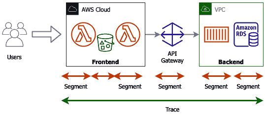

# 第十五章：CloudWatch 和 X-Ray 在 DevOps 中的作用

一旦你的应用程序在云中运行，你就需要一个方法来监控它，以确保它保持健康并有效地运行。**CloudWatch** 可以汇总你的服务和应用程序的日志，但将其与**X-Ray**结合使用，可以追踪应用程序的性能，找出进一步提升性能的地方。

在本章中，我们将涵盖以下主要内容：

+   CloudWatch 概述

+   使用 CloudWatch 汇总你的日志

+   CloudWatch 告警

+   为应用程序追踪添加 X-Ray

# CloudWatch 概述

监控有许多重要原因，从运营角度到商业角度都很重要。首先，它让你不仅可以看到环境中运行的内容，还能了解这些资源的性能。其次，从运营角度来看，当你尝试实时解决问题时，监控非常关键。从商业角度来看，监控让你知道一些关键事项，比如你的部署是否已成功完成，客户是否没有看到任何负面影响。

在今天这个信息可以迅速通过互联网，尤其是社交媒体渠道传播的时代，任何影响客户体验的事情都可能并且通常会迅速传播。这会影响你的品牌和商业利润。通过 CloudWatch 监控你的资源可以让你走在前面，采取主动而非被动的应对方式：


图 14.1 – 监控如何持续演变

你今天监控系统和资源的方式可能与 5 到 10 年前监控方式有所不同。诸如基础设施变化和瀑布式部署哲学等因素决定了需要监控的内容。

过去，你可能需要配置一台服务器，并且这台服务器会运行长达十年才会被淘汰。然而，随着云服务的发展，如自动扩展，根据需求不断增加和移除实例，所监控的指标不仅要与系统健康相关，还要与客户体验的性能相关：


图 14.2 – AWS CloudWatch 的功能

亚马逊 CloudWatch 是一项 AWS 原生服务，帮助你监控服务和资源。它是 AWS 提供的管理工具的一部分。CloudWatch 的主要功能是帮助你跟踪和监控资源和应用程序的性能。在监控过程中，CloudWatch 服务可以通过 SNS 服务通知人员，或通过事件触发自动化响应这些告警。CloudWatch 还可以用于收集和监控日志文件。CloudWatch 包括三个主要组件：*指标*、*告警*和*事件*。

## 了解和使用 CloudWatch 统一代理

AWS 提供了一个统一的 CloudWatch 代理，可以帮助你处理多种事情，无论是对本地服务器还是 EC2 实例。让我们回顾几个使用 CloudWatch 统一代理的常见场景。

### 以不同用户身份运行

在 Linux 服务器上运行 CloudWatch 代理时，CloudWatch 代理默认作为 root 用户运行。如果你的公司不允许代理和程序以 root 用户身份运行，那么你可以为 CloudWatch 代理创建一个自定义用户，并在配置文件中告诉代理 `run_as_user`。

### 拥有多个 CloudWatch 代理配置文件

基于经批准的**Amazon 机器映像**（**AMI**）构建的组织，必须用于任何开发或生产构建，可以将 CloudWatch 配置文件预先配置到实例中。这个配置文件将允许跨所有实例收集标准配置。开发团队可以添加另一个配置文件，CloudWatch 代理可以在启动时读取并处理，其中包括任何特定的应用程序指标或日志。

一个例子是，如果应用团队正在运行一个 NGINX 服务器来为其 Web 应用提供前端，或者他们可能使用 NGINX 的代理功能来重定向流量。他们的自定义配置文件可以指定查找 NGINX 的 4XX 和 5XX 错误，同时也可以配置消费这些日志并将其发送回 CloudWatch Logs。

### 将指标和日志发送到与实例运行所在账户不同的账户

CloudWatch 代理具有灵活性，可以通过在配置中指定 `role_arn` 将指标、日志或两者发送到另一个 AWS 账户进行监控。

### 向 CloudWatch 代理收集的指标添加自定义维度

CloudWatch 会创建它收集的指标的汇总。这些汇总可能并不总是最适合你和你的团队，因此，可以通过使用 `append_dimensions` 字段自定义分组方式。

我们刚刚看到，无论是在 AWS EC2 实例还是本地服务器上使用的统一 CloudWatch 代理，都可以在多种场景下收集日志和指标。现在，让我们通过在 EC2 实例上安装 CloudWatch 代理的过程。

## 在 EC2 实例上安装 CloudWatch 代理

了解 CloudWatch 统一代理的最佳方法是通过在 EC2 实例上安装代理的过程。以下教程将带你完成搭建 EC2 实例的步骤，然后安装和配置代理。最后，我们将向 EC2 实例发送一些流量，以便查看生成的指标和日志。

注意

在下一章中，我们将更深入地探讨 CloudWatch 指标。*第十五章*，*CloudWatch 指标和 Amazon EventBridge*，将讨论通用指标和自定义指标。

到目前为止，我们在示例中一直使用 Amazon Linux 作为任何 EC2 实例的操作系统。Amazon Linux 是一个优秀的操作系统，并且预安装了许多在 AWS 云计算环境中使用的软件包。这正是我们在本示例中使用不同操作系统——*Ubuntu*——的原因。Ubuntu 操作系统默认并不会安装一些软件包，例如 CloudWatch 统一代理。这使得我们可以在这个 EC2 实例上通过安装过程来进行操作，但如果你在数据中心有一个 EC2 实例，过程是一样的，只不过你需要使用密钥对对实例进行身份验证，而且这个密钥对会定期轮换。而 EC2 实例可以扮演角色，因此不需要将访问密钥和秘密密钥存储在实例上，实际上，扮演角色是一种更安全的做法。让我们开始吧：

1.  首先，让我们为实例创建 IAM 角色；我们需要确保实例具有 CloudWatch 和 AWS Systems Manager 的权限。要创建角色，我们需要在本地保存一个初始的`JSON`策略文件，然后附加所需的两个托管策略。将`JSON`策略复制到名为`STS.json`的文件中：

    ```
    {
      "Version": "2012-10-17",
      "Statement": {
        "Effect": "Allow",
        "Principal": {"Service": "ec2.amazonaws.com"},
        "Action": "sts:AssumeRole"
      }
    }
    ```

1.  保存好初始策略后，我们现在可以创建角色并附加这两个托管策略：

    ```
    aws iam create-role --role-name CW-EC2 --assume-role-policy-document file://STS.json
    aws iam attach-role-policy --policy-arn arn:aws:iam::aws:policy/AmazonSSMManagedInstanceCore --role-name CW-EC2
    aws iam attach-role-policy --policy-arn arn:aws:iam::aws:policy/CloudWatchAgentServerPolicy --role-name CW-EC2
    ```

1.  由于我们将通过 CLI 启动我们的实例，因此需要创建一个实例配置文件。一旦实例配置文件创建完成，我们就可以将新的角色附加到`instance profile`：

    ```
    aws iam create-instance-profile --instance-profile-name CW_SSM
    aws iam add-role-to-instance-profile --role-name CW-EC2 --instance-profile-name CW_SSM
    ```

1.  然后，我们需要查询`SSM`参数存储中的 AMI，我们希望使用该 AMI 来启动我们的镜像：

    ```
    AMI='aws ssm get-parameters --names \      /aws/service/canonical/ubuntu/server/16.04/stable/current/amd64/hvm/ebs-gp2/ami-id \
        --query 'Parameters[0].[Value]' --output text --region us-east-2'
    ```

    如果你想查看返回的 AMI 值，可以使用以下命令：

    ```
    echo $AMI
    ```

1.  我们稍后需要进入我们的实例，但与其创建密钥对，不如添加以下脚本，该脚本将安装 SSM 代理和统一的 CloudWatch 代理，适用于 Debian 操作系统。我们将创建此脚本并将其保存为名为`agents.sh`的文件，这样我们就可以在稍后通过`user-data`参数启动 EC2 实例时使用它。

    安装 SSM 代理和`the` `unified` `CloudWatch` `agent`的脚本如下：

    ```
    Chapter-14 folder of this book's GitHub repository under the same name – agents.sh. 
    ```

1.  一旦我们将`AMI`值存储到变量中，就可以使用以下命令启动我们的镜像：

    ```
    user-data script, which we just created, as well as a Name tag for our instance. This name will help us identify our instance when we try to find it later. 
    ```

1.  当我们的实例正在启动并运行我们提供给它的启动脚本时，我们可以登录到 AWS 控制台，并直接使用以下网址访问 SSM 会话管理器：[`console.aws.amazon.com/systems-manager/session-manager`](https://console.aws.amazon.com/systems-manager/session-manager)。登录后，在右上角检查确保您所在的区域正确。我们指定我们的实例启动在俄亥俄州区域（`us-east-2`），如果列出了其他区域，请切换到您创建实例的区域。作为替代，您也可以通过**EC2**屏幕选择实例，然后从**操作**下拉菜单中选择**连接**。在**连接到实例**屏幕中，选择**会话管理器**，然后点击橙色的**连接**按钮。连接到实例时，应该会弹出一个包含您会话的新窗口。

1.  现在我们已经成功地通过 SSM 连接到实例，而不需要使用密钥，我们可以配置代理。我们已经使用`user-data`脚本中的一些命令安装了 CloudWatch 代理。为了将一些日志流传输到 CloudWatch Logs，我们需要告诉代理具体要推送哪些日志。我们需要以`sudo`用户身份运行配置脚本，脚本位于`/opt/aws/amazon-cloudwatch-agent/bin/amazon-cloudwatch-agent-config-wizard`。为了简化命令，我们将通过`sudo su`命令切换到 root 用户：

    ```
    sudo su 
    /opt/aws/amazon-cloudwatch-agent/bin/amazon-cloudwatch-agent-config-wizard
    ```

1.  运行 CloudWatch 代理配置管理器时，您将被提示回答一些问题，但设置应该不会超过 5 分钟。这里显示的问题是那些没有选择默认值的：

    +   您想要选择哪个默认的指标配置？标准（2）日志文件路径：`/var/log/amazon/ssm/amazon-ssm-agent.log`。

    +   您是否想指定任何其他日志文件进行监控？不（2）。

    +   您是否希望将配置存储在 SSM 参数存储中？不（2）。

1.  配置向导完成后，由于我们使用的是 Ubuntu 操作系统，我们将把新生成的`config`文件复制到代理预期的位置，并将文件所有权授予`cwagent`用户：

    ```
    cp /opt/aws/amazon-cloudwatch-agent/bin/config.json /opt/aws/amazon-cloudwatch-agent/etc/amazon-cloudwatch-agent.json
    chown cwagent /opt/aws/amazon-cloudwatch-agent/etc/amazon-cloudwatch-agent.json
    ```

1.  现在我们的 CloudWatch 代理文件已经配置完成，我们需要重新启动代理以使更改生效。我们可以通过以下命令实现这一点：

    ```
    & symbol at the end of the command will put the script in the background so that you can do other things, and the script will still be running.
    ```

1.  我们生成日志的首要方式之一是点击橙色的`CloudWatch`服务。服务名称出现后，点击**CloudWatch**将带您进入该服务。

1.  一旦进入`amazon-ssm-agent.log`，点击该日志组的名称，将带您进入日志流。

1.  日志组中应该只有一个日志流。该日志流的名称将是您 AWS EC2 实例的标识符。点击这个**日志流**，以便我们查看日志：

    图 14.3 – 我们 CloudWatch 日志组中的单个日志流

1.  如果您已经退出了您的`Session` `worker` `closed`。任何在 CloudWatch 代理运行期间退出**会话管理器**的情况，都应该出现在日志列表中。您可以点击日志左侧的小三角形来展开内容，查看完整的日志条目。

    注意

    我们将继续使用此实例进行本章的进一步练习。如果您打算稍后继续操作，我建议您将此实例置于休眠状态，这样您就不会因此而产生费用。这样，等到您准备好再次操作时，就无需重新配置一切。

现在，我们已经将统一的 CloudWatch 代理添加到非 Amazon 实例上，接下来我们将看一下 CloudWatch Logs 的一些其他功能。如果您打算在短时间内完成下一次使用 CloudWatch 警报的练习，我建议您要么保持此实例运行，要么仅仅停止实例，这样您可以访问 CloudWatch 代理汇总并推送的指标，供警报使用。

# 使用 CloudWatch 聚合日志

亚马逊的 CloudWatch 服务不仅是一个强大的监控工具，还允许您将操作系统、应用程序、自定义日志文件甚至 CloudTrail 日志等多种类型的日志路由到 CloudWatch Logs 的可靠存储中。

CloudWatch Logs 允许您将来自相同来源（日志流）的日志进行分组，然后使用筛选模式在这些组中进行搜索。筛选模式类似于 CloudWatch 版的正则表达式，允许您在日志流和日志组的不同字段中进行搜索。

使用订阅，您可以将特定日志流中的所有日志或仅符合特定筛选模式的日志推送出去。您可以将订阅数据推送到 Amazon Kinesis 流进行实时数据处理，或推送到 Lambda 函数进行事件驱动处理。您甚至可以使用 Lambda 函数将通过日志推送到一个或多个 CloudWatch 日志组的日志，直接推送到托管的 Elasticsearch 服务，以便通过 Kibana 界面进行更轻松的搜索和图形趋势分析。

在简要了解 CloudWatch Logs 之后，接下来让我们深入了解一下我们刚才提到的一些术语，以及它们在 CloudWatch Logs 中是如何协同工作的。

## CloudWatch Logs 术语

当我们深入探讨 CloudWatch Logs 时，有一些术语是我们需要熟悉的，尤其是在接下来的练习和专业考试的上下文中：

**筛选模式**：限制哪些日志会被转发到 AWS 目标资源的过滤表达式。

**日志事件**：在 CloudWatch Logs 中记录的某项活动的记录被称为日志事件。事件消息必须是 UTF-8 格式。

**日志流** 和 **日志组**：共享相同来源的一组日志流在 CloudWatch Logs 控制台中被归为日志组。一个日志组中可以包含任意数量的日志流。

**指标过滤器**：通过使用指标过滤器，你可以从接收到的事件中提取数据。然后，你可以将这些数据转换为 CloudWatch 指标上的数据点。指标过滤器被分配给日志组。特定日志组中的所有日志流都会分配这些特定的指标过滤器。

**保留设置**：你的日志文件在 CloudWatch Logs 中的保留时间由保留设置决定。默认情况下，日志会被永久保存，不会过期。如果你不需要保存日志超过指定时间，这可能会导致额外的费用。你可以为每个日志组选择 1 天至 10 年之间的保留期限，一旦达到该保留期限，日志将自动删除：


图 14.4 – 从资源到 CloudWatch Logs 的日志流动

使用我们刚刚学到的术语，在前面的图示中，我们可以看到从 AWS 资源生成的日志如何成为日志流。一个或多个日志流会被合并形成一个日志组。日志流然后根据保留设置被保留或删除。

接下来，我们将学习如何使用 CloudWatch Logs 的一个功能 —— Insights，来分析 CloudWatch Logs 服务所捕获的数据。

# CloudWatch 警报

除了将日志发送到存储并进行搜索，监控系统的另一个方面是当出现问题时接收警报。这些警报可以是简单的通知，让你知道某个服务或服务器没有响应。也可以是主动警报，提醒你所运行应用的平台的 CPU 或内存即将耗尽，需要在更大问题发生之前进行扩展。

你可以使用 **CloudWatch** 服务来监控单一指标或多个条件以创建警报。当基础资源的指标满足某个标准时，可以触发这些警报。在 CloudWatch 中，你可以创建两种类型的警报：指标警报和复合警报。

**指标警报** 监控 CloudWatch 的特定指标。它有一个监控阈值，该阈值在初次创建时设置，同时还有一个可以突破阈值的周期数，超过该周期数后会进入警报状态。一旦触发该警报状态，就可以配置相应的操作。可用的操作包括向 SNS 主题发送通知、执行 EC2 操作、执行 AutoScaling 操作，或在 Systems Manager 中创建 OpsItem 或事件。

**复合警报** 使用你创建的多个警报状态，以便在警报触发时创建特定条件。

一旦告警触发，你可以让告警执行各种操作，如下所示：

+   停止、终止或重启一个 EC2 实例。

+   让自动伸缩组进行扩容或缩容。

+   向 AWS SNS 主题发送通知消息。


图 14.5 – CloudWatch 告警示例

在准备 DevOps 专业考试时，有一些关于 CloudWatch 告警的事实你应该知道。虽然专业考试不会直接考察这些事实，但它们可以融入到更大的场景中：

+   告警名称只能由 ASCII 字符组成。

+   每个区域、每个账户最多可以创建 5,000 个告警。

+   你可以将告警添加到 CloudWatch 仪表板中。

+   你可以通过使用`SetAlarmState`设置来测试告警（无论是启用还是禁用告警）。

+   CloudWatch 服务保存告警历史记录 2 周。

接下来，我们将创建一个 CloudWatch 告警并创建一些事件来触发告警。为了接收告警通知，我们还需要创建一个 SNS 主题。然而，如果你已经有一个 SNS 主题并希望使用该现有主题，可以跳过这一步。只要确保如果跳过这一步，你已经订阅了该主题。

## 创建一个 CloudWatch 告警

你应该已经有一个 EC2 实例，它正在生成从我们上一个练习中建立的指标。我们将使用这个实例的指标来监控告警，并通过施加负载使告警被触发。

为了接收告警通知，我们需要一个 SNS 主题，供我们订阅电子邮件地址：

1.  打开终端并输入以下命令来创建`topic`：

    ```
    topic was created successfully, then it should return something like this:

    ```

    {

    "TopicArn": "arn:aws:sns:us-east-2:470066103307:cwatch"

    }

    ```

    ```

1.  现在我们有了`topic`，我们需要使用`subscribe`并填写我们的电子邮件地址：

    ```
    JSON statement telling you that the subscription is pending:

    ```

    {

    "SubscriptionArn": "待确认"

    }

    ```

    ```

1.  现在，我们需要进入我们的电子邮件账户，找到 SNS 服务刚刚发送的电子邮件。然后，我们必须点击上面写有**确认订阅**的链接。

1.  创建了 SNS 主题后，我们可以返回 AWS 管理控制台，导航到`CW_Agent`并记下实例 ID。一旦记下了这个信息，去导航栏左上方的**服务**下拉菜单中选择 CloudWatch 服务。打开 CloudWatch 服务的新标签页，我们稍后需要回到这个实例来测试我们的告警。

1.  一旦进入 CloudWatch 服务，从左侧菜单中找到**告警**菜单设置。点击该菜单项以展开并查看子菜单项。展开后，点击**所有告警**，这样你就能进入**告警**页面。

1.  在**告警**页面，点击标有**创建告警**的橙色按钮来创建新的告警。这将弹出创建告警的提示。

1.  点击**选择指标**按钮。这将弹出一个对话框，您可以选择指标。找到**自定义命名空间**，然后点击**CWAgent**。进入**CWAgent**命名空间后，选择标记为**ImageId, InstanceId, InstanceType**的分组，并点击该链接。

1.  找到名为`mem_used_percent`的指标。然而，在点击选择框之前，请确保`InstanceId`与您之前找到的实例 ID 匹配。如果一切匹配，则选中该指标左侧的复选框，以便在警报中使用此指标。当您选择此指标或任何其他指标时，顶部将显示一个图形，显示您所选指标的记录值。点击页面底部的橙色**选择指标**按钮继续：

    图 14.6 - 在创建 CloudWatch 警报时选择要监控的单一指标

1.  向下滚动至`20`。更改这些值后，点击橙色的**下一步**按钮。

1.  现在，在**通知**屏幕上，使用以下选择。填充完所有部分后，向下滚动到页面底部并点击橙色的**下一步**按钮：

    a. **警报状态触发器**：在警报中。

    b. **选择 SNS 主题**：选择一个现有的 SNS 主题。

    c. **发送通知到**：选择您刚刚创建的 cwatch 通知主题。

1.  接下来，在`chapter14`处作为警报名称。点击橙色的**下一步**按钮。

1.  最后，在**预览并创建**页面，向下滚动到页面底部，逐一检查页面上的各项值。如果一切看起来正常，请点击页面底部的橙色**创建警报**按钮。

1.  现在我们已经创建了警报，接下来需要对其进行测试。我们可以通过使用 CLI 更改`SetAlarmState`来进行测试。然而，我们将通过对 EC2 实例本身进行压力测试来测试警报。找到之前打开的包含实例 ID 的标签。选择该实例旁边的复选框，然后在 AWS 管理控制台的**实例**屏幕顶部，找到标有**操作**的下拉菜单。点击**操作**菜单以显示子菜单项。选择**连接**。

1.  在**连接**屏幕上，使用**会话管理器**连接到实例。进入**会话管理器**标签页后，点击底部的橙色**连接**按钮，开始我们在 EC2 实例中的会话。

1.  现在我们已经进入实例，接下来需要安装一个包来帮助我们对实例进行压力测试并触发警报。运行以下命令安装该包：

    ```
    sudo apt-get install -y stress
    ```

1.  一旦安装了`stress`包，我们可以使用以下选项来运行它，进行压力测试实例的内存：

    ```
    stress –vm 2 –vm-bytes 126M
    ```

1.  当实例的**内存使用**百分比超过 20%并持续 5 分钟后，您应该会收到一封电子邮件通知，通知将发送到您在 SNS 主题中订阅的电子邮件地址。

现在，我们已经看到 CloudWatch 服务如何收集和聚合日志，并通过发送警报帮助我们进行监控工作，接下来我们将介绍我们监控和调试工具包中的另一个工具：**AWS X-Ray**。

# 使用 X-Ray 添加应用程序跟踪

**X-Ray** 是用于监控现代 Web 应用程序的服务。现代应用程序本质上是面向服务的应用程序。这些应用程序可以是无服务器架构应用程序或运行在容器中的应用程序。在这些现代应用程序中，应用本身被拆分成多个部分。虽然这带来了许多优势，包括水平扩展的便捷性和充分利用云原生服务，但也会带来一些挑战。了解错误最终对您的服务（或业务）产生的影响变得更加复杂。

跟踪功能使您能够通过以下方式在现代应用程序中连接各个环节：

+   发现多个服务。

+   获取有关单个操作的洞察。

+   查看段内隔离的问题。

+   对特定问题进行根本原因分析。



图 14.7 – X-Ray 跟踪如何将各个部分拆分成段

跟踪功能使您能够快速查看并轻松检查特定 API 调用或特定用户发生了什么。

一个**跟踪**是一个全面的视图，它从客户的角度封装了从客户创建交易的端到端事务。

到此为止，X-Ray 会将跟踪分解成多个段。段是来自单个服务器的片段。

现在我们已经理解了跟踪，这是 X-Ray 中的一个主要概念，让我们来看一下 X-Ray 服务本身是如何工作的。

然后，跟踪被分解成不同的段。一个**段**提供了资源的名称、请求的具体信息以及正在执行的工作。段也可以显示在该段中发生的问题，如错误、故障和异常。

## X-Ray 服务是如何工作的？

您首先将 X-Ray SDK 集成到您的应用程序中。可以针对不同的语言（如 Python、Java 和 Node.js）进行定制。接下来，一个实例上的守护进程开始收集数据。然后，守护进程将这些数据发送到 X-Ray 后端。在 X-Ray 后端，跟踪数据被记录。不同服务可能会在不同时间点提供数据，但 X-Ray 服务可以通过使用**跟踪 ID**将所有这些信息拼接在一起。一旦收集到跟踪数据，X-Ray 服务会创建一个名为**服务地图**的汇总视图。最后，X-Ray 提供了一套分析功能，允许您深入挖掘并回答三个重要问题。

另一个需要注意的事项是，X-Ray 服务是云无关的。这意味着你编写的代码不必仅在 AWS 云中运行。代码可以在其他地方运行，以利用 X-Ray 服务的跟踪功能，例如在开发者的笔记本电脑上或企业数据中心中。前提是运行环境能够连接回 AWS X-Ray 服务，并具有一组凭证以使其能够运行。

### X-Ray 帮助你解答三个问题

X-Ray 服务帮助开发者解答三个特定问题：

1.  **我的应用程序运行得怎么样？**

1.  **为什么**我的应用程序表现成这样？

1.  **谁**受到了这些问题的影响？

X-Ray 界面的图形化展示，表现为服务图，使你和你的开发团队能够看到应用程序用户在哪些地方消耗了资源。它还会给出不同资源的响应时间，让你看到是否某个特定资源是延迟或问题的根源。

现在我们了解了 X-Ray 如何帮助我们开发和排查在 AWS 云上运行的应用程序，让我们来看一下 X-Ray 服务如何与无服务器服务集成。

## X-Ray 和无服务器服务

在与无服务器服务，特别是 Lambda 一起使用 X-Ray 时，X-Ray 服务提供了一些 CloudWatch 监控无法提供的独特优势。X-Ray 让你获取 AWS Lambda 冷启动的时间信息。

当 Lambda 服务首次收到请求执行一个函数时，它需要准备执行环境。这意味着它需要从存储代码的 S3 桶中获取代码，并分配运行时环境，包括内存和 CPU。经过最后的初始化步骤后，Lambda 就可以执行处理程序。

## 在 Lambda 函数上实施 X-Ray

在*第十二章*中，我们讲解了 AWS Lambda。这是 AWS 提供的函数即服务（Function-as-a-Service）。我们可以将自己构建的函数启用 X-Ray 服务，以查看来自 AWS X-Ray 的跟踪和段信息：

注意

如果你还没有完成*第十二章*中的*创建 Lambda 函数*练习，或者如果你已经从账户中删除了该函数，请返回并重新执行/重新部署该练习。我们将使用这个函数来继续进行 AWS X-Ray 练习。

1.  登录到**AWS 管理控制台**并导航到**Lambda**服务。

1.  一旦进入`my_word_count_python`。点击该函数的名称以进入此函数。如果你没有创建此函数，或者在执行练习后删除了它，你有两个选项。你可以返回并重新创建此函数，或者你可以尝试按照你在帐户中创建的其他函数的步骤来实施 X-Ray 跟踪服务。

1.  现在你已经进入**Lambda**服务，向下滚动页面，直到找到水平菜单栏，然后点击名为**配置**的菜单项：

    图 14.8 – Lambda 水平菜单中的配置高亮显示

1.  选择**配置**菜单项会在屏幕左侧弹出一个垂直菜单。找到名为**监控和操作工具**的选项并点击它。这会将**监控和操作视图**显示出来。在该视图的右上角，选择**编辑**。

1.  在**编辑监控工具**页面，找到标有**AWS X-Ray**的部分。点击**滑块**按钮，为这个 Lambda 函数启用 X-Ray 跟踪。然后，在页面底部点击**保存**：

    图 14.9 – 将 AWS X-Ray 添加到我们的 Lambda 函数中

1.  点击**保存**将带你回到**配置**标题下的**监控和操作工具**页面。你应该会看到**活动跟踪**现在已经启用。启用跟踪后，让我们运行一个测试，看看 X-Ray 是如何工作的。从水平导航栏中，点击名为**测试**的菜单项。

1.  如果需要创建另一个测试事件，你可以使用默认数据并将其保存为`XRtest`。如果你仍然保留了上一个练习中的 Lambda 函数，那么你应该已经创建了名为`Test1`的测试事件。创建好测试事件后，点击**测试事件**部分右上角的橙色**测试**按钮：

    图 14.10 – 测试事件部分右侧的橙色测试按钮

1.  一旦测试事件运行完毕，我们可以点击水平菜单中的**监控**菜单项，进入**监控**页面。默认情况下，该页面会显示指标部分。然而，我们将点击名为**跟踪**的项，以便查看生成的 X-Ray 跟踪信息。

1.  在跟踪屏幕上，我们现在可以看到一个**服务地图**，它与函数的跟踪 ID 一起生成，相关的跟踪信息如下表所示：

    图 14.11 – 生成的 X-Ray 服务地图

1.  返回到**测试**部分，点击**测试事件**两到三次。当 Lambda 调用完成后，你可以返回到**监控**标签并再次查看追踪表格：


图 14.12 – 同一 Lambda 函数的追踪表格

如果你连续多次点击了测试事件，那么在表格中的**响应时间**列，你应该会看到一些函数的响应时间明显快于其他函数。这是因为这些函数不需要冷启动。

我们刚刚完成了一个练习，它将之前运行的 Lambda 函数与 X-Ray 追踪结合，帮助我们获取更多信息。我们可以看到调用的路径，从客户开始，以及函数首次响应所需时间的变化。

接下来，让我们总结一下本章关于 AWS CloudWatch 和 X-Ray 的内容。

# 总结

在本章中，我们探讨了在不同环境和应用程序中进行监控的重要性，尤其是 CloudWatch 服务。

在下一章中，我们将继续深入研究 CloudWatch 服务，重点关注该服务的监控和指标功能。我们还将学习如何使用 AWS EventHub 自动化响应 CloudWatch 服务。

# 复习问题

回答以下问题以测试你对本章的理解：

1.  你被一家公司聘请，帮助 DevOps 团队。该团队目前需要帮助进行监控。公司希望使用所有原生的 AWS 服务，而不是第三方服务。目前有一个生产环境中的 RDS PostgreSQL 数据库需要密切监控，因为它是客户订单的主要数据存储。可以使用哪些服务来实时监控和告警，如果 IOPs 指标超过正常水平，并允许 DevOps 团队增加更多 IOPs？（选择两个）

    a. Amazon CloudWatch

    b. Amazon CloudTrail

    c. Amazon Simple Notification Service

    d. Amazon Route 53

1.  你为一家公司开发了一个现代应用程序，该应用程序使用 AWS Lambda 函数，在有人将文件放入 S3 存储桶时被调用。公司希望更好地了解该应用程序，并要求你将 AWS X-Ray 集成到 Lambda 函数中，以便他们能看到追踪信息。为了确保所有未加 instrument 的服务调用你的 Lambda 函数时也能进行追踪，你应该如何操作？

    a. 在 AWS Lambda 函数配置下，启用开始追踪。

    b. 在 AWS Lambda 函数配置下，启用活动追踪。

    c. 当 Lambda 函数由未加 instrument 的服务调用时，不支持追踪。

    d. 当 Lambda 函数由未加 instrument 的服务调用时，不需要额外配置就能记录追踪。

1.  你被安排加入一个使用主要基于无服务器架构的团队，该架构由 Lambda 函数组成。他们希望能够在软件开发生命周期（SDLC）的测试阶段分析这些函数的调用。以下哪两种工具可以帮助他们实现这一目标？

    a. Amazon CloudTrail

    b. Amazon CloudWatch

    c. Amazon Inspector

    d. Amazon X-Ray

# 审查答案

1.  a, c

1.  b

1.  b, d
