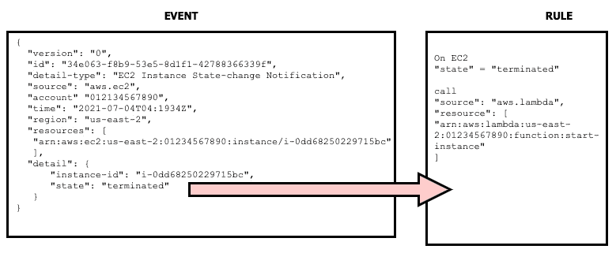

# 第十五章：CloudWatch 指标与 Amazon EventBridge

指标是 AWS CloudWatch 的核心内容之一。它们记录服务的性能，并可根据提供的数据触发警报和操作。虽然有大量现成的指标可用，但也可以创建自定义指标。这进一步扩展了 CloudWatch 的功能。

利用 Amazon EventBridge 捕获的指标，当它们达到某些阈值时，便是一项强大的能力。作为一名 DevOps 工程师，这是一个非常有力的工具，可以帮助你自动化系统，使其具备自愈能力，并能够根据客户生成的容量需求不断扩展和收缩。这些自动响应可以由本地 AWS 服务或第三方系统触发。这在日常监控和创建某些事件发生时的例程中尤其有用。

本章将涵盖以下主要内容：

+   更详细地了解 CloudWatch 指标

+   AWS 服务的 CloudWatch 基本指标

+   使用 CloudWatch 指标创建仪表板

+   Amazon EventBridge 概述

# 更详细地了解 CloudWatch 指标

在上一章中，我们了解了 CloudWatch 服务，并检查了它提供的一些功能。我们甚至在创建警报时讨论了指标的主题。

在应用程序和监控中，指标即数据。很多时候，这些是不断流动的大量数据。这些数据不仅从技术角度使用，也从业务角度使用，用来查看公司如何表现。

指标是 CloudWatch 的基础。当记录时，**指标**代表一组按时间排序的数据点，这些数据点随后会发布到 CloudWatch 服务中。

指标存在于单一区域。这意味着，如果你有一个多区域环境，那么不同资源的指标将被收集并存储在资源创建和运行的同一地区。尽管你不能删除指标，但它们会在 15 个月后自动过期。

**命名空间**是 CloudWatch 指标的容器。你将找到指标的命名空间与许多服务的 AWS 服务名称相同：


图 15.1 – CloudWatch 控制台中的命名空间

`PutMetricData` 命令与 CloudWatch 代理。

指标数据会在特定时间段内聚合成**统计数据**。这些聚合通过命名空间、指标名称、维度和度量数据点相关联。你可以通过五种方式来衡量统计数据：平均值、最小值、最大值、总和或样本数。当选择样本数时，CloudWatch 会计算数据点的数量。

CloudWatch 的一个优点是，即使资源没有运行，您仍然可以访问指标。您甚至可以访问已终止的资源的指标，例如已终止的 EC2 实例、已删除的 Elastic Load Balancers、Fargate 容器和已删除的 EBS 卷。

## 在 CloudWatch 中查看您的指标

您可以通过登录 AWS 管理控制台，进入**CloudWatch**服务，并从左侧菜单中选择**Metrics**来查看您的指标图表：


图 15.2 – CloudWatch 指标图表示例

在`InstanceID`、`functionName`、`Invocations`、`Namespace`等字段中，其中一个不起作用的是通过**Amazon 资源名称**（**ARN**）进行搜索。

## 使用 CloudWatch 指标流进行流式处理指标

正如我们之前所说，**CloudWatch**会保存您的指标数据 15 个月，然后删除这些数据。如果您希望将这些数据推送到像 S3 存储桶或数据湖这样的长期存储中，或者通过**Amazon Kinesis Data Firehose**推送数据，可以通过指标流实现。您还可以选择将您的指标数据通过指标流推送到第三方提供商。

CloudWatch 指标中的数据可以以 JSON 或 OpenTelemetry 格式推送到指标流。

现在我们已经了解了 CloudWatch 指标流是什么，接下来让我们看看为什么我们会使用指标流。

### 为什么要通过指标流将您的指标推送到第三方？

过去，专注于监控和仪表盘等服务的合作伙伴依赖于通过 CloudWatch 服务的 API 调用，将数据从您的账户导入他们的服务。随着账户的增长，这可能会增加您的额外费用。`GetMetricData` API 调用每 1,000 次请求收费 0.01 美元。指标流通过每 1,000 次请求仅收费 0.003 美元，大大降低了此成本。

现在我们已经了解了如何使用指标流存储或共享我们的指标，接下来让我们看看 CloudWatch 指标中有哪些不同类型的指标。

# AWS 服务中的 CloudWatch 基本指标

CloudWatch 会自动免费监控一组基础指标，每 5 分钟更新一次。大多数 AWS 服务会自动将指标免费发送到 CloudWatch 指标中。这些包括 EC2、S3、EBS、Kinesis、Lambda 等基础服务。

## EC2 服务的基本监控

当实例创建时，七个指标会以每 5 分钟一次的频率推送到 CloudWatch。你可以将这个频率更改为 1 分钟一次，额外收费。CloudWatch 还提供二进制状态检查，作为其免费套餐的一部分。使用此检查是查看实例是否正在运行的重要手段，但它并不是检查应用程序是否正常运行的好方法。状态检查可以作为早期预警，帮助识别如 AMI 问题、实例意外（或故意）终止，甚至可用区或区域故障等情况。

除了状态检查外，EC2 指标还分为三类标准类别：

+   CPU

+   磁盘 I/O

+   网络

CPU 指标包含 CPU 使用情况的指标数据。这是你可以用来触发 AutoScaling 事件的主要指标之一，帮助你判断实例是否开始接近其计算能力的上限。对于突发性能实例，例如 EC2 `T` 系列实例，你还会获得关于 `CPUCreditUsage` 和 `CPUCreditBalance` 的指标数据。

记住

对于突发性能 EC2 类型实例，你每小时会获得一定数量的 CPU 积分，这些积分可以累计，直到需要时使用。当实例处理需要比基准更多 CPU 的任务时，实例将使用其 CPU 积分余额。

几乎所有来自 AWS 的服务都与 CloudWatch 指标集成。当你构建和部署应用程序时，请考虑一些需要监控的最关键指标，以确保应用程序和环境的基本健康。这些可以包括以下内容：

+   EC2 实例的`CPUUtilization`

+   Lambda 函数的*错误*数量

+   Lambda 函数的*持续时间*

+   RDS 实例的`DatabaseConnections`

+   RDS 实例的`DiskQueueDepth`

+   S3 桶的`NumberOfObjects`

+   Elastic Load Balancer 的`ActiveConnectionCount`

+   Elastic Load Balancer 的`HealthyHostCount`

+   Elastic Load Balancer 的`TargetResponseTime`

现在我们已经查看了 CloudWatch 为我们提供的一些主要指标以及常见服务，接下来让我们看看如何在 CloudWatch 中使用自定义指标。

## 在 CloudWatch 中使用自定义指标

AWS CloudWatch 服务不仅允许你查看和监控来自资源本身的指标数据，如 CPU、内存和网络使用情况。它还允许你创建自定义指标，这些指标可以与应用程序中的错误数量相关联，或直接与业务测量的关键绩效指标挂钩。

## CloudWatch 中的高分辨率指标

在监控你的自定义指标时，有时 1 分钟的间隔不足以提供足够的详细信息。通过 `put-metric-data` API，无论是通过 CLI 还是从 SDKs，你都可以以每秒 1 次的间隔发布自定义指标。

如果你的应用程序可能会出现短时的高峰，而这些高峰的行为无法通过 CloudWatch 指标的默认 1 分钟间隔来捕获，那么启用高分辨率指标可以为你提供这种可见性。如果你需要实时监控，那么高分辨率指标同样可以满足这一需求。

在查看了我们可以使用的高分辨率指标后，让我们看看如何创建那些在我们自己场景中更加有用的自定义指标。

## 在 CloudWatch 中创建自定义指标

CloudWatch 指标允许你为对你重要的项创建指标和命名空间。你可以通过使用 AWS 为特定语言提供的 SDK，或使用 AWS CLI 和 `put-metric-data` 命令，将其集成到你的脚本中。

你可以为日志文件中的 `ERRORS` 实例等内容定义指标，或者跟踪像电商应用程序结账时购物车中商品数量等项目。

当你创建并发布自定义指标时，可以将其定义为标准分辨率，这样它将以 1 分钟为间隔进行度量，或者你也可以将其定义为高分辨率指标，这样它将以 1 秒为间隔进行度量。

现在，让我们使用 Lambda 函数来创建一些自定义指标。

## 发布自定义指标

自定义指标可以通过多个服务发布，包括 **AWS Lambda**、**Elastic Beanstalk**、**Amazon EC2**，甚至是像 ECS、EKS 或 Fargate 这样的容器服务。

对于我们的动手示例，我们将使用 Lambda 函数来创建自定义指标，然后将其发送到 AWS CloudWatch 服务。我们的示例场景包含一些示例代码，其中我们尝试跟踪某个特定营销活动的注册情况。通过这种方式，营销部门和高层管理团队几乎可以实时地知道这个特定营销活动的投入资金有多有效。我们将这些指标推送到名为 `custom_metric` 的 CloudWatch 指标中。

我们将在示例中使用的 Lambda 代码位于本书的 GitHub 仓库中，位于 `Chapter-15` 文件夹下，文件名为 `cw_events.py`。我们还包括了一个简化版的函数，它不包含 CloudWatch 事件的部分：

```
cw_events.py:
import boto3
import random 
# Resources 
cw = boto3.client('cloudwatch')
# The Lambda handler 
def lambda_handler(event, context):
    put_metric = custom_metric()
    return put_metric 
###################################
# Create CW Custom Metric 
###################################
def custom_metric():
    create_metric = cw.put_metric_data(
        Namespace='custom_metric',
        MetricData = [
            {
                'MetricName': 'Signups',
                'Dimensions': [
                    {
                        'Name': 'EMAIL_CAMPAIGN',
                        'Value': 'cableTV_spot2'
                    },
                ],
                'Unit': 'None',
                'Value': random.randint(1,100)
            },
        ],
    )
    return create_metric
```

创建自定义指标并将其发送到 AWS CloudWatch 服务的步骤如下：

1.  登录到 **Amazon Management Console** 并导航到 **Lambda** 服务。

1.  一旦进入 **Lambda** 服务，点击橙色的 **Create function** 按钮。

1.  一旦你进入 `Author from scratch`，在 `custom_metric` 下

1.  `Python 3.8`

1.  **权限**：创建一个具有基本 Lambda 权限的新角色：


图 15.3 – 创建 Lambda 函数的基本信息

1.  填写完所有这些选项后，按下橙色的 **Create function** 按钮。

1.  一旦函数创建完成，进入`chapter-15`目录中的`lambda_function.py`文件，替换`lambda_function`标签页中的内容。替换代码后，点击代码窗口顶部的**部署**按钮。这样可以确保**未部署更改**消息消失，并替换为绿色的**已部署更改**消息：

    图 15.4 – 显示已部署更改的 Lambda 函数

1.  现在我们已经创建了函数，可以开始创建测试事件，这样我们既可以测试函数，又可以在 CloudWatch 指标中看到自定义指标。点击橙色的**测试**按钮来配置测试事件。无需特殊的测试数据，只需将事件名称设置为**测试**，然后点击对话框底部的橙色**创建**按钮。

1.  在测试函数之前，我们需要再给函数添加一个权限——`PutMetricData`的权限。在**Lambda**垂直菜单中，点击**配置**。进入**配置**设置后，点击左侧菜单中的**权限**菜单项。这将显示**执行角色**在主窗口中。点击**执行角色**标题右侧的**编辑**按钮。

1.  这将带你到**基本设置**页面。页面底部，在现有角色的名称下方，应该有一个蓝色链接，允许你**查看 custom_metric_role**在**IAM 控制台**中的信息。点击此链接后，将会为 IAM 服务打开一个新标签页。

1.  当你在`服务`中的角色上时：**选择** | **CloudWatch**

1.  **操作**：**筛选** | **PutMetricData**：


图 15.5 – 从 IAM 向我们的 Lambda 角色添加内联策略

1.  添加额外权限后，点击页面底部的蓝色**审核策略**按钮。

1.  将策略命名为`PutMetricData`，然后点击页面底部的蓝色**创建策略**按钮。

1.  现在我们已经修改了 IAM 角色，使其具备了`PutMetricData`权限，返回到包含 Lambda 函数的标签页。你应该仍然在**基本设置**页面上。点击屏幕底部的橙色**保存**按钮，这将带你回到主 Lambda 屏幕的**配置**菜单。点击水平菜单顶部的**代码**标签页。现在，按下橙色的**测试**按钮，将测试事件发送到我们的 Lambda 函数。

1.  在顶部搜索栏中，转到`CloudWatch`并右键点击它，以在新标签页中打开。

1.  在**自定义命名空间**的左侧菜单中的`custom_metric`：

    图 15.6 – 我们在自定义命名空间中的自定义指标

1.  点击 **custom_metric** 命名空间。此时，我们将看到我们的二级命名空间，即 **EMAIL_CAMPAIGN**。点击该值将跳转到指标数据页面。勾选 **cableTV_spot2** 旁边的框，查看图表上绘制的数据。由于我们在函数中使用了随机值，因此该数字会有所变化。

有了这些，我们已经创建了一个 Lambda 函数，它将创建并发布一个自定义指标到 CloudWatch 指标中。接下来，我们将看看如何将这个自定义指标与其他指标一起，纳入到 CloudWatch 仪表板中，为我们自己、我们的团队以及其他人提供快速查看环境状态的功能。

# 使用 CloudWatch 指标创建仪表板

在 CloudWatch 中查看单个指标可以提供许多有价值的细节。然而，有时，通过快速浏览一个单一的视图，将最相关的指标一并展示出来，会更加有用。CloudWatch 仪表板允许我们快速而轻松地创建这些视图——不仅展示我们账户中 Amazon 资源创建的指标，还包括自定义指标，以及文本和超链接，以便在紧急情况或其他有用的文档中参考运行手册。

CloudWatch 服务甚至为许多最常用的 AWS 服务（如 DynamoDB、EC2、Lambda、S3、EBS 等）提供了自动仪表板。这些预配置的仪表板都是互动式的，可以基于自定义的日期范围查看。

你甚至可以将你创建的仪表板与那些没有直接访问你 AWS 账户的人员共享。这可以通过几种方式实现。第一种方式是将仪表板投射到大屏幕上，这样一个用户团队，或者任何进入显示仪表板屏幕或投影的房间的人，都能查看仪表板上展示的指标和图表。

第二种方法是内建的功能，允许使用用户名和密码与指定的电子邮件地址共享仪表板。

分享仪表板访问权限的第二种方式对于当你试图为某个项目的相关方提供实时指标时非常有用。这个用户可能不太懂技术，但他需要正确的业务信息来帮助做出决策。在本章之前讨论的自定义指标，可以让业务相关方在不请求生成特定报告的情况下，随时查看特定的关键绩效指标（KPI）。

当你在 CloudWatch 仪表板中创建一个仪表板时，它将全球可用。这是因为仪表板不是区域特定的。

有了这些，我们已经了解了仪表板如何让我们作为 DevOps 工程师、开发团队，甚至是项目的相关方，快速查看我们的环境或项目的状态。接下来，让我们通过实际操作来创建一个仪表板。

## 创建一个基础仪表板来监控我们的资源

让我们使用之前创建的一些指标，并将它们集成到自定义仪表板中：

1.  打开**Amazon 管理控制台**并进入**CloudWatch**服务。如果你失去会话，可能需要重新登录。同时，确保你在俄亥俄地区（或你用来创建资源的其他地区）：[`console.aws.amazon.com/cloudwatch/`](https://console.aws.amazon.com/cloudwatch/)。

1.  进入 CloudWatch 服务后，找到并点击左侧菜单顶部的**仪表板**菜单项。

1.  这将带你进入**自定义仪表板**屏幕。我们将通过点击橙色的**创建仪表板**按钮开始创建仪表板的过程：

    图 15.7 – 创建仪表板按钮

1.  按下`Chapter15`。然后按橙色的**创建仪表板**按钮来关闭对话框并开始构建仪表板。

1.  应该会弹出一个新的对话框，要求我们向仪表板添加小部件。我们将从`Explorer`小部件开始：

    图 15.8 – 向 CloudWatch 仪表板添加小部件

1.  通过点击**数字**小部件来开始你的仪表板。滚动到**自定义命名空间**并点击**custom_metric**命名空间。将**周期**从**5**分钟更改为**1**天，以便仪表板能保持数据。点击**EMAIL_CAMPAIGN**次级命名空间并勾选**cableTV_spot2**框。一旦选中该值，点击对话框底部的橙色框，标记为**创建小部件**：

    图 15.9 – 为数字小部件添加值

1.  一旦我们的数字小部件被添加，点击橙色的**添加小部件**按钮，将另一个小部件添加到仪表板中。

1.  选择`custom_metric`搜索词，以便我们可以找到上一个练习中创建的 Lambda 函数的指标。滚动通过**自定义命名空间**，找到**AWS 命名空间**。你可以点击**Lambda** | **按资源**或**Lambda** | **按函数**，因为它们应该都包含相同的指标。找到**调用次数**指标并勾选函数名左侧的复选框。一旦勾选，点击橙色框，然后点击橙色的**创建小部件**按钮。

1.  我们通过点击`custom_metric lambda`函数来向仪表板添加另一个小部件。它应该被命名为`/aws/lambda/custom_metric`。使用复选框选择该日志组。一旦选择了日志组，点击橙色的**添加到仪表板**按钮。

1.  你将回到仪表板页面，现在应该包含三个小部件。点击仪表板顶部的蓝色**保存仪表板**按钮。现在你有了一个可以查看和分享的工作仪表板：


图 15.10 – 我们创建的 Chapter15 仪表板

现在我们已经学习了如何将我们的度量指标整合到仪表板中，以便我们可以快速轻松地监控系统，并查看我们需要一眼看到的任何自定义度量指标，接下来我们来看一下如何使用 CloudWatch 通过**Amazon EventBridge**服务启动事件驱动架构。

# Amazon EventBridge 概述

**Amazon EventBridge**是一个无服务器事件驱动总线，它使得从各种来源获取和处理数据变得容易。这些来源包括 AWS 服务、您的应用程序和第三方 SaaS 提供商。它消除了在服务之间编写点对点集成的复杂性。EventBridge 是 AWS 的托管服务，这意味着您不需要担心随着需求的波动而需要更多或更少的服务，EventBridge 服务会为您处理这些。


图 15.11 – 从事件到目标的 AWS EventBridge 流程

**事件源**几乎可以是任何 AWS 服务、自定义应用程序或 SaaS 应用程序。

对于 SaaS 应用程序，有一个特别支持的合作伙伴应用程序，称为**事件源**。此事件源为第三方 SaaS 提供商和您的 AWS 账户之间提供逻辑连接，无需预配任何跨账户 IAM 角色或凭证。

**事件总线**是**EventBridge 服务**的核心。默认事件总线用于处理 AWS 服务事件。事件总线可以为您的应用程序自定义创建。

一旦你设置了事件总线，你就可以创建**规则**。通过使用规则，你可以匹配事件总线检查过的事件元数据或有效负载中的值。规则随后决定哪些事件应该被路由到哪个目标：



图 15.12 – 一个示例事件及其触发的规则

一旦触发了规则，你可以将一个或多个**目标**与该规则关联。目标是各种 AWS 服务，如 Lambda 函数、Step Functions、Kinesis Streams 以及 ECS 或 Fargate 集群。

注意

CloudWatch Events 服务现在被称为 Amazon EventBridge。如果您之前使用过 CloudWatch 事件，那么该功能仍然可以通过 EventBridge 中的默认事件总线使用。

现在我们已经了解了 Amazon EventBridge 服务，接下来让我们看一下 EventBridge 服务上自动施加的一些限制。

## EventBridge 服务限制

当你开始使用 EventBridge 构建事件驱动服务时，最好记住最初对 EventBridge 服务施加的服务限制。这可以帮助你在同时向事件总线发送过多事件的情况下，也能帮助你在构建应用程序时，因为你知道在一个地区默认允许多少个事件总线和规则：


表格 15.1 – AWS EventBridge 服务限制

注意

所有这些限制都是软限制。这意味着它们可以通过向 AWS 提交服务请求来提高。

现在我们已经了解了工作时的服务限制，让我们来看看如何使用 AWS EventBridge 构建事件驱动架构。

## 使用 EventBridge 构建事件驱动架构

现代云应用程序基于解耦服务。

事件驱动架构有三个关键组件：事件生产者、事件消费者和事件路由器。生产者是产生事件并将其发送到路由器的服务或触发器。路由器或事件总线会过滤特定的事件，并将特定的事件发送到事件消费者。

### 事件驱动架构的多重好处

当你使用解耦架构时，意味着每个组件执行特定的任务，你将获得多个好处：


图 15.13 – 一个服务使用 EventBridge 和自定义规则推送到多个目标

## 使用 EventBridge 捕获 AWS 服务事件

我们可以使用 EventBridge 服务通过规则和默认事件总线自动触发事件。让我们从捕获每当 EC2 实例状态变化时并将其发送到日志文件开始，这样我们就可以查看该事件：

1.  登录到**AWS 管理控制台**，并导航到**CloudWatch**服务。从左侧菜单中找到并展开**事件**菜单。在**事件**子菜单中，点击**规则**链接。

1.  一旦**规则**屏幕出现在主窗口中，点击蓝色的**创建规则**按钮：

    图 15.14 – EventBridge 规则页面，带有创建规则按钮

1.  现在我们应该处于名为**步骤 1：创建规则**的界面。在**事件源**标题下，确保选择了**事件模式**旁边的单选按钮，这样我们就可以开始构建我们的模式了。

1.  对于我们的事件模式，使用`EC2 服务`。然后，在**事件类型**选择下拉菜单中，选择**EC2 实例状态变化通知**。

1.  我们不想要来自 EC2 的所有事件；我们只想知道何时实例启动或终止。选择 **特定状态**，然后选择 **已终止** 和 **待处理** 状态作为规则的状态。你需要使用下拉菜单两次来填充这两个选择项。保留 **任何实例** 旁边的单选框：

    图 15.15 – EventBridge 规则的事件模式已填充

1.  接下来，我们可以继续处理 *步骤 1* 的右侧，在那里你可以找到 **Targets**（目标）标题。点击 **添加目标** 按钮。

1.  在第一个目标下，找到 `EC2_STATE`：

    图 15.16 – 创建自定义日志组作为我们的 EventBridge 目标

1.  向下滚动到页面底部，点击蓝色按钮 **配置详细信息**。

1.  对于规则的名称，使用 `chapt15-ec2`。你可以插入描述。如果你填好了名称和描述，点击蓝色的 **创建规则** 按钮。

1.  我们的规则应该出现在 `ec2` 实例上并触发规则。不要关闭浏览器窗口——我们稍后还要返回查看 CloudWatch 日志组。

1.  打开终端窗口，使用 `create-instance` 命令快速启动一个实例（如果你完成了 *第十四章* 的练习，*CloudWatch 和 X-Ray 在 DevOps 中的角色*，这些命令应该对你来说有些熟悉）：

    ```
    # Capturing the AMI to a variable
    InstanceId so that you can quickly reference it when terminating your instance in the next step. 
    ```

1.  大约 2 到 5 分钟后，我们将终止实例以创建另一个事件供规则使用：

    ```
    aws ec2 terminate-instances \
    --instance-ids {YOUR INSTANCE ID} \
    --region us-east-2
    ```

1.  现在，我们应该再等一两分钟，让实例完全终止。当它开始终止时，回到之前打开 **Amazon 管理控制台** 的浏览器。

1.  在 **Amazon 管理控制台** 中，我们应该已经进入 **CloudWatch** 服务，因此我们只需要在 **日志** 下的 **日志组** 子菜单中找到它并点击。

1.  现在，你应该能够找到我们快速创建的自定义日志组，名为 `EC2_STATE`。如果你所在区域有太多日志组，可以简单地搜索 `EC2_STATE`，它应该会出现。点击日志组的名称，我们可以查看 EventBridge 为我们生成的内容。

1.  现在，你应该在日志组中看到两条日志条目。一条对应于**待处理**事件，另一条对应于**终止**事件。

通过这一节，我们已经学习了如何利用在 AWS 账户中发生的事件以及 AWS EventBridge 服务来构建事件驱动架构。尽管我们在实践练习中只使用了一个简单的示例，但这可以扩展到执行诸如发送 SNS 通知并同时记录日志条目，甚至在这是一个关键基础设施的情况下创建新资源等操作。现在，让我们回顾一下本章中学到的所有内容。

# 总结

在本章中，我们深入探讨了 **AWS CloudWatch** 服务。我们关注了指标以及构成一个指标的内容。我们了解了 AWS 提供的不同类型的指标，从 Free Tier 的基本指标开始，然后是详细指标，最后学习了如何创建自定义指标。我们还学会了如何使用这些指标在 CloudWatch 中创建自定义仪表板，并发现这些仪表板不仅可以与拥有 IAM 访问权限的团队成员共享，还可以与我们 AWS 账户外的其他人共享。

我们还研究了 **EventBridge**，这是取代了 CloudWatch Events 的服务。我们学习了如何使用事件总线来处理 AWS 服务、定制应用事件，甚至是 SaaS 提供商，从而推动事件驱动架构的发展。

在下一章中，我们将研究来自不同 Amazon 服务的各种类型的日志。这包括 VPC 流日志、Elastic Load Balancer 日志、CloudTrail 日志，以及这些日志如何帮助我们排查应用程序或安全事件中的问题。

# 问题

1.  你被一家企业聘用，帮助在 AWS 上开发一个电子商务应用程序。公司利益相关者希望了解通过该应用程序下单的订单数，并且希望以秒级粒度获取这一信息。为了获取这个信息，你需要使用 AWS CLI 创建一个自定义的 CloudWatch 指标。你知道默认情况下，自定义指标的粒度是 1 分钟。你如何让应用程序以子分钟间隔发送自定义指标？

    a. 使用 AWS CLI `put-metric-data` 命令发布数据，并将 `StorageResolution` 选项设置为 `1` 秒，以将指标指定为高分辨率指标。

    b. 更新 CloudWatch 代理配置文件，然后添加 `line high-resolution: true`。

    c. 转到 Amazon 管理控制台中的 CloudWatch 服务的图表，并将分辨率设置为 1 秒的间隔。

    d. 向 AWS CLI `put-metric-data` 命令添加 `flag –dimensions=1`，以指定一个高分辨率指标。

1.  你目前在一家中型电子商务公司工作，该公司使用 AWS Lambda 和 DynamoDB 构建了一个无服务器购物车系统。公司的一位高管要求你创建并分享一个仪表板，展示每个购物车的购买数量和每个购物车的弃购数量。董事会成员目前没有 IAM 账户。你如何以尽可能简单且成本效益高的方式向董事会成员提供实时数据访问权限？

    a. 使用 Amazon Cognito 的社交登录。让 Cognito 承担一个具有访问特定仪表板权限的角色，以便董事会成员可以访问。

    b. 为每个董事会成员创建 IAM 用户。创建一个 IAM 组，该组有权限访问 CloudWatch 仪表板，但设有条件，只显示他们需要查看的特定仪表板的 ARN。

    c. 收集董事会成员的电子邮件。通过电子邮件访问功能，使用用户名和密码共享对 CloudWatch 仪表板的访问权限。

    d. 收集董事会成员的电子邮件。为 CloudWatch 仪表板集成 SAML。允许董事会成员使用单点登录访问特定的仪表板。

# 审查答案

1.  a

1.  c
