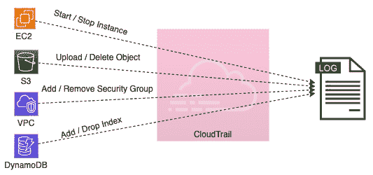
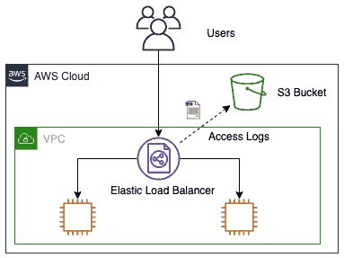
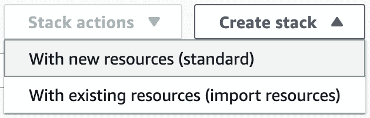
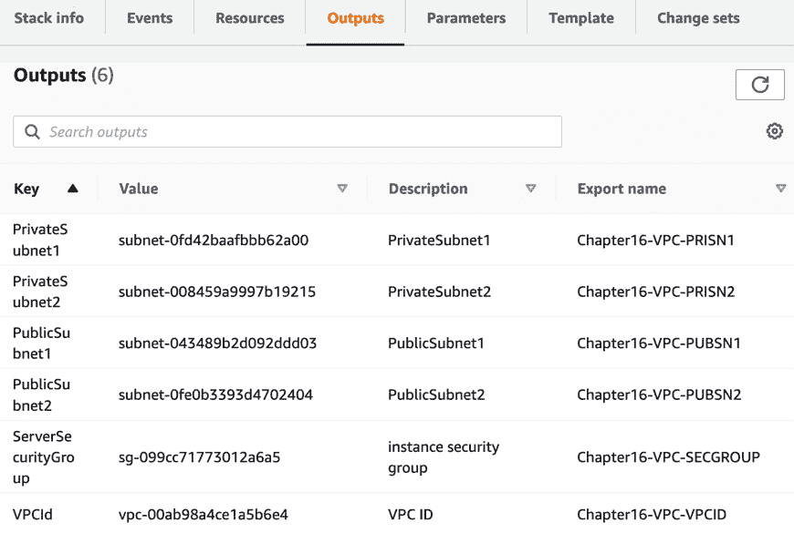
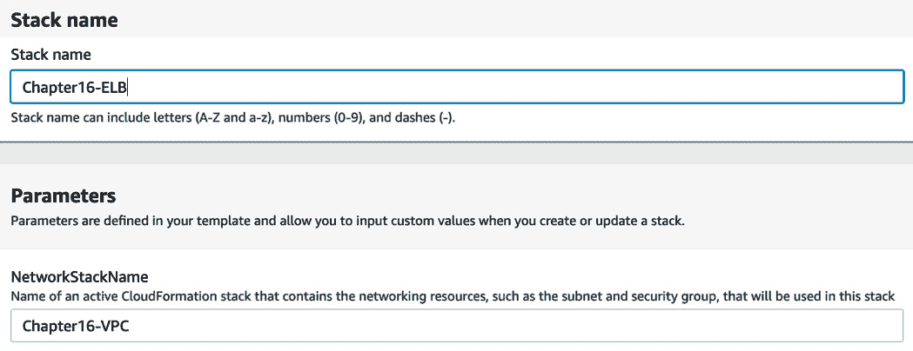
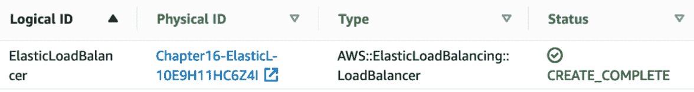
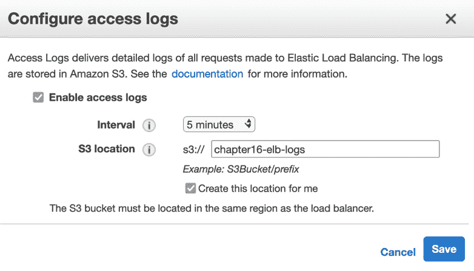
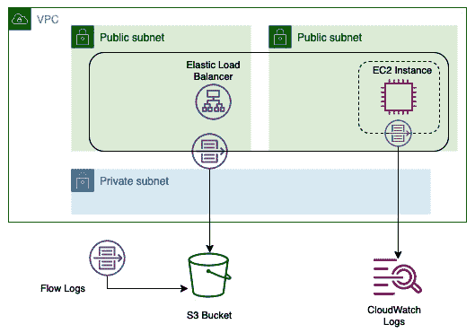
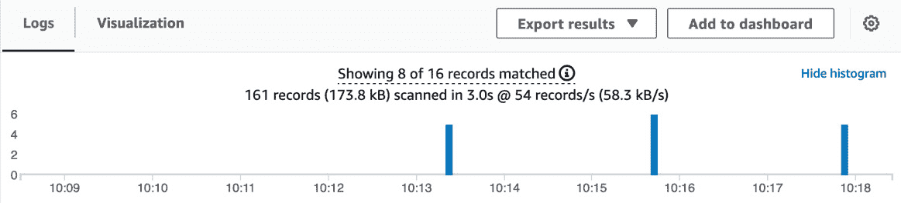

# 第十七章：生成的各种日志（VPC 流日志、负载均衡器日志、CloudTrail 日志）

日志是一条信息流，来自不同的源。来自负载均衡器的日志可以成为宝贵的数据源或故障排除的资源。了解如何启用这些资源对于设置或运行您的环境至关重要。在 AWS 环境中执行的任何操作，无论是通过 AWS 管理控制台、CLI 还是 SDK，都会通过底层 API 调用记录到 CloudTrail 中。作为一名 DevOps 工程师，了解是谁以及什么在对环境进行更改并能够检索这些数据，尤其是在请求时，是非常重要的。

在本章中，我们将讨论以下主要内容：

+   **AWS CloudTrail** 的强大功能

+   启用弹性负载均衡器日志

+   使用 VPC 流日志

+   清理资源

# 之前讨论的日志

到目前为止，我们主要讨论的是从应用程序本身生成的日志。还包括一些在之前使用 CloudWatch Logs 时 AWS 提供的日志，它们是这些日志的包装器；然而，这些大部分仍然是应用程序和 AWS 服务日志。

当我们想要了解用户如何与我们的环境进行交互时，无论是网络环境还是他们如何在我们的帐户内添加和删除资源时，我们将无法在应用程序日志中找到这些信息。相反，我们必须查看 AWS 中的其他日志。

了解哪些日志适用于哪个目的，还可以帮助我们保护环境的其他服务，例如**GuardDuty**。

注意

我们将在*第二十二章*中讨论 GuardDuty，*了解的其他政策和标准服务*。

现在我们已经看到了我们走过的路和未来的方向，让我们从第一组日志——CloudTrail 日志开始。

# **AWS CloudTrail** 的强大功能

**CloudTrail** 可通过 AWS 账户或多个账户（使用 AWS 组织）启用治理、合规性、风险审计和操作审计功能。

在 AWS 中，每个操作都是通过 API 调用执行的。无论您是使用 AWS 管理控制台、Amazon CLI 还是任何可用的 SDK，都是如此。这些操作都通过 API 调用来执行，然后这些 API 操作如果已启用 CloudTrail 服务，则会被记录下来：



图 16.1 – 通过 CloudTrail 服务将操作流动到日志的过程

这些内容包括记录启动和停止 EC2 实例的调用、上传和删除 S3 对象、从 VPC 添加或删除安全组、在 DynamoDB 表中添加或删除索引等。 当您的帐户内发生活动时，CloudTrail 会捕捉并记录该活动作为 CloudTrail 事件。此 CloudTrail 事件包含以下详细信息：

+   执行请求的人

+   请求发出的日期和时间

+   请求的源 IP

+   请求是如何发出的

+   正在执行的操作

+   执行操作的区域

+   请求的响应

还需要注意的是，CloudTrail 日志不会实时推送到存储的 S3 存储桶中。相反，CloudTrail 服务每 5 分钟发布一次更新的日志文件，包含它收集到的一批事件。

在确保 CloudTrail 日志本身安全方面，默认情况下，服务会使用 **S3 服务器端加密**（**SSE**）对文件进行加密，并将其存储在 Amazon S3 中。你还可以选择使用 **KMS** 服务创建加密密钥，并使用该密钥对 CloudTrail 日志进行加密。

CloudTrail 服务提供了几个好处。第一个是它记录了用户和资源的活动。通过这些记录，你可以识别是谁在什么时间对 AWS 账户中的资源执行了什么操作。其次，由于事件日志会自动存储和记录，合规性报告变得更加易于管理。第三，你能够通过将 CloudTrail 事件发送到 CloudWatch Logs 来监控、警报和响应正在发生的事件。第四个也是我们在这里提到的最后一个好处是，通过使用类似 SQL 的语法，你可以利用 CloudWatch 服务搜索日志。这使你能够对 CloudTrail 产生的大量数据执行强大的查询。

现在我们了解了 CloudTrail 服务，我们将在我们的账户中设置 CloudTrail。

## 设置 CloudTrail

我们将设置 CloudTrail，然后再查看 CloudTrail 记录的日志。我们这样做是为了确保在执行本章其他练习时，CloudTrail 服务已经开启并记录了我们的操作。这还将确保在稍后进行 CloudTrail 练习时，我们有一个完整的记录集可以进行搜索。

亚马逊已经更新了默认创建 CloudTrail 路径的方式，使得所有区域在初始化时都被包含在内。在本节中，我们将创建一个特定于我们正在工作的区域的路径。这仍然是可能的，但仅在使用 AWS CLI 的情况下：

1.  打开终端以便访问 AWS CLI。首先，我们需要创建一个 S3 存储桶，以便捕获并存储 CloudTrail 日志。使用以下*示例*命令，记住每个 S3 存储桶名称都是唯一的，你需要创建自己的 S3 存储桶：

    ```
    aws s3 mb s3://devopsproandbeyond-trail --region us-east-2
    ```

1.  为了让 CloudTrail 服务能够将日志放入 S3 桶，我们需要为我们的桶附加一个桶策略。将以下桶策略复制并粘贴到本地文件中（在你执行终端命令的地方），命名为`cloudtrail_s3.json`。查找两处出现`BucketName`的地方，你需要将它们替换为你在上一步创建的桶的名称。该文件的副本可以从本书 GitHub 仓库的`Chapter-16`文件夹下载：

    ```
    {
        "Version": "2012-10-17",
        "Statement": [
            {
                "Sid": "AWSCloudTrailAclCheck20150319",
                "Effect": "Allow",
                "Principal": {"Service": "cloudtrail.amazonaws.com"},
                "Action": "s3:GetBucketAcl",
                "Resource": "arn:aws:s3:::BucketName"
            },
            {
                "Sid": "AWSCloudTrailWrite20150319",
                "Effect": "Allow",
                "Principal": {"Service": "cloudtrail.amazonaws.com"},
                "Action": "s3:PutObject",
                "Resource": "arn:aws:s3:::BucketName/*",
                "Condition": {"StringEquals": {"s3:x-amz-acl": "bucket-owner-full-control"}}
            }
        ]
    }
    ```

1.  创建策略文件后，你可以使用以下命令将其附加到你的桶上。确保更改桶名称，以便策略附加到你的桶：

    ```
    aws s3api put-bucket-policy \
      --bucket devopsproandbeyond-trail \
      --policy file://cloudtrail_s3.json
    ```

1.  在附加了我们的 S3 桶后，我们可以创建单区域跟踪。使用以下命令创建你的跟踪，记得将命令中的 S3 桶名称替换为你在*步骤 1*中创建的桶名称。请注意，我们将跟踪命名为`sixteen`。我们将在本章后面引用这个跟踪名称：

    ```
    aws cloudtrail create-trail \
      --name sixteen \
      --s3-bucket-name devopsproandbeyond-trail \
      --region us-east-2
    ```

如果跟踪创建成功，你应该会看到返回的 JSON，类似以下内容：

```
{
    "Name": "sixteen",
    "S3BucketName": "devopsproandbeyond-trail",
    "IncludeGlobalServiceEvents": true,
    "IsMultiRegionTrail": false,
    "TrailARN": "arn:aws:cloudtrail:us-east-2:470066103307:trail/sixteen",
    "LogFileValidationEnabled": false,
    "IsOrganizationTrail": false
}
```

1.  现在是时候开始跟踪了。仅仅因为我们创建了跟踪并不意味着它会自动开始记录事件。使用以下命令启动跟踪，以便捕获该区域的所有 API 调用：

    ```
    aws cloudtrail start-logging --name sixteen --region us-east-2
    ```

1.  接下来，为了将日志流式传输到 CloudWatch 日志（以便我们以后可以搜索它们），我们需要登录到 AWS 管理控制台并快速编辑我们的跟踪。登录控制台后，导航到 CloudTrail 服务。当你进入 CloudTrail 仪表板时，你应该看到我们创建的名为**sixteen**的跟踪。点击该跟踪名称：

    图 16.2 – 仪表板上的第十六个 CloudTrail 跟踪

1.  当你进入第十六个 CloudTrail 时，你应该会看到一个名为**CloudTrail 日志**的部分。点击该部分右侧标记为**编辑**的按钮。

1.  在`CloudTrailRole-sixteen`上。然后，点击屏幕底部的橙色**保存更改**按钮。

现在，我们已经设置了 CloudTrail 服务来记录我们将来执行的 API 操作，接下来我们来看看弹性负载均衡器日志。

# 启用弹性负载均衡器日志

**弹性负载均衡**服务允许你捕获更多关于你环境的数据。这有助于故障排除，尤其是在延迟方面。弹性负载均衡器访问日志还能让你查看用户或服务从源地址到目标服务的路径。有时，这些信息不会出现在应用日志中，因为捕获到的源地址是弹性负载均衡器的地址。弹性负载均衡器访问日志包括以下信息：

+   客户端的 IP 地址

+   请求路径

+   请求接收的时间和日期

+   服务器响应（以数字格式显示）

我们在深入研究 Elastic Beanstalk 和 OpsWorks 等服务时，已经了解了负载均衡如何帮助在两个实例和服务之间分配负载。此时，我们还应该明白，弹性负载均衡可以用来附加多个实例，甚至是自动扩展组中的实例：



图 16.3 – 从弹性负载均衡器到 S3 存储桶的访问日志流

一旦你启用了弹性负载均衡器的访问日志记录，日志记录本身不会产生额外费用。然而，将日志存储在 S3 中会产生存储费用\。

## 设置弹性负载均衡器并启用日志记录

在本章的第一个实践示例中，我们将使用两个相互引用的 CloudFormation 模板来搭建一个 VPC；第二个模板将搭建一个弹性负载均衡器，并通过两个 EC2 实例提供一个简单的网站。子模板还将创建一个 S3 存储桶，用于捕获我们的访问日志。完成测试环境搭建后，我们需要进入 AWS 管理控制台并启用弹性负载均衡器的日志记录。启用日志记录后，我们可以尝试多次访问该网站。这样做应该会在我们的 S3 存储桶中留下记录，我们可以访问并分析这些记录。本练习中引用的模板位于本书 GitHub 仓库的 `Chapter-16` 目录下。在开始之前，请下载所有模板。我们开始吧：

1.  登录到**AWS 管理控制台**，并导航到**CloudFormation**服务。

1.  一旦进入**CloudFormation**页面，如果跳转到主 CloudFormation 服务页面，请点击橙色的**创建堆栈**按钮。否则，如果跳转到当前堆栈的列表页面，请点击主窗口右上角的**创建堆栈**按钮，并选择**使用新资源（标准）**选项：

    图 16.4 – 在 CloudFormation 中从堆栈列表页面的创建堆栈按钮

1.  无论你是如何到达这里的，我们现在应该能够上传 `vpc.yaml` 模板。然后，在对话框中点击**打开**按钮。一旦文件上传完成，你可以点击橙色的**下一步**按钮。

1.  这将带你进入 `Chapter16-VPC`，这是为你的堆栈命名时需要使用的名称。这个名称很重要，因为这个堆栈将创建一些资源，后续堆栈将引用这些资源，并通过堆栈的名称进行引用。一旦输入了名称，点击页面底部的橙色**下一步**按钮。

1.  在**配置堆栈选项**页面，向下滚动到底部并点击橙色的**下一步**按钮。

1.  此时，我们将在`Chapter16-VPC`堆栈中。向下滚动到页面底部，在**Capabilities**部分下的框中填写，确认此模板将创建一个 IAM 角色。完成后，点击橙色的**Create stack**按钮，以便初始化并创建我们的初始堆栈。

1.  点击 CloudFormation 服务中的`Chapter16-VPC`堆栈页面。堆栈创建完成后，进入**Outputs**部分。此时，你应该能看到 VPC 堆栈创建的六个输出，包括 VPCid、两个私有子网和两个公共子网：

    图 16.5 – 初始堆栈创建的输出

1.  创建好我们的 VPC 模板并显示输出后，我们可以继续下一个模板。下一个模板将设置负载均衡器，并配置两个运行 Apache Web 服务器的 EC2 实例。每个服务器都运行一个静态网页，但如果你看到的是不同的页面，就能知道自己是被定向到实例一还是实例二。

1.  由于我们已经在**CloudFormation**页面的**Outputs**部分，我们可以直接前往右上角，点击白色的**Create stack**按钮。当下拉列表出现时，选择**With new resources (standard)**选项。

1.  现在，返回`cross-stack-website.yaml`模板上传它。上传模板后，点击页面底部的橙色**Next**按钮。

1.  现在你应该处于`Chapter16-Elastic Load Balancer`页面。在**Stack name**框中输入此值。

1.  你还会看到一个参数框。这个框应该已经填上了`Chapter16-VPC`。如果你之前的堆栈命名为`Chapter16-VPC`，你无需更改此值。如果你给堆栈取了其他名字，则需要在此输入该名称，因为这是驱动我们之前看到的所有输出的值。填写完值后，点击页面底部的橙色**Next**按钮：

    图 16.6 – 指定堆栈详情页面中的堆栈名称和参数字段

1.  此时，你将被带到**Configure stack options**页面。此页面无需配置任何内容，因此我们将向下滚动到页面底部，点击橙色的**Next**按钮。

1.  最后，我们将进入**Review stack**页面。简要查看你为堆栈选择的选项。如果没有错误，点击页面底部的橙色**Create stack**按钮。

1.  由于我们的堆栈正在创建两个 EC2 实例并安装软件和网页，同时还在创建经典负载均衡器，注册这些实例到该负载均衡器，并执行初步健康检查，因此需要几分钟的时间来完成创建。

1.  一旦堆栈完成，点击**输出**菜单项，就像我们在前一个堆栈中所做的那样。这时，您会在这里找到一个密钥的 URL 和 Elastic Load Balancer 的公共 URL 值。右键点击该 URL 并在新标签页中打开。

1.  现在，点击同一水平菜单中的**资源**菜单项，您在其中找到了**输出**。点击 Elastic Load Balancer 的**物理 ID**链接，您将直接进入 Elastic Load Balancer 的详细信息页面：

    图 16.7 – 在 CloudFormation 中显示的 Elastic Load Balancer 资源列表

1.  现在，向下滚动屏幕的下半部分，直到找到**属性**标题。在此标题下，您将找到**访问日志**部分。此处应该有一个值，当前设置为**禁用**。点击灰色的**配置访问日志**按钮。

1.  当对话框出现时，您需要填写以下值：

    +   勾选**启用访问日志**框。

    +   将日志推送间隔更改为**5 分钟**。

    +   为存储 Elastic Load Balancer 访问日志选择一个**新的**S3 桶名称。

    +   勾选框以创建 S3 桶：



图 16.8 – 配置访问日志

填写完所有值后，点击蓝色的**保存**按钮。

1.  现在，开启日志功能后，是时候回到之前打开的浏览器标签页，其中包含 Elastic Load Balancer 的 URL。多次刷新页面；如果两个服务器都已成功启动并通过 Elastic Load Balancer 的健康检查，您应该会看到服务器一和服务器二的混合显示在屏幕上。

1.  一旦生成了一些流量，我们可以开始导航到为 Elastic Load Balancer 访问日志存储创建的 S3 桶。但是，请记住，日志每 5 分钟才会推送一次，因此您可能需要耐心等待日志的出现。

1.  这时，是时候转到 S3 服务并找到您为存储 Elastic Load Balancer 访问日志而创建的桶的名称了。点击桶的名称。您应该会看到一个名为`AWSLogs`的*文件夹*，然后是一个以帐户号码命名的*子文件夹*。在该帐户文件夹中，应该有名为`elasticloadbalancing`的进一步子文件夹，然后是按地区、年份、月份和日期命名的子文件夹。最后，您将看到日志文件。点击其中一个日志文件，下载并用 Textpad 或记事本打开它。

通过这个，我们已经了解了如何启用日志并查看来自我们的弹性负载均衡器的流量模式。然而，不要急着关闭这组 CloudFormation 模板。我们将在接下来的部分中使用这里创建的 VPC，来检查 VPC 流日志。但首先，让我们看一下弹性负载均衡器日志的用例。

## 弹性负载均衡器日志的用例

你可能会想，为什么你会对启用弹性负载均衡器日志感兴趣，而你可以从应用程序的日志文件中获取类似客户端地址的信息？让我们详细查看几个用例：

+   理解请求的延迟——响应请求需要多长时间。

+   监控访问请求——请求来自哪里，去往哪里。

+   衡量客户端与资源之间操作的效率——是否存在可以轻松检测到的瓶颈？

现在我们理解了何时使用弹性负载均衡器日志，让我们看看 VPC 流日志。

# 使用 VPC 流日志

流日志帮助您捕获有关**虚拟私有云**（**VPC**）网络接口进出 IP 流量的信息。一旦捕获到这些数据，它可以被写入 S3 存储桶或推送到 CloudWatch 日志组。

一旦创建了流日志组并开始记录日志，日志不会立即出现。日志可能需要最多 5 分钟才会出现在 S3 存储桶或日志组中：



图 16.9 – VPC 流日志在不同来源之间传输

可以为网络接口创建流日志。这些包括 VPC 本身的网络接口，甚至是其他包含网络接口的服务，如下所示：

+   弹性负载均衡器

+   亚马逊 RDS 数据库

+   亚马逊 ElastiCache 缓存

+   亚马逊 Redshift 数据库

+   亚马逊 WorkSpaces

+   传输网关

+   NAT 网关

现在我们了解了 VPC 流日志是什么以及它们可以附加到哪些内容，让我们先看看它们的限制，然后再设置之前创建的 VPC 上的流日志。

## 关于 VPC 流日志的限制

虽然 VPC 流日志允许您捕获大多数来自或前往**VPC**中不同网络接口的流量，但也有一些情况是无法捕获的。我们来快速了解这些情况。在这种情况下，如果在 DevOps 专业考试中或现实生活中出现其中一个场景，我们就知道流日志并不是最佳解决方案。例如，当 VPC 之间的对等连接未在同一帐户内进行对等时，无法为对等的 VPC 启用流日志。另一个需要注意的是，流日志并不会捕获所有的 IP 流量。有一些特定的流量是*丢失的*，特别是不会被流日志文件捕获的：

+   任何来自实例的流量，试图连接到亚马逊 DNS 服务器。

+   从 Windows 实例发送的用于 Amazon Windows 许可证注册的任何流量。

+   所有与`169.254.169.254`之间的流量，用于元数据相关信息

+   所有与`169.254.169.123`之间的流量，用于 Amazon Time Sync 服务

+   所有的 DHCP 流量

+   任何发送到 VPC 路由器并通过保留 IP 地址传输的流量

+   所有位于终端节点网络接口与网络负载均衡器接口之间的流量

## 启用 VPC 流日志

如我们之前在动手练习中提到的，我们将使用本次动手练习中创建的相同**VPC**来捕获 VPC 流日志。

创建流日志时，你需要指定以下项目：

+   你希望拥有的 AWS 资源

+   如果你希望捕获接受的流量、拒绝的流量或流日志中的所有流量

+   你希望数据发布到的地方（S3 桶或 CloudWatch 日志）

让我们开始吧：

1.  从**CloudWatch**服务开始。在左侧菜单中找到**日志**，点击**日志组**。

1.  在右上角，点击橙色的**创建日志组**按钮。

1.  创建一个名为`FlowLogs`的日志组。你可以更改保留设置，允许日志在 7 天后（1 周）过期。更新完这些设置后，滚动到页面底部并点击橙色的**创建**按钮。

1.  返回到`Chapter16-VPC`。点击这个堆栈名称查看该堆栈的详细信息。

1.  然后，从堆栈的顶部水平菜单中点击**资源**菜单项。当资源表格出现时，向下滚动，直到找到 VPC 的条目（它可能靠近底部，因为它是我们最先创建的资源之一）。点击 VPC 的蓝色**物理 ID**链接，进入 VPC 界面。（在点击之前记下物理 ID 的最后 4 个字母数字字符；记住 VPC 的最后 4 个字母数字字符）。

1.  一旦你进入**你的 VPC**页面，*勾选*VPC 名称右侧的框。勾选后，点击屏幕右上角的白色**操作**按钮。完成后，一个下拉菜单会出现。选择**创建流日志**菜单项。

1.  此时，你将被带到`All`

1.  `1 分钟`

1.  `发送到 CloudWatch 日志`

1.  `FlowLogs`

1.  `VpcFlowLogRole`

1.  填写完所有这些设置后，点击橙色的**创建流日志**按钮。

1.  现在，回到你的 Elastic Load Balancer URL 并向已经加载在 EC2 实例上的网站发送一些流量。这样会生成 VPC 流日志。一旦生成了一些流量，回到名为`FlowLogs`的 CloudWatch 日志组，查看它生成的记录。

我们刚刚学习了如何创建自定义的 CloudWatch 日志组并开启 VPC 流日志，以便捕获 VPC 中的流量。接下来，我们将看看在哪些使用场景下开启 VPC 流日志是有意义的。

## VPC 流日志的使用场景

由于有如此多类型的日志可用，让我们来看一些使用 VPC 流日志的明确用例。

### 使用 VPC 流日志来监控远程登录

远程登录到你云基础设施上的实例应仅通过授权人员以及可信地址进行。你可以使用 VPC 流日志查看哪些用户和 IP 地址正在通过 **远程桌面协议** (**RDP**) 或 **安全外壳协议** (**SSH**) 等协议获取访问权限或尝试获取访问权限。

注意

你可以使用 **虚拟网络连接** (**VNC**) 客户端连接到 AWS Mac 实例；然而，这种连接是不安全的。为了确保连接的安全性，你可以通过 SSH 隧道将连接封装起来，具体方法可以参考这里：[`aws.amazon.com/premiumsupport/knowledge-center/ec2-mac-instance-gui-access/`](https://aws.amazon.com/premiumsupport/knowledge-center/ec2-mac-instance-gui-access/)。

### 使用 VPC 流日志检测威胁

如果你选择使用 VPC 流日志捕获所有事件，包括入口和出口，那么你可以检测到对环境的威胁，例如网络上的端口扫描、网络扫描、有人试图寻找弱点或进入点，或者数据被推送到未经授权的来源。

如果你发现你的系统受到某个事件的影响，那么你可以使用 VPC 流日志追踪攻击者通过网络的路径。

### 诊断和故障排除网络问题

在分层安全的情况下，有时你会遇到尝试弄清楚为什么无法访问某个实例或服务的情况，这可能会很麻烦。

### 了解你的网络流量

你可以使用 VPC 流日志来分析你的网络和 AWS 账户的用户行为，并生成可能发生的不安全行为的报告。这可能包括使用未保护的端口，或者允许来自全球的访问，而不是将访问限制在特定的 IP 地址上，并将全球访问限制为内容分发服务器（如 CloudFront）。

现在我们已经了解了 VPC 流日志的各种使用案例，我们将把注意力转向我们最初查看的日志——CloudTrail 日志。

## 回到我们的 CloudTrail 日志

现在，我们已经通过本章中执行的练习和多个 API 调用创建了一些资源，我们可以回到 CloudTrail 日志中，看看它们是如何被事件填充的。

## 搜索 CloudTrail 日志

由于我们目前已经执行了足够的操作来生成 CloudTrail 日志，现在我们将开始搜索日志，查看我们捕获到了什么内容：

1.  返回到 **CloudWatch** 服务。从左侧菜单中找到 **Logs**，但这次点击名为 **Log Insights** 的子菜单。

1.  从选择日志组的下拉菜单中，选择 **CloudTrail** 日志组。

1.  将以下查询放入查询框中，然后按下橙色的 **Run query** 按钮：

    ```
    filter eventSource="ec2.amazonaws.com"
    | stats count(*) as eventCount by eventName, awsRegion
    | sort eventCount desc
    ```

1.  你应该会看到类似以下的图形：

    图 16.10 – CloudWatch Logs 洞察可视化图表

1.  如果你愿意，可以尝试查看 CloudTrail 日志中你能发现的其他信息。

有了这些，我们已经学习了如何使用 CloudWatch Log Insights 查询 CloudTrail 日志。现在，在总结本章之前，让我们清理一下之前创建的资源。

# 清理资源

在本章中，我们创建了很多资源，如果不清理并保持运行，可能会导致你收到比预期更高的 AWS 账单。完成本章后，务必删除用于创建实例和 Elastic Load Balancer 的 CloudFormation 模板。

# 总结

在本章中，我们查看了三种不同的日志来源，这些日志可以为你的 AWS 账户提供信息，这些日志不是 CloudTrail 或应用程序日志。首先，我们学习了如何设置 CloudTrail 跟踪记录账户内发生的所有 API 调用。接下来，我们查看了 Elastic Load Balancer 访问日志，了解它们如何记录进入 Elastic Load Balancer 的 IP 地址、时间和响应。最后，我们查看了 VPC Flow Logs 如何捕获来自各种网络接口的网络流量。

在下一章中，我们将总结日志记录的讨论，介绍企业如何补充捕获日志的 AWS 服务。然后，我们将了解日志存储和高级搜索是如何处理的。

# 复习问题

1.  你作为 DevOps 工程师在一家已经实施了多个 CI/CD 流水线的公司工作。一个流水线用于推送应用程序代码及其功能，另一个流水线用于更新账户的基础设施和安全设置。在应用程序的最后一轮安全组更新之后，公司某个远程办公室的所有用户无法再访问自动扩展组中的实例。这些用户仍然可以通过 Elastic Load Balancer 从 Web 协议访问应用程序。这些用户包含多个 IAM 用户组的成员，包括开发人员、权限用户，甚至是管理员。你可以去哪里寻找信息，试图找出问题发生的原因？

    a. 收集被拒绝访问的 IAM 用户名。使用这些用户名搜索 CloudWatch 中的 IAM 日志组。

    b. 确保已启用 VPC Flow Logs。搜索 VPC Flow Logs 中远程办公室的内部和外部 IP 地址。

    c. 收集被拒绝访问的 IAM 用户名。转到 CloudTrail 服务，搜索用户名以查找拒绝访问的记录。

    d. 启用应用程序的 Elastic Load Balancer 日志记录。检查 Elastic Load Balancer 日志，查看远程办公室的内部和外部 IP 地址。

1.  你被引入到一家即将进行重要生产发布的公司，作为这次发布的一部分，他们正在实施一个新的治理模型，要求监控 AWS 账户上的所有活动。你如何快速有效地帮助公司实现这一目标？

    a. 设置 Amazon Inspector 服务，持续检查账户上发生的所有活动。

    b. 为所有 VPC 开启 VPC 流日志，确保捕获进出流量。

    c. 设置 AWS CloudTrail 服务，监控并记录所有区域的活动。

    d. 创建一个指定的 CloudWatch Logs 日志组，以便可以专门过滤创建或终止事件到该日志组。

# 审核答案

1.  b

1.  c
