# 第十八章：高级和企业级日志记录场景

当我们准备结束关于日志部分的讨论时，我们将讨论如何实现企业级的日志系统。虽然 CloudWatch 可以搜索日志并呈现一些可视化内容，但我们将探索 AWS 提供的其他本地解决方案，这些解决方案更适合捕获、处理、存储并可视化不断流入的大量日志。

在本章中，我们将覆盖以下主要主题：

+   使用 QuickSight 可视化数据

+   将日志流式传输到 Amazon Elasticsearch

+   使用 Amazon Kinesis 处理日志

# 使用 QuickSight 可视化数据

尽管有多个第三方可视化工具可用于分析数据并创建日志的图形表示，但 Amazon 为其客户创建了一项本地服务，**QuickSight**。QuickSight 是为云端规模的 **商业智能**（**BI**）服务而开发的，易于使用，且能够从多个来源导入数据。

Amazon QuickSight 使用专有的 SPICE 引擎来计算和提供数据。**SPICE** 代表 **超高速并行内存计算引擎**。这项技术旨在实现企业级的极速性能。SPICE 引擎通过自动复制数据来实现这一点，允许成千上万的用户在极快的速度下对这些基础数据进行查询和分析。

Amazon QuickSight 的另一个关键特点是，你可以与 IAM 组织成员共享创建的仪表盘。它还可以通过电子邮件与没有 IAM 或联合账户的 AWS 组织成员共享访问权限。QuickSight 还提供适用于 iPhone 和 Android 的应用程序，方便访问：

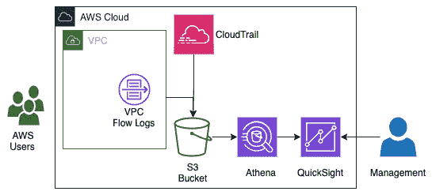

图 17.1 – 日志流向 Athena 和 AWS QuickSight 创建可视化

在前一张图中，我们展示了 AWS 用户如何从他们所采取的行动中创建事件。

当你在 AWS 账户中设置 QuickSight 时，你会创建一个命名空间，这是一个逻辑容器，用于组织你的团队、客户以及其他你将邀请到 QuickSight 可视化中的人员。你可以创建多个命名空间，并且可以将用户查看的数据与该命名空间隔离。命名空间也可以跨多个区域。设置好命名空间后，从此不需要进一步的管理操作。

了解了 QuickSight 服务在为我们 Amazon 账户中的用户以及我们组织中的其他人创建可视化时带来的价值后，让我们来看一下 Athena 服务如何基于这些能力进行扩展，利用我们已经存储在 S3 存储桶中的文件。

## 使用 Amazon Athena 查询数据

AWS 创建了一项服务，允许你查询存储在 S3 存储桶中的数据。该服务是无服务器的，因此无需配置服务器，而且该服务仅对你运行的查询收费。

Presto 查询引擎支持 **Amazon Athena**。这是一个开源的 SQL 引擎，允许用户以低延迟查询大规模数据集。Presto 引擎还完全支持连接、数组和窗口函数。

Amazon Athena 的主要特点如下：

+   由于它是无服务器的，因此无需管理任何管理或基础设施。

+   它使用标准 SQL 来查询底层数据。

+   它具有极快的性能，无需调优。

+   它支持跨多个数据源进行联合查询。

+   它是安全的，允许你利用 IAM 和 S3 存储桶策略来控制数据访问。

+   它与 S3 作为数据源时具有高可用性。

现在我们已经了解了如何使用 Amazon QuickSight 结合 Amazon Athena 创建更强大的可视化，让我们看看一些 Amazon QuickSight 的应用场景。

## Amazon QuickSight 的应用场景

下一节将探讨一些使用 Amazon QuickSight 与其他 AWS 服务结合的应用场景，以创建企业级系统，构建仪表盘和分析系统，用于监控日志和分析。

### 使用 QuickSight 可视化日志和使用分析，借助 Athena 和 Glue 的支持

亚马逊构建了一个交互式查询服务，允许你使用标准 SQL 语句查询数据，名为 Athena。除了使用标准 SQL 并且无需学习新的特殊语言之外，Athena 的另一个优点是它是无服务器的。这意味着无需配置服务器，且仅对你在系统上运行的查询和扫描的数据收费。

### 将机器学习洞察集成到你的仪表盘中的能力

Amazon QuickSight 扩展了仅仅以仪表盘格式展示数据的常规功能，通过添加自然语言功能和机器学习洞察，帮助你更全面地理解数据。这些功能帮助用户发现底层数据中隐藏的模式和趋势，而无需专业的技术专长或机器学习技能。

### 将用户仪表盘连接到你的数据仓库或数据湖

如果你的数据存储在数据仓库中，例如使用**Amazon Redshift**服务，那么你可以在 Amazon QuickSight 中创建连接，连接到你的 Redshift 集群。此 Redshift 集群会成为自动发现的数据集，并通过 SSL 自动保护 Redshift 集群和 QuickSight 之间的连接，无需额外配置。然后，你可以选择想要在 QuickSight 可视化中使用的表，或者创建自定义 SQL 语句将数据导入 SPICE 引擎中，以分析和可视化数据。

如果你将数据存储在数据湖中，尤其是使用 AWS 的 **Lake Formation**，那么数据就存储在 Amazon S3 存储桶中。接着，你可以使用 **AWS Glue** 来爬取数据并创建数据目录。一旦数据目录创建完成，你就可以使用 Amazon Athena 查询数据并创建表和数据库。这些表和数据库充当 S3 存储桶中数据架构的容器。Amazon QuickSight 然后可以连接到 Athena 数据库，创建数据的可视化，甚至进行进一步的 SQL 查询：

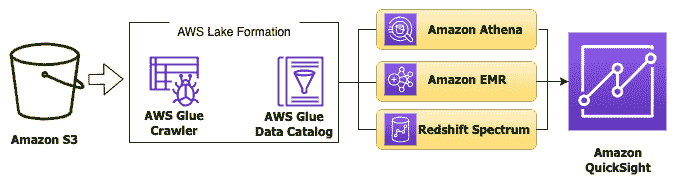

图 17.2 – 将 Amazon QuickSight 连接到 AWS 中的数据湖

现在我们已经讲解了一些企业在使用 Amazon QuickSight 时可能遇到的应用场景，接下来让我们通过一个动手练习来加深对该服务概念的理解。这样一来，如果在 DevOps 专业认证考试中遇到关于可视化的问题，我们就能有一个坚实的基础，知道何时选择 Amazon QuickSight 而非 CloudWatch 仪表板。

## 使用 Amazon QuickSight 创建仪表板

当你在 Amazon QuickSight 中创建数据仪表板时，你实际上是在发布一组交互式图表和图形，供用户探索。该仪表板使用的底层数据不仅展示了洞察，还为用户提供了进一步探索的工具，以防他们有此需求。

让我们一起走过在 Amazon QuickSight 中创建仪表板的过程。为了将数据导入临时数据库以便在 QuickSight 中连接，我们将需要借助 Amazon Athena 服务：

1.  登录到 Amazon 管理控制台，在顶部搜索框中搜索 `QuickSight`。进入 **QuickSight** 页面后，验证你的 AWS 账户编号，然后按下蓝色按钮 **注册 QuickSight**。确保将默认的 **企业版** 更改为 **标准版**：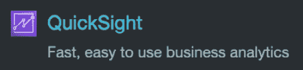

    图 17.3 – 来自搜索菜单的 QuickSight 图标

    你也可以使用以下 URL：[`aws.amazon.com/quicksight/pricing/`](https://aws.amazon.com/quicksight/pricing/)。点击页面中间的 **标准版** 链接。进入 **标准版** 页面后，向下滚动到页面底部，点击大号黄色按钮 **开始你的免费试用**。

    你现在应该在标有 **创建你的 QuickSight 账户** 的页面上。保留第一个选项 **使用 IAM 联邦身份 & QuickSight 管理用户** 作为 **身份验证方法**。接下来，对于 **QuickSight 区域**，将区域更改为 **美国东部（俄亥俄州）**：

    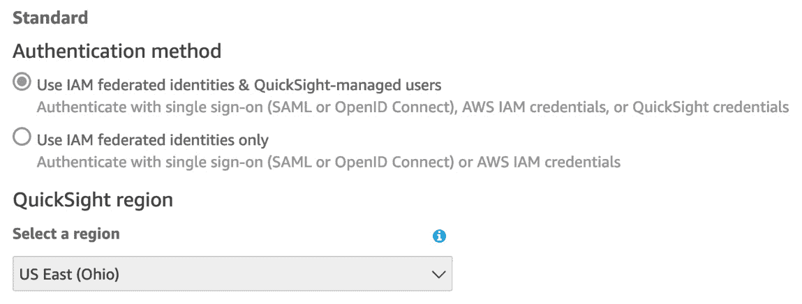

    图 17.4 – 设置身份验证方法和区域以创建 QuickSight 账户

1.  对于您的 QuickSight 账户名称，您需要选择一个独特的名称，并且可以记住。您还需要输入一个电子邮件地址。

1.  现在，我们可以指定在当前设置中哪些数据将可供 QuickSight 使用。勾选以下项目旁边的框：

    a. 启用在您的 Amazon Redshift、Amazon RDS 和 AWS IAM 服务中自动发现数据和用户。

    b. 亚马逊 Redshift

    c. 亚马逊 RDS

    d. IAM

    e. 亚马逊 Athena。

    f. 亚马逊 S3（选择显示的桶 – **chapter16-elb-logs**）：

    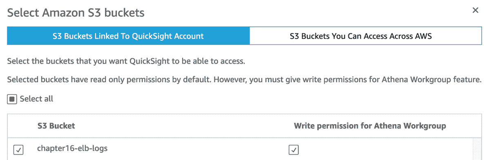

    图 17.5 – 选择用于 QuickSight 的 S3 桶

    我们已经从之前的实践练习中添加了一个桶，该桶应该包含可供 Amazon QuickSight 查询的数据。

1.  您现在将看到一个屏幕，上面有一个跳动的图形，AWS 正在为您创建 QuickSight 账户。账户创建完成后，您将看到一个蓝色按钮，上面写着 **进入 Amazon QuickSight**。点击此按钮继续。

1.  点击按钮后，它将开始为您创建一些示例，并显示一个弹窗，欢迎您使用 QuickSight。点击弹窗中的蓝色 **下一步** 按钮来关闭它们，或点击右上角的 **X**。

1.  我们需要从 S3 桶中的数据创建一个数据集。找到左侧垂直菜单中的数据集图标并点击它。进入数据集页面后，点击右上角的深蓝色 **新建数据集** 按钮。

1.  如果您还没有选择 `Chapter-17` 文件夹中的 `MOCK_DATA.csv` 文件，请选择它并将其上传至 QuickSight。点击 **确认文件上传设置** 弹窗中的蓝色 **下一步** 按钮。上传完成后，点击蓝色 **可视化** 按钮：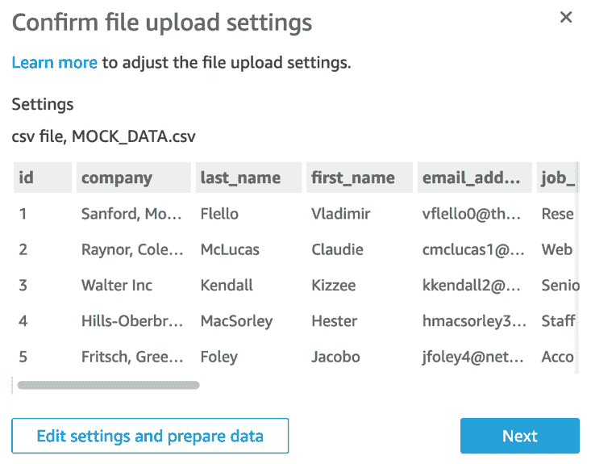

    图 17.6 – 确认数据已正确上传至 QuickSight

1.  一旦数据加载完成，您将进入 Amazon QuickSight 的 **可视化** 部分。现在是时候从我们刚刚导入的数据中创建一个可视化了。我们需要首先选择一些字段来显示在图表上。

1.  选择 *填充地图* 类型的图形，它位于右侧可视化类型列表的最后一个值。然后，在选择该可视化类型后，将 `state_province` 值拖动到 `zip_postal_code` 值的 **颜色** 字段中。点击其他一些可视化类型，看看 QuickSight 如何改变数据的展示方式：

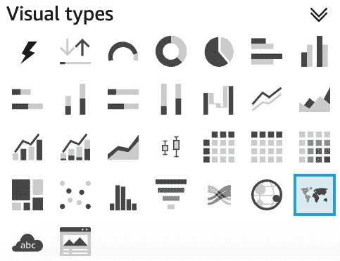

图 17.7 – Amazon QuickSight 中的填充地图可视化类型

重要提示

Amazon QuickSight 标准版的价格为每月 12 美元（按月支付）。发布时，有一个为期 30 天的免费试用期，适用于作者；但是，如果您已经使用过该服务，在通过本教程时将会被收费。

现在我们已经看到了如何使用 QuickSight 服务创建交互式仪表板和可视化，接下来我们来看看用于在企业级管理日志的下一个服务——Amazon Elasticsearch 服务。

# 使用托管 Elasticsearch 搜索和分组日志

许多人将 Elasticsearch 与 ELK 联系在一起；然而，它们之间存在差异。**ELK** 代表 **Elasticsearch、Logstash 和 Kibana**。在这种配置中，Elasticsearch 作为存储，Logstash 作为日志解析器，Kibana 作为系统的可视化前端，用户通过它与系统交互：

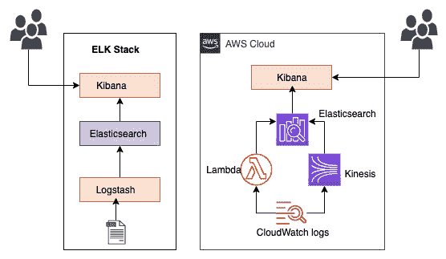

图 17.8 – ELK 堆栈与 Amazon 托管 Elasticsearch 服务的比较

使用 Amazon 的托管 Elasticsearch 服务时，默认情况下没有安装 Logstash；但是，还有其他选项可以将您生成的日志导入到 Elasticsearch 集群中。

## 托管 Elasticsearch 的使用场景

AWS 的托管 Elasticsearch 产品有多个使用场景。接下来我们来看看这些场景。

### 存储和搜索应用监控日志

您可以将存放在 AWS CloudWatch Logs 中的日志流式传输到 Amazon 托管 Elasticsearch 服务。一旦日志进入 Elasticsearch 集群，它们可以通过基于 Lucene 的 Elasticsearch 搜索引擎进行搜索。

### 安全信息和事件管理（SIEM）

将来自网络中多个事件和应用程序的日志存储在一个集中系统中，可以帮助您使用 Amazon 托管 Elasticsearch 服务的能力，几乎实时地检测和报警安全事件。

### 企业级搜索引擎

尽管 ELK 堆栈最常与收集和显示日志相关联，但 Elasticsearch 是一个强大的搜索引擎，基于 Lucene 库构建，允许进行近实时的搜索。您可以使用 RESTful API 连接到 Elasticsearch，将结果返回到应用程序，或者将新数据发送到搜索引擎存储。

### 监控您的基础设施

当您收集来自不同基础设施组件的日志时，无论它们位于云端还是本地，都可以使用 AWS 的托管 Elasticsearch 将它们集中收集到一个解决方案中。这有助于您从各个角度快速研究出现的问题，从而帮助减少您的 **平均修复时间** (**MTTR**)。

请注意，Amazon 的 Elasticsearch 服务正在更名为 Amazon OpenSearch。

现在我们已经了解了 Elasticsearch 服务的使用场景，让我们通过一个实际操作的例子，看看如何将 CloudWatch 日志导入到 Elasticsearch 集群中。

## 将 CloudWatch Logs 中的日志流式传输到 Elasticsearch 服务

在使用托管 Elasticsearch 服务的实操练习中，我们将部署一个简单的 Lambda 函数来生成一些日志。然后，我们将启动一个单节点的 Elasticsearch 集群来接收这些日志。利用 Lambda 函数生成的日志，这些日志将进入 CloudWatch Logs 日志组。接着，我们会将该日志组订阅到刚刚创建的 Elasticsearch 集群。CloudFormation 脚本还包括一个 AWS 事件规则，每五分钟触发一次 Lambda 函数，以便定期将日志发送到我们的 CloudWatch 日志组。最后，我们将进入 Kibana 可视化界面，查看我们的日志。让我们开始吧：

1.  我们首先需要从 GitHub 仓库中的`Chapter-17`文件夹下载名为`lambda_stack.yml`的 CloudFormation 模板。

1.  首先，登录到 AWS 管理控制台。在控制台内，导航至**CloudFormation**服务，以便我们可以快速启动 Lambda 函数。通过点击主服务页面中的橙色**创建堆栈**按钮，或者如果你已经在**堆栈**页面并且有之前创建的堆栈，点击右上角的白色**创建堆栈**按钮来创建带有新资源的堆栈。

1.  下载自 GitHub 仓库`Chapter-17`文件夹中的`lambda_stack.yml`文件后上传。上传文件后，点击屏幕底部的橙色**下一步**按钮。

1.  现在，在文本框中的**堆栈名称**字段内输入`Logging-Lambda`作为此 CloudFormation 堆栈的名称。输入后，点击屏幕底部的橙色**下一步**按钮：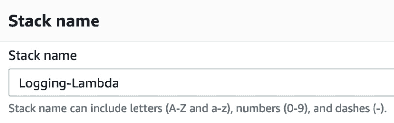

    ](img/Figure_17.9_B17405.jpg)

    图 17.9 – 输入 CloudFormation 堆栈名称

1.  在**配置堆栈选项**页面上无需操作。向下滚动到页面底部，点击橙色的**下一步**按钮。

1.  在**审核**页面上，向下滚动到页面底部，勾选复选框，确认此模板需要创建一个 IAM 角色。完成后，可以点击橙色的**创建堆栈**按钮。

1.  创建资源的过程应该需要 1 到 5 分钟；完成后，我们可以点击`LambdaLogGenerator`。这将是我们实际的 Lambda 函数。点击此名称旁边的蓝色链接，它位于**物理 ID**列下。这将直接打开一个新窗口，显示我们的 Lambda 函数：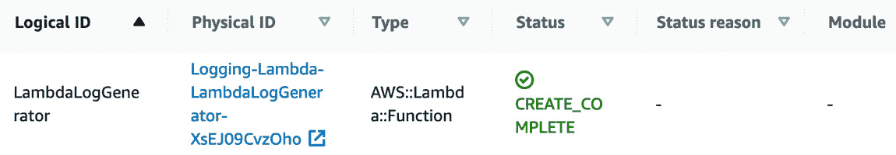

    ](img/Figure_17.10_B17405.jpg)

    图 17.10 – 创建的 Lambda 函数的逻辑 ID 和物理 ID

1.  我们需要等待至少 5 分钟以便 Lambda 函数被调用，因此在此期间我们将创建 Elasticsearch 集群，以便在日志准备好时能够进行流式传输。在 AWS 管理控制台的顶部搜索框中，搜索`Elasticsearch`。当你看到**Elasticsearch 服务**图标时，右键点击图标，在新标签页中打开该服务。

1.  当你进入**Amazon Elasticsearch 服务**页面时，点击标记为**创建新域**的蓝色按钮。

1.  对于**部署类型**，选择**开发与测试**，因为我们只需要一个可用区。在**版本**部分，选择最新版本。在撰写时，最新版本是 7.10。选择完毕后，点击屏幕底部的蓝色**下一步**按钮。

1.  现在我们应该在`chapter-17`域名设置页面。第二个设置将在`T3.medium.elasticsearch`实例下，因为我们只是进行短期测试，且不需要存储大量数据。做完这些更改后，滚动到页面底部并点击蓝色的**下一步**按钮。

1.  在`devops`中

1.  `Chapter17*`

d. 在**访问策略**下，选择以下内容：

保持其他设置不变，然后点击页面底部的蓝色**下一步**按钮。点击**标签**页面上的蓝色**下一步**按钮，最后滚动到**审查**页面的底部，点击蓝色的**确认**按钮。

1.  Elasticsearch 集群启动需要几分钟，这段时间我们可以回到 Lambda 函数的页面。返回我们浏览器窗口中的另一个标签页，在那里我们之前已经打开了 Lambda 函数。

1.  一旦进入`Logging-Lambda-LambdaLogGenerator`函数，点击横向菜单中的**监控**项。这不仅会让我们看到 Lambda 函数被调用的日志行，还会有一个白色按钮，位于横向菜单旁边，现标记为**在 CloudWatch 中查看日志**。点击该按钮将直接带你进入日志页面：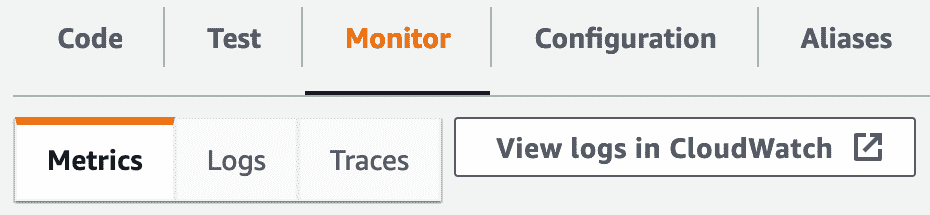

    图 17.11 - 直接位于横向菜单下方的在 CloudWatch 中查看日志按钮

1.  现在我们应该在 Lambda 函数的 CloudWatch 日志组中。**日志流**标题上方会有一个横向菜单。点击菜单项**订阅过滤器**。

1.  一旦从下拉列表中选择我们刚刚创建的`chapter-17`标题。选择`Logging-Lambda`并选择为日志 Lambda 函数创建的角色。选择`log-test`。最后，滚动到页面底部并点击橙色的**开始流式传输**按钮。

1.  一旦点击**开始流式传输**按钮，一个 Lambda 函数将被创建。现在，我们的日志应该开始流入 Elasticsearch 集群中。

1.  现在回到我们创建 Elasticsearch 集群的标签页，并点击 `chapter-17` 作为链接域。点击 `devops`）并输入在配置 Elasticsearch 集群时创建的密码。

1.  我们现在在 Elasticsearch 集群的 Kibana 界面中。点击显示的文字 **Explore on my own**。当弹出 **Select your tenant** 对话框时，只需点击蓝色的 **Confirm** 按钮。

现在我们已经看过如何捕获日志并将其存储在托管的 Elasticsearch 集群中，接下来我们将探讨如何将 Amazon Kinesis 服务与 Elasticsearch 结合使用。

# 了解 Amazon Kinesis 服务

AWS 中有一个专门为实时处理流数据而创建的服务。这个服务就是 **Amazon Kinesis**。随着世界上越来越多的物品产生数据，越来越多的应用程序希望消费这些数据，必须有能够快速消费并对数据进行一些预处理的服务。Kinesis 服务还提供了一些冗余，以防主应用程序出现故障，通过其分片存储记录。默认情况下，记录可以在写入后 24 小时内访问。此设置也可以在配置中扩展，最多保存数据 7 天。发送到 Kinesis 的数据最大为 1 MB。

需要了解的 Amazon Kinesis 关键功能如下：

+   它允许实时摄取、处理和流式传输数据。

+   它是一个完全托管的服务，因此无需管理基础设施。

+   它与其他多个 AWS 服务集成，如 Amazon Redshift。

了解到该服务具备这些内建的优势，它自首次推出以来也经历了演变，以满足使用者的需求。尽管它在处理大量传入数据（如来自多个来源的日志）时非常有用，但这只是它众多用途中的一种。

Kinesis 服务来自 AWS，提供四个独立的功能：

+   **Kinesis 视频流** – 该功能允许您轻松、安全地处理传入的视频数据，并支持分析、机器学习或其他处理。

+   **Kinesis 数据流** – 该功能允许您将数据从应用程序流式传输到托管的 Kinesis 服务。

+   **Kinesis 数据火 hose** – 该功能为用户提供了一种简单的方法，将数据流捕获、转换并加载到 AWS 数据存储中，如 S3、ElasticSearch 和 Redshift。

+   **Kinesis 数据分析** – 该功能允许用户使用 SQL 或 Apache Flink 轻松地实时处理数据流。

在某些场景中，您可能会同时使用多个功能。

测试小贴士

虽然在参加数据分析 – 专业认证考试时，你需要对 Amazon Kinesis 服务有更深入的了解，但在 DevOps 专业考试中，也有一些场景会考察你是否知道何时使用 Kinesis 服务是正确的解决方案（或错误的解决方案）。

现在我们对 Amazon Kinesis 服务有了基本的了解，让我们看看在企业场景中使用 Amazon Kinesis 服务来处理日志的合适时机。

## 使用 Amazon Kinesis 处理日志

Kinesis Firehose 允许我们添加一个自动调用 Amazon Lambda 函数的功能，该函数可以在将记录插入 Elasticsearch 集群之前对其进行转换。这与 ELK 堆栈中的 Logstash 实例处理传入日志并在发送到 Elasticsearch 实例之前进行转换的方式非常相似：

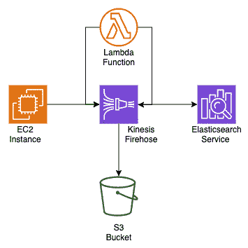

图 17.12 – Kinesis Firehose 同时将日志插入 S3 和 Elasticsearch 服务

图中有一个 S3 存储桶的原因之一是，Kinesis Firehose 可以在指定时间内重试任何失败的记录，以便在交付失败时重新发送到 Elasticsearch 服务。

什么因素可能导致失败？嗯，一个常见的原因是 Elasticsearch 集群的空间不足。如果你持续流式传输日志，但没有正确的方式来淘汰旧数据，或者没有向集群添加足够的节点，那么在某个时刻，集群将没有足够的空间，无法再接受任何新数据，或者在我们的案例中，无法接收新的日志。与其丢失这些信息或手动尝试将其插入集群，不如让 Kinesis 将错误的记录排入 S3 存储桶，然后在稍后重新尝试发送数据。

现在我们了解了如何使用 Amazon Kinesis 来增强日志记录设置，让我们来看看正确标记和分类日志的重要性。

## 使用标签和元数据正确分类日志

在对云资源和后续日志进行分类以便摄取时，标签可以帮助分类资源的来源，特别是在将所有日志推送到大型企业日志解决方案的情况下。

作为一个经验丰富的 DevOps 工程师，在 AWS 中创建资源时，你应该为从 CI/CD 管道中出来的资源添加多个标签，以便有效管理这些资源：

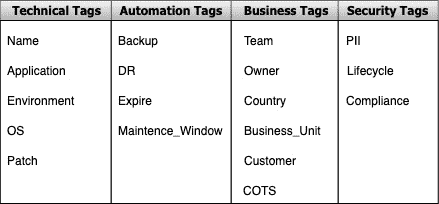

图 17.13 – 用于企业系统中的标签类别和键的示例

当我们在前面的示例中讨论使用 Lambda 函数和 Kinesis 处理时，我们可以查看元数据中包含的标签。

# 清理资源

在本章的实践过程中，我们在 AWS 账户中创建了许多资源。如果没有及时删除，像托管的 ElasticSearch 集群这样的资源可能会导致账单超出预期。每隔 5 分钟触发一次的 Lambda 函数可能会消耗您的免费套餐配额，因为每月大约有 43,800 分钟，因此此函数将被调用 8,760 次。只需删除不再使用的资源，并删除任何不再使用的 CloudFormation 堆栈，以确保您的 AWS 账单尽可能保持在最低水平。

此外，请记得取消您的 QuickSight 订阅，无论是免费试用还是单月订阅，以免因 QuickSight 服务而产生持续收费。

# 总结

本章中，我们讨论了如何实施企业级日志记录系统。我们还了解了 AWS 提供的其他本地解决方案，这些方案更适合捕获、处理、存储和可视化大量不断流入的日志数据。

在下一章中，我们将开始探讨如何确保我们的工作负载具有高度可用性，从 Auto Scaling 组及其生命周期开始。

# 复习问题

1.  您的公司要求您创建一个可视化仪表盘，以图形化的方式展示日志，并且管理团队可以访问。管理团队不会通过 IAM 用户登录 AWS 账户，也没有 AWS 管理控制台访问权限。他们还希望从 AWS Redshift 数据库和通过 AWS Batch 过程创建并存储在 S3 桶中的 CSV 文件中进行数据增强。如何为管理团队创建一个易于访问、安全且动态的仪表盘？

    a. 使用所有数据源创建一个 CloudWatch 仪表盘。收集管理团队的电子邮件地址，并发送仪表盘访问链接。

    b. 通过 CloudWatch Logs 将所有数据流式传输到托管的 ElasticSearch 集群。创建一个 Kibana 仪表盘，展示所需的可视化内容。将 Kibana 仪表盘的链接与执行团队共享。

    c. 使用 Kinesis Firehose 将 Redshift 中的数据流式传输到托管的 ElasticSearch 集群。创建一个 Kibana 仪表盘，展示所需的可视化内容。将 Kibana 仪表盘的链接与执行团队共享。

    d. 使用 Amazon Athena 创建一个包含所有需要用于 QuickSight 仪表盘日志的临时表。将 CSV 文件导入 QuickSight 以进行可视化。将 Redshift 数据库作为数据源从 QuickSight 导入。收集管理团队的电子邮件地址，并发送仪表盘访问链接。

1.  您最近加入了一家公司，该公司在 S3 存储桶中存储了多种不同的日志文件。这些日志来自各种来源，包括使用 S3 同步从本地服务器推送，应用程序负载均衡器日志，VPC 流日志等。公司希望您快速分析这些日志，并查明每个类别的日志有多老。您如何能够快速且经济有效地执行此任务？

    a. 将包含日志的 S3 存储桶设置为 Amazon QuickSight 中的数据源。使用 SPICE 引擎分析日志。创建两个快速可视化，一个显示日志的年龄，另一个显示日志的类型。

    b. 使用 S3 库存功能搜索 S3 存储桶中的文件。将报告导入 Excel，然后按年龄和日志类型对文件进行排序。

    c. 创建一个 AWS Glue 作业目录，列出所有 S3 存储桶中的项目。使用 Amazon Athena 查询日志类型。创建一个查询来对日志类型进行分组。按日期降序排序，以便在每个组中首先显示最旧的日志。

    d. 将所有日志导入托管的 Elasticsearch 集群。使用 Kibana 界面，运行一个关于日志类型的查询，然后按年龄对日志进行分组以获取日志数量的统计信息。

# 查看答案

1.  D

1.  B
