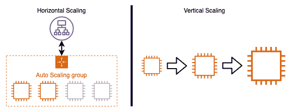
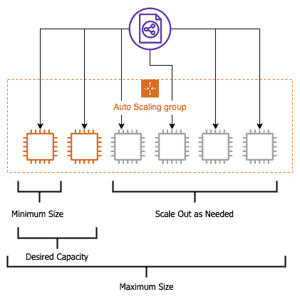
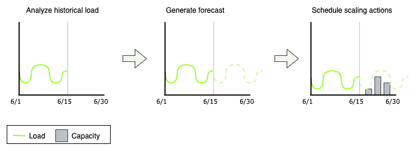
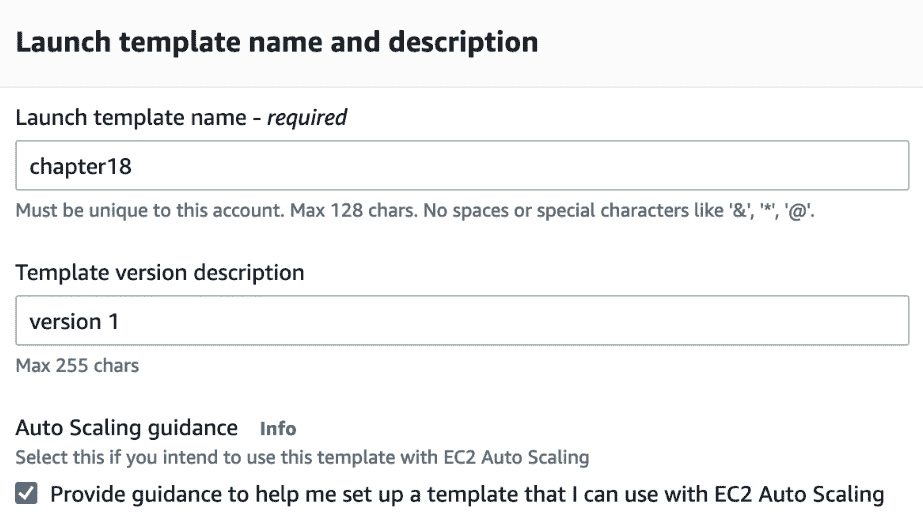
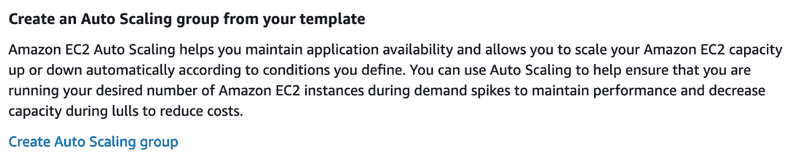
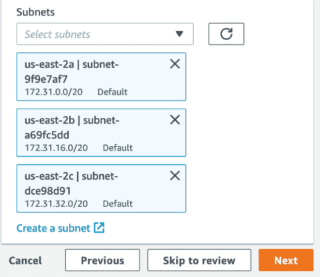
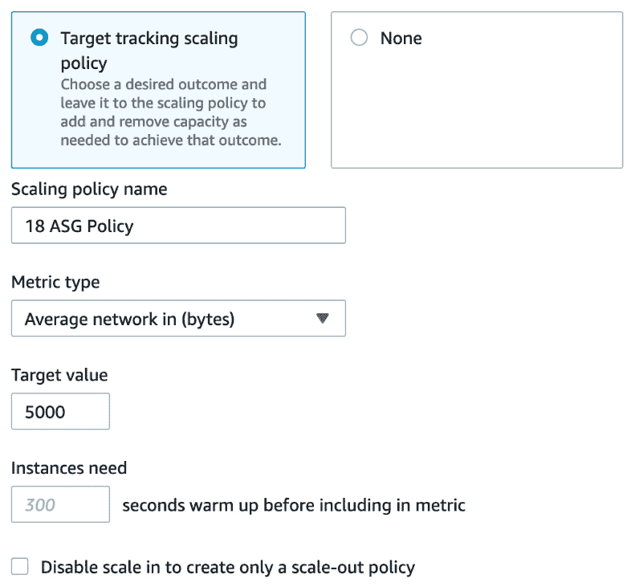
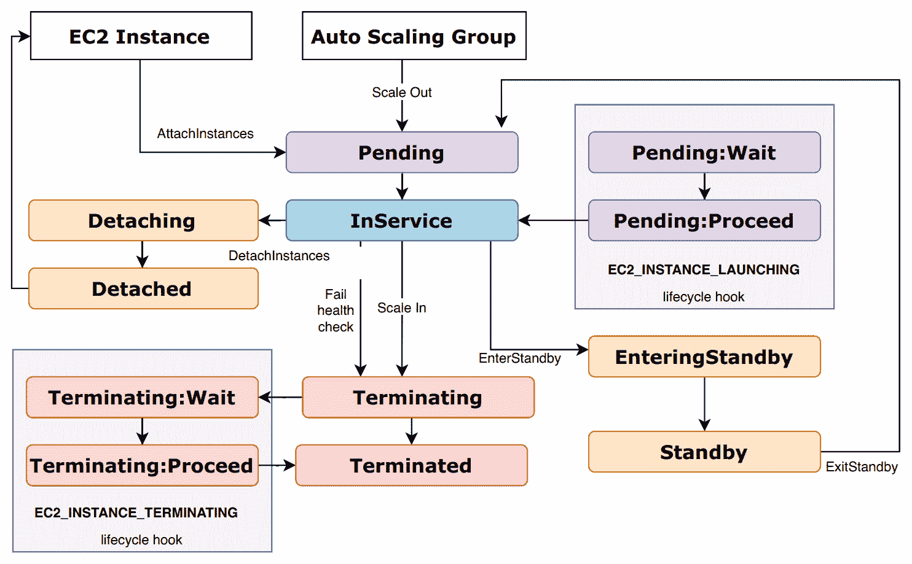

# 第十九章：自动扩展与生命周期钩子

自动化的一个关键特性是利用自动扩展。虽然许多人仅在其基本功能上使用这个**Amazon Web Services**（**AWS**）服务，但受过教育的**开发运维**（**DevOps**）专业人员理解并利用自动扩展提供的一些更高级的功能。了解这些组件不仅有助于你通过认证考试，还能让你更有效地管理你的 AWS 环境。

在本章中，我们将介绍以下主要内容：

+   理解 AWS 自动扩展

+   使用自动扩展部署**弹性计算云**（**EC2**）实例

+   自动扩展生命周期

+   使用自动扩展生命周期钩子

# 理解 AWS 自动扩展

自动扩展是**Amazon EC2 服务**的一个子集，围绕自动配置和管理 EC2 实例展开，无需任何人工干预。自动扩展服务可用于在一个或多个**可用区**（**AZs**）内，始终保持固定数量的服务器。该服务还为你提供了弹性，可以在不需要持续监控系统的情况下，按需自动扩展，以应对客户或应用程序带来的需求激增。

它通过利用一个互补服务——Amazon CloudWatch 来实现这一点。CloudWatch 监控如**中央处理单元**（**CPU**）使用率等度量指标，并确保如果使用率超过 80%，即实例的可用 CPU 有 80% 被特定时间段（例如 5 分钟）占用，则会触发扩展事件。这有助于减轻该实例的负载，并且在新实例上线后，CPU 使用率应会降回 80% 以下。

自动扩展服务会定期对其**自动扩展组**（**ASG**）中的实例进行健康检查。健康检查之间的时间可以配置，但默认设置是 300 秒（5 分钟）。你还可以配置实例在被标记为不健康之前允许失败多少次健康检查。类似地，实例必须失败的健康检查次数与它必须通过的健康检查次数相同，才能将其作为健康实例添加到 ASG 中。

自动扩展在基础设施事件规划中也发挥着关键作用。如果你知道客户流量即将增加，例如市场部门购买了一个流行电视节目上的电视广告，或者有一场特别促销即将发生，那么你可以简单地增加 ASG 的期望容量和最大容量，以确保客户不仅有良好的体验，而且服务器也不会过载。

现在我们已经对自动扩展服务有了基本了解，接下来让我们看一下构成该服务的关键组成部分。

## 理解垂直和水平扩展的区别

在本章中，我们将讨论如何通过水平扩展来根据工作负载的需求调整实例的数量。这通常是一种更具成本效益的扩展方式，因为你可以根据工作负载的基准测试，知道你的工作负载实际需要多少内存和 CPU。这带来了许多好处，包括工作负载的可用性更高，因为有多个实例或容器同时运行应用程序。这避免了被垂直扩展的实例（或容器）成为**单点故障**（**SPoF**）。你也不受硬件限制。垂直扩展到一定程度时，你会遇到资源限制。尽管 AWS 中有一些实例拥有巨大的**随机存取内存**（**RAM**）和大量的 CPU，但这并不是正确构建和部署应用程序的方式。

水平扩展和垂直扩展的过程在下图中展示：

图 18.1 – 水平扩展与垂直扩展

现在我们已经了解了水平扩展和垂直扩展的区别，接下来让我们来看一下 AWS 自动扩展的关键组成部分。

## 自动扩展的关键组成部分

自动扩展的主要组成部分之一是 ASG（自动扩展组）。这个 ASG 是你的应用程序或服务的实例的逻辑组合。你需要为 ASG 设置三个主要变量：最小实例数、最大实例数和期望实例数。最小实例数告诉 ASG 在任何时刻，所有指定可用区（AZ）中可以运行的最少实例数。最大实例数告诉 ASG 在该区域内可以分配的最大实例数。这些最大值必须在服务限制范围内。最后，期望容量是指在没有计划动作或由扩展策略驱动的扩展事件的情况下，任何给定时刻运行的实例数量。

你可以在下图中看到 ASG 的示意图：

图 18.2 – ASG 可视化

自动扩展的另一个关键组成部分是**启动模板**。启动模板决定了 ASG 中的实例将以哪些属性启动。这些属性是通过启动模板提供的。在编写启动模板时，你可以确定例如实例大小、镜像**标识符**（**ID**）、**虚拟私有云**（**VPC**）ID 等项目。

如果你曾经使用过 ASG，那么你可能熟悉启动配置。启动配置与启动模板非常相似，但在某些方面，启动模板替代了启动配置。首先，启动配置是不可变的。每当你想要更改启动配置时，你需要克隆启动配置、进行更改，然后将其附加到 ASG 上。这与启动模板不同，启动模板支持版本控制。启动模板还支持最新的 EC2 功能，例如使用无限制的 T2 实例和**弹性块存储**（**EBS**）标签。

ASG 与**弹性负载均衡**（**ELB**）完全集成。无论你使用的是哪一种类型的 ELB，ASG 都能无缝集成。这意味着，如果一个 ASG 与负载均衡器关联，当实例被配置时，它会自动注册到负载均衡器中。相反，当实例被取消配置或终止时，负载均衡器会从实例中清空流量，并在终止实例之前将其从负载均衡器中注销。

注意

如果你有旧的启动配置，但希望利用最新的 EC2 技术，AWS 提供了一个文档页面，介绍如何将启动配置转换为启动模板。你可以在这里找到：[`docs.aws.amazon.com/autoscaling/ec2/userguide/copy-launch-config.html`](https://docs.aws.amazon.com/autoscaling/ec2/userguide/copy-launch-config.html)。

我们将要讨论的最后一个关键组件是**扩展计划**。扩展计划可以设置为使用预测扩展或动态扩展。如果你将扩展计划设置为使用预测扩展，ASG 将使用**机器学习**（**ML**）来分析工作负载的负载情况，特别是针对一周中的特定时间和天数，并生成预定的扩展操作，以确保你的应用程序具备满足这些需求的能力，具体如以下图示所示：

图 18.3 – 预测扩展如何在 Auto Scaling 中调度资源

动态扩展策略是你在使用动态扩展和扩展计划时配置的组件。

需要注意的是，即使你的扩展计算表明你应该超出你设置的最大实例数，这个最大值是一个硬性限制，扩展策略不会超越它。如果在扩展时达到最大实例数的上限，你可以提高最大实例数，或者你可能需要创建一个新的启动配置版本，以适应可能更好地处理应用程序流量的不同类型或系列的实例。

有一句老话形容自动扩展，叫做*像火箭一样扩展，像羽毛一样缩减*。这是因为从时间角度来看，扩展实例是昂贵的。如果你在扩展事件中启动一到三台实例，它们应该同时上线。引入三台实例将让你获得更多的容量，而不是一次扩展单个实例。如果这部分容量没有必要，那么你可以一次缩减一个实例，保持支出在合理范围内，通过自动扩展控制成本。

在规划 ASG 时，你需要考虑以下因素：

+   启动并配置将成为 ASG 一部分的服务器需要多长时间？

+   在监控工作负载性能时，哪些指标最适用？

+   你希望 ASG 跨多个可用区（AZ）部署吗？如果是的话，需要多少个？

+   自动扩展在你的应用程序中应该扮演什么角色？

在掌握了自动扩展的关键组件后，让我们来看看 AWS 自动扩展的主要使用案例。

## 了解不同类型的自动扩展

Amazon 的 EC2 自动扩展提供了多种选项，帮助你根据业务需求和预算目标扩展实例。

如果你想完全控制如何扩展实例，那么可以使用**手动扩展**。通过手动扩展，你可以根据工作负载的需求设置最小值、最大值和所需容量，ASG（自动伸缩组）会相应调整。

有时，流量到达工作负载的情况是相当可预测的。比如，客户在正常工作时间更为活跃，或者你可能有一些内部使用的业务工作负载，而这些工作负载的使用者都位于一个或两个特定的时区。这些情况下使用**计划性扩展**非常合适。使用计划性扩展时，ASG 会根据你设定的时间和日期自动进行扩展和缩减。

如果你希望在应用程序的服务需求高涨时，ASG 能够自动扩展，并在需求减少时缩回，这就是**动态扩展**的应用场景。动态扩展允许你选择一个对应用程序重要的特定指标，并设置一个百分比，一旦达到该百分比，与该指标关联的 CloudWatch 警报将被触发，从而启动一个或多个实例，将其添加到 ASG 中。同样，如果你之前响应特定指标扩展了容量，而该指标已经降到一个被低利用的水平，则扩展策略将检查应该开始终止的实例。根据你的配置，可能是最旧的实例、最新的实例，或者是最接近下一个计费周期的实例。

动态扩展还允许你使用**步进扩展**。这些步进调整可以根据指标警报触发的类型有所不同，这意味着如果流量突然激增，并且你的最大容量允许的情况下，你可以一次性扩展到多个实例。

将动态扩展的属性进一步扩展，就是**预测性扩展**。预测性扩展分析你的流量趋势，然后根据这些趋势增加或减少 ASG 中的 EC2 实例数量。预测性扩展是一个不错的选择，当你无法准确决定哪个指标最适合你的应用需求，或者你有需要较长时间初始化的应用时。对于那些看似周期性波动的工作负载，比如批量处理，预测性扩展也能发挥作用。预测性扩展分析可以分析这些工作负载，并决定何时引入更多容量。

我们刚刚看了不同的方式，ASG 可以如何被设置和调整，以应对工作负载流量的涌入。现在，让我们看看自动扩展的主要用例。

## AWS 自动扩展的四个主要用例

自动扩展为客户解决了四个流行的用例，具体如下：

1.  它自动化了服务器的配置。

1.  它减少了分页的频率。

1.  它使得使用竞价实例变得更加容易。

1.  它允许你上下扩展云基础设施并节省成本。

现在我们已经了解了使用自动扩展的一些主要用例，接下来让我们通过创建自己的启动模板，来看看如何将 ASG 付诸实践。

# 使用自动扩展部署 EC2 实例

了解一个服务的最佳方式就是动手操作，看看它的表现，自动扩展服务也不例外。在这个动手练习中，我们将为我们的 ASG 创建一个启动模板。然后我们将创建一个 ASG。按照以下步骤进行：

1.  使用你的管理员用户账户登录到**Amazon 管理控制台**。登录后，导航至 EC2 服务。在 EC2 服务中，找到并点击左侧菜单中的**启动模板**子菜单项，该项位于**实例**菜单标题下。

1.  当你进入 EC2 的**启动模板**主屏幕时，点击主窗口中的橙色**创建启动模板**按钮。

1.  我们现在应该处于标有`chapter18`的屏幕上

1.  `版本 1`

1.  **自动扩展指导**—勾选框，如下图所示：

图 18.4 – 启动模板的第一部分已完成

1.  接下来，向下滚动页面，查看下一个选择标准框。我们将使用以下值填写剩余的字段：

    +   `t2.micro`。

    +   **密钥对（登录）**—不要在启动模板中包含此项。

    +   **网络设置**—**VPC**。

    +   **转到网络设置** | **安全组**，并选择你的默认安全组。

1.  一旦你填写了所有的值，我们可以点击橙色的**创建启动模板**按钮。此时你应该会看到成功创建了一个启动模板。

1.  使用页面中间的链接，在**从模板创建自动扩展组**标题下，进入**自动扩展**部分，在此我们可以创建新的 ASG，如下图所示：

    图 18.5 – 创建自动扩展组部分，当你完成启动模板时

1.  你现在应该位于`eighteen`。

1.  在下一个框中，从下拉列表中选择`chapter18`）。点击屏幕底部的橙色**下一步**按钮。

1.  在**配置设置**屏幕上，保持所有默认选项，包括默认 VPC。我们在此练习中不使用任何现货实例或额外的 VPC。在**网络**框中，依次选择默认 VPC 中的三个子网，直到所有三个子网出现在选择下拉框下方。添加完所有子网后，点击页面底部的橙色**下一步**按钮，如下图所示：

    图 18.6 – 将默认 VPC 中的三个子网添加到 ASG

1.  现在，将`300`秒调整为`30`秒。做出此更改后，点击橙色**下一步**按钮。

1.  在`1`、`1`和`3`处。

1.  向下滚动到`18 ASG 策略`

1.  `平均网络输入（字节）`

1.  `5000`

以下截图展示了这个过程：

图 18.7 – 我们的 ASG 的带度量的扩展策略

1.  填写完伸缩策略的值后，向下滚动到页面底部，点击标有**跳过审查**的白色按钮。

1.  在**审查**页面，向下滚动到页面底部，点击橙色的**创建自动伸缩组**按钮，来创建我们的 ASG。

1.  一旦点击按钮，你应该会被带到**EC2** | **自动伸缩组**页面，在那里你会看到你的组的状态最初为**更新容量**，因为第一个实例正在上线。

1.  如果你想查看你的实例扩展，那么你可以按照以下步骤操作。在`eighteen`中。

1.  在横向菜单栏中，点击`eighteen` ASG 策略。选中后，使用**操作**下拉菜单，选择**编辑**：

    图 18.8 – 单个 ASG 的横向菜单栏，突出显示自动伸缩

1.  在`5000`到`100`之间。一旦你更改了这个值，点击橙色的**更新**按钮。

1.  返回主**自动伸缩组**页面并刷新，看到实例上线以满足即将到来的流量的*需求*。

现在我们已经了解了如何在实际环境中创建启动配置和 ASG，让我们继续深入理解自动伸缩生命周期，以及它如何不同于仅仅启动一个 EC2 实例。

# 自动伸缩生命周期

当你将**EC2 实例**放入 ASG 时，它会遵循一个普通 EC2 实例（你通过命令行或 AWS 管理控制台启动的实例）不遵循的特定路径。该实例首先由 ASG 启动。如果这是一个**扩展**事件的一部分，那么该实例有机会通过**生命周期钩子**执行特殊命令。生命周期钩子允许你在启动或终止作为 ASG 一部分的实例时添加自定义操作。一旦实例变为健康状态，它将处于**服务中**状态，并成为 ASG 的一部分。如果该实例未通过设定的健康检查次数，它可能会进入**终止**状态。如果当前运行的实例数不足以支持流量或指标数据，则可能会发生**缩减**事件。再次强调，就像扩展事件一样，这个缩减事件也允许我们使用生命周期钩子。

自动伸缩生命周期过程如下面的图示所示：

图 18.9 – 自动伸缩生命周期过程

现在我们已经理解了 ASG 的生命周期，让我们更深入地研究生命周期钩子以及何时最适合使用它们。

# 使用自动伸缩生命周期钩子

如我们刚才所见，Auto Scaling 生命周期中有两个状态，在实例进入这些状态时允许进行额外操作。这两个状态分别是`Terminating:Wait`状态，你可以让实例暂停最多 30 分钟，之后再进入`Terminating:Proceed`状态，最后进入`Terminated`状态。

## 生命周期钩子的使用场景

你可能想了解一些生命周期钩子的使用场景。让我们快速看一下几个例子。

第一个例子是使用启动状态来调用 Lambda 函数。一旦我们的实例通过待处理状态并进入`Pending:Wait`状态，我们就可以利用这个事件为我们的应用程序调用一个特定的 Lambda 函数。一个好的应用场景是，如果我们有 Windows 实例并且需要在每个实例启动时将其加入到特定的**Active Directory**（**AD**）域和名称服务器中。当实例进入初始生命周期钩子时，它可以运行一个脚本来获取其**域名系统**（**DNS**）名称并加入该域。

当我们开始终止一个实例的过程时，情况也是一样的。在终止实例时，有些情况下我们希望在允许实例进入终止状态之前，确保捕获到来自该一组应用程序的所有数据。

作为提醒，在生命周期钩子中使用复杂脚本可能会导致我们请求新实例上线并加入我们的 ASG 或终止之间的额外时间延迟，从而使我们在需要时能够获得更多的弹性。处于等待状态的实例仍然会占用与 ASG 的最大容量计算相当的实例容量。

## 清理资源

和我们其他的练习一样，建议你在完成本章后终止所有正在运行的实例并清理 ASG，以免在 AWS 账户中产生不必要的费用。

# 总结

在本章中，我们介绍了 Auto Scaling 以及它如何自动管理来自内部和外部客户的需求。我们了解了使用不同的扩展策略配置 ASG 的不同方式，甚至通过动手实践部署了一个 ASG。最后，我们探讨了 Auto Scaling 生命周期以及生命周期钩子如何帮助执行比简单扩展更复杂的任务。

在下一章，我们将开始几章的内容，重点讨论如何保护你的环境和管道，首先将讨论保护传输中和静态数据的安全。这将特别涵盖**密钥管理服务**（**KMS**）以及使用**Amazon 证书管理器**（**ACM**）来管理服务器端证书。

# 复习问题

1.  你被引入了一家公司，该公司正在使用 ELB 和自动扩展运行一个业务关键型的工作负载。这个工作负载是一个二层应用程序，包括应用层和数据库层。目前，两个层都已经在`us-east-1`区域的两个可用区（AZ）中部署。数据库需要以同步方式从应用程序进行复制。首席技术官（CTO）告诉你，即使单个可用区不可用，且自动扩展无法在剩余的可用区中启动新的实例，应用程序也必须保持完全可用。你该如何通过 AWS 特定的服务和架构来实现这一目标？

    1.  在 ELB 中设置配置，以在三个可用区中进行部署，并将自动扩展设置为在峰值时每个区域处理 33%的负载。

    1.  在 ELB 中设置配置，以在三个可用区中进行部署，并将自动扩展设置为在峰值时每个区域处理 50%的负载。

    1.  在 ELB 中设置配置，以使用 Round Robin 算法在两个区域中进行部署，并将自动扩展设置为在峰值时每个区域处理 50%的负载。

    1.  在 ELB 中设置配置，以使用 Round Robin 算法在两个区域中进行部署，并将自动扩展设置为在峰值时每个区域处理 100%的负载。

1.  你为一个在 EC2 实例上运行的应用程序创建了一个 DevOps 管道。客户通过附加到 ASG 的应用程序负载均衡器与此应用程序进行交互。自从发布了最新版本的应用程序和启动模板后，应用程序似乎在每天的每个小时都在多次扩展和收缩。你和你的团队应该采取哪些措施，以稳定 ASG，保持弹性，并优化成本？（选择两个答案）

    1.  修改应用程序的 ASG，使其使用计划扩展操作。

    1.  修改应用程序的 ASG 终止策略，使其优先终止最旧的实例。

    1.  修改应用程序的 ASG 冷却时间，使其变得更长。

    1.  修改与应用程序 ASG 组关联的 CloudWatch 警报，使其与缩减策略关联的警报周期更长。

1.  你所在的公司有一个应用程序，包含通过 ASG 启动的 EC2 实例。你注意到当需求增加时，EC2 实例并未自动扩展。你应该如何检查并解决这个问题？

    1.  检查以确保 ASG 将实例分布到多个区域。

    1.  检查以确保 ASG 将实例分布到多个可用区。

    1.  检查以确保正在使用 ELB 健康检查。

    1.  检查以确保正在衡量正确的指标来触发扩展事件。

# 审查答案

1.  b

1.  c, d

1.  d
