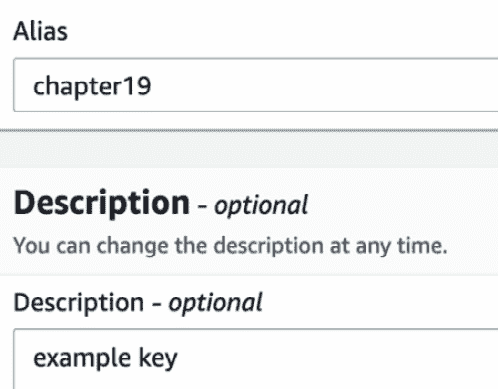

# 第二十章：保护飞行中的数据和静态数据

当你和你的开发人员开始连接到你的系统时，安全性并非总是放在首位。尤其是当你认为加密密钥和证书握手可能会引起延迟时。无论如何，在今天的环境中，无论是传输中的数据还是静态数据，采用加密措施都是必须的。

有多种方法可以将加密技术融入你的环境。这可以从如何确保你与 AWS 之间传输的数据安全开始，然后是确保存储在亚马逊云上的数据安全，再到确保你为客户提供访问的数据的安全。

在本章中，我们将涵盖以下主要主题：

+   了解 KMS 密钥

+   向存储添加加密

+   向数据存储添加加密

+   使用 AWS 证书管理器保护传输中的数据

+   向 Amazon CloudFront 添加证书

# 数据加密简介

现在，推动加密数据的原因有很多。这个需求可能源于你的公司所在行业需要遵守的法规。也可能是公司内部的合规性治理规定要求数据必须加密。最终，也有可能是通过增加额外的保护层来采取主动的安全立场。无论推动加密的原因是什么，最终的目标都是为客户提供更安全的平台，并更好地保护数据：


图 19.1 – AWS 加密栈

最终，你和你组织的加密目标应该是通过最小化对数据的未经授权的物理和逻辑访问来简化。

在查看数据和加密时，有三个类别需要注意：

+   传输中的数据

+   静态数据

+   使用中的数据

如果按照亚马逊的建议进行操作，那么你应该在环境中尽可能多地进行加密。这包括在存储时对静态数据进行加密，并且在客户端和服务器之间传输数据时对传输中的数据进行加密。

## 在 AWS 中加密静态数据的选项

在本章中，我们将重点讨论来自 AWS 的两个服务：密钥管理服务和证书管理器。亚马逊生态系统中还有其他一些在数据加密过程中起作用的服务，我们希望简要提及它们，以防它们出现在测试中。

第一个是亚马逊虚拟私有云的一部分，第二个是**AWS 虚拟私有网络**（**AWS VPN**）。通过使用 AWS 的站点到站点 VPN 连接将你的数据中心与 VPC 连接，可以通过 IPSec 协议安全地传输数据。IPSec 协议组用于加密互联网传输。

您可以通过设置一个客户网关开始，这通常包括一个路由器，然后在 VPC 上创建 VPN 网关。VPN 的吞吐量限制为 1.25 千兆比特每秒。

现在我们了解了如何在 AWS 账户中加密静态数据的选项，让我们专注于使用 AWS **密钥管理服务**（**KMS**）来保护我们静态数据。

# 理解 KMS 密钥

KMS 是 Amazon 提供的托管服务，使得生成和管理**客户管理密钥**（**CMK**）变得简单。CMK 是用于加密和控制存储在 AWS 上的数据访问的密钥。KMS 与许多其他服务（尤其是 IAM 服务）无缝集成，允许您控制谁有权访问这些密钥。

AWS 为 KMS 密钥创建密钥材料。作为客户，您不能提取、导出、查看或管理此密钥材料。您可以删除密钥，但不能删除密钥材料本身：


图 19.2 – AWS KMS 中的主密钥和数据密钥

在 KMS 中需要理解的一个关键概念是**信封加密**。当 AWS 加密您的数据时，您的数据是安全的，但您的密钥也需要保护。AWS 通过使用数据密钥加密数据，然后再用另一个密钥加密数据密钥来实现这一点。最顶层的明文密钥称为主密钥。

使用信封加密过程带来许多好处：

+   **它保护数据密钥** – 这样，您可以将加密的数据密钥与加密的数据一起存储。

+   **您可以使用多个密钥加密相同的数据** – KMS 允许您仅重新加密保护原始数据的数据密钥，而不是重新加密所有原始数据。

+   **您可以结合多种算法的优点** – 对称密钥算法通常比公钥算法要小。但是，公钥算法允许继承的角色分离。使用信封加密可以让您同时使用这两种策略。

## 使用 AWS 托管的 CMK 密钥进行存储加密

每个提供加密的 AWS 服务都有自己的 AWS 托管 KMS 密钥。

AWS 托管的 CMK 和用户创建的 CMK 之间的一个关键区别是轮换计划。使用 AWS 托管密钥时，需要进行密钥轮换，并且每 1,095 天或每 3 年进行一次。

这两种不同类型的密钥的相似之处在于，AWS 托管密钥和 CMK 仅用于您的 AWS 账户。

### 使用 KMS 与 S3 保护静态存储的对象

KMS 与 S3 对象存储无缝集成。S3 拥有自己的服务托管密钥，允许您几乎不费任何力气地加密存储桶中的对象。还有以下安全控制可帮助将 KMS 与 S3 结合使用：

+   Amazon S3 具有自动加密所有新上传到存储桶中的对象的能力。这是通过 **属性** 部分中的一个存储桶设置来完成的，标记为 **默认加密**。一旦启用此设置，任何新上传到存储桶中的对象都会自动使用 Amazon 管理的 S3 密钥（默认情况下）或指定的客户管理的 S3 密钥进行加密。

+   如果你需要追溯性地加密 S3 存储桶中的项目，可以使用 S3 批处理功能。Amazon S3 具有在存储桶中的对象上执行批处理操作的能力。如果你的内部指导方针发生变化，或者审计发现某个用户（无论是内部用户还是外部用户）已经向存储桶中添加了未加密的项目，你可以使用 S3 批量操作来纠正这种情况。

+   如果你想检查某个 S3 存储桶中的项目是否已加密，可以运行 S3 清单报告。

现在我们已经了解了 KMS 如何与 Amazon S3 顺畅配合，特别是在使用 Amazon 管理密钥的情况下，我们将查看如何创建和管理自己的密钥，以及客户管理密钥和 Amazon 管理密钥之间的重要区别。

## 在 KMS 中创建和管理客户管理密钥

可能会有一些情况，某些用户或团队需要访问数据，而其他人则不应有权限访问。这是集成 CMK 与 IAM 策略来控制谁可以访问密钥的理想用例之一。

正如我们在本练习中所看到的，关键管理员和关键用户之间有职责分离。关键管理员是控制密钥访问的用户，包括旋转和删除密钥的能力。还有关键用户，这些是每天使用密钥的用户和服务角色。这些是你在创建和管理帐户中的密钥时必须理解的重要概念。可能有一些个人和团体需要管理密钥的能力，但不需要访问受密钥保护的数据。

在以下练习中，我们将使用 KMS 创建自己的客户管理密钥。在完成创建密钥之前，我们还将指定关键管理员和关键用户：

1.  登录到 AWS 管理控制台并从顶部搜索菜单栏搜索 `Key Management Service`：

    图 19.3 – 搜索菜单中的密钥管理服务图标

1.  一旦进入 KMS，我们现在可以点击橙色的 **创建密钥** 按钮。

1.  现在在 **配置密钥** 页面，选择 **对称** 密钥类型，然后点击页面底部的橙色 **下一步** 按钮。

1.  这应该会将我们带到 `chapter19` 作为 KMS 密钥别名。我们可以将 `example key` 作为 **描述**。向下滚动到页面底部，点击橙色的 **下一步** 按钮：

    图 19.4 – 添加 KMS 密钥别名和描述

1.  现在是选择密钥管理员的时候了。这是一个重要步骤，决定了谁可以控制密钥的访问权限以及谁可以删除密钥，但不包括可以使用密钥的人员和组。由于你很可能已经使用我们在开始时创建的`devops`用户登录，因此选择该用户，如果你有其他管理员帐户并希望它能够访问密钥，请勾选该名字旁的框。一旦选择了管理员的名字，点击屏幕底部的橙色**下一步**按钮。

1.  现在我们应该在`devops`用户下，让我们把之前创建的开发者用户`mariel`也添加到授权用户列表中。选定后，点击屏幕底部的橙色**下一步**按钮。

1.  在**审查**页面，向下滚动并点击橙色的**完成**按钮来创建密钥。

现在我们已经完成了创建 CMK 的过程，让我们看看如何使用这个密钥通过加密来确保我们的数据安全。

## 使用我们的自定义 KMS 密钥为数据存储添加加密

现在让我们来看看如何使用我们刚刚创建的 CMK 来加密我们之前创建的 S3 存储桶中的对象。在示例中，我们将使用在*第四章*中创建的存储桶，*Amazon S3 Blob 存储*：

1.  登录到 AWS 管理控制台，进入 `devopspro-beyond`。找到它后，点击存储桶的名称以进入。

1.  进入存储桶后，点击顶部水平菜单中的**属性**选项卡：

    图 19.5 – S3 水平菜单中的属性菜单项

1.  现在显示的是 S3 存储桶的属性项目，向下滚动，直到找到**默认加密**标题。点击**默认加密**框右上角的白色**编辑**按钮以进入设置界面。

1.  现在你应该在标记为**编辑默认加密**的页面上。在**服务器端加密**标签下，点击**启用**旁边的单选按钮。选择后，下面将出现一组新的选择项，供你选择**加密密钥类型**。选择**AWS 密钥管理服务密钥（SSE-KMS）**选项旁的单选按钮：

    图 19.6 – 在 S3 存储桶上启用 KMS 密钥

1.  一旦进入我们在前面的实操中创建的`chapter19`。选择后，向下滚动到页面底部，点击橙色的**保存更改**按钮。

1.  在设置好存储桶的对象加密后，点击横向菜单中的**对象**菜单项，返回到主存储桶页面。点击橙色的**上传**按钮，在**上传**页面上，点击白色的**添加文件**按钮。选择任意一个文件上传到你的存储桶。一旦文件排队准备上传，点击橙色的**上传**按钮。

1.  当你的文件完全上传到 S3 存储桶时，你可以点击橙色的**关闭**按钮。这将把你带回到 S3 存储桶的**对象**页面。点击对象的名称，然后向下滚动到**服务器端加密设置**，查看你的对象是否已经使用 KMS 密钥进行了加密。

    重要提示

    如果你已经不再使用 KMS 密钥，你可能想要回去并安排删除它。KMS 密钥不会立即删除，至少需要七天才能删除。加密对象的密钥一旦被删除，将无法访问。

通过了解如何使用 KMS 保护静态数据，我们接下来将学习如何使用 AWS 证书管理器保护传输中的数据。

# 使用 AWS 证书管理器保护传输中的数据

当你的外部网站呈现**传输层安全性**（**TLS**）证书并使用安全的 HTTP 协议（HTTPS/443）时，客户会知道你正在以加密方式保护他们发送到你系统的数据：


图 19.7 – 从浏览器到客户端的 SSL/TLS 工作原理

当你或你的客户请求一个使用 SSL/TLS 证书保护的 HTTPS 网站时，以下步骤会发生：

1.  服务器尝试通过安全的 `443` 端口连接到网站。然后该网站服务器会进行身份验证。

1.  服务器接着会发送其 SSL 证书的副本。

1.  客户端会检查证书，看看它是否来自受信任的机构。如果信任该证书，它将向服务器发送确认消息。

1.  服务器随后会发出一个数字签名的确认，开始 SSL 会话。

1.  数据随后在客户端和服务器之间安全共享。

**AWS 证书管理器**（**ACM**）是一个可以帮助你快速且轻松地在 AWS 服务上创建、管理和部署 TLS 证书的服务器。ACM 也支持公共证书。ACM 处理**私钥基础设施**（**PKI**）中最难和最复杂的部分，包括创建证书、证书续期和颁发证书等任务。

ACM 可以快速且轻松地为外部面向的 AWS 资源（如以下内容）提供 TLS 证书：

+   弹性负载均衡

+   AWS Elastic Beanstalk

+   Amazon EC2 实例

+   Amazon API Gateway

+   Amazon CloudFront

ACM 创建的任何证书有效期为 13 个月（395 天）。但是，您不能下载您创建的 ACM 证书的私钥。一旦证书颁发，您就无法添加或删除该证书中的域名。如果需要新域名，您可以创建通配符证书（`*.domain.com`），或者需要创建新的证书。

当我们在以下段落中提到域名时，我们指的是已在注册商处注册并托管在 DNS 服务器或服务（如 Route 53）上的域名。许多情况下，这可以被认为是域名。当首次为某个域名申请 Amazon 证书时，ACM 必须验证您是否拥有或控制该域名。可以通过两种方式进行验证。第一种是通过电子邮件验证。ACM 会向 WHOIS 数据库中列出的三个电子邮件地址发送验证邮件，您需要在 72 小时内通过该邮件进行验证。第二种验证方式是通过 DNS 验证。ACM 为您的域名创建两个 CNAME 记录，并要求您将这些记录添加到您的 DNS 数据库中进行验证。一旦验证记录存在，服务就会知道您是该域名的所有者。

## ACM 可以执行的两项功能

我们已经解释了安全证书的作用，主要是针对面向公众的网站。这些证书的颁发是 ACM 执行的关键角色之一。然而，这并不是它在您的 AWS 环境中唯一可以执行的角色。ACM 提供了两项独立的服务。第一项是为 Elastic Load Balancing、API Gateway 和 CloudFront 等服务以及其他面向前端的服务管理、配置和续订企业级 TLS 证书。第二项服务是作为私有证书颁发机构。这使您能够为您的应用程序和基础设施颁发安全和可信的私有证书，以支持您的工作负载和组织。

现在我们知道了 ACM 可以执行的功能，我们将通过一个实际操作，使用 ACM 创建并配置一个证书，然后在一个公开可用的 CloudFront 分发中使用该配置的证书。

## 将证书添加到 Amazon CloudFront

在充分理解 ACM 服务之后，我们将继续本章的最后一个实际操作。我们将从使用 ACM 创建一个 TLS 证书开始，然后创建一个非常简单的 CloudFront 分发，并使用我们的安全证书对其进行加密，以保护任何尝试连接到该分发的人。

如果您没有可用的域名，您可以使用 Amazon Route 53 服务轻松注册一个域名，以非常低的成本完成此练习。否则，您可以阅读以下练习步骤以了解过程：

1.  登录到 AWS 管理控制台，搜索 ACM 服务。一旦它从下拉菜单中出现，点击图标进入主服务页面。为了让证书与 CloudFront 服务兼容，我们需要在`us-east-1`区域创建它。如果你在其他区域创建证书，你将无法在本练习的第二部分中看到它。

1.  在 ACM 主页面，找到标有**提供证书**的图标和标题。点击该标题下方的蓝色**开始使用**按钮。

1.  在**请求证书**页面，由于我们没有可用的私有证书颁发机构，只有一个选项可供选择。保持此选项被选中，然后点击页面底部的蓝色**请求证书**按钮。

1.  创建证书的第一步是向证书添加域名。除非你只希望证书用于单一子域（例如 www），否则可以使用星号作为通配符，覆盖你的整个域名。在文本框中以`*.devopsandbeyond.com`的形式输入你的通配符域名，然后点击蓝色的**下一步**按钮：

    图 19.8 – 将通配符域名添加到我们在 ACM 创建的证书中

1.  下一步将是验证你是否真正拥有该域名。我们假设你通过 Route53 管理你的 DNS，并选择**DNS 验证**。保持**DNS 验证**选项被选中，然后点击蓝色的**下一步**按钮。

1.  这将带你到**添加标签**页面。只需点击页面底部的蓝色**审查**按钮。当你进入**审查**页面后，确认你的域名输入无误后，按下蓝色的**确认并请求**按钮。

1.  然后你需要将请求的 CNAME 添加到你的 DNS 文件中。获取该值并前往 Route53 服务。将该条目作为新的 CNAME 记录添加到你的域名 Route53 托管区。你可能需要等待几分钟，直到值传播完成，然后验证状态会变成绿色并显示为**成功**。一旦完成，你可以点击屏幕底部的蓝色**继续**按钮：

    图 19.9 – 在添加 DNS 条目后，验证状态显示为成功

    现在我们的证书已创建完成，我们可以继续创建 CloudFront 分发。Amazon CloudFront 是 AWS 本地的**内容分发网络**（**CDN**）。CloudFront 允许你使用单一来源向全球的众多客户同时提供内容，相较于从单一位置（如服务器或自动扩展组）提供内容，其延迟更低。

1.  现在，我们需要从 AWS 管理控制台顶部的搜索栏导航到 CloudFront 服务。进入服务主页后，点击橙色的**创建 CloudFront 分发**按钮，开始创建新的 CloudFront 分发。

1.  页面标题现在应该命名为`devopspro-beyond`；然而，你的存储桶将会有不同的名称。从下拉列表中选择你的源存储桶。源存储桶的名称将以`.s3.us-east-2.amazonaws.com`结尾。

1.  在下一个文本框中，在**源路径**文本框中输入`/pages`。

1.  保持 CloudFront 创建的名称不变，继续进入**S3 存储桶访问**部分。选择**是的，使用 OAI**选项。此选项将允许我们保持存储桶私密，并要求用户通过 CloudFront 分发访问，而不是直接绕过 CDN 访问源中的资源。点击白色的**创建一个新的 OAI**按钮；你可以保留 CloudFront 提供的名称。然后点击橙色的**创建**按钮。

1.  当对话窗口关闭时，在**存储桶策略**标题下，选择**是的，更新存储桶策略**选项。

1.  向下滚动直到你看到`将 HTTP 重定向到 HTTPS`选项被选中。

1.  我们可以保持其他选项不变，直到进入**设置**部分。我们首先要做的事是优化成本，所以在**价格类别**下，我们要选择**仅使用北美和欧洲**。

1.  现在，我们将安装来自 ACM 的自定义证书。在**自定义 SSL 证书 –** *可选*标签下，使用下拉菜单选项找到你在练习第一部分创建的证书，位于**ACM 证书**标题下。

1.  选择证书后，向下滚动至页面底部，点击橙色的**创建分发**按钮。

1.  当 CloudFront 分发正在创建时，记下**分发域名**；这就是你如何在不添加 Route53 别名的情况下访问 CloudFront 的方式：

    ```
    <html> 
    <head> <title> Chapter 19 - Protecting Data in Flight and at Rest </title> </head> 
    <p> Protecting Transmission of data - <b> VPN </b> </p>
    <p> Protecting Data at Rest - <b> KMS </b> </p>
    <p> Protecting Data in Flight - <b> SSL / TLS certificates </b> </p>
    </html>
    ```

1.  返回到 S3。在那里，找到你指定为 CloudFront 分发源的存储桶。点击该存储桶的名称进入它。

1.  进入存储桶后，我们需要点击白色的`pages`，就像我们在 CloudFront 分发选项中所做的那样。在你命名文件夹后，点击橙色的**创建文件夹**按钮。

1.  点击新创建的页面目录，然后点击我们在本节开始时创建的橙色`index.html`文件。当索引页面准备好上传时，点击橙色的**上传**按钮。

我们刚刚了解了如何使用 ACM 创建并实现安全证书。现在，让我们回顾一下我们在本章学到的内容。

# 总结

在本章中，我们讨论了如何保护你在亚马逊账户中的数据，包括静态数据和传输中的数据。我们从账户级别开始，讨论了如何在数据传输到你的 VPC 时使用通过 IPSec 隧道的安全 VPN 连接进行加密。然后，我们探讨了 KMS 以及 Amazon 管理密钥和 CMK 之间的区别。最后，我们讨论了如何使用 ACM 保护传输中的数据。我们看到 ACM 如何简化了在多个 AWS 服务上创建和实施 SSL 和 TLS 证书的过程。

在下一章中，我们将探讨如何通过 AWS 提供的两个强大自动化工具——Systems Manager 和 Config，在你的组织中强制执行标准和合规性。

# 审查问题

1.  公司所在的安全部门出台了新的合规性规定，要求所有加密密钥必须每 12 个月轮换一次，不得有例外。以下哪个选项不符合新规定？

    a. 使用导入的密钥材料与 CMK

    b. 使用 AWS 管理的密钥

    c. 使用 AWS 客户管理的对称 CMK

    d. 使用 AWS 客户管理的非对称 CMK

1.  你被带入一家处理机密数据的公司。然而，他们在亚马逊管理控制台和使用 CLI 时都未加密地传输数据。你可以采取哪些步骤立即通过加密保护数据传输？

    a. 在 KMS 中创建一组 CMK。使用信封加密，让每个用户在执行任何 CLI 命令之前加密每个交易。

    b. 使用 ACM 创建证书以创建安全登录，并加密传输到亚马逊管理控制台的通信。

    c. 在主 VPC 上创建客户网关和 VPN 网关。确保任何需要开发团队访问的其他 VPC 要么通过对等连接，要么通过过渡 VPC 连接器连接。

    d. 要求所有用户为他们的账户添加多因素认证，以确保通过 CLI 和 AWS 管理控制台的安全通信。

# 审查答案

1.  b

1.  c
