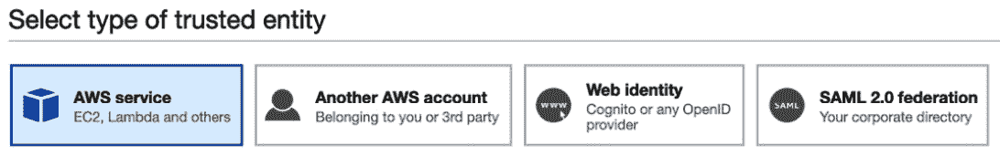

# 第二十一章：通过 Systems Manager 的角色和 AWS Config 执行标准和合规性

Systems Manager 是一个由多个单独功能组成的服务，这些功能被分为五个类别：运营管理、应用管理、变更管理、节点管理和共享资源。学习如何有效使用这个工具，可以让你作为一个 DevOps 专业人员变得更加高效，特别是在实现标准和检查一个或多个 AWS 环境或账户中的合规性时。随着组织对自动化和合规性要求的增加，拥有一个可以检查合规性、对不一致性发出警报并修复违规行为的工具，对于防止环境漂移至关重要。

在本章中，我们将讨论以下主要内容：

+   AWS Systems Manager 的各种功能

+   在 Systems Manager 中使用操作手册

+   AWS Config 基础知识

# AWS Systems Manager 的各种功能

DevOps 是开发和运维两项职责的结合。AWS **Systems Manager** (**SSM**) 关注这些职责中的运维部分，为你提供了大量的工具，用于日常运营任务。这些工具涵盖了从创建预定义的操作手册，到在 Linux 或 Windows 实例上快速、轻松且重复地执行功能。Systems Manager 还可以为你提供一个接口，以便在一个统一的地方跟踪你的资源或资源组。

作为额外的好处，Systems Manager 不仅有助于管理 AWS 云中的实例，还可以通过在本地服务器上安装轻量级代理来管理这些服务器，并允许该代理与 AWS 账户进行通信。

## Systems Manager 的关键特性和优势

Systems Manager 不仅仅是一个服务；它是一个供你使用的完整工具集。你可能不会使用它的所有功能，但了解它们可以帮助你快速解决问题：


图 20.1 – 组成 Systems Manager 的许多关键组件的概览

现在我们已经了解了一些 AWS Systems Manager 的功能，让我们深入探讨如何更有效地使用它来管理实例和节点。

## 使用 Systems Manager 进行节点管理

Systems Manager 为运维团队成员提供了许多功能，但有一类功能特别属于**节点管理**这一类别。

我们将查看 AWS Config 中一些专门为节点管理目的创建的特殊服务。

### Fleet Manager

同时了解您控制的所有不同实例可能是一项令人生畏的任务。SSM Fleet Manager 为您提供了一个用户界面，让您查看所有在您控制下的实例。Fleet Manager 还允许您收集这些实例的数据，并传递回去，无需逐个进入服务器或实例。

### 清单

如果您需要查看本地服务器、云 EC2 实例或两者的状态，那么 Systems Manager 的**清单**功能对您非常有用。

### 混合激活

如果您有不在 AWS 云或本地的服务器，您可以使用 SSM **混合激活**来管理这些设备，以及需要在单一管理控制台中管理的其他 EC2 实例。混合激活功能帮助您了解创建本地服务器激活所需的前提条件。包括创建 IAM 服务角色，确保操作系统兼容，并安装 Systems Manager 代理。

### 会话管理器

管理所有不同的 PEM 密钥，尤其是在开发人员自己创建密钥时，可能是一个繁重的任务。**会话管理器**通过允许授权用户使用基于 Web 的控制台执行命令，无需复制密钥，从而帮助减轻这一负担。您只需找到您需要远程创建会话的机器名称，然后立即启动会话。

本章稍后我们将通过一个练习来讲解如何使用会话管理器功能。

### 运行命令

通过 Systems Manager 的**运行命令**功能，您可以安全地更新您注册的管理实例的配置。**命令文档**是为执行运行命令而创建的。然后，使用实例 ID 或标签，针对指定的管理实例运行命令。

提示

您应始终在非生产或测试实例上测试您创建的运行命令。这样，您可以确保命令在执行之前会按预期执行，并且在生产流量到达服务器之前不会产生任何问题。

### 状态管理器

Systems Manager 的**状态管理器**允许您执行以下操作：

+   您可以配置网络设置。

+   您可以让您的实例加入 Windows 域。

+   它允许您在实例启动时使用引导脚本安装软件。

+   它允许您在整个生命周期内，在 Windows、Linux 甚至 macOS 管理的实例上运行脚本。

### 补丁管理器

如果您的环境中没有运行不可变基础设施，您应该有一个策略来保持您的实例系统补丁的最新状态。补丁管理器允许您在维护计划中添加这些系统补丁。

## 在 EC2 实例上运行远程命令

以前，如果你想在 EC2 实例上运行远程命令，必须创建一个 PEM 编码的密钥。SSM 会话管理器改变了这一切，它允许你通过浏览器使用具有正确权限的角色登录实例，而不是管理和轮换密钥。

注意

**PEM**代表**隐私增强邮件**，但这只是额外的知识，了解 PEM 的定义并不是考试的要求。

在接下来的练习中我们将看到这一点如何运作。在使用 Systems Manager 远程访问实例之前，我们需要设置一个 IAM 角色，该角色将允许 SSM 服务有权限访问任何具有该角色的实例。幸运的是，AWS 已经有一个托管的 IAM 策略，包含了我们完成此任务所需的所有权限；然而，我们仍然需要创建一个可以附加到 EC2 实例的角色。让我们开始吧：

1.  打开浏览器，访问 Amazon Web 控制台，导航到 IAM 服务：[`console.aws.amazon.com/iam/`](https://console.aws.amazon.com/iam/)。

1.  从左侧导航栏中选择**角色**，然后在出现的主框中按下蓝色的**创建角色**按钮。

1.  在**选择受信任实体类型**页面，确保选择了**AWS 服务**。

    图 20.2 – 创建角色时选择 AWS 服务作为实体类型

1.  然后，从常见使用场景列表中，找到**EC2**并点击选择它。选择后，你可以点击页面右下角的蓝色**下一步：权限**按钮。

    图 20.3 – 在创建 IAM 角色时的常见使用场景

1.  现在你已经进入了**附加权限策略**页面，在屏幕中间的搜索框中，搜索名为 *AmazonEC2RoleforSSM* 的策略。策略出现在搜索结果中后，选择其旁边的框。一旦选择了该策略，你可以点击蓝色的**下一步：标签**按钮继续。

    图 20.4 – 向 IAM 角色添加托管权限策略

1.  在**添加标签**页面，由于我们不会为此角色添加标签，只需选择页面底部的**下一步：审查**按钮即可。

1.  在`Remote2EC2SSM`页面上，你可以根据需要更改角色描述，使其更符合该角色的功能。更新完成后，点击页面底部的蓝色**创建角色**按钮。太好了！你的角色现在应该已经创建完成。

    图 20.5 – 添加角色名称和描述

    创建好角色后，我们可以开始创建一个临时的 EC2 实例，用于测试 SSM 的功能。

1.  在顶部菜单的左侧找到 **Services** 菜单项。点击 **services** 以弹出下拉菜单，显示所有 AWS 服务。点击 **EC2**，它应该靠近顶部，位于 **Compute** 标题下方，进入 **EC2** 服务页面。

    图 20.6 – EC2 服务页面

1.  进入 **EC2** 页面后，在页面中间找到 **Launch instance** 部分。点击该部分中的橙色 **Launch instance** 按钮开始启动实例。当你点击该按钮时，会出现两个选项；选择标有 **Launch instance** 的选项。

    图 20.7 – 从主 EC2 页面启动 EC2 实例

1.  现在你应该会看到一个页面，可以选择要使用的 AMI。选择任何 2017.09 或更晚版本的 **Amazon Linux** 或 **Amazon Linux 2**，因为它已经预装了 AWS SSM 代理。点击蓝色的 **Select** 按钮选择镜像。

    图 20.8 – 在 AMI 选择页面上的 Amazon Linux 2

1.  我们的测试不需要太多计算能力，因此可以使用 **t2.small 实例**。点击灰色的 **Next: Configure Instance Details** 按钮，因为我们需要确保将角色附加到实例上。

1.  一旦进入 `Remote2EC2SSM`，并选择该字段的值。完成后，点击灰色的 **Next: Add Storage** 按钮。

    图 20.9 – 配置 EC2 实例时选择 Remote2EC2SSM 角色

1.  在 `name` 字段中无需更改内容，使用 `Remote` `Test` 作为值。确保将 **N** 大写，否则它不会正确设置实例名称的值，而只会设置标签和值对。设置好键值对后，可以点击页面底部的蓝色 **Review and Launch** 按钮。

    图 20.10 – 使用标签设置实例名称

1.  在 **Review Instance Launch** 页面上，点击页面底部的蓝色 **Launch** 按钮。这时会弹出一个对话框，询问你想使用哪个密钥对。不过，我们将清除顶部下拉菜单中的值，使其显示 **Proceed without a key pair**。勾选框以确认你在没有密钥对的情况下继续，然后点击蓝色的 **Launch instances** 按钮来启动 EC2 实例。

    图 20.11 – 在没有密钥对的情况下启动我们的 EC2 实例

    现在我们的实例已经开始启动，我们已经完成了本练习的所有前置条件。我们现在可以转到 AWS 控制台中的系统管理器服务，登录而无需密钥，并执行命令。

1.  在 AWS 管理控制台顶部的搜索栏中，输入*系统管理器*，然后点击列表中出现的菜单项：

    图 20.12 – 从 AWS 管理控制台搜索时显示的系统管理器服务

1.  一旦你进入**系统管理器**服务页面，找到左侧菜单中的**节点管理**标题。在此标题下，点击名为**会话管理器**的菜单项。

1.  当主**会话管理器**页面出现时，点击主窗口右上方的橙色**开始会话**按钮。

1.  现在我们已经进入了之前创建实例时的`Remote Test`。点击实例名称旁边的单选按钮选择该实例，然后点击橙色的**开始会话**按钮，远程访问该实例，而无需使用 PEM 密钥。

1.  一旦`ssm-user`登录，新的标签页或浏览器窗口将会弹出。这是系统管理器会话管理器连接的用户。

你刚刚看到会话管理器如何从操作的角度使访问实例变得更加容易。你不再需要为实例创建和管理密钥。然而，让我们来讨论一些使用会话管理器时需要考虑的问题。

### 在系统管理器中使用运行手册

由于我们已经有一个托管实例正在运行，我们可以在 AWS 系统管理器中创建一个运行手册，看看如何轻松地在一个或一千个实例上执行命令，所有这些都只需通过单击鼠标即可远程完成。

在我们开始之前，我们将使用的`clamav.json`脚本文件将可以在本书 GitHub 仓库的`Chapter-20`文件夹中找到。由于文件不是特别长，我们将在本练习中也展示它。

本练习还建立在前一个练习的基础上，因此，如果你希望完成本练习但未进行过*在 EC2 实例上运行远程命令*的练习，你需要通过执行前一个练习中的第 1 到第 14 步来设置环境。让我们开始吧：

1.  如果你之前已经退出了 AWS 管理控制台，请以管理员用户重新登录，并通过顶部搜索栏或左上角的**服务**下拉菜单导航到**系统管理器**服务。

1.  我们需要创建一个文档供系统管理器运行。虽然 AWS 已经创建了几个预定义的运行文档，但我们将创建一个自定义文档。在**系统管理器**服务的左侧导航菜单中，在**共享资源**标题下，点击**文档**。

    图 20.13 – 系统管理器服务中的文档菜单项

1.  现在我们在**文档**页面上，我们需要找到右上角的橙色**创建文档**按钮。当你点击它时，会出现两个选项。选择**命令或会话**选项。

    图 20.14 – 显示两个不同选项的创建文档按钮

1.  一旦`Linux_ClamAV_Installer`被找到。

1.  **目标类型**：保持此值为空。

1.  **文档**：**命令文档**。


图 20.15 – 创建文档时的文档详情页面

1.  在**创建文档**页面的底部是**内容**部分。这是我们加载要运行的脚本的地方。你可以直接从开始练习时下载的**clamav.json**脚本中剪切并粘贴脚本，或者手动输入脚本，如图所示。一旦脚本放入内容框中，点击橙色的**创建文档**按钮：

    ```
    {
        "description": "Install ClamAV on Amazon Linux, Run freshclam and clamscan",
        "schemaVersion": "2.2",
        "mainSteps": [
          {
            "inputs": {
              "runCommand": [
                "#!/bin/bash",
                "sudo amazon-linux-extras install -y epel",
                "sudo yum -y install clamav",
                "sudo touch /var/log/freshclam.log",
                "sudo chmod 600 /var/log/freshclam.log",
                "sudo freshclam ",
                "sudo clamscan -r /var --leave-temps"
              ]
            },
            "name": "ALclamInstall",
            "action": "aws:runShellScript"
          }
        ]
    }
    ```

1.  按下**创建文档**按钮后，你将被带回主文档页面。在这里，你应该看到页面顶部的绿色横幅，确认你的文档已成功创建。如果你想快速而轻松地找到刚刚创建的文档，点击顶部菜单中的中间标签**我拥有的**。此时，你应该能看到你的文档。

    图 20.16 – 显示文档成功创建的通知

1.  文档创建完成后，我们可以在左侧菜单选项中找到**节点管理**标题下的**运行命令**菜单项。点击**运行命令**以进入**运行命令**功能。

1.  在**运行命令**功能屏幕上，点击主窗口右上角的橙色**运行命令**按钮以开始该过程。

1.  为了让命令文档运行，我们将运行刚刚创建的文档。你可以通过在搜索框中输入`Linux`来找到它。使用单选按钮选择文档的一个实例。由于我们只有一个文档版本，所以我们将保留默认版本（1）。

    图 20.17 – 基于搜索词查找我们创建的文档

1.  在**目标**部分，我们将手动选择我们的实例，因为我们在启动实例时使用的唯一标签是名称标签。当您点击**手动选择实例**时，如果看不到该实例，请输入实例的名称，即*远程测试*。选择实例名称旁边的选择框。

    图 20.18 – 选择要运行命令的目标实例

1.  对于`devopspro-beyond`。一旦选择了您的存储桶，您可以点击页面底部的橙色**运行**按钮。

1.  一旦启动运行命令，您应该会看到一个屏幕，显示您的实例和命令运行状态为*进行中*。

1.  几分钟后，您应该会看到命令运行成功。

现在我们已经学习了如何在多个实例上运行远程命令，接下来我们来看看 AWS 系统管理器的一些使用案例。

## 系统管理器的使用案例

系统管理器可以以多种方式帮助您处理日常的运营管理任务。让我们来看一些系统管理器的实际使用案例。

您需要确保在 AWS 账户中运行的 EC2 实例保持最新的安全补丁。

如果您有合规性或安全性要求，要求所有发布的安全补丁必须在特定时间框架内安装，例如从发布日起的 7 天内，那么在没有自动化的情况下，这将是一项艰巨的任务。如果您没有使用不可变基础设施，并且需要维护需要更新的长期运行实例，尤其如此。

使用**维护窗口**服务时，该服务是 SSM 的一部分，您可以将维护窗口分配给一组资源，这些资源将在其主要任务计划之外运行，然后将其与**补丁管理器**服务结合使用，安装安全补丁。此组合适用于 Linux 和 Windows 操作系统，也适用于已安装 SSM 代理的本地服务器。

成功的关键之一是确保您的实例上有正确的标签，这样您就可以根据标签将资源分组。通过维护窗口，您可以在创建资源组时组合标签，仅针对您计划修补的特定类型的实例进行操作。

现在我们已经学习了如何使用 AWS 系统管理器管理我们的许多操作任务，并帮助保持资源的合规状态，接下来我们将学习 AWS Config 服务。通过 AWS Config，我们将学习如何不断记录环境的历史，直观地查看发生了哪些变化，甚至主动修复不符合我们为账户设置的规则的项目。

# AWS Config 基础知识

在大多数情况下，AWS 账户中的资源以某种形式不断变化。实例在启动和停止，同时也在创建和销毁。安全设置不断变化，用户通过启用和禁用端口来允许正确的通信协议。

AWS Config 服务使您能够全面了解 AWS 账户中发生的事情。它还允许您查看事物如何随时间变化。

使用 AWS Config 服务，您将获得以下功能：

+   您可以评估 AWS 资源配置，查看它们是否符合账户的期望设置。

+   将当前配置设置保存为受支持资源的快照的功能。

+   您可以检索单个或多个受支持资源的历史配置。

+   您可以设置接收通知的功能，当资源被创建、删除或修改时，您将收到通知。

+   获取对资源之间关系的视图。

Config 提供的另一个价值是，您可以使用常见的预定义规则，甚至编写自己的规则来检查环境的合规性。

## 理解 AWS Config 的概念

在我们深入了解 AWS Config 服务之前，让我们先看一些将要讨论的关键术语和概念。

### AWS 资源

您通过 AWS 管理控制台、CLI 或任何可用的 SDK 创建和管理的实体是**AWS 资源**。这些可以包括 EC2 实例、EBS 卷、DynamoDB 表、RDS 实例和安全组、S3 存储桶、SNS 主题等等。AWS Config 使用**Amazon 资源名称**（**ARN**）来标识每个唯一的资源。要查看完整的受支持资源列表，请访问[`docs.aws.amazon.com/config/latest/developerguide/resource-config-reference.html`](https://docs.aws.amazon.com/config/latest/developerguide/resource-config-reference.html)。

### 配置记录器

当您运行 AWS Config 服务时，**配置记录器**会保存并存储各种受支持 AWS 资源的值和更改作为配置项。然而，在它开始记录之前，必须先创建并启动配置记录器。

### 配置历史

当您想了解某个特定的受支持 AWS 资源发生了什么更改，以及这些更改发生的时间时，可以使用**配置历史**。配置历史是一个特定资源在配置记录器运行期间的所有数据（配置项）的累积。

### 配置快照

与名称所暗示的有所不同，**配置快照**不是时间点的配置项的图形化展示。相反，它是一个基于代码的记录，记录了在特定时间点如何使用您的受支持资源及其不同的设置。这些快照可以保存到指定的 S3 存储桶中，以便可以在未来或过去的配置快照之间进行检索或比较。

### 配置项

支持的 AWS 资源的即时视图被捕获为**配置项**。捕获的信息包括属性、元数据、当前配置、关系和相关事件。

现在我们已经了解了 AWS Config 使用的概念和组件，让我们深入了解一下 AWS Config 的工作原理。

## 理解 Config 的工作方式

启动服务后，AWS Config 开始扫描账户中支持的资源。随着发现这些资源，它为每个资源生成一个配置项。

当这些资源发生变化时，配置记录器会生成并记录一个新的配置项。


图 20.19 – 理解 AWS Config 的工作流程

如果您已启用规则以供 Config 服务评估，则 Config 服务将持续检查配置项是否符合规则的标准。如果某个项不符合规则的标准，则将触发与该规则关联的 Lambda，并执行相关操作。

例如，如果公司已启用强制要求所有 EBS 数据卷必须加密，无论是通过 CloudFormation、CLI、SDK 还是手动创建，那么可以创建一个简单的 AWS 规则，以便在发现违规卷后向包含电子邮件组列表的 SNS 主题发送通知。

可以创建一个更复杂的规则，不仅将通知推送到 SNS 主题，而且还可以使用相应 Lambda 函数中的 AWS SDK 来终止任何创建时加密的 EBS 卷。

当 AWS 编译您的配置项历史时，您可以查看 AWS 发现的资源清单，以及查看任何特定 AWS 资源的合规性历史。

如果您正在使用配置规则，那么资源在发生更改时可以进行持续检查。您也可以设置定期检查，例如每隔 12 或 24 小时进行一次。

现在我们对 AWS Config 的工作原理有了很好的理解，让我们通过下一个练习自己试一试，以便能够获得一些实践经验。

## 部署 AWS Config – 一个实际例子

为了了解 AWS Config 服务的工作原理，我们将部署一个配置记录器以及两个将检查我们账户的规则。一旦记录器已经部署并开启，我们可以过一段时间再回来查看其发现情况。

注意

因为我们正在使用 CloudFormation 模板来部署我们的 Config 记录器，所以一旦完成使用，我们可以轻松地将其关闭。如果您要从 AWS 管理控制台启动 Config 记录器，则在需要时关闭默认的 Config 记录器并将所有设置重置为零将会很具挑战性。

在开始之前，确保你已经从本书的 GitHub 仓库中下载了名为 `configTemplate.yml` 的 CloudFormation 模板，位于 `Chapter-20` 文件夹下：

1.  打开浏览器并使用管理员用户登录到你的 AWS 账户。登录后，进入 CloudFormation 服务。

1.  在右上角，点击**创建堆栈**按钮。点击后，选择**使用新资源**选项。

1.  在 `configTemplate.yml` 中选择以下选项。

1.  使用这些选项后，点击橙色的**下一步**按钮。

1.  你将看到关于 `MaximumExecutionFrequency` 的所有参数：`One_Hour`

填写完这些参数后，点击橙色的**下一步**按钮。

1.  在创建堆栈时点击初始的**下一步**按钮后，你将进入**配置堆栈选项**页面。只需点击页面右下角的橙色**下一步**按钮继续。

1.  一旦进入**审核**页面，在页面底部，你需要勾选**能力**部分的框，确认堆栈可能会创建 IAM 资源。完成后，点击橙色的**创建堆栈**按钮，开始通过 CloudFormation 创建 Config 记录器和规则。

1.  不到 5 分钟，资源应已创建完成，包括配置记录器、新的 S3 桶用于捕捉配置快照，以及一个专门用于 AWS Config 服务通知的 SNS 主题。

1.  现在，在 AWS 管理控制台中间的搜索栏里搜索 Config 服务。当图标出现后，点击它进入该服务：

    图 20.20 – 从搜索结果中看到的 AWS Config 服务图标

1.  从**AWS Config**仪表板开始，这是你进入该服务后看到的第一个屏幕，我们会立即看到我们的合规状态。在我们的 CloudFormation 模板中，我们自动启用了两条规则。这些规则在我的演示账户中已经显示符合合规要求。然而，如果你的根账户没有启用 MFA，那么它可能会显示你未遵守一个或多个 Config 规则。

    图 20.21 – AWS Config 仪表板上的合规状态

1.  要查看我们当前在 AWS Config 中的规则，只需通过左侧菜单进入**规则**项。一旦点击此项，我们应该看到通过模板加载的两条规则的名称。

1.  如果我们想查看 AWS Config 可以检查的我们账户中的资源，可以进入**资源**菜单项。加载完**资源清单**后，在**资源**类别的下拉菜单中，将选择项更改为**AWS 资源**。这将允许你查看 AWS 账户中 Config 可以跟踪的项目。

1.  在任何这些资源上，点击蓝色的**资源标识符**按钮，将进入**资源详情**页面。如果你想查看资源随时间变化的时间线，请前往**资源详情**页面的右上角。这里，你会看到一个名为**资源时间线**的按钮。点击此按钮将打开时间线界面，显示资源随时间的变化。

我建议在你对账户中的不同资源进行一些更改时，可以将配置记录器保持开启一天左右。记得通过 CloudFormation 模板将配置记录器关闭；否则，你将承担 AWS Config 服务的费用。

现在我们已经学会了如何启动配置记录器并在 AWS 账户中启用一些规则，接下来让我们深入了解 AWS Config 提供的不同类型的规则。

## 配置规则结构

AWS Config 可以通过使用**配置规则**不断检查你的 AWS 资源是否符合合规要求。这些规则描述了你的资源应该如何构建的理想状态。

你可以使用配置规则来帮助确定你的环境和资源是否符合行业指南、内部最佳实践以及你需要执行的特定政策。

规则可以基于几种不同类型的触发器运行：

+   **配置更改**：当配置服务检测到资源发生变化时。

+   **定期检查**：配置服务按常规计划运行，例如每 3 小时或每 24 小时，检查资源是否发生变化。

### 托管规则与自定义规则

有许多 Amazon 已经设计好的预定义规则，可以用于许多常见的使用场景。这些规则可以检查资源，例如 EBS 卷是否已加密，或者某些端口是否已打开以允许流量通过。

这些托管规则可以通过额外的修复项进行自定义。

可以为任何需要检查和/或执行的资源或政策创建自定义规则。

通过使用托管规则和自定义规则，你可以自动地将你的组织保持在其期望的合规状态。

现在我们已经学习了如何使用 Config 和 SSM 来帮助保持我们的 AWS 账户合规，接下来让我们回顾一下本章所学的内容。

# 总结

在本章中，我们讨论了一些可以帮助简化 DevOps 角色中操作部分的工具。这包括 AWS Systems Manager，它本身提供了多种服务来帮助你完成任务。这些任务包括能够快速在远程实例上创建会话、创建可重复的流程、安装软件或从实例收集文件。我们还了解到，Systems Manager 可以与云中的计算实例以及本地服务器配合使用。

我们还研究了 AWS Config 服务。我们了解了它如何保留支持的 AWS 资源状态的时间线。我们还研究了 Config 规则的工作原理，以及它们如何用于标记不符合我们组织标准的资源。

在下一章中，我们将探讨使用 Amazon Inspector。这是一项帮助你主动发现账户中安全漏洞的服务。

# 问题

1.  一家公司要求你配置 EC2 实例，以便它们可以通过 AWS Systems Manager 进行管理。该公司使用的是一种不同版本的 Linux 作为其基础的 Amazon Machine Image。哪些操作能确保一旦从该 AMI 启动实例，它能够在 Session Manager 控制台中找到？（选择两个答案）

    1.  将 Systems Manager Agent 安装为基础 AMI 的一部分。

    1.  创建一个名为 `ssm-user` 的密钥对，并在启动实例时使用该密钥对。

    1.  确保实例所关联的任何安全组允许来自端口 `22` 的流量。

    1.  为任何已启动的实例添加一个实例角色，该角色允许 Systems Manager 权限。

1.  你正在为一家公司工作，该公司要求每周报告在两个区域内正在运行的 EC2 实例中使用的前五大操作系统。获取这些信息的最快且最具成本效益的方法是什么？

    1.  使用 Amazon Athena 收集关于所有运行实例的 CloudTrail 数据。创建一个 QuickSight 报告，显示每个区域前五大操作系统的图表和详细数据。将此报告分享给请求的相关人员。

    1.  确保所有实例具有允许 Systems Manager 服务访问的实例配置文件。使用 Systems Manager Inventory 创建一个报告，显示每个区域的前五大操作系统。

    1.  使用 EC2 实例控制台按操作系统对所有实例进行分组。从排序后的数据中创建报告。

    1.  创建一个 Lambda 函数，使用 CLI 调用所有 EC2 实例的操作系统类型。将此输出发送到 S3 存储桶，由相关人员下载。

1.  一家电子商务公司的安全部门已执行一项新公司政策，规定任何 Web 流量不得通过不安全的 HTTP 或端口 `80` 传输。任何之前允许通过端口 `80` 的流量，现在必须使用安全证书重定向到端口 `443`。任何发现开放端口 `80` 的安全组将违反此新政策并立即暂停。定期监控是否有任何安全组允许流量进入端口 `80` 的最佳方法是什么？

    1.  使用 Trusted Advisor 扫描已创建的非安全安全组。设置一个 SNS 主题，让 Trusted Advisor 可以发送通知。

    1.  向所有 VPC 添加一个网络 ACL 规则，阻止进入端口 `80` 的流量。

    1.  使用 CloudTrail 日志来确定是否有任何安全组开放了端口 `80`。

    1.  在 AWS Config 中设置规则，检查是否有流量被允许通过端口`80`访问任何安全组。如果发现安全组违反此规则，请向安全部门的 SNS 主题发送通知。

# 审查答案

1.  a 和 d

1.  b

1.  d
