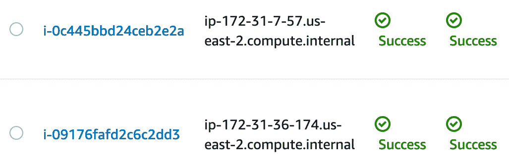

# 第二十一章：使用 Amazon Inspector 检查您的环境

Amazon Inspector 允许您将安全测试作为开发和 **信息技术**（**IT**）运营的常规部分。随着 **开发运营**（**DevOps**）向 **开发安全运营**（**DevSecOps**）的转变，安全责任更多地由开发人员承担，使用像 Amazon Inspector 这样的工具可以帮助您采取更主动的安全态度来保护您和您组织的安全状况。

本章将涵盖以下主要内容：

+   了解 Amazon Inspector

+   手动和自动配置 Inspector 代理

# 了解 Amazon Inspector

**Amazon Inspector** 使您能够分析您的 **Amazon Web Services**（**AWS**）资源的行为，并帮助您识别潜在的安全问题。使用 Amazon Inspector，您可以基于 AWS 安全专家创建的数百条规则，针对您在 AWS 云中托管的所有或任何应用程序进行自动化评估。这些规则会寻找漏洞以及与最佳实践的偏差。执行评估后，Amazon Inspector 会提供一份详细的发现清单，并按严重性级别进行分类。该过程如图所示：


图 21.1 – Amazon Inspector 过程

在撰写本文时，Amazon Inspector 能执行的评估仅限于针对 Amazon **弹性计算云**（**EC2**）实例的评估。

既然我们已经概述了 Amazon Inspector，接下来我们来看看如何开始使用 Amazon Inspector 服务。

## 开始使用 Amazon Inspector

要开始使用 Amazon Inspector，需要执行以下三个初始步骤：

1.  在您希望 Inspector 扫描的 **Amazon EC2** 实例上安装 **AWS Inspector 代理**。

    注意

    为实例打上唯一标签是一个好主意和好做法，这样您可以将这些实例添加到特定的评估目标中进行评估运行。

1.  创建评估目标，这是您希望 Inspector 检查的 AWS 资源的集合。

1.  创建一个评估模板，作为您评估的蓝图。

1.  在您的目标上运行评估。

1.  审查您的发现并修复任何安全问题。

还有一些方法可以将其他 AWS 服务集成进来。您可以配置一个 **简单通知服务**（**SNS**）主题，当发布发现报告时，将通知发送到特定的电子邮件地址或分发组。您还可以设置 **Lambda** 函数，自动启动 Inspector 扫描，无论是定期使用 **CloudWatch** 事件，还是每当发生特定事件时，比如创建新的 **Amazon Machine Image**（**AMI**）。

我们刚刚了解了如何开始使用 Amazon Inspector，甚至对如何将一些其他 AWS 服务与 Inspector 评估结合使用进行了简要概述。接下来让我们看看 Amazon Inspector 的一些真实世界使用案例。

## Amazon Inspector 的使用案例

公司们将 Amazon Inspector 作为独立服务使用，同时也将其集成到 DevOps 流水线中，以确保实例没有漏洞，特别是在生产环境中。

对于那些需要遵守**健康信息可携带性与责任法案**（**HIPAA**）准则或**支付卡行业数据安全标准**（**PCI DSS**）的公司，尤其是在受监管的行业中，扫描漏洞时，Amazon Inspector 的评估报告不仅提供了发现的漏洞列表，还可以通过对比过去的报告，显示修复的时间线。下图展示了 Inspector 如何在**持续集成/持续部署**（**CI/CD**）流水线中使用：


图 21.2 – Inspector 在 CI/CD 流水线中的应用

正如前面的图所示，Amazon Inspector 也可以作为漏洞评估添加到 CI/CD 流水线中，作为创建最终 AMI 之前的最后检查之一。这个最终 AMI 可以作为金镜像使用，或者作为应用程序的版本镜像。如果 Inspector 在这个流水线设置中发现问题，构建将失败，任何问题都需要修复后才能进入最终阶段，创建镜像。

现在我们了解了 Amazon Inspector 在现实世界中的应用，接下来我们看看如何安装 Amazon Inspector 代理，以便我们可以执行自己的评估。

# 手动和自动配置 Inspector 代理

`run` 命令功能可以自动将 Inspector 代理安装到我们希望 Inspector 服务检查漏洞的实例中。第三种方法是将一个简单的脚本集成到用户数据中，这样代理将在实例启动时被安装。这三种方法如以下图所示：


图 21.3 – 安装 Inspector 代理的三种方式

现在我们已经了解了如何安装代理，接下来我们将进行一个练习，通过启动一些实例并使用系统管理器安装代理。

## 实操使用 Amazon Inspector

在接下来的动手实践中，我们将同时启动两个实例，并为它们提供一个标签`Inspector`和一个值`TRUE`。由于我们将使用来自 Systems Manager 的`run`命令选项，因此我们需要一个**身份与访问管理**（**IAM**）角色，该角色允许访问我们的实例。好消息是我们之前在*第十四章*《CloudWatch 和 X-Ray 在 DevOps 中的作用》的练习中创建了这个角色。如果你没有完成这个练习，并且希望进行此操作，那么在开始这个练习之前，你需要回去创建这个角色。

我们将首先在我们的组中创建两个实例，其中一个将使用 Ubuntu 16.04 `chapter 21` GitHub 存储库中的资源。再次安装 SSM 代理的脚本叫做`agents.sh`。

我们刚刚通过使用 Systems Manager `run`命令设置了 Amazon Inspector 代理，并进行了 Inspector 评估。接下来，我们将看到如何获取评估报告中的发现，如下所示：

1.  打开终端，准备开始输入命令。确保在你正在使用的目录中，要么复制了你在*第十四章*《CloudWatch 和 X-Ray 在 DevOps 中的作用》中最初创建的`agents.sh`脚本，要么从`Chapter 21` GitHub 文件夹下载了一个新的副本。我们将首先获取 AMI `IMAGE` 参数：

    ```
    $IMAGE command echo.
    ```

1.  现在，使用当前存储在`IMAGE`参数中的 AMI，我们可以开始创建第一个实例。使用以下命令创建实例：

    ```
    aws ec2 run-instances \
    --image-id $IMAGE \
    --instance-type t2.micro \
    --iam-instance-profile 'Name=CW_SSM' \
    --tag-specifications 'ResourceType=instance,Tags=[{Key=Name,Value=AmazonLinux},{Key=Inspector,Value=TRUE}]' \
    --region us-east-2
    ```

1.  现在，我们将获取 Ubuntu 实例的 AMI ID。这个命令与存储 Amazon Linux AMI 变量的命令很相似，但`names`值不同。运行以下命令，以便我们将 Ubuntu AMI ID 存储在名为`AMI`的变量中，然后创建第二个实例：

    ```
    AMI='aws SSM get-parameters --names \
            /aws/service/canonical/ubuntu/server/16.04/stable /current/amd64/hvm/ebs-gp2/ami-id \
        --query 'Parameters[0].[Value]' --output text --region us-east-2'
    ```

1.  现在，就像我们创建第一个实例一样，我们将创建第二个实例。此命令中的两个值将发生变化——第一个值是`image-id`值，第二个是`name tag`值。你还应该注意到，我们为这些实例添加了第二个`Inspector`标签，值为`TRUE`。使用下面显示的命令来创建第二个 Ubuntu 实例：

    ```
      aws ec2 run-instances \
    --image-id $AMI \
    --instance-type t2.micro \
    --user-data file://agents.sh \
    --iam-instance-profile 'Name=CW_SSM' \
    --tag-specifications 'ResourceType=instance,Tags=[{Key=Name,Value=Ubuntu},{Key=Inspector,Value=TRUE}]' \
    --region us-east-2
    ```

1.  此时，两个实例应该都已启动并运行。我们现在可以切换到浏览器。登录到你创建实例的`Ohio`区域。一旦进入**Systems Manager**服务，在左侧菜单的**节点管理**下，找到名为**Run Command**的子菜单选项并点击它。

1.  现在，在主窗口中使用 AWS Systems Manager 的`run`命令，点击橙色的`run`命令以安装 Inspector 代理。

1.  我们现在应该在`Inspector`页面，并按下*回车键*。这将打开名为`AmazonInspector-ManageAWSAgent`的`run`命令文档。请点击文档名称旁边的**单选按钮**，如下图所示：

    图 21.4 – 安装 Inspector 代理的系统管理器运行文档

1.  一旦我们选择了文档，向下滚动页面，直到看到标题为`Inspector`和`TRUE`，然后点击**添加**按钮，在我们的搜索中指定标签，如下图所示：

    图 21.5 – 指定要通过我们的运行命令目标的实例标签

1.  接下来，向下滚动到`系统管理器`命令。如果你没有现成的 S3 桶，可以简单地取消勾选**启用 S3 桶**框，因为这一步是可选的。

1.  向下滚动页面到底部，点击橙色的**运行**按钮。你将被带到**命令状态**页面，在那里你应该在目标和输出的**状态**部分看到**进行中**。大约一分钟后，你可以刷新**命令状态**页面，并应该看到两个实例的状态都显示为**成功**，如下图所示：

    图 21.6 – Inspector 代理成功安装在我们的实例上

1.  安装好代理后，我们可以转到**Amazon Inspector**服务。在**Amazon 管理控制台**的顶部搜索框中，输入**Inspector**，然后点击出现的服务。当主**Inspector**页面出现时，点击蓝色的**开始使用**按钮。

1.  你现在应该被带到一个页面，页面顶部有标题**欢迎使用 Amazon Inspector**。在**评估设置**下，取消勾选**网络评估**旁边的框，因为我们只想对我们的 EC2 实例进行评估。这将保留**主机评估**旁边的框被选中。页面底部，点击灰色按钮**一次运行**，而*不是*蓝色按钮。

1.  当对话框弹出时，点击蓝色的**确定**按钮。

1.  评估报告可能需要大约一个小时才能准备好。

我们现在已经了解了如何在不同操作系统上设置 Amazon Inspector 代理。接下来，在我们的评估运行后，我们将查看报告，并了解如何消化报告中的发现。

## 理解 Inspector 评估报告的发现

一旦 Amazon Inspector 完成评估，它将返回评估报告。报告中返回的任何发现将包含关于安全问题的详细描述，并附有如何修复该问题的建议。

你可以存储这些报告，并将其与团队成员共享，以便他们对报告中的问题进行修复。

# 总结

本章中，我们学习了 Amazon Inspector 及其如何扫描运行应用程序的实例，以查找漏洞。我们了解了三种安装 Inspector 代理的方式，甚至进行了动手操作，通过 Systems Manager 的 `run` 命令安装了 Inspector 代理。最后，我们讨论了 Amazon Inspector 返回的结果。

在下一章中，我们将介绍一些其他的策略和标准服务，这些服务对于认证考试以及实际应用都非常重要。包括 **AWS GuardDuty** 和 **Macie** 等服务，这些服务也可能出现在考试问题中。了解这些服务将有助于你在当前和未来的职位中取得成功。

# 复习问题

1.  你被引入到一个公司，他们正在努力改善其安全性和合规性状况。安全和合规团队现在要求所有 EC2 实例必须使用批准的 AMI。作为一名 DevOps 工程师，你必须找到一种方法来实现一个流程，识别出任何从未经批准的 AMI 启动的 EC2 实例。哪个解决方案可以满足这些要求？

    a. 使用 Trusted Advisor 检查来识别从未经批准的 AMI 启动的 EC2 实例。

    b. 创建一个 AWS Config 规则，用于识别任何未经批准的 AMI，并向安全和合规的分发列表发送通知。

    c. 使用 Systems Manager Inventory 创建一个自定义报告，列出所有使用未经批准的 AMI 的 EC2 实例。

    d. 让 Amazon Inspector 扫描账户中的所有实例，并将未经批准的 AMI 发现结果与安全和合规团队成员共享。

1.  你和你的团队正在生产环境中运行一个应用程序。该应用程序是使用 Elastic Beanstalk 构建和部署的，但运行在 EC2 实例上。你希望确保该应用程序没有任何漏洞；你应该实施哪个 AWS 服务来帮助实现这一目标？

    a. AWS 可信顾问（Trusted Advisor）

    b. AWS **Web 应用程序防火墙**（**WAF**）

    c. AWS Shield

    d. AWS Inspector

1.  最近，公司进行了一次调查。在调查过程中发现，生产 AWS 账户的所有应用程序编程接口（API）调用都已关闭。还发现创建了一个新的管理员用户账户，并生成了一个访问密钥和一个密钥访问密钥。该密钥对多次用于创建超大 EC2 实例。你如何利用自动化检测和防止此类事件发生？

    a. 使用 Amazon CloudTrail 创建一个新的 CloudTrail，监控禁用任何 CloudTrail 事件以及创建任何 API 密钥的操作，这些密钥属于 Amazon 管理的管理员策略。

    b. 使用 Amazon Inspector 审查所有调用的 API。配置 Inspector 代理，以便在检测到 CloudTrail 的任何更改时使用 SNS 主题。如果触发规则，创建一个 Lambda 函数重新启用 CloudTrail。使用 IAM 权限边界防止启动任何超大型 EC2 实例。

    c. 使用 AWS Config 创建一个配置规则，检测 CloudTrail 是否被禁用。如果触发规则，创建一个 Lambda 函数重新启用 CloudTrail。使用 IAM 权限边界防止启动任何超大型 EC2 实例。

    d. 使用可信顾问 API 定期检查 CloudTrail 是否已被禁用。如果触发规则，创建一个 Lambda 函数重新启用 CloudTrail。使用 IAM 权限边界防止启动任何超大型 EC2 实例。

# 审查答案

1.  b

1.  d

1.  c
