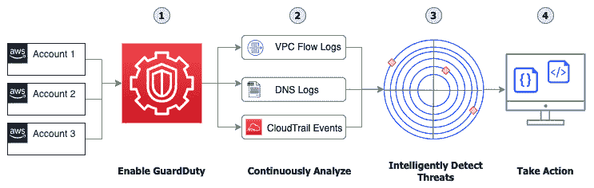
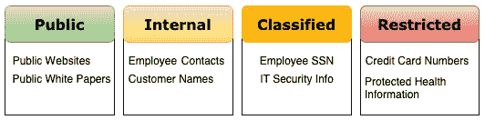
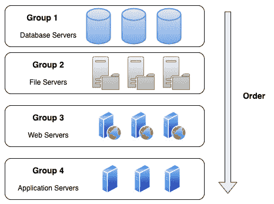

# 第二十二章：其他需要了解的政策与标准服务

还有许多其他服务也被纳入到 DevOps 专业认证考试中，涉及政策和标准的领域。这些服务在 AWS 生态系统中扮演着特定的角色，了解它们的使用案例以及适用场景，有助于为特定组织解决问题。尽管这些服务都很重要，我们将在此简要回顾它们。

本章我们将涵盖以下主要内容：

+   使用 **GuardDuty** 检测威胁  

+   了解如何使用 **Amazon Macie** 保护数据  

+   了解服务器迁移服务

# 使用 Amazon GuardDuty 检测威胁

**Amazon GuardDuty** 为您提供了一种新型的威胁检测服务，专门为云环境而设计。GuardDuty 会持续监控来自一个或多个账户的源数据流，并不断分析这些源中被驱动到 GuardDuty 服务中的网络和账户活动。GuardDuty 服务利用威胁情报、行为模型和机器学习相结合，智能地检测您的环境中的威胁：

图 22.1 – 从启用到采取行动的 GuardDuty 流程

从上述图示中，我们可以看到，在您的账户中启用并运行 GuardDuty 只需要几个简单的步骤：

1.  **启用 GuardDuty 服务** – 激活 GuardDuty 服务后，系统将开始分析您账户中的多种日志类型：VPC 流日志、DNS 日志条目和 CloudTrail 事件。

1.  **持续分析传入的事件** – GuardDuty 服务不断查看来自各种数据源的数据，尝试检测您 AWS 环境中是否存在未经授权或意外的活动。这些数据源包括 AWS CloudTrail 事件日志、CloudTrail 管理事件、CloudTrail S3 数据事件、VPC 流日志和 DNS 日志。

1.  **智能检测账户中的威胁** – GuardDuty 使用多种机器学习算法来处理其收集的数据，然后持续分析这些数据。这些数据将被分类为 EC2 发现、S3 发现和 IAM 发现等不同类型的报告结果。

1.  **对呈现的威胁采取行动** – 一旦找到威胁，GuardDuty 会提供威胁所在位置的详细信息，以便您或团队成员采取措施。威胁可能存在于特定的 EC2 实例、S3 存储桶，或 IAM 用户或组中。

## 关于 GuardDuty 需要理解的关键信息

在准备 DevOps 专业认证考试时，尽管 GuardDuty 服务可能不是考试中的主要服务，但它可能出现在某个问题或答案中。在这些情况下，理解该服务及其功能是有帮助的。

GuardDuty 拥有多个检测类别，包括以下几类：

+   **Reconnaissance** – 显示潜在攻击者或异常的 API 活动或端口扫描，或多次失败的登录请求等活动。

+   **Instance compromise** – 包括加密货币挖矿、恶意软件活动，甚至是外部拒绝服务攻击等异常活动，这些活动都被 GuardDuty 服务归类到此类别。

+   **Account compromise** – 如果您的账户尝试关闭 CloudTrail 日志记录，则属于账户泄露类别。如果有来自全球各地的尝试登录，而这些登录地点不符合账户基线，也会被归为此类别。

+   **S3 桶泄露** – 包括诸如凭证滥用、未经授权的 S3 桶访问（来自没有历史访问该桶的用户或 IP 地址），甚至是来自已知恶意 IP 地址的桶访问；所有这些信息通过 CloudTrail API 调用收集。

GuardDuty 允许您的安全团队和其他系统管理员使用 IAM 访问分析器，帮助他们识别您账户内可以从外部访问的资源。

在 GuardDuty 服务提供的发现操作中，有许多细节可以帮助您和/或您的安全团队解决该情况。以下是一些细节：

+   **CreateThreatIntelSet** – 授予创建 GuardDuty ThreatIntelSets 的权限。

+   **CreateDetectory** – 授予创建 GuardDuty 检测器的权限。

+   **GetFindings** – 允许 GuardDuty 检索发现的内容。

+   **StartMonitoringMembers** – 允许 GuardDuty 管理员监控成员账户。

作为一名 DevOps 专业人员，您也能够提升技能，理解安全集成和您可以轻松使用的安全工具。

接下来，让我们看看 Amazon GuardDuty 的一些使用案例。

## Amazon GuardDuty 的使用案例

现在我们已经了解了 GuardDuty 服务的能力，接下来可以看看一些使用 GuardDuty 合理的潜在用例。

### 您怀疑内部员工或外部用户可能正在公司账户上进行加密货币挖矿。

Amazon GuardDuty 可以通知您，您组织中任何账户上的 EC2 实例是否已联系与比特币网络或其他加密货币相关活动的 IP 地址。同样，GuardDuty 也能检测实例是否尝试通过与加密货币活动相关的 DNS 名称来引导互联网流量。

重要提示

如果您或您的组织正在合法地挖掘加密货币或从事与此活动相关的合法业务，可以通过 GuardDuty 服务抑制这些特定规则，以避免收到不适用于您组织的警报。

### 您的 S3 存储桶中存储了各种数据，或者您正在使用 S3 作为数据湖的存储解决方案。

Amazon GuardDuty 有一类特别的 S3 保护，它会执行这些保护操作，一旦启用，它将监控您账户中的所有存储桶。在监控 S3 使用的访问模式时，您无需采取额外步骤，例如为任何或所有 S3 存储桶启用 S3 日志记录，因为 GuardDuty 通过使用 CloudTrail 监控在 API 层级发生在不同 S3 存储桶上的操作。

了解 Amazon GuardDuty 在现实世界中的应用是回答 DevOps 专业考试中关于该服务问题的关键。接下来，我们将看看 GuardDuty 服务如何与 AWS 上的另一个关键安全服务——Security Hub——相结合。

## Amazon GuardDuty 与 AWS Security Hub 自然集成。

当尝试全面了解您 AWS 环境的安全状态时，**AWS Security Hub** 是一项可以为您提供该视图的服务。Security Hub 会收集您管理的不同账户中的数据，以及这些账户中运行的不同服务。AWS Security Hub 还支持来自合作伙伴的第三方集成，如 Cloud Custodian、Check Point、IBM 的 QRadar、CrowdStrike Falcon 等。合作伙伴集成的完整列表可以在这里找到：[`docs.aws.amazon.com/securityhub/latest/userguide/securityhub-partner-providers.html`](https://docs.aws.amazon.com/securityhub/latest/userguide/securityhub-partner-providers.html)。

一旦启动，Security Hub 会开始获取、组织，甚至优先排序来自其他 AWS 安全服务（如 Amazon GuardDuty、Amazon Inspector 和 Amazon Macie）的发现。使用 Security Hub 还允许账户持有者优先处理针对账户发现的事项，以便首先处理最脆弱的项目。

需要注意的是，在 Security Hub 控制台上，事件的检测和整合只有在您启动 Security Hub 服务后才会发生。启动服务之前发生的任何事件不会被收集，因此这些事件不会生成发现记录。

通过启用 AWS Security Hub 控制台并结合 GuardDuty 服务，GuardDuty 的发现不仅会发送给安全团队，而且任何被授予使用 Security Hub 服务 IAM 权限的人都能看到。这有助于问题的可见性和责任的分配。

现在我们已经了解了 AWS Security Hub 和 Amazon Guard Duty 如何协同工作来帮助保护您的账户，接下来我们将讨论 Amazon Macie 服务如何持续工作以帮助保护您的数据。

# 了解如何使用 Amazon Macie 智能地保护数据

对于那些正在迁移到云端或在过去几年已经建立云端存在的组织来说，数据快速积累。我们在*第十七章*《高级与企业日志记录场景》中讨论了拥有良好的数据卫生系统的重要性，包括标签和元数据。尽管这是最佳解决方案，但并非总是可行。您创建、获取和积累的数据可能会涉及多个敏感度和分类级别。一旦超越公共级别，未经授权访问该数据可能会被视为安全泄露：

图 22.2 – 数据分类级别示例

并非每个组织都会花时间对存储在云中的信息进行分类和归类。这可能导致许多内外部漏洞。从内部角度看，允许内部用户访问他们不应接触的数据，可能使组织面临暴露风险，因为这些用户可能没有接受过适当的网络安全培训，或者无意中将恶意软件带入系统，进而使这些恶意软件能够访问更高分类级别的数据，甚至是因为内部用户有恶意意图。

Amazon Macie 是 AWS 提供的完全托管的数据隐私与安全服务，利用机器学习和模式匹配技术。这有助于 Macie 即使在没有任何标签的情况下，也能发现账户中的敏感数据。然后，它通过向您展示发现的列表来帮助保护这些数据。

还可以使用预定的模式，通过 Amazon EventBridge，使 Macie 将所有发现结果发送到 EventBridge，然后，利用事件驱动架构，EventBridge 中的规则可以触发 Lambda 函数，自动处理这些发现。

Amazon Macie 为您提供关于发现和保护账户中的数据的四个主要功能：

+   您可以提高数据的可见性和评估能力，因为 Macie 会执行以下操作：

    a. 它将评估您账户中的 S3 存储桶清单。

    b. 它将评估您账户中 S3 存储桶的策略。

    完成后，它将提供一个总览，展示存储桶的总数量、对象的总数、对象的存储大小，并概述这些对象和存储桶的策略。启用 Macie 服务后，任何这些策略的变化都会及时通知您。

+   它允许您发现敏感数据。

+   您可以集中管理所有账户中的数据。

+   它具有基于发现结果添加自动化的能力。

一旦设置了 Amazon Macie，它允许你设置**警报**。这些警报会在 Macie 服务发现潜在安全问题时通知你。Macie 服务会发送两种不同级别的警报：基本警报和预测警报。*基本警报*是 Macie 在执行安全检查时生成的警报类型。*预测警报*是基于 Macie 服务为你的账户确定的基线，并根据账户中正常活动的偏差来发送的警报。

当 Amazon Macie 服务发送警报时，它会分配四个安全级别之一。

需要注意的是，Amazon Macie 是一个区域性服务。这意味着你需要为每个希望利用其扫描和保护能力的区域启用 Macie。

开始使用 Amazon Macie 相当简单。你只需进入 AWS 管理控制台，然后导航到 Amazon Macie 服务。

## Amazon Macie 的使用案例

在继续研究 Amazon Macie 服务时，探索使用该服务的企业和公司不同的使用案例将帮助我们更好地理解 Macie 服务带来的价值。

### 评估组织的数据隐私和安全

如果你的组织目前不知道存储数据的分类级别，或者没有现有的数据分类基准，那么使用 Amazon Macie 服务可以查看指定账户中是否存储了任何敏感数据，并允许你采取适当的措施。

### 知道敏感数据何时被放入你的数据存储中

即使你已经在账户中建立了数据存储的基线，允许 Macie 服务持续监控账户中新存储的任何数据，也能在敏感数据被添加时提供警报。如果将 Macie 与安全中心服务结合使用，这尤其有用，因为它可以为创建的任何新警报添加优先级。

在回顾一些可能出现在 AWS DevOps 考试中的其他安全工具后，我们接下来将探讨另一项服务——**服务器迁移服务**（**SMS**）。

# 简要了解 AWS 提供的迁移工具

许多组织仍处于云迁移的初期阶段。然而，当他们查看当前数据中心即将到期的合同时，迫切需要加快退出速度。如今，许多公司运行工作负载的方式不再是裸金属服务器，而是虚拟化的服务器集群，使用 VMware 或 Microsoft Hyper-V 等流行的软件产品。

意识到需要帮助客户快速、轻松地迁移到云端，Amazon 创建了 SMS。

该服务帮助应对将当前工作负载迁移到云端时所面临的许多挑战。

## 将你的服务器通过 SMS 引入 AWS

SMS 帮助简化了将多个服务器迁移到 AWS 云的过程。

使用 SMS 可以帮助你实现以下目标：

+   它帮助简化了云迁移过程。

+   它允许你协调多服务器的迁移。

+   它最大限度地减少了迁移过程中的停机时间。

+   SMS 支持最常用的操作系统，包括 Windows 操作系统以及许多主要的 Linux 发行版。

+   它允许你逐步测试服务器迁移。

虽然最初是为 VMware 场景设计的，但现在 SMS 适用于 VMware vSphere、Microsoft Hyper-V 和 Microsoft Azure 迁移。这些迁移是通过无代理迁移来执行的。

现在我们已经理解了 AWS SMS，接下来我们来看看需要了解的关键特性，包括实践中的要点和考试中的要点。

将工作负载迁移到 AWS 有几种不同的选项。包括需要安装代理的 CloudEndure 产品；还有 Import/Export 服务，其中包括像 Snowball 服务这样的 Snow 家族实例；然而，这些服务更适合用于将大量数据迁移到 AWS 云中。

SMS 的主要使用场景是当你在 VMware、Microsoft Hyper-V 或 Azure 上有多个工作负载，并且无法安装代理或不想安装代理来执行迁移时。

什么时候应该使用 SMS？以下是使用 SMS 的最佳时机：

+   如果你需要迁移到 AWS，但需要执行无代理迁移

+   如果你需要一个符合**HIPAA**资格标准的迁移解决方案

+   如果你需要一个符合**联邦风险与管理计划**（**FedRAMP**）合规性的迁移解决方案

+   如果你需要能够自动启动迁移后的虚拟机

+   如果你希望在迁移过程中有选择使用**Amazon 机器镜像**（**AMIs**）或 CloudFormation 模板作为输出选项

现在我们已经理解了 SMS 的好处，并了解了哪些使用场景最适合它，接下来我们来看看需要记住的关于 SMS 的关键特性。

## SMS 的关键特性

以下是关于 SMS 的一些关键特性：

+   SMS 允许你将 VMware、Microsoft Hyper-V 或 Microsoft Azure 虚拟机自动迁移到 AWS 云。

+   SMS 允许你逐步将虚拟机复制为 AMIs。

+   使用 SMS，你可以将一组服务器作为一个具有多个层和相互依赖的单一应用程序迁移，例如 Web 层、数据库层和应用程序层。

现在我们已经理解了关键特性，让我们看看如何迁移一个由多个层组成的应用程序。这包括数据库层、文件服务器层、Web 层和应用程序层。

## 使用 SMS 迁移多层应用程序

由于 SMS 是无代理的，因此需要下载并安装一个特殊的镜像（对于 VMware 的情况是 **开放虚拟化设备** (**OVA**)），这个镜像被称为连接器。在环境中安装连接器后，你需要创建一个具有正确权限的 vCenter 用户，该用户可以在选定的虚拟机上创建和删除快照。

包含多个应用层的服务器可以作为单个 AMI 进行复制，或者它们可以被细分为更小的子组，创建多个 AMI。如果你确实将一个较大的应用程序细分，那么 SMS 可以创建相应的 CloudFormation 模板，以协调的方式启动这些 AMI：

图 22.3 – 一个 SMS 任务启动顺序的示例

理解 SMS 无法将所有内容迁移到 AWS 是非常重要的。这到底是什么意思呢？这意味着，虽然大部分工作负载可以复制到 AWS 并转换为 AMI，但你仍然需要为这些实例创建底层基础设施。

# 总结

本章中，我们讨论了可能出现在 DevOps 专业考试中的其他相关服务，重点是安全性和策略服务。这包括了解 Amazon GuardDuty 和 Amazon Macie 服务，以及它们如何与 AWS 组织在区域基础上合作，保护你的资产和账户免受寻找漏洞的恶意行为者的攻击。我们还考察了 SMS。了解这个服务很有用，因为随着公司加快从当前数据中心迁移到云的步伐，一旦工作负载进入云，更新这些工作负载的能力就开始依赖像你这样的 DevOps 专业人员。

在下一章中，我们将讨论 DevOps 专业认证考试的结构。我们将讨论可用的考试形式，并讲解考试大纲。我们还将给出一些学习和通过考试的建议。

# 复习问题

1.  你被引入到一家希望开始为其构建实施 CI/CD 的公司。这家公司最近进行了安全态势分析评估，需要确保任何实施的解决方案都是安全的。如果在实施后发现任何漏洞，就需要有一个修复计划，并且必须采取措施解决漏洞。

1.  在 AWS CodePipeline 中设置好管道构建后，你还可以采取哪些进一步的步骤来确保在构建过程中创建的 S3 存储桶没有底层访问权限？

    a. 每 15 天，使用 Trusted Advisor 服务检查并查看 S3 存储桶是否存在格式错误的存储桶策略。如果 S3 存储桶出现在易受攻击访问列表中，则创建一个存储桶访问策略，仅允许 CodePipeline 服务账户访问该存储桶。

    b. 为 S3 桶启用日志记录。为新创建的 S3 桶添加版本控制。在桶上创建一个 CloudWatch 警报，监控桶的访问量。如果桶的访问量超过 AWS CodePipeline 运行的构建作业数量，则触发警报。为对象添加 AWS Key Management Service（KMS）的对象级加密。

    c. 为 S3 桶创建一个桶策略，只允许来自账户本身和运行管道的服务账户的访问。为对象添加 KMS 的对象级加密。

    d. 为 S3 桶启用日志记录。启用 GuardDuty 服务。如果检测到问题，按照 GuardDuty 服务提供的修复步骤进行处理。为对象添加 KMS 的对象级加密。

1.  你所在的公司刚开始允许合作伙伴公司访问发布在一些特定 S3 桶中的订阅数据。访问是通过跨账户访问提供的。由于这是一个新的服务，并且预计将成为公司依赖的新收入来源，如何确保只有通过订阅被授予访问权限的合作伙伴能够获取这些数据？你的解决方案应该易于维护，且工作量最小：

    a. 为所有区域启用 CloudTrail。为桶创建 CloudWatch 警报，警报条件为访问量超过客户数量乘以 30。创建一个桶访问控制列表（ACL），阻止没有当前客户的国家范围。

    b. 为所有区域启用 CloudTrail。启用 GuardDuty。将当前客户添加到访问白名单中。每周审查 GuardDuty 的发现，确保没有未经授权的访问权限。

    c. 为 S3 桶启用日志记录。启用高级 Trusted Advisor 检查。每周审查 Trusted Advisor 的检查结果，确保没有未经授权的访问权限。

    d. 为 S3 桶启用日志记录。启用高级 Trusted Advisor 检查。创建一个桶 ACL，阻止没有当前客户的国家范围。

1.  你刚刚加入一家公司，该公司正在将大量工作负载从当前数据中心迁移到 AWS 云中。他们当前在数据中心的工作负载运行在 VMware vSphere 上。数据中心中的这些工作负载包括 Windows Server、Red Hat Linux 和 Ubuntu Server，需要迁移到 AWS。公司有 400 至 500 台服务器，并且有严格的截止日期，因此不希望在每个虚拟机上安装代理。公司还希望在迁移过程中能够逐步进行测试。哪种工具可以帮助你实现公司的所有目标？

    a. 登录到 AWS 管理控制台并订购一个 Snowball，以便可以将工作负载安全地下载到 Snowball 硬件上。Snowball 运回 AWS 后，下载数据并从下载的数据创建 AMI。

    b. 使用 AWS CloudEndure 来发现需要迁移到 AWS 云的实例。创建迁移任务以开始将实例复制到指定的 AWS 区域。

    c. 登录 AWS 管理控制台并使用 SMS 启动任务。在本地服务器上创建目录。创建并配置你的迁移任务。跟踪并测试你的迁移。

    d. 确保你已经在计划进行迁移的机器上安装了 AWS CLI。使用 VM 导入/导出服务将虚拟机推送到 Amazon S3 服务。根据上传的镜像创建 AMI。

# 审核答案

1.  d

1.  b

1.  c
