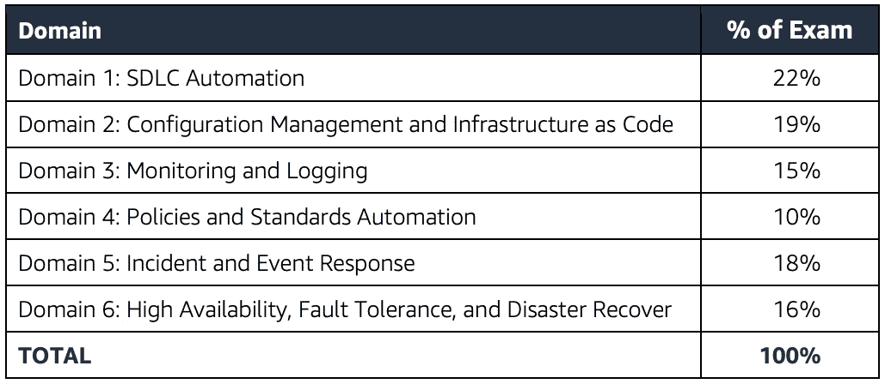
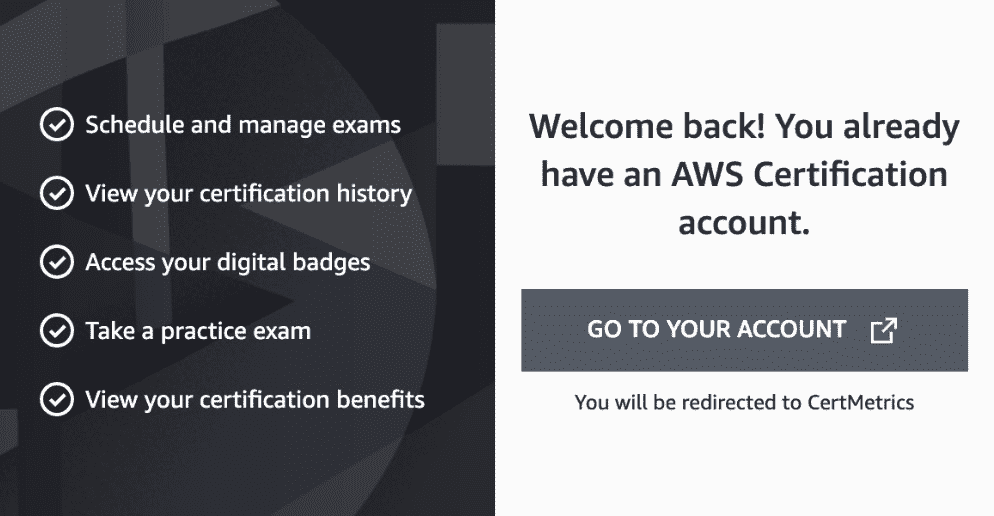
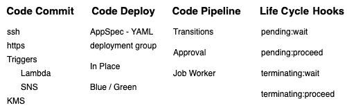

# 第二十四章：DevOps 专业认证考试概述

希望到你阅读到本章时，你已经对我们到目前为止覆盖的大量内容有了扎实的理解，这些内容都可能出现在**DevOps 专业认证考试**中。一旦你准备好参加考试，你必须注册考试并会收到指定的考试时间。

本章将涵盖以下主要主题：

+   DOP-CO1 考试指南

+   考试的评分标准

+   理解不同的测试选项

+   考试准备的学习技巧

# DOP-C01 考试指南

每个当前提供的 AWS 认证都会发布考试指南。这是通过考试的成功蓝图。它解释了考生在参加考试前应具备的期望经验和要求。它还列出了考试中将涵盖的主题（或领域）。如果你想查看当前的考试指南，可以通过以下网址访问：[`d1.awsstatic.com/training-and-certification/docs-devops-pro/AWS-Certified-DevOps-Engineer-Professional_Exam-Guide.pdf`](https://d1.awsstatic.com/training-and-certification/docs-devops-pro/AWS-Certified-DevOps-Engineer-Professional_Exam-Guide.pdf)。

## 根据考试指南的考试要求

在参加 DevOps 专业认证考试之前，建议你有 2 年或更多使用 AWS 平台的经验，能够配置、操作和管理 AWS 环境。你还应具备自动化基础设施和使用基础设施即代码（最好使用 CloudFormation 模板）构建系统的经验。你需要精通管理现代操作系统，如 Windows 和 Linux。最后，建议你对现代开发与运维流程以及构成这些流程的方法论有扎实的理解。

AWS 还会说明哪些内容不在考试范围内。这一点很有帮助，因为认证团队会告诉你哪些内容不需要在学习中集中精力。以下主题不在考试范围内：

+   高级网络（高级路由算法、故障转移技术）

+   面向开发者的深度安全建议

+   数据库查询与性能优化

+   全栈应用程序代码开发

+   数据模式的规范化

现在我们已经了解了 AWS 对我们的期望，作为候选人，关于要求方面，让我们来看看考试是如何评分的。

# 考试评分标准

AWS 认证考试分为多个领域。虽然这些领域有不同的评分标准，但掌握所有领域非常重要，因为错过一两个问题可能意味着通过与失败之间的差距。考试中有两种类型的问题：

+   **多项选择题**：这些问题有一个正确答案。

+   **多选题**：这些问题有两个或更多正确答案。

对于多选题，不能给予部分分数。你必须选择所有正确的答案才能获得该题的分数。另外，未回答的问题将视为错误答案。这意味着你最好选择一个答案，而不是留下空白。

](img/Figure_23.1_B17405.jpg)

图 23.1 – DevOps 专业认证考试的六个领域

考试本身持续 180 分钟或 3 小时，共有 80 道题目。这意味着你每道题目大约有 2 分钟的时间来阅读、理解并作答。接下来我们将更详细地探讨六个领域：

+   **领域 1：SDLC 自动化 – 22%**：本部分的考试内容集中在 CI/CD 流水线、源代码管理、测试和工件存储/管理上。这些问题可以测试你如何设置和配置代码库，以及如何自动化多阶段的部署流水线。你还需要了解如何在代码库中处理更改或新提交，并将安全实践与 **代码版本控制系统**（**CVS**）结合。

    在领域 1 中，你还需要接受测试，评估你在代码流程中添加和运行集成测试的能力。这包括根据测试结果决定流程是通过还是失败。一旦你的代码通过测试，你需要能够以安全的方式创建并存储工件。你还需要具备根据需求选择正确的交付策略的能力，例如根据业务需求选择蓝绿部署、金丝雀部署或 A/B 测试策略。

+   **领域 2：配置管理与基础设施即代码 – 19%**：在领域 2 中，你将被测试评估根据部署的需求和要求来确定不同服务的部署能力。你还需要了解如何使用生命周期钩子来优化实例的启动和关闭。此外，本领域还包括识别不同配置管理工具的优缺点，并展示如何自动化运行配置管理的能力。

+   `flumd`，或其他工具。你还需要了解如何管理日志存储，例如将日志从 CloudWatch 迁移到 S3，使用 S3 生命周期淘汰旧日志，甚至通过 S3 事件触发事件驱动的操作。本领域还包括创建自定义 CloudWatch 指标和日志订阅过滤器的过程。

+   **领域 4：政策和标准自动化 – 10%**：通过自动化手动流程来实现成本优化是领域 4 的主要主题之一。领域 4 的另一个主要主题是实施治理策略的能力。这包括使用自助服务产品（如服务目录）来执行合规性，并对组织的合规性进行报告的能力。

+   `Route53` 服务用于在区域故障时将流量引导到另一个区域。

+   **领域 6：高可用性、容错性和灾难恢复 – 16%**：这个最后的领域将评估你是否需要将服务部署到多个区域或多个可用区。你还需要评估组织 RTO（恢复时间目标）和 RPO（恢复点目标）要求所需的正确服务。你还需要能够评估一个部署中的潜在故障点。

    注意

    考试中有 10 个问题不影响你的分数，你不会知道这些问题是哪些。这些问题用于收集性能指标，以便在未来的考试中使用。

## 获取通过分数

DevOps 专业认证考试是一个通过或不通过的考试。一旦你按下最终提交按钮，考试将会被评分，并且你会被通知是否通过或未通过。考试的评分标准为 1,000 分，你需要至少 750 分才能通过考试。具体分数是这样计算的：在 70 道有效问题中（记住，10 个问题不计入分数），你需要正确回答 53 个问题才能通过考试。这个评分系统并不是全部，因为有些领域比其他领域更重要。换句话说，你在整场考试中最多只能错 17 道题。

AWS 稍后会通过电子邮件向你发送一份详细报告，说明你在六个领域中的得分情况。这个报告也会在你的**Certmetrics**账户中的“历史考试”部分查看。

现在我们已经了解了通过考试所需的条件，接下来简要讨论一下如果你第一次尝试没有通过，应该怎么办。

## 如果你第一次考试没有通过

如果在提交考试后看到令人沮丧的“不通过”字样，不要担心，一切并未失去。每次考试之间有强制性的 14 天等待期，并且你需要支付相应费用才能重新参加考试。现在，考生参加考试的次数没有限制。

其中一个关键步骤是把一张纸放在身边，无论你是在考试地点参加现场考试，还是选择在线监考方式后，都要在考试结束后找到一张纸。写下你觉得自己准备不足的主题。这是一个立即记录自己在考试中感觉没有准备充分的主题的机会，趁记忆还新鲜。如果不采取这一立即行动，等你回过头来回想那些需要集中精力的领域时，可能会后悔没有及时记录下来。

在重新学习材料后，承诺在短时间内再次参加测试。这一点非常关键。虽然不必直接在强制性 14 天等待期后立即参加，但最好不要超过 60 天。你已经花时间和精力准备初次考试，现在你对实际的考试题目有了更清晰的了解。此时，你会收到来自 AWS 的成绩单，显示你在六个领域的得分，并指出你在测试过程中的优缺点。不要犯错，忽视那些你得分高于其他人的话题。认证考试包含大量题库，连续出现相同问题的情况较为罕见。

# 理解不同的测试选项

AWS 已经开始提供多种选择来参加考试。你不仅可以选择在考试中心进行考试，还可以选择在家里舒适的环境中，通过在线监考考试，无需外出。让我们来看一下这两种选择，因为每种方式都有其优缺点。

## 注册参加考试

当你觉得自己对考试中将呈现的材料有了扎实的理解时，是时候注册考试时间了。要注册，你需要访问[`aws.training`](https://aws.training)网站，如果你已有账户，请登录，或者创建一个新账户。

图 23.2 – aws.training 欢迎界面，用于安排你的认证考试

一个好的做法是在你觉得自己准备好考试时，大约提前两周安排考试。使用这种方法可以让你清除周围的所有最终干扰，因为你知道自己有一个必须遵守的硬性截止日期。如果你一直等到完全有信心时再安排考试，可能会导致在安排时的犹豫。

注意

如果你是非英语母语者，你可以获得额外的 30 分钟考试时间。然而，在安排考试之前，你必须通过 AWS 培训网站上的 certmetrics.com 部分申请此特别安排。点击**即将举行的考试**顶部菜单项后，你可以在此处**申请考试特别安排**。

图 23.3 – 下拉菜单显示为英语非母语者添加 30 分钟考试时间的选项

如果你无法按预定日期参加考试，你可以提前最多 24 小时取消，且不受任何处罚。如果你没有在此提前窗口内取消考试而错过了考试日期，则需要 forfeiture 考试费用，但不会算作考试失败。

现在我们已经了解了考试的基本流程，让我们来看看在测试中心和使用在线监考在远程地点考试之间的一些区别。

## 在测试中心参加考试

测试中心允许考生在现场参加认证考试，这些中心由 PSI 或 Pearson VUE 运营。你可以在附近搜索本地测试中心，并查看可用的考试时段。有时，你需要提前一周或更长时间预约，因此，随着你准备好参加考试，开始查看你所在地区的可用时段，并了解需要提前多久预约考试。

在安排考试的日期和时间后，你需要在预定时间前几分钟到达测试中心，以便进行签到并入座。最好准备一份 AWS 发送的邮件打印件，邮件中会指定你的考试确认号码，或者将该邮件保存在你的智能手机中，以防万一在系统中找不到你的名字和考试信息。签到时，你需要提供两种身份证明，其中一种必须是政府颁发的身份证件，另一种可以是学校 ID 卡或信用卡等。

在进入考试区之前，你将被要求清空口袋，脱掉多余的外套、手机、帽子、太阳镜、钢笔或其他不允许带入测试室的物品。测试中心会为你提供一个储物柜和锁具，你可以将物品存放在里面，考试期间使用。考试中心还会提供铅笔和 2-3 张空白草稿纸。考试结束后，你需要将所有草稿纸归还。

## 通过在线监考方式参加考试

如果附近没有可供考试的 Pearson VUE 或 PSI 中心，或者你觉得在自己熟悉的环境中考试会更舒服，你可以选择通过在线监考方式使用你的电脑参加考试。

如果你选择这种方式，你需要在你的计算机上安装 OnVUE 软件，以便远程监考人员在你参加考试时能够监控你的系统。最好在考试开始前几天（至少几小时）进行安装，以确保你计划使用的计算机符合所有要求，并且 OnVUE 软件可以进行系统测试。

你将参加考试的空间不仅需要整洁，还需要干净。这意味着你必须移除考试区域内的所有笔记、纸张和其他物品。考试区域内也不允许有食物或吸烟，但 Pearson VUE 网站表示允许携带任何容器的饮料。如果你的桌面上有多显示器设置，那么在考试期间这些额外的显示器必须拔掉。同样，任何在考试区域内的额外计算机或智能设备也需要移除。

在你预定考试时间的前 30 分钟，你需要使用提供的链接拍摄你考试区域的照片，以验证该区域是一个干净的环境。你还需要发送一张政府颁发的身份证照片，以确保摄像头中的人就是你本人在参加考试。

一旦开始考试流程，你不能使用手机。这样做会导致你的考试被取消。此外，离开摄像头视野也会被视为违规。考试开始时，监考员会注意听你周围环境中的噪音变化。这包括大声朗读问题或低声嘟囔，试图更好地理解问题。如果他们发现你发出噪音，你将收到警告；多次警告可能导致你的考试被取消。

这些最后几点是在线考试和在考试中心考试之间的两个主要区别之一。另一个主要区别是，在在线考试中心，你会获得 2-3 张纸和一支铅笔，在考试过程中做笔记。这与必须使用鼠标或触控板操作的虚拟白板形成了鲜明对比。

还有一个通常不会被提到的选择，那就是在 AWS re:Invent 大会上参加认证考试。

## 在 re:Invent 上参加认证考试——一则警示故事

如果你有机会参加 re:Invent 大会，我建议你至少去一次，体验一下。当你到达现场时，会有比早期更强烈的动机，促使你认证并进入认证休息区。在这种环境下参加认证考试与其他任何地方都不同。会议室里摆满了电脑屏幕，旁边挤满了人，大家安静地盯着自己正在做的测试。当你专注于考试时，不禁会看到其他人一遍遍地站起来坐下。这会分散注意力，有时你会不禁想，他们是否在做和你一样的考试，如果是，他们怎么能这么快完成。

当你报名参加 re:Invent 大会的考试时，可能不会想到的是，现场有许多课外活动，尤其是在晚上，很多时候伴随着一两杯酒。这可能会让你分心，无法静下心来进行最后的复习准备。如果你把考试安排在早晨，这种情况可能会导致你感到没有足够的精力。

鉴于我们已经讨论了参加实际认证考试的不同选项，现在让我们集中讨论一些考试的学习技巧，以优化你的成功机会。

# 准备考试的学习技巧

虽然我们在本书中覆盖了大量的内容，但通过认证考试需要学习和自律。经过多次参加并通过或未通过 AWS 考试后，积累的一些小贴士可以传递给你，帮助你尽可能提高成功的机会。

关于考试需要注意的第一点是，它不仅是对 AWS 服务和知识的考察，更是对阅读和理解能力的考验。匆忙浏览问题和答案可能会错过关键信息，从而导致错失问题。尽管你每道题目只有大约两分半钟的时间来阅读、理解和回答，但每道题都必须仔细阅读，以确保抓住正确的细节和要素。我发现，练习阅读这种大篇幅的问题格式是成功的关键之一。专注于这种长格式考试尤其有帮助，特别是当你抬头看到计时器时，发现剩下的时间已经不多，而你还有几道题需要回答。

## AWS 白皮书阅读推荐

许多考试中的问题都是基于 AWS 多年来编写的白皮书。我强烈建议阅读这些白皮书，以更好地理解本书中介绍的主题。部分内容应有助于加深对本章及其动手练习所用内容的理解。其他内容则会深入探讨考试中涉及的一些话题。还有一些问题将直接源自白皮书的背景：

+   **基础设施即代码**: https://d1.awsstatic.com/whitepapers/DevOps/infrastructure-as-code.pdf

+   **AWS 上的 DevOps 入门**: https://docs.aws.amazon.com/whitepapers/latest/introduction-devops-aws/introduction-devops-aws.pdf

+   **在 AWS 上构建日志分析解决方案**: [`d1.awsstatic.com/Projects/P4113850/aws-projects_build-log-analytics-solution-on-aws.pdf`](https://d1.awsstatic.com/Projects/P4113850/aws-projects_build-log-analytics-solution-on-aws.pdf)

+   **AWS 上的蓝绿部署**: [`docs.aws.amazon.com/whitepapers/latest/blue-green-deployments/blue-green-deployments.pdf`](https://docs.aws.amazon.com/whitepapers/latest/blue-green-deployments/blue-green-deployments.pdf)

+   **使用 AWS Lambda 的无服务器架构**: [`docs.aws.amazon.com/whitepapers/latest/serverless-architectures-lambda/serverless-architectures-lambda.pdf`](https://docs.aws.amazon.com/whitepapers/latest/serverless-architectures-lambda/serverless-architectures-lambda.pdf)

+   **在 AWS 上运行容器化微服务**: [`d1.awsstatic.com/whitepapers/DevOps/running-containerized-microservices-on-aws.pdf`](https://d1.awsstatic.com/whitepapers/DevOps/running-containerized-microservices-on-aws.pdf)

+   **在 AWS 上实践持续集成和持续交付**: https://d1.awsstatic.com/whitepapers/DevOps/practicing-continuous-integration-continuous-delivery-on-AWS.pdf

+   **AWS 大规模治理**: https://d1.awsstatic.com/whitepapers/Security/AWS_Governance_at_Scale.pdf

+   **基础设施事件准备**: https://d1.awsstatic.com/whitepapers/aws-infrastructure-event-readiness.pdf

+   **操作卓越支柱（AWS Well Architected Framework）**: [`docs.aws.amazon.com/wellarchitected/latest/operational-excellence-pillar/wellarchitected-operational-excellence-pillar.pdf`](https://docs.aws.amazon.com/wellarchitected/latest/operational-excellence-pillar/wellarchitected-operational-excellence-pillar.pdf)

虽然这看起来是大量额外的阅读内容，但需要再次强调的是，许多问题来源于白皮书。获得必要的知识并理解其背景，将帮助你在阅读考试中提出的复杂问题时更加得心应手。

## 最后的考试提示

这次考试本身很长，持续时间为 3 小时。特别是如果你在早上参加考试，我建议你不要喝太多咖啡。记住，如果你正在进行在线监考，你不能离开摄像头的视野。在开始考试之前，最好先去一趟厕所，这样你就可以全神贯注地参加考试。

不要在标记大量问题以待复查时过于怀疑自己。大多数情况下，你的初始选择将是最好的选择。我过去在参加认证考试时曾有过几次犹豫不决的经历，我标记了 5-7 个问题以待复查，并在至少四个问题上改变了最初的答案，结果考试成绩公布时，居然因为错了 1-2 个问题而没能通过。那些我在考试结束时更改的答案，是否错了呢？我不能明确回答，因为 AWS 不会提供这些类型的反馈，但我已经改变了自己使用复查按钮的方式。如果我对问题和/或答案感到难以理解，我会选择一个答案然后继续答下一个问题。

尽管在参加专业级别考试之前，已经取消了低级别助理测试的前提要求，但我并不建议你直接跳到专业级别的考试。参加 AWS SysOps 助理或开发者助理认证考试，曾经是参加 DevOps 专业考试的必要前提，可以帮助你为专业级考试做好充分的热身。即使是在我的再认证过程中，我通常会先参加低级别测试，以便在较为简单的格式下判断考试中新增加的服务和问题，然后在几周后再进行专业级别的再认证。

图 23.4 – 脑力回忆格式示例

我建议去考试中心参加考试。这样做的主要原因之一是你会获得实际的纸质考试证书。在考试前一天晚上，拿一张空白纸，练习写下有关主要主题的快速笔记，这些笔记可以帮助你回忆起一些要点，正如前面的图示所示。我通常会在考试前的晚上练习这个过程 3-5 次，这样当我坐在考试中心的计算机前，输入用户名和考试 ID 时，我可以在不到 5 分钟的时间内完成这一过程，然后按下开始按钮。我曾在我运营了 6 年的 AWS 技术交流小组里教授过这种技巧，很多成员曾互相挑战，在多个 AWS 认证的不同级别上取得成就。你不能将任何类型的备忘单带入考试中心。你只是在考前将信息快速从脑中记下来，写在提供的草稿纸上，考试结束后再将草稿纸交还给考试中心。你可以在考试过程中参考这些快速笔记；然而，由于它们是你自己制作的，这可以让你在专心阅读和理解题目时放松并深呼吸。

# 总结

成为一名认证的（甚至是重新认证的）AWS 专业人员是一项需要奉献、学习以及成功通过严格测试格式的任务。相信你的努力和学习一定会得到回报。AWS DevOps 专业认证是一项荣誉，它在大学和雇主中都得到了认可。

在下一章中，我们将为你提供一个模拟考试，既可以测试你的知识，也可以继续熟悉专业考试中的问答格式。
