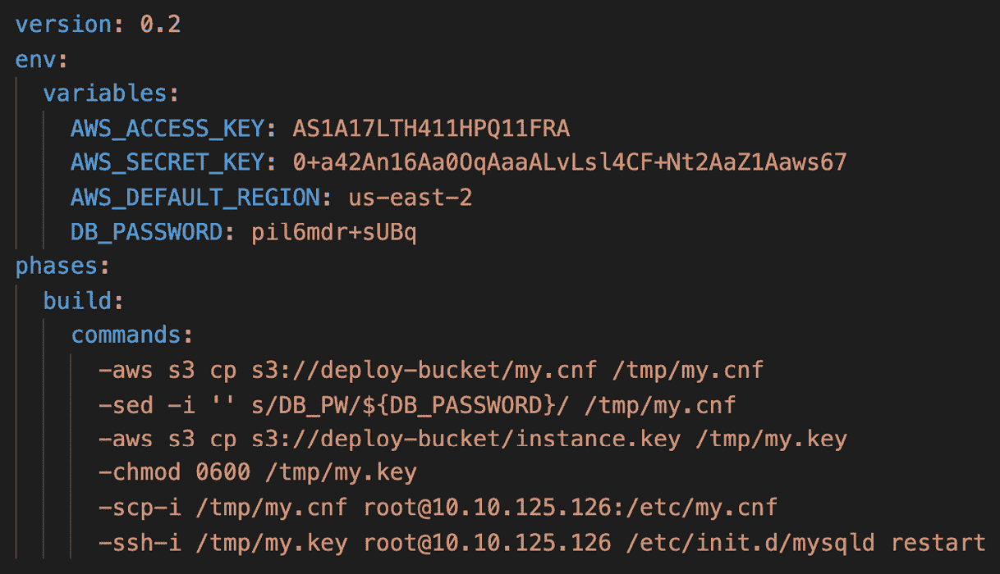

# 第二十四章：模拟考试 1

本节将提供类似测试的问题样例，帮助你熟悉如何在限定时间内阅读和回答问题。

在本章中，我们将讨论以下主要主题：

+   软件开发生命周期（SDLC）自动化

+   配置管理和基础设施即代码

+   监控与日志记录

+   政策和标准自动化

+   事件和事故响应

+   高可用性、容错性和灾难恢复

在开始回答以下问题之前，建议你使用某种计时器来跟踪每个问题的回答时间。所有问题都不是实际的 AWS 测试题目。然而，它们的格式是根据测试的形式制作的。这包括长场景类型的问题，以及非常相似的多项选择答案。细小的细节可能决定正确答案和错误答案之间的差异。

这些问题和答案都很长。许多答案中也包含相同的组件，这使得与一些关联测试不同，在这些测试中，你可以通过排除一些你知道错误的答案，然后从剩下的一两个答案中选择正确答案。

# 测试问题

1.  你已经开发了一组 CloudFormation 模板，可以供你当前的公司用来部署其处理文件的中间件解决方案。这个应用部署在多个 EC2 按需实例上，并且在 CloudFormation 中有一个用户数据组件，负责从 S3 存储桶中下载多个脚本，包括一个初始化的 shell 脚本，用于帮助配置这些实例。存储脚本的 S3 存储桶已启用版本控制。公司中唯一已知的脚本副本位于该 S3 存储桶中。一名新实习生在尝试上传另一个静态资源到存储桶时，不小心删除了脚本。那么，恢复脚本并重新部署服务器的最快方式是什么？

    a. 你需要重新创建脚本并使用相同的名称将其上传到 S3 存储桶。启用了文件版本控制后，你只能看到文件之间的差异，而无法恢复已删除的文件。

    b. 你需要修改 CloudFormation 脚本，使其使用之前的脚本版本 ID，该版本已在 S3 存储桶中被删除。

    c. 你需要进入 AWS 管理控制台，导航到存放部署脚本的 S3 存储桶，然后选择“列出版本”选项。你可以找到被删除的脚本并移除删除标记。

    d. 你需要进入 AWS 管理控制台，导航到存储部署脚本的 S3 桶，然后选择“列出版本”选项。然后，你可以下载之前被删除的脚本的版本。在脚本下载后，你可以将其重新上传到桶中，并将其重命名为原始脚本名称，以便 EC2 实例可以从 CloudFormation 模板中找到它。

1.  你是一个团队的一员，团队最近开发了一个 Spring Boot 应用程序，并准备将其部署到 AWS 云上。由于应用程序的流量波动较大，你已将应用程序配置为在 Auto Scaling 组中启动。确保应用程序正常运行非常重要，因此你创建了一个 Bash 脚本，脚本将在每个 EC2 实例上运行并定期检查应用程序的健康状况。如果实例不健康，则应标记该实例并用新的健康实例替换它。构建该 Bash 脚本以执行此任务的最佳方式是什么？

    a. 构建脚本以在健康检查失败时重启实例。以 root 用户身份运行脚本。Auto Scaling 组检测到重启后，将终止该实例并创建一个新的实例替代它。

    b. 构建脚本以使用 AWS CLI。让实例使用`autoscaling set-instance-health`命令，告知 Auto Scaling 组该实例不健康。然后，Auto Scaling 组将终止该实例并创建一个新的实例替代它。

    c. 构建脚本以使用 AWS CLI。让实例使用`autoscaling put-notification-configuration`命令通知 Auto Scaling 组该实例不健康。然后，Auto Scaling 组将终止该实例并创建一个新的实例替代它。

    d. 构建脚本以使用 AWS CLI。让实例使用`autoscaling enter-standby`命令，告知 Auto Scaling 组该实例不健康。然后，Auto Scaling 组将终止该实例并创建一个新的实例替代它。

1.  你被引入了一家公司，该公司最近为其在 AWS 上运行的基础设施资源建立了配置和标签标准。你被要求设计并构建一个近实时的仪表板，展示合规性状况，并强调任何违规情况。

    a. 在 Amazon Inspector 中定义标签和资源要求。创建一个简单通知服务（SNS）主题，以便在发现异常时收到通知。让 Inspector 定期检查合规性要求，并在发现问题时将通知发送到 SNS 主题。使用 AWS Security Hub 快速可视化违规情况。

    b. 创建一个自定义的 CloudWatch 指标来跟踪所有资源和标签标准。使用 CloudWatch 服务创建一个仪表板，以可视化跟踪任何不符合标签标准的资源。

    c. 启用 AWS Config 服务，并使用配置记录器记录所有创建和删除的资源。将配置更改发送到 S3 存储桶。利用 Amazon QuickSight 将 S3 存储桶中的数据转换为可视化信息和仪表板进行分析，从而能够轻松发现不合规的资源。

    D. 在 AWS Service Catalog 中定义多个资源配置。使用 Amazon CloudWatch 监控 Service Catalog 中的任何合规性违规。利用 CloudWatch 服务创建一个仪表板，以可视化方式跟踪不符合标签标准的资源。

1.  你加入了一个应用程序团队，该团队正在将他们的 MySQL 数据库从本地迁移到 AWS 云。这个应用程序非常关键，因此它需要比单一的本地服务器更高的稳定性。该应用程序是读密集型的，具有 10:1 的读写比。成本是主要目标，但他们确实需要关注项目预算。目前团队中的成员都不具备 DBA 技能，大家都希望能更多地专注于应用程序开发。你会建议什么样的配置，以确保数据库在当前区域的可用区发生故障时能够继续运行？

    a. 创建一个 MySQL RDS 实例。在设置实例时，选择 Multi-AZ 功能。数据导入完成后，创建一个只读副本，并编程让应用程序使用该只读副本进行大量读取操作。

    b. 创建一个 MySQL RDS 实例。数据导入完成后，在另一个区域创建一个只读副本，并编程让应用程序使用该只读副本进行大量读取操作。

    c. 创建一个 CloudFormation 模板，启动一个自动扩展组，并在启动模板中配置 MySQL 服务器，分别在不同区域的两个 EC2 实例上运行。配置使 MySQL 服务以主主（Master-Master）模式运行，以便在发生故障时，任何一台服务器都可以作为目标。

    d. 创建一个 CloudFormation 模板，启动一个自动扩展组，并在启动模板中配置 MySQL 服务器，分别在不同区域的两个 EC2 实例上运行。模板中还将创建一个第三个较小的 EC2 实例作为 MySQL 代理，这样应用程序服务器可以指向该代理。代理会自动在当前主服务器和从服务器之间切换。

1.  你之前在 AWS CodePipeline 中为你的团队的应用程序构建了一个 CI/CD 管道。当前管道包括代码签出、构建、测试、部署到开发环境以及部署到测试环境的自动化阶段。现在，你正在更新 CodePipeline，新增一个部署到生产环境的阶段，并在代码发布到生产环境之前，添加产品负责人的手动审批。在新阶段的初次测试中，产品负责人通知你，在使用他们的 IAM 用户登录 AWS 管理控制台并进入 CodePipeline 管道后，他们发现自己没有权限批准构建。你该如何解决这个问题？

    a. 为部署到生产环境阶段创建一个新的 SNS 主题。将产品负责人添加到该主题。当 SNS 消息发送时，让产品负责人点击消息中的审批链接。

    b. 从 AWS 管理控制台，进入指定的 CodePipeline，并将产品负责人的 IAM 用户添加为该管道的审批人。

    c. 从 AWS 管理控制台，进入 IAM 服务。创建一个新组，命名为 `CodePipeline Approvers`。将 `AWSCodePipelineFullAccess` 托管 IAM 策略附加到该组。将产品负责人添加到该组。

    d. 从 AWS 管理控制台，进入 IAM 服务。创建一个新组，命名为 `CodePipeline Approvers`。将 `AWSCodePipelineApproverAccess` 托管 IAM 策略附加到该组。将产品负责人添加到该组。

1.  一个组织已经将其开发人员的代码版本控制系统迁移到 AWS CodeCommit。开发团队在测试时创建并处理功能分支，准备好合并到主分支时创建拉取请求。该组织已设定规定，任何人不得直接提交到主分支。任何开发人员都会是 IAM 组 "developers" 的成员。这个组最近被修改，添加了 `AWSCodeCommitPowerUser` 托管策略，现在该组的所有成员都能提交到组织 AWS CodeCommit 中任何仓库的主分支。为了防止这种情况并执行组织的规定，应该采取哪些措施？

    a. 创建一个附加的 IAM 策略，允许执行 `codecommit:GitPush` 操作。为策略添加一个条件，指定资源声明中的 CodeCommit 仓库。

    b. 创建一个附加的 IAM 策略，拒绝执行 `codecommit:GitPush` 操作。为策略添加一个条件，指定资源声明中的 CodeCommit 仓库。

    c. 修改 IAM 策略，移除 `codecommit:GitPush` 操作。

    d. 修改 IAM 策略，添加一条拒绝规则，针对 `codecommit:GitPush` 指定不允许推送的特定仓库。

1.  你已经配置了 AWS CodeDeploy 来自动化部署到位于你 AWS 账户中的开发和测试环境中的 EC2 实例，以及一些仍在本地的 RHEL 服务器。已经配置了一个部署组，定义了所有包含在部署中的特定实例。有一个公告指出，部署组中的一个本地实例将进行硬件更新，预计将花费 2 周时间完成。在此期间，不应向这些实例推送新的部署。哪种方法最适合实施这个针对特定本地服务器的 2 周冻结期？

    a. 创建一个新的部署组，标签仅供该用户使用。

    b. 验证两个部署组使用的标签。使用 AWS CLI 删除将与 `aws deploy` `remove-tags-from-on-premises-instances` 命令一起服务的特定实例。

    c. 使用 AWS CLI 通过 `deploy deregister` 命令取消注册本地实例的 CodeDeploy 部署。

    d. 使用 AWS CLI 卸载本地实例上的 CodeDeploy 代理，使用 `deploy uninstall` 命令。

1.  你团队中的一位 DevOps 工程师提交了以下 `buildspec.yaml` 文件进行安全审查。安全审查未通过。你被指派帮助这位初级工程师审查该文件：

    图 24.1 – 安全审查文件

    

    ](img/Figure_24.1_B17405.jpg)

    你会建议初级 DevOps 工程师做哪些更改，以便使 `buildspec` 文件符合安全最佳实践（选择三个）？

    a. 为 CodeBuild 角色添加权限，以便在构建过程中执行必要的操作。移除文件中的访问密钥和秘密密钥。

    b. 使用 KMS 加密环境变量，以便它们不会以明文形式出现在文件中。

    c. 将所有环境变量写入文件。将文件存储在 S3 中，并在执行时将文件拉取下来，以便变量不会以明文形式出现在文件中。

    d. 使用 AWS Secrets Manager 存储 `DB_PASSWORD` 值。存储后从环境变量中删除 DB 值，然后在需要时检索。

    e. 在系统管理器中创建一个运行命令来执行这些命令。使用系统管理器代替直接从实例使用 SSH 和 SCP。

1.  你被招募到一家公司，该公司正在扩展其在 AWS 云上的业务。他们希望通过 CloudFormation 构建他们的足迹。然而，他们希望在各种应用程序中使用通用组件和模式。许多基础组件，如基础设施和网络，在生成后不会经常修改。公司希望独立管理所有通用组件项，并允许其他应用堆栈在需要时重用这些组件。你如何实现这一目标？

    a. 创建一个 CloudFormation 堆栈来容纳所有公共资源。其他 CloudFormation 堆栈可以通过 AWS 管理控制台导入这些资源来使用它们。

    b. 创建一个 CloudFormation 堆栈来生成所有公共资源。导出输出值，以便其他 CloudFormation 堆栈可以使用`GetAttribute`函数导入这些值。

    c. 构建一个 CloudFormation 堆栈来生成所有公共资源。导出输出值，以便其他 CloudFormation 堆栈可以使用`ImportValue`函数导入这些值。

    d. 创建一个 CloudFormation 堆栈来生成所有公共资源。任何应用堆栈都可以作为此堆栈的嵌套堆栈来使用所有公共资源。

1.  一家公司刚刚推出了一个新的预订服务，提供网站和移动应用。部分得益于市场团队的努力，该服务在客户中取得了巨大成功，吸引了越来越多的用户。首席技术官（CTO）已经实施了一项新的指令，在接下来的季度内尽可能提高应用程序效率，并对性能进行必要的调整。为了实现这一目标，开发团队需要监控应用程序的各个细节，以找出任何问题、错误和延迟的根本原因。他们可以如何使用 AWS 原生工具和服务来实现这一目标？

    a. 配置 Amazon Inspector 以查看应用程序。定期阅读 Inspector 评估报告，查找任何延迟问题及错误。使用时间戳追踪 CloudWatch 日志中的日志。

    b. 配置 Amazon Elasticsearch 订阅应用程序的 CloudWatch 日志组。使用 Kibana 绘制从用户点击到应用程序响应的延迟时间图表。创建自定义 Kibana 可视化以统计错误数量。

    c. 在 Amazon CloudWatch 中配置自定义指标来跟踪延迟。创建一个 CloudWatch 仪表板来跟踪该指标。

    d. 配置 AWS X-Ray SDK 以供应用程序使用。将数据片段发送至 X-Ray 进行处理。在 X-Ray 服务控制台中查看服务图和追踪信息。

1.  你已经为公司设置了 AWS CodeCommit 作为代码版本控制服务。主要应用团队正在开发一个手机应用，并将源代码提交到 AWS 账户（账户 A）中的一个 CodeCommit 仓库（仓库 A）。公司刚刚收购了另一家公司，该公司有自己的 AWS 账户（账户 B），一些开发人员被指派协助开发该手机应用的新功能。为了使账户 B 中的开发人员能够访问账户 A 中的仓库 A，你应该采取哪些操作来配置跨账户访问（选择两个）？

    a. 进入 AWS 管理控制台中的 AWS CodeCommit 服务（账户 A），将仓库 A 与账户 B 共享，以便账户 B 中的用户可以访问该仓库。

    b. 进入 AWS 管理控制台中的 AWS CodeCommit 服务，在账户 A 中将账户 B 的 IAM 用户添加到存储库中作为用户。

    c. 在 AWS 账户 A 中，进入 IAM 控制台，创建一个 IAM 策略，允许访问 CodeCommit 的存储库 A。然后创建一个可以被另一个账户假设的 IAM 角色，并附加此策略。允许账户 B 中的用户假设此角色。

    d. 在 AWS 账户 B 中，进入 IAM 控制台，创建一个 IAM 策略，允许对 CodeCommit 服务的完全访问，并连接到存储库 A ARN 资源。将此新策略附加到所有需要访问 AWS 账户 A 中存储库 A 的用户。

    e. 在 AWS 账户 B 中，创建一个 IAM 策略，允许使用安全令牌服务（STS）进行角色假设操作，以便可以假设跨账户角色。将此新策略附加到所有需要访问 AWS 账户 A 中存储库 A 的用户。

1.  您所在的公司刚刚进行了审计。审计回馈的纠正措施包括需要保留和存储所有系统日志 6 年。开发和运维团队需要 30 到 60 天的日志用于故障排除。市场部门需要至少 6 个月的 web 流量日志用于分析。管理层希望确保您提出的解决方案不仅符合审计员的要求，而且具有成本效益。您如何满足管理层和审计员的需求？

    a. 将日志存储到 EBS 卷中。创建每月的 EBS 快照，以便在 60 天后进行长期存储。

    b. 将日志存储到 Amazon S3 Glacier 中。

    c. 将日志存储到 Amazon CloudWatch Logs 服务中，并将日志组的保留策略设置为 6 年。

    d. 将日志存储到 Amazon S3 存储桶中。创建一个存储桶策略，使日志在 60 天后转移到低频访问存储，然后在 1 年后转移到 Amazon Glacier。

1.  您的公司在 AWS 上运行一个 .NET 应用程序，该应用程序依赖大约 50 台 Windows 服务器作为基础设施。公司有一项政策，要求开发、测试和生产环境中的所有服务器必须保持最新的安全补丁。这些 Windows 服务器都是从一个主 AMI 镜像构建的。负责实例修补的 DevOps 团队只有您和另外一名团队成员，因此创建一个自动化的方式来执行此过程至关重要；否则，您将不得不在周六早晨凌晨 1 点到 4 点之间的有限时间窗口内完成所有更新，此时客户流量极少。您如何使用原生的 AWS 服务来自动化这一过程？

    a. 创建一个 Lambda 函数，能够在 PowerShell 中下载并运行更新。使用 CloudWatch Events 将 Lambda 调度为每周凌晨 1 点运行。

    b. 使用 AWS Systems Manager Patch Manager 对 Windows 实例集群进行补丁管理。使用 Systems Manager 执行命令来安装更新。

    c. 应用 AWS 系统管理器补丁管理器到 Windows 实例集群。使用系统管理器维护窗口安排每周凌晨 1 点运行更新。

    d. 在 OpsWorks 中创建自定义 Chef 脚本，用于下载并安装 PowerShell 更新。在 OpsWorks 中创建一个任务，安排每周凌晨 1 点运行更新。

1.  首席技术官最近找到了您，关心公司 AWS 账户的安全。他们希望您实施监控，防止可能的攻击侵害公司 AWS 资源。他们特别强调了监控端口扫描、暴力破解攻击或任何 SSH 攻击。如果检测到攻击，他们希望将其发布到公司的 Microsoft Teams 安全频道。您如何实现这一目标？

    a. 设置 Amazon GuardDuty。如果检测到可疑活动，触发一个 Lambda 函数，将信息发布到 Microsoft Teams 渠道。

    b. 创建一个 Lambda 函数，扫描 CloudTrail 日志中的可疑活动。如果发现可疑活动，将其发布到 Microsoft Teams 渠道。

    c. 设置 Amazon Inspector。如果检测到可疑活动，触发一个 Lambda 函数，将信息发布到 Microsoft Teams 渠道。

    d. 创建一个 Lambda 函数，扫描 VPC 流日志。如果发现可疑活动，将其发布到 Microsoft Teams 渠道。

1.  首席执行官亲自访问了 DevOps 团队，并表示公司承诺为客户提供六个 9 的正常运行时间，否则公司将提供大量退款。这意味着您和您的团队每年只有 31.56% 的停机时间。主要的工作负载包括多个配置在 Auto Scaling 组中的 EC2 实例，这些实例通过应用负载均衡器运行。您如何配置工作负载，以确保即使在发生区域性故障的情况下，公司也能保持这一正常运行时间的承诺？

    a. 在负载均衡器和实例前设置 Amazon CloudFront。CloudFront 将缓存工作负载，以防故障发生时为客户提供服务。

    b. 设置一个 Route 53 地理接近度路由记录。确保 Auto Scaling 组配置为使用两个可用区。让 Route 53 路由记录指向应用负载均衡器。

    c. 设置一个 Route 53 权重路由记录。确保 Auto Scaling 组配置为使用两个可用区。让 Route 53 路由记录指向应用负载均衡器。

    d. 设置一个 Route 53 延迟路由记录。将您的工作负载 EC2 实例、Auto Scaling 组和负载均衡器部署在两个不同的区域。让 Route 53 路由记录指向应用负载均衡器。

1.  你的公司想在 AWS 上实现 Apache Cassandra NoSQL 数据库。Cassandra 没有托管服务，因此你需要在 EC2 实例上构建它。你的团队希望你选择正确类型的 EBS 卷，以便为这个高性能的 NoSQL 数据库提供最佳性能。在为集群中的 EC2 实例构建时，你应该选择哪种类型的卷？

    a. 在创建实例时使用 IO1 EBS 卷。

    b. 在创建实例时使用标准 EBS 卷。

    c. 在创建实例时使用 GPL EBS 卷。

    d. 在创建实例时使用 GP2 EBS 卷。

1.  你被引入一个组织，帮助创建一个新的 AWS CodePipeline 管道，以便团队可以实现持续集成。该管道需要拉取源代码，并让 AWS CodeBuild 运行一个测试阶段。测试包括从数据库中提取数据，这需要用户名和密码。你需要在测试阶段使用环境变量将这些信息传递进去。如何在 CodeBuild 阶段安全地配置这些变量？

    a. 使用 CodeBuild 环境变量选项存储机密。在存储值时选择`Plaintext`类型，并使用 KMS 密钥对值进行加密。

    b. 使用 CodeBuild 环境变量选项来存储机密。在存储值时选择`SecureString`类型。

    c. 使用 AWS Secrets Manager 存储值。更新你的 CodeBuild 环境变量，并使用机密名称作为`Plaintext`中的值。

    d. 使用 AWS Systems Manager Parameter Store 存储值。更新你的 CodeBuild 环境变量，并将参数名称作为`Parameter`类型的值使用。

1.  你被要求帮助一个使用 OpsWorks 的团队来增强他们堆栈的监控。这个团队在使用 Chef 开发自动化方面非常熟练，但似乎只了解在 AWS 上运行服务的基本知识。以下哪项不会帮助他们增强在 OpsWorks 中部署的应用程序的监控？

    a. 利用 Amazon CloudWatch 指标并创建一个自定义指标来跟踪应用程序。

    b. 使用 Amazon CloudTrail 确保只有授权的调用被发送到应用程序。

    c. 使用 Amazon CloudWatch Logs 收集应用程序的日志。

    d. 使用 AWS Config 收集应用程序的配置更改。

1.  你被引入一个小型初创公司，该公司的营销网站仅包含静态内容。营销部门一直在抱怨加载时间过长，这影响了他们的搜索引擎排名。他们的预算有限，希望能最大程度地利用这些资金进行升级。该初创公司也在将所有数字资产迁移到新的 AWS 账户的过程中。他们还希望让网站尽可能快。以下哪项建议最能满足他们的需求？

    a. 使用 EC2 服务器提供他们的网站服务。在前端添加 Amazon CloudFront 作为内容分发网络。

    b. 将所有静态资源迁移到 S3。使用 EC2 Spot 实例提供网站服务。在前端添加 Amazon CloudFront 作为内容分发网络。

    c. 将整个网站迁移到 S3。添加 Amazon CloudFront 作为内容分发网络。

    d. 在 EC2 Spot 实例上提供他们的网站服务。添加 Amazon ElastiCache 进行内容缓存，以加快页面加载速度。

1.  一个组织在 AWS 上运行一个成功的房间预订移动应用程序。他们使用 DynamoDB 存储所有交易记录和信用卡公司在预订确认后提供的确认码。他们选择 DynamoDB 是因为它能够快速自动扩展并处理任何需要的容量，而无需过多管理。这些交易记录对公司至关重要，必须确保不会因为任何服务器故障而丢失。该组织有一个政策，要求金融交易记录必须保存 3 年，以应对可能的客户争议。实现这一目标的最具成本效益和可靠性的方法是什么？

    a. 使用 CloudWatch Logs 捕获来自 DynamoDB 的记录。将 CloudWatch Logs 中的保留期设置为 3 年。

    b. 使用 DynamoDB Streams 将事务记录流式传输到 Lambda 函数。让 Lambda 函数将记录写入 S3 存储桶。使用生命周期策略将对象转移到 S3 Glacier 存储以节省成本。

    c. 使用 DynamoDB 全球表将数据复制到辅助区域。创建一个 Lambda 函数，根据记录的创建日期减去 3 年来修剪记录，并且每晚运行一次。

    d. 使用 DynamoDB Streams 将事务记录流式传输到 S3 存储桶。使用生命周期策略将对象转移到 S3 Glacier 存储以节省成本。

1.  一家公司通过 AWS 组织设置了多个账户。他们刚刚开始实施事件驱动的自动化，并迈出了第一步，计划通过 SNS 从主账户中的 CloudWatch 事件总线向主题发送通知。他们该如何设置主账户并授予所有子账户访问权限，以便事件能够发送到主账户中的事件总线？

    a. 创建一个 IAM 策略，允许发送 CloudWatch 事件。将该策略附加到主账户中的一个角色，该角色可以被组织中所有子账户假设。

    b. 在每个子账户中创建一个 IAM 策略，允许发送 CloudWatch 事件，并指定主账户中事件总线的 ARN。将此策略附加到任何需要向主账户发送事件的基于服务的角色。

    c. 在主账户中，进入 CloudWatch Events 控制台，然后选择你的事件总线。进入添加权限页面，选择通过输入组织 ID 来添加整个组织的权限。

    d. 在主账户中，转到 CloudWatch Events 控制台，然后选择你的事件总线。转到添加权限，然后为每个需要权限将事件发送到事件总线的子账户添加 ID。

1.  你正在与一个开发团队合作，团队试图跟踪他们构建并运行在一组 EC2 实例上的应用程序的性能。该团队特别关注他们的 Java 代码生成的任何错误信息，并希望如果在 5 分钟内发生超过 5 条错误信息，能够通知整个团队。以下哪个解决方案可以满足团队的要求？

    a. 配置实例使所有 Java 日志写入 EC2 实例上的 syslog 中，使用用户数据脚本。使用 Kinesis Data Firehose 拉取实例的 syslog 数据并统计错误消息数量。为开发组创建一个 SNS 主题。如果在 5 分钟内有超过 5 条错误日志，使用 Kinesis 发送通知到该主题。

    b. 配置实例将日志写入 Amazon CloudWatch Logs 中的一个日志组。使用 Amazon Elasticsearch 订阅该日志组。构建一个 Kibana 仪表盘，以便开发人员查看每分钟生成的错误日志数量。

    c. 配置实例安装 AWS Systems Manager Agent。让代理将日志拉取到 Amazon EventBridge。为开发组创建一个 SNS 主题。创建一个 Lambda 函数，如果在 5 分钟内有超过 5 条错误日志，则将通知发送到 SNS 主题。

    d. 配置实例安装统一的 CloudWatch 代理。创建一个自定义指标来统计 Java 日志中的错误数量。为开发组创建一个 SNS 主题。将日志和自定义指标推送到 Amazon CloudWatch。如果自定义指标在 5 分钟内达到大于 5 的值，创建一个 CloudWatch 警报，将通知发送到 SNS 主题。

1.  你组织中的所有开发人员目前都可以通过登录 AWS 管理控制台并在实例状态设置下选择停止实例，来启动和停止开发账户中当前运行的任何 EC2 实例。一些团队抱怨他们的工作负载被其他开发人员误停止了错误的 EC2 实例。你如何实施安全措施，以便只有特定团队的成员能够使用原生 AWS 功能启动和停止自己的 EC2 实例？

    a. 为公司中的每个开发团队创建一个策略，限制通过`${aws:Principal/Team}`标签作为资源启动和停止实例。

    b. 向所有 EC2 实例添加一个`Team`标签，通过比较个别开发者附加的`${aws:Principal/Team}`标签和实例上的`ec2:ResourceTag/Team`标签，限制访问权限，并查看它们是否匹配。

    c. 为所有 EC2 实例添加一个 `Team` 标签。通过检查 EC2 实例是否匹配团队标签，来限制开发者策略中每个团队的访问权限。

    d. 在 IAM 开发者角色中，移除启动和停止实例的权限。为每个团队创建一个 CodePipeline 作业，允许他们查看、启动和停止他们开发团队的所有实例。

1.  您有一个提取、转换和加载（ETL）应用程序，它将日志发送到 CloudWatch Logs。这些日志存储在一个 CloudWatch 日志组中，且格式为 JSON。以下是日志文件的示例：

    ```
    {
     "eventType": "Process",
     "eventObject": "File",
     "errorCode": "CorruptFile"
     }
    ```

1.  如何创建一个指标筛选器，以便查找所有错误代码为 `"CorruptFile"` 的事件？

    a. 筛选模式: `{ $.errorCode = "CorruptFile" }`

    b. 筛选模式: `{ $.errorCode == "CorruptFile" }`

    c. 筛选模式 `{ errorCode = "CorruptFile" }`

    d. 筛选模式 `{ errorCode == "CorruptFile" }`

1.  您的公司要求您为其三个 AWS 账户创建一个可靠且持久的日志记录解决方案，以便跟踪对其 AWS 资源的更改。以下哪个选项可以帮助您成功实现这一目标？

    a. 创建一个新的 CloudTrail，并使用现有的桶来存储日志。在创建轨迹时，选择全球服务选项。使用 IAM 角色对 S3 桶进行访问控制，并启用 S3 加密来保护桶的安全。

    b. 创建三个新的 CloudTrail，并为它们使用一个新的桶来存储日志。一个轨迹用于 AWS 管理控制台，一个用于 SDK 命令，另一个用于 AWS CLI。对于任何删除操作使用多因素身份验证，并在桶上启用 S3 加密。

    c. 创建一个新的 CloudTrail，并为其创建一个新桶来存储日志。在创建轨迹时，选择全球服务选项。对于任何删除操作使用多因素身份验证，并在桶上启用 S3 加密。

    d. 创建三个新的 CloudTrail，并为它们分别使用三个新的桶来存储日志。一个轨迹用于 AWS 管理控制台，一个用于 SDK 命令，另一个用于 AWS CLI。使用 IAM 角色对 S3 桶进行访问控制，并启用 S3 加密来保护桶的安全。

1.  您的公司使用 AWS Organizations 来创建和管理 AWS 账户。公司有多个账户，包括包含组织单元的子账户，这些子账户是通过 AWS Organizations 创建的。随着公司发展，现在需要为每个账户添加统一的角色。添加所有角色到整个组织的最有效方法是什么？

    a. 在主账户中，使用 CloudFormation 部署一个模板来创建新的角色。使用 CloudFormation StackSets 在整个组织的子账户中复制这些更改。

    b. 在组织的主账户中，创建一个服务控制策略（SCP），然后将角色添加到所有子账户中。

    c. 在主账户中，使用 CloudFormation 部署一个模板来创建新的角色。使用 CloudFormation 更改集将这些更改复制到整个组织的子账户。

    d. 在主账户中，创建一个在 Systems Manager 中运行的命令，以创建新的 IAM 角色。让 Systems Manager 在所有子账户上执行该命令以创建新角色。

1.  你的 DevOps 团队成员找到你，因为他们注意到一个刚刚更新过的 Auto Scaling 组存在问题。应用程序没有达到稳定状态并提供流量，而是每小时多次进行扩展和缩减。使用 CloudFormation 的原生功能，你可以帮助团队调整哪些设置以稳定应用程序？

    a. 检查当前 Auto Scaling 组的终止策略，并将值更改为首先终止最旧的实例，以便较新的实例保持在线。

    b. 检查当前 Auto Scaling 组的终止策略，并将值更改为 `ClosestToNextInstanceHour`，以便实例变得更加稳定。

    c. 查找 Auto Scaling 启动模板的先前版本，并部署该版本以稳定应用程序。

    d. 检查当前 Auto Scaling 组的健康检查宽限期，并扩展当前分配给实例的上线时间，以确保它们变得健康。

1.  一家中型软件公司聘请你作为 DevOps 顾问，帮助建立他们的部署管道。他们希望能够快速将经过测试的代码推送到生产环境，但又不希望遇到任何可能导致客户停机的问题。你已经与应用团队合作，将他们的应用程序配置为运行在容器上并部署到 Amazon Elastic Container Service（ECS）。他们的 DNS 由第三方服务托管，DNS 更改需要一个变更工单。你会实施什么部署方法？

    a. 在 ECS 服务设置中，在开始滚动更新服务之前，设置任务的 `minimumHealthyPercent` 和 `maximumHealthyPercent` 值。

    b. 为你的更新创建一个 CodeDeploy 作业。使用蓝绿部署类型。将蓝绿部署的配置设置为全部同时（all-at-once）。

    c. 为你的更新创建一个 CodeDeploy 作业。使用蓝绿部署类型。将蓝绿部署的配置设置为线性（linear）。

    d. 为你的更新创建一个 CodeDeploy 作业。使用蓝绿部署类型。将蓝绿部署的配置设置为金丝雀（canary）。

1.  你的团队最近进行了代码审计，并且在应用程序代码中发现了多个明文数据库用户名和密码。公司已将其标记为不可接受，并要求团队在 30 天内解决这个问题。根据公司指南，团队需要能够通过原生 AWS 服务安全地加密存储机密，并且该服务还需要能够每 60 天自动旋转机密。你和你的团队如何解决这个问题？

    a. 移除之前在代码库中设置的数据库值。将环境变量添加到部署过程中。将用户名和密码作为相应的部署变量插入。

    b. 移除之前在代码库中设置的数据库值。将用户名和值存储在 AWS Systems Manager 参数存储中。更新你的 IAM 角色，允许访问从参数存储中检索机密。

    c. 移除之前在代码库中设置的数据库值。将用户名和密码存储在 AWS Secrets Manager 中。更新你的 IAM 角色，允许访问从 Secrets Manager 中检索机密。

    d. 使用 KMS 加密数据库的用户名和密码值。用新加密的值替换代码中的旧值。

1.  你的开发人员创建了一个 DynamoDB 表，并且似乎发现他们的性能在测试过程的 20-25 分钟后总是会变慢。从 AWS 管理控制台的基本监控中，他们可以看到请求正在被限制。你能做些什么帮助找出问题？

    a. 增加表格的读取容量单元（RCUs），以使查询不再被限制。

    b. 增加增强型 CloudWatch 监控，并在发生限制时触发警报。

    c. 在表格上启用贡献者洞察（Contributor Insights），以便显示被限制最多的键。

    d. 为表格添加自适应容量，以便将额外的 RCU 均匀分配到变热的分区上。

# 测试答案

1.  c

    由于桶启用了版本控制，移除删除标记会恢复对象，任何使用该脚本的当前或未来部署都能够找到它。

1.  b

    你可以使用 AWS CLI 和`autoscaling set-instance-health`命令，并使用`--health-status Unhealthy`标志，将实例设为不健康状态，停用服务。

    更多信息可以在 AWS CLI 文档页面找到，链接如下：[`docs.aws.amazon.com/cli/latest/reference/autoscaling/set-instance-health.html`](https://docs.aws.amazon.com/cli/latest/reference/autoscaling/set-instance-health.html)。

1.  c

    使用配置记录器，AWS Config 可以评估在帐户中创建的新资源。项目作为 JSON 快照记录到设置中声明的 S3 桶中。

1.  a

    RDS 使用 DNS 在多可用区（Multi-AZ）实现中切换到备用副本，以实现无缝过渡。

1.  d

    尽管 `AWSCodePipeline_FullAccess` 策略可以提供批准访问权限，但它不遵循 AWS 最小权限原则。此策略会给予产品所有者超出其需要的权限。因此，`AWSCodePipelineApproverAccess` 将补充他们缺少的访问权限。

1.  b

    你无法修改托管的 AWS 策略，因此这排除了 c 和 d 两个答案。你试图阻止用户直接推送到主分支的操作。

1.  b

    当一个本地实例标签不再使用，或者你想要将本地实例从依赖该标签的任何部署组中移除时，可以从本地实例中移除该标签。

1.  a、d 和 e

    将所有值写入 S3 文件并不能保证其完整性。使用角色并将数据库值存储在凭证存储中（如 Secrets Manager 或 Systems Manager Parameter Store）是一种更安全的做法。

1.  c

    `Fn::ImportValue` 内建函数返回一个之前创建的堆栈中导出值的值。这用于创建跨堆栈引用。

1.  d

    Amazon Inspector 是一个安全服务，无法检测应用中的延迟。X-Ray 服务帮助开发人员识别性能问题和错误的根本原因。

1.  c 和 e

    为了访问另一个 AWS 账户中的资源，需要创建一个跨账户 IAM 角色，以便其他 AWS 账户可以假设该角色。同样，另一个账户的用户必须有一个附加的策略，允许他们假设该角色。

1.  d

    使用 Amazon S3 生命周期策略将允许你和你的团队同时快速访问当前日志，并根据审计员的要求将其存储在 Amazon Glacier 的低成本选项中。

1.  c

    使用 AWS Systems Manager，你可以结合使用 Patch Manager 和维护窗口，以 AWS 推荐的方式成功自动化此任务。

1.  a

    Amazon GuardDuty 可以检测 CTO 关注的所有不同类型的事件。添加一个 Lambda 函数，将其发布到公司的 Microsoft Teams 渠道，可以满足该要求。

1.  d

    只有通过部署到多个区域，才能确保你能防范区域性故障。使用基于延迟的记录在 Route 53 中，将在发生故障时自动指向响应最快的服务器集群。

1.  a

    io1 卷专为需要持续 IOPS 性能和 I/O 密集型数据库工作负载设计。

1.  d

    敏感值应存储在 Systems Manager Parameter Store 或 Secrets Manager 中。如果为 CodeBuild 使用 Secrets Manager，则应选择变量类型为 Secrets Manager，而不是 `Plaintext`。

1.  d

    Amazon Config 不是用于监控和度量的服务。

1.  c

1.  c

    由于整个网站由静态内容构成，而 S3 是最经济且可靠的解决方案，因此这是最理想的选择。使用 S3 作为源并由 Amazon CloudFront 前端，将使得资产通过边缘位置更快速地传递给最终用户。

1.  b

    DynamoDB Streams 无法直接将数据流传输到 S3 作为源，因此 Lambda 函数需要首先 `GetRecords`，然后将其放入指定的 S3 存储桶，并设置生命周期策略。

1.  c

    CloudWatch 事件总线允许你在组织级别上添加权限。如果你的组织扩大，这也会有所帮助，因为你无需跟踪已添加到事件总线的账户，或在创建时记得将账户添加到事件总线权限中。

1.  d

1.  b

    在 EC2 实例上使用标签可以作为区分不同团队之间 EC2 实例所有权的第一步。`ec2:ResourceTag` 是一个存在于 EC2 资源上的标签，可以在 IAM 策略中进行验证。

1.  a

    度量过滤器的语法为 `{ $.errorCode = "CorruptFile" }`。

1.  c

    使用全局选项会将所有记录的 API 操作发送到一个单一的 S3 存储桶。加入 MFA 将防止日志的任何未授权删除。

1.  a

    AWS CloudFormation StackSets 扩展了 CloudFormation 堆栈的功能，使你能够在多个账户和区域内通过一次操作创建、更新或删除堆栈。

1.  d

    尽管你可能通过代码版本控制系统回滚，但调整 Auto Scaling 组的当前健康检查将使你的实例上线并变得健康。

1.  a

    滚动式部署将是最优的部署方式，特别是在 DNS 托管在第三方提供商上的时候。

1.  c

    尽管根据新指南，系统管理器参数存储和 AWS Secrets Manager 都能安全地存储机密信息，但只有 Secrets Manager 会自动旋转数据库机密。

1.  c

    Amazon CloudWatch Contributor Insights 与 DynamoDB 集成，提供表格或全局二级索引中访问最多和限速的项目的信息。

# 问题分解

如果你对自己在特定领域的表现感兴趣，我们将如何将样本测试题目按测试领域分组，如下所示：

**领域 1 – SDLC 自动化：**

+   问题 6

+   问题 11

+   问题 17

+   问题 23

+   问题 26

+   问题 27

+   问题 28

**领域 2 – 配置管理与基础设施即代码：**

+   问题 5

+   问题 7

+   问题 9

+   问题 16

**领域 3 – 监控与日志：**

+   问题 10

+   问题 18

+   问题 21

+   问题 22

+   问题 24

+   问题 30

**领域 4 – 策略与标准自动化：**

+   问题 3

+   问题 8

+   问题 12

+   问题 13

**领域 5 – 事件和事件响应：**

+   问题 1

+   问题 2

+   问题 14

+   问题 19

**领域 6 – 高可用性、容错与灾难恢复：**

+   问题 4

+   问题 15

+   问题 20

+   问题 25

如果你在某些特定领域的问题回答不准确，那就回去重新阅读那些章节，参考*第二十三章*的结尾部分，*DevOps 专业认证考试概述*，里面有一篇 AWS 白皮书，可能会给你提供更多对该主题的深入理解，或者你也可以观看一些过去的 re:Invent 讲座或 AWS TechTalk 视频，以便更好地理解这个领域。

现在，让我们对整个认证之旅做一个最终总结。

# 总结

在本章中，你已经阅读了若干 DevOps 专业考试的样题，以便你能够练习到目前为止所学的所有内容，同时了解考试中的问题和答案格式。

希望到此时，你已经有足够的信心参加并通过 DevOps 专业认证考试。一旦通过，你将加入一小部分能够迅速被认可的专业人士，他们不仅在 DevOps 领域具有技能，还在 AWS 和云技术方面也具备卓越能力。
