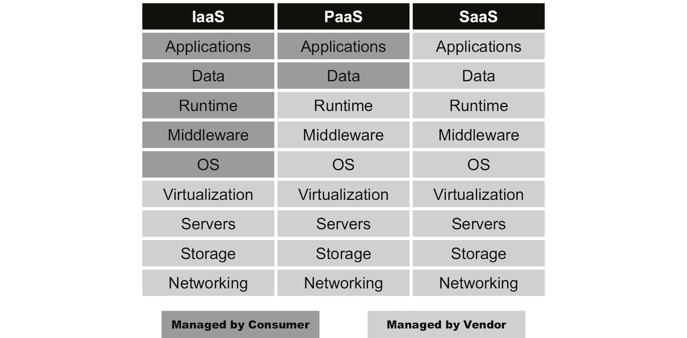
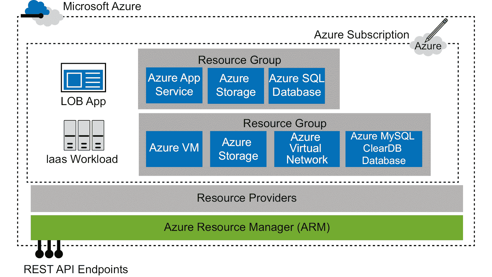
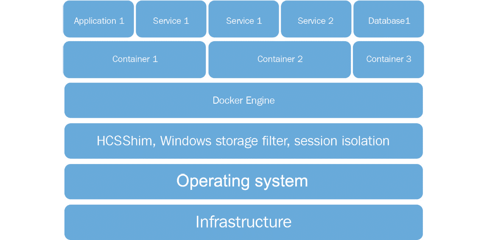

# 第一章：1\. 开始使用 Azure

每隔几年，就会出现一种技术创新，它会永久性地改变整个周围的格局和生态系统。如果我们追溯历史，1970 年代和 1980 年代是大型主机的时代。这些大型主机体积庞大，通常占据整间房间，几乎承担了所有计算工作。由于技术难以采购且使用繁琐，许多企业曾经需要提前一个月下订单，才能确保安装好可用的大型主机。

然后，1990 年代初期见证了个人计算和互联网需求的激增。因此，计算机变得更小，且相对容易为大众采购。个人计算和互联网领域的不断创新最终改变了整个计算机行业。许多人拥有能够运行多个程序并连接互联网的台式计算机。互联网的崛起也推动了客户端-服务器部署模式的兴起。现在可以有集中式服务器托管应用程序，任何有互联网连接的人都可以访问这些服务，世界任何地方的人都可以实现这一点。这也是服务器技术获得重要地位的时期；Windows NT 就是在这个时期发布的，随后是 Windows 2000 和 Windows 2003，它们分别出现在世纪之交。

2000 年代最显著的创新是便携设备的崛起和普及，尤其是智能手机，随之而来的是大量的应用程序。应用程序可以连接到互联网上的集中式服务器，并照常开展业务。用户不再依赖浏览器来完成这项工作；所有的服务器要么是自托管的，要么是通过服务提供商托管的，例如**互联网服务提供商**（**ISP**）。

用户对其服务器的控制权有限。多个客户及其部署共用同一台服务器，甚至客户并不知情。

然而，在 2000 年代初期和中期发生了另一件事，那就是云计算的崛起，它再次重塑了整个 IT 行业的格局。最初，云计算的采用速度较慢，人们对其持谨慎态度，原因要么是云计算处于初期阶段，还需要成熟，要么是人们对其存在各种负面看法。

为了更好地理解这种颠覆性技术，我们将在本章中介绍以下主题：

+   云计算

+   **基础设施即服务**（**IaaS**）、**平台即服务**（**PaaS**）和**软件即服务**（**SaaS**）

+   理解 Azure

+   **Azure 资源管理器**（**ARM**）

+   虚拟化、容器与 Docker

+   与智能云互动

## 云计算

今天，云计算是最有前景的技术之一，无论大小企业都在将其作为其 IT 战略的一部分。如今，很难进行任何有意义的 IT 战略讨论而不将云计算纳入整体解决方案讨论。

云计算，通俗来说就是“云”，指的是互联网资源的可用性。这些资源作为服务通过互联网提供给用户。例如，存储可以通过互联网按需提供，供用户存储文件、文档等。在这里，存储是由云服务提供商提供的一种服务。

云服务提供商是提供云服务给其他企业和消费者的公司或公司联盟。它们代表用户托管和管理这些服务，负责启用和维护服务的健康运行。全球各地的多个大型数据中心已经由云服务提供商开设，以满足用户的 IT 需求。

云资源包括按需基础设施的托管服务，如计算基础设施、网络和存储设施。这种云类型被称为 IaaS。

### 云计算的优势

云计算的采用率达到了历史最高水平，并且因以下几个优势而不断增长：

+   **按需付费模式**：客户无需购买硬件和软件来使用云资源。使用云资源不需要资本支出；客户只需为使用或预留资源的时间付费。

+   **全球访问**：云资源通过互联网在全球范围内可用。客户可以随时随地按需访问他们的资源。

+   **无限资源**：云技术的扩展能力是无限的；客户可以根据需要配置任何数量的资源，且没有任何限制。这也被称为无限扩展性。

+   **托管服务**：云服务提供商提供许多由他们为客户管理的服务。这可以减轻客户的技术和财务负担。

### 为什么选择云计算？

为了理解云计算的必要性，我们必须理解行业的视角。

**灵活性和敏捷性**

今天，应用程序并不是采用“大爆炸”式的部署方法创建的庞大单体应用，而是通过微服务范式由较小的服务组成。微服务帮助以独立和自主的方式创建服务，可以在隔离的状态下演化，而不会导致整个应用程序崩溃。它们在将变更快速而更好的带入生产过程中提供了极大的灵活性和敏捷性。许多微服务共同构成一个应用程序，并为客户提供集成的解决方案。这些微服务应当是可发现的，并具有明确的集成端点。与传统单体应用程序相比，微服务方法的集成数量非常高。这些集成在应用程序的开发和部署中增加了复杂性。

**速度、标准化和一致性**

因此，部署的方法论也应当进行调整，以适应这些服务的需求，也就是说，频繁的变更和频繁的部署。对于频繁的变更和部署，使用有助于以可预测且一致的方式进行这些变更的流程非常重要。应当使用自动化的敏捷流程，使得较小的变更可以被隔离地部署和测试。

**保持相关性**

最后，部署目标应当重新定义。部署目标不仅应当能够在几秒钟内轻松创建，而且构建的环境应该在各个版本间保持一致，具备适当的二进制文件、运行时、框架和配置。单体应用使用虚拟机，但微服务需要比虚拟机更具敏捷性、灵活性和更轻量化的选项。容器技术是这些服务的首选部署目标机制，我们将在本章稍后讨论更多相关内容。

**可扩展性**

使用微服务的一些重要原则是它们在隔离状态下具有无限的扩展能力、全球高可用性、近乎零恢复点的灾难恢复能力和时间目标。微服务的这些特性需要可以无限扩展的基础设施。不应有任何资源限制。虽然如此，组织在未使用资源时，也不应提前支付资源费用。

**成本效益**

按照使用的资源付费，并通过自动增加或减少资源数量和容量来优化使用，是云计算的基本原则。这些新兴的应用需求要求云作为首选平台，能够轻松扩展，具有高可用性，抗灾能力强，能够轻松引入变更，并以成本效益高的方式实现可预测和一致的自动化部署。

### Azure 中的部署范式

在 Azure 中有三种不同的部署模式，具体如下：

+   IaaS

+   PaaS

+   SaaS

这三种部署模式之间的区别在于客户通过 Azure 行使控制的级别。*图 1.1* 显示了每种部署模式中不同的控制级别：



###### 图 1.1：云服务——IaaS、PaaS 和 SaaS

从*图 1.1*可以明显看出，使用 IaaS 部署时，客户拥有更多的控制权，而随着从 PaaS 到 SaaS 部署的推进，控制级别逐渐降低。

**IaaS**

IaaS 是一种部署模型，允许客户在 Azure 上配置自己的基础设施。Azure 提供了多种基础设施资源，客户可以按需配置它们。客户负责维护和管理自己的基础设施。Azure 会确保托管这些虚拟基础设施资源的物理基础设施得到维护。在这种模式下，客户需要在 Azure 环境中进行积极的管理和操作。

**PaaS**

PaaS 将基础设施部署和控制权从客户手中移除。相较于 IaaS，这是一种更高级的抽象模式。在这种方式中，客户将自己的应用、代码和数据引入并部署到 Azure 提供的平台上。这些平台由 Azure 管理和治理，客户仅对其应用程序负责。客户只需进行与应用部署相关的活动。相比于 IaaS，这种模式为应用的部署提供了更快速、更便捷的选项。

**SaaS**

SaaS 是一种相较于 PaaS 更高级的抽象模式。在这种方式中，软件及其服务可以供客户使用。客户只需将数据引入这些服务中——他们无法控制这些服务。现在我们已经对 Azure 中的服务类型有了基本了解，接下来让我们深入了解 Azure，从基础开始理解它。

## 理解 Azure

Azure 提供了云的所有好处，同时保持开放和灵活。Azure 支持多种操作系统、编程语言、工具、平台、实用程序和框架。例如，它支持 Linux 和 Windows、SQL Server、MySQL 和 PostgreSQL。它支持大多数编程语言，包括 C#、Python、Java、Node.js 和 Bash。它支持 NoSQL 数据库，如 MongoDB 和 Cosmos DB，并且还支持持续集成工具，如 Jenkins 和 Azure DevOps Services（前身是**Visual Studio Team Services**（**VSTS**））。这个生态系统的核心思想是使客户能够自由选择自己的语言、平台、操作系统、数据库、存储以及工具和实用程序。客户不应该受到技术方面的限制；相反，他们应该能够构建并专注于他们的业务解决方案，而 Azure 为他们提供了一个世界级的技术栈供其使用。

Azure 与客户选择的技术栈高度兼容。例如，Azure 支持所有流行的（开源和商业）数据库环境。Azure 提供 Azure SQL、MySQL 和 Postgres 的 PaaS 服务。它提供了 Hadoop 生态系统，并提供基于 100% Apache Hadoop 的 PaaS 服务 HDInsight。它还为那些更倾向于 IaaS 方法的客户提供了基于 Linux 的 Hadoop **虚拟机**（**VM**）实现。Azure 还提供 Redis 缓存服务，并支持其他流行的数据库环境，如 Cassandra、Couchbase 和 Oracle，作为 IaaS 实现。

Azure 上的服务数量日益增加，最新的服务列表可以在 [`azure.microsoft.com/services`](https://azure.microsoft.com/services) 找到。

Azure 还提供了一种独特的云计算范式——混合云。混合云指的是一种部署策略，其中一部分服务部署在公共云上，而其他服务则部署在本地私有云或数据中心。公共云和私有云之间通过**虚拟专用网络**（**VPN**）连接。Azure 为客户提供了将工作负载划分并同时部署在公共云和本地数据中心的灵活性。

Azure 在全球范围内拥有数据中心，并将这些数据中心组合成区域。每个区域都有多个数据中心，以确保灾难恢复迅速高效。到目前为止，全球已有 58 个区域。这为客户提供了在选择的位置部署服务的灵活性。客户还可以结合这些区域，部署灾难恢复能力强且靠近客户群的解决方案。

#### 注意

在中国和德国，Azure 云服务在普通使用和政府使用方面是分开的。这意味着云服务在不同的数据中心进行维护。

## Azure 作为智能云

Azure 提供基础设施和服务，利用超大规模处理技术处理数十亿的事务。它为数据提供了 PB 级的存储，并提供了大量互联的服务，可以在它们之间传递数据。凭借这样的能力，数据可以被处理以生成有意义的知识和见解。通过数据分析可以生成多种类型的见解，具体如下：

+   **描述性**：这种类型的分析提供关于正在发生或过去发生的事情的详细信息。

+   **预测性**：这种类型的分析提供有关未来将要发生的事情的详细信息。

+   **规范性**：这种类型的分析提供有关应采取什么措施来增强或防止当前或未来事件的详细信息。

+   **认知性**：这种类型的分析实际上执行由规范性分析确定的自动化操作。

尽管从数据中提取见解非常重要，但同样重要的是根据这些见解采取行动。Azure 提供了一个强大的平台，用于摄取大量数据、处理和转换数据、存储并生成见解，并将其显示在实时仪表板上。还可以根据这些见解自动采取行动。这些服务面向所有 Azure 客户提供，形成了一个丰富的生态系统，客户可以在其中创建解决方案。由于 Azure 提供的智能服务的易得性，企业正在创建大量的应用程序和服务，完全颠覆了行业，这些服务结合起来为最终客户创造了有意义的价值。Azure 确保那些对中小型公司来说商业上不可行的服务，现在可以轻松消费并在几分钟内部署。

## Azure 资源管理器

**Azure 资源管理器** (**ARM**) 是微软的技术平台和编排服务，将之前讨论的所有组件结合起来。它将 Azure 的资源提供者、资源和资源组结合起来，形成一个统一的云平台。它使 Azure 服务以订阅的形式提供，资源类型以资源组的形式提供，并使资源和资源 API 可供门户和其他客户端访问，同时进行身份验证以访问这些资源。它还启用了如标签、身份验证、**基于角色的访问控制** (**RBAC**)、资源锁定和策略执行等功能，用于订阅及其资源组的管理。它还通过 Azure 门户、Azure PowerShell 和 **命令行接口** (**CLI**) 工具提供部署和管理功能。

### ARM 架构

ARM 架构及其组件如*图 1.2*所示。如我们所见，**Azure 订阅**由多个资源组组成。每个资源组包含从资源提供者中可用的资源类型创建的资源实例：



###### 图 1.2：ARM 架构

### 为什么选择 ARM？

在 ARM 之前，Azure 使用的框架被称为**Azure 服务管理器**（**ASM**）。了解 ASM 的一些基本情况非常重要，这样我们才能清楚地理解 ARM 的出现，以及 ASM 的逐步弃用过程。

**ASM 的限制**

ASM 存在固有的限制。例如，ASM 部署较慢且会被阻塞——如果前一个操作正在进行，后续操作将会被阻塞。ASM 的一些限制如下：

+   **并行性**：并行性在 ASM 中是一个挑战。无法成功地并行执行多个事务。ASM 中的操作是线性的，依次执行。如果同时执行多个事务，将会出现并行操作错误或事务被阻塞。

+   **资源**：ASM 中的资源是相互独立地进行配置和管理的；ASM 资源之间没有关系。无法将服务和资源进行分组或一起配置。

+   **云服务**：云服务是 ASM 中的部署单元。它们依赖于亲和性组，并且由于设计和架构的原因，无法进行扩展。

无法为 ASM 中的资源分配细粒度和独立的角色和权限。客户要么是服务管理员，要么是订阅中的共同管理员。客户要么对资源拥有完全控制权限，要么根本无法访问这些资源。ASM 不提供部署支持。要么需要手动进行部署，要么需要编写.NET 或 PowerShell 脚本进行自动化。ASM 的 API 在不同资源之间并不一致。

### ARM 的优势

ARM 相比于 ASM 提供了明显的优势，具体如下：

+   **分组**：ARM 允许将资源逻辑上分组到一个容器中。这些资源可以一起管理，并作为一个整体经历共同的生命周期。这样更容易识别相关和依赖的资源。

+   **共同生命周期**：分组中的资源具有相同的生命周期。这些资源可以一起发展并作为一个单位进行管理。

+   **RBAC**：可以为资源分配细粒度的角色和权限，从而为客户提供独立的访问权限。客户也只能拥有分配给他们的那些权限。

+   **部署支持**：ARM 通过模板提供部署支持，支持 DevOps 和**基础设施即代码**（**IaC**）。这些部署速度更快、一致且可预测。

+   **更优的技术**：资源的成本和计费可以作为一个单位进行管理。每个资源组可以提供其使用情况和成本信息。

+   **可管理性**：ARM 提供了高级功能，如安全性、监控、审计和标记，以便更好地管理资源。可以根据标签查询资源。标签还提供了类似标签资源的成本和计费信息。

+   **迁移**：在资源组内部和跨资源组迁移和更新资源变得更容易。

### ARM 概念

使用 ARM，Azure 中的一切都是资源。资源的例子包括虚拟机（VM）、网络接口、公有 IP 地址、存储帐户和虚拟网络。ARM 基于与资源提供者和资源消费者相关的概念。Azure 通过多个资源提供者提供资源和服务，这些资源和服务在组内被消费和部署。

**资源提供者**

这些是通过 ARM 提供资源类型的服务。ARM 中的顶级概念是资源提供者。资源提供者是资源类型的容器。资源类型被分组到资源提供者中。它们负责部署和管理资源。例如，虚拟机资源类型由名为 **Microsoft.Compute/virtualMachines** 的资源提供者提供。**表述性状态传输**（**REST**）API 操作已版本化，以便区分它们。版本命名基于它们由 Microsoft 发布的日期。为部署资源，相关的资源提供者必须在订阅中可用。并非所有资源提供者在默认情况下都可用。如果某个资源在订阅中不可用，我们需要检查所需的资源提供者是否在每个区域中可用。如果可用，客户可以明确地为该订阅注册。

**资源类型**

资源类型是定义资源公共 API 接口和实现的实际资源规范。它们实现资源所支持的工作和操作。与资源提供者类似，资源类型在其内部实现方面也会随着时间的推移而发展，并且有多个版本的架构和公共 API 接口。版本名称基于它们由 Microsoft 作为预览或**正式发布**（**GA**）的日期。资源类型在资源提供者注册之后作为订阅可用。此外，并非每个资源类型都在每个 Azure 区域中可用。资源的可用性取决于资源提供者在 Azure 区域的可用性和注册情况，并且必须支持为其提供所需的 API 版本。

**资源组**

资源组是 ARM 中的部署单元。它们是将多个资源实例组合在一起的容器，并具有安全性和管理边界。资源组在一个订阅中具有唯一名称。资源可以部署在不同的 Azure 区域，但仍然属于同一个资源组。资源组为其中的所有资源提供附加服务。资源组提供元数据服务，例如标签功能，用于对资源进行分类；基于策略的资源管理；RBAC（基于角色的访问控制）；保护资源免受意外删除或更新等。如前所述，资源组具有安全边界，无法访问资源组的用户也无法访问其中包含的资源。每个资源实例都需要属于一个资源组，否则无法进行部署。

**资源和资源实例**

资源是由资源类型创建的，是资源类型的实例。一个实例可以在全球范围内唯一，或者在资源组级别唯一。唯一性由资源的名称和类型共同定义。如果将其与面向对象编程结构进行比较，资源实例可以视为对象，而资源类型则可以视为类。服务通过资源实例所支持和实现的操作进行消费。资源类型定义了属性，每个实例在实例配置时应配置强制性的属性。有些是强制性的属性，而其他则是可选的。资源实例继承其父资源组的安全性和访问配置。这些继承的权限和角色分配可以被覆盖到每个资源。可以以某种方式锁定资源，从而阻止某些操作，使其即使对角色、用户和组具有访问权限，也无法使用。资源可以被标记，以便于发现和管理。

**ARM 特性**

下面是 ARM 提供的一些主要功能：

+   **RBAC**：**Azure Active Directory**（**Azure AD**）认证用户以提供对订阅、资源组和资源的访问。ARM 在平台中实现 OAuth 和 RBAC，基于分配给用户或组的角色，启用对资源、资源组和订阅的授权和访问控制。权限定义了对资源操作的访问。这些权限可以允许或拒绝对资源的访问。角色定义是这些权限的集合。角色将 Azure AD 用户和组映射到特定权限。角色随后被分配到某个范围；这个范围可以是单个用户、一组资源、资源组或订阅。添加到角色中的 Azure AD 身份（用户、组和服务主体）根据角色中定义的权限访问资源。ARM 提供多个开箱即用的角色，包括系统角色，如**所有者**、**贡献者**和**阅读者**。它还提供基于资源的角色，如 SQL 数据库贡献者和虚拟机贡献者。ARM 还允许创建自定义角色。

+   **标签**：标签是名称-值对，向资源添加额外的信息和元数据。资源和资源组都可以使用多个标签。标签有助于资源的分类，从而提升可发现性和可管理性。资源可以快速搜索并轻松识别。还可以获取具有相同标签的资源的计费和成本信息。尽管此功能由 ARM 提供，但 IT 管理员会根据资源和资源组定义其使用和分类。分类和标签可以与部门、资源使用、位置、项目或从成本、使用、计费或搜索角度来看被认为合适的其他标准相关。这些标签随后可以应用于资源。在资源组级别定义的标签不会被其资源继承。

+   **策略**：ARM 提供的另一项安全功能是自定义策略。可以创建自定义策略来控制对资源的访问。策略被定义为约定和规则，在与资源和资源组交互时必须遵守这些规则。策略定义明确禁止对资源的操作或访问。默认情况下，所有未在策略定义中提及的访问都会被允许。这些策略定义被分配到资源、资源组和订阅范围内。需要注意的是，这些策略并不是 RBAC 的替代品或替换品。实际上，它们与 RBAC 互补并协同工作。策略会在用户通过 Azure AD 进行身份验证并通过 RBAC 服务授权后进行评估。ARM 提供了一种基于 JSON 的策略定义语言来定义策略。一些策略定义的示例包括：必须对每个已配置的资源进行标签，并且资源只能在特定的 Azure 区域进行配置。

+   **锁定**：可以对订阅、资源组和资源进行锁定，以防止经过身份验证的用户意外删除或更新。应用于更高层级的锁定会向下流向子资源。或者，应用于订阅级别的锁定会锁定每个资源组及其中的资源。

+   **多区域**：Azure 提供多个区域来配置和托管资源。ARM 允许在不同位置配置资源，同时仍然位于同一个资源组内。一个资源组可以包含来自不同区域的资源。

+   **幂等**：此功能通过确保每次部署都能导致资源和配置处于相同的状态，无论执行多少次，从而确保资源部署的可预测性、标准化和一致性。

+   **可扩展**：ARM 提供了一个可扩展的架构，允许在平台上创建和插入新的资源提供程序和资源类型。

## 虚拟化

虚拟化是一项突破性的创新，它彻底改变了对物理服务器的看法。它是将物理对象抽象为逻辑对象的过程。

物理服务器的虚拟化导致了被称为虚拟机（VM）的虚拟服务器。这些虚拟机共享并使用托管它们的物理服务器的 CPU、内存、存储和其他硬件。这使得按需提供应用环境变得更快、更容易，提供了高可用性和可扩展性，并且降低了成本。一个物理服务器就足以托管多个虚拟机，每个虚拟机都有自己的操作系统并在其上托管服务。

不再需要购买额外的物理服务器来部署新的应用程序和服务。现有的物理服务器足以托管更多的虚拟机。此外，通过虚拟化的帮助，许多物理服务器被整合为少数几台，以实现合理化。

每个虚拟机都包含整个操作系统，并且每个虚拟机与其他虚拟机完全隔离，包括物理主机。虽然虚拟机使用宿主物理服务器提供的硬件，但它对其分配的资源和环境拥有完全控制权。这些虚拟机可以托管在如物理服务器等网络上，并拥有自己的身份。

Azure 可以在几分钟内创建 Linux 和 Windows 虚拟机。微软提供了自己的镜像，以及来自其合作伙伴和社区的镜像；用户也可以提供自己的镜像。虚拟机使用这些镜像进行创建。

## 容器

容器也是一种虚拟化技术；然而，它们并不虚拟化服务器。相反，容器是操作系统级别的虚拟化。这意味着容器共享宿主操作系统内核（由宿主提供）以及宿主之间的内核。运行在宿主（物理或虚拟）上的多个容器共享宿主操作系统内核。容器确保它们复用宿主内核，而不是每个容器都有自己的独立内核。

容器与其宿主或运行在宿主上的其他容器完全隔离。Windows 容器使用 Windows 存储过滤驱动程序和会话隔离来隔离操作系统服务，如文件系统、注册表、进程和网络。即使在 Linux 宿主上运行的 Linux 容器也是如此。Linux 容器使用 Linux 命名空间、控制组和联合文件系统来虚拟化宿主操作系统。

容器看起来仿佛拥有一个全新且未被触及的操作系统和资源。这种安排带来了许多好处，诸如以下几点：

+   容器的快速配置时间远远少于虚拟机。容器中的大多数操作系统服务由宿主操作系统提供。

+   容器比虚拟机更轻量，所需的计算资源也更少。使用容器时，不再需要操作系统资源开销。

+   容器比虚拟机小得多。

+   容器能够以直观、自动化和简便的方式帮助解决与管理多个应用程序依赖关系相关的问题。

+   容器提供了基础设施，用于在一个地方定义所有应用程序的依赖关系。

容器是 Windows Server 2016 和 Windows 10 的固有特性；然而，它们是通过 Docker 客户端和 Docker 守护进程进行管理和访问的。可以在 Azure 上使用 Windows Server 2016 SKU 作为镜像来创建容器。每个容器都有一个必须保持运行的主进程，以确保容器的存在。当该进程结束时，容器将停止。此外，容器可以在交互模式下运行，也可以像服务一样在分离模式下运行：



###### 图 1.3：容器架构

*图 1.3* 展示了启用容器的所有技术层。最底层提供了核心基础设施，包括网络、存储、负载均衡器和网络卡。在基础设施的顶部是计算层，由物理服务器或物理服务器上方的虚拟和物理服务器组成。此层包含能够托管容器的操作系统。操作系统提供了执行驱动程序，上层使用该驱动程序调用内核代码和对象来执行容器。微软为管理和创建容器而创建了 **Host Container System Shim**（**HCSShim**），并使用 Windows 存储过滤驱动程序进行镜像和文件管理。

容器环境隔离已在 Windows 会话中启用。Windows Server 2016 和 Nano Server 提供操作系统，启用容器功能，并执行用户级的 Docker 客户端和 Docker 引擎。Docker 引擎使用 HCSShim、存储过滤驱动程序和会话服务，在服务器上生成多个容器，每个容器中包含一个服务、应用程序或数据库。

## Docker

Docker 为 Windows 容器提供管理功能。它包括以下两个可执行文件：

+   Docker 守护进程

+   Docker 客户端

Docker 守护进程是管理容器的核心工具。它是一个 Windows 服务，负责管理主机上与容器相关的所有活动。Docker 客户端与 Docker 守护进程进行交互，负责捕获输入并将其发送到 Docker 守护进程。Docker 守护进程提供运行时、库、图形驱动程序和引擎，用于创建、管理和监控主机服务器上的容器和镜像。它还能够创建用于构建和交付应用程序到多个环境的自定义镜像。

## 与智能云交互

Azure 提供多种连接、自动化和与智能云交互的方式。所有这些方法都需要用户在使用前通过有效凭据进行身份验证。连接 Azure 的不同方式如下：

+   Azure 门户

+   PowerShell

+   Azure CLI

+   Azure REST API

### Azure 门户

Azure 门户是一个很好的入门平台。通过 Azure 门户，用户可以登录并开始手动创建和管理 Azure 资源。该门户通过浏览器提供直观、易于使用的用户界面。Azure 门户提供了一种便捷的方式，通过 **blade** 来导航资源。Blade 显示资源的所有属性，包括日志、费用、与其他资源的关系、标签、安全选项等。整个云部署都可以通过门户进行管理。

### PowerShell

PowerShell 是一个基于对象的命令行外壳和脚本语言，用于基础设施和环境的管理、配置和控制。它建立在 .NET 框架之上，提供自动化功能。PowerShell 已真正成为 IT 管理员和自动化开发人员在管理和控制 Windows 环境中的第一选择。如今，几乎每个 Windows 环境和许多 Linux 环境都可以通过 PowerShell 进行管理。事实上，几乎每个 Azure 的方面也可以通过 PowerShell 管理。Azure 提供了对 PowerShell 的丰富支持，针对每个资源提供商都提供了 PowerShell 模块，其中包含数百个 cmdlet。用户可以在脚本中使用这些 cmdlet 来自动化与 Azure 的交互。Azure PowerShell 模块可以通过 Web 平台安装程序以及通过 `PowerShellGet` 模块快速、轻松地从 PowerShell Gallery 下载和安装 PowerShell 模块。`PowerShellGet` 模块提供了 `Install-Module` cmdlet 用于在系统上下载和安装模块。

安装模块是一个简单的复制模块文件到定义好的模块位置的过程，具体操作如下：

```
Import-module PowerShellGet
Install-Module -Name az -verbose
```

`Import-module` 命令将模块及其相关功能导入当前执行范围，`Install-Module` 帮助安装模块。

### Azure CLI

Azure 还提供了 Azure CLI 2.0，可以在 Linux、Windows 和 macOS 操作系统上部署。Azure CLI 2.0 是 Azure 的新命令行工具，用于管理 Azure 资源。Azure CLI 2.0 针对通过命令行管理和管理 Azure 资源进行了优化，适用于构建与 ARM 交互的自动化脚本。CLI 可以使用 Bash shell 或 Windows 命令行执行命令。Azure CLI 在非 Windows 用户中非常受欢迎，因为它允许在 Linux 和 macOS 上与 Azure 进行交互。Azure CLI 2.0 的安装步骤可以参考 [`docs.microsoft.com/cli/azure/install-azure-cli?view=azure-cli-latest`](https://docs.microsoft.com/cli/azure/install-azure-cli?view=azure-cli-latest)。

### Azure REST API

所有 Azure 资源都通过 REST 端点暴露给用户。REST API 是服务端点，通过提供 **创建、检索**、**更新** 或 **删除**（**CRUD**）访问来实现 HTTP 操作（或方法）。用户可以使用这些 API 来创建和管理资源。实际上，CLI 和 PowerShell 机制内部使用这些 REST API 与 Azure 上的资源进行交互。

### ARM 模板

在前面的部分中，我们讨论了 ARM 提供的部署特性，例如多服务、多区域、可扩展和幂等性等。ARM 模板是 ARM 中资源配置的主要方式，ARM 模板为 ARM 的部署特性提供了实现支持。

ARM 模板通过声明性模型来指定资源、其配置、脚本和扩展。ARM 模板基于 **JavaScript 对象表示法**（**JSON**）格式。它们使用 JSON 语法和约定来声明和配置资源。JSON 文件是基于文本的，用户友好且易于阅读的文件。

它们可以存储在源代码库中，并进行版本控制。它们也是表示基础设施即代码（IaC）的一种方式，可以反复、可预测且一致地用于在 Azure 资源组中配置资源。模板需要一个资源组来进行部署。它只能部署到资源组，并且资源组应在执行模板部署之前存在。模板无法创建资源组。

模板提供了在设计和实现中保持通用性和模块化的灵活性。模板允许接受用户输入的参数，声明内部变量，定义资源之间的依赖关系，链接同一资源组或不同资源组中的资源，并执行其他模板。它们还提供脚本语言类型的表达式和函数，使得模板在运行时具有动态性和可定制性。

**部署**

PowerShell 支持以下两种模板部署模式：

+   **增量**：增量部署会将模板中声明但在资源组中不存在的资源添加到资源组，将资源组中不属于模板定义的资源保持不变，并保持模板和资源组中都存在的资源（且配置状态相同）不变。

+   **完整**：完整部署模式则将模板中声明的资源添加到资源组中，从资源组中删除模板中不存在的资源，并保持在资源组和模板中都存在的资源（且配置状态相同）不变。

## 摘要

云计算是一个相对较新的范式，仍处于初期阶段。随着时间的推移，很多创新和功能将会加入其中。Azure 是目前领先的云服务提供商之一，它通过 IaaS、PaaS、SaaS 和混合部署提供了丰富的功能。事实上，Azure Stack 是微软推出的私有云实现，预计很快就会发布。这将具备与公有云相同的功能，实际上它们会无缝且透明地连接并协同工作。

开始使用 Azure 非常简单，但如果开发人员和架构师没有适当设计和架构他们的解决方案，也很容易陷入困境。本书尝试为架构解决方案提供指导和方向，帮助以正确的方式使用合适的服务和资源。Azure 上的每个服务都是一种资源。理解这些资源如何在 Azure 中组织和管理是非常重要的。本章介绍了 ARM 和资源组——这两个核心框架为资源提供了基础构件。ARM 为资源提供了一套服务，帮助在管理它们时实现统一性、标准化和一致性。诸如 RBAC、标签、策略和锁等服务，适用于每个资源提供者和资源。Azure 还提供了丰富的自动化功能，可以自动化并与资源交互。工具如 PowerShell、ARM 模板和 Azure CLI 可以作为发布流水线、持续部署和交付的一部分进行集成。用户可以通过这些自动化工具从异构环境连接到 Azure。

下一章将讨论一些重要的架构问题，这些问题有助于解决常见的基于云的部署问题，并确保应用程序在长期内是安全的、可用的、可扩展的和可维护的。
