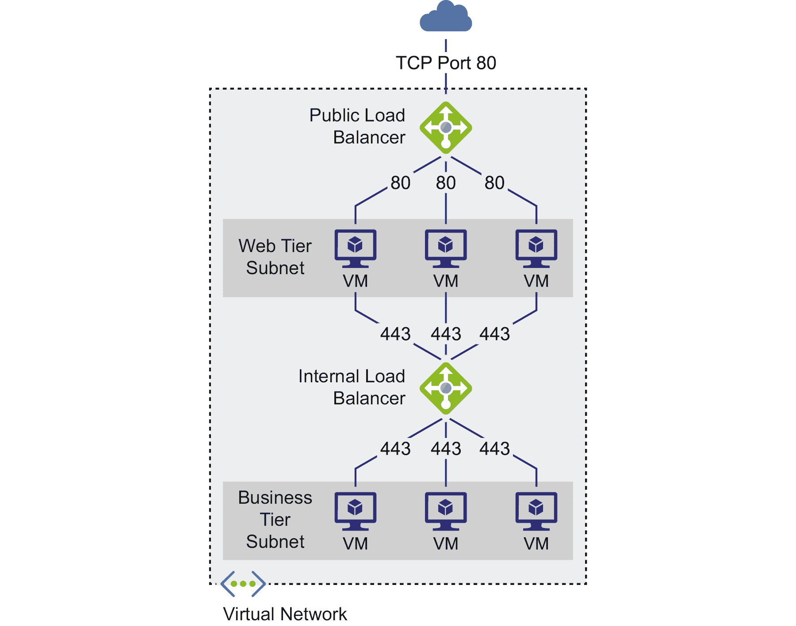
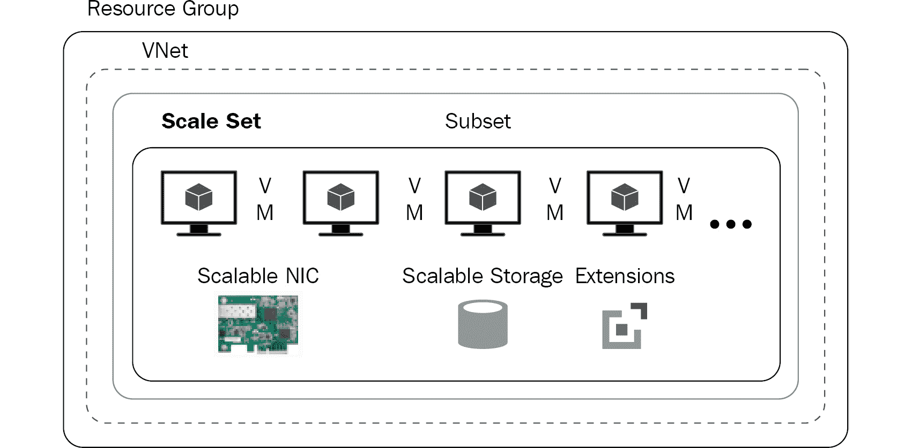

# 2. Azure 解决方案的可用性、可扩展性和监控

架构上的关注点，如高可用性和可扩展性，是任何架构师最高优先级的任务之一。这在许多项目和解决方案中都很常见。然而，在将应用程序部署到云端时，这些问题变得尤为重要，因为云端的复杂性。在大多数情况下，复杂性并不是来自应用程序本身，而是来自云中类似资源的多样性。云端带来的另一个复杂问题是新功能的不断涌现。这些新功能几乎使得架构师的决策在回顾时完全显得多余。

在本章中，我们将从架构师的角度，探讨如何在 Azure 上部署高度可用和可扩展的应用程序。

Azure 是一个成熟的平台，提供了多个级别的高可用性和可扩展性的实现选项。架构师必须了解这些选项，包括它们之间的差异、所涉及的成本，并最终能够选择一个符合最佳需求的解决方案。没有一个适合所有场景的解决方案，但每个项目都有一个合适的方案。

对于组织来说，能够随时向用户提供可用的应用程序和系统，是最重要的优先事项之一。它们希望自己的应用程序能够持续运行且具备功能，即使在发生一些不利事件时，仍能继续为客户提供服务。高可用性是本章的主要主题。*保持系统运行* 是高可用性的常用比喻。实现应用程序的高可用性并非易事，组织必须投入大量的时间、精力、资源和金钱。此外，仍然存在组织的实施方案无法达到预期结果的风险。Azure 为**虚拟机**（**VMs**）和**平台即服务**（**PaaS**）服务提供了许多高可用性功能。本章将介绍 Azure 提供的架构和设计功能，以确保正在运行的应用程序和服务的高可用性。

在本章中，我们将涵盖以下主题：

+   高可用性

+   Azure 高可用性

+   高可用性的架构考虑因素

+   可扩展性

+   升级和维护

## 高可用性

高可用性是任何业务关键服务及其部署的核心非功能性技术要求之一。高可用性是指一个服务或应用程序保持持续运行的特性；它通过满足或超越其承诺的**服务级别协议**（**SLA**）来实现这一点。用户根据服务类型会被承诺一定的 SLA。服务应该根据其 SLA 可供用户使用。例如，SLA 可以定义一个应用程序在一年内的可用性为 99%。这意味着它应该可以供用户使用 361.35 天。如果它未能在此期间保持可用，则构成违反 SLA。大多数关键任务应用程序将它们的高可用性 SLA 定义为 99.999%（每年）。这意味着该应用程序应该全年都能保持运行并可供使用，但它的停机时间不能超过 5.2 小时。如果停机时间超过这一限度，您将有资格获得信用，信用金额将根据总的正常运行时间百分比来计算。

需要注意的是，高可用性是根据时间来定义的（可以是按年、按月、按周，或这些的组合）。

一个服务或应用程序由多个组件组成，这些组件部署在不同的层级和层次上。此外，服务或应用程序部署在**操作系统**（**OS**）上，并托管在物理机器或虚拟机（VM）上。它消耗网络和存储服务来满足各种需求，甚至可能依赖于外部系统。为了确保这些服务或应用程序具备高可用性，网络、存储、操作系统、虚拟机或物理机器以及应用程序的每个组件都必须考虑 SLA 和高可用性。为了确保高可用性，从应用程序规划开始直到投入运营，都需要采用明确的应用程序生命周期流程。这也涉及到冗余的引入。冗余资源应该包括在整个应用程序和部署架构中，以确保如果一个资源出现故障，另一个资源能够接管并继续为客户提供服务。

影响应用程序高可用性的一些主要因素如下：

+   计划性维护

+   非计划性维护

+   应用程序部署架构

我们将在接下来的章节中详细探讨这些因素。让我们仔细看看 Azure 如何确保部署的高可用性。

## Azure 高可用性

实现高可用性并满足高 SLA 要求是非常困难的。Azure 提供了许多功能，能够为应用程序实现高可用性，从主机和来宾操作系统到使用其 PaaS 的应用程序。架构师可以通过这些功能，通过配置来实现应用程序的高可用性，而不必从头开始构建这些功能或依赖第三方工具。

在本节中，我们将探讨 Azure 提供的使应用程序高可用的功能和能力。在深入架构和配置细节之前，理解与 Azure 高可用性相关的概念非常重要。

### 概念

Azure 提供的实现高可用性的基本概念如下：

+   可用性集

+   故障域

+   更新域

+   可用性区域

如你所知，设计高可用性解决方案非常重要。工作负载可能是关键任务，并且需要高可用架构。我们现在将仔细查看 Azure 中高可用性的每个概念。我们从可用性集开始。

**可用性集**

Azure 中的高可用性主要通过冗余来实现。冗余意味着有多个相同类型的资源实例，在主资源发生故障时接管控制。然而，仅仅拥有更多相似的资源并不能使它们具备高可用性。例如，在一个订阅中可能会配置多个虚拟机，但仅仅有多个虚拟机并不意味着它们具备高可用性。Azure 提供了一个名为可用性集的资源，将多个虚拟机与其关联可以使它们具备高可用性。为了实现高可用性，至少应将两台虚拟机托管在可用性集中。由于所有虚拟机都被放置在 Azure 数据中心的不同物理机架上，它们都会具备高可用性。在更新时，这些虚拟机会逐一更新，而不是同时更新。可用性集提供了故障域和更新域来实现这一点，我们将在下一部分详细讨论。简而言之，可用性集在数据中心级别提供冗余，类似于本地冗余存储。

需要注意的是，可用性集仅在数据中心内部提供高可用性。如果整个数据中心发生故障，应用程序的可用性将受到影响。为了确保在数据中心故障时应用程序仍然可用，Azure 引入了一个名为可用性区域的新特性，我们将在稍后学习。

如果你回顾基本概念列表，接下来是故障域。故障域通常用缩写 **FD** 表示。在下一部分中，我们将讨论故障域是什么，以及它在设计高可用性解决方案时的相关性。

**故障域**

**故障域**（**FDs**）表示一组共享相同电源和网络交换机的虚拟机（VM）。当一台 VM 被配置并分配到可用性集时，它将被托管在一个故障域中。每个可用性集默认有两个或三个故障域，这取决于 Azure 区域。有些区域提供两个故障域，而其他区域则提供三个故障域。故障域无法由用户配置。

当多个虚拟机被创建时，它们会被放置在不同的 FDs 上。如果虚拟机的数量超过了 FDs 的数量，多余的虚拟机会被放置在现有的 FDs 上。例如，如果有五个虚拟机，则这些虚拟机会托管在多个虚拟机上。

FDs 与 Azure 数据中心中的物理机架相关。FDs 在由于硬件、电力和网络故障导致的计划外停机情况下提供高可用性。由于每个虚拟机（VM）都被放置在不同的机架上，具有不同的硬件、不同的电源和不同的网络，因此如果某个机架出现故障，其他虚拟机将继续运行。

列表中的下一个是更新域。

**更新域**

FD 处理计划外停机，而更新域（update domain）则处理来自计划维护的停机。每个虚拟机也会被分配一个更新域，该更新域中的所有虚拟机将一起重启。一个可用性集最多可以有 20 个更新域。更新域是用户无法配置的。当多个虚拟机被创建时，它们会被放置在不同的更新域中。如果在一个可用性集中配置了超过 20 个虚拟机，它们将以轮询方式分布到这些更新域中。更新域处理计划维护。通过 Azure 门户中的**服务健康**，你可以查看计划维护的详细信息并设置警报。

在接下来的部分中，我们将介绍可用性区域（availability zones）。

**可用性区域**

这是 Azure 引入的一个相对较新的概念，与存储帐户的区域冗余非常相似。可用性区域通过将虚拟机实例放置在区域内不同的数据中心中，提供区域内的高可用性。可用性区域适用于 Azure 中的许多资源，包括虚拟机、托管磁盘、虚拟机规模集和负载均衡器。支持可用性区域的资源的完整列表可以在 [`docs.microsoft.com/azure/availability-zones/az-overview#services-that-support-availability-zones`](https://docs.microsoft.com/azure/availability-zones/az-overview#services-that-support-availability-zones) 中找到。长时间以来，无法跨区域配置可用性是 Azure 的一个缺口，直到引入可用性区域后才得以解决。

每个 Azure 区域由多个配备独立电力、冷却和网络设施的数据中心组成。一些区域的数据中心较多，而另一些区域的数据中心较少。该区域内的数据中心被称为区域。在所有启用的区域中，至少有三个独立的区域以确保弹性。将虚拟机部署在可用性区域中，确保这些虚拟机位于不同的数据中心，并且位于不同的机架和网络上。这些区域内的数据中心之间具有高速网络，这些虚拟机之间的通信不会出现延迟。*图 2.1* 显示了在区域中如何设置可用性区域：


###### 图 2.1：区域中的可用性区域

您可以在[`docs.microsoft.com/azure/availability-zones/az-overview`](https://docs.microsoft.com/azure/availability-zones/az-overview)找到有关可用性区域的更多信息。

区域冗余服务将您的应用程序和数据复制到可用性区域，以防止单点故障。

如果应用程序需要更高的可用性，并且您希望确保即使整个 Azure 区域宕机，也可用，可用性的下一个层次是 Traffic Manager 功能，这将在本章后面讨论。现在让我们继续了解 Azure VM 负载平衡的工作原理。

### 负载均衡

负载均衡，顾名思义，是指在 VM 和应用程序之间平衡负载的过程。如果只有一个 VM，则无需负载均衡器，因为整个负载位于单个 VM 上，没有其他 VM 可以共享负载。然而，通过包含相同应用程序和服务的多个 VM，可以通过负载均衡器在它们之间分发负载。Azure 提供了几种资源来实现负载均衡：

+   **负载均衡器**：Azure 负载均衡器有助于设计具有高可用性的解决方案。在传输控制协议（TCP）堆栈内，它是第 4 层传输级别的负载均衡器。这是一个第 4 层负载均衡器，将传入的流量分发到负载平衡集中定义的健康服务实例之间。第 4 层负载均衡器在传输级别工作，并具有网络级别的信息，如 IP 地址和端口，以决定传入请求的目标。负载均衡器将在本章后面详细讨论。

+   **应用程序网关**：Azure 应用程序网关为您的应用程序提供高可用性。它们是第 7 层负载均衡器，将传入的流量分发到服务的健康实例之间。第 7 层负载均衡器可以在应用程序级别工作，并具有应用程序级别的信息，如 cookie、HTTP、HTTPS 和会话等。应用程序网关将在本章后面详细讨论。在部署 Azure Kubernetes 服务时，特别是需要将来自互联网的入口流量路由到集群中的 Kubernetes 服务的场景中，也会使用应用程序网关。

+   **Azure Front Door**：Azure Front Door 与应用程序网关非常相似；但是，它不在区域或数据中心级别工作。相反，它在全球范围内帮助路由请求。它具有与应用程序网关相同的功能集，但是在全局级别提供。它还提供网页应用程序防火墙以过滤请求并提供其他安全相关的保护。它提供会话亲和性、TLS 终止和基于 URL 的路由作为其部分功能。

+   **流量管理器**：流量管理器帮助根据区域端点的健康状况和可用性，在多个区域之间对请求进行全局路由。它支持通过 DNS 重定向条目来实现这一点。它具有高度的弹性，并且在区域故障期间不会影响服务。

由于我们已经探讨了可以用于实现负载均衡的方法和服务，接下来我们将讨论如何使虚拟机具备高可用性。

### 虚拟机高可用性

虚拟机提供计算能力。它们为应用程序和服务提供处理能力和托管支持。如果应用程序部署在单个虚拟机上，而该虚拟机出现故障，则应用程序将无法使用。如果应用程序由多个层组成，并且每个层都部署在各自的单个虚拟机实例上，那么即使是单个虚拟机实例的停机也可能导致整个应用程序不可用。Azure 尝试使单个虚拟机实例的可用性达到 99.9%，特别是当这些单实例虚拟机使用高级存储作为磁盘时。对于那些在可用性集中分组在一起的虚拟机，Azure 提供了更高的服务级别协议（SLA）。对于包含两个或更多虚拟机的可用性集，提供 99.95% 的 SLA。如果虚拟机部署在可用性区域中，SLA 可达 99.99%。在下一节中，我们将讨论计算资源的高可用性。

### 计算高可用性

需要高可用性的应用程序应部署在同一可用性集中的多个虚拟机（VM）上。如果应用程序由多个层组成，那么每个层应有一组虚拟机，部署在其专用的可用性集中。简而言之，如果一个应用程序有三个层，那么应有三个可用性集，并且至少需要六个虚拟机（每个可用性集两个虚拟机），以确保整个应用程序具有高可用性。

那么，Azure 是如何通过在每个可用性集中部署多个虚拟机来提供服务级别协议（SLA）和高可用性的呢？这个问题可能会浮现在你的脑海中。

在这里，我们之前考虑的概念起到了关键作用——即故障域（FD）和更新域。当 Azure 发现可用性集中有多个虚拟机时，它会将这些虚拟机放置在不同的故障域中。换句话说，这些虚拟机会被放置在不同的物理机架上，而不是同一个机架上。这确保了即使发生电源、硬件或机架故障，至少有一台虚拟机可以继续使用。一个可用性集中有两个或三个故障域，并且根据可用性集中的虚拟机数量，这些虚拟机会被放置在不同的故障域中，或者以循环方式重复放置。这确保了即使机架发生故障，高可用性也不会受到影响。

Azure 还将这些虚拟机放置在不同的更新域中。换句话说，Azure 内部为这些虚拟机打上标签，使得这些虚拟机按照顺序进行修补和更新，以确保在某个更新域中的任何重启都不会影响应用程序的可用性。这确保了虚拟机和主机维护不会影响高可用性。需要注意的是，Azure 不负责操作系统级别和应用程序的维护。

通过将虚拟机放置在不同的故障域和更新域中，Azure 确保所有虚拟机不会同时宕机，并且即使它们正在进行维护或面临物理停机问题，也能保持在线并能够处理请求：


###### 图 2.2：虚拟机在故障域和更新域中的分布

*图 2.2* 显示了四个虚拟机（其中两个安装了**Internet 信息服务**（**IIS**），另两个安装了 SQL Server）。IIS 和 SQL 虚拟机都属于可用性集的一部分。IIS 和 SQL 虚拟机位于数据中心的不同故障域（FD）和机架中，并且它们也处于不同的更新域中。

*图 2.3* 显示了故障域和更新域之间的关系：


###### 图 2.3：可用性集中更新域和故障域的布局

到目前为止，我们讨论了如何实现计算资源的高可用性。在接下来的章节中，您将学习如何为 PaaS 实现高可用性。

### 高可用性平台

Azure 提供了许多新功能，以确保 PaaS 的高可用性。以下是其中的一些功能：

+   应用服务中的容器

+   Azure 容器实例组

+   Azure Kubernetes 服务

+   其他容器协调器，如 DC/OS 和 Swarm

另一个提供高可用性的重要平台是**Service Fabric**。Service Fabric 和包含 Kubernetes 的容器协调器都能确保在环境中始终有所需数量的应用实例在运行。这意味着即使环境中的某个实例宕机，协调器也能通过主动监控得知，并会在另一个节点上启动新的实例，从而保持理想的应用实例数量。它这样做不需要管理员的手动或自动干预。

虽然 Service Fabric 允许任何类型的应用程序实现高可用性，但 Kubernetes、DC/OS 和 Swarm 等协调器特定于容器。同时，需要理解的是，这些平台提供的功能有助于进行滚动更新，而不是可能影响应用程序可用性的整体更新。

当我们讨论虚拟机的高可用性时，我们简要介绍了负载均衡的概念。让我们进一步深入了解，以便更好地理解它在 Azure 中是如何工作的。

### Azure 中的负载均衡器

Azure 提供了两种具有负载均衡器功能的资源。它提供了一个 4 层负载均衡器，在 TCP OSI 协议栈的传输层工作；以及一个 7 层负载均衡器（应用程序网关），它在应用层和会话层工作。

虽然应用程序网关和负载均衡器都提供负载均衡的基本功能，但它们的用途不同。在许多使用场景中，部署应用程序网关比负载均衡器更合适。

应用程序网关提供以下 Azure 负载均衡器所不具备的功能：

+   **Web 应用防火墙**：这是操作系统防火墙之上的一个附加防火墙，它能深入查看传入的消息。这有助于识别和防止常见的基于 Web 的攻击，如 SQL 注入、跨站脚本攻击和会话劫持。

+   **基于 Cookie 的会话保持**：负载均衡器将传入流量分配给健康且相对空闲的服务实例。一个请求可以由任何服务实例处理。然而，一些应用程序需要更高级的功能，要求所有后续请求都由同一服务实例处理。这被称为基于 Cookie 的会话保持。应用程序网关通过使用 Cookie 提供基于 Cookie 的会话保持，从而将用户会话保持在同一服务实例上。

+   **安全套接字层（SSL）卸载**：请求和响应数据的加密与解密由 SSL 执行，这通常是一个昂贵的操作。Web 服务器理应将其资源用于处理和响应请求，而不是加密和解密流量。SSL 卸载有助于将这一加密过程从 Web 服务器转移到负载均衡器，从而为处理用户请求的 Web 服务器提供更多资源。用户的请求经过加密后，在应用程序网关处解密，而不是在 Web 服务器处解密。来自应用程序网关到 Web 服务器的请求则保持未加密。

+   **端到端 SSL**：虽然 SSL 卸载是某些应用程序的一个不错功能，但有些关键任务的安全应用程序仍然需要完全的 SSL 加密和解密，即使流量经过负载均衡器。应用程序网关也可以配置为进行端到端 SSL 加密。

+   **基于 URL 的内容路由**：应用程序网关对于根据传入请求的 URL 内容将流量重定向到不同的服务器也很有用。这有助于在托管多个服务和其他应用程序时进行流量管理。

**Azure 负载均衡器**

Azure 负载均衡器根据可用的传输层信息分配传入的流量。它依赖于以下特性：

+   源 IP 地址

+   目标 IP 地址

+   源端口号

+   目标端口号

+   一种协议类型——TCP 或 HTTP

Azure 负载均衡器可以是私有负载均衡器或公共负载均衡器。私有负载均衡器可用于在内部网络中分配流量。由于这是内部使用，因此不会分配公共 IP 地址，并且不能通过互联网访问。公共负载均衡器具有附加的外部公共 IP 地址，可以通过互联网访问。在*图 2.4*中，您可以看到如何将内部（私有）和公共负载均衡器集成到一个解决方案中，分别处理内部和外部流量：



###### 图 2.4：使用 Azure 负载均衡器分配流量

在*图 2.4*中，您可以看到外部用户通过公共负载均衡器访问虚拟机（VM），然后来自虚拟机的流量通过内部负载均衡器分配到另一组虚拟机。

我们已经对 Azure 负载均衡器与应用程序网关的区别进行了比较。在下一节中，我们将更详细地讨论应用程序网关。

### Azure 应用程序网关

Azure 负载均衡器帮助我们在基础设施层面启用解决方案。然而，有时使用负载均衡器需要高级服务和功能。这些高级服务包括 SSL 终止、粘性会话、高级安全性等。Azure 应用程序网关提供了这些附加功能；Azure 应用程序网关是一个第七层负载均衡器，能够处理应用程序和会话负载，在 TCP OSI 堆栈中运行。

与 Azure 负载均衡器相比，应用程序网关拥有更多的信息，用于在服务器之间做出请求路由和负载均衡的决策。应用程序网关由 Azure 管理，并具有高可用性。

如*图 2.5*所示，应用程序网关位于用户和虚拟机之间：


###### 图 2.5：Azure 应用程序网关

应用程序网关是一种托管服务。它们使用**应用程序请求路由**（**ARR**）将请求路由到不同的服务和端点。创建应用程序网关需要一个私有或公共 IP 地址。然后，应用程序网关将 HTTP/HTTPS 流量路由到配置的端点。

从配置的角度来看，应用程序网关与 Azure 负载均衡器相似，但具有额外的结构和功能。应用程序网关可以配置前端 IP 地址、证书、端口配置、后端池、会话亲和性和协议信息。

我们在讨论虚拟机高可用性时提到了另一个服务——Azure 流量管理器。让我们在下一节中进一步了解该服务。

### Azure 流量管理器

在充分了解 Azure 负载均衡器和应用程序网关之后，是时候深入了解 Traffic Manager 了。Azure 负载均衡器和应用程序网关是数据中心或区域内高可用性所需的资源；然而，要实现跨区域和跨数据中心的高可用性，还需要另一种资源，而 Traffic Manager 就在这方面为我们提供了帮助。

Traffic Manager 帮助我们创建跨多个地理位置、区域和数据中心的高可用解决方案。Traffic Manager 不同于负载均衡器。它使用**域名服务**（**DNS**）将请求重定向到由端点的健康状况和配置决定的适当端点。Traffic Manager 不是代理或网关，它无法看到客户端与服务之间传递的流量。它仅根据最合适的端点重定向请求。

Azure Traffic Manager 有助于控制分配到应用程序端点的流量。端点可以被定义为任何面向互联网的服务，无论是在 Azure 内部还是外部托管。

端点是面向互联网的、可访问的公共 URL。应用程序被部署在多个地理位置和 Azure 区域。部署到每个区域的应用程序有一个唯一的端点，通过`.trafficmanager.net`的 URL 扩展来引用。

当请求到达 Traffic Manager 的 URL 时，它会在列表中找到最合适的端点，并将请求重定向到该端点。简而言之，Azure Traffic Manager 充当全球 DNS 来识别将处理请求的区域。

然而，Traffic Manager 如何知道使用哪些端点并将客户端请求重定向到它们呢？Traffic Manager 考虑两个方面来确定最合适的端点和区域。

首先，Traffic Manager 会积极监控所有端点的健康状况。它可以监控虚拟机、云服务和应用服务的健康状况。如果它确定部署在某个区域的应用程序健康状况不适合重定向流量，它会将请求重定向到健康的端点。

其次，Traffic Manager 可以配置路由信息。Traffic Manager 提供了六种流量路由方法，具体如下：

+   **优先级**：当所有流量应发送到默认端点，并且当主端点不可用时需要备份端点时，应使用此选项。

+   **加权**：当需要在端点之间均匀分配流量，或根据定义的权重分配流量时，应使用此选项。

+   **性能**：当端点位于不同区域时，应使用此选项，并根据用户的位置将其重定向到最接近的端点。这直接影响网络延迟。

+   **地理**：这应当用于根据最近的地理位置将用户重定向到一个端点（Azure、外部或嵌套）。这有助于遵守与数据保护、地域化和基于区域的流量收集相关的合规要求。

+   **子网**：这是一种新的路由方法，帮助根据客户端的 IP 地址提供不同的端点。在此方法中，每个端点会分配一系列 IP 地址。这些 IP 地址范围与客户端的 IP 地址映射，以确定合适的返回端点。通过这种路由方法，可以根据用户的源 IP 地址向不同的人提供不同的内容。

+   **多值**：这也是 Azure 中新增的一种方法。在这种方法中，多个端点会返回给客户端，客户端可以使用其中任何一个端点。这确保了如果一个端点不可用，其他端点可以作为替代使用，从而提升了解决方案的整体可用性。

需要注意的是，在流量管理器确定有效且健康的端点后，客户端将直接连接到应用程序。接下来，让我们继续了解 Azure 在全球范围内路由用户请求的能力。

在接下来的部分，我们将讨论另一项服务，叫做 Azure Front Door。该服务类似于 Azure 应用程序网关；然而，它有一个小的区别，使得该服务与众不同。让我们继续深入了解 Azure Front Door。

### Azure Front Door

Azure Front Door 是 Azure 提供的最新服务，它帮助将请求路由到全球服务，而不是像 Azure 应用程序网关和负载均衡器那样将请求路由到本地区域或数据中心级别。Azure Front Door 类似于应用程序网关，不同之处在于它的范围。它是一个第七层负载均衡器，帮助将请求路由到在多个区域中部署的最近的、性能最优的服务端点。它提供诸如 TLS 终止、会话亲和性、基于 URL 的路由和多站点托管等功能，并带有 Web 应用防火墙。它与流量管理器相似，默认情况下对整个区域的故障具有弹性，并提供路由能力。它还定期进行端点健康探测，确保请求仅路由到健康的端点。

它提供了四种不同的路由方法：

+   **延迟**：请求将路由到具有最小端到端延迟的端点。

+   **优先级**：请求将路由到主端点，如果主端点失败，则路由到备用端点。

+   **加权**：请求将根据分配给端点的权重进行路由。

+   **会话亲和性**：会话中的请求将始终指向相同的端点，以便利用先前请求的会话数据。原始请求可以指向任何可用的端点。

寻求全球级别弹性的部署应在其架构中包括 Azure Front Door，并结合应用程序网关和负载均衡器。在接下来的章节中，你将看到在设计高可用解决方案时应考虑的一些架构要点。

## 高可用性的架构考虑因素

Azure 通过多种方式和不同级别提供高可用性。高可用性可以在数据中心级别、区域级别，甚至跨 Azure 实现。在本节中，我们将介绍一些高可用性的架构。

### Azure 区域内的高可用性

如*图 2.6*所示，该架构展示了在单一 Azure 区域内的高可用性部署。高可用性在单个资源级别进行设计。在该架构中，每一层都有多个虚拟机（VM），这些虚拟机通过应用程序网关或负载均衡器连接，并且它们都属于一个可用性集。每一层都与一个可用性集关联。这些虚拟机被放置在不同的故障和更新域上。虽然 Web 服务器连接到应用程序网关，但其他层次（如应用程序层和数据库层）使用内部负载均衡器：


###### 图 2.6：在一个区域内设计高可用性

现在你已经知道如何在同一区域内设计高度可用的解决方案，接下来我们来讨论如何设计一个类似的架构，且跨多个 Azure 区域进行部署。

### 跨 Azure 区域的高可用性

该架构展示了在两个不同 Azure 区域中的类似部署。如*图 2.7*所示，两个区域都部署了相同的资源。高可用性在这些区域内的单个资源级别进行设计。每一层都有多个虚拟机，虚拟机通过负载均衡器连接，并且它们属于一个可用性集。这些虚拟机被放置在不同的故障和更新域上。Web 服务器连接到外部负载均衡器，而其他层次（如应用程序层和数据库层）则使用内部负载均衡器。需要注意的是，如果需要高级服务（如会话保持、SSL 终止、使用**Web 应用防火墙**（**WAF**）的高级安全性以及基于路径的路由），则可以使用应用程序负载均衡器来替代 Azure 负载均衡器，部署在 Web 服务器和应用程序层。两个区域中的数据库通过虚拟网络对等连接和网关互相连接。这对于配置日志传输、SQL Server Always On 和其他数据同步技术非常有用。

来自两个区域的负载均衡器端点用于配置流量管理器端点，流量根据优先级负载均衡方法进行路由。流量管理器帮助将所有请求路由到东美国区域，在故障转移的情况下，如果第一个区域不可用，则路由到西欧区域：


###### 图 2.7：跨 Azure 区域设计高可用性

在接下来的部分中，我们将探讨可扩展性，这是云计算的另一个优势。

## 可扩展性

运行对用户开放的应用程序和系统对于任何业务关键应用程序的架构师来说都非常重要。然而，另一个同样重要的应用程序特性，也是架构师的首要任务之一，就是应用程序的可扩展性。

想象一种情况，应用程序已经部署，并且在少量用户下能够获得良好的性能和可用性，但随着用户数量的增加，可用性和性能都会下降。应用程序在正常负载下表现良好，但在用户数量增加时性能下降。这可能发生在用户数量突然增加且环境未针对如此大量用户进行构建时。

为了应对用户数量的激增，您可能会为应对高峰期配置硬件和带宽。问题在于，额外的容量在大部分年份都未被使用，因此无法提供投资回报。它仅为假期或促销期间使用。我希望到现在为止，您已经开始熟悉架构师正在努力解决的问题。所有这些问题都与容量配置和应用程序的可扩展性相关。本章的重点是将可扩展性视为架构上的一个问题，并了解 Azure 提供的用于实现可扩展性的服务。

容量规划和资源配置是架构师及其应用程序和服务的几个首要任务。架构师必须在购买和配置过多资源与购买和配置过少资源之间找到平衡。资源过少会导致无法满足所有用户需求，从而导致他们转向竞争对手。另一方面，资源过多则会损害预算和投资回报率，因为大多数资源大部分时间处于未使用状态。此外，问题会因需求水平在不同时间的波动而加剧。几乎不可能预测一天内的应用用户数，更别说一年的用户数了。然而，通过过去的信息和持续的监控，找到一个大致的数字是可能的。

可扩展性指的是处理日益增长的用户数量，并为他们提供与较少用户时相同水平的性能，即使在应用程序部署、进程和技术使用资源时。可扩展性可能意味着在性能不下降的情况下处理更多请求，或者意味着处理更大、更耗时的工作而不损失性能，在这两种情况下都是如此。

容量规划和大小调整练习应由架构师在项目初期和规划阶段进行，以便为应用程序提供可扩展性。

一些应用程序具有稳定的需求模式，而另一些应用程序则难以预测需求。对于稳定需求的应用程序，可扩展性要求是已知的，而对于需求变化较大的应用程序，识别其需求可能是一个更复杂的过程。自动扩展是我们在下一节将要讨论的概念，应该应用于那些无法预测需求的应用程序。

人们常常把可扩展性和性能混为一谈。在接下来的章节中，你将看到这两个术语的简要对比。

### 可扩展性与性能

在架构问题上，很多人容易将可扩展性与性能混淆，因为可扩展性完全是为了确保无论有多少用户使用应用程序，所有用户都能获得预定的性能水平。

性能与确保应用程序满足预定义的响应时间和吞吐量相关。可扩展性指的是在需要时提供更多资源，以容纳更多用户而不牺牲性能。

通过类比来理解这一点会更好：火车的速度与铁路网络的性能直接相关。然而，增加更多的火车以平行运行在相同或更高的速度下，代表着铁路网络的可扩展性。

现在你已经知道了可扩展性与性能之间的区别，接下来我们来讨论 Azure 如何提供可扩展性。

### Azure 可扩展性

在这一节中，我们将探讨 Azure 提供的功能和能力，以使应用程序具备高可用性。在深入了解架构和配置细节之前，理解 Azure 的高可用性概念，即可扩展性，是非常重要的。

扩展指的是增加或减少用于处理用户请求的资源量。扩展可以是自动的，也可以是手动的。手动扩展需要管理员手动启动扩展过程，而自动扩展指的是根据环境和生态系统中可用的事件（如内存和 CPU 可用性）自动增加或减少资源。资源可以向上或向下扩展，也可以向外或向内扩展，这将在本节后面解释。

除了滚动更新，Azure 提供的实现高可用性的基本构造如下：

+   扩展上下调节

+   向外扩展与向内收缩

+   自动伸缩

**向上扩展**

对虚拟机或服务进行向上扩展意味着向现有服务器添加更多资源，如 CPU、内存和磁盘。其目的是增加现有物理硬件和资源的容量。

**向下扩展**

对虚拟机或服务进行向下扩展意味着从现有服务器中移除资源，如 CPU、内存和磁盘。其目的是减少现有物理和虚拟硬件及资源的容量。

**向外扩展**

向外扩展意味着添加更多硬件，如额外的服务器和容量。这通常包括新增服务器、分配 IP 地址、在其上部署应用程序，并将其纳入现有的负载均衡器，以便流量可以路由到这些服务器。向外扩展既可以是自动的，也可以是手动的。然而，为了获得更好的效果，应该使用自动化：


###### 图 2.8：向外扩展

**向内扩展**

向内扩展指的是移除现有硬件的过程，具体来说就是现有的服务器和容量。这通常包括移除现有服务器，取消分配它们的 IP 地址，并将它们从现有的负载均衡器配置中移除，以确保流量不能路由到它们。像向外扩展一样，向内扩展也可以是自动的或手动的。

**自动伸缩**

自动伸缩指的是根据应用程序需求动态地进行向上/向下或向外/向内扩展的过程，并且这一过程是通过自动化实现的。自动伸缩非常有用，因为它确保部署始终由理想数量的服务器实例组成。自动伸缩有助于构建具有容错性的应用程序。它不仅支持可伸缩性，还使应用程序具有高可用性。最后，它提供了最佳的成本管理。自动伸缩使得根据需求配置服务器实例的最优配置成为可能。它帮助避免过度配置服务器，以免服务器最终被闲置，并且能够在向外扩展后移除不再需要的服务器。

到目前为止，我们已经讨论了 Azure 中的可伸缩性。Azure 为其大多数服务提供了可伸缩性选项。接下来，我们将探索 Azure 中 PaaS 的可伸缩性。

### PaaS 可伸缩性

Azure 提供了 App Service 来托管托管应用程序。App Service 是 Azure 的 PaaS 服务。它为 Web 和移动平台提供服务。在这些 Web 和移动平台背后，有一套由 Azure 代表用户管理的托管基础设施。用户无需查看或管理任何基础设施；然而，他们可以扩展平台并在其上部署应用程序。通过这种方式，架构师和开发人员可以专注于他们的业务问题，而无需担心基础平台和基础设施的配置、部署和故障排除。开发人员可以灵活选择任何语言、操作系统和框架来开发应用程序。App Service 提供了多个计划，用户可以根据选择的计划享受不同程度的可扩展性。App Service 提供以下五种计划：

+   **免费**：此计划使用共享基础设施。这意味着多个应用程序将部署在相同的基础设施上，可以是来自同一租户或多个租户。它提供 1 GB 的免费存储。然而，此计划不支持扩展功能。

+   **共享**：此计划也使用共享基础设施，并提供 1 GB 的免费存储。此外，还提供定制域名作为额外功能。然而，此计划不支持扩展功能。

+   **基础**：该计划有三个不同的**库存单位**（**SKU**）：B1、B2 和 B3。它们在 CPU 和内存方面有逐渐增加的资源配置。简而言之，它们提供了更好的虚拟机配置，以支持这些服务。此外，还提供存储、定制域名和 SSL 支持。基础计划提供了手动扩展的基本功能。此计划不支持自动扩展。最多可以使用三个实例来扩展应用程序。

+   **标准**：该计划也有三个不同的 SKU：S1、S2 和 S3。它们在 CPU 和内存方面有逐渐增加的资源配置。简而言之，它们提供了更好的虚拟机配置，以支持这些服务。此外，它们还提供类似基础计划的存储、定制域名和 SSL 支持。该计划还提供一个 Traffic Manager 实例、预发布插槽和每天一次的备份，作为基础计划的额外功能。标准计划提供了自动扩展功能。最多可以使用 10 个实例来扩展应用程序。

+   **高级**：这也有三个不同的 SKU：P1、P2 和 P3。它们分别提供更多的 CPU 和内存资源。简而言之，它们提供了更好的虚拟机配置，支撑这些服务。此外，它们还提供与基础计划类似的存储、自定义域和 SSL 支持。该计划还提供了一个流量管理器实例、暂存槽和 50 个每日备份，作为基础计划的附加功能。标准计划提供自动扩展功能。最多可以使用 20 个实例来扩展应用。

我们已经探讨了 PaaS 服务的可扩展性层级。现在，让我们来看一下如何在应用服务计划中进行扩展。

**PaaS – 扩展和缩减**

托管在应用服务中的服务的扩展和缩减是非常简单的。Azure 应用服务的“扩展”菜单会打开一个新面板，列出所有计划和它们的 SKU。选择一个计划和 SKU 将会扩展或缩减服务，如*图 2.9*所示：


###### 图 2.9：不同计划及其 SKU

**PaaS – 扩展和缩减**

在应用服务中扩展和缩减服务也非常简单。Azure 应用服务的“扩展”菜单项会打开一个新面板，提供扩展配置选项。

默认情况下，自动扩展对高级和标准计划是禁用的。可以通过**扩展**菜单项并点击**启用自动扩展**按钮来启用，如*图 2.10*所示：


###### 图 2.10：启用自动扩展选项

手动扩展不需要配置，但自动扩展有助于通过以下属性进行配置：

+   **扩展模式**：基于性能指标，如 CPU 或内存使用情况，或者用户可以简单指定要扩展的实例数量。

+   **何时扩展**：可以添加多个规则来确定何时扩展和缩减。每个规则可以确定诸如 CPU 或内存消耗、是否增加或减少实例数量，以及每次增加或减少多少实例等标准。至少应该配置一个扩展规则和一个缩减规则。阈值定义有助于定义触发自动扩展的上限和下限——通过增加或减少实例数量来实现。

+   **如何扩展**：这指定了在每次扩展或缩减操作中要创建或移除多少个实例：

###### 图 2.11：设置实例限制

这是在任何部署中都非常好的功能。然而，您应该同时启用扩展和缩减，以确保在扩展后环境能够恢复到正常容量。

由于我们已经覆盖了 PaaS 的可扩展性，现在让我们继续讨论 IaaS 的可扩展性。

### IaaS 可扩展性

有些用户希望对其基础架构、平台和应用程序拥有完全的控制权。他们更倾向于使用 IaaS 解决方案，而非 PaaS 解决方案。当这类客户创建虚拟机时，他们还需要负责容量规划和扩展。对于虚拟机的手动扩展或自动扩展，Azure 并没有现成的配置。这些客户需要编写自己的自动化脚本、触发器和规则来实现自动扩展。使用虚拟机也意味着需要负责维护它们。虚拟机的补丁管理、更新和升级由所有者负责。架构师应考虑计划内和计划外的维护。必须考虑虚拟机如何打补丁、顺序、分组以及其他因素，以确保不会影响应用程序的可扩展性和可用性。为了解决这些问题，Azure 提供了 **虚拟机规模集**（**VMSS**）作为解决方案，我们接下来会讨论这一点。

## 虚拟机规模集

VMSS 是 Azure 计算资源，您可以用它来部署和管理一组相同的虚拟机。所有虚拟机都以相同的方式配置，规模集旨在支持真正的自动扩展，并且不需要预先配置虚拟机。它有助于配置多个通过虚拟网络和子网互联的相同虚拟机。

VMSS（虚拟机规模集）由多个虚拟机组成，但它们是在 VMSS 层级上进行管理的。所有虚拟机都是该单元的一部分，任何所做的更改都会应用于该单元，从而通过预定算法应用于正在使用这些虚拟机的 VM：



###### 图 2.12：一个虚拟机规模集

这使得这些虚拟机能够使用 Azure 负载均衡器或应用程序网关进行负载均衡。虚拟机可以是 Windows 或 Linux 虚拟机。它们可以使用 PowerShell 扩展运行自动化脚本，并可以通过状态配置进行集中管理。它们可以作为一个单元进行监控，或通过日志分析分别进行监控。

VMSS 可以通过 Azure 门户、Azure CLI、Azure 资源管理器模板、REST API 和 PowerShell cmdlet 进行配置。可以从任何平台、环境或操作系统以及任何语言中调用 REST API 和 Azure CLI。

许多 Azure 服务已经将 VMSS 用作其底层架构。包括 Azure Batch、Azure Service Fabric 和 Azure 容器服务。Azure 容器服务又在这些 VMSS 上部署 Kubernetes 和 DC/OS。

### VMSS 架构

当使用平台镜像时，VMSS 最多允许在一个规模集内创建 1,000 个虚拟机，使用自定义镜像时则为 100 个虚拟机。如果规模集中的虚拟机数量少于 100 个，它们将被放置在一个可用性集中；如果虚拟机数量大于 100 个，则会创建多个可用性集（称为放置组），并将虚拟机分布在这些可用性集中。我们从*第一章，开始使用 Azure*中了解到，可用性集中的虚拟机会被放置在不同的故障域和更新域中。与 VMSS 相关的可用性集默认有五个故障域和更新域。VMSS 提供了一个模型，用于保存整个集的元数据。更改此模型并应用更改会影响所有虚拟机实例。此信息包括虚拟机实例的最大和最小数量、操作系统 SKU 和版本、当前虚拟机数量、故障域和更新域等。这在*图 2.13*中有演示：


###### 图 2.13：可用性集中的虚拟机

### VMSS 缩放

缩放是指增加或减少计算和存储资源。VMSS 是一个功能丰富的资源，使缩放变得简单高效。它提供自动缩放功能，帮助基于外部事件和数据（如 CPU 和内存使用率）进行向上或向下的缩放。以下是 VMSS 缩放的一些功能。

**横向与纵向缩放**

缩放可以是**横向**或**纵向**的，或者两者兼有。横向缩放是扩展和收缩的另一种说法，而纵向缩放则指的是向上或向下缩放。

**容量**

VMSS 具有一个`capacity`属性，用于确定规模集中的虚拟机数量。可以将`capacity`属性设置为零来部署 VMSS，这样不会创建任何虚拟机；然而，如果为`capacity`属性提供一个数字，则会创建相应数量的虚拟机。

**自动缩放**

VMSS 中的虚拟机自动缩放是指根据配置的环境增加或移除虚拟机实例，以满足应用程序的性能和可扩展性需求。通常，在没有 VMSS 的情况下，这通过自动化脚本和运行手册来实现。

VMSS 通过支持配置帮助实现这一自动化过程。与其编写脚本，不如配置 VMSS 进行自动向上或向下缩放。

自动缩放使用多个集成组件来实现其最终目标。自动缩放涉及持续监控虚拟机并收集其遥测数据。这些数据被存储、合并，然后根据一组规则进行评估，以确定是否触发自动缩放。触发条件可能是扩展或收缩，也可能是向上或向下缩放。

自动缩放机制使用诊断日志收集来自虚拟机的遥测数据。这些日志作为诊断指标存储在存储帐户中。自动缩放机制还使用应用程序洞察监控服务，读取这些指标，将它们组合在一起并存储在存储帐户中。

背景自动缩放任务会持续运行，读取应用程序洞察存储数据，基于配置的所有自动缩放规则进行评估，并且，如果满足任何规则或规则组合，执行自动缩放过程。规则可以考虑来自来宾虚拟机和主机服务器的指标。

使用属性描述定义的规则可以在 [`docs.microsoft.com/azure/virtual-machine-scale-sets/virtual-machine-scale-sets-autoscale-overview`](https://docs.microsoft.com/azure/virtual-machine-scale-sets/virtual-machine-scale-sets-autoscale-overview) 获取。

VMSS 自动缩放架构如 *图 2.14* 所示：


###### 图 2.14：VMSS 自动缩放架构

自动缩放可以为比环境中一般可用指标更复杂的场景进行配置。例如，缩放可以基于以下任一项：

+   特定日期

+   循环的时间表，例如周末

+   工作日与周末的对比

+   假期和一次性事件

+   多个资源指标

这些可以使用应用程序洞察资源的 `schedule` 属性进行配置，帮助注册规则。

建筑师应确保至少配置两种操作——扩展和缩减。仅仅扩展或缩减配置无法实现 VMSS 提供的扩展优势。

总结来说，我们已经涵盖了 Azure 中的可扩展性选项，以及 IaaS 和 PaaS 的详细缩放功能，以满足您的业务需求。如果您记得共享责任模型，您会记得平台升级和维护应由云提供商负责。在这种情况下，微软负责平台相关的升级和维护。让我们在下一部分中看看这是如何实现的。

## 升级和维护

在部署 VMSS 和应用程序后，它们需要进行积极的维护。应定期进行计划性维护，确保从安全性和韧性角度来看，环境和应用程序都能更新到最新功能。

升级可以与应用程序、来宾虚拟机实例或镜像本身关联。升级可能相当复杂，因为它们应该在不影响环境和应用程序的可用性、可扩展性和性能的情况下进行。为了确保更新可以通过滚动升级方法逐个实例进行，VMSS 必须支持并提供这些高级场景所需的功能。

Azure 团队提供了一个用于管理 VMSS 更新的工具。这是一个基于 Python 的工具，可以从 [`github.com/gbowerman/vmssdashboard`](https://github.com/gbowerman/vmssdashboard) 下载。它通过 REST API 调用 Azure 来管理扩展集。这个工具可以用来启动、停止、升级和重新镜像在故障域（FD）或虚拟机组中的虚拟机，如 *图 2.15* 所示：


###### 图 2.15：用于管理 VMSS 更新的工具

既然你已经对升级和维护有了基本的了解，那么我们来看看应用程序更新是如何在 VMSS 中进行的。

### 应用程序更新

VMSS 中的应用程序更新不应手动执行。它们必须作为发布管理和自动化管道的一部分运行。此外，更新应该一次处理一个应用程序实例，且不应影响应用程序的整体可用性和可扩展性。应部署配置管理工具，如 **期望状态配置** (**DSC**)，来管理应用程序更新。DSC 拉取服务器可以配置为包含最新版本的应用程序配置，并应以滚动方式应用到每个实例。

在下一节中，我们将重点介绍如何在客户操作系统上进行更新。

### 客户更新

虚拟机的更新由管理员负责。Azure 不负责修补客户虚拟机。客户更新目前处于预览模式，用户应手动控制修补或使用自定义自动化方法，如运行簿和脚本。然而，滚动补丁升级也处于预览模式，并且可以通过升级策略在 Azure 资源管理器模板中进行配置，如下所示：

```
"upgradePolicy": {"mode": "Rolling","automaticOSUpgrade": "true" or "false",  "rollingUpgradePolicy": {    "batchInstancePercent": 20,    "maxUnhealthyUpgradedInstanceCount": 0,    "pauseTimeBetweenBatches": "PT0S"  }}
```

现在我们已经了解了 Azure 如何管理客户更新，接下来看看镜像更新是如何完成的。

### 镜像更新

VMSS 可以在没有任何停机的情况下更新操作系统版本。操作系统更新涉及更改操作系统的版本或 SKU，或更改自定义镜像的 URI。无停机更新意味着一次更新一个虚拟机或一组虚拟机（例如，一次更新一个故障域），而不是一次性更新所有虚拟机。通过这种方式，未被升级的虚拟机可以继续运行。

到目前为止，我们讨论了更新和维护。现在让我们来看看 VMSS 的扩展最佳实践是什么。

### VMSS 扩展的最佳实践

在本节中，我们将介绍一些应用程序应当实施的最佳实践，以便充分利用 VMSS 提供的扩展能力。

**偏好扩展操作**

扩展横向（Scaling out）是比纵向扩展（Scaling up）更好的扩展方案。纵向扩展或缩减意味着调整虚拟机实例的大小。当虚拟机调整大小时，通常需要重新启动，这有其自身的缺点。首先，机器会有停机时间。其次，如果有活动用户连接到该实例上的应用程序，他们可能会面临应用程序不可用，甚至可能丧失事务。扩展横向不会影响现有虚拟机，而是配置新的机器并将其添加到组中。

**新实例与休眠实例**

扩展新实例可以采取两种广泛的方法：从头开始创建新实例，这需要安装应用程序、配置和测试它们；或者在由于其他服务器的可扩展性压力而需要时启动休眠的实例。

**适当配置最大和最小实例数量**

如果将最小实例数和最大实例数都设置为 2，且当前实例数为 2，则无法进行扩展操作。最大实例数和最小实例数之间应有足够的差距，这两个值是包含在内的。自动扩展总是在这些限制之间进行。

**并发**

应用程序应该设计为专注于并发以实现可扩展性。应用程序应使用异步模式，确保当资源忙于处理其他请求时，客户端请求不会无限期等待获取资源。在代码中实现异步模式可以确保线程不会因等待资源而阻塞，从而避免系统耗尽所有可用线程。如果预期有间歇性的故障，应用程序应该实现超时概念。

**设计无状态应用程序**

应用程序和服务应该设计为无状态的。具有状态的服务可能会导致可扩展性成为挑战，而无状态服务则容易扩展。有状态就意味着需要额外的组件和实现，例如复制、集中式或分布式存储库、维护和粘性会话。所有这些都是可扩展性道路上的障碍。试想一个服务在本地服务器上维护一个活动状态。无论整体应用程序或单个服务器上的请求数量如何，后续请求必须由相同的服务器处理，其他服务器无法处理这些请求。这使得可扩展性的实现变得具有挑战性。

**缓存和内容分发网络（**CDN**）**

应用程序和服务应利用缓存技术。缓存有助于消除多次对数据库或文件系统的后续调用。这有助于使资源可用并为空间腾出更多请求。CDN 是另一种用于缓存静态文件（如图片和 JavaScript 库）的机制。这些文件在全球范围内的服务器上可用，也使资源可用并为空间腾出更多客户端请求——这使得应用程序具有高度可扩展性。

**N+1 设计**

**N+1 设计** 指的是在每个组件的整体部署中构建冗余。这意味着即使在没有要求的情况下，也要规划一定的冗余。这可能意味着额外的虚拟机、存储和网络接口。

在设计使用 VMSS 的工作负载时，考虑上述最佳实践将提高应用程序的可扩展性。在下一部分中，我们将探讨监控。

## 监控

监控是一个重要的架构问题，应该是任何解决方案的一部分，无论是大型还是小型、关键任务还是非关键任务、基于云的还是非基于云的——它不应被忽视。

监控指的是跟踪解决方案并捕获各种遥测信息的过程，处理这些信息，基于规则识别符合警报条件的信息，并触发警报。通常，环境中会部署一个代理进行监控，收集遥测信息并发送到集中服务器，在那里进行警报生成和通知相关人员的处理。

监控采取了主动和被动的措施来应对解决方案的挑战。它也是审计解决方案的第一步。如果没有监控日志记录的能力，从多个角度（如安全性、性能和可用性）审计系统是困难的。

监控有助于我们在问题发生之前识别可用性、性能和可扩展性问题。硬件故障、软件配置错误和补丁更新问题可以在影响用户之前通过监控发现，性能下降也可以在发生前得到修复。

被动监控通过日志记录标出导致问题的特定区域和位置，识别问题并加速修复过程。

团队可以通过监控遥测信息识别问题的模式，并通过创新新的解决方案和功能来消除它们。

Azure 是一个丰富的云环境，提供了多种丰富的监控功能和资源，不仅可以监控基于云的部署，还可以监控本地部署。

### Azure 监控

首要问题是，“我们必须监控什么？” 对于部署在云上的解决方案来说，这个问题变得更加重要，因为我们对其控制有限。

有一些重要的组件需要被监控。它们包括以下内容：

+   自定义应用程序

+   Azure 资源

+   客户操作系统（虚拟机）

+   主机操作系统（Azure 物理服务器）

+   Azure 基础设施

针对这些组件，Azure 提供了不同的日志记录和监控服务，以下章节将讨论这些服务。

### Azure 活动日志

以前被称为审计日志和操作日志，活动日志是 Azure 平台上的控制平面事件。它们提供了在订阅级别而非单个资源级别的信息和遥测数据。活动日志跟踪在订阅级别发生的所有更改的信息，例如使用**Azure 资源管理器**（**ARM**）创建、删除和更新资源。活动日志帮助我们发现资源的身份（如服务主体、用户或组），以及执行对资源的操作（如写入或更新）（例如，存储、虚拟机或 SQL 数据库）。它们提供有关资源的配置信息变更，而不是资源的内部工作和执行。例如，您可以查看启动虚拟机、调整虚拟机大小或停止虚拟机的日志。

接下来我们要讨论的主题是诊断日志。

### Azure 诊断日志

来源于 Azure 资源内部工作的信息被记录在所谓的**诊断日志**中。它们提供关于资源操作的遥测信息，这些操作是资源固有的。并不是所有资源都提供诊断日志，而且提供自己内容日志的资源与其他资源完全不同。诊断日志是为每个资源单独配置的。诊断日志的示例包括在存储帐户中的容器中存储文件。

接下来我们将讨论的日志类型是应用程序日志。

### Azure 应用程序日志

应用程序日志可以通过**应用程序洞察**资源捕获，并且可以集中管理。它们获取自定义应用程序的内部工作信息，如性能指标和可用性，用户可以从中获得见解，以便更好地管理它们。

最后，我们将讨论来宾操作系统和主机操作系统日志。让我们理解一下它们是什么。

### 来宾操作系统和主机操作系统日志

使用 Azure Monitor，用户可以获得来宾操作系统和主机操作系统的日志。这些日志提供了主机和来宾操作系统的状态信息：


###### 图 2.16：Azure 中的日志记录

重要的 Azure 监控相关资源包括 Azure Monitor、Azure Application Insights 和 Log Analytics，后者以前称为**操作洞察**。

还有一些工具，如**系统中心操作管理器**（**SCOM**），它们不是云功能的一部分，但可以部署在基于 IaaS 的虚拟机上，监控 Azure 或本地数据中心中的任何工作负载。让我们在接下来的章节中讨论三种监控资源。

### Azure Monitor

Azure Monitor 是一个核心工具和资源，提供完整的管理功能，使你能够监控 Azure 订阅。它为活动日志、诊断日志、指标、Application Insights 和 Log Analytics 提供管理功能。应将其视为所有其他监控功能的仪表板和管理资源。

我们的下一个主题是 Azure Application Insights。

### Azure Application Insights

Azure Application Insights 提供集中式的 Azure 规模监控、日志和指标功能，供自定义应用程序使用。自定义应用程序可以将指标、日志和其他遥测信息发送到 Azure Application Insights。它还提供丰富的报告、仪表板和分析功能，帮助从传入数据中获取洞察并采取行动。

现在我们已经讨论了 Application Insights，让我们来看看另一个类似的服务——Azure Log Analytics。

### Azure Log Analytics

Azure Log Analytics 使日志的集中处理成为可能，并从中生成洞察和警报。活动日志、诊断日志、应用程序日志、事件日志，甚至自定义日志都可以将信息发送到 Log Analytics，后者可以进一步提供丰富的报告、仪表板和分析功能，帮助从传入数据中获取洞察并采取行动。

现在我们已经了解了 Log Analytics 的目的，让我们讨论一下日志是如何存储在 Log Analytics 工作区中的，以及如何查询这些日志。

**日志**

Log Analytics 工作区提供搜索功能，可以搜索特定的日志条目，将所有遥测数据导出到 Excel 和/或 Power BI，并搜索一种名为 **Kusto 查询语言**（**KQL**）的查询语言，该语言与 SQL 类似。

**日志搜索** 屏幕如下所示：


###### 图 2.17：Log Analytics 工作区中的日志搜索

在下一节中，我们将讨论 Log Analytics 解决方案，它们就像是 Log Analytics 工作区中的附加功能。

### 解决方案

Log Analytics 中的解决方案是可以添加到工作区的附加功能，用于捕获默认情况下未捕获的其他遥测数据。当这些解决方案添加到工作区时，适当的管理包会发送到连接到该工作区的所有代理，以便它们可以自我配置，从虚拟机和容器捕获特定于解决方案的数据，并将其发送到 Log Analytics 工作区。来自 Microsoft 和合作伙伴的监控解决方案可以通过 Azure Marketplace 获取。

Azure 提供了许多 Log Analytics 解决方案，用于跟踪和监控环境和应用程序的不同方面。至少应该向工作区添加一组通用的解决方案，适用于几乎所有环境：

+   容量与性能

+   代理健康

+   变更跟踪

+   容器

+   安全与审计

+   更新管理

+   网络性能监控

监控的另一个关键方面是警报。警报有助于在任何监控事件发生时通知相关人员。接下来的部分，我们将介绍警报的相关内容。

### 警报

Log Analytics 允许我们生成与摄取数据相关的警报。它通过运行一个预定义的查询来做到这一点，查询由对输入数据的条件组成。如果查询结果中有任何记录符合条件，它就会生成一个警报。Log Analytics 提供了一个高度可配置的环境，用于确定生成警报的条件、查询应返回记录的时间窗口、查询应执行的时间窗口以及当查询返回警报时采取的行动：


###### 图 2.18：通过 Log Analytics 配置警报

让我们逐步了解如何通过 Log Analytics 配置警报：

1.  配置警报的第一步是通过 Azure 门户或从 Log Analytics 资源的警报菜单中使用自动化添加新的警报规则。

1.  配置警报的第一步是通过 Azure 门户或从 Log Analytics 资源的警报菜单中使用自动化添加新的警报规则。

1.  从结果面板中，选择警报规则的范围。范围决定了应监控哪个资源以触发警报——它可以是资源实例，如 Azure 存储账户，也可以是资源类型，如 Azure 虚拟机，资源组或订阅：

    ###### 图 2.19：为警报选择资源

1.  在选择资源之后，必须为警报设置条件。条件决定了评估所选资源上的日志和指标的规则，只有在条件为真时，警报才会被触发。有许多可用的指标和日志可以用来生成条件。在以下示例中，创建了一个静态阈值为 80% 的**CPU 使用率百分比**（**平均值**）的警报，并且数据每五分钟收集一次，每分钟评估一次：

    ###### 图 2.20：为 CPU 使用率百分比（平均值）创建警报

    警报还支持动态阈值，它使用机器学习来学习指标的历史行为，并检测可能表示服务问题的不正常现象。

1.  最后，创建一个操作组或重用现有的组，该组确定向利益相关者发送与警报相关的通知。**操作组**部分允许你配置警报后需要执行的内容。通常，应该有一个补救和/或通知动作。Log Analytics 提供了八种不同的方式来创建一个新操作。这些操作可以按任何你喜欢的方式组合。一个警报会执行以下任何或所有配置的操作：

    +   **电子邮件/SMS/推送/语音通知**：这将向配置的收件人发送电子邮件/SMS/推送/语音通知。

    +   **Webhook**：Webhook 使用 HTTP POST 机制运行任意外部进程。例如，可以执行 REST API，或调用 Service Manager/ServiceNow API 来创建工单。

    +   **Azure 函数**：此操作运行一个 Azure 函数，传递必要的负载并运行负载中包含的逻辑。

    +   **逻辑应用程序**：此操作执行自定义逻辑应用程序工作流。

    +   **电子邮件 Azure 资源管理器角色**：此操作向 Azure 资源管理器角色的持有者发送电子邮件，例如所有者、贡献者或读取者。

    +   **安全 Webhook**：Webhook 使用 HTTP POST 机制运行任意外部进程。Webhook 使用身份提供者进行保护，例如 Azure Active Directory。

    +   **自动化运行书**：此操作执行 Azure 自动化运行书。

    +   **ITSM**：在使用此选项之前，应该先配置 ITSM 解决方案。它有助于将信息连接并发送到 ITSM 系统。

1.  完成所有配置后，你需要提供 **名称**、**描述** 和 **严重性** 值，以便生成警报规则。

正如本节开头提到的，警报在监控中起着至关重要的作用，它帮助授权人员根据触发的警报采取必要的行动。

## 摘要

高可用性和可扩展性是至关重要的架构问题。几乎每个应用程序和每个架构师都尝试实现高可用性。Azure 是一个成熟的平台，理解应用程序中这些架构需求的重要性，并提供资源以在多个层次上实现这些需求。这些架构问题不是事后考虑的，它们应该是应用程序开发生命周期的一部分，从规划阶段开始。

监控是任何解决方案的重要架构方面。它也是能够正确审计应用程序的第一步。它使运维团队能够对解决方案进行管理，既可以被动响应，也可以主动预防。它提供了处理平台和应用程序可能出现问题所需的记录。Azure 提供了许多与监控实施相关的资源，适用于 Azure、其他云和本地数据中心。Application Insights 和 Log Analytics 是其中最重要的两个资源。不用说，监控是通过基于监控数据的洞察力创新来改进解决方案和产品的必要条件。

本章纯粹讲解了解决方案的可用性、可扩展性和监控；下一章将介绍与虚拟网络、存储帐户、区域、可用性区域和可用性集相关的设计模式。在云中设计解决方案时，这些原则在构建具有成本效益、提高生产力和可用性的解决方案中至关重要。
