# 3. 设计模式 – 网络、存储、消息传递和事件

在上一章中，你概览了 Azure 云并了解了一些相关的重要概念。本章讲解的是与虚拟网络、存储帐户、区域、可用性区域和可用性集相关的 Azure 云设计模式。这些是影响最终架构的重要构建块，直接关系到成本、效率和整体生产力。本章还简要讨论了帮助我们实现架构可扩展性和性能的云设计模式。

本章将涵盖以下主题：

+   Azure 虚拟网络设计

+   Azure 存储设计

+   Azure 可用性区域、区域和可用性集

+   与消息传递、性能和可扩展性相关的 Azure 设计模式

## Azure 可用性区域和区域

Azure 由大型数据中心支持，这些数据中心通过一个庞大的网络互联。数据中心根据其物理位置的接近性，分组为 Azure 区域。例如，西欧的数据中心对西欧区域的 Azure 用户可用。用户无法选择其偏好的数据中心，他们只能选择 Azure 区域，Azure 会分配一个合适的数据中心。

选择合适的区域是一个重要的架构决策，因为它会影响：

+   资源的可用性

+   数据和隐私合规性

+   应用程序的性能

+   运行应用程序的成本

让我们详细讨论一下这些要点。

### 资源的可用性

并非所有资源都在每个 Azure 区域中可用。如果你的应用架构要求的资源在某个区域不可用，那么选择该区域是没有帮助的。相反，应该根据应用程序所需资源的可用性来选择区域。可能在开发应用程序架构时该资源不可用，但它可能在 Azure 的发展路线图中，后续会使其可用。

例如，Log Analytics 并非在所有区域都可用。如果你的数据源位于区域 A，而 Log Analytics 工作区位于区域 B，你需要支付带宽费用，即从区域 A 到 B 的数据出口费用。类似地，一些服务只能与位于同一区域的资源一起使用。例如，如果你希望加密部署在区域 A 的虚拟机磁盘，你需要在区域 A 部署 Azure Key Vault 来存储加密密钥。在部署任何服务之前，你需要检查你的依赖服务是否在该区域内可用。查看 Azure 产品在各个区域的可用性的一个好途径是这个产品页面：[`azure.microsoft.com/global-infrastructure/services`](https://azure.microsoft.com/global-infrastructure/services)。

### 数据和隐私合规性

每个国家都有自己的数据和隐私合规性规定。有些国家对于将其公民的数据存储在本国领土内有非常明确的要求。因此，在设计每个应用程序的架构时，必须考虑到这些法律要求。

### 应用程序性能

应用程序的性能取决于请求和响应到达目标并返回时所经过的网络路由。地理上更接近的区域不一定是延迟最低的区域。我们可以按公里或英里来计算距离，但延迟是基于数据包所经过的路径。例如，部署在西欧的面向东南亚用户的应用程序，其性能可能不如部署在东亚区域面向该地区用户的应用程序。因此，确保在离您最近的区域架构解决方案至关重要，以提供最低的延迟和最佳的性能。

### 运行应用程序的成本

Azure 服务的费用因区域而异。应选择整体成本较低的区域。本书中有完整的一章讲解成本管理（*第六章，Azure 解决方案的成本管理*），可以参考其中的详细信息。

到目前为止，我们已经讨论了如何选择合适的区域来架构我们的解决方案。现在我们已经确定了适合解决方案的区域，接下来我们将讨论如何在 Azure 中设计我们的虚拟网络。

## 虚拟网络

虚拟网络应该像物理办公室或家庭局域网一样考虑。从概念上讲，它们是相同的，尽管**Azure 虚拟网络**（**VNet**）作为一种软件定义网络，通过庞大的物理网络基础设施实现。

VNet 是托管虚拟机所必需的。它提供了 Azure 资源之间的安全通信机制，使得它们能够相互连接。VNet 为资源提供内部 IP 地址，便于访问和连接其他资源（包括同一虚拟网络上的虚拟机），路由请求，并提供与其他网络的连接。

虚拟网络包含在一个资源组中，并托管在某个区域内，例如西欧。它不能跨多个区域，但可以跨该区域内的所有数据中心，这意味着我们可以跨区域的多个可用性区域构建虚拟网络。对于跨区域的连接，虚拟网络可以通过 VNet 对 VNet 连接实现互联。

虚拟网络还提供与本地数据中心的连接，支持混合云架构。可以使用多种 VPN 技术将本地数据中心扩展到云端，例如站点对站点 VPN 和点对站点 VPN。还可以通过使用 ExpressRoute，在 Azure VNet 与本地网络之间建立专用连接。

虚拟网络是免费的。每个订阅可以在所有区域内创建最多 50 个虚拟网络。然而，如果需要增加此数量，可以联系 Azure 支持团队。如果数据不离开部署区域，将不会收费。截止撰写本文时，来自同一地区的可用性区域之间的进出数据传输不会产生费用；但是，从 2020 年 7 月 1 日起，将开始计费。

有关网络限制的信息可以在 Microsoft 文档中找到，网址为 [`docs.microsoft.com/azure/azure-resource-manager/management/azure-subscription-service-limits`](https://docs.microsoft.com/azure/azure-resource-manager/management/azure-subscription-service-limits)。

### 虚拟网络的架构考虑因素

虚拟网络与其他资源一样，可以通过 ARM 模板、REST API、PowerShell 和 CLI 进行配置。在开发生命周期的早期尽可能规划网络拓扑非常重要，以避免后续出现问题。这是因为一旦网络被配置并且资源开始使用它，就很难在没有停机的情况下进行更改。例如，将虚拟机从一个网络移动到另一个网络时，需要先关闭虚拟机。

让我们看看在设计虚拟网络时的一些关键架构考虑因素。

**区域**

VNet 是 Azure 的一项资源，并且在某个区域内进行配置，例如西欧。跨多个区域的应用程序需要分别为每个区域配置虚拟网络，并且还需要通过 VNet-to-VNet 连接进行连接。VNet-to-VNet 连接会产生进出流量的费用。对于传入（入口）数据没有费用，但传出数据会产生费用。

**专用 DNS**

VNet 默认使用 Azure 的 DNS 来解析虚拟网络中的名称，并且也支持互联网名称解析。如果应用程序需要专用的名称解析服务或希望连接到本地数据中心，它应该配置自己的 DNS 服务器，并且该服务器应在虚拟网络内配置以确保名称解析成功。此外，你可以将公共域名托管在 Azure 中，并通过 Azure 门户完全管理记录，而无需管理额外的 DNS 服务器。

**虚拟网络数量**

虚拟网络的数量受区域数量、服务的带宽使用、跨区域连接和安全性的影响。比起多个较小的 VNet，拥有较少但更大的 VNet 可以消除管理负担。

**每个虚拟网络中的子网数量**

子网提供虚拟网络内的隔离。它们还可以提供安全边界。**网络安全组**（**NSG**）可以与子网关联，从而限制或允许对 IP 地址和端口的特定访问。具有独立安全性和可访问性要求的应用组件应放置在独立的子网中。

**网络和子网的 IP 范围**

每个子网都有一个 IP 范围。IP 范围不应过大，以免 IP 地址未得到充分利用，但也不应过小，以免由于缺乏 IP 地址而使子网变得无法使用。部署的未来 IP 地址需求应考虑在内。

应为 Azure 网络、子网和本地数据中心的 IP 地址和范围进行规划。为了确保无缝连接性和可访问性，应该避免重叠。

**监控**

监控是一个重要的架构方面，必须包含在整体部署中。Azure 网络监视器提供了日志记录和诊断功能，能够洞察网络性能和健康状况。Azure 网络监视器的一些功能包括：

+   诊断虚拟机的网络流量过滤问题

+   理解用户定义路由的下一跳

+   查看虚拟网络中的资源及其关系

+   监控虚拟机与终端之间的通信

+   捕获来自虚拟机的流量

+   NSG 流量日志，用于记录与通过 NSG 的流量相关的信息。这些数据将存储在 Azure 存储中，以供进一步分析。

它还提供了资源组中所有网络资源的诊断日志。

网络性能可以通过日志分析进行监控。网络性能监视器管理解决方案提供了网络监控功能。它监控网络的健康状况、可用性和可达性。它还用于监控公共云和本地子网之间的连接性，这些子网承载多层应用的不同层。

**安全性考虑事项**

虚拟网络是 Azure 上任何资源访问的首要组件。安全性在允许或拒绝访问资源中起着重要作用。NSG 是启用虚拟网络安全性的主要手段。它们可以附加到虚拟网络子网上，每个进出流量都受到其约束、过滤和允许。

**用户定义的路由**（**UDR**）和 IP 转发也有助于过滤和路由请求到 Azure 上的资源。你可以在 [`docs.microsoft.com/azure/virtual-network/virtual-networks-udr-overview`](https://docs.microsoft.com/azure/virtual-network/virtual-networks-udr-overview) 阅读更多关于 UDR 和强制隧道的信息。

Azure 防火墙是 Azure 提供的完全托管的防火墙即服务。它可以帮助你保护虚拟网络中的资源。Azure 防火墙可以用于传入和传出的流量包过滤等操作。此外，Azure 防火墙的威胁情报功能可以用于提醒并拒绝来自或去往恶意域名或 IP 地址的流量。IP 地址和域名的数据来源是 Microsoft 的威胁情报数据流。

还可以通过部署网络设备（[`azure.microsoft.com/solutions/network-appliances`](https://azure.microsoft.com/solutions/network-appliances)）来保护资源，这些设备包括 Barracuda、F5 和其他第三方组件。

**部署**

虚拟网络应部署在各自独立的资源组中。网络管理员应获得所有者的许可才能使用该资源组，而开发人员或团队成员应拥有贡献者权限，以便他们可以在其他资源组中创建使用虚拟网络服务的其他 Azure 资源。

将具有静态 IP 地址的资源部署在专用子网中是一个好的实践，而与动态 IP 地址相关的资源可以部署在另一个子网中。

策略不仅应创建，以确保只有网络管理员可以删除虚拟网络，还应对其进行标签标记，以便用于计费目的。

**连接性**

虚拟网络中同一地区的资源可以无缝地互相通信。即使是虚拟网络中其他子网的资源，也可以在没有任何明确配置的情况下相互通信。不同地区的资源无法使用相同的虚拟网络。虚拟网络的边界是在一个地区内。要实现跨区域的资源通信，我们需要在两端部署专用网关以促进通信。

话虽如此，如果你希望在不同地区的两个网络之间建立私有连接，你可以使用全球 VNet 对等互联。使用全球 VNet 对等互联时，通信通过 Microsoft 的骨干网进行，这意味着在通信过程中不需要公共互联网、网关或加密。如果你的虚拟网络位于同一区域但使用不同的地址空间，那么一个网络中的资源将无法与另一个网络中的资源通信。由于它们位于同一区域，我们可以使用虚拟网络对等互联，这类似于全球 VNet 对等互联；唯一的区别是源虚拟网络和目标虚拟网络部署在同一区域内。

由于许多组织采用了混合云，Azure 资源有时需要与本地数据中心进行通信或连接，反之亦然。Azure 虚拟网络可以使用 VPN 技术和 ExpressRoute 连接到本地数据中心。实际上，一个虚拟网络能够同时连接多个本地数据中心和其他 Azure 区域。作为最佳实践，每个连接应位于虚拟网络内的专用子网中。

现在我们已经探讨了虚拟网络的多个方面，接下来让我们讨论虚拟网络的好处。

### 虚拟网络的好处

虚拟网络是部署任何有意义的 IaaS 解决方案所必需的。没有虚拟网络，无法配置虚拟机。除了在 IaaS 解决方案中几乎是一个强制性组件外，它们还提供了巨大的架构优势，其中一些在此列出：

+   **隔离性**：大多数应用组件有独立的安全性和带宽要求，并且生命周期管理不同。虚拟网络帮助为这些组件创建隔离的区域，可以借助虚拟网络和子网独立管理这些组件，而不影响其他组件。

+   **安全性**：过滤和跟踪访问资源的用户是虚拟网络提供的重要功能。它们可以阻止对恶意 IP 地址和端口的访问。

+   **可扩展性**：虚拟网络就像云上的私人局域网。通过连接全球的其他虚拟网络，它们还可以扩展为**广域网**（**WAN**），并且可以作为本地数据中心的扩展。

我们已经探讨了虚拟网络的好处。现在的问题是我们如何利用这些好处并设计一个虚拟网络来托管我们的解决方案。在接下来的部分，我们将讨论虚拟网络的设计。

## 虚拟网络设计

在本节中，我们将考虑一些流行的虚拟网络设计和用例场景。

虚拟网络有多种用途。可以在每个虚拟网络端点部署网关，以启用安全性并传输完整性和保密性的数据包。在连接到本地网络时，必须使用网关；然而，在使用 Azure VNet 对等连接时，网关是可选的。此外，您还可以利用网关传输功能，简化扩展本地数据中心的过程，而无需部署多个网关。网关传输功能允许您与所有对等虚拟网络共享 ExpressRoute 或 VPN 网关。这将使管理变得更加容易，并减少部署多个网关的成本。

在上一节中，我们提到了对等连接，并提到我们不使用网关或公共互联网来建立对等网络之间的通信。接下来我们将进一步探讨对等连接的设计方面，以及在特定场景下需要使用哪些对等连接。

### 连接同一区域和订阅内的资源

同一区域和订阅内的多个虚拟网络可以相互连接。在 VNet 对等连接的帮助下，两个网络可以连接，并使用 Azure 私有网络骨干网互相传输数据包。这些网络上的虚拟机和服务可以相互通信，但受限于网络流量的约束。在下图中，VNet1 和 VNet2 都部署在美国西部区域。然而，VNet1 的地址空间是 172.16.0.0/16，而 VNet2 的地址空间是 10.0.0.0/16。默认情况下，VNet1 中的资源无法与 VNet2 中的资源通信。由于我们已经在两者之间建立了 VNet 对等连接，因此这些资源将能够通过 Microsoft 骨干网络相互通信：

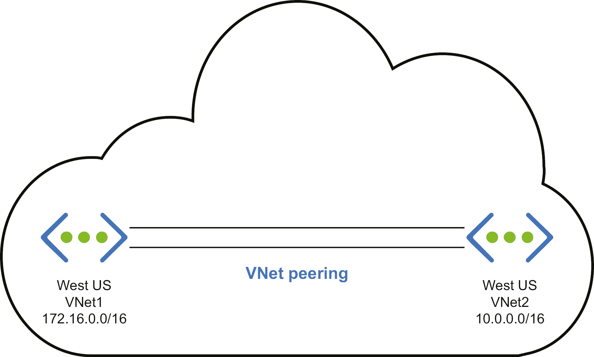

###### 图 3.1：相同订阅内资源的 VNet 对等连接

### 连接到另一个订阅内同一区域的资源

这个场景与前一个场景非常相似，唯一不同的是虚拟网络托管在两个不同的订阅中。这些订阅可以属于同一个租户，也可以来自多个租户。如果两个资源属于同一个订阅并且位于同一区域，则适用前一个场景。这个场景可以通过两种方式实现：使用网关或使用虚拟网络对等连接。

如果我们在这个场景中使用网关，我们需要在两端部署网关以促进通信。以下是使用网关连接两个不同订阅资源的架构表示：

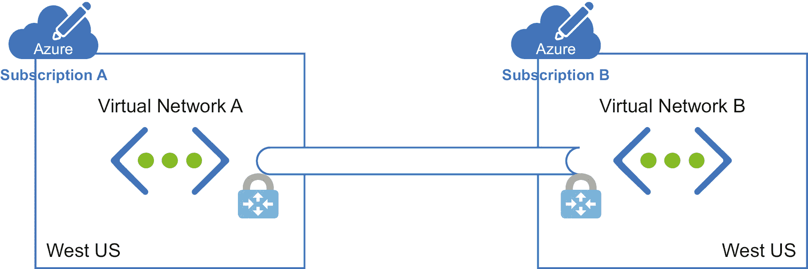

###### 图 3.2：使用网关进行不同订阅资源的 VNet 对等连接

然而，部署网关会产生一些费用。我们将讨论 VNet 对等连接，之后我们会比较这两种实现方式，看看哪种方式最适合我们的解决方案。

在使用对等连接时，我们不会部署任何网关。*图 3.3* 展示了如何进行对等连接：

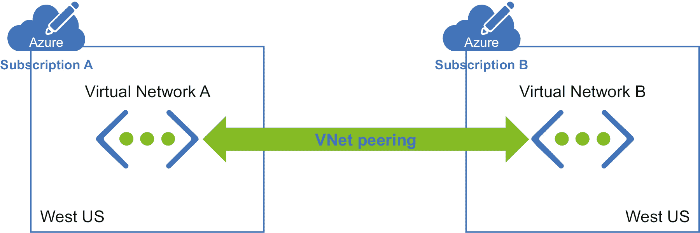

###### 图 3.3：跨订阅的 VNet 对等连接

VNet 对等连接提供了低延迟、高带宽的连接，如图所示，我们没有部署任何网关来实现通信。这对于数据复制或故障转移等场景非常有用。如前所述，对等连接使用 Microsoft 骨干网络，消除了对公共互联网的需求。

网关用于需要加密且带宽不是问题的场景，因为这将是一个带宽有限的连接。然而，这并不意味着带宽有约束。此方法适用于对延迟不太敏感的客户。

到目前为止，我们已经查看了跨订阅的同一区域资源。在下一节中，我们将探讨如何在两个不同区域的虚拟网络之间建立连接。

### 连接到另一个订阅中不同区域的资源

在这种场景中，我们有两个实现方式，一个使用网关，另一个使用全球 VNet 对等连接。

流量将通过公共网络传输，我们将在两端部署网关以便建立加密连接。*图 3.4* 说明了实现方法：

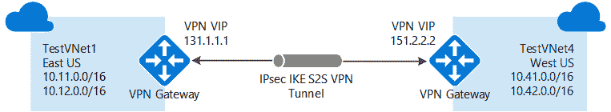

###### 图 3.4：使用不同订阅连接不同区域的资源

我们将采用类似的方式使用全球 VNet 对等连接。*图 3.5* 显示了如何使用全球 VNet 对等连接：

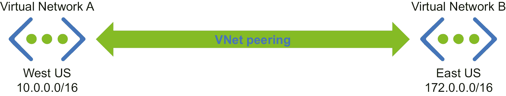

###### 图 3.5：使用全球 VNet 对等连接连接不同区域的资源

选择网关或对等连接的考虑因素已在之前讨论过，这些考虑因素在本场景中同样适用。到目前为止，我们已经讨论了跨区域和订阅连接虚拟网络；但我们还没有讨论如何将本地数据中心连接到云。接下来的部分将讨论实现这一目标的方法。

### 连接到本地数据中心

虚拟网络可以连接到本地数据中心，从而使 Azure 和本地数据中心成为一个单一的广域网（WAN）。需要在网络的两侧部署网关和 VPN。为此，有三种不同的技术可供选择。

**站点到站点 VPN**

当 Azure 网络和本地数据中心连接以形成一个广域网（WAN），且两个网络中的任何资源都可以访问网络中的任何其他资源，无论它们是部署在 Azure 还是本地数据中心时，应使用此方法。为了安全起见，需要在两端的网络上部署 VPN 网关。此外，Azure 网关应部署在与本地数据中心连接的虚拟网络的子网中。本地网关必须分配公共 IP 地址，以便 Azure 通过公共网络连接到它们：

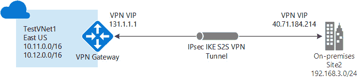

###### 图 3.6：站点到站点 VPN 架构

**点对站点 VPN**

这类似于站点到站点的 VPN 连接，但有一个单一的服务器或计算机连接到本地数据中心。当需要从远程位置安全地连接到 Azure 且只有少数用户或客户端时，应使用此方式。此外，在这种情况下，无需在本地侧配置公共 IP 和网关：

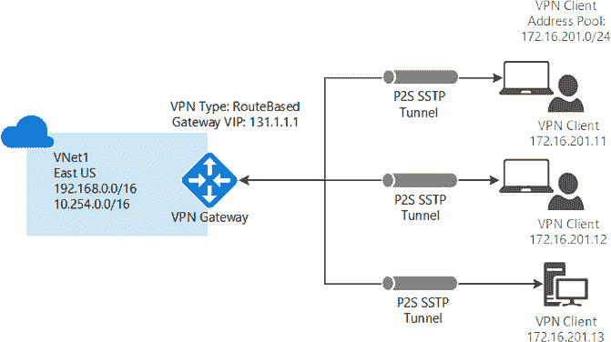

###### 图 3.7：点对站点 VPN 架构

**ExpressRoute**

无论是站点到站点（site-to-site）还是点对站点（point-to-site）VPN，均使用公共互联网工作。它们通过 VPN 和证书技术对网络流量进行加密。然而，一些应用程序希望使用混合技术进行部署——一部分组件部署在 Azure，另一部分部署在本地数据中心——同时又不希望使用公共互联网连接 Azure 和本地数据中心。对于这些需求，Azure ExpressRoute 是最佳解决方案，尽管它比另外两种连接方式成本更高。它也是最安全和可靠的提供商，速度更快，延迟更低，因为流量不会经过公共互联网。Azure ExpressRoute 可以通过连接提供商通过专用私有连接将本地网络扩展到 Azure。如果你的解决方案是网络密集型的，例如事务性企业应用程序（如 SAP），强烈建议使用 ExpressRoute。

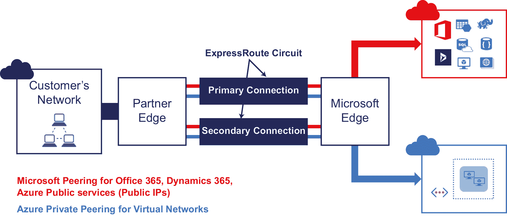

###### 图 3.8：ExpressRoute 网络架构

*图 3.9* 显示了三种混合网络类型：

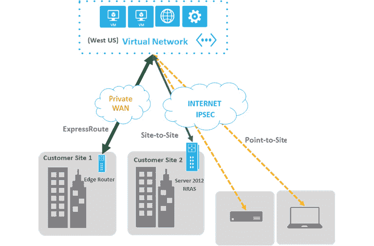

###### 图 3.9：不同类型的混合网络

从安全性和隔离的角度来看，虚拟网络为每个逻辑组件创建单独的子网并进行独立部署是一种良好的实践。

我们在 Azure 部署的所有资源都需要某种方式的网络支持，因此在架构设计 Azure 解决方案时，需要深入理解网络知识。另一个关键要素是存储。在接下来的章节中，你将进一步了解存储。

## 存储

Azure 通过存储服务提供了一个持久、高可用且可扩展的存储解决方案。

存储用于持久化数据，以满足长期需求。Azure 存储可以通过互联网为几乎所有编程语言提供服务。

### 存储类别

存储有两类存储账户：

+   一种标准存储性能层，允许你存储表格、队列、文件、Blob 和 Azure 虚拟机磁盘。

+   一种支持 Azure 虚拟机磁盘的高级存储性能层，写作时，Premium 存储比标准通用存储提供更高的性能和 IOPS。Premium 存储当前作为虚拟机的数据磁盘，使用 SSD 作为支持。

根据存储的数据类型，存储可以分为不同的类型。让我们来看一下存储类型，并深入了解它们。

### 存储类型

Azure 提供四种常见的存储服务：

+   **Azure Blob 存储：** 这种存储类型最适合非结构化数据，如文档、图片和其他类型的文件。Blob 存储可以分为热存储、冷存储和归档存储。热存储适用于需要非常频繁访问的数据。冷存储适用于访问频率低于热存储的数据，并且数据的存储时间为 30 天。最后，归档存储适用于归档目的，访问频率非常低。

+   **Azure 表格存储：** 这是一个 NoSQL 键值数据存储，适用于结构化数据。数据以实体的形式存储。

+   **Azure 队列存储：** 这提供了可靠的消息存储，用于存储大量消息。这些消息可以通过 HTTP 或 HTTPS 调用从任何地方访问。队列消息的最大大小为 64 KB。

+   **Azure 文件：** 这是基于 SMB 协议的共享存储，通常用于存储和共享文件。它也存储非结构化数据，但其主要区别在于它可以通过 SMB 协议进行共享。

+   **Azure 磁盘：** 这是 Azure 虚拟机的块级存储。

这五种存储类型满足不同的架构需求，涵盖几乎所有类型的数据存储设施。

### 存储功能

Azure 存储是弹性的，这意味着您可以存储从几兆字节到几拍字节的数据。您无需预先设置存储容量，它会自动增长和收缩。用户只需为实际使用的存储付费。以下是使用 Azure 存储的一些主要好处：

+   Azure 存储是安全的，只能通过 SSL 协议访问。此外，访问必须经过身份验证。

+   Azure 存储提供了生成帐户级**安全访问签名**（**SAS**）令牌的功能，存储客户端可以使用该令牌进行身份验证。还可以为 Blob、队列、表格和文件生成单独的服务级 SAS 令牌。

+   存储在 Azure 存储中的数据可以被加密，这被称为静态数据加密。

+   Azure 磁盘加密用于加密 IaaS 虚拟机中的操作系统和数据磁盘。**客户端加密**（**CSE**）和**存储服务加密**（**SSE**）都用于加密 Azure 存储中的数据。SSE 是 Azure 存储的一个设置，确保在数据写入存储时加密，并在存储引擎读取数据时解密。这确保了启用 SSE 不需要任何应用程序更改。在 CSE 中，客户端应用程序可以使用存储 SDK 在数据发送并写入 Azure 存储之前对数据进行加密。客户端应用程序可以在读取数据时再解密这些数据。这为数据传输中的数据和静态数据提供了安全性。CSE 依赖于 Azure 密钥保管库中的密钥。

+   Azure 存储具有高度的可用性和持久性。这意味着 Azure 始终保持多个 Azure 账户的副本。副本的地点和数量取决于复制配置。

Azure 提供以下复制设置和数据冗余选项：

+   **本地冗余存储**（**LRS**）：在主区域的单一物理位置内，将同步存储三份数据副本。从计费的角度来看，这是最便宜的选项；然而，它不推荐用于需要高可用性的解决方案。LRS 提供在给定一年内对象的 99.999999999% 的持久性级别。

+   **区域冗余存储**（**ZRS**）：在 LRS 的情况下，副本存储在同一物理位置。而在 ZRS 的情况下，数据将同步复制到主区域内的可用区。由于这些可用区都是主区域内的独立物理位置，ZRS 提供比 LRS 更好的持久性和更高的可用性。

+   **地理冗余存储（GRS）**：GRS 通过使用 LRS 在单一主区域内同步复制三份数据副本，从而提高高可用性。它还将数据复制到次要区域的单一物理位置。

+   **地理区域冗余存储**（**GZRS**）：这与 GRS 非常相似，但不同之处在于，GZRS 不是在主区域内单一物理位置复制数据，而是跨三个可用区同步复制数据。正如我们在 ZRS 的案例中所讨论的，由于可用区是主区域内独立的物理位置，GZRS 提供了更好的持久性，并且可以包含在高可用设计中。

+   **读取访问地理冗余存储**（**RA-GRS**）**和读取访问地理区域冗余存储**：通过 GZRS 或 GRS 复制到次要区域的数据无法进行读写。这些数据将在主数据中心发生故障转移时由次要区域使用。RA-GRS 和 RA-GZRS 遵循与 GRS 和 GZRS 相同的复制模式；唯一的区别是通过 RA-GRS 或 RA-GZRS 复制到次要区域的数据可以进行读取。

现在我们已经了解了 Azure 上各种存储和连接选项，接下来让我们了解该技术的底层架构。

### 存储帐户的架构考虑事项

存储帐户应在与其他应用程序组件相同的区域中进行配置。这意味着使用相同的数据中心网络骨干，避免产生任何网络费用。

Azure 存储服务具有与每个服务相关的容量、事务速率和带宽的可扩展性目标。一个通用的存储帐户允许存储 500 TB 的数据。如果需要存储超过 500 TB 的数据，则应创建多个存储帐户或使用高级存储。

通用存储的最大性能为 20,000 IOPS 或每秒 60 MB 的数据。如果需要更高的 IOPS 或每秒管理的数据量，则会受到限制。如果从性能角度来看，这些不足以满足应用程序的需求，那么应使用高级存储或多个存储帐户。对于一个帐户，访问表格的可扩展性限制为最多 20,000（每个 1 KB）条目。插入、更新、删除或扫描的实体数量将计入目标。单个队列每秒可处理大约 2,000 条消息（每条 1 KB），每个 `AddMessage`、`GetMessage` 和 `DeleteMessage` 的计数将被视为一条消息。如果这些值不足以满足你的应用程序需求，你应该将消息分布到多个队列中。

虚拟机的大小决定了可用数据磁盘的大小和容量。虽然较大的虚拟机具有更高 IOPS 容量的数据磁盘，但最大容量仍将限制为 20,000 IOPS 和每秒 60 MB。需要注意的是，这些是最大值，因此在最终确定存储架构时，应考虑较低的值。

截至目前，GRS 帐户在美国的入站带宽目标为 10 Gbps，如果启用了 RA-GRS/GRS，则为 20 Gbps。对于 LRS 帐户，限制相对较高，入站带宽为 20 Gbps，出站带宽为 30 Gbps。在美国以外，带宽目标较低：入站带宽为 10 Gbps，出站带宽为 5 Gbps。如果需要更高的带宽，可以联系 Azure 支持团队，他们将帮助你获取更多的选项。

存储帐户应启用使用 SAS 令牌进行身份验证。它们不应允许匿名访问。此外，对于 Blob 存储，应根据不同类型和类别的客户端创建不同的容器，并为每个容器生成独立的 SAS 令牌。这些 SAS 令牌应定期重新生成，以确保密钥不会被破解或猜测。你将会在*第八章，构建 Azure 上的安全应用程序*中了解更多关于 SAS 令牌和其他安全选项的内容。

通常，从 Blob 存储帐户获取的 Blob 应该进行缓存。我们可以通过将其最后修改属性与重新获取的最新 Blob 进行比较，来判断缓存是否过时。

存储帐户提供并发功能，以确保同一文件和数据不会被多个用户同时修改。它们提供以下功能：

+   **乐观并发**：这允许多个用户同时修改数据，但在写入时，它会检查文件或数据是否已经更改。如果有更改，它会提示用户重新获取数据并再次执行更新操作。这是表格的默认并发方式。

+   **悲观并发**：当一个应用尝试更新文件时，它会加锁，明确拒绝其他用户对文件的任何更新。这是通过 SMB 协议访问文件时的默认并发模式。

+   **最后写者获胜**：更新没有限制，最后一个用户会更新文件，而不管最初读取的内容是什么。这是队列、Blob 和文件（通过 REST 访问时）的默认并发模式。

到目前为止，你应该已经知道了不同的存储服务是什么，以及如何在你的解决方案中利用它们。在接下来的章节中，我们将讨论设计模式，并看看它们如何与架构设计相关。

## 云设计模式

设计模式是针对已知设计问题的成熟解决方案。它们是可重用的解决方案，可以应用于问题中。它们不是可以直接嵌入到解决方案中的可重用代码或设计，而是解决问题的文档化描述和指导。一个问题可能在不同的上下文中表现出来，设计模式可以帮助解决这些问题。Azure 提供了大量的服务，每个服务都提供特定的功能和能力。使用这些服务很简单，但将多个服务结合起来创建解决方案可能会有挑战。而且，为解决方案实现高可用性、超高可扩展性、可靠性、性能和安全性并非易事。

Azure 设计模式提供了可以根据具体问题定制的现成解决方案。它们帮助我们在 Azure 上构建高可用、可扩展、可靠、安全和以性能为中心的解决方案。尽管有许多模式，并且一些模式将在后续章节中详细讨论，但本章提到了其中的一些消息传递、性能和可扩展性模式。同时，还提供了这些模式的详细描述链接。这些设计模式本身值得一本完整的书来讨论。它们在这里被提及，旨在让你意识到它们的存在，并为进一步了解提供参考。

### 消息传递模式

消息传递模式有助于以松耦合的方式连接服务。这意味着服务之间从不直接通信。相反，服务会生成并将消息发送到一个代理（通常是队列），任何对该消息感兴趣的服务都可以取出并处理它。发送方和接收方服务之间没有直接通信。这种解耦不仅使服务和整个应用程序更可靠，还使其更强健和容错。接收方可以根据自己的速度接收和读取消息。

消息传递有助于创建异步模式。消息传递涉及从一个实体向另一个实体发送消息。这些消息由发送方创建并转发，存储在持久存储中，最后被接收方消费。

消息传递模式解决的主要架构问题如下：

+   **耐久性**：消息被存储在持久化存储中，应用程序可以在故障转移后读取已接收到的消息。

+   **可靠性**：消息通过持久化存储在磁盘上，确保不会丢失，从而实现可靠性。

+   **消息的可用性**：在恢复连接并在停机之前，消息可以供应用程序消费。

Azure 提供了服务总线队列和主题来实现应用程序内的消息传递模式。Azure 队列存储也可以用于相同的目的。

在选择 Azure 服务总线队列与队列存储时，需要考虑消息存储的时间、消息大小、延迟和成本等因素。Azure 服务总线支持 256 KB 的消息，而队列存储支持 64 KB 的消息。Azure 服务总线可以存储消息无限期，而队列存储则只能存储 7 天。服务总线队列的成本和延迟较高。

根据应用程序的需求和要求，在决定最佳队列之前，应考虑上述因素。在下一部分中，我们将讨论不同类型的消息传递模式。

**竞争消费者模式**

如果应用程序没有实现异步读取消息的逻辑，单一消费者将以同步方式处理消息。竞争消费者模式则提供了一种解决方案，其中多个消费者准备好处理传入的消息，并竞争处理每一条消息。这种方式可以实现高可用性和可扩展的解决方案。此模式可扩展，因为通过多个消费者，可以在较短的时间内处理更多的消息。它具有高可用性，因为即使部分消费者崩溃，仍然会有至少一个消费者可以处理消息。

当每条消息独立于其他消息时，应使用此模式。消息本身包含了消费者完成任务所需的所有信息。如果消息之间存在依赖关系，则不应使用此模式。消费者应能够在隔离的情况下完成任务。此外，如果服务需求波动，则此模式适用。可以根据需求增加或删除消费者。

实现竞争消费者模式需要一个消息队列。在这里，来自多个来源的模式通过一个单一的队列传递，队列的另一端连接着多个消费者。这些消费者在读取每条消息后应删除该消息，以防止它们被重新处理：

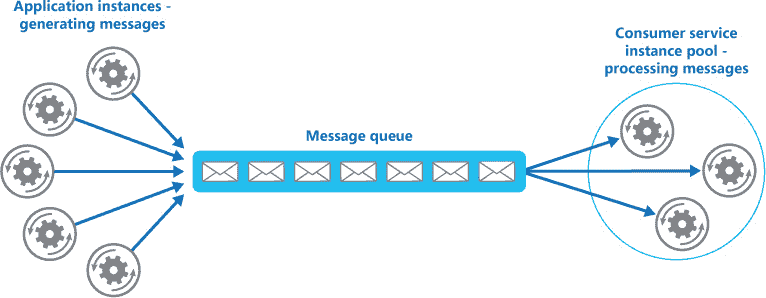

###### 图 3.10：竞争消费者模式

请参阅 Microsoft 文档 [`docs.microsoft.com/azure/architecture/patterns/competing-consumers`](https://docs.microsoft.com/azure/architecture/patterns/competing-consumers) 以了解有关此模式的更多信息。

**优先队列模式**

经常需要优先处理某些消息。这个模式对那些为消费者提供不同**服务级别协议**（**SLA**）的应用程序非常重要，这些应用程序根据不同的计划和订阅提供服务。

队列遵循先进先出（FIFO）模式。消息按顺序处理。然而，在优先级队列模式的帮助下，可以根据消息的优先级加速某些消息的处理。实现这一点有多种方法。如果队列允许你分配优先级并根据优先级重新排序消息，那么即使是单一队列也足以实现这一模式：

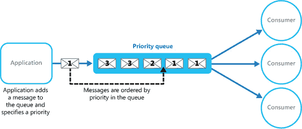

###### 图 3.11：单一优先级队列模式

然而，如果队列无法重新排序消息，可以为不同的优先级创建独立的队列，并且每个队列可以有与之关联的独立消费者：

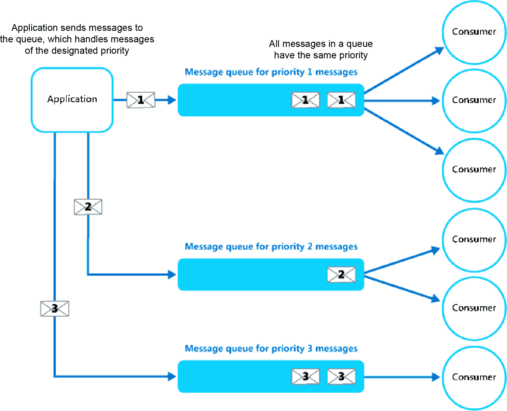

###### 图 3.12：使用独立消息队列处理不同优先级

事实上，该模式可以使用竞争消费者模式（Competing Consumer pattern）来加速使用多个消费者处理每个队列中的消息。有关优先级队列模式的更多信息，请参阅微软文档 [`docs.microsoft.com/azure/architecture/patterns/priority-queue`](https://docs.microsoft.com/azure/architecture/patterns/priority-queue)。

**基于队列的负载均衡模式**

基于队列的负载均衡模式减少了需求峰值对任务和服务的可用性和警觉性的影响。在任务和服务之间，队列将充当缓冲区。它可以在发生突发负载时被调用，避免服务中断或超时。该模式有助于解决性能和可靠性问题。为了防止服务超载，我们将引入一个队列，直到服务取出消息。服务将以一致的方式从队列中取出并处理消息。

*图 3.13* 展示了基于队列的负载均衡模式的工作原理：

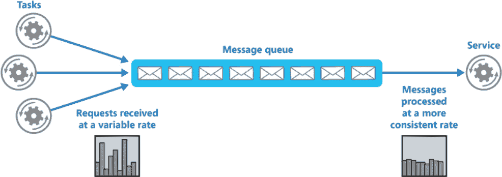

###### 图 3.13：基于队列的负载均衡模式

尽管该模式有助于处理意外需求的激增，但在构建低延迟服务时，它不是最佳选择。说到延迟，它是一个性能指标，下一节我们将专注于性能和可扩展性模式。

### 性能和可扩展性模式

性能和可扩展性是相辅相成的。性能是衡量系统在给定时间间隔内如何快速、有效地执行操作的指标。另一方面，可扩展性是指系统在不影响性能的情况下处理意外负载的能力，或者系统如何利用现有资源迅速扩展。在本节中，将介绍与性能和可扩展性相关的几个设计模式。

**命令与查询职责分离**（**CQRS**）**模式**

CQRS 不是一个特定于 Azure 的模式，而是一个可以应用于任何应用程序的一般模式。它可以提高应用程序的整体性能和响应能力。

CQRS 是一种将读取数据（查询）操作与更新数据（命令）操作隔离开来的模式，通过使用不同的接口。这意味着用于查询和更新的数据模型是不同的。然后，这些模型可以像*图 3.14*中所示那样隔离，尽管这不是强制要求。

当在更新和检索数据时，涉及大量复杂的业务规则时，应该使用该模式。此外，这种模式在某些情况下非常适用，其中一个开发团队可以专注于写模型中复杂的领域模型，另一个团队可以专注于读模型和用户界面。当读写比例失衡时，使用该模式也是明智的。数据读取的性能应该与数据写入的性能分开调优。

CQRS 不仅可以提高应用程序的性能，还能帮助多团队的设计和实现。由于其使用不同模型的特性，如果你使用模型和脚手架生成工具，CQRS 就不太适用：

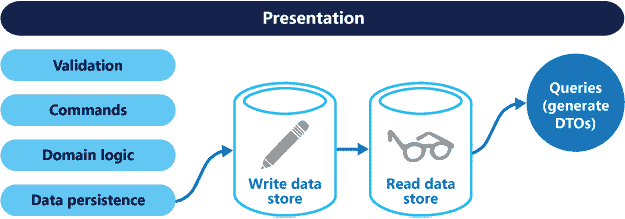

###### 图 3.14：CQRS 模式

请参考 Microsoft 文档 [`docs.microsoft.com/azure/architecture/patterns/cqrs`](https://docs.microsoft.com/azure/architecture/patterns/cqrs)，了解有关该模式的更多信息。

**事件溯源模式**

由于大多数应用程序都涉及数据操作，并且用户也在操作数据，因此应用程序的经典方法是维护和更新数据的当前状态。从源头读取数据，修改数据，然后用修改后的值更新当前状态是典型的数据处理方法。然而，这种方法有一些局限性：

+   由于更新操作直接作用于数据存储，这会降低整体的性能和响应能力。

+   如果有多个用户在操作和更新数据，可能会出现冲突，并且一些相关的更新可能会失败。

解决方案是实现事件溯源（Event Sourcing）模式，其中变更将被记录在仅追加的存储中。应用程序代码会将一系列事件推送到事件存储中，并在那里持久化。这些持久化的事件充当当前数据状态的系统记录。消费者将在事件发布后收到通知，并在需要时处理这些事件。

事件溯源模式如*图 3.15*所示：

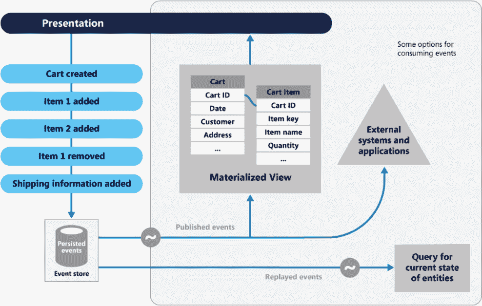

###### 图 3.15：事件溯源模式

更多关于此模式的信息，请访问 [`docs.microsoft.com/azure/architecture/patterns/event-sourcing`](https://docs.microsoft.com/azure/architecture/patterns/event-sourcing)。

**限流模式**

有些应用程序对性能和可扩展性有非常严格的 SLA（服务级别协议）要求，无论用户数量如何。在这种情况下，实施限流模式非常重要，因为它可以限制允许执行的请求数量。在所有情况下，无法准确预测应用程序的负载。当应用程序的负载激增时，限流通过控制资源消耗来减少服务器和服务的压力。Azure 基础设施是该模式的一个很好的示例。

当满足 SLA 是应用程序的优先事项时，应该使用此模式，以防止某些用户消耗超过分配的资源，优化需求的峰值和波动，并在成本方面优化资源消耗。这些是为部署在云上的应用程序设计的有效场景。

在应用程序中处理限流可以采用多种策略。限流策略可以在超过阈值后拒绝新的请求，或者可以让用户知道请求已在队列中，并且在请求数量减少后会有机会执行。

*图 3.16*展示了在多租户系统中实施限流模式的情况，其中每个租户都有固定的资源使用限制。一旦超过此限制，任何额外的资源需求都会受到限制，从而为其他租户保留足够的资源：

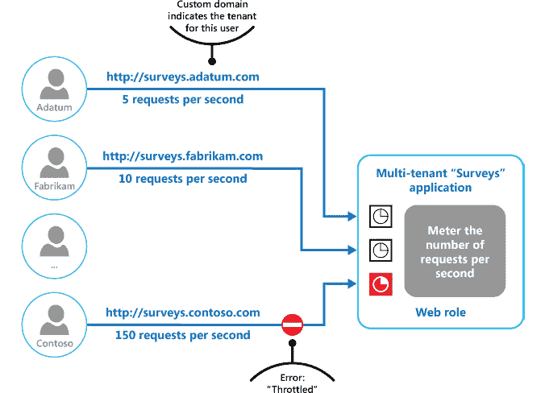

###### 图 3.16：限流模式

阅读更多关于此模式的信息，请访问 [`docs.microsoft.com/azure/architecture/patterns/throttling`](https://docs.microsoft.com/azure/architecture/patterns/throttling)。

**重试模式**

重试模式是一个非常重要的模式，使应用程序和服务能够更好地应对瞬时故障。假设你正在尝试连接并使用一个服务，但该服务由于某种原因无法使用。如果该服务很快就会恢复，继续尝试建立连接是有意义的。这将使应用程序更加健壮、容错和稳定。在 Azure 中，大多数组件都运行在互联网环境下，而互联网连接可能会间歇性地产生瞬时故障。由于这些故障可以在几秒钟内修复，因此应用程序不应该崩溃。应用程序应该设计为在失败的情况下反复尝试使用服务，并在成功或最终确定存在需要时间修复的故障时停止重试。

当应用程序与远程服务交互或访问远程资源时可能会遇到瞬时故障时，应该实现此模式。这些故障预计会是短暂的，重复以前失败的请求可能在后续尝试中成功。

重试模式可以根据错误的性质和应用程序的需求采用不同的重试策略。

+   **重试固定次数**：这意味着应用程序在确定发生失败并引发异常之前，会尝试与服务通信固定的次数。例如，它会重试三次连接到另一个服务。如果在这三次尝试内成功连接，整个操作将成功；否则，它将引发异常。

+   **基于计划的重试**：这意味着应用程序将在固定的秒数或分钟数内反复尝试与服务通信，并在重试前等待固定的秒数或分钟数。例如，应用程序将在 60 秒内每三秒尝试连接一次服务。如果在此期间成功连接，整个操作将成功；否则，它将引发异常。

+   **滑动和延迟重试**：这意味着应用程序将根据计划反复尝试与服务通信，并在随后的尝试中逐渐增加延迟。例如，在总计 60 秒内，第一次重试发生在一秒后，第二次重试发生在上一次重试后两秒，第三次重试发生在上一次重试后四秒，以此类推。这减少了重试的总次数。

*图 3.17* 演示了重试模式。第一次请求得到 HTTP 500 响应，第二次重试仍然得到 HTTP 500 响应，最后请求成功并得到 HTTP 200 响应：

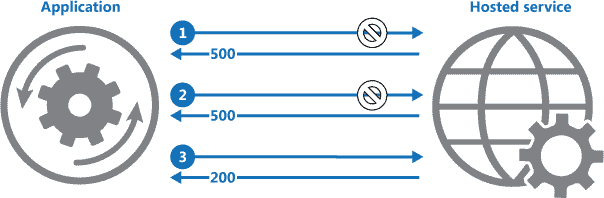

###### 图 3.17：重试模式

请参考此 Microsoft 文档[`docs.microsoft.com/azure/architecture/patterns/retry`](https://docs.microsoft.com/azure/architecture/patterns/retry)，了解更多关于此模式的信息。

**电路断路器模式**

这是一个非常有用的模式。再想象一下，当您尝试连接并使用某个服务，而该服务因某种原因不可用。如果该服务在短期内无法恢复，那么继续重试连接毫无意义。此外，在重试时占用其他资源会浪费大量本可以在其他地方使用的资源。

电路断路器模式有助于消除资源浪费。它可以防止应用程序重复尝试连接和使用一个不可用的服务。它还帮助应用程序检测服务是否已恢复运行，并允许应用程序连接到它。

要实现电路断路器模式，所有对服务的请求都应通过一个充当原始服务代理的服务。这个代理服务的目的是维护一个状态机，并充当原始服务的网关。它维持三种状态。根据应用程序的需求，可能会包含更多的状态。

实现此模式所需的最小状态如下：

+   **打开**：这表示服务不可用，应用程序会立即显示为异常，而不是允许它重试或等待超时。当服务恢复后，状态会过渡到半打开。

+   **关闭**：该状态表示服务正常，应用程序可以继续连接到它。通常，会显示一个计数器，显示在过渡到打开状态之前的失败次数。

+   **半打开**：在某个时刻，当服务恢复运行时，该状态允许有限数量的请求通过。这个状态是一个试金石，用来检查通过的请求是否成功。如果请求成功，状态将从半打开过渡到关闭。此状态还可以实现一个计数器，允许一定数量的请求成功后，再过渡到关闭状态。

图 3.18 中展示了三种状态及其过渡：

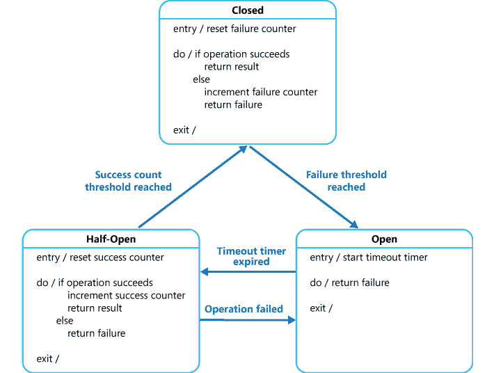

###### 图 3.18：电路断路器模式

在 Microsoft 文档中阅读更多关于此模式的信息：[`docs.microsoft.com/azure/architecture/patterns/circuit-breaker`](https://docs.microsoft.com/azure/architecture/patterns/circuit-breaker)。

在本节中，我们讨论了可以用于构建可靠、可扩展且安全的云应用程序的设计模式。然而，还有其他模式，您可以在[`docs.microsoft.com/azure/architecture/patterns`](https://docs.microsoft.com/azure/architecture/patterns)上进行探索。

## 总结

Azure 提供了众多服务，大多数可以组合起来创建真正的解决方案。本章解释了 Azure 提供的三个最重要的服务——区域、存储和网络。它们构成了部署在任何云上的大多数解决方案的基础。本章详细介绍了这些服务及其配置和预配如何影响设计决策。

本章详细介绍了存储和网络的重要考虑因素。网络和存储都提供了许多选择，根据您的需求选择合适的配置至关重要。

最后，介绍了与消息相关的一些重要设计模式，例如竞争消费者、优先队列和负载平衡。还详细说明了诸如 CQRS 和节流等模式，并讨论了其他模式，如重试和断路器。在部署解决方案时，我们将把这些模式作为基准。

在下一章中，我们将讨论如何自动化我们打算设计的解决方案。随着自动化技术的发展，每个组织都希望消除逐一创建资源的开销，这是非常具有挑战性的。由于自动化是解决这一问题的方法，下一章将更深入地探讨这个话题。
