# 4\. 在 Azure 上自动化架构

每个组织都希望减少手动工作和错误，自动化在提高可预测性、标准化和一致性方面发挥着重要作用，不仅在产品开发中，也在运营中。自动化一直是几乎每个**首席信息官**（**CIO**）和数字化官员的关注重点，以确保他们的系统具备高可用性、可扩展性、可靠性，并能够满足客户的需求。

随着云计算的到来，自动化变得更加突出，因为新的资源可以随时配置，无需采购硬件资源。因此，云公司希望在几乎所有活动中都能实现自动化，以减少滥用、错误、治理、维护和管理。

本章将评估 Azure 自动化作为一项主要的自动化服务，以及它与其他看似相似的服务相比的差异化能力。本章将涵盖以下内容：

+   Azure 自动化生态

+   Azure 自动化服务

+   Azure 自动化服务的资源

+   编写 Azure 自动化运行书

+   Webhooks

+   混合工作者

让我们开始使用 Azure 自动化，这是一个用于过程自动化的云服务。

## 自动化

自动化是组织内部 IT 资源的配置、操作、管理和拆除的必要手段。*图 4.1* 给你展示了每个用例的详细信息：


###### 图 4.1：自动化用例

在云计算到来之前，IT 资源主要是在本地，并且这些活动通常依赖手动过程。然而，随着云的采用增加，自动化得到了更多的关注。主要原因是，云技术的敏捷性和灵活性为实时配置、拆除和管理这些资源提供了机会，而这一过程比以前要快得多。随着这种灵活性和敏捷性而来的，是对云计算要求更加可预测和一致，因为组织现在能够轻松创建资源。

微软提供了一个非常棒的 IT 自动化工具——System Center Orchestrator。它是一个适用于本地和云环境的自动化工具，但它是一个产品，而不是服务。它需要许可并部署在服务器上，然后可以执行运行书，以对云和本地环境进行更改。

微软意识到，需要一种自动化解决方案，可以作为服务提供给客户，而不是作为产品购买和部署。于是，Azure 自动化应运而生。

## Azure 自动化

Azure 提供了一项名为 **Azure 自动化** 的服务，这是一项用于自动化流程、活动和任务的核心服务，不仅适用于 Azure，还可以应用于本地环境。通过 Azure 自动化，组织可以自动化与处理、拆除、运营及管理其跨云、IT 环境、平台和语言资源相关的流程和任务。在*图 4.2*中，我们可以看到 Azure 自动化的一些功能：


###### 图 4.2：Azure 自动化功能

## Azure 自动化架构

Azure 自动化由多个组件组成，这些组件之间完全解耦。大部分集成发生在数据存储级别，且没有组件直接进行通信。

当在 Azure 上创建一个自动化账户时，它由一个管理服务进行管理。该管理服务是所有 Azure 自动化活动的单一联络点。来自门户的所有请求，包括保存、发布、创建运行簿，执行、停止、暂停、启动和测试，都会发送到自动化管理服务，服务将请求数据写入其数据存储。它还会在数据存储中创建一个作业记录，并根据运行簿工作者的状态，将作业分配给一个工作者。

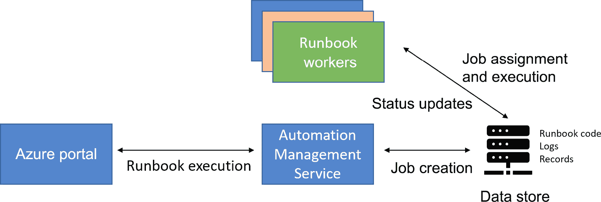

###### 图 4.3：Azure 自动化架构

工作者不断轮询数据库，查找分配给它的新作业。一旦找到作业分配，它会提取作业信息并使用其执行引擎开始执行该作业。结果会写回数据库，由管理服务读取，并显示在 Azure 门户上。

本章后面我们将要了解的混合工作者也是运行簿工作者，尽管它们未在*图 4.3*中显示。

开始使用 Azure 自动化的第一步是创建一个新账户。账户创建后，所有其他组件都将在该账户内创建。

账户作为主要的顶级资源，可以通过 Azure 资源组及其自身的控制平面进行管理。

账户应当在某个区域内创建，且该账户中的所有自动化操作都将在该区域的服务器上执行。

选择区域时要谨慎，最好选择靠近其他与自动化账户集成或管理的 Azure 资源的区域，以减少区域之间的网络流量和延迟。

自动化帐户还支持几个**Run As**帐户，可以从自动化帐户中创建。由于这些 Run As 帐户类似于服务帐户，我们通常创建它们以执行操作。尽管我们通常称其为 Run As 帐户，但实际上有两种类型的 Run As 帐户：一种叫做 Azure 经典 Run As 帐户，另一种则简称为 Run As 帐户，二者都用于连接到 Azure 订阅。Azure 经典 Run As 帐户用于通过**Azure 服务管理**API 连接到 Azure，而 Run As 帐户则用于通过**Azure 资源管理**（**ARM**）API 连接到 Azure。

这两个帐户使用证书进行身份验证以连接到 Azure。这些帐户可以在创建自动化帐户时创建，也可以选择稍后从 Azure 门户创建。

建议在稍后创建这些 Run As 帐户，而不是在创建自动化帐户时同时创建，因为如果在设置自动化帐户时创建，它们会在后台使用默认配置生成证书和服务主体。如果需要更多的控制和自定义配置（例如使用现有的证书或服务主体），则应在创建自动化帐户后再创建 Run As 帐户。

一旦创建了自动化帐户，它会提供一个仪表板，通过该仪表板可以启用多个自动化场景。

使用自动化帐户可以启用的一些重要场景包括：

+   流程自动化

+   配置管理

+   更新管理

自动化的目标是编写可重用且通用的脚本，以便它们可以在多个场景中重复使用。例如，一个自动化脚本应该足够通用，可以在任何资源组、任何订阅和管理组中启动和停止任何虚拟机（VM）。如果将虚拟机服务器信息与资源组、订阅和管理组的名称硬编码到脚本中，就会创建多个类似的脚本，并且任何一个脚本的更改都无可避免地会导致所有脚本的更改。为了避免这种情况，最好通过使用脚本参数和变量来创建一个通用的脚本，并确保执行者为这些脚本提供相应的值。

让我们更仔细地看一下前面提到的每个场景。

### 流程自动化

流程自动化指的是开发反映现实世界流程的脚本。流程自动化包括多个活动，每个活动执行一个独立的任务。所有这些活动共同组成一个完整的流程。活动的执行可能取决于前一个活动是否成功执行。

任何流程自动化都需要其执行所依赖的基础设施满足一些要求。以下是其中的一些要求：

+   创建工作流的能力

+   能够执行长时间运行的任务

+   能够在工作流未完成时保存执行状态，这也被称为检查点和水合作用

+   能够从最后保存的状态恢复，而不是从头开始

接下来我们要探讨的场景是配置管理。

### 配置管理

配置管理是指在整个生命周期内管理系统配置的过程。Azure 自动化状态配置是 Azure 的配置管理服务，允许用户为云节点和本地数据中心编写、管理和编译 PowerShell DSC 配置。

Azure 自动化状态配置让我们能够管理 Azure 虚拟机、Azure 经典虚拟机以及本地的物理机器或虚拟机（Windows/Linux），并且还支持其他云服务提供商的虚拟机。

Azure 自动化状态配置的最大优势之一是它提供了可扩展性。我们可以通过单一的中央管理界面管理成千上万台机器。我们可以轻松地将配置分配给机器，并验证它们是否符合预期的配置。

另一个优势是 Azure 自动化可以作为存储 **所需状态配置**（**DSC**）配置的仓库，且在需要时可以使用这些配置。

在下一节中，我们将讨论更新管理。

### 更新管理

正如你已经知道的那样，更新管理是客户在 IaaS 环境中负责管理更新和补丁的任务。Azure 自动化的更新管理功能可以用来自动化或管理 Azure 虚拟机的更新和补丁。有多种方式可以启用 Azure 虚拟机的更新管理：

+   从你的自动化帐户

+   通过浏览 Azure 门户

+   通过运行簿

+   从 Azure 虚拟机

从 Azure 虚拟机启用是最简单的方法。然而，如果你有大量虚拟机并且需要启用更新管理，那么你必须考虑一个可扩展的解决方案，例如运行簿或从自动化帐户进行操作。

既然你已经了解了相关场景，我们现在来探讨与 Azure 自动化相关的概念。

## 与 Azure 自动化相关的概念

现在你已经知道 Azure 自动化需要一个帐户，称为 Azure 自动化帐户。在我们深入探讨之前，让我们先了解与 Azure 自动化相关的概念。理解这些术语的含义非常重要，因为我们将在本章中贯穿使用这些术语。我们从运行簿开始。

### 运行簿

Azure 自动化运行簿是表示过程自动化中单个步骤或完整过程自动化的一组脚本语句。可以从父级运行簿调用其他运行簿，并且这些运行簿可以用多种脚本语言编写。支持编写运行簿的语言如下：

+   PowerShell

+   Python 2（截至目前）

+   PowerShell 工作流

+   图形化 PowerShell

+   图形化 PowerShell 工作流

创建自动化账户非常简单，可以通过 Azure 门户完成。在**所有服务**面板中，你可以找到**自动化账户**，或者你可以在 Azure 门户中搜索它。如前所述，在创建过程中你将有机会创建一个 Run As 账户。*图 4.4*展示了创建自动化账户所需的输入信息：

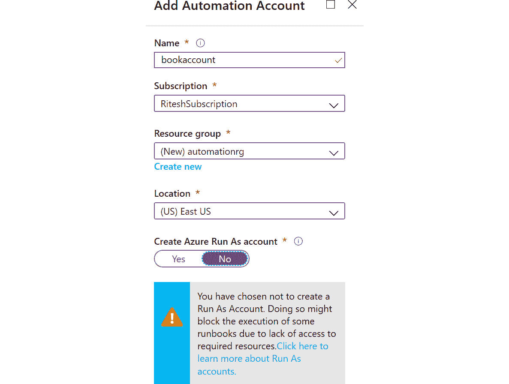

###### 图 4.4：创建自动化账户

### Run As 账户

默认情况下，Azure 自动化账户无法访问任何包含在 Azure 订阅中的资源，包括托管它们的订阅。账户需要访问 Azure 订阅及其资源，才能进行管理。Run As 账户是一种为订阅及其中的资源提供访问权限的方式。

这是一个可选练习。每个经典和资源管理器类型的订阅最多只能有一个 Run As 账户；然而，一个自动化账户可能需要连接到多个订阅。在这种情况下，建议为每个订阅创建共享资源并在 runbook 中使用。

创建自动化账户后，导航到门户中的**Run As 账户**视图，你将看到可以创建两种类型的账户。在*图 4.5*中，你可以看到**Azure Run As 账户**和**Azure Classic Run As 账户**的创建选项可用：


###### 图 4.5：Azure Run As 账户选项

这些 Run As 账户可以通过 Azure 门户、PowerShell 和 CLI 创建。有关通过 PowerShell 创建这些账户的信息，请访问[`docs.microsoft.com/azure/automation/manage-runas-account`](https://docs.microsoft.com/azure/automation/manage-runas-account)。

对于 ARM Run As 账户，该脚本会创建一个新的 Azure AD 服务主体和一个新的证书，并为新创建的服务主体提供在订阅上的贡献者 RBAC 权限。

### 作业

提交工作请求与执行工作请求并没有直接的关联，这是因为 Azure 自动化采用了松耦合架构。它们之间的联系是间接的，通过数据存储来实现。当自动化接收到执行 runbook 的请求时，它会在数据库中创建一条包含所有相关信息的新记录。Azure 中还运行着一个名为混合 Runbook Worker 的服务，它分布在多个服务器上，负责查找任何新添加到数据库中的记录，并执行 runbook。一旦它发现新记录，它会锁定该记录，以防其他服务读取，然后执行 runbook。

### 资源

Azure 自动化资产指的是可以在运行书之间共享并使用的工件。它们显示在*图 4.6*中：


###### 图 4.6：Azure 自动化中的共享工件

### 凭证

凭证指的是用于连接到需要身份验证的其他集成服务的机密信息，如用户名/密码组合。这些凭证可以在运行书中使用 `Get-AutomationPSCredential` PowerShell cmdlet 和其相关名称：

```
$myCredential = Get-AutomationPSCredential -Name 'MyCredential'
```

Python 语法要求我们导入 `automationassets` 模块，并使用 `get_automation_credential` 函数及其相关凭证名称：

```
import automationassets
cred = automationassets.get_automation_credential("credtest")
```

### 证书

证书指的是可以从证书颁发机构购买或自签的 X.509 证书。证书用于 Azure 自动化中的身份验证。每个证书都有一对密钥，称为私钥/公钥。私钥用于在 Azure 自动化中创建证书资产，公钥应在目标服务中可用。通过使用私钥，自动化账户可以创建数字签名，并将其附加到请求中，然后将请求发送到目标服务。目标服务可以使用已存在的公钥从数字签名中提取详细信息（哈希），从而确认请求发送者的身份。

证书资产存储 Azure 自动化中的证书信息和密钥。这些证书可以在运行书中直接使用，并且也被连接的资产所使用。下一节展示了如何在连接资产中使用证书。Azure 服务主体连接资产使用证书指纹来识别它想要使用的证书，而其他类型的连接则使用证书资产的名称来访问证书。

可以通过提供名称和上传证书来创建证书资产。可以上传公钥证书（`.cer` 文件）以及私钥证书（`.pfx` 文件）。证书的私钥部分也有一个密码，在访问证书之前需要使用该密码。

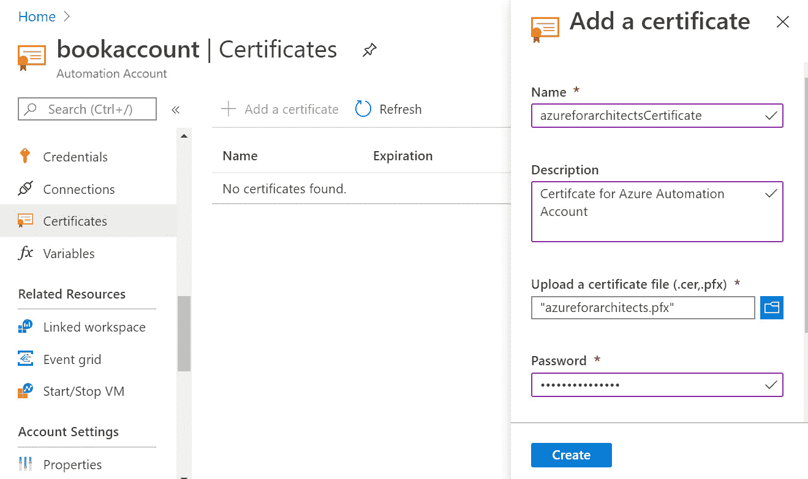

###### 图 4.7：向 Azure 自动化添加证书

创建证书需要提供名称和描述，上传证书，提供密码（对于 `.pfx` 文件），并告知用户证书是否可以导出。

在创建此证书资产之前，必须有一个可用的证书。可以从证书颁发机构购买证书，也可以生成证书。生成的证书称为自签名证书。在生产环境等重要环境中，使用证书颁发机构的证书始终是最佳实践。用于开发目的时，使用自签名证书是可以的。

使用 PowerShell 生成自签名证书，请使用以下命令：

```
$cert = New-SelfSignedCertificate -CertStoreLocation "Cert:\CurrentUser\my" -KeySpec KeyExchange -Subject "cn=azureforarchitects"
```

这将在当前用户的个人文件夹中的证书存储中创建一个新证书。由于该证书还需要上传到 Azure 自动化证书资产，因此应将其导出到本地文件系统，如*图 4.8*所示：

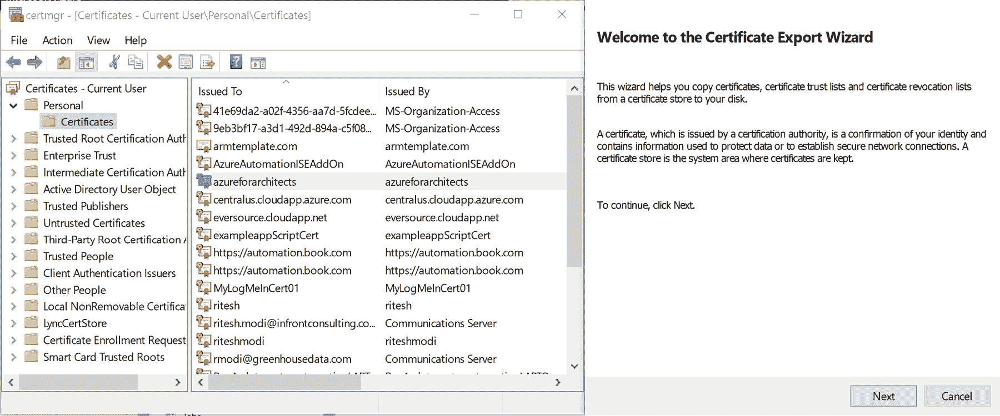

###### 图 4.8：导出证书

导出证书时，还应导出私钥，因此应该选择**是，导出私钥**。

选择**个人信息交换**选项，其他值应保持默认。

提供密码和文件名`C:\azureforarchitects.pfx`，并且导出应该成功。

连接到 Azure 有多种方式。然而，最安全的方式是通过证书进行。服务主体是在 Azure 上使用证书创建的，可以使用证书进行身份验证。证书的私钥由用户持有，公钥部分由 Azure 持有。在下一节中，将使用本节中创建的证书来创建服务主体。

### 使用证书凭证创建服务主体

可以通过 Azure 门户、Azure CLI 或 Azure PowerShell 创建服务主体。使用 Azure PowerShell 创建服务主体的脚本在本节中提供。

登录 Azure 后，将上一节中创建的证书转换为 base64 编码。创建一个新的服务主体`azureforarchitects`，并将证书凭证与新创建的服务主体关联。最后，为新服务主体提供基于角色的访问控制权限，以便访问该订阅：

```
Login-AzAccount
$certKey = [system.Convert]::ToBase64String($cert.GetRawCertData())
$sp =  New-AzADServicePrincipal -DisplayName "azureforarchitects"
New-AzADSpCredential -ObjectId $sp.Id -CertValue $certKey -StartDate $cert.NotBefore -EndDate $cert.NotAfter
New-AzRoleAssignment -RoleDefinitionName contributor -ServicePrincipalName $sp.ApplicationId 
Get-AzADServicePrincipal -ObjectId $sp.Id
$cert.Thumbprint
Get-AzSubscription  
```

要创建连接资产，可以使用`Get-AzADServicePrincipal` cmdlet 获取应用程序 ID，结果如*图 4.9*所示：


###### 图 4.9：检查服务主体

可以使用证书引用和`SubscriptionId`来获取证书指纹，`SubscriptionId`可以通过`Get-AzSubscription` cmdlet 获取。

### 连接

连接资产用于创建与外部服务的连接信息。在这方面，Azure 也被视为外部服务。连接资产包含成功连接到服务所需的所有必要信息。Azure 自动化提供了三种默认的连接类型：

+   Azure

+   Azure 经典证书

+   Azure 服务主体

使用 Azure 服务主体连接到 Azure 资源管理器资源，并使用 Azure 经典证书连接到 Azure 经典资源是一种良好的实践。需要注意的是，Azure 自动化不提供任何使用用户名和密码等凭据连接到 Azure 的连接类型。

Azure 和 Azure 经典证书本质上是相似的。它们都帮助我们连接到基于 Azure 服务管理 API 的资源。实际上，Azure 自动化在创建经典 Run As 帐户时，会创建一个 Azure 经典证书连接。

Azure 服务主体由 Run As 帐户内部使用，用于连接到基于 Azure 资源管理器的资源。

图 4.10 中显示了一个新的类型为 **AzureServicePrincipal** 的连接资产。它需要：

+   连接的名称。提供名称是必需的。

+   连接的描述。这个值是可选的。

+   在本章中，选择适当的 `AzureServicePrincipal` 用于创建连接资产。

+   `clientid` 是在创建服务主体时生成的应用程序 ID。下一部分将展示如何使用 Azure PowerShell 创建服务主体的过程。提供应用程序 ID 是必需的。

+   `Get-AzSubscription` cmdlet。提供租户标识符是必需的。

+   **CertificateThumbprint** 是证书标识符。该证书应已通过证书资产上传到 Azure 自动化。提供证书指纹是必需的。

+   **SubscriptionId** 是订阅的标识符。提供订阅 ID 是必需的。

您可以使用自动化帐户中的**连接**面板添加新连接，如*图 4.10*所示：

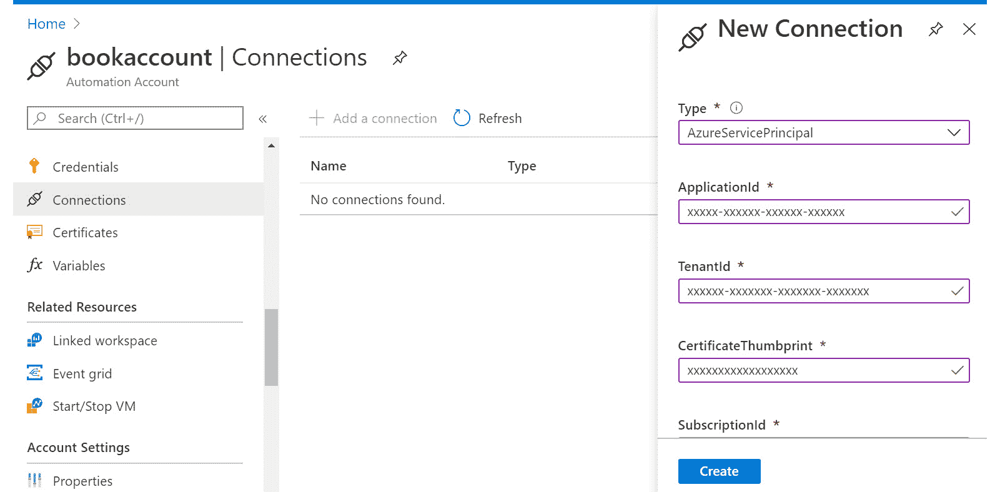

###### 图 4.10：将新连接添加到自动化帐户

## Runbook 编写和执行

Azure 自动化允许创建称为 Runbook 的自动化脚本。可以通过 Azure 门户或 PowerShell ISE 创建多个 Runbook。它们也可以从**Runbook 库**导入。可以搜索特定功能，整个代码将在 Runbook 中显示。

Runbook 可以接受参数值，就像普通的 PowerShell 脚本一样。下一个示例接受一个名为 `connectionName` 的参数，类型为 `string`。在执行该 Runbook 时，必须为此参数提供值：

```
param(
    [parameter(mandatory=$true)]
    [string] $connectionName
)
$connection = Get-AutomationConnection  -name $connectionName  
$subscriptionid = $connection.subscriptionid
$tenantid = $connection.tenantid
$applicationid = $connection.applicationid
$cretThumbprint = $connection.CertificateThumbprint
Login-AzureRMAccount -CertificateThumbprint $cretThumbprint -ApplicationId $applicationid -ServicePrincipal -Tenant $tenantid  
Get-AzureRMVM
```

runbook 使用 `Get-AutomationConnection` cmdlet 引用共享连接资产。资产的名称包含在参数值中。引用连接资产后，连接引用中的值会填充到 `$connection` 变量中，并随后分配给多个其他变量。

`Login-AzureRMAccount` cmdlet 用于与 Azure 进行身份验证，并提供从连接对象中获得的值。它使用本章前面创建的服务主体进行身份验证。

最后，runbook 调用 `Get-AzureRMVm` cmdlet 来列出订阅中的所有虚拟机。

默认情况下，Azure Automation 仍提供用于与 Azure 一起工作的 `AzureRM` 模块。默认情况下，它不会安装 `Az` 模块。稍后我们将在 Azure Automation 帐户中手动安装 `Az` 模块，并在 runbook 中使用 cmdlet。

### 父级和子级 runbook

Runbook 具有生命周期，从编写到执行。这些生命周期可以分为编写状态和执行状态。

编写生命周期如*图 4.11*所示。

当新创建一个 runbook 时，它的状态为 **New**，当进行多次编辑和保存后，状态变为 **In edit**，最终，当它被发布时，状态更改为 **Published**。已发布的 runbook 也可以进行编辑，在这种情况下，状态会返回为 **In edit**。


###### 图 4.11：编写生命周期

接下来将描述执行生命周期。

生命周期从 runbook 执行请求开始。runbook 可以通过多种方式执行：

+   通过 Azure 门户手动启动

+   通过将父级 runbook 作为子级 runbook 使用

+   通过 webhook 方式

无论 runbook 是如何启动的，生命周期都是相同的。执行 runbook 的请求会被自动化引擎接收，自动化引擎会创建一个作业并将其分配给 runbook worker。目前，runbook 的状态为 **Queued**。

有多个 runbook worker，选定的 worker 会接收作业请求并将状态更改为 **Starting**。此时，如果脚本中存在任何脚本编写或解析问题，状态会变为 **Failed**，执行将被中止。

一旦 runbook 执行被 worker 启动，状态将变为 **Running**。runbook 在运行时可能会有多种不同的状态。

如果执行过程中没有未处理的终止异常，runbook 的状态会变为 **Completed**。

运行中的 runbook 可以由用户手动停止，状态将变为 **Stopped**。

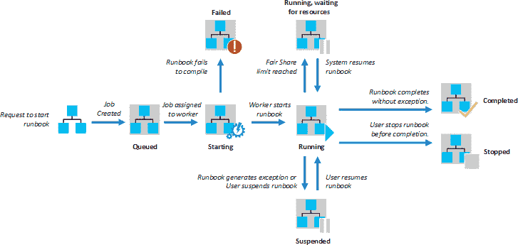

###### 图 4.12：runbook 的执行生命周期

用户还可以暂停和恢复 runbook 的执行。

### 创建一个运行簿

可以通过访问 Azure 门户中的左侧导航面板中的**运行簿**菜单项来创建运行簿。一个运行簿具有名称和类型。类型决定了用于创建运行簿的脚本语言。我们已经讨论了可能的语言，本章中将主要使用 PowerShell 进行所有示例。

创建 PowerShell 运行簿与创建 PowerShell 脚本完全相同。它可以声明并接受多个参数—这些参数可以具有数据类型等属性，其中一些是必填的（就像任何 PowerShell 参数属性一样）。它可以调用已加载和声明的 PowerShell cmdlet 模块，也可以调用函数并返回输出。

运行簿还可以调用另一个运行簿。它可以在原始流程和上下文内调用子运行簿，或者在单独的流程和上下文中调用。

内联调用运行簿类似于调用 PowerShell 脚本。下一个示例使用内联方法调用子运行簿：

```
.\ConnectAzure.ps1 -connectionName "azureforarchitectsconnection"
Get-AzSqlServer
```

在前面的代码中，我们看到`ConnectAzure`运行簿如何接受一个名为`connectionName`的参数，并向其提供适当的值。此运行簿在通过服务主体进行身份验证后创建与 Azure 的连接。请查看调用子运行簿的语法，它与调用一般 PowerShell 脚本并传递参数非常相似。

下一行代码`Get-AzVm`从 Azure 获取相关信息并列出虚拟机的详细信息。你会注意到，尽管身份验证是在子运行簿中进行的，但`Get-AzVm` cmdlet 成功执行，并列出了订阅中的所有虚拟机，因为子运行簿在与父运行簿相同的作业中执行，它们共享上下文。

另外，可以使用 Azure 自动化提供的`Start-AzurermAutomationRunbook` cmdlet 来调用子运行簿。此 cmdlet 接受自动化帐户的名称、资源组名称以及运行簿的名称和参数，详情如下：

```
$params = @{"connectionName"="azureforarchitectsconnection"}
$job = Start-AzurermAutomationRunbook '
    –AutomationAccountName 'bookaccount' '
    –Name 'ConnectAzure' '
    -ResourceGroupName 'automationrg' -parameters $params
if($job -ne $null) {
    Start-Sleep -s 100
    $job = Get-AzureAutomationJob -Id $job.Id -AutomationAccountName 'bookaccount'
    if ($job.Status -match "Completed") {
        $jobout = Get-AzureAutomationJobOutput '
                                    -Id $job.Id '
                                    -AutomationAccountName 'bookaccount' '
                                    -Stream Output
                    if ($jobout) {Write-Output $jobout.Text}
    }
}
```

使用这种方法会创建一个新的作业，它与父作业不同，并且在不同的上下文中运行。

## 使用 Az 模块

到目前为止，所有示例都使用了`AzureRM`模块。之前展示的运行簿将重新编写，改为使用`Az`模块中的 cmdlet。

如前所述，`Az`模块默认并未安装。可以通过 Azure 自动化中的**模块库**菜单项来安装它们。

在库中搜索`Az`，结果会显示与之相关的多个模块。如果选择导入并安装`Az`模块，系统会抛出一个错误，表示其依赖的模块未安装，并且需要先安装这些模块才能安装当前模块。该模块可以在`Az`上找到，如*图 4.13*所示：


###### 图 4.13：在模块库面板中查找 Az 模块

不选择`Az`模块，而是选择**Az.Accounts**并按照向导导入该模块，如*图 4.14*所示：

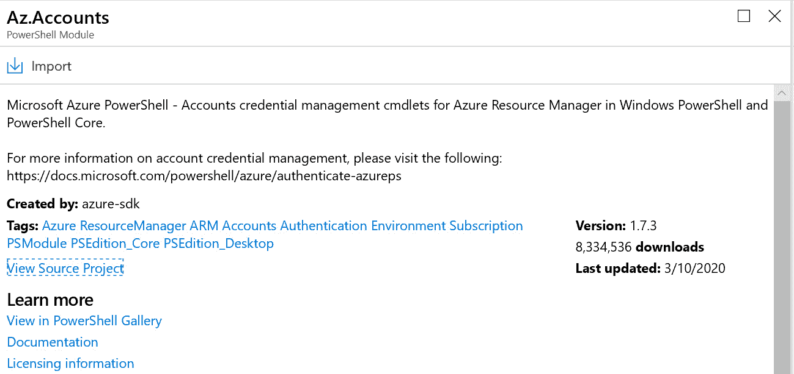

###### 图 4.14：导入 Az.Accounts 模块

安装`Az.Accounts`后，可以导入`Az.Resources`模块。与 Azure 虚拟机相关的 cmdlet 位于`Az.Compute`模块中，可以使用与导入`Az.Accounts`相同的方法导入它。

导入这些模块后，runbook 可以使用这些模块提供的 cmdlet。之前展示的`ConnectAzure` runbook 已被修改为使用`Az`模块：

```
param(
    [parameter(mandatory=$true)]
    [string] $connectionName
)
$connection = Get-AutomationConnection  -name $connectionName  
$subscriptionid = $connection.subscriptionid
$tenantid = $connection.tenantid
$applicationid = $connection.applicationid
$cretThumbprint = $connection.CertificateThumbprint
Login-AzAccount -CertificateThumbprint $cretThumbprint -ApplicationId $applicationid -ServicePrincipal -Tenant $tenantid  -SubscriptionId  $subscriptionid 
Get-AzVm
```

代码的最后两行很重要。它们使用的是`Az` cmdlet，而不是`AzureRM` cmdlet。

执行此 runbook 将得到类似以下的结果：

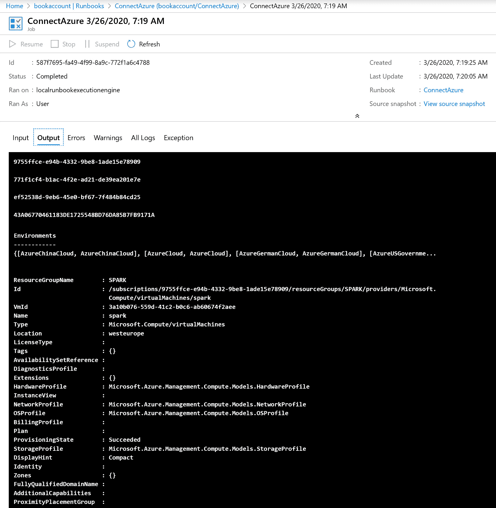

###### 图 4.15：Az.Accounts 模块成功导入

在下一节中，我们将使用 Webhook。

## Webhooks

Webhook 在 REST 端点和 JSON 数据负载出现后变得流行。Webhook 是任何应用程序可扩展性中的一个重要概念和架构决策。Webhook 是应用程序中特殊区域中的占位符，用户可以用包含自定义逻辑的端点 URL 填充这些占位符。应用程序将调用端点 URL，自动传递必要的参数，并执行其中的登录操作。

Azure Automation 的 runbook 可以通过 Azure 门户手动调用。它们也可以使用 PowerShell cmdlet 和 Azure CLI 调用。还有多种语言的 SDK 可用于调用 runbook。

Webhook 是调用 runbook 的最强大方式之一。需要注意的是，包含主要逻辑的 runbook 不应直接暴露为 Webhook。它们应该通过父级 runbook 来调用，且父级 runbook 应暴露为 Webhook。父级 runbook 应确保在调用子级 runbook 之前进行适当的检查。

创建 Webhook 的第一步是正常编写 runbook，如之前所做的。编写完 runbook 后，它将作为 Webhook 暴露。

创建了一个新的基于 PowerShell 的 runbook，名为`exposedrunbook`。此 runbook 接受一个名为`$WebhookData`的单一参数，类型为对象。它应命名为`verbatim`。该对象由 Azure Automation 运行时创建，并传递给 runbook。Azure Automation 运行时在获取 HTTP 请求头值和正文内容后构建该对象，并填充此对象的`RequestHeader`和`RequestBody`属性：

```
param(
    [parameter(mandatory=$true)]
    [object] $WebhookData
)
$webhookname = $WebhookData.WebhookName
$headers = $WebhookData.RequestHeader
$body = $WebhookData.RequestBody
Write-output "webhook header data"
Write-Output $webhookname
Write-output $headers.message
Write-output $headers.subject
 $connectionname = (ConvertFrom-Json -InputObject $body)
./connectAzure.ps1 -connectionName  $connectionname[0].name
```

该对象的三个重要属性是`WebhookName`、`RequestHeader`和`RequestBody`。这些属性的值将被检索，并由 runbook 发送到输出流。

头部和正文内容可以是用户在触发 webhook 时提供的任何内容。这些值会填充到相应的属性中，并在 runbook 中使用。在前面的示例中，调用者设置了两个头部，分别是 `message` 和 `status` 头部。调用者还将提供要作为正文内容一部分使用的共享连接名称。

在创建 runbook 后，必须先发布它，才能创建 webhook。发布 runbook 后，点击顶部的 **Webhook** 菜单，开始为该 runbook 创建一个新的 webhook，如 *图 4.16* 所示：

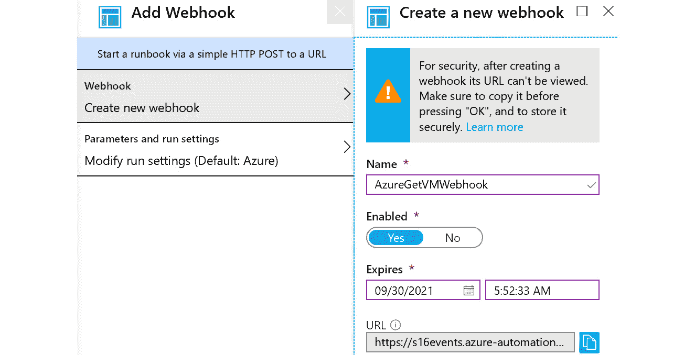

###### 图 4.16：创建 webhook

应为 webhook 提供一个名称。此值可以在 runbook 中通过 `WebhookData` 参数与 `WebhookName` 属性名称进行访问。

webhook 可以处于 `enabled` 或 `disabled` 状态，并且可以在指定的日期和时间过期。它还会生成一个唯一的 URL，适用于此 webhook 和 runbook。此 URL 应提供给任何希望触发 webhook 的人。

### 触发 webhook

Webhook 是通过使用 `POST` 方法的 HTTP 请求来触发的。当触发 webhook 时，HTTP 请求会传递到 Azure Automation，以启动一个 runbook。它会创建 `WebHookData` 对象，填充传入的 HTTP 头部和正文数据，并创建一个任务，由 runbook 工作者处理。此调用使用在前一步中生成的 webhook URL。

webhook 可以通过 Postman 或任何能够使用 `POST` 方法调用 `REST` 端点的代码来触发。在下一个示例中，将使用 PowerShell 来触发 webhook：

```
$uri = "https://s16events.azure-automation.net/webhooks?token=rp0w93L60fAPYZQ4vryxl%2baN%2bS1Hz4F3qVdUaKUDzgM%3d"
$connection  = @(
            @{  name="azureforarchitectsconnection"}

        )
$body = ConvertTo-Json -InputObject $ connection  
$header = @{ subject="VMS specific to Ritesh";message="Get all virtual machine details"}

$response = Invoke-WebRequest -Method Post -Uri $uri -Body $body -Headers $header
$jobid = (ConvertFrom-Json ($response.Content)).jobids[0] 
```

PowerShell 代码声明了 webhook 的 URL，并以 JSON 格式构建正文，`name` 设置为 `azureforarchitectsconnection`，并设置了两个头部名称-值对：`subject` 和 `message`。头部和正文数据都可以通过 `WebhookData` 参数在 runbook 中获取。

`invoke-webrequest` cmdlet 使用 `POST` 方法在前面提到的端点上发起请求，提供头部和正文。

请求是异步的，返回的是任务标识符，而不是实际的 runbook 输出，并且该标识符也可以在响应内容中获取。任务显示在 *图 4.17* 中：

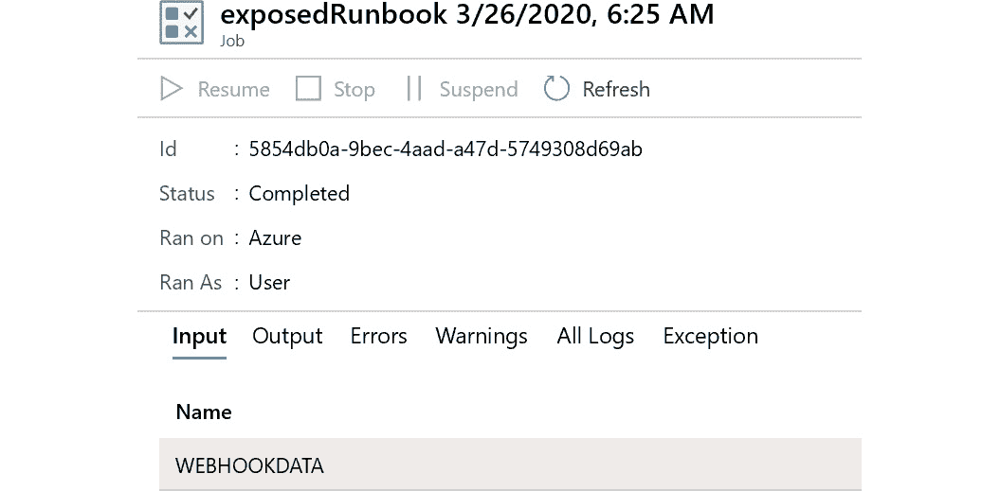

###### 图 4.17：检查任务

点击 `WEBHOOKDATA` 会显示通过 HTTP 请求到达 runbook 自动化服务的值：


###### 图 4.18：验证输出

点击输出菜单会显示订阅中虚拟机和 SQL 服务器的列表。

Azure 自动化中的下一个重要概念是 Azure Monitor 和混合工作者，接下来的章节将详细解释这些概念。

### 从 Azure Monitor 中调用运行书

Azure 自动化运行书可以作为响应来调用，响应 Azure 中生成的警报。Azure Monitor 是一个集中式服务，用于管理订阅中资源和资源组的日志与指标。您可以使用 Azure Monitor 创建新的警报规则和定义，触发时可以执行 Azure 自动化运行书。它们可以以默认形式调用 Azure 自动化运行书，或者调用一个 Webhook，Webhook 进一步执行其关联的运行书。Azure Monitor 与运行书的调用能力之间的集成为自动修正环境、上下调计算资源或在无需人工干预的情况下进行纠正操作提供了无数的自动化机会。

可以在单个资源和资源级别创建和配置 Azure 警报，但最佳实践是将警报定义集中管理，便于维护和管理。

让我们一步步讲解如何将运行书与警报关联，并在警报触发时调用运行书。

第一步是创建一个新的警报，如*图 4.19*所示：

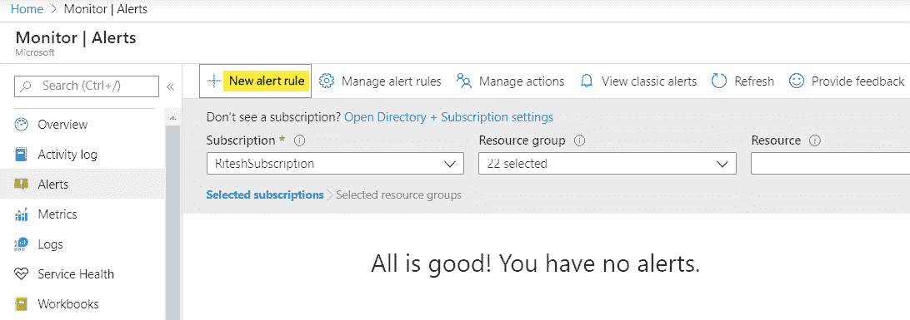

###### 图 4.19：创建警报规则

选择一个应被监控并评估以生成警报的资源。已经从列表中选择了一个资源组，它会自动启用资源组内的所有资源。也可以从资源组中移除资源选择：


###### 图 4.20：选择警报的范围

配置应评估的条件和规则。在选择**活动日志**作为**信号类型**后，选择**关闭虚拟机**信号名称：

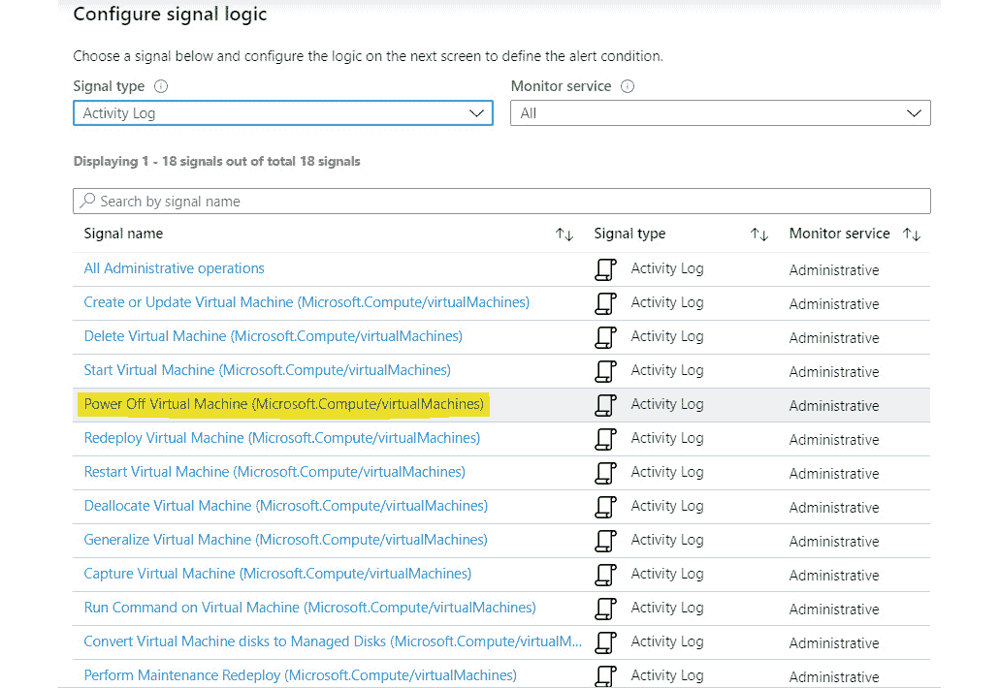

###### 图 4.21：选择信号类型

结果窗口将允许您为`成功`配置`严重`级别：


###### 图 4.22：设置警报逻辑

在确定警报条件之后，最重要的配置就是配置通过调用运行书响应警报。我们可以使用**操作组**来配置警报的响应。它提供了多种选项，可以调用 Azure 函数、Webhook 或 Azure 自动化运行书，还可以发送电子邮件和短信。

创建一个操作组，提供名称、简短名称、托管订阅、资源组，并将**操作类型**设置为`自动化运行书`：


###### 图 4.23 配置操作组

选择一个自动化运行簿将打开另一个面板，用于选择适当的 Azure 自动化帐户和运行簿。系统提供了多个预设的运行簿，本文中使用了其中一个：

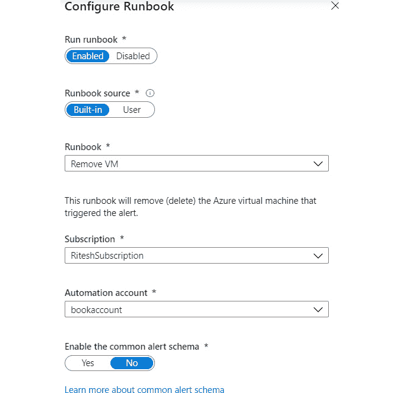

###### 图 4.24 创建运行簿

最后，提供一个名称和托管资源组来创建一个新的警报。

如果虚拟机被手动取消分配，警报条件将被满足，并会触发警报：

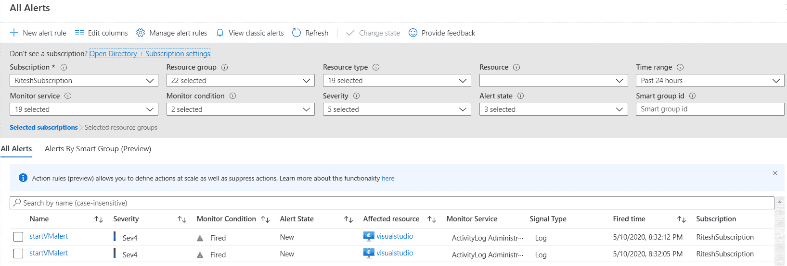

###### 图 4.25 测试警报

如果你在几秒钟后检查虚拟机的详细信息，你应该会看到虚拟机正在被删除：

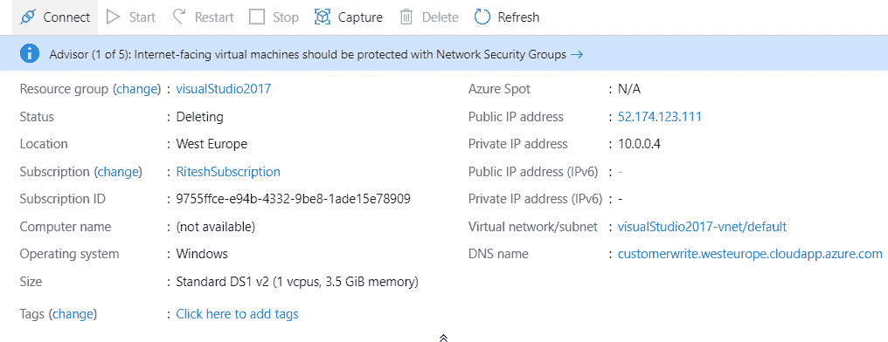

###### 图 4.26 验证结果

### 混合工作者

到目前为止，所有的运行簿执行主要是在 Azure 提供的基础设施上进行的。运行簿工作者是由 Azure 提供的计算资源，在其中部署了适当的模块和资源。任何运行簿的执行都发生在这些计算资源上。然而，用户也可以提供自己的计算资源，并在用户提供的计算资源上执行运行簿，而不是在默认的 Azure 计算资源上。

这有多个优点。首先，整个执行过程及其日志由用户拥有，Azure 无法查看这些内容。其次，用户提供的计算资源可以位于任何云环境中，甚至可以是本地部署的。

**添加混合工作者涉及多个步骤**

+   首先，必须在用户提供的计算资源上安装一个代理。微软提供了一个脚本，可以自动下载并配置代理。此脚本可以从[`www.powershellgallery.com/packages/New-OnPremiseHybridWorker/1.6`](https://www.powershellgallery.com/packages/New-OnPremiseHybridWorker/1.6)获取。

    脚本也可以通过 PowerShell ISE 以管理员身份在应成为混合工作者一部分的服务器上执行，使用以下命令：

    ```
    Install-Script -Name New-OnPremiseHybridWorker -verbose
    ```

+   脚本安装后，可以与相关的 Azure 自动化帐户详细信息一起执行。同时还为混合工作者提供了一个名称。如果该名称不存在，将会创建；如果已存在，服务器将被添加到现有的混合工作者中。一个混合工作者中可以包含多个服务器，同时也可以有多个混合工作者：

    ```
    New-OnPremiseHybridWorker.ps1 -AutomationAccountName bookaccount -AAResourceGroupName automationrg '
    -HybridGroupName "localrunbookexecutionengine" '
    -SubscriptionID xxxxxxxx-xxxx-xxxx-xxxx-xxxxxxxxxxxx  
    ```

+   执行完成后，返回到门户将显示混合工作者的条目，如*图 4.27*所示：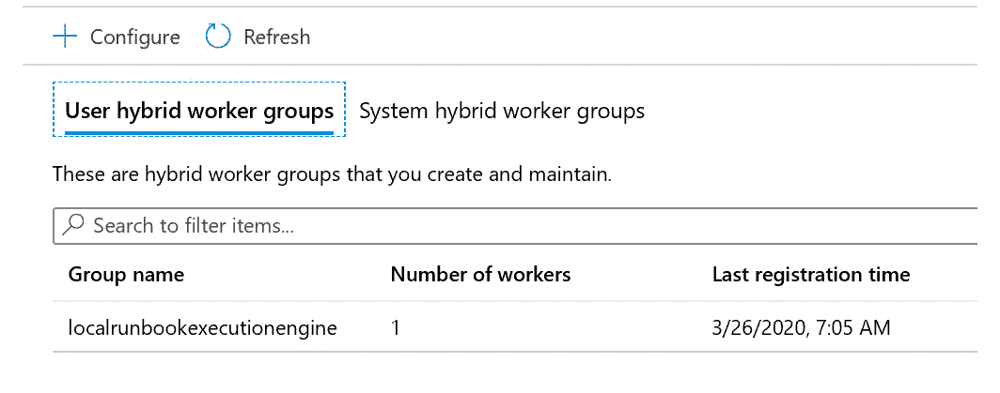

###### 图 4.27：检查用户的混合工作者组

+   如果此时执行一个依赖于`Az`模块和已上传到证书资产的自定义证书的 Azure 运行簿，它将由于找不到`Az`模块和证书而失败，并显示相关错误：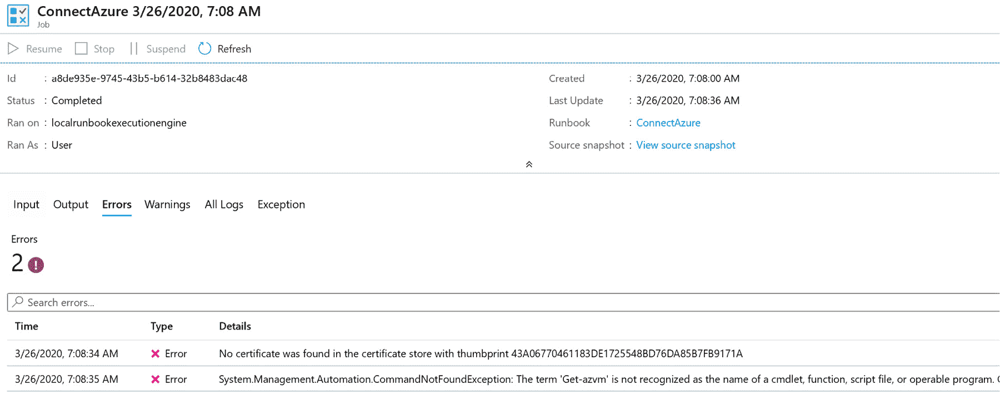

###### 图 4.28：检查错误

+   使用以下命令在服务器上安装`Az`模块：

    ```
    Install-module -name Az -AllowClobber -verbose
    ```

    此外，在此服务器上还必须有`.pfx`证书。之前导出的证书应复制到服务器并手动安装。

+   安装`Az`模块和证书后，在 Hybrid Worker 上重新执行运行簿，如*图 4.29*所示，应该会显示订阅中的虚拟机列表：

###### 图 4.29：在 Hybrid Worker 上设置运行簿

当我们讨论不同的场景时，我们谈到了配置管理。在下一节中，我们将更详细地讨论 Azure Automation 中的配置管理。

## Azure Automation 状态配置

Azure Automation 为每个 Azure Automation 帐户提供**期望状态配置**（**DSC**）拉取服务器。拉取服务器可以保存配置脚本，供跨云和本地的服务器拉取。这意味着 Azure Automation 可以用于配置世界上任何地方托管的服务器。

DSC 需要在这些服务器上安装本地代理，也叫**本地配置管理器**（**LCM**）。它应该与 Azure Automation DSC 拉取服务器进行配置，以便能够下载所需的配置并自动配置服务器。

自动配置可以设置为周期性（默认情况下为半小时），如果代理发现服务器配置与 DSC 脚本中提供的配置有任何偏差，它将自动纠正并使服务器恢复到期望的状态。

在本节中，我们将配置一个托管在 Azure 上的服务器，无论该服务器是位于云端还是本地，整个过程将保持一致。

第一步是创建 DSC 配置。这里展示了一个示例配置，复杂的配置可以类似地编写：

```
configuration ensureiis {
import-dscresource -modulename psdesiredstateconfiguration

node localhost {        
        WindowsFeature iis {
            Name = "web-server"
            Ensure = "Present"

        }
    }
}
```

配置非常简单。它导入了`PSDesiredStateConfiguration`基础 DSC 模块，并声明了一个单节点配置。此配置不与任何特定节点关联，可以用于配置任何服务器。该配置旨在配置 IIS web 服务器，并确保其在应用到的任何服务器上存在。

此配置尚未在 Azure 自动化 DSC 拉取服务器上可用，因此第一步是将配置导入到拉取服务器。这可以通过使用自动化帐户的 `Import-AzAutomationDscConfiguration` cmdlet 来完成，如下所示：

```
Import-AzAutomationDscConfiguration -SourcePath "C:\Ritesh\ensureiis.ps1" -AutomationAccountName bookaccount -ResourceGroupName automationrg -Force -Published
```

这里有几个重要事项需要注意。配置名称应与文件名匹配，且只能包含字母数字字符和下划线。一个好的命名约定是使用动词/名词组合。cmdlet 需要配置文件的路径和 Azure 自动化帐户的详细信息来导入配置脚本。

此时，配置在门户中可见：

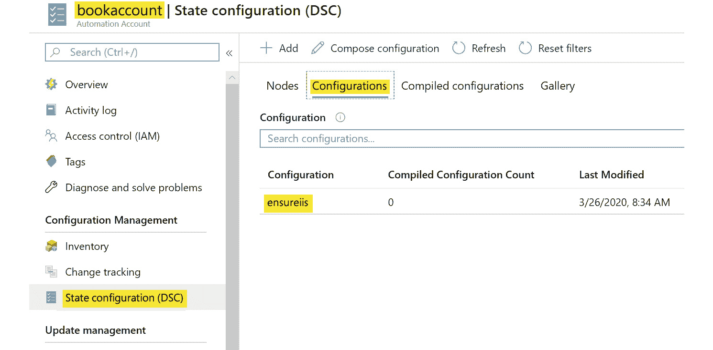

###### 图 4.30：添加配置

一旦配置脚本被导入，它会使用 `Start-AzAutomationDscCompilationJob` cmdlet 在 DSC 拉取服务器上进行编译并存储，如下所示：

```
Start-AzAutomationDscCompilationJob -ConfigurationName 'ensureiis' -ResourceGroupName 'automationrg' -AutomationAccountName 'bookaccount'
```

配置的名称应与最近上传的名称匹配，且已编译的配置现在应该可以在 **已编译配置** 标签页中找到，如 *图 4.31* 所示：

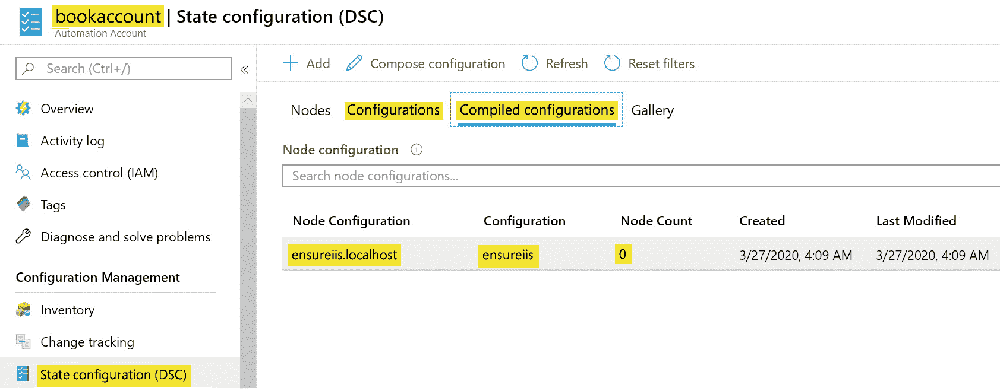

###### 图 4.31：列出已编译的配置

需要注意的是，`0` 表示存在一个名为 `ensureiss.localhost` 的节点配置，但尚未分配给任何节点。下一步是将配置分配给该节点。

到目前为止，我们在 DSC 拉取服务器上有了一个已编译的 DSC 配置，但没有节点可以管理。下一步是将虚拟机加入并与 DSC 拉取服务器关联。这是通过使用 `Register-AzAutomationDscNode` cmdlet 完成的：

```
Register-AzAutomationDscNode -ResourceGroupName 'automationrg' -AutomationAccountName 'bookaccount' -AzureVMLocation "west Europe" -AzureVMResourceGroup 'spark' -AzureVMName 'spark' -ConfigurationModeFrequencyMins 30 -ConfigurationMode 'ApplyAndAutoCorrect' 
```

此 cmdlet 需要提供虚拟机和 Azure 自动化帐户的资源组名称。它还配置了虚拟机本地配置管理器的配置模式和`configurationModeFrequencyMins`属性。此配置每 30 分钟检查并自动修正任何偏离已应用配置的情况。

如果未指定 `VMresourcegroup`，cmdlet 会尝试在与 Azure 自动化帐户相同的资源组中查找虚拟机，如果未提供虚拟机位置值，它会尝试在 Azure 自动化区域中查找虚拟机。最好为它们提供值。请注意，此命令仅适用于 Azure 虚拟机，因为它明确要求提供 `AzureVMname`。对于其他云和本地服务器，请使用 `Get-AzAutomationDscOnboardingMetaconfig` cmdlet。

现在，新的节点配置条目也可以在门户中找到，如 *图 4.32* 所示：

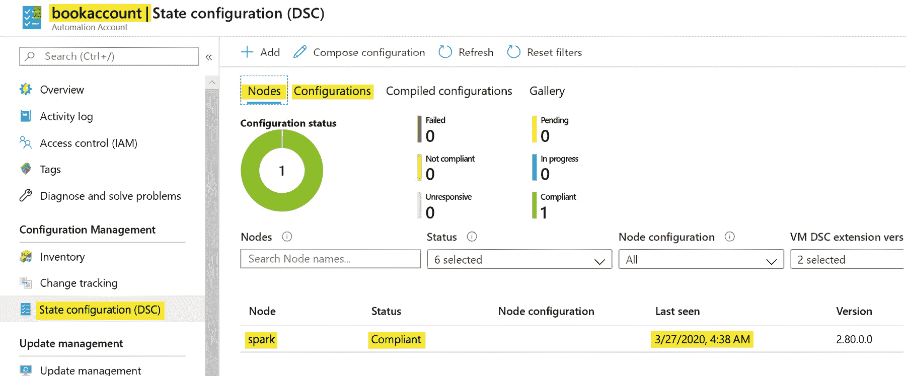

###### 图 4.32：验证节点状态

可以通过以下方式获取节点信息：

```
$node = Get-AzAutomationDscNode -ResourceGroupName 'automationrg' -AutomationAccountName 'bookaccount' -Name 'spark' 
```

可以将配置分配给节点：

```
Set-AzAutomationDscNode -ResourceGroupName 'automationrg' -AutomationAccountName 'bookaccount' -NodeConfigurationName 'ensureiis.localhost' -NodeId $node.Id 
```

一旦编译完成，就可以将其分配给节点。初始状态为**待处理**，如*图 4.33*所示：

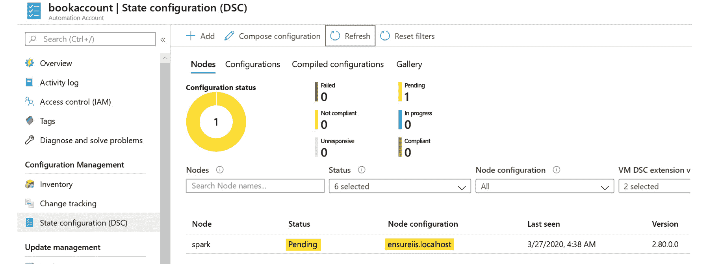

###### 图 4.33：验证节点状态

几分钟后，配置应用到节点，节点变为**合规**，状态变为**已完成**：

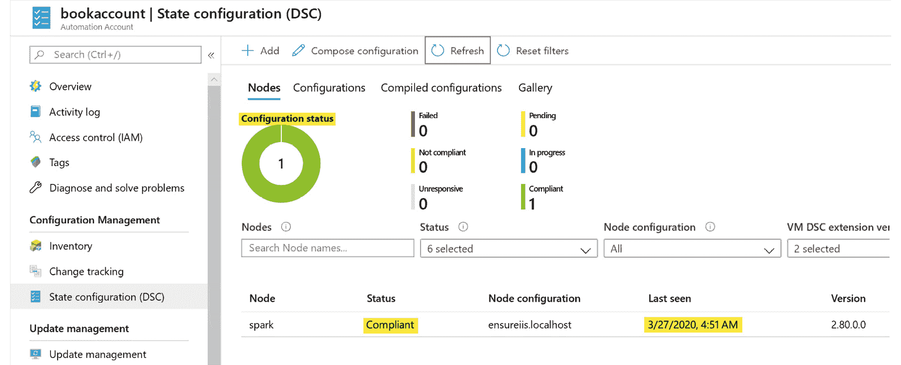

###### 图 4.34：验证节点是否合规

稍后，通过登录到服务器并检查 Web 服务器（IIS）是否已安装，确认它已经安装，正如你在*图 4.35*中看到的：


###### 图 4.35：检查是否已达到预期状态

下一节将讨论 Azure Automation 定价。

## Azure Automation 定价

如果 Azure Automation 上没有执行任何 runbook，则不收取费用。Azure Automation 的费用按 runbook 任务执行的分钟数计费。这意味着，如果总的 runbook 执行分钟数为 10,000，则 Azure Automation 的费用为每分钟 0.002 美元，乘以 9,500，因为前 500 分钟是免费的。

在 Azure Automation 中，涉及其他费用，这取决于使用的功能。例如，DSC 拉取服务器在 Azure Automation 中是免费的；将 Azure 虚拟机添加到拉取服务器也不收费。然而，如果将非 Azure 服务器加入，通常是来自其他云或本地部署的服务器，那么前五台服务器是免费的，超出部分的费用是每台服务器每月 6 美元（在西美地区）。

定价可能会因地区而异，通常最好通过官方定价页面确认定价：[`azure.microsoft.com/pricing/details/automation`](https://azure.microsoft.com/pricing/details/automation)。

你可能会问，既然我们可以通过 Azure Functions 部署无服务器应用，为什么还需要 Automation 账户？在下一节中，我们将探讨 Azure Automation 与无服务器自动化之间的关键区别。

## 与无服务器自动化的比较

Azure Automation 和 Azure 无服务器技术，尤其是 Azure Functions，在功能上非常相似并有所重叠。然而，这些是不同的服务，具有不同的功能和定价。

重要的是要理解，Azure Automation 是一个完整的流程自动化和配置管理套件，而 Azure Functions 是用于实现业务功能的服务。

Azure 自动化用于自动化基础设施的供应、撤销、管理和操作过程，以及随后的配置管理。另一方面，Azure Functions 旨在创建服务，实现可以作为微服务和其他 API 一部分的功能。

Azure 自动化并不适用于无限扩展，负载预计为中等，而 Azure Functions 可以处理无限流量并自动扩展。

在 Azure 自动化中，有许多共享资产，如连接、变量和模块，可以在运行簿之间重用；然而，Azure Functions 中没有现成的共享概念。

Azure 自动化通过检查点管理中间状态，并能够从最后保存的状态继续，而 Azure Functions 通常是无状态的，不维护任何状态。

## 总结

Azure 自动化是 Azure 中一项重要服务，也是唯一用于流程自动化和配置管理的服务。本章涵盖了与 Azure 自动化和流程自动化相关的许多重要概念，包括共享资产，如连接、证书和模块。

本章介绍了运行簿的创建，包括以不同方式调用运行簿，如父子关系、Webhook 和使用门户。还讨论了运行簿的架构和生命周期。

我们还研究了混合工作者的使用，并在本章结尾探讨了使用 DSC 拉取服务器和本地配置管理器进行配置管理。最后，我们与其他技术（如 Azure Functions）进行了比较。

在下一章中，我们将探讨为 Azure 部署设计策略、锁定和标签。
