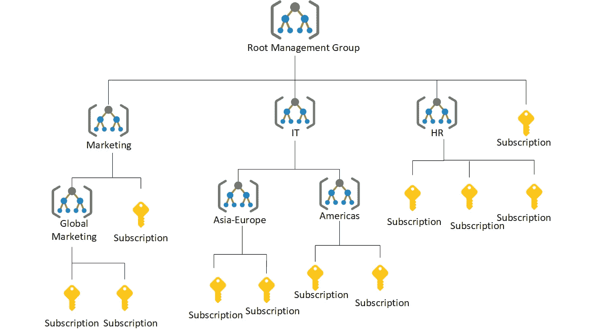
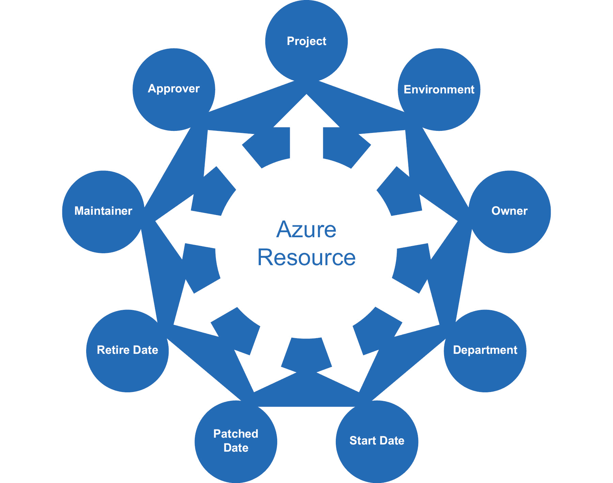
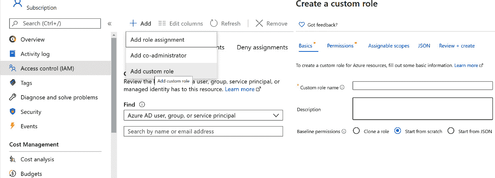
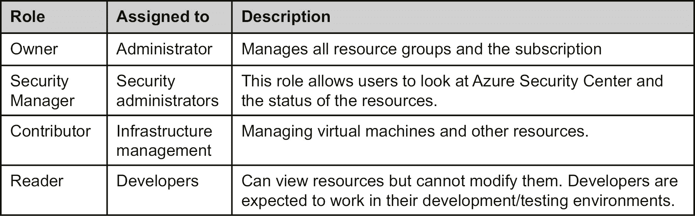

# 5\. 设计 Azure 部署的策略、锁定和标签

Azure 是一个多功能的云平台。客户不仅可以创建和部署他们的应用程序，还可以积极管理和治理他们的环境。云计算通常遵循按需付费的模式，客户可以订阅并将几乎任何东西部署到云端。它可以是一个简单的虚拟机，也可以是数千个具有更高**库存单位**（**SKU**）的虚拟机。Azure 不会阻止任何客户配置他们希望配置的资源。在一个组织内，可能有很多人可以访问该组织的 Azure 订阅。需要建立一个治理模型，以确保只有具有创建权限的人才能配置必要的资源。Azure 提供了资源管理功能，如**Azure 基于角色的访问控制**（**RBAC**）、Azure 策略、管理组、蓝图和资源锁定，用于管理和提供资源治理。

治理的其他主要方面包括成本、使用情况和信息管理。组织的管理团队总是希望实时了解云计算消耗和成本情况。他们希望能够识别出哪些团队、部门或单位使用了多少比例的总成本。简而言之，他们希望能够基于不同的消费和成本维度生成报告。Azure 提供了一种标签功能，可以帮助实时提供这类信息。

在本章中，我们将涵盖以下主题：

+   Azure 管理组

+   Azure 标签

+   Azure 策略

+   Azure 锁定

+   Azure RBAC

+   Azure 蓝图

+   实施 Azure 治理功能

## Azure 管理组

我们从 Azure 管理组开始，因为在接下来的章节中，我们会引用或提到管理组。管理组充当作用域级别，使你能够有效地分配或管理角色和策略。如果你有多个订阅，管理组非常有用。

管理组充当组织订阅的占位符。你也可以拥有嵌套的管理组。如果在管理组层级应用策略或访问权限，它将被下层的管理组和订阅继承。从订阅层级开始，这些策略或访问权限将被资源组继承，最终被资源继承。

管理组的层次结构如下所示：



###### 图 5.1：Azure 管理组的层次结构

在图 5.1 中，我们使用管理组将不同部门的操作分开，如市场营销、IT 和人力资源。在每个部门内部，有嵌套的管理组和订阅，这有助于将资源组织成层次结构，以便进行政策和访问管理。稍后，您将看到管理组如何作为治理、政策管理和访问管理的范围。

在下一部分，我们将讨论 Azure 标签，它在资源的逻辑分组中发挥着另一个重要作用。

## Azure 标签

Azure 允许通过名称-值对对资源组和资源进行标签标记。标签帮助对资源进行逻辑组织和分类。Azure 还允许对资源组及其资源标记最多 50 个名称-值对。尽管资源组充当资源的容器或占位符，但标记资源组并不意味着标记其组成资源。资源组和资源应根据其使用情况进行标记，本节稍后将解释这一点。标签绑定到订阅、资源组或资源。Azure 接受任何名称-值对，因此组织需要定义名称及其可能的值。

那么，为什么标签很重要呢？换句话说，标签能解决哪些问题？标签具有以下优点：

+   **资源分类**：一个 Azure 订阅可以被组织内的多个部门使用。管理团队需要识别任何资源的所有者。标签有助于为资源分配标识符，这些标识符可以代表部门或角色。

+   **Azure 资源的信息管理**：同样，Azure 资源可以由任何有权限访问订阅的人进行配置。为了符合信息管理政策，组织通常希望对资源进行适当的分类。这些政策可以基于应用程序生命周期管理，如开发、测试和生产环境的管理。它们还可以基于使用情况或任何其他优先事项。每个组织都有自己定义信息类别的方式，Azure 通过标签满足这一需求。

+   **成本管理**：在 Azure 中使用标签可以根据资源的分类帮助识别资源。例如，可以针对 Azure 执行查询，以识别每个类别的成本。例如，Azure 中为财务部门和市场部门开发环境的资源成本可以轻松确定。此外，Azure 还提供基于标签的计费信息，这有助于识别团队、部门或小组的消耗率。

然而，Azure 中的标签确实存在一些限制：

+   Azure 允许最多 50 个标签名称-值对与资源组关联。

+   标签是不可继承的。应用于资源组的标签不会应用于其中的单个资源。然而，在为资源配置时，容易忘记为资源添加标签。Azure 策略提供了一种机制，确保在配置时为资源添加适当的标签值。我们将在本章稍后讨论这类策略的详细信息。

可以使用 PowerShell、Azure CLI 2.0、Azure 资源管理器模板、Azure 门户和 Azure 资源管理器 REST API 来为资源和资源组分配标签。

这里展示了使用 Azure 标签进行信息管理分类的示例：



###### 图 5.2：使用 Azure 标签进行信息管理分类

在这个示例中，**Department**、**Project**、**Environment**、**Owner**、**Approver**、**Maintainer**、**Start Date**、**Retire Date** 和 **Patched Date** 等名称-值对用于为资源添加标签。使用 PowerShell、Azure CLI 或 REST API，非常容易查找具有特定标签或标签组合的所有资源。下一节将讨论如何使用 PowerShell 为资源分配标签。

### 使用 PowerShell 的标签

可以使用 PowerShell、Azure 资源管理器模板、Azure 门户和 REST API 来管理标签。在本节中，将使用 PowerShell 来创建和应用标签。PowerShell 提供了一个 cmdlet 用于检索并附加标签到资源组和资源：

+   要使用 PowerShell 检索与资源关联的标签，可以使用 `Get-AzResource` cmdlet：

    ```
    (Get-AzResource -Tag @{ "Environment"="Production"}).Name 
    ```

+   要使用 PowerShell 检索与资源组关联的标签，可以使用以下命令：

    ```
    Get-AzResourceGroup -Tag @{"Environment"="Production"} 
    ```

+   要为资源组设置标签，可以使用 `Update-AzTag` cmdlet：

    ```
    $tags = @{"Dept"="IT"; "Environment"="Production"}
    $resourceGroup = Get-AzResourceGroup -Name demoGroup
    New-AzTag -ResourceId $resourceGroup.ResourceId -Tag $tags
    ```

+   要为资源设置标签，可以使用相同的 `Update-AzTag` cmdlet：

    ```
    $tags = @{"Dept"="Finance"; "Status"="Normal"}
    $resource = Get-AzResource -Name demoStorage -ResourceGroup demoGroup 
    New-AzTag -ResourceId $resource.id -Tag $tags
    ```

+   你可以使用 `Update-AzTag` 命令更新现有标签；但是，你需要指定操作为 `Merge` 或 `Replace`。`Merge` 将把你传入的新标签附加到现有标签中；而 `Replace` 操作将替换掉所有旧标签，使用新标签。下面是一个不替换现有标签的资源组标签更新示例：

    ```
    $tags = @{"Dept"="IT"; "Environment"="Production"}
    $resourceGroup = Get-AzResourceGroup -Name demoGroup
    Update-AzTag -ResourceId $resourceGroup.ResourceId -Tag $tags  -Operation Merge
    ```

现在让我们来看一下使用 Azure 资源管理器模板的标签。

### 使用 Azure 资源管理器模板的标签

Azure 资源管理器模板也有助于为每个资源定义标签。可以使用它们为每个资源分配多个标签，如下所示：

```
{ 
    "$schema": "https://schema.management.azure.com/schemas/2019-04-01/deploymentTemplate.json#", 
    "contentVersion": "1.0.0.0", 
    "resources": [ 
    { 
      "apiVersion": "2019-06-01", 
      "type": "Microsoft.Storage/storageAccounts", 
      "name": "[concat('storage', uniqueString(resourceGroup().id))]", 
      "location": "[resourceGroup().location]", 
      "tags": { 
        "Dept": "Finance", 
        "Environment": "Production" 
      }, 
      "sku": { 
        "name": "Standard_LRS" 
      }, 
      "kind": "Storage", 
      "properties": { } 
    } 
    ] 
}
```

在前面的示例中，使用 Azure 资源管理器模板为存储帐户资源添加了两个标签，`Dept` 和 `Environment`。

### 资源组标签与资源标签的区别

架构师必须决定 Azure 资源和资源组的分类法和信息架构。他们应根据查询要求识别资源的分类标准。然而，他们还必须确定标签应该附加到单个资源上，还是附加到资源组上。

如果资源组内的所有资源都需要相同的标签，那么最好给资源组打标签，尽管标签不会继承到资源组中的资源。如果您的组织要求将标签传递到所有底层资源，可以考虑编写 PowerShell 脚本，从资源组获取标签，并更新资源组中资源的标签。在决定是否在资源级别或资源组级别应用标签之前，重要的是考虑对标签的查询。如果查询涉及跨订阅和跨资源组的单个资源类型，那么为单个资源分配标签更为合理。然而，如果仅通过识别资源组就能有效地进行查询，那么标签应仅应用于资源组。如果您将资源从一个资源组移动到另一个资源组，资源组级别应用的标签将丢失。如果您要移动资源，请考虑重新添加标签。

## Azure 策略

在上一节中，我们讨论了如何为 Azure 部署应用标签。标签在组织资源方面非常有用；然而，还有一件事没有讨论：组织如何确保每次部署都应用了标签？应该对 Azure 标签进行自动化强制执行，确保资源和资源组都应用标签。Azure 本身没有检查机制来确保资源和资源组上应用了适当的标签。这不仅仅是标签的问题——这适用于 Azure 上任何资源的配置。例如，您可能希望限制资源的地理位置（例如，仅限于美国东部地区）。

你可能已经猜到，这一节主要是讲述如何在 Azure 上制定治理模型。治理是 Azure 中的重要元素，因为它确保每个访问 Azure 环境的人都能了解组织的优先事项和流程。它还有助于控制成本，并帮助定义管理资源的组织惯例。

每个策略可以通过多个规则构建，多个策略可以应用到订阅或资源组。根据规则是否满足，策略可以执行各种操作。操作可以是拒绝正在进行的交易、审计交易（即写入日志并允许其完成），或者如果发现缺少元数据，则将元数据附加到交易中。

策略可能与资源的命名约定、资源的标签、可配置的资源类型、资源的位置或这些的任意组合相关。

Azure 提供了众多内置策略，并且可以创建自定义策略。可以使用基于 JSON 的策略语言来定义自定义策略。

现在你已经了解了 Azure 策略的目的和使用场景，让我们继续讨论内置策略、策略语言和自定义策略。

### 内置策略

Azure 提供了一个用于创建自定义策略的服务；然而，它也提供了一些现成的策略，这些策略可以用于治理。这些策略涉及允许的位置、允许的资源类型和标签。有关这些内置策略的更多信息，请访问[`docs.microsoft.com/azure/azure-resource-manager/resource-manager-policy`](https://docs.microsoft.com/azure/azure-resource-manager/resource-manager-policy)。

### 策略语言

Azure 中的策略使用 JSON 来定义和描述策略。政策采用有两个步骤：首先定义策略，然后应用和分配它。策略具有作用域，可以在管理组、订阅或资源组级别应用。

策略是使用`if...then`块定义的，类似于任何流行编程语言。`if`块会执行以评估条件，基于这些条件的结果，`then`块将会执行：

```
{ 
  "if": { 
    <condition> | <logical operator> 
  }, 
  "then": { 
    "effect": "deny | audit | append" 
  } 
} 
```

策略不仅允许简单的`if`条件，还允许将多个`if`条件逻辑地连接起来，创建复杂的规则。这些条件可以通过`AND`、`OR`和`NOT`运算符连接：

+   `AND`语法要求所有条件都为真。

+   `OR`语法要求至少有一个条件为真。

+   `NOT`语法反转条件的结果。

接下来是`AND`语法，它由`allOf`关键字表示：

```
"if": { 
  "allOf": [ 
    { 
       "field": "tags", 
        "containsKey": "application" 
    }, 
    { 
      "field": "type", 
      "equals": "Microsoft.Storage/storageAccounts" 
    } 
  ] 
}, 
```

接下来是`OR`语法，它由`anyOf`关键字表示：

```
"if": { 
  "anyOf": [ 
    { 
       "field": "tags", 
        "containsKey": "application" 
    }, 
    { 
      "field": "type", 
      "equals": "Microsoft.Storage/storageAccounts" 
    } 
  ] 
}, 
```

接下来是`NOT`语法，它由`not`关键字表示：

```
"if": { 
  "not": [ 
    { 
       "field": "tags", 
        "containsKey": "application" 
    }, 
    { 
      "field": "type", 
      "equals": "Microsoft.Storage/storageAccounts" 
    } 
  ] 
}, 
```

事实上，这些逻辑运算符可以组合在一起，如下所示：

```
"if": { 
  "allOf": [ 
    { 
      "not": { 
        "field": "tags", 
        "containsKey": "application" 
      } 
    }, 
    { 
      "field": "type", 
      "equals": "Microsoft.Storage/storageAccounts" 
    } 
  ] 
},
```

这与在流行编程语言（如 C#和 Node.js）中使用`if`条件非常相似：

```
If ("type" == "Microsoft.Storage/storageAccounts") { 
      Deny 
}
```

需要注意的是，虽然有`Deny`操作，但没有`allow`操作。这意味着策略规则应考虑到可能的拒绝，规则应评估条件并在满足条件时`Deny`该操作。

### 允许的字段

在定义策略时，允许的条件字段如下：

+   `Name`：应用策略的资源名称。这是非常具体的，并且适用于资源的使用。

+   `Type`：资源类型，例如`Microsoft.Compute/VirtualMachines`。这将把策略应用于所有虚拟机实例。

+   `Location`：资源的位置（即 Azure 区域）。

+   `标签`：与资源关联的标签。

+   `属性别名`：特定资源的属性。这些属性对于不同的资源是不同的。

在下一节中，你将学习更多关于如何保护生产环境中的资源的信息。

## Azure 锁定

锁定是一种停止对资源执行某些操作的机制。RBAC（基于角色的访问控制）为用户、组和应用程序提供在特定范围内的权限。有现成的 RBAC 角色，例如所有者、贡献者和读取者。使用贡献者角色，可以删除或修改资源。那么，即便用户拥有贡献者角色，如何避免这些操作呢？答案是：使用 Azure 锁定。

Azure 锁定可以提供以下两种帮助：

+   它们可以锁定资源，使其即便拥有所有者权限，也无法删除。

+   锁定可以以这样的方式保护资源，使它们既不能被删除，也不能修改其配置。

锁定通常对生产环境中的资源非常有帮助，这些资源不应被意外修改或删除。

锁定可以应用于订阅、资源组、管理组以及单个资源的级别。锁定可以在订阅、资源组和资源之间继承。对父级应用锁定将确保子级资源也继承该锁定。后续添加到子范围的资源也默认继承该锁定配置。在资源级别应用锁定还会阻止包含该资源的资源组被删除。

锁定仅应用于帮助管理资源的操作，而不涉及资源内部的操作。用户需要拥有 `Microsoft.Authorization/*` 或 `Microsoft.Authorization/locks/*` 的 RBAC 权限才能创建和修改锁定。

锁定可以通过 Azure 门户、Azure PowerShell、Azure CLI、Azure 资源管理器模板以及 REST API 创建和应用。

使用 Azure 资源管理器模板创建锁定的方法如下：

```
{ 
  "$schema": "https://schema.management.azure.com/schemas/2015-01-01/deploymentTemplate.json#", 
  "contentVersion": "1.0.0.0", 
  "parameters": { 
    "lockedResource": { 
      "type": "string" 
    } 
  }, 
  "resources": [ 
    { 
      "name": "[concat(parameters('lockedResource'), '/Microsoft.Authorization/myLock')]", 
      "type": "Microsoft.Storage/storageAccounts/providers/locks", 
      "apiVersion": "2019-06-01", 
      "properties": { 
        "level": "CannotDelete" 
      } 
    } 
  ] 
}
```

Azure 资源管理器模板代码中的 `resources` 部分包含了所有在 Azure 中将要配置或更新的资源列表。这里有一个存储账户资源，并且存储账户中包含一个锁定资源。锁定的名称是通过动态字符串拼接提供的，所应用的锁定是 `CannotDelete` 类型，这意味着该存储账户被锁定，无法删除。只有在移除锁定后，存储账户才能被删除。

使用 PowerShell 创建并应用锁定到资源的方法如下：

```
New-AzResourceLock -LockLevel CanNotDelete -LockName LockSite '
  -ResourceName examplesite -ResourceType Microsoft.Web/sites '
  -ResourceGroupName exampleresourcegroup
```

使用 PowerShell 创建并应用锁定到资源组的方法如下：

```
New-AzResourceLock -LockName LockGroup -LockLevel CanNotDelete '
  -ResourceGroupName exampleresourcegroup
```

使用 Azure CLI 创建并应用锁定到资源的方法如下：

```
az lock create --name LockSite --lock-type CanNotDelete \
  --resource-group exampleresourcegroup --resource-name examplesite \
  --resource-type Microsoft.Web/sites
```

使用 Azure CLI 创建并应用锁定到资源组的方法如下：

```
az lock create --name LockGroup --lock-type CanNotDelete \ --resource-group exampleresourcegroup
```

要创建或删除资源锁定，用户应当具有对 `Microsoft.Authorization/*` 或 `Microsoft.Authorization/locks/*` 操作的访问权限。你还可以进一步授予更细粒度的权限。拥有者和用户访问管理员默认将具有创建或删除锁定的权限。

如果你想知道 `Microsoft.Authorization/*` 和 `Microsoft.Authorization/locks/*` 关键字是什么，下一节你会了解更多相关内容。

现在我们来看一下 Azure RBAC。

## Azure RBAC

Azure 使用 Azure Active Directory 进行资源的身份验证。身份验证完成后，应该确定该身份可以访问哪些资源。这就是授权。授权评估已赋予身份的权限。任何拥有 Azure 订阅访问权限的人应该仅被赋予足够的权限来执行他们的特定工作，其他的权限不需要提供。

授权也常被称为 RBAC。Azure 中的 RBAC 是指在某个范围内为身份分配权限。该范围可以是管理组、订阅、资源组或单个资源。

RBAC 帮助创建和分配不同的权限给不同的身份。这有助于在团队内部分配职责，而不是每个人都有所有的权限。RBAC 帮助让每个人只对自己的工作负责，因为其他人可能没有执行该工作的必要访问权限。需要注意的是，在更大范围内提供权限会自动确保子资源继承这些权限。例如，给一个身份提供对资源组的读取权限意味着该身份也会对该组内的所有资源拥有读取权限。

Azure 提供了三种通用的内建角色，具体如下：

+   拥有者角色，具有对所有资源的完全访问权限

+   贡献者角色，具有读取/写入资源的权限

+   读者角色，具有只读资源权限

Azure 提供了更多的角色，但它们是特定于资源的，如网络贡献者和安全管理员角色。

要获取 Azure 为所有资源提供的所有角色，请在 PowerShell 控制台中执行 `Get-AzRoleDefinition` 命令。

每个角色定义都有特定的允许和**不允许**的操作。例如，拥有者角色允许所有操作；没有任何操作是禁止的：

```
PS C:\Users\riskaria> Get-AzRoleDefinition -Name "Owner"
Name             : Owner
Id               : 8e3af657-a8ff-443c-a75c-2fe8c4bcb635
IsCustom         : False
Description      : Lets you manage everything, including access to resources.
Actions          : {*}
NotActions       : {}
DataActions      : {}
NotDataActions   : {}
AssignableScopes : {/}
```

每个角色由多个权限组成。每个资源提供一组操作。可以通过 `Get-AzProviderOperation` cmdlet 获取某个资源支持的操作。此 cmdlet 需要提供提供者和资源的名称来检索操作：

```
PS C:\Users\riskaria> Get-AzProviderOperation -OperationSearchString "Microsoft.Insights/*" | select Operation
```

这将导致以下输出：

```
PS C:\Users\riskaria> Get-AzProviderOperation -OperationSearchString "Microsoft.Insights/*" | select Operation
Operation                                                                                 
---------                                                                                 
Microsoft.Insights/Metrics/Action                                                         
Microsoft.Insights/Register/Action                                                        
Microsoft.Insights/Unregister/Action                                                      
Microsoft.Insights/ListMigrationDate/Action                                               
Microsoft.Insights/MigrateToNewpricingModel/Action                                        
Microsoft.Insights/RollbackToLegacyPricingModel/Action  
.
.
.
.
.
.
.
.
Microsoft.Insights/PrivateLinkScopes/PrivateEndpointConnectionProxies/Read                
Microsoft.Insights/PrivateLinkScopes/PrivateEndpointConnectionProxies/Write               
Microsoft.Insights/PrivateLinkScopes/PrivateEndpointConnectionProxies/Delete              
Microsoft.Insights/PrivateLinkScopeOperationStatuses/Read                                 
Microsoft.Insights/DiagnosticSettingsCategories/Read
```

这里显示的输出提供了 `Microsoft.Insights` 资源提供程序中所有可用的操作，包括其关联的资源。资源包括 `Metrics`、`Register` 等，而操作包括 `Read`、`Write` 等。

现在我们来看看自定义角色。

### 自定义角色

Azure 提供了许多现成的通用角色，如所有者、贡献者和阅读者，以及专门的资源特定角色，如虚拟机贡献者。当为用户/组或服务主体分配阅读者角色时，意味着会将阅读者权限分配给某个范围。这个范围可以是资源、资源组或订阅。同样，贡献者能够读取并修改分配的范围。而虚拟机贡献者则只能修改虚拟机的设置，而不能修改其他资源的设置。然而，有时现有的角色可能不符合我们的需求。在这种情况下，Azure 允许创建自定义角色。它们可以分配给用户、组和服务主体，并且适用于资源、资源组和订阅。

自定义角色是通过组合多个权限来创建的。例如，一个自定义角色可以由多个资源的操作组成。在下一个代码块中，正在创建一个新的角色定义，但不是手动设置所有属性，而是获取其中一个现有的“虚拟机贡献者”角色，因为它几乎与新自定义角色的配置匹配。避免使用与内置角色相同的名称，因为这会导致冲突。然后，将 ID 属性置为空，提供一个新的名称和描述。代码还清除了所有操作，添加了一些操作，在清除现有范围后添加了新范围，最后创建了一个新的自定义角色：

```
$role = Get-AzRoleDefinition "Virtual Machine Contributor" 
$role.Id = $null 
$role.Name = "Virtual Machine Operator" 
$role.Description = "Can monitor and restart virtual machines." 
$role.Actions.Clear()
$role.Actions.Add("Microsoft.Storage/*/read") 
$role.Actions.Add("Microsoft.Network/*/read") 
$role.Actions.Add("Microsoft.Compute/*/read") 
$role.Actions.Add("Microsoft.Compute/virtualMachines/start/action") 
$role.Actions.Add("Microsoft.Compute/virtualMachines/restart/action")
$role.Actions.Add("Microsoft.Authorization/*/read") 
$role.Actions.Add("Microsoft.Resources/subscriptions/resourceGroups/read") 
$role.Actions.Add("Microsoft.Insights/alertRules/*") 
$role.Actions.Add("Microsoft.Support/*") 
$role.AssignableScopes.Clear() 
$role.AssignableScopes.Add("/subscriptions/548f7d26-b5b1-468e-ad45-6ee12accf7e7") 
New-AzRoleDefinition -Role $role
```

在 Azure 门户中，有一个预览功能，可以让你直接在门户中创建自定义 RBAC 角色。你可以选择从头开始创建角色、克隆现有角色或直接编写 JSON 清单。*图 5.3* 显示了**创建自定义角色**窗格，它位于 **IAM > +添加** 部分：



###### 图 5.3：从 Azure 门户创建自定义角色

这使得创建自定义角色的过程变得轻松无忧。

### 锁与 RBAC 有什么不同？

锁与 RBAC 不同。RBAC 帮助允许或拒绝对资源的权限。这些权限与执行操作相关，如对资源进行读取、写入和更新等操作。而锁则与禁止配置或删除资源的权限有关。

在接下来的章节中，我们将讨论 Azure 蓝图，它有助于我们组织已经讨论过的工件，如角色分配、策略分配等。

## Azure 蓝图

你将会熟悉“蓝图”这个词，它指的是建筑师用来设计解决方案的计划或图纸。同样，在 Azure 中，云架构师可以利用 Azure Blueprints 来定义一组可重复的 Azure 资源，符合组织的标准、流程和模式。

Blueprints 允许我们编排各种资源和其他工件的部署，例如：

+   角色分配

+   策略分配

+   Azure 资源管理器模板

+   资源组

Azure 蓝图对象会复制到多个区域，并由 Azure Cosmos DB 提供支持。复制有助于提供一致的资源访问，并保持组织标准，无论你将资源部署到哪个区域。

Azure Blueprints 包含了各种工件，你可以在这里找到支持的工件列表：[`docs.microsoft.com/azure/governance/blueprints/overview#blueprint-definition`](https://docs.microsoft.com/azure/governance/blueprints/overview#blueprint-definition)。

可以通过 Azure 门户、Azure PowerShell、Azure CLI、REST API 或 ARM 模板创建蓝图。

在下一节中，我们将看到一个实施 Azure 治理功能的示例。示例中将使用 RBAC、Azure 策略和 Azure 资源锁等服务和功能。

## 实施 Azure 治理功能的示例

在本节中，我们将介绍一个示例架构实施，针对一个虚构的组织，该组织希望实现 Azure 治理和成本管理功能。

### 背景

**公司 Inc** 是一家全球性公司，正在 Azure IaaS 平台上实现社交媒体解决方案。他们使用部署在 Azure 虚拟机和网络上的 Web 服务器和应用服务器。Azure SQL Server 作为后台数据库。

### Company Inc 的 RBAC

第一个任务是确保适当的团队和应用程序所有者能够访问他们的资源。需要注意的是，每个团队有不同的需求。为了清晰起见，Azure SQL 被部署在与 Azure IaaS 工件不同的资源组中。

管理员为订阅分配以下角色：



###### 表 5.1：不同角色及访问详情

### Azure 策略

该公司应该实施 Azure 策略，以确保其用户始终按照公司指南配置资源。

Azure 中的策略治理与资源部署相关的各个方面。策略还将治理初始部署后的更新。以下部分列出了应实施的一些策略。

**部署到特定位置**

Azure 资源和部署只能在选定的位置执行。无法在政策以外的区域部署资源。例如，允许的区域是西欧和东美。应该无法在其他任何区域部署资源。

**资源和资源组的标签**

Azure 中的每一个资源，包括资源组，都必须强制分配标签。标签至少应包括有关部门、环境、创建日期和项目名称的详细信息。

**所有资源的诊断日志和应用程序洞察**

在 Azure 上部署的每个资源都应该在可能的情况下启用诊断日志和应用程序日志。

### Azure 锁定

企业应实施 Azure 锁定，确保重要资源不会被意外删除。所有对解决方案功能至关重要的资源都需要锁定。这意味着即使是 Azure 上运行服务的管理员也没有权限删除这些资源；删除资源的唯一方法是先移除锁定。

你还需要注意：

除了开发和测试环境外，所有生产和预生产环境将会被锁定，禁止删除。

所有具有单实例的开发和测试环境也将被锁定，禁止删除。

所有与 Web 应用相关的资源将在所有生产环境中被锁定，禁止删除。

所有共享资源无论环境如何，都将被锁定，禁止删除。

## 总结

在本章中，你了解到治理和成本管理是企业迁移到云端时的首要任务之一。拥有一个按需付费的 Azure 订阅可能会对公司预算造成影响，因为任何拥有访问权限的人都可以根据需要创建资源。某些资源是免费的，但其他资源则非常昂贵。

你还了解到，组织保持云端成本控制非常重要。标签有助于生成计费报告，这些报告可以基于部门、项目、所有者或任何其他标准。虽然成本很重要，但治理同样重要。Azure 提供了锁定、策略和 RBAC 来实施适当的治理。策略确保可以拒绝或审计资源操作，锁定确保资源无法被修改或删除，RBAC 确保员工具有执行工作所需的权限。通过这些功能，企业可以实现对 Azure 部署的良好治理和成本控制。

在下一章中，我们将讨论 Azure 中的成本管理。我们将讲解不同的优化方法、成本管理和计费 API。
