# 6\. Azure 解决方案的成本管理

在上一章中，我们讨论了标签、策略和锁，以及如何从合规性的角度利用它们。标签允许我们为资源添加元数据，它们还帮助我们在资源的逻辑管理中发挥作用。在 Azure 门户中，我们可以根据标签来筛选资源。如果假设有大量资源（这在企业中非常常见），筛选将帮助我们更轻松地管理资源。标签的另一个好处是它们可以用于根据标签来筛选我们的账单报告或使用报告。在本章中，我们将探讨 Azure 解决方案的成本管理。

企业迁移到云端的主要原因是节省成本。订阅 Azure 不需要前期费用。Azure 提供了按需付费的订阅方式，计费是基于实际消耗的。Azure 会测量资源使用情况并提供每月账单。Azure 消耗没有上限。作为一个公共云，Azure（像任何其他服务提供商一样）对可以部署的资源数量设定了硬性和软性限制。软性限制可以通过与 Azure 支持团队合作来增加。有些资源有硬性限制。服务限制可以在 [`docs.microsoft.com/azure/azure-resource-manager/management/azure-subscription-service-limits`](https://docs.microsoft.com/azure/azure-resource-manager/management/azure-subscription-service-limits) 查看，默认限制取决于您所拥有的订阅类型。

对于公司来说，密切关注 Azure 的消耗和使用情况非常重要。尽管他们可以创建策略来设定组织标准和惯例，但同样需要跟踪账单和消耗数据。此外，他们还应该采用最佳实践来消耗 Azure 资源，以最大化回报。为此，架构师需要了解 Azure 资源和功能，它们相应的费用，以及功能和解决方案的成本/效益分析。

在本章中，我们将讨论以下内容：

+   Azure 服务详情

+   计费

+   开具发票

+   使用情况和配额

+   使用情况和计费 API

+   Azure 定价计算器

+   成本优化的最佳实践

让我们继续讨论每个要点。

## Azure 服务详情

Azure 提供了不同的服务套餐可以购买。到目前为止，我们已经讨论了按需付费，但还有其他服务套餐，例如 **企业协议**（**EAs**）、Azure 赞助和 CSP 中的 Azure。我们将逐一讨论这些内容，因为它们对计费非常重要：

+   **按需付费**：这是一种常见的服务方式，客户根据实际使用情况支付费用，相关的费率可以在 Azure 的公开文档中查看。客户每月都会收到来自微软的使用账单，并可以通过信用卡或账单支付方式付款。

+   **EA**：EA 代表与 Microsoft 的货币承诺，意味着组织与 Microsoft 签署协议，并承诺使用一定数量的 Azure 资源。如果使用量超过约定的额度，客户将收到超额费用账单。客户可以在 EA 下创建多个帐户，并在这些帐户中拥有多个订阅。EA 有两种类型：直接 EA 和间接 EA。直接 EA 客户与 Microsoft 之间有直接的账单关系；而在间接 EA 中，账单由合作伙伴管理。EA 客户因与 Microsoft 的承诺而获得更好的优惠和折扣。EA 通过名为 EA 门户的门户管理（[`ea.azure.com`](https://ea.azure.com)），您需要拥有注册权限才能访问此门户。

+   **Azure 在 CSP 中**：Azure 在 CSP 中是指客户联系 **云解决方案提供商**（**CSP**）合作伙伴，由该合作伙伴为客户提供订阅。账单将完全由合作伙伴管理；客户与 Microsoft 不会有直接的账单关系。Microsoft 向合作伙伴开具账单，合作伙伴再向客户开具账单，并加上其利润。

+   **Azure 赞助**：Microsoft 向初创公司、非政府组织（NGO）和其他非营利组织提供赞助，以使用 Azure。赞助是有固定期限和固定额度的信用。如果期限到期或信用用尽，订阅将转换为按需计费订阅。如果组织希望续订其赞助资格，必须与 Microsoft 合作。

我们刚刚概述了 Azure 的部分产品。完整列表请参见 [`azure.microsoft.com/support/legal/offer-details`](https://azure.microsoft.com/support/legal/offer-details)，其中包括其他产品，如 Azure 学生计划、Azure Pass 和 Dev/Test 订阅。

接下来，我们来讨论 Azure 中的账单。

## 理解账单

Azure 是一项具有以下特点的服务工具：

+   无需预付费用

+   无解约费用

+   根据资源类型按秒、按分钟或按小时计费

+   按实际消费进行付费

在这种情况下，很难估算使用 Azure 资源的预付成本。Azure 中的每种资源都有自己的成本模型，并根据存储、使用情况和时间跨度收费。对于管理、行政和财务部门来说，跟踪使用情况和成本非常重要。Azure 提供使用和账单报告功能，帮助高级管理人员和管理员根据多种标准生成成本和使用报告。

Azure 门户通过 **成本管理 + 账单** 功能提供详细的账单和使用信息，该功能可以从主导航窗格访问，如 *图 6.1* 所示：

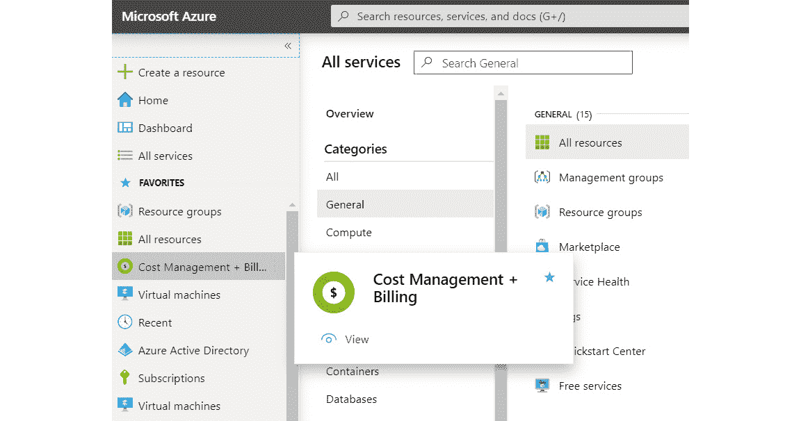

###### 图 6.1：Azure 门户中的成本管理 + 账单服务

请注意，如果你的计费由 CSP 管理，你将无法访问此功能。CSP 客户可以在将其 CSP 传统订阅转换为 Azure 计划后，按需查看其成本。我们将在本章后续部分讨论 Azure 计划和现代商务平台。

**成本管理 + 计费**显示所有你有权限访问的订阅和计费范围，如*图 6.2*所示：

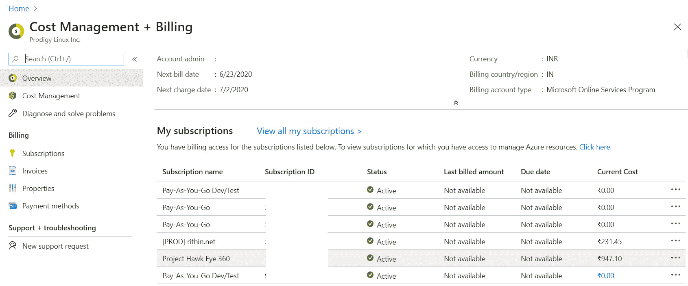

###### 图 6.2：用户订阅的计费概述

**成本管理**部分有几个页面，例如：

+   **成本分析**用于分析某个范围内的使用情况。

+   **预算**用于设置预算。

+   **成本警报**用于在使用超过某个阈值时通知管理员。

+   **Advisor 推荐**用于获取如何实现潜在节省的建议。我们将在本章最后一部分讨论 Azure Advisor。

+   **导出**用于将使用数据自动导出到 Azure 存储。

+   **Cloudyn** 是 CSP 合作伙伴用来分析成本的工具，因为他们无法访问成本管理。

+   **AWS 连接器**用于将你的 AWS 消耗数据连接到 Azure 成本管理。

在 Azure 成本管理中提供的不同选项如*图 6.3*所示：

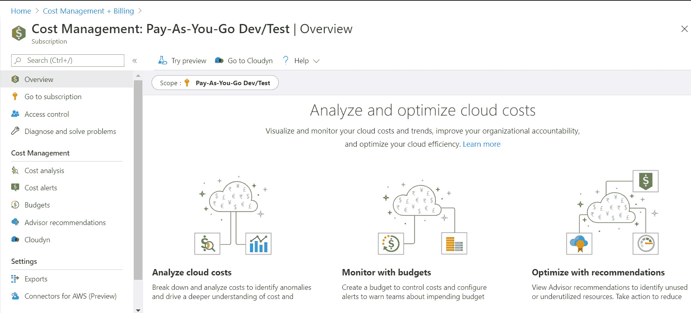

###### 图 6.3：成本管理概述

点击此页面上的 **成本分析** 菜单，可以获得一个全面的交互式仪表盘，使用它可以通过不同的维度和度量分析成本：

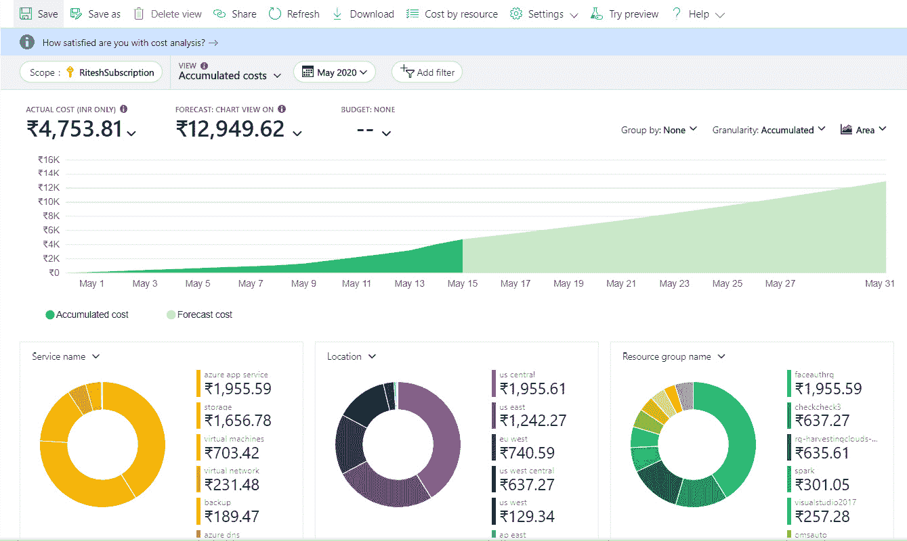

###### 图 6.4：通过成本分析选项分析订阅成本

该仪表盘不仅显示当前成本，还预测成本，并根据多个维度进行拆分。默认提供**服务名称**、**位置**和**资源组名称**，但也可以更改为其他维度。每个视图始终会与一个范围相关联。可用的一些范围包括计费账户、管理组、订阅和资源组。你可以根据需要分析的层级切换范围。

左侧的**预算**菜单允许我们设置预算以更好地管理成本，并提供在实际成本即将超出预算估算时的警报功能：

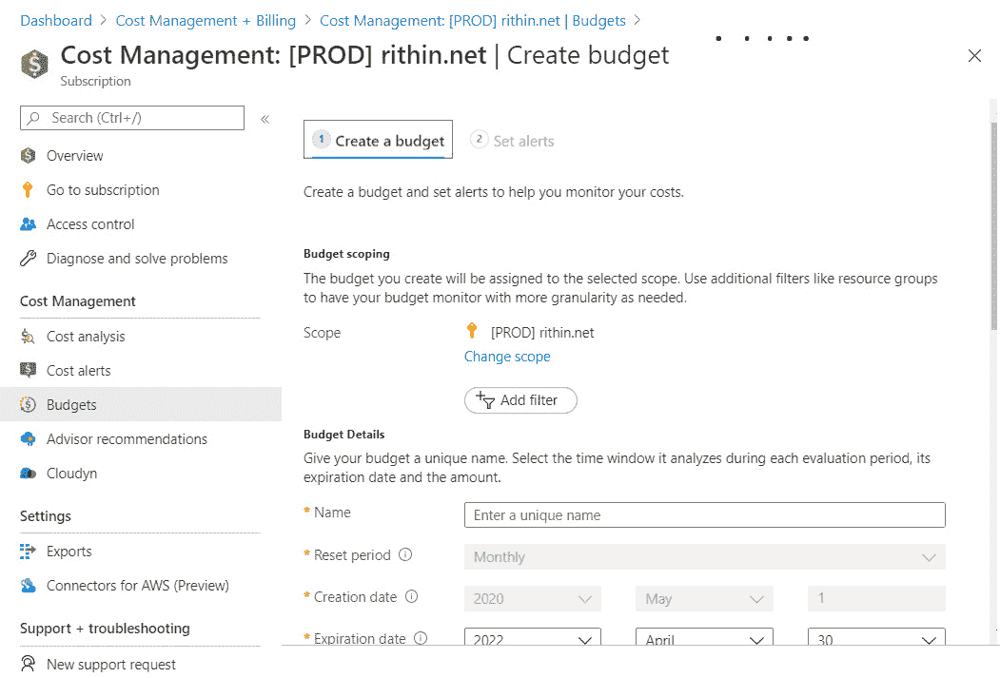

###### 图 6.5：创建预算

成本管理还允许我们在当前的仪表盘中获取来自其他云（如 AWS）的成本数据，从而在单一的仪表盘和页面中管理多个云的成本。然而，在写作时，此功能仍处于预览阶段。此连接器将于 2020 年 8 月 25 日之后开始收费。

您需要填写您的 AWS 角色详细信息及其他信息，以便提取成本信息，如*图 6.5*所示。如果您不确定如何在 AWS 中创建策略和角色，请参考[`docs.microsoft.com/azure/cost-management-billing/costs/aws-integration-set-up-configure#create-a-role-and-policy-in-aws`](https://docs.microsoft.com/azure/cost-management-billing/costs/aws-integration-set-up-configure#create-a-role-and-policy-in-aws):

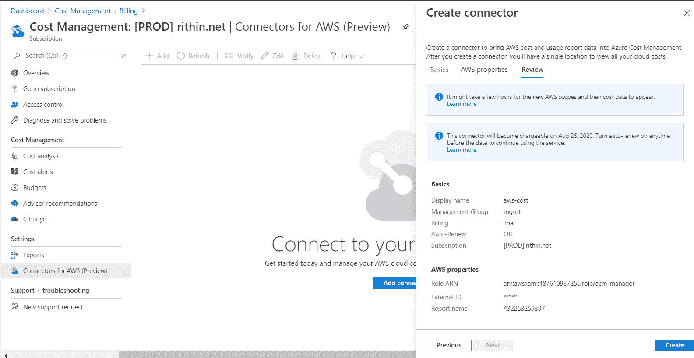

###### 图 6.6：在成本管理中创建 AWS 连接器

成本报告还可以根据计划定期导出到存储帐户中。

部分成本分析也可以在**订阅**面板中查看。在**概览**部分，您可以看到资源及其成本。此外，还有另一张图表，您可以查看当前花费、预测花费以及余额信用（如果您使用的是基于信用的订阅）。

*图 6.7*显示了成本信息：

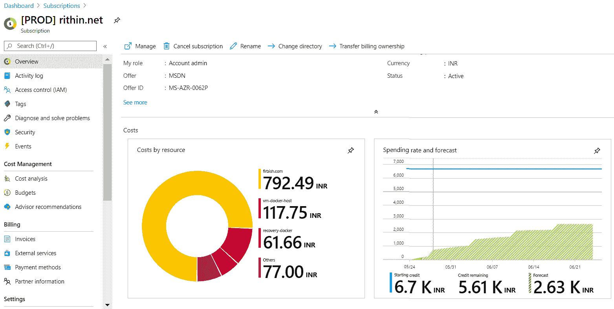

###### 图 6.7：订阅的成本分析

点击*图 6.7*中的任何一个成本项将会将您重定向到**成本管理** – **成本分析**部分。成本管理中有许多维度，您可以根据这些维度对数据进行分组分析。可用的维度将根据您选择的范围而有所不同。以下是一些常用的维度：

+   资源类型

+   资源组

+   标签

+   资源位置

+   资源 ID

+   计量类别

+   计量子类别

+   服务

在本章开始时，我们提到过标签可以用于成本管理。例如，假设您有一个名为“部门”的标签，值为 IT、HR 和财务。正确地为资源打上标签将帮助您了解每个部门产生的成本。您还可以通过**下载**按钮将成本报告下载为 CSV、Excel 或 PNG 文件。

此外，成本管理支持多种视图。您可以创建自己的仪表板并保存它。EA 客户还可以额外享受成本管理连接器或 Power BI 的优势。通过连接器，用户可以将使用统计数据拉取到 Power BI 并创建可视化。

到目前为止，我们一直在讨论如何使用成本管理来跟踪我们的使用情况。在接下来的部分，我们将探讨我们所使用的服务的计费方式。

## 开票

Azure 的计费系统还提供有关每月生成的发票的信息。

根据优惠类型，计费方式可能会有所不同。对于按需付费用户，发票将每月发送给帐户管理员。然而，对于 EA 客户，发票将发送给注册时的联系人。

点击**发票**菜单将显示所有生成的发票列表，点击任何一张发票将提供该发票的详细信息。*图 6.8*显示了如何在 Azure 门户中查看发票：

###### 图 6.8：发票及其详细信息列表

发票有两种类型：一种是针对 Azure 服务，如 SQL、虚拟机和网络的发票；另一种是针对 Azure 市场和预订的发票。Azure 市场提供来自不同供应商的合作伙伴服务供客户选择。稍后我们将讨论 Azure 预订。

默认情况下，对于按需付费订阅，账户管理员可以访问发票。如果需要，他们可以通过选择*图 6.8*中的**访问发票**选项，将访问权限委托给其他用户，例如组织的财务团队。此外，账户管理员还可以选择希望将发票副本发送到的电子邮件地址。

**电子邮件发票**选项目前不适用于支持计划。您可以访问账户门户并下载发票。微软正在逐步淘汰该门户，大部分功能正在被集成到 Azure 门户中。

到目前为止，我们已经讨论了订阅和发票处理的方式。微软推出的一个新概念是现代商务。通过这一新的商务体验，购买流程和体验得到了简化。让我们仔细看看现代商务，并了解它与我们迄今讨论的传统平台有何不同。

### 现代商务体验

如果您的组织已经与微软合作，您会知道每个报价都有多个协议，例如 Web Direct、EA、CSP、**微软服务与产品协议**（**MSPA**）、**服务器云注册**（**SCE**）等。除此之外，每个协议都有自己的门户；例如，EA 有 EA 门户，CSP 有合作伙伴中心门户，Volume Licensing 也有自己的门户。

每个报价都有不同的条款和条件，客户在每次购买时都需要了解这些条款和条件。从一个报价转换到另一个报价并不容易，因为每个报价的条款和条件各不相同。假设您已经有了 EA 订阅，并希望将其转换为 CSP 订阅；您可能需要删除一些合作伙伴服务，因为这些服务在 CSP 中不被支持。对于每个产品，每个报价都有不同的规则。从客户的角度来看，理解哪些支持哪些内容以及规则如何不同是非常困难的。

为了解决这个问题，微软最近发布了一项新的协议，称为**微软客户协议**（**MCA**）。该协议将作为基本条款和条件。每当您注册新项目时，您可以根据需要对其进行修改。

对于 Azure，将有三个**市场推广**（**GTM**）计划：

+   **以客户为主导**：客户将直接与微软账户团队互动，发票将由微软直接管理。最终，这将取代 EA。

+   **合作伙伴主导**：这相当于 Azure-in-CSP 项目，其中合作伙伴管理你的账单。全球有不同的合作伙伴，快速搜索一下即可找到周围的合作伙伴。这个项目将取代 Azure-in-CSP 项目。作为现代商务的第一步，合作伙伴将与微软签署 **微软合作伙伴协议**（**MPA**），并通过让他们的客户签署 MCA 来转换他们现有的客户。在撰写本书时，许多合作伙伴已经将他们的客户转移到现代商务，新商业体验已在 139 个国家/地区提供。

+   **自助服务**：这将取代 Web Direct。它不需要合作伙伴或微软账户团队的任何参与。客户可以直接从 [microsoft.com](http://microsoft.com) 购买，并且在购买时签署 MCA。

在 Azure 中，账单将根据 Azure 计划进行，并且账单总是与日历月份对齐。购买 Azure 计划与购买其他订阅非常相似。不同之处在于，在过程中会签署 MCA。

Azure 计划可以托管多个订阅，并将作为根级容器。所有的使用情况都与单一的 Azure 计划相关联。Azure 计划中的所有订阅将作为容器来托管服务，如虚拟机、SQL 数据库和网络服务。

我们可以观察到在现代商务引入后的一些变化和进展如下：

+   最终，门户网站将被弃用。例如，之前的 EA 客户只能从 EA 门户下载注册使用信息。现在，微软已经将其集成到 Azure 成本管理中，提供比 EA 门户更丰富的体验。

+   定价将以美元（USD）进行，并以当地货币计费。如果你的货币不是美元，则将应用 **外汇**（**FX**）汇率，并会显示在发票中。微软使用来自 Thomson Reuters 的外汇汇率，这些汇率将在每个月的第一天进行分配。这个汇率在整个一个月内保持一致，无论市场汇率如何变化。

+   转到新 Azure 计划的 CSP 客户将能够使用成本管理。访问成本管理打开了一个全新的成本跟踪世界，因为它提供了所有原生的成本管理功能。

到目前为止我们讨论的所有订阅最终都将迁移到 Azure 计划，这是 Azure 的未来。现在你已经理解了现代商务的基础，接下来让我们讨论一个在架构解决方案时起着非常重要作用的话题。大多数服务默认都有限制；其中一些限制可以增加，而有些是硬性限制。当我们在设计解决方案时，需要确保有足够的配额。容量规划是架构设计中的一个至关重要的部分。在下一节，你将了解更多有关订阅限制的信息。

## 使用情况和配额

如前所述，容量规划需要成为我们设计解决方案时的首要步骤之一。我们需要验证订阅是否有足够的配额来容纳我们设计的新资源。如果没有，在部署过程中可能会遇到问题。

每个订阅对每种资源类型都有有限的配额。例如，使用 MSDN Microsoft 帐户时，最多可以分配 10 个公共 IP 地址。类似地，所有资源对每种资源类型都有一个最大默认限制。通过联系 Azure 支持或在**订阅**页面的**使用情况** **+** **配额**窗格中点击**请求增加**按钮，可以增加这些资源类型的配额。

考虑到每个区域的资源数量，要浏览整个列表将是一个挑战。门户提供了筛选数据集并查找所需项的选项。在*图 6.9*中，您可以看到如果我们将位置筛选为**美国中部**并将资源提供者设置为**Microsoft.Storage**，我们可以确认存储帐户的可用配额：

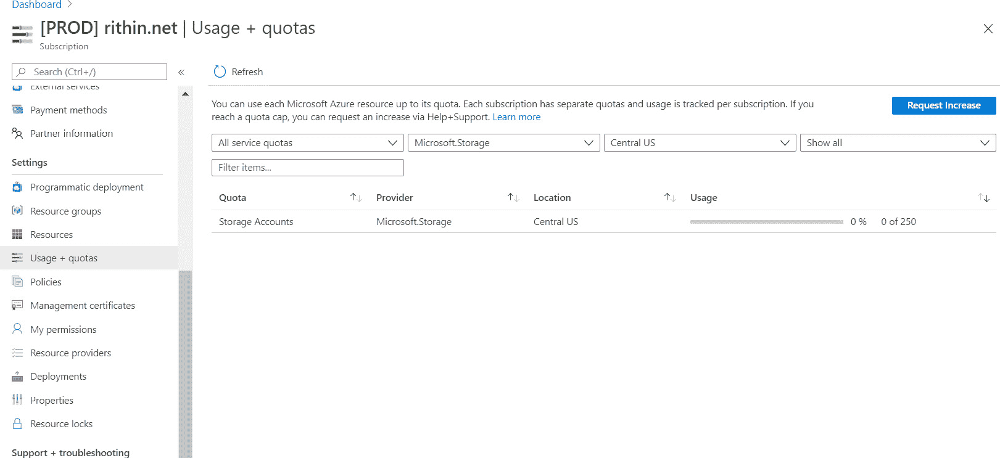

###### 图 6.9：给定位置和资源提供者的使用情况和配额

在*图 6.9*中，您可以清楚地看到我们在美国中部尚未创建任何存储帐户，这使得我们拥有 250 个帐户的配额。如果我们构建的解决方案需要超过 250 个帐户，则需要点击**请求增加**，这将联系 Azure 支持。

此窗格使我们能够在部署前进行容量规划。

在筛选报告时，我们使用了**资源提供者**一词并选择了**Microsoft.Storage**。在下一节中，我们将更详细地了解这个术语的含义。

## 资源提供者和资源类型

无论您是与 Azure 门户交互，筛选服务，还是筛选账单使用报告，您可能需要与资源提供者和资源类型打交道。例如，当您创建虚拟机时，您正在与`Microsoft.Compute`资源提供者和`virtualMachines`资源类型交互。其格式为`{resource-provider}/{resource-type}`。因此，虚拟机的资源类型是`Microsoft.Compute/virtualMachines`。简而言之，资源提供者帮助创建资源类型。

资源提供者需要在 Azure 订阅中注册。如果资源提供者没有注册，则资源类型将在订阅中不可用。默认情况下，大多数提供者会自动注册；不过，也会有一些情况需要我们手动注册。

要获取可用的提供商列表，包括已注册和未注册的提供商，并注册未注册的提供商或反之，可以使用 *图 6.10* 所示的仪表板。进行此操作时，您需要拥有必要的角色——Owner 或 Contributor 角色即可。*图 6.10* 显示了仪表板的样子：

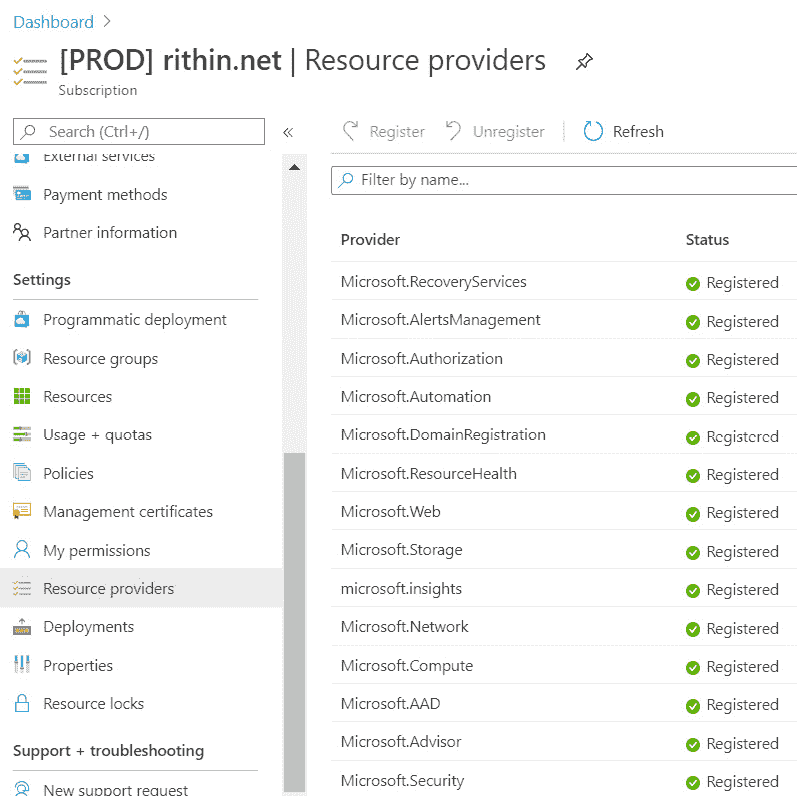

###### 图 6.10：已注册和未注册的资源提供商列表

在前一部分中，我们讨论了如何下载发票和使用信息。如果您需要通过编程方式下载数据并保存，您可以使用 API。下一部分将全面介绍 Azure 计费 API。

## 使用情况和计费 API

尽管门户是手动查找使用、计费和发票信息的好方法，但 Azure 还提供了以下 API，以便通过编程方式检索详细信息并创建定制的仪表板和报告。这些 API 会根据您使用的订阅类型有所不同。由于 API 很多，我们将分享每个 API 的 Microsoft 文档，以便您可以逐一探索它们。

### Azure 企业计费 API

EA 客户有一组专门的 API 可供他们处理计费数据。以下 API 使用来自 EA 门户的 API 密钥进行身份验证；来自 Azure Active Directory 的令牌无法与它们一起使用：

+   **余额和摘要 API**：如前所述，EA 依赖于货币承诺，因此跟踪余额、超额费用、信用调整和 Azure Marketplace 费用非常重要。使用此 API，客户可以提取计费期间的余额和摘要。

+   **使用详情 API**：使用详情 API 将帮助您获取关于注册的每日使用信息，精确到实例级别。此 API 的响应将类似于可以从 EA 门户下载的使用报告。

+   **Marketplace 商店费用 API**：这是一个专门的 API，用于提取 Marketplace 购买的费用。

+   **价格表 API**：每个注册都会有一个特殊的价格表，折扣因客户而异。价格表 API 可以拉取价格列表。

+   **预留实例详情 API**：到目前为止我们还没有讨论 Azure 预留实例，但本章末会进行讨论。使用此 API，您可以获取有关预留实例的使用信息以及注册中的预留实例列表。

这是 EA API 文档的链接：[`docs.microsoft.com/azure/cost-management-billing/manage/enterprise-api`](https://docs.microsoft.com/azure/cost-management-billing/manage/enterprise-api)。

现在让我们来看一下 Azure 消费 API。

### Azure 消费 API

Azure 消耗 API 可以与 EA 和 Web Direct（有些例外）订阅一起使用。此 API 需要一个令牌，该令牌需要通过 Azure Active Directory 认证生成。由于这些 API 也支持 EA，请不要将此令牌与之前提到的 EA API 密钥混淆。以下是一些显而易见的关键 API：

+   使用详情 API

+   市场费用 API

+   预订推荐 API

+   预订详情和总结 API

EA 客户支持以下额外的 API：

+   价格表

+   预算

+   余额

文档可以在此处查看：[`docs.microsoft.com/azure/cost-management-billing/manage/consumption-api-overview`](https://docs.microsoft.com/azure/cost-management-billing/manage/consumption-api-overview)。

此外，还有一组仅可供 Web Direct 客户使用的 API：

+   **Azure 资源使用 API**：此 API 可以与 EA 或按需订阅一起使用，用于下载使用数据。

+   **Azure 资源价格表 API**：仅适用于 Web Direct，不支持 EA。Web Direct 客户可以使用此 API 下载价格表。

+   **Azure 发票下载 API**：仅适用于 Web Direct 客户。用于通过编程下载发票。

这些 API 的名称可能看起来很熟悉，区别仅在于我们调用的端点。对于 Azure 企业计费 API，URL 以 `https://consumption.azure.com` 开头；对于 Azure 消耗 API，URL 以 `https://management.azure.com` 开头。这样你就可以区分它们。在接下来的部分，你将看到一组专门供成本管理使用的 API。

### Azure 成本管理 API

随着 Azure 成本管理的引入，客户可以使用一组新的 API。这些 API 是成本管理的核心，我们之前在 Azure 门户中使用过。主要的 API 如下：

+   **查询使用 API**：这是 Azure 门户中的成本分析使用的同一 API。我们可以通过负载自定义响应内容。当我们需要定制报告时，这个 API 非常有用。日期范围不能超过 365 天。

+   **预算 API**：预算是 Azure 成本管理的另一项功能，使用此 API 可以通过编程与预算进行交互。

+   **预测 API**：此 API 可用于获取范围的预测。预测 API 目前仅适用于 EA 客户。

+   **维度 API**：之前在讨论成本管理时，我们提到过成本管理支持基于范围的多维度。如果你想根据特定的范围获取支持的维度列表，可以使用此 API。

+   **导出 API**：成本管理的另一个功能是我们可以自动将报告导出到存储帐户。导出 API 可用于与导出配置进行交互，如存储帐户的名称、定制化、频率等。

查看官方文档：[`docs.microsoft.com/rest/api/cost-management`](https://docs.microsoft.com/rest/api/cost-management)。

由于现代商务正在扩展 MCA，这里有一组全新的 API 可供探索：[`docs.microsoft.com/rest/api/billing`](https://docs.microsoft.com/rest/api/billing)。

你可能注意到我们在这些场景中没有提到 CSP。在 CSP 中，客户无法访问账单，因为它由合作伙伴管理，因此 API 不对外开放。然而，迁移到 Azure 计划将允许 CSP 客户使用 Azure 成本管理 API 查看零售价格。

任何编程或脚本语言都可以用于调用这些 API，并将它们组合在一起，创建完整的综合账单解决方案。在下一部分中，我们将重点介绍 Azure 定价计算器，帮助客户或架构师了解部署成本。

## Azure 定价计算器

Azure 提供了一个成本计算器，供用户和客户估算他们的成本和使用情况。该计算器可通过 [`azure.microsoft.com/pricing/calculator`](https://azure.microsoft.com/pricing/calculator) 访问：

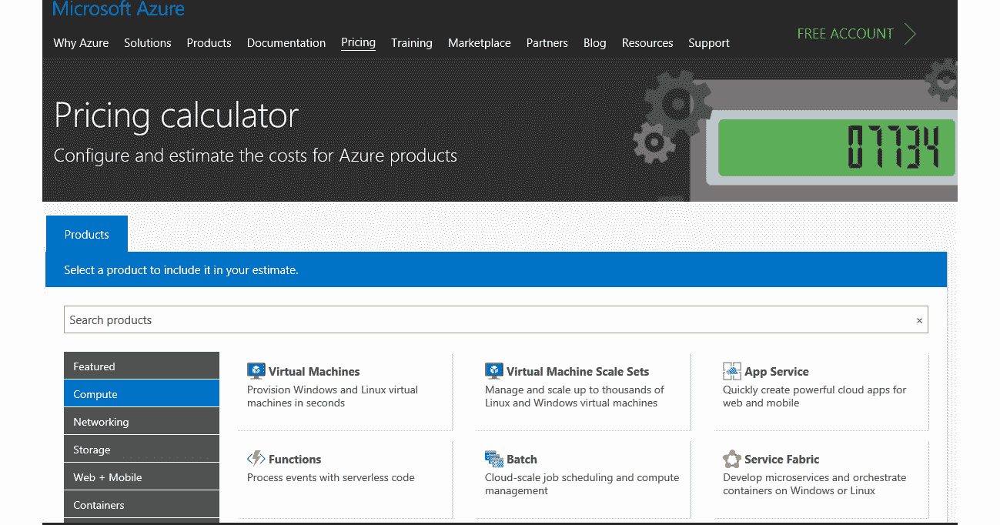

###### 图 6.11：Azure 定价计算器

用户可以从左侧菜单中选择多个资源，它们将被添加到计算器中。在以下示例中，添加了一个虚拟机。接下来，需要提供有关虚拟机区域、操作系统、类型、层级、实例大小、小时数和数量的更多配置，以便计算成本：

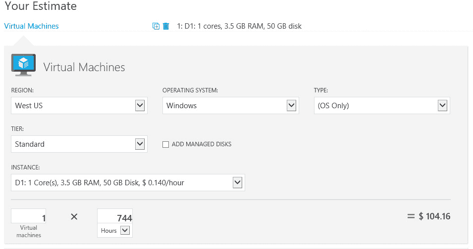

###### 图 6.12：提供配置详情以计算资源成本

同样，Azure Functions 的成本与虚拟机内存大小、执行时间和每秒执行次数相关，见 *图 6.13*：

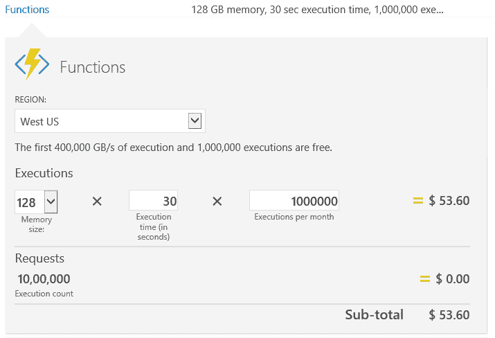

###### 图 6.13：计算 Azure Functions 的成本

Azure 提供不同的级别和支持计划：

+   默认支持：免费

+   开发者支持：每月 $29

+   标准支持：每月 $300

+   专业版直达：每月 $1,000

要查看支持计划的完整对比，请参考：[`azure.microsoft.com/support/plans`](https://azure.microsoft.com/support/plans)。

你可以根据自己的需求选择所需的支持计划。最后，系统将显示总体估算成本：

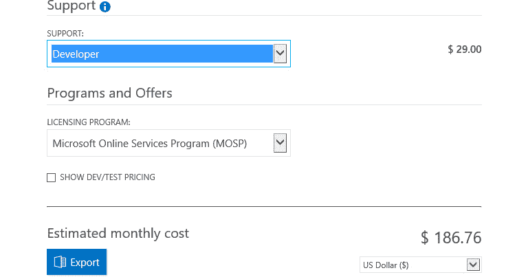

###### 图 6.14：所选支持计划的成本估算

架构师了解他们架构和解决方案中使用的每个 Azure 功能非常重要。Azure 计算器的成功取决于所选择的资源及其配置。任何错误的表示都会导致偏颇和不准确的估算，且与实际账单不同。

我们已经进入本章的最后一部分。我们已经涵盖了计费的基础知识，现在是时候学习最佳实践了。遵循最佳实践将帮助你实现成本优化。

## 最佳实践

架构师需要了解他们的架构和所使用的 Azure 组件。基于主动监控、审计和使用情况，他们应该确定微软在 SKU、大小和功能方面的最佳选择。本节将详细介绍一些从成本优化角度应采纳的最佳实践。

### Azure 治理

Azure 治理可以定义为一套可以利用的过程或机制，用于保持对在 Azure 中部署的资源的完全控制。以下是一些关键要点：

+   为所有资源类型和资源组设置命名规范。确保命名规范在所有资源和资源组中始终如一、全面地遵循。这可以通过建立 Azure 策略来实现。

+   通过为资源、资源组和订阅应用标签，设置逻辑组织和多个分类法。标签对资源进行分类，还能帮助从不同角度评估成本。这可以通过建立 Azure 策略来实现，多个策略可以组合成计划。应用这些计划后，所有的策略将用于合规性检查和报告。

+   使用 Azure 蓝图，而不是直接使用 ARM 模板。这将确保新的环境、资源和资源组的部署可以按照企业标准进行标准化，包括命名规范和标签的使用。

### 计算最佳实践

计算指的是帮助执行服务的服务。Azure 架构师应遵循的一些最佳计算实践，以实现资源的最佳利用和成本效益，如下所示：

+   利用 Azure Advisor 查看节省虚拟机成本的可用选项，并找出虚拟机是否被低效使用。Advisor 使用机器学习模式和人工智能分析你的使用情况，并提供建议。这些建议在成本优化中起着重要作用。

+   使用 Azure **预留实例** (**RI**)。预留实例通过提前支付虚拟机费用（按月或一次性支付）为计算成本提供潜在节省。预留实例的期限可以是一年或三年。如果购买了预留实例，就可以降低计算成本，之后只需支付虚拟机的磁盘、网络和许可费用（如果有）。如果你有五个虚拟机，可以选择购买五个预留实例，从而完全压缩计算成本。预留实例会自动寻找与虚拟机匹配的 SKU 并附加到它上面。潜在节省可能会根据虚拟机的大小有所不同，通常在 20% 到 40% 之间。

+   使用 **Azure Hybrid Benefit**（**AHUB**），您可以使用自己的 Windows Server 或 SQL 许可证来降低许可证费用。结合 RIs 和 AHUB 可以带来巨大的节省。

+   选择最适合您的计算服务的区域，例如虚拟机。选择一个所有 Azure 功能都在同一区域的地点，这样可以避免外部流量。

+   为虚拟机选择最佳的大小。大型虚拟机比小型虚拟机更贵，而且有时候大型虚拟机根本不需要。

+   在需求高峰期间调整虚拟机大小，并在需求下降时缩小其规模。Azure 会频繁发布新的 SKU。如果新的大小更适合您的需求，就必须使用它。

+   在非工作时间或不需要时关闭计算服务。这适用于非生产环境。

+   取消分配虚拟机，而不是关闭它们。这将释放所有资源，并停止计量它们的消耗。

+   使用开发/测试实验室进行开发和测试。它们提供策略、自动关机和自动启动功能。

+   使用虚拟机规模集，从少量虚拟机开始，需求增加时再进行扩展。

+   为应用网关选择正确的大小（小型、中型或大型）。它们由虚拟机支持，可以帮助降低成本。

+   如果不需要 Web 应用防火墙，则选择基本层应用网关。

+   选择正确的 VPN 网关层级（基本 VPN、标准、高性能和超高性能）。

+   减少 Azure 区域之间的网络流量。

+   使用带有公共 IP 的负载均衡器来访问多个虚拟机，而不是为每个虚拟机分配公共 IP。

+   监控虚拟机并计算性能和使用指标。根据这些计算，确定是否需要扩展或缩小虚拟机。这可能会导致缩小规模并减少虚拟机数量。

在架构时考虑这些最佳实践将不可避免地带来成本节省。现在我们已经覆盖了计算部分，让我们采用类似的方法来处理存储。

### 存储最佳实践

由于我们在云中托管应用程序，Azure 存储将用于存储与这些应用程序相关的数据。如果不遵循正确的实践，可能会导致问题。以下是一些存储的最佳实践：

+   选择适当的存储冗余类型（GRS、LRS、RA-GRS）。GRS 比 LRS 更贵。

+   将存储数据归档到冷存储或归档存取层。将经常访问的数据保存在热存储层。

+   删除不需要的 Blob。

+   删除虚拟机后，如果不再需要操作系统磁盘，请显式删除它们。

+   存储账户应根据其大小、写入、读取、列出和容器操作进行计量。

+   优先选择标准磁盘而非高级磁盘；只有在业务需求时才使用高级磁盘。

+   使用 CDN 和缓存来处理静态文件，而不是每次都从存储中获取。

+   Azure 提供预留容量，以节省 Blob 数据的成本。

随时掌握这些最佳实践有助于你架构出具有成本效益的存储解决方案。在接下来的章节中，我们将讨论部署 PaaS 服务时的最佳实践。

### PaaS 最佳实践

Azure 提供了许多 PaaS 服务，如果这些服务配置不当，可能会导致账单中出现意外费用。为了避免这种情况，你可以利用以下最佳实践：

+   选择合适的 Azure SQL 层级（基本版、标准版、Premium RS 或 Premium）和合适的性能等级。

+   在单一数据库和弹性数据库之间做出合适选择。如果数据库数量较多，使用弹性数据库比单一数据库更具成本效益。

+   将你的解决方案重新架构为使用 PaaS（无服务器或容器化的微服务）解决方案，而不是 IaaS 解决方案。这些 PaaS 解决方案可以消除维护成本，并且按每分钟消费计费。如果你不使用这些服务，即便你的代码和服务全天候可用，也不会产生费用。

针对特定资源有成本优化，但无法在一个章节中涵盖所有内容。建议你阅读与每个功能相关的成本和使用文档。

### 一般最佳实践

到目前为止，我们已经看过了服务特定的最佳实践，接下来我们将总结一些通用的指导原则：

+   资源的成本在不同地区有所不同。尝试选择另一个区域，前提是它不会造成性能或延迟问题。

+   企业协议（EA）提供的折扣优于其他优惠。你可以联系微软账户团队，了解签署 EA 后你可以获得哪些优惠。

+   如果 Azure 成本可以预付，那么所有类型的订阅都可以享受折扣。

+   删除或移除未使用的资源。找出那些使用率低的资源并减少它们的 SKU 或大小。如果不需要，删除它们。

+   使用 Azure Advisor，并认真对待其建议。

如前所述，这些是一些通用的指导原则，随着你架构更多的解决方案，你将能够为自己制定一套最佳实践。但一开始，你可以考虑这些建议。尽管如此，Azure 中的每个组件都有其自身的最佳实践，架构设计时参考文档有助于你创建具有成本效益的解决方案。

## 总结

在本章中，我们学习了在云环境中工作时，成本管理和管理的重要性。我们还讨论了各种 Azure 定价选项和 Azure 提供的各种价格优化功能。管理项目的成本至关重要，主要是因为每月的费用可能非常低，但如果没有定期监控资源，费用可能会增加。云架构师应该以成本效益的方式设计他们的应用程序。他们应该使用适当的 Azure 资源、适当的 SKU、层级和大小，并且知道何时启动、停止、向上扩展、向外扩展、向下扩展、向内扩展、转移数据等。正确的成本管理将确保实际费用符合预算费用。

在下一章，我们将介绍与数据服务相关的各种 Azure 功能，例如 Azure SQL、Cosmos DB 和分片。
