# 7\. Azure OLTP 解决方案

Azure 提供了**基础设施即服务**（**IaaS**）和**平台即服务**（**PaaS**）服务。这些服务为组织提供了不同层次的存储、计算和网络控制。存储是处理数据存储和传输时使用的资源。Azure 提供了多种存储数据的选项，如 Azure Blob 存储、表存储、Cosmos DB、Azure SQL 数据库、Azure 数据湖等。虽然其中一些选项适用于大数据存储、分析和呈现，但也有一些是针对处理事务的应用程序。Azure SQL 是 Azure 中与事务数据配合使用的主要资源。

本章将重点讨论使用事务数据存储的各个方面，如 Azure SQL 数据库以及其他通常用于**在线事务处理**（**OLTP**）系统的开源数据库，并将涵盖以下主题：

+   OLTP 应用程序

+   关系型数据库

+   部署模型

+   Azure SQL 数据库

+   单一实例

+   弹性池

+   托管实例

+   Cosmos DB

我们将从了解 OLTP 应用程序是什么开始，并列出 Azure 的 OLTP 服务及其用例。

## OLTP 应用程序

如前所述，OLTP 应用程序是帮助处理和管理事务的应用程序。一些最常见的 OLTP 实现可以在零售销售、金融交易系统和订单输入中找到。这些应用程序执行数据捕获、数据处理、数据检索、数据修改和数据存储。然而，OLTP 应用程序不仅限于此。OLTP 应用程序将这些数据任务视为事务。事务具有一些重要的特性，OLTP 应用程序需要考虑这些特性。这些特性被归纳为**ACID**，让我们详细讨论这些特性：

+   **原子性**：该特性表示一个事务必须由多个语句组成，且这些语句要么都执行成功，要么都不执行。如果多个语句被组合在一起，它们就形成了一个事务。原子性意味着每个事务被视为最小的执行单元，要么成功完成，要么失败。

+   **一致性**：该特性关注数据库中数据的状态。它规定任何状态的变化应当是完整的，并基于数据库的规则和约束，且不允许部分更新。

+   **隔离性**：该特性表示系统上可以同时执行多个并发事务，并且每个事务应当在隔离状态下执行。一个事务不应了解或干扰任何其他事务。如果事务按顺序执行，那么最终的数据状态应与执行前相同。

+   **持久性**：此属性表明，一旦数据提交到数据库，它应该被持久化并可用，即使发生故障。已提交的事务变为事实。

现在你已经了解了什么是 OLTP 应用程序，让我们来讨论关系型数据库在 OLTP 应用程序中的作用。

### 关系型数据库

OLTP 应用程序通常依赖关系型数据库进行事务管理和处理。关系型数据库通常以表格格式呈现，由行和列组成。数据模型被转换为多个表，每个表通过关系与另一个表相连接（基于规则）。这个过程也称为规范化。

Azure 中有多个支持 OLTP 应用程序和关系型数据库部署的服务。在接下来的部分中，我们将查看与 OLTP 应用程序相关的 Azure 服务。

## Azure 云服务

在 Azure 门户中搜索**sql**会提供多个结果。我已经标记出其中一些，显示可以直接用于 OLTP 应用程序的资源：

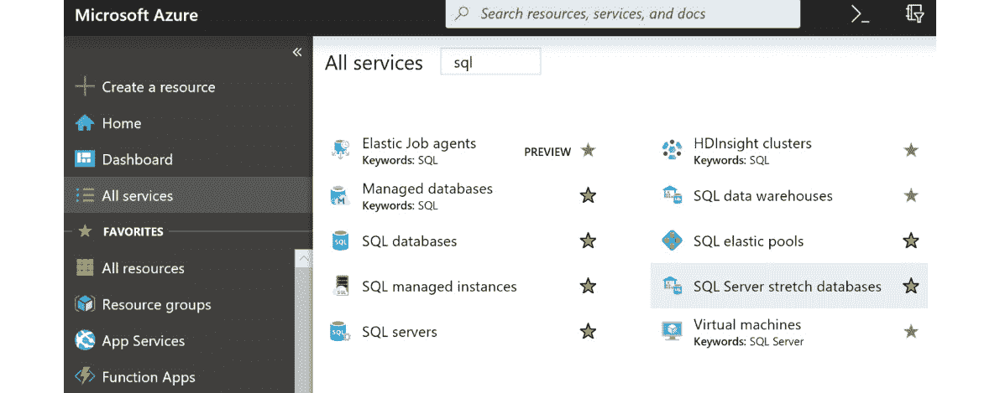

###### 图 7.1：Azure SQL 服务列表

*图 7.1*展示了在 Azure 上创建基于 SQL Server 的数据库时可用的各种功能和选项。

再次，在 Azure 门户中快速搜索**数据库**会提供多个资源，图*7.2*中标记的部分可以用于 OLTP 应用程序：

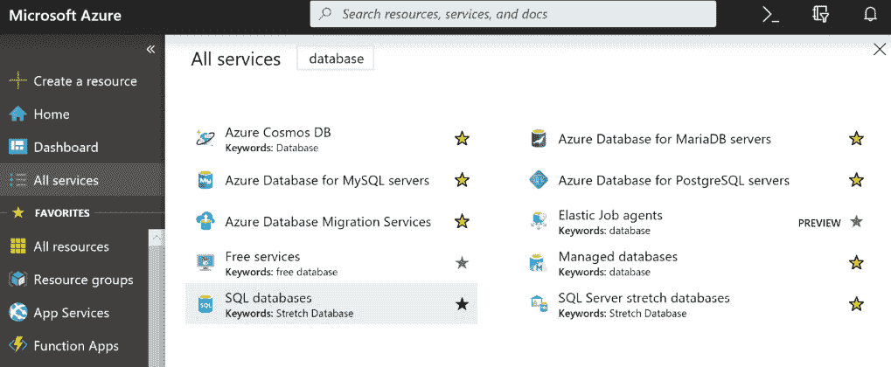

###### 图 7.2：用于 OLTP 应用程序的 Azure 服务列表

*图 7.2*展示了 Azure 提供的可以承载数据的资源，这些资源支持多种数据库，包括以下内容：

+   MySQL 数据库

+   MariaDB 数据库

+   PostgreSQL 数据库

+   Cosmos DB

接下来，让我们讨论部署模型。

## 部署模型

Azure 中的部署模型是根据管理或控制的级别来分类的。用户可以根据个人偏好选择管理或控制的级别；他们可以选择通过使用虚拟机等服务来获得完全控制，或者使用由 Azure 为其管理的托管服务。

在 Azure 上部署数据库有两种部署模型：

+   在 Azure 虚拟机上托管数据库（IaaS）

+   托管为托管服务（PaaS）的数据库

现在，我们将尝试了解在 Azure 虚拟机和托管实例上的部署区别。让我们从虚拟机开始。

### 在 Azure 虚拟机上托管的数据库

Azure 提供了多个 **库存单位** (**SKUs**) 用于虚拟机。除了通用虚拟机外，还提供了高计算、高吞吐量（IOPS）虚拟机。与其在本地服务器上托管 SQL Server、MySQL 或其他数据库，不如将这些数据库部署在这些虚拟机上。这些数据库的部署和配置与本地部署没有区别。唯一的区别是数据库托管在云端，而不是使用本地服务器。管理员需要执行与本地部署相同的活动和步骤。尽管当客户希望完全控制其部署时，这个选项是一个不错的选择，但与此选项相比，还有一些模型可能在成本效益、可扩展性和高可用性方面更具优势，本章稍后将讨论这些模型。

在 Azure 虚拟机上部署任何数据库的步骤如下：

1.  创建一个适应应用程序性能需求的虚拟机。

1.  在其上部署数据库。

1.  配置虚拟机和数据库配置。

该选项不提供任何现成的高可用性，除非配置多个服务器。它也不提供任何自动扩展功能，除非有自定义自动化来支持它。

灾难恢复仍然是客户的责任。服务器应部署在多个区域，并通过全球对等、VPN 网关、ExpressRoute 或 Virtual WAN 等服务进行连接。这些虚拟机可以通过站点对站点的 VPN 或 ExpressRoute 连接到本地数据中心，而无需暴露到外部网络。

这些数据库也被称为 **非托管数据库**。另一方面，托管在 Azure 上的数据库（除了虚拟机之外）由 Azure 管理，并称为 **托管服务**。在下一节中，我们将详细介绍这些内容。

### 托管服务中的数据库

托管服务意味着 Azure 提供数据库的管理服务。这些托管服务包括数据库的托管、确保主机的高可用性、确保数据在灾难恢复期间进行内部复制以提高可用性、确保在所选 SKU 的约束下实现可扩展性、监控主机和数据库并生成通知警报或执行操作、提供日志和审计服务以便于故障排除，并负责性能管理和安全警报。

简而言之，客户在使用 Azure 托管服务时，能够立刻获得大量服务，并且不需要对这些数据库进行主动管理。在本章中，我们将深入探讨 Azure SQL 数据库，并提供关于其他数据库的信息，如 MySQL 和 Postgres。同时，我们还将介绍非关系型数据库，如 Cosmos DB，它是一个 NoSQL 数据库。

## Azure SQL 数据库

Azure SQL 服务器提供了作为 PaaS 托管的关系型数据库。客户可以配置此服务，带入自己的数据库架构和数据，并将应用程序连接到它。它提供了在虚拟机上部署 SQL Server 时的所有功能。这些服务不提供用于创建表格及其架构的用户界面，也不直接提供查询功能。应使用 SQL Server 管理工作室和 SQL CLI 工具连接到这些服务并直接操作。

Azure SQL 数据库提供三种不同的部署模型：

+   **单实例：** 在这种部署模型中，单个数据库被部署在一个逻辑服务器上。这涉及到在 Azure 上创建两个资源：一个 SQL 逻辑服务器和一个 SQL 数据库。

+   **弹性池：** 在这种部署模式下，多个数据库会被部署在一个逻辑服务器上。再次强调，这涉及到在 Azure 上创建两个资源：一个 SQL 逻辑服务器和一个 SQL 弹性数据库池——它包含所有的数据库。

+   **托管实例：** 这是 Azure SQL 团队推出的一种相对较新的部署模型。这种部署模式反映了在逻辑服务器上的一组数据库，提供对系统数据库资源的完全控制。通常，在其他部署模型中，系统数据库是不可见的，但在该模型中可以访问。该模型与 SQL Server 本地部署非常接近：

###### 图 7.3：Azure SQL 数据库的部署模型

如果你在疑惑什么时候使用哪种服务，你应该查看 SQL 数据库与 SQL 托管实例之间的功能对比。完整的功能对比可以在[`docs.microsoft.com/azure/azure-sql/database/features-comparison`](https://docs.microsoft.com/azure/azure-sql/database/features-comparison)找到。

接下来，我们将介绍 SQL 数据库的一些特性。让我们从应用程序功能开始。

### 应用程序特性

Azure SQL 数据库提供了多种面向应用程序的特性，以满足 OLTP 系统的不同需求：

+   **列式存储：** 该特性允许数据以列的格式而不是行的格式存储。

+   **内存中 OLTP：** 通常，数据存储在 SQL 的后端文件中，并在应用程序需要时从中提取数据。与此相反，内存中 OLTP 将所有数据存储在内存中，读取存储的数据时没有延迟。将内存中 OLTP 数据存储在 SSD 上为 Azure SQL 提供了最佳性能。

+   所有本地 SQL Server 的功能。

接下来我们要讨论的功能是高可用性。

**高可用性**

默认情况下，Azure SQL 的高可用性为 99.99%。它根据 SKU 具有两种不同的架构来保持高可用性。对于基础、标准和通用 SKU，整个架构被划分为以下两层。

+   计算层

+   存储层

这两个层次都有冗余设计，以提供高可用性：

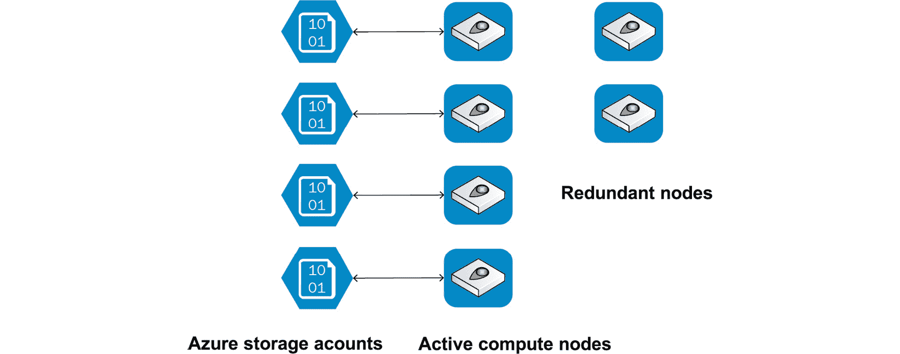

###### 图 7.4：标准 SKU 中的计算和存储层

对于高级和业务关键型 SKU，计算和存储都在同一层。高可用性通过在四节点集群中复制计算和存储来实现，使用类似于 SQL Server Always On 可用性组的技术：

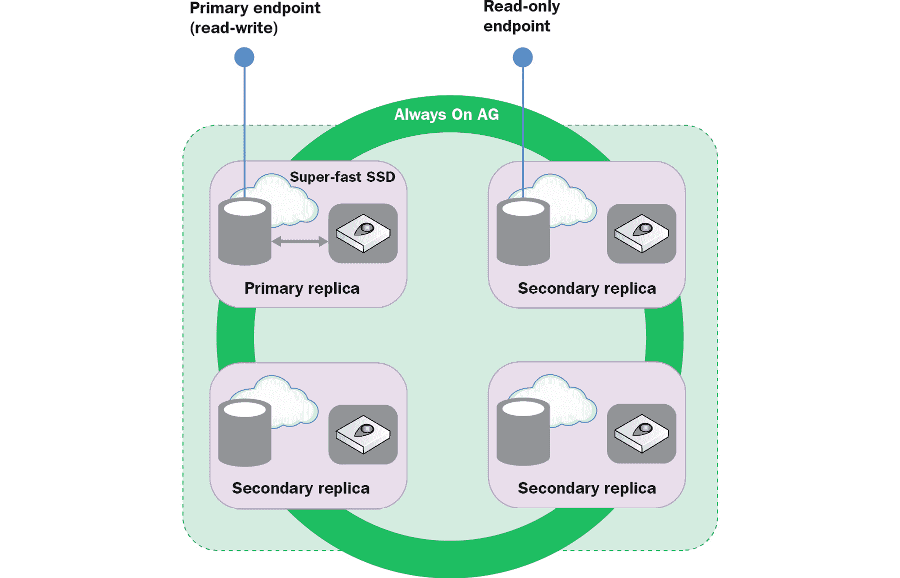

###### 图 7.5：四节点集群部署

现在你了解了高可用性是如何处理的，接下来我们讨论下一个功能：备份。

**备份**

Azure SQL 数据库还提供了自动备份数据库并将其存储在存储账户中的功能。这个功能在数据库损坏或用户不小心删除表时尤其重要。此功能在服务器级别可用，如*图 7.6*所示：

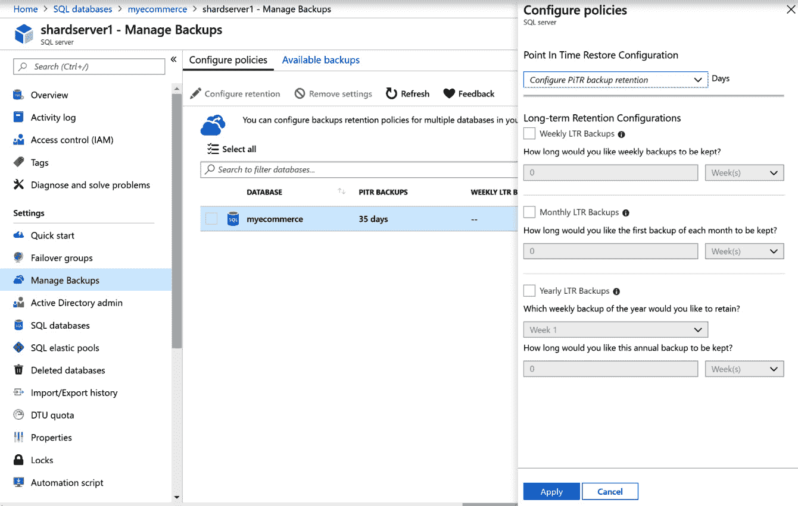

###### 图 7.6：在 Azure 中备份数据库

架构师应准备备份策略，以便在需要时可以使用备份。在配置备份时，确保备份频率既不太少也不太频繁。根据业务需求，可以配置每周备份，甚至每日备份，或根据需要配置更频繁的备份。这些备份可用于恢复目的。

备份将有助于业务连续性和数据恢复。您还可以使用地理复制来恢复区域故障时的数据。在下一部分，我们将介绍地理复制。

**地理复制**

Azure SQL 数据库还提供了将数据库复制到不同区域（也称为次级区域）的功能；这完全取决于您选择的计划。次级区域中的数据库可以被应用程序读取。Azure SQL 数据库允许可读的次级数据库。这是一个很好的业务连续性解决方案，因为任何时刻都可以使用可读数据库。通过地理复制，可以在不同区域或相同区域最多拥有四个次级数据库。通过地理复制，也可以在发生灾难时故障转移到次级数据库。地理复制在数据库级别进行配置，如*图 7.7*所示：

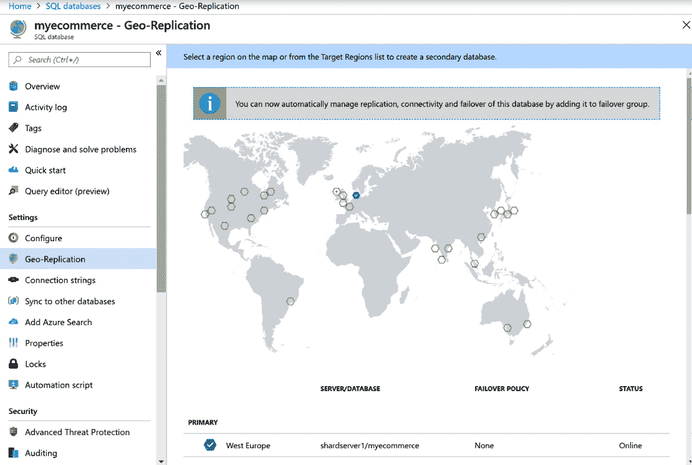

###### 图 7.7：Azure 中的地理复制

如果你在这个屏幕上向下滚动，将列出可以作为**副本**的区域，如*图 7.8*所示：

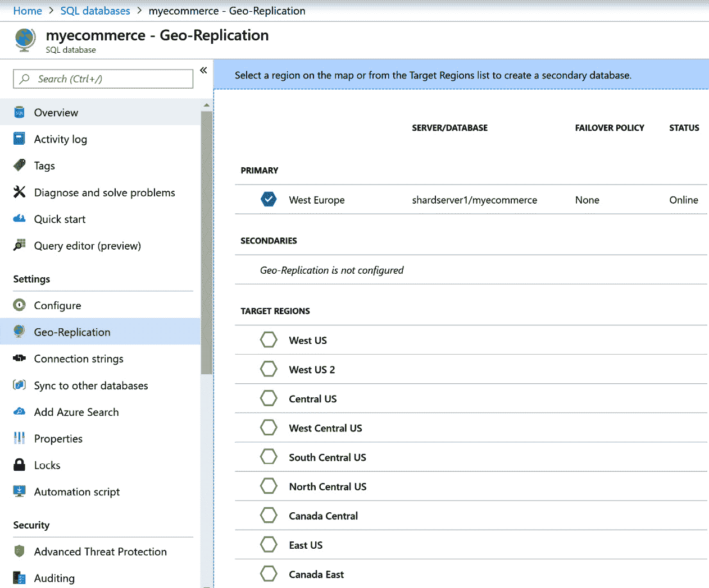

###### 图 7.8：可用于地理复制的副本列表

在设计涉及地理复制的解决方案之前，我们需要验证数据驻留和合规性法规。如果由于合规原因不允许将客户数据存储在区域外，我们就不应该将其复制到其他区域。

在下一节中，我们将探讨可扩展性选项。

**可扩展性**

Azure SQL 数据库通过增加更多资源（如计算、内存和 IOPS）提供垂直**可扩展性**。这可以通过增加**数据库吞吐量单位**（**DTU**）或在**vCore**模型中增加计算和存储资源来实现：

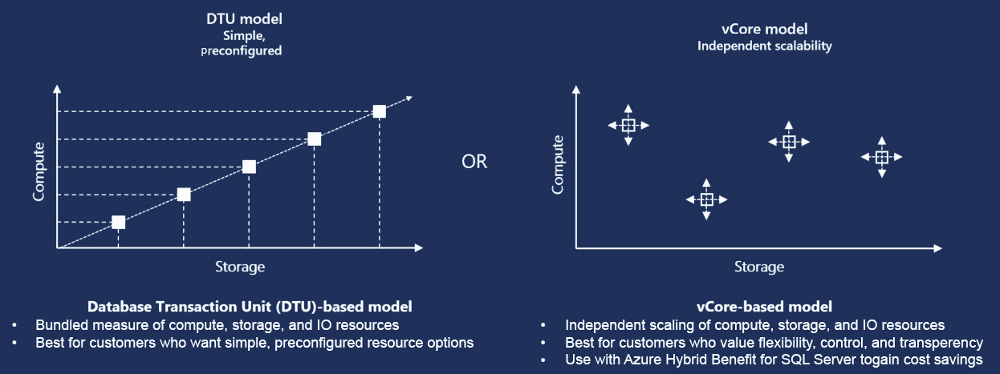

###### 图 7.9：Azure SQL 数据库中的可扩展性

我们在本章后面介绍了基于 DTU 模型和基于 vCore 模型之间的区别。

在下一节中，我们将介绍安全性，帮助你理解如何在 Azure 中构建安全的数据解决方案。

### 安全性

安全性是任何数据库解决方案和服务的重要因素。Azure SQL 为 Azure SQL 提供了企业级的安全性，本节将列出一些 Azure SQL 中的重要安全功能。

**防火墙**

默认情况下，Azure SQL 数据库不提供任何请求的访问权限。必须显式接受源 IP 地址才能访问 SQL 服务器。也可以选择允许所有基于 Azure 的服务访问 SQL 数据库。此选项包括托管在 Azure 上的虚拟机。

防火墙可以在服务器级别进行配置，而不是在数据库级别进行配置。**允许访问 Azure 服务**选项允许所有服务，包括虚拟机，访问托管在逻辑服务器上的数据库。

默认情况下，由于安全原因，此功能将被禁用；启用此功能将允许所有 Azure 服务访问：

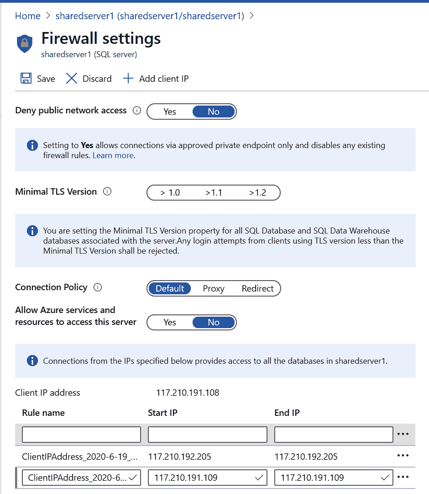

###### 图 7.10：在 Azure 中配置服务器级别的防火墙

**Azure SQL 服务器专用网络**

尽管 SQL 服务器通常可以通过互联网访问，但也可以将 SQL 服务器的访问限制为来自虚拟网络的请求。这是 Azure 中一个相对较新的功能。它帮助通过虚拟网络中的另一台服务器上的应用程序访问 SQL 服务器中的数据，而不通过互联网发出请求。

为此，应该在虚拟网络中添加一个**Microsoft.Sql**类型的服务端点，并且虚拟网络应与 Azure SQL 数据库所在的区域相同：

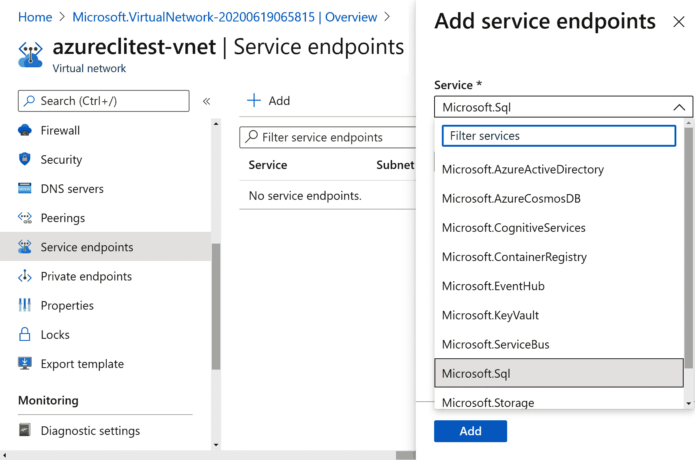

###### 图 7.11：添加 Microsoft.Sql 服务端点

应选择虚拟网络中的一个合适的**子网**：

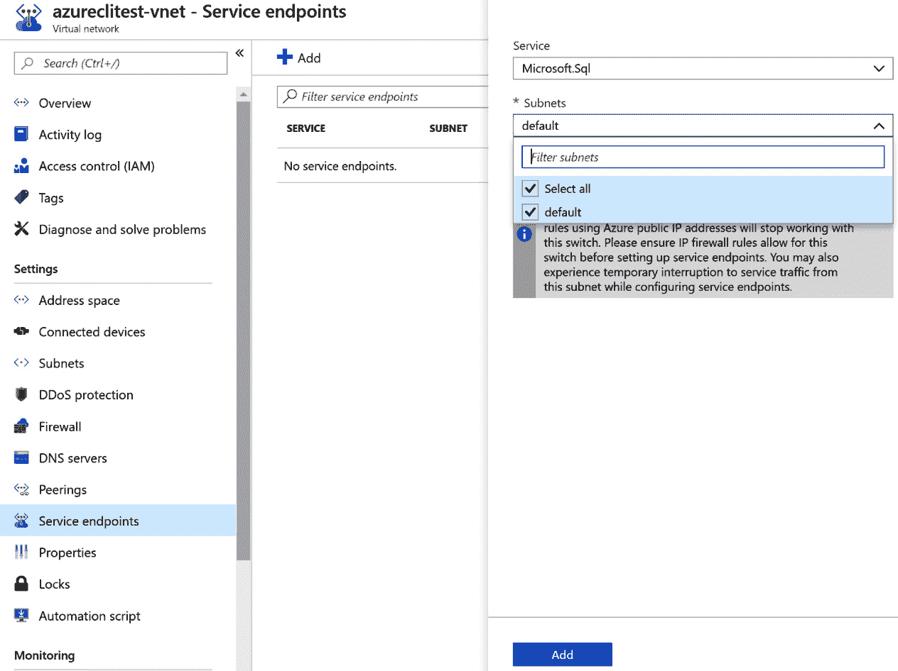

###### 图 7.12：为 Microsoft.Sql 服务选择子网

最后，在 Azure SQL Server 配置面板中，应添加一个已启用**Microsoft.Sql**服务终结点的现有虚拟网络：

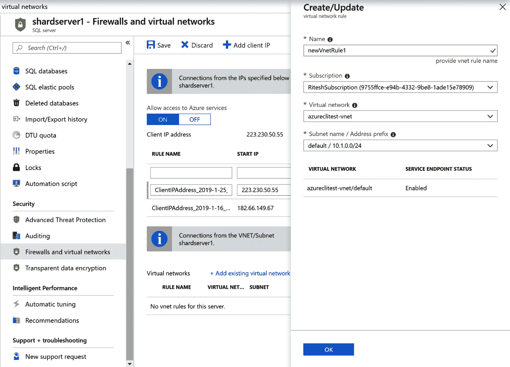

###### 图 7.13：添加具有 Microsoft.Sql 服务终结点的虚拟网络

**静态时加密的数据库**

数据库在静态时应以加密形式存在。这里的**静态**意味着数据处于数据库的存储位置。尽管你可能无法访问 SQL Server 及其数据库，但最好还是加密数据库存储。

文件系统上的数据库可以使用密钥进行加密。这些密钥必须存储在 Azure 密钥保管库中，并且该保管库必须与 Azure SQL 服务器位于同一地区。可以通过 SQL Server 配置面板中的**透明数据加密**菜单项，并选择**是**来启用**使用您自己的密钥**来加密文件系统。

密钥是一个 RSA 2048 密钥，必须存在于保管库中。SQL Server 在需要读取数据并将其发送给调用方时，会在页面级别解密数据；然后，它会在写入数据库后对其进行加密。应用程序无需任何更改，并且这对它们是完全透明的：

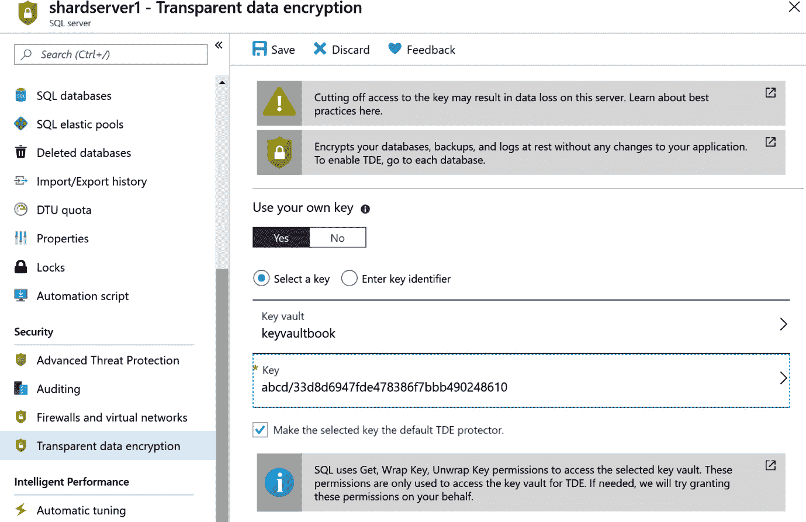

###### 图 7.14：SQL Server 中的透明数据加密

**动态数据屏蔽**

SQL Server 还提供了一种功能，能够屏蔽包含敏感数据的单个列，这样除了特权用户之外，其他人无法通过 SQL Server Management Studio 查询来查看实际数据。数据将保持屏蔽状态，只有当经过授权的应用程序或用户查询表时，数据才会被解屏蔽。架构师应确保像信用卡信息、社会安全号码、电话号码、电子邮件地址和其他财务信息等敏感数据被屏蔽。

可以在表中的列上定义屏蔽规则。有四种主要的屏蔽类型—你可以在这里查看它们：[`docs.microsoft.com/sql/relational-databases/security/dynamic-data-masking?view=sql-server-ver15#defining-a-dynamic-data-mask`](https://docs.microsoft.com/sql/relational-databases/security/dynamic-data-masking?view=sql-server-ver15#defining-a-dynamic-data-mask)。

*图 7.15* 显示了如何添加数据屏蔽：

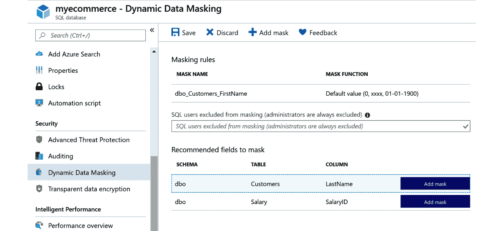

###### 图 7.15：SQL 数据库中的动态数据屏蔽

**Azure Active Directory 集成**

另一个重要的 Azure SQL 安全特性是，它可以与 Azure **Active Directory**（**AD**）集成，用于身份验证。如果没有与 Azure AD 集成，SQL Server 唯一的身份验证机制是通过用户名和密码进行身份验证，即 SQL 身份验证。无法使用集成的 Windows 身份验证。SQL 身份验证的连接字符串包括明文的用户名和密码，这并不安全。与 Azure AD 集成可以启用 Windows 身份验证、服务主体名称或基于令牌的身份验证，从而对应用程序进行身份验证。将 Azure SQL 数据库与 Azure AD 集成是一个好做法。

还有其他安全功能，如高级威胁防护、环境审计和监控，应该在任何企业级的 Azure SQL 数据库部署中启用。

到此，我们已经结束了对 Azure SQL 数据库功能的介绍，现在可以继续讨论 SQL 数据库的类型。

## 单实例

单实例数据库作为单个数据库托管在单个逻辑服务器上。这些数据库无法访问 SQL Server 提供的所有完整功能。每个数据库都是隔离的且可移植的。单实例支持我们之前讨论的 vCPU 和 DTU 购买模型。

单数据库的另一个优势是成本效益。如果您使用 vCore 模型，可以选择较低的计算和存储资源来优化成本。如果需要更多的计算或存储能力，您可以随时进行扩展。动态可扩展性是单实例的一个突出特性，可以根据业务需求动态地扩展资源。单实例使现有的 SQL Server 客户能够将本地应用程序迁移到云端。

其他功能包括可用性、监控和安全性。

当我们开始介绍 Azure SQL 数据库时，我们也提到过弹性池。您还可以将单一数据库转换为弹性池，以便共享资源。如果您在疑惑什么是资源共享和弹性池，下一节我们将详细介绍这一点。

## 弹性池

弹性池是一个逻辑容器，可以在单个逻辑服务器上托管多个数据库。弹性池适用于 vCore 模型和 DTU 模型的购买方式。vCPU 购买模型是默认且推荐的部署方式，您可以根据业务负载选择计算和存储资源。如*图 7.16*所示，您可以选择需要的核心数和存储量：

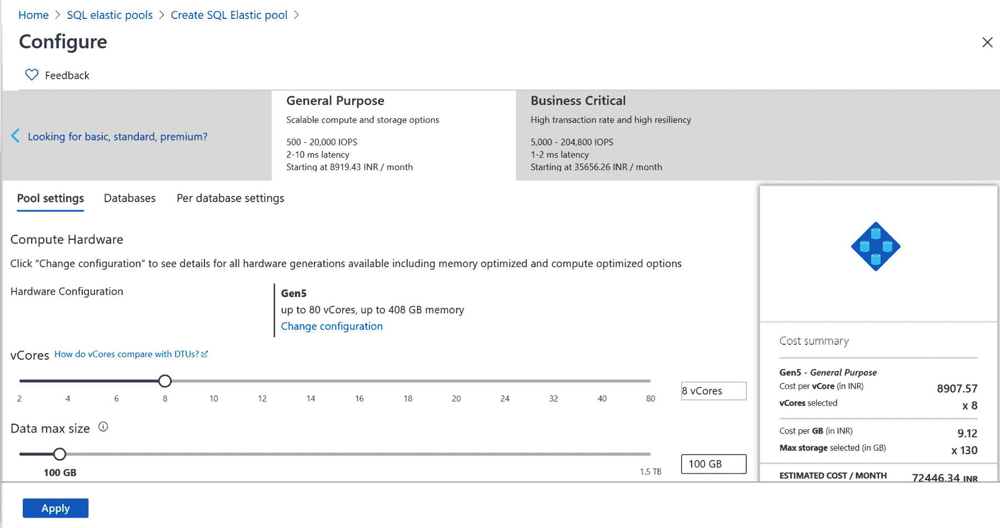

###### 图 7.16：在 vCore 模型中设置弹性池

此外，在前面的图表顶部，你可以看到一个选项，上面写着 **Looking for basic, standard, premium?** 如果选择此项，模型将切换为 DTU 模型。

DTU 基础模型中可用于弹性池的 SKU 如下：

+   基本

+   标准

+   高级

*图 7.17* 显示了每个 SKU 可提供的最大 DTU 数量：

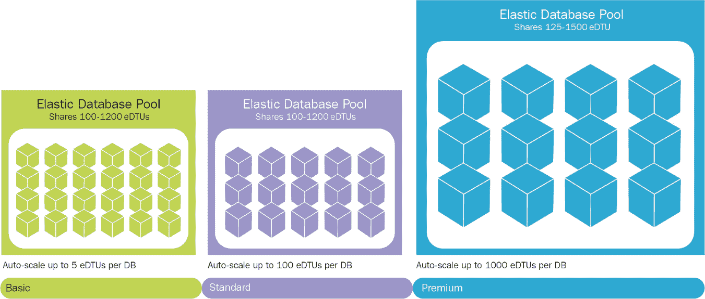

###### 图 7.17：弹性池每个 SKU 的 DTU 数量

针对 Azure SQL 单实例讨论的所有功能同样适用于弹性池；然而，水平可扩展性是一个额外功能，支持分片。分片指的是数据的垂直或水平分区，并将数据存储在不同的数据库中。还可以通过消耗比实际分配的 DTU 更多的 DTU 来实现弹性池中各个数据库的自动扩展。

弹性池还在成本方面提供了另一项优势。你将在后续部分看到，Azure SQL 数据库是按 DTU 定价的，且 DTU 在 SQL Server 服务配置完成后立即分配。无论是否使用这些 DTU，都会对其收费。如果有多个数据库，可以将这些数据库放入弹性池中，并在它们之间共享 DTU。

实现使用 Azure SQL 弹性池分片的所有信息可以在 [`docs.microsoft.com/azure/sql-database/sql-database-elastic-scale-introduction`](https://docs.microsoft.com/azure/sql-database/sql-database-elastic-scale-introduction) 找到。

接下来，我们将讨论托管实例部署选项，它是一种可扩展、智能、基于云的完全托管数据库。

## 托管实例

托管实例是一项独特的服务，提供类似于本地服务器上可用的托管 SQL 服务器。用户可以访问主数据库、模型数据库和其他系统数据库。托管实例非常适合多个数据库和客户将其实例迁移到 Azure。托管实例由多个数据库组成。

Azure SQL 数据库提供了一种新的部署模型，即 Azure SQL 数据库托管实例，它与 SQL Server 企业版数据库引擎几乎 100% 兼容。该模型提供了本地虚拟网络实现，解决了常见的安全问题，是本地 SQL Server 客户非常推荐的业务模型。托管实例允许现有的 SQL Server 客户将其本地应用程序迁移到云端，几乎不需要对应用程序和数据库进行更改，同时保留所有 PaaS 能力。这些 PaaS 能力大大减少了管理开销和总拥有成本，如 *图 7.18* 所示：

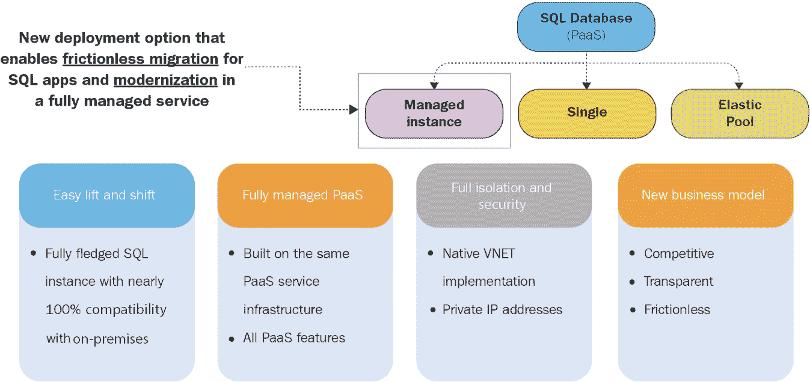

###### 图 7.18：Azure SQL 数据库托管实例

Azure SQL 数据库、Azure SQL 托管实例和在 Azure 虚拟机上的 SQL Server 之间的完整比较可在此查看：[`docs.microsoft.com/azure/azure-sql/azure-sql-iaas-vs-paas-what-is-overview#comparison-table`](https://docs.microsoft.com/azure/azure-sql/azure-sql-iaas-vs-paas-what-is-overview#comparison-table)。

托管实例的关键功能显示在*图 7.19*中：

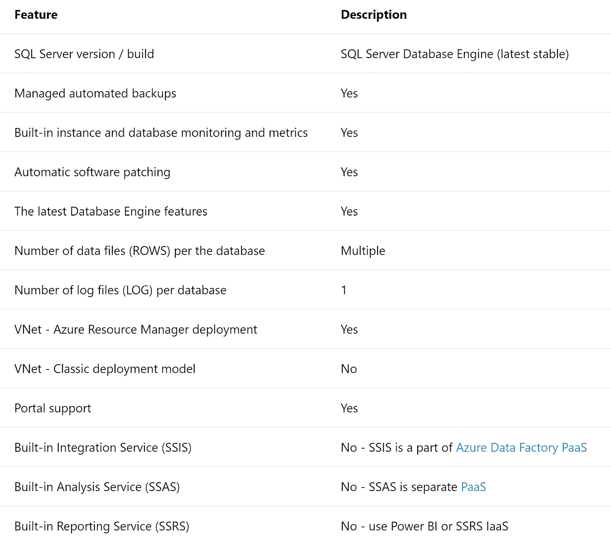

###### 图 7.19：SQL 数据库托管实例功能

我们在本章中提到过 vCPU 定价模型和 DTU 定价模型。现在是时候更仔细地了解这些定价模型了。

## SQL 数据库定价

Azure SQL 之前只有一种定价模型——基于 DTU 的模型——但现在也推出了基于 vCPU 的替代定价模型。定价模型根据客户的需求进行选择。当客户希望使用简单且预配置的资源选项时，选择基于 DTU 的模型；而基于 vCore 的模型则提供选择计算和存储资源的灵活性，同时也提供更多的控制和透明度。

让我们更仔细地看看这些模型。

### 基于 DTU 的定价

DTU 是 Azure SQL 数据库性能衡量的最小单位。每个 DTU 对应一定量的资源。这些资源包括存储、CPU 周期、IOPS 和网络带宽。例如，一个 DTU 可能提供三个 IOPS、少量 CPU 周期，以及 5 毫秒的读操作延迟和 10 毫秒的写操作延迟。

Azure SQL 数据库提供多种 SKU 用于创建数据库，每种 SKU 都有定义的 DTU 最大限制。例如，Basic SKU 只提供**5**个 DTU 和最大**2 GB**的数据，如*图 7.20*所示：

###### 图 7.20：不同 SKU 的 DTU

另一方面，标准 SKU 提供从**10**个 DTU 到**300**个 DTU 之间的任何数量，最大数据量为**250** GB。如你所见，每个 DTU 的费用大约为 991 卢比，或大约$1.40：

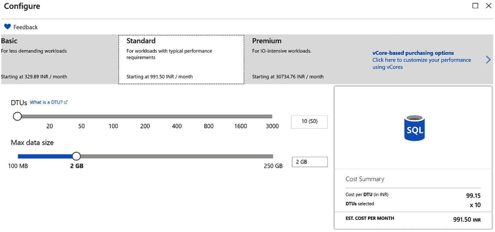

###### 图 7.21：标准 SKU 中选择数量的 DTU 费用总结

Microsoft 提供了这些 SKU 在性能和资源方面的比较，并显示在*图 7.22*中：

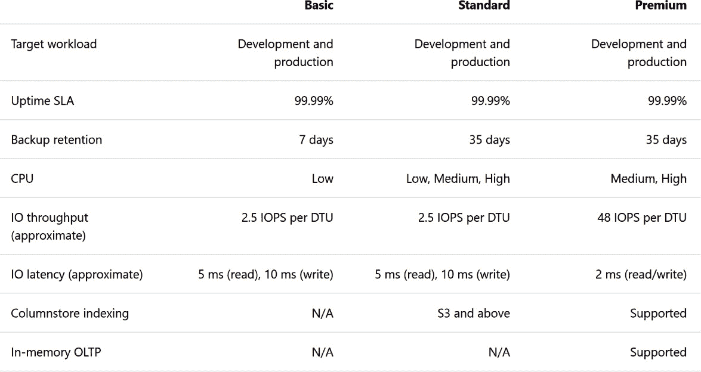

###### 图 7.22：Azure 中的 SKU 比较

一旦你配置了特定数量的 DTU，后端资源（CPU、IOPS 和内存）就会被分配，并且无论是否使用，都需要为其付费。如果采购的 DTU 数量超过实际需要，就会造成浪费；而如果配置的 DTU 数量不足，则会导致性能瓶颈。

正因如此，Azure 提供了弹性池。如您所知，弹性池中有多个数据库，DTU 是分配给弹性池的，而不是单个数据库。池内的所有数据库可以共享 DTU。这意味着，如果某个数据库的使用量较低，仅消耗了 5 个 DTU，则会有其他数据库消耗 25 个 DTU 来进行补偿。

需要注意的是，总体上，DTU 的消耗不能超过为弹性池分配的 DTU 数量。此外，弹性池内的每个数据库应分配最小的 DTU 数量，这个最小的 DTU 数量是预分配给数据库的。

弹性池有自己的 SKU：

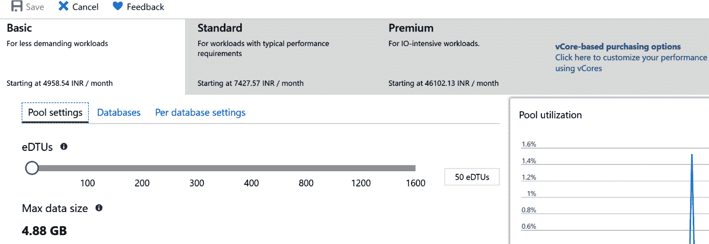

###### 图 7.23：弹性池中的 SKU

此外，单个弹性池中可以创建的数据库数量有限。完整的限制可以在此查看：[`docs.microsoft.com/azure/azure-sql/database/resource-limits-dtu-elastic-pools`](https://docs.microsoft.com/azure/azure-sql/database/resource-limits-dtu-elastic-pools)。

### 基于 vCPU 的定价

这是 Azure SQL 的新定价模型。此定价模型提供了根据服务器分配的**虚拟 CPU**（**vCPU**）数量来采购，而不是为应用设置所需的 DTU 数量的选项。vCPU 是附带硬件的逻辑 CPU，例如存储、内存和 CPU 核心。

在此模型中，有三个 SKU：**通用型**、**超大规模**和**业务关键型**，每个 SKU 提供不同数量的 vCPU 和资源。此定价适用于所有 SQL 部署模型：

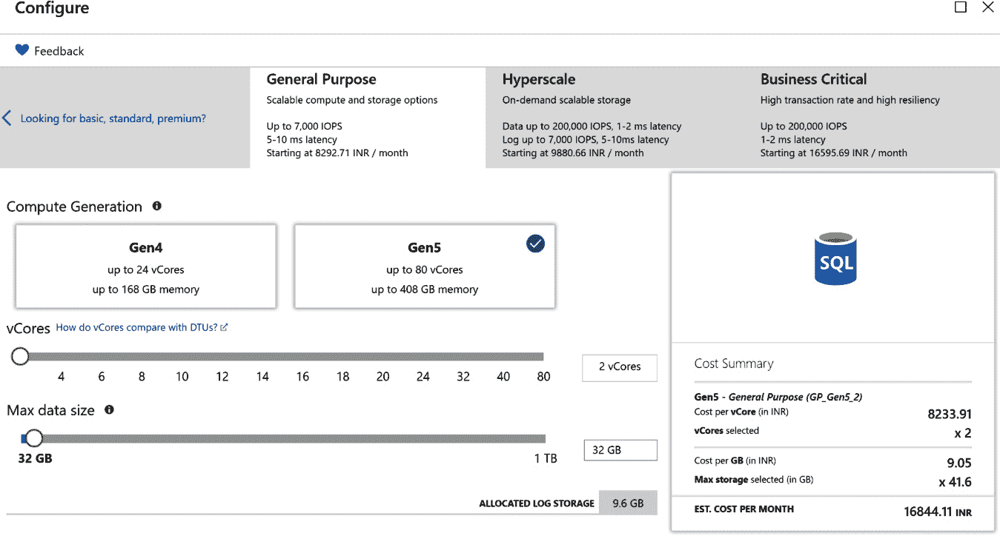

###### 图 7.24：通用 SKU 的 vCPU 定价

### 如何选择合适的定价模型

架构师应能够为 Azure SQL 数据库选择合适的定价模型。DTU 是一种很好的定价机制，适用于有适用和可用使用模式的数据库。由于 DTU 方案中的资源可用性是线性的，如下图所示，数据库的使用可能更多的是内存密集型而非 CPU 密集型。在这种情况下，可以为数据库选择不同级别的 CPU、内存和存储。

在 DTU 模型中，资源是打包在一起的，无法对这些资源进行细粒度配置。而在 vCPU 模型中，可以为不同的数据库选择不同级别的内存和 CPU。如果已知某应用的使用模式，使用 vCPU 定价模型可能比 DTU 模型更合适。事实上，vCPU 模型还为已拥有本地 SQL Server 许可证的组织提供了混合许可证的好处。这些 SQL Server 实例可获得最高 30% 的折扣。

在*图 7.25*中，你可以从左侧的图表看到，随着 DTU 数量的增加，资源可用性也线性增长；然而，在右侧的 vCPU 定价图表中，你可以为每个数据库选择独立的配置：

###### 图 7.25：DTU 和 vCore 模式的存储计算图

有了这些内容，我们可以结束对 Azure SQL 数据库的介绍。我们讨论了与 Azure SQL 数据库相关的不同部署方法、功能、定价和计划。在接下来的章节中，我们将介绍 Cosmos DB，它是一个 NoSQL 数据库服务。

## Azure Cosmos DB

Cosmos DB 是 Azure 真实的跨区域、高可用、分布式、多模型数据库服务。如果你希望你的解决方案具有高度响应性并且始终可用，那么 Cosmos DB 适合你。由于这是一个跨区域的多模型数据库，我们可以将应用程序部署在离用户位置更近的地方，从而实现低延迟和高可用性。

只需点击按钮，就可以在任意数量的 Azure 区域之间扩展吞吐量和存储。为了涵盖几乎所有非关系型数据库的需求，提供了几种不同的数据库模型，包括：

1.  SQL（文档）

1.  MongoDB

1.  Cassandra

1.  表

1.  Gremlin 图

Cosmos DB 中的对象层次结构从 Cosmos DB 账户开始。一个账户可以拥有多个数据库，每个数据库可以拥有多个容器。根据数据库的类型，容器可能包含文档（例如 SQL 的情况）；在 Table 存储中包含半结构化的键值数据；或者如果使用 Gremlin 和 Cassandra 存储 NoSQL 数据，则包含实体及其之间的关系。

Cosmos DB 可用于存储 OLTP 数据。它在事务数据方面符合 ACID 原则，但有一些例外情况。

Cosmos DB 在单个文档级别提供 ACID 要求。这意味着文档中的数据在更新、删除或插入时，其原子性、一致性、隔离性和持久性将得到维护。然而，在文档之外，一致性和原子性需要由开发者自己管理。

Cosmos DB 的定价可以在这里找到：[`azure.microsoft.com/pricing/details/cosmos-db`](https://azure.microsoft.com/pricing/details/cosmos-db)。

*图 7.26* 展示了 Azure Cosmos DB 的一些特性：

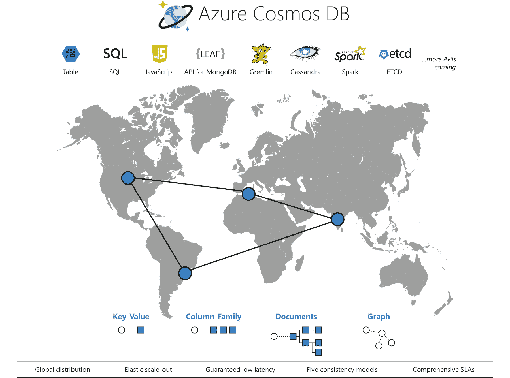

###### 图 7.26：Azure Cosmos DB 概览

在接下来的章节中，我们将介绍 Azure Cosmos DB 的一些关键特性。

### 特性

Azure Cosmos DB 的一些主要优点包括：

+   **全球分布**：可以使用 Azure Cosmos DB 构建全球范围内的高度响应和高可用应用程序。在复制的帮助下，数据副本可以存储在接近用户的 Azure 区域，从而提供更低的延迟和全球分布。

+   **复制：**你可以随时选择是否将数据复制到某个地区。假设你的数据在东部美国地区有一个副本，而你的组织计划在东部美国停用该服务并迁移到英国南部。只需几次点击，你就可以移除东部美国并将英国南部添加到账户中进行复制。

+   **始终在线**：Cosmos DB 提供 99.999% 的高可用性，支持读取和写入。通过 Azure 门户或编程方式，可以触发 Cosmos DB 账户的区域故障切换到其他地区。这确保了应用在发生区域故障时的业务连续性和灾难恢复计划。

+   **可扩展性**：Cosmos DB 提供无与伦比的全球弹性可扩展性，支持读取和写入。其扩展响应非常强大，意味着你可以通过一次 API 调用将请求量从数千增加到数亿次每秒。值得注意的是，这一切是在全球范围内完成的，但你只需要为吞吐量和存储付费。这种可扩展性非常适合应对意外的流量高峰。

+   **低延迟**：如前所述，将数据副本复制到离用户更近的地方可以显著减少延迟，这意味着用户可以在毫秒级别访问数据。Cosmos DB 保证全球范围内的读取和写入延迟低于 10 毫秒。

+   **TCO 节省**：由于 Cosmos DB 是完全托管的服务，客户需要的管理程度较低。此外，客户无需在全球范围内设置数据中心来支持其他地区的用户。

+   **SLA**：它提供 99.999% 的高可用性 SLA。

+   **对开源软件（OSS）** **API**的支持：Cosmos DB 还支持开源软件 API，另一个额外的优势。Cosmos DB 实现了 Cassandra、Mongo DB、Gremlin 和 Azure 表存储的 API。

### 使用案例场景

如果你的应用涉及全球范围的大规模数据读写，那么 Cosmos DB 是理想的选择。这类应用通常包括网页应用、移动应用、游戏和物联网应用。这些应用将从 Cosmos DB 的高可用性、低延迟和全球覆盖中获益。

此外，Cosmos DB 提供的响应时间接近实时。你可以利用 Cosmos DB SDK 开发基于 Xamarin 框架的 iOS 和 Android 应用。

一些使用 Cosmos DB 的热门游戏包括**行尸走肉：无人之地**（由 Next Games 开发）和**光环 5：守护者**。

完整的使用案例和示例列表可以在此找到：[`docs.microsoft.com/azure/cosmos-db/use-cases`](https://docs.microsoft.com/azure/cosmos-db/use-cases)。

Cosmos DB 是 Azure 中用于存储半结构化数据的首选服务，尤其适用于 OLTP 应用程序。我可以单独写一本书来讲解 Cosmos DB 的功能和特性；本节的目的是为你介绍 Cosmos DB 以及它在处理 OLTP 应用程序中的作用。

## 总结

在本章中，你学习到 Azure SQL 数据库是 Azure 的旗舰服务之一。今天，众多客户正在使用此服务，它提供了构建任务关键型数据库管理系统所需的所有企业级功能。

你发现 Azure SQL 数据库有多种部署类型，如单实例、托管实例和弹性池。架构师应该全面评估他们的需求并选择合适的部署模型。选择部署模型后，他们还需要在 DTU 和 vCPU 之间选择定价策略。除此之外，他们还应该配置 Azure SQL 数据库中所有与数据相关的安全性、可用性、灾难恢复、监控、性能和可扩展性需求。

在下一章，我们将讨论如何在 Azure 中构建安全的应用程序。我们将涵盖大多数服务的安全实践和功能。
