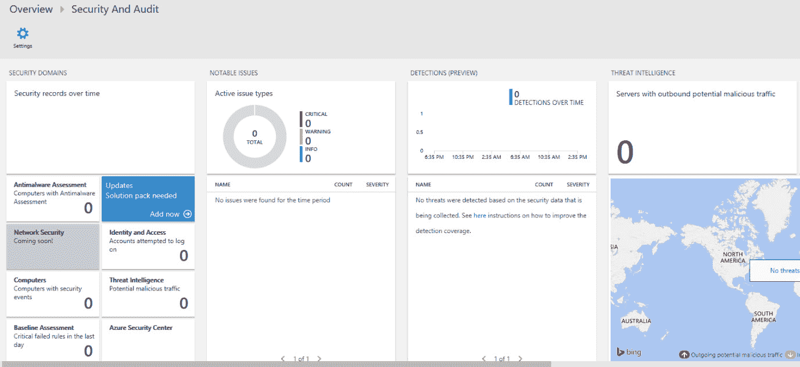
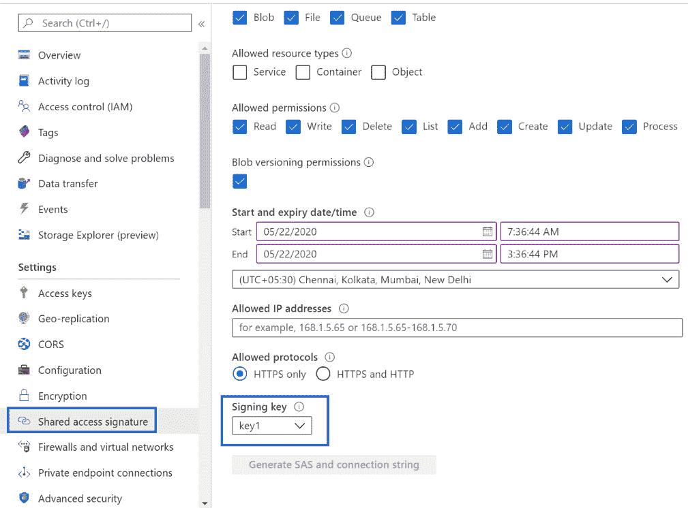
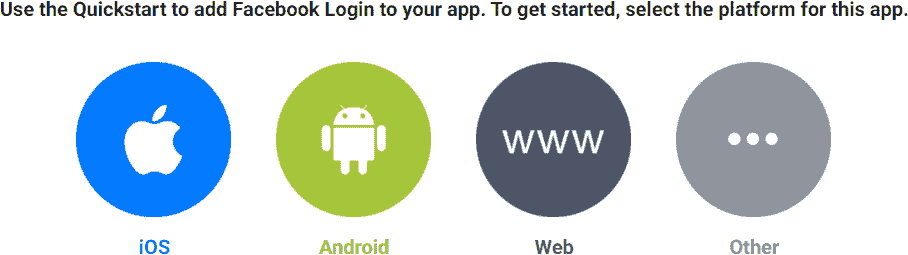
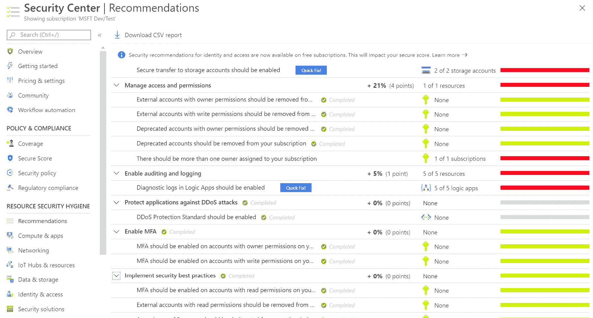

# 8. 在 Azure 上构建安全应用的架构

在上一章中，我们讨论了 Azure 数据服务。由于我们正在处理敏感数据，安全性成为一个大问题。毫无疑问，安全性是架构师必须实现的最重要的非功能性需求。企业非常重视正确实施其安全策略。实际上，安全性是几乎所有利益相关者在应用的开发、部署和管理过程中关注的重点之一。当应用被构建并部署到云时，安全性变得更加重要。

为了帮助你了解如何根据部署的性质保护在 Azure 上的应用，本章将涵盖以下内容：

+   了解 Azure 中的安全性

+   基础设施层的安全性

+   应用层的安全性

+   Azure 应用中的认证与授权

+   使用 OAuth、Azure Active Directory 和其他通过联合身份验证的方法，包括第三方身份提供商如 Facebook

+   了解托管身份并使用它们访问资源

## 安全性

如前所述，安全性是任何软件或服务的重要元素。应实施适当的安全措施，使得应用仅能被允许访问的人使用，且用户不应执行他们无权操作的功能。同样，整个请求-响应机制应该使用确保只有目标方能够理解消息的方法构建，并确保能够轻松检测消息是否已被篡改。

以下原因使得 Azure 中的安全性变得尤为重要。首先，部署应用的组织无法完全控制底层硬件和网络。其次，安全性必须在每一层中构建，包括硬件、网络、操作系统、平台和应用。任何疏漏或配置错误都可能导致应用暴露于入侵者的攻击之下。例如，你可能听说过最近影响 Zoom 会议的漏洞，该漏洞允许黑客即使在会议主持人禁用与会者录音功能时，仍能录制会议。有消息称，数百万个 Zoom 账户已被销售到暗网。公司已经采取了必要的措施来解决这个漏洞。

安全性是当前一个重要的问题，尤其是在云环境中托管应用时，如果处理不当可能会导致严重后果。因此，理解保护工作负载的最佳实践非常必要。随着 DevOps 领域的进展，开发和运维团队借助工具和实践进行有效协作，安全性也成为一个重要关注点。

为了将安全原则和实践作为 DevOps 的重要组成部分，而不影响整体生产力和效率，已经引入了一种新的文化，称为**DevSecOps**。DevSecOps 帮助我们在开发阶段及早识别安全问题，而不是在发布后再进行缓解。在一个将安全作为每个阶段关键原则的开发过程中，DevSecOps 减少了后期雇佣安全专业人员来查找软件安全漏洞的成本。

保护应用程序意味着未知和未经授权的实体无法访问它。这也意味着与应用程序的通信是安全的且未被篡改。包括以下安全措施：

+   **身份验证**：身份验证检查用户的身份，并确保给定的身份可以访问应用程序或服务。在 Azure 中，身份验证使用基于 OAuth 2.0 构建的身份验证协议 OpenID Connect 来执行。

+   **授权**：授权允许并确定身份在应用程序或服务内能够执行的权限。授权在 Azure 中使用 OAuth 来执行。

+   **机密性**：机密性确保用户与应用程序之间的通信保持安全。实体之间的有效载荷交换是加密的，只有发送方和接收方能够理解，而其他人无法解读。消息的机密性通过对称加密和非对称加密来保障。证书用于实现加密，即消息的加密和解密。

    对称加密使用一个共享的密钥，发送方和接收方都使用这个密钥，而非对称加密则使用一对私钥和公钥进行加密，提供更高的安全性。Linux 中的 SSH 密钥对，作为身份验证的工具，就是非对称加密的一个很好的例子。

+   **完整性**：完整性确保发送方和接收方之间的有效载荷和消息交换不会被篡改。接收方收到的消息与发送方发送的消息完全相同。数字签名和哈希是检查传入消息完整性的实现机制。

安全性是服务提供者与服务消费者之间的合作。双方对部署堆栈有不同的控制级别，每方都应实施安全最佳实践，以确保所有威胁被识别并得到缓解。从*第一章，开始使用 Azure*中，我们已经知道云计算大致提供三种模式——IaaS、PaaS 和 SaaS——每种模式在部署堆栈的协作控制上有所不同。每方应对其控制和范围内的组件实施安全实践。若在任何层面或任何一方未实施安全性，整个部署和应用将容易受到攻击。每个组织都需要有一个安全生命周期模型，就像对待任何其他流程一样。这确保了安全实践不断改进，以避免任何安全漏洞。在下一节中，我们将讨论安全生命周期及其如何使用。

### 安全生命周期

安全性通常被视为解决方案的非功能性需求。然而，随着网络攻击数量的增加，现在它被视为每个解决方案的功能性需求。

每个组织都会遵循某种形式的应用生命周期管理。当安全性被视为功能性需求时，它应该遵循与应用开发相同的流程。安全性不应是事后考虑的问题；它应从一开始就成为应用的一部分。在应用的整体规划阶段，安全性也应该进行规划。根据应用的性质，应识别不同类型和类别的威胁，并根据这些识别，应该在范围和应对措施方面进行文档化。应进行威胁建模演练，以说明每个组件可能面临的威胁。这将有助于为应用设计安全标准和政策。这通常是安全设计阶段。下一阶段称为威胁缓解或构建阶段。在这一阶段，实施安全性的代码和配置，以缓解安全威胁和风险。

系统在未经测试之前无法被认为是安全的。应执行适当的渗透测试和其他安全测试，以识别未实施或被忽视的潜在威胁缓解措施。通过测试发现的漏洞将得到修复，生命周期将在应用的整个过程中持续进行。这种应用生命周期管理过程，如*图 8.1*所示，应遵循安全性：


###### 图 8.1：安全生命周期

规划、威胁建模、识别、缓解、测试和修复是一个迭代的过程，即使在应用程序或服务投入使用后，这些过程仍然会继续。应该积极监控整个环境和应用程序，以便主动识别威胁并进行缓解。监控还应启用警报和审计日志，以帮助进行反应性诊断、故障排除以及消除威胁和漏洞。

任何应用程序的安全生命周期从规划阶段开始，最终进入设计阶段。在设计阶段，应用程序的架构被分解成细化的组件，并具有独立的通信和托管边界。威胁是基于它们与其他组件之间的交互以及跨托管边界的交互来识别的。在整体架构中，通过实施适当的安全特性来缓解威胁，一旦缓解措施到位，进一步的测试会验证威胁是否仍然存在。应用程序部署到生产环境并投入使用后，将对其进行安全监控，以检测任何安全漏洞和风险，并采取主动或被动的修复措施。

如前所述，不同的组织有不同的流程和方法来实施安全生命周期；同样，微软提供了有关安全生命周期的完整指导和信息，详细信息请访问[`www.microsoft.com/securityengineering/sdl/practices`](https://www.microsoft.com/securityengineering/sdl/practices)。通过微软分享的实践，每个组织都可以专注于构建更加安全的解决方案。在云计算时代的进步以及企业和客户数据迁移到云端的过程中，学习如何保护这些数据至关重要。在接下来的部分，我们将探讨 Azure 安全性以及不同级别的安全性，这将帮助我们在 Azure 中构建安全的解决方案。

### Azure 安全性

Azure 通过多个 Azure 区域的数据中心提供所有服务。这些数据中心在区域内部以及区域之间互联。Azure 了解它为客户托管着关键任务应用程序、服务和数据，因此必须确保数据中心和区域的安全性是至关重要的。

客户将应用程序部署到云端，是基于他们相信 Azure 会保护他们的应用程序和数据免受漏洞和泄露的威胁。如果这种信任被打破，客户将不会迁移到云端，因此 Azure 在所有层次上实施安全措施，如*图 8.2*所示，从数据中心的物理边界到逻辑软件组件。每一层都有保护措施，甚至 Azure 数据中心团队也无法访问它们：


###### 图 8.2：Azure 数据中心不同层次的安全特性

安全对微软和 Azure 至关重要。微软通过确保客户的部署、解决方案和数据在物理和虚拟层面上都得到完全的保护，从而建立起客户的信任。如果一个云平台不安全，无论是物理还是数字层面的，用户是不会使用它的。

为了确保客户对 Azure 的信任，Azure 开发中的每个活动都从安全角度进行规划、记录、审计和监控。物理 Azure 数据中心受到防止入侵和未经授权访问的保护。事实上，甚至微软的员工和运营团队也无法访问客户的解决方案和数据。以下是 Azure 提供的一些开箱即用的安全功能：

+   **安全用户访问**：只有客户可以访问自己的部署、解决方案和数据。即使是 Azure 数据中心的人员也无法访问客户的资料。客户可以允许其他人访问，但这是由客户自行决定的。

+   **静态数据加密**：Azure 对所有管理数据进行加密，包括各种企业级存储解决方案，以满足不同的需求。微软还为像 Azure SQL 数据库、Azure Cosmos DB 和 Azure Data Lake 等托管服务提供加密。由于数据是静态加密的，因此无法被任何人读取。它还为客户提供此功能，客户可以加密自己的静态数据。

+   **传输加密**：Azure 对所有从其网络传输的数据进行加密，同时确保其网络主干不会受到未经授权的访问。

+   **主动监控和审计**：Azure 会持续主动监控所有数据中心，及时识别任何违反规定、威胁或风险，并加以缓解。

Azure 符合各国、地方、国际及行业特定的合规标准。你可以在[`www.microsoft.com/trustcenter/compliance/complianceofferings`](https://www.microsoft.com/trustcenter/compliance/complianceofferings)上查阅微软合规性服务的完整清单。在部署符合合规要求的解决方案时，务必将其作为参考。现在我们已经了解了 Azure 的主要安全功能，接下来让我们深入探讨 IaaS 安全。在接下来的部分中，我们将探索客户如何利用 Azure 提供的 IaaS 安全功能。

## IaaS 安全

Azure 是一个成熟的 IaaS 解决方案部署平台。许多 Azure 用户希望完全控制他们的部署，这些用户通常会使用 IaaS 来处理他们的解决方案。确保这些部署和解决方案的安全性是至关重要的，无论是默认的还是设计时的。Azure 提供了丰富的安全功能来保护 IaaS 解决方案。在本部分中，我们将介绍一些主要的安全功能。

### 网络安全组

IaaS 部署的最基本组成包括虚拟机和虚拟网络。虚拟机可能通过将公共 IP 分配给其网络接口暴露到互联网，或者仅对内部资源可用。其中一些内部资源可能会反过来暴露到互联网。无论如何，虚拟机应当确保其安全，以便未经授权的请求根本无法到达它们。虚拟机应通过能够过滤网络本身请求的机制进行安全保护，而不是让请求到达虚拟机后再采取行动。

隔离机制（Ring-fencing）是虚拟机使用的安全机制之一。此防护墙可以根据协议、源 IP、目标 IP、源端口和目标端口允许或拒绝请求。此功能通过 Azure **网络安全组**（**NSGs**）资源进行部署。NSGs 由规则组成，评估传入和传出的请求。根据这些规则的执行和评估，决定是否允许或拒绝访问请求。

NSGs 灵活且可以应用于虚拟网络子网或单个网络接口。当应用于子网时，安全规则会应用到该子网上托管的所有虚拟机。另一方面，应用于网络接口时，只影响与该网络接口关联的特定虚拟机的请求。也可以同时将 NSGs 应用到网络子网和网络接口。通常，应该使用这种设计在网络子网级别应用通用安全规则，在网络接口级别应用独特的安全规则。这有助于设计模块化的安全规则。

评估 NSGs 的流程如*图 8.3*所示：


###### 图 8.3：表示评估 NSGs 的流程图

当请求到达 Azure 主机时，根据请求是传入请求还是传出请求，适当的规则会加载并应用到请求/响应上。如果规则与请求/响应匹配，则请求/响应被允许或拒绝。规则匹配由重要的请求/响应信息组成，如源 IP 地址、目标 IP 地址、源端口、目标端口和使用的协议。此外，NSGs 支持服务标签。服务标签表示来自特定 Azure 服务的一组 IP 地址前缀。微软管理这些地址前缀并自动更新，从而消除了每次地址前缀变更时需要更新安全规则的麻烦。

可用于的服务标签集可以在[`docs.microsoft.com/azure/virtual-network/service-tags-overview#available-service-tags`](https://docs.microsoft.com/azure/virtual-network/service-tags-overview#available-service-tags)中找到。服务标签可以与 NSG 一起使用，也可以与 Azure 防火墙一起使用。现在你已经了解了 NSG 的工作原理，我们来看看 NSG 设计，这将帮助你在创建 NSG 规则以提高安全性时，确定应该考虑的主要点。

**NSG 设计**

设计 NSG 的第一步是确定资源的安全需求。应确定或考虑以下内容：

+   该资源仅从互联网可访问吗？

+   该资源是否同时可以从内部资源和互联网访问？

+   该资源仅能从内部资源访问吗？

+   根据正在部署的解决方案架构，确定所依赖的资源、负载均衡器、网关和虚拟机。

+   配置虚拟网络及其子网。

根据这些调查结果，应创建合适的 NSG 设计。理想情况下，每个工作负载和资源类型应该有多个网络子网。建议不要在同一子网上部署负载均衡器和虚拟机。

根据项目需求，应确定适用于不同虚拟机工作负载和子网的通用规则。例如，对于 SharePoint 部署，前端应用程序和 SQL 服务器部署在不同的子网中，因此应该为每个子网确定规则。

在识别常见的子网级规则后，应识别单个资源的规则，并将这些规则应用于网络接口级别。需要理解的是，如果某个规则允许某个端口的入站请求，那么该端口也可以用于发出的请求，而无需额外配置。

如果资源可以通过互联网访问，应尽可能使用特定的 IP 范围和端口创建规则，而不是允许来自所有 IP 范围的流量（通常表示为 0.0.0.0/0）。应执行仔细的功能和安全性测试，以确保打开和关闭了足够且最佳的 NSG 规则。

### 防火墙

NSG 提供请求的外部安全边界。然而，这并不意味着虚拟机不需要实施额外的安全措施。最好同时在内部和外部实施安全性。无论是 Linux 还是 Windows 虚拟机，都提供一种机制来在操作系统级别过滤请求。这在 Windows 和 Linux 中都称为防火墙。

建议为操作系统实现防火墙。它们帮助建立一个虚拟安全墙，只允许那些被认为可信的请求。任何不可信的请求都会被拒绝访问。虽然也有物理防火墙设备，但在云端，通常使用操作系统防火墙。*图 8.4*展示了 Windows 操作系统的防火墙配置：


###### 图 8.4：防火墙配置

防火墙过滤网络数据包，并识别传入的端口和 IP 地址。利用这些数据包中的信息，防火墙评估规则并决定是否允许或拒绝访问。

就 Linux 而言，有多种防火墙解决方案可供选择。某些防火墙方案非常特定于所使用的发行版；例如，SUSE 使用 SuSefirewall2，Ubuntu 使用 ufw。最广泛使用的实现是 firewalld 和 iptables，这些在每个发行版中都可以找到。

**防火墙设计**

作为最佳实践，应该评估每个操作系统的防火墙。每个虚拟机在整体部署和解决方案中都有独特的责任。应该明确这些责任的规则，并根据情况适当地打开和关闭防火墙。

在评估防火墙规则时，重要的是要考虑子网和单个网络接口级别的 NSG 规则。如果没有正确处理，可能会出现规则在 NSG 级别被拒绝，但在防火墙级别保持开放，反之亦然。如果请求在 NSG 级别被允许但在防火墙级别被拒绝，应用程序将无法按预期工作；而如果请求在 NSG 级别被拒绝但在防火墙级别被允许，则安全风险将增加。

防火墙帮助你建立多个通过其安全规则隔离的网络。应该进行仔细的功能性和安全性测试，确保适当且优化的防火墙规则被正确地开启和关闭。

使用 Azure 防火墙最为合理，它是建立在 NSG 之上的云端网络服务。它非常容易设置，提供中央管理功能，并且无需维护。结合 Azure 防火墙和 NSG 可以为虚拟机、虚拟网络，甚至不同的 Azure 订阅之间提供安全性。话虽如此，如果一个解决方案需要额外的安全级别，我们可以考虑实现操作系统级别的防火墙。我们将在接下来的章节中更深入地讨论*Azure 防火墙*。

### 应用程序安全组

NSG（网络安全组）可以应用于虚拟网络子网级别或直接应用于单个网络接口。虽然在子网级别应用 NSG 已经足够，但有时这还不够。在同一个子网内有不同类型的工作负载，每个工作负载需要不同的安全组。可以将安全组分配给虚拟机的单个**网络接口卡**（**NICs**），但如果虚拟机数量很大，这种做法容易变成维护的噩梦。

Azure 有一个相对较新的功能，叫做应用安全组。我们可以创建应用安全组，并将其直接分配给多个 NIC，即使这些 NIC 属于不同子网和资源组中的虚拟机。应用安全组的功能类似于 NSG，只是它提供了一种替代方法，将组分配给网络资源，并在跨资源组和子网分配时提供更多的灵活性。应用安全组可以简化 NSG；然而，它有一个主要的限制。我们可以在安全规则的源和目标中使用一个应用安全组，但当前不支持在源或目标中使用多个应用安全组。

创建规则的最佳实践之一是尽量减少所需的安全规则数量，以避免维护显式规则。在前一节中，我们讨论了如何使用服务标签与 NSG 配合，消除维护每个服务的单独 IP 地址前缀的麻烦。同样，使用应用安全组时，我们可以减少显式 IP 地址和多个规则的复杂性。推荐在可能的情况下使用这种做法。如果你的解决方案要求使用单独的 IP 地址或 IP 地址范围的显式规则，那么才应该选择这种方式。

### Azure 防火墙

在前一节中，我们讨论了如何在 Windows/Linux 操作系统中使用 Azure 防火墙来允许或拒绝通过特定端口和服务的请求与响应。虽然操作系统防火墙在安全方面起着重要作用，并且必须在任何企业部署中实施，但 Azure 提供了一种名为 Azure 防火墙的安全资源，它具有类似的功能，可以基于规则过滤请求并确定是否应允许或拒绝该请求。

使用 Azure 防火墙的优点是，它会在请求到达操作系统之前进行评估。Azure 防火墙是一个网络资源，是一项独立服务，保护虚拟网络级别的资源。任何与虚拟网络直接关联的资源，包括虚拟机和负载均衡器，都可以通过 Azure 防火墙进行保护。

Azure 防火墙是一项高可用、可扩展的服务，不仅能保护基于 HTTP 的请求，还能保护从虚拟网络进出任何类型的请求，包括 FTP、SSH 和 RDP。Azure 防火墙还可以在部署期间跨多个可用性区域，提供更高的可用性。

强烈建议在 Azure 上部署 Azure 防火墙，以保护关键任务工作负载，并结合其他安全措施一起使用。还需注意，即使使用其他服务，如 Azure 应用程序网关和 Azure Front Door，仍应使用 Azure 防火墙，因为这些工具具有不同的作用范围和功能。此外，Azure 防火墙还支持服务标签和威胁情报。在前面的部分中，我们讨论了使用服务标签的优势。威胁情报可以用于在流量来自或去往已知恶意 IP 地址和域时生成警报，这些地址和域记录在微软的威胁情报数据流中。

### 减少攻击面

NSG 和防火墙有助于管理授权请求进入环境。然而，环境不应过度暴露于攻击。系统的表面区域应充分启用以实现其功能，但应禁用足够的部分，以便攻击者无法找到漏洞并访问那些没有预期用途或没有足够安全保护的开放区域。安全性应充分加固，使任何攻击者都难以入侵系统。

应该完成的一些配置包括以下内容：

+   从操作系统中移除所有不必要的用户和组。

+   确定所有用户的组成员身份。

+   使用目录服务实施组策略。

+   阻止脚本执行，除非它是由受信任的机构签名的。

+   记录并审计所有活动。

+   安装恶意软件和防病毒软件，定期进行扫描，并频繁更新定义。

+   禁用或关闭不需要的服务。

+   锁定文件系统，只允许授权访问。

+   锁定对注册表的更改。

+   必须根据要求配置防火墙。

+   PowerShell 脚本执行应设置为`Set-ExecutionPolicy -ExecutionPolicy Restricted`或`Set-ExecutionPolicy -ExecutionPolicy RemoteSigned` PowerShell 命令。

+   通过 Internet Explorer 启用增强保护。

+   限制创建新用户和组的权限。

+   移除互联网访问权限，并为 RDP 实施跳板服务器。

+   禁止通过互联网使用 RDP 登录到服务器。相反，应该使用站点到站点 VPN、点对站点 VPN 或 ExpressRoute 通过网络内部远程登录到远程计算机。

+   定期部署所有安全更新。

+   在环境中运行安全合规性管理工具，并实施其所有建议。

+   使用安全中心和操作管理套件主动监控环境。

+   部署虚拟网络设备，将流量路由到内部代理和反向代理。

+   所有敏感数据，如配置、连接字符串和凭据，应该进行加密。

上述内容是从安全角度应该考虑的一些关键点。这个列表将不断扩展，我们需要不断改进安全性，以防止任何形式的安全漏洞。

### 实现跳板服务器

从虚拟机中移除互联网访问是一个好主意。限制远程桌面服务从互联网访问虚拟机也是一种良好的做法，但那么如何访问虚拟机呢？一种可行的方法是仅允许内部资源通过 Azure VPN 选项进行 RDP 访问虚拟机。然而，还有另一种方法——使用**跳板服务器**。

跳板服务器是部署在**隔离区**（**DMZ**）中的服务器。这意味着它不在托管核心解决方案和应用程序的网络上，而是位于一个单独的网络或子网中。跳板服务器的主要目的是接受用户的 RDP 请求，并帮助他们登录。通过这个跳板服务器，用户可以进一步通过 RDP 连接到其他虚拟机。它可以访问两个或多个网络：一个是与外部世界连接的网络，另一个是与解决方案内部网络连接的网络。跳板服务器实施所有安全限制，并提供一个安全客户端来连接到其他服务器。通常，跳板服务器会禁用访问电子邮件和互联网。

使用 Azure 资源管理器模板部署带有**虚拟机规模集**（**VMSS**）的跳板服务器示例，请访问 [`azure.microsoft.com/resources/templates/201-vmss-windows-jumpbox`](https://azure.microsoft.com/resources/templates/201-vmss-windows-jumpbox)。

### Azure Bastion

在上一节中，我们讨论了实现跳板服务器。Azure Bastion 是一个完全托管的服务，可以在虚拟网络中进行配置，以便通过 TLS 在 Azure 门户中直接为您的虚拟机提供 RDP/SSH 访问。Bastion 主机将充当跳板服务器，消除了为虚拟机配置公共 IP 地址的需求。使用 Bastion 的概念与实现跳板服务器相同；然而，由于这是一个托管服务，因此完全由 Azure 管理。

由于 Bastion 是 Azure 提供的完全托管服务，并且内部已经进行了加固，因此我们无需在 Bastion 子网中应用额外的 NSG（网络安全组）。另外，由于我们没有为虚拟机附加任何公共 IP，它们就可以防止端口扫描。

## 应用安全

Web 应用可以在基于 IaaS 的解决方案中托管，这些解决方案建立在虚拟机之上，也可以在 Azure 提供的托管服务中托管，例如应用服务（App Service）。应用服务是 PaaS 部署模式的一部分，我们将在下一节中详细介绍。在这一节中，我们将探讨应用层安全性。

### SSL/TLS

**安全套接层**（**SSL**）现在已经被弃用，取而代之的是**传输层安全性**（**TLS**）。TLS 通过加密提供端到端的安全性。它提供了两种类型的加密：

+   对称加密：发送者和接收者都可以使用相同的密钥，该密钥用于加密和解密消息。

+   非对称加密：每个利益相关者都有两把密钥——一把私钥和一把公钥。私钥保留在服务器上或用户手中并保持机密，而公钥可以自由分发给所有人。公钥持有者使用它来加密信息，而该信息只能通过对应的私钥解密。由于私钥保留在所有者手中，只有他们才能解密信息。**Rivest–Shamir–Adleman**（**RSA**）是用于生成这些公私密钥对的算法之一。

+   这些密钥也可以通过证书的形式提供，这些证书通常被称为 X.509 证书，尽管证书除了包含密钥外，还有更多的详细信息，并且通常由受信任的证书颁发机构签发。

Web 应用程序应该使用 TLS 来确保用户与服务器之间的消息交换是安全和机密的，并且身份得到保护。这些证书应该从受信任的证书颁发机构购买，而不是自签名证书。

### 托管身份

在我们了解托管身份之前，了解没有托管身份时应用程序是如何构建的非常重要。

传统的应用程序开发方式是在配置文件中使用机密，例如用户名、密码或 SQL 连接字符串。将这些机密放入配置文件使得对这些机密的应用程序更改变得容易且灵活，而无需修改代码。它帮助我们遵循“对扩展开放，对修改封闭”的原则。然而，从安全角度来看，这种方法有一个缺点。任何能够访问配置文件的人都可以查看这些机密，因为通常这些机密以明文列在其中。虽然有一些方法可以加密它们，但它们并非万无一失。

在应用程序中使用密钥和凭证的更好方法是将其存储在像 Azure Key Vault 这样的机密库中。Azure Key Vault 提供了通过**硬件安全模块**（**HSM**）的完全安全性，并且机密以加密方式存储，并通过存储在独立硬件中的密钥进行按需解密。机密可以存储在 Key Vault 中，每个机密都有一个显示名称和密钥。密钥以 URI 的形式存在，应用程序可以使用它来引用机密，如*图 8.5*所示：


###### 图 8.5：将机密存储在密钥库中

在应用程序配置文件中，我们可以使用名称或密钥来引用机密。然而，现在又有一个新挑战。应用程序如何连接到并验证密钥保管库？

密钥保管库有访问策略，定义了用户或组在密钥保管库中访问密钥和凭证的权限。可以提供访问权限的用户、组或服务应用程序都在**Azure Active Directory**（**Azure AD**）中配置和托管。尽管可以通过密钥保管库的访问策略为单个用户账户提供访问权限，但更好的做法是使用服务主体来访问密钥保管库。服务主体有一个标识符，也称为应用程序 ID 或客户端 ID，以及一个密码。可以使用客户端 ID 和密码来验证 Azure 密钥保管库。这种服务主体可以被授权访问机密。Azure 密钥保管库的访问策略在密钥保管库的**访问策略**窗格中授予。在*图 8.6*中，您可以看到服务主体—**https://keyvault.book.com**—已获得访问名为 **keyvaultbook** 的密钥保管库的权限：


###### 图 8.6：授予服务主体访问密钥保管库的权限

这引出了另一个挑战：要访问密钥保管库，我们需要在配置文件中使用客户端 ID 和密钥来连接到密钥保管库，获取密钥，并检索其值。这几乎相当于在配置文件中使用用户名、密码和 SQL 连接字符串。

这就是托管身份可以发挥作用的地方。Azure 推出了托管服务身份，并随后将其更名为托管身份。托管身份是由 Azure 管理的身份。在后台，托管身份还会创建一个服务主体，并附带一个密码。通过托管身份，您无需将凭证放入配置文件中。

托管身份只能用于与支持 Azure AD 作为身份提供者的服务进行身份验证。托管身份仅用于身份验证。如果目标服务没有为该身份提供**基于角色的访问控制**（**RBAC**）权限，则该身份可能无法在目标服务上执行其预期的操作。

托管身份有两种类型：

+   系统分配的托管身份

+   用户分配的托管身份

系统分配的身份由服务本身生成。例如，如果应用服务想要连接到 Azure SQL 数据库，它可以在其配置选项中生成系统分配的托管身份。这些托管身份在父资源或服务删除时也会被删除。如*图 8.7*所示，系统分配的身份可以由应用服务用于连接 Azure SQL 数据库：


###### 图 8.7：为应用服务启用系统分配的托管标识

用户分配的托管标识是作为独立的单独标识创建的，之后将其分配给 Azure 服务。由于其生命周期不依赖于它们所分配的资源，它们可以应用并在多个 Azure 服务中重复使用。

一旦托管标识被创建并且通过 RBAC 或访问权限赋予目标资源，它就可以在应用程序中用于访问目标资源和服务。

Azure 提供了一个 SDK 和一个 REST API，用于与 Azure AD 交互并获取托管标识的访问令牌，然后使用该令牌访问和消费目标资源。

SDK 是 `Microsoft.Azure.Services.AppAuthentication` NuGet 包的一部分，适用于 C#。一旦访问令牌可用，它就可以用来消费目标资源。

获取访问令牌所需的代码如下：

```
var tokenProvider = new AzureServiceTokenProvider();
string token = await tokenProvider.GetAccessTokenAsync("https://vault.azure.net");
```

或者，使用此方法：

```
string token = await tokenProvider.GetAccessTokenAsync("https://database.windows.net");
```

应该注意，应用程序代码需要在应用服务或函数应用的上下文中运行，因为标识是附加在它们上的，只有在从这些上下文中运行时，代码才能访问标识。

上面的代码有两个不同的使用场景。访问密钥库和 Azure SQL 数据库的代码是一起展示的。

需要注意的是，应用程序不会在代码中提供任何与托管标识相关的信息，所有这些信息都通过配置进行完全管理。开发人员、单个应用程序管理员和操作员不会接触到任何与托管标识相关的凭证，而且在代码中也没有提到它们。凭证轮换完全由托管 Azure 服务的资源提供者进行管理。默认情况下，每 46 天会进行一次轮换。如果需要，资源提供者可以要求新的凭证，因此提供者可能会等超过 46 天才请求新的凭证。

在下一节中，我们将讨论一个云原生的**安全信息和事件管理器**（**SIEM**）：Azure Sentinel。

## Azure Sentinel

Azure 提供了一个 SIEM 和**安全编排自动响应**（**SOAR**）作为一个独立服务，可以与任何自定义部署的 Azure 服务集成。*图 8.8* 显示了 Azure Sentinel 的一些关键功能：


###### 图 8.8：Azure Sentinel 的关键功能

Azure Sentinel 收集来自部署和资源的信息日志，并进行分析，以找出与各种安全问题相关的模式和趋势，这些问题从数据源中提取。

应该对环境进行主动监控，收集日志，并从这些日志中提取信息，作为与代码实现分离的单独活动。这时，SIEM 服务发挥了作用。Azure Sentinel 可以使用许多连接器；这些连接器将用于向 Azure Sentinel 添加数据源。Azure Sentinel 提供了与 Microsoft 服务（如 Office 365、Azure AD 和 Azure 威胁保护）兼容的连接器。收集到的数据将被馈送到日志分析工作区，您可以编写查询来搜索这些日志。

像 Azure Sentinel 这样的 SIEM 工具可以在 Azure 上启用，从日志分析和 Azure 安全中心获取所有日志，而这些日志又可以从多个来源、部署和服务中获取。SIEM 然后可以在收集到的数据上运行其智能分析并生成洞察。它可以根据发现的智能生成报告和仪表板供消费使用，但它也可以调查可疑活动和威胁，并对其采取行动。

虽然 Azure Sentinel 在功能上可能与 Azure 安全中心非常相似，但 Azure Sentinel 的功能远超过 Azure 安全中心。它通过使用连接器从其他途径收集日志的能力，使其与 Azure 安全中心有所不同。

## PaaS 安全性

Azure 提供了许多 PaaS 服务，每个服务都有自己的安全特性。通常，PaaS 服务可以通过凭据、证书和令牌进行访问。PaaS 服务允许生成短期有效的安全访问令牌。客户端应用程序可以发送这些安全访问令牌来表示受信任的用户。在本节中，我们将介绍一些在几乎所有解决方案中使用的最重要的 PaaS 服务。

### Azure Private Link

Azure Private Link 提供通过虚拟网络中的私有端点访问 Azure PaaS 服务以及 Azure 托管的客户拥有/合作伙伴共享服务。在使用 Azure Private Link 时，我们不必将服务暴露到公共互联网，并且我们服务与虚拟网络之间的所有流量都通过微软的骨干网络进行。

Azure Private Endpoint 是一种网络接口，可帮助私密且安全地连接到由 Azure Private Link 提供支持的服务。由于私有端点映射到 PaaS 服务的实例，而不是整个服务，因此用户只能连接到资源。对任何其他服务的连接都会被拒绝，这样可以防止数据泄露。Private Endpoint 还允许您通过 ExpressRoute 或 VPN 隧道从本地安全访问。这消除了设置公共对等连接或通过公共互联网访问服务的需求。

### Azure 应用程序网关

Azure 提供了一个称为 Azure 应用网关的 7 层负载均衡器，它不仅可以进行负载均衡，还可以根据 URL 中的值进行路由。它还具有称为 Web 应用程序防火墙的功能。Azure 应用网关支持在网关处终止 TLS，因此后端服务器将收到未加密的流量。这有几个优点，如更好的性能，更好地利用后端服务器以及数据包的智能路由。在前面的部分中，我们讨论了 Azure 防火墙及其如何在网络层保护资源。另一方面，Web 应用程序防火墙则在应用程序层保护部署。

任何部署在互联网上的应用程序都面临着多种安全挑战。以下是一些重要的安全威胁：

+   跨站脚本攻击

+   远程代码执行

+   SQL 注入

+   **拒绝服务** (**DoS**) 攻击

+   **分布式拒绝服务** (**DDoS**) 攻击

当然，还有更多的安全威胁。

开发人员可以通过编写防御性代码并遵循最佳实践来解决大量这些攻击；然而，仅仅是代码不应该负责在实时网站上识别这些问题。Web 应用程序防火墙配置规则可以识别此类问题，并拒绝请求，正如前文所述。

建议使用应用网关 Web 应用程序防火墙功能来保护应用程序免受实时安全威胁。Web 应用程序防火墙将根据配置的方式要么允许请求通过，要么阻止它。

### Azure 前门

Azure 推出了一个相对较新的服务，称为 Azure 前门。Azure 前门的角色与 Azure 应用网关非常相似；然而，它在范围上有所不同。虽然应用网关在单个区域内工作，但 Azure 前门在全球范围内跨区域和数据中心工作。它也有一个 Web 应用程序防火墙，可以配置以保护部署在多个区域中的应用程序免受各种安全威胁，如 SQL 注入、远程代码执行和跨站脚本攻击。

应用网关可以部署在 Front Door 后面以解决连接排干。此外，将应用网关部署在 Front Door 后面还将有助于负载均衡需求，因为 Front Door 只能在全局层面进行基于路径的负载均衡。在架构中添加应用网关将为虚拟网络中的后端服务器提供进一步的负载均衡。

### Azure 应用服务环境

Azure App Service 部署在共享网络中，并且在后台运行。所有 App Service 的 SKU 都使用虚拟网络，这些虚拟网络也可能被其他租户使用。为了更好地控制和确保在 Azure 上安全部署 App Service，可以将服务托管在专用虚拟网络上。可以通过使用 **Azure App Service Environment**（**ASE**）实现这一点，它提供完全隔离的环境，以高规模运行你的 App Service。这还通过允许你部署 Azure 防火墙、应用安全组、NSG、应用网关、Web 应用防火墙和 Azure Front Door 提供额外的安全性。所有在 App Service Environment 中创建的 App Service 计划将位于隔离的定价层，且无法选择其他层次。

这个虚拟网络和计算的所有日志可以在 Azure Log Analytics 和 Security Center 中整理，最终与 Azure Sentinel 配合使用。

然后，Azure Sentinel 可以提供洞察并执行工作簿和运行簿，以自动化方式响应安全威胁。安全行动手册可以在 Azure Sentinel 中响应警报时运行。每个安全行动手册包含在警报发生时需要采取的措施。安全行动手册基于 Azure Logic Apps，这使你可以自由使用并自定义与 Logic Apps 一起提供的内置模板。

### Log Analytics

Log Analytics 是一个新的分析平台，用于管理云部署、内部数据中心和混合解决方案。

它提供了多个模块化解决方案——一种帮助实现特定功能的功能。例如，安全和审计解决方案帮助获取组织部署的完整安全视图。同样，还有许多其他解决方案，如自动化和变更跟踪，应该从安全角度实施。Log Analytics 的安全和审计服务提供以下五个类别的信息：

+   **安全领域**：这些提供了查看安全记录、恶意软件评估、更新评估、网络安全、身份和访问信息，以及具有安全事件的计算机的能力。还可以访问 Azure Security Center 控制面板。

+   **反恶意软件评估**：这有助于识别未受到恶意软件保护且存在安全问题的服务器。它提供有关潜在安全问题暴露的信息，并评估任何风险的严重性。用户可以根据这些建议采取主动措施。Azure Security Center 子类别提供由 Azure Security Center 收集的信息。

+   **显著问题**：这可以快速识别活动问题并评估其严重性。

+   **检测**：此类别处于预览模式。它通过可视化安全警报来识别攻击模式。

+   **威胁情报**：通过可视化拥有外发恶意 IP 流量的服务器总数、恶意威胁类型以及显示这些 IP 来源的地图，帮助识别攻击模式。

在门户中查看上述详细信息时，如*图 8.9*所示：



###### 图 8.9：在 Log Analytics 的“安全与审计”面板中显示的信息

现在你已经了解了 PaaS 服务的安全性，接下来让我们探索如何保护存储在 Azure 存储中的数据。

## Azure 存储

存储帐户在整体解决方案架构中扮演重要角色。存储帐户可以存储重要信息，如用户的**个人可识别信息**（**PII**）数据、商业交易以及其他敏感和机密数据。确保存储帐户安全并仅允许授权用户访问至关重要。存储的数据在传输时会进行加密，并使用安全通道传输。存储本身，以及使用存储帐户及其数据的用户和客户端应用程序，在数据整体安全性中扮演着至关重要的角色。数据应该始终保持加密状态。这也包括连接到数据存储的凭证和连接字符串。

Azure 提供 RBAC 来管理谁可以管理 Azure 存储帐户。这些 RBAC 权限赋予 Azure AD 中的用户和组。然而，当要部署到 Azure 的应用程序创建时，它将拥有不在 Azure AD 中的用户和客户。为了让用户能够访问存储帐户，Azure 存储提供存储访问密钥。存储帐户级别有两种访问密钥——主密钥和辅助密钥。拥有这些密钥的用户可以连接到存储帐户。这些存储访问密钥在访问存储帐户时用于身份验证步骤。应用程序可以使用主密钥或辅助密钥来访问存储帐户。提供两把密钥是为了防止主密钥被泄露时，应用程序可以更新为使用辅助密钥，同时主密钥被重新生成。这有助于最小化应用程序停机时间。此外，它通过移除被泄露的密钥来提高安全性，而不影响应用程序。通过 Azure 门户查看存储密钥详情，如*图 8.10*所示：


###### 图 8.10：存储帐户的访问密钥

Azure 存储提供四种服务——blob、文件、队列和表格——在一个帐户中。每项服务还提供用于其自身安全性的基础设施，采用安全访问令牌。

**共享访问签名**（**SAS**）是一个 URI，它授予对 Azure 存储服务（如 Blob、文件、队列和表格）的受限访问权限。这些 SAS 令牌可以与不应信任整个存储账户密钥的客户端共享，从而限制对特定存储账户资源的访问。通过将 SAS URI 分发给这些客户端，可以在指定的时间段内授予资源访问权限。

SAS 令牌存在于存储账户及单个 Blob、文件、表格和队列级别。存储账户级别的签名功能更强大，具有在单个服务级别上允许或拒绝权限的权利。它还可以替代单个资源服务级别使用。

SAS 令牌提供了对资源的精细访问控制，并且可以组合使用。这些令牌包括读取、写入、删除、列出、添加、创建、更新和处理权限。此外，在生成 SAS 令牌时，还可以确定对资源的访问权限。可以单独针对 Blob、表格、队列和文件，也可以对它们的组合进行访问控制。存储账户密钥适用于整个账户，无法针对单个服务进行限制——也无法从权限角度进行限制。创建和撤销 SAS 令牌比存储账户访问密钥要容易得多。SAS 令牌可以为指定时间段创建，过期后自动失效。

需要注意的是，如果存储账户密钥被重新生成，那么基于这些密钥的 SAS 令牌将失效，需要创建新的 SAS 令牌并与客户端共享。在*图 8.11*中，您可以看到选择范围、权限、开始日期、结束日期、允许的 IP 地址、允许的协议和签名密钥的选项，以创建 SAS 令牌：



###### 图 8.11：创建 SAS 令牌

如果我们正在重新生成`key1`（之前用于签署 SAS 令牌的密钥），那么我们需要使用`key2`或新的`key1`创建一个新的 SAS 令牌。

Cookie 偷窃、脚本注入和 DoS 攻击是攻击者常用的破坏环境和窃取数据的手段。浏览器和 HTTP 协议实现了内建机制，确保无法执行这些恶意活动。通常，任何跨域的请求都不被 HTTP 或浏览器允许。一个域中的脚本无法请求另一个域的资源。然而，在某些有效的用例中，应该允许此类请求。HTTP 协议实现了**跨域资源共享**（**CORS**）。借助 CORS，可以跨域访问资源并使其工作。Azure 存储为 blob、文件、队列和表资源配置 CORS 规则。Azure 存储允许创建在每个身份验证请求中进行评估的规则。如果规则满足，请求将被允许访问该资源。在图 8.12 中，您可以看到如何为每个存储服务添加 CORS 规则：


###### 图 8.12：为存储账户创建 CORS 规则

数据不仅在传输过程中必须得到保护；在静态状态下也应该得到保护。如果静态数据没有加密，任何有权限访问数据中心物理硬盘的人都能读取这些数据。尽管数据泄露的可能性微乎其微，客户仍然应该加密他们的数据。存储服务加密有助于保护静态数据。该服务透明地工作，且用户无需知晓。它在数据保存到存储账户时进行加密，并在数据读取时自动解密。整个过程无需用户进行任何额外操作。

Azure 账户密钥必须定期轮换。这将确保攻击者无法访问存储账户。

重新生成密钥也是一个好主意；然而，必须根据其在现有应用程序中的使用情况进行评估。如果它破坏了现有应用程序，那么这些应用程序应优先考虑变更管理，并且变更应逐步应用。

始终建议为每个服务使用具有有限时间范围的独立 SAS 令牌。此令牌应仅提供给需要访问资源的用户。始终遵循最小权限原则，仅提供必要的权限。

SAS 密钥和存储账户密钥应存储在 Azure 密钥保管库中。这提供了安全的存储和访问方式。应用程序可以在运行时从密钥保管库读取这些密钥，而不是将它们存储在配置文件中。

此外，您还可以使用 Azure AD 来授权对 Blob 和队列存储的请求。我们将使用 RBAC（角色基于访问控制）为服务主体授予必要的权限，一旦我们使用 Azure AD 对服务主体进行身份验证，将生成一个 OAuth 2.0 令牌。该令牌可以添加到 API 调用的授权头中，以授权对 Blob 或队列存储的请求。微软建议在使用 Blob 和队列应用程序时使用 Azure AD 授权，因为 Azure AD 提供了更强的安全性，并且相比于 SAS 令牌更为简便。

在下一节中，我们将评估 Azure SQL 数据库的安全选项。

## Azure SQL

SQL Server 在 Azure 上存储关系数据，它是一个托管的关系数据库服务。它也被称为**数据库即服务**（**DBaaS**），为数据存储提供了一个高可用、可扩展、注重性能并且安全的平台。它可以从任何地方、使用任何编程语言和平台访问。客户端需要一个包含服务器、数据库和安全信息的连接字符串才能连接到该服务。

SQL Server 提供防火墙设置，默认情况下防止任何人访问。IP 地址和范围应列入白名单才能访问 SQL Server。架构师应仅允许他们信任的、属于客户或合作伙伴的 IP 地址。对于一些在 Azure 上部署的应用程序，可能有很多 IP 地址或这些 IP 地址是未知的，例如部署在 Azure Functions 或 Logic Apps 中的应用程序。为了使此类应用程序能够访问 Azure SQL，Azure SQL 允许将所有 IP 地址列入白名单，以便跨订阅的 Azure 服务能够访问。

需要注意的是，防火墙配置是在服务器级别而不是数据库级别。这意味着在此处进行的任何更改都会影响服务器中的所有数据库。在*图 8.13*中，您可以看到如何将客户端的 IP 地址添加到防火墙中以授予访问服务器的权限：


###### 图 8.13：配置防火墙规则

Azure SQL 还通过加密静态数据提供了增强的安全性。这确保没有人，包括 Azure 数据中心的管理员，能够查看存储在 SQL Server 中的数据。SQL Server 用于加密静态数据的技术被称为**透明数据加密**（**TDE**）。实施 TDE 不需要在应用程序级别进行任何更改。SQL Server 会在用户保存和读取数据时透明地加密和解密数据。此功能在数据库级别可用。我们还可以将 TDE 与 Azure Key Vault 集成，使用**自带密钥**（**BYOK**）功能。通过使用 BYOK，我们可以在 Azure Key Vault 中使用客户管理的密钥来启用 TDE。

SQL Server 还提供**动态数据屏蔽**（**DDM**），这对于屏蔽某些类型的数据（如信用卡详情或用户个人身份信息数据）特别有用。屏蔽与加密不同，屏蔽并不加密数据，而是只将其遮蔽，从而确保数据不以人类可读的格式呈现。用户应在 Azure SQL Server 中屏蔽并加密敏感数据。

SQL Server 还为所有服务器提供审计和威胁检测服务。这些数据库上运行着先进的数据收集和智能服务，用于发现威胁和漏洞，并提醒用户。审计日志由 Azure 保存在存储帐户中，管理员可以查看并采取行动。像 SQL 注入和匿名客户端登录等威胁可以生成警报，管理员可以通过电子邮件接收通知。在*图 8.14*中，您可以看到如何启用威胁检测：


###### 图 8.14：启用威胁保护并选择要检测的威胁类型

数据可以在 Azure SQL 中被屏蔽。这样可以以无法被人类读取的格式存储数据：


###### 图 8.15：配置设置以屏蔽数据

Azure SQL 还提供 TDE 来加密静态数据，如*图 8.16*所示：


###### 图 8.16：启用 TDE

要对 SQL Server 进行漏洞评估，您可以利用 SQL 漏洞评估，它是高级 SQL 安全功能统一包“高级数据安全”的一部分。SQL 漏洞评估可供客户主动使用，通过发现、跟踪并帮助修复潜在的数据库漏洞，从而提高数据库的安全性。

在前面的部分中，我们已经多次提到 Azure 密钥库，当时我们讨论了托管身份、SQL 数据库等。现在您已经了解了 Azure 密钥库的用途，在接下来的部分中，我们将探讨一些方法，帮助您保护密钥库的内容。

## Azure 密钥库

使用密码、密钥、凭证、证书和唯一标识符来保护资源是任何环境和应用程序从安全角度来看至关重要的一个环节。这些资源需要得到保护，确保它们保持安全且不被泄露是安全架构的重要支柱。管理和操作这些秘密和密钥的安全，同时确保在需要时能够访问它们，是不能忽视的重要方面。通常，这些秘密资源无处不在——在源代码中、配置文件里、纸张上以及其他数字格式中。为了克服这些挑战并将所有秘密资源统一存储在集中式的安全存储中，应使用 Azure Key Vault。

Azure Key Vault 与其他 Azure 服务紧密集成。例如，使用存储在 Azure Key Vault 中的证书并将其部署到 Azure 虚拟机的证书存储中是非常容易的。各种类型的密钥，包括存储密钥、IoT 密钥和事件密钥、连接字符串，都可以作为秘密存储在 Azure Key Vault 中。它们可以被透明地检索并使用，无需任何人查看或临时存储它们。SQL Server 和其他服务的凭证也可以存储在 Azure Key Vault 中。

Azure Key Vault 是基于每个区域运作的。这意味着 Azure Key Vault 资源应部署在与应用程序和服务相同的区域。如果部署涉及多个区域并需要 Azure Key Vault 服务，则应配置多个 Azure Key Vault 实例。

Azure Key Vault 的一个重要特点是，秘密、密钥和证书不会存储在一般存储中。这些敏感数据由 HSM（硬件安全模块）备份。这意味着这些数据存储在 Azure 上的独立硬件中，只有拥有密钥的用户才能解锁。为了提供额外的安全性，您还可以为 Azure Key Vault 实施虚拟网络服务终端。这将限制对密钥库的访问，仅限特定的虚拟网络。您还可以限制对某个 IPv4 地址范围的访问。

在 *Azure 存储* 部分，我们讨论了使用 Azure AD 来授权对 Blob 和队列的请求。提到我们使用的是从 Azure AD 获取的 OAuth 令牌，用于认证 API 调用。在接下来的部分中，您将学习如何使用 OAuth 进行身份验证和授权。完成下一部分后，您将能够将其与我们在 *Azure 存储* 部分讨论的内容联系起来。

## 使用 OAuth 进行身份验证和授权

Azure AD 是一个身份提供者，可以基于租户内已有的用户和服务主体来验证用户。Azure AD 实现了 OAuth 协议，并支持互联网授权。它实现了一个授权服务器和服务，以启用 OAuth 授权流，包括隐式流和客户端凭证流。这些是客户端应用程序、授权端点、用户和受保护资源之间不同的、文档化良好的 OAuth 交互流。

Azure AD 还支持**单点登录**（**SSO**），它在登录到注册在 Azure AD 中的应用程序时提供了更高的安全性和便利性。在开发新应用程序时，您可以使用 OpenID Connect、OAuth、SAML、基于密码的方法，或是联动或禁用的 SSO 方法。如果您不确定使用哪种方法，请参考 Microsoft 提供的流程图：[`docs.microsoft.com/azure/active-directory/manage-apps/what-is-single-sign-on#choosing-a-single-sign-on-method`](https://docs.microsoft.com/azure/active-directory/manage-apps/what-is-single-sign-on#choosing-a-single-sign-on-method)。

Web 应用程序、基于 JavaScript 的应用程序和本地客户端应用程序（如移动应用和桌面应用）都可以使用 Azure AD 进行身份验证和授权。有一些社交媒体平台，如 Facebook、Twitter 等，也支持 OAuth 协议进行授权。

启用使用 Facebook 进行 Web 应用程序身份验证的最简单方法之一如下所示。还有其他使用安全二进制文件的方法，但这超出了本书的范围。

在本操作步骤中，将配置一个 Azure 应用服务，并配合一个应用服务计划来托管自定义 Web 应用程序。需要一个有效的 Facebook 账户作为前提条件，以便将用户重定向到 Facebook 进行身份验证和授权。

可以使用 Azure 门户创建一个新的资源组，如*图 8.17*所示：


###### 图 8.17：创建新资源组

创建资源组后，可以使用门户创建新的应用服务，如*图 8.18*所示：


###### 图 8.18：创建新应用程序

请注意 Web 应用程序的 URL，因为在配置 Facebook 应用程序时需要使用该 URL。

一旦在 Azure 中配置好 Web 应用程序，下一步是在 Facebook 中创建一个新应用程序。这是为了在 Facebook 中表示您的 Web 应用程序，并生成适当的客户端凭证。通过这种方式，Facebook 才能识别您的 Web 应用程序。

访问 [developers.facebook.com](http://developers.facebook.com) 并使用适当的凭据登录。通过在右上角的 **我的应用** 下选择 **创建应用** 选项来创建一个新应用，如*图 8.19*所示：


###### 图 8.19：从 Facebook 开发者门户创建一个新应用

网页会提示你为网页应用提供一个名称，以便在 Facebook 内创建新应用：


###### 图 8.20：添加新应用

添加一个新的 **Facebook 登录** 产品，并点击 **设置** 来配置在 Azure 应用服务上托管的自定义网页应用的登录：


###### 图 8.21：将 Facebook 登录添加到应用中

**设置**按钮提供了几种选项，如*图 8.22*所示，这些选项配置 OAuth 流程，如授权流、隐式流或客户端凭证流。选择**Web**选项，因为这需要 Facebook 授权：



###### 图 8.22：选择平台

提供我们在 Azure 上创建网页应用后记录的网页应用 URL：


###### 图 8.23：为应用提供站点 URL

点击 `domain name/.auth/login/facebook/callback`：


###### 图 8.24：添加 OAuth 重定向 URI

从左侧菜单进入 **基本** 设置，并记下 **应用 ID** 和 **应用密钥** 的值。这些值用于配置 Azure 应用服务的认证/授权：


###### 图 8.25：查找应用 ID 和应用密钥

在 Azure 门户中，返回到本节前几步中创建的 Azure 应用服务，并导航到认证/授权面板。开启 **应用服务认证**，选择 **使用 Facebook 登录** 进行认证，然后从列表中点击 **Facebook** 项目：


###### 图 8.26：在 App 服务中启用 Facebook 认证

在结果页面上，提供已记录的应用 ID 和应用密钥，并选择作用域。作用域决定 Facebook 与网页应用共享的信息：


###### 图 8.27：选择作用域

点击 **确定** 然后点击 **保存** 按钮以保存身份验证/授权设置。

现在，如果启动一个新的隐身浏览器会话并访问自定义网页应用，请求应该会重定向到 Facebook。如你在其他网站上看到的，当使用 **Facebook 登录** 时，你将被要求输入凭证：


###### 图 8.28：使用 Facebook 登录网站

一旦输入凭证，用户同意对话框将询问是否允许将 Facebook 的数据与网页应用共享：


###### 图 8.29：用户同意将信息分享给应用程序

如果同意，网页应用的网页应该会出现：


###### 图 8.30：访问登陆页面

可以使用类似的方法通过 Azure AD、Twitter、Microsoft 和 Google 来保护你的网页应用。如果需要，你还可以集成自己的身份提供者。

这里展示的方法只是其中一种通过将凭证存储在其他地方，并授权外部应用访问受保护资源来保护网站的方式。Azure 还提供 JavaScript 库和 .NET 程序集，使用命令式编程方法来调用 Azure AD 和其他社交媒体平台提供的 OAuth 端点。建议使用这种方法，以便在应用程序中对身份验证和授权进行更好的控制和灵活性。

到目前为止，我们讨论了安全特性及其如何实现。建立监控和审计机制也很重要。实施审计解决方案可以帮助你的安全团队审核日志并采取预防措施。在接下来的部分中，我们将讨论 Azure 中的安全监控和审计解决方案。

## 安全监控和审计

环境中的每一项活动，从电子邮件到更改防火墙，都可以被归类为安全事件。从安全角度来看，必须有一个中央日志系统来监控和跟踪所做的更改。在审计过程中，如果发现可疑活动，您可以发现架构中的漏洞是什么，以及如何修复它。此外，如果发生了数据泄露，日志将帮助安全专业人员理解攻击模式及其执行方式。同时，可以采取必要的预防措施，以避免未来发生类似事件。Azure 提供了以下两个重要的安全资源，用于管理 Azure 订阅、资源组和资源的所有安全方面：

+   Azure Monitor

+   Azure Security Center

在这两个安全资源中，我们将首先探讨 Azure Monitor。

### Azure Monitor

Azure Monitor 是一个一站式的 Azure 资源监控平台。它提供有关 Azure 资源及其状态的信息。它还提供一个丰富的查询界面，使用可以通过订阅、资源组、单个资源和资源类型级别的数据进行切片和切块。Azure Monitor 收集来自多个数据源的数据，包括 Azure 的指标和日志、客户应用程序以及运行在虚拟机中的代理。其他服务，如 Azure Security Center 和 Network Watcher，也将数据导入 Log Analytics 工作区，可以通过 Azure Monitor 进行分析。您还可以使用 REST API 将自定义数据发送到 Azure Monitor。

可以通过 Azure 门户、PowerShell、CLI 和 REST API 使用 Azure Monitor：


###### 图 8.31：查看活动日志

以下是 Azure Monitor 提供的日志：

+   **活动日志**：此功能显示对资源执行的所有管理级操作。它提供有关创建时间、创建者、资源类型和资源状态的详细信息。

+   **操作日志（经典）**：此功能提供关于在资源组和订阅内对资源执行的所有操作的详细信息。

+   **指标**：此功能获取单个资源的性能信息并设置警报。

+   **诊断设置**：此功能通过设置 Azure 存储来存储日志、将日志实时流式传输到 Azure Event Hubs，并将其发送到 Log Analytics，帮助我们配置影响日志。

+   **日志搜索**：此功能有助于将 Log Analytics 与 Azure Monitor 集成。

Azure Monitor 可以识别与安全相关的事件并采取适当的行动。非常重要的一点是，只有授权人员才能访问 Azure Monitor，因为它可能包含敏感信息。

### Azure Security Center

如其名称所示，Azure 安全中心是满足所有安全需求的一站式平台。安全通常涉及两项活动——实施安全措施和监控威胁与漏洞。安全中心主要是为了帮助完成这两项活动而构建的。Azure 安全中心使用户能够定义安全策略，并在 Azure 资源上实现这些策略。基于 Azure 资源的当前状态，Azure 安全中心提供安全建议，以加固解决方案和单个 Azure 资源。这些建议包括几乎所有 Azure 安全最佳实践，涵盖数据和磁盘加密、网络保护、端点保护、访问控制列表、来访请求的白名单以及阻止未经授权的请求等。资源涵盖从基础设施组件，如负载均衡器、网络安全组和虚拟网络，到 PaaS 资源，如 Azure SQL 和存储等。以下是 **概述** 面板的摘录，显示了订阅的整体安全评分、资源安全卫生状况等信息：


###### 图 8.32：Azure 安全中心概述

Azure 安全中心是一个功能丰富的平台，提供多种服务的推荐，如 *图 8.33* 所示。此外，这些建议可以导出为 CSV 文件以供参考：



###### 图 8.33：Azure 安全中心推荐

正如本节开始时提到的，监控和审计在企业环境中至关重要。Azure Monitor 可以拥有多个数据源，并可用于审计来自这些数据源的日志。Azure 安全中心提供持续的评估和优先级安全建议，以及整体的安全评分。

## 摘要

安全始终是任何部署或解决方案中的一个重要方面。由于云部署的兴起，安全变得更加重要和相关。此外，网络攻击的威胁也日益增加。在这种情况下，安全已成为组织的焦点。无论是 IaaS、PaaS 还是 SaaS 类型的部署或解决方案，都需要进行安全保障。Azure 数据中心完全安全，且拥有十多个国际安全认证。它们默认情况下是安全的。它们提供 IaaS 安全资源，如 NSG、网络地址转换、安全端点、证书、密钥库、存储、虚拟机加密等，以及为单个 PaaS 资源提供的 PaaS 安全功能。安全有完整的生命周期，应该像其他应用功能一样，进行适当的规划、设计、实施和测试。

我们讨论了操作系统防火墙和 Azure 防火墙，以及如何利用它们来增强解决方案的整体安全性。我们还探索了 Azure 的一些新服务，如 Azure Bastion、Azure Front Door 和 Azure Private Link。

应用程序安全是另一个关键领域，我们讨论了如何使用 OAuth 进行身份验证和授权。我们演示了如何创建一个应用服务并集成 Facebook 登录。Facebook 只是一个例子，你也可以使用 Google、Twitter、Microsoft、Azure AD 或任何自定义身份提供商。

我们还探讨了 Azure SQL 提供的安全选项，Azure SQL 是由 Azure 提供的托管数据库服务。我们讨论了安全功能的实现，最后一节我们通过 Azure Monitor 和 Azure Security Center 来进行监控和审计。安全在你的环境中扮演着至关重要的角色。架构师应始终将安全性作为架构的主要支柱之一进行设计和架构；Azure 提供了许多选项来实现这一目标。

现在你已经了解了如何在 Azure 中保护数据，接下来的章节我们将重点讲解 Hadoop 的大数据解决方案，随后是数据湖存储、数据湖分析和数据工厂。
