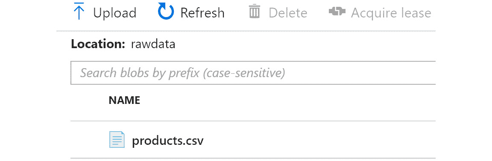

# 第九章：9. Azure 大数据解决方案

在上一章中，你学习了可以在 Azure 上实施的各种安全策略。通过安全的应用程序，我们可以管理大量数据。近年来，大数据获得了显著的关注。处理大数据需要专用的工具、软件和存储。有趣的是，几年前这些工具、平台和存储选项还不以服务形式提供。然而，随着新云技术的出现，Azure 提供了众多工具、平台和资源，可以轻松创建大数据解决方案。本章将详细介绍数据的摄取、清理、过滤和可视化的完整架构。

本章将涵盖以下主题：

+   大数据概览

+   数据集成

+   **抽取-转换-加载** (**ETL**)

+   数据工厂

+   数据湖存储

+   像 Spark、Databricks 和 Hadoop 这样的工具生态系统

+   Databricks

## 大数据

随着廉价设备的涌入——如物联网设备和手持设备——生成和捕捉的数据量呈指数级增长。几乎每个组织都拥有大量数据，并且如果需要，他们也准备好购买更多。当大量数据以多种格式并以不断增加的速度到达时，我们就可以说我们在处理大数据。简而言之，大数据有三个关键特征：

+   **体量**：体量指的是数据的数量，包括大小（例如 GB、TB 和 PB）以及记录的数量（例如在层级数据存储中的百万行、10 万张图片、5 亿个 JSON 文档等）。

+   **速度**：速度指的是数据到达或被摄取的速度。如果数据变化不频繁或新数据不常到达，则数据的速度被认为是低的；而如果频繁更新并且有大量新数据持续不断地到达，则数据的速度被认为是高的。

+   **多样性**：多样性指的是数据的不同种类和格式。数据可以来自不同来源，且格式各异。数据可以是结构化数据（如逗号分隔文件、JSON 文件或层级数据）、半结构化数据库（如无模式的 NoSQL 文档），或是非结构化数据（如二进制大对象（blobs）、图片、PDF 等）。由于存在如此多的变体，因此必须有一个明确的处理流程来处理接收的数据。

在下一部分，我们将查看大数据的通用处理过程。

### 大数据处理过程

当数据来自不同来源，格式不同，且速度不同的时候，制定一个存储、整合、过滤和清理数据的过程变得至关重要，这样可以帮助我们更轻松地处理数据，并使数据能够服务于其他流程。必须有一个明确的数据管理流程。大数据的通用处理流程应遵循 *图 9.1* 所示：


###### 图 9.1：大数据处理

大数据处理有四个主要阶段。让我们详细探讨它们：

+   **Ingest**：这是将数据引入和摄入到大数据环境中的过程。数据可以来自多个来源，应使用连接器将该数据摄入到大数据平台中。

+   **Store**：摄入后，数据应存储在数据池中以进行长期存储。存储应包括历史数据和实时数据，并且必须能够存储结构化、半结构化和非结构化数据。应该有连接器从数据源读取数据，或者数据源应能够将数据推送到存储中。

+   **Analysis**：从存储中读取数据后，应对其进行分析，这个过程需要过滤、分组、连接和转换数据以获取洞察。

+   **Visualize**：分析结果可以作为报告通过多种通知平台发送，也可以用于生成带有图表和图形的仪表板。

以前，由于涉及昂贵的硬件和大量投资，组织机构无法轻易获得捕获、摄入、存储和分析大数据所需的工具。此外，也没有平台可供处理它们。随着云计算的出现，组织机构现在可以更轻松地使用他们首选的工具和框架捕获、摄入、存储和执行大数据分析。他们可以支付云提供商使用其基础设施，避免任何资本支出。而且，与任何本地解决方案相比，云计算的成本非常便宜。

大数据需要大量的计算、存储和网络资源。通常，所需资源量不适合在单台计算机或服务器上拥有。即使在某种程度上，可以在单台服务器上提供足够的资源，处理整个大数据池所需的时间也相当长，因为每个作业按顺序完成，每个步骤都依赖于前一步骤。需要专门的框架和工具来分布工作到多个服务器，并最终从这些服务器返回结果，并在适当地结合所有服务器的结果后呈现给用户。这些工具是专门的大数据工具，帮助实现可用性、可扩展性和分发，以确保大数据解决方案能够通过内置的稳健性和稳定性快速运行。

显著的 Azure 大数据服务包括 HD Insights 和 Databricks。让我们继续探索大数据领域中提供的各种工具。

## 大数据工具

大数据空间中有许多工具和服务，我们将在本章中介绍其中一些。

### Azure 数据工厂

Azure 数据工厂是 Azure 中的旗舰 ETL 服务。它定义了传入数据（根据其格式和模式），根据业务规则和过滤器转换数据，增强现有数据，并最终将数据传输到目标存储，供其他下游服务轻松消费。它能够在 Azure 上运行管道（包含 ETL 逻辑），以及在自定义基础设施上运行，还可以运行 SQL Server 集成服务包。

### Azure 数据湖存储

Azure 数据湖存储是企业级的大数据存储，开箱即用即具备弹性、高可用性和安全性。它与 Hadoop 兼容，能够扩展到 PB 级别的数据存储。它建立在 Azure 存储帐户之上，因此直接获得所有存储帐户的优势。当前版本称为 Gen2，源自 Azure 存储和数据湖存储 Gen1 的能力合并。

### Hadoop

Hadoop 由 Apache 软件基金会创建，是一个分布式、可扩展且可靠的框架，用于处理大数据。它将大数据拆分成较小的数据块并将它们分布在集群中。一个 Hadoop 集群由两种类型的服务器组成——主节点和从节点。主节点包含 Hadoop 的管理组件，而从节点是进行数据处理的地方。Hadoop 负责在从节点之间进行逻辑数据分区；从节点执行所有数据转换、收集洞察并将其返回给主节点，主节点将它们整理成最终输出。Hadoop 可以扩展到数千台服务器，每台服务器为作业提供计算和存储服务。Hadoop 也可以通过 Azure 的**HDInsight**服务作为一种服务提供。

Hadoop 核心系统由三个主要组件组成：

**HDFS**：Hadoop 分布式文件系统（HDFS）是一个用于存储大数据的文件系统。它是一个分布式框架，通过将大数据文件分解为较小的数据块并将其放置在集群中的不同从节点上来帮助处理数据。HDFS 是一个容错的文件系统。这意味着，尽管不同的数据块分配给集群中的不同从节点，但数据在从节点之间也会进行复制，以确保在某个从节点失败时，数据也能在另一个服务器上可用。它还提供快速高效的数据访问。

**MapReduce**：MapReduce 是另一个重要的框架，使 Hadoop 能够并行处理数据。该框架负责处理存储在 HDFS 从节点中的数据并将其映射到从节点。在从节点完成处理后，“reduce”部分将来自每个从节点的信息汇总到一起，生成最终输出。通常，HDFS 和 MapReduce 会在同一节点上运行，这样数据就不需要在从节点之间传输，从而提高处理效率。

**YARN**：**Yet Another Resource Negotiator**（**YARN**）是一个重要的 Hadoop 架构组件，帮助在集群内调度与应用程序和资源管理相关的作业。YARN 作为 Hadoop 2.0 的一部分发布，许多人将其视为 MapReduce 的继任者，因为它在批处理和资源分配方面更为高效。

### Apache Spark

Apache Spark 是一个分布式、可靠的大规模数据处理分析平台。它提供一个集群，能够并行运行转换和机器学习作业，并将汇总结果返回给客户端。它由主节点和工作节点组成，其中主节点负责在作业内划分和分发操作和数据到工作节点之间，并将所有工作节点的结果汇总并返回给客户端。在使用 Spark 时要记住的一件重要事情是，逻辑或计算应易于并行化，并且数据量太大以至于无法适应一台机器。Spark 在 Azure 中作为 HDInsight 和 Databricks 的服务提供。

### Databricks

Databricks 构建在 Apache Spark 之上。它是一个平台即服务，为用户提供管理的 Spark 集群。它提供许多附加功能，如完整的门户管理 Spark 集群及其节点，以及帮助创建笔记本、调度和运行作业，以及为多个用户提供安全性和支持。

现在，是时候学习如何从多个源集成数据并使用我们讨论过的工具共同处理它们了。

## 数据集成

我们深知集成模式如何用于应用程序；由多个服务组成的应用程序使用各种模式进行集成。然而，还有另一种范例对许多组织来说是关键需求，即被称为数据集成。数据集成的激增主要发生在过去十年间，当时数据的生成和可用性显著增加。数据生成的速度、多样性和数量大幅增加，数据几乎无处不在。

每个组织都有许多不同类型的应用程序，它们都以自己的专有格式生成数据。通常，数据也从市场购买。即使在组织合并和合并期间，也需要迁移和组合数据。

数据集成是指从多个源带入数据并生成新输出的过程，该输出具有更多的意义和可用性。

在以下场景中明确需要数据集成：

+   从源或一组源迁移数据到目标位置。这是为了让数据以不同的格式对各种利益相关者和消费者可用。

+   从数据中获取洞察。随着数据的快速增加，组织希望从中获取洞察。它们希望创建提供洞察的解决方案；来自多个源的数据应该被合并、清洗、增强，并存储在数据仓库中。

+   生成实时仪表盘和报告。

+   创建分析解决方案。

应用程序集成在用户使用应用程序时具有运行时行为——例如，在信用卡验证和集成的情况下。另一方面，数据集成是在后台执行的，并且不直接与用户活动相关联。

让我们继续了解如何使用 Azure 数据工厂理解 ETL 过程。

## ETL

一个非常流行的过程称为 ETL，它有助于构建目标数据源，以存储应用程序可以使用的数据。通常，数据是以原始格式存在的，为了使其可用，数据需要经过以下三个不同的阶段：

+   **提取**：在这个阶段，数据从多个地方提取。例如，可能有多个数据源，它们需要连接在一起以便检索数据。提取阶段通常使用包含目标数据源连接信息的数据连接器。它们还可能有临时存储，用于将数据从数据源提取并存储，以便更快地检索。这个阶段负责数据的摄取。

+   **转换**：在提取阶段之后的数据可能无法直接被应用程序使用。这可能是由于多种原因；例如，数据可能存在不规则性，可能有缺失的数据，或数据可能存在错误。或者，可能有一些数据根本不需要。或者，数据的格式可能不适合目标应用程序的使用。在所有这些情况下，必须对数据进行转换，使其能够高效地被应用程序使用。

+   **加载**：在数据转换后，应该将数据加载到目标数据源中，格式和架构使其能够更快、更容易地提供给应用程序，以提高性能。通常，这包括目标数据源的数据连接器以及将数据加载到其中的过程。

接下来，让我们来了解一下 Azure 数据工厂如何与 ETL 过程相关联。

## Azure 数据工厂简介

Azure 数据工厂是一个完全托管、高可用、高可扩展、易于使用的工具，用于创建集成解决方案并实现 ETL 阶段。数据工厂帮助你以拖放方式通过用户界面创建新的管道，而无需编写任何代码；然而，它仍然提供功能，允许你用自己喜欢的编程语言编写代码。

在使用数据工厂服务之前，有一些重要的概念需要了解，我们将在接下来的章节中更详细地探讨这些概念：

+   **活动**：活动是能够在数据工厂管道中运行和处理逻辑的单个任务。活动有多种类型，涉及数据移动、数据转换和控制活动。每个活动都有一个策略，可以通过该策略决定重试机制和重试间隔。

+   **管道**：数据工厂中的管道由一组活动组成，负责将活动集合在一起。管道是工作流和调度器，能够实现 ETL 阶段的运行。管道允许将活动编织在一起，并允许声明它们之间的依赖关系。通过使用依赖关系，可以使某些任务并行执行，其他任务按顺序执行。

+   **数据集**：数据集是数据的来源和目的地。这些可以是 Azure 存储账户、数据湖存储或其他多个来源。

+   **链接服务**：这些是包含数据集连接和连接信息的服务，并由各个任务用于连接到它们。

+   **集成运行时**：负责运行数据工厂的主要引擎叫做集成运行时。集成运行时有以下三种配置：

+   **Azure**：在此配置下，数据工厂运行在 Azure 提供的计算资源上。

+   **自托管**：在此配置下，数据工厂在你提供自己的计算资源时运行。这可以通过本地或基于云的虚拟机服务器来实现。

+   **Azure SQL Server 集成服务** (**SSIS**): 此配置允许运行使用 SQL Server 编写的传统 SSIS 包。

+   **版本**：数据工厂有两个不同的版本。需要理解的是，所有新开发将发生在 V2 上，V1 将保持原样，或者在某个时候逐渐淘汰。V2 优先的原因如下：

    它提供了运行 SQL Server 集成包的功能。

    它相较于 V1 提供了增强的功能。

    它提供了 V1 中缺少的增强监控功能。

现在你已经对数据工厂有了较为清晰的理解，让我们来看一下 Azure 上可用的各种存储选项。

## Azure 数据湖入门

Azure 数据湖为大数据解决方案提供存储。它专门设计用于存储大数据解决方案中通常需要的大量数据。它是 Azure 提供的托管服务。客户需要将他们的数据带来并存储在数据湖中。

Azure 数据湖存储有两个版本：版本 1（Gen1）和当前版本，版本 2（Gen2）。Gen2 拥有 Gen1 的所有功能，但有一个特别的区别是它建立在 Azure Blob 存储之上。

由于 Azure Blob 存储具有高可用性、可以多次复制、具备灾难恢复能力并且成本较低，这些优势也被继承到 Gen2 Data Lake 中。Data Lake 可以存储任何类型的数据，包括关系型、非关系型、基于文件系统和层次化数据。

创建 Data Lake Gen2 实例与创建新存储账户一样简单。唯一需要做的更改是在存储账户的 **高级** 选项卡中启用层次命名空间。需要注意的是，无法直接将通用存储账户迁移或转换为 Azure Data Lake，反之亦然。此外，存储账户用于存储文件，而 Data Lake 则针对读取和摄取大量数据进行了优化。

接下来，我们将探讨处理大数据时的流程和主要阶段。这些是不同的阶段，每个阶段负责数据的不同操作。

## 将数据从 Azure 存储迁移到 Data Lake 存储 Gen2

在本节中，我们将把数据从 Azure Blob 存储迁移到同一 Azure Blob 存储实例中的另一个 Azure 容器，并且我们还将使用 Azure Data Factory 管道将数据迁移到 Azure Data Lake Gen2 实例。以下各节概述了创建此端到端解决方案所需的步骤。

### 准备源存储账户

在我们可以创建 Azure Data Factory 管道并将其用于迁移之前，需要创建一个新的存储账户，存储账户由多个容器组成，并上传数据文件。在实际操作中，这些文件和存储连接通常已经准备好。创建新 Azure 存储账户的第一步是创建一个新的资源组，或者在 Azure 订阅内选择一个现有的资源组。

### 配置新的资源组

Azure 中的每个资源都与一个资源组关联。在我们配置 Azure 存储账户之前，需要创建一个资源组来承载存储账户。创建资源组的步骤如下所示。需要注意的是，在配置 Azure 存储账户时，可以创建一个新的资源组，或者使用现有的资源组：

1.  导航到 Azure 门户，登录并点击 `资源组`。

1.  从搜索结果中选择 **资源组**，然后创建一个新的资源组。提供名称并选择合适的位置。请注意，所有资源应该托管在同一资源组和位置，这样删除时会更方便。

在配置资源组之后，我们将在其中配置一个存储账户。

### 配置存储账户

在本节中，我们将介绍创建新的 Azure 存储账户的步骤。这个存储账户将从中获取数据源，并迁移数据。执行以下步骤来创建存储账户：

1.  点击 `存储账户`。从搜索结果中选择 **存储账户**，然后创建一个新的存储账户。

1.  提供名称和位置，然后选择基于之前创建的资源组的订阅。

1.  在**帐户类型**中选择**StorageV2 (通用目的 v2)**，在**性能**中选择**标准**，在**复制**中选择**本地冗余存储（LRS）**，如*图 9.2*所示：

    ###### 图 9.2：配置存储帐户

1.  现在在存储帐户中创建几个容器。`rawdata`容器包含将由数据工厂管道提取的文件，并将作为源数据集，而**finaldata**将包含数据工厂管道将写入数据的文件，并将作为目标数据集：

    ###### 图 9.3：创建容器

1.  将数据文件（该文件随源代码一起提供）上传到**rawdata**容器，如*图 9.4*所示：

###### 图 9.4：上传数据文件

完成这些步骤后，源数据准备工作完成。现在我们可以专注于创建 Data Lake 实例。

### 配置 Data Lake Gen2 服务

如我们所知，Data Lake Gen2 服务是建立在 Azure 存储帐户之上的。因此，我们将以与之前相同的方式创建一个新的存储帐户——唯一的区别是在新 Azure 存储帐户的**高级**选项卡中选择**启用**，以支持**层次命名空间**。这将创建新的 Data Lake Gen2 服务：


###### 图 9.5：创建新存储帐户

在创建数据湖之后，我们将专注于创建一个新的 Data Factory 管道。

### 配置 Azure Data Factory

现在我们已经配置了资源组和 Azure 存储帐户，是时候创建一个新的 Data Factory 资源了：

1.  通过选择**V2**并提供名称和位置，以及资源组和订阅选择，创建一个新的 Data Factory 管道。

    Data Factory 有三个不同的版本，如*图 9.6*所示。我们已经讨论了**V1**和**V2**：

    

    ###### 图 9.6：选择数据工厂的版本

1.  创建完数据工厂资源后，点击中央窗格中的**Author & Monitor**链接。

    这将打开另一个窗口，其中包含用于管道设计的 Data Factory 设计器。

管道的代码可以存储在版本控制仓库中，这样可以跟踪代码更改，并促进开发人员之间的协作。如果在这些步骤中错过了仓库设置，可以稍后进行设置。

下一部分将重点介绍与版本控制仓库设置相关的配置，如果你的数据工厂资源在没有配置任何仓库设置的情况下创建，我们将在这里进行相关配置。

### 仓库设置

在创建任何数据工厂工件（如数据集和管道）之前，最好先设置代码仓库，以托管与数据工厂相关的文件：

1.  在**创作**页面，点击**管理**按钮，然后在左侧菜单中选择**Git 配置**。这将打开另一个面板；在此面板中点击**设置代码仓库**按钮：

    ###### 图 9.7：设置 Git 仓库

1.  从结果面板中，选择你希望存储数据工厂代码文件的仓库类型。在本例中，我们选择**Azure DevOps Git**：

    ###### 图 9.8：选择合适的 Git 仓库类型

1.  创建一个新的仓库，或从 Azure DevOps 重用现有仓库。你应该已经在 Azure DevOps 中有一个账户。如果没有，可以访问[`dev.azure.com`](https://dev.azure.com)，使用与你在 Azure 门户中相同的账户登录，并在其中创建一个新的组织和项目。有关在 Azure DevOps 中创建组织和项目的更多信息，请参考*第十三章，集成 Azure DevOps*。

    现在，我们可以回到数据工厂创作窗口，开始为我们的新管道创建工件。

在下一部分中，我们将准备将在数据工厂管道中使用的数据集。

### 数据工厂数据集

现在我们可以返回到数据工厂管道。首先，创建一个新的数据集，作为源数据集。它将是我们创建的第一个存储账户，我们将在其中上传示例`product.csv`文件：

1.  点击`AutoResolveIntegrationRuntime`用于运行时环境，这意味着 Azure 将在 Azure 托管的计算上提供运行时环境。链接服务提供多种身份验证方法，我们正在使用**共享访问签名（SAS）统一资源定位符（URI）**方法。也可以使用账户密钥、服务主体和托管身份作为身份验证方法：

    ###### 图 9.9：实现身份验证方法

1.  然后，在结果的下方窗格中的**常规**选项卡中，点击**打开属性**链接并为数据集提供一个名称：

    ###### 图 9.10：为数据集命名

1.  在**连接**选项卡中，提供有关容器、存储帐户中的 Blob 文件名、行分隔符、列分隔符和其他有助于 Data Factory 正确读取源数据的信息。

    配置后的**连接**选项卡应类似于*图 9.11*。请注意，路径包括容器的名称和文件的名称：

    

    ###### 图 9.11：配置连接

1.  此时，如果点击`product.csv`文件。在`ProductID`和`ProductPrice`列上，架构有助于为列提供标识符，并在源数据集和目标数据集之间映射源列到目标列，即使列名不一致。

现在第一个数据集已创建，让我们创建第二个数据集。

### 创建第二个数据集

以之前相同的方式为目标 Blob 存储帐户创建一个新的数据集和关联服务。请注意，存储帐户与源相同，但容器不同。确保传入的数据也附带有架构信息，如*图 9.12*所示：


###### 图 9.12：创建第二个数据集

接下来，我们将创建第三个数据集。

### 创建第三个数据集

为 Data Lake Gen2 存储实例创建一个新的数据集，作为目标数据集。为此，选择新数据集，然后选择**Azure Data Lake Storage Gen2（预览版）**。

给新数据集命名，并在**连接**选项卡中创建一个新的关联服务。选择**使用帐户密钥**作为身份验证方法，选择存储帐户名称后，其余配置将自动填充。然后，通过点击**测试连接**按钮来测试连接。保持其他选项卡的默认配置，如*图 9.13*所示：


###### 图 9.13：连接选项卡中的配置

现在，我们已经连接到源数据，并且连接到源和目标数据存储的连接都已建立，是时候创建包含数据转换逻辑的管道了。

### 创建管道

创建所有数据集后，我们可以创建一个管道来消费这些数据集。创建管道的步骤如下：

1.  从左侧菜单点击**+ 管道 => 新建管道**菜单以创建新管道。然后，将**复制数据**活动从**移动与转换**菜单拖放，如*图 9.14*所示：

    ###### 图 9.14：管道菜单

1.  结果的**常规**标签可以保持不变，但**源**标签应配置为使用我们之前配置的源数据集：

    ###### 图 9.15：源标签

1.  **接收**标签用于配置目标数据存储和数据集，应配置为使用我们之前配置的目标数据集：

    ###### 图 9.16：接收标签

1.  在**映射**标签中，将源数据集的列映射到目标数据集的列，如*图 9.17*所示：

###### 图 9.17：映射标签

### 添加另一个复制数据活动

在我们的管道中，我们可以添加多个活动，每个活动负责特定的转换任务。本节讨论的任务负责将数据从 Azure 存储帐户复制到 Azure Data Lake Storage：

1.  添加另一个`product.csv`文件。

    接收配置将目标指向 Data Lake Gen2 存储帐户。

1.  对于第二个复制数据活动，其余配置可以保留为默认设置。

在完成管道的编写后，可以将其发布到版本控制库，如 GitHub。

接下来，我们将探讨如何使用 Databricks 和 Spark 创建解决方案。

## 使用 Databricks 创建解决方案

Databricks 是一个将 Spark 作为服务使用的平台。我们无需在虚拟机上配置主节点和工作节点。相反，Databricks 为我们提供了一个由主节点和工作节点组成的托管环境，并且对其进行管理。我们只需提供数据处理的步骤和逻辑，其余的都由 Databricks 平台负责。

在本节中，我们将通过步骤介绍如何使用 Databricks 创建解决方案。我们将下载示例数据进行分析。

示例 CSV 文件已从[`ourworldindata.org/coronavirus-source-data`](https://ourworldindata.org/coronavirus-source-data)下载，尽管它也可以在本书的代码中找到。前述网址会提供更为最新的数据，但格式可能发生变化，因此建议使用本书代码示例中提供的文件：

1.  创建 Databricks 解决方案的第一步是通过 Azure 门户进行预配。从 Azure 门户中可以选择 14 天评估版 SKU，以及标准和高级版两个其他 SKU。高级版 SKU 在笔记本、集群、作业和表格级别提供 Azure 基于角色的访问控制：

    ###### 图 9.19：Azure 门户—Databricks 服务

1.  在 Databricks 工作区预配完成后，从 **概述** 面板点击 **启动工作区** 按钮。这将打开一个新的浏览器窗口，并最终将你登录到 Databricks 门户。

1.  从 Databricks 门户中，从左侧菜单选择 **集群**，并创建一个新集群，如 *图 9.20* 所示：

    ###### 图 9.20：创建一个新集群

1.  提供名称、Databricks 运行时版本、工作节点类型、虚拟机大小配置以及驱动程序类型服务器配置。

1.  创建集群可能需要几分钟时间。集群创建完成后，点击 **主页**，从其上下文菜单中选择一个用户，并创建一个新的笔记本：

    ###### 图 9.21：选择一个新笔记本

1.  为笔记本提供一个名称，如下所示：

    ###### 图 9.22：创建笔记本

1.  创建一个新的存储账户，如下所示。这将作为存储原始 COVID 数据的 CSV 格式存储：

    ###### 图 9.23：创建一个新的存储账户

1.  为存储 CSV 文件创建一个容器，如下所示：

    ###### 图 9.24：创建一个容器

1.  将 `owid-covid-data.csv` 文件上传到此容器中。

完成上述步骤后，下一步是加载数据。

### 加载数据

第二个主要步骤是将 COVID 数据加载到 Databricks 工作区。这可以通过两种主要方式完成：

+   在 Databricks 中挂载 Azure 存储容器，然后加载挂载中的文件。

+   从存储账户直接加载数据。以下示例使用了这种方法。

以下步骤应执行以使用 Databricks 加载和分析数据：

1.  第一步是连接并访问存储帐户。需要存储帐户的密钥，该密钥存储在 Spark 配置中。注意，这里的密钥是`"fs.azure.account.key.coronadatastorage.blob.core.windows.net"`，其值是关联的密钥：

    ```
    spark.conf.set("fs.azure.account.key.coronadatastorage.blob.core.windows.net","xxxxxxxxxxxxxxxxxxxxxxxxxxxxxxxxxxxxxxxxxxxxxxxxxxxxxxxxxxxxxxxxxxxxxxxxxxxxxxxxxxxxxxxxxxxxxxxxxxxxxxxx==")
    ```

1.  Azure 存储帐户的密钥可以通过导航到设置并使用`wasbs://{{container}}@{{storage account name}}.blob.core.windows.net/{{filename}}`来获取。

1.  `SparkSession`对象的`read`方法提供了读取文件的方法。要读取 CSV 文件，应该使用`csv`方法，并传递其所需的参数，例如 CSV 文件的路径。还可以提供额外的可选参数来定制数据文件的读取过程。Spark 支持多种文件格式，如 JSON、**优化行列格式**（**ORC**）和 Parquet，以及关系型数据库如 SQL Server 和 MySQL、NoSQL 数据存储如 Cassandra 和 MongoDB，以及大数据平台如 Apache Hive。让我们通过以下命令了解 Spark DataFrame 的实现：

    ```
    coviddata = spark.read.format("csv").option("inferSchema", "true").option("header", "true").load("wasbs://coviddata@coronadatastorage.blob.core.windows.net/owid-covid-data.csv")
    ```

    使用此命令会在 Spark 中创建一个新的 DataFrame 类型对象。Spark 提供**弹性分布式数据集**（**RDD**）对象来操作和处理数据。RDD 是低级对象，任何针对它们编写的代码可能不会经过优化。DataFrame 是 RDD 之上的高级构造，提供了优化访问和处理 RDD 的功能。与 RDD 一起工作时，最好使用 DataFrame。

    DataFrame 以行列格式提供数据，这使得可视化和处理数据变得更容易。Spark 的 DataFrame 类似于 pandas 的 DataFrame，区别在于它们是不同的实现。

1.  以下命令显示了 DataFrame 中的数据，展示了 DataFrame 中所有可用的行和列：

    ```
    coviddata.show()
    ```

    你应该得到类似于*图 9.25*中所看到的输出：

    

    ###### 图 9.25：DataFrame 中的原始数据

1.  加载数据的模式由 Spark 推断，可以使用以下命令检查：

    ```
    coviddata.printSchema()
    ```

    这应该会给你类似于以下的输出：

    

    ###### 图 9.26：获取 DataFrame 每列的模式

1.  要计算 CSV 文件中的行数，可以使用以下命令，输出显示文件中有 19,288 行：

    ```
    coviddata.count()
    ```

    

    ###### 图 9.27：查找 DataFrame 中的记录数量

1.  原始的 DataFrame 有超过 30 列。我们也可以选择其中的一部分列并直接使用，如下所示：

    ```
    CovidDataSmallSet = coviddata.select("location","date", "new_cases", "new_deaths")
    CovidDataSmallSet.show()
    ```

    代码的输出将如下所示，正如*图 9.28*所示：

    

    ###### 图 9.28：从所有列中选择几个列

1.  也可以使用 `filter` 方法过滤数据，如下所示：

    ```
    CovidDataSmallSet.filter(" location == 'United States' ").show()
    ```

1.  还可以使用 AND（`&`）或 OR（`|`）运算符将多个条件组合在一起：

    ```
    CovidDataSmallSet.filter((CovidDataSmallSet.location == 'United States') | (CovidDataSmallSet.location == 'Aruba')).show()
    ```

1.  要找出行数及其他统计细节，如均值、最大值、最小值和标准差，可以使用 `describe` 方法：

    ```
    CovidDataSmallSet.describe().show()
    ```

    使用前面的命令后，你将获得类似这样的输出：

    

    ###### 图 9.29：使用 describe 方法显示每个列的统计信息

1.  还可以找出指定列中空值或缺失数据的百分比。以下是几个示例：

    ```
    from pyspark.sql.functions import  col
    (coviddata.where(col("diabetes_prevalence").isNull()).count() * 100)/coviddata.count()
    ```

    输出显示 `5.998548320199087`，这意味着 95% 的数据是空值。我们应该从数据分析中删除这些列。同样，在 `total_tests_per_thousand` 列上运行相同命令返回 `73.62090418913314`，这比前一个列的结果要好得多。

1.  要从 DataFrame 中删除某些列，可以使用以下命令：

    ```
    coviddatanew=coviddata.drop("iso_code").drop("total_tests").drop("total_tests").drop("new_tests").drop("total_tests_per_thousand").drop("new_tests_per_thousand").drop("new_tests_smoothed").drop("new_tests_smoothed_per_thousand ")
    ```

1.  有时，您需要对数据进行聚合。在这种情况下，可以执行数据分组，如下所示：

    ```
    coviddatanew = coviddata.groupBy('location').agg({'date': 'max'})
    ```

    这将显示来自 `groupBy` 语句的数据：

    

    ###### 图 9.30：来自 groupby 语句的数据

1.  如你在 `max (date)` 列中看到的，所有国家的日期大多相同，我们可以使用这个值来过滤记录，并获取每个国家的最大日期对应的一行数据：

    ```
    coviddatauniquecountry = coviddata.filter("date='2020-05-23 00:00:00'")
    coviddatauniquecountry.show()
    ```

1.  如果我们对新 DataFrame 中的记录进行计数，结果是 `209`。

    我们可以将新的 DataFrame 保存到另一个 CSV 文件中，其他数据处理器可能需要该文件：

    ```
    coviddatauniquecountry.rdd.saveAsTextFile("dbfs:/mnt/coronadatastorage/uniquecountry.csv")
    ```

    我们可以使用以下命令检查新创建的文件：

    ```
    %fs ls /mnt/coronadatastorage/
    ```

    挂载路径将显示如下图所示的 *图 9.31*：

    

    ###### 图 9.31：Spark 节点中的挂载路径

1.  还可以使用 `createTempView` 或 `createOrReplaceTempView` 方法将数据添加到 Databricks 目录中。将数据放入目录后，可以在给定的上下文中使用它。要将数据添加到目录中，可以使用 DataFrame 的 `createTempView` 或 `createOrReplaceTempView` 方法，为目录中的表提供一个新视图：

    ```
    coviddatauniquecountry.createOrReplaceTempView("corona")
    ```

1.  一旦表格进入目录，就可以从你的 SQL 会话中访问，如下所示：

    ```
    spark.sql("select * from corona").show()
    ```

    SQL 语句中的数据将显示为 *图 9.32* 所示：

    

    ###### 图 9.32：来自 SQL 语句的数据

1.  可以对表执行额外的 SQL 查询，如下所示：

    ```
    spark.sql("select * from corona where location in ('India','Angola') order by location").show()
    ```

这只是 Databricks 可能性的一小部分。它内部还有许多更多的功能和服务，无法在单一章节中全面覆盖。您可以在 [`azure.microsoft.com/services/databricks`](https://azure.microsoft.com/services/databricks) 上了解更多相关信息。

## 总结

本章介绍了 Azure Data Factory 服务，它负责提供 Azure 中的 ETL 服务。作为一个平台即服务，它提供无限的可扩展性、高可用性和易于配置的管道。它与 Azure DevOps 和 GitHub 的集成也非常流畅。我们还探索了使用 Azure Data Lake Gen2 存储大数据的功能和优势。它是一种成本效益高、具有高度可扩展性、分层的数据存储方式，用于处理大数据，并且与 Azure HDInsight、Databricks 和 Hadoop 生态系统兼容。

我们并没有对本章中提到的所有主题进行全面深入的探讨。重点更多的是探索 Azure 中的可能性，特别是 Databricks 和 Spark。Azure 中涉及大数据的多个技术，包括 HDInsight、Hadoop、Spark 及其相关生态系统，还有 Databricks，它是一个为 Spark 提供附加功能的“平台即服务”环境。在下一章中，您将学习 Azure 中的无服务器计算能力。
