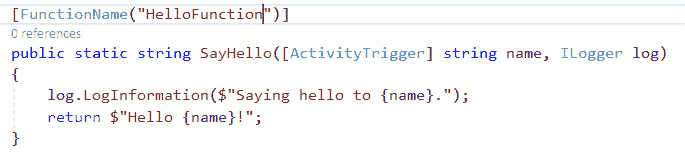
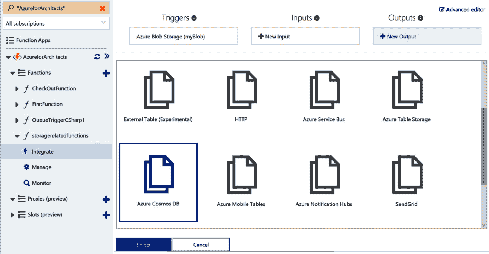

# 10\. Azure 中的无服务器——与 Azure Functions 一起工作

在上一章中，你了解了 Azure 上的各种大数据解决方案。在本章中，你将学习无服务器技术如何帮助你处理大量数据。

无服务器（Serverless）是当前技术领域最热门的流行词之一，大家都想赶上这股潮流。无服务器在整体计算、软件开发流程、基础设施和技术实现方面带来了许多优势。这个行业中有许多变化：一端是**基础设施即服务（IaaS）**，另一端则是无服务器。在两者之间的是**平台即服务（PaaS）**和容器。我遇到了许多开发人员，似乎他们对 IaaS、PaaS、容器和无服务器计算之间存在一些困惑。此外，人们对于无服务器范式的使用场景、适用性、架构和实现也有很多混淆。无服务器是一个新的范式，正在改变不仅是技术，甚至是组织内部的文化和流程。

本章将通过介绍无服务器开始，并将在接下来的内容中涵盖以下主题：

+   函数即服务

+   Azure Functions

+   Azure Durable Functions

+   Azure Event Grid

## 无服务器

无服务器是指一种部署模型，用户只需要负责他们的应用程序代码和配置。在无服务器计算中，客户不需要为自己的底层平台和基础设施操心，而是可以专注于解决业务问题。

无服务器并不意味着没有服务器。代码和配置始终需要计算、存储和网络来运行。然而，从客户的角度来看，他们看不到这些计算、存储和网络。他们不关心底层的平台和基础设施，不需要管理或监控基础设施和平台。无服务器提供了一个可以自动按需扩展、收缩、进出环境，而客户甚至对此一无所知的环境。与平台和基础设施相关的所有操作都发生在幕后，并由云服务提供商执行。客户会获得与性能相关的**服务级别协议（SLA）**，Azure 会确保在任何需求下都能满足这些 SLA。

客户只需要带入他们的代码；云服务提供商负责提供运行代码所需的基础设施和平台。让我们深入探讨 Azure Functions 的各种优势。

## Azure Functions 的优势

无服务器计算是一种相对较新的范式，帮助组织将大型功能转化为较小的、离散的按需功能，这些功能可以通过自动触发器和计划任务被调用和执行。这些功能也被称为 **功能即服务 (FaaS)**，在这种模式下，组织可以专注于领域挑战，而非底层基础设施和平台。FaaS 还有助于将解决方案架构分解为更小、可重用的功能，从而提高投资回报率。

目前有大量的无服务器计算平台可供选择。以下是一些重要的平台：

+   Azure Functions。

+   AWS Lambda。

+   IBM OpenWhisk。

+   Iron.io。

+   Google Cloud Functions。

事实上，每隔几天就会有新的平台/框架被推出，企业越来越难以决定哪个框架最适合他们。Azure 提供了一个丰富的无服务器环境，称为 Azure Functions，以下是它支持的一些功能：

+   有多种方式调用函数——手动调用、按计划调用或基于事件触发。

+   支持多种绑定类型。

+   可以同步和异步运行函数。

+   基于多种触发器类型执行函数的能力。

+   可以运行长时间和短时间的函数。然而，不推荐运行大型和长时间的函数，因为它们可能导致意外超时。

+   能够使用代理功能来支持不同的函数架构。

+   多种使用模型，包括消费模型和应用服务模型。

+   能够使用多种编程语言（如 JavaScript、Python 和 C#）编写函数。

+   基于 OAuth 的授权。

+   Durable Functions 扩展帮助编写有状态的函数。

+   多种身份验证选项，包括 Azure AD、Facebook、Twitter 和其他身份提供商。

+   可以轻松配置输入和输出参数。

+   通过 Visual Studio 集成来编写 Azure 函数。

+   大规模并行处理。

让我们来看看 FaaS 及其在无服务器架构中扮演的角色。

## FaaS。

Azure 提供 FaaS。这些是 Azure 的无服务器实现。使用 Azure Functions，用户可以用任何熟悉的语言编写代码，Azure Functions 会提供一个运行时来执行它。根据选择的语言，平台为用户提供适当的环境来运行自己的代码。函数是部署的基本单元，可以自动扩展和缩减。在处理函数时，用户无法查看底层的虚拟机和平台，但 Azure Functions 提供了一个小窗口，通过 **Kudu Console** 查看它们。

Azure Functions 有两个主要组件：

+   Azure Functions 运行时。

+   Azure Functions 的绑定和触发器。

让我们详细了解这些组件。

### Azure Functions 运行时。

Azure Functions 的核心是其运行时。Azure Functions 的前身是 Azure WebJobs。Azure WebJobs 的代码也是 Azure Functions 的核心。Azure WebJobs 增加了额外的功能和扩展，以创建 Azure Functions。Azure Functions 运行时是使函数能够工作的魔法。Azure Functions 托管在 Azure App Service 中。Azure App Service 加载 Azure 运行时，并等待外部事件或手动活动的发生。请求到达或触发器发生时，App Service 加载传入的负载，读取函数的 `function.json` 文件以查找函数的绑定和触发器，将传入数据映射到传入参数，并使用参数值调用函数。一旦函数完成执行，值通过 `function.json` 文件中定义为绑定的输出参数再次传回 Azure Functions 运行时。函数运行时将值返回给调用者。Azure Functions 运行时充当粘合剂，支持整个函数的执行。

当前的 Azure 运行时版本是 ~3。它基于 .NET Core 3.1 框架。在此之前，版本 ~2 基于 .NET Core 2.2 框架。第一个版本 ~1 基于 .NET 4.7 框架。

从版本 1 到版本 2 由于底层框架本身的变化，发生了重大变化。然而，从版本 2 到版本 3 几乎没有破坏性变化，大多数在版本 2 中编写的函数仍然能够在版本 3 上运行。然而，建议在从版本 2 升级到版本 3 后进行充分的测试。关于触发器和绑定，从版本 1 到版本 2 也存在破坏性变化。触发器和绑定现在作为扩展提供，在版本 2 和 3 中，每个扩展都位于不同的程序集。

### Azure Functions 绑定和触发器

如果 Azure Functions 运行时是 Azure Functions 的大脑，那么 Azure Functions 绑定和触发器就是它的心脏。Azure Functions 通过触发器和绑定促进服务之间的松耦合和高内聚。针对非无服务器环境编写的应用程序使用命令式语法实现传入和传出的参数以及返回值的代码。Azure Functions 使用声明式机制通过触发器调用函数，并使用绑定配置数据流。

绑定是指创建传入数据与 Azure 函数之间连接的过程，并映射数据类型。该连接可以是从运行时到 Azure Functions 的单向连接，也可以是双向的——绑定可以在 Azure 运行时和 Azure Functions 之间双向传输数据。Azure Functions 以声明的方式定义绑定。

触发器是一种特殊类型的绑定，函数可以通过它根据外部事件被调用。除了调用函数，触发器还会将传入的数据、有效负载和元数据传递给函数。

绑定在 `function.json` 文件中定义，如下所示：

```
{  "bindings": [    {      "name": "checkOut",      "type": "queueTrigger",      "direction": "in",      "queueName": "checkout-items",      "connection": "AzureWebJobsDashboard"    },    {      "name": "Orders",      "type": "table",      "direction": "out",      "tableName": "OrderDetails",      "connection": "<<Connection to table storage account>>"   }  ],  "disabled": false }
```

在此示例中，声明了一个触发器，当存储队列中有新项时，会调用该函数。类型为 `queueTrigger`，方向为输入，`queueName` 为 `checkout-items`，并且显示了目标存储帐户连接和表名称的详细信息。所有这些值对于此绑定的功能至关重要。`checkOut` 名称可以在函数代码中作为变量使用。

类似地，声明了返回值的绑定。这里，返回值命名为 `Orders`，数据是来自 Azure Functions 的输出。该绑定将返回数据写入 Azure 表存储，使用提供的连接字符串。

绑定和触发器都可以通过更新 `function.json` 文件进行修改和编写。`checkOut` 触发器声明如下：


###### 图 10.1：集成选项卡的触发器部分

**Orders** 输出如下所示：


###### 图 10.2：为存储帐户添加输出详细信息

Azure 函数的作者无需编写任何管道代码来获取来自多个源的数据。他们只需决定预期的 Azure 运行时数据类型。下一段代码示例中显示了这一点。请注意，结账功能作为字符串提供给函数。可以使用多种数据类型作为函数的绑定。例如，队列绑定可以提供以下内容：

+   一个普通的 CLR（公共语言运行时）对象 (POCO)

+   一个字符串

+   一个字节

+   `CloudQueueMessage`

函数的作者可以使用这些数据类型中的任何一种，Azure Functions 运行时会确保将正确的对象作为参数传递给函数。以下是一个接受字符串数据的代码片段，运行时会在调用函数之前将传入的数据封装为 `string` 数据类型。如果运行时无法将传入的数据转换为字符串，则会生成异常：

```
using System;public static void Run(string checkOut, TraceWriter log){    log.Info($"C# Queue trigger function processed: { checkOut }");}
```

同样需要了解的是，在*图 10.2*中，存储帐户名称为 `AzureWebJobsStorage` 和 `AzureWebJobsDashboard`。这两个是定义在 `appSettings` 部分的密钥，包含存储帐户连接字符串。Azure Functions 内部使用这些存储帐户来维护其状态和函数执行的状态。

有关 Azure 绑定和触发器的更多信息，请参阅 [`docs.microsoft.com/azure/azure-functions/functions-bindings-storage-queue`](https://docs.microsoft.com/azure/azure-functions/functions-bindings-storage-queue)。

现在我们已经对 Azure 绑定和触发器有了一个基本的理解，让我们来看看 Azure Functions 提供的各种配置选项。

### Azure Functions 配置

Azure Functions 提供了多级配置选项。它为以下内容提供配置：

+   平台本身

+   函数应用服务

这些设置会影响它们所包含的每个函数。关于这些设置的更多信息，请访问 [`docs.microsoft.com/azure/azure-functions/functions-how-to-use-azure-function-app-settings`](https://docs.microsoft.com/azure/azure-functions/functions-how-to-use-azure-function-app-settings)。

**平台配置**

Azure 函数托管在 Azure App Service 中，因此它们可以享受所有的 App Service 特性。可以使用平台功能轻松配置诊断和监控日志。此外，App Service 提供了分配 SSL 证书、使用自定义域名、身份验证和授权等网络功能的选项。

尽管客户无需关心函数实际执行的基础设施、操作系统、文件系统或平台，但 Azure Functions 提供了必要的工具，可以深入了解底层系统并进行更改。门户内控制台和 Kudu 控制台是用于此目的的工具。它们提供了丰富的编辑器，用于编写 Azure 函数并编辑其配置。

与 App Service 一样，Azure Functions 允许你将配置信息存储在 `web.config` 应用程序设置部分，可以按需读取。一些函数应用的 платформ功能如 *图 10.3* 所示：


###### 图 10.3：函数应用的 플랫폼功能

这些平台功能可以用来配置身份验证、自定义域名、SSL 等等。此外，**平台功能**选项卡提供了可以与函数应用一起使用的开发工具概览。在接下来的章节中，我们将查看在平台功能中可用的函数应用设置。

**App Service 函数设置**

这些设置会影响所有函数。应用程序设置可以在此处管理。Azure Functions 中的代理可以启用和禁用。我们将在本章后面讨论代理。它们还帮助更改函数应用的编辑模式和部署到槽：


###### 图 10.4：函数应用设置

预算是任何项目成功的一个非常重要的方面。让我们来探索 Azure Functions 提供的各种计划。

### Azure Functions 费用计划

Azure Functions 基于 Azure App Service，为用户提供了一种经济实惠的模型。它有三种费用模型。

**消费计划**

这是基于按秒计费的函数消费和执行费用。该计划根据函数的实际消费和执行的计算使用情况来计算费用。如果一个函数没有执行，则不会产生费用。然而，这并不意味着该计划会影响性能。Azure 函数会根据需求自动扩展和缩减，以确保基本的最小性能水平得以保持。一个函数的执行允许 10 分钟完成。

该计划的一个主要缺点是，如果函数几秒钟内没有被消费，函数可能会变冷，接下来的请求可能会因函数处于空闲状态而出现短暂的响应延迟。这种现象称为冷启动。然而，有一些解决方法可以保持函数在没有合法请求时也保持“热”状态。可以通过编写一个计划任务函数，不断调用目标函数，保持其活跃。

**高级计划**

这是一个相对较新的计划，与应用服务计划和消费计划相比，提供了许多好处。在该计划中，Azure 函数没有冷启动。函数可以与私有网络关联，客户可以选择自己的虚拟机大小来执行函数。它提供了许多之前在其他两种计划中无法实现的现成功能。

**应用服务计划**

该计划为函数提供了完全专用的虚拟机后端，因此其费用与虚拟机的成本及其大小直接相关。即使函数没有被调用，也会有固定的费用与此计划相关联。函数代码可以运行所需的时间。尽管没有时间限制，但默认限制设置为 30 分钟。可以通过更改 `hosts.json` 文件中的值来更改此限制。在应用服务计划中，如果函数长时间未使用，函数运行时会进入空闲状态，只能通过 HTTP 触发器激活。可以使用 **Always On** 设置来防止函数运行时进入空闲状态。扩展可以是手动的，也可以基于自动扩展设置。

除了灵活的定价选项外，Azure 还提供了多种架构部署的托管选项。

### Azure Functions 目标主机

Azure Functions 运行时可以托管在 Windows 和 Linux 主机上。基于 PowerShell Core、Node.js、Java、Python 和 .NET Core 的函数可以在 Windows 和 Linux 操作系统上运行。了解函数所需的底层操作系统类型非常重要，因为此配置设置与函数应用程序及其包含的所有函数相关联。

此外，函数还可以在 Docker 容器中运行。这是因为 Azure 提供了预先构建的函数运行时的 Docker 镜像，可以使用这些镜像来托管函数。现在，Docker 镜像可以用于在 Kubernetes Pod 中创建容器，并托管在 Azure Kubernetes 服务、Azure 容器实例或非托管的 Kubernetes 集群中。这些镜像可以存储在 Docker Hub、Azure 容器注册表或任何其他全球和私有镜像库中。

为了更清楚地理解，我们来看看 Azure Functions 中一些最突出使用案例。

### Azure Functions 使用案例

Azure Functions 有多种实现方式。让我们来看一下这些使用案例。

**实现微服务**

Azure Functions 帮助将大型应用程序拆分为更小的独立功能代码单元。每个单元都独立于其他单元发展，拥有自己的生命周期。每个代码单元都有其自己的计算、硬件和监控要求。每个函数可以与所有其他函数连接。这些单元由协调器交织在一起，以构建完整的功能。例如，在一个电子商务应用程序中，可以有多个独立的函数（代码单元），每个函数负责列出目录、推荐、分类、子分类、购物车、结账、支付类型、支付网关、收货地址、账单地址、税费、运费、取消、退货、电子邮件、短信等。其中一些函数被组合在一起，创建用于电子商务应用程序的使用案例，如产品浏览和结账流程。

**多个端点之间的集成**

Azure Functions 可以通过集成多个函数来构建整体应用程序功能。这种集成可以基于事件触发，也可以是推送方式。这有助于将大型的单体应用程序拆分为小型组件。

**数据处理**

Azure Functions 可用于批量处理传入数据。它可以帮助处理多种格式的数据，如 XML、CSV、JSON 和 TXT。它还可以运行转换、增强、清理和过滤算法。事实上，可以使用多个函数，每个函数执行转换或增强、清理或过滤操作。Azure Functions 还可以用于结合先进的认知服务，如 **光学字符识别（OCR）**、计算机视觉、图像处理和转换。如果您想处理 API 响应并进行转换，这是理想的选择。

**集成遗留应用程序**

Azure Functions 可以帮助将遗留应用程序与更新的协议和现代应用程序集成。遗留应用程序可能未使用行业标准协议和格式。Azure Functions 可以充当这些遗留应用程序的代理，接受用户或其他应用程序的请求，将数据转换为遗留应用程序可以理解的格式，并使用其理解的协议与其进行通信。这为集成和将旧有遗留应用程序引入主流应用组合提供了巨大的机会。

**定时作业**

Azure Functions 可用于执行持续或定期的某些应用程序功能。这些应用程序功能可以执行诸如定期备份、恢复、批处理作业、导入导出数据和批量发送电子邮件等任务。

**通信网关**

Azure Functions 可以在使用通知中心、短信、电子邮件等时用作通信网关。例如，你可以使用 Azure Functions 通过 Azure 通知中心向 Android 和 iOS 设备发送推送通知。

Azure 函数有不同的类型，需要根据它们与工作负载优化的关系进行选择。让我们仔细了解它们。

### Azure 函数的类型

Azure 函数可以分为三种不同的类型：

+   **按需函数**：这些函数在被显式调用或触发时执行。例如，HTTP 基础的函数和 Webhook 就是这类函数。

+   **定时函数**：这些函数像定时任务一样，按固定时间间隔执行。

+   **基于事件的函数**：这些函数基于外部事件执行。例如，向 Azure Blob 存储上传新文件会生成一个事件，从而启动 Azure 函数的执行。

在接下来的部分中，你将学习如何创建一个事件驱动的函数，该函数将连接到一个 Azure 存储帐户。

## 创建事件驱动的函数

在此示例中，将创建一个 Azure 函数并将其连接到 Azure 存储帐户。该存储帐户有一个容器来存放所有 Blob 文件。存储帐户的名称是 **incomingfiles**，容器的名称是 **orders**，如 *图 10.5* 所示：


###### 图 10.5：存储帐户详情

执行以下步骤从 Azure 门户创建一个新的 Azure 函数：

1.  点击左侧 **Functions** 菜单旁边的 **+** 按钮。

1.  从结果页面选择 **In-Portal** 并点击 **继续** 按钮。

1.  选择 **Azure Blob 存储触发器**，如 *图 10.6* 所示：

###### 图 10.6：选择 Azure Blob 存储触发器

目前，这个 Azure 函数与存储帐户没有连接。Azure 函数需要存储帐户的连接信息，而这些信息可以从存储帐户的**访问密钥**标签中获取。同样的信息也可以通过 Azure Functions 编辑器环境获取。事实上，该环境允许从同一个编辑器环境中创建一个新的存储帐户。

可以通过点击**存储帐户连接**输入框旁的**新建**按钮来添加 Azure Blob 存储触发器。它允许选择现有的存储帐户或创建一个新的存储帐户。由于我已经有几个存储帐户，所以我在重复使用它们，但你应该创建一个单独的 Azure 存储帐户。选择一个存储帐户后，将更新**appSettings**部分的设置，并将连接字符串添加到其中。

确保目标 Azure 存储帐户的 Blob 服务中已存在一个容器。路径输入指的是容器的路径。在这种情况下，**orders** 容器已经存在于存储帐户中。这里显示的**创建**按钮将为新的函数提供服务，监控存储帐户容器：


###### 图 10.7：创建一个监控存储帐户容器的函数

`storagerelatedfunctions` 函数的代码如下：

```
public static void Run(Stream myBlob, TraceWriter log){    log.Info($"C# Blob trigger function Processed blob\n  \n Size {myBlob.Length} Bytes");}
```

绑定如下所示：

```
{  "bindings": [    {      "name": "myBlob",      "type": "blobTrigger",      "direction": "in",      "path": "orders",      "connection": "azureforarchitead2b_STORAGE"    }  ],  "disabled": false }
```

现在，将任何 blob 文件上传到 `orders` 容器应该会触发该函数：


###### 图 10.8：C# Blob 触发函数处理的 blob

在接下来的部分，我们将深入探讨 Azure Function Proxies，它将帮助你高效处理 API 的请求和响应。

## 函数代理

Azure Function Proxies 是 Azure Functions 的一个相对较新的功能。函数代理有助于隐藏 Azure 函数的细节，并向客户公开完全不同的端点。函数代理可以接收端点的请求，通过改变值来修改请求的内容、主体、头部和 URL，增加额外数据，并将其传递给 Azure 函数。一旦它们从这些函数获得响应，它们可以再次转换、覆盖和增强响应，并将其发送回客户端。

它还帮助通过使用不同的头部信息调用不同的函数进行 CRUD（创建、读取、删除和更新）操作，从而将大型函数拆分成更小的函数。它通过不暴露原始函数端点提供了一定的安全性，并且在不影响调用者的情况下，帮助更改内部函数实现和端点。函数代理通过为客户端提供单一的函数 URL，然后在后台调用多个 Azure 函数来完成工作流。有关 Azure Function Proxies 的更多信息，请访问 [`docs.microsoft.com/azure/azure-functions/functions-proxies`](https://docs.microsoft.com/azure/azure-functions/functions-proxies)。

在下一节中，我们将详细介绍 Durable Functions。

## Durable Functions

Durable Functions 是 Azure Functions 中最新的功能之一。它允许架构师在 Orchestrator 函数中编写有状态的工作流，这是一个新的函数类型。作为开发者，你可以选择编写代码或使用任何形式的 IDE。使用 Durable Functions 的一些优势包括：

+   函数输出可以保存到本地变量中，你可以同步和异步调用其他函数。

+   状态会为你保留。

以下是调用 Durable Functions 的基本机制：


###### 图 10.9：调用 Durable Functions 的机制

Azure Durable Functions 可以通过 Azure Functions 提供的任何触发器进行调用。这些触发器包括 HTTP、Blob 存储、表存储、服务总线队列等。它们可以由具有访问权限的用户手动触发，也可以由应用程序触发。*图 10.9* 展示了几个触发器作为示例。这些也被称为启动型 Durable Functions。启动型 Durable Functions 调用 **durable orchestrator trigger**，该触发器包含编排的主要逻辑，并负责编排活动函数的调用。

在持久编排器中编写的代码必须是确定性的。这意味着，无论代码执行多少次，返回的值应该保持不变。编排器函数本质上是一个长时间运行的函数。这意味着它可以被注水、状态序列化，并在调用持久活动函数后进入休眠状态。因为它不知道持久活动函数何时完成，所以它不想等待。当持久活动函数执行完成时，编排器函数将再次执行。函数执行从顶部开始，并一直执行，直到它调用另一个持久活动函数或完成函数执行。它必须重新执行之前已经执行过的代码行，并且应该得到之前的相同结果。请注意，在持久编排器中编写的代码必须是确定性的。这意味着，无论代码执行多少次，返回的值应该保持不变。

让我通过一个例子来解释这一点。如果我们使用通用的.NET Core 日期时间类并返回当前的日期时间，每次执行函数时，它都会返回一个新的值。持久函数上下文对象提供了`CurrentUtcDateTime`，它将在重新执行时返回与第一次执行时相同的日期时间值。

这些编排函数也可以等待外部事件，并支持与人工交接相关的场景。这个概念将在本节稍后解释。

这些活动函数可以在有或没有重试机制的情况下被调用。持久函数可以帮助解决许多挑战，并提供以下功能来编写可以执行以下操作的函数：

+   执行长时间运行的函数

+   维护状态

+   并行或按顺序执行子函数

+   容易从故障中恢复

+   在工作流中编排函数的执行

现在你对持久函数的内部工作机制有了基本了解，接下来让我们探索如何在 Visual Studio 中创建持久函数。

### 使用 Visual Studio 创建持久函数的步骤

以下是创建持久函数的步骤：

1.  导航到 Azure 门户并点击左侧菜单中的**资源组**。

1.  点击顶部菜单中的**+添加**按钮来创建一个新的资源组。

1.  在生成的表单中提供资源组信息并点击**创建**按钮，如下所示：

    ###### 图 10.10：创建资源组

1.  导航到新创建的资源组，并通过点击生成的搜索框中的`功能应用`来添加一个新的功能应用。

1.  选择**功能应用**并点击**创建**按钮。填写生成的功能应用表单并点击**创建**按钮。你也可以重新使用我们之前创建的功能应用。

1.  一旦函数应用创建完成，我们将进入本地开发环境，安装了 Visual Studio 2019 的环境中。我们将开始使用 Visual Studio 创建一个新的 `Azure functions` 类型项目，提供名称，并为 **Function runtime** 选择 **Azure Functions v3**（**.NET core**）。

1.  创建项目后，我们需要将 `DurableTask` NuGet 包添加到项目中，以便与 Durable Functions 一起使用。编写本章时使用的版本是 2.2.2：

    ###### 图 10.11：添加 DurableTask NuGet 包

1.  现在，我们可以在 Visual Studio 中编写持久化函数。添加一个新函数，给它命名，并选择 **Durable Functions Orchestration** 触发器类型：

    ###### 图 10.12：选择 Durable Functions Orchestration 触发器

1.  Visual Studio 会为 Durable Functions 生成样板代码，我们将利用这些代码来学习 Durable Functions。Durable Functions 活动是由主 Orchestrator 函数调用的函数。通常会有一个主 Orchestrator 函数和多个 Durable Functions 活动。一旦扩展安装完成，提供一个函数名称并编写一些有用的代码，比如发送电子邮件或短信，连接外部系统并执行逻辑，或者使用其端点执行服务，如认知服务。

    Visual Studio 会在一行代码中生成三组函数：

    +   `BlobTrigger`，`ServiceBus` 队列或基于触发器的函数。

    +   **RunOrchestrator**：这是主要的持久化协调函数。它负责从启动函数接收参数，并依次调用多个持久化任务函数。每个持久化任务函数负责一个特定功能，这些持久化任务可以根据需要并行或顺序调用。

    +   **SayHello**：这是从持久化函数协调器调用的持久化任务函数，用于执行特定任务。

1.  启动函数（`HttpStart`）的代码如下所示。此函数的触发器类型为 HTTP，并接受一个类型为 `DurableClient` 的附加绑定。此 `DurableClient` 对象有助于调用 Orchestrator 函数：

    ###### 图 10.13：启动函数的代码

1.  Orchestrator 函数（`RunOrchestrator`）的代码如下所示。此函数的触发器类型为 `OrchestrationTrigger`，并接受类型为 `IDurableOrchestrationContext` 的参数。此上下文对象有助于调用持久化任务：

    ###### 图 10.14：Orchestrator 触发器函数的代码

1.  持久化任务函数的代码（`HelloFunction`）如下所示。该函数的触发器类型为`ActivityTrigger`，并接受一个参数，该参数可以是执行其功能所需的任何类型。它的返回值类型为`string`，并且该函数负责返回一个字符串值给协调函数：

###### 图 10.15：持久化任务函数的代码

接下来，我们可以在本地执行该函数，这将启动一个存储仿真器（如果尚未启动），并为 HTTP 触发器函数提供一个 URL：


###### 图 10.16：启动存储仿真器

我们将使用一个工具**Postman**来调用此 URL（该工具可以从[`www.getpostman.com/`](https://www.getpostman.com/)下载）。我们只需要复制该 URL 并在 Postman 中执行。这个操作如*图 10.17*所示：


###### 图 10.17：使用 Postman 调用 URL

注意，当你启动协调器时，会生成五个 URL：

+   `statusQueryGetUri` URL 用于查找协调器的当前状态。在 Postman 中点击该 URL 会打开一个新标签页，如果执行此请求，它将显示工作流的状态：

###### 图 10.18：协调器的当前状态

+   `terminatePostUri` URL 用于停止已经在运行的协调器函数。

+   `sendEventPostUri` URL 用于向挂起的持久化函数发布事件。当持久化函数在等待外部事件时，它们可以被挂起。在这种情况下，将使用此 URL。

+   `purgeHistoryDeleteUri` URL 用于从持久化函数的表存储帐户中删除某个调用的历史记录。

现在你已经知道如何使用 Visual Studio 操作持久化函数，让我们讨论 Azure 函数的另一个方面：将它们链接在一起。

## 创建具有函数的连接架构

具有函数的连接架构指的是创建多个函数，其中一个函数的输出触发另一个函数，并为下一个函数提供数据以执行其逻辑。在本节中，我们将继续之前的存储帐户场景。在此情况下，使用 Azure 存储 Blob 文件触发的函数输出将把文件的大小写入 Azure Cosmos DB。

接下来展示的是 Cosmos DB 的配置。默认情况下，Cosmos DB 中没有创建任何集合。

在创建一个函数时，Cosmos DB 接收到任何数据时将自动创建一个集合，该函数将被触发：


###### 图 10.19：创建 Azure Cosmos DB 账户

让我们按照以下步骤，从一个函数的输出中获取数据，供下一个函数使用。

1.  在 Cosmos DB 中创建一个新的数据库 `testdb`，并在其中创建一个名为 `testcollection` 的新集合。在配置 Azure 函数时，您需要同时提供数据库和集合名称：

    ###### 图 10.20：添加容器

1.  创建一个新的函数，该函数将具有 Blob 存储触发器和 Cosmos DB 输出绑定。该函数返回的值将是上传文件的数据大小。该返回值将写入 Cosmos DB。输出绑定将写入 Cosmos DB 集合。导航到**集成**标签页，点击**新建输出**按钮，位于**输出**标签下方，并选择**Azure Cosmos DB**：

    ###### 图 10.21：将输出绑定到 Azure Cosmos DB

1.  提供适当的数据库和集合名称（如果集合不存在，请勾选复选框以创建集合），点击**新建**按钮选择您新创建的 Azure Cosmos DB，并将参数名称保持为**outputDocument**：

    ###### 图 10.22：新创建的 Azure Cosmos DB

1.  按照*图 10.23*中的方式修改函数：

    ###### 图 10.23：修改函数

1.  现在，将新文件上传到 Azure 存储账户中的 orders 集合，将会触发一个写入 Azure Cosmos DB 集合的函数。另一个函数可以使用新创建的 Azure Cosmos DB 账户作为触发绑定。它将提供文件的大小，函数可以对其进行处理。如下所示：

###### 图 10.24：编写触发器绑定函数

本节介绍了如何使用一个函数的输出数据来为下一个函数获取数据。在下一节中，您将学习如何通过了解 Azure Event Grid 来启用无服务器事件处理。

## Azure 事件网格

Azure Event Grid 是一个相对较新的服务，也被称为无服务器事件平台。它帮助基于事件（也称为**事件驱动设计**）创建应用程序。了解事件是什么以及在 Event Grid 出现之前我们如何处理事件是非常重要的。事件是指发生的事情——即改变某个主题状态的活动。当一个主题的状态发生变化时，通常会触发一个事件。

事件通常遵循发布/订阅模式（也称为**pub/sub 模式**），在该模式中，主题因其状态变化而触发事件，其他多个感兴趣的方（即**订阅者**）可以订阅该事件。事件的作用是通知订阅者这些变化，并将相关数据作为事件的一部分提供给他们。订阅者可以根据需要采取相应的行动，这些行动因订阅者而异。

在事件网格之前，并没有可以称作实时事件平台的服务。曾经有多个独立服务，每个服务都提供了各自的事件处理机制。

例如，Log Analytics，也称为**操作管理套件**（**OMS**），提供了一个捕获环境日志和遥测数据的基础设施，基于这些数据可以生成警报。这些警报可以用于执行 Runbook、Webhook 或函数。这接近实时，但并不完全是实时的。而且，捕获单个日志并对其进行处理非常繁琐。同样，Application Insights 也提供了类似于 Log Analytics 的功能，但它是为应用程序提供的。

还有其他日志，例如活动日志和诊断日志，但它们同样依赖于与其他日志相关功能类似的原理。解决方案部署在多个资源组中，跨多个区域，从任何这些区域引发的事件应该能被部署在其他地方的资源访问。

事件网格去除了所有障碍，因此，几乎所有资源都可以生成事件（这些资源正变得越来越可用），甚至可以生成自定义事件。这些事件可以被任何资源、任何区域、任何资源组内的订阅者所订阅。

事件网格已经作为 Azure 基础设施的一部分铺设好了，包括数据中心和网络。一个区域内触发的事件可以轻松地被其他区域的资源订阅，并且由于这些网络是互联的，因此事件传递给订阅者的效率极高。

### 事件网格

事件网格让你可以创建基于事件的架构应用程序。既有事件的发布者，也有事件的消费者；然而，针对同一事件，可能会有多个订阅者。

事件的发布者可以是一个 Azure 资源，例如 Blob 存储、**物联网**（**IoT**）中心等。这些发布者也称为事件源。它们使用现成的 Azure 主题将事件发送到事件网格，无需配置资源或主题。Azure 资源触发的事件已经通过内部使用主题的方式将事件发送到事件网格。一旦事件到达网格，订阅者就可以消费它。

订阅者或消费者是对事件感兴趣并希望基于这些事件执行操作的资源。这些订阅者在订阅主题时提供事件处理程序。事件处理程序可以是 Azure 函数、自定义 Webhook、逻辑应用程序或其他资源。执行事件处理程序的事件源和订阅者如*图 10.25*所示：


###### 图 10.25：事件网格架构

当事件到达主题时，可以同时执行多个事件处理程序，每个处理程序执行自己的操作。

还可以引发自定义事件并将自定义主题发送到事件网格。事件网格提供了创建自定义主题的功能，这些主题会自动附加到事件网格。这些主题知道事件网格的存储位置，并会自动将消息发送到该位置。自定义主题有两个重要属性，如下所示：

+   **端点**：这是主题的端点。发布者和事件源通过此端点将事件发送并发布到事件网格。换句话说，主题是通过其端点来识别的。

+   **密钥**：自定义主题提供了一些密钥。这些密钥为端点的使用提供安全保障。只有拥有这些密钥的发布者才能将消息发送并发布到事件网格。

每个事件都有一个事件类型，并通过它来识别。例如，Blob 存储提供了事件类型，如 `blobAdded` 和 `blobDeleted`。自定义主题可以用来发送自定义定义的事件，如 `KeyVaultSecretExpired` 类型的自定义事件。

另一方面，订阅者有能力接受所有消息，或者仅根据筛选器获取事件。这些筛选器可以基于事件类型或事件有效负载中的其他属性。

每个事件至少具有以下五个属性：

+   `id`：这是事件的唯一标识符。

+   `eventType`：这是事件类型。

+   `eventTime`：这是事件引发的日期和时间。

+   `subject`：这是事件的简短描述。

+   `data`：这是一个字典对象，包含特定资源的数据或任何自定义数据（用于自定义主题）。

目前，事件网格的功能并非所有资源都支持；然而，Azure 正在不断增加更多支持事件网格功能的资源。

要了解更多关于能够引发与事件网格相关事件的资源以及能够处理这些事件的处理程序，请访问[`docs.microsoft.com/azure/event-grid/overview`](https://docs.microsoft.com/azure/event-grid/overview)。

### 资源事件

本节提供了以下步骤，以创建一个解决方案，其中由 Blob 存储引发的事件发布到事件网格，并最终路由到 Azure 函数：

1.  使用适当的凭据登录到 Azure 门户，并在现有或新的资源组中创建一个新的存储账户。存储账户应该是 **StorageV2** 或 **Blob 存储**。如 *图 10.26* 所示，事件网格不支持 **StorageV1**：

    ###### 图 10.26：创建新的存储账户

1.  创建一个新的函数应用程序，或者重用现有的函数应用程序来创建 Azure 函数。Azure 函数将托管在该函数应用程序中。

1.  使用 **Azure Event Grid 触发器** 模板创建一个新函数。如果尚未安装 **Microsoft.Azure.WebJobs.Extensions.EventGrid** 扩展，请安装该扩展，如 *图 10.27* 所示：

    ###### 图 10.27：为 Azure Event Grid 触发器安装扩展

1.  为 `StorageEventHandler` 函数命名并创建它。以下是将作为事件处理程序使用的默认生成代码：

    ###### 图 10.28：事件处理程序代码

    存储事件的订阅可以通过 Azure Functions **用户界面 (UI)** 配置，方法是点击 **添加事件网格订阅**，或者通过存储账户本身进行配置。

1.  在 Azure Functions UI 中点击 **添加事件网格订阅** 链接，为前一步创建的存储账户添加事件订阅。为订阅提供一个有意义的名称，然后选择 **事件模式**，接着选择 **事件网格模式**。将 **主题类型** 设置为 **存储账户**，选择适当的 **订阅**，并选择包含存储账户的资源组：

    ###### 图 10.29：创建事件网格订阅

    确保选中 **订阅所有事件类型** 复选框，然后点击 **创建** 按钮（选中存储账户后该按钮应自动启用）。

1.  如果我们现在导航到 Azure 门户中的存储账户，并点击左侧菜单中的 **事件** 链接，则应能看到该存储账户的订阅：

    ###### 图 10.30：事件订阅列表

1.  在创建容器后，将文件上传到 Blob 存储，Azure 函数应该会被执行。上传操作将触发一个 `blobAdded` 类型的新事件，并将其发送到存储账户的事件网格主题。如 *图 10.31* 所示，订阅已经设置为接收来自该主题的所有事件，函数将作为事件处理程序的一部分执行：

###### 图 10.31：触发新事件

在本节中，你学习了如何将 Blob 存储引发的事件路由到 Azure 函数。在下一节中，你将学习如何利用自定义事件。

### 自定义事件

在这个示例中，我们将使用自定义事件，而不是使用现成的资源来生成事件。我们将使用 PowerShell 创建这个解决方案，并重用在上一个练习中创建的相同 Azure 函数作为处理器：

1.  使用 `Login-AzAccount` 和 `Set-AzContext` cmdlet 登录并连接到你选择的 Azure 订阅。

1.  下一步是在 Azure 的一个资源组中创建一个新的事件网格主题。使用 `New-AzEventGridTopic` cmdlet 创建新的主题：

    ```
    New-AzEventGridTopic -ResourceGroupName CustomEventGridDemo -Name "KeyVaultAssetsExpiry" -Location "West Europe"
    ```

1.  一旦主题创建完成，需要获取其端点 URL 和密钥，因为它们是发送并发布事件到该主题所必需的。`Get-AzEventGridTopic` 和 `Get-AzEventGridTopicKey` cmdlet 被用来获取这些值。请注意，获取的是 `Key1`，用于连接到端点：

    ```
    $topicEndpoint = (Get-AzEventGridTopic -ResourceGroupName containers -Name KeyVaultAssetsExpiry).Endpoint $keys = (Get-AzEventGridTopicKey -ResourceGroupName containers -Name KeyVaultAssetsExpiry).Key1
    ```

1.  创建一个新的哈希表，包含所有五个重要的事件网格事件属性。为 ID 生成一个新的 `id` 属性，将 `subject` 属性设置为 `Key vault` `Asset Expiry`，将 `eventType` 设置为 `Certificate Expiry`，将 `eventTime` 设置为当前时间，并将 `data` 填充证书相关信息：

    ```
    $eventgridDataMessage = @{id = [System.guid]::NewGuid()subject = "Key Vault Asset Expiry"eventType = "Certificate Expiry"eventTime = [System.DateTime]::UtcNow data = @{CertificateThumbprint = "sdfervdserwetsgfhgdg"ExpiryDate = "1/1/2019"Createdon = "1/1/2018"}}
    ```

1.  由于事件网格数据应以 JSON 数组的形式发布，因此有效负载会被转换为 JSON 数组。`"["` 和 `"]"` 方括号代表 JSON 数组：

    ```
    $finalBody = "[" + $(ConvertTo-Json $eventgridDataMessage) + "]"
    ```

1.  事件将通过 HTTP 协议发布，必须向请求中添加适当的头信息。请求使用应用程序/JSON 内容类型发送，属于主题的密钥被分配给 `aeg-sas-key` 头部。必须命名头部并将密钥设置为 `aeg-sas-key`：

    ```
    $header = @{"contentType" = "application/json""aeg-sas-key" = $keys}
    ```

1.  创建一个新的订阅，订阅自定义主题，包含名称、包含主题的资源组、主题名称、WebHook 端点和实际作为事件处理器的端点。在此情况下，事件处理器是 Azure 函数：

    ```
    New-AzEventGridSubscription -TopicName KeyVaultAssetsExpiry -EventSubscriptionName "customtopicsubscriptionautocar" -ResourceGroupName CustomEventGridDemo -EndpointType webhook '-Endpoint "https://durablefunctiondemoapp.azurewebsites.net/runtime/webhooks/EventGrid?functionName=StorageEventHandler&code=0aSw6sxvtFmafXHvt7iOw/Dsb8o1M9RKKagzVchTUkwe9EIkzl4mCg=='-Verbose
    ```

    Azure 函数的 URL 可以从**集成**选项卡获取，如*图 10.31*所示：

    

    ###### 图 10.32：集成选项卡中的事件网格订阅 URL

1.  到目前为止，订阅者（事件处理器）和发布者都已配置完成。下一步是向自定义主题发送并发布事件。事件数据已经在上一步创建，使用`Invoke-WebRequest` cmdlet，带着请求体和头部将请求发送到端点：

    ```
    Invoke-WebRequest -Uri $topicEndpoint -Body $finalBody -Headers $header -Method Post
    ```

API 调用将触发事件，事件网格会向我们配置的端点发送消息，该端点是功能应用。通过这项操作，我们将结束本章内容。

## 摘要

从传统方法到函数的演变，催生了松耦合、独立演化、自给自足的无服务器架构，这在早期只是一个概念。函数是部署单元，提供一个完全无需用户管理的环境。用户只需要关注为功能编写的代码。Azure 提供了一个成熟的平台，用于托管函数并根据事件或按需无缝集成它们。Azure 中几乎所有资源都可以参与由 Azure 函数组成的架构。未来是函数，因为越来越多的组织希望摆脱管理基础设施和平台的任务，想将这些工作交给云服务提供商。对于每个处理 Azure 的架构师来说，掌握 Azure Functions 是一项基本技能。

本章详细介绍了 Azure Functions、函数即服务（Functions as a Service）、持久化函数（Durable Functions）和事件网格（Event Grid）。下一章将重点讲解 Azure Logic Apps，并且我们将构建一个完整的端到端解决方案，结合多个无服务器服务以及其他 Azure 服务，如 Azure Key Vault 和 Azure Automation。
