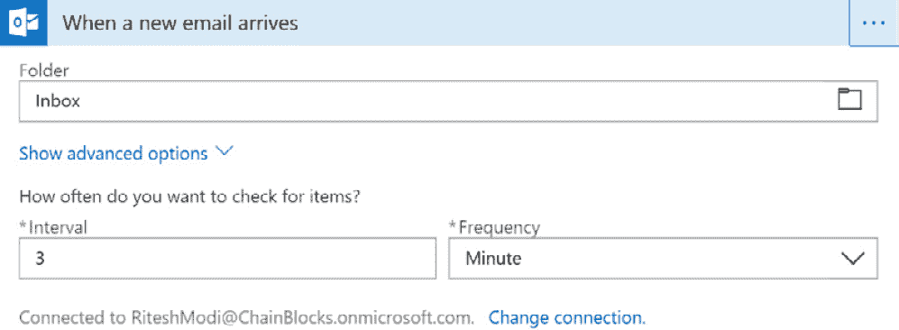
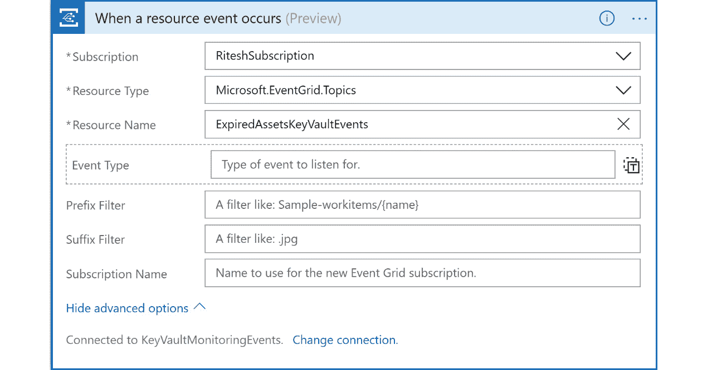

# 11. 使用 Azure Logic Apps、Event Grid 和 Functions 的 Azure 解决方案

本章接续上一章内容，进一步深入探讨 Azure 中可用的无服务器服务。在上一章中，你详细了解了 Azure Functions、函数即服务、耐久性函数以及 Event Grid。接下来，本章将重点讲解 Logic Apps，并且将展示如何创建一个完整的端到端无服务器解决方案，该解决方案结合了多个无服务器服务及其他服务，例如 Key Vault 和 Azure Automation。

在本章中，我们将通过以下主题进一步探索 Azure 服务：

+   Azure Logic Apps

+   使用无服务器技术创建端到端解决方案

## Azure Logic Apps

Logic Apps 是 Azure 提供的一种无服务器工作流服务。它具有所有无服务器技术的特点，例如按使用量计费和无限的可扩展性。Logic Apps 帮助我们通过 Azure 门户轻松构建业务流程和工作流解决方案。它提供了一个拖拽式界面，用于创建和配置工作流。

使用 Logic Apps 是集成服务和数据、创建业务项目以及创建完整逻辑流的首选方式。在构建 Logic Apps 之前，应该理解几个重要的概念。

### 活动

活动是一个独立的工作单元。活动的例子包括将 XML 转换为 JSON、从 Azure 存储读取 Blob 和写入 Cosmos DB 文档集合。Logic Apps 提供了一个工作流定义，包含多个相关活动按顺序执行。Logic Apps 中有两种类型的活动：

+   **触发器**：触发器是指启动活动的事件。所有 Logic Apps 都有一个触发器，它是第一个活动。触发器创建 Logic Apps 实例并启动执行。触发器的例子包括 Event Grid 消息的到达、电子邮件、HTTP 请求或计划任务。

+   **操作**：任何不是触发器的活动都是步骤活动，每个步骤负责执行一个任务。步骤按顺序连接在工作流中。每个步骤都需要完成一个操作，才能继续到下一个步骤。

### 连接器

连接器是 Azure 资源，用于将 Logic Apps 与外部服务连接。这些服务可以位于云端或本地。例如，有一个连接器可以将 Logic Apps 连接到 Event Grid。同样，还有一个连接器可以连接到 Office 365 Exchange。Logic Apps 中几乎所有类型的连接器都可以用来连接服务。连接器包含连接信息，并利用这些信息提供连接外部服务的逻辑。

所有连接器的完整列表可以在 [`docs.microsoft.com/connectors`](https://docs.microsoft.com/connectors) 查看。

现在你了解了连接器，你需要了解如何按步骤将它们对齐，以便工作流按预期运行。在接下来的部分，我们将重点介绍逻辑应用的工作原理。

### 逻辑应用的工作原理

让我们创建一个逻辑应用工作流，当电子邮件账户收到邮件时触发。它会回复发件人一封默认的电子邮件，并对邮件内容进行情感分析。对于情感分析，应该在创建逻辑应用之前配置 Cognitive Services 中的 Text Analytics 资源：

1.  导航到 Azure 门户，登录到你的账户，并在资源组中创建一个**Text Analytics**资源。Text Analytics 是 Cognitive Services 的一部分，提供情感分析、关键短语提取和语言检测等功能。你可以在 Azure 门户中找到该服务，如*图 11.1*所示：

    ###### 图 11.1：从 Azure 门户导航到 Text Analytics 服务

1.  提供**名称**、**位置**、**订阅**、**资源组**和**定价层**值。我们将在此演示中使用该服务的免费层（F0 层）。

1.  资源配置完成后，导航到**概览**页面，复制端点 URL，并将其存储在临时位置。配置逻辑应用时将需要此值。

1.  导航到**密钥**页面，复制**密钥 1**的值并将其存储在临时位置。配置逻辑应用时将需要此值。

1.  下一步是创建一个逻辑应用。要创建逻辑应用，请在 Azure 门户中导航到应创建逻辑应用的资源组。搜索“Logic App”，并通过提供**名称**、**位置**、**资源组**和**订阅**值来创建它。

1.  创建完逻辑应用后，导航到该资源，点击左侧菜单中的**Logic app designer**，然后选择**当在 Outlook.com 中收到新邮件时**模板来创建新工作流。该模板通过添加基本触发器和活动来为你提供一个起点。这将自动向工作流中添加一个 Office 365 Outlook 触发器。

1.  点击触发器上的**登录**按钮，它将打开一个新的 Internet Explorer 窗口。然后，登录到你的账户。成功登录后，将创建一个新的 Office 365 邮件连接器，包含连接到账户的相关信息。

1.  点击**继续**按钮，并将触发器配置为每 3 分钟轮询一次，如*图 11.2*所示：

    ###### 图 11.2：配置触发器为 3 分钟轮询频率

1.  在搜索栏中点击`variable`。然后，选择**初始化变量**操作，如*图 11.3*所示：

    ###### 图 11.3：添加初始化变量操作

1.  接下来，配置变量操作。当点击**值**框时，会弹出一个窗口，显示**动态内容**和**表达式**。动态内容是指当前操作可用的属性，并填充来自先前操作和触发器的运行时值。变量有助于保持工作流的通用性。从此窗口中，选择**动态内容**中的**正文**：

    ###### 图 11.4：配置变量操作

1.  通过点击搜索栏中的`outlook`，然后选择**回复电子邮件**操作，添加另一个操作：

    ###### 图 11.5：添加回复电子邮件操作

1.  配置新操作。确保**消息 ID**已设置为动态内容，**消息 ID**，然后在**评论**框中输入你希望发送给收件人的回复：

    ###### 图 11.6：配置回复电子邮件操作

1.  添加另一个操作，在搜索栏中输入`text analytics`，然后选择**检测情感（预览）**：

    ###### 图 11.7：添加检测情感（预览）操作

1.  按照*图 11.8*中的示例配置情感操作——此处应使用端点和密钥值。现在点击**创建**按钮，如*图 11.8*所示：

    ###### 图 11.8：配置检测情感（预览）操作

1.  通过添加动态内容并选择之前创建的变量**emailContent**，向操作提供文本。然后，点击**显示高级选项**，并为**语言**选择**en**：

    ###### 图 11.9：选择情感操作的语言

1.  接下来，通过选择**Outlook**并选择**发送电子邮件**来添加一个新操作。此操作会将包含情感评分的电子邮件内容发送给原始收件人，并将其作为主题。它应该如*图 11.10*所示进行配置。如果动态内容窗口中未显示评分，请点击旁边的**查看更多**链接：

    ###### 图 11.10：添加发送电子邮件操作

1.  保存逻辑应用，返回概述页面，然后点击**运行触发器**。该触发器每隔 3 分钟检查一次新邮件，回复发件人，执行情感分析，并将电子邮件发送给原始收件人。一个包含负面含义的电子邮件样本会发送到指定的电子邮件 ID：

    ###### 图 11.11：电子邮件示例

1.  几秒钟后，逻辑应用执行，发件人收到以下回复：

    ###### 图 11.12：回复原始发件人的电子邮件

1.  原始收件人收到包含情感评分和原始邮件文本的电子邮件，如*图 11.13*所示：

###### 图 11.13：电子邮件消息的 HTML 视图

通过这个活动，我们了解了逻辑应用的工作原理。当用户的收件箱收到电子邮件时，应用会被触发，随后流程按照逻辑应用中给定的步骤顺序执行。在下一节中，您将学习如何使用无服务器技术创建端到端解决方案。

## 使用无服务器技术创建端到端解决方案

在本节中，我们将创建一个端到端解决方案，包含我们在前几节中讨论的无服务器技术。以下示例将帮助您了解如何智能地实现工作流，避免管理开销。在接下来的活动中，我们将创建一个工作流，当密钥、机密和证书存储在 Azure Key Vault 中时，通知用户。我们将以此为问题陈述，找出解决方案，架构解决方案，并实现它。

### 问题陈述

我们要解决的问题是，用户和组织未收到关于其密钥保管库中密钥过期的通知，且密钥过期后应用程序会停止工作。用户抱怨 Azure 没有提供监控 Key Vault 密钥、机密和证书的基础设施。

### 解决方案

解决这个问题的方法是将多个 Azure 服务组合并集成，以便用户能主动收到密钥过期的通知。该解决方案将通过电子邮件和短信两种渠道发送通知。

用于创建此解决方案的 Azure 服务包括：

+   Azure 密钥库

+   **Azure 活动目录**（**Azure AD**）

+   Azure 事件网格

+   Azure 自动化

+   逻辑应用

+   Azure 函数

+   SendGrid

+   Twilio 短信

现在您已经了解了解决方案中将使用的服务，让我们开始为这个解决方案创建架构。

### 架构

在上一节中，我们探索了将用于解决方案的服务列表。如果我们要实现该解决方案，这些服务应按正确的顺序布局。架构将帮助我们开发工作流，并让我们更接近解决方案。

该解决方案的架构由多个服务组成，如*图 11.14*所示：


###### 图 11.14：解决方案架构

让我们逐一了解这些服务，并理解它们在整个解决方案中提供的角色和功能。

**Azure 自动化**

Azure 自动化提供了运行簿，这些运行簿可以执行逻辑，使用 PowerShell、Python 以及其他脚本语言。脚本可以在本地或云端执行，这为创建脚本提供了丰富的基础设施和工具。这些脚本被称为**运行簿**。通常，运行簿实现的场景包括停止或启动虚拟机，或创建和配置存储帐户。通过资产如变量、证书和连接，连接到 Azure 环境变得非常简单。

在当前的解决方案中，我们希望连接到 Azure 密钥库，读取其中存储的所有机密和密钥，并获取它们的到期日期。这些到期日期应与今天的日期进行比较，如果到期日期在一个月内，则运行簿应使用事件网格自定义主题在事件网格上触发一个自定义事件。

将实现一个使用 PowerShell 脚本的 Azure 自动化运行簿。与运行簿一起，还将创建一个调度器，每天在凌晨 12:00 执行该运行簿。

**自定义 Azure 事件网格主题**

一旦运行簿识别到某个机密或密钥将在一个月内到期，它将触发一个新的自定义事件，并将其发布到专门为此目的创建的自定义主题上。我们将在下一节中详细介绍实现的细节。

**Azure 逻辑应用**

逻辑应用是一种无服务器服务，提供工作流功能。我们的逻辑应用将被配置为在自定义 Event Grid 主题上发布事件时触发。触发后，它将调用工作流并依次执行其中的所有活动。通常，工作流中有多个活动，但为了本例的目的，我们将调用一个 Azure 函数，发送电子邮件和短信通知。在全面实施中，这些通知功能应该在单独的 Azure 函数中分别实现。

**Azure Functions**

使用 Azure Functions 通知用户和利益相关者有关机密和密钥过期的信息，通过电子邮件和短信发送通知。使用 SendGrid 发送电子邮件，Twilio 用于通过 Azure Functions 发送短信。

在下一部分，我们将了解实施解决方案之前的先决条件。

### 先决条件

您至少需要一个具有贡献者权限的 Azure 订阅。由于我们仅将服务部署到 Azure，并且没有部署外部服务，因此订阅是唯一的先决条件。现在让我们开始实施解决方案。

### 实施

应该已经存在一个密钥库。如果没有，需要创建一个。

如果需要配置一个新的 Azure Key Vault 实例，则应该执行此步骤。Azure 提供了多种方式来配置资源，其中突出的方式有 Azure PowerShell 和 Azure CLI。Azure CLI 是一个跨平台的命令行接口。首要任务是配置一个 Azure 密钥库。在本次实施中，我们将使用 Azure PowerShell 来配置密钥库。

在使用 Azure PowerShell 创建密钥库之前，重要的是要登录 Azure，以便后续的命令能够成功执行以创建密钥库。

**步骤 1：配置 Azure Key Vault 实例**

第一步是为示例准备环境。这包括登录 Azure 门户，选择合适的订阅，然后创建一个新的 Azure 资源组和一个新的 Azure Key Vault 资源：

1.  执行 `Connect-AzAccount` 命令以登录 Azure。系统会在新窗口中提示输入凭据。

1.  成功登录后，如果提供的登录 ID 有多个订阅，它们都会列出。需要选择一个合适的订阅——可以通过执行 `Set-AzContext` cmdlet 来完成：

    ```
    Set-AzContext -SubscriptionId xxxxxxxx-xxxx-xxxx-xxxx-xxxxxxxxxxx
    ```

1.  在您选择的区域创建一个新的资源组。此处的资源组名称为 `IntegrationDemo`，并且它被创建在 `西欧` 区域：

    ```
    New-AzResourceGroup -Name IntegrationDemo -Location "West Europe" -Verbose
    ```

1.  创建一个新的 Azure Key Vault 资源——此处的密钥库名称为 `keyvaultbook`，并且启用了部署、模板部署、磁盘加密、软删除和清除保护功能：

    ```
    New-AzKeyVault -Name keyvaultbook -ResourceGroupName IntegrationDemo -Location "West Europe" -EnabledForDeployment -EnabledForTemplateDeployment -EnabledForDiskEncryption -EnablePurgeProtection -Sku Standard - Verbose
    ```

请注意，密钥库名称需要是唯一的。您可能无法为两个密钥库使用相同的名称。成功执行前面的命令后，将创建一个新的 Azure 密钥库资源。下一步是为服务主体提供对密钥库的访问权限。

**步骤 2：创建服务主体**

Azure 提供服务主体，而不是使用个人账户连接到 Azure，服务主体本质上是服务账户，可以用于连接到 Azure 资源管理器并执行活动。将用户添加到 Azure 目录/租户后，由于 Azure 安全继承的性质，用户在所有资源组和资源中都可用。若不允许用户访问某些资源组，必须显式地从这些资源组中撤销访问权限。服务主体通过分配细粒度的访问权限和控制权限来提供帮助，必要时，可以授予它们订阅级别的访问权限。它们还可以被分配细粒度的权限，如读取者、贡献者或所有者权限。

简而言之，服务主体应成为使用 Azure 服务的首选机制。它们可以通过密码或证书密钥进行配置。可以使用 `New-AzAdServicePrinicipal` 命令创建服务主体，如下所示：

```
$sp = New-AzADServicePrincipal -DisplayName "keyvault-book" -Scope "/subscriptions/xxxxxxxx-xxxx-xxxx-xxxx-xxxxxxxxxxxx" -Role Owner -StartDate ([datetime]::Now) -EndDate $([datetime]::now.AddYears(1)) -Verbose
```

重要的配置值是范围和角色。范围决定了服务应用的访问区域——当前显示的是在订阅级别。范围的有效值如下：

```
/subscriptions/{subscriptionId}/subscriptions/{subscriptionId}/resourceGroups/{resourceGroupName}/subscriptions/{subscriptionId}/resourcegroups/{resourceGroupName}/providers/{resourceProviderNamespace}/{resourceType}/{resourceName}/subscriptions/{subscriptionId}/resourcegroups/{resourceGroupName}/providers/{resourceProviderNamespace}/{parentResourcePath}/{resourceType}/{resourceName}
```

该角色为分配的范围提供权限。有效值如下：

+   所有者

+   贡献者

+   读取者

+   特定资源权限

在前面的命令中，已将所有者权限提供给新创建的服务主体。

如果需要，我们也可以使用证书。为了简化起见，我们将继续使用密码。

使用我们创建的服务主体时，密钥将被隐藏。要查看密钥，您可以尝试以下命令：

```
$BSTR = [System.Runtime.InteropServices.Marshal]::SecureStringToBSTR($sp. Secret) 
$UnsecureSecret = [System.Runtime.InteropServices.Marshal]::PtrToStringAuto($BSTR)
```

`$UnsecureSecret` 将包含您的密钥。

与服务主体一起，将创建一个应用程序目录应用。该应用程序作为我们应用在各个目录中的全局表示，服务主体则像是该应用的本地表示。我们可以使用相同的应用在不同目录中创建多个服务主体。我们可以使用 `Get-AzAdApplication` 命令获取所创建应用程序的详细信息。我们将该命令的输出保存到一个变量 `$app` 中，因为稍后我们需要用到它：

```
$app = Get-AzAdApplication -DisplayName $sp.DisplayName
```

我们现在已经使用密钥创建了一个服务主体；创建服务主体的另一种安全方式是使用证书。在接下来的部分，我们将使用证书创建服务主体。

**步骤 3：使用证书创建服务主体**

要使用证书创建服务主体，应执行以下步骤：

1.  **创建自签名证书或购买证书**：自签名证书用于创建此示例的端到端应用程序。对于实际部署，应该从证书授权机构购买有效的证书。

    要创建一个自签名证书，可以运行以下命令。自签名证书是可导出的，并存储在本地机器的个人文件夹中——它也有一个到期日期：

    ```
    $currentDate = Get-Date $expiryDate = $currentDate.AddYears(1)$finalDate = $expiryDate.AddYears(1)$servicePrincipalName = "https://automation.book.com"$automationCertificate = New-SelfSignedCertificate -DnsName $servicePrincipalName -KeyExportPolicy Exportable -Provider "Microsoft Enhanced RSA and AES Cryptographic Provider" -NotAfter $finalDate -CertStoreLocation "Cert:\LocalMachine\My"
    ```

1.  `Get-Item` cmdlet 从证书存储中读取证书并将其存储在 `$cert1` 变量中。`Export-PfxCertificate` cmdlet 实际上将证书从证书存储导出到文件系统中。在此案例中，它位于 `C:\book` 文件夹中。

1.  `X509Certificate2` 被创建用于在内存中保存证书，并且数据通过 `System.Convert` 函数转换为 Base64 字符串：

    ```
    $newCert = New-Object System.Security.Cryptography.X509Certificates.X509Certificate2 -ArgumentList "C:\azureautomation.pfx", $securepfxpwd $newcertdata = [System.Convert]::ToBase64String($newCert.GetRawCertData())
    ```

    我们将使用相同的服务主体从 Azure 自动化帐户连接到 Azure。重要的是，应用程序 ID、租户 ID、订阅 ID 和证书指纹值需要存储在临时位置，以便用于配置后续资源：

    ```
    $adAppName = "azure-automation-sp"$ServicePrincipal = New-AzADServicePrincipal -DisplayName $adAppName -CertValue $newcertdata -StartDate $newCert.NotBefore -EndDate $newCert.NotAfter
    Sleep 10	
    New-AzRoleAssignment -ServicePrincipalName $ServicePrincipal.ApplicationId -RoleDefinitionName Owner -Scope /subscriptions/xxxxx-xxxxxxx-xxxxxx-xxxxxxx  
    ```

我们已经准备好服务主体。我们创建的密钥保管库没有设置访问策略，这意味着没有用户或应用程序能够访问该保管库。在接下来的步骤中，我们将授予我们创建的应用程序目录应用程序访问密钥保管库的权限。

**步骤 4：创建密钥保管库策略**

在此阶段，我们已经创建了服务主体和密钥保管库。然而，服务主体仍然没有访问密钥保管库的权限。这个服务主体将用于查询并列出密钥保管库中的所有机密、密钥和证书，它应该拥有执行此操作所需的权限。

为了为新创建的服务主体提供访问密钥保管库的权限，我们将返回 Azure PowerShell 控制台并执行以下命令：

Set-AzKeyVaultAccessPolicy -VaultName keyvaultbook -ResourceGroupName IntegrationDemo -ObjectId $ServicePrincipal.Id -PermissionsToKeys get,list,create -PermissionsToCertificates get,list,import -PermissionsToSecrets get,list -Verbose

参考之前的命令块，请查看以下几点：

+   `Set-AzKeyVaultAccessPolicy` 提供对用户、组和服务主体的访问权限。它接受密钥保管库名称和服务主体的对象 ID。这个对象与应用程序 ID 不同。服务主体的输出包含 `Id` 属性，如下所示：


###### 图 11.15：查找服务主体的对象 ID

+   `PermissionsToKeys` 提供对密钥保管库中密钥的访问权限，且为该服务主体提供了 `get`、`list` 和 `create` 权限。没有为该主体提供写入或更新权限。

+   `PermissionsToSecrets` 提供对密钥保管库中机密的访问权限，`get` 和 `list` 权限已授予此服务主体。此服务主体没有提供写入或更新权限。

+   `PermissionsToCertificates` 提供对密钥保管库中机密的访问权限，并且 `get`、`import` 和 `list` 权限已授予此服务主体。此服务主体没有提供写入或更新权限。

此时，我们已配置服务主体以便与 Azure 密钥保管库一起使用。解决方案的下一部分是创建一个自动化帐户。

**步骤 5：创建自动化帐户**

就像之前一样，我们将使用 Azure PowerShell 在资源组中创建一个新的 Azure 自动化帐户。在创建资源组和自动化帐户之前，应该先建立与 Azure 的连接。不过，这次，我们将使用服务主体的凭据连接到 Azure。步骤如下：

1.  使用服务应用程序连接到 Azure 的命令如下。该值来自我们在之前步骤中初始化的变量：

    ```
    Login-AzAccount -ServicePrincipal -CertificateThumbprint $newCert.Thumbprint -ApplicationId $ServicePrincipal.ApplicationId -Tenant "xxxx-xxxxxx-xxxxx-xxxxx" 
    ```

1.  通过检查 `Get-AzContext` 来确保你有权限，如下所示。记下订阅 ID，因为后续命令需要用到它：

    ```
    Get-AzContext
    ```

1.  连接到 Azure 后，应该创建一个包含解决方案资源的新资源以及一个新的 Azure 自动化帐户。你将资源组命名为 `VaultMonitoring`，并在 `West Europe` 区域创建它。其余资源也将创建在此资源组中：

    ```
    $IntegrationResourceGroup = "VaultMonitoring"$rgLocation = "West Europe"$automationAccountName = "MonitoringKeyVault"New-AzResourceGroup -name $IntegrationResourceGroup -Location $rgLocation New-AzAutomationAccount -Name $automationAccountName -ResourceGroupName $IntegrationResourceGroup -Location $rgLocation -Plan Free
    ```

1.  接下来，创建三个自动化变量。它们的值，即订阅 ID、租户 ID 和应用程序 ID，应该已经通过之前的步骤获得：

    ```
    New-AzAutomationVariable -Name "azuresubscriptionid" -AutomationAccountName $automationAccountName -ResourceGroupName $IntegrationResourceGroup -Value " xxxxxxxx-xxxx-xxxx-xxxx-xxxxxxxxxxxx " -Encrypted $true New-AzAutomationVariable -Name "azuretenantid" -AutomationAccountName $automationAccountName -ResourceGroupName $IntegrationResourceGroup -Value " xxxxxxxx-xxxx-xxxx-xxxx-xxxxxxxxxxxx " -Encrypted $true New-AzutomationVariable -Name "azureappid" -AutomationAccountName $automationAccountName -ResourceGroupName $IntegrationResourceGroup -Value " xxxxxxxx-xxxx-xxxx-xxxx-xxxxxxxxxxxx " -Encrypted $true
    ```

1.  现在是时候上传证书了，这个证书将用于从 Azure 自动化连接到 Azure：

    ```
    $securepfxpwd = ConvertTo-SecureString -String 'password' -AsPlainText -Force # Password for the private key PFX certificate New-AzAutomationCertificate -Name "AutomationCertifcate" -Path "C:\book\azureautomation.pfx" -Password $securepfxpwd -AutomationAccountName $automationAccountName -ResourceGroupName $IntegrationResourceGroup
    ```

1.  下一步是安装与密钥保管库和事件网格相关的 PowerShell 模块，因为这些模块默认没有安装。

1.  从 Azure 门户，点击左侧菜单中的 **资源组**，然后导航到已经创建的 `VaultMonitoring` 资源组。

1.  点击已经配置的 Azure 自动化帐户，`Az.profile` 模块，所以我们必须先安装它，然后再安装事件网格模块。

1.  如 *图 11.16* 所示，在搜索框中点击 `Az.profile`：

    ###### 图 11.16：模块库中的 Az.Profile 模块

1.  从搜索结果中，选择 `Az.Profile`，然后点击顶部菜单中的 **导入** 按钮。最后，点击 **确定** 按钮。此步骤需要几秒钟完成。几秒钟后，模块应已安装。

1.  可以从 **模块** 菜单项检查安装状态。*图 11.17* 展示了如何导入模块：

    ###### 图 11.17：Az.Profile 模块状态

1.  请再次执行*步骤 9*、*步骤 10*和*步骤 11*，以导入和安装`Az.EventGrid`模块。如果在继续操作之前出现安装任何依赖项的提示，请先安装这些依赖项。

1.  请再次执行*步骤 9*、*步骤 10*和*步骤 11*，以导入和安装`Az.KeyVault`模块。如果在继续操作之前出现安装任何依赖项的提示，请先安装这些依赖项。

由于我们已经导入了必要的模块，接下来让我们创建 Event Grid 主题。

**步骤 6：创建 Event Grid 主题**

如果你还记得我们使用的架构，我们需要一个 Event Grid 主题。让我们来创建一个。

使用 PowerShell 创建 Event Grid 主题的命令如下：

```
New-AzEventGridTopic -ResourceGroupName VaultMonitoring -Name azureforarchitects-topic -Location "West Europe" 
```

使用 Azure 门户创建 Event Grid 主题的过程如下：

1.  在 Azure 门户中，点击左侧菜单中的**资源组**，然后导航到已创建的`Vaultmonitoring`资源组。

1.  接下来，在搜索框中点击`Event Grid Topic`。选择它后，点击**创建**按钮。

1.  在生成的表单中填写适当的值，包括提供名称、选择订阅、选择新创建的资源组、位置和事件架构。

正如我们之前讨论的，Event Grid 主题提供了一个端点，源系统将通过该端点发送数据。既然我们已经准备好主题，接下来让我们准备源 Automation 帐户。

**步骤 7：设置 Runbook**

这一步将重点介绍如何创建 Azure Automation 帐户和 PowerShell Runbooks，这些 Runbooks 包含读取 Azure 密钥保管库并检索其中存储的秘密的核心逻辑。配置 Azure Automation 所需的步骤如下：

1.  通过点击左侧菜单中的**资源组**来访问`Vaultmonitoring`资源组。

1.  点击已配置好的 Azure Automation 帐户`MonitoringKeyVault`，然后在左侧菜单中点击**Runbooks**，再点击顶部菜单中的**+添加 Runbook**。

1.  点击**创建新 Runbook**并提供一个名称。我们将这个 Runbook 命名为**CheckExpiredAssets**，然后将**Runbook 类型**设置为**PowerShell**：

    ###### 图 11.18：创建 Runbook

1.  `AutomationCertifcate`。这些值会从这些存储中获取并赋给变量，如下所示：

    ```
    $subscriptionID = get-AutomationVariable "azuresubscriptionid"$tenantID = get-AutomationVariable "azuretenantid"$applicationId = get-AutomationVariable "azureappid"$cert = get-AutomationCertificate "AutomationCertifcate"$certThumbprint = ($cert.Thumbprint).ToString()
    ```

1.  Runbook 中的下一段代码帮助使用之前声明的变量中的值，通过服务主体登录到 Azure。同时，代码还会选择一个合适的订阅。代码如下所示：

    ```
    Login-AzAccount -ServicePrincipal -CertificateThumbprint $certThumbprint -ApplicationId $applicationId -Tenant $tenantID Set-AzContext -SubscriptionId $subscriptionID
    ```

    由于 Azure Event Grid 已在本节的*步骤 6*中进行了配置，因此可以使用`Get-AzEventGridTopic`和`Get-AzEventGridTopicKey` cmdlet 来检索其端点和密钥。

    Azure Event Grid 会生成两个密钥——一个主密钥和一个辅助密钥。第一个密钥的引用如下：

    ```
    $eventGridName = "ExpiredAssetsKeyVaultEvents"$eventGridResourceGroup = "VaultMonitoring"$topicEndpoint = (Get-AzEventGridTopic -ResourceGroupName $eventGridResourceGroup -Name $eventGridName).Endpoint $keys = (Get-AzEventGridTopicKey -ResourceGroupName $eventGridResourceGroup -Name $eventGridName ).Key1
    ```

1.  接下来，使用迭代检索订阅中所有已配置的密钥库。在循环过程中，使用`Get-AzKeyVaultSecret` cmdlet 检索所有机密。

    每个机密的过期日期与当前日期进行比较，如果差异小于一个月，则生成一个 Event Grid 事件，并使用`invoke-webrequest`命令发布。

    对于存储在密钥库中的证书，执行相同的步骤。用于检索所有证书的 cmdlet 是`Get-AzKeyVaultCertificate`。

    发布到 Event Grid 的事件应为 JSON 数组。生成的消息通过`ConvertTo-Json` cmdlet 转换为 JSON，然后通过添加`[`和`]`作为前缀和后缀转换为数组。

    为了连接到 Azure Event Grid 并发布事件，发送方应在其请求头中提供密钥。如果请求负载中缺少此数据，请求将失败：

    ```
    $keyvaults = Get-AzureRmKeyVault foreach($vault in $keyvaults) {$secrets = Get-AzureKeyVaultSecret -VaultName $vault.VaultName foreach($secret in $secrets) {if( ![string]::IsNullOrEmpty($secret.Expires) ) {if($secret.Expires.AddMonths(-1) -lt [datetime]::Now){$secretDataMessage = @{id = [System.guid]::NewGuid()subject = "Secret Expiry happening soon !!"eventType = "Secret Expiry"eventTime = [System.DateTime]::UtcNow data = @{"ExpiryDate" = $secret.Expires "SecretName" = $secret.Name.ToString()"VaultName" = $secret.VaultName.ToString()"SecretCreationDate" = $secret.Created.ToString()"IsSecretEnabled" = $secret.Enabled.ToString()"SecretId" = $secret.Id.ToString()}}...Invoke-WebRequest -Uri $topicEndpoint -Body $finalBody -Headers $header -Method Post -UseBasicParsing }}Start-Sleep -Seconds 5 }}
    ```

1.  点击**发布**按钮发布运行手册，如*图 11.19*所示：

    ###### 图 11.19：发布运行手册

1.  **调度器**：创建一个 Azure Automation 调度器资产，使此运行手册每天在午夜 12:00 执行一次。点击 Azure Automation 左侧菜单中的**调度**，然后在顶部菜单中点击**+添加调度**。

1.  在生成的表单中提供调度信息。

这应该完成 Azure Automation 帐户的配置。

**步骤 8：与 SendGrid 合作**

在本步骤中，我们将创建一个新的 SendGrid 资源。SendGrid 资源用于从应用程序发送电子邮件，而无需安装**简单邮件传输协议（SMTP）**服务器。它提供一个 REST API 和一个 C# **软件开发工具包（SDK）**，通过这些工具，发送批量电子邮件变得非常容易。在当前的解决方案中，将使用 Azure Functions 来调用 SendGrid API 发送电子邮件，因此需要配置此资源。该资源有单独的费用，并不包括在 Azure 成本中—可以使用一个免费的层级来发送电子邮件：

1.  `SendGrid`资源的创建方式与其他 Azure 资源相同。搜索`sendgrid`，我们将在结果中看到**SendGrid 电子邮件投递**。

1.  选择资源并点击**创建**按钮以打开其配置表单。

1.  选择一个合适的定价层。

1.  提供适当的联系信息。

1.  勾选**使用条款**复选框。

1.  完成表单后，点击**创建**按钮。

1.  在资源配置后，点击顶部菜单中的**管理**按钮—这将打开 SendGrid 网站。网站可能会请求进行电子邮件配置。然后，从**设置**部分选择**API 密钥**，并点击**创建 API 密钥**按钮：

    ###### 图 11.20：为 SendGrid 创建 API 密钥

1.  在弹出的窗口中，选择**Full Access**并点击**Create & View**按钮。这将为 SendGrid 资源创建密钥；请记下此密钥，因为它将在 Azure Functions 配置中与 SendGrid 一起使用：

###### 图 11.21：在 SendGrid 门户中设置访问级别

现在我们已经配置好了 SendGrid 的访问级别，接下来让我们配置另一个第三方服务，即 Twilio。

**步骤 9：开始使用 Twilio**

在此步骤中，我们将创建一个新的 Twilio 帐户。Twilio 用于发送批量短信。要在 Twilio 上创建帐户，请导航到[twilio.com](http://twilio.com)并创建一个新帐户。成功创建帐户后，会生成一个可以用来向接收者发送短信的手机号码：


###### 图 11.22：选择 Twilio 号码

Twilio 帐户提供生产和测试密钥。将测试密钥和令牌复制到临时位置（例如记事本），因为稍后在 Azure Functions 中将需要它们：


###### 图 11.23：设置 Twilio

我们已经为通知服务配置好了 SendGrid 和 Twilio；然而，我们还需要一些东西来接收事件并通知用户。这就是功能应用程序的作用。在接下来的部分中，我们将创建一个功能应用程序，它将有助于发送短信和电子邮件。

**步骤 10：设置功能应用程序**

在此步骤中，我们将创建一个新的功能应用程序，用于发送电子邮件和短信通知。功能应用程序在解决方案中的作用是向用户发送关于密钥库中机密到期的通知消息。一个功能将负责发送电子邮件和短信消息——请注意，这本可以分成两个独立的功能。第一步是创建一个新的功能应用程序，并在其中托管一个功能：

1.  如我们之前所做，导航到资源组，点击`function app`资源。然后点击**Create**按钮以获取**Function App**表单。

1.  填写**Function App**表单并点击**Create**按钮。功能应用程序的名称必须在 Azure 中是唯一的。

1.  一旦功能应用程序被配置好，点击左侧菜单中**Functions**项目旁的**+**按钮，创建一个名为`SMSandEMailFunction`的新功能。然后，在中央仪表盘中选择**In-portal**。

1.  选择`SMSandEMailFunction`。然后点击**Create**按钮——**Authorization level**选项可以是任何值。

1.  移除默认代码，替换为以下清单中显示的代码，然后点击顶部菜单中的**保存**按钮：

    ```
    #r "SendGrid"#r "Newtonsoft.Json"#r "Twilio.Api"using System.Net;using System;using SendGrid.Helpers.Mail;using Microsoft.Azure.WebJobs.Host;using Newtonsoft.Json;using Twilio;using System.Configuration;public static HttpResponseMessage Run(HttpRequestMessage req, TraceWriter log, out Mail message,out SMSMessage sms){log.Info("C# HTTP trigger function processed a request.");string alldata = req.Content.ReadAsStringAsync().GetAwaiter().GetResult();message = new Mail();var personalization = new Personalization();personalization.AddBcc(new Email(ConfigurationManager.AppSettings["bccStakeholdersEmail"]));personalization.AddTo(new Email(ConfigurationManager.AppSettings["toStakeholdersEmail"]));var messageContent = new Content("text/html", alldata);message.AddContent(messageContent);message.AddPersonalization(personalization);message.Subject = "Key Vault assets Expiring soon..";message.From = new Email(ConfigurationManager.AppSettings["serviceEmail"]);string msg = alldata;sms = new SMSMessage();sms.Body = msg;sms.To = ConfigurationManager.AppSettings["adminPhone"];sms.From = ConfigurationManager.AppSettings["servicePhone"];return req.CreateResponse(HttpStatusCode.OK, "Hello ");}
    ```

1.  点击左侧菜单中的函数应用名称，然后再次点击主窗口中的**应用程序设置**链接：

    ###### 图 11.24：导航到应用程序设置

1.  导航到`adminPhone`和`servicePhone`，这两个号码应该已经在 Twilio 网站上配置。`servicePhone`是由 Twilio 生成的用于发送短信的电话号码，`adminPhone`是管理员的电话号码，短信将发送到该号码。

    还要注意，Twilio 要求目标电话号码根据国家/地区采用特定格式（例如，印度的格式是`+91 xxxxx xxxxx`）。请注意号码中的空格和国家代码。

    我们还需要在应用程序设置中添加 SendGrid 和 Twilio 的密钥。这些设置在以下清单中提到。你可能已经通过之前的步骤获取了这些值：

    +   `SendGridAPIKeyAsAppSetting`的值是 SendGrid 的密钥。

    +   `TwilioAccountSid`是 Twilio 账户的系统标识符。该值已在*步骤 9：开始使用 Twilio*中复制并存储在临时位置。

    +   `TwilioAuthToken`是 Twilio 账户的令牌。该值已在之前的步骤中复制并存储在临时位置。

1.  通过点击顶部菜单中的**保存**按钮保存设置：

    ###### 图 11.25：配置应用程序设置

1.  点击左侧菜单中函数名称下方的**集成**链接，然后点击**+ 新输出**。这是为了为 SendGrid 服务添加输出：

    ###### 图 11.26：向函数应用添加输出

1.  接下来，选择**SendGrid**；系统可能会要求你安装 SendGrid 扩展。安装扩展，这可能需要几分钟：

    ###### 图 11.27：配置函数应用

1.  安装扩展后，输出配置表单将出现。表单中的重要配置项是**消息参数名称**和**SendGrid API 密钥应用设置**。保持**消息参数名称**的默认值，然后点击下拉列表选择**SendGridAPIKeyAsAppSetting**作为 API 应用设置密钥。该配置已在应用设置配置的前一步中完成。表单应按*图 11.28*所示进行配置，然后点击**保存**按钮：

    ###### 图 11.28：设置 SendGrid

1.  再次点击**+ 新建输出**；这是为了为 Twilio 服务添加输出。

1.  然后，选择**Twilio SMS**。系统可能会提示你安装 Twilio SMS 扩展。安装该扩展，安装过程大约需要几分钟。

1.  安装扩展后，输出配置表单会出现。此表单中的重要配置项是`sms`。这样做是因为`message`参数已经被用于 SendGrid 服务参数。确保`TwilioAccountSid`的值以及**Auth Token 设置**的值是**TwilioAuthToken**。这些值在应用设置配置的前一个步骤中已经配置过了。该表单应该按*图 11.29*的示例进行配置，然后点击**保存**：

###### 图 11.29：设置 Twilio SMS 输出

我们的 SendGrid 和 Twilio 账户已准备好。现在是时候使用连接器并将其添加到逻辑应用中。在接下来的部分，我们将创建逻辑应用，并使用连接器与我们迄今为止创建的资源进行交互。

**步骤 11：创建逻辑应用**

在此步骤中，我们将创建一个新的逻辑应用工作流。我们已经编写了一个 Azure 自动化运行簿，它查询所有密钥保管库中的密钥，并在发现其中任何密钥将在一个月内到期时发布事件。逻辑应用的工作流作为这些事件的订阅者：

1.  **逻辑应用**菜单中的第一步是创建一个逻辑应用工作流。

1.  点击**创建**按钮后填写弹出的表单。我们正在将逻辑应用配置到与该解决方案其他资源相同的资源组中。

1.  在逻辑应用被配置后，它将打开设计器窗口。请选择**空白逻辑应用**，该选项位于**模板**部分。

1.  在弹出的窗口中，添加一个可以订阅 Event Grid 的触发器。逻辑应用提供了一个 Event Grid 触发器，你可以搜索它以查看是否可用。

1.  接下来，选择**当资源事件发生时（预览）**触发器：

    ###### 图 11.30：从 Event Grid 选择触发器

1.  在弹出的窗口中，选择**与服务主体连接**。

    提供服务主体详细信息，包括应用 ID（**客户端 ID**）、租户 ID 和密码。此触发器不接受使用证书进行身份验证的服务主体，它仅接受使用密码的服务主体。在此阶段创建一个使用密码进行身份验证的新服务主体（有关基于密码身份验证的服务主体创建步骤，请参考之前的*第 2 步*），并使用新创建的服务主体的详细信息进行 Azure Event Grid 配置，如*图 11.31*所示：

    

    ###### 图 11.31：提供服务主体的连接详细信息

1.  选择订阅。根据服务主体的范围，相关内容会自动填充。选择**Microsoft.EventGrid.Topics**作为**资源类型**值，并将自定义主题的名称设置为**ExpiredAssetsKeyVaultEvents**:

    ###### 图 11.32：提供事件网格触发器详细信息

1.  上一步将创建一个连接器，连接信息可以通过点击**更改连接**来修改。

1.  事件网格触发器的最终配置应类似于*图 11.33*：

    ###### 图 11.33：事件网格触发器概览

1.  在事件网格触发器后添加一个新的**解析 JSON**活动——此活动需要 JSON 架构。通常，架构不可用，但如果提供有效的 JSON，它会帮助生成架构：

    ###### 图 11.34：解析 JSON 活动

1.  点击**使用示例负载生成架构**并提供以下数据：

    ```
    {"ExpiryDate": "","SecretName": "","VaultName": "","SecretCreationDate": "","IsSecretEnabled": "","SecretId": ""}
    ```

    这里可能会有一个问题，关于示例负载。在此阶段，如何计算事件网格发布者生成的负载？答案在于这个示例负载与在 Azure 自动化运行簿中数据元素所使用的完全相同。你可以再次查看那个代码片段：

    ```
    data = @{"ExpiryDate" = $certificate.Expires "CertificateName" = $certificate.Name.ToString()"VaultName" = $certificate.VaultName.ToString()"CertificateCreationDate" = $certificate.Created.ToString()"IsCertificateEnabled" = $certificate.Enabled.ToString()"CertificateId" = $certificate.Id.ToString()}
    ```

1.  **内容**框应包含来自先前触发器的动态内容，如*图 11.35*所示：

    ###### 图 11.35：将动态内容提供给解析 JSON 活动

1.  在**解析 JSON**后添加另一个**Azure Functions**操作，然后选择**选择 Azure 函数**。选择先前创建的名为**NotificationFunctionAppBook**和**SMSAndEmailFunction**的 Azure 函数应用：

    ###### 图 11.36：添加 Azure Functions 操作

1.  点击**请求正文**文本区域，并用以下代码填充它。这是为了在将数据发送到 Azure 函数之前将其转换为 JSON：

    ```
    {"alldata" :}
    ```

1.  将光标放在前述代码中的`":"`后，点击**添加动态内容 | 正文**，从先前的活动中获取：

    ###### 图 11.37：在将数据发送到 Azure 函数之前将数据转换为 JSON

1.  保存整个逻辑应用程序，它应如下所示：

###### 图 11.38：逻辑应用程序工作流

一旦保存了逻辑应用程序，您的解决方案就准备好进行测试。如果没有密钥或机密，请尝试添加具有过期日期的密钥或机密，以便您可以确认解决方案是否正常工作。

### 测试

将一些具有过期日期的机密和证书上传到 Azure Key Vault，并执行 Azure 自动化运行簿。该运行簿已安排按计划运行。此外，运行簿还将向 Event Grid 发布事件。逻辑应用程序应启用，它会捕捉到事件，并最终调用 Azure 函数以发送电子邮件和短信通知。

电子邮件应如下所示：


###### 图 11.39：关于即将过期密钥的电子邮件

在本练习中，我们遇到了一个问题，设计了一个解决方案并加以实施。这正是架构师角色中会发生的事情。客户会提出具体的需求，基于这些需求，您必须开发解决方案。基于此，我们即将结束本章内容。让我们快速回顾一下我们讨论过的内容。

## 总结

本章介绍了逻辑应用程序，并展示了使用多个 Azure 服务的完整端到端解决方案。本章重点介绍了创建集成多个 Azure 服务的架构，以实现端到端解决方案。解决方案中使用的服务包括 Azure 自动化、Azure 逻辑应用程序、Azure 事件网格、Azure 函数、SendGrid 和 Twilio。这些服务通过 Azure 门户和 PowerShell 实现，并使用服务主体作为服务帐户。本章还展示了多种使用密码和证书身份验证创建服务主体的方法。

解决问题的方法有多种。您可以在逻辑应用程序中使用 Outlook 触发器，而不是 SendGrid。一个问题有许多解决方案，选择哪一种取决于您采取的方案。您对服务越熟悉，选择的余地就越大。在下一章中，您将学习到事件在 Azure 和 Azure 应用程序架构中的重要性。
