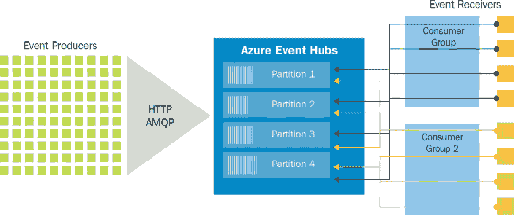

# 12. Azure 大数据事件解决方案

事件无处不在！任何改变工作项状态的活动或任务都会生成一个事件。由于基础设施不足以及廉价设备的缺乏，**物联网**（**IoT**）此前并未获得太多关注。从历史上看，组织使用的是来自**互联网服务提供商**（**ISP**）的托管环境，这些环境上仅有监控系统。这些监控系统产生的事件少之又少。

然而，随着云计算的兴起，事物正在迅速变化。随着云端部署的增加，尤其是**平台即服务**（**PaaS**）服务的普及，组织不再需要过多地控制硬件和平台，每当环境发生变化时，都会触发一个事件。随着云事件的出现，物联网变得越来越重要，事件也开始成为中心。

另一个最近的现象是数据可用性迅速增长。数据的速度、种类和数量急剧增加，存储和处理数据的需求也随之上升。多个解决方案和平台相继出现，例如 Hadoop、用于存储的数据湖、用于分析的数据湖和机器学习服务。

除了存储和分析外，还有一种需求是能够从各种来源摄取成千上万事件和消息的服务。还需要能够处理时间数据的服务，而不是处理整个数据快照的服务。例如，事件数据/物联网数据被用于做出基于实时或近实时数据的决策的应用程序，例如交通管理系统或监控温度的系统。

Azure 提供了大量帮助捕获和分析传感器实时数据的服务。在本章中，我们将介绍 Azure 中的几种事件服务，具体如下：

+   Azure Event Hubs

+   Azure Stream Analytics

还有其他事件服务，例如 Azure Event Grid，本章未涉及；然而，它们在*第十章，使用 Azure 函数的 Azure 集成服务（耐久函数和代理函数）*中有广泛介绍。

## 引入事件

事件是 Azure 和 Azure 应用架构中的重要构件。事件遍布整个软件生态系统。一般来说，任何采取的行动都会导致一个事件的发生，该事件可以被捕捉，然后采取进一步的行动。为了推动这个讨论，首先需要理解事件的基本概念。

事件有助于捕获目标资源的新状态。消息是条件或状态变化的轻量级通知。事件与消息不同。消息与业务功能相关，例如将订单详情发送到另一个系统。它们包含原始数据，并且可能很大。相比之下，事件则不同；例如，虚拟机被停止就是一个事件。*图 12.1*演示了从当前状态到目标状态的转变：


###### 图 12.1：由于事件引起的状态转变

事件可以作为历史数据存储在持久存储中，事件还可以用来发现持续出现的模式。事件可以被视为不断流动的数据。为了捕获、摄取和分析一连串的数据，需要特定的基础设施组件，这些组件能够读取一小段数据并提供洞察力，这就是 Stream Analytics 服务的作用所在。

### 事件流处理

在数据流式传输过程中对事件进行处理，能够提供有关数据的实时洞察。时间窗口可以是 15 分钟或一小时——窗口由用户定义，并取决于要从数据中提取的洞察。例如，信用卡刷卡，每分钟会有成千上万次刷卡事件，欺诈检测可以在流式事件上进行，时间窗口为一到两分钟。

事件流处理指的是能够随时接受数据的服务，而不是按周期性接收数据。例如，事件流应能够随时接收设备发送的温度信息，而不是让数据在队列或暂存环境中等待。

事件流处理还具有在数据传输过程中查询数据的能力。这是暂时存储的数据，查询发生在移动数据上；因此，数据不是静态的。其他数据平台无法实现这一功能，它们只能查询已存储的数据，而无法查询刚刚摄取的临时数据。

事件流服务应能够轻松扩展，接受数百万甚至数十亿个事件。它们应具有高度可用性，使得源可以随时向其发送事件和数据。实时数据摄取并能够在这些数据上工作，而不是在其他位置存储的数据，是事件流处理的关键。

但当我们已经有了许多具备高级查询执行能力的数据平台时，为什么还需要事件流处理呢？事件流处理的主要优势之一是它提供实时洞察和信息，而这些信息的价值依赖于时间。几分钟或几小时后得到的相同信息可能就不那么有用了。让我们考虑一些处理传入数据非常重要的场景。这些场景是现有数据平台无法有效且高效解决的：

+   **信用卡欺诈检测**：应该在发生欺诈交易时及时进行。

+   **来自传感器的遥测信息**：对于发送环境关键信息的物联网设备，用户应在发现异常时及时收到通知。

+   **实时仪表盘**：事件流处理用于创建显示实时信息的仪表盘。

+   **数据中心环境遥测**：这将让用户知道是否有入侵、安保漏洞、组件故障等问题发生。

企业内应用事件流处理的可能性非常多，它的重要性无法过分强调。

### Event Hubs

Azure Event Hubs 是一个流处理平台，提供与流式事件的获取和存储相关的功能。

它可以从多种来源获取数据；这些来源可以是物联网传感器或任何使用 Event Hubs **软件开发工具包** (**SDK**) 的应用程序。它支持多种协议来获取和存储数据。这些协议是行业标准，包括以下几种：

+   **HTTP**：这是一种无状态的选项，不需要活动会话。

+   **高级消息队列协议** (**AMQP**)：这需要一个活动会话（即通过套接字建立的连接），并与 **传输层安全性** (**TLS**) 和 **安全套接字层** (**SSL**) 一起使用。

+   **Apache Kafka**：这是一种类似于流分析的分布式流处理平台。然而，流分析旨在对来自多个数据源（如物联网传感器和网站）的数据流进行实时分析。

Event Hubs 是一个事件获取服务。它不能查询请求并将查询结果输出到其他位置。这是 Stream Analytics 的责任，后文将介绍。

要从门户创建 Event Hubs 实例，请在市场中搜索 Event Hubs 并点击 **创建**。选择一个订阅和现有的资源组（或创建一个新的）。为 Event Hubs 命名空间提供名称，选择首选的 Azure 区域进行托管，定价层级（后文将解释 Basic 或 Standard），以及吞吐量单元的数量（后文将解释）：


###### 图 12.2：创建 Event Hubs 命名空间

Event Hubs 作为一个 PaaS 服务，具有高度分布式、高可用性和高度可扩展性。

Event Hubs 提供以下两种 SKU 或定价层：

+   **基础版**：此 SKU 支持一个消费者组，并且可以保留消息 1 天。最多支持 100 个中介连接。

+   **标准版**：此 SKU 最多支持 20 个消费者组，能够保留消息 1 天，并且可以额外存储 7 天的消息。最多支持 1,000 个中介连接。还可以在此 SKU 中定义策略。

*图 12.3*展示了在创建新 Event Hubs 命名空间时可用的不同 SKU。它提供了选择适当定价层的选项，以及其他重要细节：


###### 图 12.3：Event Hubs SKUs

吞吐量也可以在命名空间级别进行配置。命名空间是容器，由同一订阅和区域中的多个事件中心组成。吞吐量以**吞吐量单元**（**TUs**）来计算。每个 TU 提供：

+   每秒最多 1 MB 的入站流量，或者每秒最多 1,000 个入站事件和管理操作。

+   每秒最多 2 MB 的出站流量，或者每秒最多 4,096 个事件和管理操作。

+   最多可存储 84 GB 的存储空间。

TUs 的数量可以从 1 到 20 不等，并且按小时计费。

需要注意的是，Event Hubs 命名空间创建后无法更改 SKU。选择 SKU 之前需要进行充分的考虑和规划。规划过程应包括确定所需的消费者组数量以及感兴趣读取事件的应用程序数量。

此外，并非每个区域都提供标准版 SKU。在设计和实现 Event Hub 时应检查其可用性。检查区域可用性的 URL 是[`azure.microsoft.com/global-infrastructure/services/?products=event-hubs`](https://azure.microsoft.com/global-infrastructure/services/?products=event-hubs)。

## Event Hubs 架构

Event Hubs 架构有三个主要组成部分：**事件生产者**、**事件中心**和**事件消费者**，如下图所示：


###### 图 12.4：Event Hubs 架构

**事件生产者**生成事件并将其发送到**事件中心**。**事件中心**存储接收的事件，并将这些数据提供给**事件消费者**。**事件消费者**是对这些事件感兴趣的任何实体，它连接到**事件中心**以提取数据。

创建 Event Hubs 时必须先创建 Event Hubs 命名空间。Event Hubs 命名空间作为容器，可以托管多个事件中心。每个 Event Hubs 命名空间提供一个唯一的基于 REST 的端点，供客户端用于向 Event Hubs 发送数据。此命名空间与 Service Bus 组件（如主题和队列）所需的命名空间相同。

事件中心命名空间的连接字符串由其 URL、策略名称和密钥组成。以下代码块展示了一个示例连接字符串：

```
Endpoint=sb://demoeventhubnsbook.servicebus.windows.net/;SharedAccessKeyName=RootManageSharedAccessKey;SharedAccessKey=M/E4eeBsr7DAlXcvw6ziFqlSDNbFX6E49Jfti8CRkbA=
```

这个连接字符串可以在命名空间的**共享访问签名**（**SAS**）菜单项中找到。命名空间可以定义多个策略，每个策略具有不同的访问级别。访问级别如下：

+   **管理**：此选项可以从管理角度管理事件中心。它还具有发送和监听事件的权限。

+   **发送**：此选项可以将事件写入事件中心。

+   **监听**：此选项可以从事件中心读取事件。

默认情况下，在创建事件中心时会创建`RootManageSharedAccessKey`策略，如*图 12.5*所示。策略有助于在事件中心上创建细粒度的访问控制。与每个策略相关联的密钥由消费者用来确定其身份；还可以创建附加策略，并使用之前提到的三种访问级别的任何组合：


###### 图 12.5：事件中心中的共享访问策略

可以通过执行以下操作，从事件中心命名空间服务中创建事件中心：

1.  点击左侧菜单中的**事件中心**，然后在结果屏幕中点击**+ 事件中心**：

    ###### 图 12.6：从 Azure 门户创建事件中心

1.  接下来，提供**分区数**和**消息保留**字段的值，以及你选择的名称。然后，选择**关闭**作为**捕获**选项，如*图 12.7*所示：


###### 图 12.7：创建新的事件中心

创建事件中心后，你将在事件中心列表中看到它，如*图 12.8*所示：


###### 图 12.8：已创建的事件中心列表

事件中心还允许通过名为“捕获”的功能直接将事件存储到存储账户或数据湖中。

捕获功能帮助将摄取的数据自动存储到 Azure 存储账户或 Azure 数据湖中。此功能确保数据的摄取和存储在一个步骤中完成，而不是将数据转移到存储中作为单独的活动：


###### 图 12.9：捕获功能选项

可以通过在事件中心级别添加新策略，将单独的策略分配给每个事件中心。

创建策略后，可以从 Azure 门户中**安全访问签名**左侧菜单项获取连接字符串。

由于一个命名空间可以包含多个事件中心，单个事件中心的连接字符串将类似于以下代码块。这里的区别在于密钥值和添加了`EntityPath`，它指向事件中心的名称：

```
Endpoint=sb://azuretwittereventdata.servicebus.windows
=rxEu5K4Y2qsi5wEeOKuOvRnhtgW8xW35UBex4VlIKqg=;EntityPath=myeventhub
```

在创建事件中心时，我们必须保持**捕获**选项设置为**关闭**，但在事件中心创建后可以重新打开它。它有助于将事件自动保存到 Azure Blob 存储或 Azure 数据湖存储帐户中。大小和时间间隔的配置如*图 12.10*所示：


###### 图 12.10：选择捕获事件的大小和时间间隔

在创建事件中心时，我们没有涵盖分区和消息保留选项的概念。

分区是与任何数据存储的可扩展性相关的重要概念。事件在事件中心内会保留特定的时间。如果所有事件都存储在同一个数据存储中，那么扩展这个数据存储将变得极其困难。每个事件生产者都会连接到同一个数据存储并将事件发送到其中。与此相比，具有分区能力的数据存储可以将相同的数据分割成多个更小的数据存储，每个存储都有一个唯一的标识值。

更小的数据存储被称为**分区**，定义该分区的值被称为**分区键**。这个分区键是事件数据的一部分。

现在，事件生产者可以连接到事件中心，并根据分区键的值，事件中心会将数据存储在适当的分区中。这将允许事件中心同时并行地接收多个事件。

确定分区数量是事件中心可扩展性的一个关键方面。*图 12.11* 显示了事件中心如何使用分区键将接收到的数据存储在适当的分区中：


###### 图 12.11：事件中心中的分区

需要理解的是，一个分区可能有多个键。用户决定需要多少个分区，事件中心则会内部决定最佳的方式在这些分区之间分配分区键。每个分区都会使用时间戳按顺序存储数据，较新的事件会附加到分区的末尾。

需要注意的是，一旦事件中心创建完成，就无法更改分区的数量。

还需要记住，分区还可以为读取事件的应用程序带来并行性和并发性。例如，如果有 10 个分区，10 个并行读取器可以同时读取事件，而不会出现性能下降。

消息保留期指的是事件应该存储的时间段。在保留期过后，事件将被丢弃。

### 消费者组

消费者是从事件中心读取事件的应用程序。消费组是为消费者创建的，以便消费者连接到并读取事件。一个事件中心可以有多个消费组，每个消费组都可以访问事件中心中的所有分区。每个消费组都会针对事件中心中的事件形成一个查询。应用程序可以使用消费组，每个应用程序将看到事件中心事件的不同视图。在创建事件中心时，会自动创建一个默认的`$default`消费组。为了优化性能，最好将一个消费者与一个消费组关联。然而，每个消费组中的每个分区最多可以有五个读取器：



###### 图 12.12：消费组中的事件接收器

现在你已经理解了消费组的概念，接下来我们将深入了解 Event Hubs 吞吐量的概念。

### 吞吐量

分区有助于扩展性，而吞吐量则决定了每秒的容量。那么，在 Event Hubs 中，容量是什么？它是每秒可以处理的数据量。

在 Event Hubs 中，一个单一的 TU 支持以下内容：

+   每秒 1 MB 的数据摄取或每秒 1,000 个事件（以先发生者为准）

+   每秒 2 MB 的数据输出或每秒 4,096 个事件（以先发生者为准）

自动扩展选项在当传入/传出事件的数量或传入/传出的总大小超过阈值时，自动增加吞吐量。吞吐量会随需求自动扩展或收缩，而不是进行限速。在命名空间创建时的吞吐量配置如*图 12.13*所示。再次强调，决定 TUs 时需要慎重考虑：


###### 图 12.13：选择 TUs 并启用自动扩展

## Stream Analytics 入门

Event Hubs 是一个高度可扩展的数据流平台，因此我们需要另一个可以将这些事件作为流处理的服务，而不仅仅是存储数据。Stream Analytics 帮助处理和检查大数据流，Stream Analytics 作业则帮助执行事件处理。

Stream Analytics 可以处理每秒数百万个事件，而且入门非常简单。Azure Stream Analytics 是一个完全由 Azure 管理的 PaaS 服务。Stream Analytics 的客户无需管理底层硬件和平台。

每个作业包含多个输入、输出和一个查询，该查询将传入数据转换为新的输出。Stream Analytics 的整个架构如*图 12.14*所示：


###### 图 12.14：Azure Stream Analytics 架构

在*图 12.14*中，事件源显示在最左侧。这些是生成事件的源。它们可以是物联网设备、用任何编程语言编写的自定义应用程序，或者来自其他 Azure 平台的事件，例如 Log Analytics 或 Application Insights。

这些事件必须首先被摄取到系统中，Azure 提供了许多服务来帮助摄取这些数据。我们已经查看了 Event Hubs 以及它们如何帮助摄取数据。还有其他服务，如 IoT Hub，也有助于摄取特定设备和传感器的数据。IoT Hub 和数据摄取的详细信息请参见*第十一章，设计物联网解决方案*。这些摄取的数据在到达流时会进行处理，处理工作由 Stream Analytics 完成。Stream Analytics 的输出可以传输到展示平台，如 Power BI，向利益相关者展示实时数据，或传输到存储平台，如 Cosmos DB、Data Lake Storage 或 Azure 存储，数据可以稍后通过 Azure Functions 和 Service Bus 队列进行读取和处理。

Stream Analytics 有助于从实时摄取的数据中在时间窗口框架内获取洞察，并帮助识别模式。

它通过三种不同的任务来完成这一过程：

+   **输入**：数据应该在分析过程中被摄取。数据可以来源于 Event Hubs、IoT Hub 或 Azure Blob 存储。可以使用存储账户和 SQL 数据库的多个独立参考输入来查询数据中的查找数据。

+   **查询**：这是 Stream Analytics 执行核心任务的地方，它分析摄取的数据并提取有意义的洞察和模式。它通过 JavaScript 用户定义函数、JavaScript 用户定义聚合、Azure 机器学习和 Azure 机器学习工作室来实现。

+   **输出**：查询结果可以发送到多种不同类型的目标，其中突出的目标包括 Cosmos DB、Power BI、Synapse Analytics、Data Lake Storage 和 Functions：


###### 图 12.15：Stream Analytics 过程

Stream Analytics 能够每秒摄取数百万个事件，并可以在这些事件上执行查询。

输入数据支持以下三种格式之一：

+   **JavaScript 对象表示法**（**JSON**）：这是一种轻量级的基于文本的格式，易于人类阅读。它由名称-值对组成；以下是一个 JSON 事件示例：

    ```
    { "SensorId" : 2, "humidity" : 60, "temperature" : 26C }
    ```

+   **逗号分隔值**（**CSV**）：这些也是纯文本值，使用逗号分隔。*图 12.16*中展示了一个 CSV 示例。第一行是表头，包含三个字段，后面是两行数据：


###### 图 12.16：纯文本值

+   **Avro**：这种格式类似于 JSON；然而，它以二进制格式存储，而不是文本格式：

    ```
    {
    	"firstname": "Ritesh",
       "lastname": "Modi",
    	"email": "ritesh.modi@outlook.com"
    }
    ```

然而，这并不意味着流分析只能使用这三种格式来摄取数据。它还可以创建自定义的 .NET 序列化器，通过这些序列化器，任何格式的数据都可以根据序列化器的实现进行摄取。您可以按照[`docs.microsoft.com/azure/stream-analytics/custom-deserializer-examples`](https://docs.microsoft.com/azure/stream-analytics/custom-deserializer-examples)中的步骤编写自定义序列化器。

流分析不仅可以接收事件，还提供对接收到数据的高级查询功能。这些查询可以从时间数据流中提取重要见解并输出。

如*图 12.17*所示，有一个输入数据集和一个输出数据集；查询将事件从输入移动到输出。`INTO` 子句指向输出位置，`FROM` 子句指向输入位置。查询非常类似于 SQL 查询，因此 SQL 程序员的学习曲线不会太陡峭：


###### 图 12.17：接收 Twitter 数据的流分析查询

事件中心提供了将查询输出发送到目标位置的机制。撰写本文时，流分析支持多种事件和查询输出的目标位置，如前所示。

还可以定义可以在查询中重复使用的自定义函数。提供了四种选项来定义自定义函数。

+   Azure 机器学习

+   JavaScript 用户定义的函数

+   JavaScript 用户定义的聚合

+   Azure 机器学习工作室

### 托管环境

流分析作业可以在云端运行的主机上运行，也可以在物联网边缘设备上运行。物联网边缘设备是靠近物联网传感器的设备，而不是在云上。*图 12.18*展示了**新建流分析作业**面板：


###### 图 12.18：创建一个新的流分析作业

让我们详细查看流处理单元。

### 流处理单元

从*图 12.18*中可以看到，流分析中唯一的配置是流处理单元。流处理单元指的是为运行流分析作业分配的资源（即 CPU 和内存）。最小和最大流处理单元分别为 1 和 120。

流处理单元必须根据数据量和在该数据上执行的查询数量预先分配；否则，作业将失败。

可以通过 Azure 门户向上或向下扩展流处理单元。

## 使用事件中心和流分析的示例应用程序

在本节中，我们将创建一个包含多个 Azure 服务的示例应用程序，包含 Azure 逻辑应用、Azure 事件中心、Azure 存储和 Azure 流分析。

在这个示例应用程序中，我们将读取所有包含“Azure”一词的推文，并将其存储在 Azure 存储账户中。

要创建这个解决方案，我们首先需要配置所有必要的资源。

## 配置一个新的资源组

导航到 Azure 门户，使用有效凭据登录，点击 **+ 创建资源**，搜索 **资源组**。从搜索结果中选择 **资源组**，然后创建一个新的资源组。接着，提供一个名称并选择一个合适的位置。请注意，所有资源应托管在同一个资源组和位置中，以便于删除它们：


###### 图 12.19：在 Azure 门户中配置一个新的资源组

接下来，我们将创建一个 Event Hubs 命名空间。

### 创建一个 Event Hubs 命名空间

点击 **+ 创建资源**，并搜索 **Event Hubs**。从搜索结果中选择 **Event Hubs**，然后创建一个新的事件中心。接着，提供一个名称和位置，并根据之前创建的资源组选择一个订阅。选择 **Standard** 作为定价层，并且勾选 **启用自动扩展**，如 *图 12.20* 所示：


###### 图 12.20：创建一个 Event Hubs 命名空间

到现在为止，应该已经创建了一个 Event Hubs 命名空间。在创建事件中心之前，必须先有一个命名空间。下一步是配置事件中心。

### 创建一个事件中心

在 Event Hubs 命名空间服务中，点击左侧菜单中的 **Events Hubs**，然后点击 **+ Event Hubs** 创建一个新的事件中心。命名为 **azuretwitterdata**，并提供一个最佳的分区数量和 **消息保留** 值：


###### 图 12.21：创建 azuretwitterdata 事件中心

在此步骤之后，您将拥有一个事件中心，用于将事件数据发送到下游服务，这些数据将存储在持久存储中，如数据湖或 Azure 存储帐户中。

### 配置一个逻辑应用

在资源组配置完成后，点击 **+ 创建资源**，搜索 **Logic Apps**。从搜索结果中选择 **Logic Apps**，然后创建一个新的逻辑应用。接着，提供一个名称和位置，并根据之前创建的资源组选择一个订阅。启用 **Log Analytics** 是一个好习惯。Logic Apps 的详细内容请参考 *第十一章，使用 Azure Logic Apps、Event Grid 和 Functions 构建 Azure 解决方案*。该逻辑应用负责使用一个账户连接 Twitter 并获取所有包含 **Azure** 的推文：


###### 图 12.22：创建一个逻辑应用

创建逻辑应用后，选择设计表面上的 **当发布新推文时** 触发器，登录并按 *图 12.23* 中所示进行配置。配置此触发器之前，您需要一个有效的 Twitter 账户：


###### 图 12.23：配置推文接收频率

接下来，在设计器表面上拖动一个**发送事件**动作；该动作负责将推文发送到事件中心：


###### 图 12.24：添加一个动作将推文发送到事件中心

选择先前步骤中创建的事件中心的名称。

内容文本框中指定的值是一个表达式，动态组合了 Logic Apps 提供的函数和 Twitter 数据。点击**添加动态内容**，会弹出一个对话框，通过它可以构建表达式：


###### 图 12.25：使用动态表达式配置 Logic Apps 活动

表达式的值如下：

```
json(concat('{','tweetdata:' ,'"',triggerBody()?['TweetText'],'"', '}'))
```

在接下来的部分，我们将配置存储账户。

### 配置存储账户

点击**+ 创建资源**并搜索**存储账户**。从搜索结果中选择**存储账户**并创建一个新的存储账户。然后，提供名称和位置，并根据之前创建的资源组选择一个订阅。最后，选择**StorageV2**作为**账户类型**，**Standard**作为**性能**，并选择**本地冗余存储**（**LRS**）作为**复制**字段。

接下来，我们将创建一个 Blob 存储容器，以存储来自流分析的数据。

### 创建存储容器

流分析将数据输出为文件，这些文件将存储在 Blob 存储容器中。一个名为**twitter**的容器将被创建在 Blob 存储中，如*图 12.26*所示：


###### 图 12.26：创建存储容器

我们将在云端创建一个新的流分析作业，并将流单位设置为默认配置。

### 创建流分析作业

该流分析作业的输入来自事件中心，因此我们需要从**输入**菜单进行配置：


###### 图 12.27：创建一个输入流分析作业

流分析作业的输出是一个 Blob 存储账户，因此需要相应地配置输出。提供适合本练习的路径模式；例如，**{datetime:ss}** 是我们在此练习中使用的路径模式：


###### 图 12.28：创建一个作为输出的 Blob 存储账户

该查询非常简单；你只是将数据从输入复制到输出：


###### 图 12.29：查询以复制 Twitter 信息流

虽然这个例子只是涉及数据复制，但也可以有更复杂的查询，用于在将数据加载到目标之前执行转换。

这就完成了应用程序的所有步骤；现在你应该能够运行它了。

### 运行应用程序

Logic App 应该已经启用，且流分析（Stream Analytics）应该正在运行。现在，运行 Logic App；它会创建一个作业来执行其中的所有活动，如*图 12.30*所示：


###### 图 12.30：GetAzureTwitterData 应用概述

**存储账户**容器应该获取数据，如*图 12.31*所示：


###### 图 12.31：检查存储账户容器数据

作为一个练习，你可以扩展这个示例解决方案，并每三分钟评估一次推文的情感。这样的 Logic Apps 工作流如下所示：


###### 图 12.32：分析推文情感的流程图

为了检测情感，你需要使用文本分析 API，且在 Logic Apps 中使用之前需要进行配置。

## 摘要

本章重点介绍了与事件流和存储相关的主题。事件已经成为整体解决方案架构中的一个重要考虑因素。我们介绍了重要的资源，如事件中心（Event Hubs）和流分析（Stream Analytics），以及一些基础概念，如消费者组（consumer groups）和吞吐量（throughputs），并通过与 Logic Apps 一起使用它们创建了端到端的解决方案。你了解到，事件来自多个源，并且为了实时获取活动及其相关事件的洞察，事件中心和流分析等服务发挥着重要作用。在下一章，我们将学习如何集成 Azure DevOps 和 Jenkins，并在开发解决方案时实施一些行业最佳实践。
