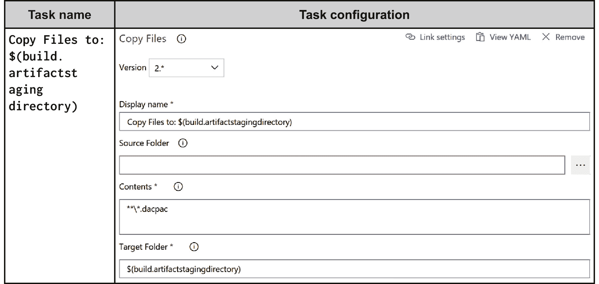

# 第十三章：13. 集成 Azure DevOps

在上一章中，您了解了大数据事件和它与 Azure 的 Event Hubs 和 Stream Analytics 服务的关系。软件开发是一个复杂的工作，涉及多个流程和工具，并且涉及来自不同部门的人们。他们需要共同合作，协调一致。由于有这么多变量，当您向最终客户交付时，风险是非常高的。一个小小的疏漏或配置错误可能导致应用程序崩溃。本章将讨论采纳和实施减少这些风险的实践，确保能够一次又一次地向客户交付高质量的软件。

在深入了解 DevOps 之前，以下是软件公司面临的 DevOps 解决的一些问题：

+   不欢迎变革的僵化组织

+   耗时的过程

+   孤立的团队在信息孤岛中工作

+   单体设计和大爆炸式部署

+   手动执行

+   缺乏创新

在本章中，我们将涵盖以下主题：

+   DevOps

+   DevOps 实践

+   Azure DevOps

+   DevOps 准备

+   DevOps 针对 PaaS 解决方案

+   基于虚拟机的 DevOps（IaaS）解决方案

+   基于容器的 DevOps（IaaS）解决方案

+   Azure DevOps 和 Jenkins

+   Azure 自动化

+   Azure DevOps 工具

## DevOps

目前，行业内尚未就 DevOps 的定义达成共识。各组织已经制定了自己的 DevOps 定义，并尝试实施它们。他们有自己的视角，并认为一旦实施了自动化、配置管理，并使用了敏捷流程，就算是实现了 DevOps。

根据我在行业中从事 DevOps 项目的经验，我将 DevOps 定义如下：DevOps 是关于软件系统交付机制的，它涉及将人们聚集在一起，使他们协作和沟通，共同朝着一个共同的目标和愿景努力。它意味着共同承担责任、问责和所有权。它是实施促进协作和服务心态的流程。它使交付机制能够为组织带来敏捷性和灵活性。与普遍的看法相反，DevOps 并非只是关于工具、技术和自动化。这些只是帮助协作、实施敏捷流程并加快更好地交付给客户的促进因素。

网络上有多个 DevOps 的定义，它们并没有错。DevOps 并不提供框架或方法论。它是一组原则和实践，当这些原则和实践在组织、项目或合作中应用时，可以实现 DevOps 及组织的目标和愿景。这些原则和实践不要求使用特定的流程、工具、技术或环境。DevOps 提供的指导可以通过任何工具、技术或流程来实现，尽管某些技术和流程可能比其他技术和流程更适用于实现 DevOps 原则和实践的愿景。

尽管 DevOps 实践可以在任何提供服务和产品的组织中实施，但在本书接下来的部分，我们将从软件开发和任何组织的运维部门的角度来看待 DevOps。

那么，什么是 DevOps？DevOps 被定义为一组原则和实践，将所有团队（包括开发人员和运维人员）从项目一开始就聚集在一起，以更快、更高效、更一致和可预测的方式一次又一次地向最终客户交付价值，从而减少市场推出时间，获得竞争优势。

前述对 DevOps 的定义并未指明或提及任何特定的流程、工具或技术。它也没有规定任何方法论或环境。

在任何组织中实施 DevOps 原则和实践的目标是确保高效且有效地满足利益相关者（包括客户）的需求和期望。

当以下情况发生时，客户的需求和期望得以满足：

+   客户获得他们想要的功能

+   客户在需要的时候获得他们想要的功能

+   客户更快速地获得功能更新

+   交付的质量很高

当一个组织能够满足这些期望时，客户会感到满意并保持忠诚。这反过来又提高了组织的市场竞争力，从而带来更大的品牌和市场估值。它直接影响组织的收入和利润。组织可以进一步投资于创新和客户反馈，带来系统和服务的持续变化，从而保持相关性。

在任何组织中实施 DevOps 原则和实践的过程受到其周围生态系统的指导。这个生态系统由组织所属的行业和领域组成。

DevOps 基于一组原则和实践。我们将在本章稍后的部分详细探讨这些原则和实践。DevOps 的核心原则包括：

+   **敏捷性**：采用敏捷方法可以增加对变化的整体适应能力，确保能够适应不断变化的环境并保持高效。敏捷流程具有较短的工作周期，且在开发生命周期的早期就能发现问题，而不是在后期，从而减少技术债务。

+   **自动化**：采用工具和自动化可以提高过程和最终产品的整体效率和可预测性。它有助于更快、更简便且更经济地完成任务。

+   **协作**：协作指的是共享一个共同的代码库、轮换工作职责、共享数据和信息以及其他有助于提高团队成员生产力的方面，从而支持产品的整体有效交付。

+   **反馈**：指的是多个团队之间关于有效和无效事物的快速和早期反馈循环。它帮助团队优先处理问题，并在随后的发布版本中修复这些问题。

DevOps 的核心实践包括：

+   **持续集成**：指的是验证和确认开发人员在代码库中提交的代码质量和正确性的过程。它可以是定时的、手动的或持续的。持续意味着每次开发人员推送代码时，过程都会检查各种质量属性，而定时则意味着按照预定的时间表进行检查。手动是指由管理员或开发人员手动执行。

+   **配置管理**：这是 DevOps 的重要组成部分，为配置基础设施和应用程序提供指导，配置可以通过从配置管理服务器拉取或按计划推送这些配置来实现。每次执行时，配置管理应将环境恢复到预期的理想状态。

+   **持续交付**：持续交付指的是应用程序在任何现有环境以及新环境中都能随时准备好部署的状态。它通常通过在开发和测试等较低环境中定义发布来执行。

+   **持续部署**：持续部署指的是能够自动将环境和应用程序部署到生产环境中的能力。它通常通过生产环境中的发布定义来执行。

+   **持续学习**：指的是理解运营和客户面临的问题，并确保将这些问题传达给开发和测试团队，以便他们在随后的发布版本中解决这些问题，从而改善应用程序的整体健康和可用性。

## DevOps 的本质

DevOps 并不是一种新范式；然而，它正获得越来越多的关注和推广。其采用率处于最高水平，越来越多的公司正在踏上这条道路。我特意将 DevOps 称为“旅程”，因为在 DevOps 的实施过程中有不同的成熟度水平。虽然成功实施持续部署和交付被视为这一旅程中的最高成熟度水平，但采用源代码管理和敏捷软件开发则被视为 DevOps 旅程的第一步。

DevOps 讨论的第一件事之一是打破开发团队和运维团队之间的壁垒。它促使多个团队之间进行紧密合作。DevOps 的核心思想是打破开发者只负责编写代码并在测试完成后将其交给运维进行部署的思维模式。它还意味着打破运维在开发活动中没有角色的观念。运维应当参与产品规划，并且应该清楚即将发布的功能。他们还应持续向开发者提供有关运维问题的反馈，以便在后续版本中进行修复。运维应该影响系统的设计，以改善系统的运作性能。同样，开发者也应当帮助运维团队部署系统，并在发生故障时协助解决问题。

DevOps 的定义提到更快速、更高效地向利益相关者交付系统的端到端流程。但它没有具体说明交付应该多么快速或高效。交付速度应当足够满足组织的领域、行业、客户细分和需求。对于一些组织，季度发布就足够了，而对于其他组织来说，可能需要每周发布。就 DevOps 而言，这两种方式都是有效的，组织可以部署相应的流程和技术来达到他们的发布目标。DevOps 并没有强制规定**持续集成/持续交付**（**CI/CD**）的具体时间框架。组织应当根据他们的整体项目、参与情况和组织愿景来识别最适合的 DevOps 原则和实践的实现方式。

定义中还提到了端到端交付。这意味着从系统的规划和交付到服务和运维的各个方面，都应成为 DevOps 采用的一部分。流程应当允许在应用开发生命周期中更大的灵活性、模块化和敏捷性。虽然组织可以自由选择最合适的流程——瀑布模型、敏捷开发、Scrum 等——但通常，组织倾向于采用基于迭代的敏捷流程。这种方式可以在较小的单元中实现更快速的交付，这些单元比大规模交付更容易测试和管理。

DevOps 一直以一致且可预测的方式谈论终端客户。这意味着组织应通过自动化不断交付更新和升级的功能给客户。没有自动化的帮助，我们无法实现一致性和可预测性。手动工作应该不存在，以确保高水平的一致性和可预测性。自动化应当是端到端的，以避免失败。这也表明系统设计应当是模块化的，从而在可靠、可用和可扩展的系统上更快地交付。测试在一致和可预测的交付中扮演着重要角色。

实施这些实践和原则的最终结果是，组织能够满足客户的期望和需求。组织能够比竞争对手更快地增长，并通过持续的创新和改进，进一步提高其产品和服务的质量和能力。

现在，您已经理解了 DevOps 背后的理念，接下来让我们深入了解核心的 DevOps 实践。

## DevOps 实践

DevOps 包含多个实践，每个实践为整体流程提供独特的功能。下图展示了它们之间的关系。配置管理、持续集成和持续部署构成了 DevOps 的核心实践。通过结合这三项服务交付软件服务，我们实现了持续交付。持续交付是组织的能力和成熟度，取决于配置管理、持续集成和持续部署的成熟度。持续反馈贯穿于所有阶段，形成反馈环路，帮助提供更优质的客户服务。它贯穿所有 DevOps 实践。接下来，让我们深入了解每项能力和 DevOps 实践：


###### 图 13.1：DevOps 实践

### 配置管理

商业应用程序和服务需要一个可以部署的环境。通常，这个环境是由多个服务器、计算机、网络、存储、容器等多个服务组成的基础设施，这些服务共同工作，以便商业应用程序能够在其上部署。商业应用程序被分解成多个服务，这些服务运行在多个服务器上，可以是本地服务器或云服务器，每个服务都有自己的配置以及与基础设施配置相关的需求。简而言之，基础设施和应用程序都是交付系统给客户所需要的，它们都有各自的配置。如果配置发生漂移，应用程序可能无法按预期工作，导致停机和故障。此外，由于**应用生命周期管理**（**ALM**）过程要求使用多个阶段和环境，应用程序将被部署到多个不同配置的环境中。应用程序将首先部署到开发环境，供开发人员查看他们工作的结果。然后，它将被部署到多个测试环境，这些环境有不同的配置，用于功能测试、负载和压力测试、性能测试、集成测试等；它还将被部署到预生产环境进行用户验收测试，最后进入生产环境。确保应用程序能够部署到多个环境中而无需进行任何手动配置更改非常重要。

配置管理提供了一套流程和工具，它们帮助确保每个环境和应用程序都有自己的配置。配置管理跟踪配置项，任何从一个环境到另一个环境发生变化的内容都应视为配置项。配置管理还定义了配置项之间的关系，以及一个配置项的变化如何影响其他配置项。

**配置管理的使用**

配置管理在以下方面提供帮助：

+   **基础设施即代码**：当通过代码表示基础设施的配置和配置过程，并且相同的代码贯穿整个应用生命周期过程时，这就是**基础设施即代码**（**IaC**）。IaC 有助于自动化基础设施的供应和配置。它还以代码的形式表示整个基础设施，可以存储在代码库中并进行版本控制。这使得用户在需要时可以使用先前环境的配置。它还使得能够以一致且可预测的方式多次供应环境。以这种方式供应的所有环境在所有 ALM 阶段中都是一致的和平等的。有许多工具可以帮助实现 IaC，包括 ARM 模板、Ansible 和 Terraform。

+   在服务器上使用 `webdeploy` 包，部署 SQL 服务器架构和数据 (`bacpac`) 到另一台服务器，并更改 Web 服务器上的 SQL 连接字符串，以指向适当的 SQL 服务器。配置管理为每个部署环境存储应用配置的值。

应用的配置也应当被监控。预期的和期望的配置应始终保持一致。任何偏离预期和期望配置的情况都会使应用不可用。配置管理还能够发现这种偏差，并重新配置应用和环境到其期望的状态。

在实施了自动化配置管理后，团队中的任何人都不需要在生产环境中部署和配置环境及应用。运营团队不再依赖开发团队或繁琐的部署文档。

配置管理的另一个方面是源代码控制。商业应用和服务由代码及其他构件组成，多个团队成员在相同的文件上工作。源代码应始终保持最新，并且应仅由经过身份验证的团队成员访问。代码及其他构件本身就是配置项。源代码控制有助于团队内的协作和沟通，因为每个人都知道其他人的工作内容，并且冲突能够在早期得到解决。

配置管理可以大致分为两类：

+   虚拟机内部

+   虚拟机外部

### 配置管理工具

接下来讨论虚拟机内部可用的配置管理工具。

**所需状态配置**

**所需状态配置** (**DSC**) 是微软的一种配置管理平台，作为 PowerShell 的扩展构建。DSC 最初作为 **Windows 管理框架** (**WMF**) 4.0 的一部分发布。它作为 WMF 4.0 和 5.0 的一部分，适用于所有 Windows Server 操作系统，直到 Windows 2008 R2 为止。WMF 5.1 在 Windows Server 2016/2019 和 Windows 10 上开箱即用。

**Chef、Puppet 和 Ansible**

除了 DSC，还有一系列配置管理工具，如 Chef、Puppet 和 Ansible，这些工具得到 Azure 的支持。本书未涵盖这些工具的详细信息。你可以在这里了解更多：[`docs.microsoft.com/azure/virtual-machines/windows/infrastructure-automation`](https://docs.microsoft.com/azure/virtual-machines/windows/infrastructure-automation)。

接下来讨论虚拟机外部可用的配置管理工具。

**ARM 模板**

ARM 模板是 ARM 中资源配置的主要手段。ARM 模板提供了一种声明性模型，通过该模型可以指定资源及其配置、脚本和扩展。ARM 模板基于**JavaScript 对象表示法**（**JSON**）格式。它使用 JSON 语法和约定来声明和配置资源。JSON 文件是基于文本的，用户友好且易于阅读。它们可以存储在源代码仓库中，并对其进行版本控制。它们还是表示基础架构即代码的一种方式，可用于在 Azure 资源组中反复地、可预测、一致和统一地配置资源。

模板提供了在设计和实现中保持通用性和模块化的灵活性。模板使我们能够接受用户参数、声明内部变量、帮助定义资源之间的依赖关系、在同一资源组或不同资源组之间链接资源，并执行其他模板。它们还提供了类似脚本语言的表达式和函数，使得模板在运行时动态且可定制。本书有两章专门讲解 ARM 模板：*第十五章，使用 ARM 模板进行跨订阅部署* 和 *第十六章，ARM 模板的模块化设计与实现*。

现在是时候关注下一个重要的 DevOps 原则：持续集成。

### 持续集成

多个开发者编写代码，并最终将其存储在一个公共仓库中。当开发者完成功能开发后，通常会将代码提交到仓库中。这可能在一天内完成，也可能需要几天或几周。一些开发者可能在同一个功能上工作，并且他们可能也会遵循相同的代码推送/提交实践，这些操作可能发生在几天或几周内。这可能会导致代码质量问题。DevOps 的一个原则是尽早发现问题。开发者应该经常将代码提交/推送到仓库，并进行编译检查，确保自己没有引入错误，并且代码与同事编写的代码兼容。如果开发者没有遵循这一实践，他们机器上的代码会变得过于庞大，且很难与其他代码进行集成。此外，如果编译失败，修复过程中产生的问题也会变得困难且耗时。

**代码集成**

持续集成解决了这些挑战。持续集成通过一系列验证步骤，帮助编译和验证开发人员推送/检查的代码。持续集成创建了一个包含多个步骤的流程。持续集成由持续自动构建和持续自动测试组成。通常，第一个步骤是编译代码。在成功编译之后，每个步骤负责从特定角度验证代码。例如，可以在编译后的代码上执行单元测试，然后执行代码覆盖率测试，检查单元测试执行了哪些代码路径。这些可以揭示是否编写了全面的单元测试，或者是否还有进一步添加单元测试的空间。持续集成的最终结果是可以由持续部署用于将代码部署到多个环境的部署包。

**频繁的代码推送**

鼓励开发人员每天多次提交代码，而不是几天或几周后才提交。持续集成会在代码提交或推送后立即启动整个管道的执行。如果编译成功，代码测试以及管道中的其他活动会无错误地执行；代码会被部署到测试环境，并进行集成测试。

**提高生产力**

持续集成提高了开发人员的生产力。开发人员不需要手动编译代码、连续运行多种类型的测试，然后再生成打包文件。它还减少了代码中引入错误的风险，避免代码过时。它为开发人员提供了有关代码质量的早期反馈。总体而言，通过采用持续集成实践，交付的质量更高，交付速度更快。以下是一个持续集成管道的示例：


###### 图 13.2：持续集成管道

**构建自动化**

构建自动化由多个任务按顺序执行。通常，第一个任务负责从代码仓库获取最新的源代码。源代码可能包含多个项目和文件。它们会被编译生成构件，如可执行文件、动态链接库和程序集。成功的构建自动化反映了代码中没有编译时错误。

根据项目的性质和类型，构建自动化可能还会包含更多步骤。

**测试自动化**

测试自动化包括负责验证代码不同方面的任务。这些任务从不同的角度对代码进行测试，并按顺序执行。一般来说，第一步是对代码运行一系列单元测试。单元测试是指通过验证特性在与其他特性隔离的情况下的行为，来测试特性最小单位的过程。它可以是自动化的，也可以是手动的；然而，自动化单元测试更受偏好。

代码覆盖率是另一种自动化测试类型，能够在运行单元测试时执行代码，找出多少代码被执行。它通常以百分比表示，指的是有多少代码可以通过单元测试进行测试。如果代码覆盖率没有接近 100%，那可能是因为开发者没有为该行为编写单元测试，或者未覆盖的代码根本不需要。

测试自动化的成功执行，并且没有出现显著的代码失败后，应开始执行打包任务。根据项目的性质和类型，测试自动化可能还包括更多的步骤。

**打包**

打包是指生成可部署的工件的过程，例如`MSI`、`NuGet`和`webdeploy`包以及数据库包；对其进行版本控制；然后将它们存储在一个位置，以便其他管道和过程可以使用。

一旦持续集成过程完成，持续部署的过程就会开始，接下来将重点讲解这个过程。

### 持续部署

当流程达到持续部署时，持续集成已经确保我们拥有完全可用的应用程序部分，接下来可以通过不同的持续部署活动进行处理。持续部署是指通过自动化将业务应用程序和服务部署到预生产环境和生产环境的能力。例如，持续部署可以配置和部署预生产环境，部署应用程序并进行配置。在对预生产环境进行多次有效验证，如功能测试和性能测试后，生产环境将被配置和部署，应用程序通过自动化完成部署。在部署过程中没有手动步骤。每个部署任务都是自动化的。持续部署可以从零开始配置环境并部署应用程序，也可以仅在环境已存在的情况下，部署增量变化。

所有环境都通过自动化使用基础设施即代码（IaC）来配置。这确保了所有环境，无论是开发、测试、预生产还是生产，都是一致的。同样，应用程序通过自动化部署，确保它在所有环境中也被统一部署。这些环境中的配置对于应用程序可能是不同的。

持续部署通常与持续集成集成。当持续集成完成其工作，生成最终的可部署包时，持续部署将启动并开始执行自己的管道。这个管道被称为发布管道。发布管道包含多个环境，每个环境由负责环境配置、环境设置、应用程序部署、应用程序配置、环境操作验证以及在多个环境中测试应用程序的任务组成。

使用持续部署带来了巨大的好处。对整体部署过程有高度的信心，这有助于更快、更无风险地发布到生产环境。出现问题的机会大幅减少。团队的压力也会减轻，如果当前发布存在问题，可以回滚到之前的工作环境：


###### 图 13.3：持续部署管道

尽管每个系统都要求其发布管道具有自己的配置，但前面图示中展示了一个持续部署的示例。需要注意的是，通常情况下，配置和设置多个环境是发布管道的一部分，并且在进入下一个环境之前，应获取相关的批准。批准过程可以是手动的，也可以是自动的，这取决于组织的成熟度。

接下来，我们将关注与测试环境相关的方面。

**测试环境部署**

一旦从持续集成中获得构建产物，发布管道就开始启动。发布管道的第一步应该是获取所有的构建产物。此后，发布管道可能会创建一个全新的裸机测试环境，或者重用现有的环境。这再次取决于项目类型和计划在该环境中执行的测试类型。环境会被配置并准备好。应用程序的构建产物会被部署并配置。

**测试自动化**

在部署应用程序后，可以在环境中执行一系列测试。其中一个测试是功能测试。功能测试主要用于验证应用程序的功能完整性和功能性。这些测试是根据客户需求收集的信息编写的。还可以执行另一组测试，主要与应用程序的可扩展性和可用性相关。这通常包括负载测试、压力测试和性能测试。还应该包括对基础设施环境的操作验证。

**预生产环境部署**

这与测试环境部署非常相似，唯一的区别是环境和应用程序的配置值会有所不同。

**验收测试**

验收测试通常由应用程序的相关方进行，可以是手动的，也可以是自动化的。这一步骤是从客户的角度对应用程序功能的正确性和完整性的验证。

**部署到生产环境**

一旦客户批准，执行与测试和预生产环境部署相同的步骤，唯一的区别是环境和应用程序的配置值专门针对生产环境。部署后进行验证，确保应用程序按照预期运行。

持续交付是一个重要的 DevOps 原则，并且与持续部署非常相似；然而，它们之间还是有一些区别。在下一节中，我们将深入探讨持续交付。

### 持续交付

持续交付和持续部署听起来可能很相似，但它们并不完全相同。持续部署指的是通过自动化将应用程序部署到多个环境，最终部署到生产环境，而持续交付则是能够生成可随时在任何环境中部署的应用程序包。为了生成可以随时部署的工件，应使用持续集成来生成应用程序工件；然后应使用新的或现有的环境来部署这些工件，并通过自动化进行功能测试、性能测试和用户验收测试。一旦这些活动成功执行且没有错误，应用程序包就被认为是可以随时部署的。持续交付包括持续集成和部署到环境中进行最终验证。它有助于更快地获得来自操作团队和最终用户的反馈，这些反馈可以用于实施后续的迭代。

在下一节中，我们将探讨持续学习。

### 持续学习

使用之前提到的所有 DevOps 实践，可以创建出色的业务应用程序并将其自动部署到生产环境；然而，如果没有持续改进和反馈原则，DevOps 的好处不会持久。至关重要的是，关于应用程序行为的实时反馈需要从最终用户和运维团队传递给开发团队作为反馈。

反馈应传递给团队，提供有关进展顺利与否的相关信息。

应用程序的架构和设计应考虑到监控、审计和遥测。运维团队应从生产环境收集遥测信息，捕捉任何漏洞和问题，并将其传递给开发团队，以便在随后的版本中修复。

持续学习有助于使应用程序更加健壮，并增强其对故障的韧性。它有助于确保应用程序满足消费者需求。*图 13.4* 显示了不同团队之间应该实施的反馈循环：


###### 图 13.4：反馈循环

在了解了与 DevOps 相关的重要实践之后，现在是时候深入了解那些使这些实践成为可能的工具和服务了。

## Azure DevOps

让我们来看看另一个顶级在线服务，它能无缝实现持续集成、持续部署和持续交付：Azure DevOps。事实上，称其为一个服务套件并将其整合为一个名称可能更合适。Azure DevOps 是微软提供的 PaaS 服务，托管在云端。相同的服务也可以作为**Team Foundation Services**（**TFS**）在本地部署。书中所有示例都使用 Azure DevOps。

根据微软的说法，Azure DevOps 是一个基于云的协作平台，帮助团队共享代码、跟踪工作并发布软件。Azure DevOps 是一个新名称，之前被称为**Visual Studio Team Services**（**VSTS**）。Azure DevOps 是一个企业级软件开发工具和服务，使组织能够为其端到端的应用生命周期管理过程提供自动化功能，从规划到部署应用程序，并从软件系统中获取实时反馈。这提高了组织交付高质量软件系统给客户的成熟度和能力。

成功的软件交付涉及高效地将多个流程和活动结合在一起。这包括执行和实施各种敏捷流程、增加团队之间的协作、从一个 ALM 阶段到另一个阶段的无缝自动过渡，以及向多个环境的部署。跟踪和报告这些活动非常重要，以便衡量和改进交付流程。Azure DevOps 使这一切变得简单而易行。它提供了一整套服务，支持以下内容：

+   通过提供整个应用生命周期管理的单一界面，促进每个团队成员之间的协作

+   使用源代码管理服务促进开发团队之间的协作

+   使用测试管理服务促进测试团队之间的协作

+   通过构建管理服务，使用持续集成自动验证代码和打包

+   通过发布管理服务，使用持续部署和交付自动验证应用程序功能、部署和多个环境的配置

+   使用工作管理服务跟踪和管理工作项

以下表格显示了从**Azure DevOps**左侧导航栏中获取的典型项目可用的所有服务：


###### 表 13.1：Azure DevOps 服务列表

Azure DevOps 中的组织作为一个安全边界和逻辑容器，提供实现 DevOps 策略所需的所有服务。Azure DevOps 允许在一个组织内创建多个项目。默认情况下，项目创建时会创建一个代码库；不过，Azure DevOps 也允许在同一个项目内创建额外的代码库。**Azure DevOps 组织**、**项目**和**代码库**之间的关系如*图 13.5*所示：


###### 图 13.5：Azure DevOps 组织、项目和代码库之间的关系

Azure DevOps 提供两种类型的代码库：

+   Git

+   Team Foundation 版本控制（TFVC）

它还提供了在 Git 或 TFVC 源代码管理库之间进行选择的灵活性。在一个项目内，可能会有 TFS 和 TFVC 代码库的组合。

### TFVC

TFVC 是传统的集中式版本控制实现方式，采用中央仓库，开发人员直接在连接模式下对其进行操作，提交更改。如果中央仓库处于离线状态或无法访问，开发人员无法提交代码，只能等待仓库恢复在线并可用。其他开发人员只能看到已提交的代码。开发人员可以将多个更改组合成一个单独的变更集，用于提交逻辑上归为一类的代码更改。TFVC 会锁定正在编辑的代码文件。其他开发人员可以读取已锁定的文件，但无法编辑。必须等待前一个编辑完成并释放锁，才能进行编辑。提交和更改的历史记录保存在中央仓库中，而开发人员拥有文件的工作副本，但没有历史记录。

TFVC 非常适合大团队在同一项目中协作工作。这能够在中央位置控制源代码。它也特别适用于长期项目，因为历史记录可以在中央位置进行管理。TFVC 在处理大文件和二进制文件时没有问题。

### Git

另一方面，Git 是一种现代的分布式版本控制实现方式，开发人员可以在离线模式下使用自己的本地代码副本和历史记录。开发人员可以在本地克隆的代码上离线工作。每个开发人员都拥有代码和整个历史记录的本地副本，他们在此本地仓库上进行更改。开发人员可以将代码提交到本地仓库。根据需要，他们可以连接到中央仓库，同步本地仓库。这使得每个开发人员都可以在任何文件上工作，因为他们是在本地副本上工作。Git 中的分支不会创建代码的另一个副本，且创建速度极快。

Git 对于小团队和大团队都非常适用。Git 提供的高级选项使得分支和合并变得轻松。

Git 是推荐的源代码控制方式，因为它提供了丰富的功能。在本书中，我们将使用 Git 作为示例应用程序的仓库。在下一节中，我们将详细概述如何通过 DevOps 实现自动化。

## 准备 DevOps

展望未来，我们将重点关注通过不同模式在 Azure 中实现过程和部署自动化。这些模式包括以下内容：

+   DevOps 适用于 IaaS 解决方案

+   DevOps 适用于 PaaS 解决方案

+   DevOps 适用于基于容器的解决方案

通常，存在一些共享服务，这些服务并不特定于某一个应用程序。这些服务由来自不同环境（如开发、测试和生产）的多个应用程序使用。每个应用程序中这些共享服务的生命周期不同。因此，它们有不同的版本控制库、不同的代码库以及构建和发布管理。它们有自己的一套计划、设计、构建、测试和发布的周期。

该组的资源是使用 ARM 模板、PowerShell 和 DSC 配置进行配置的。

构建这些公共组件的整体流程如图所示：


###### 图 13.6：构建公共组件的整体流程

发布过程如*图 13.7*所示：


###### 图 13.7：发布过程

在 DevOps 之旅中，理解并在开始任何软件开发、产品或服务之前配置共享组件和服务非常重要。

开始使用 Azure DevOps 的第一步是配置一个组织。

### Azure DevOps 组织

需要一个版本控制系统来进行代码级的协作。Azure DevOps 提供了集中式和分散式版本控制系统。Azure DevOps 还提供了用于构建和执行构建与发布流水线的编排服务。这是一个成熟的平台，组织了所有与 DevOps 相关的版本控制以及构建和发布工作项相关的工件。在 Azure DevOps 中配置一个组织后，应该创建一个 Azure DevOps 项目来存储所有与项目相关的工件。

可以通过访问[`dev.azure.com`](https://dev.azure.com)来创建 Azure DevOps 组织。

Azure DevOps 组织是提供安全性、访问权限和组织内团队成员之间协作的顶级管理边界。一个组织可以包含多个项目，每个项目包含多个团队。

### 配置 Azure Key Vault

不建议将密钥、证书、凭据或其他敏感信息存储在代码配置文件、数据库或任何其他通用存储系统中。建议将这些重要数据存储在专门设计用于存储密钥和凭据的保险库中。Azure Key Vault 提供了这样的服务。Azure Key Vault 作为 Azure 提供的资源和服务是可用的。现在，让我们继续探索配置的存储选项。

### 配置管理服务器/服务的配置

提供配置存储并将这些配置应用于不同环境的配置管理服务器/服务始终是自动化部署的好策略。自定义虚拟机上的 DSC 和来自 Azure 自动化、Chef、Puppet 以及 Ansible 的 DSC 是一些选项，并且可以在 Azure 上无缝使用，适用于 Windows 和 Linux 环境。本书将 DSC 作为配置管理工具，适用于所有目的，并提供一个拉取服务器，用于存放所有示例应用程序的配置文档（MOF 文件）。它还维护着所有配置并与拉取服务器注册的虚拟机和容器的数据库，以便从中拉取配置文档。目标虚拟机和容器上的本地配置管理器会定期检查新配置的可用性，以及当前配置中的漂移，并向拉取服务器报告。它还具有内置的报告功能，提供有关虚拟机内合规节点以及不合规节点的信息。拉取服务器是一个托管 DSC 拉取服务器端点的通用 Web 应用程序。在下一个主题中，我们将讨论一种实时监控进程的技术，使用日志分析。

### 日志分析

日志分析是 Azure 提供的一个审计和监控服务，用于获取虚拟机和容器中发生的所有更改、漂移和事件的实时信息。它为 IT 管理员提供了一个集中式工作区和仪表板，用于查看、搜索并深入分析所有发生在这些虚拟机上的更改、漂移和事件。它还提供了可以部署在目标虚拟机和容器上的代理。一旦部署，这些代理就会开始将所有更改、事件和漂移信息发送到集中式工作区。接下来，让我们来看看部署多个应用程序的存储选项。

### Azure 存储帐户

Azure 存储是 Azure 提供的一项服务，用于将文件存储为 Blob。用于自动化基础设施和示例应用程序的预配、部署和配置的所有脚本和代码都存储在 Azure DevOps Git 仓库中，并打包后部署到 Azure 存储帐户中。Azure 提供了 PowerShell 脚本扩展资源，可以在执行 ARM 模板时自动下载 DSC 和 PowerShell 脚本并在虚拟机上执行。此存储作为多个应用程序部署中所有部署的公共存储。将脚本和模板存储在存储帐户中，可以确保它们可以跨 Azure DevOps 中的项目使用。接下来，让我们探讨一下镜像在下一节中的重要性。

### Docker 和操作系统镜像

虚拟机和容器镜像应作为公共服务的构建和发布流水线的一部分来构建。可以使用 Packer 和 Docker Build 等工具来生成这些镜像。

### 管理工具

所有管理工具，如 Kubernetes、DC/OS、Docker Swarm 和 ITIL 工具，应该在构建和部署解决方案之前进行配置。

我们将在本节 DevOps 准备中以管理工具做总结。DevOps 生态系统中每项活动都有多种选择，我们应该在 DevOps 旅程中启用它们——这不应是事后的考虑，而是 DevOps 规划的一部分。

## PaaS 解决方案的 DevOps

Azure PaaS 应用服务的典型架构基于*图 13.8*：


###### 图 13.8：典型的 Azure PaaS 应用服务架构

该架构展示了参与 Azure 应用服务基础的云解决方案架构的一些重要组件——例如 Azure SQL、存储帐户和版本控制系统。这些工件应该通过 ARM 模板创建。ARM 模板应该是整体配置管理策略的一部分。它可以拥有自己的构建和发布管理管道，类似于*图 13.9*所示的管道：


###### 图 13.9：为应用服务选择部署选项

现在我们已经探索了各种部署源选项，让我们继续深入了解如何在 Azure 上部署云解决方案。

### Azure 应用服务

Azure 应用服务提供了云解决方案的托管服务。它是一个完全托管的平台，负责云解决方案的配置和部署。Azure 应用服务消除了创建和管理基础设施的负担，并为托管您的云解决方案提供了最低限度的**服务级别协议**（**SLA**）。

### 部署槽

Azure 应用服务提供了部署槽，使得部署变得无缝和简单。提供了多个槽，并且在槽之间的切换是通过 DNS 层面完成的。这意味着任何生产槽中的内容都可以通过切换 DNS 条目与暂存槽互换。这有助于将定制的云解决方案部署到暂存环境中，并在所有检查和测试完成后，如果确认没有问题，可以切换到生产环境。然而，在切换后如果生产环境出现任何问题，可以通过再次切换恢复先前在生产环境中的良好值。接下来让我们深入了解 Azure 的数据库服务及其一些关键特性。

### Azure SQL

Azure SQL 是 Azure 提供的 SQL PaaS 服务，用于托管数据库。Azure 提供了一个安全的平台来托管数据库，并全面负责管理服务的可用性、可靠性和可扩展性。使用 Azure SQL，无需配置自定义虚拟机、部署 SQL 服务器并进行配置。相反，Azure 团队会在幕后完成这些操作并代表您进行管理。它还提供了防火墙服务，增强了安全性；只有防火墙允许的 IP 地址才能连接服务器并访问数据库。为托管 Web 应用程序而配置的虚拟机有各自的公共 IP 地址，并会动态添加到 Azure SQL 防火墙规则中。Azure SQL 服务器及其数据库将在执行 ARM 模板时创建。接下来，我们将介绍构建和发布管道。

### 构建和发布管道

在本节中，创建了一个新的构建管道，该管道编译并验证 ASP.NET MVC 应用程序，然后生成部署包。在生成包之后，发布定义确保在持续部署的过程中，首次部署发生在应用服务和 Azure SQL 环境中。

有两种方式可以编写构建和发布管道：

1.  使用经典编辑器

1.  使用 YAML 文件

YAML 文件为编写构建和发布管道提供了更大的灵活性。

示例应用程序的项目结构如 *图 13.10* 所示：


###### 图 13.10：示例应用程序的项目结构

在此项目中，有一个 ASP.NET MVC 应用程序——主应用程序——它由多个应用程序页面组成。Web Deploy 包将通过构建管道从该项目生成，并最终部署到 Web 应用程序中。该解决方案中还包含其他项目，如下所述：

+   **单元测试项目**：用于对 ASP.NET MVC 应用程序进行单元测试的代码。此项目生成的程序集将在构建执行中生成并执行。

+   `DacPac` 文件将通过构建定义从该项目中生成。

+   **Azure 资源组项目**：ARM 模板和参数代码，用于配置 ASP.NET MVC 应用程序和 SQL 表格所在的整个 Azure 环境。

构建管道如 *图 13.11* 所示：


###### 图 13.11：ASP.NET MVC 应用程序的构建管道

每个任务的配置如 *表 13.2* 所示：



###### 表 13.2：构建管道任务的配置

构建管道已配置为在持续集成过程中自动执行，如 *图 13.12* 所示：


###### 图 13.12：在构建管道中启用持续集成

发布定义包含多个环境，如开发、测试、**系统集成测试**（**SIT**）、**用户验收测试**（**UAT**）、预生产和生产。各个环境中的任务非常相似，但会增加一些特定环境的任务。例如，测试环境会有更多与 UI 相关的任务，以及功能性和集成测试任务，而这些在开发环境中是没有的。

该应用程序的发布定义如*图 13.13*所示：


###### 图 13.13：发布定义

单个环境的发布任务如*图 13.14*所示：


###### 图 13.14：单个环境的发布任务

这里列出了每个任务的配置：


###### 表 13.3：发布管道任务的配置

本节介绍了如何在 Azure DevOps 中配置构建和发布管道。从下一节开始，将重点介绍不同的架构，如 IaaS、容器以及不同的场景。

## IaaS 的 DevOps

IaaS 涉及基础设施和应用程序的管理与维护，这需要在多个环境中配置、部署多个资源和组件。在继续之前，理解架构是非常重要的。

这里展示了典型的基于 IaaS 虚拟机的解决方案架构：


###### 图 13.15：基于 IaaS 虚拟机的解决方案架构

架构中列出的每个组件将在下一节及之后的内容中进行讨论。

### Azure 虚拟机

托管网页应用、应用服务器、数据库和其他服务的 Azure 虚拟机器是通过 ARM 模板进行配置的。它们附加到一个虚拟网络，并拥有来自同一网络的私有 IP 地址。虚拟机器的公共 IP 地址是可选的，因为它们已附加到公共负载均衡器。操作洞察代理被安装到虚拟机器上，用于监控这些虚拟机器。PowerShell 脚本也会在这些虚拟机器上执行，这些脚本是从另一个资源组中的存储帐户下载的，用于打开相关防火墙端口、下载适当的包并安装本地证书，以通过 PowerShell 安全访问。这些虚拟机器上的网页应用配置为在提供的端口上运行。网页应用的端口号和所有配置都从 DSC 拉取服务器中获取，并动态分配。

### Azure 公共负载均衡器

公共负载均衡器被附加到一些虚拟机器上，以便以轮询的方式向它们发送请求。这通常需要用于前端网页应用和 API。可以为负载均衡器分配公共 IP 地址和 DNS 名称，这样它就可以处理来自互联网的请求。它在不同的端口上接受 HTTP 网页请求，并将其路由到虚拟机器。它还会通过提供的应用路径探测 HTTP 协议的某些端口。**网络地址转换**（**NAT**）规则也可以应用，这样就可以通过远程桌面登录到虚拟机器。

Azure 公共负载均衡器的替代资源是 Azure 应用程序网关。应用程序网关是七层负载均衡器，提供 SSL 终止、会话亲和力和基于 URL 的路由等功能。我们将在下一节讨论构建流水线。

### 构建流水线

以下是基于 IaaS 虚拟机解决方案的典型构建流水线。发布流水线在开发人员将代码推送到仓库时开始。构建流水线会作为持续集成的一部分自动启动。它编译并构建代码，执行单元测试，检查代码质量，并从代码注释生成文档。它将新的二进制文件部署到开发环境中（注意，开发环境并不是新创建的），更改配置，执行集成测试，并生成构建标签以便于识别。然后，它将生成的工件放入发布流水线可以访问的位置。如果在流水线的任何步骤执行过程中出现问题，会作为构建流水线反馈传达给开发人员，以便他们重新修改并重新提交更改。构建流水线应根据问题的严重性判断失败或成功，而这在不同组织之间可能有所不同。一个典型的构建流水线如*图 13.16*所示：


###### 图 13.16：典型的 IaaS 构建流水线

类似于构建流水线，让我们来了解一下发布流水线的实现。

### 发布流水线

下一部分展示了基于 IaaS 虚拟机部署的典型发布流水线。发布流水线在构建流水线完成后开始。发布流水线的第一步是收集构建流水线生成的工件，通常是可部署的程序集、二进制文件和配置文档。发布流水线执行并创建或更新第一个环境，通常是测试环境。它使用 ARM 模板来配置 Azure 上的所有 IaaS 和 PaaS 服务和资源，并对其进行配置。它们还帮助在创建虚拟机后执行脚本和 DSC 配置作为后创建步骤。这有助于配置虚拟机内的环境和操作系统。在这一阶段，构建流水线中的应用程序二进制文件将被部署和配置。执行各种自动化测试以检查解决方案，若测试结果令人满意，流水线将在获得必要的批准后将部署转移到下一个环境。相同的步骤将在下一个环境中执行，包括生产环境。最后，在生产环境中执行操作验证测试，以确保应用程序按预期工作，并且没有任何偏差。

在这一阶段，如果出现任何问题或错误，应该予以修复，并且整个周期需要重新执行；但是，如果在规定的时间内没有完成，应该在生产环境中恢复最后已知的快照，以尽量减少停机时间。典型的发布流水线如*图 13.17*所示：


###### 图 13.17：典型的 IaaS 发布流水线

本节总结了 IaaS 解决方案的 DevOps 流程，下一章将重点介绍虚拟机上的容器。请注意，容器也可以在像 App Service 和 Azure Functions 这样的 PaaS 上运行。

## DevOps 与容器

在典型的架构中，容器运行时被部署在虚拟机上，容器在其中运行。基于 IaaS 容器解决方案的典型架构如图所示：


###### 图 13.18：基于 IaaS 的容器解决方案架构

这些容器由容器编排器（如 Kubernetes）管理。监控服务由 Log Analytics 提供，所有的密钥和机密存储在 Azure Key Vault 中。此外，还有一个拉取服务器，可以是虚拟机或 Azure Automation，它向虚拟机提供配置信息。

### 容器

容器是一种虚拟化技术；然而，它们并不虚拟化物理服务器。相反，容器是一种操作系统级的虚拟化。这意味着容器共享其主机提供的操作系统内核，并且彼此以及与主机共享该内核。在主机（无论是物理的还是虚拟的）上运行多个容器时，容器共享主机的操作系统内核。主机提供一个操作系统内核，所有在其上运行的容器共享这个内核。

容器与其主机和其他容器完全隔离，类似于虚拟机。容器使用操作系统命名空间（在 Linux 上使用控制组）来提供一个新的操作系统环境的感知，并在 Windows 上使用特定的操作系统虚拟化技术。每个容器都拥有自己的一份操作系统资源。

**Docker**

Docker 提供了容器的管理功能。它包含两个可执行文件：

+   Docker 守护进程

+   Docker 客户端

Docker 守护进程是管理容器的主力军。它是一个管理服务，负责管理与容器相关的所有主机活动。Docker 客户端与 Docker 守护进程进行交互，负责捕获输入并将其发送给 Docker 守护进程。Docker 守护进程提供运行时、库、图形驱动程序、用于创建、管理和监控容器的引擎，以及主机服务器上的镜像。它还可以创建自定义镜像，用于构建和交付应用程序到多个环境。

**Dockerfile**

`Dockerfile` 是创建容器镜像的主要构建模块。它是一个简单的基于文本的、可读性强的文件，没有扩展名，甚至被命名为 `Dockerfile`。尽管有一种机制可以将其命名为其他名字，但通常它被命名为 `Dockerfile`。Dockerfile 包含了使用基础镜像创建自定义镜像的指令。这些指令会从上到下由 Docker 守护进程依次执行。指令包括命令及其参数，如 `COPY`、`ADD`、`RUN` 和 `ENTRYPOINT`。Dockerfile 通过将应用程序部署和配置转化为可以版本化并存储在源代码库中的指令，支持 IaC（基础设施即代码）实践。接下来让我们查看构建步骤。

### 构建管道

从构建的角度来看，容器和基于虚拟机的解决方案没有区别。构建步骤保持不变。一个典型的 IaaS 容器部署发布管道如下所示。

### 发布管道

IaaS 容器部署的典型发布流水线与发布流水线之间的唯一区别是容器镜像管理以及使用 Dockerfile 和 Docker Compose 创建容器。像 Docker Swarm、DC/OS 和 Kubernetes 这样的高级容器管理工具，也可以作为发布管理的一部分进行部署和配置。不过，值得注意的是，这些容器管理工具应该是共享服务发布流水线的一部分，如前面所讨论的那样。*图 13.19*展示了一个基于容器的解决方案的典型发布流水线：


###### 图 13.19：基于容器的发布流水线

下一部分的重点是与其他工具集的集成，如 Jenkins。

## Azure DevOps 与 Jenkins

Azure DevOps 是一个开放的**平台**编排器，可以无缝集成其他编排工具。它提供了与 Jenkins 良好集成所需的所有基础设施和功能。已经建立了基于 Jenkins 的 CI/CD 流水线的组织，可以利用 Azure DevOps 的先进但简单的功能来编排这些流水线。

Jenkins 可以用作存储库，并且可以在 Azure DevOps 中执行 CI/CD 流水线，同时也可以在 Azure DevOps 中拥有一个存储库，并在 Jenkins 中执行 CI/CD 流水线。

Jenkins 配置可以作为服务钩子添加到 Azure DevOps 中，每当任何代码更改被提交到 Azure DevOps 存储库时，它可以触发 Jenkins 中的流水线。*图 13.20*展示了来自 Azure DevOps 服务钩子配置部分的 Jenkins 配置：


###### 图 13.20：Jenkins 配置

在 Jenkins 中有多种触发器可以执行流水线；其中之一是**代码推送**，如*图 13.21*所示：


###### 图 13.21：执行的代码推送触发器

也可以将其部署到 Azure 虚拟机并执行 Azure DevOps 发布流水线，具体说明见：[`docs.microsoft.com/azure/virtual-machines/linux/tutorial-build-deploy-jenkins`](https://docs.microsoft.com/azure/virtual-machines/linux/tutorial-build-deploy-jenkins)。

在任何场景中使用 Jenkins 之前，应该先进行部署。Linux 上的部署过程可以在[`docs.microsoft.com/azure/virtual-machines/linux/tutorial-jenkins-github-docker-cicd`](https://docs.microsoft.com/azure/virtual-machines/linux/tutorial-jenkins-github-docker-cicd)找到。

下一部分将更加关注与配置管理相关的工具和服务。Azure 自动化提供与 DSC 相关的服务，如拉取服务器。

## Azure 自动化

Azure Automation 是微软的自动化平台，适用于云端、本地和混合部署的所有自动化实现。Azure Automation 是一个成熟的自动化平台，提供了以下方面的丰富功能：

+   定义资产，如变量、连接、凭据、证书和模块

+   使用 Python、PowerShell 脚本和 PowerShell 工作流实现运行手册

+   提供创建运行手册的用户界面

+   管理完整的运行手册生命周期，包括构建、测试和发布

+   调度运行手册

+   在任何地方运行运行手册的能力——无论是在云端还是本地

+   DSC 作为配置管理平台

+   管理和配置环境——Windows 和 Linux、应用程序以及部署

+   通过导入自定义模块扩展 Azure Automation 的能力

Azure Automation 提供一个 DSC 拉取服务器，帮助创建一个集中式配置管理服务器，包含节点/虚拟机及其组成部分的配置。

它实现了中心和分支模式，其中节点可以连接到 DSC 拉取服务器，下载分配给它们的配置，并重新配置自己以反映其期望状态。节点中的任何变化或偏差将在下一次运行时由 DSC 代理自动修正。这确保了管理员无需主动监控环境，以便发现任何偏差。

DSC 提供了一种声明性语言，您在其中定义意图和配置，而不是如何运行和应用这些配置。这些配置基于 PowerShell 语言，简化了配置管理的过程。

在本节中，我们将介绍如何使用 Azure Automation DSC 配置虚拟机，安装并配置 Web 服务器 (IIS)，并创建一个 `index.htm` 文件，告知用户网站正在维护中。

接下来，您将学习如何配置 Azure Automation 帐户。

### 配置 Azure Automation 帐户

在 Azure 门户或 PowerShell 中，从现有或新资源组创建一个新的 Azure Automation 帐户。您可能会注意到在*图 13.22*中，Azure Automation 提供了有关 DSC 的菜单项：


###### 图 13.22：Azure Automation 帐户中的 DSC

它提供了以下功能：

+   **DSC 节点**：这些列出了当前 Azure Automation DSC 拉取服务器所注册的所有虚拟机和容器。通过当前的 DSC 拉取服务器的配置来管理这些虚拟机和容器。

+   **DSC 配置**：这些列出了所有导入并上传到 DSC 拉取服务器的原始 PowerShell 配置。它们是人类可读格式，并未编译。

+   **DSC 节点配置**：这些列出了所有可以分配给节点（虚拟机和容器）的 DSC 配置的编译版本，节点可以从拉取服务器获取。DSC 配置经过编译后会生成 MOF 文件，最终用于配置节点。

在配置 Azure Automation 账户后，我们可以创建一个示例 DSC 配置，如下一部分所示。

### 创建 DSC 配置

下一步是使用任意 PowerShell 编辑器编写 DSC 配置，以反映配置的意图。对于此示例，创建了一个名为 `ConfigureSiteOnIIS` 的配置。它导入了基本的 DSC 模块 `PSDesiredStateConfiguration`，该模块包含配置中使用的资源。它还声明了一个节点 web 服务器。当这个配置被上传并编译后，它将生成一个名为 `ConfigureSiteOnIISwebserver` 的 DSC 配置。该配置随后可以应用于节点。

该配置包含几个资源。这些资源配置目标节点。资源安装了 web 服务器、ASP.NET 和框架，并在 `inetpub\wwwroot` 目录中创建了一个 `index.htm` 文件，文件内容用于显示网站正在维护中。有关编写 DSC 配置的更多信息，请参阅 [`docs.microsoft.com/powershell/scripting/dsc/getting-started/wingettingstarted?view=powershell-7`](https://docs.microsoft.com/powershell/scripting/dsc/getting-started/wingettingstarted?view=powershell-7)。

下一段代码列出了前述配置的完整内容。该配置将被上传到 Azure Automation 账户：

```
Configuration ConfigureSiteOnIIS {   
    Import-DscResource -ModuleName 'PSDesiredStateConfiguration'   
    Node WebServer {   
      WindowsFeature IIS  
        {  
            Name = "Web-Server"  
            Ensure = "Present"  
        }         
        WindowsFeature AspDotNet  
        {  
            Name = "net-framework-45-Core"  
            Ensure = "Present"  
            DependsOn = "[WindowsFeature]IIS"  
        }            
        WindowsFeature AspNet45  
        {  
            Ensure          = "Present"  
            Name            = "Web-Asp-Net45"  
            DependsOn = "[WindowsFeature]AspDotNet"  
        }   
        File IndexFile  
        {  
            DestinationPath = "C:\inetpub\wwwroot\index.htm"  
            Ensure = "Present"  
            Type = "File"  
            Force = $true  
            Contents = "<HTML><HEAD><Title> Website under construction.</Title></HEAD><BODY> '  
             <h1>If you are seeing this page, it means the website is under maintenance and DSC Rocks !!!!!</h1></BODY></HTML>"  
        }  
   }  
}   
```

在创建了一个示例 DSC 配置后，应将其导入到 Azure Automation 中，如下一部分所示。

### 导入 DSC 配置

该 DSC 配置仍未为 Azure Automation 所知。它目前存在于一些本地机器上。应将其上传到 Azure Automation 的 DSC 配置中。Azure Automation 提供了 `Import-AzureRMAutomationDscConfiguration` cmdlet 来将配置导入到 Azure Automation：

```
Import-AzureRmAutomationDscConfiguration -SourcePath "C:\DSC\AA\DSCfiles\ConfigureSiteOnIIS.ps1" -ResourceGroupName "omsauto" -AutomationAccountName "datacenterautomation" -Published -Verbose     
```

这些命令将会在 Azure Automation 中导入配置。导入后，DSC 配置应被编译，以便可以分配给服务器进行合规性检查和自动修复。

### 编译 DSC 配置

在 Azure Automation 中可用 DSC 配置后，可以请求编译。Azure Automation 提供了另一个 cmdlet 用于此操作。使用 `Start-AzureRmAutomationDscCompilationJob` cmdlet 来编译已导入的配置。配置名称应与上传的配置名称匹配。编译会创建一个名为配置和节点名称组合的 MOF 文件，在此案例中是 `ConfigureSiteOnIIS` web 服务器。命令执行过程如下所示：

```
Start-AzureRmAutomationDscCompilationJob -ConfigurationName ConfigureSiteOnIIS -ResourceGroupName "omsauto" -AutomationAccountName "datacenterautomation" -Verbose      
```

现在你已经完成了 DSC 节点配置。在接下来的部分中，你将学习如何将配置分配给节点。

### 将配置分配给节点

编译后的 DSC 配置可以应用于节点。使用 `Register-AzureRmAutomationDscNode` 将配置分配给节点。`NodeConfigurationName` 参数标识应应用于节点的配置名称。这是一个强大的 cmdlet，它还可以在节点下载配置并应用之前，配置 DSC 代理，即 `localconfigurationmanager`。有多个可以配置的 `localconfigurationmanager` 参数，详细信息可查看 [`devblogs.microsoft.com/powershell/understanding-meta-configuration-in-windows-powershell-desired-state-configuration`](https://devblogs.microsoft.com/powershell/understanding-meta-configuration-in-windows-powershell-desired-state-configuration)。

让我们看看下面的配置：

```
Register-AzureRmAutomationDscNode -ResourceGroupName "omsauto" -AutomationAccountName "datacenterautomation" -AzureVMName testtwo -ConfigurationMode ApplyAndAutocorrect -ActionAfterReboot ContinueConfiguration -AllowModuleOverwrite $true -AzureVMResourceGroup testone -AzureVMLocation "West Central US" -NodeConfigurationName "ConfigureSiteOnIIS.WebServer" -Verbose 
```

现在，我们可以通过使用浏览器浏览新部署的网站来测试配置是否已应用到服务器上。在测试成功完成后，我们继续验证连接。

### 验证

如果适当，网络安全组和防火墙应为端口 80 开放并启用，并且为虚拟机分配公共 IP。可以通过该 IP 地址浏览默认网站。否则，登录到用于应用 DSC 配置的虚拟机，并导航至 `http://localhost`。

它应该显示以下页面：


###### 图 13.23：本地主机

这就是配置管理的力量：无需编写任何复杂的代码，编写一次配置后，可以多次应用于相同或多个服务器，并且可以确保它们会在所需状态下运行，无需人工干预。在下一节中，我们将查看适用于 Azure DevOps 的各种工具。

## DevOps 工具

如前所述，Azure 是一个功能丰富且成熟的平台，支持以下内容：

+   多种语言选择

+   多种操作系统选择

+   多种工具和实用程序的选择

+   多种部署解决方案的模式（例如虚拟机、应用服务、容器和微服务）

在如此众多的选项和选择中，Azure 提供了以下内容：

+   **开放云**：它对开源、微软以及非微软的产品、工具和服务都是开放的。

+   **灵活云**：它足够简单，既适合终端用户，也适合开发人员，能够利用现有的技能和知识进行使用。

+   **统一管理**：它提供无缝的监控和管理功能。

这里提到的所有服务和功能对于 DevOps 的成功实施至关重要。*图 13.24* 展示了可以用于管理应用生命周期和 DevOps 各个阶段的开源工具和实用程序：


###### 图 13.24：开源工具和实用程序

*图 13.24* 显示了可以用于管理应用生命周期和 DevOps 各个阶段的 Microsoft 工具和实用程序。再次强调，这只是所有工具和实用程序的一小部分——实际上有许多其他选项，例如以下内容：

+   Azure DevOps 构建编排，用于构建构建管道

+   Microsoft 测试管理器和 Pester 用于测试

+   DSC、PowerShell 和 ARM 模板用于部署或配置管理

+   日志分析、应用洞察以及**系统中心操作管理器** (**SCOM**) 用于警报和监控

+   Azure DevOps 和系统中心服务管理器用于管理流程：


###### 图 13.25：Microsoft 工具和实用程序

每个 DevOps 实践都有许多可用的工具，在本节中，您已经了解了一些工具及其配置方式。

## 小结

DevOps 在行业中获得了极大的关注和势头。大多数组织已经意识到其好处，并希望实施 DevOps。与此同时，他们中的大多数正在向云迁移。作为云平台，Azure 提供了丰富且成熟的 DevOps 服务，使组织更容易实现 DevOps。

在本章中，我们讨论了 DevOps 及其核心实践，如配置管理、持续集成、持续交付和部署。我们还讨论了基于 PaaS 的不同云解决方案、虚拟机 IaaS 和容器 IaaS，以及它们各自的 Azure 资源、构建和发布管道。

本章还解释了配置管理，以及如何使用来自 Azure 自动化的 DSC 服务和拉取服务器自动配置虚拟机。最后，我们讨论了 Azure 在语言、工具和操作系统选择方面的开放性和灵活性。

在下一章中，我们将详细讲解 Kubernetes 及其组件和交互，此外还将讨论 Kubernetes 上的应用设计和部署注意事项。
