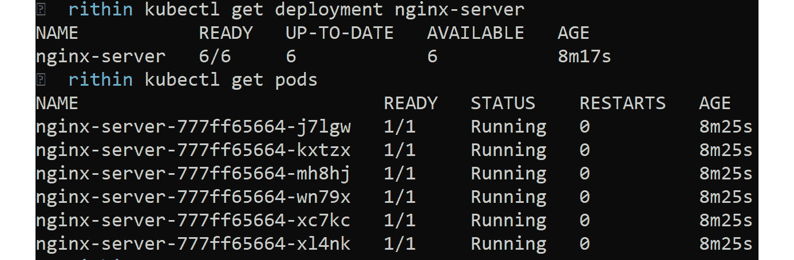

# 14. 设计 Azure Kubernetes 解决方案

容器是过去十年中最受讨论的基础设施组件之一。容器并不是新技术，它们已经存在了一段时间。它们在 Linux 世界中已经流行了超过二十年。由于其复杂性以及相关文档的匮乏，容器曾在开发者社区中不太为人知。然而，在本世纪初，即 2013 年，一家名为 Docker 的公司推出了改变开发者世界对容器认知和采纳的局面。

Docker 在现有的 Linux LXC 容器之上编写了一个强大的 API 封装，简化了开发者从命令行界面创建、管理和销毁容器的过程。当容器化应用时，容器的数量会随着时间大幅增加，可能达到需要管理数百个甚至数千个容器的程度。这时，容器编排工具就发挥了作用，而 Kubernetes 就是其中之一。使用 Kubernetes，我们可以自动化容器的部署、扩展、网络配置和管理。

本章将讨论：

+   容器的基本概念

+   Kubernetes 的概念

+   使 Kubernetes 能够正常工作的关键要素

+   使用 Azure Kubernetes 服务构建解决方案

现在你已经知道 Kubernetes 的用途，我们从头开始讨论容器是什么，如何使用 Kubernetes 对它们进行编排等内容。

## 容器简介

容器被称为操作系统级虚拟化系统。它们托管在运行于物理服务器或虚拟服务器上的操作系统中。实现的性质取决于宿主操作系统。例如，Linux 容器受 cgroups 启发；而 Windows 容器几乎是轻量级虚拟机，具有小巧的占用空间。

容器真正实现了跨平台。容器化应用可以在任何平台上运行，如 Linux、Windows 或 Mac，且无需任何修改，这使得它们具有高度的可移植性。这使得它们成为组织采用的完美技术，因为它们与平台无关。

此外，容器可以在任何云环境或本地环境中运行，无需修改。这意味着如果组织将容器作为其云托管平台，它们也不会被束缚于单一云提供商。它们可以将环境从本地迁移并直接迁移到云端。

容器提供了虚拟机通常具备的所有优势。它们有自己的 IP 地址、DNS 名称、身份、网络堆栈、文件系统以及其他组件，这些都使得用户有使用全新操作系统环境的错觉。在后台，Docker 运行时通过虚拟化多个操作系统内核级别的组件来提供这种错觉。

所有这些优势为采用容器技术的组织提供了巨大的好处，而 Docker 在这方面是先行者之一。还有其他容器运行时选项可供选择，如 CoreOS Rkt（发音为 Rocket，已停产）、Mesos Containerizer 和 LXC 容器。组织可以选择他们感到舒适的技术。

容器在 Windows 系统中之前是不可用的，仅在 Windows 10 和 Windows Server 2016 中才开始支持。然而，现在容器已经成为 Windows 系统中的一等公民。

如介绍中所述，容器应像生态系统中的任何其他基础设施组件一样，进行监控、治理和管理。必须部署一个编排工具，如 Kubernetes，帮助你轻松实现这一点。在接下来的章节中，你将了解 Kubernetes 的基础知识，包括它的优势。

## Kubernetes 基础知识

许多组织仍然问，“*我们需要 Kubernetes，还是需要任何容器编排工具？*” 当我们考虑大规模容器管理时，我们需要考虑多个方面，比如扩展、负载均衡、生命周期管理、持续交付、日志记录和监控等。

你可能会问，“*容器不应该完成这些工作吗？*” 答案是，容器只是这一拼图的低级组成部分。真正的好处是通过那些位于容器之上的工具获得的。最终，我们需要一些工具来帮助我们进行编排。

Kubernetes 是一个希腊词，κυβερνήτης，意思是“舵手”或“船长”。延续 Docker 容器的海洋主题，Kubernetes 就是这艘船的船长。Kubernetes 通常缩写为 K8s，其中 8 代表单词 "Kubernetes" 中 "K" 和 "s" 之间的八个字母。

如前所述，容器比虚拟机更具灵活性。它们可以在几秒钟内创建，并且同样可以快速销毁。它们的生命周期与虚拟机类似；然而，它们需要在环境中主动进行监控、治理和管理。

使用你现有的工具集来管理容器是可行的；尽管如此，像 Kubernetes 这样的专用工具能够提供宝贵的好处：

+   Kubernetes 本质上是自愈的。当 Kubernetes 环境中的一个 Pod（现在可以理解为“容器”）故障时，Kubernetes 会确保在同一节点或另一个节点上创建一个新的 Pod 来响应应用程序的请求。

+   Kubernetes 还简化了应用程序升级的过程。它提供了开箱即用的功能，帮助你在保留原始配置的情况下执行多种类型的升级。

+   它有助于实现蓝绿部署。在这种部署方式中，Kubernetes 会将新版本的应用程序与旧版本一起部署，一旦确认新应用程序按预期工作，就会进行 DNS 切换，切换到新版本的应用程序。旧的应用程序部署可以继续存在，以便回滚使用。

+   Kubernetes 还帮助实施滚动升级部署策略。在这种策略中，Kubernetes 会逐个服务器地部署新版本的应用程序，并逐个服务器地拆除旧版本部署。它会一直执行此操作，直到旧版本的部署没有服务器为止。

+   Kubernetes 可以通过 **基础设施即服务**（**IaaS**）模式在本地数据中心或云上进行部署。这意味着开发人员首先创建一组虚拟机并在其上部署 Kubernetes。还有一种替代方法是将 Kubernetes 用作 **平台即服务**（**PaaS**）提供。Azure 提供了一项名为 **Azure Kubernetes 服务**（**AKS**）的 PaaS 服务，提供了一个开箱即用的 Kubernetes 环境，供开发人员使用。

在部署方面，Kubernetes 可以通过两种方式进行部署：

+   **非托管集群**：非托管集群可以通过在裸机或虚拟机上安装 Kubernetes 及其他相关软件包来创建。在非托管集群中，将有主节点和工作节点，前身叫做从节点。主节点和工作节点共同协作管理容器。如果你想知道这是如何实现的，接下来我们将在本章中探索 Kubernetes 的完整架构。现在，你只需要知道有主节点和工作节点即可。

+   **托管集群**：托管集群通常由云服务提供商提供；云服务提供商为你管理基础设施。在 Azure 中，这项服务被称为 AKS。Azure 将提供关于补丁和基础设施管理的主动支持。使用 IaaS 时，组织必须自行确保节点和基础设施的可用性和可扩展性。在 AKS 中，主组件不可见，因为它由 Azure 管理。然而，工作节点（从节点）是可见的，并且会被部署到单独的资源组中，因此你可以在需要时访问这些节点。

使用 AKS 而不是非托管集群的一些关键好处包括：

+   如果你使用的是非托管集群，你需要努力使解决方案具有高可用性和可扩展性。除此之外，你还需要有合适的更新管理机制来安装更新和补丁。另一方面，在 AKS 中，Azure 完全管理这一切，使得开发人员可以节省时间，更加高效。

+   与其他服务的原生集成，例如 Azure 容器注册表用于安全存储容器镜像，Azure DevOps 用于集成 CI/CD 管道，Azure Monitor 用于日志记录，Azure Active Directory 用于安全性。

+   可扩展性和更快的启动速度。

+   支持虚拟机规模集。

尽管这两种部署方式在基本功能上没有差异，但 IaaS 部署形式提供了灵活性，可以立即添加新的插件和配置，而这可能需要 Azure 团队在 AKS 中推出一段时间才能实现。此外，Kubernetes 的新版本在 AKS 中发布也相对迅速，几乎没有延迟。

我们已经涵盖了 Kubernetes 的基础内容。此时，您可能会想，Kubernetes 是如何实现这一切的。在接下来的章节中，我们将探讨 Kubernetes 的组件以及它们是如何协同工作的。

## Kubernetes 架构

理解 Kubernetes 的第一步是了解它的架构。我们将在下一节详细讲解每个组件，但先了解架构的高级概览将有助于您理解各个组件之间的互动。

### Kubernetes 集群

Kubernetes 需要物理或虚拟节点来安装两种类型的组件：

+   Kubernetes 控制平面组件，或主控组件

+   Kubernetes 工作节点（从属节点），或非主控组件

*图 14.1* 是一个提供 Kubernetes 架构高级概览的图表。稍后我们将详细介绍各个组件：


###### 图 14.1：Kubernetes 集群概览

控制平面组件负责管理和治理 Kubernetes 环境以及 Kubernetes 从属节点。

所有节点——包括主控节点和从属节点——共同构成了集群。换句话说，集群是节点的集合。它们可以是虚拟的或物理的，彼此连接，并通过 TCP 网络栈相互访问。外部世界无法得知您的集群的大小、能力，甚至工作节点的名称。节点唯一知道的是与集群互动的 API 服务器的地址。对它们来说，集群就是运行其应用程序的一台大计算机。

正是 Kubernetes 内部决定了一个合适的策略，通过控制器来选择一个有效、健康的节点，以便平稳地运行应用程序。

控制平面组件可以安装在高可用配置中。到目前为止，我们已经讨论了集群及其工作原理。在接下来的章节中，我们将深入了解集群的组件。

### Kubernetes 组件

Kubernetes 组件分为两类：主组件和节点组件。主组件也被称为集群的控制平面。控制平面负责管理集群中的工作节点和 Pod。集群的决策权由控制平面掌控，它还负责集群事件的检测和响应。*图 14.2* 描述了 Kubernetes 集群的完整架构：


###### 图 14.2：Kubernetes 架构

你需要理解每一个组件，才能正确地管理一个集群。接下来，让我们讨论一下主组件：

+   **API 服务器**：API 服务器无疑是 Kubernetes 的大脑。它是启用 Kubernetes 内部所有活动的核心组件。每个客户端请求（少数例外）最终都会由 API 服务器处理，API 服务器决定请求的流向。它唯一负责与 etcd 服务器进行交互。

+   **etcd**：etcd 是 Kubernetes 的数据存储。只有 API 服务器被允许与 etcd 进行通信，API 服务器可以对 etcd 执行 **创建**、**读取**、**更新** 和 **删除**（**CRUD**）操作。当请求最终到达 API 服务器时，经过验证后，API 服务器可以根据 etcd 请求执行任何 CRUD 操作。etcd 是一个分布式、高可用的数据存储。可以有多个 etcd 实例，每个实例都有一份数据副本，它们中的任何一个都可以为 API 服务器的请求提供服务。在 *图 14.3* 中，你可以看到在控制平面中运行多个实例来提供高可用性：

###### 图 14.3：使控制平面高度可用

+   **控制器管理器**：控制器管理器是 Kubernetes 的工作马车。API 服务器接收请求时，Kubernetes 中的实际工作由控制器管理器完成。顾名思义，控制器管理器是控制器的管理者。Kubernetes 主节点中有多个控制器，每个控制器负责管理一个单一的资源。

    控制器的主要职责是管理 Kubernetes 环境中的单一资源。例如，有一个用于管理副本控制器资源的副本控制器管理器，以及一个用于管理 Kubernetes 环境中 ReplicaSets 的 ReplicaSet 控制器。控制器监控 API 服务器，当它收到一个请求来管理某个资源时，控制器就会执行相应的操作。

    控制器的主要职责之一是保持循环运行，并确保 Kubernetes 处于所需状态。如果与所需状态出现任何偏差，控制器应该将其恢复到所需状态。部署控制器监视 API 服务器创建的任何新的部署资源。如果发现新的部署资源，部署控制器将创建一个新的 ReplicaSet 资源，并确保 ReplicaSet 始终处于所需状态。复制控制器会一直运行，并检查环境中实际的 Pods 数量是否与所需的 Pods 数量匹配。如果某个 Pod 因为某种原因死亡，复制控制器会发现实际数量减少了一个，并会在相同或其他节点上调度一个新的 Pod。

+   **调度器**：调度器的工作是将 Pods 调度到 Kubernetes 工作节点上。它不负责创建 Pods，仅负责将 Pods 分配到 Kubernetes 工作节点。它会根据节点的当前状态、节点的繁忙程度、可用资源以及 Pod 的定义来进行调度。Pod 可能会对特定节点有偏好，调度器在将 Pods 调度到节点时会考虑这些请求。

我们现在将探索在集群中每个工作节点上部署的节点组件：

+   **Kubelet**：API 服务器、调度器、控制器和 etcd 部署在主节点上，而 kubelet 部署在工作节点上。它们充当 Kubernetes 主组件的代理，并负责在节点上本地管理 Pods。每个节点上都有一个 kubelet。kubelet 接收来自主组件的命令，同时还向主组件（如 API 服务器和控制器管理器）提供有关节点和 Pods 的健康状况、监控信息和更新信息。它们是主节点与工作节点之间管理通信的中介。

+   **kube-proxy**：kube-proxy 就像 kubelet 一样，部署在工作节点上。它负责监控 Pods 和 Services，并在 Pods 和 Services 的可用性发生变化时更新本地的 iptables 和 netfilter 防火墙规则。这确保了节点上的路由信息在创建新的 Pods 和 Services 或删除现有 Pods 和 Services 时能够及时更新。

+   **容器运行时**：如今，生态系统中有许多容器供应商和提供商。Docker 是其中最著名的，尽管其他容器运行时也在逐渐获得人气。因此，在我们的架构中，我们用 Docker 的标志来表示容器运行时。Kubernetes 是一个通用的容器调度器，它不能与任何单一的容器供应商（如 Docker）紧密耦合。它应该能够在工作节点上使用任何容器运行时来管理容器的生命周期。

为了在 Pod 中运行容器，已经开发了一种基于行业标准的 **容器运行时接口** (**CRI**)，并被所有领先公司使用。该标准提供了与 Kubernetes 等调度器互操作时应遵循的规则。Kubelet 不知道节点上安装了哪些容器二进制文件。它们可以是 Docker 二进制文件，也可以是任何其他二进制文件。

由于这些容器运行时是基于行业标准开发的，无论你使用的是哪种运行时，kubelet 都能与容器运行时进行通信。这将容器管理与 Kubernetes 集群管理解耦。容器运行时的职责包括创建容器、管理容器的网络栈以及管理桥接网络。由于容器管理与集群管理是分离的，Kubernetes 不会干扰容器运行时的职责。

我们讨论的组件适用于无管理的集群以及 AKS 管理的集群。然而，主组件不会暴露给最终用户，因为在 AKS 的情况下，Azure 会管理所有这些内容。本章稍后将介绍 AKS 的架构。你将了解无管理集群，并更清晰地理解这些系统之间的区别。

接下来，你将学习一些最重要的 Kubernetes 资源，也称为原语，这些知识适用于无管理的集群和 AKS 集群。

## Kubernetes 原语

你已经了解 Kubernetes 是一个用于部署和管理容器的调度系统。Kubernetes 定义了一组构建块，也称为原语。这些原语一起可以帮助我们部署、维护和扩展容器化应用程序。让我们逐一了解这些原语及其角色。

### Pod

Pod 是 Kubernetes 中最基本的部署单元。一个好奇的心灵自然会产生一个问题：Pod 和容器有什么区别？Pod 是容器的封装。换句话说，容器是包含在 Pod 内的。一个 Pod 内可以包含多个容器；然而，最佳实践是保持一个 Pod 对应一个容器。这并不意味着一个 Pod 里不能有多个容器。一个 Pod 中有多个容器也是可以的，只要有一个主容器，其他都是辅助容器。也有一些模式，比如 sidecar 模式，可以在多容器 Pod 中实现。

每个 Pod 都有自己的 IP 地址和网络栈。所有容器共享同一网络接口和栈。Pod 内的所有容器可以通过主机名在本地访问。

以下是 YAML 格式的一个简单 Pod 定义示例：

```
---
apiVersion: v1
kind: Pod
metadata:
  name: tappdeployment
  labels:
    appname: tapp
    ostype: linux
spec:
  containers:
  - name: mynewcontainer
    image: "tacracr.azurecr.io/tapp:latest"
    ports:
    - containerPort: 80
      protocol: TCP
      name: http
```

显示的 Pod 定义有一个名称，并定义了几个标签，这些标签可以由服务资源用来暴露给其他 Pods、节点和外部自定义资源。它还定义了一个基于 Azure 容器注册表中存储的自定义镜像的单个容器，并为该容器打开端口 `80`。

### 服务

Kubernetes 允许创建多个实例的 Pods。这些 Pods 应该可以从集群中的任何 Pod 或节点访问。可以直接使用 Pod 的 IP 地址访问 Pod。然而，这远非理想做法。Pods 是短暂的，如果先前的 Pod 已经崩溃，它们可能会获得一个新的 IP 地址。在这种情况下，应用程序容易出现故障。Kubernetes 提供了 Services，将 Pod 实例与其客户端解耦。Pods 可以创建或销毁，但 Kubernetes 服务的 IP 地址保持不变和稳定。客户端可以连接到服务的 IP 地址，该服务为每个 Pod 提供一个端点，用于发送请求。如果有多个 Pod 实例，每个 Pod 的 IP 地址都将作为端点对象提供给服务。当 Pod 崩溃时，端点会更新，以反映当前的 Pod 实例及其 IP 地址。

服务与 Pods 之间有很高的解耦。服务的主要目的是为那些在其服务选择器定义中具有标签的 Pods 排队。服务定义了标签选择器，根据标签选择器，Pod 的 IP 地址被添加到服务资源中。Pods 和服务可以独立管理。

服务提供多种类型的 IP 地址方案。有四种类型的服务：ClusterIP、NodePort、LoadBalancer 和使用应用程序网关的 Ingress Controller。

最基本的方案称为 ClusterIP，它是一个只能从集群内部访问的内部 IP 地址。ClusterIP 方案如 *图 14.4* 所示：


###### 图 14.4：ClusterIP 的工作原理

ClusterIP 还允许创建 NodePort，通过 NodePort，它会获得一个 ClusterIP。然而，它也可以在集群中的每个节点上打开一个端口。Pods 可以通过 ClusterIP 地址访问，也可以通过节点 IP 和节点端口的组合来访问：


###### 图 14.5：NodePort 的工作原理

服务不仅可以指向 Pods，还可以指向外部端点。最后，服务还允许创建基于负载均衡器的服务，能够接收外部请求并通过 ClusterIP 和 NodePort 内部将请求重定向到 Pod 实例：


###### 图 14.6：负载均衡器的工作原理

有一种最终类型的服务被称为 Ingress 控制器，它提供了诸如基于 URL 的路由等高级功能，如*图 14.7*所示：


###### 图 14.7：Ingress 控制器的工作原理

这里展示了一个 YAML 格式的服务定义：

```
apiVersion: v1
kind: Service
metadata:
  name: tappservice
  labels:
    appname: tapp
    ostype: linux
spec:
  type: LoadBalancer
  selector:
    appname: myappnew
  ports:
  - name: http
    port: 8080
    targetPort: 80
    protocol: TCP
```

此服务定义使用标签选择器创建基于负载均衡器的服务。

### 部署

与 ReplicaSets 和 Pods 相比，Kubernetes 的 Deployment 是更高级的资源。Deployment 提供了与应用程序升级和发布相关的功能。Deployment 资源会创建一个 ReplicaSet，而 ReplicaSet 管理 Pods。理解当 ReplicaSets 已经存在时，为什么还需要 Deployment 资源是非常重要的。

部署在应用程序升级中起着重要作用。如果应用程序已经投入生产并且需要部署新版本的应用程序，你有几种选择：

1.  删除现有的 Pods 并创建新的 Pods——这种方法会导致应用程序的停机，因此只有在可以接受停机的情况下才应使用此方法。如果 Deployment 中存在错误并且需要回滚到先前的版本，则停机时间可能会增加。

1.  蓝绿部署——在此方法中，现有的 Pods 继续运行，并且创建一组新版本的 Pods。这些新 Pods 对外不可访问。一旦测试成功完成，Kubernetes 开始指向这一组新的 Pods。旧的 Pods 可以保持不变，或者可以随后删除。

1.  滚动升级——在此方法中，现有的 Pods 会逐个删除，同时为新应用版本创建新的 Pods。新 Pods 会逐步部署，而旧 Pods 会逐步减少，直到它们的数量为零。

如果没有 Deployment 资源，所有这些方法都必须手动执行。Deployment 资源自动化了整个发布和升级过程。如果当前的 Deployment 出现问题，它还可以帮助自动回滚到先前的版本。

以下代码列出了 Deployment 定义：

```
---
apiVersion: apps/v1
kind: Deployment
metadata:
  name: tappdeployment
  labels:
    appname: tapp
    ostype: linux
spec:
  replicas: 3
  selector:
    matchLabels:
      appname: myappnew
  strategy:
    type: RollingUpdate
    rollingUpdate:
       maxSurge: 1
       maxUnavailable: 1  
  template:
    metadata:
      name: mypod
      labels:
        appname: myappnew
    spec:
      containers:
      - name: mynewcontainer
        image: "tacracr.azurecr.io/tapp:latest"
        ports:
        - containerPort: 80
          protocol: TCP
          name: http
```

需要注意的是，Deployment 具有一个 `strategy` 属性，该属性决定是使用 `recreate` 还是 `RollingUpdate` 策略。`recreate` 会删除所有现有的 Pods 并创建新的 Pods。它还通过提供一次执行中可以创建和销毁的最大 Pods 数量，包含与 `RollingUpdate` 相关的配置细节。

### 副本控制器和 ReplicaSet

Kubernetes 的复制控制器资源确保集群内始终有指定数量的 Pod 实例在运行。复制控制器监控任何与期望状态的偏差，并创建新的 Pod 实例以满足期望状态。

ReplicaSets 是复制控制器的新版本。ReplicaSets 提供与复制控制器相同的功能，并增加了一些高级功能。其中最主要的功能是可以丰富地定义与 Pod 相关的选择器。使用 ReplicaSets，可以定义复制控制器中没有的动态表达式。

推荐使用 ReplicaSets 而不是复制控制器。

下一个代码示例展示了如何定义一个 `ReplicaSet` 资源：

```
---
apiVersion: apps/v1
kind: ReplicaSet
metadata:
  name: tappdeployment
  labels:
    appname: tapp
    ostype: linux
spec:
  replicas: 3
  selector:
    matchLabels:
      appname: myappnew
  template:
    metadata:
      name: mypod
      labels:
        appname: myappnew
    spec:
      containers:
      - name: mynewcontainer
        image: "tacracr.azurecr.io/tapp:latest"
        ports:
        - containerPort: 80
          protocol: TCP
          name: http
```

需要注意的是，ReplicaSets 有一个 `replicas` 属性，决定 Pod 实例的数量，`selector` 属性，定义哪些 Pods 应该由 ReplicaSet 管理，最后是 `template` 属性，定义 Pod 本身。

### ConfigMaps 和 Secrets

Kubernetes 提供了两种重要的资源来存储配置信息。ConfigMaps 用于存储不涉及安全的普通配置信息。诸如文件夹名、卷名和 DNS 名称等通用应用配置数据可以存储在 ConfigMaps 中。另一方面，敏感数据，如凭证、证书和机密，应存储在 Secrets 资源中。这些 Secrets 数据会加密并存储在 Kubernetes 的 etcd 数据存储中。

ConfigMaps 和 Secrets 数据可以作为环境变量或在 Pods 中的卷提供。

想要使用这些资源的 Pod 定义应该包括对它们的引用。我们现在已经介绍了 Kubernetes 的基本构件以及每个构件的角色。接下来，你将学习 AKS 的架构。

## AKS 架构

在上一节中，我们讨论了无管理集群的架构。现在，我们将探讨 AKS 的架构。当你阅读完这一节后，你将能够指出无管理集群与管理集群（在此案例中为 AKS）架构之间的主要区别。

当创建 AKS 实例时，只会创建工作节点。主控组件由 Azure 管理。主控组件包括 API 服务器、调度器、etcd 和控制器管理器，这些我们之前已经讨论过。kubelets 和 kube-proxy 部署在工作节点上。节点与主控组件之间的通信通过 kubelets 实现，kubelets 充当 Kubernetes 集群的代理：


###### 图 14.8：AKS 架构

当用户请求一个 Pod 实例时，用户请求会到达 API 服务器。API 服务器检查并验证请求的详细信息，将其存储在 etcd（集群的数据存储）中，并且还会创建部署资源（如果 Pod 请求是围绕部署资源包装的）。部署控制器监视任何新部署资源的创建。如果它发现新资源，它会根据用户请求中提供的定义创建一个 ReplicaSet 资源。

ReplicaSet 控制器监视任何新 ReplicaSet 资源的创建，并在看到资源被创建时，要求调度器调度 Pods。调度器有自己的过程和规则，用于找到合适的节点来托管 Pods。调度器将节点信息通知 kubelet，kubelet 然后获取 Pod 的定义并使用节点上安装的容器运行时创建 Pods。最终，Pod 在其定义中创建容器。

kube-proxy 帮助维护本地节点上 Pod 和 Service 信息的 IP 地址列表，并更新本地防火墙和路由规则。为了快速回顾我们到目前为止讨论的内容，我们从 Kubernetes 架构开始，然后转向基本组件，接着讨论了 AKS 的架构。既然你已经清楚这些概念，我们接下来在下一部分创建 AKS 集群。

## 部署 AKS 集群

AKS 可以通过 Azure 门户、Azure **CLI**（**命令行界面**）、Azure PowerShell cmdlets、ARM 模板、支持语言的 **SDKs**（**软件开发工具包**）甚至 Azure ARM REST API 来进行配置。

Azure 门户是创建 AKS 实例最简单的方法；然而，为了启用 DevOps，最好使用 ARM 模板、CLI 或 PowerShell 来创建 AKS 实例。

### 创建 AKS 集群

让我们创建一个资源组来部署我们的 AKS 集群。从 Azure CLI 使用 `az group create` 命令：

```
az group create -n AzureForArchitects -l southeastasia
```

这里，`-n` 表示资源组的名称，`-l` 表示位置。如果请求成功，你将看到类似下面的响应：


###### 图 14.9：资源组创建

现在我们已经准备好了资源组，我们将使用 `az aks create` 命令继续创建 AKS 集群。以下命令将在 `AzureForArchitects` 资源组中创建一个名为 `AzureForArchitects-AKS` 的集群，节点数为 `2`。`--generate-ssh-keys` 参数将允许创建 **RSA**（**Rivest–Shamir–Adleman**）密钥对，这是一个公钥加密系统：

```
az aks create --resource-group AzureForArchitects \
--name AzureForArchitects-AKS \
--node-count 2 \
--generate-ssh-keys
```

如果命令成功，你将能够看到类似的输出：


###### 图 14.10：创建集群

在查看集群时，你会看到一行项，内容是 `"nodeResourceGroup": "MC_AzureForArchitects_AzureForArchitects-AKS_southeastasia"`。创建 AKS 集群时，会自动创建第二个资源来存储节点资源。

我们的集群已经配置好。现在我们需要连接到集群并与其互动。为了控制 Kubernetes 集群管理器，我们将使用 kubectl。在接下来的章节中，我们将快速了解一下 kubectl。

### Kubectl

Kubectl 是开发人员和基础设施顾问与 AKS 互动的主要工具。Kubectl 帮助创建一个包含 HTTP 头和正文的 REST 请求，并将其提交到 API 服务器。头部包含认证信息，如令牌或用户名/密码组合。正文包含实际的 JSON 格式有效负载。

kubectl 命令提供了丰富的日志细节，当与详细开关一起使用时，开关会接受一个从 0 到 9 的整数输入，可以从详细日志中查看。

### 连接到集群

若要本地连接到集群，我们需要安装 kubectl。Azure Cloud Shell 已经预装了 kubectl。如果你想在本地连接，请使用 `az aks install-cli` 来安装 kubectl。

为了配置 kubectl 连接到我们的 Kubernetes 集群，我们需要下载凭证并用它们配置 CLI。可以使用 `az aks get-credentials` 命令来完成。使用如下命令：

```
az aks get-credentials \
--resource-group AzureForArchitects \
--name AzureForArchitects-AKS
```

现在，我们需要验证是否已连接到集群。如前所述，我们将使用 kubectl 与集群通信，`kubectl get nodes` 将显示集群中节点的列表。在创建时，我们将节点数量设置为 `2`，所以输出应该有两个节点。同时，我们需要确保节点的状态为 `Ready`。输出应类似于*图 14.11*：


###### 图 14.11：获取节点列表

由于我们的节点处于 `Ready` 状态，让我们继续创建一个 Pod。在 Kubernetes 中创建资源有两种方法。它们是：

+   使用 `kubectl run` 和 `kubectl expose` 命令来创建资源。

+   使用 `kubectl apply` 命令来创建资源，文件中声明的资源将被创建。

让我们首先采用命令式方法，创建一个名为 `webserver` 的 Pod，运行一个暴露 `80` 端口的 NGINX 容器：

```
kubectl run webserver --restart=Never --image nginx --port 80
```

命令成功完成后，CLI 将告知你状态：


###### 图 14.12：创建一个 Pod

既然我们已经尝试了命令式方法，现在让我们采用声明式方法。你可以使用我们在 *Kubernetes 原语* 部分的 *Pod* 小节中讨论的 YAML 文件结构，并根据需求进行修改。

我们将使用 NGINX 镜像，Pod 将命名为`webserver-2`。

你可以使用任何文本编辑器创建这个文件。最终的文件将类似于这样：

```
apiVersion: v1
kind: Pod
metadata:
  name: webserver-2
  labels:
    appname: nginx
    ostype: linux
spec:
  containers:
  - name: wenserver-2-container
    image: nginx
    ports:
    - containerPort: 80
      protocol: TCP
      name: http
```

在`kubectl apply`命令中，我们将把文件名传递给`-f`参数，如*图 14.13*所示，你可以看到 Pod 已经创建：


###### 图 14.13：使用声明式方法创建 Pod。

由于我们已经创建了 Pods，我们可以使用`kubectl get pods`命令列出所有的 Pods。Kubernetes 使用命名空间的概念来逻辑隔离资源。默认情况下，所有命令都指向`default`命名空间。如果你想对特定命名空间执行操作，可以通过`-n`参数传递命名空间的名称。在*图 14.14*中，你可以看到`kubectl get pods`返回的是我们在前一个示例中创建的 Pods，它们位于默认命名空间中。此外，当我们使用`--all-namespaces`时，输出会返回所有命名空间中的 Pods：


###### 图 14.14：列出所有 Pods

现在我们将创建一个简单的 Deployment，运行 NGINX，并通过负载均衡器将其暴露到互联网。`YAML`文件将如下所示：

```
#Creating a deployment that runs six replicas of nginx 
apiVersion: apps/v1
kind: Deployment
metadata:
  name: nginx-server
spec:
  replicas: 6
  selector:
    matchLabels:
      app: nginx-server
  template:
    metadata:
      labels:
        app: nginx-server
    spec:
      containers:
      - name: nginx-server
        image: nginx
        ports:
        - containerPort: 80
          name: http
---
#Creating Service
apiVersion: v1
kind: Service
metadata:
  name: nginx-service
spec:
  ports:
  - port: 80
  selector:
    app: nginx-server
---
apiVersion: v1
kind: Service
metadata:
  name: nginx-lb
spec:
  type: LoadBalancer
  ports:
  - port: 80
  selector:
    app: nginx-server
```

我们将使用`kubectl apply`命令并将`YAML`文件传递给`-f`参数。

成功后，将创建所有三个服务，如果你执行`kubectl get deployment nginx-server`命令，你将看到六个副本在运行，如*图 14.15*所示，从而使服务具有高可用性：



###### 图 14.15：检查 Deployment

由于我们的 Deployment 已经配置好，我们需要检查我们创建的负载均衡器的公共 IP。我们可以使用`kubectl get service nginx-lb --watch`命令。当负载均衡器初始化时，`EXTERNAL-IP`将显示为`<pending>`，`--wait`参数将使命令在前台运行，当公共 IP 分配完毕时，我们将看到一行新的信息，如下所示：


###### 图 14.16：查找负载均衡器的公共 IP

现在我们有了公共 IP，我们可以打开浏览器，应该能看到 NGINX 登录页面，如*图 14.17*所示：


###### 图 14.17：NGINX 登录页面

同样，你可以使用我们在*Kubernetes 基础组件*部分讨论的`YAML`文件来创建不同类型的资源。

有许多命令，如 `logs`、`describe`、`exec` 和 `delete`，管理员需要在 `kubectl` 命令中使用。本节的目标是帮助你创建一个 AKS 集群，连接到集群，并部署一个简单的 web 应用。

在接下来的部分，我们将讨论 AKS 网络。

## AKS 网络

网络是 Kubernetes 集群中的核心组件。主组件应该能够访问从属节点及其上运行的 Pods，而工作节点则应该能够相互通信并与主组件进行通信。

可能会让你感到惊讶的是，核心 Kubernetes 并不管理网络栈。这是节点上容器运行时的工作。

Kubernetes 制定了三个重要原则，任何容器运行时都应遵守。这些原则如下：

+   Pods 应该能够与其他 Pods 进行通信，而无需改变其源地址或目标地址，这是通过使用**网络地址转换**（**NAT**）来实现的。

+   像 kubelet 这样的代理应该能够直接与节点上的 Pods 进行通信。

+   直接托管在主机网络上的 Pods 仍然应该能够与集群中的所有 Pods 进行通信。

每个 Pod 在 Kubernetes 集群中都会获得一个唯一的 IP 地址，并拥有一个完整的网络栈，类似于虚拟机。它们都连接到由**容器网络接口**（**CNI**）组件创建的本地桥接网络。CNI 组件还会创建 Pod 的网络栈。然后，桥接网络与主机网络进行通信，并成为 Pods 与网络之间流量传输的通道，反之亦然。

CNI 是由**云原生计算基金会**（**CNCF**）管理和维护的标准，有许多提供商提供其自定义实现。Docker 就是其中之一。还有其他提供商，例如 rkt（读作 rocket）、weave、calico 等。每个提供商都有自己的能力，并独立决定网络功能，同时确保完全遵循 Kubernetes 网络的主要原则。

AKS 提供两种不同的网络模型：

+   Kubenet

+   Azure CNI

### Kubenet

Kubenet 是 AKS 中的默认网络框架。在 Kubenet 模式下，每个节点从它们所连接的虚拟网络的子网中获取一个 IP 地址。Pods 不会从子网中获取 IP 地址。相反，使用一个独立的寻址方案为 Pods 和 Kubernetes 服务提供 IP 地址。在创建 AKS 实例时，重要的是为 Pods 和服务设置 IP 地址范围。由于 Pods 不在与节点相同的网络中，因此来自 Pods 或指向 Pods 的请求总是会通过 NAT 转换或路由，将源 Pod 的 IP 地址替换为节点的 IP 地址，反之亦然。

在用户定义的路由中，Azure 可以支持最多 400 条路由，且集群中的节点数不能超过 400 个。*图 14.18* 显示了 AKS 节点如何从虚拟网络获取 IP 地址，但不包括在节点中创建的 Pods：


###### 图 14.18：AKS 中的网络

默认情况下，这个 Kubenet 配置为每个节点 110 个 Pods。这意味着默认情况下，在 Kubernetes 集群中最多可以有 *110 * 400* 个 Pods。每个节点的最大 Pods 数量是 250。

当 IP 地址的可用性和用户定义的路由不是限制条件时，应该使用此方案。

在 Azure CLI 中，你可以执行以下命令来使用此网络堆栈创建 AKS 实例：

```
az aks create \
    --resource-group myResourceGroup \
    --name myAKSCluster \
    --node-count 3 \
    --network-plugin kubenet \
    --service-cidr 10.0.0.0/16 \
    --dns-service-ip 10.0.0.10 \
    --pod-cidr 10.244.0.0/16 \
    --docker-bridge-address 172.17.0.1/16 \
    --vnet-subnet-id $SUBNET_ID \
    --service-principal <appId> \
    --client-secret <password>
```

请注意，所有的 IP 地址都明确地为服务资源、Pods、节点和 Docker 桥接提供。这些是非重叠的 IP 地址范围。同时请注意，Kubenet 被用作网络插件。

### Azure CNI（高级网络）

使用 Azure CNI 时，每个节点和 Pod 会直接从网络子网分配一个 IP 地址。这意味着，可以根据子网中可用的唯一 IP 地址数量来拥有尽可能多的 Pods。这使得在这种网络策略下，IP 地址范围规划变得更加重要。

需要注意的是，Windows 主机仅能使用 Azure CNI 网络堆栈。此外，某些 AKS 组件，如虚拟节点和虚拟 kubelet，也依赖于 Azure CNI 堆栈。根据将要创建的 Pods 数量，可能需要提前预留 IP 地址。子网中应该始终有额外的 IP 地址，以避免 IP 地址耗尽，或者避免因应用需求而需要重新构建集群来支持更大的子网。

默认情况下，此网络堆栈配置为每个节点 30 个 Pods，并且可以配置为每个节点最多支持 250 个 Pods。

用于创建 AKS 实例的命令如下所示：

```
az aks create \
    --resource-group myResourceGroup \
    --name myAKSCluster \
    --network-plugin azure \
    --vnet-subnet-id <subnet-id> \
    --docker-bridge-address 172.17.0.1/16 \
    --dns-service-ip 10.2.0.10 \
    --service-cidr 10.2.0.0/24 \
    --generate-ssh-keys
```

请注意，所有的 IP 地址都明确地为服务资源、Pods、节点和 Docker 桥接提供。这些是非重叠的 IP 地址范围。同时，注意 Azure 被用作网络插件。

到目前为止，你已经学习了如何部署解决方案并管理 AKS 集群的网络。安全性是另一个需要解决的重要因素。在下一部分，我们将重点介绍 AKS 的访问和身份验证选项。

## AKS 的访问和身份验证

Kubernetes 集群可以通过多种方式进行安全保护。

服务账户是 Kubernetes 中的主要用户类型之一。Kubernetes API 管理服务账户。授权的 Pod 可以使用服务账户的凭证与 API 服务器通信，这些凭证作为 Kubernetes Secrets 存储。Kubernetes 没有自己的数据存储或身份提供者，它将认证的责任委托给外部软件。它提供了一个认证插件，用于检查给定的凭证并将其映射到可用的组。如果认证成功，请求会传递给另一组授权插件，以检查用户在集群上的权限级别，以及命名空间范围内的资源。

对于 Azure，最佳的安全集成方式是使用 Azure AD。使用 Azure AD，您还可以将本地身份带入 AKS，以提供账户和安全的集中管理。Azure AD 集成的基本工作流程如 *图 14.19* 所示：


###### 图 14.19：Azure AD 集成的基本工作流程

用户或组可以被授予访问命名空间内或跨集群的资源的权限。在上一节中，我们使用了 `az aks get-credential` 命令来获取凭证和 kubectl 配置上下文。当用户尝试与 kubectl 交互时，系统会提示他们使用 Azure AD 凭证进行登录。Azure AD 验证凭证并为用户发放令牌。根据他们的访问级别，他们可以访问集群或命名空间中的资源。

此外，您可以利用 Azure **基于角色的访问控制** (**RBAC**) 来限制对资源组内资源的访问。

在下一节中，我们将讨论虚拟 kubelet，它是扩展集群的最快方式之一。

## 虚拟 kubelet

虚拟 kubelet 目前处于预览阶段，由 CNCF 组织管理。它是 AKS 用于扩展性目的的一种创新方法。虚拟 kubelet 作为一个 Pod 部署在 Kubernetes 集群中。运行在 Pod 内的容器使用 Kubernetes SDK 创建一个新的节点资源，并将自己作为节点呈现给整个集群。集群组件，包括 API 服务器、调度器和控制器，认为它是一个节点，并在其上调度 Pods。

然而，当一个 Pod 被调度到这个伪装成节点的节点上时，它会与其后端组件（称为提供者）进行通信，以创建、删除和更新 Pods。Azure 上的一个主要提供者是 Azure 容器实例。Azure 批量处理也可以作为提供者使用。这意味着容器实际上是在容器实例或 Azure 批量处理上创建的，而不是在集群本身上；然而，它们仍由集群管理。虚拟 kubelet 的架构如 *图 14.20* 所示：


###### 图 14.20：虚拟 kubelet 架构

请注意，虚拟 kubelet 在集群内表现为一个节点，并且能够像普通的 kubelet 一样帮助托管和管理 Pods。然而，虚拟 kubelet 有一个局限性；这就是我们将在下一节中讨论的内容。

## 虚拟节点

虚拟 kubelet 的一个局限性是，部署在虚拟 kubelet 提供者上的 Pods 是隔离的，无法与集群中的其他 Pods 通信。如果这些提供者上的 Pods 需要与集群中的其他 Pods 和节点进行通信，反之亦然，则应该创建虚拟节点。虚拟节点会在与 Kubernetes 集群节点所在虚拟网络的同一虚拟网络上，使用不同的子网创建，这样可以启用 Pods 之间的通信。到目前为止，仅支持 Linux 操作系统与虚拟节点协作。

虚拟节点提供了一个节点的感知；然而，节点并不存在。任何在这样的节点上调度的任务实际上会在 Azure 容器实例中创建。虚拟节点基于虚拟 kubelet，但具有额外的功能，即集群与 Azure 容器实例之间的无缝双向通信。

在虚拟节点上部署 Pods 时，Pod 定义应该包含适当的节点选择器，以引用虚拟节点，并且还应包含容忍设置，如下一个代码片段所示：

```
      nodeSelector:
        kubernetes.io/role: agent
        beta.kubernetes.io/os: linux
        type: virtual-kubelet
      tolerations:
      - key: virtual-kubelet.io/provider
        operator: Exists
      - key: azure.com/aci
        effect: NoSchedule
```

在这里，节点选择器使用 `type` 属性引用虚拟 kubelet，而 `tolerations` 属性则通知 Kubernetes，带有污点 `virtual-kubelet.io/provider` 的节点应允许这些 Pods 的部署。

## 概述

Kubernetes 是最广泛使用的容器编排工具，并与不同的容器和网络运行时一起工作。在本章中，您了解了 Kubernetes 的基础知识、其架构以及一些重要的基础设施组件，如 etcd、API 服务器、控制器管理器和调度器，以及它们的作用。此外，我们还介绍了可以用于管理应用程序的重要资源，如 Pods、复制控制器、ReplicaSets、Deployments 和 Services。

AKS 提供了几种不同的网络栈——Azure CNI 和 Kubenet。它们为 Pods 分配 IP 地址提供了不同的策略。Azure CNI 从底层子网为 Pods 提供 IP 地址，而 Kubenet 仅使用虚拟 IP 地址。

我们还介绍了 Azure 独有的一些功能，如虚拟节点，以及虚拟 kubelet 的相关概念。在下一章中，我们将学习如何通过 ARM 模板配置和管理资源。
