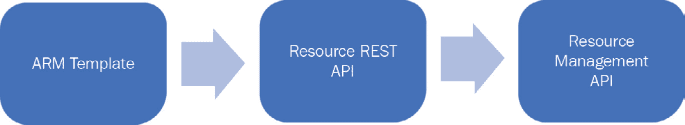

# 15. 使用 ARM 模板进行跨订阅部署

**Azure 资源管理器**（**ARM**）模板是配置和管理 Azure 上资源的首选机制。

ARM 模板有助于实现一种相对较新的范式，称为 **基础设施即代码**（**IaC**）。ARM 模板将基础设施及其配置转化为代码，具有众多优势。IaC 为跨环境的部署带来了高度一致性和可预测性。它还确保在投入生产之前可以对环境进行测试，最终，它使得部署过程、维护和治理更具信心。

本章将涵盖以下主题：

+   ARM 模板

+   使用 ARM 模板部署资源组

+   跨订阅和资源组部署资源

+   使用链接模板进行跨订阅和资源组部署

+   为 PaaS、数据和 IaaS 解决方案创建 ARM 模板

## ARM 模板

IaC 的一个显著优势是它可以进行版本控制。它还可以跨环境复用，这在部署中提供了高度的一致性和可预测性，并确保无论模板部署多少次，部署 ARM 模板的影响和结果都是相同的。这个特性被称为 **幂等性**。

ARM 模板随着 ARM 规范的引入而首次亮相，并且自那时以来功能逐渐丰富，成熟度也在不断提高。需要理解的是，实际资源配置与 ARM 模板中配置的可用性之间通常存在几周到几个月的功能差距。

每个资源都有自己的配置。此配置可以通过多种方式进行更改，包括使用 Azure PowerShell、Azure CLI、Azure SDK、REST API 和 ARM 模板。

每种技术都有其独立的开发和发布生命周期，这与实际资源的开发不同。让我们通过一个例子来理解这一点。

Azure Databricks 资源有其自身的发布周期和开发生命周期。使用该资源的消费者也有自己的开发生命周期，这与实际资源的开发周期不同。如果 Databricks 在 12 月 31 日首次发布，那么针对它的 Azure PowerShell cmdlet 可能在同一天无法使用，甚至可能在次年的 1 月 31 日才发布；同样，这些功能在 REST API 和 ARM 模板中的可用性可能是在 1 月 15 日左右。

ARM 模板是基于 JSON 的文档，执行时会调用 Azure 管理平面上的 REST API 并提交整个文档。REST API 有自己的开发生命周期，而资源的 JSON 架构也有自己的生命周期。

这意味着，资源中的功能开发至少需要在三个不同的组件中进行，才能从 ARM 模板中使用。包括：

+   该资源本身

+   该资源的 REST API

+   ARM 模板资源架构

每个 ARM 模板中的资源都有`apiVersion`属性。该属性帮助确定应使用的 REST API 版本，以便配置和部署该资源。*图 15.1* 显示了从 ARM 模板到负责创建、更新和删除资源的资源 API 请求流：



###### 图 15.1：请求流

资源配置，例如 ARM 模板中的存储帐户，格式如下：

```
{ "type": "Microsoft.Storage/storageAccounts",  "apiVersion": "2019-04-01",   "name": "[variables('storage2')]",   "location": "[resourceGroup().location]",   "kind": "Storage",   "sku": {                "name": "Standard_LRS"          }}
```

在前面的代码中，定义 `sku` 的架构可用性基于 ARM 模板架构的开发。REST API 的可用性及其版本号由 `apiVersion` 决定，版本为`2019-04-01`。实际资源由 `type` 属性决定，该属性包括以下两个部分：

+   **资源提供者命名空间**：Azure 中的资源托管在命名空间内，相关的资源也托管在相同的命名空间内。

+   **资源类型**：资源通过其类型名称进行引用。

在这种情况下，资源通过其提供者名称和类型来识别，类型为`Microsoft.Storage/storageaccounts`。

以前，ARM 模板要求在部署之前资源组必须已存在。它们也仅限于在单一订阅的单一资源组中进行部署。

这意味着，直到最近，ARM 模板只能在单一资源组内部署所有资源。现在，Azure ARM 模板增加了将资源部署到同一订阅内的多个资源组或多个订阅的功能。现在可以在 ARM 模板中创建资源组，这意味着现在可以将资源部署到多个区域的不同资源组中。

我们为什么需要在 ARM 模板中创建资源组？为什么需要同时进行跨订阅和跨资源组的部署？

为了理解创建资源组和跨订阅部署的价值，我们需要了解这些功能可用之前是如何进行部署的。

部署 ARM 模板之前，资源组是一个前提条件。资源组应该在模板部署之前创建。开发人员可以使用 PowerShell、Azure CLI 或 REST API 创建资源组，然后启动 ARM 模板的部署。这意味着任何端到端的部署都包括多个步骤。第一步是创建资源组，接下来的步骤是将 ARM 模板部署到这个新创建的资源组。这些步骤可以通过单个 PowerShell 脚本执行，或者通过 PowerShell 命令行中的独立步骤执行。PowerShell 脚本应该包含与异常处理相关的代码，考虑到边缘情况，并确保在脚本可以被称为企业级之前没有任何错误。需要注意的是，资源组可以从 Azure 中删除，下次脚本运行时可能会假设资源组已经存在并失败。简而言之，部署 ARM 模板到资源组应该是一个原子步骤，而不是多个步骤。

将这一点与能够在相同的 ARM 模板中创建资源组及其组成资源进行比较。每次部署模板时，它都会确保如果资源组尚未存在，则创建它，并在创建后继续向其中部署资源。

我们还来看看这些新功能如何帮助消除与灾难恢复站点相关的一些技术限制。

在这些新功能之前，如果你需要部署一个以灾难恢复为设计目标的解决方案，会有两个独立的部署：一个是主区域的部署，另一个是备用区域的部署。例如，如果你使用 App Service 部署一个 ASP.NET MVC 应用程序，你会创建一个应用服务并为主区域配置它，然后使用相同的模板在另一个区域进行另一个部署，并使用不同的`parameters`文件。当在另一个区域部署一组资源时，如前所述，模板使用的参数应该有所不同，以反映两个环境之间的差异。这些参数包括像 SQL 连接字符串、域名和 IP 地址以及其他特定于环境的配置项。

随着跨订阅和资源组部署功能的引入，您可以在创建主站点的同时创建灾难恢复站点。这消除了两个部署的需要，并确保相同的配置可以在多个站点上使用。

## 使用 ARM 模板部署资源组

在本节中，将编写并部署一个 ARM 模板，该模板将在同一订阅内创建几个资源组。

要使用 PowerShell 部署包含资源组和跨订阅资源的模板，应使用最新版本的 PowerShell。编写时，使用的是 Azure 模块版本 3.3.0：


###### 图 15.2：验证最新的 Azure 模块版本

如果没有安装最新的 Azure 模块，可以使用以下命令进行安装：

```
install-module  -Name az  -Force
```

现在是创建一个 ARM 模板的时机，该模板将在同一订阅内创建多个资源组。ARM 模板的代码如下：

```
{  "$schema": "https://schema.management.azure.com/schemas/2015-01-01/deploymentTemplate.json#",  "contentVersion": "1.0.0.0",  "parameters": {    "resourceGroupInfo": {      "type": "array"    },    "multiLocation": {      "type": "array"         }  },  "resources": [    {      "type": "Microsoft.Resources/resourceGroups",      "location": "[parameters('multiLocation')[copyIndex()]]",      "name": "[parameters('resourceGroupInfo')[copyIndex()]]",      "apiVersion": "2019-10-01",      "copy": {        "name": "allResourceGroups",        "count": "[length(parameters('resourceGroupInfo'))]"      },      "properties": {}    }  ],  "outputs": {}}
```

代码的第一部分是 ARM 模板所期望的参数。这些是必需的参数，任何部署这些模板的人都应提供相应的值。必须为这两个参数提供数组值。

第二个主要部分是 `resources` JSON 数组，它可以包含多个资源。在此示例中，我们正在创建资源组，因此它声明在 `resources` 部分内。由于使用了 `copy` 元素，资源组在循环中被创建。`copy` 元素确保资源运行指定次数，并在每次迭代中创建新的资源。如果我们为 `resourceGroupInfo` 数组参数传递两个值，则数组长度为二，`copy` 元素将确保 `resourceGroup` 资源执行两次。

模板中的所有资源名称在同一资源类型内应唯一。`copyIndex` 函数用于将当前迭代编号分配给资源的整体名称，并确保其唯一性。此外，我们希望资源组在不同区域中创建，使用作为参数传递的不同区域名称。每个资源组的名称和位置分配是通过 `copyIndex` 函数完成的。

`parameters` 文件的代码如下所示。该代码相当简单，并为之前模板中预期的两个参数提供了数组值。此文件中的值应根据你的环境更改所有参数：

```
{  "$schema": "https://schema.management.azure.com/schemas/2015-01-01/deploymentParameters.json#",  "contentVersion": "1.0.0.0",  "parameters": {    "resourceGroupInfo": {      "value": [ "firstResourceGroup", "SeocndResourceGroup" ]    },    "multiLocation": {      "value": [        "West Europe",        "East US"      ]    }  }}
```

### 部署 ARM 模板

要使用 PowerShell 部署此模板，使用以下命令登录 Azure 并提供有效的凭据：

```
Login-AzAccount
```

有效的凭据可以是用户帐户或服务主体。然后，使用新发布的 `New-AzDeployment` cmdlet 来部署模板。部署脚本可在 `multipleResourceGroups.ps1` 文件中找到：

```
New-AzDeployment  -Location "West Europe"  -TemplateFile "c:\users\rites\source\repos\CrossSubscription\CrossSubscription\multipleResourceGroups.json" -TemplateParameterFile "c:\users\rites\source\repos\CrossSubscription\CrossSubscription\multipleResourceGroups.parameters.json"  -Verbose
```

需要注意的是，不能使用 `New-AzResourceGroupDeployment` cmdlet，因为 `New-AzResourceGroupDeployment` cmdlet 的作用范围是资源组，并且它期望资源组已经存在作为前提条件。为了在订阅级别部署资源，Azure 发布了一个新的 cmdlet，可以超越资源组范围进行操作。这个新的 cmdlet `new-AzDeployment` 是在订阅级别运行的。同时，也可以在管理组级别进行部署。管理组处于比订阅更高的层级，使用 `New-AzManagementGroupDeployment` cmdlet 进行部署。

### 使用 Azure CLI 部署模板

同一个模板也可以使用 Azure CLI 进行部署。以下是使用 Azure CLI 部署模板的步骤：

1.  使用最新版本的 Azure CLI，通过 ARM 模板创建资源组。在撰写本文时，部署时使用的是版本 2.0.75，如下所示：

    ###### 图 15.3：检查 Azure CLI 版本

1.  使用以下命令登录 Azure，并选择正确的订阅进行使用：

    ```
    az login
    ```

1.  如果登录用户有多个订阅的访问权限，可以使用以下命令选择合适的订阅：

    ```
    az account set –subscription xxxxxxxx-xxxx-xxxx-xxxx-xxxxxxxxxxxx
    ```

1.  使用以下命令执行部署。部署脚本可以在`multipleResourceGroupsCLI.txt`文件中找到：

    ```
    C:\Users\Ritesh>az deployment create—location westus—template-file "C:\users\rites\source\repos\CrossSubscription\CrossSubscription\azuredeploy.json—parameters @"C:\users\rites\source\repos\CrossSubscription\CrossSubscription\azuredeploy.parameters.json"—verbose
    ```

一旦命令执行完成，ARM 模板中定义的资源应该会在 Azure 门户中显示出来。

## 在不同订阅和资源组之间部署资源

在上一节中，资源组是作为 ARM 模板的一部分创建的。Azure 还有一个功能，可以通过单个部署从单一 ARM 模板同时在多个订阅中提供资源。在本节中，我们将为两个不同的订阅和资源组提供一个新的存储帐户。部署 ARM 模板的人将选择其中一个订阅作为基础订阅，利用该订阅发起部署，并将存储帐户同时提供到当前订阅和另一个订阅。部署此模板的前提条件是，部署者必须至少拥有对两个订阅的访问权限，并且在这些订阅中拥有贡献者权限。以下是代码清单，代码也可以在随附代码中的 `CrossSubscriptionStorageAccount.json` 文件中找到：

```
{    "$schema": "https://schema.management.azure.com/schemas/2015-01-01/deploymentTemplate.json#",    "contentVersion": "1.0.0.0",    "parameters": {      "storagePrefix1": {        "type": "string",        "defaultValue": "st01"    ...        "type": "string",        "defaultValue": "rg01"      },      "remoteSub": {        "type": "string",        "defaultValue": "xxxxxxxx-xxxx-xxxx-xxxx-xxxxxxxxxxxx"      }   ...                            }                        }                    ],                    "outputs": {}                }            }        }    ],    "outputs": {}}
```

需要注意的是，代码中使用的资源组名称应已在各自的订阅中存在。如果资源组不存在，代码将抛出错误。此外，资源组的名称必须与 ARM 模板中的名称完全匹配。

部署此模板的代码如下所示。在这种情况下，我们使用 `New-AzResourceGroupDeployment`，因为部署的范围是一个资源组。部署脚本可以在代码包中的 `CrossSubscriptionStorageAccount.ps1` 文件中找到：

```
New-AzResourceGroupDeployment  -TemplateFile "<< path to your CrossSubscriptionStorageAccount.json file >>" -ResourceGroupName "<<provide your base subscription resource group name>>" -storagePrefix1 <<provide prefix for first storage account>> -storagePrefix2 <<provide prefix for first storage account>> -verbose
```

一旦命令执行完成，ARM 模板中定义的资源应在 Azure 门户中反映出来。

### 跨订阅和资源组部署的另一个示例

在本节中，我们将在一个 ARM 模板和单次部署中，从两个不同的订阅、资源组和区域创建两个存储帐户。我们将使用嵌套模板方法，并结合 `copy` 元素为这些资源组提供不同的名称和位置，部署到不同的订阅中。

然而，在执行下一组 ARM 模板之前，应先配置一个 Azure Key Vault 实例，并向其中添加一个密钥。这是因为存储帐户的名称是从 Azure Key Vault 中获取的，并作为参数传递给 ARM 模板，以便部署存储帐户。

要使用 Azure PowerShell 配置 Azure Key Vault，可以执行以下一组命令。以下命令的代码可以在 `CreateKeyVaultandSetSecret.ps1` 文件中找到：

```
New-AzResourceGroup -Location <<replace with location of your key vault>> -Name <<replace with name of your resource group for key vault>> -verbose New-AzureRmKeyVault -Name <<replace with name of your key vault>> -ResourceGroupName <<replace with name of your resource group for key vault>>  -Location <<replace with location of your key vault>> -EnabledForDeployment -EnabledForTemplateDeployment -EnabledForDiskEncryption -EnableSoftDelete -EnablePurgeProtection -Sku Standard -Verbose 
```

你应该注意，从 `New-AzKeyVault` cmdlet 的结果中记录下 `ResourceID` 值。这个值需要在 `parameters` 文件中进行替换。有关详细信息，请参见 *图 15.4*：


###### 图 15.4：创建 Key Vault 实例

执行以下命令，将新密钥添加到新创建的 Azure Key Vault 实例中：

```
Set-AzKeyVaultSecret -VaultName <<replace with name of your key vault>> -Name <<replace with name of yoursecret>> -SecretValue $(ConvertTo-SecureString -String <<replace with value of your secret>> -AsPlainText -Force ) -Verbose
```

代码列表可以在代码包中的 `CrossSubscriptionNestedStorageAccount.json` 文件中找到：

```
{  "$schema": "https://schema.management.azure.com/schemas/2015-01-01/deploymentTemplate.json#",  "contentVersion": "1.0.0.0",  "parameters": {    "hostingPlanNames": {      "type": "array",      "minLength": 1     },  ...      "type": "Microsoft.Resources/deployments",      "name": "deployment01",      "apiVersion": "2019-10-01",      "subscriptionId": "[parameters('subscriptions')[copyIndex()]]",      "resourceGroup": "[parameters('resourceGroups')[copyIndex()]]",      "copy": {        "count": "[length(parameters('hostingPlanNames'))]",        "name": "mywebsites",        "mode": "Parallel"      },    ...              "kind": "Storage",              "properties": {              }            }          ]...
```

这是 `parameters` 文件的代码。它可以在 `CrossSubscriptionNestedStorageAccount.parameters.json` 文件中找到：

```
{  "$schema": "https://schema.management.azure.com/schemas/2015-01-01/deploymentParameters.json#",  "contentVersion": "1.0.0.0",  "parameters": {    "hostingPlanNames": {   ...    "storageKey": {      "reference": {        "keyVault": { "id": "<<replace it with the value of Key vault ResourceId noted before>>" },        "secretName": "<<replace with the name of the secret available in Key vault>>"      }    }  }}
```

这是部署前面模板的 PowerShell 代码。部署脚本可以在 `CrossSubscriptionNestedStorageAccount.ps1` 文件中找到：

```
New-AzResourceGroupDeployment  -TemplateFile "c:\users\rites\source\repos\CrossSubscription\CrossSubscription\CrossSubscriptionNestedStorageAccount.json" -ResourceGroupName rg01 -TemplateParameterFile "c:\users\rites\source\repos\CrossSubscription\CrossSubscription\CrossSubscriptionNestedStorageAccount.parameters.json" -Verbose
```

一旦命令执行完成，ARM 模板中定义的资源应在 Azure 门户中反映出来。

## 使用链接模板部署跨订阅和资源组的部署

前面的示例使用了嵌套模板进行多订阅和资源组的部署。在下一个示例中，我们将使用链接模板在不同的订阅和资源组中部署多个应用服务计划。链接模板存储在 Azure Blob 存储中，并通过策略进行保护。这意味着只有存储账户密钥的持有者或有效的共享访问签名（SAS）才能访问此模板。访问密钥存储在 Azure 密钥保管库中，并通过`parameters`文件中的`storageKey`元素引用进行访问。你应该将`website.json`文件上传到 Azure Blob 存储中的一个容器。`website.json`文件是一个链接模板，负责为应用服务计划和应用服务提供配置。该文件通过`armtemplates`进行保护，并设置为使用私有策略：


###### 图 15.5：为容器设置私有策略

该文件只能使用**共享访问签名**（**SAS**）密钥访问。可以从 Azure 门户的存储账户中使用左侧菜单中的**共享访问签名**项生成 SAS 密钥。你应该点击**生成 SAS 和连接字符串**按钮以生成 SAS 令牌。需要注意的是，SAS 令牌只会显示一次，并且不会存储在 Azure 中。因此，必须复制并将其存储在其他地方，以便可以上传到 Azure 密钥保管库中。*图 15.6*展示了生成 SAS 令牌的过程：


###### 图 15.6：在 Azure 门户中生成 SAS 令牌

我们将使用在上一节中创建的相同密钥保管库实例。只需确保密钥保管库实例中有两个密钥可用。第一个密钥是`StorageName`，另一个是`StorageKey`。在密钥保管库实例中创建这些密钥的命令如下：

```
Set-AzKeyVaultSecret -VaultName "testkeyvaultbook" -Name "storageName" -SecretValue $(ConvertTo-SecureString -String "uniquename" -AsPlainText -Force ) -Verbose Set-AzKeyVaultSecret -VaultName "testkeyvaultbook" -Name "storageKey" -SecretValue $(ConvertTo-SecureString -String "?sv=2020-03-28&ss=bfqt&srt=sco&sp=rwdlacup&se=2020-03-30T21:51:03Z&st=2020-03-30T14:51:03Z&spr=https&sig=gTynGhj20er6pDl7Ab%2Bpc29WO3%2BJhvi%2BfF%2F6rHYWp4g%3D" -AsPlainText -Force ) -Verbose
```

建议根据你的存储账户更改密钥保管库实例和密钥值的名称。

在确保密钥保管库实例具有必要的密钥后，可以使用 ARM 模板文件代码在多个订阅和资源组中部署嵌套模板。

ARM 模板代码可以在`CrossSubscriptionLinkedStorageAccount.json`文件中找到，并且在这里也有展示。建议你更改该文件中`templateUrl`变量的值。它应该更新为有效的 Azure Blob 存储文件位置：

```
{  "$schema": "https://schema.management.azure.com/schemas/2015-01-01/deploymentTemplate.json#",  "contentVersion": "1.0.0.0",  "parameters": {    "hostingPlanNames": {      "type": "array",      "minLength": 1   ...      "type": "Microsoft.Resources/deployments",      "name": "fsdfsdf",      "apiVersion": "2019-10-01",      "subscriptionId": "[parameters('subscriptions')[copyIndex()]]",      "resourceGroup": "[parameters('resourceGroups')[copyIndex()]]",      "copy": {        "count": "[length(parameters('hostingPlanNames'))]",        "name": "mywebsites",        "mode": "Parallel"    ...  ]}
```

`parameters` 文件的代码如下所示。建议您更改参数的值，包括 Key Vault 实例的 `resourceid` 和密钥名称。应用服务的名称应该是唯一的，否则模板将无法部署。`parameters` 文件的代码可以在 `CrossSubscriptionLinkedStorageAccount.parameters.json` 代码文件中找到：

```
{  "$schema": "https://schema.management.azure.com/schemas/2015-01-01/deploymentParameters.json#",  "contentVersion": "1.0.0.0",  "parameters": {    "hostingPlanNames": {      "value": [ "firstappservice", "secondappservice" ]  ...    "storageKey": {      "reference": {        "keyVault": { "id": "/subscriptions/xxxxxxxx-xxxx-xxxx-xxxx-xxxxxxxxxxxx/resourceGroups/keyvaluedemo/providers/Microsoft.KeyVault/vaults/forsqlvault1" },        "secretName": "storageKey"      }    }  }}
```

这是部署模板的命令。部署脚本可以在 `CrossSubscriptionLinkedStorageAccount.ps1` 文件中找到：

```
New-AzureRmResourceGroupDeployment  -TemplateFile "c:\users\rites\source\repos\CrossSubscription\CrossSubscription\CrossSubscriptionLinkedStorageAccount.json" -ResourceGroupName <<replace with the base subscription resource group name >> -TemplateParameterFile "c:\users\rites\source\repos\CrossSubscription\CrossSubscription\CrossSubscriptionLinkedStorageAccount.parameters.json" -Verbose
```

一旦命令执行，ARM 模板中定义的资源应该会在 Azure 门户中反映出来。

现在您已经知道如何跨资源组和订阅配置资源，接下来我们将了解使用 ARM 模板创建的一些解决方案。

## 使用 ARM 模板的虚拟机解决方案

**基础设施即服务**（**IaaS**）资源和解决方案可以通过 ARM 模板进行部署和配置。与 IaaS 相关的主要资源是虚拟机资源。

创建虚拟机资源依赖于 Azure 中的多个其他资源。创建虚拟机所需的一些资源包括：

+   存储账户或用于托管操作系统和数据磁盘的托管磁盘

+   虚拟网络以及子网

+   网络接口卡

还有其他可选的资源，包括：

+   Azure 负载均衡器

+   网络安全组

+   公共 IP 地址

+   路由表等

本节将讲解如何使用 ARM 模板创建虚拟机。正如本节前面提到的，我们需要在创建虚拟机资源之前，先创建一些虚拟机资源所依赖的其他资源。

需要注意的是，并非总是需要创建依赖资源。只有在依赖资源不存在时，才应该创建它们。如果它们已经存在于 Azure 订阅中，可以通过引用这些依赖资源来配置虚拟机资源。

模板依赖于几个参数，这些参数应该在执行模板时提供。这些变量与资源的位置以及某些配置值有关。由于这些值可能会在不同的部署中发生变化，因此使用参数可以使模板保持通用。

第一步是创建一个存储账户，如以下代码所示：

```
{
      "type": "Microsoft.Storage/storageAccounts",      "name": "[variables('storageAccountName')]",      "apiVersion": "2019-04-01",      "location": "[parameters('location')]",      "sku": {        "name": "Standard_LRS"      },      "kind": "Storage",      "properties": {}      },
```

创建存储账户后，应该在 ARM 模板中定义一个虚拟网络。需要注意的是，存储账户和虚拟网络之间没有依赖关系，它们可以并行创建。虚拟网络资源具有一个子网作为其子资源。它们都配置了自己的 IP 范围；子网通常比虚拟网络的 IP 范围小：

```
    {
      "apiVersion": "2019-09-01",
      "type": "Microsoft.Network/virtualNetworks",
      "name": "[variables('virtualNetworkName')]",
      "location": "[parameters('location')]",
      "properties": {
        "addressSpace": {
          "addressPrefixes": [
            "[variables('addressPrefix')]"
          ]
        },
        "subnets": [
          {
            "name": "[variables('subnetName')]",
            "properties": {
              "addressPrefix": "[variables('subnetPrefix')]"
            }
          }
        ]
      }
    },
```

如果虚拟机需要通过公共互联网访问，还可以创建公共 IP 地址，如以下代码所示。同样，它是一个完全独立的资源，并可以与存储帐户和虚拟网络并行创建：

```
    {
      "apiVersion": "2019-11-01",
      "type": "Microsoft.Network/publicIPAddresses",
      "name": "[variables('publicIPAddressName')]",
      "location": "[parameters('location')]",
      "properties": {
        "publicIPAllocationMethod": "Dynamic",
        "dnsSettings": {
          "domainNameLabel": "[parameters('dnsLabelPrefix')]"
        }
      }
    },
```

在创建虚拟网络、存储帐户和公共 IP 地址后，可以创建网络接口。网络接口依赖于虚拟网络和子网资源。它也可以选择性地与公共 IP 地址关联。如下代码所示：

```
{
      "apiVersion": "2019-11-01",
      "type": "Microsoft.Network/networkInterfaces",
      "name": "[variables('nicName')]",
      "location": "[parameters('location')]",
      "dependsOn": [
        "[resourceId('Microsoft.Network/publicIPAddresses/', variables('publicIPAddressName'))]",
        "[resourceId('Microsoft.Network/virtualNetworks/', variables('virtualNetworkName'))]"
      ],
      "properties": {
        "ipConfigurations": [
          {
            "name": "ipconfig1",
            "properties": {
              "privateIPAllocationMethod": "Dynamic",
              "publicIPAddress": {
"id": "[resourceId('Microsoft.Network/publicIPAddresses',variables('publicIPAddressName'))]"
              },
"subnet": {
"id": "[variables('subnetRef')]"
              }
            }
          }
        ]
      }
    },
```

需要注意的是，公共 IP 地址和子网通过其独特的 Azure 标识符来引用。

在创建网络接口后，我们就拥有了创建虚拟机所需的所有资源。接下来的代码块展示了如何使用 ARM 模板创建虚拟机。它依赖于网络卡和存储帐户，这间接地创建了对虚拟网络、子网和公共 IP 地址的依赖。

对于虚拟机，我们配置必需的资源配置，包括`type`、`apiVersion`、`location`和`name`，以及任何依赖项，如以下代码所示：

```
{
"apiVersion": "2019-07-01",
"type": "Microsoft.Compute/virtualMachines",
"name": "[variables('vmName')]",
"location": "[resourceGroup().location]",
"tags": {
"displayName": "VirtualMachine"
      },
"dependsOn": [
"[concat('Microsoft.Storage/storageAccounts/', variables('storageAccountName'))]",
"[concat('Microsoft.Network/networkInterfaces/', variables('nicName'))]"
      ],
"properties": {
"hardwareProfile": { "vmSize": "[variables('vmSize')]" },
"availabilitySet": {
"id": "[resourceId('Microsoft.Compute/availabilitySets', parameters('adAvailabilitySetName'))]"
        },
"osProfile": {
"computerName": "[variables('vmName')]",
"adminUsername": "[parameters('adminUsername')]",
"adminPassword": "[parameters('adminPassword')]"
        },
"storageProfile": {
"imageReference": {
"publisher": "[variables('imagePublisher')]",
"offer": "[variables('imageOffer')]",
"sku": "[parameters('windowsOSVersion')]",
"version": "latest"
          },
"osDisk": { "createOption": "FromImage" },
"copy": [
            {
"name": "dataDisks",
"count": 3,
"input": {
"lun": "[copyIndex('dataDisks')]",
"createOption": "Empty",
"diskSizeGB": "1023",
"name": "[concat(variables('vmName'), '-datadisk', copyIndex('dataDisks'))]"
              }
            }
          ]
        },
"networkProfile": {
"networkInterfaces": [
            {
"id": "[resourceId('Microsoft.Network/networkInterfaces', variables('nicName'))]"
            }
          ]
        }
      }
    }
```

在前面的代码中，虚拟机被配置为：

+   硬件配置——虚拟机的大小。

+   操作系统配置——用于登录虚拟机的名称和凭据。

+   存储配置——存储虚拟机的**虚拟硬盘**（**VHD**）文件的存储帐户，包括数据磁盘。

+   网络配置——指向网络接口卡的引用。

接下来的部分将展示如何使用 ARM 模板配置一个平台即服务解决方案的示例。

## 使用 ARM 模板的 PaaS 解决方案

**平台即服务**（**PaaS**）资源和解决方案可以通过 ARM 模板进行部署。与 PaaS 相关的主要资源之一是 Azure Web 应用程序，在本节中，我们将重点介绍如何使用 ARM 模板在 Azure 上创建 Web 应用程序。

模板执行时需要提供一些参数。所需的参数包括应用服务计划的 SKU、托管资源的 Azure 区域和应用服务计划的 SKU 容量。

模板中声明了一些变量，以使其更加通用和可维护。第一个变量`hostingPlanName`是应用服务计划的名称，第二个变量`webSiteName`是应用服务本身的名称。

至少有两个资源应该被声明并配置，以便在 Azure 中创建一个可用的 Web 应用程序。它们是：

+   Azure 应用服务计划

+   Azure 应用服务

在 Azure 上创建 Web 应用的第一步是定义 Azure 应用服务计划的配置。以下代码定义了一个新的应用服务计划。值得注意的是，资源类型是 `Microsoft.Web/serverfarms`。计划的多数配置值，如 `location`、`name` 和 `capacity`，都作为参数传递给 ARM 模板：

```
  {
"apiVersion": "2019-08-01",
"name": "[variables('hostingPlanName')]",
"type": "Microsoft.Web/serverfarms",
"location": "[parameters('location')]",
"tags": {
"displayName": "HostingPlan"
      },
"sku": {
"name": "[parameters('skuName')]",
"capacity": "[parameters('skuCapacity')]"
      },
"properties": {
"name": "[variables('hostingPlanName')]"
      }
    },
```

在计划之后，应该预配的下一个资源是应用服务本身。重要的是要在这两个资源之间创建一个依赖关系，以确保在创建应用服务之前，计划已经创建：

```
  {
"apiVersion": "2019-08-01",
"name": "[variables('webSiteName')]",
"type": "Microsoft.Web/sites",
"location": "[parameters('location')]",
"dependsOn": [
"[variables('hostingPlanName')]"
      ],
"properties": {
"name": "[variables('webSiteName')]",
"serverFarmId": "[resourceId('Microsoft.Web/serverfarms', variables('hostingPlanName'))]"
      },
"resources": [
        {
"apiVersion": "2019-08-01",
"type": "config",
"name": "connectionstrings",
"dependsOn": [
"[variables('webSiteName')]"
          ],
"properties": {
"DefaultConnection": {
"value": "[concat( 'sql connection string here')]",
"type": "SQLAzure"
            }
          }
        }
      ]
    }
```

在上面的代码中，定义了一个类型为 `Microsoft.Web/sites` 的资源，并且它依赖于计划。它还使用了应用服务计划，并通过 `serverFarmId` 与之关联。它进一步声明了一个连接字符串，可用于连接到 SQL Server。

本节展示了如何使用 ARM 模板在 Azure 上创建 PaaS 解决方案的示例。同样，其他 PaaS 解决方案，包括 Azure Function 应用、Kubernetes 服务和 Service Fabric 等，均可使用 ARM 模板创建。

## 使用 ARM 模板的数据相关解决方案

在 Azure 中，有许多与数据管理和存储相关的资源。一些重要的与数据相关的资源包括 Azure SQL、Azure Cosmos DB、Azure Data Lake 存储、Data Lake Analytics、Azure Synapse、Databricks 和 Data Factory。

所有这些资源都可以通过 ARM 模板进行预配和配置。在本节中，我们将创建一个 ARM 模板，以预配一个数据工厂资源，负责通过存储过程将数据从 Azure Blob 存储迁移到 Azure SQL 数据库。

你将会找到参数文件与模板一起提供。这些值可能会在每次部署之间发生变化；我们将保持模板的通用性，以便你可以轻松地自定义并在其他部署中使用。

本节的完整代码可以在 [`github.com/Azure/azure-quickstart-templates/blob/master/101-data-factory-blob-to-sql-copy-stored-proc`](https://github.com/Azure/azure-quickstart-templates/blob/master/101-data-factory-blob-to-sql-copy-stored-proc) 找到。

第一步是声明 ARM 模板中数据工厂的配置，如下代码所示：

```
"name": "[variables('dataFactoryName')]",
"apiVersion": "2018-06-01",
"type": "Microsoft.DataFactory/datafactories",
"location": "[parameters('location')]",
```

每个数据工厂都有多个连接的服务。这些连接的服务充当连接器，将数据引入数据工厂，或者数据工厂可以将数据发送到它们。以下代码列出了为 Azure 存储账户创建的一个连接服务，从中读取 Blob 数据进入数据工厂，以及为 Azure SQL 数据库创建的另一个连接服务：

```
  {
"type": "linkedservices",
"name": "[variables('storageLinkedServiceName')]",
"apiVersion": "2018-06-01",
"dependsOn": [
"[variables('dataFactoryName')]"
          ],
"properties": {
"type": "AzureStorage",
"description": "Azure Storage Linked Service",
"typeProperties": {
"connectionString":
"[concat('DefaultEndpointsProtocol=https; AccountName=',parameters('storageAccountName'),'; AccountKey=',parameters('storageAccountKey'))]"
            }
          }
        },
        {
"type": "linkedservices",
"name": "[variables('sqlLinkedServiceName')]",
"apiVersion": "2018-06-01",
"dependsOn": [
"[variables('dataFactoryName')]"
          ],
"properties": {
"type": "AzureSqlDatabase",
"description": "Azure SQL linked service",
"typeProperties": {
"connectionString": "[concat('Data Source=tcp:', parameters('sqlServerName'), '.database.windows.net,1433;Initial Catalog=', parameters('sqlDatabaseName'), ';Integrated Security=False;User ID=', parameters('sqlUserId'), ';Password=', parameters('sqlPassword'), ';Connect Timeout=30;Encrypt=True')]"
            }
          }
        },
```

在链接服务之后，是时候为 Azure 数据工厂定义数据集了。数据集有助于识别应读取并放入数据工厂的数据。它们还可以表示在转换过程中需要由数据工厂存储的临时数据，甚至是数据将写入的目标位置。接下来的代码块创建了三个数据集——分别代表刚才提到的各个数据集方面。

读取数据集在以下代码块中显示：

```
 {
"type": "datasets",
"name": "[variables('storageDataset')]",
"dependsOn": [
"[variables('dataFactoryName')]",
"[variables('storageLinkedServiceName')]"
          ],
"apiVersion": "2018-06-01",
"properties": {
"type": "AzureBlob",
"linkedServiceName": "[variables('storageLinkedServiceName')]",
"typeProperties": {
"folderPath": "[concat(parameters('sourceBlobContainer'), '/')]",
"fileName": "[parameters('sourceBlobName')]",
"format": {
"type": "TextFormat"
              }
            },
"availability": {
"frequency": "Hour",
"interval": 1
            },
"external": true
          }
        },
```

中间数据集在以下代码行中显示：

```
 {
"type": "datasets",
"name": "[variables('intermediateDataset')]",
"dependsOn": [
"[variables('dataFactoryName')]",
"[variables('sqlLinkedServiceName')]"
          ],
"apiVersion": "2018-06-01",
"properties": {
"type": "AzureSqlTable",
"linkedServiceName": "[variables('sqlLinkedServiceName')]",
"typeProperties": {
"tableName": "[variables('intermediateDataset')]"
            },
"availability": {
"frequency": "Hour",
"interval": 1
            }
          }
        },
```

最终，用于目标的数据集在这里显示：

```
 {
"type": "datasets",
"name": "[variables('sqlDataset')]",
"dependsOn": [
"[variables('dataFactoryName')]",
"[variables('sqlLinkedServiceName')]"
          ],
"apiVersion": "2018-06-01",
"properties": {
"type": "AzureSqlTable",
"linkedServiceName": "[variables('sqlLinkedServiceName')]",
"typeProperties": {
"tableName": "[parameters('sqlTargetTable')]"
            },
"availability": {
"frequency": "Hour",
"interval": 1
            }
          }
        },
```

最后，我们需要在数据工厂中创建一个管道，能够将所有数据集和链接服务汇集在一起，帮助创建提取-转换-加载（ETL）数据解决方案。管道由多个活动组成，每个活动完成特定任务。所有这些活动都可以在 ARM 模板中定义，正如你接下来看到的。第一个活动将存储帐户中的 Blob 复制到一个中间 SQL 服务器，如下所示的代码：

```
{
"type": "dataPipelines",
"name": "[variables('pipelineName')]",
"dependsOn": [
"[variables('dataFactoryName')]",
"[variables('storageLinkedServiceName')]",
"[variables('sqlLinkedServiceName')]",
"[variables('storageDataset')]",
"[variables('sqlDataset')]"
          ],
"apiVersion": "2018-06-01",
"properties": {
"description": "Copies data from Azure Blob to Sql DB while invoking stored procedure",
"activities": [
              {
"name": "BlobtoSqlTableCopyActivity",
"type": "Copy",
"typeProperties": {
"source": {
"type": "BlobSource"
                  },
"sink": {
"type": "SqlSink",
"writeBatchSize": 0,
"writeBatchTimeout": "00:00:00"
                  }
                },
"inputs": [
                  {
"name": "[variables('storageDataset')]"
                  }
                ],
"outputs": [
                  {
"name": "[variables('intermediateDataset')]"
                  }
                ]
              },
              {
"name": "SqlTabletoSqlDbSprocActivity",
"type": "SqlServerStoredProcedure",
"inputs": [
                  {
"name": "[variables('intermediateDataset')]"
                  }
                ],
"outputs": [
                  {
"name": "[variables('sqlDataset')]"
                  }
                ],
"typeProperties": {
"storedProcedureName": "[parameters('sqlWriterStoredProcedureName')]"
                },
"scheduler": {
"frequency": "Hour",
"interval": 1
                },
"policy": {
"timeout": "02:00:00",
"concurrency": 1,
"executionPriorityOrder": "NewestFirst",
"retry": 3
                }
              }
            ],
"start": "2020-10-01T00:00:00Z",
"end": "2020-10-02T00:00:00Z"
          }
        }
      ]
    }
```

最后一个活动将数据从中间数据集复制到最终目标数据集。

还有管道运行期间的开始和结束时间。

本节重点介绍了为数据相关解决方案创建 ARM 模板。在下一节中，我们将讨论用于在 Azure 上创建数据中心的 ARM 模板，涉及 Active Directory 和 DNS。

## 在 Azure 上创建带有 Active Directory 和 DNS 的 IaaS 解决方案

在 Azure 上创建 IaaS 解决方案意味着创建多个虚拟机，将虚拟机提升为域控制器，并使其他虚拟机加入该域控制器，成为域连接节点。还意味着安装一个用于名称解析的 DNS 服务器，并可以选择安装一个跳板服务器，以安全访问这些虚拟机。

模板在虚拟机上创建一个 Active Directory 林。它根据提供的参数创建多个虚拟机。

模板创建：

+   一些可用性集

+   一个虚拟网络

+   网络安全组用于定义允许和不允许的端口及 IP 地址

模板执行以下操作：

+   配置一个或两个域。默认情况下创建根域；子域是可选的

+   为每个域配置两个域控制器

+   执行所需的状态配置脚本，将虚拟机提升为域控制器

我们可以使用在 *使用 ARM 模板的虚拟机解决方案* 部分讨论的方法创建多个虚拟机。但是，如果这些虚拟机需要高可用性，它们应当是可用性集的一部分。需要注意的是，可用性集为部署在这些虚拟机上的应用程序提供 99.95% 的可用性，而可用性区域则提供 99.99% 的可用性。

可以按照以下代码配置可用性集：

```
  {
"name": "[variables('adAvailabilitySetNameRoot')]",
"type": "Microsoft.Compute/availabilitySets",
"apiVersion": "2019-07-01",
"location": "[parameters('location')]",
"sku": {
"name": "Aligned"
      },
"properties": {
"PlatformUpdateDomainCount": 3,
"PlatformFaultDomainCount": 2
      }
    },
```

一旦可用性集创建完成，就需要在虚拟机配置中添加一个附加配置文件，以将虚拟机与可用性集关联，具体代码如下所示：

```
"availabilitySet" : {
"id": "[resourceId('Microsoft.Compute/availabilitySets', parameters('adAvailabilitySetName'))]"
      }
```

你应该注意，使用负载均衡器与虚拟机配合时，可用性集是强制性的。

虚拟网络配置中需要的另一个更改是添加 DNS 信息，如下所示的代码所示：

```
  {
"name": "[parameters('virtualNetworkName')]",
"type": "Microsoft.Network/virtualNetworks",
"location": "[parameters('location')]",
"apiVersion": "2019-09-01",
"properties": {
"addressSpace": {
"addressPrefixes": [
"[parameters('virtualNetworkAddressRange')]"
          ]
        },
"dhcpOptions": {
"dnsServers": "[parameters('DNSServerAddress')]"
        },
"subnets": [
          {
"name": "[parameters('subnetName')]",
"properties": {
"addressPrefix": "[parameters('subnetRange')]"
            }
          }
        ]
      }
    },
```

最后，要将虚拟机转换为 Active Directory，应该在虚拟机上执行 PowerShell 脚本或 **期望状态配置**（**DSC**）脚本。即使是将其他虚拟机加入域，也应该在那些虚拟机上执行另一组脚本。

可以使用 `CustomScriptExtension` 资源在虚拟机上执行脚本，具体代码如下所示：

```
 {
"type": "Microsoft.Compute/virtualMachines/extensions",
"name": "[concat(parameters('adNextDCVMName'),'/PrepareNextDC')]",
"apiVersion": "2018-06-01",
"location": "[parameters('location')]",
"properties": {
"publisher": "Microsoft.Powershell",
"type": "DSC",
"typeHandlerVersion": "2.21",
"autoUpgradeMinorVersion": true,
"settings": {
"modulesURL": "[parameters('adNextDCConfigurationModulesURL')]",
"configurationFunction": "[parameters('adNextDCConfigurationFunction')]",
"properties": {
"domainName": "[parameters('domainName')]",
"DNSServer": "[parameters('DNSServer')]",
"DNSForwarder": "[parameters('DNSServer')]",
"adminCreds": {
"userName": "[parameters('adminUserName')]",
"password": "privateSettingsRef:adminPassword"
            }
          }
        },
"protectedSettings": {
"items": {
"adminPassword": "[parameters('adminPassword')]"
          }
        }
      }
    },
```

在本节中，我们使用 IaaS 模式在 Azure 上创建了一个数据中心。我们创建了多个虚拟机，并将其中一台转换为域控制器，安装了 DNS，并为其分配了域。现在，网络上的其他虚拟机可以加入该域，并可以在 Azure 上形成一个完整的数据中心。

请参考 [`github.com/Azure/azure-quickstart-templates/tree/master/301-create-ad-forest-with-subdomain`](https://github.com/Azure/azure-quickstart-templates/tree/master/301-create-ad-forest-with-subdomain) 获取在 Azure 上创建数据中心的完整代码清单。

## 总结

使用单一部署将资源部署到多个订阅、资源组和区域的选项，提供了增强的部署能力，减少了部署中的错误，并能访问高级功能，如创建灾难恢复站点和实现高可用性。

在本章中，你了解了如何使用 ARM 模板创建几种不同类型的解决方案。这包括创建一个基于基础架构的解决方案，其中包含虚拟机；使用 Azure App Service 创建的基于平台的解决方案；使用数据工厂资源（及其配置）创建的数据相关解决方案；以及在 Azure 上创建的一个数据中心，其中虚拟机上安装了 Active Directory 和 DNS。

在下一章，我们将专注于创建模块化 ARM 模板，这是架构师们希望将 ARM 模板提升到更高水平时必须掌握的关键技能。本章还将向你展示设计 ARM 模板的各种方式，并教你如何创建可重用和模块化的 ARM 模板。
