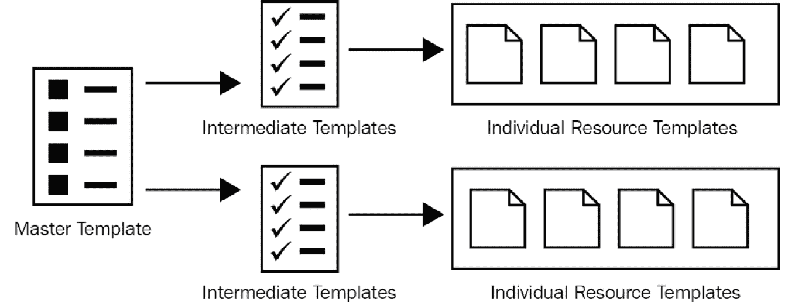
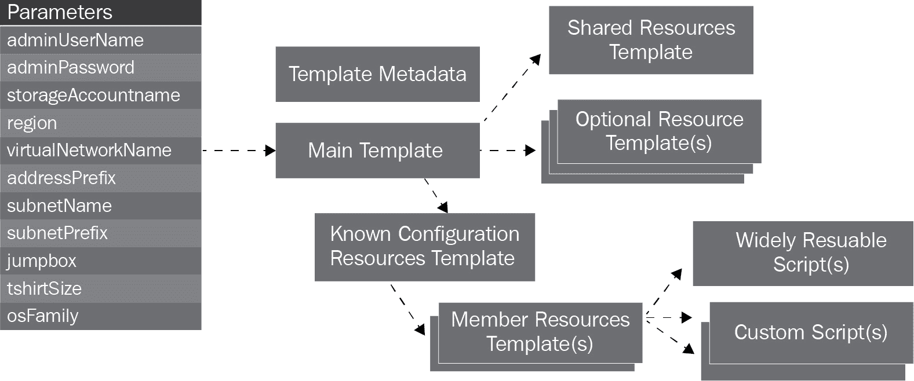
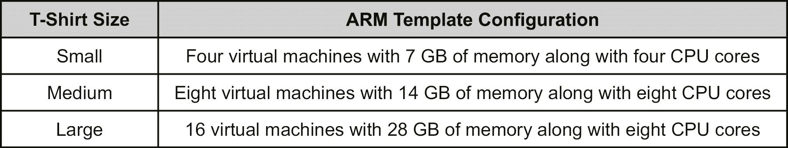
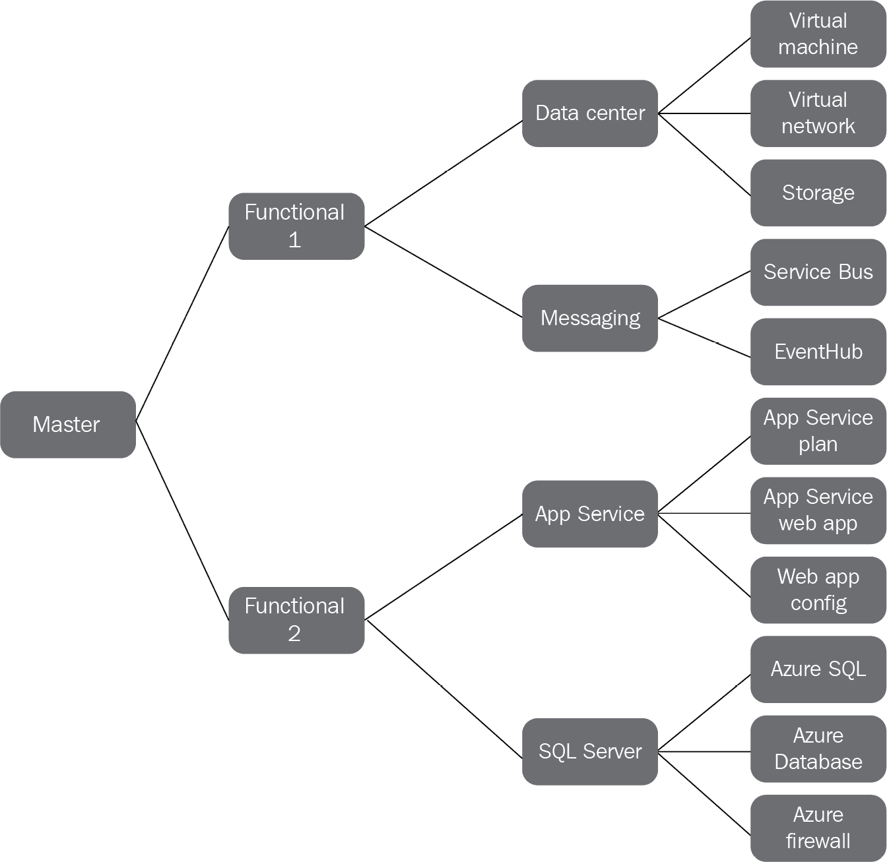

# 第十六章：16. ARM 模板的模块化设计与实现

我们知道，有多种方法可以编写**Azure 资源管理器**（**ARM**）模板。使用 Visual Studio 和 Visual Studio Code 编写一个能够在 Azure 中配置所有必要资源的模板是相当容易的。一个单独的 ARM 模板可以包含 Azure 上解决方案所需的所有资源。这个单一的 ARM 模板可以小到仅几个资源，或者大到包含许多资源的模板。

尽管编写一个包含所有资源的单一模板非常具有诱惑力，但建议事先规划将 ARM 模板实现分成多个较小的 ARM 模板，以便避免未来与之相关的麻烦。

在本章中，我们将学习如何以模块化的方式编写 ARM 模板，以便它们能够随着时间的推移不断演进，且在变更、测试和部署时所需的参与和努力最小化。

然而，在编写模块化模板之前，最好先了解通过模块化编写模板所解决的问题。

本章将涵盖以下话题：

+   单模板的问题

+   理解嵌套和链接部署

+   链接模板

+   嵌套模板

+   自由流配置

+   已知配置

现在，让我们详细探讨上述话题，这将帮助您使用行业最佳实践编写模块化模板。

## 单模板方法的问题

表面上看，单个包含所有资源的大模板似乎不会有什么问题，但将来可能会出现一些问题。让我们讨论使用单个大模板时可能会遇到的问题。

### 更改模板时灵活性降低

使用包含所有资源的单个大模板使得将来进行更改变得困难。将所有依赖项、参数和变量都放在一个模板中，与较小的模板相比，更改模板可能需要花费大量时间。这些更改可能会影响模板的其他部分，且可能会被忽视，甚至引入错误。

### 排查大模板问题

大模板难以排查。这是一个已知的事实。模板中的资源数量越多，排查模板的问题就越困难。一个模板部署了所有资源，找到错误通常需要反复部署模板。开发人员在等待模板部署完成时会降低生产力。

此外，部署单个模板比部署较小的模板更加耗时。开发人员必须等待包含错误的资源部署完成后，才能采取任何行动。

### 依赖滥用

在较大的模板中，资源之间的依赖关系也往往变得更加复杂。由于 ARM 模板的工作方式，滥用 `dependsOn` 功能是很容易的。模板中的每个资源可以引用它之前的所有资源，而不是构建依赖关系树。ARM 模板在一个资源依赖于所有其他资源时并不会报错，尽管这些其他资源之间可能有相互依赖关系。这使得更改 ARM 模板容易引入 bug，有时甚至无法进行更改。

### 降低敏捷性

通常，一个项目中有多个团队，每个团队负责其在 Azure 中的资源。这些团队会发现很难使用单一 ARM 模板，因为应该由单个开发人员来更新这些模板。多个团队同时更新一个模板可能会导致冲突和难以解决的合并问题。拥有多个小模板可以使每个团队独立编写自己的 ARM 模板部分。

### 无法重用

如果你只有一个模板，那么你只能使用这个模板，并且使用这个模板意味着部署所有资源。没有办法直接选择单个资源，除非进行一些额外操作，比如添加条件资源。单一的大模板失去了重用性，因为你只能选择所有资源或没有资源。

了解单一大模板存在的诸多问题后，编写模块化模板是一种好习惯，这样我们可以获得以下好处：

+   多个团队可以在隔离的环境中独立工作各自的模板。

+   模板可以跨项目和解决方案重复使用。

+   模板易于调试和故障排除。

既然我们已经讨论了单一大模板的一些问题，接下来我们将探讨模块化模板的核心，并且它们如何帮助开发人员实现高效部署。

## 理解单一职责原则

**单一职责原则**是 SOLID 设计原则中的核心原则之一。它指出，一个类或代码段应该只负责单一功能，并且应完全拥有该功能。代码只有在当前功能发生功能变化或出现 bug 时才应发生更改或演变，而不是因为与当前组件无关的其他组件或代码的变化而改变。

将相同的原则应用于 ARM 模板有助于我们创建仅负责部署单一资源或功能的模板，而不是部署所有资源和完整解决方案。

使用这一原则将帮助你创建多个模板，每个模板负责一个单一资源或一小部分资源，而不是所有资源。

### 更快的故障排除和调试

每个模板的部署在 Azure 中都是一个独立的活动，是由输入、输出和日志组成的单独实例。当多个模板被部署来实现一个解决方案时，每个模板的部署都有独立的日志条目以及其输入和输出描述。与单个大型模板相比，使用来自多个部署的独立日志来隔离错误和排除故障要容易得多。

### 模块化模板

当一个单一的大型模板被拆解成多个模板，每个小模板负责自己的资源，而这些资源仅由包含它的模板拥有、维护并负责时，我们可以说这是模块化模板。每个模板都遵循单一职责原则。

在学习如何将一个大型模板拆分为多个小型可重用模板之前，理解创建小型模板背后的技术以及如何组合它们来部署完整解决方案是非常重要的。

### 部署资源

ARM 提供了一种链接模板的功能。尽管我们已经详细讲解了链接模板，但我还是在这里提一下，以帮助你理解链接模板如何帮助我们实现模块化、组合和重用。

ARM 模板提供了专门的资源，称为 `Microsoft.Resources` 命名空间。ARM 模板中的部署资源看起来非常类似于以下的代码片段：

```
"resources": [  {      "apiVersion": "2019-10-01",      "name": "linkedTemplate",      "type": "Microsoft.Resources/deployments",      "properties": {          "mode": "Incremental",          <nested-template-or-external-template>      }  }]
```

这个模板不言自明，模板资源中最重要的两个配置项是类型和属性。这里的类型指的是部署资源，而不是任何特定的 Azure 资源（如存储、虚拟机等），属性则指定了部署配置，包括链接模板部署或嵌套模板部署。

然而，部署资源的作用是什么呢？部署资源的工作是部署另一个模板。另一个模板可以是一个独立的外部模板，位于一个单独的 ARM 模板文件中，也可以是一个嵌套模板。这意味着可以像函数调用一样，从一个模板中调用其他模板。

ARM 模板中可以有嵌套级别的部署。这意味着一个模板可以调用另一个模板，而被调用的模板又可以调用另一个模板，这样的嵌套调用最多可以有五个级别：



###### 图 16.1：模板拆分成更小的模板

现在我们已经理解了大型模板可以通过将资源分布在不同的模板中实现模块化，我们需要将它们链接在一起，以便在 Azure 上部署资源。链接模板和嵌套模板是将多个模板组合在一起的方式。

## 链接模板

链接模板是调用外部模板的模板。外部模板存储在不同的 ARM 模板文件中。以下是链接模板的示例：

```
"resources": [  {     "apiVersion": "2019-10-01",     "name": "linkedTemplate",     "type": "Microsoft.Resources/deployments",     "properties": {       "mode": "Incremental",       "templateLink": {         "uri":"https://mystorageaccount.blob.core.windows.net/AzureTemplates/newStorageAccount.json",          "contentVersion":"1.0.0.0"       },       "parametersLink": {         "uri":"https://mystorageaccount.blob.core.windows.net/AzureTemplates/newStorageAccount.parameters.json",          "contentVersion":"1.0.0.0"       }     }  }]
```

相较于前一个模板，这个模板中重要的额外属性是`templateLink`和`parametersLink`。现在，`templateLink`指向外部模板文件的实际 URL，而`parametersLink`是相应`parameters`文件的 URL 位置。需要注意的是，调用模板应该有访问被调用模板位置的权限。例如，如果外部模板存储在 Azure Blob 存储中，并且该存储受到密钥保护，则调用模板必须能够使用适当的**安全访问签名**（**SAS**）密钥才能访问链接的模板。

也可以提供显式的内联参数，而不是`parametersLink`值，如下所示：

```
"resources": [  {     "apiVersion": "2019-10-01",     "name": "linkedTemplate",     "type": "Microsoft.Resources/deployments",     "properties": {       "mode": "Incremental",       "templateLink": {         "uri":"https://mystorageaccount.blob.core.windows.net/AzureTemplates/newStorageAccount.json",          "contentVersion":"1.0.0.0"       },       "parameters": {          "StorageAccountName":{"value": "                              [parameters('StorageAccountName')]"}        }     }  }]
```

现在你对链接模板有了较好的理解。一个紧密相关的话题是嵌套模板，下一节将详细讨论这一点。

## 嵌套模板

相较于外部链接模板，嵌套模板是 ARM 模板中的一个相对较新的功能。

嵌套模板不会在外部文件中定义资源。资源是在调用模板本身和部署资源中定义的，如下所示：

```
"resources": [  {    "apiVersion": "2019-10-01",    "name": "nestedTemplate",    "type": "Microsoft.Resources/deployments",    "properties": {      "mode": "Incremental",      "template": {        "$schema": "https://schema.management.azure.com/schemas/2015-              01-01/deploymentTemplate.json#",        "contentVersion": "1.0.0.0",        "resources": [          {            "type": "Microsoft.Storage/storageAccounts",            "name": "[variables('storageName')]",            "apiVersion": "2019-04-01",            "location": "West US",            "properties": {              "accountType": "Standard_LRS"            }          }        ]      }    }  }]
```

在这个代码段中，我们可以看到存储账户资源被嵌套在原始模板内，作为部署资源的一部分。与使用`templateLink`和`parametersLink`属性不同，这里使用`resources`数组作为单个部署的一部分来创建多个资源。使用嵌套部署的优势是，可以通过使用资源的名称来重新配置父级内的资源。通常，一个带有名称的资源在模板中只能存在一次。嵌套模板允许我们在同一个模板内使用它们，并确保所有模板都是自给自足的，而不是分别存储，并且这些模板可能或可能无法访问外部文件。

现在我们了解了模块化 ARM 模板背后的技术，应该如何将一个大型模板分解为更小的模板呢？

有多种方式可以将一个大型模板分解成更小的模板。微软推荐以下模式用于 ARM 模板的分解：



###### 图 16.2：模板分解策略

当我们将一个大型模板分解成更小的模板时，总是会有一个主模板，用于部署解决方案。这个主模板或母模板内部调用其他嵌套或链接的模板，这些模板又会调用其他模板，最终，包含 Azure 资源的模板会被部署。

主模板可以调用已知配置资源模板，后者又会调用包含 Azure 资源的模板。已知配置资源模板是特定于项目或解决方案的，且与之相关的可重用因素较少。成员资源模板是由已知配置资源模板调用的可重用模板。

如果需要，主模板可以调用共享资源模板和其他资源模板（如果它们存在）。

理解已知配置非常重要。模板可以作为已知配置或自由流配置来编写。

## 自由流配置

ARM 模板可以作为通用模板进行编写，其中大多数（如果不是全部）分配给变量的值都作为参数获取。这允许使用该模板的人传递他们认为必要的任何值来在 Azure 中部署资源。例如，部署模板的人可以选择任何大小的虚拟机、任何数量的虚拟机以及任何存储和网络配置。这被称为自由流配置，其中大多数配置是允许的，模板中的配置来自用户，而不是声明在模板内部。

这种配置方式有其挑战性。最大的问题是，并非所有配置都能在每个 Azure 区域和数据中心中得到支持。如果某些资源不允许在特定位置或区域创建，那么模板将无法创建这些资源。自由流配置的另一个问题是，用户可以提供他们认为必要的任何值，模板会尊重这些值，从而增加了成本和部署的负担，即使这些值并不是完全必需的。

## 已知配置

另一方面，已知配置是通过 ARM 模板部署环境的特定预设配置。这些预设配置被称为**T 恤尺码配置**。类似于 T 恤有小号、中号和大号等预设尺码，ARM 模板也可以预配置为部署小型、中型或大型环境，具体取决于需求。这意味着用户不能为环境选择任何随机的自定义尺寸，但可以从提供的选项中进行选择，并且在运行时执行的 ARM 模板将确保提供合适的环境配置。

因此，创建模块化 ARM 模板的第一步是决定环境的已知配置。

例如，以下是 Azure 上数据中心部署的配置：



###### 表 16.1：Azure 上数据中心部署的配置

现在我们了解了这些配置，就可以创建模块化 ARM 模板了。

编写模块化 ARM 模板有两种方法：

+   **组合模板**：组合模板链接到其他模板。组合模板的示例包括主模板和中间模板。

+   **叶级模板**：叶级模板是包含单一 Azure 资源的模板。

ARM 模板可以根据以下内容分为模块化模板：

+   技术

+   功能

决定如何编写 ARM 模板的模块化方法的理想方式如下：

+   定义资源级或叶级模板，这些模板由单一资源组成。在接下来的图示中，最右侧的模板是叶级模板。在图中，虚拟机、虚拟网络、存储等位于同一列中，表示叶级模板。

+   使用叶级模板组合特定于环境的模板。这些特定于环境的模板提供了一个 Azure 环境，例如 SQL Server 环境、App Service 环境或数据中心环境。我们进一步探讨一下这个话题。以 Azure SQL 环境为例。要创建一个 Azure SQL 环境，需要多个资源。至少需要一个逻辑 SQL Server，一个 SQL 数据库和一些 SQL 防火墙资源。所有这些资源都在叶级模板中定义。这些资源可以组合在一起，形成一个单一的模板，从而能够创建 Azure SQL 环境。任何想要创建 SQL 环境的人都可以使用这个组合模板。*图 16.3*中有**数据中心**、**消息传递**和**App Service**作为特定于环境的模板。

+   创建具有更高抽象层次的模板，将多个特定于环境的模板组合成解决方案。这些模板是由前一步创建的特定于环境的模板组成的。例如，要创建一个需要 App Service 环境和 SQL 环境的电子商务库存解决方案，可以将两个环境模板——App Service 和 SQL Server 组合在一起。*图 16.3*中包含了**功能 1**和**功能 2**模板，这些模板是由子模板组成的。

+   最后，应该创建一个主模板，它由多个模板组成，每个模板都能够部署一个解决方案。

上述创建模块化设计模板的步骤，可以通过*图 16.3*轻松理解：



###### 图 16.3：模板和资源映射

现在，我们将实现上图所示的部分功能。在此实现中，我们将通过模块化的方法为虚拟机提供脚本扩展。自定义脚本扩展部署 Docker 二进制文件，并在 Windows Server 2016 虚拟机上准备一个容器环境。

现在，我们将使用模块化方法通过 ARM 模板创建一个解决方案。如前所述，第一步是创建单独的资源模板。这些单独的资源模板将用于组合成能够创建环境的其他模板。这些模板将用于创建虚拟机。所有此处展示的 ARM 模板都可以在随书章节代码中找到。这些模板的名称和代码如下：

+   `Storage.json`

+   `virtualNetwork.json`

+   `PublicIPAddress.json`

+   `NIC.json`

+   `VirtualMachine.json`

+   `CustomScriptExtension.json`

首先，让我们看看 `Storage.json` 模板的代码。此模板提供了一个存储帐户，每个虚拟机都需要它来存储操作系统和数据磁盘文件：

```

{    "$schema": "https://schema.management.azure.com/schemas/2015-01-01/deploymentTemplate.json#",    "contentVersion": "1.0.0.0",  "parameters": {    "storageAccountName": {      "type": "string",      "minLength": 1     },    "storageType": {      "type": "string",      "minLength": 1     },   ...  "outputs": {    "resourceDetails": {      "type": "object",      "value": "[reference(parameters('storageAccountName'))]"    }  }}
```

接下来，让我们看看公共 IP 地址模板的代码。一个需要通过互联网访问的虚拟机需要将公共 IP 地址资源分配给其网络接口卡。尽管将虚拟机暴露到互联网是可选的，但该资源可能会在创建虚拟机时使用。以下代码位于 `PublicIPAddress.json` 文件中：

```
{    "$schema": "https://schema.management.azure.com/schemas/2015-01-01/deploymentTemplate.json#",    "contentVersion": "1.0.0.0",  "parameters": {    "publicIPAddressName": {      "type": "string",      "minLength": 1     },    "publicIPAddressType": {      "type": "string",      "minLength": 1    ...      }    }  ],  "outputs": {    "resourceDetails": {      "type": "object",      "value": "[reference(parameters('publicIPAddressName'))]"    }  }}
```

接下来，让我们看看虚拟网络的代码。Azure 上的虚拟机需要虚拟网络进行通信。此模板将用于在 Azure 上创建一个虚拟网络，具有预定义的地址范围和子网。以下代码位于 `virtualNetwork.json` 文件中：

```
{    "$schema": "https://schema.management.azure.com/schemas/2015-01-01/deploymentTemplate.json#",    "contentVersion": "1.0.0.0",  "parameters": {    "virtualNetworkName": {      "type": "string",      "minLength": 1  ...    },    "subnetPrefix": {      "type": "string",      "minLength": 1     },    "resourceLocation": {      "type": "string",      "minLength": 1     } ...        "subnets": [          {            "name": "[parameters('subnetName')]",            "properties": {              "addressPrefix": "[parameters('subnetPrefix')]"            }          }        ]      }    }  ],  "outputs": {    "resourceDetails": {      "type": "object",      "value": "[reference(parameters('virtualNetworkName'))]"    }  }}
```

接下来，让我们看看网络接口卡的代码。虚拟机需要一个虚拟网络卡来连接虚拟网络，并接收和发送来自互联网的请求。以下代码位于 `NIC.json` 文件中：

```
{    "$schema": "https://schema.management.azure.com/schemas/2015-01-01/deploymentTemplate.json#",    "contentVersion": "1.0.0.0",  "parameters": {    "nicName": {      "type": "string",      "minLength": 1     },    "publicIpReference": {      "type": "string",      "minLength": 1  ...[resourceId(subscription().subscriptionId,resourceGroup().name, 'Microsoft.Network/publicIPAddresses', parameters('publicIpReference'))]",    "vnetRef": "[resourceId(subscription().subscriptionId,resourceGroup().name, 'Microsoft.Network/virtualNetworks', parameters('virtualNetworkReference'))]",    "subnet1Ref": "[concat(variables('vnetRef'),'/subnets/', parameters('subnetReference'))]"  }, ...                "id": "[variables('subnet1Ref')]"              }            }          }        ]      }    }  ],  "outputs": {    "resourceDetails": {      "type": "object",      "value": "[reference(parameters('nicName'))]"    }  }}
```

接下来，让我们看看创建虚拟机的代码。每个虚拟机都是 Azure 中的一个资源，并且请注意，此模板与存储、网络、公共 IP 地址或之前创建的其他资源没有关联。这个引用和组合将在本节稍后通过另一个模板完成。以下代码位于 `VirtualMachine.json` 文件中：

```
{  "$schema": "https://schema.management.azure.com/schemas/2015-01 01/deploymentTemplate.json#",  "contentVersion": "1.0.0.0",  "parameters": {    "vmName": {      "type": "string",      "minLength": 1    ...    },    "imageOffer": {      "type": "string",      "minLength": 1     },    "windowsOSVersion": {      "type": "string",      "minLength": 1     },   ...  "outputs": {    "resourceDetails": {      "type": "object",      "value": "[reference(parameters('vmName'))]"    }  }
}
```

接下来，让我们看看创建自定义脚本扩展的代码。此资源在虚拟机配置后执行 PowerShell 脚本。此资源提供了在 Azure 虚拟机中执行后配置任务的机会。以下代码位于 `CustomScriptExtension.json` 文件中：

```
{    "$schema": "http://schema.management.azure.com/schemas/2015-01-01/deploymentTemplate.json#",    "contentVersion": "1.0.0.0",    "parameters": {      "VMName": {        "type": "string",        "defaultValue": "sqldock",        "metadata": {...            "commandToExecute": "[concat('powershell -ExecutionPolicy Unrestricted -file docker.ps1')]"          },          "protectedSettings": {          }        }      }    ],    "outputs": {    }}
```

接下来，我们将查看准备 Docker 环境的自定义脚本扩展 PowerShell 代码。请注意，在执行 PowerShell 脚本时，可能会发生虚拟机重启，具体取决于 Windows 容器功能是否已经安装。以下脚本安装了 NuGet 包、`DockerMsftProvider` 提供程序和 Docker 可执行文件。`docker.ps1` 文件随章节代码提供：

```
## docker.ps1 #Install-PackageProvider -Name Nuget -Force -ForceBootstrap -Confirm:$false Install-Module -Name DockerMsftProvider -Repository PSGallery -Force -Confirm:$false -verboseInstall-Package -Name docker -ProviderName DockerMsftProvider -Force -ForceBootstrap -Confirm:$false
```

所有之前看到的链接模板应上传到 Azure Blob 存储帐户中的一个容器内。该容器可以应用私有访问策略，正如你在上一章中看到的那样；然而，在此示例中，我们将访问策略设置为 `container`。这意味着这些链接模板可以在没有 SAS 令牌的情况下访问。

最后，让我们集中讨论编写主模板。在主模板中，所有的链接模板将被组合在一起，创建一个解决方案——部署虚拟机并在其中执行脚本。相同的方法也可以用于创建其他解决方案，比如提供一个由多个相互连接的虚拟机组成的数据中心。以下代码可以在 `Master.json` 文件中找到：

```
{    "$schema": "https://schema.management.azure.com/schemas/2015-01-01/deploymentTemplate.json#",    "contentVersion": "1.0.0.0",  "parameters": {    "storageAccountName": {      "type": "string",      "minLength": 1    ...    },    "subnetName": {      "type": "string",      "minLength": 1     },    "subnetPrefix": {      "type": "string",      "minLength": 1   ...    "windowsOSVersion": {      "type": "string",      "minLength": 1     },    "vhdStorageName": {      "type": "string",      "minLength": 1     },    "vhdStorageContainerName": {      "type": "string",      "minLength": 1    ...[concat('https://',parameters('storageAccountName'),'armtfiles.blob.core.windows.net/',variables('containerName'),'/Storage.json')]",          "contentVersion": "1.0.0.0"        },        "parameters": {          "storageAccountName": {            "value": "[parameters('storageAccountName')]"          },          "storageType": {            "value": "[parameters('storageType')]"          },          "resourceLocation": {            "value": "[resourceGroup().location]"      ...  "outputs": {    "resourceDetails": {      "type": "object",      "value": "[reference('GetVM').outputs.resourceDetails.value]" } }}
```

主模板调用外部模板，并协调它们之间的相互依赖关系。

外部模板应存放在一个众所周知的位置，以便主模板可以访问并调用它们。在此示例中，外部模板存储在 Azure Blob 存储容器中，并通过参数将此信息传递给 ARM 模板。

存储在 Azure Blob 存储中的外部模板可以通过设置访问策略来进行访问保护。用于部署主模板的命令如下所示。它可能看起来是一个复杂的命令，但大多数值是作为参数使用的。在运行命令之前，建议你更改这些参数的值。已将链接模板上传到名为 `st02gvwldcxm5suwe` 的存储帐户中的 `armtemplates` 容器。如果资源组当前不存在，应先创建资源组。第一个命令用于在 `West Europe` 区域创建一个新的资源组：

```
New-AzResourceGroup -Name "testvmrg" -Location "West Europe" -Verbose
```

剩余的参数值是配置每个资源所需的。存储帐户名称和 `dnsNameForPublicIP` 值在 Azure 中应是唯一的：

```
New-AzResourceGroupDeployment -Name "testdeploy1" -ResourceGroupName testvmrg -Mode Incremental -TemplateFile "C:\chapter 05\Master.json" -storageAccountName "st02gvwldcxm5suwe" -storageType "Standard_LRS" -publicIPAddressName "uniipaddname" -publicIPAddressType "Dynamic" -dnsNameForPublicIP "azureforarchitectsbook" -virtualNetworkName vnetwork01 -addressPrefix "10.0.1.0/16" -subnetName "subnet01" -subnetPrefix "10.0.1.0/24" -nicName nic02 -vmSize "Standard_DS1" -adminUsername "sysadmin" -adminPassword $(ConvertTo-SecureString -String sysadmin@123 -AsPlainText -Force) -vhdStorageName oddnewuniqueacc -vhdStorageContainerName vhds -OSDiskName mynewvm -vmName vm10 -windowsOSVersion 2012-R2-Datacenter -imagePublisher MicrosoftWindowsServer -imageOffer WindowsServer -containerName armtemplates -Verbose
```

本节中，我们介绍了将大型模板拆分为较小的可重用模板的最佳实践，并在运行时将它们组合在一起，以便在 Azure 上部署完整的解决方案。在书中的后续章节中，我们将逐步修改 ARM 模板，直到探索其核心部分。我们使用了 Azure PowerShell cmdlet 来启动模板在 Azure 上的部署。

让我们继续讨论 `copy` 和 `copyIndex` 的话题。

## 理解 `copy` 和 `copyIndex`

有许多情况下需要多个实例的特定资源或资源组。例如，你可能需要配置 10 个相同类型的虚拟机。在这种情况下，反复部署模板来创建这些实例并不可取。更好的替代方法是使用 ARM 模板中的 `copy` 和 `copyIndex` 功能。

`copy` 是每个资源定义的一个属性。这意味着它可以用于创建某种资源类型的多个实例。

让我们通过一个在单个 ARM 模板部署中创建多个存储帐户的示例来理解这一点。

下一个代码片段按顺序创建了 10 个存储帐户。它们本可以通过将 `mode` 属性设置为 `Parallel` 来并行创建，而不是 `Serial`：

```
"resources": [
      {
          "apiVersion": "2019-06-01",
          "type": "Microsoft.Storage/storageAccounts",
          "location": "[resourceGroup().location]",
          "name": "[concat(variables('storageAccountName'), copyIndex())]",
          "tags":{
              "displayName": "[variables('storageAccountName')]"
          },
          "sku":{
              "name":"Premium_ZRS"
          },
          "kind": "StorageV2",
          "copy":{
              "name": "storageInstances",
              "count": 10,
              "mode": "Serial"
          }        
      }  
    ],
```

在前面的代码中，`copy` 用于按顺序创建 10 个存储帐户实例，即一个接一个地创建。所有 10 个实例的存储帐户名称必须是唯一的，`copyIndex` 被用来通过将原始存储名称与索引值连接起来使它们唯一。`copyIndex` 函数返回的值在每次迭代时都会变化；它从 0 开始，并持续 10 次迭代。这意味着它在最后一次迭代时会返回 `9`。

现在我们已经了解了如何创建多个 ARM 模板实例，接下来我们将深入探讨如何保护这些模板免受已知的安全漏洞。

## 保护 ARM 模板

与创建企业 ARM 模板相关的另一个重要方面是对其进行适当的安全保护。ARM 模板包含资源配置和基础设施的关键信息，因此它们不应被破坏或被未经授权的人访问。

保护 ARM 模板的第一步是将它们存储在存储帐户中，并停止对存储帐户容器的任何匿名访问。此外，应该为存储帐户生成 SAS 令牌，并在 ARM 模板中使用这些令牌来调用链接的模板。这将确保只有持有 SAS 令牌的人才能访问这些模板。此外，这些 SAS 令牌应该存储在 Azure Key Vault 中，而不是硬编码到 ARM 模板中。这样可以确保即使是负责部署的人也无法访问 SAS 令牌。

保护 ARM 模板的另一个步骤是确保任何敏感信息和机密，如数据库连接字符串、Azure 订阅和租户标识符、服务主体标识符、IP 地址等，不应硬编码到 ARM 模板中。它们应全部作为参数，并且值应在运行时从 Azure Key Vault 中提取。然而，在使用这种方法之前，确保这些机密已经在 Key Vault 中存储好，是非常重要的。

以下代码展示了在运行时使用参数文件从 Azure Key Vault 中提取值的方式之一：

```
{    "$schema": https://schema.management.azure.com/schemas/2016-01-01/deploymentParameters.json#,    "contentVersion": "1.0.0.0",    "parameters": {        "storageAccountName": {            "reference": {                "keyVault": {                    "id": "/subscriptions/--subscription id --/resourceGroups/rgname/providers/Microsoft.KeyVault/vaults/keyvaultbook"),                "secretName": "StorageAccountName"                }            }        }    }}
```

在这个代码示例中，定义了一个参数，用于引用 Azure Key Vault，以便在部署过程中运行时获取值。Azure Key Vault 的标识符和秘密名称已作为输入值提供。

现在您已经了解了如何保护 ARM 模板，接下来我们来看看如何识别它们之间的各种依赖关系，以及如何启用多个模板之间的通信。

## 在 ARM 模板之间使用输出

使用链接模板时，一个容易被忽视的重要方面是可能会存在资源依赖性。例如，SQL Server 资源可能位于与虚拟机资源不同的链接模板中。如果我们希望为虚拟机 IP 地址打开 SQL Server 防火墙，那么在配置虚拟机后，我们应该能够将此信息动态传递给 SQL Server 防火墙资源。

如果 SQL Server 和虚拟机资源在同一个模板中，可以通过使用`REFERENCES`函数简单地引用 IP 地址资源来实现此功能。

如果我们希望在不同模板之间共享运行时属性值，那么在链接模板的情况下，情况会稍微复杂一些。

ARM 模板提供了`outputs`配置，它负责从当前模板部署生成输出并将其返回给用户。例如，我们可以使用`reference`函数输出一个完整的对象，如下所示，或者我们也可以仅输出一个 IP 地址作为字符串值：

```
"outputs": {
    "storageAccountDetails": {
        "type": "object",
        "value": "[reference(resourceid             ('Microsoft.Storage/storageAccounts',             variables('storageAccountName')))]",
    "virtualMachineIPAddress": {
        "type": "string",
        "value": "[reference(variables             ('publicIPAddressName')).properties.ipAddress]"
        }
    }
}
```

链接模板中的参数可以被主模板利用。当调用链接模板时，输出将可供主模板使用，并可以作为参数传递给下一个链接模板或嵌套模板。通过这种方式，能够将资源的运行时配置值从一个模板传递到另一个模板。

主模板中的代码将类似于这里所展示的代码；这是用于调用第一个模板的代码：

```
{    "type": "Microsoft.Resources/deployments",     "apiVersion": "2017-05-10",     "name": "createvm",     "resoureceGroup": "myrg",     "dependsOn": [        "allResourceGroups"    ],    "properties":{        "mode": "Incremental",        "templateLink":{            "uri": "[variables(                'templateRefSharedServicesTemplateUri')]",            "contentVersion": "1.0.0.0"        },        "parameters": {            "VMName": {                "value": "[variables('VmName')]"            }        }    }}
```

前面的代码片段来自主模板，它调用了一个负责配置虚拟机的嵌套模板。该嵌套模板有一个输出部分，提供虚拟机的 IP 地址。主模板将在其模板中包含另一个部署资源，该资源将获取输出值并在运行时将其作为参数传递给下一个嵌套模板，从而传递 IP 地址。如下所示：

```
{    "type": "Microsoft,Resources/deployments",    "apiVersion": "2017-05-10",    "name": "createSQLServer",    "resourceGroup": "myrg",    "dependsOn": [        "createvm"    ],    "properties": {        "mode": "Incremental",        "templateLink": {            "uri": "[variables('templateRefsql')]",            "contentVersion": "1.0.0.0"        },        "parameters": {            "VMName": {                "value": "[reference ('createvm').outputs.virtualMachineIPAddress.value]"            }        }    }}
```

在前面的代码列表中，调用了一个嵌套模板，并且一个参数被传递给它。这个参数的值来自前一个链接模板的输出，该输出被命名为`virtualMachineIPAddress`。现在，嵌套模板将动态获取虚拟机的 IP 地址，并可以将其用作白名单中的 IP 地址。

使用这种方法，我们可以将运行时值从一个嵌套模板传递到另一个嵌套模板。

## 总结

ARM 模板是 Azure 中首选的资源配置方式。它们具有幂等性，为环境创建带来了一致性、可预测性和可重用性。在本章中，我们探讨了如何创建一个模块化的 ARM 模板。对于团队来说，花时间以适当的方式设计 ARM 模板非常重要，这样多个团队可以共同协作。ARM 模板具有高度的可重用性，并且只需最小的修改即可发展。在本章中，我们学习了如何创建具有安全设计的模板，如何在单次部署中配置多个资源实例，以及如何通过 ARM 模板的 outputs 部分将输出从一个嵌套模板传递到另一个模板。

下一章将转向 Azure 中另一种非常流行的技术——无服务器架构。Azure Functions 是 Azure 的主要无服务器资源之一，接下来我们将对其进行深入探讨，包括 Durable Functions（持久化函数）。
