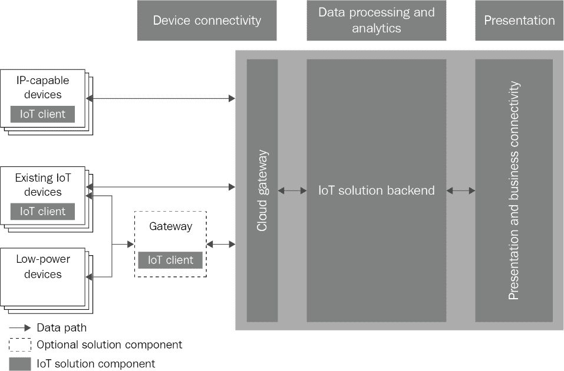
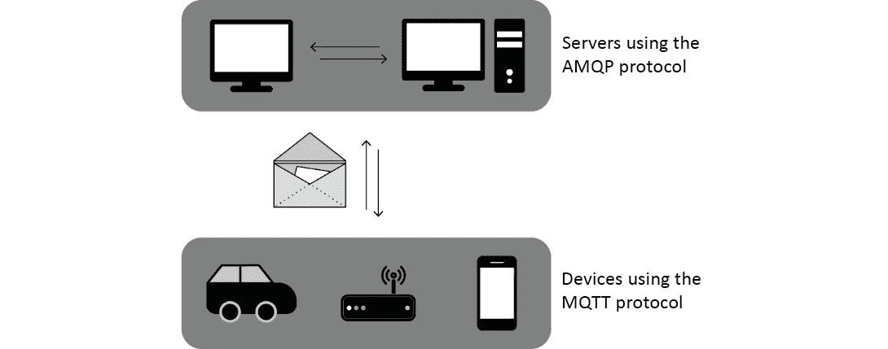
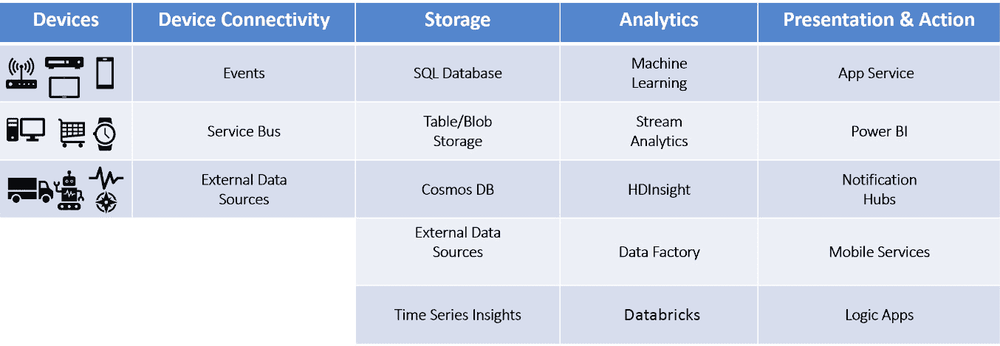
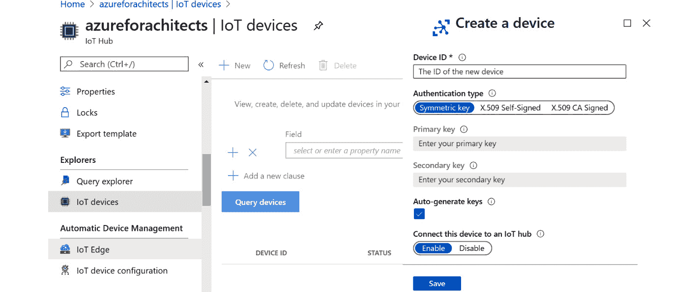
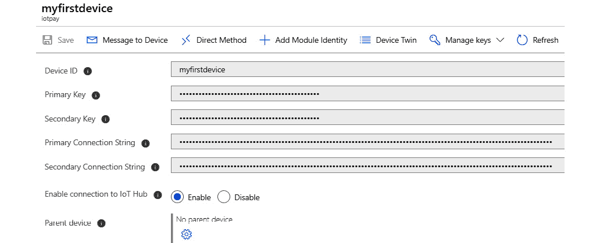
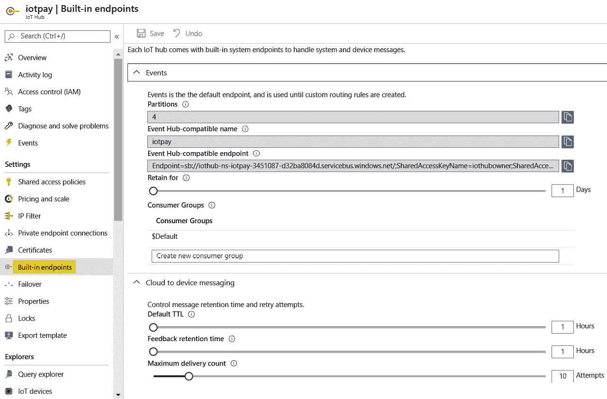
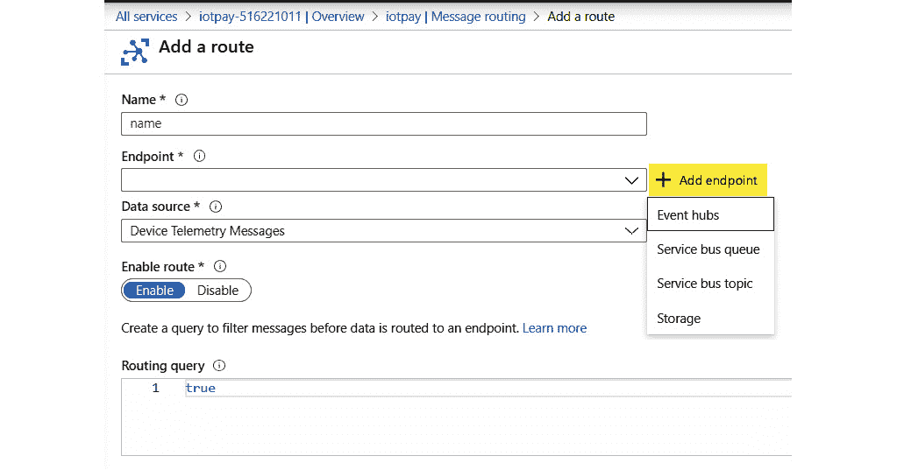
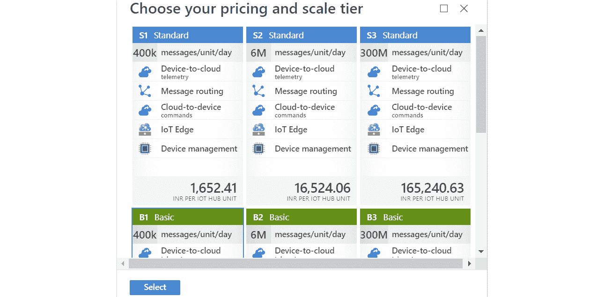
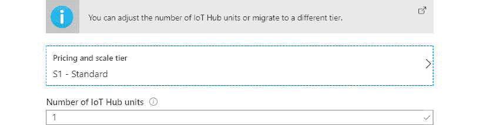
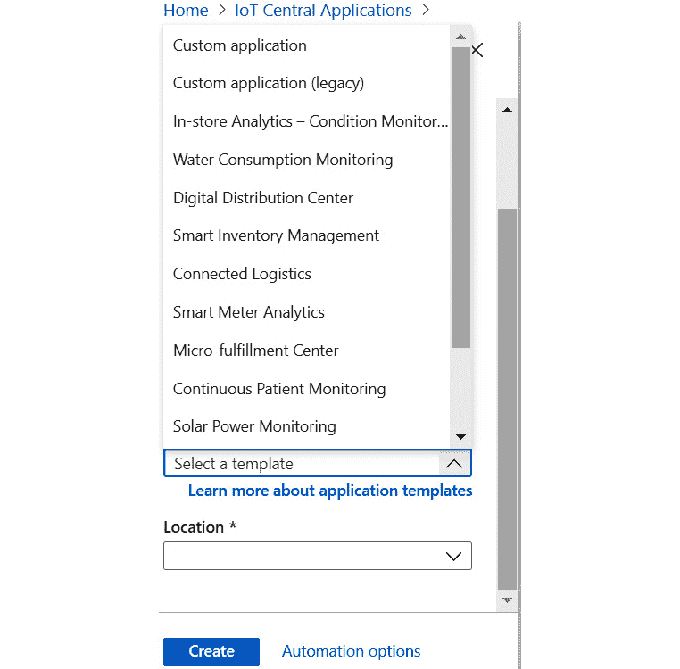

在上一章中，你学习了 ARM 模板，到目前为止，我们一直在处理 Azure 中的架构问题及其解决方案。然而，本章并非基于通用的架构。事实上，它探讨了本世纪最具颠覆性的技术之一。本章将讨论**物联网**（**IoT**）和 Azure 的细节。

Azure 物联网指的是一组由微软管理的云服务，这些服务可以连接、监控和控制数十亿个物联网资产。换句话说，物联网解决方案包括一个或多个物联网设备，这些设备会不断与云端的一台或多台后端服务器进行通信。

本章将涵盖以下主题：

+   Azure 与物联网

+   Azure 物联网概述

+   设备管理

+   注册设备

+   设备与物联网中心的通信

+   扩展物联网解决方案

+   IoT 解决方案的高可用性

+   物联网协议

+   使用消息属性路由消息

## 第十七章：物联网（IoT）

互联网是在 1980 年代发明的，随后逐渐变得普及。几乎每个人都开始在互联网上建立自己的存在，并开始创建自己的静态网页。最终，静态内容变得动态，可以根据上下文即时生成。在几乎所有的情况下，都需要一个浏览器才能访问互联网。当时有大量的浏览器可供选择，没有它们，使用互联网将变得困难重重。

在本世纪的第一个十年中，出现了一个有趣的发展——手持设备的兴起，如手机和平板电脑。手机开始变得更加便宜，并且无处不在。这些手持设备的硬件和软件能力得到了显著提高，甚至人们开始使用手机浏览器而非桌面浏览器。但一个特别明显的变化是移动应用的兴起。这些移动应用从商店下载，并通过互联网连接到后端系统。在上个十年末期，市场上涌现了数百万个应用，几乎每一种可想象的功能都被内置其中。这些应用的后端系统建立在云上，以便快速扩展。这是应用程序与服务器连接的时代。

但这就是创新的巅峰吗？互联网的下一个发展是什么？实际上，另一个范式现在正逐步成为主流：物联网。与仅有移动设备和平板设备连接互联网不同，为什么其他设备不能连接互联网呢？过去，这类设备仅在特定市场中可用；它们昂贵，难以普及，且硬件和软件功能有限。然而，自本十年初以来，这些设备的商业化正在大规模发展。这些设备变得越来越小，硬件和软件能力更强，存储和计算能力更大，可以通过多种协议连接互联网，并且几乎可以附加到任何物体上。这是连接设备到服务器、应用程序和其他设备的时代。

这促使了一个观点的形成，即物联网应用可以改变各行业的运作方式。以前闻所未闻的全新解决方案现在开始得以实现。现在，这些设备可以连接到任何东西；它们可以获取信息并将其发送到后端系统，后端系统能够从所有设备中整合信息，并对其采取行动或报告事件。

物联网传感器和控制设备可以在许多商业应用场景中得到利用。例如，它们可以用于车辆追踪系统，这些系统可以追踪车辆的所有重要参数，并将这些数据发送到集中式数据存储进行分析。智能城市计划也可以利用各种传感器来追踪污染水平、温度和街道拥堵情况。物联网还在农业相关活动中找到了应用，比如测量土壤肥力、湿度等。你可以访问 [`microsoft.github.io/techcasestudies/#technology=IoT&sortBy=featured`](https://microsoft.github.io/techcasestudies/#technology=IoT&sortBy=featured) 了解关于组织如何利用 Azure IoT 的真实案例。

在我们探索与物联网相关的工具和服务之前，我们将首先详细介绍物联网架构。

## 物联网架构

在深入了解与物联网相关的 Azure 及其功能和服务之前，了解构建端到端物联网解决方案所需的各种组件非常重要。

想象一下，全球范围内的物联网设备每秒都在向集中数据库发送数百万条消息。为什么要收集这些数据呢？答案是为了提取关于事件、异常和离群值的丰富信息，这些都与这些设备监控的内容相关。

让我们更详细地理解这一点。

物联网架构可以分为以下几个不同的阶段：

1.  **连接性**：此阶段涉及设备与物联网服务之间的连接。

1.  **身份**: 连接到物联网服务后，首先进行设备的识别，并确保它被允许向物联网服务发送设备遥测数据。这通过认证过程完成。

1.  **捕获**: 在这个阶段，设备遥测数据被捕获并被物联网服务接收。

1.  **摄入**: 在这个阶段，物联网服务摄取设备遥测数据。

1.  **存储**: 设备遥测数据被存储。它可以是临时存储或永久存储。

1.  **转换**: 遥测数据被转换以供进一步处理。这包括增加现有数据和推断数据。

1.  **分析**: 转换后的数据用于发现模式、异常和洞见。

1.  **呈现**: 洞见以仪表板和报告的形式展示。此外，还可以生成新的警报，可能会调用自动化脚本和流程。

*图 17.1*展示了一个通用的基于物联网的架构。数据由设备生成或收集，并发送到云网关。云网关将数据发送到多个后端服务进行处理。云网关是可选组件；当设备本身由于资源限制或缺乏可靠网络而无法向后端服务发送请求时，应使用它们。这些云网关可以整合多个设备的数据并将其发送到后端服务。然后，后端服务可以处理数据并向用户显示为洞察或仪表板：

###### 图 17.1：一个通用的物联网应用架构

现在我们清楚了架构，让我们继续了解物联网设备如何与其他设备通信。

### 连通性

物联网设备需要通信以连接到其他设备。有各种各样的连接类型；例如，设备之间可以在一个区域内连接，设备与集中网关之间可以连接，设备与物联网平台之间也可以连接。

在所有这些情况下，物联网设备需要连接能力。这种能力可以是互联网连接、蓝牙、红外线或任何其他近设备通信形式。

然而，一些物联网设备可能无法连接到互联网。在这些情况下，它们可以连接到一个有能力连接到互联网的网关。

物联网设备使用协议发送消息。主要协议包括**高级消息队列协议（AMQP）**和**消息队列遥测传输协议（MQTT）**。

设备数据应发送到 IT 基础设施。MQTT 协议是一种设备到服务器的协议，设备可以使用它将遥测数据和其他信息发送到服务器。一旦服务器通过 MQTT 协议接收到消息，它需要使用基于消息和队列的可靠技术将消息传输到其他服务器。AMQP 是将消息可靠且可预测地传输到 IT 基础设施中其他服务器的首选协议：

###### 图 17.2：MQTT 和 AMQP 协议的工作原理

接收来自物联网设备初始消息的服务器应将这些消息发送到其他服务器进行必要的处理，如保存日志、评估、分析和展示。

一些设备无法连接到互联网，或者不支持与其他服务器技术兼容的协议。为了使这些设备能够与物联网平台和云端协同工作，可以使用中间网关。网关有助于接入那些连接性差、网络能力不稳定的设备；这些设备可能使用非标准的协议，或者它们在资源和功率方面可能有局限。

在这种情况下，当设备需要额外的基础设施来连接到后端服务时，可以部署客户端网关。这些网关接收来自接近设备的消息，并将其转发（或推送）到 IT 基础设施和物联网平台进行进一步处理。这些网关在需要时能够进行协议转换。

在本节中，你了解了如何与其他设备进行通信以及网关在通信中扮演的角色。在下一节中，我们将讨论身份。

### 身份

物联网设备应在云平台上注册。未注册的设备不应允许连接到云平台。设备应注册并分配一个身份。设备在连接云时应发送其身份信息。如果设备未能发送此身份信息，则连接应失败。在本章后面的内容中，你将看到如何使用模拟应用为设备生成身份。正如你已经知道的，物联网设备用于捕获信息，在下一节中，我们将简要讨论捕获过程。

### 捕获

IoT 设备应能够捕捉信息。例如，它们应该能够读取或监控空气或土壤中的水分含量。此类信息可以基于频率进行捕捉——也许甚至每秒一次。信息捕获后，设备应能够将其发送到 IoT 平台进行处理。如果设备无法直接连接到 IoT 平台，它可以连接到中介云网关，并通过该网关将捕获的信息推送出去。

捕获数据的大小和捕获频率是设备最重要的因素。设备是否应该具备本地存储，以便暂时存储捕获的数据，是另一个需要考虑的重要方面。例如，如果设备有足够的本地存储，它可以在离线模式下工作。即使是移动设备，有时也作为连接到各种仪器的 IoT 设备，并且具备存储数据的能力。一旦我们捕获了数据，我们需要将其注入到 IoT 平台进行进一步分析，在下一节中，我们将探索注入。

### 注入

设备捕获和生成的数据应当发送到能够摄取和消费这些数据的 IoT 平台，以从中提取有意义的信息和见解。注入服务是至关重要的服务，因为其可用性和可扩展性会影响传入数据的吞吐量。如果由于可扩展性问题而导致数据被限制，或由于可用性问题无法摄取数据，那么数据将会丢失，数据集可能会受到偏倚或失真。我们已经捕获了数据，需要一个地方来存储这些数据。在下一节中，你将了解存储。

### 存储

IoT 解决方案通常处理数百万甚至数十亿条记录，涉及数 TB 甚至 PB 级别的数据。这些数据是有价值的，可以提供有关运营及其健康状况的见解。必须以这样的方式存储这些数据，以便能够对其进行分析。存储应当能随时供分析、应用程序和服务使用。存储解决方案应该从性能角度提供足够的吞吐量和延迟，并且要具有高可用性、可扩展性和安全性。下一节将讨论数据转换，这是存储和分析数据所必需的。

### 转换

IoT 解决方案通常是数据驱动的，并且需要处理大量数据。假设每辆车都有一个设备，并且每个设备每五秒钟发送一次消息。如果有一百万辆车发送消息，这相当于每天 2.88 亿条消息，每月 80 亿条消息。所有这些数据中都隐藏着大量信息和见解；然而，仅仅通过查看这些数据来理解它是非常困难的。

物联网设备捕获并存储的数据可以用来解决业务问题，但并非所有捕获的数据都很重要。只需要一部分数据就能解决问题。此外，物联网设备收集的数据可能也不一致。为了确保数据的一致性，并避免偏差或失真，应该对其进行适当的转换，使其准备好进行分析。在转换过程中，数据会被过滤、排序、删除、丰富并转化为结构化格式，以便下游的组件和应用能够使用。我们需要对转换后的数据进行一些分析，然后再进行呈现。作为工作流程中的下一步，我们将讨论分析。

### 分析

在前一步骤中转换的数据成为分析步骤的输入。根据手头的问题，可以对转换后的数据执行不同类型的分析。

以下是可以执行的不同类型的分析：

+   **描述性分析**：这种分析有助于发现物联网设备的状态和整体健康状况的模式和细节。此阶段识别并总结数据，以供更高级的分析阶段进一步使用。它有助于数据总结、与概率相关的统计分析、偏差识别以及其他统计任务。

+   **诊断性分析**：这种分析比描述性分析更为先进。它在描述性分析的基础上，尝试回答为什么某些事情会发生的问题。也就是说，它试图找出事件的根本原因。它使用高级概念，如假设和相关性，来寻找答案。

+   **预测性分析**：这种分析尝试预测未来发生的高概率事件。它基于过去的数据生成预测；回归分析是基于过去数据的一个例子。例如，预测汽车的价格、股市中的股票行为、汽车轮胎何时会爆裂等。

+   **规范性分析**：这种分析是最先进的。此阶段帮助识别应采取的行动，以确保设备和解决方案的健康状况不会恶化，并识别需要采取的预防措施。此阶段的分析结果有助于避免未来的问题并从根本上消除问题。

在最后阶段，分析结果以人类可读的方式呈现，供更广泛的受众理解和解读。在接下来的部分，我们将讨论呈现。

### 呈现

分析有助于基于数据识别答案、模式和见解。这些见解还需要以相关方能够理解的格式呈现给所有利益相关者。为此，仪表板和报告可以以统计或动态的方式生成，并展示给利益相关者。利益相关方可以利用这些报告采取进一步行动，并不断改进他们的解决方案。

为了快速回顾前面的步骤，我们首先从连接性开始，介绍了用于将数据从不支持标准协议的设备发送到网关的方法。接着，我们讨论了身份验证和数据捕获。捕获的数据随后会被摄取并存储，以便进一步转换。转换后，数据将进行分析，最后呈现给所有相关方。由于我们正在使用 Azure，在下一节中，我们将介绍什么是 Azure IoT，并从 Azure 的角度回顾我们至今所学的基本概念。

## Azure IoT

现在，您已经了解了端到端物联网解决方案的各个阶段；每个阶段都至关重要，正确的实施对于任何解决方案的成功都是必须的。Azure 为这些阶段提供了大量服务。除了这些服务，Azure 还提供了 Azure IoT Hub，这是 Azure 的核心物联网服务和平台。它能够托管复杂、高可用、可扩展的物联网解决方案。我们将在深入了解其他服务后，进一步探讨 IoT Hub：

###### 图 17.3：物联网解决方案的设备和服务列表

在下一节中，我们将遵循与之前讨论物联网架构时相似的模式，学习如何通过 Azure IoT 进行通信、身份验证、数据捕获、数据摄取、存储、转换、分析和呈现。

### 连接性

IoT Hub 提供了所有重要的协议套件，使设备能够连接到 IoT 中心。它提供：

+   **HTTPS**：超文本传输安全协议（HTTPS）方法使用由一对密钥组成的证书，称为私钥和公钥，用于加密和解密设备与 IoT Hub 之间的数据。它提供从设备到云的一种单向通信。

+   **AMQP**：AMQP 是一种行业标准，用于在应用程序之间发送和接收消息。它提供了丰富的基础设施来确保消息的安全性和可靠性，这也是它在物联网领域广泛使用的原因之一。它提供设备到 IoT Hub 和 IoT Hub 到设备的双向通信能力，设备可以使用 **基于声明的安全性**（**CBS**）或 **简单身份验证和安全层**（**SASL**）进行身份验证。它主要用于存在现场网关的场景，在这些场景中，多个设备关联的单一身份可以将遥测数据传输到云端。

+   **MQTT**：MQTT 是用于在应用程序之间发送和接收消息的行业标准。它提供设备到 Hub 以及 Hub 到设备的功能。它主要用于每个设备都有自己身份并直接与云进行身份验证的场景。

在下一部分，我们将讨论身份和设备如何进行身份验证。

### 身份

IoT Hub 提供设备身份验证服务。它提供一个接口，用于为每个设备生成唯一的身份哈希。当设备发送包含哈希的消息时，IoT Hub 可以通过检查其数据库中是否存在该哈希来进行身份验证。接下来，我们将了解数据是如何被捕获的。

### 捕获

Azure 提供 IoT 网关，使得不符合 IoT Hub 标准的设备能够适配并推送数据。可以在设备附近部署本地或中介网关，使多个设备能够连接到单一网关以捕获并发送它们的信息。同样，可以部署多个设备集群及其本地网关。还可以在云端部署云网关，能够从多个来源捕获和接收数据，并将其摄取到 IoT Hub。正如前面讨论的那样，我们需要摄取我们捕获的数据。在下一部分，你将学习如何使用 IoT Hub 进行数据摄取。

### 摄取

IoT 中心可以作为设备和其他应用程序的单一接入点。换句话说，IoT 消息的摄取是 IoT Hub 服务的责任。还有其他服务，例如事件中心和服务总线消息传递基础设施，也可以摄取传入的消息；然而，使用 IoT Hub 来摄取 IoT 数据的好处远大于使用事件中心和服务总线消息传递的好处。事实上，IoT Hub 的设计就是为了在 Azure 生态系统内摄取 IoT 消息，以便其他服务和组件可以对其进行处理。摄取的数据被存储到存储中。在进行任何形式的转换或分析之前，我们将在下一部分探讨存储在工作流中的作用。

### 存储

Azure 提供多种存储 IoT 设备消息的方式。这些方式包括存储关系数据、无模式的 NoSQL 数据和 Blob：

+   **SQL 数据库**：SQL 数据库提供关系型数据、JSON 和 XML 文档的存储。它提供丰富的 SQL 查询语言，并且使用完整的 SQL 服务器作为服务。如果设备数据定义明确且模式不需要频繁更改，它可以存储在 SQL 数据库中。

+   **Azure 存储**：Azure 存储提供表格存储和 Blob 存储。表格存储帮助以实体的形式存储数据，其中模式不重要。Blob 存储帮助将文件以 Blob 的形式存储在容器中。

+   **Cosmos DB**：Cosmos DB 是一个完整的企业级 NoSQL 数据库。它作为一项服务提供，能够存储无模式的数据。它是一个全球分布式数据库，可以跨洲提供数据的高可用性和可扩展性。

+   **外部数据源**：除了 Azure 服务外，客户还可以使用自己的数据存储，如在 Azure 虚拟机上的 SQL 服务器，并将其用于以关系格式存储数据。

下一部分将讲解转换与分析。

### 转换与分析

Azure 提供多个资源来执行对输入数据的作业和活动。以下是其中的一些：

+   **数据工厂**：Azure 数据工厂是一个基于云的数据集成服务，允许我们在云中创建基于数据的工作流，用于协调和自动化数据移动和数据转换。Azure 数据工厂帮助创建和安排基于数据的工作流（称为管道），这些工作流可以从不同的数据存储中提取数据；通过使用计算服务（如 **Azure HDInsight**、**Hadoop、Spark**、**Azure 数据湖分析**、**Azure Synapse Analytics** 和 **Azure 机器学习**）处理和转换数据；并将输出数据发布到数据仓库，用于 **商业智能** (**BI**) 应用，而不是传统的 **提取-转换-加载** (**ETL**) 平台。

+   **Azure Databricks**：Databricks 提供一个完整的、托管的端到端 Spark 环境。它可以通过 Scala 和 Python 帮助进行数据转换。它还提供了一个 SQL 库，使用传统的 SQL 语法来操作数据。它比 Hadoop 环境更具性能。

+   **Azure HDInsight**：微软和 Hortonworks 联手为公司提供一个大数据分析平台与 Azure 结合使用。HDInsight 是一个由 Apache Hadoop 和 Apache Spark 提供支持的强大、完全托管的云服务环境，利用 Microsoft Azure HDInsight。它帮助通过 Microsoft 和 Hortonworks 的行业领先的大数据云服务无缝加速工作负载。

+   **Azure Stream Analytics**：这是一个完全托管的实时数据分析服务，帮助对流数据进行计算和转换。Stream Analytics 可以检查来自设备或流程的海量数据，提取数据流中的信息，并寻找模式、趋势和关系。

+   **机器学习**：机器学习是一种数据科学技术，允许计算机使用现有数据预测未来的行为、结果和趋势。通过机器学习，计算机根据我们创建的模型学习行为。Azure 机器学习是一个基于云的预测分析服务，使得快速创建和部署预测模型成为可能。它提供了一个现成的算法库，可以在连接互联网的 PC 上创建模型并快速部署预测解决方案。

+   **Azure Synapse Analytics**：前身为 Azure 数据仓库。Azure Synapse Analytics 提供适用于企业数据仓库和大数据分析的分析服务。它支持直接流式数据摄取，并可以与 Azure IoT Hub 集成。

现在，您已经熟悉了 Azure 中用于处理 IoT 设备摄取数据的转换和分析工具，接下来我们来学习如何呈现这些数据。

### 演示

在对数据进行适当分析后，数据应该以可供利益相关者消费的格式呈现。有多种方式可以呈现数据洞察，包括通过使用 Azure App Service 部署的 Web 应用程序呈现数据，向通知中心发送数据，然后通知移动应用程序等。然而，展示和消费洞察的理想方法是使用 **Power BI** 报告和仪表板。Power BI 是微软的可视化工具，用于在互联网上呈现动态报告和仪表板。

总结来说，Azure IoT 与物联网架构的基本概念紧密契合。它遵循相同的流程；然而，Azure 赋予我们根据需求选择不同服务和依赖项的自由。在下一节中，我们将重点介绍 Azure IoT Hub，这是一个托管在云中的服务，由 Azure 完全管理。

## Azure IoT Hub

物联网项目通常具有较高的复杂性。这种复杂性源于设备和数据的庞大数量。设备遍布全球，例如用于存储数据的监控和审计设备，处理和分析 PB 级数据，并最终根据洞察采取行动。此外，这些项目通常周期长，其需求因时间表的变化而不断变化。

如果企业希望尽早开始物联网项目，它将很快意识到我们提到的问题并非易于解决。这些项目需要足够的计算和存储硬件来应对，并且需要能够处理大量数据的服务。

IoT Hub 是一个旨在实现更快速、更优质、更简便的物联网项目交付的平台。它提供了所有必要的功能和服务，包括以下内容：

+   设备注册

+   设备连接

+   现场网关

+   云网关

+   实现行业协议，如 AMQP 和 MQTT 协议

+   存储传入消息的中心

+   基于消息属性和内容的消息路由

+   用于不同类型处理的多个端点

+   与 Azure 上其他服务的连接，用于实时分析等

我们已经概述了 Azure IoT Hub，现在让我们深入了解协议以及设备如何在 Azure IoT Hub 中注册。

### 协议

Azure IoT Hub 原生支持通过 MQTT、AMQP 和 HTTP 协议进行通信。在某些情况下，设备或现场网关可能无法使用这些标准协议之一，并需要协议适配。在这种情况下，可以部署自定义网关。Azure IoT 协议网关可以通过桥接流量到 IoT Hub，启用 IoT Hub 端点的协议适配。下一部分将讨论设备如何注册到 Azure IoT Hub。

### 设备注册

设备在向 IoT Hub 发送消息之前需要进行注册。设备注册可以通过 Azure 门户手动完成，也可以通过 IoT Hub SDK 自动完成。Azure 还提供了示例模拟应用程序，通过这些应用程序，可以轻松地为开发和测试目的注册虚拟设备。此外，还有一个可以作为虚拟设备使用的树莓派在线模拟器，当然，其他可以连接到 IoT Hub 的物理设备也可以进行配置。

如果你想模拟一个通常用于开发和测试目的的本地 PC 设备，可以在 Azure 文档中找到多种语言的教程。这些教程可在[`docs.microsoft.com/azure/iot-hub/iot-hub-get-started-simulated`](https://docs.microsoft.com/azure/iot-hub/iot-hub-get-started-simulated)访问。

树莓派在线模拟器可在[`docs.microsoft.com/azure/iot-hub/iot-hub-raspberry-pi-web-simulator-get-started`](https://docs.microsoft.com/azure/iot-hub/iot-hub-raspberry-pi-web-simulator-get-started)访问，对于需要在 IoT Hub 注册的物理设备，应使用[`docs.microsoft.com/azure/iot-hub/iot-hub-get-started-physical`](https://docs.microsoft.com/azure/iot-hub/iot-hub-get-started-physical)中给出的步骤。

要通过 Azure 门户手动添加设备，IoT Hub 提供了**IoT 设备**菜单，可以用来配置新设备。选择**新建**选项将允许你创建一个新设备，如*图 17.4*所示：

###### 图 17.4：通过 Azure 门户添加设备

创建设备身份后，应使用 IoT Hub 的主密钥连接字符串将每个设备连接到 IoT Hub：

###### 图 17.5：为每个设备创建连接字符串

在此阶段，设备已成功注册到 IoT Hub，我们的下一个任务是实现设备与 IoT Hub 之间的通信。下一部分将详细介绍如何进行消息管理。

### 消息管理

设备注册到 IoT Hub 后，就可以开始与其进行交互。消息管理指的是 IoT 设备与 IoT Hub 之间如何进行通信或交互。这种交互可以是设备向云端发送数据，也可以是云端向设备发送数据。

**设备到云端消息传递**

在这种通信中必须遵循的最佳实践之一是，尽管设备可能会捕获大量信息，但只有那些重要的数据应传输到云端。消息的大小在物联网解决方案中非常重要，因为物联网解决方案通常有非常大的数据量。即使是多出的 1 KB 数据流动，也可能导致浪费 GB 级的存储和处理能力。每条消息都有属性和有效负载；属性定义了消息的元数据。此元数据包含关于设备、标识、标签以及其他有助于路由和识别消息的属性的数据。

设备或云网关应连接到 IoT Hub 以传输数据。IoT Hub 提供可以供设备使用的公共端点，设备可以连接并发送数据。IoT Hub 应作为后端处理的第一个接触点。IoT Hub 能够将这些消息进一步传输并路由到多个服务。默认情况下，消息存储在事件中心中。可以为不同类型的消息创建多个事件中心。设备用来发送和接收数据的内置端点可以在 IoT Hub 中的**内置端点**选项卡中查看。*图 17.6* 展示了如何找到内置端点：

###### 图 17.6：创建多个事件中心

消息可以根据消息头和正文属性路由到不同的端点，如*图 17.7*所示：

###### 图 17.7：向不同的端点添加新路由

IoT Hub 中的消息默认保存七天，消息的大小可以达到 256 KB。

微软提供了一个示例模拟器，用于模拟将消息发送到云端。它支持多种语言；可以在 [`docs.microsoft.com/azure/iot-hub/iot-hub-csharp-csharp-c2d`](https://docs.microsoft.com/azure/iot-hub/iot-hub-csharp-csharp-c2d) 查看 C# 版本。

**云端到设备消息传递**

IoT Hub 是一个托管服务，提供双向消息传递基础设施。消息可以从云端发送到设备，然后设备根据消息执行相应操作。

有三种类型的云端到设备消息传递模式：

+   直接方法需要立即确认结果。直接方法通常用于设备的互动控制，例如开关车库百叶窗。它们遵循请求-响应模式。

+   使用 Azure 物联网设置设备属性时，提供 **设备双胞胎** 属性。例如，您可以将遥测发送间隔设置为 30 分钟。设备双胞胎是存储设备状态信息的 JSON 文档（例如元数据、配置和条件）。物联网中心为每个设备在物联网中心中持久化一个设备双胞胎。

+   云到设备的消息用于单向通知设备应用程序。此模式遵循“发送后忘记”模式。

在每个组织中，安全性都是一个重要问题，即使是在物联网设备和数据的情况下，这个问题依然存在。我们将在下一部分讨论安全性。

### 安全性

安全性是基于物联网的应用程序中的一个重要方面。基于物联网的应用程序包括使用公共互联网进行连接的设备，这些设备连接到后端应用程序。保护设备、后端应用程序及连接免受恶意用户和黑客攻击应被视为这些应用程序成功的首要任务。

**物联网中的安全性**

物联网应用程序主要围绕互联网构建，安全性在确保解决方案不被妥协方面起着至关重要的作用。影响物联网架构的一些重要安全决策列举如下：

+   关于使用 HTTP 和 HTTPS REST 端点的设备，受到证书保护的 REST 端点可确保从设备到云端及其反向传输的消息得到良好的加密和签名。这些消息对于入侵者来说应该毫无意义，并且极难破解。

+   如果设备连接到本地网关，则本地网关应使用安全的 HTTP 协议连接到云端。

+   设备必须先注册到物联网中心，才能发送任何消息。

+   传递到云端的信息应存储在受保护和安全的存储中。应使用存储在 Azure Key Vault 中的适当 SAS 令牌或连接字符串进行连接。

+   应使用 Azure Key Vault 存储所有的机密、密码和凭证，包括证书。

+   Azure 安全中心 for IoT 提供针对每个设备、IoT Edge 和 IoT Hub 的威胁防护和分析，涵盖您的物联网资产。我们可以根据安全评估在 Azure 安全中心中构建自己的仪表板。一些关键功能包括来自 Azure 安全中心的集中管理、自适应威胁保护和智能威胁检测。在实施安全的物联网解决方案时，考虑使用 Azure 安全中心是一种最佳实践。

接下来，我们将探讨物联网中心（IoT Hub）的可扩展性方面。

### 可扩展性

物联网中心的可扩展性与其他服务略有不同。在物联网中心，有两种类型的消息：

+   **传入**：设备到云的消息

+   **传出**：云到设备的消息

两者在可扩展性方面都需要考虑。

IoT Hub 在配置时提供了一些选项来配置可扩展性。这些选项在配置后也可用，可以更新以更好地满足解决方案的可扩展性要求。

IoT Hub 提供的可扩展性选项如下：

+   **库存单位**（**SKU**）版本，即 IoT Hub 的大小

+   单位数量

我们将首先查看 SKU 版本选项。

**SKU 版本**

IoT Hub 中的 SKU 决定了每个单位每天能处理的消息数量，包括入站和出站消息。共有四个层级，具体如下：

+   **免费版**：此版本允许每个单位每天处理 8,000 条消息，并支持双向消息（入站和出站）。最多可配置 1 个单位。此版本适用于熟悉和测试 IoT Hub 服务的功能。

+   **标准版 (S1)**：此版本允许每个单位每天处理 400,000 条消息，并支持双向消息（入站和出站）。最多可配置 200 个单位。此版本适用于少量消息。

+   **标准版 (S2)**：此版本允许每个单位每天处理 600 万条消息，并支持双向消息（入站和出站）。最多可配置 200 个单位。此版本适用于大量消息。

+   **标准版 (S3)**：此版本允许每个单位每天处理 3 亿条消息，并支持双向消息（入站和出站）。最多可配置 10 个单位。此版本适用于非常大量的消息。

升级和扩展选项可以在 Azure 门户中的 IoT Hub **定价和规模** 页面找到。这些选项将以 *图 17.8* 所示的形式展示给您：

###### 图 17.8：选择定价和规模层级

您可能会注意到，**标准版 S3** 层级最多只允许 **10 个单位**，而其他标准层级则允许 **200 个单位**。这与为运行 IoT 服务所配置的计算资源的大小直接相关。**标准版 S3** 的虚拟机的大小和能力远高于其他层级，而其他层级的大小保持不变。

**单位**

单位定义了每个 SKU 在服务后端运行的实例数量。例如，2 个 **标准版 S1** SKU 单位意味着 IoT Hub 每天可以处理 *400K * 2 = 800K* 消息。

增加单位数量将提高应用程序的可扩展性。*图 17.9* 来自 IoT Hub 的 **定价和规模** 页面，您可以在其中看到当前的定价层级和单位数量：

###### 图 17.9：调整或迁移 IoT Hub 单位的选项

目前在 Azure IoT Hub 中蓬勃发展的服务之一是 Azure IoT Edge，它是一个完全托管的服务，建立在 Azure IoT Hub 之上。我们将在下一部分探讨什么是 Azure IoT Edge。

### Azure IoT Edge

Microsoft Azure IoT Edge 利用边缘计算实现物联网解决方案。边缘计算是指您本地网络上可用的计算资源，位于网络的末端，公共互联网开始的地方。可以将其部署在您的主网络或具有防火墙隔离的来宾网络上。

Azure IoT Edge 包括 IoT Edge 运行时，需要安装在计算机或设备上。Docker 将安装在计算机上；计算机可以运行 Windows 或 Linux。Docker 的作用是运行 IoT Edge 模块。

Azure IoT Edge 依赖于混合云概念，您可以在本地硬件上部署和管理物联网解决方案，并轻松将其与 Microsoft Azure 集成。

Microsoft 为 Azure IoT Edge 提供了全面的文档，包括快速入门模板和安装模块的指导。文档链接是[`docs.microsoft.com/azure/iot-edge`](https://docs.microsoft.com/azure/iot-edge)。

在下一部分，我们将了解在 Azure IoT Hub 的情况下，如何管理基础设施以及如何为客户提供高可用性。

## 高可用性

IoT Hub 是 Azure 提供的**平台即服务**（**PaaS**）产品。客户和用户不会直接与运行 IoT Hub 服务的虚拟机的数量和大小进行交互。用户决定地区、IoT Hub 的 SKU 和其应用程序所需的单位数量。其余配置由 Azure 在后台确定并执行。Azure 确保每个 PaaS 服务默认是高度可用的。它通过确保多个虚拟机在数据中心内的不同机架上提供服务，从而实现这一点。通过将这些虚拟机放置在可用性集中，并置于单独的故障域和更新域中，Azure 确保了计划内和计划外维护的高可用性。可用性集确保了数据中心级别的高可用性。

在下一部分，我们将讨论 Azure IoT Central。

## Azure IoT Central

Azure IoT Central 提供了一个平台，用于构建企业级物联网应用程序，以安全、可靠和可扩展的方式满足您的业务需求。IoT Central 消除了开发、维护和管理物联网解决方案的成本。

IoT Central 提供集中管理，您可以管理和监控设备、设备状态、规则创建和设备数据。在*图 17.10*中，您可以看到在创建 IoT Central 应用程序时，Azure 门户中可用的一些模板：

###### 图 17.10 创建 Azure IoT Central 应用程序

模板将为您提供一个起点，您可以根据需求进行自定义。这将在开发阶段为您节省大量时间。

IoT Central 在撰写时提供七天的试用期，您可以在这里查看该服务的定价：[`azure.microsoft.com/pricing/details/iot-central/?rtc=1`](https://azure.microsoft.com/pricing/details/iot-central/?rtc=1)。

Azure IoT Central 对于每个开发 IoT 应用程序的组织来说都是一项福音。

## 总结

IoT 是本十年最大的新兴技术之一，已经开始颠覆各行各业。曾经看似不可能的事情，现在突然变得可能。

本章中，我们探讨了 IoT Hub，并讨论了如何以比其他解决方案更快、更好、更便宜的方式将 IoT 解决方案交付给客户。我们还介绍了 IoT 如何加速整个开发生命周期，帮助公司缩短上市时间。最后，您了解了 Azure IoT Edge 和 Azure IoT Central。

为了帮助您有效分析日益增长的数据量，我们将在下一章讨论 Azure Synapse Analytics。

# 17\. 设计 IoT 解决方案
