# 第十八章：18. Azure Synapse Analytics for architects

Azure Synapse Analytics 是 Azure SQL Data Warehouse 的一个突破性进化。Azure Synapse 是一个完全托管的集成数据分析服务，将数据仓库、数据集成和大数据处理与加速洞察时间结合，形成一个单一的服务。

在本章中，我们将通过以下主题来探索 Azure Synapse Analytics：

+   Azure Synapse Analytics 概述

+   介绍 Synapse 工作区和 Synapse Studio

+   从现有的遗留系统迁移到 Azure Synapse Analytics

+   将现有的数据仓库模式和数据迁移到 Azure Synapse Analytics

+   使用 Azure Data Factory 重新开发可扩展的 ETL 流程

+   常见的迁移问题及解决方案

+   安全性考虑

+   帮助迁移到 Azure Synapse Analytics 的工具

## Azure Synapse Analytics

如今，由于存储便宜且具有高弹性存储能力，组织正在比以往任何时候都要积累更多的数据。设计一个解决方案来分析如此庞大的数据量，以提供有关业务的有意义的洞察可能是一个挑战。许多企业面临的一个障碍是需要管理和维护两种类型的分析系统：

+   **数据仓库**：这些提供了关于业务的重要洞察。

+   **数据湖**：这些通过各种分析方法提供有关客户、产品、员工和流程的有意义的洞察。

这两个分析系统对企业至关重要，但它们是独立运行的。同时，企业需要从所有组织数据中获得洞察，以保持竞争力并创新流程，以获取更好的结果。

对于需要构建端到端数据管道的架构师，必须采取以下步骤：

1.  从各种数据源中摄取数据。

1.  将所有这些数据源加载到数据湖中进行进一步处理。

1.  对不同数据结构和类型的数据进行清理。

1.  准备、转换和建模数据。

1.  通过 BI 工具和应用程序将清洗后的数据提供给成千上万的用户。

直到现在，每个步骤都需要不同的工具。不言而喻，市场上有如此多不同的服务、应用程序和工具，选择最适合的工具可能是一个令人畏惧的任务。

有许多可用于摄取、加载、准备和提供数据的服务。有无数基于开发人员所选择的语言的数据清洗服务。此外，一些开发人员可能更倾向于使用 SQL，一些可能希望使用 Spark，而其他人可能更喜欢使用无代码环境来转换数据。

即使选择了看似合适的工具，使用这些工具时仍然常常会面临陡峭的学习曲线。此外，由于不兼容，建筑师可能会遇到在不同平台和语言上维护数据管道时出现的意外后勤挑战。面对如此多的问题，实施和维护基于云的分析平台可能是一个困难的任务。

Azure Synapse Analytics 解决了这些问题及更多问题。它简化了整个现代数据仓库模式，使建筑师能够专注于在统一的环境中构建端到端的分析解决方案。

## 建筑师常见的场景

建筑师面临的最常见场景之一是制定迁移现有传统数据仓库解决方案到现代企业分析解决方案的计划。凭借无限的可扩展性和统一的体验，Azure Synapse 已成为许多建筑师考虑的首选。稍后在本章中，我们还将讨论从现有传统数据仓库解决方案迁移到 Azure Synapse Analytics 的常见架构考虑因素。

在接下来的部分中，我们将提供 Azure Synapse Analytics 关键特性技术概述。对于新接触 Azure Synapse 生态系统的建筑师来说，阅读本章后他们将获得关于 Synapse 所需的知识。

## Azure Synapse Analytics 概述

Azure Synapse Analytics 使数据专业人员能够构建端到端的分析解决方案，同时利用统一的体验。它为 SQL 开发人员提供丰富的功能、无服务器按需查询、机器学习支持、原生嵌入 Spark、协作笔记本和数据集成等功能，且都集中在一个服务中。开发人员可以通过不同的引擎选择多种支持的语言（例如 C#、SQL、Scala 和 Python）。

Azure Synapse Analytics 的主要功能包括：

+   SQL 分析与池（完全配置）和按需（无服务器）。

+   完全支持 Python、Scala、C# 和 SQL 的 Spark。

+   数据流与无需编码的大数据转换体验。

+   数据集成与编排，实现数据集成并使代码开发过程自动化。

+   由 Azure Synapse Link 提供的云原生**混合事务/分析处理**（**HTAP**）版本。

为了访问上述所有功能，Azure Synapse Studio 提供了一个统一的网页 UI。

这个单一集成的数据服务对企业非常有利，因为它加速了 BI、AI、机器学习、物联网和智能应用的交付。

Azure Synapse Analytics 可以以极快的速度从数据仓库和大数据分析系统中获取并提供所有数据的洞察。它使数据专业人员能够使用熟悉的语言，如 SQL，来查询关系型和非关系型数据库，支持 PB 级别的数据规模。此外，诸如无限并发、智能工作负载管理和工作负载隔离等高级功能帮助优化所有关键工作负载查询的性能。

### 什么是工作负载隔离？

在大规模运行企业数据仓库的关键特性之一是工作负载隔离。这是指确保在计算集群中预留资源，使多个团队可以在数据上工作而互不干扰，如*图 18.1*所示：

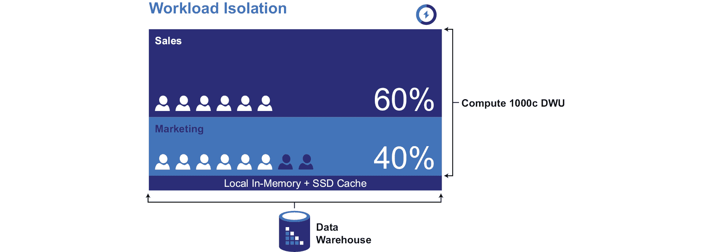

###### 图 18.1：工作负载隔离示例

你可以通过设置几个简单的阈值在集群中创建工作负载组。这些阈值会根据工作负载和集群的不同自动调整，但它们始终能确保用户运行工作负载时获得优质的体验。有关在 Azure Synapse Analytics 中配置工作负载隔离的更多信息，请参考[`techcommunity.microsoft.com/t5/data-architecture-blog/configuring-workload-isolation-in-azure-synapse-analytics/ba-p/1201739`](https://techcommunity.microsoft.com/t5/data-architecture-blog/configuring-workload-isolation-in-azure-synapse-analytics/ba-p/1201739)。

为了充分理解 Azure Synapse 的优势，我们首先来看看 Synapse 工作区和 Synapse Studio。

### Synapse 工作区和 Synapse Studio 介绍

Azure Synapse 的核心是工作区。工作区是数据仓库中构建分析解决方案的顶级资源。Synapse 工作区同时支持关系型和大数据处理。

Azure Synapse 提供一个统一的 Web UI，供数据准备、数据管理、数据仓库、大数据分析、商业智能（BI）和人工智能（AI）任务使用，这个界面被称为 Synapse Studio。与 Synapse 工作区一起，Synapse Studio 是数据工程师和数据科学家共享和协作分析解决方案的理想环境，如*图 18.2*所示：

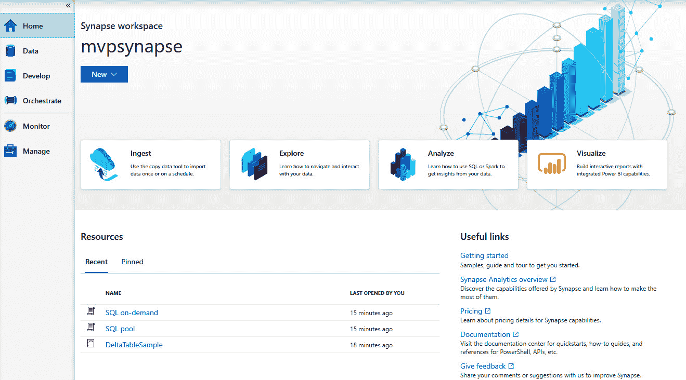

###### 图 18.2：Azure Synapse Studio 中的 Synapse 工作区

以下部分将重点介绍 Synapse 工作区和 Synapse Studio 的功能、关键特性、平台细节和最终用户服务：

**功能：**

+   一个快速、高度弹性且安全的数据仓库，具备行业领先的性能和安全性

+   使用 SQL 按需（无服务器）和 SQL 查询，能够通过熟悉的 T-SQL 语法来探索 Azure Data Lake 存储和数据仓库

+   Apache Spark 集成 Azure 机器学习

+   混合数据集成，旨在加速数据摄取和分析过程的操作化（摄取、准备、转换和服务）

+   与 Power BI 集成的商业报告生成和提供服务。

**关键特性：**

+   创建和操作数据摄取与编排的管道。

+   直接通过 Synapse Studio 探索 Azure Data Lake Storage 或数据仓库中的数据，以及任何外部连接到工作区的数据。

+   使用笔记本和 T-SQL 查询编辑器编写代码。

+   无需编写代码的数据转换工具，如果你不想自己编写代码。

+   监控、保护并管理你的工作区，无需离开环境。

+   面向整个分析解决方案的基于 Web 的开发体验。

+   Azure Synapse SQL 池中的备份和恢复功能允许创建恢复点，使得恢复或将数据仓库复制到先前状态变得更加简单。

+   通过 SQL 池在数 PB 的数据上并行运行 T-SQL 查询，以服务 BI 工具和应用程序。

+   按需 SQL 提供无服务器 SQL 查询，方便在 Azure Data Lake Storage 中进行数据探索和分析，无需任何基础设施的设置或维护。

+   满足从数据工程到数据科学的全方位分析需求，支持多种语言，如 Python、Scala、C#和 Spark SQL。

+   Spark 池简化了集群的复杂设置和维护，并简化了 Spark 应用程序的开发和 Spark 笔记本的使用。

+   提供 Spark 和 SQL 之间的深度集成，允许数据工程师在 Spark 中准备数据，将处理结果写入 SQL 池，并结合使用 Spark 和 SQL 进行数据工程和分析，内置支持 Azure Machine Learning。

+   高度可扩展的混合数据集成功能，通过自动化的数据管道加速数据摄取和操作化。

+   提供无摩擦的集成服务，统一的安全性、部署、监控和计费。

**平台**

+   支持配置计算和无服务器计算。配置计算的示例包括 SQL 计算和 Spark 计算。

+   配置的计算资源允许团队将计算资源分割，以便控制成本和使用情况，更好地与组织结构对齐。

+   另一方面，无服务器计算允许团队按需使用服务，而无需配置或管理任何底层基础设施。

+   Spark 和 SQL 引擎之间的深度集成。

在以下部分，我们将介绍 Azure Synapse 的其他功能，包括 Synapse 的 Apache Spark、Synapse SQL、按需 SQL、Synapse 管道和 Azure Synapse Link for Cosmos DB。

### Synapse 的 Apache Spark

对于需要 Apache Spark 的客户，Azure Synapse 通过 Azure Databricks 提供第一方支持，并由 Azure 完全管理。Apache Spark 的最新版本将自动提供给用户，并包含所有安全补丁。你可以快速创建带有你选择的语言的笔记本，如 Python、Scala、Spark SQL 和.NET for Spark。

如果您在 Azure Synapse Analytics 中使用 Spark，它将作为一种软件即服务（SaaS）提供。例如，您可以在不设置或管理自己的服务（如虚拟网络）的情况下使用 Spark。Azure Synapse Analytics 将为您处理底层基础设施。这使您能够立即在 Azure Synapse Analytics 环境中使用 Spark。

在接下来的部分中，我们将探讨 Synapse SQL。

### Synapse SQL

Synapse SQL 允许使用 T-SQL 查询和分析数据。有两种模型可供选择：

1.  完全配置的模型

1.  按需 SQL（无服务器）模型

**按需 SQL**

按需 SQL 提供无服务器 SQL 查询。这使得在 Azure 数据湖存储中更容易进行探索和数据分析，而无需任何设置或基础设施维护：

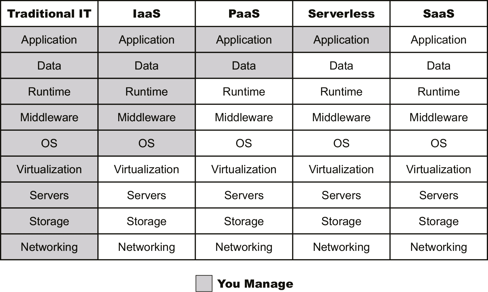

###### 表 18.1：不同基础设施的比较

**关键特性：**

+   分析师可以专注于分析数据，而无需担心管理任何基础设施。

+   客户可以受益于简单灵活的定价模型，因为他们只需为实际使用的部分付费。

+   它使用熟悉的 T-SQL 语言语法和市场上最好的 SQL 查询优化器。SQL 查询优化器是查询引擎背后的大脑。

+   随着需求的增长，您可以独立地扩展计算和存储资源。

+   通过元数据同步和本地连接器与 SQL Analytics Pool 和 Spark 无缝集成。

### Synapse 管道

Synapse 管道允许开发人员构建端到端的数据移动和数据处理工作流。Azure Synapse Analytics 使用**Azure 数据工厂**（**ADF**）技术提供数据集成功能。ADF 中的关键功能对于现代数据仓库管道至关重要，并且这些功能也在 Azure Synapse Analytics 中可用。所有这些功能都通过 Azure Synapse Analytics 工作区中的统一安全模型**基于角色的访问控制**（**RBAC**）进行封装。

*图 18.3* 展示了一个数据管道的示例以及直接集成在 Azure Synapse Analytics 环境中的 ADF 活动：

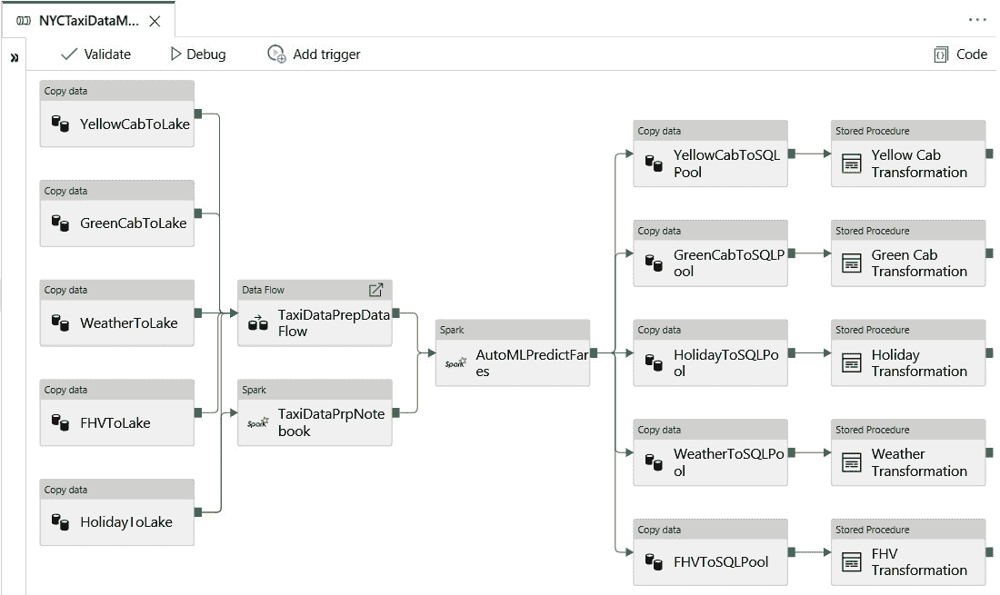

###### 图 18.3：Azure Synapse Analytics 中的数据管道

**关键特性：**

+   用于管理、安全、监控和元数据管理的集成平台服务。

+   Spark 与 SQL 之间的本地集成。使用一行代码从/向 SQL Analytics 读取和写入 Spark 数据。

+   可以创建一个 Spark 表并使用 SQL Analytics 即时查询，而无需定义模式。

+   "免密钥"环境。通过单点登录和 Azure Active Directory 透传，无需密钥或登录即可与**Azure 数据湖存储**（**ADLS**）/数据库进行交互。

在接下来的部分中，我们将介绍 Azure Synapse Link for Cosmos DB。

### Azure Synapse Link for Cosmos DB

Azure Synapse Link 是 HTAP 的云原生版本。它是 Azure Synapse 的扩展。正如我们之前所了解的，Azure Synapse 是一个用于对数据湖和数据仓库进行分析的单一托管服务，采用无服务器和预配计算方式。通过 Azure Synapse Link，这一覆盖面也可以扩展到操作性数据源。

Azure Synapse Link 消除了传统操作和分析系统中的瓶颈。Azure Synapse 通过在其所有数据服务中将计算与存储分离，使这一切成为可能。在事务处理方面，Cosmos DB 是一个高性能、地理复制的多模型数据库服务。在分析方面，Azure Synapse 提供无限的可扩展性。您可以独立地为事务和分析扩展资源。两者结合起来，使得云原生 HTAP 成为现实。一旦用户指明希望在 Cosmos DB 中提供的分析数据，该数据便会出现在 Synapse 中。它会自动将您希望分析的操作数据转化为面向分析的列式版本。因此，Cosmos DB 中对操作数据的任何更改都会持续更新到 Link 数据和 Synapse 中。

使用 Azure Synapse Link 的最大好处是，它消除了对计划性批处理或需要构建和维护操作管道的需求。

如前所述，Azure Synapse 是架构师在将现有遗留数据仓库解决方案迁移到现代企业分析解决方案时最常选择的平台。在下一节中，我们将讨论从现有遗留数据仓库解决方案迁移到 Azure Synapse Analytics 的常见架构考虑事项。

## 从现有遗留系统迁移到 Azure Synapse Analytics

如今，许多组织正在将其遗留数据仓库解决方案迁移到 Azure Synapse Analytics，以便获得 Azure Synapse 提供的高可用性、安全性、速度、可扩展性、成本节省和性能等好处。

对于使用遗留数据仓库系统（如 Netezza）的公司来说，情况更加严峻，因为 IBM 已宣布终止对 Netezza 的支持 ([`www.ibm.com/support/pages/end-support-dates-netezza-5200-netezza-8x50z-series-and-netezza-10000-series-appliances`](https://www.ibm.com/support/pages/end-support-dates-netezza-5200-netezza-8x50z-series-and-netezza-10000-series-appliances))。

许多年前，一些公司选择了 Netezza 来管理和分析大量数据。今天，随着技术的进步，基于云的数据仓库解决方案的好处远远超过了本地解决方案。Azure Synapse 是一个无限制的云分析服务，具有无与伦比的洞察时间，能够加速为企业提供商业智能、人工智能和智能应用程序。凭借其多集群和分离的计算与存储架构，Azure Synapse 可以以传统系统（如 Netezza）无法做到的方式即时扩展。

本节涵盖了规划、准备和执行将现有传统数据仓库系统成功迁移到 Azure Synapse Analytics 的架构考虑因素和高层次方法论。适当时，将给出一些具体示例并引用 Netezza。本章并不打算成为一个全面的逐步迁移手册，而是一个实用的概述，帮助你进行迁移规划和项目范围界定。

本章还识别了一些常见的迁移问题及其可能的解决方案。还提供了关于 Netezza 和 Azure Synapse Analytics 之间差异的技术细节。它们应该作为迁移计划的一部分加以考虑。

### 为什么你应该将传统数据仓库迁移到 Azure Synapse Analytics

通过迁移到 Azure Synapse Analytics，使用传统数据仓库系统的公司可以利用云技术的最新创新，并将基础设施维护和平台升级等任务委托给 Azure。

已经迁移到 Azure Synapse 的客户，已经获得了许多好处，包括以下内容。

**性能**

Azure Synapse Analytics 通过使用**大规模并行处理**（**MPP**）和自动内存缓存等技术，提供了最佳的关系数据库性能。如需更多信息，请查看 Azure Synapse Analytics 架构（[`docs.microsoft.com/azure/synapse-analytics/sql-data-warehouse/massively-parallel-processing-mpp-architecture`](https://docs.microsoft.com/azure/synapse-analytics/sql-data-warehouse/massively-parallel-processing-mpp-architecture)）。

**速度**

数据仓库是一个处理密集型的过程。它涉及数据摄取、数据转化、数据清洗、数据聚合、数据集成以及数据可视化和报告的生成。将数据从原始来源转移到数据仓库的许多过程是复杂且相互依赖的。单一的瓶颈可能会减缓整个流程，而数据量的突增则加大了对速度的需求。当数据的时效性至关重要时，Azure Synapse Analytics 满足了对快速处理的需求。

**提高的安全性和合规性**

Azure 是一个全球可用、高度可扩展、安全的云平台。它提供许多安全功能，包括 Azure Active Directory、RBAC、托管身份和托管私有端点。Azure Synapse Analytics 位于 Azure 生态系统内，继承了所有上述的好处。

**弹性和成本效率**

在数据仓库中，工作负载处理的需求可能会波动。有时，这些波动可能在峰值和谷值之间有很大差异。例如，假期季节时，销售数据量可能会突然激增。云的弹性使得 Azure Synapse 能够根据需求快速增加或减少其容量，而不会影响基础设施的可用性、稳定性、性能和安全性。最棒的是，您只需为实际使用量付费。

**托管基础设施**

消除数据中心管理和运营的开销，使公司能够将宝贵的资源重新分配到创造价值的地方，专注于使用数据仓库提供最佳的信息和洞察力。这降低了总体拥有成本，并提供了更好的运营费用控制。

**可扩展性**

数据仓库中的数据量通常随着时间的推移和历史数据的积累而增长。Azure Synapse Analytics 可以通过根据数据和工作负载的增加逐步添加资源来扩展以应对这种增长。

**节省成本**

运营本地遗留数据中心成本高昂（考虑到服务器和硬件、网络、物理空间、电力、冷却和人员成本）。这些费用可以通过 Azure Synapse Analytics 显著减少。由于计算和存储层的分离，Azure Synapse 提供了非常有吸引力的性价比。

Azure Synapse Analytics 为您提供真正的按需付费云可扩展性，随着数据或工作负载的增长，无需复杂的重新配置。

现在您已经了解了迁移到 Azure Synapse Analytics 的好处，我们将开始讨论迁移过程。

### 三步迁移过程

一个成功的数据迁移项目始于一个精心设计的计划。有效的计划考虑到需要考虑的众多组件，特别关注架构和数据准备。以下是三步迁移过程计划。

**准备工作**

+   定义要迁移的范围。

+   创建数据和迁移过程的清单。

+   定义数据模型的变化（如果有的话）。

+   定义源数据提取机制。

+   确定适用的 Azure（和第三方）工具和服务。

+   尽早对员工进行新平台的培训。

+   设置 Azure 目标平台。

**迁移**

+   从小规模、简单的项目开始。

+   尽可能进行自动化。

+   利用 Azure 内置的工具和功能来减少迁移工作量。

+   迁移表格和视图的元数据。

+   迁移需要维护的历史数据。

+   迁移或重构存储过程和业务流程。

+   迁移或重构 ETL/ELT 增量加载流程。

**迁移后**

+   监控并记录过程的所有阶段。

+   利用获得的经验为未来的迁移构建模板。

+   如有需要，重新设计数据模型。

+   测试应用程序和查询工具。

+   基准测试和优化查询性能。

接下来，我们将讨论这两种迁移策略。

### 两种迁移策略

架构师应通过评估现有数据仓库来开始迁移规划，以确定哪种迁移策略最适合他们的情况。需要考虑两种迁移策略。

**提升和迁移策略**

对于“提升和迁移”策略，现有数据模型不做更改地迁移到新的 Azure Synapse Analytics 平台。这种做法旨在通过将变更的范围缩小到最低限度，最大程度地减少迁移的风险和所需时间。

“提升和迁移”是一种适用于遗留数据仓库环境（如 Netezza）的良好策略，特别是在以下任一条件成立时：

+   一个单独的数据集市需要迁移。

+   数据已经采用了良好的星型或雪花型架构。

+   移动到现代云环境面临着迫切的时间和成本压力。

**重新设计策略**

在遗留数据仓库经过一段时间的演变后，可能需要重新设计，以维持最佳的性能水平或支持新类型的数据。这可能包括改变底层数据模型。

为了最小化风险，建议首先使用“提升和迁移”策略进行迁移，然后逐步在 Azure Synapse Analytics 上使用重新设计策略现代化数据仓库数据模型。完全改变数据模型会增加风险，因为这会影响源到数据仓库的 ETL 作业以及下游的数据集市。

在下一节中，我们将提供一些关于如何在迁移前减少现有遗留数据仓库复杂性的建议。

### 在迁移前减少现有遗留数据仓库的复杂性

在上一节中，我们介绍了两种迁移策略。作为最佳实践，在初步评估步骤中，务必留意任何简化现有数据仓库的方法并记录下来。目标是在迁移前减少现有遗留数据仓库系统的复杂性，以便简化迁移过程。

这里是一些关于如何减少现有遗留数据仓库复杂性的建议：

+   **迁移前删除并归档未使用的表**：避免迁移不再使用的数据。这将有助于减少迁移的数据总量。

+   **将物理数据集市转换为虚拟数据集市**：最大限度地减少需要迁移的内容，降低总体拥有成本，提高灵活性。

在下一节中，我们将详细讨论为什么你应该考虑将物理数据集市转换为虚拟数据集市。

### 将物理数据集市转换为虚拟数据集市

在迁移遗留数据仓库之前，考虑将当前的物理数据集市转换为虚拟数据集市。通过使用虚拟数据集市，您可以消除物理数据存储和数据集市的 ETL 作业，而不会在迁移前失去任何功能。这里的目标是减少要迁移的数据存储数量，减少数据副本，降低总拥有成本，并提高灵活性。为此，您需要在迁移数据仓库之前，将物理数据集市转换为虚拟数据集市。我们可以将其视为迁移前的数据仓库现代化步骤。

**物理数据集市的缺点**

+   相同数据的多个副本

+   更高的总拥有成本

+   难以更改，因为 ETL 作业会受到影响

**虚拟数据集市的优点**

+   简化数据仓库架构

+   无需存储数据副本

+   更高的灵活性

+   更低的总拥有成本

+   使用下推优化技术，利用 Azure Synapse Analytics 的强大功能

+   易于变更

+   容易隐藏敏感数据

在下一节中，我们将讨论如何将现有数据仓库模式迁移到 Azure Synapse Analytics。

### 将现有数据仓库模式迁移到 Azure Synapse Analytics

迁移现有遗留数据仓库的模式涉及到现有暂存表、遗留数据仓库和相关数据集市模式的迁移。

为了帮助您理解模式迁移的规模和范围，我们建议您先创建现有遗留数据仓库和数据集市的清单。

以下是帮助您收集必要信息的清单：

+   行数

+   暂存、数据仓库和数据集市的数据大小：表和索引

+   数据压缩比

+   当前硬件配置

+   表（包括分区）：识别小的维度表

+   数据类型

+   视图

+   索引

+   对象依赖

+   对象使用情况

+   功能：包括现成的函数和**用户自定义函数**（**UDFs**）

+   存储过程

+   可扩展性要求

+   增长预测

+   工作负载要求：并发用户

完成清单后，您可以决定要迁移哪个模式。基本上，对于遗留数据仓库模式迁移，您有四个选择：

1.  一次迁移一个数据集市：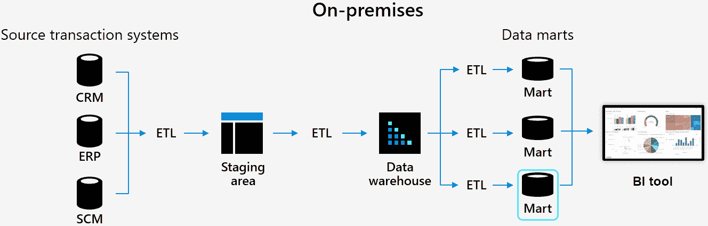

    ###### 图 18.4：一次迁移一个数据集市

1.  一次性迁移所有数据集市，然后是数据仓库：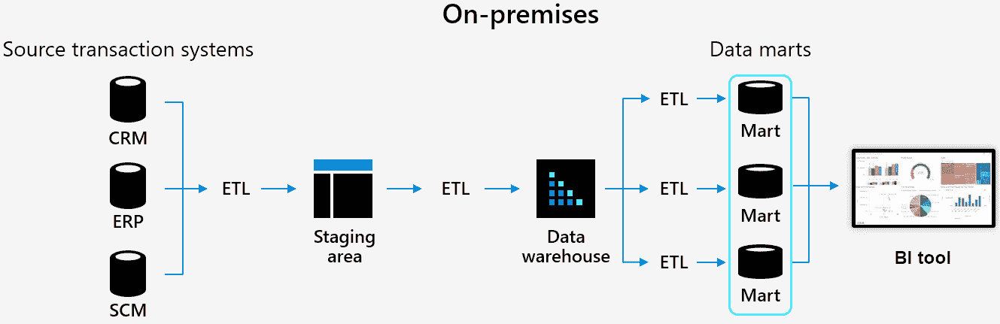

    ###### 图 18.5：一次迁移所有数据集市，然后是数据仓库

1.  同时迁移数据仓库和暂存区：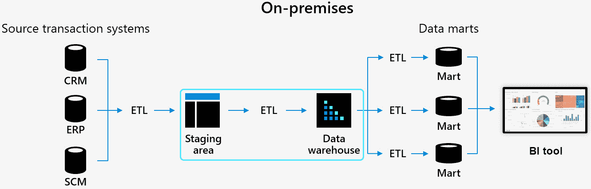

    ###### 图 18.6：同时迁移数据仓库和暂存区

1.  一次性迁移所有内容：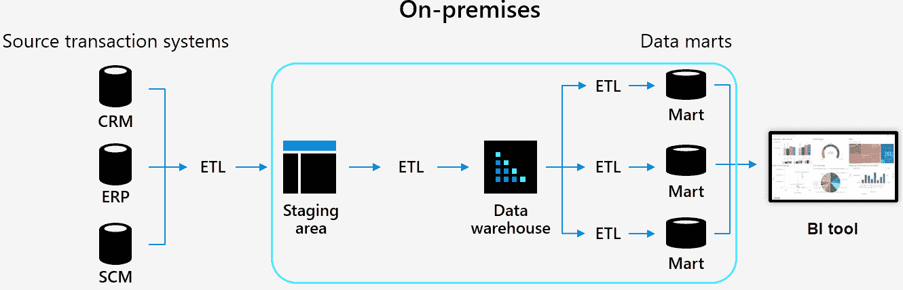

###### 图 18.7：一次性迁移所有内容

在选择迁移选项时，请记住目标是实现一个物理数据库设计，该设计在性能上能够匹配或超过您当前遗留数据仓库系统的性能，并且最好以更低的成本实现。

总结一下，以下是一些关于模式迁移的建议：

+   避免迁移不必要的对象或过程。

+   考虑使用虚拟数据集市，以减少或消除物理数据集市的数量。

+   尽可能实现自动化。在迁移到 Azure Synapse 时，应考虑实施 DataOps。

+   使用遗留数据仓库系统中的系统目录表元数据来生成 Azure Synapse Analytics 的 **数据定义语言**（**DDL**）。

+   在 Azure Synapse Analytics 上执行任何必要的数据模型更改或数据映射优化。

在下一节中，我们将讨论如何将历史数据从遗留数据仓库迁移到 Azure Synapse Analytics。

### 将历史数据从遗留数据仓库迁移到 Azure Synapse Analytics

一旦确定了模式迁移的范围，我们就可以开始决定如何迁移历史数据。

迁移历史数据的步骤如下：

1.  在 Azure Synapse Analytics 上创建目标表。

1.  迁移现有的历史数据。

1.  根据需要迁移功能和存储过程。

1.  迁移增量加载（ETL/ELT）暂存和处理即将到来的数据。

1.  根据需要应用任何性能调优选项。

*表 18.2* 概述了四种数据迁移选项及其优缺点：

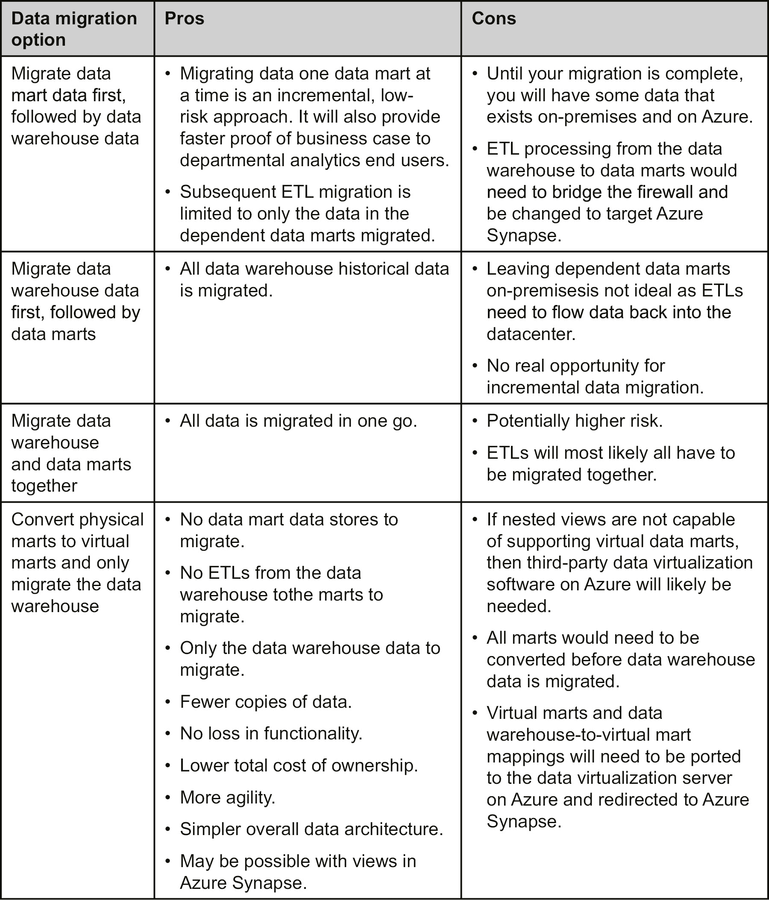

###### 表 18.2：数据迁移选项及其优缺点

在下一节中，我们将讨论如何将现有的 ETL 过程迁移到 Azure Synapse Analytics。

### 将现有 ETL 过程迁移到 Azure Synapse Analytics

有多种选项可用于将现有的 ETL 过程迁移到 Azure Synapse Analytics。*表 18.3* 概述了一些基于现有 ETL 作业构建方式的 ETL 迁移选项：

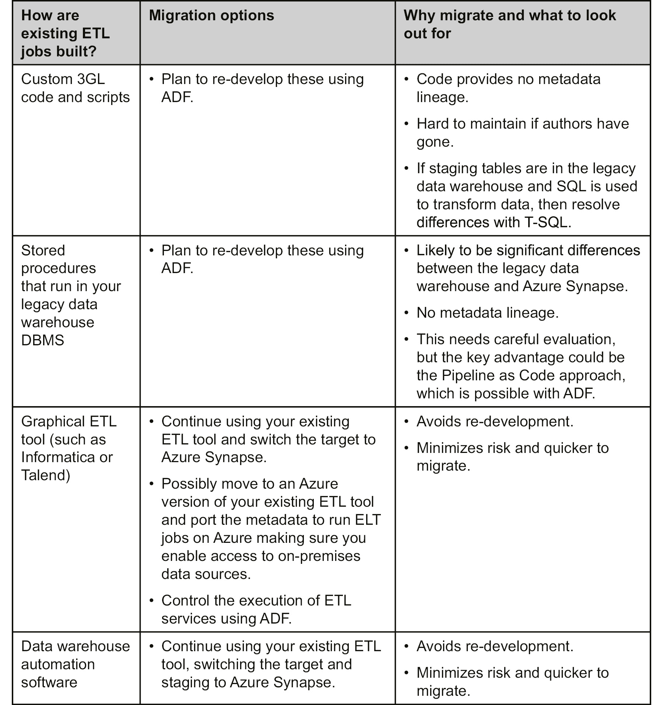

###### 表 18.3：ETL 迁移选项

在下一节中，我们将讨论如何使用 ADF 重新开发可扩展的 ETL 过程。

### 使用 ADF 重新开发可扩展的 ETL 过程

处理现有遗留 ETL 过程的另一种选择是通过使用 ADF 重新开发它们。ADF 是 Azure 的数据集成服务，用于创建数据驱动的工作流（称为管道），以协调和自动化数据移动和数据转换。您可以使用 ADF 创建并安排管道，从不同的数据存储中提取数据。ADF 可以通过使用计算服务（如 Spark、Azure 机器学习、Azure HDInsight Hadoop 和 Azure 数据湖分析）来处理和转换数据：

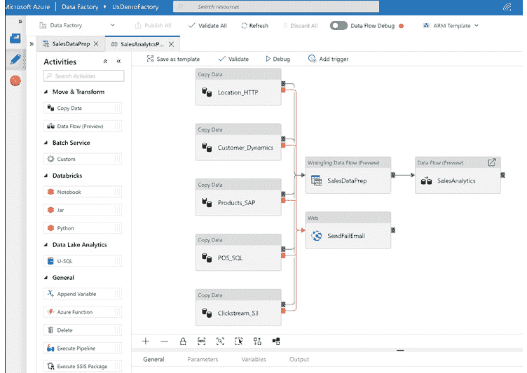

###### 图 18.8：使用 ADF 重新开发可扩展的 ETL 过程

下一节将提供一些关于迁移查询、BI 报告、仪表板和其他可视化的建议。

### 关于迁移查询、BI 报告、仪表板和其他可视化的建议

如果旧版系统使用标准 SQL，从旧版数据仓库迁移查询、BI 报告、仪表板和其他可视化到 Azure Synapse Analytics 是直接的。

然而，通常情况下并非如此。在这种情况下，必须采取不同的策略：

+   确定优先迁移的报告。

+   使用使用情况统计数据来识别从未使用的报告。

+   避免迁移任何不再使用的内容。

+   一旦你列出了要迁移的报告、它们的优先级以及要跳过的未使用报告，请与相关方确认该列表。

+   对于正在迁移的报告，及早识别不兼容问题，以评估迁移工作量。

+   考虑使用数据虚拟化，以保护 BI 工具和应用程序免受在迁移过程中可能发生的数据仓库和/或数据集市数据模型结构变化的影响。

### 常见迁移问题及解决方案

在迁移过程中，你可能会遇到一些需要克服的问题。在本节中，我们将突出一些常见问题，并为你提供可以实施的解决方案。

**问题 #1：不支持的数据类型及解决方法**

*表 18.4* 显示了旧版数据仓库系统中不支持的数据类型，以及 Azure Synapse Analytics 的适用解决方法：

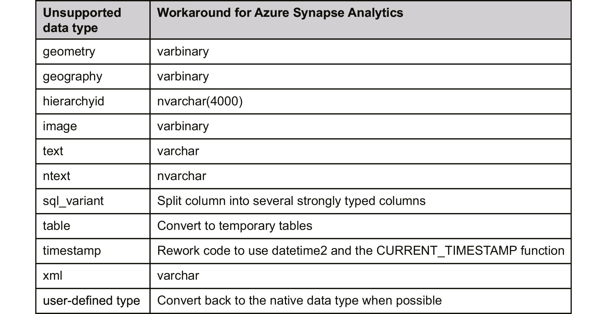

###### 表 18.4：Azure Synapse Analytics 中不支持的数据类型及适用的解决方法

**问题 #2：Netezza 和 Azure Synapse 之间的数据类型差异**

*表 18.5* 将 Netezza 数据类型映射到其 Azure Synapse 对应的数据类型：

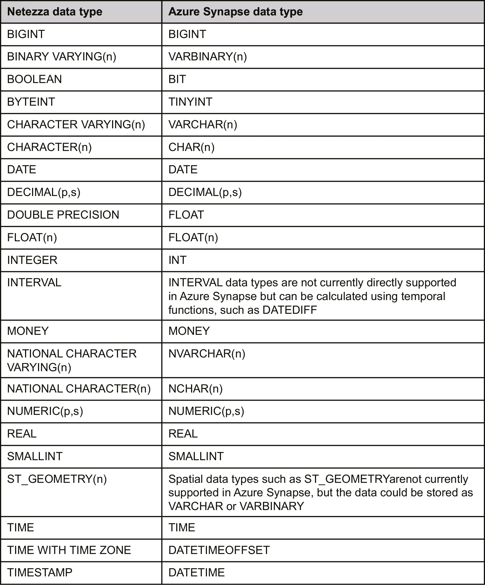

###### 表 18.5：Netezza 数据类型及其 Azure Synapse 对应类型

**问题 #3：完整性约束差异**

密切关注你的旧版数据仓库或数据集市与 Azure Synapse Analytics 之间的完整性约束差异。在*图 18.9*中，左侧表示带有主键和外键约束的旧版数据仓库系统，右侧是新的 Azure Synapse Analytics 环境：

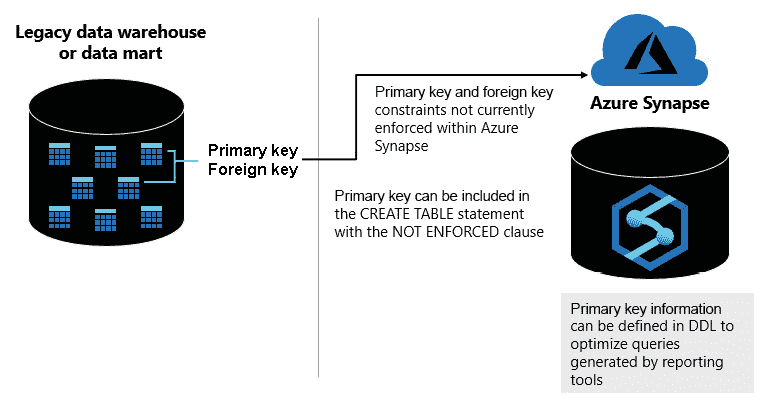

###### 图 18.9：完整性约束差异

下一节将全面介绍在从旧版数据仓库迁移到 Azure Synapse Analytics 过程中如何解决其他常见的 SQL 不兼容问题。

## 常见 SQL 不兼容问题及解决方案

本节将提供有关传统数据仓库系统与 Azure Synapse Analytics 之间常见 SQL 不兼容性及其解决方案的技术细节。本节将解释并比较这些差异，并通过一个快速参考表提供解决方案，供您在开始迁移项目时参考。

我们将涵盖的主题如下：

+   SQL **数据定义语言** (**DDL**) 差异与解决方案

+   SQL **数据操作语言** (**DML**) 差异与解决方案

+   SQL **数据控制语言** (**DCL**) 差异与解决方案

+   扩展 SQL 差异与解决方法

### SQL DDL 差异与解决方案

在本节中，我们将讨论传统数据仓库系统与 Azure Synapse Analytics 之间 SQL DDL 的差异与解决方案。

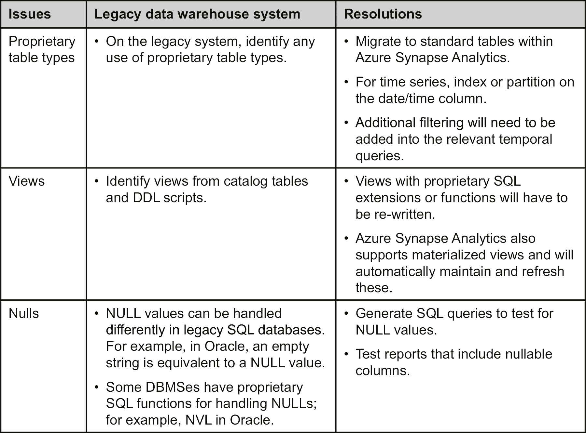

###### 表 18.6：传统系统与 Azure Synapse 之间的 SQL DDL 差异

### SQL DML 差异与解决方案

在本节中，我们将讨论传统数据仓库系统与 Azure Synapse Analytics 之间 SQL DML 的差异及其解决方案：

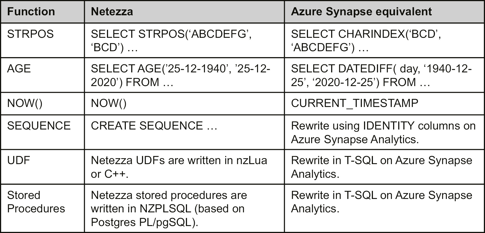

###### 表 18.7：Netezza 与 Azure Synapse 之间的 SQL DML 差异

接下来，我们将讨论传统数据仓库系统与 Azure Synapse Analytics 之间 SQL DCL 的差异与解决方案。

### SQL DCL 差异与解决方案

在本节中，我们将讨论传统数据仓库系统与 Azure Synapse Analytics 之间 SQL DCL 的差异与解决方案。Netezza 支持两类访问权限：管理权限和对象权限。*表 18.8* 映射了 Netezza 访问权限及其对应的 Azure Synapse 权限，供快速参考。

**将 Netezza 管理权限映射到 Azure Synapse 对应权限**

*表 18.8* 映射了 Netezza 管理权限与 Azure Synapse 对应权限：

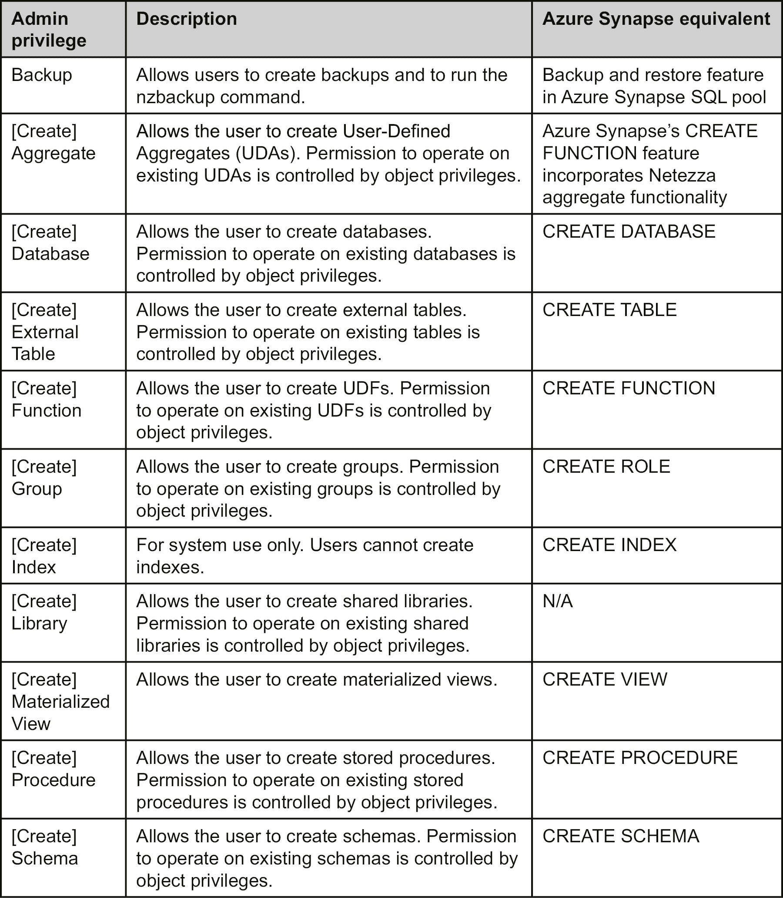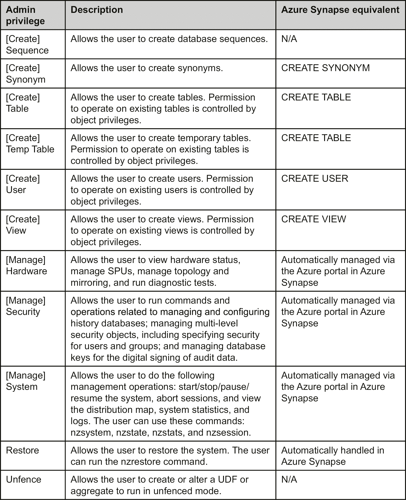

###### 表 18.8：Netezza 管理权限及其 Azure Synapse 对应权限

**将 Netezza 对象权限映射到其 Azure Synapse 对应权限**

*表 18.9* 映射了 Netezza 对象权限与 Azure Synapse 对应权限，供快速参考：

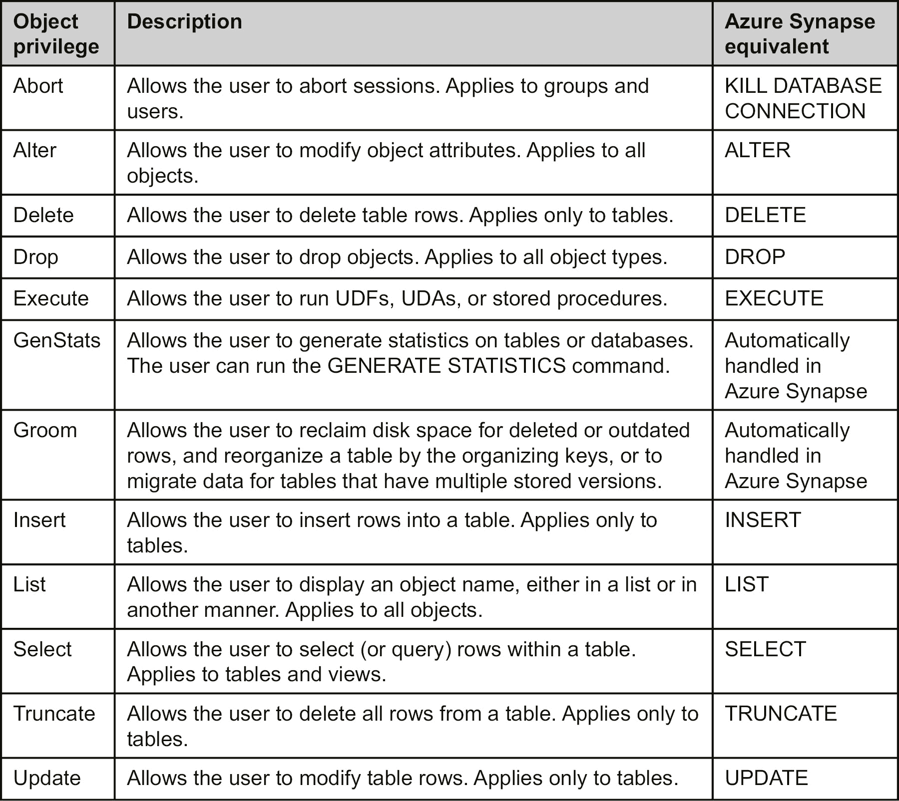

###### 表 18.9：Netezza 对象权限及其 Azure Synapse 对应权限

### 扩展 SQL 差异与解决方法

*表 18.10* 描述了迁移到 Azure Synapse Analytics 时的扩展 SQL 差异和可能的解决方法：

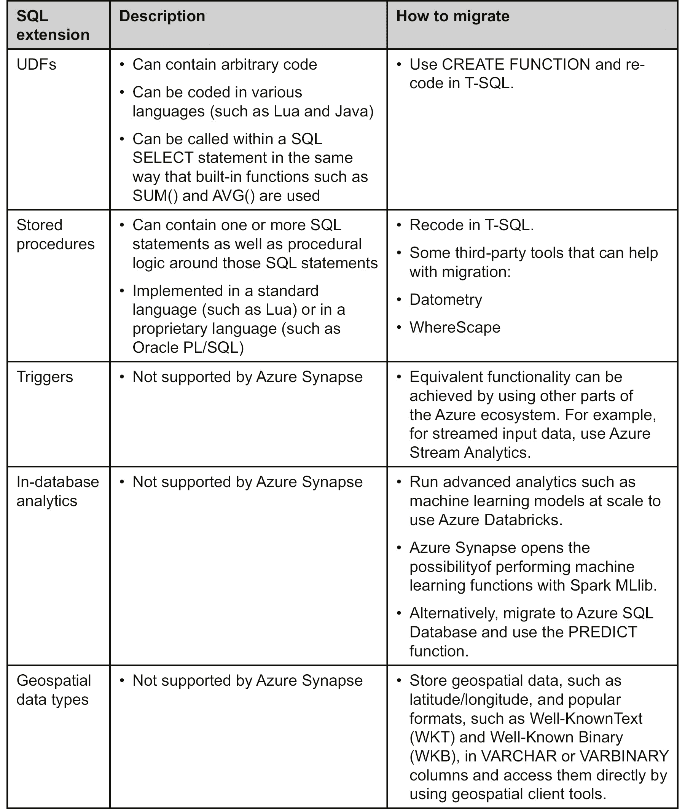

###### 表 18.10：扩展 SQL 差异与解决方法

在本节中，我们讨论了架构师在迁移项目中可能遇到的常见迁移问题及其解决方案。在下一节中，我们将查看架构师应关注的安全性考虑因素。

## 安全性考虑因素

保护和安全管理您的数据资产在任何数据仓库系统中都是至关重要的。在规划数据仓库迁移项目时，必须考虑安全性、用户访问管理、备份和恢复等因素。例如，数据加密可能是行业和政府法规（如 HIPAA、PCI 和 FedRAMP）以及非监管行业中的强制要求。

Azure 提供许多标准功能，这些功能在传统的数据仓库产品中通常需要自定义构建。Azure Synapse 标准支持数据静态加密和数据传输加密。

### 数据静态加密

+   **透明数据加密**（**TDE**）可以启用，以动态加密和解密 Azure Synapse 数据、日志及相关备份。

+   Azure 数据存储还可以自动加密非数据库数据。

### 数据传输中的加密

所有连接到 Azure Synapse Analytics 的连接默认都使用行业标准协议，如 TLS 和 SSH 进行加密。

此外，**动态数据屏蔽**（**DDM**）可以基于数据屏蔽规则，为特定类别的用户混淆数据。

作为最佳实践，如果您的传统数据仓库包含复杂的权限层次结构、用户和角色，请考虑在迁移过程中使用自动化技术。您可以使用传统系统中的现有元数据生成必要的 SQL，以便在 Azure Synapse Analytics 上迁移用户、组和权限。

在本章的最后一节，我们将回顾一些架构师可以选择的工具，帮助从传统数据仓库系统迁移到 Azure Synapse Analytics。

## 帮助迁移到 Azure Synapse Analytics 的工具

现在我们已经讨论了规划与准备工作以及迁移过程的概述，接下来我们来看看你可以用来将传统数据仓库迁移到 Azure Synapse Analytics 的工具。我们将讨论以下工具：

+   ADF

+   Azure 数据仓库迁移工具

+   微软物理数据传输服务

+   微软数据导入服务

让我们开始吧。

### ADF

ADF 是一项完全托管、按需付费的混合数据集成服务，用于云规模的 ETL 处理。它提供以下功能：

+   在内存中并行处理和分析数据，以实现规模化并最大化吞吐量

+   创建数据仓库迁移管道，协调和自动化数据迁移、数据转换和数据加载到 Azure Synapse Analytics 中

+   也可以通过将数据导入到 Azure Data Lake、按规模处理和分析数据，并将数据加载到数据仓库中，来现代化您的数据仓库

+   支持基于角色的用户界面，用于 IT 专业人员的数据流映射，以及业务用户的自助数据处理。

+   可以连接多个跨数据中心、云和 SaaS 应用程序的数据存储

+   提供 90 多个原生构建且无需维护的连接器可用（[`azure.microsoft.com/services/data-factory`](https://azure.microsoft.com/services/data-factory)）

+   可以在同一管道中混合和匹配数据处理和映射数据流，以大规模准备数据。

+   ADF 编排可以控制数据仓库迁移到 Azure Synapse Analytics。

+   可以执行 SSIS ETL 包

### Azure 数据仓库迁移工具

Azure 数据仓库迁移工具可以将数据从本地 SQL Server 数据仓库迁移到 Azure Synapse。它提供以下功能：

+   使用向导式方法执行从本地 SQL Server 数据仓库的模式和数据的“提升和转移”迁移。

+   您可以选择包含要导出到 Azure Synapse 的表格的本地数据库。然后，您可以选择要迁移的表格并迁移模式。

+   自动生成创建 Azure Synapse 中等效空数据库和表所需的 T-SQL 代码。一旦提供了 Azure Synapse 的连接详细信息，您可以运行生成的 T-SQL 代码迁移模式。

+   创建模式后，您可以使用该工具迁移数据。此操作会将数据从本地 SQL Server 数据仓库导出，并生成**批量复制程序**（**BCP**）命令，将数据加载到 Azure Synapse 中。

### 用于物理数据传输的 Microsoft 服务

在本节中，我们将介绍常用的 Microsoft 服务，这些服务可用于物理数据传输，包括 Azure ExpressRoute、AzCopy 和 Azure Databox。

**Azure ExpressRoute**

Azure ExpressRoute 允许您在数据中心与 Azure 之间建立私人连接，而无需通过公共互联网。它提供以下功能：

+   带宽高达 100 Gbps

+   低延迟

+   直接连接到您的**广域网**（**WAN**）

+   私有连接到 Azure

+   提高速度和可靠性

**AzCopy**

AzCopy 是一个命令行工具，用于将文件和 Blob 复制到/从存储帐户。它提供以下功能：

+   能够通过互联网将数据复制到/从 Azure。

+   将 AzCopy 与所需的 ExpressRoute 带宽结合使用，可能是数据传输到 Azure Synapse 的最佳解决方案。

**Azure Data Box**

Azure Data Box 允许您快速、可靠且具有成本效益地将大量数据传输到 Azure。它提供以下功能：

+   能够传输大量数据（数十 TB 到数百 TB）

+   没有网络连接限制

+   非常适合一次性迁移和初始大批量传输

### 用于数据摄取的 Microsoft 服务

在本节中，我们将介绍常用的 Microsoft 服务，这些服务可用于数据摄取，包括：

+   PolyBase

+   BCP

+   SqlBulkCopy API

+   标准 SQL

**PolyBase**（**推荐方法**）

PolyBase 提供了最快速且可扩展的大数据批量加载到 Azure Synapse Analytics 的方式。它提供了以下功能：

+   使用并行加载以提供最快的吞吐量

+   可以从 Azure Blob 存储中的平面文件或通过连接器从外部数据源读取

+   与 ADF 紧密集成

+   使用 CREATE TABLE AS 或 INSERT … SELECT

+   可以将临时表定义为 HEAP 类型以加快加载速度

+   支持最多 1 MB 长度的行

**BCP**

BCP 可用于从任何 SQL Server 环境（包括 Azure Synapse Analytics）导入和导出数据。它提供了以下功能：

+   支持长度超过 1 MB 的行

+   最初为早期版本的 Microsoft SQL Server 开发

请参考[`docs.microsoft.com/sql/tools/bcp-utility`](https://docs.microsoft.com/sql/tools/bcp-utility)了解有关 BCP 工具的更多信息。

**SqlBulkCopy API**

SqlBulkCopy API 是 BCP 功能的 API 等效版本。它提供了以下功能：

+   允许通过编程方式实现加载过程

+   能够批量加载 SQL Server 表格，数据来自选定的来源

请参考[`docs.microsoft.com/dotnet/api/system.data.sqlclient.sqlbulkcopy`](https://docs.microsoft.com/dotnet/api/system.data.sqlclient.sqlbulkcopy)了解有关此 API 的更多信息。

**标准 SQL 支持**

Azure Synapse Analytics 支持标准 SQL，包括以下功能：

+   将单独的行或`SELECT`语句的结果加载到数据仓库表中。

+   使用`INSERT … SELECT`语句通过 PolyBase 从外部数据源提取数据，并批量插入到数据仓库表中。

本节提供了规划、准备和执行现有遗留数据仓库系统成功迁移到 Azure Synapse Analytics 的架构考虑和高层次方法论。它包含了许多信息，你可以在迁移项目过程中作为参考。

## 总结

Azure Synapse Analytics 是一个无限制的分析服务，具有无与伦比的洞察力交付时间，能够加速企业 BI、AI 和智能应用的交付。通过将现有的遗留数据仓库迁移到 Azure Synapse Analytics，你将获得许多好处，包括性能、速度、提高的安全性和合规性、弹性、托管基础设施、可扩展性以及成本节约。

通过 Azure Synapse，各种技能水平的数据专业人员可以轻松协作、管理和分析他们最重要的数据——所有操作都在同一服务内进行。从与强大且可信的 SQL 引擎集成的 Apache Spark，到无代码的数据集成和管理，Azure Synapse 为每一位数据专业人员打造。

本章提供了架构考虑和高层次的方法论，以帮助准备和执行将现有遗留数据仓库系统迁移到 Azure Synapse Analytics 的工作。

成功的数据迁移项目始于一个精心设计的计划。一个有效的计划需要考虑多个组件，特别关注架构和数据准备。

成功迁移到 Azure Synapse 后，您可以在丰富的 Azure 分析生态系统中探索更多 Microsoft 技术，进一步现代化您的数据仓库架构。

以下是一些值得思考的想法：

+   将您的暂存区域和 ELT 处理卸载到 Azure Data Lake 和 ADF。

+   一次构建受信任的数据产品，采用统一的数据模型格式，并且可以在任何地方使用——不仅仅是在数据仓库中。

+   通过使用 ADF 映射和数据清洗流，实现业务和 IT 之间的数据准备管道的协作开发。

+   在 ADF 中构建分析管道，以批处理和实时分析数据。

+   构建并部署机器学习模型，为您已有的知识增加更多洞察。

+   将您的数据仓库与实时流数据集成。

+   通过使用 PolyBase 创建逻辑数据仓库，简化对多个 Azure 分析数据存储中数据和洞察的访问。

在下一章中，您将详细了解 Azure 认知服务，重点介绍以智能为核心引擎的解决方案架构。
